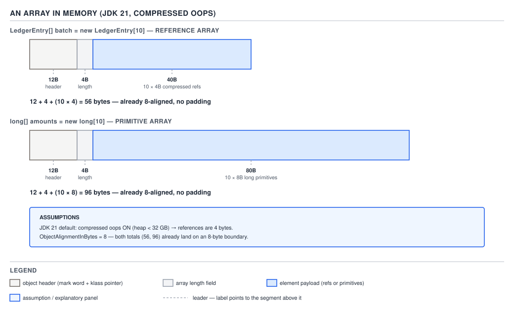

# 03 Java Core — Array memory layout, the length ceiling, and bounds checking — BASICS (§1.22, 1.22.11–1.22.13)

**Target version: Java 21 LTS.** | **Part 1 of 5** | [Index](../00-index.md)
Previous: [The `Arrays` utilities and `System.arraycopy`](01b-array-utilities-and-arraycopy.md) · Next: [Varargs, and choosing an array](01d-varargs-and-choosing-arrays.md)

This file answers three questions that `01-basics.md` deliberately leaves open: how many bytes does an array actually cost, how big can one legally get, and what stands between every `amounts[i]` and a wild memory read. It owns the header-and-length byte arithmetic, the three distinct "maximum array length" numbers and why they disagree, and the bounds check as a language guarantee plus the JIT optimisation that can remove its cost without removing its safety. It hands off array covariance and the `aastore` store-time check to `01a-covariance-and-mutability.md`, the `java.util.Arrays` surface to `01b-array-utilities-and-arraycopy.md`, and varargs allocation arithmetic to `01d-varargs-and-choosing-arrays.md`.

## 1. Array memory layout: header, length, elements, padding (1.22.11)

Picture an array's memory as four regions laid end to end, in this fixed order, with nothing free-floating between them: an **object header**, a **length field**, the **elements** packed with zero gap between consecutive elements, then **padding** out to the next 8-byte boundary if the previous three regions did not already land on one. Two numbers decide the whole layout: the header size (a JVM-wide constant) and the element width (a per-component-type constant, and for reference elements, one that depends on a JVM flag). Everything else — the total size, whether there is padding, how `boolean[]` differs from `byte[]` despite both being one byte logically — falls out of those two numbers plus the array's length.

### Why it exists

An array needs to answer three questions at runtime with no help from `javac`: what type of elements does it hold (for `arraylength`-adjacent bounds checks, for `aastore`'s store check in `01a-covariance-and-mutability.md`, and for `instanceof`), how many elements does it have, and how do you get to element `i` in constant time. A header that identifies the runtime type answers the first, a length field placed directly in the header answers the second, and elements packed contiguously with a fixed stride answers the third — `arrayref + headerSize + lengthFieldSize + i * elementWidth` is the entire address computation, no pointer chasing required. The alternative — a separate length object, or elements stored as a linked structure — would turn `O(1)` element access into something slower and would cost an extra indirection on every single array read in the program, which is not a tradeoff any JVM has been willing to make.

### The mechanism

**State the assumptions, because every number below depends on them.** This machine's JDK 21.0.7 has `UseCompressedOops = true` (confirmed via `$J21/bin/java -XX:+PrintFlagsFinal -version`, reported as `{product lp64_product} {ergonomic}` — ergonomic means the JVM chose it automatically because the heap is under the 32 GB threshold where compressed oops stop paying for themselves) and `ObjectAlignmentInBytes = 8` (also confirmed, same command). **`UseCompactObjectHeaders` does not exist on JDK 21** — that flag is a later JEP's territory, not this baseline's, so there is no hedging to do here. The object header on a 64-bit HotSpot with compressed oops on is **12 bytes**: an 8-byte mark word (identity hash, GC age bits, lock state — owned by `../objects-equality-and-lifecycle/04-internals-hashcode-and-identity.md`) plus a 4-byte compressed class word (a narrowed pointer to the `Klass` that describes the array's runtime type, e.g. `[Ljava.lang.Object;` or `[J`). An array header additionally carries a **4-byte length field** immediately after the class word — this is why array headers are conventionally quoted as "12 + 4" rather than folded into one number: the 12 bytes are the ordinary object header every object gets, and the extra 4 is array-specific.

`[NUM]` Two worked cases, matching the figure below digit for digit. First, a batch of ten reference elements — `LedgerEntry[] batch = new LedgerEntry[10]`, where each `LedgerEntry` reference compresses to 4 bytes under `UseCompressedOops`:

```
12 (mark word 8 + compressed class word 4)   header
+ 4                                            length field
+ 10 × 4                                       ten compressed references
= 16 + 40
= 56 bytes
```

56 is already a multiple of 8, so no padding is added. Second, ten primitive `long` elements at 8 bytes each — `long[] amounts = new long[10]`:

```
12 + 4                                        header + length
+ 10 × 8                                      ten longs
= 16 + 80
= 96 bytes
```

96 is also already aligned. Now the case that makes the padding rule do actual work: a `byte[5]` is `12 + 4 + 5 × 1 = 21` bytes, and 21 is not a multiple of 8. HotSpot rounds up to the next multiple of `ObjectAlignmentInBytes`, which is `ceil(21 / 8) * 8 = 24`. Compare a `long[3]`, which needs no rounding: `12 + 4 + 3 × 8 = 40`, and 40 is already a multiple of 8. The rule is only visible when the raw total lands off a boundary — most `long[]` and `double[]` arrays of any length never need it, because 8-byte elements keep every partial sum a multiple of 8, while `byte[]`, `boolean[]`, `char[]`, and `short[]` arrays frequently do.



**D-058** — the figure draws the two worked cases to scale: `LedgerEntry[] batch = new LedgerEntry[10]` as 12-byte header + 4-byte length + ten 4-byte compressed references, each region labelled, totalling **56 bytes**; and beside it `long[] amounts = new long[10]` as the same 16-byte header-and-length prefix followed by ten 8-byte long slots, totalling **96 bytes**. Look at how the reference array's element region is exactly half the width of the `long` array's for the same count of ten — that ratio is the compressed-oops story in one picture.

```java
package quizstakes.arrays;

import java.math.BigDecimal;
import java.util.UUID;

record CashEntry(UUID id, Money amount) {}
record Money(BigDecimal amount) {}

final class LayoutDemo {

    // 56 bytes: 12 header + 4 length + 10 * 4 compressed refs, no padding.
    static CashEntry[] tenReferenceSlots() {
        return new CashEntry[10];
    }

    // 96 bytes: 12 header + 4 length + 10 * 8 longs, no padding.
    static long[] tenLongSlots() {
        return new long[10];
    }

    // 24 bytes: 12 header + 4 length + 5 * 1 byte = 21, padded up to 24.
    static byte[] fivePaddedBytes() {
        return new byte[5];
    }
}
```

**Insight:** `boolean[]` costs one full byte per element, not one bit — HotSpot never bit-packs a `boolean[]`, because doing so would make `boolean[]` element access a read-modify-write instead of a plain load, defeating the entire point of an array being constant-time and side-effect-free to index. A `boolean[1000]` is 1,000 bytes of element storage, not 125.

If compressed oops were off — the JDK 21 default flips above a 32 GB heap, or under an explicit `-XX:-UseCompressedOops` — the header grows to **16 bytes** (an 8-byte mark word plus an 8-byte *uncompressed* class pointer) and each reference element widens to **8 bytes**; quote this variant, not the compressed one, if an interviewer specifies a large-heap JVM.

| Component type (length 10) | Element width | Elements bytes | Header + length | Raw total | Padded total |
|---|---|---|---|---|---|
| `boolean[]` | 1 | 10 | 16 | 26 | 32 |
| `byte[]` | 1 | 10 | 16 | 26 | 32 |
| `char[]` | 2 | 20 | 16 | 36 | 40 |
| `short[]` | 2 | 20 | 16 | 36 | 40 |
| `int[]` | 4 | 40 | 16 | 56 | 56 |
| `float[]` | 4 | 40 | 16 | 56 | 56 |
| `long[]` | 8 | 80 | 16 | 96 | 96 |
| `double[]` | 8 | 80 | 16 | 96 | 96 |
| `LedgerEntry[]` (compressed) | 4 | 40 | 16 | 56 | 56 |

**Derivation, not measurement:** the table above is arithmetic from the documented header size, element widths, and `ObjectAlignmentInBytes`, not a per-object size a profiler reported — JOL (Java Object Layout) is not installed on this machine, so no `GraphLayout.parseInstance(array).toPrintable()` output is available to cross-check it against. If you have JOL on your own machine, that is the tool that turns this derivation into a measurement.

The QuizStakes payoff: the ledger writes **~19.8M entries/day** at **~180 bytes/row** (payload, not array overhead — a fixed-format row, not a Java array). The overhead argument is about *how you batch* those entries in memory, not the row format itself. One `long[1000]` used as a batch buffer costs `12 + 4 + 1000 × 8 = 8,016` bytes total — 16 bytes of overhead against 8,000 bytes of payload, under 0.2%. One thousand separate `long[1]` arrays doing the same job cost `1000 × (12 + 4 + 1 × 8) = 1000 × 24 = 24,000` bytes — the same 8,000 bytes of payload now sits inside 16,000 bytes of pure header-and-length overhead, triple the total size for identical data. That is the arithmetic behind `01-basics.md`'s jagged-array cost note: a `long[3][4]` costs **four objects** (one outer array of references plus three row arrays), so `12+4+3×4 = 28`→padded `32` bytes for the outer array plus `3 × (12+4+4×8) = 3 × 48 = 144` bytes for the rows, `176` bytes total, against a flat `long[12]` at `12+4+12×8 = 112` bytes — the flat form is cheaper by exactly the per-array 16-byte overhead times the number of extra array objects, which is the whole case for choosing a flat array with manual index arithmetic over an array-of-arrays when the shape really is rectangular and hot.

`[X-REF 06]` The mark word this header carries is not incidental to arrays — it is the same mark word every object has, holding the biased/thin/fat lock state and (lazily) the identity hash, and an array never gets a *different* header shape than a plain object except for the extra length word; there is no field reordering to discuss for an array specifically, because every element is the same declared type and width, so there is nothing to reorder — reordering is a story about a class's *distinct-typed* fields, not about a homogeneous element run. `../objects-equality-and-lifecycle/05-internals-object-layout.md` (which owns diagram D-112) is the full treatment of the header, field reordering, and alignment as a subject; guide `06 JVM internals` is where the tooling — JOL, heap dumps, `-XX:+PrintFlagsFinal` — lives.

> An array in memory is a fixed-size object header, a 4-byte length field, then its elements packed with zero gap and rounded up to the next 8-byte boundary — two constants (header size, element width) and the length are the entire layout.

## 2. The maximum array length is three different numbers (1.22.12)

The mental model that avoids the confusion: "how big can an array be" has **three answers**, each enforced by a different layer, and they disagree by design because each layer is protecting a different thing — the language's indexing type, the VM's actual allocator, and a JDK library's conservative growth policy.

### Why it exists

If there were one hard number, it would have to be small enough to be safe on every JVM implementation ever built, which would waste headroom on implementations that could go further, or large enough for the most permissive implementation, which would make "my array allocation failed" surprising on a more constrained one. Splitting the ceiling into a hard language limit, a VM-specific practical limit, and a library-chosen conservative limit lets each layer be exactly as strict as it needs to be and no stricter.

### The mechanism

**Layer 1 — the language/JVM limit.** An array index is a Java `int`, so the largest conceivable length is `Integer.MAX_VALUE = 2,147,483,647`. `[NUM]` what that would cost as a `long[]`: `2,147,483,647 × 8 bytes ≈ 17,179,869,176 bytes ≈ 17.18 GB`, before even adding the 16-byte header — which is exactly why this theoretical ceiling is rarely the one anyone actually hits; you run out of heap, or hit layer 2, long before you'd fill 17 GB with one array.

**Layer 2 — the VM's actual refusal, verified empirically.** Requesting `new long[Integer.MAX_VALUE]` under a modest `-Xmx64m` produces a real, distinct message:

```
$J21/bin/java -Xmx64m HugeAlloc 0
Exception in thread "main" java.lang.OutOfMemoryError: Requested array size exceeds VM limit
	at HugeAlloc.main(HugeAlloc.java:5)
```

Requesting `new long[Integer.MAX_VALUE - 2]` under the same heap produces a *different* message:

```
$J21/bin/java -Xmx64m HugeAlloc 1
Exception in thread "main" java.lang.OutOfMemoryError: Java heap space
	at HugeAlloc.main(HugeAlloc.java:5)
```

The distinction is the diagnostic: "Requested array size exceeds VM limit" means HotSpot rejected the request before it even tried to find heap for it — the requested length, once you add the array's header and length-field overhead, would not fit in the object-size accounting the VM's implementation uses (which is why the limit sits *below* `Integer.MAX_VALUE`, not at it). "Java heap space" means the request was legal by that VM-limit test but there genuinely was not enough contiguous heap available right now. Re-running the `Integer.MAX_VALUE` request under a generous `-Xmx20g` still reproduces the VM-limit message, not the heap-space one — confirming the rejection is about the requested length itself, not about how much heap happens to be configured:

```
$J21/bin/java -Xmx20g HugeAlloc 0
Exception in thread "main" java.lang.OutOfMemoryError: Requested array size exceeds VM limit
	at HugeAlloc.main(HugeAlloc.java:5)
```

**Layer 3 — `SOFT_MAX_ARRAY_LENGTH`, a library constant, not a VM limit.** `[RESEARCH]` extracted from the real JDK 21 source in `$J21/lib/src.zip`, at `java.base/jdk/internal/util/ArraysSupport.java`:

```java
public static final int SOFT_MAX_ARRAY_LENGTH = Integer.MAX_VALUE - 8;
```

with this comment directly above the declaration, quoted rather than paraphrased:

> "OutOfMemoryError("Requested array size exceeds VM limit") to be thrown if a request is made to allocate an array of some length near Integer.MAX_VALUE, even if there is sufficient heap available. The actual limit might depend on some JVM implementation-specific characteristics such as the object header size. The soft maximum value is chosen conservatively so as to be smaller than any implementation limit that is likely to be encountered."

So the number is confirmed: `Integer.MAX_VALUE - 8 = 2,147,483,639`. The comment's own reasoning is the "why": layer 2's true cutoff is implementation-dependent — different JVMs account for header words differently when deciding whether a requested array fits — so a library that always asked for the true maximum would work on some JVMs and throw on others for the exact same request. `ArraysSupport` picks a value it is confident is below *any* JVM's real ceiling and uses that as its own internal growth cap. This constant backs `ArraysSupport.newLength(int oldLength, int minGrowth, int prefGrowth)`, which is the shared growth arithmetic behind `ArrayList`'s resize, `StringBuilder`'s buffer growth (cross-linked from `../strings/04-internals-stringbuilder-and-concat.md`, `SOFT_MAX_ARRAY_LENGTH`'s other consumer), and the streams API's array-building collectors — when the preferred new length would exceed `SOFT_MAX_ARRAY_LENGTH`, `newLength` falls back to a `hugeLength` path that still allows growing past the soft cap if the caller's *minimum* required growth demands it, but never past `Integer.MAX_VALUE` itself (an overflow there throws an `OutOfMemoryError` whose message names the required length and states that it is too large).

| Layer | What limits it | Value | Enforced by |
|---|---|---|---|
| Language/JVM | `int` index | `Integer.MAX_VALUE` = 2,147,483,647 | JLS array-index typing |
| VM allocator | implementation header/accounting overhead | slightly below `Integer.MAX_VALUE`, exact value implementation-dependent | HotSpot allocator, throws `OutOfMemoryError: Requested array size exceeds VM limit` |
| JDK library growth | conservative self-imposed ceiling | `Integer.MAX_VALUE - 8` = 2,147,483,639 | `ArraysSupport.SOFT_MAX_ARRAY_LENGTH`, used by `ArrayList`, `StringBuilder`, stream collectors |

`[X-REF 02]` The practical consequence for collections: an `ArrayList` backs onto an `Object[]`, so it inherits this same three-layer ceiling and cannot hold more than roughly `Integer.MAX_VALUE` elements in practice, bounded below that by `SOFT_MAX_ARRAY_LENGTH`'s growth cap. `HashMap`'s table is constrained differently — it is a power-of-two-sized array so its capacity growth is bounded at a fixed value regardless of the array-length ceiling; the real source in `java.base/java/util/HashMap.java` declares `static final int MAXIMUM_CAPACITY = 1 << 30;` (1,073,741,824), confirmed by extracting `$J21/lib/src.zip`. A `String`'s length is likewise `int`-bounded through the `char[]`/byte-array it wraps. Guide `02 Java collections` owns the full `ArrayList`/`HashMap` internals treatment; this file only owes you the array-ceiling half of that story.

The practical takeaway: if your design is anywhere near any of these three numbers, the design is wrong, not the number. QuizStakes's ledger keeps a **90-day hot window**, and at ~19.8M entries/day that window holds `90 × 19,800,000 ≈ 1.78 billion` entries — a *count* comfortably inside `Integer.MAX_VALUE` (2.1 billion), but hopelessly outside what fits as a single in-memory array once you multiply by the ~180-byte row payload (≈320 GB) or even by a compact reference width. The right answer is never "raise the array size" — it's streaming, chunking, or paging the window, which is exactly what a 7-year-retention ledger backed by durable storage does instead of holding 90 days of raw rows as one array in RAM.

`**Interview:**` "What's the max array length in Java?" has three correct answers depending on which layer is being asked about — say all three, in order, and name `SOFT_MAX_ARRAY_LENGTH` by name; naming the exact library constant is what separates "I've read the JLS" from "I've read the source."

> An array's length ceiling is not one number: `Integer.MAX_VALUE` bounds what the language can index, a slightly lower implementation-dependent VM limit bounds what HotSpot's allocator will actually grant, and `ArraysSupport.SOFT_MAX_ARRAY_LENGTH = Integer.MAX_VALUE - 8` is the JDK library's own conservative growth ceiling beneath both.

## 3. Bounds checking on every access, and its elimination by the JIT (1.22.13)

Every single array read or write in Java carries a bounds check, and the mental model to hold onto is that this check is not a separate instruction `javac` inserts before the access — it is part of what the load or store instruction *itself means*, specified at the bytecode level. That is why there is no flag, no `-unsafe` mode, no way to opt out of it from ordinary Java code: the check is baked into the semantics of `laload`, `aaload`, `iastore`, and every other array-element instruction, not bolted on beside them. This is also the mechanism-level reason Java is memory-safe by construction rather than by convention.

### Why it exists

C compiles `amounts[i]` to a bare pointer-offset load with no check at all — if `i` is out of range, the program reads or writes whatever memory happens to sit there, silently, and the resulting corruption may not surface until much later and far away from the actual bug. That single design choice is behind a large fraction of historical C/C++ memory-safety CVEs. Java's 1995 design goal, expanded on in `../language-substrate/01-basics.md`, was to make that class of bug structurally impossible: every array access either returns a value that is genuinely inside the array or throws immediately, at the access site, with the index and length both in hand. The cost is a check on every access; the JVMS specification makes that check non-optional, and §3 of this section is about how much of that cost the JIT can later remove without removing the guarantee.

### The mechanism

**Where the check lives, proven with `javap`.** Compile and disassemble a plain summation loop over a `long[]` on JDK 21.0.7 (`amounts` a QuizStakes withdrawal-batch array):

```java
static long sumAmounts(long[] amounts) {
    long total = 0;
    for (int i = 0; i < amounts.length; i++) {
        total += amounts[i];
    }
    return total;
}
```

```
static long sumAmounts(long[]);
  Code:
     0: lconst_0
     1: lstore_1
     2: iconst_0
     3: istore_3
     4: iload_3
     5: aload_0
     6: arraylength
     7: if_icmpge     22
    10: lload_1
    11: aload_0
    12: iload_3
    13: laload
    14: ladd
    15: lstore_1
    16: iinc          3, 1
    19: goto          4
    22: lload_1
    23: lreturn
```

Read offset 13: it is a bare `laload` — array reference and index already on the stack from offsets 11–12, then one instruction, no preceding `if_icmp*` comparison against the length, no explicit branch to a throw block anywhere in this listing. The bounds check is not visible in the bytecode as a separate step because it is not a separate step — it is inside what `laload` *means*. This is exactly what JVMS §6.5 specifies for the instruction's runtime exceptions, quoted from the spec text for `laload`: "If arrayref is null, laload throws a NullPointerException. Otherwise, if index is not within the bounds of the array referenced by arrayref, the laload instruction throws an ArrayIndexOutOfBoundsException." Every other array-load and array-store instruction (`aaload`, `iaload`, `aastore`, `iastore`, and so forth) carries the equivalent clause for its own type. Contrast with C: the equivalent loop compiles to an unchecked pointer-offset load with no equivalent clause anywhere in the ISA — there is no instruction-level guarantee to violate, because there is no check to elide in the first place.

Running that same array past its end on this exact machine — JDK 21.0.7 — gives the modern message form, confirmed live:

```
$J21/bin/java BoundsDemo
0
positive: Index 10 out of bounds for length 10
negative: Index -1 out of bounds for length 10
```

**Version note:** naming both the offending index and the array's length (`Index 10 out of bounds for length 10`) is the modern `ArrayIndexOutOfBoundsException` message shape; older JDKs (8 and earlier) printed only the bare index (`10`), leaving the reader to go find the array's length themselves — the two-number form is a genuine diagnosability improvement worth knowing you're being asked about if an interviewer's mental model is stuck on the older format. The negative-index case throws the identical exception type with the identical message shape — there is no separate "negative index" exception; `-1` is simply "not within the bounds of the array" exactly as `10` is.

**Distinguish this from the store-time type check.** `ArrayIndexOutOfBoundsException` is a *bounds* check — is this index inside `[0, length)` — and it fires on every read and every write. It is a completely different runtime check from the *type* check that `aastore` performs on every reference-array write (does this value's runtime type actually fit the array's component type), which is `01a-covariance-and-mutability.md`'s subject and throws `ArrayStoreException` instead. A reader who conflates the two is common: one is "is the slot there," the other is "does this value belong in this slot," and they are enforced by different instructions for different reasons.

`[X-REF 06]` **Bounds-check elimination (BCE).** The JIT can prove, for certain loop shapes, that every index it is about to use is already guaranteed to be inside `[0, length)` — and once it has that proof, it can compile the loop body without emitting the runtime check at all, because the check would always pass. The canonical shape that lets this succeed is exactly the idiomatic form above: `for (int i = 0; i < array.length; i++)`, where the loop bound is read directly from the same array's own `.length`, the array reference is never reassigned inside the loop, and nothing aliases the array in a way that could let its length appear to change mid-loop. C2 (the server JIT) recognises this pattern during range-check elimination in its loop-optimisation passes and, when the shape is proven safe, hoists the check out of the loop or removes it entirely once inlining and speculative optimisation have established the invariant. The shapes that defeat it: a loop bound read from a *different* array's `.length` or from an unrelated field, an index computed from an unrelated calculation that the JIT cannot relate back to the array's length, or the array escaping into a method call inside the loop body where an alias could plausibly resize or replace it before the next iteration. **Be honest about what's demonstrated here versus what would need separate evidence:** the `javap -c` listing above is identical bytecode whether or not BCE ultimately fires — bytecode never shows JIT decisions, because BCE is a runtime, tier-3/tier-4 compilation optimisation. Confirming that the check was actually eliminated for a given loop needs `-XX:+PrintAssembly` with an hsdis plugin installed, or a JMH benchmark contrasting the idiomatic loop against a shape known to defeat BCE; neither was run for this file, so the elimination claim here is **mechanism, not measured** — no speedup figure is asserted. Guide `06 JVM internals` is where that measurement tooling lives.

The practical rule this earns: write the idiomatic `for (int i = 0; i < array.length; i++)` loop rather than caching `array.length` into a local variable first. **Version trap:** caching the length (`int n = array.length; for (int i = 0; i < n; i++)`) was genuinely good advice in the 1990s and early 2000s, when JIT compilers were far less capable of proving the relationship between a loop bound and an array's length on their own — caching removed a redundant field read from every iteration. On a modern JIT, that advice is actively counterproductive: the *un*-cached form, reading `.length` directly off the array inside the loop condition, is the exact shape the optimiser's pattern-matching is built to recognise for BCE, while the cached-local form can obscure the relationship enough to defeat it in some compilation paths. What was once a micro-optimisation is now a pessimisation for a check the JIT would otherwise have removed for free.

One line each, both verified against the real source: `Objects.checkIndex(int index, int length)` — added in Java 9 (`@since 9`, confirmed in `java.base/java/util/Objects.java`) — exists so library code has one centralised, `@ForceInline`d place to perform the identical bounds-style check outside of an actual array access, backed by `jdk.internal.util.Preconditions.checkIndex`, rather than every collection hand-rolling its own comparison. `ArrayIndexOutOfBoundsException`'s hierarchy, confirmed by walking `getSuperclass()` on this JDK: `ArrayIndexOutOfBoundsException → IndexOutOfBoundsException → RuntimeException → Exception → Throwable` — it is an unchecked `RuntimeException`, which is why none of the code above needed a `throws` clause or a catch to compile. `../exceptions/01-basics.md` owns the exception-hierarchy model in full.

**Pitfall:** treating the bounds check as something `javac` could theoretically be told to skip for a "trusted" loop — the symptom, if you try to defeat it via reflection or `Unsafe`-style raw memory access instead of accepting the check, is that you've stepped outside the array-access instructions' guarantees entirely and reintroduced exactly the C-style corruption risk Java exists to prevent; the fix is to trust BCE to remove the *cost* on provably-safe loops rather than trying to remove the *check*, which is not something ordinary Java code can do.

> Every array access carries a bounds check that is part of the load/store instruction's own specified semantics, not a separate emitted step — which is why it cannot be disabled — and the JIT's bounds-check elimination removes the check's runtime *cost* on provably-safe loop shapes without removing the guarantee itself.

## Supporting facts

### `NegativeArraySizeException` versus `ArrayIndexOutOfBoundsException`

Allocating with a negative length (`new long[-1]`) throws `NegativeArraySizeException`, a sibling of `ArrayIndexOutOfBoundsException` under `IndexOutOfBoundsException`'s different branch of the exception tree — but that is a **creation-time** check on the requested length, not an **access-time** check on an index into an existing array, and the two must not be conflated: one guards `new T[n]`, the other guards `t[i]`.

> `NegativeArraySizeException` guards array *creation* with a bad length; `ArrayIndexOutOfBoundsException` guards array *access* with a bad index — different check, different moment.

### `arraylength` has no bounds check of its own to fail

The `arraylength` instruction (seen at offset 6 in the `sumAmounts` disassembly above) simply reads the 4-byte length field out of the header and pushes it — there is no index involved, so there is nothing for it to be "out of bounds" against; the only failure mode is a `null` `arrayref`, which throws `NullPointerException` exactly as any other instruction dereferencing a `null` reference would.

> `arraylength` reads the header's length field directly; it has no index to check and only fails on a `null` reference.

## Pitfalls

### "The compiler inserts the bounds check as extra bytecode before the array access"

**Wrong**

```
// Expecting to see something like:
//   iload_3          // load i
//   aload_0           // load array
//   arraylength
//   if_icmpge  <throw-block>   // explicit comparison, then branch
//   laload                     // then, finally, the actual load
// in the javap -c output for `amounts[i]`
```

Disassembling `sumAmounts` on JDK 21.0.7 shows no such comparison anywhere near the access:

```
    11: aload_0
    12: iload_3
    13: laload
```

Offset 13 is a bare `laload` immediately after the reference and index are pushed — nothing between them and it.

**Right**

```java
static long readOrThrow(long[] amounts, int i) {
    return amounts[i]; // the ArrayIndexOutOfBoundsException, if any, is
                        // laload's own specified behaviour (JVMS §6.5),
                        // not a comparison javac generated beside it
}
```

Read the JVMS text for the instruction itself instead of looking for extra bytecode: "Otherwise, if index is not within the bounds of the array referenced by arrayref, the laload instruction throws an ArrayIndexOutOfBoundsException." The check is a clause in the instruction's own definition.

**Why people believe it:** every other kind of validation in Java — a null check written out as an explicit `if` guard followed by a `throw`, a manual range check on a method argument — is visibly separate bytecode that a reader can point at, so it's natural to expect the array bounds check to look the same way; it's the one common check that instead lives entirely inside another instruction's semantics.

### "Caching `array.length` into a local before the loop is still the fast way to write it"

**Wrong**

```java
static long sumCachedLength(long[] amounts) {
    long total = 0;
    int n = amounts.length; // caching, 1990s-era advice
    for (int i = 0; i < n; i++) {
        total += amounts[i];
    }
    return total;
}
```

This compiles fine and runs correctly, but it is not the shape a modern JIT's bounds-check-elimination pattern-matching is built to recognise most reliably — the loop bound is now a local copy, one step removed from the array's own `.length`, rather than the array's `.length` itself.

**Right**

```java
static long sumIdiomaticLength(long[] amounts) {
    long total = 0;
    for (int i = 0; i < amounts.length; i++) { // read .length directly
        total += amounts[i];
    }
    return total;
}
```

Reading `.length` straight off the array inside the loop condition is the canonical shape C2's range-check elimination looks for — the array not reassigned, the bound read from the same array being indexed, no aliasing in between.

**Why people believe it:** it genuinely was correct advice once — early-2000s JITs could not reliably prove the loop-bound-equals-array-length relationship on their own, so caching removed a real redundant field read every iteration; the advice simply never got updated for what modern range-check elimination can now do for free on the un-cached, more idiomatic form.

### "56 bytes and 96 bytes are measured facts about how big these arrays are"

**Wrong**

```
// Assuming the LayoutDemo table above came from a profiler or JOL:
// "I measured a LedgerEntry[10] at 56 bytes."
```

No object-sizing tool (JOL, a heap dump, an agent) was run against these arrays on this machine — JOL is not installed here — so nothing was *measured*.

**Right**

State the provenance honestly: the 56- and 96-byte totals are **derived** — computed from the documented header size (12 bytes, confirmed via `-XX:+PrintFlagsFinal` for `UseCompressedOops`/`ObjectAlignmentInBytes`), the 4-byte length field, the per-type element widths, and the alignment rule — not read off a measurement tool. If you have JOL available, `org.openjdk.jol.info.GraphLayout.parseInstance(array).toPrintable()` is what would turn this into a real measurement worth quoting as such.

**Why people believe it:** the arithmetic is exact and the numbers feel authoritative because they're derived from real, verified constants (the flags really were confirmed on this JDK 21.0.7), which makes "derived" and "measured" easy to blur — but a derivation can still be wrong if an unstated JVM ever changes one of the constants it depends on, which is exactly why the assumptions were named explicitly above rather than folded silently into the numbers.

## Cheat sheet

| Fact | Value / shape |
|---|---|
| Object header (compressed oops, this JDK) | 12 bytes: 8-byte mark word + 4-byte compressed class word |
| Object header (uncompressed oops) | 16 bytes: 8-byte mark word + 8-byte class pointer |
| Array length field | 4 bytes, immediately after the header |
| Alignment | `ObjectAlignmentInBytes = 8`, rounded up |
| `LedgerEntry[10]` (compressed refs) | 12+4+10×4 = 56 bytes, no padding |
| `long[10]` | 12+4+10×8 = 96 bytes, no padding |
| `byte[5]` | 12+4+5 = 21 → padded to 24 |
| `boolean[]` element width | 1 byte, never bit-packed |
| Layer 1 ceiling | `Integer.MAX_VALUE` = 2,147,483,647 (int index) |
| Layer 2 ceiling | VM-implementation-dependent, slightly below layer 1; `OutOfMemoryError: Requested array size exceeds VM limit` |
| Layer 3 ceiling | `ArraysSupport.SOFT_MAX_ARRAY_LENGTH = Integer.MAX_VALUE - 8` = 2,147,483,639 |
| `HashMap.MAXIMUM_CAPACITY` | `1 << 30` = 1,073,741,824 |
| Bounds check | Part of `laload`/`aaload`/etc. semantics (JVMS §6.5), not separate bytecode |
| Modern OOB message (JDK 21) | `Index 10 out of bounds for length 10` (older JDKs: bare index only) |
| BCE-friendly loop shape | `for (int i = 0; i < array.length; i++)`, array not reassigned |
| BCE-defeating shape | bound from another array/field, unrelated index computation, array escapes to a call |
| `Objects.checkIndex` | since Java 9, `@ForceInline`, centralises the check for library code |
| `ArrayIndexOutOfBoundsException` hierarchy | `→ IndexOutOfBoundsException → RuntimeException → Exception → Throwable` |
| Bounds check vs. `aastore` type check | different checks: index-in-range vs. value-fits-component-type (`01a`) |

## Self-test

**Q1.** Why is a `LedgerEntry[10]` (56 bytes) roughly half the size of a `long[10]` (96 bytes) even though both hold ten elements?

<details><summary>Answer</summary>

Both pay the same 16-byte header-and-length prefix, but the element widths differ: with `UseCompressedOops` on (the default on this machine, confirmed under a 32 GB heap), each `LedgerEntry` reference compresses to 4 bytes, so ten references cost 40 bytes, giving 16+40=56. A `long` is a full 8-byte primitive regardless of compressed oops, so ten longs cost 80 bytes, giving 16+80=96. The gap is entirely the element-width difference, not anything about the header.

</details>

**Q2.** Why does `byte[5]` end up costing 24 bytes instead of 21?

<details><summary>Answer</summary>

The raw total is 12 bytes of header plus 4 bytes of length plus 5 bytes of elements, which is 21. HotSpot requires every object, arrays included, to start at an address that's a multiple of `ObjectAlignmentInBytes`, which is 8 on this JDK. 21 isn't a multiple of 8, so the allocator rounds up to the next one, which is 24. The 3 extra bytes are pure padding, not usable storage.

</details>

**Q3.** What are the three different "maximum array length" numbers, and why do they disagree?

<details><summary>Answer</summary>

First, `Integer.MAX_VALUE`, 2,147,483,647 — the language-level ceiling, because an array is indexed by an `int`. Second, a VM-implementation-dependent number slightly below that, which is the point where HotSpot's allocator actually refuses the request with `OutOfMemoryError: Requested array size exceeds VM limit`, because the true limit depends on implementation details like how the VM accounts for the array's own header overhead. Third, `ArraysSupport.SOFT_MAX_ARRAY_LENGTH`, which is `Integer.MAX_VALUE - 8`, a JDK library constant that `ArrayList`, `StringBuilder`, and others use as their own conservative internal growth ceiling, chosen deliberately below the VM's real limit so the library never hits an implementation-specific wall it can't predict.

</details>

**Q4.** Where, physically, does the bounds check live for an array access, and how do you prove it?

<details><summary>Answer</summary>

It isn't separate bytecode before the access — it's part of what the load or store instruction itself is specified to do. Disassembling a loop like `total += amounts[i]` with `javap -c` shows a bare `laload` with no preceding comparison or branch anywhere near it. The JVMS text for `laload` states directly that if the index isn't within the array's bounds, the instruction itself throws `ArrayIndexOutOfBoundsException` — every array load and store instruction carries the equivalent clause for its own type.

</details>

**Q5.** What's the difference between the bounds check and the check `aastore` performs?

<details><summary>Answer</summary>

They're checking completely different things. The bounds check, on every array read or write, asks "is this index inside `[0, length)`," and fails with `ArrayIndexOutOfBoundsException`. The `aastore` check, only on reference-array writes, asks "does this value's actual runtime type fit the array's component type," and fails with `ArrayStoreException` — that's the covariance-enforcement check owned by `01a-covariance-and-mutability.md`. One guards position, the other guards type; conflating them is a common but avoidable mistake.

</details>

**Q6.** Why can the JIT sometimes remove the bounds check entirely, and what loop shape makes that possible?

<details><summary>Answer</summary>

If the JIT can prove that every index used in a loop is already guaranteed to fall inside `[0, length)`, the check would always pass, so it can compile the loop without emitting it at all — that's bounds-check elimination. The shape that enables it is the idiomatic `for (int i = 0; i < array.length; i++)`, where the bound is read directly from the same array being indexed, the array reference isn't reassigned, and nothing aliases it to change its apparent length mid-loop. Reading the bound from a different array or field, computing the index from something unrelated, or letting the array escape into a call inside the loop all defeat that proof.

</details>

**Q7.** Why is caching `array.length` into a local variable before a loop now considered outdated advice?

<details><summary>Answer</summary>

It used to be good advice because older JITs couldn't reliably prove that a cached local held the same value as the array's own `.length` throughout the loop, so caching just removed a redundant field read each iteration. Modern JITs, doing range-check elimination, specifically pattern-match on the loop reading `.length` directly off the array being indexed — that's the shape they're built to recognize and eliminate the check for. Caching into a local one step removes that direct relationship and can make the optimization less reliable, so the old micro-optimization is now working against you.

</details>

**Q8.** The ledger's 90-day hot window holds about 1.78 billion entries. Why is that number "fine" against one ceiling and "hopeless" against another?

<details><summary>Answer</summary>

As a raw count, 1.78 billion is comfortably under `Integer.MAX_VALUE` at about 2.15 billion, so nothing about indexing that many logical entries is impossible in principle. But holding all of them as a single in-memory array, at roughly 180 bytes per entry, would need on the order of 320 gigabytes of contiguous array storage — completely impractical regardless of what the length ceiling allows. The lesson is that the count-based ceiling and the memory-based reality are two different constraints, and hitting neither of them is the actual design goal: you stream or chunk the window instead of trying to hold it as one array.

</details>

## Open questions

None.

---

**Leaves covered:** 1.22.11, 1.22.12, 1.22.13 (3 leaves)
**Leaves deferred:** none
**Diagrams included:** D-058
**Target version:** Java 21 LTS
**Lines:** 433
