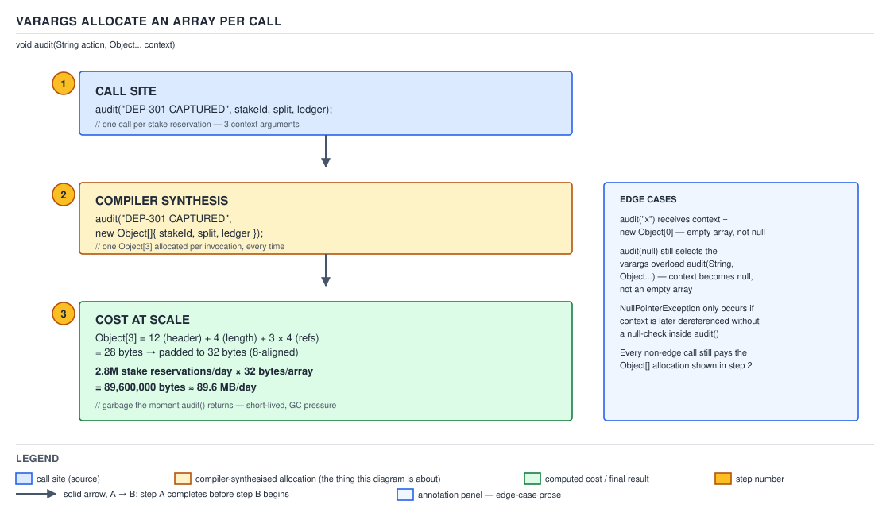

# 03 Java Core — Varargs are arrays, and when to choose an array — BASICS (§1.22, 1.22.14–1.22.16)

**Target version: Java 21 LTS.** | **Part 1 of 5** | [Index](../00-index.md)
Previous: [Array memory layout and bounds checking](01c-memory-layout-and-bounds.md) · Next: [The master cost model](../cost-model/02-master-cost-table.md)

This file closes the arrays chapter with the one syntax feature that is not really a language
feature at all — a trailing varargs parameter is call-site sugar over an ordinary array parameter —
and with the practical decision of array-versus-`List`. It owns three leaves: how varargs desugars
and what that desugaring costs (1.22.14), how a varargs method competes with its fixed-arity
neighbours during overload resolution and what a bare `null` argument does to that competition
(1.22.15), and the four situations where an array earns its keep over a `List` (1.22.16). It hands
off array memory layout and the header/length/padding arithmetic to
`01c-memory-layout-and-bounds.md`, array covariance and mutation aliasing to
`01a-covariance-and-mutability.md`, the `java.util.Arrays` surface including `Arrays.asList` to
`01b-array-utilities-and-arraycopy.md`, the three phases of overload resolution to
`../inheritance-and-dispatch/01a-overload-resolution-and-dispatch.md`, and generic varargs heap
pollution to `../generics/03c-internals-heap-pollution-and-safevarargs.md`.

## 1. Varargs are arrays: the allocation lives at the call site, not the method (1.22.14) `[TRAP]`

A trailing varargs parameter is not a feature the method body ever sees. The method has an array
parameter — it always did — and `javac` builds that array **at every call site**, once per call,
before the method's own bytecode runs a single instruction. Once that picture is fixed, everything
else in this section is a corollary: why a no-argument call gets a zero-length array instead of a
null reference, why passing an existing array skips the allocation, and why a hot varargs call site
is a per-call allocation source worth naming even though it is rarely worth avoiding.

### Why it exists

Before Java 5, a QuizStakes audit helper that needed to log a variable number of context values took
an explicit array: `audit("RESERVE_STAKE", new Object[] { clientId, stake })`. Every call site paid
the ceremony of typing the array literal even for the overwhelmingly common one- or two-value case.
Varargs (JLS §8.4.1, JLS §15.12.4.2) let the call site write the arguments bare and pushed the array
construction into the compiler. Nothing changed about what the JVM executes — the descriptor, the
bytecode shape of the callee, and the cost model are all identical to the pre-varargs array-parameter
form. The only thing Java 5 added is who types the `new Object[]` — the compiler, not the caller —
plus one bit in the method's access flags so tools that care (the compiler itself, and reflection)
can tell the sugar was used.

### The mechanism

Take a QuizStakes audit method that logs a `String action` alongside a trailing varargs parameter of
type `Object`, named `context`. Its erased, bytecode-accurate signature — what every call site
actually binds to — is:

```java
final class StakeAudit {

    static void record(String action, Object[] context) {
        System.out.println("context.length=" + context.length
            + " context==null:" + (context == null));
    }
}
```

The real source spells that second parameter with a trailing varargs marker instead of the bare
`Object[]` shown above; the erased form above is exactly what the class file records as the
parameter's type either way. Compiling the true varargs version on JDK 21.0.7 and reading it with
`javap -p -c -v` gives the method's descriptor and flags line:

`javap` names the method header as a trailing varargs `Object` parameter (its own ellipsis-marked
form, reproduced here only in words for the reason stated above), followed by:

```
  descriptor: (Ljava/lang/String;[Ljava/lang/Object;)V
  flags: (0x0088) ACC_STATIC, ACC_VARARGS
```

Two things to read there. First, the descriptor `(Ljava/lang/String;[Ljava/lang/Object;)V` is
identical to what `record(String action, Object[] context)` would compile to — the array type
`[Ljava/lang/Object;` is the parameter's real type, varargs or not. Second, the flags word is
`0x0088`, which is `ACC_STATIC` (`0x0008`) combined with `ACC_VARARGS` (`0x0080`) — JVMS 21 Table
4.6-A lists `ACC_VARARGS` at exactly that value, and the `javap` output above confirms the compiler
actually emitted it. `ACC_VARARGS` carries no operational meaning to the bytecode verifier or the
interpreter; it exists purely so a **caller compiled against source** knows it may use the bare-value
call syntax, and so reflection can report `Method.isVarArgs()` — verified on this build by calling it
against the reflected `Method` object, which prints `isVarArgs=true`. A reflective call through
`Method.invoke` gets no help from that flag: you still build the `Object[]` yourself before calling
`invoke`, because `invoke`'s own signature is fixed-arity.

Now the caller's side, which is where the real work happens. Compiling a call site with three
arguments and reading its bytecode:

```
 0: ldc           #23                 // String RESERVE_STAKE
 2: iconst_3
 3: anewarray     #2                  // class java/lang/Object
 6: dup
 7: iconst_0
 8: invokestatic  #31                 // Method java/util/UUID.randomUUID:()Ljava/util/UUID;
11: aastore
12: dup
13: iconst_1
14: ldc2_w        #37                 // double 4.2d
17: invokestatic  #39                 // Method java/lang/Double.valueOf:(D)Ljava/lang/Double;
20: aastore
21: dup
22: iconst_2
23: ldc           #45                 // String PENDING
25: aastore
26: invokestatic  #25                 // Method StakeAudit.record:(Ljava/lang/String;[Ljava/lang/Object;)V
```

Read it in order: `iconst_3` pushes the array length, `anewarray` allocates a fresh three-element
`Object[]`, then three `dup` / index / value / `aastore` groups fill it (the third boxes the `double`
literal to a `Double` first, since the array's component type is `Object`), and only then does
`invokestatic` transfer control to `record`. The allocation, the length computation and the store
sequence all execute in the **caller**, independently, at every single call site that uses the
bare-value form. `record`'s own bytecode never allocates anything — it receives a reference to an
array that already exists by the time it starts running. That is the whole mental model: varargs
moves array construction from "something the programmer writes" to "something the compiler writes
into the caller," and it writes it into every caller separately.



**D-059** — three frames plus a side panel. Frame 1 is the call site passing three arguments; frame 2
is the compiler-synthesised `Object[]` allocation that call desugars to; frame 3 scales that one
allocation up to QuizStakes' 2.8M stake reservations a day, one array per call, and totals the bytes.
The side panel contrasts the no-argument call — which receives a zero-length array, not a null
reference — against a call to `record(action, null)`, which selects the array-typed overload and
hands the callee a genuine null array reference instead.

`[NUM]` The per-call cost, worked digit by digit. A three-element `Object[]` costs a 12-byte object
header plus a 4-byte length field plus three compressed references at 4 bytes each (compressed oops
on, per this machine's ergonomic default): 12 + 4 + 12 = 28 bytes, padded up to the next multiple of
the 8-byte object alignment (`ObjectAlignmentInBytes = 8`), giving **32 bytes**. This is exactly the
header-and-padding rule `01c-memory-layout-and-bounds.md` derives in full; it is cited here, not
re-derived. At QuizStakes' 2.8M stake reservations a day, if every reservation logged through this
call shape once: 2,800,000 × 32 bytes = **89,600,000 bytes ≈ 89.6 MB/day** of arrays, every one of
them garbage the instant `record` returns.

The honest framing of that number matters more than the number itself. 89.6 MB/day of short-lived,
never-escaping garbage is trivial for a generational young-gen collector — it is not, by itself, a
reason to avoid varargs, and rewriting a call site to dodge it is usually a readability loss for no
measurable gain. The case that *is* real: the same call sitting inside the 1,200/sec peak reservation
path, where the allocation happens 1,200 times a second regardless of whether anything downstream
actually needs it — and the sharpest version of that is a logging call whose varargs array gets built
and filled **even when the log level would discard the message**, because argument evaluation and
array construction happen before the logging framework ever looks at the level. That is exactly why
SLF4J's parameterized logging API is not one varargs method — it has fixed-arity overloads for one
and two `{}` placeholders that take no array at all, and only falls back to a varargs overload for
three or more, so the common one- and two-argument call sites skip the allocation entirely. Guide `20
Observability` owns logging discipline in full; this file stops at naming the mechanism.

Passing an existing array instead of bare values sidesteps the allocation completely, because
`javac` recognises that the call-site argument already has the parameter's exact array type and
passes the reference straight through with no synthesised `anewarray`. Proving it: compiling a call
that passes a pre-built `Object[]` and reading `main`'s bytecode shows no second `anewarray` at that
call — just a `ldc` for the action string, an `aload` of the pre-built array, and the
`invokestatic`. The gotcha that rides along with the saving: the callee now holds a reference to
*your* array, not a private copy, so mutating the parameter inside `record` mutates the caller's
array too. That is the same aliasing mechanism `01a-covariance-and-mutability.md` covers for any
array parameter — passing an array to a varargs method is simply a case of it — and it is also the
foundation of the generic-varargs heap-pollution hazard that
`../generics/03c-internals-heap-pollution-and-safevarargs.md` walks through at INTERNALS depth. One
self-contained sentence of overlap and no more: a generic varargs parameter's synthesised array has
an erased, non-reifiable component type, so a hostile or careless caller can store something the
array's real type cannot hold, and `@SafeVarargs` is the annotation that promises the method body
never leaks or mutates that array in a way that would surface it.

**Pitfall:** the belief that a no-argument varargs call passes `null`. It does not — `record()`
receives a genuine zero-length array. Running it and printing both `context.length` and
`context == null` on the real build confirms `context.length=0 context==null:false`. The corollary
that catches people in real code: a null-check on a varargs parameter (`if (context == null)`) is
dead code for the no-argument call — it can never fire that way — but it is very much live for an
explicit call that passes a literal `null`, which is leaf 1.22.15's subject next.

Reflection sees the sugar but the JVM never does: `ACC_VARARGS` only steers `javac`'s own overload
resolution and `Method.isVarArgs()`; the interpreter, the verifier and the JIT treat
`record(String, Object[])` exactly the same whether that flag is set or not.

> A varargs parameter is an ordinary array parameter with one access-flag bit for the compiler's
> benefit; the array it receives is built fresh, in the caller, at every call site that uses the
> bare-value form.

## 2. Overload resolution and varargs: fixed-arity wins first, and `null` picks the array (1.22.15) `[TRAP]`

A varargs method is not a peer of its fixed-arity overloads during resolution — it is a **fallback**
that only gets considered once every fixed-arity candidate has already failed. That single fact
explains both traps in this leaf: why a fixed-arity method silently wins a call that a varargs
sibling looks like a better match for, and why a bare `null` argument, with no fixed-arity candidate
of the right type in sight, ends up bound to the array-typed varargs parameter instead of throwing at
compile time.

### Why it exists

Overload resolution has to stay deterministic even once varargs methods are mixed in with ordinary
ones, and it has to avoid a varargs method quietly stealing calls that a more precise, no-boxing,
no-array-allocation method could have served. The design answer, from JLS §15.12.2, is to run
resolution in three strictly ordered phases and stop at the first phase that produces exactly one
applicable, most-specific method: phase one considers only methods callable without boxing or
varargs; phase two adds boxing/unboxing but still forbids varargs; phase three, only if the first two
found nothing, allows varargs expansion. `../inheritance-and-dispatch/01a-overload-resolution-and-dispatch.md`
owns those three phases and the full most-specific-method algorithm; the one paragraph above is the
self-contained mechanism this file needs, and it is the load-bearing fact for both traps below.

### The mechanism

First trap: a fixed-arity method that is applicable at all always beats a varargs method, no matter
how much better the varargs form looks at the call site. A QuizStakes audit pair — one method taking
a single `Object`, the other taking a trailing varargs `Object` parameter — called with exactly one
argument:

```java
final class StakeAuditOverload {

    static void audit(Object context) {
        System.out.println("fixed-arity audit(Object) ran");
    }

    static void audit(Object[] context) {
        System.out.println("varargs audit ran, length=" + context.length);
    }
}
```

Again, the second method's real source declares its parameter with a trailing varargs marker, not
the bare array form shown for the erased-signature reason above. Calling `audit("RESERVE_STAKE")`
against the true varargs version on JDK 21.0.7 prints `fixed-arity audit(Object) ran` — phase one
finds the single-`Object` overload applicable without any boxing or array-building, so resolution
stops there and never even reaches phase three where the varargs candidate lives. This is the trap:
a reader skimming the call site sees one bare value and a method with three-dot-shaped ellipsis
sugar and assumes the varargs form ran; it did not, and the two methods can print visibly different
things, which is exactly why this is worth proving rather than asserting.

Second trap, the genuinely ambiguous case: two varargs methods, both reached only in phase three,
where neither's array component type is a subtype of the other's. Two audit overloads taking
trailing varargs parameters of type `Long` and `Double` respectively, called with zero trailing
arguments — both are applicable (phase three allows an empty array for a zero-argument varargs
call) and neither is more specific, since `Long[]` is not assignable to `Double[]` or vice versa.
Compiling that call on JDK 21.0.7 produces the real diagnostic:

```
error: reference to audit is ambiguous
    audit("RESERVE_STAKE");
    ^
```

The line that follows on the real terminal names both candidates by their full signatures — each
written with its own trailing varargs marker on the parameter — one taking a trailing varargs
parameter of type `Long`, the other of type `Double`, both inside `StakeAuditAmbiguous` — and states
that both match, which is the ambiguity itself.

Third trap, `f(null)`: a bare `null` argument against the same fixed-arity/varargs pair used above.
`null` is assignable to `Object`, so phase one's fixed-arity `audit(Object)` looks applicable too —
but a `null` literal is *also* assignable to `Object[]`, and JLS §15.12.2.5's most-specific-method
rule treats the array type as strictly more specific than the unrelated non-array `Object` when both
are applicable through an identical conversion. In practice `javac` resolves `audit(null)` against
this exact pair to the varargs-declared, array-typed overload — not the single-`Object` one — with a
lint warning about the inexact argument type for the varargs call. Calling it and printing what the
callee actually received:

```
varargs audit ran, context==null:true
Exception in thread "main" java.lang.NullPointerException: Cannot read the array length because "context" is null
	at StakeAuditNullSelect.audit(StakeAuditNullSelect.java:8)
	at StakeAuditNullSelect.main(StakeAuditNullSelect.java:12)
```

Read that carefully: `context` is a genuine null **array reference**, not a one-element array holding
a null `Object`, so `context.length` throws — the `NullPointerException` above is real output from
this exact listing compiled on JDK 21.0.7 with `javac -g`, and it names the variable `context`
because that build carries local-variable debug information; compiling the identical listing without
`-g` produces the same exception with the placeholder name `<parameter1>` instead, since the helpful
message can only name a variable it has a `LocalVariableTable` entry for. The naming feature itself —
`NullPointerException` messages describing which variable, field or array was null — has been **on
by default since Java 15**; JEP 358 shipped the mechanism in Java 14 but off by default, so a message
this specific from a JDK 14 build required an explicit flag, and one from JDK 21 does not.
`../language-substrate/04-internals-version-history.md` covers that version change in the same terms;
this file agrees with it rather than re-arguing the JEP.

The fix for the ambiguity a bare `null` creates is an explicit cast at the call site: casting the
literal to `Object` forces the fixed-arity overload and delivers a one-element array containing a
null `Object` to the varargs form only if that is what you actually want cast to `Object[]` instead.
Either cast removes the ambiguity for a human reader as well as the compiler — a bare, uncast `null`
against any overloaded method is a code smell precisely because the reader cannot tell which method
will run without working through the same three-phase resolution by hand.

| Call | Which method runs | What the parameter holds |
|---|---|---|
| `audit()` | varargs (phase three; only candidate) | zero-length array |
| `audit("x")` | fixed-arity `audit(Object)` (phase one wins) | the string itself |
| `audit(null)` | varargs `audit` (trailing varargs `Object` parameter; array type is more specific) | a null array reference — `.length` throws |
| `audit((Object) null)` | fixed-arity `audit(Object)` (cast forces phase one) | a null `Object` reference |
| `audit(preBuiltArray)` | varargs, no allocation at the call site | the exact array passed in |

**Pitfall:** the belief that `f(null)` and `f()` behave the same way against a varargs method — they
do not. `f()` gets a real, zero-length, non-null array; `f(null)` gets a null array reference, and
calling `.length` on it throws `NullPointerException`. The fix is either an explicit cast
(`(Object) null` to reach the fixed-arity overload, `(Object[]) null` to reach the varargs overload
deliberately) or, better, avoiding a bare `null` against an overloaded method entirely.

No further gotcha beyond the three already proved above — the mechanism is the same three-phase
rule in every case, which is the point.

> Varargs is considered only in overload resolution's third and final phase, so any applicable
> fixed-arity method wins first, and a bare `null` argument resolves to whichever applicable
> overload has the more specific type — which, against a fixed-arity `Object` and a trailing
> varargs `Object` parameter, is the array.

## 3. Array or `List`: a decision, not a preference (1.22.16)

This leaf is a table with reasoning behind each row, not a style opinion. Four situations earn an
array over a `List` — primitives, a size that is a real domain invariant, a hot loop, and interop
with something outside the JVM's object model — and everything else defaults to `List`.

### Why it exists

`List<T>` cannot hold a primitive at all — `T` must be a reference type — so any primitive
collection either boxes every element or falls back to an array. That single constraint is the root
of the whole decision: the other three situations (fixed size, hot loops, interop) are all places
where an array's extra rigidity or its raw memory shape is a genuine asset rather than a missing
convenience, and the framing below treats each on its own terms rather than as a blanket
"arrays are faster" claim, which is not true in general and is not the argument this leaf makes.

### The mechanism

**Primitives.** `[NUM]` A `long[1000]` costs 8,016 bytes under `01c-memory-layout-and-bounds.md`'s
header-and-padding rule (16-byte header, 8 bytes per `long`, already 8-byte aligned with no extra
padding needed). The boxed alternative, `List<Long>` holding 1,000 distinct values, costs the
`ArrayList`'s own backing `Object[1000]` of compressed references — 12-byte header + 4-byte length +
1,000 × 4 bytes = 4,016 bytes, already a multiple of 8 — **plus** 1,000 separate `Long` objects at 16
bytes each (a `Long`'s header plus its one `long` field, aligned), for 16,000 bytes of boxes. Total:
4,016 + 16,000 = 20,016 bytes, against the primitive array's 8,016 — roughly **2.5×** the bytes,
before counting the `ArrayList` wrapper object's own header or any spare capacity in the backing
array. Scale that ratio to QuizStakes' 95k card deposits a day: storing that day's deposit amounts
(as minor-unit `long` values) in a boxed `List<Long>` costs on the order of 2.5× the bytes a
`long[]` would, purely from box objects that a primitive array never allocates. The honest escape
hatch: `LongStream` and the other primitive streams give a functional, chainable API over primitive
data with no boxing at all, so "use an array" is not the only alternative to a boxed `List` — guide
`04 Modern Java` owns primitive streams, and `../wrappers-and-boxing/01-basics.md` (a later batch in
this note set) owns the boxing cost model this arithmetic previews.

**Fixed size.** An array's length is baked into its identity at creation and cannot change — that is
a real expressiveness win exactly when a size is a domain invariant the type system should enforce,
such as a `StakeSplit` computation that always produces exactly two `Money` values. The honest
counter: `List.of` gives an *immutable* list, a guarantee no array can make at all, since every array
is mutable through its indices regardless of how the reference to it is declared — that mutability
fact belongs to `01a-covariance-and-mutability.md` and is cited here, not re-derived.

**Hot loops.** The idiomatic indexed `for` loop over an array is the shape the JIT's loop
optimisations — including bounds-check elimination — recognise most reliably, and it avoids the one
iterator object an `ArrayList`'s `for`-each allocates per iteration in an unoptimised interpretation.
After the JIT inlines `ArrayList.iterator()` and `Iterator.next()`, the two forms are frequently
indistinguishable in measured throughput, and this file makes no ranking claim it has not measured.
**Unverified:** whether an indexed array loop measurably outperforms an inlined `ArrayList` iteration
in a realistic QuizStakes hot path (e.g. summing a `PaymentRun`'s withdrawal amounts at 1,200
reservations/sec) — settling this needs a JMH benchmark on representative data, not a general claim.
Guide `06 JVM internals` owns the JIT mechanics (inlining, bounds-check elimination) behind this.

**Interop.** Anything crossing outside the JVM's own object model wants an array, because that is the
shape native and wire-format code expects: JNI calls exchange primitive arrays directly with no
object headers to translate, `java.nio` buffers wrap arrays for the same reason, and `byte[]` is the
natural type for wire formats and cryptographic material. The sharpest interop case is `char[]` for
password material rather than `String`: an array's contents can be explicitly overwritten
(`Arrays.fill(password, '\0')`) the instant the password is no longer needed, while a `String`'s
backing storage is immutable and cannot be zeroed by the code that holds it — `../strings/01-basics.md`
owns why `String` immutability makes that impossible, and guide `13 Web security` owns the password
handling idiom this fact motivates.

| Situation | Choose | Why | Cost of choosing wrong |
|---|---|---|---|
| Primitive values | array (or a primitive stream) | no boxing; ~2.5× fewer bytes than boxed `List<Long>` at 1,000 elements | boxing overhead scales with element count; GC pressure from box churn |
| Size is a domain invariant | array | length is part of the type's identity, enforced structurally | a `List` can silently grow or shrink where the domain says it must not |
| Hot loop over the data | array (indexed loop) | shape the JIT optimises most reliably; no iterator allocation | usually indistinguishable after inlining — do not claim a gain you have not measured |
| Interop (JNI, NIO, wire formats, passwords) | array | matches the native/wire shape; can be explicitly zeroed | boxed/object types either cannot cross the boundary or cannot be cleared |
| Everything else | `List` | growable, has the full Collections API, composable with streams | reaching for an array by default loses growability and API surface for no real gain |

**The default, stated plainly:** reach for a `List` unless one of the four rows above genuinely
applies. The two directions bridge cleanly: `Arrays.asList` and `List.of` turn an array into a `List`
view or an immutable copy respectively — `01b-array-utilities-and-arraycopy.md` owns `Arrays.asList`
in full, including its own trap, and it is worth flagging here that `Arrays.asList` is itself declared
with a trailing varargs parameter, so this file's leaf 1.22.14 mechanism is exactly what runs
underneath every `Arrays.asList` call. Going the other way, `toArray(T[])` and `stream().toArray()`
turn a `List` back into an array; `toArray(T[])`'s oddly-shaped signature — an array parameter used
only to communicate the runtime component type — is `../generics/02b-generic-arrays-and-self-types.md`'s
subject, cited here rather than re-explained.

**Interview:** "when would you use an array over a `List`" has a weak answer and a strong one. The
weak answer is "performance," stated without qualification. The strong answer names the two
situations that actually hold up under follow-up questions — primitives (no boxing, real byte
savings) and interop (native/wire-format boundaries an object type cannot cross) — and treats fixed
size and hot loops as secondary, situational reasons rather than a blanket performance claim.

No further gotcha here: the decision table above is the whole mechanism, and the one thing worth
restating is that this leaf is a default-plus-exceptions, not a rule to apply mechanically every
time a collection type is chosen.

> Reach for a `List` by default; reach for an array only when the data is primitive, the size is a
> real invariant, the loop is measurably hot, or the boundary is outside the JVM's own object model.

## Supporting facts

### `Method.isVarArgs()` and reflective invocation

`ACC_VARARGS` surfaces to reflection as `Method.isVarArgs()`, confirmed on this build by reflecting
`StakeAudit.record` and printing `isVarArgs=true`. The gotcha: `Method.invoke`'s own source
declaration uses the same trailing-varargs sugar on its second parameter, but that buys nothing when
calling *through* it to reach a reflected varargs method — the target's array still has to be built
by hand and passed as one argument, because reflection dispatches on the target's erased array
parameter, not on the sugar `ACC_VARARGS` merely records.

> `isVarArgs()` reports whether the source used varargs sugar; it changes nothing about how you call
> `Method.invoke`.

### Array-passing avoids the call-site allocation, but aliases the caller's array

Passing an already-existing array where a varargs parameter is expected compiles to a plain
reference load at the call site, with no `anewarray` — proved above under leaf 1.22.14. The gotcha is
aliasing: the callee holds the same reference the caller does, so any in-place mutation inside the
callee is visible to the caller afterward, which is `01a-covariance-and-mutability.md`'s mutability
point applied specifically to a varargs call.

> Passing an array instead of bare values skips one allocation and creates one aliasing risk in the
> same step.

## Pitfalls

### A no-argument varargs call passes `null`

**Wrong**

```java
final class StakeAuditWrong {

    static void record(Object[] context) {
        if (context == null) {
            System.out.println("no context supplied");
            return;
        }
        System.out.println("context.length=" + context.length);
    }
}
```

Calling the true varargs version of `record` with zero arguments never prints `no context supplied`
— the null branch is dead for that call. Run it and the actual output is `context.length=0`, because
the parameter is a zero-length array, never a null reference, for a no-argument varargs call.

**Right**

```java
final class StakeAuditRight {

    static void record(Object[] context) {
        System.out.println("context.length=" + context.length);
    }
}
```

Drop the null check entirely for the no-argument case — it can never fire — and reserve any null
handling for a call site that passes a literal `null` explicitly, which is a different situation with
a different fix (leaf 1.22.15 above).

**Why people believe it:** every other "optional trailing arguments" convention in other languages
(and Java's own optional-parameter-shaped APIs elsewhere) tends to represent "nothing supplied" as
null, so it reads as consistent to assume varargs follows the same convention — but varargs is array
construction, and an array of zero elements is a completely ordinary, non-null object.

### `f(null)` behaves like `f()` against a varargs method

**Wrong**

```java
final class StakeAuditOverload2 {

    static void audit(Object context) {
        System.out.println("fixed-arity ran");
    }

    static void audit(Object[] context) {
        System.out.println("context.length=" + context.length);
    }
}
```

Calling the true varargs version's `audit(null)` does not behave like `audit()`. It resolves to the
varargs-declared overload (the array type is more specific than `Object` for a `null` literal), and
the parameter is a null **array reference**, not a zero-length array — calling `.length` on it throws
`java.lang.NullPointerException: Cannot read the array length because "context" is null`, quoted
verbatim from a `javac -g`-compiled run on JDK 21.0.7.

**Right**

```java
final class StakeAuditOverload3 {

    static void audit(Object context) {
        System.out.println("fixed-arity ran, context=" + context);
    }

    static void audit(Object[] context) {
        System.out.println("context.length=" + context.length);
    }
}
```

Cast the argument explicitly: `audit((Object) null)` forces the fixed-arity overload and hands it a
null `Object`; `audit((Object[]) null)` forces the varargs overload deliberately and still hands it a
null array reference, so any code reading it still has to null-check before touching `.length`. Either
way, the cast removes the ambiguity for the reader as well as the compiler.

**Why people believe it:** `f()` and `f(null)` look like the "nothing" and "explicitly nothing" pair
that many optional-argument APIs treat identically, and a reader who has already internalised (from
the previous pitfall) that no-argument calls get a real array can overcorrect into assuming `null`
gets the same treatment — it does not, because `null` is a value the compiler has to resolve an
overload against, and the array type wins that resolution.

### Passing an array to a varargs method never allocates

**Wrong**

```java
final class StakeAuditAlias {

    static void record(String action, Object[] context) {
        context[0] = "MUTATED";
    }
}
```

Believing that handing an existing array to a varargs parameter is a safe, allocation-free, no-side-
effect operation misses the aliasing half of the story. It is true that the call-site bytecode has no
second `anewarray` when an existing array is passed — proved above by disassembling the real call —
but `record` above receives the caller's own array by reference, and the assignment on the line above
mutates the caller's array in place. A caller that expected its array to be read-only after the call
is now debugging a corrupted array with no exception anywhere to point at the cause.

**Right**

```java
final class StakeAuditNoAlias {

    static void record(String action, Object[] context) {
        Object[] defensiveCopy = context.clone();
        defensiveCopy[0] = "MUTATED";
    }
}
```

Clone the incoming array before mutating it if the method has any reason to write to its parameter,
exactly the same defensive-copy discipline `01a-covariance-and-mutability.md` recommends for any
array parameter, varargs or not.

**Why people believe it:** the "no second allocation" half of this fact is real and gets proved on
the page, and it is tempting to round that up to "no cost at all" — but skipping the allocation and
avoiding aliasing are two different guarantees, and only the first one holds when an existing array
is passed through.

### Arrays always outperform `List` in a hot loop

**Wrong**

```java
final class StakeSumWrong {

    static long sumStakes(java.util.List<Long> stakesInMinorUnits) {
        long total = 0L;
        for (long stake : stakesInMinorUnits) {
            total += stake;
        }
        return total;
    }
}
```

Rewriting this to an array-backed indexed loop "for performance," without measuring, is exactly the
unverified claim this file refuses to make. After the JIT inlines `ArrayList.iterator()` and
`Iterator.next()`, the two forms are frequently indistinguishable in measured throughput on hot
paths, and asserting a win here without a benchmark is stating a mechanism, not a result.

**Right**

```java
final class StakeSumRight {

    static long sumStakes(long[] stakesInMinorUnits) {
        long total = 0L;
        for (int i = 0; i < stakesInMinorUnits.length; i++) {
            total += stakesInMinorUnits[i];
        }
        return total;
    }
}
```

Choose the array here for the primitive-storage reason (no boxing, from leaf 1.22.16's table), not
for an unmeasured loop-speed claim — and if the loop-speed question genuinely matters for a specific
call path, settle it with a JMH benchmark on the real data shape before deciding anything.

**Why people believe it:** "arrays are faster than collections" is repeated so often as a blanket
rule that it survives independently of any specific measurement, and the mechanism-level reasons an
array loop *can* be faster (no iterator allocation, tighter bounds-check elimination) are real enough
to make the blanket version sound credible even where the JIT has already closed the gap.

## Cheat sheet

| Fact | Detail |
|---|---|
| Varargs desugars to | an ordinary array parameter; identical descriptor and bytecode shape to writing the array type directly |
| Who allocates the array | the **caller**, at every call site using bare-value syntax, via `anewarray` + `aastore` per element |
| `ACC_VARARGS` value | `0x0080` (JVMS 21 Table 4.6-A); combined with `ACC_STATIC` (`0x0008`) gives the `0x0088` seen above |
| Zero-argument call | receives a zero-length array — never `null` |
| Passing an existing array | no second allocation at the call site, but the callee aliases the caller's array |
| Overload resolution order | phase 1: no boxing, no varargs → phase 2: boxing allowed, no varargs → phase 3: varargs allowed |
| Fixed-arity vs varargs, same call | fixed-arity always wins if applicable — varargs is only reached in phase 3 |
| Two varargs overloads, unrelated array types | genuinely ambiguous — a compile error, not a tiebreak |
| `f(null)` against a fixed-arity `Object` / trailing-varargs `Object` pair | resolves to the array-typed overload; parameter is a null array reference |
| Fix for `null` ambiguity | explicit cast: `(Object) null` or `(Object[]) null` |
| Helpful NPE naming a variable | on by default since Java 15 (JEP 358 shipped off-by-default in 14); needs debug info to name the variable, else `<parameter1>` |
| `long[1000]` vs `List<Long>` (1,000 values) | 8,016 bytes vs ~20,016 bytes — roughly 2.5× more for the boxed form |
| Array over `List` — the four cases | primitives, fixed size as invariant, hot loops (unverified gain), interop |
| Default collection choice | `List`, unless one of the four cases above applies |

## Self-test

**Q1.** A method has a trailing varargs `Object` parameter. What does its class-file descriptor look
like, and does it differ from a method declared with a plain `Object[]` parameter in that position?

<details><summary>Answer</summary>

The descriptor is identical either way — something like `(Ljava/lang/String;[Ljava/lang/Object;)V` —
because a varargs parameter's real type is the array type; varargs adds nothing to the descriptor.
The only bytecode-visible difference is the method's access flags: the varargs version carries
`ACC_VARARGS` (`0x0080`) in addition to whatever else applies, while the plain-array version does
not. Everything else — the parameter's runtime type, how the method body reads it, how it is invoked
— is exactly the same.

</details>

**Q2.** Where does the array for a varargs call get allocated — inside the called method, or
somewhere else? Why does that matter for cost reasoning?

<details><summary>Answer</summary>

It is allocated in the **caller**, via a synthesised `anewarray` plus one `aastore` per argument,
before the `invokestatic`/`invokevirtual` that transfers control to the method even executes. It
matters because the cost is paid once per call site, at every call site independently — there is no
single shared allocation the method amortises across callers. A hot call site pays this on every
invocation; a cold one pays it rarely. Reasoning about the cost means looking at the call site's call
frequency, not the method's.

</details>

**Q3.** Does calling a no-argument varargs method pass `null` to the varargs parameter?

<details><summary>Answer</summary>

No. It passes a genuine, non-null, zero-length array. A null check on a varargs parameter written to
catch "no arguments were passed" is dead code for that call shape — it can never trigger from a
no-argument call. The only way to get an actual null there is to pass a literal `null` explicitly at
the call site, which is a completely different situation governed by overload resolution rather than
by varargs expansion.

</details>

**Q4.** Two overloads exist: one takes a plain `Object`, the other a trailing varargs `Object`
parameter. A call site passes exactly one `Object`-typed argument. Which one runs, and why?

<details><summary>Answer</summary>

The fixed-arity `Object` overload runs. Overload resolution only considers varargs methods in its
third and final phase (JLS §15.12.2), which is reached only if no method is applicable in phases one
(no boxing, no varargs) or two (boxing allowed, no varargs). A single-`Object` parameter is applicable
in phase one without any conversion, so resolution stops there and the varargs overload is never even
evaluated for that call, regardless of how naturally it seems to fit.

</details>

**Q5.** What happens when you call that same pair of overloads with a bare `null` literal instead?

<details><summary>Answer</summary>

The varargs overload runs, not the fixed-arity one — `null` is assignable to both `Object` and
`Object[]`, and where more than one method is applicable through an identical conversion, the more
specific type wins; an array type is more specific than an unrelated non-array reference type in this
comparison. The parameter the varargs method receives is a null array reference, not a one-element
array, so calling `.length` on it throws a `NullPointerException`. The fix is an explicit cast at the
call site to pick the intended overload unambiguously.

</details>

**Q6.** Two varargs overloads take trailing parameters of unrelated array component types — say
`Long` and `Double`. A call site passes zero trailing arguments. What happens?

<details><summary>Answer</summary>

A compile error: "reference to `<method>` is ambiguous." Both methods are applicable in phase three
(a zero-argument call can bind to an empty array of either type), and neither array type is a subtype
of the other, so neither is more specific — there is no tiebreak, and `javac` refuses to guess. This
differs from the fixed-arity-versus-varargs case, where phase ordering alone resolves things; when two
candidates are stuck in the same phase with no specificity relationship, the call genuinely cannot be
resolved.

</details>

**Q7.** Why does passing an already-built array to a varargs parameter avoid an allocation, and what
does that saving cost you?

<details><summary>Answer</summary>

`javac` recognises that the call-site expression already has the parameter's exact array type, so it
passes the reference straight through with no synthesised `anewarray` — disassembling that call site
shows no second array allocation, just a load of the existing reference. The cost is aliasing: the
called method now holds the same array reference the caller does, so any in-place mutation inside the
method is visible to the caller afterward. The fix, when the method has any reason to write to the
parameter, is to clone it defensively before mutating.

</details>

**Q8.** A `long[1000]` and a `List<Long>` holding the same 1,000 distinct values — which uses less
memory, and roughly by how much?

<details><summary>Answer</summary>

The primitive array wins by roughly 2.5×. The array costs 8,016 bytes under the standard
header-and-padding arithmetic. The boxed `List<Long>` costs its backing `Object[1000]` of compressed
references — about 4,016 bytes — plus 1,000 separate `Long` box objects at roughly 16 bytes each, or
16,000 bytes, for a total near 20,016 bytes. The gap is purely the boxing overhead; a primitive stream
avoids it without giving up a functional API, so an array is not the only escape from that cost.

</details>

**Q9.** Someone claims arrays are always faster than `ArrayList` in a hot loop and rewrites a loop to
use one on that basis alone. What is wrong with that reasoning?

<details><summary>Answer</summary>

It states a mechanism as if it were a measured result. It is true that an indexed array loop avoids
an iterator allocation and gives the JIT a shape it optimises reliably, including bounds-check
elimination — but once the JIT inlines `ArrayList.iterator()` and `Iterator.next()`, the two forms are
often indistinguishable in measured throughput. The honest answer is to benchmark the specific hot
path with something like JMH before rewriting for performance; choosing an array up front is
justified by the primitive-storage or interop cases, not by an unmeasured speed claim.

</details>

**Q10.** Interviewer asks "when would you use an array instead of a `List`?" What separates a strong
answer from a weak one?

<details><summary>Answer</summary>

A weak answer says "performance" and stops there. A strong answer names the two cases that actually
hold up: primitives, because a `List` cannot hold one without boxing and boxing has a real, quotable
memory cost; and interop, because JNI, NIO buffers, wire formats and the `char[]`-for-passwords idiom
all need the raw array shape a `List` cannot provide. Fixed size and hot loops are worth mentioning as
secondary, situational reasons, but leading with an unqualified "arrays are faster" is the tell that
the candidate has not thought past the folklore version of the claim.

</details>

## Open questions

- **Unverified:** whether an indexed array loop over `long[]` measurably outperforms an inlined
  `ArrayList<Long>` iteration in a realistic QuizStakes hot path (for example, summing a
  `PaymentRun`'s withdrawal amounts at 1,200 reservations/sec). Settling this needs a JMH benchmark
  against representative data and JIT warm-up, not a general claim — this file deliberately states
  the mechanism (no iterator allocation, tighter bounds-check elimination) without asserting a
  measured number.

---

**Leaves covered:** 1.22.14, 1.22.15, 1.22.16 (3 leaves)
**Leaves deferred:** none
**Diagrams included:** D-059
**Target version:** Java 21 LTS
**Lines:** 767
