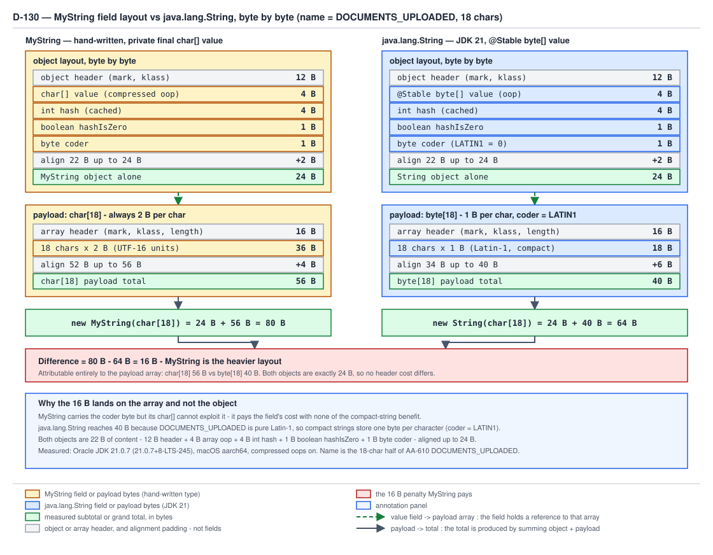

# 03 Java Core — `MyString` — an immutable value type done properly — BUILD IT (§4.1 — 4.1.1–4.1.3, 4.1.5)

**Target version: Java 21 LTS.** | **Part 4 of 5** | [Index](../00-index.md)
Previous: [Reflection and dynamic access](../reflection/02-reflection.md) · Next: [The MyString intern pool and the diff table](01a-mystring-intern-pool-and-diff.md)

Four fields and one rule. A `char[]` you own outright and nobody else can reach; a `byte` that
records whether every code unit fits in one byte; an `int` caching a hash you will be asked for
millions of times; and a `boolean` that exists solely because one legal hash value is
indistinguishable from "not computed yet". The rule is that once the constructor returns, no
observable value ever changes again — and every decision below is downstream of defending that
rule against a caller who kept a reference and a second thread arriving mid-cache-fill.

This file builds `MyString` and covers its defensive copy, its cached hash, its method contracts
and its `coder` arithmetic. The intern pool and the full diff table against `java.lang.String` are
in [the next file](01a-mystring-intern-pool-and-diff.md); §4.2's `MyStringBuilder` is
[two doors down](01b-mystringbuilder.md).

Everything here was compiled and run on **Oracle JDK 21.0.7 (build 21.0.7+8-LTS-245), macOS
aarch64 (Apple silicon)**, compressed oops on. Every `console` block is real captured output.

---

## 4.1.1 The class, and why the defensive copy is load-bearing

**Why it exists.** An immutable type's guarantee is not "I have no setters". It is "no reachable
code path can change what I report". A constructor that stores the caller's array satisfies the
first and violates the second: the caller still holds the array, and an array is mutable. The
type has no setters and is mutable anyway.

**How it works.** `source.clone()` severs the last shared path to the payload. After the clone
exactly one reference to that `char[]` exists — the `private final` field — and `MyString`
publishes no method that hands it out. `subSequence` returns a fresh `MyString` over a fresh
`Arrays.copyOfRange` array, closing the escape hatch there too. That is the whole mechanism:
*the payload is unshared, and the class never leaks it.*

```java
import java.util.Arrays;

public final class MyString implements CharSequence, Comparable<MyString> {

    static final byte LATIN1 = 0;
    static final byte UTF16 = 1;

    private final char[] value;
    private final byte coder;
    private int hash;
    private boolean hashIsZero;

    public MyString(char[] source) {
        this.value = source.clone();
        this.coder = computeCoder(this.value);
    }

    private MyString(char[] owned, byte coder) {
        this.value = owned;
        this.coder = coder;
    }

    public static MyString of(String statusName) {
        return new MyString(statusName.toCharArray());
    }

    private static byte computeCoder(char[] chars) {
        for (char c : chars) {
            if (c > 0xFF) {
                return UTF16;
            }
        }
        return LATIN1;
    }

    public byte coder() {
        return coder;
    }

    public boolean isLatin1() {
        return coder == LATIN1;
    }

    @Override
    public int length() {
        return value.length;
    }

    @Override
    public char charAt(int index) {
        if (index < 0 || index >= value.length) {
            throw new StringIndexOutOfBoundsException(
                    "index " + index + ", length " + value.length);
        }
        return value[index];
    }

    @Override
    public CharSequence subSequence(int start, int end) {
        if (start < 0 || end > value.length || start > end) {
            throw new StringIndexOutOfBoundsException(
                    "begin " + start + ", end " + end + ", length " + value.length);
        }
        char[] slice = Arrays.copyOfRange(value, start, end);
        return new MyString(slice, computeCoder(slice));
    }

    @Override
    public boolean equals(Object other) {
        if (this == other) {
            return true;
        }
        if (!(other instanceof MyString that)) {
            return false;
        }
        return Arrays.equals(this.value, that.value);
    }

    @Override
    public int hashCode() {
        int h = hash;
        if (h == 0 && !hashIsZero) {
            for (char c : value) {
                h = 31 * h + c;
            }
            if (h == 0) {
                hashIsZero = true;
            } else {
                hash = h;
            }
        }
        return h;
    }

    @Override
    public int compareTo(MyString other) {
        int len1 = this.value.length;
        int len2 = other.value.length;
        int lim = Math.min(len1, len2);
        for (int i = 0; i < lim; i++) {
            char c1 = this.value[i];
            char c2 = other.value[i];
            if (c1 != c2) {
                return c1 - c2;
            }
        }
        return len1 - len2;
    }

    @Override
    public String toString() {
        return new String(value);
    }
}
```

The private two-arg constructor is not a flourish. `subSequence` has just built an array nothing
else can reach, and routing it through the public constructor would clone it a second time for no
benefit. It is private precisely because its precondition ("you own this array") cannot be
enforced, only promised.

The demonstration: the same `char[]` handed to a version without the copy and to `MyString`, then
mutated behind both — `AA-610 DOCUMENTS_UPLOADED` rewritten in place to `DOCUMENTS_REJECTED`,
which is not even a real status name (`AA-690 DOCUMENTS_REJECTED` is).

```java
public final class UnsafeMyString implements CharSequence {
    private final char[] value;

    public UnsafeMyString(char[] source) {
        this.value = source;
    }
    @Override
    public int length() {
        return value.length;
    }
    @Override
    public char charAt(int index) {
        return value[index];
    }
    @Override
    public CharSequence subSequence(int start, int end) {
        return new UnsafeMyString(java.util.Arrays.copyOfRange(value, start, end));
    }
    @Override
    public String toString() {
        return new String(value);
    }
}
```

```java
public final class DefensiveCopyDemo {
    public static void main(String[] args) {
        char[] statusName = "DOCUMENTS_UPLOADED".toCharArray();
        UnsafeMyString withoutCopy = new UnsafeMyString(statusName);
        MyString withCopy = new MyString(statusName);

        System.out.println("before mutation, no copy   : " + withoutCopy);
        System.out.println("before mutation, with copy : " + withCopy);
        int hashBefore = withCopy.hashCode();

        statusName[10] = 'R';
        statusName[11] = 'E';
        statusName[12] = 'J';
        statusName[13] = 'E';
        statusName[14] = 'C';
        statusName[15] = 'T';
        statusName[16] = 'E';
        statusName[17] = 'D';

        System.out.println("after mutation, no copy    : " + withoutCopy);
        System.out.println("after mutation, with copy  : " + withCopy);
        System.out.println("hash stable across mutation: " + (hashBefore == withCopy.hashCode()));
        System.out.println("no-copy instance still equals AA-610 text: "
                + withoutCopy.toString().equals("DOCUMENTS_UPLOADED"));
    }
}
```

```console
before mutation, no copy   : DOCUMENTS_UPLOADED
before mutation, with copy : DOCUMENTS_UPLOADED
after mutation, no copy    : DOCUMENTS_REJECTED
after mutation, with copy  : DOCUMENTS_UPLOADED
hash stable across mutation: true
no-copy instance still equals AA-610 text: false
```

**Insight:** the `final` on `private final char[] value` protects the *reference*, not the
*referent*. `final` says the field will never point at a different array; it says nothing about
the contents of the array it points at. Every "but the field is final" defence of a leaking
constructor dies on that distinction.

**Gotcha.** The damage exceeds a wrong `toString`. An `UnsafeMyString` already used as a `HashMap`
key has a hash that no longer matches its bucket, so the entry is unreachable by `get` while still
occupying the table — a silent leak plus a lookup miss. `MyString` cannot reach that state: its
hash came from an array nobody else can touch.

> **`MyString` is immutable because its payload array is unshared from the instant the constructor
> returns and is never handed back out — not because its fields are `final`.**

`../immutability-and-design/02-immutability.md` owns immutability design and defensive copying.

---

## 4.1.2 `[PROVE]` The cached `hash`, the `hashIsZero` flag, and the benign race

**Why it exists.** `MyString` is a map key: 2.8M stake reservations a day, each looking up status
names and idempotency keys. Recomputing an O(n) hash per lookup is waste, because the input is
immutable — the answer can only ever be the same answer.

**Why the flag exists.** A cache sentinel of `0` collides with a legal result. Without a second
field there is no way to distinguish "not yet computed" from "computed, and it came out zero", so
a zero-hashing key is recomputed on *every call* forever. Here is a coupon code whose hash is
exactly zero, found by brute force — pick six random alphabet characters, then solve
`961*h + 31*c7 + c8 = 0` over the alphabet for the last two:

```java
public final class HashProbe {

    static final class WithoutFlag {
        static long computations = 0;
        private final char[] value;
        private int hash;

        WithoutFlag(String couponCode) {
            this.value = couponCode.toCharArray();
        }

        public int hashCode() {
            int h = hash;
            if (h == 0) {
                computations++;
                for (char c : value) {
                    h = 31 * h + c;
                }
                hash = h;
            }
            return h;
        }
    }

    static final class WithFlag {
        static long computations = 0;
        private final char[] value;
        private int hash;
        private boolean hashIsZero;

        WithFlag(String couponCode) {
            this.value = couponCode.toCharArray();
        }

        public int hashCode() {
            int h = hash;
            if (h == 0 && !hashIsZero) {
                computations++;
                for (char c : value) {
                    h = 31 * h + c;
                }
                if (h == 0) {
                    hashIsZero = true;
                } else {
                    hash = h;
                }
            }
            return h;
        }
    }

    public static void main(String[] args) {
        String zeroHashCoupon = "NQZ48OHT";
        System.out.println("coupon " + zeroHashCoupon + ", String.hashCode : " + zeroHashCoupon.hashCode());
        System.out.println("coupon " + zeroHashCoupon + ", MyString.hashCode: "
                + MyString.of(zeroHashCoupon).hashCode());

        WithoutFlag noFlag = new WithoutFlag(zeroHashCoupon);
        WithFlag withFlagZero = new WithFlag(zeroHashCoupon);
        WithFlag withFlagNormal = new WithFlag("DOCUMENTS_UPLOADED");
        for (int i = 0; i < 1_000_000; i++) {
            noFlag.hashCode();
            withFlagZero.hashCode();
            withFlagNormal.hashCode();
        }
        System.out.println("no flag, zero-hash coupon, hash loops run : " + WithoutFlag.computations);
        System.out.println("with flag, both keys, hash loops run      : " + WithFlag.computations);
    }
}
```

```console
coupon NQZ48OHT, String.hashCode : 0
coupon NQZ48OHT, MyString.hashCode: 0
no flag, zero-hash coupon, hash loops run : 1000000
with flag, both keys, hash loops run      : 2
```

One million recomputations against two. The flag is worth one byte.

**The race argument, worked through.** Neither `hash` nor `hashIsZero` is `volatile`, and
`hashCode` writes both. `stakeSettlementWorker` and `paymentRunWorker` can call `hashCode()` on
the same instance concurrently with no synchronisation. Four steps establish that no thread can
observe a wrong value:

1. **Every racing thread computes the same value.** The computation reads only `value`, which is
   `final` and unshared, and applies a pure function of its contents. There is no input a second
   thread could see differently, so the value set holds only "the right answer" and "the default".
2. **The reads and writes are atomic.** JLS §17.7 guarantees reads and writes of `int` and
   `boolean` (every type but `long` and `double`) are atomic: a reader sees the pre-write or the
   post-write value, never a half-written word. So a racing reader sees `0` (stale) or `h` (fresh),
   and `0` merely triggers a recomputation yielding the same `h`.
3. **At most one of the two fields is written per instance.** Read the branch: if `h == 0` the code
   writes `hashIsZero` and *not* `hash`; otherwise it writes `hash` and *not* `hashIsZero`. No
   execution writes both, so there is no inter-field ordering hazard for a reader to trip over.
   This is the exact invariant `java.lang.String`'s own source comment calls out.
4. **The write is idempotent.** Under JLS §17.4 a data race means the reader may see either value
   with no happens-before edge, so the only cost is redundant work. Correctness never depends on
   the cache being populated.

**Insight:** the cache is safe *because it is not information*. A field whose only two states are
"the correct answer" and "nothing yet" cannot be raced into being wrong. Make the `31` multiplier
instance-dependent, or let the cache hold a partial result, and the argument collapses.

**Does lazy caching break immutability?** No — and the distinction is the interview answer.

| Notion of "does not change" | Holds for `MyString`? | Consequence |
|---|---|---|
| No field is written after construction (bitwise) | **No** — `hash`, `hashIsZero` are written lazily | Final-field freeze alone does not cover those two |
| No *observable value* ever changes (behavioural) | **Yes** — every method returns the same answer forever | Share freely, cache, key maps on it |

`java.lang.String` sits in the same box for the same reason. Immutability as a client-visible
contract is the second row.

The publication mechanism in one paragraph: `value` and `coder` are `final`, so the JMM's
final-field semantics (JLS §17.5) place a freeze at the end of the constructor — a thread that
obtains a reference to a fully-constructed `MyString` by *any* route, even a racy non-volatile
field, sees the fully-initialised `value` array rather than null or a partially-filled one. That
guarantee does **not** extend to `hash`, which is not final; by the argument above it need not.
`../immutability-and-design/02-immutability.md` owns safe publication and the final-field freeze in
full; guide 05 owns the memory model.

**Interview:** "Is `String` immutable if `hashCode` writes a field?" — Yes. The write is a benign
race on a cache whose only states are the correct value or absent; observable behaviour is
constant, and `String` documents the race in a comment above `hashCode`.

> **A lazily populated cache preserves immutability exactly when every racing writer would write
> the same value, the write is atomic, and no execution writes two dependent fields.**

`../strings/03a-internals-hash-and-equality.md` owns the real `String.hashCode`, its
`ArraysSupport.vectorizedHashCode` path, and the shipped `hash`/`hashIsZero` pair.

---

## 4.1.3 The seven methods and their real edges

All seven are shown complete above. What matters is the contract at the boundaries.

| Method | Edge that bites | `MyString` behaviour |
|---|---|---|
| `length()` | none | `value.length`, O(1) |
| `charAt(int)` | negative, and `== length` | `StringIndexOutOfBoundsException`, a subclass of `IndexOutOfBoundsException` and so unchecked |
| `subSequence(int,int)` | `start > end`, `end > length`, `start == end` | throws on the first two; empty `MyString` for the third |
| `equals(Object)` | a `CharSequence` with identical characters | **false** |
| `hashCode()` | a genuinely zero hash | cached via `hashIsZero`, computed once |
| `compareTo(MyString)` | prefix relationship | falls through to `len1 - len2` |
| `toString()` | none | `new String(value)`, a fresh copy per call |

`charAt` throwing `StringIndexOutOfBoundsException` rather than letting the raw
`ArrayIndexOutOfBoundsException` escape is deliberate: the array exception leaks the
implementation into the API, and its index would be the array index — coincident here, wrong the
moment an offset field existed.

**Why `equals` against a matching `CharSequence` must be false.** `CharSequence` deliberately does
not specify `equals` or `hashCode`; its javadoc states that comparing two `CharSequence` instances
with `equals` gives unspecified results. `StringBuilder` therefore inherits identity equality from
`Object`, and `String.equals` returns false for anything that is not a `String`. If
`MyString.equals` accepted arbitrary `CharSequence` arguments, symmetry would break the instant
the comparison ran the other way: `myString.equals(builder)` would be `true` while
`builder.equals(myString)` stayed `false`, violating the `Object.equals` symmetry clause and
corrupting every hash-based and sorted collection holding either object.

`compareTo` returns the raw character difference, and returns `0` if and only if the arrays are
element-wise equal — so the natural ordering is consistent with `equals`, which is what lets a
`TreeSet<MyString>` behave like a set instead of silently coalescing distinct values.

```java
import java.util.List;
import java.util.TreeSet;

public final class MethodContractDemo {
    public static void main(String[] args) {
        MyString uploaded = MyString.of("DOCUMENTS_UPLOADED");
        MyString verified = MyString.of("DOCUMENTS_VERIFIED");
        MyString uploadedAgain = MyString.of("DOCUMENTS_UPLOADED");

        System.out.println("charAt(10)                        : " + uploaded.charAt(10));
        System.out.println("subSequence(0,9)                  : " + uploaded.subSequence(0, 9));
        System.out.println("subSequence(9,9) length           : " + uploaded.subSequence(9, 9).length());
        System.out.println("equals same content, distinct refs: "
                + uploaded.equals(uploadedAgain) + ", " + (uploaded != uploadedAgain));
        System.out.println("MyString hash / String hash       : " + uploaded.hashCode()
                + " / " + "DOCUMENTS_UPLOADED".hashCode());
        System.out.println("compareTo UPLOADED/VERIFIED       : " + uploaded.compareTo(verified));
        System.out.println("compareTo is zero iff equals      : "
                + (uploaded.compareTo(uploadedAgain) == 0));
        System.out.println("equals a StringBuilder, a String  : "
                + uploaded.equals(new StringBuilder("DOCUMENTS_UPLOADED"))
                + ", " + uploaded.equals("DOCUMENTS_UPLOADED"));
        System.out.println("inherited default chars().count() : " + uploaded.chars().count());

        for (int index : new int[] {18, -1}) {
            try {
                uploaded.charAt(index);
            } catch (StringIndexOutOfBoundsException e) {
                System.out.println("charAt(" + index + ")                        : "
                        + e.getClass().getSimpleName() + ": " + e.getMessage());
            }
        }
        try {
            uploaded.subSequence(12, 4);
        } catch (StringIndexOutOfBoundsException e) {
            System.out.println("subSequence(12,4)                 : "
                    + e.getClass().getSimpleName() + ": " + e.getMessage());
        }

        System.out.println("TreeSet ordering                  : " + new TreeSet<>(List.of(
                MyString.of("AA-801 ACTIVATED"),
                MyString.of("AA-610 DOCUMENTS_UPLOADED"),
                MyString.of("AA-500 SCREENING_IN_PROGRESS"),
                MyString.of("AA-611 DOCUMENTS_VERIFIED"))));
        System.out.println("empty hash, empty equals empty    : " + MyString.of("").hashCode()
                + ", " + MyString.of("").equals(MyString.of("")));
        System.out.println("coder AA-610 name / with a euro    : " + uploaded.coder()
                + " / " + MyString.of("BONUS_GRANTED_€42").coder() + " (0=LATIN1, 1=UTF16)");
    }
}
```

```console
charAt(10)                        : U
subSequence(0,9)                  : DOCUMENTS
subSequence(9,9) length           : 0
equals same content, distinct refs: true, true
MyString hash / String hash       : 729270311 / 729270311
compareTo UPLOADED/VERIFIED       : -1
compareTo is zero iff equals      : true
equals a StringBuilder, a String  : false, false
inherited default chars().count() : 18
charAt(18)                        : StringIndexOutOfBoundsException: index 18, length 18
charAt(-1)                        : StringIndexOutOfBoundsException: index -1, length 18
subSequence(12,4)                 : StringIndexOutOfBoundsException: begin 12, end 4, length 18
TreeSet ordering                  : [AA-500 SCREENING_IN_PROGRESS, AA-610 DOCUMENTS_UPLOADED, AA-611 DOCUMENTS_VERIFIED, AA-801 ACTIVATED]
empty hash, empty equals empty    : 0, true
coder AA-610 name / with a euro    : 0 / 1 (0=LATIN1, 1=UTF16)
```

`729270311` is identical to `"DOCUMENTS_UPLOADED".hashCode()` — the `h = 31*h + c` recurrence is
specified in `String`'s javadoc, so any faithful reimplementation produces bit-identical values,
a free correctness oracle for your build. `compareTo` returns `-1` because `'U'` is 85 and `'V'` is
86: the raw difference, which the contract permits since it requires only the sign.

**Gotcha.** `chars()` works without being written, because `CharSequence` supplies a `default`
implementation over `charAt` and `length`. It is correct and slow — a virtual call per element,
where the real `String` overrides `chars()` with a bulk spliterator over the backing array.

> **Implementing an interface gets you its defaults for free; getting its *performance* requires
> overriding them.**

---

## 4.1.5 `[NUM]` The `coder` byte, the arithmetic, and why it buys `MyString` nothing

**Why it exists in the real `String`.** JEP 254 (Compact Strings, Java 9) observed that the
overwhelming majority of strings in a real heap are Latin-1, and that storing them in a `char[]`
wastes a byte per character. So `String`'s payload became `byte[]` plus a `coder` field: `LATIN1`
means one byte per character, `UTF16` two. Java 8 and earlier have no `coder` and always pay two
bytes per character — a version difference that invalidates every `String` footprint figure you
memorised before Java 9.

**How the arithmetic works.** On 64-bit HotSpot with compressed oops on, an object header is 12
bytes (8-byte mark word + 4-byte compressed class word), an array header is 16 (the same 12 plus a
4-byte length), a reference field is 4, and every instance pads up to an 8-byte boundary. For
`DOCUMENTS_UPLOADED` — 18 characters, the name half of `AA-610 DOCUMENTS_UPLOADED`:

| Thing | Arithmetic | Measured |
|---|---|---|
| `char[18]` | 16-byte array header + 18 × 2 = 52, aligned up to 56 | **56 B** |
| `byte[18]` | 16-byte array header + 18 × 1 = 34, aligned up to 40 | **40 B** |
| `MyString` object alone | 12-byte header + 4 (`char[] value` compressed oop) + 4 (`int hash`) + 1 (`boolean hashIsZero`) + 1 (`byte coder`) = 22, aligned up to 24 | **24 B** |
| `new MyString(char[18])` total | 24 + 56 | **80 B** |
| `new String(char[18])` total | 24 + 40 | **64 B** |
| Difference | entirely the payload array | **16 B**, `MyString` heavier |

The 16-byte gap is attributable **entirely to the payload array**. Both objects are 24 bytes —
`String`'s own field set (`byte[] value`, `byte coder`, `int hash`, `boolean hashIsZero`) is the
same width as `MyString`'s. The real `String` reaches 40 B because compact strings store a Latin-1
name at one byte per character. `MyString`'s `coder` byte exists but its `char[]` cannot exploit
it, because a `char[]` is two bytes per element whatever the coder says. **`MyString` pays the
coder field's cost with none of its benefit** — the field is a faithful record of a decision it is
structurally unable to act on.



**D-130** — `MyString` field layout versus `java.lang.String`, byte by byte, for the 18-character
status name `DOCUMENTS_UPLOADED`: 80 B against 64 B, with the whole 16-byte difference in the
payload array and neither object header contributing to it.

```java
import com.sun.management.ThreadMXBean;
import java.lang.management.ManagementFactory;

public final class LayoutHarness {

    private static final ThreadMXBean THREADS =
            (ThreadMXBean) ManagementFactory.getThreadMXBean();
    private static final int WARMUP = 200_000;
    private static final int ITERATIONS = 2_000_000;

    static volatile Object sink;

    private static long bytesPerIteration(Runnable allocation) {
        for (int i = 0; i < WARMUP; i++) {
            allocation.run();
        }
        long id = Thread.currentThread().threadId();
        long before = THREADS.getThreadAllocatedBytes(id);
        for (int i = 0; i < ITERATIONS; i++) {
            allocation.run();
        }
        long after = THREADS.getThreadAllocatedBytes(id);
        return (after - before) / ITERATIONS;
    }

    public static void main(String[] args) {
        char[] statusName = "DOCUMENTS_UPLOADED".toCharArray();
        System.out.println("status name, characters  : " + new String(statusName)
                + ", " + statusName.length);
        System.out.println("char[18] alone           : "
                + bytesPerIteration(() -> sink = new char[18]) + " B");
        System.out.println("byte[18] alone           : "
                + bytesPerIteration(() -> sink = new byte[18]) + " B");
        System.out.println("new MyString(char[18])   : "
                + bytesPerIteration(() -> sink = new MyString(statusName)) + " B");
        System.out.println("new String(char[18])     : "
                + bytesPerIteration(() -> sink = new String(statusName)) + " B");
        System.out.println("MyString coder           : " + new MyString(statusName).coder()
                + " (0 = LATIN1, 1 = UTF16)");
    }
}
```

```console
$ java -XX:-DoEscapeAnalysis -cp classes LayoutHarness
status name, characters  : DOCUMENTS_UPLOADED, 18
char[18] alone           : 56 B
byte[18] alone           : 40 B
new MyString(char[18])   : 80 B
new String(char[18])     : 64 B
MyString coder           : 0 (0 = LATIN1, 1 = UTF16)
```

Run again without `-XX:-DoEscapeAnalysis` the output is byte-for-byte identical, and that is worth
stating rather than hiding: escape analysis has nothing to remove here because `sink` is
`volatile`, so every allocation genuinely escapes. The flag is the house default for allocation
counting because it *usually* matters; here it did not.
`../cost-model/02-master-cost-table.md` owns the canonical harness. Neither is JMH.

**The coder scan's cost.** `computeCoder` is one pass over the array at construction: at most `n`
comparisons of a `char` against `0xFF`, exiting on the first high code unit — 18 comparisons for
`DOCUMENTS_UPLOADED`, 15 for a 17-character name with a euro sign at index 14. Timing it on this
machine produced 2 ns for both cases, which means the measurement cannot separate them and no
claim should be built on it. The useful statement is the shape: O(n), once per construction, and
the real `String` folds the equivalent work into `StringUTF16.compress`, which scans and narrows
in the same intrinsified pass instead of paying for a separate one.

**Gotcha.** Deleting the `coder` field from `MyString` would save nothing measurable: 22 bytes
aligns to 24 and so does 21. The field is free in practice and useless in principle — the worst
combination for a reader trying to learn what the real thing does, which is why it is called out
rather than quietly kept.

> **`coder` is only worth a field when the payload's element width can change with it; over a
> `char[]` it is documentation that costs a byte of padding.**

`../strings/03-internals-string.md` owns the real compact-strings implementation, the
`COMPACT_STRINGS` flag and `StringUTF16.compress`.

---

## Pitfalls

### Storing the caller's array instead of copying it

**Wrong**

```java
public UnsafeMyString(char[] source) {
    this.value = source;   // the caller still holds it
}
```

```console
after mutation, no copy    : DOCUMENTS_REJECTED
no-copy instance still equals AA-610 text: false
```

**Right**

```java
public MyString(char[] source) {
    this.value = source.clone();
    this.coder = computeCoder(this.value);
}
```

```console
after mutation, with copy  : DOCUMENTS_UPLOADED
hash stable across mutation: true
```

The clone is the only thing that makes the `final` field mean anything. Without it the instance
mutates under its own map key and the entry becomes unreachable while still occupying the table.

**Why people believe it:** the field is `private final`, the class is `final`, there are no
setters, and every immutability checklist says exactly those three things. The checklist is about
the *reference*; the leak is in the *referent*.

### Believing a lazily cached hash makes the class mutable

**Wrong**

```java
// "hashCode writes a field, so the class isn't immutable unless I synchronize"
@Override
public synchronized int hashCode() {
    if (hash == 0) {
        for (char c : value) {
            hash = 31 * hash + c;
        }
    }
    return hash;
}
```

Two defects. Every reader now pays monitor acquisition on the hottest method of a map key, and the
bare `hash == 0` sentinel still recomputes a genuinely-zero hash on every call — so the lock is
protecting a bug. Measured on the zero-hashing coupon `NQZ48OHT`: 1,000,000 recomputations over
1,000,000 calls.

**Right**

```java
@Override
public int hashCode() {
    int h = hash;
    if (h == 0 && !hashIsZero) {
        for (char c : value) {
            h = 31 * h + c;
        }
        if (h == 0) {
            hashIsZero = true;
        } else {
            hash = h;
        }
    }
    return h;
}
```

No lock, no `volatile`. Every racing thread computes the same value from immutable state; `int` and
`boolean` writes are atomic (JLS §17.7); no execution writes both fields, so there is no ordering
hazard between them. The worst case is one redundant recomputation.

**Why people believe it:** "immutable" is taught as "no field is written after construction",
which is bitwise immutability. The contract that matters is behavioural — no *observable value*
changes — and a cache of a pure function of final state cannot change one.

### Believing a `coder` byte over a `char[]` saves memory

**Wrong**

```java
private final char[] value;
private final byte coder;   // "now it's compact, like Java 9+ String"
```

```console
new MyString(char[18])   : 80 B
new String(char[18])     : 64 B
```

**Right**

Compactness comes from the payload's element width, not from a flag describing it. The real
`String` stores `byte[] value` and *branches on* `coder` at every access:

```java
// java.lang.String, JDK 21
int h = hash;
if (h == 0 && !hashIsZero) {
    h = isLatin1() ? StringLatin1.hashCode(value)
                   : StringUTF16.hashCode(value);
```

A `char[]` is two bytes per element whatever the coder says, so `MyString` pays the field and gets
nothing. At 80 B it is 16 B *heavier* than `String`'s 64 B for the same 18 characters, and every
one of those bytes is in the array.

**Why people believe it:** the field name and the constants are copied verbatim from `String`, so
the code looks like the optimisation. Nothing in the type system flags that the flag is inert.

---

## Cheat sheet

| Fact | Value |
|---|---|
| Fields, `MyString` | `final char[] value`, `final byte coder`, `int hash`, `boolean hashIsZero` |
| Fields, `String` (21) | `@Stable final byte[] value`, `final byte coder`, `int hash`, `boolean hashIsZero` |
| Hash recurrence | `h = 31 * h + c`, `0` for empty — javadoc-specified, so reimplementations match bit for bit |
| `"DOCUMENTS_UPLOADED".hashCode()` | `729270311` |
| A zero-hash coupon code | `NQZ48OHT` |
| Why `hashIsZero` | `0` is a legal hash; without the flag it recomputes every call — measured 1,000,000 vs 2 |
| Race safety | same value from immutable state + atomic `int`/`boolean` write (JLS §17.7) + never both fields written |
| Header sizes (compressed oops) | 12 B object, 16 B array, 8-byte alignment |
| `char[18]` / `byte[18]` | 56 B / 40 B |
| `MyString` / `String` object alone | 24 B / 24 B |
| `new MyString(char[18])` / `new String(char[18])` | 80 B / 64 B — the 16 B gap is all payload array |
| `coder` over a `char[]` | inert: 2 B/element regardless |
| Coder scan | one pass, at most `n` compares against `0xFF`, early exit |
| Compact strings arrived | Java 9 (JEP 254); Java 8 and earlier are always `char[]` |
| Why the defensive copy | `final` protects the reference, never the referent — `source.clone()` is the only thing that makes it mean anything |
| `charAt` out of range | `StringIndexOutOfBoundsException` (unchecked), thrown by hand so the array index never leaks into the API |
| `equals` against a matching `CharSequence` | **false**, deliberately — accepting one would break `Object.equals` symmetry |
| `compareTo` | raw `c1 - c2`, then `len1 - len2`; zero iff `equals`, so `TreeSet<MyString>` is a real set |

---

## Self-test

**Q1.** `private final char[] value`, no setters, class is `final`. Name the mutation that still
succeeds.

<details><summary>Answer</summary>

The caller mutating the array it passed to the constructor, if the constructor stored the
reference instead of cloning it. `final` on a reference field guarantees only that the field will
never point at a *different* array; the contents of the array it points at are unaffected.
Measured: an instance built over `"DOCUMENTS_UPLOADED".toCharArray()` reports `DOCUMENTS_REJECTED`
after the caller rewrites eight characters in place. Worse, if that instance was already a
`HashMap` key, its hash no longer matches its bucket, so the entry is unreachable by `get` while
still occupying the table.

</details>

**Q2.** Two threads call `hashCode()` on the same `MyString` simultaneously with no
synchronisation. Prove no thread can observe a wrong hash.

<details><summary>Answer</summary>

Four steps. (1) Both compute from `value`, which is `final` and unshared, via a pure function — so
the only values in play are the correct hash and the default `0`; there is no wrong value
available to observe. (2) JLS §17.7 makes reads and writes of `int` and `boolean` atomic, so a
racing reader sees `0` or the complete correct value, never a half-written word; seeing `0`
triggers a recomputation yielding the same answer. (3) Exactly one of the two fields is written
per instance — `hashIsZero` when the hash is zero, `hash` otherwise — so there is no inter-field
ordering dependency for the race to violate. (4) The write is therefore idempotent and the only
cost of the race is redundant work. This is precisely the argument in `String.hashCode`'s own
source comment.

</details>

**Q3.** Why does `MyString` need `hashIsZero` when it already has `hash`?

<details><summary>Answer</summary>

Because `0` is both a legal `hashCode` result and the default value of an `int` field, so `hash`
alone cannot distinguish "not computed yet" from "computed, and it was zero". Without the flag,
any value whose hash is genuinely zero is recomputed on every call for the object's whole
lifetime. Measured on the coupon code `NQZ48OHT`, whose hash is exactly 0: 1,000,000
recomputations over 1,000,000 calls without the flag, versus 2 computations in total with the flag
across two different keys. The empty string is the everyday case — its hash is 0 by the recurrence.

</details>

**Q4.** `myString.equals(new StringBuilder("DOCUMENTS_UPLOADED"))` returns false though the
characters match. Justify it rather than fixing it.

<details><summary>Answer</summary>

`CharSequence` deliberately leaves `equals` and `hashCode` unspecified — its javadoc says
comparing two `CharSequence` instances with `equals` has unspecified results — and `StringBuilder`
simply inherits identity equality from `Object`. If `MyString.equals` accepted any `CharSequence`
with matching content, symmetry would break the moment the comparison ran the other way:
`myString.equals(builder)` would be `true` while `builder.equals(myString)` stayed `false`. That
violates the `Object.equals` symmetry clause, and every `HashMap`, `HashSet` and `TreeMap` holding
either object then behaves according to which side happened to be evaluated. `String.equals` makes
the identical choice, and its first content check is an `instanceof String`.

</details>

**Q5.** `MyString` copies `String`'s `coder` field. How much memory does that save for
`DOCUMENTS_UPLOADED`?

<details><summary>Answer</summary>

None — it costs. `char[18]` is a 16-byte array header + 36 = 52, aligned to 56 B; `byte[18]` is
16 + 18 = 34, aligned to 40 B. Both objects are 24 B (12-byte header + 4 for the compressed array
oop + 4 for `int hash` + 1 for `boolean hashIsZero` + 1 for `byte coder` = 22, aligned to 24). So
`new MyString(char[18])` measures 80 B against `new String(char[18])`'s 64 B, and the entire
16-byte difference is the payload array. A `char[]` is two bytes per element whatever the coder
says, so the field records a decision it cannot act on. Compactness comes from the payload's
element width, which is why the real `String` stores `byte[]` and branches on `coder` at every
access.

</details>

---

## Open questions

- none

---

**Leaves covered:** 4.1.1, 4.1.2, 4.1.3, 4.1.5 (4 leaves)
**Leaves deferred:** none
**Diagrams included:** D-130
**Target version:** Java 21 LTS
**Lines:** 865
