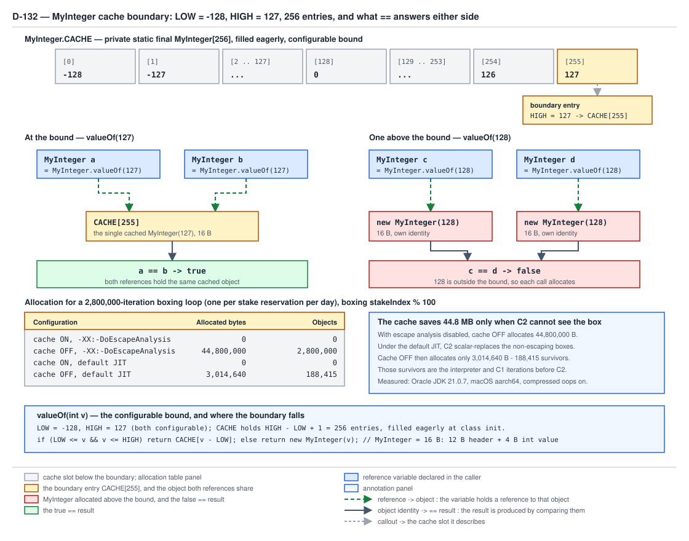

# 03 Java Core — `MyInteger` and a boxing cache — BUILD IT (§4.3)

**Target version: Java 21 LTS.** | **Part 4 of 5** | [Index](../00-index.md)
Previous: [MyStringBuilder cost and the diff table](01c-mystringbuilder-cost-and-diff.md) · Next: [Generic containers from scratch](02a-generic-containers.md)

A wrapper for an `int` is four bytes of payload wearing a twelve-byte object header. Build the
naive version and every `valueOf` call is a fresh 16-byte object; QuizStakes reserves 2.8M stakes
a day, so a boxed reservation counter costs 44.8 MB of garbage a day for 11.2 MB of actual
information. The fix is one array and one range check: hand back a shared object for the values
you see constantly, allocate only outside that window. Two consequences fall straight out of
that single decision, and they are the whole subject of this file — `==` starts working by
accident inside the window and stops one past it, and the allocation saving is real only when the
box escapes, because otherwise the JIT already got there first.

This file builds `MyInteger` and its cache (§4.3). The generic constructs (§4.4) are next door in
[Generic containers from scratch](02a-generic-containers.md) and
[Generic builders, tokens and varargs](02c-generic-builders-tokens-and-varargs.md); nothing about
them is repeated here.

---

## 4.3.1 A `valueOf` factory with a static cache array

### The shape

Three moving parts, and no more than three:

| Part | What it is | Value in this build |
|---|---|---|
| Window | The inclusive range of values that get a shared object | `LOW = -128`, `HIGH = 127` |
| Array | One preallocated object per value in the window | `MyInteger[256]`, built in `static {}` |
| Factory | Range check, then array read or `new` | `valueOf(int)` |

The constructor is private. That is the load-bearing design choice, not the array: if callers can
say `new MyInteger(7)` the cache is advisory, and a factory that only *sometimes* returns the
shared object is worse than no cache at all because it makes identity unpredictable rather than
merely surprising. Private constructor plus static factory is the only shape that lets the class
decide identity.

The real type exists because generics in Java 21 cannot hold primitives — `List<int>` does not
compile, a `Map<Integer, Reservation>` key must be a reference — so every `int` crossing into a
collection, an `Optional`, a nullable field or a reflective call is boxed, implicitly. That
implicitness is why the cache matters: the allocation is invisible at the call site.

### The index arithmetic, spelled out

The array is zero-based; the window starts at a negative number. The bridge is `v - LOW`, which
for `LOW = -128` is `v + 128`:

| `valueOf(v)` | `v - LOW` | Index |
|---|---|---|
| `valueOf(-128)` | `-128 - (-128)` | `0` |
| `valueOf(-1)` | `-1 - (-128)` | `127` |
| `valueOf(0)` | `0 - (-128)` | `128` |
| `valueOf(127)` | `127 - (-128)` | `255` |

Array length is `(HIGH - LOW) + 1` = `(127 - (-128)) + 1` = `256`. The off-by-one that people
write here is `HIGH - LOW` without the `+ 1`, which drops `valueOf(127)` off the end and throws
`ArrayIndexOutOfBoundsException` for exactly one input — the one input a test with small values
never reaches. The real `Integer` writes the same arithmetic as `i + (-IntegerCache.low)`, which
is the same expression with the sign folded differently.

### The implementation

Complete and compiled. `HIGH` reads a system property, which is §4.3.3 — it is in the class from
the start so there is only ever one version of this file to type in.

```java
public final class MyInteger implements Comparable<MyInteger> {

    /** Fixed low end. The JLS mandates -128..127 be interned, so LOW is not tunable. */
    static final int LOW = -128;

    /** High end, possibly raised by a system property. Never lowered below 127. */
    static final int HIGH;

    private static final MyInteger[] CACHE;

    private final int value;

    static {
        int h = 127;
        String configured = System.getProperty("quizstakes.MyInteger.cache.high");
        if (configured != null) {
            try {
                h = Math.max(Integer.parseInt(configured), 127);
                h = Math.min(h, Integer.MAX_VALUE - (-LOW) - 1);
            } catch (NumberFormatException ignored) {
                // unparseable property: keep the default bound
            }
        }
        HIGH = h;

        MyInteger[] built = new MyInteger[(HIGH - LOW) + 1];
        int v = LOW;
        for (int i = 0; i < built.length; i++) {
            built[i] = new MyInteger(v++);
        }
        CACHE = built;
    }

    private MyInteger(int value) {
        this.value = value;
    }

    /** Cache ON path: shared object inside the window, fresh object outside it. */
    public static MyInteger valueOf(int v) {
        if (v >= LOW && v <= HIGH) {
            return CACHE[v - LOW];
        }
        return new MyInteger(v);
    }

    /** Cache OFF path: always a fresh object. Used only by the allocation harness. */
    public static MyInteger uncached(int v) {
        return new MyInteger(v);
    }

    public int intValue() {
        return value;
    }

    static int cacheSize() {
        return CACHE.length;
    }

    @Override
    public boolean equals(Object o) {
        return o instanceof MyInteger other && other.value == this.value;
    }

    @Override
    public int hashCode() {
        return value;
    }

    @Override
    public int compareTo(MyInteger other) {
        return Integer.compare(this.value, other.value);
    }

    @Override
    public String toString() {
        return Integer.toString(value);
    }
}
```

`HIGH` and `CACHE` are both `final` and both assigned in the same `static` block, in an order the
compiler enforces: `HIGH` must be assigned before the array-length expression reads it. `LOW` is
a compile-time constant, so `v >= LOW` inlines to `v >= -128`.

**Gotcha:** `uncached` exists only so §4.3.4 can measure the no-cache configuration in the same
process. A production class would not expose it — an escape hatch that returns a
non-canonical instance re-introduces exactly the unpredictable identity the private constructor
was there to prevent.

> A boxing cache is a static array of preallocated instances over a fixed value window, reached
> through a private-constructor factory that returns the shared instance inside the window and a
> fresh one outside it.

---

## 4.3.2 The boundary, proved `[PROVE]`

### The mechanism

Inside the window, two calls with the same argument read the same array slot, so they return the
same reference and `==` is `true`. Outside it, two calls each execute `new`, so they return
distinct references and `==` is `false`. Nothing else changed — same class, same method, same
argument shape. The only difference is which branch of one `if` ran.

That is a step function at `HIGH`, and it is the reason `==` on boxed values is a live production
bug rather than a style complaint. A comparison written as `openReservations == expected` works
for every value a test fixture ever uses and fails the first time a client holds 128 open stake
reservations. The failure is silent — no exception, just a `false` that should have been `true`,
which reads downstream as "no matching reservation" and takes a branch nobody tested.



**D-132** — `MyInteger` cache boundary: at 127 both references point at one cached object and
`==` is `true`; at 128 each `valueOf` allocates, so `==` is `false`. The right-hand panel is the
2.8M-iteration allocation result from §4.3.4.

### The harness

```java
public final class BoundaryProof {
    public static void main(String[] args) {
        System.out.println("LOW=" + MyInteger.LOW + " HIGH=" + MyInteger.HIGH
                + " cacheSize=" + MyInteger.cacheSize());

        int[] probes = { -129, -128, 0, 126, 127, 128, 129 };
        for (int openReservations : probes) {
            MyInteger fromWallet = MyInteger.valueOf(openReservations);
            MyInteger fromLedger = MyInteger.valueOf(openReservations);
            System.out.printf("openReservations=%4d  ==  %-5b  equals  %-5b  index=%s%n",
                    openReservations,
                    fromWallet == fromLedger,
                    fromWallet.equals(fromLedger),
                    (openReservations >= MyInteger.LOW && openReservations <= MyInteger.HIGH)
                            ? String.valueOf(openReservations - MyInteger.LOW)
                            : "not cached");
        }
    }
}
```

Real output, Oracle JDK 21.0.7 (build 21.0.7+8-LTS-245), macOS aarch64:

```console
LOW=-128 HIGH=127 cacheSize=256
openReservations=-129  ==  false  equals  true   index=not cached
openReservations=-128  ==  true   equals  true   index=0
openReservations=   0  ==  true   equals  true   index=128
openReservations= 126  ==  true   equals  true   index=254
openReservations= 127  ==  true   equals  true   index=255
openReservations= 128  ==  false  equals  true   index=not cached
openReservations= 129  ==  false  equals  true   index=not cached
```

Both boundaries are visible: `-129` falls out the bottom, `128` out the top, and the printed
indices confirm the `v - LOW` arithmetic — `-128` at 0, `127` at 255. The `equals` column is
`true` on every row without exception. That is the fix: compare value, not identity, or do not box
at all. The first `## Pitfalls` entry works that through.

### What the JLS actually guarantees

The window is not a `MyInteger` invention; it is copied from a rule the language specification
imposes. JLS §5.1.7 (Boxing Conversion), Java SE 21:

> If the value `p` being boxed is the result of evaluating a constant expression (§15.29) of type
> `boolean`, `byte`, `char`, `short`, `int`, or `long`, and the result is `true`, `false`, a
> character in the range `\u0000` to `\u007f` inclusive, or an integer in the range `-128` to
> `127` inclusive, then let `a` and `b` be the results of any two boxing conversions of `p`. It is
> always the case that `a` `==` `b`.

Read the qualifier: the JLS guarantee is scoped to **constant expressions**. For an `int` computed
at runtime the specification promises nothing, and the guarantee comes instead from
`Integer.valueOf`'s javadoc, which is normative API text: "This method will always cache values in
the range -128 to 127, inclusive, and may cache other values outside of this range." The JDK
source carries the same rule as an assertion — `assert IntegerCache.high >= 127;` with the comment
`// range [-128, 127] must be interned (JLS7 5.1.7)`.

**Insight:** two separate documents guarantee the same window for two different reasons, and
neither guarantees anything above 127. "May cache other values" is the whole licence for the
tunable bound in §4.3.3, and it is also why code must never depend on values above 127 being
either cached or not cached.

**Interview:** *"Why does `Integer.valueOf(127) == Integer.valueOf(127)` differ from
`Integer.valueOf(128) == Integer.valueOf(128)`?"* — `valueOf` returns a shared instance from a
static cache over −128..127 and allocates outside it, so identity holds inside the window and
fails outside; the window is mandated by JLS §5.1.7 and by `valueOf`'s javadoc, and `==` on boxed
values is wrong at every value regardless.

The real cache has a second layer this build has no equivalent of: it is archived into the CDS
shared archive, so `IntegerCache.cache` is populated from `archivedCache` mapped out of the archive
file rather than constructed by 256 `new` calls at startup — `CDS.initializeFromArchive` runs
before the array is built, and the array is only constructed if the archive gave nothing or gave
something too small. `../wrappers-and-boxing/03a-internals-cache-configuration-and-cds.md` owns
that mechanism in full, including `IntegerCache.low`/`high` and the archive's heap regions.

---

## 4.3.3 A tunable bound read from a system property

### Why a property at all

The window is a guess about which values are hot. −128..127 is a good guess for loop counters and
tiny enumerated codes and a bad one for anything else: QuizStakes status codes run to `AA-920`,
operator counts peak at 90, and a per-client open-reservation count can be in the thousands. A
property lets a deployment widen the window without recompiling — at a cost measured below.

### Mirroring `IntegerCache`, and where the mirror breaks

The real `IntegerCache` static initializer, JDK 21 source, `java/lang/Integer.java`:

```java
int h = 127;
String integerCacheHighPropValue =
    VM.getSavedProperty("java.lang.Integer.IntegerCache.high");
if (integerCacheHighPropValue != null) {
    try {
        h = Math.max(parseInt(integerCacheHighPropValue), 127);
        // Maximum array size is Integer.MAX_VALUE
        h = Math.min(h, Integer.MAX_VALUE - (-low) -1);
    } catch( NumberFormatException nfe) {
        // If the property cannot be parsed into an int, ignore it.
    }
}
high = h;
```

Line by line: default 127; read the property; `Math.max(_, 127)` clamps the floor so the property
can only ever *raise* the bound; `Math.min(_, Integer.MAX_VALUE - 128 - 1)` clamps the ceiling so
`(high - low) + 1` cannot overflow the maximum array length; an unparseable value is swallowed and
the default stands. `MyInteger` reproduces all four behaviours exactly, substituting
`System.getProperty` for `VM.getSavedProperty`.

**Insight:** the substitution is the one thing that cannot be mirrored. `VM.getSavedProperty`
returns a property "saved at system initialization time" (its javadoc, `jdk/internal/misc/VM.java`),
because `Integer` is initialized during VM bring-up, before `System`'s property table is fully
published — `Integer` calling `System.getProperty` would be a bootstrap circularity. `MyInteger`
is an ordinary application class initialized long after bootstrap, so plain `System.getProperty`
is both available and correct for it. This is the reason `-XX:AutoBoxCacheMax` exists as a VM flag
alongside the `-D` property: the flag is turned into a saved property by the VM itself.

### Run it twice, boundary moves

```console
$ java BoundaryProof | head -1
LOW=-128 HIGH=127 cacheSize=256

$ java -Dquizstakes.MyInteger.cache.high=1000 BoundaryProof
LOW=-128 HIGH=1000 cacheSize=1129
openReservations=-129  ==  false  equals  true   index=not cached
openReservations= 127  ==  true   equals  true   index=255
openReservations= 128  ==  true   equals  true   index=256
openReservations= 129  ==  true   equals  true   index=257
```

(Rows for −128, 0 and 126 elided from the paste; all three printed `== true` as before.) `128`
flipped from `false` to `true` and now reports index 256; `-129` still falls out the bottom,
because no property touches `LOW`. `cacheSize` is `(1000 - (-128)) + 1 = 1129`. The two clamps,
exercised:

```console
$ java -Dquizstakes.MyInteger.cache.high=10 BoundaryProof | head -1
LOW=-128 HIGH=127 cacheSize=256

$ java -Dquizstakes.MyInteger.cache.high=banana BoundaryProof | head -1
LOW=-128 HIGH=127 cacheSize=256
```

What the property does **not** do:

- It never lowers the bound. `high=10` produced `HIGH=127`, because `Math.max(10, 127)` is 127.
  The JLS-mandated window is a floor, not a default.
- There is no property for the low end. `LOW` is `-128` in both `MyInteger` and `IntegerCache`,
  and no configuration reaches it.
- It is read exactly once, in class initialization. Setting it with
  `System.setProperty` after the first `valueOf` call has no effect whatsoever.
- An invalid value fails silently. `banana` produced no warning and no exception.

The same behaviour on the real `Integer`, both spellings, confirmed:

```console
$ java RealIntegerBound
Integer.valueOf(1000) == Integer.valueOf(1000) -> false

$ java -Djava.lang.Integer.IntegerCache.high=1000 RealIntegerBound
Integer.valueOf(1000) == Integer.valueOf(1000) -> true

$ java -XX:AutoBoxCacheMax=1000 RealIntegerBound
Integer.valueOf(1000) == Integer.valueOf(1000) -> true
```

**Pitfall:** raising the bound looks free and is not. The cache array and every instance in it are
reachable from a `static final` field for the life of the JVM, so the cost is permanently retained
heap, not transient allocation. Measured, forcing `MyInteger`'s class initialization and taking a
`getThreadAllocatedBytes` delta across it:

```console
$ java -Dquizstakes.MyInteger.cache.high=1000000 CacheFootprint
HIGH=1000000  entries=1000129  allocated=20008224 bytes  per entry=20.0 B
```

20.0 bytes per entry: a 16-byte `MyInteger` plus a 4-byte compressed-oop array slot. 1,000,129
entries × 20 = 20,002,580 bytes, and the measured 20,008,224 adds the ~5.6 KB of property lookup
and string parsing in the same initializer. So `high=1000000` costs **20 MB retained forever** to
make `==` accidentally work on a wider range of values that code should not be using `==` on.
(At the default 256 entries the same measurement reports 40.8 B/entry — 10,432 bytes — because
that fixed initializer overhead now dominates a tiny array. The per-entry marginal cost is the 20 B
figure.)

---

## 4.3.4 Allocation count, cache on and off `[NUM]`

### The arithmetic first

A `MyInteger` under compressed oops is 12 bytes of object header plus a 4-byte `int value`,
already 16-byte aligned, so **16 bytes**. QuizStakes reserves 2.8M stakes a day. If each
reservation boxes one small `int` and the cache is off:

```text
2,800,000 objects × 16 bytes = 44,800,000 bytes = 44.8 MB per day
```

Payload actually carried: 2,800,000 × 4 = 11.2 MB. The header is 75% of the footprint. With the
cache on and all values inside the window, the count is zero: no `new` executes at all.

### The harness

Not JMH. No forking, no `Blackhole`, no dead-code guard beyond one `volatile` sink, and the JIT's
compilation state is whatever it happens to be. Relative comparisons within a run are meaningful;
absolute figures are not portable. `../cost-model/02-master-cost-table.md` owns the canonical
harness and this one deliberately follows its shape rather than competing with it.

```java
import com.sun.management.ThreadMXBean;
import java.lang.management.ManagementFactory;

public final class AllocationHarness {

    /** One iteration per stake reservation per day at QuizStakes. */
    private static final int RESERVATIONS = 2_800_000;

    private static final ThreadMXBean BEAN =
            (ThreadMXBean) ManagementFactory.getThreadMXBean();

    /** Keeps the JIT from deleting the loop body outright. */
    private static volatile int sink;

    /** Preallocated escape target: allocated once, outside every measured region. */
    private static final MyInteger[] RESERVATION_SLOTS = new MyInteger[64];

    public static void main(String[] args) {
        // Non-escaping: the box dies inside the loop body.
        run("cache ON,  box does not escape", () -> {
            int total = 0;
            for (int stakeIndex = 0; stakeIndex < RESERVATIONS; stakeIndex++)
                total += MyInteger.valueOf(stakeIndex % 100).intValue();
            sink = total;
        });
        run("cache OFF, box does not escape", () -> {
            int total = 0;
            for (int stakeIndex = 0; stakeIndex < RESERVATIONS; stakeIndex++)
                total += MyInteger.uncached(stakeIndex % 100).intValue();
            sink = total;
        });
        // Escaping: the box is stored into a heap array the JIT cannot see through.
        run("cache ON,  box escapes to array", () -> {
            int total = 0;
            for (int stakeIndex = 0; stakeIndex < RESERVATIONS; stakeIndex++) {
                RESERVATION_SLOTS[stakeIndex & 63] = MyInteger.valueOf(stakeIndex % 100);
                total += RESERVATION_SLOTS[stakeIndex & 63].intValue();
            }
            sink = total;
        });
        run("cache OFF, box escapes to array", () -> {
            int total = 0;
            for (int stakeIndex = 0; stakeIndex < RESERVATIONS; stakeIndex++) {
                RESERVATION_SLOTS[stakeIndex & 63] = MyInteger.uncached(stakeIndex % 100);
                total += RESERVATION_SLOTS[stakeIndex & 63].intValue();
            }
            sink = total;
        });
    }

    private static void run(String label, Runnable loop) {
        loop.run();                                       // warm-up, same size
        long threadId = Thread.currentThread().threadId();
        long before = BEAN.getThreadAllocatedBytes(threadId);
        loop.run();                                       // measured pass
        long bytes = BEAN.getThreadAllocatedBytes(threadId) - before;
        System.out.printf("%-34s  %12d bytes  %9d objects at 16 B%n",
                label, bytes, bytes / 16);
    }
}
```

`stakeIndex % 100` keeps every boxed value in 0..99, comfortably inside the default window, so the
cache-ON runs should allocate nothing at all.

### Both configurations, real output

```console
$ java -XX:-DoEscapeAnalysis AllocationHarness
cache ON,  box does not escape                 0 bytes          0 objects at 16 B
cache OFF, box does not escape          44800000 bytes    2800000 objects at 16 B
cache ON,  box escapes to array                0 bytes          0 objects at 16 B
cache OFF, box escapes to array         44800000 bytes    2800000 objects at 16 B

$ java AllocationHarness
cache ON,  box does not escape                 0 bytes          0 objects at 16 B
cache OFF, box does not escape           3014640 bytes     188415 objects at 16 B
cache ON,  box escapes to array                0 bytes          0 objects at 16 B
cache OFF, box escapes to array         44800000 bytes    2800000 objects at 16 B
```

44,800,000 / 2,800,000 = 16 exactly, which is the measurement confirming the 16-byte object size
rather than an assumption fed into it.

Run-to-run variance on the one interesting row: a second default-JIT run of the same binary
reported `2883568 bytes / 180223 objects` for `cache OFF, box does not escape`. That row measures
how much of the loop ran interpreted and C1-compiled before C2 got to it, which is
timing-dependent by nature. Every other row was byte-identical across runs.

### The honest finding

**The cache saves 44.8 MB only when escape analysis cannot see the allocation.** Under the default
JIT, C2 proves the non-escaping box never leaves the loop body, scalar-replaces it into a bare
`int` in a register, and the allocation stops happening — with no cache involved. The measured
saving collapses from 44,800,000 bytes to 3,014,640 bytes, which is 188,415 objects, **6.7% of the
naive count**: purely the boxes allocated in the interpreter and C1 before C2 compiled the loop.

So the cache's real value in Java 21 is not allocation avoidance in a hot tight loop. The JIT
already handles that case, and handles it better, because scalar replacement removes the object
entirely rather than sharing one. The cache earns its keep where the box **escapes** — stored into
a `List<Integer>`, used as a map key, assigned to a field, returned across a method boundary the
JIT did not inline. That is precisely the case escape analysis cannot help with, and the fourth
harness row is the proof: with the box stored into `RESERVATION_SLOTS`, the default JIT allocates
the full 44,800,000 bytes, identical to the `-XX:-DoEscapeAnalysis` figure, and turning the cache
on takes it to zero.

| Configuration | Bytes | Objects | Reading |
|---|---|---|---|
| cache ON, no escape, default JIT | 0 | 0 | array read, nothing allocated |
| cache OFF, no escape, `-XX:-DoEscapeAnalysis` | 44,800,000 | 2,800,000 | the naive cost |
| cache OFF, no escape, default JIT | 3,014,640 | 188,415 | C2 scalar-replaced 93.3% |
| cache ON, escapes, default JIT | 0 | 0 | the cache earning its keep |
| cache OFF, escapes, default JIT | 44,800,000 | 2,800,000 | JIT cannot help |

**Insight:** `-XX:-DoEscapeAnalysis` is not the honest number and neither is the default. The flag
tells you the cost of the allocation; the default tells you what the JIT can remove in one narrow
shape. The number that predicts production is the *escaping* one, because production boxes go into
collections.

### What 44.8 MB a day actually costs

Not heap growth. Every one of those boxes is dead by the next stake reservation, so they die in
eden and are collected by a young GC that never copies them — the cost is young-collection
*frequency*. At a 44.8 MB/day fill rate spread over a day the extra GC pressure is negligible;
concentrated into the 1,200/sec peak it is 19.2 KB/sec of extra eden churn, still small. Boxing on
this path is a real cost only when it multiplies: box an escaping small `int` per *ledger entry*
instead, at ~19.8M/day, and the same arithmetic gives 316.8 MB/day. Guide 06 (JVM internals) owns
eden sizing, young-collection cost and the allocation-rate-to-pause-frequency relationship.

---

## 4.3.5 Diff vs `java.lang.Integer`

`MyInteger` reproduces the cache mechanism and nothing else. Every row below is a thing the real
type does that this build does not.

| Concern | `MyInteger` (this build) | `java.lang.Integer` (JDK 21) | Why the JDK bothers |
|---|---|---|---|
| **Edge cases** | `LOW`/`HIGH` clamps, `+1` array length, unparseable property ignored | Same four behaviours, plus `assert high >= 127` guarding the JLS floor | The assertion catches a future edit that would break §5.1.7 silently |
| **CDS archive** | none; 256 `new` calls at class init | `CDS.initializeFromArchive(IntegerCache.class)` populates `archivedCache`; `cache` is the archived array when it exists and is large enough. Source comment: the archived array and its `Integer` objects "reside in the closed archive heap regions" | Every JVM start otherwise reconstructs an identical 256-object array; mapping it out of the shared archive removes that startup work and shares the pages between JVMs |
| **Intrinsics** | none | `@IntrinsicCandidate` on `valueOf(int)`, `intValue()`, `toString(int)`, `compareUnsigned`, `divideUnsigned`, `remainderUnsigned`, `bitCount`, `numberOfLeadingZeros`, `numberOfTrailingZeros`, `reverse`, `reverseBytes`, `compress`, `expand` — verified by grepping JDK 21 source. **Not** on `highestOneBit` or `rotateLeft` | The bit-twiddling bodies are portable Hacker's-Delight fallbacks; on aarch64 and x86 a single machine instruction replaces each. `valueOf` being an intrinsic lets C2 model boxing directly, which is what makes scalar replacement in §4.3.4 possible |
| **`@Stable`** | none | `@Stable static final Integer[] cache` | Tells the JIT the array elements never change after initialization, so a load from a constant index folds to a constant |
| **Supertypes** | `Comparable<MyInteger>` only | `extends Number implements Comparable<Integer>, Constable, ConstantDesc` | `Number` obliges `intValue`/`longValue`/`floatValue`/`doubleValue`, so any numeric wrapper is usable through one type — lossy narrowing included. `Comparable<Integer>` obliges a total order consistent with `equals`, which `Integer.compare` gives. `Constable`/`ConstantDesc` let an `Integer` be described as a `ldc`-able constant for `invokedynamic` bootstrap |
| **Serialization** | not `Serializable` | `Serializable` via `Number`; `serialVersionUID = 1360826667806852920L` "from JDK 1.0.2 for interoperability"; **no** `writeObject`/`readObject`, so the default serial form is the single `int value` field | The frozen UID keeps 1996 streams readable in 21. Note deserialization bypasses `valueOf` entirely, so a deserialized `Integer` with value 7 is **not** `==` the cached 7 |
| **Parsing surface** | none | `parseInt(String)`, `parseInt(String,int)`, `parseInt(CharSequence,int,int,int)`, `parseUnsignedInt`, `valueOf(String)`, `valueOf(String,int)`, `decode(String)`, `getInteger(String)` | `parseInt` returns `int` (no boxing); `valueOf(String)` boxes through the cache; `decode` additionally accepts `0x`, `0X`, `#` and leading `0` radix prefixes. All throw `NumberFormatException` — never return a sentinel, never `null` |
| **Bit-twiddling surface** | none | `bitCount`, `highestOneBit`, `lowestOneBit`, `numberOfLeadingZeros`, `numberOfTrailingZeros`, `reverse`, `reverseBytes`, `rotateLeft`, `rotateRight`, `compress`, `expand`, `signum`, `toUnsignedLong`, `toUnsignedString`, `divideUnsigned`, `remainderUnsigned`, `compareUnsigned` | Java has no unsigned `int` type, so the unsigned family is how you get unsigned semantics at all — `compareUnsigned` is `compare(x + MIN_VALUE, y + MIN_VALUE)`. The rest are the operations a `STAKE_BLOCKED`-style restriction bit mask needs |
| **Constants** | none | `MIN_VALUE = 0x80000000`, `MAX_VALUE = 0x7fffffff`, `SIZE = 32`, `BYTES = SIZE / Byte.SIZE`, `TYPE = (Class<Integer>) Class.getPrimitiveClass("int")`. `MIN_VALUE`/`MAX_VALUE`/`SIZE` are `@Native` | `@Native` emits the value into the generated JNI header so C code agrees. `TYPE` is `int.class`, **not** `Integer.class` — the distinction matters to every reflection path |
| **`@jdk.internal.ValueBased`** | not marked | marked; javac handles the annotation specially and warns on identity-sensitive use | It means: identity is not part of the contract, so do not use `==`, do not `synchronized` on one, do not rely on identity hash codes. Valhalla intends to make instances genuinely value-like, at which point identity-dependent code breaks outright rather than intermittently |
| **Null policy** | `valueOf(int)` takes a primitive, so it cannot receive `null`; `equals(null)` is `false` via `instanceof` | Same for `valueOf(int)`; `parseInt(null)` throws `NumberFormatException("Cannot parse null string")`, not NPE — an explicit source-level choice | A `NumberFormatException` for a null input keeps every parse failure on one catch clause |
| **Thread safety** | safe: `CACHE` is `static final`, assigned in `static {}`, elements immutable; class initialization is the JLS's own safe-publication barrier | Same, plus the CDS path must not reassign elements after initialization (the source says so explicitly) | Class-initialization publication is the cheapest correct barrier available — no `volatile`, no lock, on any read path |
| **Allocation tricks** | one array, one range check | the cache, `@Stable`, the CDS archive, `valueOf` as an intrinsic, and `Integer` deliberately kept to one `int` field so it stays 16 bytes | Each layer removes a different cost: the array removes the allocation, `@Stable` removes the load, the archive removes the startup construction, the intrinsic lets C2 remove the box altogether |

The one-line summary: `MyInteger` is a faithful model of `IntegerCache`'s *arithmetic* and a model
of nothing else. It has no archive, no intrinsics, no `Number` supertype, no `@Stable`, no
serialization, no parsing, no bit operations, and no `ValueBased` marker. Do not read a benchmark
of `MyInteger` as a benchmark of `Integer`.

---

## Pitfalls

### Trusting `==` on boxed values because a test with small numbers passed

**Wrong**

```java
MyInteger fromWallet = MyInteger.valueOf(openReservations);
MyInteger fromLedger = MyInteger.valueOf(openReservations);
if (fromWallet == fromLedger) {
    // reconcile the reservation count
}
```

Real output from `BoundaryProof`, the two rows that matter:

```console
openReservations= 127  ==  true   equals  true   index=255
openReservations= 128  ==  false  equals  true   index=not cached
```

The test fixture uses 3 open reservations and passes. The client with 128 open reservations takes
the un-reconciled branch, silently.

**Right**

```java
if (fromWallet.equals(fromLedger)) { /* reconcile */ }
// better still: never box a count that only needs comparing
int fromWalletCount = wallet.openReservations();
int fromLedgerCount = ledger.openReservations();
if (fromWalletCount == fromLedgerCount) { /* reconcile */ }
```

`equals` compares `value` and is `true` on every row of the harness output. The primitive version
removes the question.

**Why people believe it:** it demonstrably works. Every value a developer types by hand while
exploring — 0, 1, 5, 42 — is inside −128..127, so `==` returns the right answer hundreds of times
before it returns the wrong one, and the wrong answer arrives with no exception and no log line.

### Assuming the cache range is guaranteed wider than −128..127

**Wrong**

```java
// "The JVM caches small integers, and 1000 is small."
MyInteger walletCount = MyInteger.valueOf(1000);
MyInteger ledgerCount = MyInteger.valueOf(1000);
assert walletCount == ledgerCount;
```

```console
$ java RealIntegerBound
Integer.valueOf(1000) == Integer.valueOf(1000) -> false
```

**Right**

Treat −128..127 as the only guaranteed window, and treat anything above it as an
implementation-and-configuration detail that can change under you:

```java
assert MyInteger.valueOf(1000).equals(MyInteger.valueOf(1000));
```

Because the window *can* be widened, code must not depend on identity either holding or failing
above 127. `java -Dquizstakes.MyInteger.cache.high=1000` flips the same comparison to `true`, so a
test asserting `false` is as broken as one asserting `true`.

**Why people believe it:** `valueOf`'s javadoc says "may cache other values outside of this range",
and on some builds and configurations it does — including whenever anything on the command line set
`-XX:AutoBoxCacheMax` or `-Djava.lang.Integer.IntegerCache.high`. A permission read as a promise.

### Synchronizing on a boxed value

**Wrong**

```java
MyInteger reservationSlot = MyInteger.valueOf(clientShard);   // clientShard in 0..63
synchronized (reservationSlot) {
    ledger.appendReservation(clientShard);
}
```

Two problems at once, and they are opposite problems. Inside the cache window every caller with
the same `clientShard` locks the *same* shared object — so a `stakeSettlementWorker` in a
completely unrelated subsystem that also boxed 7 contends on your lock, across the whole JVM.
Outside the window every caller gets a *fresh* object, so the block excludes nobody and the
mutual exclusion silently disappears. Raising the cache bound changes which failure you get.
`java.lang.Integer` is `@jdk.internal.ValueBased` precisely to make this a compiler warning.

**Right**

```java
private final Object[] shardLocks = createShardLocks(64);   // dedicated, private, never shared

synchronized (shardLocks[clientShard]) {
    ledger.appendReservation(clientShard);
}
```

A lock object must be private to the thing it protects and must have identity by design.

**Why people believe it:** `synchronized` accepts any reference, the code compiles, and inside the
cache window it appears to work — the shared cached object really does provide mutual exclusion,
just to far more callers than intended. The bug surfaces as unexplained contention long before it
surfaces as a lost update.

### Treating a raised cache bound as a free optimisation

**Wrong**

```bash
# "More cached values, fewer allocations. Free win."
java -Dquizstakes.MyInteger.cache.high=1000000 -jar quizstakes-ledger.jar
```

```console
$ java -Dquizstakes.MyInteger.cache.high=1000000 CacheFootprint
HIGH=1000000  entries=1000129  allocated=20008224 bytes  per entry=20.0 B
```

20 MB of heap, reachable from a `static final` field, retained for the life of the JVM, allocated
during class initialization whether or not a single one of those million values is ever requested.
The array never shrinks and the entries are never collected.

**Right**

Leave the bound alone and remove the boxing instead — `int` fields, `int[]`, primitive-specialised
`IntStream`, or a `long` accumulator. If a boxed value genuinely escapes on a hot path and the
values are provably clustered, measure the escaping allocation first (§4.3.4's fourth harness row
is the shape) and raise the bound only as far as the measured cluster.

**Why people believe it:** the trade is invisible from the flag. Allocation rate is easy to see in
a GC log; 20 MB of permanently live old-gen array attributed to `<clinit>` is not, and it looks
like baseline footprint rather than a configuration choice. Guide 06 covers reading it out of a
heap dump.

---

## Cheat sheet

| Item | Value / fact |
|---|---|
| Cache window | `LOW = -128` (fixed), `HIGH = 127` (raisable) |
| Array length | `(HIGH - LOW) + 1` = 256 |
| Index arithmetic | `CACHE[v - LOW]`; `-128` → 0, `0` → 128, `127` → 255 |
| `valueOf(127) == valueOf(127)` | `true` |
| `valueOf(128) == valueOf(128)` | `false` |
| JLS §5.1.7 scope | guarantees `a == b` only for **constant expressions** in −128..127 |
| Runtime guarantee | `Integer.valueOf` javadoc: "always cache values in the range -128 to 127" |
| Real property | `java.lang.Integer.IntegerCache.high`, read via `VM.getSavedProperty` |
| VM flag spelling | `-XX:AutoBoxCacheMax=N` |
| Property clamps | `Math.max(n, 127)` floor; `Math.min(n, Integer.MAX_VALUE - 128 - 1)` ceiling; unparseable ignored silently |
| No low-end property | `LOW` is `-128`, unconfigurable |
| `MyInteger` size | 16 B = 12 B header + 4 B `int` |
| 2.8M boxes uncached | 44,800,000 B = 44.8 MB |
| Default JIT, non-escaping | 3,014,640 B / 188,415 objects — C2 scalar-replaced 93.3% |
| Default JIT, escaping | 44,800,000 B / 2,800,000 objects — cache ON takes it to 0 |
| Cache cost per entry | 20.0 B measured (16 B object + 4 B compressed-oop slot), retained forever |
| Real `Integer` supertypes | `Number`, `Comparable<Integer>`, `Constable`, `ConstantDesc` |
| Real `Integer` markers | `@jdk.internal.ValueBased`, `@Stable` on `cache`, `@IntrinsicCandidate` on `valueOf` |
| `serialVersionUID` | `1360826667806852920L`, no `writeObject`/`readObject` |
| `Integer.TYPE` | `int.class`, not `Integer.class` |
| Never | `==` on boxed values; `synchronized` on a boxed value |

---

## Self-test

**Q1.** Why is the array length `(HIGH - LOW) + 1` rather than `HIGH - LOW`, and what breaks if you
get it wrong?

<details><summary>Answer</summary>

The window is inclusive at both ends, so it contains `HIGH - LOW + 1` values: from −128 to 127
inclusive is 256 values, not 255. With `HIGH - LOW` the array is 255 long, indices 0..254, and
`valueOf(127)` computes index `127 - (-128) = 255`, one past the end, throwing
`ArrayIndexOutOfBoundsException`. It fails for exactly one input out of 256, and that input is the
top of the window — the value a test fixture using small numbers never reaches. Every other value
works, which is what makes the bug survive review.

</details>

**Q2.** What exactly does JLS §5.1.7 guarantee, and what does it not guarantee?

<details><summary>Answer</summary>

It guarantees that if the boxed value `p` is the result of a **constant expression** (§15.29) and
is `true`, `false`, a character in `\u0000` to `\u007f`, or an integer in −128 to 127, then any two
boxing conversions of `p` produce references that are `==`. That is all. It says nothing about
values computed at runtime, and nothing about any value above 127.

The runtime guarantee comes from a different document: `Integer.valueOf`'s javadoc, which is
normative API text, promises the −128..127 cache for any argument, and adds "may cache other
values outside of this range" — a permission, not a promise. The JDK source pins the floor with
`assert IntegerCache.high >= 127;` commented `// range [-128, 127] must be interned (JLS7 5.1.7)`.

</details>

**Q3.** Why does `MyInteger` read `System.getProperty` where `IntegerCache` reads
`VM.getSavedProperty`?

<details><summary>Answer</summary>

`Integer` is initialized during VM bring-up, before `System`'s property table is fully published,
so calling `System.getProperty` from `IntegerCache`'s static initializer would be a bootstrap
circularity. `jdk.internal.misc.VM` keeps a snapshot of the properties taken at system
initialization time — its javadoc says "the system property of the specified key saved at system
initialization time" — and `getSavedProperty` reads that snapshot. This is also why
`-XX:AutoBoxCacheMax=N` works: the VM turns the flag into a saved property.

`MyInteger` is an ordinary application class, initialized long after bootstrap, so plain
`System.getProperty` is both available and correct. The observable behaviour is the same in both
cases: read once, at class initialization, and never again.

</details>

**Q4.** Under the default JIT, boxing 2.8M non-escaping small `int`s without a cache allocated
3,014,640 bytes rather than 44,800,000. Explain the gap, and say what the cache is actually for.

<details><summary>Answer</summary>

C2's escape analysis proves the box never leaves the loop body, scalar-replaces it into a bare
`int` in a register, and the allocation stops happening — no cache involved. The 3,014,640 bytes
(188,415 objects, 6.7% of the naive count) are the boxes allocated in the interpreter and C1
before C2 compiled the loop. That figure varies run to run because it is a function of compilation
timing: a repeat run gave 2,883,568 bytes / 180,223 objects.

So the cache is not for hot tight loops; the JIT handles those better, because scalar replacement
removes the object entirely rather than sharing one. The cache is for boxes that **escape** — into
a `List<Integer>`, a map key, a field, a return value across an uninlined boundary — which escape
analysis cannot touch. Measured: with the box stored into a preallocated array, the default JIT
allocated the full 44,800,000 bytes, identical to `-XX:-DoEscapeAnalysis`, and switching the cache
on took it to zero.

</details>

**Q5.** A colleague sets `-Dquizstakes.MyInteger.cache.high=10` to shrink the cache and reports it
had no effect. Why not?

<details><summary>Answer</summary>

`Math.max(Integer.parseInt(configured), 127)` clamps the value to a floor of 127, so 10 becomes
127 and the cache is the default 256 entries. Confirmed:
`java -Dquizstakes.MyInteger.cache.high=10 BoundaryProof` printed
`LOW=-128 HIGH=127 cacheSize=256`. The property can only ever raise the bound, because the
JLS-mandated −128..127 window must always be interned — allowing it to shrink would break
§5.1.7. There is also no property for the low end at all: `LOW` is `-128` in both `MyInteger` and
the real `IntegerCache`. The real `Integer` applies the identical clamp.

</details>

**Q6.** Why is `synchronized (someBoxedInteger)` wrong in two opposite ways, and what does
`@jdk.internal.ValueBased` have to do with it?

<details><summary>Answer</summary>

Inside the cache window the box is a JVM-wide shared singleton, so every unrelated piece of code
that boxed the same value locks the same monitor — accidental global contention, and a deadlock
risk between subsystems that never heard of each other. Outside the window every `valueOf`
allocates a fresh object, so the `synchronized` block excludes nobody and the mutual exclusion
silently vanishes. Which failure you get depends on the value and on the configured cache bound,
so the same code can flip behaviour on a command-line flag.

`@jdk.internal.ValueBased` on `Integer` declares that identity is not part of the type's contract:
do not use `==`, do not synchronize on it, do not depend on its identity hash. javac treats the
annotation specially and warns on identity-sensitive use. Under Valhalla these instances are
intended to become genuinely value-like, at which point identity-dependent code fails outright
instead of intermittently.

</details>

---

## Open questions

- none

---

**Leaves covered:** 4.3.1, 4.3.2, 4.3.3, 4.3.4, 4.3.5 (5 leaves)
**Leaves deferred:** none
**Diagrams included:** D-132
**Target version:** Java 21 LTS
**Lines:** 846
