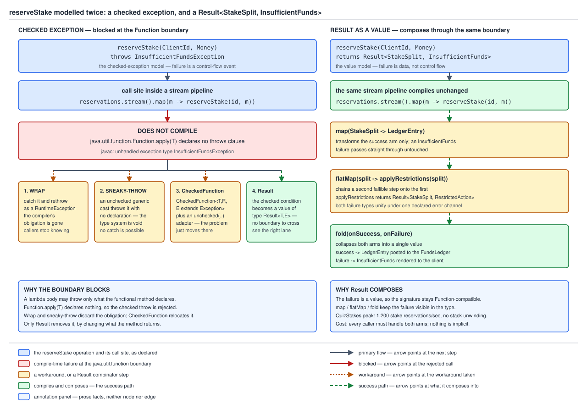

# 03 Java Core — Generic containers from scratch — Pair, Either, Result, MyOptional — BUILD IT (§4.4 (4.4.1–4.4.3))

**Target version: Java 21 LTS.** | **Part 4 of 5** | [Index](../00-index.md)
Previous: [MyInteger and a boxing cache](02-myinteger-and-generics.md) · Next: [The typesafe heterogeneous container and a generic Stack](02b-typesafe-container-and-generic-stack.md)

Four containers, one shape each. The map before the streets:

| Container | Type parameters | What it models | JDK equivalent |
|---|---|---|---|
| `Pair<A,B>` | `A` first component, `B` second | Two values that travel together — `(RestrictionType, RestrictionSource)` | none general; `Map.Entry<K,V>` is a map-facing view, not a tuple |
| `Either<L,R>` | `L` left case, `R` right | Exactly one of two *unrelated* outcomes — a machine decision or a human referral | none |
| `Result<T,E>` | `T` success value, `E` failure value | A fallible operation whose failure is data, not control flow | none |
| `MyOptional<T>` | `T` the possibly-absent value | Zero or one value, with absence in the type | `java.util.Optional<T>` |
| `GateSet`, `ReservationStack<E>` | keyed by type token / `E` the element type | The other two members of the family — many values of *different* types in one bag, and a LIFO over a growable array | `AnnotatedElement.getAnnotation` in spirit; `java.util.ArrayDeque<E>` |

The first three are product and sum types the language does not ship: `Pair` a product, `Either` a
sum, `Result` a sum biased toward success. `MyOptional` is a generic *implementation* exercise about
API shape — ten members, and the interesting question is which of them take a value and which take a
function. The last row is the other half of the family and lives in
[The typesafe heterogeneous container and a generic Stack](02b-typesafe-container-and-generic-stack.md):
`GateSet` for the limits of `Class<T>` as a key, `ReservationStack` for the one unchecked cast every
array-backed generic collection needs.

The **"Diff vs the real one" table for the whole of §4.4** is leaf 4.4.10, in
[Generic builders, type tokens and varargs](02c-generic-builders-tokens-and-varargs.md). This file
ships the builds and the evidence; that file scores them against the JDK.

All code below was compiled and run on **Oracle JDK 21.0.7 (build 21.0.7+8-LTS-245), macOS aarch64
(Apple silicon)**, compressed oops on.
---

## 4.4.1 `Pair<A,B>` and `Either<L,R>` `[BUILD]`

`Pair` is a product: an `A` **and** a `B`. `Either` is a sum: an `L` **or** an `R`, never both,
never neither. That one word decides the implementation — a product is one class with two fields, a
sum is two classes with one field each.

**Why they exist here.** Restriction identity in QuizStakes is the pair
`(RestrictionType, RestrictionSource)`, not the type alone: `STAKE_BLOCKED` from
`SYSTEM_ONBOARDING` lifts automatically at `AA-801`, the same type from `ADMIN` does not. Two
required components, equality over both — a product. Document verification yields either
`AA-611 DOCUMENTS_VERIFIED` with a vendor reference or `AA-650 DOCUMENTS_REFERRED` with a queue
position — one of two, different payloads — a sum.

**Why `record` and `sealed interface`, not hand-written classes.** A `record` generates
`equals`/`hashCode`/`toString` from its component list, and that generated contract *is* the tuple
contract: componentwise equality, a hash over both, a `toString` naming both. Hand-writing them
buys nothing and risks the classic asymmetry bug, so `Pair` is a record with a static factory so
the diamond is not spelled at every call site.

`Either` cannot be one record — the cases carry different payloads. It wants a **sealed interface
with two record implementations**, because sealing is what makes a pattern-matching `switch`
*exhaustive*: the permitted set is closed at `{Left, Right}`, so a switch covering both needs no
`default`. An unsealed interface would force a `default` that can only throw, and a third case
added later would compile and fail at runtime instead of failing the build.

```java
enum RestrictionType { STAKE_BLOCKED, WITHDRAWAL_HELD, DEPOSIT_LIMITED }
enum RestrictionSource { SYSTEM_ONBOARDING, SYSTEM_COMPLIANCE, ADMIN, CLIENT }

record Pair<A, B>(A first, B second) {
    Pair {
        Objects.requireNonNull(first, "first");
        Objects.requireNonNull(second, "second");
    }
    static <A, B> Pair<A, B> of(A first, B second) { return new Pair<>(first, second); }
    <C> Pair<A, C> withSecond(C replacement) { return new Pair<>(first, replacement); }
    Pair<B, A> swap() { return new Pair<>(second, first); }
}

sealed interface Either<L, R> permits Either.Left, Either.Right {
    record Left<L, R>(L value) implements Either<L, R> {
        public Left { Objects.requireNonNull(value, "value"); }
    }
    record Right<L, R>(R value) implements Either<L, R> {
        public Right { Objects.requireNonNull(value, "value"); }
    }
    static <L, R> Either<L, R> left(L value)  { return new Left<>(value); }
    static <L, R> Either<L, R> right(R value) { return new Right<>(value); }

    default boolean isLeft() { return this instanceof Left<L, R>; }

    default <T> T fold(Function<? super L, ? extends T> onLeft,
                       Function<? super R, ? extends T> onRight) {
        return switch (this) {
            case Left<L, R> l  -> onLeft.apply(l.value());
            case Right<L, R> r -> onRight.apply(r.value());
        };
    }
}
```

The consumer, with the exhaustive switch:

```java
record MachineDecision(String statusCode, String vendorReference) {}
record HumanReferral(String statusCode, String queue, int casesAhead) {}

static Either<HumanReferral, MachineDecision> verifyDocument(int quality) {
    return quality >= 80
        ? Either.right(new MachineDecision("AA-611 DOCUMENTS_VERIFIED", "IDV-8831207"))
        : Either.left(new HumanReferral("AA-650 DOCUMENTS_REFERRED", "REVIEW_QUEUED", 37));
}

public static void main(String[] args) {
    var key      = Pair.of(RestrictionType.STAKE_BLOCKED, RestrictionSource.SYSTEM_ONBOARDING);
    var same     = Pair.of(RestrictionType.STAKE_BLOCKED, RestrictionSource.SYSTEM_ONBOARDING);
    var adminKey = Pair.of(RestrictionType.STAKE_BLOCKED, RestrictionSource.ADMIN);

    System.out.println("key            = " + key);
    System.out.println("key.equals(same)     = " + key.equals(same));
    System.out.println("hash equal           = " + (key.hashCode() == same.hashCode()));
    System.out.println("key.equals(adminKey) = " + key.equals(adminKey));
    System.out.println("swap()         = " + key.swap());
    System.out.println("distinct keys  = " + List.of(key, same, adminKey).stream().distinct().count());

    for (int quality : new int[] { 91, 44 }) {
        Either<HumanReferral, MachineDecision> verdict = verifyDocument(quality);
        String line = switch (verdict) {
            case Either.Left<HumanReferral, MachineDecision> l ->
                "referred: " + l.value().statusCode() + " (" + l.value().casesAhead() + " ahead)";
            case Either.Right<HumanReferral, MachineDecision> r ->
                "decided:  " + r.value().statusCode() + " ref=" + r.value().vendorReference();
        };
        System.out.println("quality=" + quality + " -> " + line);
        System.out.println("   isLeft=" + verdict.isLeft()
            + " folded=" + verdict.fold(HumanReferral::statusCode, MachineDecision::statusCode));
    }
}
```

```console
key            = Pair[first=STAKE_BLOCKED, second=SYSTEM_ONBOARDING]
key.equals(same)     = true
hash equal           = true
key.equals(adminKey) = false
swap()         = Pair[first=SYSTEM_ONBOARDING, second=STAKE_BLOCKED]
distinct keys  = 2
quality=91 -> decided:  AA-611 DOCUMENTS_VERIFIED ref=IDV-8831207
   isLeft=false folded=AA-611 DOCUMENTS_VERIFIED
quality=44 -> referred: AA-650 DOCUMENTS_REFERRED (37 ahead)
   isLeft=true folded=AA-650 DOCUMENTS_REFERRED
```

`distinct keys = 2` is the record contract doing real work: `distinct()` uses `equals`/`hashCode`,
so the two `SYSTEM_ONBOARDING` pairs collapse and the `ADMIN` one survives — restriction identity is
the pair, and the pair knows it without a hand-written line.

### The exhaustiveness proof: add a third permitted subtype

```java
sealed interface Verdict3<L, R> permits Verdict3.Left, Verdict3.Right, Verdict3.Pending {
    record Left<L, R>(L value) implements Verdict3<L, R> {}
    record Right<L, R>(R value) implements Verdict3<L, R> {}
    record Pending<L, R>(String statusCode) implements Verdict3<L, R> {}
}

static String describe(Verdict3<String, String> verdict) {
    return switch (verdict) {                          // only two cases
        case Verdict3.Left<String, String> l  -> "referred: " + l.value();
        case Verdict3.Right<String, String> r -> "decided: "  + r.value();
    };
}
```

```console
ThirdSubtype.java:9: error: the switch expression does not cover all possible input values
        return switch (verdict) {
               ^
1 error
```

Adding `AA-600 DOCUMENTS_REQUESTED` as a third outcome breaks the build at every decision site,
rather than shipping and throwing at 3,400 settlements/sec. With an unsealed interface and a
`default -> throw`, the same change compiles clean.

**Insight:** exhaustiveness is a *sealing* feature, not a `switch` feature. The switch may omit
`default` only because the compiler can enumerate the permitted subtypes.

**Interview:** "Why is `Either` two records under a sealed interface rather than one record with two
nullable fields?" — the one-record form cannot express "exactly one", so every reader checks both
fields and every switch needs a `default`; sealing puts the invariant in the type and
exhaustiveness enforces it at compile time.

The JDK ships `Map.Entry<K,V>` but no general `Pair`, and on 21.0.7
`Map.entry("STAKE_BLOCKED", "SYSTEM_ONBOARDING")` returns a `java.util.KeyValueHolder` that is
**not** `Serializable`, while `AbstractMap.SimpleEntry` is. The §4.4 Diff table covers why.

> A **product type** holds every component at once and gets componentwise identity free from
> `record`; a **sum type** holds exactly one of a closed set of cases, and `sealed` is what turns
> that closure into a compile-time exhaustiveness guarantee.

---

## 4.4.2 `Result<T,E>` as the checked-exception alternative `[BUILD]`

`Result<T,E>` is `Either` with an opinion: right is success, left is failure, and the combinators
know which is which. It earns its own name because of a specific, reproducible hole in the language.

Model `reserveStake`'s failure as a checked exception, then run it over a batch of stakes:

```java
static StakeSplit reserveStake(ClientId client, Money stake) throws InsufficientFundsException {
    throw new InsufficientFundsException("CLIENT_CASH_AVAILABLE exhausted for " + client.value());
}

static List<StakeSplit> reserveAll(ClientId client, List<Money> stakes) {
    return stakes.stream()
                 .map(stake -> reserveStake(client, stake))
                 .toList();
}
```

```console
CheckedInStream.java:20: error: unreported exception InsufficientFundsException; must be caught or declared to be thrown
                     .map(stake -> reserveStake(client, stake))
                                               ^
1 error
```

That diagnostic is the evidence, and it is not a stream limitation.
`java.util.function.Function` declares `R apply(T t)` with **no** `throws` clause, so a lambda whose
body can throw a checked exception does not conform. Declaring `reserveAll` itself `throws
InsufficientFundsException` does not help: the lambda is a separate method implementing
`Function.apply`, and it is that signature the exception must fit through. Every interface in
`java.util.function` has the same property.



**D-133** — the same `reserveStake` operation modelled twice: as a checked exception meeting the
`Function` boundary (blocked, with the four workarounds branching off) and as a
`Result<StakeSplit, InsufficientFunds>` composing through `map`, `flatMap` and `fold`.

**Workaround 1 — wrap in an unchecked exception.** Catch inside the lambda and rethrow wrapped. It
compiles and keeps the cause, but discards the compiler's obligation: no caller is told the
operation can fail, so the handler gets written by whoever reads the incident report. The JDK does
this itself (`UncheckedIOException`).

**Workaround 2 — sneaky-throw.** A generic method whose declared throws type-variable is inferred to
`RuntimeException` at the call site, letting a checked exception escape with no `throws` clause. It
defeats the type system rather than working within it: the exception really is thrown, but the
compiler considers `catch (InsufficientFundsException)` upstream unreachable, so writing one is
itself an error in the general case. Leaf 4.6.6 in
[`03e-checked-crossing-cleaner-and-diff.md`](03e-checked-crossing-cleaner-and-diff.md) owns the build.

**Workaround 3 — a custom functional interface.** `CheckedFunction<T, R, E extends Exception>` with
`R apply(T t) throws E` makes the lambda compile. The problem relocates: `Stream.map` still wants a
`Function`, so an adapter is needed, and the adapter must do workaround 1, 2 or 4 internally. Leaf
4.6.5 in [`03e-checked-crossing-cleaner-and-diff.md`](03e-checked-crossing-cleaner-and-diff.md) owns it.

**Workaround 4 — `Result`.** Change the signature so the failure is a *value*. Nothing is thrown,
so no `throws` clause exists, so the `Function` boundary is satisfied trivially.

The wider checked-exceptions-and-lambdas problem, including which workaround belongs in which layer,
is [`../exceptions/02a-checked-exceptions-and-lambdas.md`](../exceptions/02a-checked-exceptions-and-lambdas.md).

```java
sealed interface StakeFailure permits InsufficientFunds, RestrictedAction { String statusCode(); }
record InsufficientFunds(ClientId client, Money requested, Money stakeable) implements StakeFailure {
    public String statusCode() { return "STAKE_REJECTED_INSUFFICIENT_FUNDS"; }
}
record RestrictedAction(ClientId client, String restrictionType, String restrictionSource)
        implements StakeFailure {
    public String statusCode() { return "STAKE_BLOCKED"; }
}

sealed interface Result<T, E> permits Result.Ok, Result.Err {

    record Ok<T, E>(T value)  implements Result<T, E> { public Ok  { Objects.requireNonNull(value); } }
    record Err<T, E>(E error) implements Result<T, E> { public Err { Objects.requireNonNull(error); } }

    static <T, E> Result<T, E> ok(T value)  { return new Ok<>(value); }
    static <T, E> Result<T, E> err(E error) { return new Err<>(error); }

    default boolean isOk() { return this instanceof Ok<T, E>; }

    default <U> Result<U, E> map(Function<? super T, ? extends U> mapper) {
        return switch (this) {
            case Ok<T, E> ok   -> new Ok<>(mapper.apply(ok.value()));
            case Err<T, E> err -> new Err<>(err.error());
        };
    }

    default <U> Result<U, E> flatMap(Function<? super T, ? extends Result<U, E>> mapper) {
        return switch (this) {
            case Ok<T, E> ok   -> Objects.requireNonNull(mapper.apply(ok.value()), "mapper returned null");
            case Err<T, E> err -> new Err<>(err.error());
        };
    }

    default <F> Result<T, F> mapErr(Function<? super E, ? extends F> mapper) {
        return switch (this) {
            case Ok<T, E> ok   -> new Ok<>(ok.value());
            case Err<T, E> err -> new Err<>(mapper.apply(err.error()));
        };
    }

    default <R> R fold(Function<? super T, ? extends R> onOk,
                       Function<? super E, ? extends R> onErr) {
        return switch (this) {
            case Ok<T, E> ok   -> onOk.apply(ok.value());
            case Err<T, E> err -> onErr.apply(err.error());
        };
    }

    default T orElseThrow(Function<? super E, ? extends RuntimeException> onErr) {
        return switch (this) {
            case Ok<T, E> ok   -> ok.value();
            case Err<T, E> err -> throw onErr.apply(err.error());
        };
    }
}
```

`case Err<T, E> err -> throw onErr.apply(err.error());` is a Java 14+ switch-expression feature: a
`throw` is a legal arrow-case body and contributes nothing to the result type.

The two-step domain flow. `reserveStake` splits the stake — bonus portion is
`min(BONUS_AVAILABLE, 10% of stake)` **rounded down** to the minor unit, cash covers the remainder —
then `applyRestrictions` checks for an active `STAKE_BLOCKED`:

```java
static Result<StakeSplit, InsufficientFunds> reserveStake(ClientId client, Money stake) {
    Money cash  = CASH_AVAILABLE.get(client.value());
    Money bonus = BONUS_AVAILABLE.get(client.value());
    Money stakeable = new Money(cash.amount().add(bonus.amount()), "GBP");
    if (stakeable.lessThan(stake)) {
        return Result.err(new InsufficientFunds(client, stake, stakeable));
    }
    BigDecimal tenPercent = stake.amount()
                                 .multiply(new BigDecimal("0.10"))
                                 .setScale(2, RoundingMode.DOWN);
    Money bonusLeg = new Money(tenPercent.min(bonus.amount()), "GBP");
    Money cashLeg  = stake.minus(bonusLeg);
    if (cash.lessThan(cashLeg)) {
        return Result.err(new InsufficientFunds(client, stake, stakeable));
    }
    return Result.ok(new StakeSplit(bonusLeg, cashLeg));
}

static Result<StakeSplit, RestrictedAction> applyRestrictions(ClientId client, StakeSplit split) {
    String restriction = ACTIVE_RESTRICTIONS.get(client.value());
    return restriction != null
        ? Result.err(new RestrictedAction(client, restriction, "SYSTEM_ONBOARDING"))
        : Result.ok(split);
}

static Result<StakeSplit, StakeFailure> reserveAndCheck(ClientId client, Money stake) {
    return reserveStake(client, stake)
             .<StakeFailure>mapErr(Function.identity())
             .flatMap(split -> applyRestrictions(client, split)
                                 .<StakeFailure>mapErr(Function.identity()));
}
```

Driven over `C-1001` (cash 3.00, bonus 42.00), `C-1002` (cash 0.50, bonus 42.00) and `C-1003`
(carrying `STAKE_BLOCKED`) at the canonical stake of 3.33:

```console
C-1001  RESERVED   bonus=GBP 0.33 cash=GBP 3.00 total=GBP 3.33
C-1002  REJECTED   STAKE_REJECTED_INSUFFICIENT_FUNDS InsufficientFunds[client=ClientId[value=C-1002], requested=GBP 3.33, stakeable=GBP 42.50]
C-1003  REJECTED   STAKE_BLOCKED RestrictedAction[client=ClientId[value=C-1003], restrictionType=STAKE_BLOCKED, restrictionSource=SYSTEM_ONBOARDING]

map on Err short-circuits, mapper never runs:
   isOk=false -> Err[error=InsufficientFunds[client=ClientId[value=C-1002], requested=GBP 100.00, stakeable=GBP 42.50]]

orElseThrow converts the value back into control flow at the edge:
   caught IllegalStateException: STAKE_BLOCKED
```

`C-1001` is the canonical rounding case: 3.33 splits as 0.33 bonus + 3.00 cash, summing exactly.
`C-1002` is stakeable-42.50 but cash-0.50, so the 3.00 cash leg exceeds available cash and the
second guard rejects — which is why the two guards are separate.

### What `Result` costs

**It does not unwind.** A thrown exception skips every intermediate frame; a `Result` is a return
value, so every caller between failure and handler names it in its signature. That is the discipline
checked exceptions impose, minus the compiler forcing it — nothing stops a caller ignoring the
returned `Result`. `Result` makes failure *visible*; it does not make handling it *mandatory*.

**The error type does not compose.** Chain the two steps naively:

```java
return reserveStake(client, stake)
         .flatMap(split -> applyRestrictions(client, split));
```

```console
NaiveCompose.java:127: error: incompatible types: cannot infer type-variable(s) U
                 .flatMap(split -> applyRestrictions(client, split));
                         ^
    (argument mismatch; bad return type in lambda expression
      Result<StakeSplit,RestrictedAction> cannot be converted to Result<U,InsufficientFunds>)
  where U,T,E are type-variables:
    U extends Object declared in method <U>flatMap(Function<? super T,? extends Result<U,E>>)
    T extends Object declared in interface Result
    E extends Object declared in interface Result
1 error
```

`flatMap` fixes `E`, so two steps with different `E` cannot chain. This build uses both available
fixes: a **sealed error hierarchy** (`sealed interface StakeFailure permits InsufficientFunds,
RestrictedAction`) gives the errors a common supertype, and `mapErr` widens each step's `E` to it
before the join. `Function.identity()` suffices as the widening function because the explicit
the explicit `.<StakeFailure>mapErr` witness supplies the target type. Sealing the errors also keeps the
`fold` handler exhaustive over the failure cases.

**There is no stack trace.** `InsufficientFunds` is a record, not a `Throwable`, so nothing walked
the stack. That is most of why it is cheap, and all of why triage now depends on you having put the
identifying data — `client`, `requested`, `stakeable` — into the error record.

> `Result<T,E>` moves a failure from the control-flow channel into the value channel, which is the
> only reason it fits through a `Function` boundary; the price is that unwinding, error-type
> composition and stack capture become your problem instead of the runtime's.

---

## 4.4.3 `MyOptional<T>` and the `orElse` trap `[BUILD]` `[PROVE]`

One field, one nullable reference, and an API that never lets you read it without saying what
absence means. `MyOptional<LimitSet>` in a signature is a statement the compiler carries; a
`LimitSet` that might be null is a statement in a comment.

`empty()` returns a shared singleton — an empty optional has no state worth allocating, and
`java.util.Optional` does the same with its own `EMPTY`. The unchecked cast there is safe for the
one reason unchecked casts are ever safe: the value has no `T`-typed content to get wrong.

```java
final class MyOptional<T> {

    private static final MyOptional<?> EMPTY = new MyOptional<>(null);

    private final T value;

    private MyOptional(T value) { this.value = value; }

    static <T> MyOptional<T> of(T value) {
        return new MyOptional<>(Objects.requireNonNull(value, "value"));
    }

    static <T> MyOptional<T> ofNullable(T value) {
        return value == null ? empty() : new MyOptional<>(value);
    }

    @SuppressWarnings("unchecked")
    static <T> MyOptional<T> empty() {
        return (MyOptional<T>) EMPTY;
    }

    boolean isPresent() { return value != null; }

    <U> MyOptional<U> map(Function<? super T, ? extends U> mapper) {
        Objects.requireNonNull(mapper, "mapper");
        return value == null ? empty() : MyOptional.ofNullable(mapper.apply(value));
    }

    <U> MyOptional<U> flatMap(Function<? super T, ? extends MyOptional<? extends U>> mapper) {
        Objects.requireNonNull(mapper, "mapper");
        if (value == null) return empty();
        @SuppressWarnings("unchecked")
        MyOptional<U> result = (MyOptional<U>) mapper.apply(value);
        return Objects.requireNonNull(result, "mapper returned null");
    }

    MyOptional<T> filter(Predicate<? super T> predicate) {
        Objects.requireNonNull(predicate, "predicate");
        if (value == null) return this;
        return predicate.test(value) ? this : empty();
    }

    T orElse(T other) {
        return value != null ? value : other;
    }

    T orElseGet(Supplier<? extends T> supplier) {
        Objects.requireNonNull(supplier, "supplier");
        return value != null ? value : supplier.get();
    }

    <X extends Throwable> T orElseThrow(Supplier<? extends X> exceptionSupplier) throws X {
        Objects.requireNonNull(exceptionSupplier, "exceptionSupplier");
        if (value != null) return value;
        throw exceptionSupplier.get();
    }

    void ifPresentOrElse(Consumer<? super T> action, Runnable emptyAction) {
        Objects.requireNonNull(action, "action");
        Objects.requireNonNull(emptyAction, "emptyAction");
        if (value != null) action.accept(value); else emptyAction.run();
    }

    @Override public boolean equals(Object other) {
        return other instanceof MyOptional<?> that && Objects.equals(value, that.value);
    }

    @Override public int hashCode() { return Objects.hashCode(value); }

    @Override public String toString() {
        return value == null ? "MyOptional.empty" : "MyOptional[" + value + "]";
    }
}
```

`map` routes its result through `ofNullable`, so a mapper legitimately returning null collapses to
empty rather than throwing. `flatMap` is strict on the *mapper's* return instead: a null
`MyOptional` is a bug in the mapper, not an absent value, and gets a `NullPointerException` naming
it.

The factory asymmetry is deliberate. `of(null)` throws; `ofNullable(null)` returns empty. `of` is
the assertion "I know this is present", and violating an assertion should fail at the construction
site with a trace pointing there; `ofNullable` is the adapter from a nullable legacy API. One
lenient factory would turn every "definitely present" bug into an empty optional surfacing three
layers away.

Driven against a `findLimitSet` that returns a `LimitSet` for `C-1001` and empty for `C-1002`:

```console
of / findLimitSet(C-1001) = MyOptional[LimitSet[dailyDeposit=1000.00, maxStake=50.00, monthlyLoss=5000.00]]
empty / findLimitSet(C-1002) = MyOptional.empty
ofNullable(null)         = MyOptional.empty
map(maxStake)            = MyOptional[50.00]
map on empty             = MyOptional.empty
flatMap                  = MyOptional[1000.00]
filter(maxStake > 40)    = MyOptional[LimitSet[dailyDeposit=1000.00, maxStake=50.00, monthlyLoss=5000.00]]
filter(maxStake > 60)    = MyOptional.empty
ifPresentOrElse present   -> maxStake 50.00
ifPresentOrElse absent    -> falling back to platform defaults
orElseThrow on empty     -> no LimitSet for C-1002
of(null)                 -> NullPointerException: value
```

### `[PROVE]` The `orElse` eager-evaluation trap

`orElse(T other)` takes a **value**; `orElseGet(Supplier<? extends T>)` takes a **function**. Java
evaluates arguments before the call, so `orElse(loadDefaultLimitSet())` runs the load *first,
unconditionally*, and only then asks the optional whether the result was needed. Nothing about
`orElse` is lazy and nothing can make it lazy — the laziness would have to live in the caller's
argument, and Java has no call-by-need.

Instrumented inside `ClientRestrictions.loadDefaultLimitSet()`:

```java
static int defaultLimitSetLoads = 0;

static LimitSet loadDefaultLimitSet() {
    defaultLimitSetLoads++;
    System.out.println("      >>> ClientRestrictions.loadDefaultLimitSet() hit the database");
    return new LimitSet(new BigDecimal("500.00"), new BigDecimal("25.00"), new BigDecimal("2000.00"));
}
```

```console
   present.orElse(loadDefaultLimitSet()):
      >>> ClientRestrictions.loadDefaultLimitSet() hit the database
      returned maxStake=50.00  loads=1
   present.orElseGet(MyOptionalDemo::loadDefaultLimitSet):
      returned maxStake=50.00  loads=0
   absent.orElseGet(MyOptionalDemo::loadDefaultLimitSet):
      >>> ClientRestrictions.loadDefaultLimitSet() hit the database
      returned maxStake=25.00  loads=1
```

Line 2 is the whole finding: the optional was **present**, `maxStake=50.00` came from it, the loaded
default was discarded — and the database was hit anyway. `orElseGet` on the same present optional
records `loads=0`, and on the absent one loads exactly once, which is the work actually required.

Scaled up, counting calls rather than timing them:

```console
   orElse    over 1000 reservations: loads=1000
   orElseGet over 1000 reservations: loads=0
```

1,000 iterations, 1,000 wasted loads — one per invocation, unconditionally, not a probabilistic
penalty. QuizStakes runs 2.8M stake reservations/day at 1,200/sec peak and every one consults a
`LimitSet`; if that lookup is `findLimitSet(client).orElse(loadDefaultLimitSet())` and most clients
have a stored `LimitSet`, the eager form issues 2.8M unnecessary reads/day against a table meant to
be consulted only on a cold miss.

**Pitfall:** the fix is not "always use `orElseGet`". `orElse(Money.gbp("0.00"))` is correct and
clearer than wrapping a constant in a lambda — the argument is already a value, evaluating it costs
nothing. The rule is about the *argument's cost*, not the method name.

**Interview:** "Difference between `orElse` and `orElseGet`?" — `orElse` takes an already-evaluated
value, so its argument runs on the present path too; `orElseGet` takes a supplier invoked only when
empty. `orElse` for constants, `orElseGet` for anything that computes, reads or allocates.

`Optional` as a designed API — where it belongs in a signature, why it is not a general null
replacement — is guide 04's (Modern Java). One mechanism worth keeping here: `java.util.Optional`
is `final` and does **not** implement `Serializable`, which on 21.0.7 shows up as a *compile* error,
`"incompatible types: Optional<String> cannot be converted to Serializable"`, on an `instanceof
Serializable` test. That is the mechanical reason it is a poor field type.

> `MyOptional` encodes absence in the type; `orElse` and `orElseGet` differ not in what they return
> but in *when the default is computed*, and only the supplier form defers it.

---

## Pitfalls

### Believing a `Result` type removes the need to handle the error

**Wrong**

```java
reserveAndCheck(client, Money.gbp("3.33"));    // return value ignored; compiles, no warning
```

Nothing thrown, nothing logged, the reservation silently did not happen. A checked exception would
have refused to compile.

**Right** — force the decision at the call, by folding both branches or converting back to control
flow at the service edge:

```java
String line = reserveAndCheck(client, Money.gbp("3.33")).fold(
    ok  -> "RESERVED   " + ok,
    err -> "REJECTED   " + err.statusCode() + " " + err);
```

```console
C-1003  REJECTED   STAKE_BLOCKED RestrictedAction[client=ClientId[value=C-1003], restrictionType=STAKE_BLOCKED, restrictionSource=SYSTEM_ONBOARDING]
   caught IllegalStateException: STAKE_BLOCKED
```

**Why people believe it:** `Result` is sold as the type-safe alternative to exceptions, implying the
compiler enforces something. It enforces *visibility* — the failure is in the signature — not
*handling*; ignoring a returned value is legal Java. Sealing the error hierarchy so `fold` and
`switch` stay exhaustive recovers part of the guarantee.

### Believing `orElse` is lazy because it reads like a fallback

**Wrong**

```java
LimitSet limits = findLimitSet(client).orElse(loadDefaultLimitSet());
```

```console
      >>> ClientRestrictions.loadDefaultLimitSet() hit the database
      returned maxStake=50.00  loads=1
```

The optional was present, `maxStake=50.00` came from it, the loaded default was discarded — and the
database was read anyway. Over 1,000 iterations: `loads=1000`.

**Right**

```java
LimitSet limits = findLimitSet(client).orElseGet(ClientRestrictions::loadDefaultLimitSet);
```

```console
      returned maxStake=50.00  loads=0
```

The supplier arrives uninvoked and `get()` runs only on the empty branch. `orElse` stays right for
an already-evaluated constant such as `Money.gbp("0.00")`.

**Why people believe it:** the method reads as a branch — "the value, or else this" — and in a
language with call-by-need it would be one. Java evaluates arguments before the call,
unconditionally; only a `Supplier` parameter defers anything.

### Storing an `Optional` in a field or accepting one as a parameter

**Wrong**

```java
static final class ClientLimits implements Serializable {
    private final String clientId;
    private final Optional<LimitSet> limitSet;      // Optional as a field
    ClientLimits(String clientId, Optional<LimitSet> limitSet) {
        this.clientId = clientId;
        this.limitSet = limitSet;
    }
}
```

`javac -Xlint:all` on 21.0.7 already objects, and the write then fails at runtime:

```console
OptionalFieldWrong.java:12: warning: [serial] non-transient instance field of a serializable class declared with a non-serializable type
        private final Optional<LimitSet> limitSet;
                                         ^
Optional is Serializable = false
java.io.NotSerializableException: java.util.Optional
```

**Right** — nullable field, `Optional` only on the way out:

```java
static final class ClientLimits implements Serializable {
    private static final long serialVersionUID = 1L;
    private final String clientId;
    private final LimitSet limitSet;                // may be null
    ClientLimits(String clientId, LimitSet limitSet) {
        this.clientId = clientId;
        this.limitSet = limitSet;
    }
    Optional<LimitSet> limitSet() { return Optional.ofNullable(limitSet); }
}
```

```console
wrote ClientLimits, 645 bytes
read back ClientLimits[C-1001, LimitSet[dailyDeposit=1000.00, maxStake=50.00, monthlyLoss=5000.00]]
accessor returns 50.00
absent -> 25.00
```

**Why people believe it:** "absence belongs in the type" is the right instinct, and it is right for a
*return* type — that is exactly what `MyOptional<LimitSet>` buys. A field is a different position:
it now has three states (null, empty, present) instead of two, it costs a wrapper allocation per
instance, and `java.util.Optional` is `final` and not `Serializable`, so any serializing carrier —
session state, a cache entry, an RMI payload — breaks. A parameter is worse still: the caller must
wrap, and `f(Optional.empty())` and an overload without the parameter say the same thing at
different cost.

---

## Cheat sheet

| Thing | The fact |
|---|---|
| `Pair<A,B>` | a `record`; generated `equals`/`hashCode`/`toString` are exactly the tuple contract |
| `Either<L,R>` | `sealed interface` + two records; sealing is what lets `switch` omit `default` |
| Third permitted subtype | *"the switch expression does not cover all possible input values"* at every site |
| `Either` vs `Result` | `Either` is symmetric; `Result` is biased to success, which is what makes `map` well defined |
| `Map.entry(k,v)` | returns `java.util.KeyValueHolder`, **not** `Serializable`; `AbstractMap.SimpleEntry` is |
| Checked exception in `stream().map` | *"unreported exception … must be caught or declared to be thrown"* — `Function.apply` declares no `throws` |
| Four workarounds | wrap unchecked / sneaky-throw / `CheckedFunction` + adapter / `Result` |
| `map` vs `flatMap` | `map` wraps the mapper's value; `flatMap` returns the mapper's `Result` unwrapped |
| `Result` error composition | `flatMap` fixes `E`; two different `E`s need `mapErr` widening to a sealed supertype |
| `Result` costs | no unwinding, no stack trace, ignoring the return value is legal |
| `of(null)` vs `ofNullable(null)` | `NullPointerException` vs empty — deliberate asymmetry |
| `map` vs `flatMap` null policy | `map` collapses a null mapper result to empty; `flatMap` throws on a null `MyOptional` |
| `orElse(x)` | `x` is an argument, evaluated **always**, present path included |
| `orElseGet(s)` | `s` is a `Supplier`, `get()` called **only** when empty |
| `orElse` at scale | 1,000 reservations, present optional: `loads=1000` vs `loads=0` |
| `Optional` as a field | `final` and not `Serializable` — `instanceof Serializable` is a compile error |
| Serializing an `Optional` field | `-Xlint:serial` warns, then `NotSerializableException: java.util.Optional` |

---

## Self-test

**Q1.** Why must `Either` be a sealed interface with two records rather than one record with two nullable components?

<details><summary>Answer</summary>

Because `Either` is a sum type — exactly one of two cases — and a record holding both components as
nullable fields cannot express that. Every reader would check both fields, nothing would stop
construction with both set or neither, and no switch could be exhaustive. With
`sealed interface Either<L,R> permits Left, Right` the invariant is in the type and the compiler
knows the permitted set is closed, so a switch covering both cases compiles with no `default`.
Adding a third permitted subtype then breaks the build at every decision site with *"the switch
expression does not cover all possible input values"* — exactly the behaviour you want when a new
outcome such as `AA-600 DOCUMENTS_REQUESTED` appears.

</details>

**Q2.** `reserveStake` throws `InsufficientFundsException`. Why does calling it inside `stream().map` not compile, and why does declaring the enclosing method `throws` not fix it?

<details><summary>Answer</summary>

`Stream.map` takes a `Function<T,R>`, whose abstract method is `R apply(T t)` with no `throws`
clause. A lambda's inferred throws-set must fit the target method's, so a body that can throw a
checked exception does not conform — *"unreported exception InsufficientFundsException; must be
caught or declared to be thrown"*, reported at the call inside the lambda. Declaring the enclosing
method `throws` changes nothing: the lambda is a separate method implementing `Function.apply`, and
it is that signature the exception must pass through, not the enclosing one. Every interface in
`java.util.function` behaves the same way.

</details>

**Q3.** Two steps fail with different error types. Why will `flatMap` not chain them, and what fixes it?

<details><summary>Answer</summary>

`flatMap` is `<U> Result<U,E> flatMap(Function<? super T, ? extends Result<U,E>> mapper)` — `E` is
fixed by the receiver, so the mapper must return the same error type. Chaining a
`Result<StakeSplit, InsufficientFunds>` into a step returning `Result<StakeSplit, RestrictedAction>`
fails with *"Result&lt;StakeSplit,RestrictedAction&gt; cannot be converted to
Result&lt;U,InsufficientFunds&gt;"*. Fix in two parts: give the errors a common supertype, ideally a
**sealed** one so downstream `fold` and `switch` stay exhaustive, and widen each step with `mapErr`
before joining — `.<StakeFailure>mapErr(Function.identity())`. The explicit type witness supplies
the target, so `identity()` suffices as the widening function.

</details>

**Q4.** `orElse` versus `orElseGet` — give the mechanism, and say when `orElse` is still correct.

<details><summary>Answer</summary>

`orElse(T other)` declares a *value* parameter, and Java evaluates arguments before the call, so the
expression producing `other` runs unconditionally — including when the optional is present and the
value is discarded. Measured: `present.orElse(loadDefaultLimitSet())` records `loads=1` and prints
the database-hit line; over 1,000 iterations, `loads=1000`. `orElseGet(Supplier<? extends T>)`
declares a *function* parameter, passed uninvoked, with `get()` called only on the empty branch — the
same present optional records `loads=0`. `orElse` remains correct, and clearer, for an
already-evaluated constant such as `Money.gbp("0.00")`, because evaluating it costs nothing. The
rule is about the argument's cost, not the method name.

</details>

**Q5.** `MyOptional.map` routes its result through `ofNullable`, but `flatMap` throws if the mapper returns null. Why the asymmetry, and why does `of(null)` throw while `ofNullable(null)` does not?

<details><summary>Answer</summary>

Two different things can be null and they mean different things. In `map`, the mapper returns a
plain `U`; a mapper that legitimately has no answer — `limits -> limits.maxStake()` against a
`LimitSet` whose `maxStake` is not set — returns null as *data*, and collapsing that to empty is the
useful behaviour, so `map` goes through `ofNullable`. In `flatMap`, the mapper returns a
`MyOptional<U>`; a null there is not an absent value, it is a mapper that failed to build its return
object at all — a bug in the mapper — so it gets a `NullPointerException` naming it
(`"mapper returned null"`) rather than being laundered into an empty optional. The factory asymmetry
is the same principle at the construction site: `of` is the assertion "I know this is present", and
violating an assertion should fail immediately, at the frame that made it, which is why `of(null)`
prints `NullPointerException: value`. `ofNullable` is the adapter from a nullable legacy API, so
null is its expected input. A single lenient factory would turn every "definitely present" bug into
an empty optional that surfaces three layers away with no trace of where it came from.

</details>

**Q6.** `List.of(key, same, adminKey).stream().distinct().count()` prints `2` for three `Pair` instances. What did the work, and what would you have had to write by hand without `record`?

<details><summary>Answer</summary>

`distinct()` is defined in terms of `equals`, and `Pair` is a `record`, so `javac` generated
`equals` as componentwise equality over `(first, second)` and `hashCode` as a hash over both. `key`
and `same` are both `(STAKE_BLOCKED, SYSTEM_ONBOARDING)`, so they compare equal and collapse;
`adminKey` is `(STAKE_BLOCKED, ADMIN)` and survives — two distinct keys. That is restriction
identity in QuizStakes exactly as the domain defines it: the pair, not the type alone, which is why
`STAKE_BLOCKED` from `SYSTEM_ONBOARDING` can lift automatically at `AA-801` while the same type from
`ADMIN` does not. Without `record` you would hand-write `equals` (with its `instanceof`/`getClass`
decision, its null handling and its symmetry obligation), `hashCode` consistent with it, and
`toString` — the three that classically drift apart when a component is added, because nothing
forces the second and third to be updated when the first is. The generated versions are derived from
the component list, so they cannot drift.

</details>

---

## Open questions

- none

---

**Leaves covered:** 4.4.1, 4.4.2, 4.4.3 (3 leaves)
**Leaves deferred:** 4.4.4 and 4.4.5 — the typesafe heterogeneous container and the generic
`Stack<E>` — moved to `02b-typesafe-container-and-generic-stack.md`; the §4.4 "Diff vs the real one"
table is owned by `02c-generic-builders-tokens-and-varargs.md` as leaf 4.4.10, per the batch file
table
**Diagrams included:** D-133
**Target version:** Java 21 LTS
**Lines:** 859
