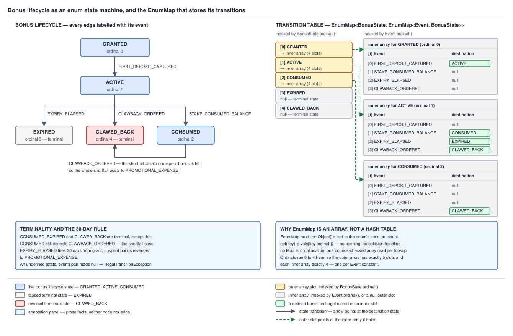

# 03 Java Core — Enum-shaped builds — a state machine with an `EnumMap` transition table — BUILD IT (§4.5.4)

**Target version: Java 21 LTS.** | **Part 4 of 5** | [Index](../00-index.md)
Previous: [The strategy enum](03f-strategy-enum.md) · Next: [The enum singleton and the attacks it defeats](03g-enum-singleton.md)

---

## 4.5.4 A state machine as an enum with an `EnumMap` transition table

A bonus lifecycle is a two-dimensional lookup. One axis is the state the bonus is in
(`GRANTED`, `ACTIVE`, `CONSUMED`, `EXPIRED`, `CLAWED_BACK` — five constants), the other is the
event that arrived (`FIRST_DEPOSIT_CAPTURED`, `STAKE_CONSUMED_BALANCE`, `EXPIRY_ELAPSED`,
`CLAWBACK_ORDERED` — four constants). Twenty cells. Six of them hold a next state and fourteen
are empty, and an empty cell is not "do nothing", it is "this event is illegal here, reject it".

Written as control flow that is a nest of `if`s or a `switch` inside a `switch`, and the
fourteen illegal cells are invisible — they are whatever falls off the end. Written as a table
it is a data structure you can print, iterate, diff against the compliance document, and index
in constant time. That is the shape: `state.transition(event)` is two array index operations
against a structure built once in a `static` block.

### Why the table is an `EnumMap` and not a `HashMap`

`EnumMap` is **not a hash table**. It is an array indexed by `ordinal()`. In JDK 21 the fields
are, from `java.base/java/util/EnumMap.java`:

```java
private transient K[] keyUniverse;   // line 94: the enum's constants, in ordinal order
private transient Object[] vals;     // line 101: values, parallel to keyUniverse
private transient int size = 0;      // line 106
```

The constructor does `vals = new Object[keyUniverse.length]` (line 139), and `get` reduces to
one array read (line 247):

```java
return (isValidKey(key) ? unmaskNull(vals[((Enum<?>)key).ordinal()]) : null);
```

No `hashCode()` call, no bucket index computation, no `equals()` on collision, no `Node`
allocation per entry, no resize. A nested `EnumMap<BonusState, EnumMap<Event, BonusState>>`
lookup is therefore: read `vals[this.ordinal()]`, then read that map's `vals[event.ordinal()]`.
Two loads and a null check.

What it costs, because there is always a cost:

- The `vals` array is sized to the **full constant count**, populated or not. Five rows are
  allocated for `BonusState` even though `EXPIRED` and `CLAWED_BACK` have nothing in them, and
  each inner `EnumMap<Event, ?>` allocates `new Object[4]` even when it holds one entry. A
  sparse enum map wastes the sparse slots. At 20 cells this is irrelevant; at a 300-constant
  enum used as a sparse key it is not.
- It **cannot hold a `null` key** — `typeCheck` dereferences the key to read its class, so
  `put(null, x)` throws `NullPointerException`. `HashMap` permits one null key. For a
  transition table that restriction is a feature.
- It is not synchronized and its iterators are not thread-safe against concurrent
  modification. Ours is published once and never mutated, which sidesteps that entirely.

`../enums/03c-internals-enumset-enummap.md` owns the full `EnumMap` internals — the `NULL`
sentinel object used to distinguish "absent" from "mapped to null", the `EntrySet` that reuses a
single mutable `Entry` during iteration, and `getKeyUniverse`'s call into
`SharedSecrets.getJavaLangAccess().getEnumConstantsShared`. The paragraph above is the whole
mechanism you need here.



**D-134** — the bonus lifecycle as a state-transition graph, beside the same machine as an
`EnumMap<BonusState, EnumMap<Event, BonusState>>` grid with the ordinal-indexed `vals` arrays
drawn out. `GRANTED` is ordinal 0 through `CLAWED_BACK` at ordinal 4; the row for a terminal
state is an allocated-but-empty array, not a missing row.

### The implementation

```java
package bonus;

import java.util.Collections;
import java.util.EnumMap;
import java.util.Map;

class IllegalTransitionException extends RuntimeException {
    private final BonusState from;
    private final Event event;

    IllegalTransitionException(BonusState from, Event event) {
        super("no transition from " + from + " on " + event);
        this.from = from;
        this.event = event;
    }

    BonusState from() { return from; }
    Event event() { return event; }
}

enum Event {
    FIRST_DEPOSIT_CAPTURED,
    STAKE_CONSUMED_BALANCE,
    EXPIRY_ELAPSED,
    CLAWBACK_ORDERED
}

enum BonusState {
    GRANTED,
    ACTIVE,
    CONSUMED,
    EXPIRED,
    CLAWED_BACK;

    private static final Map<BonusState, Map<Event, BonusState>> TABLE;

    static {
        EnumMap<BonusState, Map<Event, BonusState>> outer = new EnumMap<>(BonusState.class);

        EnumMap<Event, BonusState> fromGranted = new EnumMap<>(Event.class);
        fromGranted.put(Event.FIRST_DEPOSIT_CAPTURED, ACTIVE);

        EnumMap<Event, BonusState> fromActive = new EnumMap<>(Event.class);
        fromActive.put(Event.STAKE_CONSUMED_BALANCE, CONSUMED);
        fromActive.put(Event.EXPIRY_ELAPSED, EXPIRED);
        fromActive.put(Event.CLAWBACK_ORDERED, CLAWED_BACK);

        EnumMap<Event, BonusState> fromConsumed = new EnumMap<>(Event.class);
        fromConsumed.put(Event.CLAWBACK_ORDERED, CLAWED_BACK);

        outer.put(GRANTED, Collections.unmodifiableMap(fromGranted));
        outer.put(ACTIVE, Collections.unmodifiableMap(fromActive));
        outer.put(CONSUMED, Collections.unmodifiableMap(fromConsumed));
        outer.put(EXPIRED, Collections.unmodifiableMap(new EnumMap<>(Event.class)));
        outer.put(CLAWED_BACK, Collections.unmodifiableMap(new EnumMap<>(Event.class)));

        TABLE = Collections.unmodifiableMap(outer);
    }

    BonusState transition(Event event) {
        BonusState next = TABLE.get(this).get(event);
        if (next == null) {
            throw new IllegalTransitionException(this, event);
        }
        return next;
    }

    boolean terminal() {
        return TABLE.get(this).isEmpty();
    }

    static Map<BonusState, Map<Event, BonusState>> table() {
        return TABLE;
    }
}
```

Three decisions in there are load-bearing.

**The table is built in a `static` block, not in a field initialiser next to the constants.**
An enum's constants are created first, by the generated `<clinit>`, before any other static
initialiser runs; only then can a static field reference `ACTIVE` as a value. Putting the table
in a static block after the constant list is not stylistic, it is the only place where the
constants exist and the field is not yet frozen.

**Terminal states get an empty inner map, not a `null`.** Look at what `transition` does not
have to do: there is no `if (row == null)` before `row.get(event)`. Every one of the five
possible values of `this` has a row, so `TABLE.get(this)` cannot return null, and the single
null check in the method is about the *event*, which is the only genuine failure. If terminal
rows were absent, `transition` would need two null checks with two different meanings —
"unknown state" and "illegal event" — and one of them would eventually be written as the other.

**`transition` throws; it does not return `null` and does not stay put.** Returning `null` makes
the caller responsible for a check it will forget, and every logged NPE afterwards points at the
caller rather than at the illegal event. Silently staying put is worse: a `CLAWBACK_ORDERED` on
an `EXPIRED` bonus would be swallowed, the ledger movement to `PROMOTIONAL_EXPENSE` would never
post, and the discrepancy would show up in a monthly reconciliation with no trace of the event
that caused it.

**Insight:** the assertion "`TABLE.get(this)` is never null" is not a comment, it is a
consequence of the outer map being an array whose length is exactly `BonusState.values().length`
and of the `static` block writing all five slots. The type system does not prove it; the
five explicit `put` calls do. That is the argument to make when a reviewer asks for a null check.

### The `unmodifiableMap` hole, shown failing and shown closed

`Collections.unmodifiableMap` wraps **one** map. Wrap the outer map and the outer map is
protected: `put`, `remove` and `clear` on it throw. The **inner** maps that the outer map holds
references to are untouched — `get` hands out the original mutable `EnumMap`, and anyone can
`put` into it. That is the version-independent, always-surprising part.

```java
static void nestedMutationHole() {
    EnumMap<BonusState, Map<Event, BonusState>> outer = new EnumMap<>(BonusState.class);
    EnumMap<Event, BonusState> fromConsumed = new EnumMap<>(Event.class);
    fromConsumed.put(Event.CLAWBACK_ORDERED, BonusState.CLAWED_BACK);
    outer.put(BonusState.CONSUMED, fromConsumed);
    Map<BonusState, Map<Event, BonusState>> outerOnly = Collections.unmodifiableMap(outer);

    try {
        outerOnly.put(BonusState.EXPIRED, new EnumMap<>(Event.class));
        System.out.println("outer put  : SUCCEEDED (unexpected)");
    } catch (UnsupportedOperationException ex) {
        System.out.println("outer put  : rejected with " + ex.getClass().getName());
    }

    outerOnly.get(BonusState.CONSUMED).put(Event.EXPIRY_ELAPSED, BonusState.EXPIRED);
    System.out.println("inner put  : SUCCEEDED -- CONSUMED row is now "
            + outerOnly.get(BonusState.CONSUMED));

    try {
        BonusState.table().get(BonusState.CONSUMED)
                  .put(Event.EXPIRY_ELAPSED, BonusState.EXPIRED);
        System.out.println("inner put on wrapped table: SUCCEEDED (unexpected)");
    } catch (UnsupportedOperationException ex) {
        System.out.println("inner put on wrapped table: rejected with "
                + ex.getClass().getName());
    }
}
```

The middle call injects a transition the compliance document does not contain — a `CONSUMED`
bonus expiring — into a table the author believed was immutable. `BonusState`'s own table
survives the same attempt because every inner map was wrapped before being stored, and the
unwrapped `EnumMap` references were dropped when the `static` block returned.

`Map.copyOf` is the shorter close in Java 10 and later: `Map.copyOf(fromActive)` yields a truly
unmodifiable copy. It is not an `EnumMap`, though — it is an immutable hash-based map, so you
trade the ordinal-indexed lookup for hashing. For a table read on every stake settlement (2.8M
settlements/day, bursting to 3,400/sec) the `EnumMap` plus per-map wrapper is the right side of
that trade; the wrapper adds one delegating call, not a hash.

### Running it

```java
static BonusState drive(String label, BonusState start, Event[] events) {
    StringBuilder trace = new StringBuilder(label + ": " + start);
    BonusState current = start;
    for (Event e : events) {
        try {
            BonusState next = current.transition(e);
            trace.append(" --").append(e).append("--> ").append(next);
            current = next;
        } catch (IllegalTransitionException ex) {
            trace.append(" --").append(e).append("--> REJECTED (")
                 .append(ex.getClass().getSimpleName()).append(": ")
                 .append(ex.getMessage()).append(")");
            break;
        }
    }
    System.out.println(trace);
    return current;
}

public static void main(String[] args) {
    System.out.println("-- ordinals --");
    for (BonusState s : BonusState.values()) {
        System.out.println(s.ordinal() + " " + s + " terminal=" + s.terminal());
    }

    System.out.println();
    System.out.println("-- paths --");
    drive("happy    ", BonusState.GRANTED, new Event[] {
            Event.FIRST_DEPOSIT_CAPTURED, Event.STAKE_CONSUMED_BALANCE });
    drive("expiry   ", BonusState.GRANTED, new Event[] {
            Event.FIRST_DEPOSIT_CAPTURED, Event.EXPIRY_ELAPSED });
    drive("clawback ", BonusState.GRANTED, new Event[] {
            Event.FIRST_DEPOSIT_CAPTURED, Event.CLAWBACK_ORDERED });
    drive("shortfall", BonusState.GRANTED, new Event[] {
            Event.FIRST_DEPOSIT_CAPTURED, Event.STAKE_CONSUMED_BALANCE,
            Event.CLAWBACK_ORDERED });

    System.out.println();
    System.out.println("-- rejections --");
    drive("reject-1 ", BonusState.GRANTED, new Event[] { Event.STAKE_CONSUMED_BALANCE });
    drive("reject-2 ", BonusState.EXPIRED, new Event[] { Event.CLAWBACK_ORDERED });
    drive("reject-3 ", BonusState.CLAWED_BACK, new Event[] { Event.EXPIRY_ELAPSED });

    System.out.println();
    System.out.println("-- unmodifiableMap nesting --");
    nestedMutationHole();

    System.out.println();
    System.out.println("-- EnumMap is not a hash table --");
    Map<Event, BonusState> row = new EnumMap<>(Event.class);
    row.put(Event.CLAWBACK_ORDERED, BonusState.CLAWED_BACK);
    System.out.println("iteration order of a one-entry EnumMap: " + row);
    try {
        row.put(null, BonusState.EXPIRED);
        System.out.println("null key: SUCCEEDED (unexpected)");
    } catch (NullPointerException ex) {
        System.out.println("null key: rejected with " + ex.getClass().getName());
    }
}
```

Real output, Oracle JDK 21.0.7 (build 21.0.7+8-LTS-245), macOS aarch64:

```console
-- ordinals --
0 GRANTED terminal=false
1 ACTIVE terminal=false
2 CONSUMED terminal=false
3 EXPIRED terminal=true
4 CLAWED_BACK terminal=true

-- paths --
happy    : GRANTED --FIRST_DEPOSIT_CAPTURED--> ACTIVE --STAKE_CONSUMED_BALANCE--> CONSUMED
expiry   : GRANTED --FIRST_DEPOSIT_CAPTURED--> ACTIVE --EXPIRY_ELAPSED--> EXPIRED
clawback : GRANTED --FIRST_DEPOSIT_CAPTURED--> ACTIVE --CLAWBACK_ORDERED--> CLAWED_BACK
shortfall: GRANTED --FIRST_DEPOSIT_CAPTURED--> ACTIVE --STAKE_CONSUMED_BALANCE--> CONSUMED --CLAWBACK_ORDERED--> CLAWED_BACK

-- rejections --
reject-1 : GRANTED --STAKE_CONSUMED_BALANCE--> REJECTED (IllegalTransitionException: no transition from GRANTED on STAKE_CONSUMED_BALANCE)
reject-2 : EXPIRED --CLAWBACK_ORDERED--> REJECTED (IllegalTransitionException: no transition from EXPIRED on CLAWBACK_ORDERED)
reject-3 : CLAWED_BACK --EXPIRY_ELAPSED--> REJECTED (IllegalTransitionException: no transition from CLAWED_BACK on EXPIRY_ELAPSED)

-- unmodifiableMap nesting --
outer put  : rejected with java.lang.UnsupportedOperationException
inner put  : SUCCEEDED -- CONSUMED row is now {EXPIRY_ELAPSED=EXPIRED, CLAWBACK_ORDERED=CLAWED_BACK}
inner put on wrapped table: rejected with java.lang.UnsupportedOperationException

-- EnumMap is not a hash table --
iteration order of a one-entry EnumMap: {CLAWBACK_ORDERED=CLAWED_BACK}
null key: rejected with java.lang.NullPointerException
```

The `terminal=true` flags fall out of the empty rows for free — no extra field, no
`Set<BonusState> TERMINALS` to keep in sync with the table.

### What the two odd edges mean in money terms

`EXPIRY_ELAPSED` fires 30 days from grant. Unspent bonus reverses out of
`CLIENT_BONUS_AVAILABLE` to `PROMOTIONAL_EXPENSE`; the bonus is `EXPIRED` and nothing further
happens to it, which is why it is terminal.

`CLAWBACK_ORDERED` takes unspent bonus first and sends any shortfall to
`PROMOTIONAL_EXPENSE`. A bonus that has already reached `CONSUMED` has no unspent bonus at all,
so the whole clawback amount is shortfall — and that posting still has to happen. That is the
entire reason `CONSUMED → CLAWED_BACK` is a legal edge and `CONSUMED` is only *nearly*
terminal. Delete that one cell and a clawback on a fully-staked bonus throws
`IllegalTransitionException` in production, the `PROMOTIONAL_EXPENSE` movement is never posted,
and the promotional cost is understated.

### The same machine, three ways

```java
// Variant B: per-constant abstract body.
enum BonusStateByBody {
    GRANTED {
        BonusStateByBody transition(Event e) {
            return e == Event.FIRST_DEPOSIT_CAPTURED ? ACTIVE : reject(this, e);
        }
    },
    ACTIVE {
        BonusStateByBody transition(Event e) {
            return switch (e) {
                case STAKE_CONSUMED_BALANCE -> CONSUMED;
                case EXPIRY_ELAPSED -> EXPIRED;
                case CLAWBACK_ORDERED -> CLAWED_BACK;
                case FIRST_DEPOSIT_CAPTURED -> reject(this, e);
            };
        }
    },
    CONSUMED {
        BonusStateByBody transition(Event e) {
            return e == Event.CLAWBACK_ORDERED ? CLAWED_BACK : reject(this, e);
        }
    },
    EXPIRED {
        BonusStateByBody transition(Event e) { return reject(this, e); }
    },
    CLAWED_BACK {
        BonusStateByBody transition(Event e) { return reject(this, e); }
    };

    abstract BonusStateByBody transition(Event e);

    static BonusStateByBody reject(BonusStateByBody from, Event e) {
        throw new IllegalStateException("no transition from " + from + " on " + e);
    }
}

// Variant C: exhaustive switch expression over the state, no default.
enum BonusStateBySwitch {
    GRANTED, ACTIVE, CONSUMED, EXPIRED, CLAWED_BACK;

    BonusStateBySwitch transition(Event e) {
        BonusStateBySwitch next = switch (this) {
            case GRANTED -> e == Event.FIRST_DEPOSIT_CAPTURED ? ACTIVE : null;
            case ACTIVE -> switch (e) {
                case STAKE_CONSUMED_BALANCE -> CONSUMED;
                case EXPIRY_ELAPSED -> EXPIRED;
                case CLAWBACK_ORDERED -> CLAWED_BACK;
                case FIRST_DEPOSIT_CAPTURED -> null;
            };
            case CONSUMED -> e == Event.CLAWBACK_ORDERED ? CLAWED_BACK : null;
            case EXPIRED, CLAWED_BACK -> null;
        };
        if (next == null) {
            throw new IllegalStateException("no transition from " + this + " on " + e);
        }
        return next;
    }
}
```

Both run:

```console
variant B happy: CLAWED_BACK
variant C happy: CLAWED_BACK
variant C reject: no transition from EXPIRED on CLAWBACK_ORDERED
```

The decisive difference is what happens when the machine grows. Add a fifth event —
`STAKE_VOIDED`, for the Quiz Engine's `VoidStake` — to `Event` and recompile all three. The
`EnumMap` variant:

```console
EnumMap variant: compiled clean with the new event
```

Silently clean. The new event simply has no cell anywhere, so every state rejects it at
runtime, which may or may not be what the promotion rules say. The switch variant:

```console
broken/alt/AltMachines.java:16: error: the switch expression does not cover all possible input values
                return switch (e) {
                       ^
broken/alt/AltMachines.java:50: error: the switch expression does not cover all possible input values
                case ACTIVE -> switch (e) {
                               ^
2 errors
```

Two compile errors pointing at exactly the two places a human has to make a decision. A
`switch` **expression** over an enum with every constant listed and no `default` is exhaustive
by the compiler's own check (JLS 14.11.2, exhaustive switch, available for expressions since
Java 14 and for statements with arrow labels under pattern matching in 21) — and adding a
`default` throws that guarantee away, which is why "always add a `default`" is bad advice for
enum switches.

| | `EnumMap` table (variant A) | Per-constant body (variant B) | Exhaustive `switch` expression (variant C) |
|---|---|---|---|
| Where the machine lives | one `static` block, readable top to bottom | scattered across five constant bodies | one method |
| Adding an event | compiles clean, new event silently illegal everywhere | compile error only where an inner `switch` covers `Event` | **compile error at every affected site** |
| Adding a state | compiles clean; a missing row means `TABLE.get` returns null and `transition` NPEs | compile error — the abstract method is unimplemented | compile error — switch no longer exhaustive |
| Introspectable | yes — print, iterate, diff the table against the rules document | no | no |
| Lookup cost | two array reads through two wrapper delegations | one virtual call | one `tableswitch` on `$SwitchMap` plus a compare |
| Allocation | 5 outer slots + 5 inner `Object[4]`, once, at class init | none | none |
| Class file cost | one class | six classes (`BonusStateByBody` plus five anonymous subclasses) | one class |
| Multi-machine reuse | table can be swapped per jurisdiction | no | no |

**Ship variant A**, with one addition: a unit test that walks `BonusState.values()` and
`Event.values()` and asserts the table's contents against a literal expectation, so "adding an
event compiles clean" becomes "adding an event fails a test". The introspectability is what buys
that test, and it is the reason to prefer the table in a regulated domain — a reviewer can read
the twenty cells and match them against the promotions policy without reading any Java control
flow. Variant C is the better *language* answer and the one to name in an interview when asked
about Java 21 idiom; variant A is the better *audited* answer.

> A table-driven enum state machine is a `Map` from state to a `Map` from event to state, built
> once at class initialisation, wrapped at every level, indexed by two ordinals, and throwing on
> any cell that was left empty.

**Interview:** "Why `EnumMap` over `HashMap` for a transition table?" — because `EnumMap` is an
`ordinal()`-indexed array, so a lookup is an array load with no hashing and no `equals`; the
price is an array sized to the whole constant set and no null keys, both of which a transition
table wants anyway.

### Diff vs the real one — the table-driven machine

There is no state machine in `java.base` to diff against; what this build leans on is
`EnumMap`, so the diff is against the real `EnumMap` and against what a production state
machine (Spring Statemachine, a database-backed workflow engine) provides that this does not.

| Dimension | This build | The real `EnumMap` / a production engine |
|---|---|---|
| Edge cases | rejects unknown event per state; no guard conditions, no entry/exit actions, no timers | `EnumMap` handles null *values* via a `NULL` sentinel so "absent" and "mapped to null" stay distinct; an engine adds guards, actions, timers, and a persisted current state |
| Intrinsics | none | none in `EnumMap` either; `ordinal()` is a plain field read that the JIT folds, and array bounds checks are eliminated because the index provably lies in `[0, length)` |
| Serialization | `TABLE` is `static`, so it is never serialized; `BonusState` serializes as its name (see [the enum singleton](03g-enum-singleton.md)) | `EnumMap` implements `Serializable` with a custom `writeObject`/`readObject` pair because `keyUniverse` and `vals` are `transient`; the stream carries the key type plus key/value pairs |
| Null policy | `EnumMap` rejects a null key, so a null event fails fast with `NullPointerException` before `transition` can misbehave | same rejection, by `typeCheck` dereferencing the key's class |
| Thread safety | safe by construction — built in `<clinit>`, published through a `static final` field, never mutated afterwards; the JVM's class-initialisation lock provides the happens-before | `EnumMap` is unsynchronized and fails fast on concurrent structural modification; `Collections.synchronizedMap` is the wrapper, and it does not help our nested case |
| Allocation tricks | none; 5 + 5 arrays allocated once, ~360 bytes total, amortised over 2.8M settlements/day | `EnumMap`'s trick *is* the flat array — no per-entry `Node`, and `EntrySet.iterator()` reuses one mutable `Entry` object across the whole iteration |
| Why the JDK bothers | — | because enum-keyed maps are common enough that paying for hashing is waste, and because an ordinal-indexed array gives ordinal iteration order for free |

The section-wide **Diff vs the real one** table for all of §4.5 — the generated enum versus every
hand-rolled construct in §4.5 — is leaf 4.5.7, in
[03b-enum-values-cache-and-diff.md](03b-enum-values-cache-and-diff.md).

---

## Pitfalls

### Believing an `EnumMap` is a hash map

**Wrong**

```java
Map<Event, BonusState> row = new HashMap<>();   // "a Map is a Map"
row.put(Event.CLAWBACK_ORDERED, BonusState.CLAWED_BACK);
row.put(null, BonusState.EXPIRED);              // accepted, silently
System.out.println(row);
```

```console
{null=EXPIRED, CLAWBACK_ORDERED=CLAWED_BACK}
```

A null event became a legal table key. In the transition table that means a `null` event
argument would find a mapping and drive a real state change.

**Right**

```java
Map<Event, BonusState> row = new EnumMap<>(Event.class);
row.put(Event.CLAWBACK_ORDERED, BonusState.CLAWED_BACK);
try {
    row.put(null, BonusState.EXPIRED);
} catch (NullPointerException ex) {
    System.out.println("null key: rejected with " + ex.getClass().getName());
}
```

```console
null key: rejected with java.lang.NullPointerException
```

`EnumMap` holds a `keyUniverse` array and a parallel `vals` array and indexes them by
`ordinal()`. There are no buckets, no hashing, no null key — `typeCheck` has to read the key's
class to validate it, so a null key fails immediately.

**Why people believe it:** it implements `Map`, the `HashMap` habit is universal, and the
iteration order looks arbitrary until you notice it is exactly declaration order. Nothing in
the type or the `toString` tells you the implementation is an array.

### Believing `Collections.unmodifiableMap` over a nested map freezes the whole structure

**Wrong**

```java
Map<BonusState, Map<Event, BonusState>> outerOnly = Collections.unmodifiableMap(outer);
outerOnly.get(BonusState.CONSUMED).put(Event.EXPIRY_ELAPSED, BonusState.EXPIRED);
System.out.println(outerOnly.get(BonusState.CONSUMED));
```

```console
{EXPIRY_ELAPSED=EXPIRED, CLAWBACK_ORDERED=CLAWED_BACK}
```

A transition that no compliance document contains was added to a table the author called
immutable, at runtime, with no exception.

**Right**

Wrap every level, and drop the mutable references:

```java
outer.put(CONSUMED, Collections.unmodifiableMap(fromConsumed));
TABLE = Collections.unmodifiableMap(outer);
```

```console
inner put on wrapped table: rejected with java.lang.UnsupportedOperationException
```

`Map.copyOf(fromConsumed)` is the alternative and is genuinely immutable rather than a view —
at the cost of no longer being an `EnumMap`, so lookups hash instead of indexing.

**Why people believe it:** "unmodifiable" reads like a property of the data, not of one wrapper
object. The wrapper only intercepts the mutators declared on the map it wraps; the values it
hands back through `get` are the originals, unwrapped, with all their own mutators intact. The
same hole exists for `List<List<…>>` and for a record holding a mutable field —
`../immutability-and-design/02-immutability.md` covers the general case.

### Returning `null` from `transition` for an illegal event

**Wrong**

```java
BonusState transition(Event event) {
    return TABLE.get(this).get(event);   // null means "not allowed"
}

// At the call site, six months later:
bonus.setState(bonus.state().transition(Event.CLAWBACK_ORDERED));
```

The `CLAWBACK_ORDERED` on an `EXPIRED` bonus sets the state to `null`. The next call throws an
NPE inside `transition` — `TABLE.get(null)` returns null and `.get(event)` dereferences it —
with a stack trace that names the innocent second event and says nothing about the illegal
first one.

**Right**

```java
BonusState transition(Event event) {
    BonusState next = TABLE.get(this).get(event);
    if (next == null) {
        throw new IllegalTransitionException(this, event);
    }
    return next;
}
```

```console
reject-2 : EXPIRED --CLAWBACK_ORDERED--> REJECTED (IllegalTransitionException: no transition from EXPIRED on CLAWBACK_ORDERED)
```

Both the from-state and the event are in the message, the exception is domain-named, and the
failure lands on the event that caused it.

**Why people believe it:** `Map.get` returns `null` for a miss, so "propagate the `null`" feels
like following the collection's own convention. The difference is that a map miss is a normal
outcome for a lookup and an illegal transition is a rule violation in a regulated money
lifecycle — those deserve different signalling. Silently returning `this` is the same mistake
wearing a nicer coat: the event vanishes and so does the ledger movement.

---

---

## Cheat sheet

| Thing | Fact |
|---|---|
| `EnumMap` implementation | `K[] keyUniverse` + `Object[] vals`, indexed by `ordinal()`; no hashing, no buckets, no `Node` |
| `EnumMap` cost | array sized to full constant count whether populated or not; no null key |
| `EnumMap.get` | `vals[((Enum<?>)key).ordinal()]`, one array read |
| Nested table lookup | two array reads: `TABLE.get(this).get(event)` |
| Where to build the table | `static` block **after** the constant list — constants must exist first |
| Terminal state row | empty inner map, never `null`, so `transition` needs one null check not two |
| Illegal transition | throw `IllegalTransitionException(from, event)`; never `null`, never stay put |
| `unmodifiableMap` nesting | wraps one map only; inner maps stay mutable unless each is wrapped |
| Truly immutable alternative | `Map.copyOf` — immutable, but no longer an `EnumMap` |
| Exhaustive `switch` over enum | no `default` needed; adding a constant becomes a compile error. Adding a `default` destroys that |

## Self-test

**Q1.** Why must the transition table be populated in a `static` block rather than in a field initialiser placed above the constant list?

<details><summary>Answer</summary>

Because the enum constants do not exist yet. The compiler-generated `<clinit>` creates the
constants first, in declaration order, and only then runs the remaining static initialisers in
source order. A static field initialiser that appears before the constants would be creating the
table at a point where `ACTIVE` and `CONSUMED` are still null, so the table would be full of
nulls. Java actually forbids the direct form — referencing a constant from an initialiser that
runs earlier is an illegal forward reference — but the safe habit is: constants first, then a
`static` block, then assign a `static final` field once.

</details>

**Q2.** `TABLE.get(this)` is never null-checked inside `transition`. Justify that to a reviewer.

<details><summary>Answer</summary>

The outer map is an `EnumMap<BonusState, …>`, so its `vals` array has exactly
`BonusState.values().length` slots, and the `static` block writes all five of them, including
empty inner maps for `EXPIRED` and `CLAWED_BACK`. `this` is a `BonusState`, so its ordinal is a
valid index into a slot that was populated. The type system does not prove this — the five
explicit `put` calls do, and a test that iterates `values()` and asserts every row is non-null
turns it into a checked invariant. The alternative, letting terminal rows be absent, forces
`transition` to carry two null checks with two different meanings, and someone will eventually
conflate them.

</details>

**Q3.** You ship the `EnumMap` variant and a colleague adds a `STAKE_VOIDED` event. What happens, and what would the exhaustive-`switch` variant have done?

<details><summary>Answer</summary>

The `EnumMap` variant compiles clean and runs. The new event has no cell in any row, so every
state rejects it with `IllegalTransitionException` — which may be right or may be a silently
missed requirement, and nothing tells you which. The exhaustive `switch` variant fails to
compile with `error: the switch expression does not cover all possible input values` at every
inner `switch` over `Event`, pointing at exactly the sites a human must decide about. That is the
strongest argument for the switch form and the reason not to add a `default` to an enum switch:
`default` converts a compile-time exhaustiveness failure into a runtime one. The mitigation for
the table form is a test that asserts the table's contents cell by cell.

</details>

**Q4.** Why is `CONSUMED → CLAWED_BACK` a legal edge when `CONSUMED` otherwise looks terminal?

<details><summary>Answer</summary>

Clawback takes unspent bonus first and sends the shortfall to `PROMOTIONAL_EXPENSE`. A
`CONSUMED` bonus has no unspent bonus left, so the entire clawback amount is shortfall — and
that `PROMOTIONAL_EXPENSE` posting still has to happen. Remove the cell and a clawback ordered
against a fully-staked bonus throws `IllegalTransitionException`, the ledger movement never
posts, and promotional cost is understated with no record of the event that was rejected.
`EXPIRED` and `CLAWED_BACK` are genuinely terminal; `CONSUMED` is not.

</details>

**Q5.** `Collections.unmodifiableMap(outer)` rejects `put` on the outer map but the inner maps stayed mutable. Explain the mechanism and give two fixes.

<details><summary>Answer</summary>

`unmodifiableMap` returns a view object that implements `Map` by delegating reads to the wrapped
map and throwing `UnsupportedOperationException` from every mutator declared on *itself*. It has
no knowledge of the values it stores. `get` returns the stored reference as-is, so if that
reference is a mutable `EnumMap`, the caller has a fully mutable map. Fix one: wrap each inner
map before storing it, and let the unwrapped references go out of scope so nobody holds the
mutable original. Fix two: `Map.copyOf` each inner map, which produces a genuinely immutable map
rather than a view — at the cost of losing the `EnumMap` ordinal indexing in favour of hashing.
The same hole applies to nested lists and to a record field holding a mutable collection.

</details>

## Open questions

- none

---

**Leaves covered:** 4.5.4 (1 leaf)
**Leaves deferred:** none — leaf 4.5.5 (the enum singleton) is order 13, [03g-enum-singleton.md](03g-enum-singleton.md); leaf 4.5.7, the section-wide §4.5 diff table, is order 14, [03b-enum-values-cache-and-diff.md](03b-enum-values-cache-and-diff.md)
**Diagrams included:** D-134
**Target version:** Java 21 LTS
**Lines:** 716
