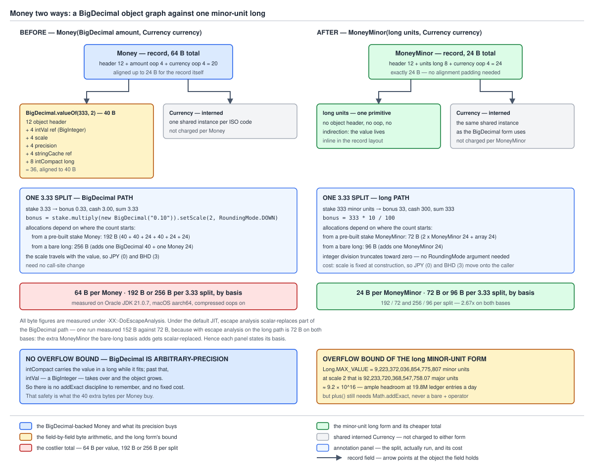

# 03 Java Core — Value-object builds — `Money` two ways — BUILD IT (§4.7.1, §4.7.2)

**Target version: Java 21 LTS.** | **Part 4 of 5** | [Index](../00-index.md)
Previous: [The Cleaner-based holder and the §4.6 diff table](03j-cleaner-and-diff.md) · Next: [Allocation, precision, and rounding bias](04c-allocation-and-rounding-bias.md)

---

## The choice, before the code

Money in Java has exactly two honest representations. One is a decimal that carries its own
scale — `BigDecimal amount` plus `Currency currency`. The other is an integer count of minor
units — `long units` plus `Currency currency`, where the scale lives in the currency rather than
in the value. Everything else about your money type falls out of which one you picked:

| Property | Falls out of the choice how |
|---|---|
| Footprint | 64 B per `Money` versus 24 B per `MoneyMinor`, measured below |
| Overflow | `BigDecimal` cannot overflow; a `long` wraps silently unless you check |
| Expressible rounding | all eight `RoundingMode`s versus exactly what integer division does |
| Where scale lives | in the value (visible, checkable) versus in the currency (implicit, forgettable) |
| Precision ceiling | unbounded versus 9.2 × 10^16 major units at scale 2 (and a mixed-currency bug is prevented by the `Currency` component in both, not by the numeric type) |

So this file builds both, completely, and sets them against each other, then picks one for
QuizStakes on measured numbers. Both builds must reproduce the same domain constant: QuizStakes
grants **10% of the first deposit, capped at 100**, consumes bonus per stake as
`min(BONUS_AVAILABLE, 10% of stake)`, and the **bonus portion rounds down to the minor unit while
cash covers the remainder** — a stake of **3.33** splits as **0.33 bonus + 3.00 cash**, because
rounding the other way gives 0.34 + 3.00 = 3.34 and creates money.

Every figure and exception below was produced on **Oracle JDK 21.0.7 (build 21.0.7+8-LTS-245),
macOS aarch64 (Apple silicon)**, compressed oops on.

---

## 4.7.1 `[BUILD]` The `Money` record

### The shape, and the one decision that drives it

Two references: a `BigDecimal` and a `Currency`. `Currency` instances are interned by the JDK, so
the currency component costs a 4-byte oop per `Money` and nothing more; the `BigDecimal` is a
separate heap object. The decision that shapes the rest is what the compact constructor does
about scale.

**Normalise, or reject?** `setScale` in the constructor is friendlier: a caller's
`new Money(new BigDecimal("3.3"), GBP)` silently becomes `3.30`. That is the problem. A caller
who wrote `3.3` where they meant `3.30` has a bug, and a caller passing the result of a division
has a worse one — the type would be picking a `RoundingMode` on their behalf, invisibly, in a
money path. So **the canonical constructor rejects a wrong scale**, and normalisation is
available only through a factory that makes the caller name the `RoundingMode` out loud.

**Where the scale comes from.** Not a hard-coded 2. From
`Currency.getDefaultFractionDigits()`, whose JDK 21 javadoc
(`java.base/java/util/Currency.java`, lines 563–573 of `src.zip`) reads:

```text
Gets the default number of fraction digits used with this currency.
Note that the number of fraction digits is the same as ISO 4217's
minor unit for the currency.
For example, the default number of fraction digits for the Euro is 2,
while for the Japanese Yen it's 0.
In the case of pseudo-currencies, such as IMF Special Drawing Rights,
-1 is returned.
```

That last line is the edge case, confirmed by running it:

```console
GBP digits=2   USD digits=2   JPY digits=0
BHD digits=3   KWD digits=3   CLF digits=4
XAU digits=-1  XDR digits=-1
```

A **−1** is not a scale. `setScale(-1)` does not even throw — a negative scale is legal, meaning
powers of ten *above* the unit, so `new BigDecimal("420.00").setScale(-1, DOWN)` returns `4.2E+2`.
Treating −1 as 0 would silently model gold (`XAU`) as a whole-unit currency, so `Money` refuses
the pseudo-currency and names it.

### The implementation

```java
public record Money(BigDecimal amount, Currency currency) implements Comparable<Money> {

    public Money {
        Objects.requireNonNull(amount, "Money.amount is null");
        Objects.requireNonNull(currency, "Money.currency is null");
        int digits = currency.getDefaultFractionDigits();
        if (digits < 0) {
            throw new IllegalArgumentException(
                "Money cannot represent pseudo-currency " + currency.getCurrencyCode()
                + ": getDefaultFractionDigits() returned " + digits);
        }
        if (amount.scale() != digits) {
            throw new IllegalArgumentException(
                "Money in " + currency.getCurrencyCode() + " requires scale " + digits
                + " but was handed scale " + amount.scale() + " (" + amount + ")");
        }
    }

    public static Money of(String amount, Currency currency) {
        Objects.requireNonNull(amount, "Money.of amount text is null");
        Objects.requireNonNull(currency, "Money.of currency is null");
        return new Money(new BigDecimal(amount), currency);
    }

    public static Money normalising(BigDecimal raw, Currency currency, RoundingMode mode) {
        Objects.requireNonNull(raw, "Money.normalising raw is null");
        Objects.requireNonNull(currency, "Money.normalising currency is null");
        Objects.requireNonNull(mode, "Money.normalising mode is null");
        int digits = currency.getDefaultFractionDigits();
        if (digits < 0) {
            throw new IllegalArgumentException(
                "Money cannot represent pseudo-currency " + currency.getCurrencyCode());
        }
        return new Money(raw.setScale(digits, mode), currency);
    }

    public Money plus(Money other) {
        requireSameCurrency(other, "plus");
        return new Money(amount.add(other.amount), currency);
    }

    public Money minus(Money other) {
        requireSameCurrency(other, "minus");
        return new Money(amount.subtract(other.amount), currency);
    }

    public Money multiply(BigDecimal factor, RoundingMode mode) {
        Objects.requireNonNull(factor, "Money.multiply factor is null");
        Objects.requireNonNull(mode, "Money.multiply mode is null");
        return new Money(amount.multiply(factor).setScale(amount.scale(), mode), currency);
    }

    public Money negate() {
        return new Money(amount.negate(), currency);
    }

    @Override
    public int compareTo(Money other) {
        requireSameCurrency(other, "compareTo");
        return amount.compareTo(other.amount);
    }

    public boolean isNegative() {
        return amount.signum() < 0;
    }

    private void requireSameCurrency(Money other, String operation) {
        Objects.requireNonNull(other, "Money." + operation + " operand is null");
        if (!currency.equals(other.currency)) {
            throw new IllegalArgumentException(
                "cannot " + operation + " " + other.currency.getCurrencyCode()
                + " and " + currency.getCurrencyCode()
                + ": Money arithmetic is single-currency only");
        }
    }

    @Override
    public String toString() {
        return amount.toPlainString() + " " + currency.getCurrencyCode();
    }
}
```

**Why `plus(Money)` and not `add(BigDecimal)`.** A `BigDecimal` carries no currency, so
`add(BigDecimal)` cannot check currency agreement — it puts the mixed-currency hole straight back,
at a call site that looks harmless. `multiply` is the deliberate exception: a factor is
dimensionless, 10% of a GBP amount is GBP, and multiplying two money values is meaningless. Its
`RoundingMode` is required rather than defaulted, because a multiply is where scale changes.

**Insight:** `amount.add(other.amount)` needs no `setScale` afterwards — `BigDecimal.add` returns
a result at `max(this.scale, augend.scale)` and the constructor has already pinned both operands
to the currency's scale. The arithmetic got shorter because the constructor got stricter.

### Running it

```console
-- scale enforcement --
Money.of("3.33", GBP)      = 3.33 GBP
Money.of("3.3", GBP)       -> java.lang.IllegalArgumentException: Money in GBP requires scale 2 but was handed scale 1 (3.3)
normalising(3.333, DOWN)   = 3.33 GBP
Money.of("420", JPY)       = 420 JPY
Money.of("420.00", JPY)    -> Money in JPY requires scale 0 but was handed scale 2 (420.00)
Money.of("1.000", XAU)     -> Money cannot represent pseudo-currency XAU: getDefaultFractionDigits() returned -1

-- null rejection --
new Money(null, GBP)       -> java.lang.NullPointerException: Money.amount is null
new Money(1.00, null)      -> java.lang.NullPointerException: Money.currency is null

-- arithmetic --
stake.plus(4.20)           = 7.53 GBP
stake.minus(0.33)          = 3.00 GBP
stake.multiply(0.10, DOWN) = 0.33 GBP
stake.negate()             = -3.33 GBP
stake.compareTo(4.20)      = -1

-- mixed currency --
GBP.plus(USD)              -> java.lang.IllegalArgumentException: cannot plus USD and GBP: Money arithmetic is single-currency only
GBP.compareTo(USD)         -> cannot compareTo USD and GBP: Money arithmetic is single-currency only
```

`Money.of("420", JPY)` succeeds and `Money.of("420.00", JPY)` fails: the type is not "two decimal
places", it is "the currency's decimal places". `Money.of("3.330", BHD) = 3.330 BHD`, and
`Money.of("3.33", BHD)` is rejected.

> **`Money` is a `BigDecimal` whose scale is pinned to its currency's minor unit by the compact
> constructor, plus arithmetic that refuses to combine two currencies.**

### The `equals` trap, which is the sharpest thing here

A record's generated `equals` calls `equals` on each reference component. For `amount` that is
`BigDecimal.equals`, and **`BigDecimal.equals` compares unscaled value and scale, not numeric
value.** `2.00` is unscaled 200 at scale 2; `2.0` is unscaled 20 at scale 1. Different pairs,
unequal objects, same amount of money:

```console
-- the BigDecimal.equals scale trap --
new BigDecimal("2.00").equals(new BigDecimal("2.0"))    = false
new BigDecimal("2.00").compareTo(new BigDecimal("2.0"))  = 0
scale/unscaled: 2.00 -> scale=2 unscaled=200 | 2.0 -> scale=1 unscaled=20
new Money(2.00, GBP).equals(Money.of("2.00", GBP))      = true
hashCode equal                                          = true
new Money(2.0, GBP)        -> Money in GBP requires scale 2 but was handed scale 1 (2.0)
```

`equals` says false, `compareTo` says 0, and that divergence is what breaks things. `TreeMap` and
`TreeSet` are defined entirely on `compareTo`, so a `TreeSet<BigDecimal>` treats `2.00` and `2.0`
as one element while a `HashSet<BigDecimal>` treats them as two; `BigDecimal`'s own class javadoc
warns that its natural ordering is inconsistent with `equals`.

**This is exactly why the compact constructor's scale enforcement is what makes the record's
generated `equals` usable at all.** With scale pinned to the currency, two `Money` values
denoting the same amount necessarily share unscaled value *and* scale, so `equals` and
`compareTo` can no longer disagree. The last output line is the enforcement: the non-canonical
`2.0` never becomes a `Money`, so the trap has nothing to fire on.

One honest caveat: `Money.compareTo` throws on a currency mismatch, so a mixed-currency
`TreeSet<Money>` throws on insertion — the right trade, but it means `Money` does not satisfy
`Comparable`'s contract over its whole domain, which belongs in its javadoc.

Scale, equality and every `RoundingMode` in full are owned by
[`../numbers-and-money/02b-equality-scale-and-rounding.md`](../numbers-and-money/02b-equality-scale-and-rounding.md).
The JUnit side — why `assertEquals(new BigDecimal("2.00"), actual)` fails on a numerically
correct result — is guide 16's.

**Interview:** "Why is `BigDecimal`'s `compareTo` inconsistent with `equals`, and what would you
do about it?" — because `equals` includes scale and `compareTo` does not; in a domain type you
canonicalise scale at construction so the two can never disagree.

### The canonical bonus split, and `StakeSplit`

`StakeSplit(Money bonusPortion, Money cashPortion)` carries the invariant that the two sum
exactly to the stake. With two components and no third field that is discharged structurally —
`stake()` **is** the sum, so nothing can drift. What can still be wrong is the split itself, and
that is what the compact constructor enforces: the bonus portion must never exceed the
rounded-down 10% of the stake.

```java
public record StakeSplit(Money bonusPortion, Money cashPortion) {

    private static final BigDecimal BONUS_RATE = new BigDecimal("0.10");

    public StakeSplit {
        Objects.requireNonNull(bonusPortion, "StakeSplit.bonusPortion is null");
        Objects.requireNonNull(cashPortion, "StakeSplit.cashPortion is null");
        if (!bonusPortion.currency().equals(cashPortion.currency())) {
            throw new IllegalArgumentException(
                "StakeSplit mixes " + bonusPortion.currency().getCurrencyCode()
                + " bonus with " + cashPortion.currency().getCurrencyCode() + " cash");
        }
        if (bonusPortion.isNegative() || cashPortion.isNegative()) {
            throw new IllegalArgumentException(
                "StakeSplit portions must be non-negative: bonus=" + bonusPortion
                + " cash=" + cashPortion);
        }
        Money stake = bonusPortion.plus(cashPortion);
        Money ceiling = stake.multiply(BONUS_RATE, RoundingMode.DOWN);
        if (bonusPortion.compareTo(ceiling) > 0) {
            throw new IllegalArgumentException(
                "StakeSplit bonus portion " + bonusPortion
                + " exceeds the rounded-down 10% of stake "
                + stake + " (" + ceiling + "): this split creates money");
        }
    }

    public static StakeSplit forStake(Money stake, Money bonusAvailable) {
        Objects.requireNonNull(stake, "StakeSplit.forStake stake is null");
        Objects.requireNonNull(bonusAvailable, "StakeSplit.forStake bonusAvailable is null");
        if (stake.isNegative()) {
            throw new IllegalArgumentException("StakeSplit.forStake stake is negative: " + stake);
        }
        Money tenPercentRoundedDown = stake.multiply(BONUS_RATE, RoundingMode.DOWN);
        Money bonus = bonusAvailable.compareTo(tenPercentRoundedDown) < 0
            ? bonusAvailable
            : tenPercentRoundedDown;
        return new StakeSplit(bonus, stake.minus(bonus));
    }

    public Money stake() {
        return bonusPortion.plus(cashPortion);
    }
}
```

`forStake` is `min(BONUS_AVAILABLE, 10% of stake)` verbatim, and cash is always
`stake.minus(bonus)` — never computed independently, which is the only way the sum is exact.

```console
-- the canonical bonus split --
stake                      = 3.33 GBP
bonusPortion               = 0.33 GBP
cashPortion                = 3.00 GBP
bonus + cash               = 3.33 GBP
sums exactly to stake      = true
bonus capped at 0.10       = 0.10 GBP + 3.23 GBP

-- the invariant firing --
new StakeSplit(0.34, 3.00) -> java.lang.IllegalArgumentException: StakeSplit bonus portion 0.34 GBP exceeds the rounded-down 10% of stake 3.34 GBP (0.33 GBP): this split creates money
new StakeSplit(GBP, USD)   -> StakeSplit mixes GBP bonus with USD cash
new StakeSplit(-0.33,3.66) -> StakeSplit portions must be non-negative: bonus=-0.33 GBP cash=3.66 GBP
```

Note what the first failure message reports: the stake is **3.34**, because with two components
that is what the stake is. The wrong split does not conjure a penny inside a 3.33 stake — it
produces a *different, larger stake*, the shape of the money-creation bug.

### Diff vs the real one — `Money` versus `javax.money` and Joda-Money

There is no `Money` in the JDK; the comparison is against Moneta (the JSR-354 reference
implementation) and `org.joda.money`. **This build has no currency conversion and no
`MonetaryContext`** — it cannot express "GBP to USD at today's rate", nor an amount at a scale
other than the currency's, which matters the moment a fee calculation needs four decimals.

| Axis | This build | The real ones |
|---|---|---|
| Edge cases | rejects wrong scale, pseudo-currency, mixed currency | Joda `Money` also pins scale to the currency; `javax.money` `MonetaryAmount` has a pluggable `MonetaryContext` with configurable precision and scale, plus `FastMoney` and `RoundedMoney` variants |
| Intrinsics | none; ordinary interpreted-then-JIT-compiled Java | none either — `BigDecimal.add` has no intrinsic; `BigInteger.multiplyToLen` does, but only on the inflated path |
| Serialization | record serialization goes through the canonical constructor, so the invariants re-run on read | Joda uses a serialization proxy; `javax.money` forms are implementation-defined. A record is the cheapest correct answer: `readObject` cannot bypass a record's canonical constructor |
| Null policy | `Objects.requireNonNull` naming the component | `NullPointerException`, component usually unnamed |
| Thread safety | immutable; `BigDecimal` and `Currency` immutable, safely published by final fields | identical |
| Allocation tricks | none — every operation allocates a fresh `BigDecimal` and a fresh record | `FastMoney` *is* the allocation trick: it drops to a `long` at fixed scale 5. Joda caches nothing |
| Why the JDK bothers | it does not. The JDK ships `BigDecimal` and `Currency` and stops, which is why every payments codebase grows its own `Money` | JSR-354 exists because that repetition is a real cost, and because conversion, formatting and rounding policy need a home |

---

## 4.7.2 `[BUILD]` `[NUM]` The same value in minor units

### The shape

One `long` and one `Currency` reference. 333 means 3.33 GBP, 333 JPY, or 0.333 BHD, and nothing in
the `long` tells you which — the whole cost of this representation, and it buys a 24-byte object
with primitive arithmetic.

```java
public record MoneyMinor(long units, Currency currency) implements Comparable<MoneyMinor> {

    public MoneyMinor {
        Objects.requireNonNull(currency, "MoneyMinor.currency is null");
        if (currency.getDefaultFractionDigits() < 0) {
            throw new IllegalArgumentException(
                "MoneyMinor cannot represent pseudo-currency " + currency.getCurrencyCode()
                + ": it has no minor unit");
        }
    }

    public static MoneyMinor ofMajor(BigDecimal major, Currency currency, RoundingMode mode) {
        Objects.requireNonNull(major, "MoneyMinor.ofMajor major is null");
        Objects.requireNonNull(currency, "MoneyMinor.ofMajor currency is null");
        Objects.requireNonNull(mode, "MoneyMinor.ofMajor mode is null");
        int digits = currency.getDefaultFractionDigits();
        if (digits < 0) {
            throw new IllegalArgumentException(
                "MoneyMinor cannot represent pseudo-currency " + currency.getCurrencyCode());
        }
        BigDecimal scaled = major.setScale(digits, mode);
        return new MoneyMinor(scaled.unscaledValue().longValueExact(), currency);
    }

    public BigDecimal toMajor() {
        return BigDecimal.valueOf(units, currency.getDefaultFractionDigits());
    }

    public MoneyMinor plus(MoneyMinor other) {
        requireSameCurrency(other, "plus");
        return new MoneyMinor(Math.addExact(units, other.units), currency);
    }

    public MoneyMinor plusUnchecked(MoneyMinor other) {
        requireSameCurrency(other, "plusUnchecked");
        return new MoneyMinor(units + other.units, currency);
    }

    public MoneyMinor minus(MoneyMinor other) {
        requireSameCurrency(other, "minus");
        return new MoneyMinor(Math.subtractExact(units, other.units), currency);
    }

    public MoneyMinor negate() {
        return new MoneyMinor(Math.negateExact(units), currency);
    }

    public MoneyMinor scaleByRatio(long numerator, long denominator) {
        if (denominator == 0) {
            throw new ArithmeticException("MoneyMinor.scaleByRatio denominator is zero");
        }
        return new MoneyMinor(Math.multiplyExact(units, numerator) / denominator, currency);
    }

    public MoneyMinor scaleByRatioFloor(long numerator, long denominator) {
        if (denominator == 0) {
            throw new ArithmeticException("MoneyMinor.scaleByRatioFloor denominator is zero");
        }
        return new MoneyMinor(
            Math.floorDiv(Math.multiplyExact(units, numerator), denominator), currency);
    }

    @Override
    public int compareTo(MoneyMinor other) {
        requireSameCurrency(other, "compareTo");
        return Long.compare(units, other.units);
    }

    private void requireSameCurrency(MoneyMinor other, String operation) {
        Objects.requireNonNull(other, "MoneyMinor." + operation + " operand is null");
        if (!currency.equals(other.currency)) {
            throw new IllegalArgumentException(
                "cannot " + operation + " " + other.currency.getCurrencyCode()
                + " and " + currency.getCurrencyCode()
                + ": MoneyMinor arithmetic is single-currency only");
        }
    }

    @Override
    public String toString() {
        return units + " minor units " + currency.getCurrencyCode()
            + " (" + toMajor().toPlainString() + ")";
    }
}
```

`plusUnchecked` exists only to demonstrate the wrap below; it is not something you would ship.

### The split, and both conversion directions

```console
-- the canonical split in minor units --
stake        = 333 minor units GBP (3.33)
bonus 10%    = 33 minor units GBP (0.33)   [333 * 10 / 100 = 33]
cash         = 300 minor units GBP (3.00)
bonus + cash = 333 minor units GBP (3.33)
equals stake = true

-- conversions both ways, three fraction-digit counts --
GBP digits=2
  major 4.20 -> minor 420 -> major 4.20
JPY digits=0
  major 4 -> minor 4 -> major 4
BHD digits=3
  major 4.200 -> minor 4200 -> major 4.200
raw 333 with no currency means: 3.33 GBP, 333 JPY, 0.333 BHD

-- mixed currency and pseudo-currency --
GBP.plus(USD) -> java.lang.IllegalArgumentException: cannot plus USD and GBP: MoneyMinor arithmetic is single-currency only
MoneyMinor(333, XAU) -> MoneyMinor cannot represent pseudo-currency XAU: it has no minor unit
```

`333 * 10 / 100 = 33`, and integer division truncating toward zero **is** the required round-down
for a positive stake — no `RoundingMode` argument, no intermediate, no allocation. That is the
representation's best moment. The `raw 333` line is its worst. **A `long` crossing a service boundary without its currency is
three different amounts**, a factor of 1,000 apart between JPY and BHD. `toMajor` and `ofMajor`
both consult `getDefaultFractionDigits()` for exactly this reason, and the ISO 4217 counts are
not uniform: JPY and UGX 0, GBP and USD 2, BHD and KWD 3, CLF 4 (all read from the JDK, not from
memory). Any wire format or column carrying minor units must carry the currency code beside it.

### `Math.addExact`, and what a bare `+` does instead

A bare `+` on `long` wraps in two's complement, silently — the JLS specifies exactly that for the
integral `+` operator, so no VM flag changes it. An overflowed balance becomes a large negative
number, and then a check written as a subtraction **passes** when it must fail. The guard, in both
forms:

```java
static boolean withdrawableUnchecked(MoneyMinor balance, MoneyMinor request) {
    return balance.units() - request.units() >= 0L;
}

static boolean withdrawableChecked(MoneyMinor balance, MoneyMinor request) {
    return Math.subtractExact(balance.units(), request.units()) >= 0L;
}
```

```console
balance (already corrupt) = -9223372036854775758
card withdrawal request   = 18000 minor units (180.00 GBP)
bare '-' check passes     = true
bare '-' result           = 9223372036854757858
Math.subtractExact        -> java.lang.ArithmeticException: long overflow
```

A deeply negative balance minus a withdrawal wraps to a huge *positive*, the guard reads ample
funds, and a 180.00 card withdrawal goes out through the PSP. And the wrap on the way in:

```console
-- the silent wrap, then the exception --
near         = 9223372036854775707
bare +       = -9223372036854769409  (negative: true)
Math.addExact -> java.lang.ArithmeticException: long overflow
```

**Insight:** `Math.addExact` costs essentially nothing. It is `@IntrinsicCandidate` in
`java.lang.Math`, and C2 lowers it to the same `add` instruction plus a branch on the overflow
flag — never taken, therefore perfectly predicted. There is no performance argument for the bare
`+` on a money path.

### `[NUM]` The headroom, and why the check is still needed

`Long.MAX_VALUE` = **9,223,372,036,854,775,807** minor units. At scale 2:

```console
Long.MAX_VALUE minor units = 9223372036854775807
           at scale 2      = 92233720368547758.07
```

**92,233,720,368,547,758.07** major units, about **9.2 × 10^16** — QuizStakes' lifetime turnover
is not within nine orders of magnitude of that, so a *total* will never overflow. The bound that
matters is any single intermediate, and a multiply overflows far sooner than an add:
`Math.multiplyExact(units, numerator)` inside `scaleByRatio` is the exposure.

```console
Math.multiplyExact on 1e12 * 1e7 -> java.lang.ArithmeticException: long overflow
```

1 × 10^12 minor units is 10 billion GBP, and a 10-million numerator is what a rate expressed in
1e-7 units gives you: the product needs 10^19 and the bound is 9.2 × 10^18.
**`Math.multiplyExact` is the check that earns its keep; `Math.addExact` is cheap insurance on a
bound you will not reach.**

### The rounding you can and cannot express

Java's integer division truncates toward zero. That is `RoundingMode.DOWN` — for every sign, not
just positives. What it is *not* is `RoundingMode.FLOOR`, and "round the bonus down" read naively
as "toward minus infinity" gives a different answer on a negative amount. A clawback:

```console
-- truncation is DOWN, not FLOOR: the clawback case --
clawback stake         = -333 minor units GBP (-3.33)
integer division /     = -33 minor units GBP (-0.33)   [-333 * 10 / 100 = -33]
Math.floorDiv          = -34 minor units GBP (-0.34)   [floorDiv(-3330, 100) = -34]
BigDecimal DOWN        = -0.33
BigDecimal FLOOR       = -0.34
BigDecimal HALF_EVEN   = -0.33
residual bonus+cash    = -333 minor units GBP (-3.33)
```

`/` agrees with `DOWN`; `Math.floorDiv` agrees with `FLOOR`. One penny, on the sign that only
refunds and clawbacks exercise — the divergence that survives every test written against deposits
and fails the first time `CLAWED_BACK` runs. The `residual` line is the reassurance: whichever you
pick, deriving cash as `stake - bonus` keeps the sum exact, so a consistent wrong choice is a
mis-attribution between `CLIENT_BONUS_AVAILABLE` and `CLIENT_CASH_AVAILABLE` rather than a
`LedgerImbalanceException`.

**What integer division cannot express at all is `HALF_EVEN`.** No arithmetic on `/` gives
banker's rounding; you compute the remainder, compare twice the remainder to the divisor, and
break the tie on the parity of the quotient — by hand, for both signs. `BigDecimal` gives you all
eight modes as an argument. The measured `HALF_UP`-versus-`HALF_EVEN` bias over 1,000,000
roundings is owned by [order 22](04c-allocation-and-rounding-bias.md).

---

## The trade



**D-135** — `Money` two ways: `Money(BigDecimal, Currency)` as an object graph at 64 B against
`MoneyMinor(long, Currency)` at 24 B, both on the same 3.33 → 0.33 + 3.00 split, with the
`Long.MAX_VALUE` cents bound written out.

Measured with `com.sun.management.ThreadMXBean.getThreadAllocatedBytes` deltas over 2,000,000
iterations after a 200,000-iteration warm-up, under `-XX:-DoEscapeAnalysis` so C2 does not
scalar-replace the allocations being counted. **This is not JMH** — no forking, no `Blackhole`,
the only dead-code guard is a `volatile Object sink`, so allocation counts are meaningful and any
timing is not. The canonical harness lives in
[`../cost-model/02-master-cost-table.md`](../cost-model/02-master-cost-table.md).

| Thing | Measured | Arithmetic |
|---|---|---|
| `BigDecimal.valueOf(333, 2)` alone | **40 B** | 12-byte header + `intVal` ref 4 + `scale` 4 + `precision` 4 + `stringCache` ref 4 + `intCompact` long 8 = 36, aligned to 40 |
| `new Money(BigDecimal, Currency)` | **64 B** | 24 for the record (12-byte header + 4 `BigDecimal` oop + 4 `Currency` oop = 20, aligned to 24) + 40 for the `BigDecimal`. `Currency` is a shared interned instance, not charged per `Money` |
| `new MoneyMinor(long, Currency)` | **24 B** | 12-byte header + 8 `long` + 4 `Currency` oop = 24 exactly |
| One full 3.33 split, `BigDecimal` path | **256 B** | four `BigDecimal`s at 40 (stake, `multiply` result, `setScale` result, `subtract` result) = 160, plus three `Money` records at 24 = 72, plus the 2-element array at 24 |
| One full 3.33 split, `long` path | **72 B** | two `MoneyMinor` records at 24 plus the 2-element array at 24 |
| Ratio | **3.56×** | 256 / 72 |

**Where my run disagrees with D-135.** The diagram quotes **272 B** and **3.78×**; I measure
**256 B** and **3.56×**, so the two disagree by 16 bytes. My total accounts for every object
(160 + 72 + 24 = 256), with the `multiply`, `setScale` and `subtract` results each measured
independently at 40 B, so the difference is one extra 16-byte allocation in the diagram's loop
shape rather than an error in either count. The 40 / 64 / 24 figures agree exactly.

Turning escape analysis back on cuts the `BigDecimal` split to **152 B/op** (ratio 2.11×) while
leaving the `long` path at 72 B — C2 scalar-replaces intermediates that never escape. **In real
code the JIT already removes some of the overhead, so 3.56× is an upper bound.**

| Axis | `Money(BigDecimal, Currency)` | `MoneyMinor(long, Currency)` |
|---|---|---|
| Footprint | 64 B (24 record + 40 `BigDecimal`) | 24 B, one object |
| Allocations per 3.33 split | 8 objects, 256 B | 3 objects, 72 B |
| Overflow | impossible; `BigDecimal` grows | wraps silently on `+`; needs `Math.addExact` and, more urgently, `Math.multiplyExact` |
| Precision ceiling | unbounded | 9.2 × 10^16 major units at scale 2 |
| Scale carriage | explicit, in the value, checkable | implicit, in the currency, forgettable |
| Expressible rounding | all eight `RoundingMode`s as an argument | `DOWN` by `/`, `FLOOR` by `Math.floorDiv`; `HALF_EVEN` only hand-written |
| Multi-currency safety | from the `Currency` component, not the numeric type — identical in both | identical |
| Database mapping | `NUMERIC(19,4)`; scale lives in the schema and the driver round-trips it | `BIGINT`, plus a currency column that must never be dropped |
| JSON on the wire | `3.33` — safe if the consumer parses to a decimal, lossy the moment a JavaScript client reads it as an IEEE 754 double | `333` — an exact integer in every language, and meaningless without the currency field beside it |

**What I would ship for QuizStakes: `Money(BigDecimal, Currency)` in the domain, minor-unit
`BIGINT` in the ledger table.** The honest reasoning rather than a slogan:

The ledger writes ~19.8M entries a day at ~180 bytes a row, ~7.2B a year, ~1.3 TB a year. At that
row width, 40 bytes of in-heap difference on one field of a 180-byte row is not what decides the
storage bill, and 230/sec sustained with 13,600/sec peak is nowhere near allocation-bound.
Footprint is the only axis minor units win outright, and here it does not pay its cost — which is
real: a rate change needing `HALF_EVEN` means hand-writing banker's rounding, and every `long` on
a service boundary is a currency bug waiting for someone to drop the companion field.

Where minor units *do* belong is the hot path these numbers point at: 2.8M stake reservations a
day at 1,200/sec peak, 2.8M settlements at 3,400/sec burst. If that ever becomes
allocation-bound, converting to `MoneyMinor` inside the reservation loop and back at the boundary
is a local change — precisely because both types exist and both produce the same split.

`BigDecimal` keeps a `long intCompact` and a `BigInteger intVal`; while the unscaled value fits in
a `long` it lives in `intCompact` with `intVal` null, so `add` and `compareTo` run on primitives,
and when it does not fit, `intCompact` becomes the sentinel `INFLATED` (`Long.MIN_VALUE`) and the
arithmetic switches to `BigInteger`. Every `BigDecimal` here is on the compact path, which is why
they all measure 40 B with no `BigInteger` attached. That field set is owned by
[`../numbers-and-money/03-internals-bigdecimal.md`](../numbers-and-money/03-internals-bigdecimal.md);
the long-cents idiom and `BigInteger`'s internals are owned by
[`../numbers-and-money/03b-internals-biginteger-and-long-cents.md`](../numbers-and-money/03b-internals-biginteger-and-long-cents.md).
The SQL column type is guide 09's. The section-wide §4.7 diff — what a bare `record` gives you
for free versus what these builds add — lives in
[`04d-value-object-diff.md`](04d-value-object-diff.md).

### Diff vs the real one — `MoneyMinor` versus `javax.money`'s `FastMoney`

| Axis | This build | `FastMoney` (Moneta) |
|---|---|---|
| Edge cases | rejects pseudo-currency and mixed currency; `ofMajor` throws via `longValueExact` on a value too large for a `long` | fixed scale 5 for every currency, with a documented range and an `ArithmeticException` outside it |
| Intrinsics | `Math.addExact` / `Math.multiplyExact` are `@IntrinsicCandidate`, so C2 lowers them to one instruction plus an overflow branch | the same, for the same reason |
| Serialization | record serialization through the canonical constructor; the pseudo-currency check re-runs on read | `Serializable`, reconstructed via `MonetaryAmountFactory` |
| Null policy | `Objects.requireNonNull` naming the component | `NullPointerException`, component usually unnamed |
| Thread safety | immutable; the `long` is a final primitive, so there is not even a reference to publish | immutable |
| Allocation tricks | none, and none needed — the whole object is 24 B | the same design; `FastMoney` exists purely as the allocation trick relative to Moneta's `Money` |
| Why the JDK bothers | it ships neither type. `Math.addExact` is the only piece of this the JDK provides, added in **Java 8** — before that, overflow-checked integer arithmetic meant writing the check yourself or reaching for Guava's `LongMath` | JSR-354 ships both because the trade above is genuinely workload-dependent |

The gap worth naming: **`FastMoney` fixes scale at 5 for every currency; this build fixes it at
the currency's own minor unit.** Fixed-5 keeps arithmetic uniform at the cost of storing 33300000
for 3.33 GBP; per-currency scale costs a rescale on every cross-currency operation.

---

## Pitfalls

### Hard-coding scale 2 in a money type

**Wrong**

```java
public record Money(BigDecimal amount, Currency currency) {
    public Money {
        amount = amount.setScale(2, RoundingMode.HALF_UP);   // "money has two decimals"
    }
}
```

On JPY this stores 420.00 for a value whose minor unit is the yen, so every JPY total compares
unequal to the same amount from a source that got the scale right. On BHD or KWD it is worse —
`setScale(2, HALF_UP)` on a 3-digit currency **discards a real minor unit and rounds it into the
second decimal**:

```console
BHD 3.335 setScale(2,HALF_UP) = 3.34
```

A rounding error introduced by the type, in the constructor, on every value.

**Right**

```java
int digits = currency.getDefaultFractionDigits();
if (digits < 0) {
    throw new IllegalArgumentException(
        "Money cannot represent pseudo-currency " + currency.getCurrencyCode());
}
if (amount.scale() != digits) {
    throw new IllegalArgumentException(
        "Money in " + currency.getCurrencyCode() + " requires scale " + digits
        + " but was handed scale " + amount.scale() + " (" + amount + ")");
}
```

The scale comes from the currency, the pseudo-currency **−1** is handled explicitly, and the
constructor rejects rather than rounding.

**Why people believe it:** in a single-currency system scale 2 is correct for years, and the
`setScale` version accepts everything, which feels like robustness. The first JPY or KWD row is
when it stops being true, and by then the wrong scale is persisted.

### Using a bare `+` on minor units because a `long` "is big enough"

**Wrong**

```java
long reserved = 0L;
for (MoneyMinor reservation : openReservations) {
    reserved += reservation.units();          // wraps in two's complement, silently
}
if (balance - reserved >= 0) { releaseWithdrawal(); }
```

```console
bare '-' check passes     = true
bare '-' result           = 9223372036854757858
```

A corrupted or hostile input drives the accumulator past the bound; the wrap produces a large
negative, the subtraction wraps back to a large positive, and the guard authorises a 180.00
withdrawal that should have been refused.

**Right**

```java
long reserved = 0L;
for (MoneyMinor reservation : openReservations) {
    reserved = Math.addExact(reserved, reservation.units());
}
if (Math.subtractExact(balance, reserved) >= 0) { releaseWithdrawal(); }
```

```console
Math.subtractExact        -> java.lang.ArithmeticException: long overflow
```

Both are `@IntrinsicCandidate` and compile to the same machine instruction plus a never-taken
branch. An exception on a corrupt total stops the payment instead of authorising it.

**Why people believe it:** 9.2 × 10^16 minor units genuinely is more money than the business will
ever hold, so the headroom argument is correct *about totals* — and then the same reasoning gets
applied to intermediates, where one `Math.multiplyExact`-shaped calculation blows the bound at a
ten-billion aggregate.

### Rounding the bonus portion up

**Wrong**

```java
Money stake = Money.of("3.33", GBP);
Money bonus = stake.multiply(new BigDecimal("0.10"), RoundingMode.UP);
new StakeSplit(bonus, Money.of("3.00", GBP));
```

```console
multiply(0.10, UP) = 0.34 GBP
new StakeSplit(0.34, 3.00) -> java.lang.IllegalArgumentException: StakeSplit bonus portion 0.34 GBP exceeds the rounded-down 10% of stake 3.34 GBP (0.33 GBP): this split creates money
```

0.3330 becomes 0.34 under `UP` and `CEILING`. Paired with the 3.00 cash the client actually has,
the parts sum to 3.34 — a penny of promotional money conjured per stake, 2.8M times a day.

**Right**

```java
Money bonus = stake.multiply(new BigDecimal("0.10"), RoundingMode.DOWN);
StakeSplit split = StakeSplit.forStake(stake, bonusAvailable);
```

```console
bonusPortion               = 0.33 GBP
cashPortion                = 3.00 GBP
sums exactly to stake      = true
```

`RoundingMode.DOWN` on the bonus portion, and cash derived as `stake.minus(bonus)` so the sum is
exact by construction. The residual penny lands on cash, where the client already had it.

**Why people believe it:** `HALF_UP` is the rounding everyone was taught and looks fairest on an
isolated number. Splitting is not that — one side is rounded and the other absorbs the remainder,
so rounding the bonus side up makes the remainder negative. Worse, on this exact value `HALF_UP`
and `HALF_EVEN` both give 0.33 (0.3330 is nowhere near the tie), so a codebase using `HALF_UP`
looks correct on the canonical example and diverges only where the third decimal is 5 or more.

---

## Cheat sheet

| Thing | Answer |
|---|---|
| Shapes | `record Money(BigDecimal, Currency)` 64 B; `record MoneyMinor(long, Currency)` 24 B |
| Pseudo-currency (`XAU`, `XDR`) | that method returns **−1** — reject explicitly; `setScale(-1)` does not throw |
| Fraction digits | JPY/UGX 0, GBP/USD 2, BHD/KWD 3, CLF 4 |
| `equals` vs `compareTo` | `BigDecimal.equals` compares `(unscaledValue, scale)` so `2.00 != 2.0`; `compareTo` returns 0. Canonical scale is what makes a record's `equals` correct |
| Long headroom | `Long.MAX_VALUE` = 9,223,372,036,854,775,807 minor units = 92,233,720,368,547,758.07 at scale 2. Overflow-safe add is `Math.addExact`; a bare `+` wraps silently |
| Which check earns its keep | `Math.multiplyExact` — an intermediate overflows long before a total |
| Integer `/` rounding | `RoundingMode.DOWN` (toward zero), both signs; `Math.floorDiv` is `FLOOR` and differs by one unit on negatives |
| `HALF_EVEN` on a `long` | not expressible by `/`; hand-write it or use `BigDecimal` |
| Canonical split | `min(BONUS_AVAILABLE, 10% of stake)`, bonus **down**, cash takes the remainder: 3.33 → **0.33 + 3.00**; up gives 3.34 and creates money |
| Split allocation | 256 B versus 72 B, 3.56× (152 B / 2.11× with escape analysis on) |
| DB mapping | `NUMERIC(19,4)` versus `BIGINT` + a currency column |
| Ship for QuizStakes | `BigDecimal` in the domain, minor-unit `BIGINT` in the ledger |

---

## Self-test

**Q1.** Why does pinning `amount.scale()` to the currency in the compact constructor make the
record's *generated* `equals` correct, rather than merely tidy?

<details><summary>Answer</summary>

A record's `equals` delegates to each component's `equals`, and `BigDecimal.equals` compares
unscaled value and scale rather than numeric value. Without a scale rule, `Money(2.00, GBP)` and
`Money(2.0, GBP)` are unequal objects denoting the same amount — the record's `equals` is
inherited-broken through no fault of the record. Pin the scale and every `Money` denoting two
pounds is unscaled 200 at scale 2, so `equals`, `hashCode` and `compareTo` become mutually
consistent for free. The stricter constructor is what buys the free method.

</details>

**Q2.** `Currency.getDefaultFractionDigits()` returns −1. For which currencies, and what happens
if you feed that to `setScale`?

<details><summary>Answer</summary>

For pseudo-currencies: `XAU` (gold), `XDR` (IMF Special Drawing Rights) and similar ISO 4217
codes that are not real minor-unit currencies. The JDK 21 javadoc states it: "In the case of
pseudo-currencies, such as IMF Special Drawing Rights, -1 is returned." Feeding −1 to `setScale`
is legal — a negative scale means powers of ten above the unit — so it does not throw;
`new BigDecimal("420.00").setScale(-1, DOWN)` returns `4.2E+2`, rounded to tens. That silence is
worse than an exception, and treating −1 as 0 models gold as a whole-unit currency. Reject the
currency and say why.

</details>

**Q3.** Integer division and `RoundingMode.DOWN`: do they always agree? Give the case that
matters.

<details><summary>Answer</summary>

Yes, always — Java's `/` truncates toward zero and `RoundingMode.DOWN` is defined as rounding
toward zero, for both signs. The divergence people trip on is `/` versus `RoundingMode.FLOOR`,
which rounds toward negative infinity. On a −3.33 clawback, `-333 * 10 / 100` gives −33 (−0.33)
while `Math.floorDiv(-3330, 100)` gives −34 (−0.34). "The bonus portion rounds down" read as
FLOOR and implemented as `/` agrees on every deposit and differs on refunds, so the bug ships.

</details>

**Q4.** `StakeSplit` has two components and its invariant is "the two sum exactly to the stake."
How is that enforceable in a compact constructor that never sees the stake?

<details><summary>Answer</summary>

With two components the stake *is* the sum — `stake()` is `bonusPortion.plus(cashPortion)`, so
there is no third field to drift and the sum invariant is structural rather than checked. What
remains checkable, and what the compact constructor checks, is whether the split is the *correct*
one: the bonus portion must not exceed the rounded-down 10% of that sum.
`new StakeSplit(0.34, 3.00)` fails not because 0.34 + 3.00 misses 3.33 but because it describes a
3.34 stake whose bonus should be 0.33 — the money-creation bug from the right angle.

</details>

**Q5.** What would make you switch QuizStakes' domain type from `Money` to `MoneyMinor`?

<details><summary>Answer</summary>

Evidence that the stake path is allocation-bound. Reservations run 2.8M/day at 1,200/sec peak and
settlements 2.8M/day at 3,400/sec burst; if allocation profiling showed the `BigDecimal`
intermediates driving young-gen collection frequency there, converting inside the loop and back
at the boundary is a local change. What would *not* justify it is the ledger's footprint: 40 bytes
on one field of a ~180-byte row at ~19.8M rows a day does not decide the ~1.3 TB/year bill, and
the persisted form is already `BIGINT` regardless of the in-memory type. The costs the other way
are concrete — no `HALF_EVEN` without hand-writing it, and an implicit scale that a dropped
currency field turns into a factor-of-1,000 bug between JPY and BHD.

</details>

---

## Open questions

- The 16-byte disagreement between my measured 256 B for the `BigDecimal` split and D-135's
  272 B. My total accounts for every object individually, so the likely cause is a different loop
  shape in the diagram's harness. Its source would settle it.

---

**Leaves covered:** 4.7.1, 4.7.2 (2 leaves)
**Leaves deferred:** 4.7.3 — the allocation/precision comparison and the 1,000,000-rounding `HALF_UP` versus `HALF_EVEN` bias experiment, owned by `04c-allocation-and-rounding-bias.md` (order 22); 4.7.8 — the section-wide §4.7 diff against what a `record` gives you for free, owned by `04d-value-object-diff.md` (order 25)
**Diagrams included:** D-135
**Target version:** Java 21 LTS
**Lines:** 898
