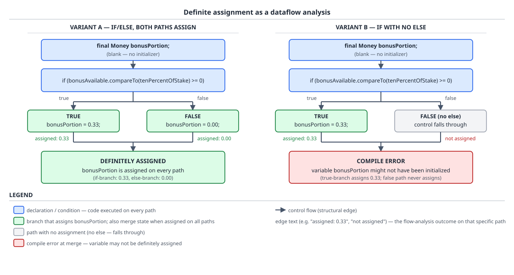

# 03 Java Core — Variables, kinds and definite assignment — BASICS (§1.5, 1.5.1–1.5.4, 1.5.13)

**Target version: Java 21 LTS.** | **Part 1 of 5** | [Index](../00-index.md)
Previous: [Object layout and memory](../objects-equality-and-lifecycle/05-internals-object-layout.md) · Next: [Names, scope and `var`](01a-names-scope-and-var.md)

A variable in Java is not one thing with one set of rules — JLS 21 §4.12.3 enumerates eight distinct kinds, and they differ on the two questions that matter most: whether the JVM zero-fills them for you, and whether the compiler will let you read them before you write them. This file is about the machinery that answers the second question: definite assignment, a compile-time dataflow analysis specified over statement structure in JLS 16, which every Java engineer has fought with and almost none can state the rule for. It refuses to hand-wave four things in particular: it derives, from the specification's own clauses, why `if (FLAG) { x = 1; }` with a constant-`false` flag rejects a later assignment to a blank final while `while (FLAG) { x = 1; }` fails with a completely different error; why an arrow `switch` statement covering all five constants of an enum still leaves a blank final unassigned in Java 21 while an equivalent sealed-interface pattern switch does not; why a blank final field gets no credit across constructors; and why a debugger shows you `arg0` instead of `bonusAvailable` unless someone passed a flag that is not on by default. Names, scope, `var`, effectively final and static initializer blocks are the next file's, [`01a-names-scope-and-var.md`](01a-names-scope-and-var.md).

## 1. Definite assignment is a dataflow analysis, not an initialisation rule (1.5.2, 1.5.3, 1.5.4)

Picture the compiler carrying two independent booleans alongside every local variable and every blank final field, at every point in the program: *definitely assigned here* and *definitely unassigned here*. They are not negations of each other — a variable can be neither, which is the interesting state. At a branch, the compiler propagates both flags down each arm separately; at a merge point it combines them with AND for "assigned" (assigned on *every* path) and AND for "unassigned" (untouched on *every* path). Reading a variable that is not definitely assigned is an error. Assigning to a blank final that is not definitely *unassigned* is a different error. Everything else in this section is that one picture applied to `if`, `while`, `switch` and `try`.

### Why it exists

Fields get zero-filled: JLS §4.12.3 says a class variable "is created when its class or interface is prepared (§12.3.2) and is initialized to a default value (§4.12.5)", and an instance variable likewise "is created and initialized to a default value" per object. Locals get no such promise, because a local lives in a stack frame slot that may hold whatever the previous occupant of that slot left behind — the Supporting facts section below shows that slot being literally reused, in real `javap` output. The language had two options: zero-fill every local on entry — a real per-call cost on every frame, paid for code that overwhelmingly assigns immediately anyway — or prove statically that no read can precede a write. Java chose the proof. That choice is why `int stakes; System.out.println(stakes);` is a compile error in Java and a silently garbage read in C.

Before the proof existed as a specified analysis, "initialise your locals at the point of declaration" was a coding convention enforced by review. The analysis turned the convention into a guarantee, and — this is the part people miss — it simultaneously created blank finals as a *usable* construct: you can only allow `final Money bonusPortion;` with the assignment deferred to a branch if you have a mechanical way to check every path assigns it exactly once.

### The mechanism

`[SOURCE]` JLS 21 §16, opening, states both halves of the rule:

> Every local variable declared by a statement (§14.4.2, §14.14.1, §14.14.2, §14.20.3) and every blank final field (§4.12.4, §8.3.1.2) must have a definitely assigned value when any access of its value occurs.

> Similarly, every blank final variable must be assigned at most once; it must be definitely unassigned when an assignment to it occurs.

Line by line: the first clause names exactly two populations subject to the analysis — locals declared by a *statement*, and blank final *fields*. Locals declared by a **pattern** are excluded, and §16 says so explicitly: "Note that local variables declared by a pattern (§14.30) are not subject to the rules of definite assignment. Every local variable declared by a pattern is initialized by the process of pattern matching and so always has a value when accessed." That is why `if (v instanceof Accept a)` never produces a "might not have been initialized" error on `a` — pattern binding and definite assignment are separate mechanisms. The second clause is the one people forget exists: for a blank final, *writing* is also policed, and the property policed is definite **un**assignment, not the negation of definite assignment.

§16 also names the exact scope of the analysis's cleverness:

> Except for the special treatment of the conditional boolean operators &&, ||, and ? : and of boolean-valued constant expressions, the values of expressions are not taken into account in the flow analysis.

So `bonusAvailable.compareTo(tenPercentOfStake) >= 0` is opaque to the compiler — it cannot know the branch is taken, and it does not try. The rules for the statement forms that matter (§16.2.7 for `if`, §16.2.10 for `while`, §16.2.15 for `try`, §16.2.9 for `switch`) are pure structure:

| Statement form | JLS 21 clause | Consequence for a blank final |
|---|---|---|
| `if (e) S` | "V is [un]assigned after `if (e) S` iff V is [un]assigned after S **and** V is [un]assigned after e when false" | Assignment only inside `S` never reaches the merge as definitely assigned |
| `if (e) S else T` | "V is [un]assigned after `if (e) S else T` iff V is [un]assigned after S **and** V is [un]assigned after T" | Assigning in both arms *does* reach the merge as definitely assigned |
| `while (e) S` | "V is [un]assigned after `while (e) S` iff V is [un]assigned after e when false **and** V is [un]assigned before every `break` statement for which the `while` statement is the break target" | `while (true) { x = 1; break; }` works; `while (cond) { x = 1; break; }` does not |
| `try` / `catch` (§16.2.15) | "V is [un]assigned after the try statement iff V is [un]assigned after the try block **and** V is [un]assigned after every catch block in the try statement" | An empty `catch` block is a path that assigns nothing |
| `switch` (§16.2.9) | "If the switch statement is **not exhaustive** (§14.11.1.1), or if the switch block ends with a switch label followed by the `}` separator, then V is [un]assigned after the selector expression" | Non-exhaustive switch contributes the fall-out-of-the-selector path |



**D-012** — Read the two variants side by side and only look at the merge point. VARIANT A has an `else`: both edges are annotated *assigned*, printing the real values `bonusPortion = 0.33` and `bonusPortion = 0.00`, and the merge is green, DEFINITELY ASSIGNED. VARIANT B drops the `else`: the false edge is annotated *not assigned*, and the merge is red — `COMPILE ERROR: variable may not have been initialized`. The branch condition on both is the same opaque call, `bonusAvailable.compareTo(tenPercentOfStake) >= 0`; note that its *value* plays no part in either verdict, only the shape of the edges reaching the merge.

Here is the mechanism as real code — the bonus/cash split from the QuizStakes stake path, where the bonus portion is `min(BONUS_AVAILABLE, 10% of stake)` rounded down to the minor unit:

```java
record Money(BigDecimal amount, Currency currency) {
    static Money of(String amount, String code) {
        return new Money(new BigDecimal(amount), Currency.getInstance(code));
    }
    Money minus(Money other) { return new Money(amount.subtract(other.amount), currency); }
    Money tenPercentFloored() {
        return new Money(amount.movePointLeft(1).setScale(2, RoundingMode.DOWN), currency);
    }
    int compareTo(Money other) { return amount.compareTo(other.amount); }
    @Override public String toString() { return amount.toPlainString() + " " + currency.getCurrencyCode(); }
}

record StakeSplit(Money bonusPortion, Money cashPortion) {
    Money total() {
        return new Money(bonusPortion.amount().add(cashPortion.amount()), bonusPortion.currency());
    }
}

final class FundsLedger {
    // Compiles: every path through the if/else assigns bonusPortion exactly once.
    static StakeSplit splitWithElse(Money stake, Money bonusAvailable) {
        final Money bonusPortion;
        Money tenPercentOfStake = stake.tenPercentFloored();
        if (bonusAvailable.compareTo(tenPercentOfStake) >= 0) {
            bonusPortion = tenPercentOfStake;
        } else {
            bonusPortion = bonusAvailable;
        }
        return new StakeSplit(bonusPortion, stake.minus(bonusPortion));
    }

    public static void main(String[] args) {
        System.out.println(splitWithElse(Money.of("3.33", "GBP"), Money.of("42.00", "GBP")));
        System.out.println(splitWithElse(Money.of("3.33", "GBP"), Money.of("0.00", "GBP")));
    }
}
```

`[NUM]` Compiled with `javac --release 21` and run, that prints exactly:

```
StakeSplit[bonusPortion=0.33 GBP, cashPortion=3.00 GBP]
StakeSplit[bonusPortion=0.00 GBP, cashPortion=3.33 GBP]
```

The first line is the canonical QuizStakes rounding case: a stake of 3.33 splits as 0.33 bonus + 3.00 cash, because `setScale(2, RoundingMode.DOWN)` floors `0.333` to `0.33`. Rounding the other way would give 0.34 + 3.00 = 3.34, creating money — which is why `StakeSplit.total()` exists as a checkable invariant, and it returns `3.33 GBP` for that split.

`[PROVE]` Now the argument, not the assertion. Delete the `else` arm so the method reads `if (cond) { bonusPortion = tenPercentOfStake; }` and then uses `bonusPortion`. Apply §16.2.7's first rule: *definitely assigned after `if (e) S`* requires definitely assigned after `S` **and** definitely assigned after `e` when false. The first conjunct holds — `S` assigns. The second asks whether `bonusPortion` was already assigned before the condition was evaluated; it was not, so the conjunct is false, so the conjunction is false, so `bonusPortion` is **not** definitely assigned at the merge, so the read is an error. Measured, `javac --release 21`:

```
error: variable x might not have been initialized
```

`[PROVE]` The same rules, applied to the *definite unassignment* half, produce the counter-intuitive result that makes this a real analysis rather than a heuristic. Take a constant flag and a blank final:

```java
static final boolean AUDIT = false;
void p() { final int x; if (AUDIT) { x = 1; } x = 9; System.out.println(x); }
void q() { final int x; while (AUDIT) { x = 1; } x = 9; System.out.println(x); }
```

Work `p()` first. §16.1.1 gives constant expressions two vacuous rules and two real ones; the relevant vacuous one is "V is [un]assigned after any constant expression whose value is false when true" — unconditionally true, because a constant `false` never *is* true. So `x` is definitely unassigned before `S`, `S` assigns it, and after `S` it is definitely assigned and **not** definitely unassigned. §16.2.7 then computes *definitely unassigned after the `if`* as "definitely unassigned after S **and** definitely unassigned after e when false" — the first conjunct is false. Therefore `x` is not definitely unassigned at `x = 9`, and per §16's second clause that assignment is rejected. Measured:

```
error: variable x might already have been assigned
        void p() { final int x; if (AUDIT) { x = 1; } x = 9; System.out.println(x); }
                                                      ^
```

Now `q()`, textually almost identical, fails with a completely different error:

```
error: unreachable statement
        void q() { final int x; while (AUDIT) { x = 1; } x = 9; System.out.println(x); }
                                              ^
```

The reason is that reachability (§14.21) and definite assignment (§16) are separate analyses that disagree on purpose about constant conditions, and §14.21 says exactly why:

> The rationale for this differing treatment is to allow programmers to define "flag" variables such as: `static final boolean DEBUG = false;` and then write code such as: `if (DEBUG) { x=3; }` The idea is that it should be possible to change the value of DEBUG from false to true or from true to false and then compile the code correctly with no other changes to the program text.

`while (false) { x = 3; }` has an unreachable body and is rejected; `if (false) { x = 3; }` does not, so the conditional-compilation idiom keeps working. Definite assignment, meanwhile, never got that exemption for the *unassignment* direction — hence two different errors from two textually parallel statements. `[X-REF 02]` The constant-inlining consequences of that same `static final boolean` — and the binary-compatibility caveat §14.21 attaches to it ("a change to the value of a flag is binary compatible with pre-existing binaries (no LinkageError occurs) but not behaviorally compatible") — belong to `02-modifiers.md`.

`[TRAP]` The Java 21 switch asymmetry, verified by compilation. A sealed-hierarchy pattern switch *statement* is required to be exhaustive, so §16.2.9's "if the switch statement is not exhaustive" clause never fires and the blank final is definitely assigned:

```java
sealed interface Verdict permits Accept, Refer, Decline {}
record Accept(BigDecimal headroom) implements Verdict {}
record Refer(String reason) implements Verdict {}
record Decline(String code) implements Verdict {}

static String sealedArrow(Verdict verdict) {
    final String code;
    switch (verdict) {                                   // exhaustive: compiles
        case Accept accept   -> code = "AA-711 REVIEW_APPROVED";
        case Refer refer     -> code = "AA-700 REVIEW_QUEUED";
        case Decline decline -> code = "AA-900 DECLINED";
    }
    return code;
}
```

An arrow switch *statement* over an enum, covering every constant, is **not** treated as exhaustive in Java 21 — a legacy enum switch statement is allowed to fall through for backward compatibility — so the same shape fails:

```java
enum AccountState { PENDING_VERIFICATION, ACTIVE, DORMANT, CLOSING, CLOSED }

static String enumArrowNoDefault(AccountState state) {
    final String code;
    switch (state) {                                     // all five constants covered
        case PENDING_VERIFICATION -> code = "AO-100 IDENTITY_CREATED";
        case ACTIVE               -> code = "AA-801 ACTIVATED";
        case DORMANT              -> code = "DORMANT_FROZEN";
        case CLOSING              -> code = "CLOSING";
        case CLOSED               -> code = "CLOSED";
    }
    return code;                                         // error: variable code might not have been initialized
}
```

**Pitfall:** believing "I covered every enum constant, so the compiler knows the variable is assigned." The symptom is `variable code might not have been initialized` on a switch that visibly has no missing case, which reads as a compiler bug and drives people to initialise the variable to a junk default — destroying the blank final and silently swallowing the day someone adds a sixth constant. The fix is to convert it to a switch **expression**, which is required to be exhaustive and therefore yields a value on every path:

```java
static String asExpression(AccountState state) {
    final String code = switch (state) {
        case PENDING_VERIFICATION -> "AO-100 IDENTITY_CREATED";
        case ACTIVE               -> "AA-801 ACTIVATED";
        case DORMANT              -> "DORMANT_FROZEN";
        case CLOSING              -> "CLOSING";
        case CLOSED               -> "CLOSED";
    };
    return code;
}
```

That compiles, and it also *stops* compiling the day a sixth `AccountState` constant is added — which is the behaviour you wanted from the statement form and did not get. Adding `default -> code = "AA-900 DECLINED";` to the statement form also compiles, and is the wrong fix, because it buys silence on the new constant.

`[TRAP]` The `try`/`catch` case follows from the same conjunction and catches people constantly:

```java
static int parseCapturedAmountMinorUnits(String pspField) {
    int minorUnits;
    try {
        minorUnits = Integer.parseInt(pspField);
    } catch (NumberFormatException malformed) {
        // no assignment here -> this is a path on which minorUnits stays unassigned
    }
    return minorUnits;                  // error: variable minorUnits might not have been initialized
}
```

§16.2.15: definitely assigned after the `try` statement requires definitely assigned after the try block **and** after every catch block. The empty catch block is a path that assigns nothing, so the conjunction fails. Assigning `minorUnits = 0;` inside the catch compiles — and is exactly the wrong fix for a `DEP-301 CAPTURED` amount, where a zero silently books a free deposit. Rethrowing, or returning from the catch, is the fix that keeps the blank final honest; the wrong-then-right pair is worked out under Pitfalls below.

Blank finals (1.5.4) are the same analysis pointed at fields. JLS 21 §4.12.4, verbatim: "A *blank final* is a final variable whose declaration lacks an initializer." The rule for a blank final *field* is that every constructor path must assign it exactly once — not "the class must assign it somewhere":

```java
final class Bonus {
    private final Money grantedAmount;     // blank final: no initializer
    private final String state;            // blank final

    // Grant path: 10% of the first deposit, capped at 100.
    Bonus(Money firstDeposit) {
        Money cap = Money.of("100.00", firstDeposit.currency().getCurrencyCode());
        Money tenth = firstDeposit.tenPercentFloored();
        if (tenth.compareTo(cap) > 0) {
            grantedAmount = cap;
        } else {
            grantedAmount = tenth;
        }
        state = "GRANTED";
    }

    // Expiry-reversal path: a distinct constructor, so it must assign both fields itself.
    Bonus() {
        this.grantedAmount = Money.of("0.00", "GBP");
        this.state = "EXPIRED";
    }

    @Override public String toString() { return state + " " + grantedAmount; }
}
```

`[NUM]` Verified output for first deposits of 650.00 and 2000.00 and the reversal path, `javac --release 21`:

```
GRANTED 65.00 GBP
GRANTED 100.00 GBP
EXPIRED 0.00 GBP
```

The 2000.00 deposit grants 100.00, not 200.00 — the cap applied. **Insight:** the second constructor is the interesting one. It must assign both blank finals *itself*; the compiler will not credit it with the first constructor's assignments. That is precisely the property you want on a regulated grant amount — every way of constructing a `Bonus` is forced to state what it granted, and a new constructor added next year cannot forget.

Where the same analysis is reused rather than restated: **effective finality** for a blank local is defined in JLS §4.12.4 as "whenever it occurs as the left hand side in an assignment expression, it is definitely unassigned and not definitely assigned before the assignment" — which is why `final Money bonusPortion;` assigned once in an if/else can then be captured by a lambda. That leaf (1.5.10) and its full context belong to [`01a-names-scope-and-var.md`](01a-names-scope-and-var.md).

> **Definite assignment** is a compile-time dataflow analysis (JLS 21 §16) that, at every program point, tracks two independent properties per local-declared-by-statement and per blank final field — *definitely assigned* and *definitely unassigned* — combining them at merge points by conjunction over all incoming paths, taking expression *values* into account only for `&&`, `||`, `!`, `? :` and boolean constant expressions; a read requires definitely assigned, and an assignment to a blank final requires definitely unassigned.

## Supporting facts

### The kinds of variable JLS 4.12.3 enumerates (1.5.1)

`[SOURCE]` `[VERSION-TRAP]` JLS 21 §4.12.3 opens: "There are **eight** kinds of variables:" — a class variable, an instance variable, array components, method parameters, constructor parameters, **lambda parameters**, an exception parameter, and local variables. Seven was correct up to and including JLS 7; **lambda parameters** were added to the enumeration when lambdas arrived in Java 8, and JLS 21 §4.12.3 defines them as naming "argument values passed to a lambda expression body (§15.27.2)", with a new parameter variable created "each time a method implemented by the lambda body is invoked". Any list of "the seven kinds of variables" you find in a blog post — or in a syllabus — predates Java 8. The specification's own §4.12.3 example, worth having in front of you because it labels each kind at its declaration site and flags one further thing that is *not* on the list:

```java
class Point {
    static int numPoints;       // numPoints is a class variable
    int x, y;                   // x and y are instance variables
    int[] w = new int[10];      // w[0] is an array component
    int setX(int x) {           // x is a method parameter
        int oldx = this.x;      // oldx is a local variable
        this.x = x;
        return oldx;
    }
    boolean equalAtX(Object o) {
        if (o instanceof Point p)   // p is a pattern variable
            return this.x == p.x;
        else
            return false;
    }
}
```

The gotcha in that example: `p` is a **pattern variable**, which §4.12.3 classifies as a *local variable declared by a pattern* rather than as a ninth kind — and, per §16, it is exempt from definite assignment entirely. The one behavioural line that separates the eight: class variables, instance variables and array components are created with a **default value** per §4.12.5; the five parameter kinds are initialised from an argument; only locals declared by a statement have neither, which is what makes §16 necessary at all. Note also that `setX`'s parameter `x` *shadows* the instance variable `x`, which is why the method body has to write `this.x` to reach the field — the mechanism is leaf 1.5.5's and lives in [`01a-names-scope-and-var.md`](01a-names-scope-and-var.md).

> The eight kinds of variable in JLS 21 §4.12.3 are class variable, instance variable, array component, method parameter, constructor parameter, lambda parameter, exception parameter and local variable; the first three are default-initialised, the middle five arrive with a value, and only statement-declared locals require definite assignment.

### The local variable table, slot reuse, and why a debugger loses names (1.5.13)

A local variable does not exist in bytecode as a name; it exists as an **index into the current frame's local variable array** — slot 0, slot 1, slot 2 — and the JVM neither knows nor cares what you called it. Names survive only in an optional `LocalVariableTable` attribute of the method's `Code` attribute, which `javac` emits only when asked. Slots are allocated by `javac` and freely **reused** once a variable's scope ends, which is exactly why an unassigned local can be sitting on whatever the previous occupant left in that slot, and therefore why §16 exists.

`[RESEARCH]` `[NUM]` Verified with `javac --release 21 -g` and `javap -c -p -l` on a static method with two sibling blocks, each declaring one `BigDecimal` local:

```
      LocalVariableTable:
        Start  Length  Slot  Name   Signature
            6      10     2 tenth   Ljava/math/BigDecimal;
           22       2     2  cash   Ljava/math/BigDecimal;
            0      24     0 stake   Ljava/math/BigDecimal;
            0      24     1 bonusAvailable   Ljava/math/BigDecimal;
```

Read the Slot column: `tenth` and `cash` **share slot 2**, with disjoint bytecode ranges (`Start 6, Length 10` and `Start 22, Length 2`). One frame slot, two variables, sequentially — and this is a `static` method, so slot 0 is the first parameter `stake` rather than `this`. In an instance method slot 0 is always `this`.

`[NUM]` The `-g` variants, verified by compiling the same source five ways and grepping the attributes `javap -c -l -p` reports:

| `javac` flag | `LineNumberTable` | `LocalVariableTable` |
|---|---|---|
| (default, no `-g`) | emitted | **not emitted** |
| `-g` | emitted | emitted |
| `-g:vars` | not emitted | emitted |
| `-g:lines` | emitted | not emitted |
| `-g:none` | not emitted | not emitted |

**Pitfall:** assuming a debugger will show you parameter and local names because the class file "obviously has them". It does not by default — `javac` with no `-g` emits `LineNumberTable` and `SourceFile` but no `LocalVariableTable`, which is why a debugger attached to a default-built jar shows `arg0`, `arg1` and refuses to evaluate `bonusAvailable` by name. Note this is separate from `-parameters`, which controls whether *reflection* (`java.lang.reflect.Parameter.getName`) sees real parameter names; a class file can have one, both or neither. The fix is to build with `-g` for anything you intend to debug, and to know that a stack trace's line numbers surviving while variable names vanish is the expected consequence of the default, not a corrupted build.

> A local variable exists in bytecode only as a **slot index** in the frame's local variable array, with its source name recorded solely in the optional `LocalVariableTable` attribute that `javac` emits under `-g` or `-g:vars` and omits by default; slots are reused across disjoint scopes, which is the concrete reason locals carry no default value.

`[X-REF 06]` Debugger internals, the full `-g` and `-parameters` matrix, and reading `javap` output in depth belong to guide **06 JVM internals**. The class file format itself — the constant pool, the `Code` attribute and the exact structure of `LocalVariableTable` and `LocalVariableTypeTable` — is owned by [`../language-substrate/03a-internals-class-file-format.md`](../language-substrate/03a-internals-class-file-format.md). Instance initializer blocks, leaf 1.5.11 and the full `new` ordering walk are owned by [`01b-initialization-order.md`](01b-initialization-order.md); what triggers class initialization, `Class.forName` and `ExceptionInInitializerError` are owned by [`01d-class-initialization-triggers.md`](01d-class-initialization-triggers.md).

## Pitfalls

### "I covered every enum constant, so the blank final is assigned"

**Wrong**

```java
enum AccountState { PENDING_VERIFICATION, ACTIVE, DORMANT, CLOSING, CLOSED }

static String statusFor(AccountState state) {
    final String code;
    switch (state) {
        case PENDING_VERIFICATION -> code = "AO-100 IDENTITY_CREATED";
        case ACTIVE               -> code = "AA-801 ACTIVATED";
        case DORMANT              -> code = "DORMANT_FROZEN";
        case CLOSING              -> code = "CLOSING";
        case CLOSED               -> code = "CLOSED";
    }
    return code;
}
```

Compiled with `javac --release 21`, the surprise is an error on a switch with no missing case:

```
error: variable code might not have been initialized
        return code;
               ^
```

An arrow `switch` **statement** over an enum is not required to be exhaustive in Java 21 — legacy enum switch statements may fall through — so JLS §16.2.9's clause "If the switch statement is not exhaustive (§14.11.1.1), or if the switch block ends with a switch label followed by the `}` separator, then V is [un]assigned after the selector expression" contributes a path on which `code` is never assigned.

**Right**

```java
static String statusFor(AccountState state) {
    return switch (state) {                     // a switch EXPRESSION must be exhaustive
        case PENDING_VERIFICATION -> "AO-100 IDENTITY_CREATED";
        case ACTIVE               -> "AA-801 ACTIVATED";
        case DORMANT              -> "DORMANT_FROZEN";
        case CLOSING              -> "CLOSING";
        case CLOSED               -> "CLOSED";
    };
}
```

This compiles, and it also *stops* compiling the day a sixth `AccountState` constant is added — the exhaustiveness check you wanted. Adding `default -> code = "AA-900 DECLINED";` to the statement form also compiles, and is worse than useless: it maps a brand-new state to `DECLINED` in silence.

**Why people believe it:** a sealed-interface pattern switch *statement* with the same shape genuinely does compile, because pattern switches **are** required to be exhaustive. Having seen it work once, people generalise to enums, where Java 21 keeps the pre-14 behaviour for compatibility.

### "`if (FLAG)` with a constant-false flag is dead code, so nothing downstream is affected"

**Wrong**

```java
static final boolean AUDIT_MODE = false;

void reserveStake() {
    final int auditTrailId;
    if (AUDIT_MODE) { auditTrailId = 1; }
    auditTrailId = 9;                       // "the branch is dead, so this is the only assignment"
    System.out.println(auditTrailId);
}
```

```
error: variable auditTrailId might already have been assigned
    auditTrailId = 9;
    ^
```

And swapping `if` for `while` in the identical shape produces a *different* error, `error: unreachable statement`, because reachability (JLS §14.21) special-cases constant conditions in `if` — to keep the conditional-compilation idiom working — and does not special-case them in `while`, whereas definite assignment (§16) never got that exemption for the unassignment direction at all.

**Right**

```java
static final boolean AUDIT_MODE = false;

void reserveStake() {
    final int auditTrailId = AUDIT_MODE ? 1 : 9;   // one assignment, one path, definitely assigned
    System.out.println(auditTrailId);
}
```

The conditional operator is one of the four forms §16 does treat specially, so this is definitely assigned with no branch merge to argue about, and it flips correctly if `AUDIT_MODE` becomes `true`.

**Why people believe it:** `if (false) { x = 3; }` really is exempted from the unreachable-statement rule — §14.21 says so and explains the flag-variable rationale — so "the compiler ignores dead `if` branches" is half true. It ignores them for *reachability*, not for definite unassignment.

### "The compiler wants the variable initialised, so I will give it a default in the catch block"

**Wrong**

```java
static int capturedAmountMinorUnits(String pspField) {
    int minorUnits;
    try {
        minorUnits = Integer.parseInt(pspField);
    } catch (NumberFormatException malformed) {
        minorUnits = 0;                    // "silences the compiler"
    }
    return minorUnits;
}
```

This compiles cleanly, and that is the problem. The version without the `minorUnits = 0;` is rejected with `error: variable minorUnits might not have been initialized`, because §16.2.15 requires definitely-assigned after the try block **and** after every catch block, and an empty catch is a path that assigns nothing. Adding the zero satisfies the analysis and books a `DEP-301 CAPTURED` deposit of **0.00** for a payment the PSP says succeeded — a free deposit, silently, with a ledger that still balances because `SUSPENSE` absorbs the difference. The compiler was telling the truth; the "fix" converted a compile error into a money bug.

**Right**

```java
static int capturedAmountMinorUnits(String pspField) {
    final int minorUnits;
    try {
        minorUnits = Integer.parseInt(pspField);
    } catch (NumberFormatException malformed) {
        throw new IllegalStateException(
            "PSP capture amount not parseable, refusing to book DEP-301: " + pspField, malformed);
    }
    return minorUnits;                     // definitely assigned: the catch path cannot reach here
}
```

Throwing from the catch block means that path never reaches the read at all, so `minorUnits` is definitely assigned on every path that *does* — and declaring it `final` now costs nothing and documents the single-assignment intent. §16.2.13 is the clause doing the work: a `throw` completes abruptly, so it contributes no path to the merge.

**Why people believe it:** "might not have been initialized" reads as a complaint about syntax rather than a statement about a real execution path, and a default value is the fastest thing that makes the message disappear. The message is actually naming a path through your method that you have not decided what to do about.

### "A blank final field assigned in one constructor is initialised for the class"

**Wrong**

```java
final class Bonus {
    private final Money grantedAmount;
    private final String state;

    Bonus(Money firstDeposit) {
        this.grantedAmount = firstDeposit.tenPercentFloored();
        this.state = "GRANTED";
    }

    Bonus() { }                            // "grantedAmount and state are already handled above"
}
```

```
error: variable grantedAmount might not have been initialized
error: variable state might not have been initialized
```

Two errors on the empty constructor. §16.9 runs the analysis independently per constructor, so the no-arg constructor gets no credit whatsoever for what the other one assigned.

**Right**

```java
final class Bonus {
    private final Money grantedAmount;
    private final String state;

    Bonus(Money firstDeposit) {
        this.grantedAmount = firstDeposit.tenPercentFloored();
        this.state = "GRANTED";
    }

    Bonus() { this(Money.of("0.00", "GBP")); }     // delegate, then override the state
}
```

Delegating with an explicit `this(Money.of("0.00", "GBP"))` invocation makes the second constructor reach the first one's assignments on the only path it has, which is the pattern to reach for whenever two constructors must agree on a blank final — and it means a third field added next year has exactly one place to be initialised rather than two places to forget.

**Why people believe it:** the field is visibly assigned somewhere in the class, and "final field assigned in the constructor" is how everyone describes the rule out loud. The specification's unit of analysis is the individual constructor path, not the class.

## Cheat sheet

| Item | Value |
|---|---|
| Kinds of variable, JLS 21 §4.12.3 | **Eight** — class, instance, array component, method param, constructor param, **lambda param**, exception param, local |
| "Seven kinds" | Correct only through JLS 7; lambda parameters joined the list in Java 8 |
| Pattern variable | A *local declared by a pattern*; not a ninth kind, and exempt from §16 entirely |
| Default-initialised | Class variables, instance variables, array components (§4.12.5) |
| Initialised from an argument | Method, constructor and lambda parameters; exception parameters |
| Not initialised at all | Locals declared by a statement — the whole reason §16 exists |
| Definite assignment spec | JLS 21 §16; two independent flags, *definitely assigned* and *definitely unassigned* |
| Read rule | Access requires **definitely assigned** |
| Blank-final write rule | Assignment requires **definitely unassigned** — not the negation of the read rule |
| Merge-point combination | Conjunction over every incoming path, for both flags |
| Values the analysis sees | Only `&&`, `\|\|`, `!`, `? :` and boolean constant expressions — every other condition is opaque |
| `if (e) S` (§16.2.7) | after = (after S) **AND** (after e when false) — no `else` means never assigned |
| `if (e) S else T` | after = (after S) **AND** (after T) — both arms assign, so definitely assigned |
| `while (e) S` (§16.2.10) | after = (after e when false) AND (before every targeting `break`) |
| `while (true) { x=1; break; }` | Definitely assigned — the `break` carries the flag out |
| `while (cond) { x=1; break; }` | **Not** definitely assigned — the condition may be false on entry |
| `try`/`catch` (§16.2.15) | after = (after try block) AND (after **every** catch block) — an empty catch is an unassigning path |
| `throw` in a catch (§16.2.13) | Completes abruptly, contributes no path to the merge — the honest fix for the catch case |
| `switch` (§16.2.9) | If the switch is not exhaustive, the selector-expression path is added |
| Java 21 switch asymmetry | Sealed **pattern** switch statement is exhaustive → OK; arrow **enum** switch statement is not → error |
| Fix for the enum case | Use a switch **expression**; a `default` arm compiles but silently swallows new constants |
| Constant-`false` `if` | `if (F) { x=1; }` then `x=9` → `variable x might already have been assigned` |
| Constant-`false` `while` | `while (F) { x=1; }` → `error: unreachable statement` (§14.21) |
| Why they differ | §14.21 exempts `if` from unreachability for the flag-variable idiom; §16 has no such exemption |
| Blank final, §4.12.4 verbatim | "a final variable whose declaration lacks an initializer" |
| Blank final field rule | Assigned exactly once on **every** constructor path; §16.9 analyses each constructor independently |
| Two constructors, one blank final | Delegate with an explicit constructor invocation — the second gets no credit for the first's assignments |
| Blank local + effective finality | A blank local assigned once on every path is effectively final, so it is capturable |
| Locals in bytecode | A **slot index** in the frame's local variable array; no name |
| Slot 0 | `this` in an instance method; the first parameter in a `static` method |
| Slot reuse, measured | `tenth` (Start 6, Len 10) and `cash` (Start 22, Len 2) both **Slot 2** |
| Why slot reuse matters | A slot may hold the previous occupant's value — hence no default, hence §16 |
| `javac` default (no `-g`) | `LineNumberTable` **yes**, `LocalVariableTable` **no** → debugger shows `arg0` |
| `-g` | Both tables emitted |
| `-g:vars` | `LocalVariableTable` only |
| `-g:lines` | `LineNumberTable` only |
| `-g:none` | Neither table |
| `-parameters` | Separate flag; governs **reflection**'s `Parameter.getName`, not the debugger table |

## Self-test

**Q1.** Derive, from the JLS clauses rather than from memory, why `final Money bonusPortion; if (cond) { bonusPortion = tenPercentOfStake; } return bonusPortion;` fails while adding an `else` arm fixes it.

<details><summary>Answer</summary>

JLS §16.2.7 gives the rule for `if (e) S`: V is definitely assigned after `if (e) S` **iff** V is definitely assigned after `S` **and** V is definitely assigned after `e` when false. In the no-`else` version the first conjunct holds — `S` does assign `bonusPortion` — but the second asks whether `bonusPortion` was already definitely assigned before the condition was evaluated, and it was not (it is a blank final just declared). A conjunction with a false operand is false, so `bonusPortion` is not definitely assigned at the merge point, and §16's opening clause makes reading a not-definitely-assigned variable a compile-time error: `variable bonusPortion might not have been initialized`. Adding an `else` switches the applicable rule to §16.2.7's second form for `if (e) S else T`: V is definitely assigned after `if (e) S else T` iff V is definitely assigned after `S` **and** after `T`. Both arms assign, both conjuncts hold, so the variable is definitely assigned at the merge. Note what plays no part in either derivation: the *value* of the condition. §16 says explicitly that "Except for the special treatment of the conditional boolean operators `&&`, `||`, and `? :` and of boolean-valued constant expressions, the values of expressions are not taken into account in the flow analysis" — so `bonusAvailable.compareTo(tenPercentOfStake) >= 0` is entirely opaque and only the shape of the edges reaching the merge matters.

</details>

**Q2.** `static final boolean AUDIT = false;` and then `final int x; if (AUDIT) { x = 1; } x = 9;` gives one error, while `final int x; while (AUDIT) { x = 1; } x = 9;` gives a completely different one. Name both errors and explain the mechanism.

<details><summary>Answer</summary>

The `if` version gives `error: variable x might already have been assigned`, on the `x = 9` line. The `while` version gives `error: unreachable statement`, on the `while` condition. Two separate analyses are involved and they disagree about constant conditions on purpose. Reachability (§14.21) special-cases `if`: `while (false) { x = 3; }` has an unreachable body and is rejected, but `if (false) { x = 3; }` is explicitly *not* regarded as unreachable, and the spec states the rationale — to allow "flag" variables such as `static final boolean DEBUG = false;` so that flipping the flag recompiles with no other text changes. Definite assignment (§16) never got that exemption for the unassignment direction. Working it through: §16.1.1's rule "V is [un]assigned after any constant expression whose value is false when true" holds vacuously, so `x` is definitely unassigned before the then-branch; the branch assigns it, so after `S` it is definitely assigned and *not* definitely unassigned. §16.2.7 then computes definitely-unassigned-after-the-`if` as (definitely unassigned after S) AND (definitely unassigned after e when false) — first conjunct false — so `x` is not definitely unassigned at `x = 9`, and §16's second clause ("every blank final variable must be assigned at most once; it must be definitely unassigned when an assignment to it occurs") rejects it.

</details>

**Q3.** An arrow `switch` statement covers all five constants of an `AccountState` enum and assigns a blank final in every arm, and it does not compile. An arrow `switch` statement over a sealed `Verdict` hierarchy with the same shape does compile. Why, and what is the right fix?

<details><summary>Answer</summary>

§16.2.9's rule for switch statements includes the clause "If the switch statement is not exhaustive (§14.11.1.1), or if the switch block ends with a switch label followed by the `}` separator, then V is [un]assigned after the selector expression." A pattern switch over a sealed hierarchy **is required** to be exhaustive in Java 21, so that clause never fires and every path assigns — it compiles. An arrow switch *statement* whose selector is an enum and whose labels are plain constants is a legacy enum switch, permitted to fall through for backward compatibility with pre-Java-14 code, so it is **not** exhaustive even when every constant is listed; the clause fires, adds the fall-out-of-the-selector path, and the blank final is not definitely assigned. The right fix is to convert it to a switch **expression**, assigning `final String code` from `switch (state)` with one arrow arm per constant, which is required to be exhaustive and so is definitely assigned — and which will additionally fail to compile the day a sixth constant is added, which is exactly the safety you wanted. Adding a `default` arm that assigns the same variable also makes it compile and is the wrong fix, because it maps every future new constant to the default in silence.

</details>

**Q4.** A method declares `int minorUnits;`, assigns it inside a `try`, and reads it after. Why does the empty `catch` block break it, and what are the two fixes — one of which is a money bug?

<details><summary>Answer</summary>

§16.2.15 says V is definitely assigned after the try statement iff V is definitely assigned after the try block **and** after every catch block in the try statement. The empty catch block is a real execution path on which nothing assigns `minorUnits`, so the conjunction fails and the read is rejected with `variable minorUnits might not have been initialized`. Fix one, the money bug: assign a default in the catch, `minorUnits = 0;`. That compiles, and it books a `DEP-301 CAPTURED` deposit of 0.00 for a payment the PSP confirmed — silently, with a ledger that still balances because `SUSPENSE` absorbs the difference. Fix two, the honest one: throw from the catch block. §16.2.13 makes a `throw` complete abruptly, so it contributes no path to the merge at all, which means the variable is definitely assigned on every path that actually reaches the read — and you can now declare it `final`. The general lesson: "might not have been initialized" is not a complaint about syntax, it is the compiler naming an execution path you have not decided what to do about, and a default value decides it wrongly by default.

</details>

**Q5.** Why does a blank final field assigned in one constructor still fail to compile in a second, empty constructor, and what is the idiomatic fix?

<details><summary>Answer</summary>

§16.9 applies the definite-assignment analysis to constructors and instance initializers, and it does so **per constructor path**, not per class. Each constructor is analysed as its own body with the blank final starting out definitely unassigned; assignments made in a *different* constructor are not on this constructor's path, so they contribute nothing. An empty second constructor therefore fails with `variable grantedAmount might not have been initialized`, once per blank final field. The idiomatic fix is to delegate with an explicit constructor invocation — `Bonus() { this(Money.of("0.00", "GBP")); }` — because that invocation puts the first constructor's assignments genuinely on the second one's path. The alternative, repeating the assignments in both constructors, also compiles but means a blank final added next year has two places it can be forgotten instead of one. This per-path strictness is exactly the property you want on a regulated value such as a granted bonus amount: every way of constructing the object is forced to state what it granted.

</details>

**Q6.** JLS 21 §4.12.3 enumerates how many kinds of variable, and which one do stale sources leave out? Which kinds are default-initialised?

<details><summary>Answer</summary>

**Eight**: class variable, instance variable, array component, method parameter, constructor parameter, lambda parameter, exception parameter, and local variable. Stale sources say seven and leave out **lambda parameters**, which joined the enumeration in Java 8 when lambdas arrived — "seven kinds of variables" was correct only up to and including JLS 7, so any blog post or syllabus using that number predates Java 8. §4.12.3 defines a lambda parameter as naming "argument values passed to a lambda expression body (§15.27.2)", with a new parameter variable created each time a method implemented by the lambda body is invoked. On initialisation, the eight split three ways: class variables, instance variables and array components are created with a **default value** per §4.12.5 (a class variable "is created when its class or interface is prepared (§12.3.2) and is initialized to a default value"); the four parameter kinds arrive already holding an argument value; and locals declared by a statement get neither, which is the entire reason JLS 16 exists. One thing that is *not* a ninth kind: a pattern variable, which §4.12.3 classifies as a local variable declared by a pattern, and which §16 explicitly exempts from definite assignment because pattern matching always initialises it.

</details>

**Q7.** Why does a debugger show `arg0` instead of `bonusAvailable`, and what does `javap -c -p -l` reveal about slot reuse that explains why locals have no default value?

<details><summary>Answer</summary>

A local variable has no name in bytecode. It is a **slot index** into the current frame's local variable array, and its source name is recorded only in the optional `LocalVariableTable` attribute of the method's `Code` attribute. `javac` does not emit that attribute by default: compiling with no `-g` produces `LineNumberTable` and `SourceFile` but no `LocalVariableTable`, which is exactly why a debugger attached to a default-built artefact shows `arg0`, `arg1` and cannot evaluate `bonusAvailable` by name while still showing correct line numbers. `-g` emits both tables, `-g:vars` emits only `LocalVariableTable`, `-g:lines` only `LineNumberTable`, `-g:none` neither. (`-parameters` is a separate flag governing whether *reflection* sees real parameter names, not the debugger table.) On slot reuse: for a static method with two sibling blocks each declaring one `BigDecimal` local, `javap -c -p -l` under `-g` reports `tenth` at Slot 2 with `Start 6, Length 10` and `cash` at Slot 2 with `Start 22, Length 2` — the same slot, two variables, disjoint bytecode ranges. Slot 0 is the first parameter here because the method is static; in an instance method slot 0 is `this`. That reuse is the concrete reason locals cannot be assumed to hold a default: a slot may hold whatever the previous occupant left in it, so zero-filling every local on frame entry would be a real per-call cost, and Java chose the static proof (§16) instead.

</details>

## Open questions

- **Unverified:** every compile-time measurement in this file was taken with `javac 25.0.1 --release 21`, not with a JDK 21 `javac` binary. `--release 21` pins the language level, so the accept/reject verdicts are the Java 21 verdicts, and the `-g` attribute matrix was read out of the resulting class files. The one thing not independently confirmed against a JDK 21 toolchain is the exact *diagnostic wording* — `javac` error message text is not specified anywhere and does drift between releases, so treat the quoted strings as the shape of the message rather than a byte-exact JDK 21 string. The verdicts themselves are derived from the JLS clauses quoted alongside each one.

---

**Leaves covered:** 1.5.1, 1.5.2, 1.5.3, 1.5.4, 1.5.13 (5 leaves)
**Leaves deferred:** none
**Diagrams included:** D-012
**Target version:** Java 21 LTS
**Lines:** 588
