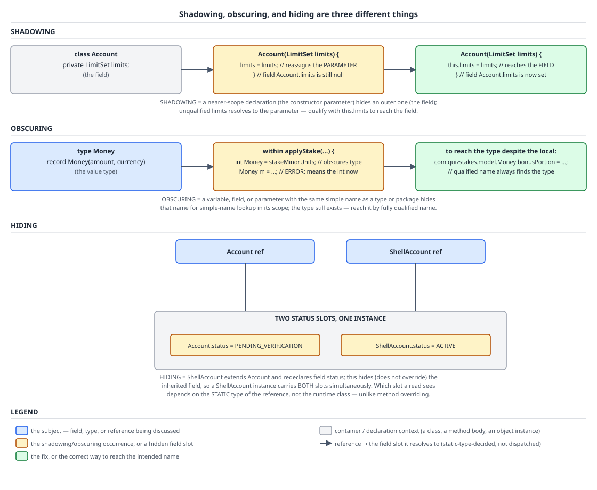

# 03 Java Core — Names, scope and `var` — BASICS (§1.5, 1.5.5–1.5.10, 1.5.12)

**Target version: Java 21 LTS.** | **Part 1 of 5** | [Index](../00-index.md)
Previous: [Variables, kinds and definite assignment](01-basics.md) · Next: [The initialization order of a `new`](01b-initialization-order.md)

Four mechanisms that all present as "the wrong thing got read", and that most engineers have merged into one vague sense that Java is fussy about names. They are not one mechanism: shadowing, obscuring and hiding live in three different chapters of the specification and only one of them duplicates storage; `var` is a compile-time abbreviation that can name types the declaration grammar cannot spell; effective finality is a property the compiler *derives* and then *demands*; and a static initializer block is one line of a single synthetic method whose textual order is its program order. This file refuses to hand-wave four things: it proves from `javap` output that field hiding puts two live fields in one object and that a cast — which can never change which method a virtual call reaches — changes which field you read; it separates `var`'s two distinct failure families, grammar rejection versus inference failure, with the verbatim diagnostic for each of eleven contexts; it quotes JLS §4.12.4's three implicitly-final kinds and the sentence about uni-catch that interviewers actually ask; and it shows the illegal-forward-reference rule failing to catch a `null` constant, with the specification conceding in its own words that it only catches "most" such cases. Definite assignment, the eight kinds of variable and the local variable table are the previous file's, [`01-basics.md`](01-basics.md).

## 1. Shadowing, obscuring and hiding are three different mechanisms (1.5.5, 1.5.6, 1.5.7)

Three failures that all look like "the wrong `status` got read", with three completely different causes. **Shadowing** is one *variable* declaration winning over another variable declaration in an inner scope — there is one field, and you failed to reach it. **Obscuring** is a *variable* name winning over a *type* name in a context where both could parse — the type still exists, you just cannot spell it as a simple name any more. **Hiding** is two *fields* genuinely existing in one object, selected by the static type of the reference you used. Shadowing and obscuring are name-resolution accidents; hiding is a real duplication of storage.

### Why it exists

None of the three is a feature anybody designed for its own sake; all three fall out of decisions taken for other reasons. Shadowing exists because `Account(LimitSet limits) { this.limits = limits; }` is the idiom everyone wants — same word for the parameter and the field — and the language permits it by resolving the innermost declaration first. Obscuring exists because a simple name is syntactically ambiguous between variable, type and package, and something had to break the tie; JLS 21 §6.4.2 states the tie-break: "the rules of §6.5.2 specify that a variable will be chosen in preference to a type, and that a type will be chosen in preference to a package." Field hiding exists because fields are not virtual: a subclass declaring a field with a superclass field's name cannot *replace* it, because superclass code compiled against the superclass field must keep working, so the only coherent answer is two fields.

### The mechanism

`[SOURCE]` §6.4.2 draws the distinction explicitly, and names the sections that own each: "Obscuring is distinct from shadowing (§6.4.1) and hiding (§8.3, §8.4.8.2, §8.5, §9.3, §9.5)." Three different chapters, three different mechanisms.

| Mechanism | What competes | Where the rule lives | Is there more than one entity? | How you reach the other one |
|---|---|---|---|---|
| Shadowing | variable vs variable | JLS §6.4.1 | One field, one parameter/local | `this.limits` |
| Obscuring | variable vs type (vs package) | JLS §6.4.2, §6.5.2 | One type, one variable | Fully qualified name, or rename the variable |
| Hiding | field vs field | JLS §8.3 | **Two fields in one object** | Cast the reference, or `super.status` |



**D-013** — Three stacked panels over `Account`/`ShellAccount`. Panel 1, **shadowing**: the constructor parameter `limits` is drawn covering the field of the same name, with `this.limits = limits` drawn in as the fix — one field, two names for it, one of which is unreachable without `this`. Panel 2, **obscuring**: a local variable named `Money` drawn over the *type* `Money`, so `Money.of("3.33", "GBP")` no longer parses as a static call. Panel 3, **hiding**, the one to study: a single object with **two** amber-highlighted field slots, `Account.status` and `ShellAccount.status`, and two references — one typed `Account`, one typed `ShellAccount` — each routed down into a *different* slot. Note that both arrows point into the same object.

`[TRAP]` Shadowing, in the domain, and the bug it produces when the `this.` is dropped:

```java
record LimitSet(Money dailyDeposit, Money maxStake, Money monthlyLoss) { }

final class Account {
    private LimitSet limits;

    Account(LimitSet limits) {
        limits = limits;          // self-assignment: the parameter shadows the field
    }

    LimitSet limits() { return limits; }
}
```

`[NUM]` `new Account(new LimitSet(dailyDeposit, maxStake, monthlyLoss)).limits()` returns **null**, verified. `javac --release 21 -Xlint:all` on that class emits **no warning at all** and exits 0 — the compiler is silent, because `limits = limits;` is a perfectly legal assignment of the parameter to itself. The fix is one keyword:

```java
    Account(LimitSet limits) {
        this.limits = limits;     // the field is only reachable through this
    }
```

**Pitfall:** treating shadowing as harmless because "the compiler would tell me." It will not — no error, and no `-Xlint:all` warning on JDK 21. The symptom is a `null` field discovered far from the constructor, typically as a `NullPointerException` inside a limit check on the deposit path rather than at construction. The fix is mechanical, and has two halves: every write to the field goes through `this.`, and the field is declared a blank `final` — because once it is, JLS §16 demands every constructor path assign it exactly once, so the self-assignment version stops compiling altogether (`variable limits might not have been initialized`) and a silent `null` becomes a compile error. The wrong-then-right pair is worked out under Pitfalls below.

One boundary worth knowing, because it surprises people who try to "shadow deliberately": §6.4 makes redeclaring a *parameter's* name as a local in the same method body an outright error, not shadowing — "It is a compile-time error if the name of a formal parameter is used to declare a new variable within the body of the method, constructor, or lambda expression, unless the new variable is declared within a class or interface declaration contained by the method, constructor, or lambda expression." The reason §6.4 gives is that a local cannot be permitted to shadow a parameter, because "there would be no way to refer to the formal parameter — an undesirable outcome." Fields are different: `this.` always reaches them, so shadowing a field is allowed precisely because there is an escape hatch.

Obscuring, which is rarer but genuinely confusing when you hit it:

```java
final class DepositReport {
    static void print(Money captured) {
        int Money = 42;                       // a variable named exactly like the type
        System.out.println(Money);            // prints 42 - resolves to the variable
        System.out.println(Money.of("3.33", "GBP"));   // error: int cannot be dereferenced
    }
}
```

`[NUM]` Verified error text, `javac --release 21`: `error: int cannot be dereferenced`. The type `Money` is still in scope and still perfectly usable — `DepositReport.print` can still take a `Money` parameter, because a *parameter type* is a TypeName context where no variable can compete. What is lost is `Money` as a simple ExpressionName-or-TypeName in the method body, because §6.5.2 hands that contest to the variable. Naming conventions are the entire defence here: types are `UpperCamelCase`, variables are `lowerCamelCase`, and JLS §6.4.2 itself observes the same thing about constants — "Constant names normally have no lowercase letters, so they will not normally obscure names of packages or types."

`[TRAP]` `[PROVE]` Hiding is the one that turns into a production bug, because unlike the other two it duplicates storage. `Account` and `ShellAccount` — an account shell created at registration and later activated — each declare `status`:

```java
class Account {
    String status = "PENDING_VERIFICATION";
}

class ShellAccount extends Account {
    String status = "AA-800 ACTIVATING";       // hides Account.status; does not replace it
}

final class HidingDemo {
    public static void main(String[] args) {
        ShellAccount shell = new ShellAccount();
        Account asBase = shell;                                    // same object, wider static type
        System.out.println("static type ShellAccount -> " + shell.status);
        System.out.println("static type Account      -> " + asBase.status);
        System.out.println("via an explicit cast     -> " + ((Account) shell).status);
    }
}
```

`[NUM]` Verified output, `javac --release 21`:

```
static type ShellAccount -> AA-800 ACTIVATING
static type Account      -> PENDING_VERIFICATION
via an explicit cast     -> PENDING_VERIFICATION
```

One object, three reads, two different values, no polymorphism anywhere. The proof that there are genuinely two fields rather than one field being reinterpreted is in the class file — `javap -p` on both classes:

```
class ShellAccount extends Account {
  java.lang.String status;
  ShellAccount();
}
class Account {
  java.lang.String status;
  Account();
}
```

Two `status` entries in two different classes' field tables, so a `ShellAccount` instance carries two `String` references, both initialised, both live for the object's whole lifetime, and both reachable — by choosing the static type of the expression you read through. `((Account) shell).status` returning the superclass value is the giveaway: a cast changes nothing about the object and cannot change which method a virtual call reaches, yet it changes which field you read, because field access is resolved at compile time against the static type and baked into the `getfield` instruction's constant-pool reference.

The one-paragraph contrast that interviewers actually ask for: **fields are resolved by static type, methods by dynamic type.** Overriding a method produces one method — the subclass's — reachable from every reference to the object regardless of the reference's declared type, because `invokevirtual` dispatches on the runtime class. Hiding a field produces two fields, and which one you get is decided by the compiler from the expression's static type. That is why casting a reference changes a field read and never changes a method call, and it is why "field overriding" is not a thing that exists. `[X-REF 02]` Method overriding, `invokevirtual` dispatch, covariant returns and the rules for when a subclass method actually overrides rather than overloads are owned by [`../inheritance-and-dispatch/01-basics.md`](../inheritance-and-dispatch/01-basics.md); static *method* hiding, which is a third case again, is owned there too.

**Pitfall:** redeclaring a field in a subclass to "give it a better default" or "narrow its type". The symptom is that half your code sees `PENDING_VERIFICATION` and half sees `AA-800 ACTIVATING` on the same account, with which half depending on whether a variable, parameter or collection was declared as the base type — so the bug moves when you refactor a signature. The fix: never redeclare an inherited field name. If the subclass needs a different default, set it in the subclass constructor or an instance initialiser; if it needs a different type, the field belongs to neither class and the hierarchy is wrong.

> **Shadowing** is a variable declaration making an outer variable declaration unreachable by simple name (JLS §6.4.1); **obscuring** is a variable name winning a resolution contest against a type or package name of the same spelling (§6.4.2, §6.5.2); **hiding** is a subclass field declaration that adds a second, independent field of the same name to every instance (§8.3), with reads resolved by the static type of the expression rather than the runtime class of the object.

## 2. `var` is inference, not dynamic typing (1.5.8, 1.5.9)

`var` is a request for the compiler to write the type for you, at compile time, once, permanently. The variable it declares has exactly one static type from the moment of declaration, that type is burned into the class file's local variable table the same as if you had typed it, and nothing about the variable's behaviour differs from the spelled-out version. The mental model that keeps you out of trouble: `var` is an *abbreviation in the source text*, and the compiler expands it before doing anything else.

### Why it exists

`Map<RestrictionKey, List<Restriction>> byKey = new HashMap<RestrictionKey, List<Restriction>>();` states the type twice, and by the time generics, nested generics and wildcards are involved the left-hand side stops carrying information and starts carrying noise. Before `var` (Java 10, JEP 286) the workarounds were diamond inference on the right-hand side, static factory methods that inferred their own return type, and a lot of type aliases nobody wanted. `var` moves the redundancy elimination to the declaration itself, and deliberately restricts itself to places where the initializer is right there on the same line, so the reader can still see the type.

### The mechanism

Inference needs something to infer *from*, and that constraint explains every restriction in one sentence: `var` is legal exactly where there is a local initializer to read the type off, and illegal everywhere the type is part of a contract someone else compiles against. `[NUM]` Every row below was compiled individually with `javac --release 21`; the error text is verbatim.

| Context | Legal in Java 21? | Verbatim `javac --release 21` message |
|---|---|---|
| Local with initializer | Yes | compiles |
| Field (instance or static) | No | `error: 'var' is not allowed here` |
| Method or constructor parameter | No | `error: 'var' is not allowed here` |
| Method return type | No | `error: 'var' is not allowed here` |
| Array element type, `var[] arr` | No | `error: 'var' is not allowed as an element type of an array` |
| Compound declaration, `var a = 1, b = 2;` | No | `error: 'var' is not allowed in a compound declaration` |
| `var x = null;` | No | `error: cannot infer type for local variable x` / `(variable initializer is 'null')` |
| `var y = { 1, 2, 3 };` (array initializer) | No | `error: cannot infer type for local variable y` / `(array initializer needs an explicit target-type)` |
| `var z;` (no initializer) | No | `error: cannot infer type for local variable z` / `(cannot use 'var' on variable without initializer)` |
| `var f = () -> 1;` (bare lambda) | No | `error: cannot infer type for local variable f` / `(lambda expression needs an explicit target-type)` |
| `var g = String::valueOf;` (bare method ref) | No | `error: cannot infer type for local variable g` / `(method reference needs an explicit target-type)` |

Read the two error *families* — they are the mechanism. `'var' is not allowed here` is a **grammar** rejection: `var` is not even syntactically permitted in that position, because that position is part of a signature or a field declaration that other compilation units bind against, and inferring it would make the class's API depend on the body of the class. `cannot infer type` is a **semantic** rejection: `var` was allowed to appear, an initializer was present, and inference then failed because the initializer has no standalone type of its own. `null` has the null type, which JLS §4.1 says "has no name" and which cannot be a variable's declared type. A lambda, method reference or array initializer is a *poly expression* — it has no type until a target type is supplied — and `var` supplies none, so there is nothing to infer from. No diagram applies to this concept; the mechanism is a table of contexts, and D-013 belongs to section 1. `[X-REF 04]` `var` in the wider modern-Java picture, including `var` in lambda parameter lists (legal since Java 11) and its interaction with annotations, belongs to guide **04 Modern Java**.

`[RESEARCH]` Leaf 1.5.9 is the one genuinely surprising consequence: `var` can capture a type you have no way to write down. An anonymous class declaration creates a fresh class with no name in the source language; `var` infers *that* class as the variable's type, so members declared in the anonymous class body become accessible — which they are not if you declare the variable with the interface type:

```java
interface StakeGate { boolean permits(long minorUnits); }

final class GateProbe {
    public static void main(String[] args) {
        var gate = new StakeGate() {
            private int consulted = 0;
            @Override public boolean permits(long minorUnits) {
                consulted++;
                return minorUnits <= 42_00L;          // 42.00 in minor units
            }
            int consulted() { return consulted; }
        };
        System.out.println(gate.permits(3_33L));       // the 3.33 stake
        System.out.println(gate.consulted());
        System.out.println(gate.getClass().getName());
    }
}
```

`[NUM]` Verified, `javac --release 21`, run on JDK 21-target bytecode:

```
true
1
GateProbe$1
```

The variable's inferred type is the anonymous class `GateProbe$1`, so `gate.consulted()` resolves. Declare the variable with the interface type instead — `StakeGate gate =` followed by the identical anonymous body — and the call fails:

```
error: cannot find symbol
        System.out.println(gate.consulted());
                               ^
  symbol:   method consulted()
  location: variable gate of type StakeGate
```

The same trick works for an intersection type produced by a cast:

```java
var comparator = (Comparator<String> & Serializable) (left, right) -> left.compareTo(right);
System.out.println(comparator instanceof Serializable);            // true
System.out.println(comparator.compare("AO-400", "AA-801"));        // 14
```

`[NUM]` Verified: prints `true` then `14`. The inferred type of `comparator` is the intersection `Comparator<String> & Serializable`, which is not a type you can write in a variable declaration — the declaration grammar has no production that allows an intersection on the left-hand side. Both cases are the same fact: inference can reach types the declaration grammar cannot spell. **Insight:** this is also the one real argument against `var` on a public-facing local — the reader cannot name the type even in principle, so a `var` whose inferred type is an anonymous class is deliberately confined to the few lines that use it, and if you find yourself wanting to pass it to another method you have discovered that it needed a real named type all along.

**Pitfall:** reading `var` as "dynamically typed", and concluding a `var` local can later hold something else. It cannot — `var stakeCount = 0; stakeCount = "AO-400";` is a plain incompatible-types error, because `stakeCount` is an `int` and always was. The symptom of the wrong model is not a compile failure, it is bad code: people avoid `var` in places it is clearly better, or use it in places where the initializer is a long call chain whose return type the reader cannot guess, on the theory that "the type does not matter". It does; it is fixed at compile time and every subsequent line is checked against it.

> `var` (Java 10, JEP 286) is **local variable type inference**: a syntactic abbreviation permitted only for a local variable, `for`-loop variable or try-with-resources resource that has an initializer, from whose standalone type the compiler infers a single, fixed, static type — one that may be an anonymous class type or an intersection type unspellable in the declaration grammar — with no runtime component and no effect on the variable's behaviour whatsoever.

## 3. Effectively final: the property, not the keyword (1.5.10)

Some variables behave exactly as if you had written `final`, without the keyword. The compiler notices, gives that property a name, and then *requires* it in the handful of places where an assignment after the fact would be semantically incoherent rather than merely untidy. The mental model: effectively final is a fact the compiler derives about a variable's use, and certain constructs demand that fact.

### Why it exists

Lambda and anonymous-class capture is the reason. A captured local is copied into the lambda's synthetic instance at the moment the lambda is created; the lambda does not share the enclosing frame's slot, because that frame may be long gone by the time the lambda runs. If the local were then reassigned, the lambda's copy and the variable would diverge, and there is no defensible answer to "which one is right." Java's predecessor rule, from Java 1.1 through 7, was blunter: anonymous inner classes could only capture locals *declared* `final`, which forced people to litter method bodies with `final` on variables that were obviously never reassigned. Java 8 replaced "declared final" with "effectively final" and the noise went away.

### The mechanism

`[SOURCE]` JLS 21 §4.12.4 gives the derivation. For a local declared by a statement whose declarator has an initializer, or a local declared by a pattern, it is effectively final if all of:

> It is not declared final.

> It never occurs as the left hand side in an assignment expression (§15.26). (Note that the local variable declarator containing the initializer is not an assignment expression.)

> It never occurs as the operand of a prefix or postfix increment or decrement operator (§15.14, §15.15).

Reading each: the first clause makes "effectively final" and "final" disjoint categories rather than nested ones, which is why the specification says "Certain variables that are not declared final are instead considered effectively final." The parenthetical in the second matters more than it looks — the initializer in `var reservationId = reservation.id();` is *not* an assignment expression, so it does not count as a left-hand-side occurrence, which is what allows an initialised local to be effectively final at all. The third exists because `n++` is a compound read-and-write that does not lexically look like `n = n + 1`, and would otherwise slip through.

For a local **whose declarator lacks an initializer**, the rule instead is: not declared final, and — verbatim — "Whenever it occurs as the left hand side in an assignment expression, it is definitely unassigned and not definitely assigned before the assignment". That is the previous file's analysis reused: a blank local that is assigned exactly once on every path is effectively final, which is precisely why `final Money bonusPortion;` assigned in an if/else can be captured by a lambda afterwards. See [`01-basics.md`](01-basics.md) for the derivation of that "assigned exactly once on every path" property.

`[SOURCE]` Some variables never need the property derived because they are handed it. §4.12.4:

> Three kinds of variable are implicitly declared final: a field of an interface (§9.3), a local variable declared as a resource of a try-with-resources statement (§14.20.3), and an exception parameter of a multi-catch clause (§14.20). An exception parameter of a uni-catch clause is never implicitly declared final, but may be effectively final.

The last sentence is the exam question. A *multi*-catch parameter is implicitly final — assigning to it is an error no matter what. A *uni*-catch parameter is not, so assigning to it is legal, but doing so destroys its effective finality and therefore its capturability. No diagram applies to this concept; the mechanism is a set of clauses and a table of required contexts, and D-013 belongs to section 1.

`[NUM]` Every requirement below, verified by compilation with `javac --release 21`, verbatim error text:

```java
import java.io.Closeable;
import java.util.List;

final class CaptureRules {
    // Compiles: id is assigned once by the enhanced-for and never reassigned.
    Runnable ok(List<String> reservationIds) {
        for (String id : reservationIds) {
            return () -> System.out.println("settling " + id);
        }
        return null;
    }

    // error: local variables referenced from a lambda expression must be final or effectively final
    Runnable reassignedLoopVariable(List<String> reservationIds) {
        for (String id : reservationIds) {
            id = id.trim();
            return () -> System.out.println("settling " + id);
        }
        return null;
    }

    // error: local variables referenced from a lambda expression must be final or effectively final
    Runnable incremented() {
        int settled = 0;
        settled++;
        return () -> System.out.println("settled " + settled);
    }

    // Compiles: the resource expression rail is a parameter that is never reassigned.
    void twrOk(Closeable rail) throws Exception {
        try (rail) { }
    }

    // error: variable rail used as a try-with-resources resource neither final nor effectively final
    void twrReassigned(Closeable rail) throws Exception {
        try (rail) { rail = null; }
    }

    // error: multi-catch parameter failure may not be assigned
    void multiCatch() {
        try {
            throw new IllegalStateException("AA-900 DECLINED");
        } catch (IllegalStateException | UnsupportedOperationException failure) {
            failure = null;
        }
    }

    // Compiles: a uni-catch parameter is NOT implicitly final, so this assignment is legal.
    void uniCatch() {
        try {
            throw new IllegalStateException("AA-900 DECLINED");
        } catch (IllegalStateException failure) {
            failure = null;
        }
    }
}
```

| Context requiring effective finality | Java 21 diagnostic when violated |
|---|---|
| Lambda capture | `local variables referenced from a lambda expression must be final or effectively final` |
| Anonymous / local class capture | `local variables referenced from an inner class must be final or effectively final` |
| Try-with-resources resource expression (the `try (rail)` form) | `variable rail used as a try-with-resources resource neither final nor effectively final` |
| Multi-catch parameter (implicitly final, so assignment is outright banned) | `multi-catch parameter failure may not be assigned` |
| Enhanced-`for` variable that is captured | reported as the lambda/inner-class message above |

**Pitfall:** believing effective finality is the compiler being fussy, and working around it with a one-element array or a mutable box — `int[] settled = new int[1];` then `settled[0]++` inside the lambda. It compiles, and it is a data race the moment the lambda runs on another thread, because the array write has no happens-before relationship with any read outside. The symptom is a counter that is quietly low under load — the kind of thing that shows up as a payment-run reconciliation discrepancy, not as an exception. The fix is a real concurrent accumulator (`LongAdder`, `AtomicInteger`) or a stream terminal operation that does the accumulating for you; the wrong-then-right pair is under Pitfalls below. `[X-REF 05]` The memory-model reason capture requires effective finality for *safety* rather than merely for the compiler's convenience — and why the array trick is broken rather than just ugly — belongs to guide **05 Concurrency**.

> A variable is **effectively final** (JLS 21 §4.12.4) when it is not declared `final` yet satisfies every condition that would make a `final` declaration legal — never the left-hand side of an assignment expression, never the operand of `++` or `--`, and for a blank local, definitely unassigned before its single assignment — and it is *required*, not merely permitted, for lambda and inner-class capture, for a try-with-resources resource expression, and (as implicit finality) for a multi-catch parameter.

## 4. Static initializer blocks, textual order, and the illegal forward reference rule (1.5.12)

`javac` collects every static initializer block and every static field initializer in one class into a single synthetic method, `<clinit>`, in the order they appear in the source text — interleaved, not grouped. That is the whole mechanism. Everything surprising about static initialisation follows from "it is one method, executed top to bottom, and the source order is the program order."

### Why it exists

A field initializer can only be an expression. Some initialisation is not an expression: reading three values from a configuration source and cross-validating them, populating a map, choosing between implementations. Static blocks exist so that work can live next to the fields it initialises, inside the same class-initialisation step, instead of being deferred to a `static init()` method someone has to remember to call.

### The mechanism

`[SOURCE]` JLS 21 §12.4.1 states the ordering and the restriction together:

> The static initializers and class variable initializers are executed in textual order, and may not refer to class variables declared in the class whose declarations appear textually after the use, even though these class variables are in scope (§8.3.3). This restriction is designed to detect, at compile time, most circular or otherwise malformed initializations.

Two things in that sentence. "Executed in textual order" — blocks and field initializers share one ordering, so a block written between two field declarations runs between them. `[NUM]` Verified with a class whose members are, in source order, field `a`, a static block, field `b`, a second static block:

```
running field a
running static block 1
running field b
running static block 2
a=1 b=2
```

Interleaved, exactly as written. And "**most** circular or otherwise malformed initializations" — the specification is conceding that the rule is incomplete, and that incompleteness is the trap. `[SOURCE]` The rule's exact shape is JLS 21 §8.3.3, "Forward References During Field Initialization". For a static field `f` of class or interface `C`, it is a compile-time error if **all** of the following hold:

> The reference appears either in a class variable initializer of C or in a static initializer of C (§8.7); and

> The reference appears either in the initializer of `f`'s own declarator or at a point to the left of `f`'s declarator; and

> The reference is *not* on the left hand side of an assignment expression (§15.26); and

> The innermost class or interface enclosing the reference is C.

Four conjuncts, and each one is an escape hatch. The third means a **write** to a textually-later field is perfectly legal. The second is purely **textual** and purely **direct**: it talks about where the reference *appears*, so a reference reached through a method call satisfies none of it — the reference inside the method body appears in the method, not in an initializer to the left of `f`. The fourth confines the rule to the innermost enclosing class, so a reference from a nested class escapes it too.

No diagram applies to this concept. D-013 is section 1's, and the ordering walk for *instance* initialisation — including instance initializer blocks — is the next file's.

Instance initializer blocks in one line, for contrast: they are the non-static counterpart, collected in textual order into every constructor after the superclass constructor call, and — unlike static blocks, which run once per class — they run once per instance. The full instance-initialisation ordering walk, and leaf 1.5.11, belong to [`01b-initialization-order.md`](01b-initialization-order.md); do not reason about `new` ordering from this section.

`[TRAP]` `[PROVE]` The trap the four conditions leave wide open, in domain terms. QuizStakes' bonus rules are constants: grant rate 10%, cap 100, coupon validity 14 days, expiry 30 days. Read one of them through a method and the compiler says nothing:

```java
final class BonusPolicy {
    static final BigDecimal GRANT_RATE = new BigDecimal("0.10");
    static BigDecimal capAtGrantTime = readCap();       // no error: the reference is inside readCap()
    static BigDecimal GRANT_CAP = new BigDecimal("100.00");
    static int COUPON_VALIDITY_DAYS;
    static int EXPIRY_DAYS;

    static {
        COUPON_VALIDITY_DAYS = 14;
        EXPIRY_DAYS = 30;
    }

    private static BigDecimal readCap() { return GRANT_CAP; }

    public static void main(String[] args) {
        System.out.println("capAtGrantTime = " + capAtGrantTime);
        System.out.println("GRANT_CAP      = " + GRANT_CAP);
        System.out.println("validity/expiry = " + COUPON_VALIDITY_DAYS + "/" + EXPIRY_DAYS);
    }
}
```

`[NUM]` Verified output, `javac --release 21`, no warnings:

```
capAtGrantTime = null
GRANT_CAP      = 100.00
validity/expiry = 14/30
```

`capAtGrantTime` is **null** while `GRANT_CAP` is `100.00`. Work the mechanism: `<clinit>` runs `capAtGrantTime = readCap();` first, because it is textually first; `readCap()` reads `GRANT_CAP`, which at that instant still holds the default value assigned during class *preparation* (§12.3.2) — `null` for a reference type — because its initializer has not run yet; the null is stored in `capAtGrantTime`; the next instruction assigns `100.00` to `GRANT_CAP`, too late. §8.3.3's second condition is not satisfied, so there is no error to report. §12.4.1 says as much: "The fact that initialization code is unrestricted allows examples to be constructed where the value of a class variable can be observed when it still has its initial default value, before its initializing expression is evaluated, but such examples are rare in practice."

The direct form of the same read *is* caught, which is the asymmetry to remember:

```java
class DirectForward { static int a = b; static int b = 100; }
```

`[NUM]` `error: illegal forward reference`, with the caret under `b`. And the write to a textually-later field is legal, third condition:

```java
final class WriteForward {
    static { b = 7; }                  // legal: b is on the left-hand side of an assignment
    static int b = 100;                // runs after the block, overwriting 7
    public static void main(String[] args) { System.out.println(b); }
}
```

`[NUM]` Prints `100`, verified — the block's `7` is silently overwritten by the field initializer that runs after it. That is the whole family of bugs in one line: legal, warning-free, and the value you carefully computed in the static block is gone.

**Pitfall:** believing "the compiler catches forward references, so static initialisation order cannot bite me." §8.3.3 catches only *direct*, *textually-earlier*, *read* references from within the same innermost class. A helper method, a nested class, or an assignment target all bypass it. The symptom is a `null` or a `0` in a constant you can see initialised three lines below, usually surfacing as a `NullPointerException` in the first request after startup rather than at class-load time — and the value differs depending on which class was touched first. The fix, in order of preference: make the constants `static final` with their initializers *before* any code that reads them; never call a static method from a static initializer if that method reads mutable static state of the same class; and where ordering genuinely matters, put every assignment in **one** static block at the bottom of the class, where textual order is visible in a single screen.

`[X-REF 02]` Why `GRANT_RATE` above is safe under any ordering — a `static final` of primitive or `String` type initialised with a constant expression is a *constant variable* per §4.12.4, and gets inlined at every use site rather than read from the field — is [`02-modifiers.md`](02-modifiers.md)'s subject; note that `new BigDecimal("0.10")` is **not** a constant expression, so `GRANT_RATE` is not a constant variable and is not inlined. When `<clinit>` runs at all, what triggers it, `Class.forName`, and what happens when it throws (`ExceptionInInitializerError`) belong to [`01d-class-initialization-triggers.md`](01d-class-initialization-triggers.md); the loading/linking/initialisation state machine and the `<clinit>` versus `<init>` bytecode contrast belong to [`03-internals-class-loading-and-init.md`](03-internals-class-loading-and-init.md).

> A **static initializer block** is a `static { }` member whose body is collected by the compiler, together with every class variable initializer, into the single synthetic method `<clinit>` in **textual order**; the illegal-forward-reference rule (JLS §8.3.3) rejects only a direct read of a textually-later class variable that appears in an initializer of the same innermost class and is not an assignment target, which is why §12.4.1 claims only to catch "most" malformed initializations.

## Pitfalls

### "Shadowing a field with a parameter is fine, the compiler warns me if I get it wrong"

**Wrong**

```java
final class Account {
    private LimitSet limits;
    Account(LimitSet limits) {
        limits = limits;              // assigns the parameter to itself
    }
    LimitSet limits() { return limits; }
}
```

`new Account(new LimitSet(dailyDeposit, maxStake, monthlyLoss)).limits()` returns **null**, verified. `javac --release 21 -Xlint:all` on this class emits **no warning at all** and exits 0.

**Right**

```java
final class Account {
    private final LimitSet limits;    // final: the compiler now requires exactly one assignment
    Account(LimitSet limits) {
        this.limits = limits;
    }
    LimitSet limits() { return limits; }
}
```

Two changes, and the second is the load-bearing one: `this.` reaches the field, and making the field a **blank final** means JLS §16 now demands every constructor path assign it exactly once — so the self-assignment version would no longer compile at all (`variable limits might not have been initialized`), turning a silent `null` into a compile error.

**Why people believe it:** `-Xlint:all` warns about a long list of things and people reasonably assume self-assignment is on it. On JDK 21 `javac` it is not; the check lives in IDE inspections and static analysers, which are off in CI by default.

### "Redeclaring a field in a subclass overrides it"

**Wrong**

```java
class Account { String status = "PENDING_VERIFICATION"; }
class ShellAccount extends Account { String status = "AA-800 ACTIVATING"; }

ShellAccount shell = new ShellAccount();
Account asBase = shell;                       // same object
System.out.println(shell.status);             // AA-800 ACTIVATING
System.out.println(asBase.status);            // PENDING_VERIFICATION
System.out.println(((Account) shell).status); // PENDING_VERIFICATION
```

Verified output on `javac --release 21`: `AA-800 ACTIVATING`, then `PENDING_VERIFICATION`, then `PENDING_VERIFICATION`. One object, two live `status` fields — `javap -p` shows a `status` entry in *both* classes' field tables — and which one you read is decided by the **static type** of the expression, baked into the `getfield` instruction at compile time. A cast, which can never change which method a virtual call reaches, changes which field you read.

**Right**

```java
class Account {
    private String status = "PENDING_VERIFICATION";     // one field, private
    String status() { return status; }                   // one accessor
    void transitionTo(String next) { this.status = next; }
}

class ShellAccount extends Account {
    ShellAccount() { transitionTo("AA-800 ACTIVATING"); }   // sets the ONE field
}
```

One field, set through the superclass's own accessor from the subclass constructor. `private` makes hiding impossible by construction, and a method (`status()`) *is* dispatched dynamically, so a reference of any static type reads the same value.

**Why people believe it:** methods override, and fields look syntactically like methods' siblings inside a class body. Nothing in the source of the wrong version hints that two fields now exist, `javac` emits no warning, and the object graph in a debugger will show both `status` entries only if you expand the superclass node.

### "The compiler blocks forward references, so my static constants cannot be read too early"

**Wrong**

```java
final class BonusPolicy {
    static BigDecimal capAtGrantTime = readCap();       // compiles, no warning
    static BigDecimal GRANT_CAP = new BigDecimal("100.00");
    private static BigDecimal readCap() { return GRANT_CAP; }
}
```

`capAtGrantTime` is **null** at runtime while `GRANT_CAP` is `100.00`, verified with no error and no warning. §8.3.3's second condition — "the reference appears either in the initializer of `f`'s own declarator or at a point to the left of `f`'s declarator" — is not satisfied, because the reference to `GRANT_CAP` textually appears inside `readCap()`, not in an initializer to the left of `GRANT_CAP`. The rule is purely textual and purely direct, so a method call walks straight through it. Compare the direct form, `static int a = b; static int b = 100;`, which *is* rejected with `error: illegal forward reference`.

**Right**

```java
final class BonusPolicy {
    static final BigDecimal GRANT_CAP = new BigDecimal("100.00");   // declared first
    static final BigDecimal capAtGrantTime = GRANT_CAP;             // reads it directly, after
}
```

Order the declarations so every read is textually after the thing it reads, and read the field directly rather than through a helper so §8.3.3 can actually see the reference. `final` adds the second guarantee: the field cannot be reassigned later by a static block that runs after this one, which is the other half of the same family of bugs (`static { b = 7; } static int b = 100;` compiles and prints `100`, the `7` silently overwritten).

**Why people believe it:** `illegal forward reference` is a real error that people have hit, so the rule feels comprehensive. §12.4.1 explicitly disclaims that: it says the restriction detects "**most** circular or otherwise malformed initializations", and adds that "The fact that initialization code is unrestricted allows examples to be constructed where the value of a class variable can be observed when it still has its initial default value."

### "Effective finality is red tape — wrap the counter in an array and move on"

**Wrong**

```java
long countSettled(List<String> reservationIds) {
    int[] settled = new int[1];                       // "the array reference never changes"
    reservationIds.parallelStream()
        .forEach(id -> { settled[0]++; });            // compiles cleanly
    return settled[0];
}
```

This compiles, because the *variable* `settled` is never reassigned — only the array's contents are, and §4.12.4 says nothing about that. It is also a data race: `settled[0]++` is a read-modify-write with no synchronisation and no happens-before edge to the read in `return`, so on the stake-settlement path at 3,400 settlements/sec burst the returned count is quietly, non-deterministically low. There is no exception, no log line, and the discrepancy surfaces downstream as a payment-run reconciliation mismatch.

**Right**

```java
long countSettled(List<String> reservationIds) {
    LongAdder settled = new LongAdder();              // still effectively final; now thread-safe
    reservationIds.parallelStream()
        .forEach(id -> settled.increment());
    return settled.sum();
}
```

`LongAdder` is designed for exactly this — many concurrent increments, one read at the end — and it satisfies effective finality for free, because the *variable* is assigned once and only its internal state changes, which is now a state change with proper memory semantics. For the plain counting case a stream terminal operation (`.count()`) is better still: it does the accumulating for you and captures nothing.

**Why people believe it:** the compiler accepts the array version and rejects the plain `int` version, which reads as "the array is the approved way to do this." The compiler is only checking whether the *variable* is reassigned; thread safety was never what it was asserting.

## Cheat sheet

| Item | Value |
|---|---|
| Shadowing (§6.4.1) | variable over variable — **one** field; reach it with `this.` |
| Obscuring (§6.4.2, §6.5.2) | variable over type over package — the type survives, its simple name does not. §6.5.2: a variable is chosen over a type, a type over a package |
| Hiding (§8.3) | field over field — **two fields in one object**, selected by **static type** |
| §6.4.2's own wording | "Obscuring is distinct from shadowing (§6.4.1) and hiding (§8.3, §8.4.8.2, §8.5, §9.3, §9.5)" |
| Local redeclaring a **parameter** name | Compile **error**, not shadowing (§6.4) — there would be no way to name the parameter. Shadowing a **field** is legal because `this.` is always an escape hatch |
| Self-assignment `limits = limits;` | Field stays `null`; `-Xlint:all` on JDK 21 `javac` emits **no warning** and exits 0. Declaring the field a blank `final` turns it into a compile error |
| Obscuring, measured | `int Money = 42;` then `Money.of("3.33", "GBP")` → `error: int cannot be dereferenced`; the type is still usable in TypeName positions |
| Hiding, measured | Same object: `shell.status` → `AA-800 ACTIVATING`; `((Account) shell).status` → `PENDING_VERIFICATION`. `javap -p` shows a `status` entry in **both** classes' field tables |
| Fields vs methods | Fields resolve by **static** type (`getfield`), methods by **dynamic** type (`invokevirtual`) — so a cast changes a field read and never changes a method call, and "field overriding" does not exist |
| `var` introduced | Java 10, JEP 286 — inference, compile-time only, no runtime component, one fixed static type from the declaration onward |
| `var` grammar ban → `'var' is not allowed here` | Fields, method params, constructor params, return types. Plus `var[] arr` → `'var' is not allowed as an element type of an array`, and `var a = 1, b = 2;` → `'var' is not allowed in a compound declaration` |
| `var` inference ban → `cannot infer type for local variable` | `null` · array initializer · no initializer · bare lambda · bare method reference |
| Why those five fail | `null` has the unnameable null type (§4.1); the rest are poly expressions with no standalone type until a target type is supplied |
| The two error families | Grammar rejection (the position is part of an API other units bind against) vs inference failure (the initializer has no type of its own) |
| `var` reaches unspellable types | The anonymous class type — measured `GateProbe$1`, so its extra members are callable; and `Comparator<String> & Serializable` from an intersection cast |
| `var` is not dynamic | `var stakeCount = 0; stakeCount = "AO-400";` is a plain incompatible-types error |
| Effectively final (§4.12.4), initialised local | Not declared final · never LHS of an assignment expression · never operand of `++`/`--`; a declarator's own initializer is **not** an assignment expression |
| Effectively final, blank local | At every assignment it must be definitely unassigned and not definitely assigned |
| Implicitly final (§4.12.4) | Interface field · try-with-resources resource · **multi**-catch parameter |
| Uni-catch parameter | **Not** implicitly final; may be effectively final — assigning to it is legal but kills capturability |
| Requires effective finality | Lambda capture · anonymous/local class capture · try-with-resources resource expression · captured enhanced-`for` variable |
| Array-box workaround | Compiles (the *variable* is not reassigned) and is a data race — use `LongAdder`/`AtomicInteger` or a stream terminal op |
| Static init order (§12.4.1) | Static blocks and class variable initializers run **interleaved, in textual order**, in one `<clinit>`; measured field a → static block 1 → field b → static block 2 |
| Static vs instance initializer | Static block runs once per class; instance initializer runs once per instance, after the superclass constructor invocation |
| Illegal forward reference (§8.3.3) | Error only if **all four**: in an initializer/static block of C · at-or-left-of `f` · not an assignment LHS · innermost class is C |
| The three holes | Method call (not a forward reference — measured `capAtGrantTime = null` while `GRANT_CAP = 100.00`, no warning) · write (`static { b = 7; } static int b = 100;` prints `100`) · nested class (fourth condition) |
| §12.4.1's own hedge | Catches "**most**" circular or malformed initializations; class variables hold their §12.3.2 preparation default (`null`, `0`) until `<clinit>` reaches them |

## Self-test

**Q1.** Shadowing, obscuring and hiding — give the one-line distinction for each, and say which one duplicates storage.

<details><summary>Answer</summary>

**Shadowing** (JLS §6.4.1) is a variable declaration making another variable declaration unreachable by simple name — a constructor parameter named `limits` covering the field `limits`. There is exactly one field; you just cannot reach it without `this.`. **Obscuring** (§6.4.2 with §6.5.2) is a *variable* name winning a resolution contest against a *type* or *package* name of the same spelling, because §6.5.2 specifies "that a variable will be chosen in preference to a type, and that a type will be chosen in preference to a package"; the type still exists and is still usable in TypeName positions such as a parameter type, but its simple name is no longer available in expression positions. **Hiding** (§8.3) is a subclass field declaration with a superclass field's name, and it is the one that duplicates storage: two independent fields now exist in every instance, and which one an expression reads is fixed at compile time by the expression's static type. §6.4.2 itself insists on the separation: "Obscuring is distinct from shadowing (§6.4.1) and hiding (§8.3, §8.4.8.2, §8.5, §9.3, §9.5)." Three chapters, three mechanisms, one shared symptom of "the wrong value came back."

</details>

**Q2.** One `ShellAccount` object, and `shell.status` reads `AA-800 ACTIVATING` while `((Account) shell).status` reads `PENDING_VERIFICATION`. Explain what is in the object, and state the general rule that distinguishes this from method overriding.

<details><summary>Answer</summary>

The object contains **two** `String` fields both named `status` — `javap -p` shows a `status` entry in `Account`'s field table and another in `ShellAccount`'s — because a subclass field declaration with a superclass field's name *hides* rather than replaces (JLS §8.3). Both are initialised, both stay live for the object's lifetime, and both are reachable. Which one a given expression reads is decided at **compile time** from the expression's **static type**, and baked into the `getfield` instruction's constant-pool field reference: `shell` is statically a `ShellAccount`, so it reads the subclass field; `((Account) shell)` is statically an `Account`, so it reads the superclass field. The general rule: **fields are resolved by static type, methods by dynamic type.** `invokevirtual` dispatches on the object's runtime class, so an override produces one method reachable from any reference regardless of declared type; field access has no such dispatch, so hiding produces two fields selected by the reference's declared type. That is why a cast — which cannot possibly change which method a virtual call reaches — does change which field you read, and why "field overriding" does not exist as a concept.

</details>

**Q3.** `int Money = 42;` in a method body, and then `Money.of("3.33", "GBP")` fails to compile. What exactly failed, and is the type gone?

<details><summary>Answer</summary>

The compile error, measured on `javac --release 21`, is `error: int cannot be dereferenced` — the name `Money` in `Money.of("3.33", "GBP")` resolved to the local `int` variable, not to the type, so the compiler tried to dereference an `int`. This is **obscuring** (§6.4.2), and it happens because §6.5.2 resolves a simple name that could be either a variable or a type in favour of the variable. The type is emphatically *not* gone: it is still in scope and still fully usable anywhere the grammar puts the name in a TypeName position, so the enclosing method can still declare a `Money captured` parameter, still return a `Money`, and still name it in a cast — a variable cannot compete in those positions. What is lost is only the simple name in expression contexts within the variable's scope; a fully qualified name still reaches the type. The practical defence is the naming convention rather than any language feature, and §6.4.2 makes the same observation about constants: "Constant names normally have no lowercase letters, so they will not normally obscure names of packages or types."

</details>

**Q4.** Show a case where `var` gives you access to something you cannot get by writing the type out explicitly, and explain why that is inference rather than dynamic typing.

<details><summary>Answer</summary>

Assign an anonymous class instance with extra members to a `var`:

```java
var gate = new StakeGate() {
    private int consulted = 0;
    @Override public boolean permits(long minorUnits) { consulted++; return minorUnits <= 42_00L; }
    int consulted() { return consulted; }
};
gate.consulted();     // compiles
```

`gate`'s inferred type is the anonymous class itself — `gate.getClass().getName()` reports `GateProbe$1` — so `consulted()` resolves. Declare it with the interface type instead — `StakeGate gate =` followed by the identical anonymous body — and the call fails: `cannot find symbol: method consulted(), location: variable gate of type StakeGate`. The same happens with an intersection type from a cast: `var comparator = (Comparator<String> & Serializable) (l, r) -> l.compareTo(r);` infers `Comparator<String> & Serializable`, and the declaration grammar has no production that allows an intersection on the left-hand side at all. This is inference, not dynamic typing, because in both cases the variable acquires exactly **one** static type at compile time and keeps it — every subsequent use is type-checked against it, and reassigning `gate` to anything that is not that anonymous class is a compile error. Nothing is decided at runtime, and nothing about the generated bytecode differs from a hypothetical hand-written declaration; `var` only reaches types the declaration *grammar* cannot spell.

</details>

**Q5.** Name the two distinct families of `var` rejection, and give the rule that predicts which family a given context falls into.

<details><summary>Answer</summary>

Family one is `'var' is not allowed here` — a **grammar** rejection, measured for fields (instance and static), method parameters, constructor parameters and method return types, with two specialised variants: `'var' is not allowed as an element type of an array` for `var[] arr`, and `'var' is not allowed in a compound declaration` for `var a = 1, b = 2;`. Family two is `cannot infer type for local variable x` — a **semantic** rejection, measured for `var x = null;` (`variable initializer is 'null'`), `var y = { 1, 2, 3 };` (`array initializer needs an explicit target-type`), `var z;` (`cannot use 'var' on variable without initializer`), `var f = () -> 1;` (`lambda expression needs an explicit target-type`) and `var g = String::valueOf;` (`method reference needs an explicit target-type`). The rule that predicts the family: `var` is banned at the grammar level wherever the type is part of a **contract another compilation unit binds against** — a field or a signature — because inferring it would make the class's API depend on the body of the class. Where `var` is grammatically allowed, the rejection instead comes from inference having nothing to work with: `null` has the null type, which §4.1 says "has no name" and which cannot be a declared type, and a lambda, method reference or array initializer is a *poly expression* with no type at all until a target type is supplied — which `var` does not supply.

</details>

**Q6.** Which variables are *implicitly* final, which are merely *effectively* final, and where is effective finality required rather than just permitted?

<details><summary>Answer</summary>

JLS §4.12.4 names exactly three implicitly final kinds: a field of an interface (§9.3), a local variable declared as a resource of a try-with-resources statement (§14.20.3), and an exception parameter of a **multi**-catch clause (§14.20) — assigning to any of those is an outright error, and `javac` reports `multi-catch parameter failure may not be assigned` for the third. The same section adds the exam-question sentence: "An exception parameter of a uni-catch clause is never implicitly declared final, but may be effectively final" — so `catch (IllegalStateException failure) { failure = null; }` compiles, while the multi-catch form does not. Effective finality itself is derived, not declared: for a local with an initializer (or declared by a pattern), it holds when the variable is not declared `final`, never occurs as the left-hand side of an assignment expression, and is never the operand of `++` or `--`; the spec notes the declarator's own initializer is not an assignment expression, which is what lets an initialised local qualify at all. For a blank local, the rule instead requires that at every assignment the variable is definitely unassigned and not definitely assigned — the definite-assignment analysis reused. It is *required* for lambda capture, anonymous- and local-class capture, the resource expression of a try-with-resources statement, and a captured enhanced-`for` variable. The array-box workaround (`int[] counter = new int[1]`) satisfies the compiler — the *variable* is never reassigned — and introduces a data race, so the real fix for a mutable accumulator is `LongAdder`, `AtomicInteger`, or a stream terminal operation.

</details>

**Q7.** `static BigDecimal capAtGrantTime = readCap(); static BigDecimal GRANT_CAP = new BigDecimal("100.00"); private static BigDecimal readCap() { return GRANT_CAP; }` compiles without error or warning and prints `capAtGrantTime = null`. Why is this not an illegal forward reference?

<details><summary>Answer</summary>

JLS §8.3.3 makes a static forward reference an error only when **all four** of its conditions hold: the reference appears in a class variable initializer or static initializer of C; it appears in the initializer of `f`'s own declarator or at a point to the left of `f`'s declarator; it is *not* on the left-hand side of an assignment expression; and the innermost enclosing class of the reference is C. The second condition fails here. The reference to `GRANT_CAP` does not appear in an initializer to the left of `GRANT_CAP`'s declarator — it appears inside the body of `readCap()`. The rule is purely textual and purely *direct*, so routing the read through a method call escapes it entirely. At runtime, `<clinit>` executes in textual order (§12.4.1), so `capAtGrantTime = readCap()` runs first, `readCap()` reads `GRANT_CAP` while it still holds the default value assigned during class preparation (§12.3.2) — `null` for a reference type — and that null is stored; `GRANT_CAP = new BigDecimal("100.00")` then runs, too late. §12.4.1 predicts this outcome twice over: it says the restriction "is designed to detect, at compile time, **most** circular or otherwise malformed initializations", and it adds that "The fact that initialization code is unrestricted allows examples to be constructed where the value of a class variable can be observed when it still has its initial default value, before its initializing expression is evaluated." The direct form, `static int a = b; static int b = 100;`, *is* caught — `error: illegal forward reference`.

</details>

**Q8.** In what order do static initializer blocks and static field initializers run, and what is the one-line contrast with instance initializer blocks?

<details><summary>Answer</summary>

They share a single ordering: **textual order**, interleaved, not grouped. `javac` collects every static initializer block and every static field initializer in the class into one synthetic method, `<clinit>`, in source order, and JLS §12.4.1 states it directly — "The static initializers and class variable initializers are executed in textual order". Measured on a class whose members are, in source order, field `a`, a static block, field `b`, a second static block, the output is `running field a` / `running static block 1` / `running field b` / `running static block 2` — a block written between two field declarations really does run between them, which is why moving a field declaration past a static block is a behavioural change even though it looks like formatting. The contrast with instance initializer blocks: those are collected in textual order into every constructor, after the superclass constructor invocation, and they run **once per instance** rather than once per class. The full instance-initialisation ordering walk, including where field initializers and instance blocks fall relative to the constructor body, is `01b-initialization-order.md`'s subject and should not be reasoned about from the static case — the two orderings are specified separately and only the "textual order among themselves" part is shared.

</details>

## Open questions

- **Unverified:** every compile-time measurement in this file was taken with `javac 25.0.1 --release 21`, not with a JDK 21 `javac` binary. `--release 21` pins the language level, so the accept/reject verdicts are the Java 21 verdicts. The one thing not independently confirmed against a JDK 21 toolchain is the exact *diagnostic wording* — `javac` error message text is not specified anywhere and does drift between releases, so treat the quoted strings as the shape of the message rather than a byte-exact JDK 21 string. The verdicts themselves are derived from the JLS clauses quoted alongside each one, and the `GateProbe$1` anonymous-class name is a `javac` naming convention rather than a specified one.

---

**Leaves covered:** 1.5.5, 1.5.6, 1.5.7, 1.5.8, 1.5.9, 1.5.10, 1.5.12 (7 leaves)
**Leaves deferred:** none
**Diagrams included:** D-013
**Target version:** Java 21 LTS
**Lines:** 650
