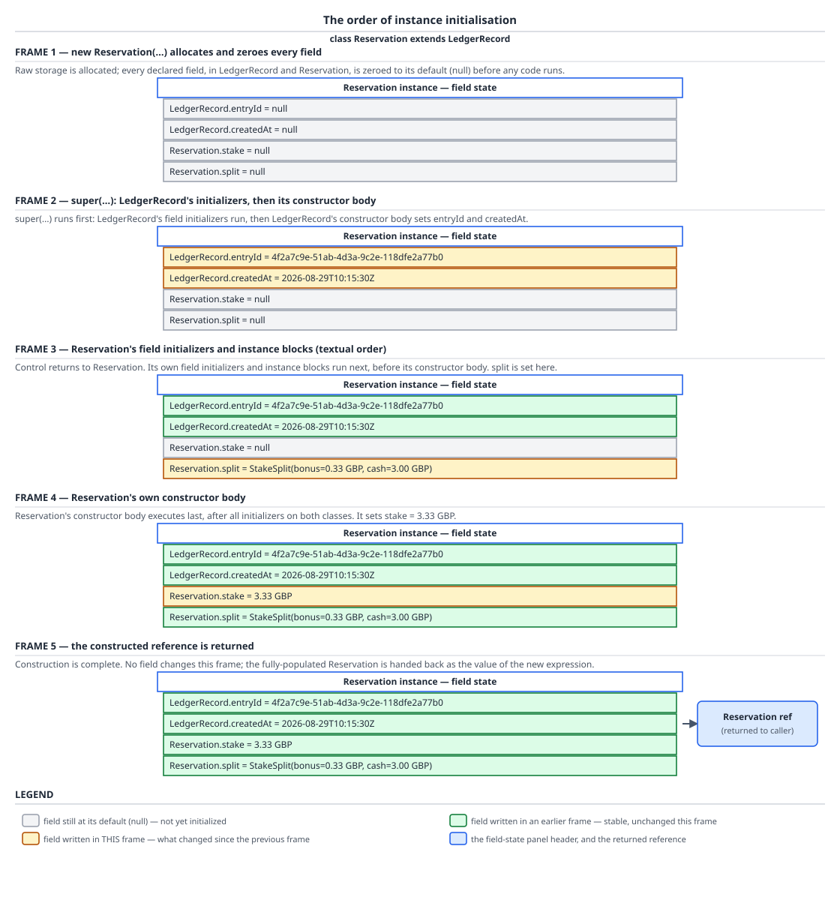

# 03 Java Core — The initialization order of a new — BASICS (§1.5, §1.13, 1.5.11, 1.13.6–1.13.8, 1.13.16)

**Target version: Java 21 LTS.** | **Part 1 of 5** | [Index](../00-index.md)
Previous: [Names, scope and `var`](01a-names-scope-and-var.md) · Next: [Class anatomy and constructors](01c-class-anatomy-and-constructors.md)

A `new` expression is not one event, it is a five-step procedure specified word for word in JLS 21 §12.5, and almost every surprising thing a constructor does — a field that reads `null` when the line that assigns it is visibly three lines above the line that reads it, an override that fires before the subclass exists in any meaningful sense, a `static final` that is already populated inside a `static` block declared above it — falls straight out of those five steps once you can recite them. This file refuses to hand-wave three things in particular: the *order* (quoted from the specification, then run as a program that prints it), the reason a superclass constructor can reach a subclass override at all (dynamic dispatch, resolved on the allocated object's runtime class, which is the subclass from the instant of allocation), and the cost of construction (arithmetic on QuizStakes' real 2.8M-reservations-a-day rate, with the escape-analysis escape hatch named as the JIT heuristic it is rather than the guarantee blogs make it).

## 1. The exact initialization order of a `new` (1.13.6, 1.5.11)

Picture the object as a form that gets filled in top to bottom by three different pens, in a fixed order, and never once out of order. First the whole form is stamped blank — every field, on every class in the hierarchy, written to its default (`null`, `0`, `false`). Then the topmost class in the hierarchy fills in its own boxes, then the next class down, one level at a time, until your class fills in its boxes last. Within one class's turn, two pens run in sequence: the *initialiser* pen (field initialisers and instance initializer blocks, interleaved strictly in the order they appear in the source text) and then the *constructor body* pen. That is the entire model. Every trap in this file is a consequence of it.

### Why it exists

Java has to guarantee two things that pull against each other. First, a subclass's constructor must be able to assume the superclass's fields are already valid — otherwise `Reservation`'s body could not read `entryId()` from `LedgerRecord`. That forces superclass-before-subclass. Second, the language must never expose a field holding arbitrary leftover heap bytes the way C does, so allocation zeroes everything before any user code runs. The five-step procedure is the minimum ordering that satisfies both, and pinning it in the specification rather than leaving it to the implementation is what makes the trap in section 2 *portable* — it happens identically on every conforming JVM, which is why it is worth memorising rather than avoiding.

### The mechanism

`[SOURCE]` JLS 21 §12.5, on allocation, before any of the five steps:

> "Whenever a new class instance is created, memory space is allocated for it with room for all the instance variables declared in the class and all the instance variables declared in each superclass of the class, including all the instance variables that may be hidden (§8.3). […] Otherwise, all the instance variables in the new object, including those declared in superclasses, are initialized to their default values (§4.12.5)."

Reading it clause by clause: *"all the instance variables declared in the class and all the instance variables declared in each superclass"* — the object is one flat block of storage covering the whole hierarchy at once, not a chain of separately-allocated pieces stitched together as each constructor runs; there is no moment at which the subclass's fields do not yet have storage. *"including all the instance variables that may be hidden"* — a subclass field that hides a same-named superclass field gets its own slot, so both exist simultaneously; field hiding is `01a-names-scope-and-var.md`'s territory, and the reason it matters here is that a hidden field is separately zeroed and separately initialised. *"initialized to their default values"* — this is a real write, performed before a single line of your code runs, and it is the reason the trap in section 2 produces `null` rather than garbage.

`[SOURCE]` Then the procedure itself, JLS 21 §12.5, condensed to the three steps that carry the ordering (steps 1 and 2 are argument binding and the `this` delegation case):

> "3. […] If this constructor is for a class other than `Object`, then this constructor will begin with an explicit or implicit invocation of a superclass constructor (using `super`). Evaluate the arguments and process that superclass constructor invocation recursively using these same five steps. […] Otherwise, continue with step 4.
> 4. Execute the instance initializers and instance variable initializers for this class, assigning the values of instance variable initializers to the corresponding instance variables, in the left-to-right order in which they appear textually in the source code for the class. If execution of any of these initializers results in an exception, then no further initializers are processed and this procedure completes abruptly with that same exception. Otherwise, continue with step 5.
> 5. Execute the rest of the body of this constructor."

Four things to extract, because each one is a separate interview answer:

| Clause in §12.5 | What it settles |
|---|---|
| "process that superclass constructor invocation recursively using these same five steps" | The recursion is what makes bodies run top-down: every level's step 3 completes before that level reaches step 4 |
| "the instance initializers **and** instance variable initializers" (step 4) | Instance initializer blocks and field initialisers are one merged sequence, not two phases — this is leaf 1.5.11 |
| "in the left-to-right order in which they appear textually in the source code" | Textual order, not declaration-type order, not alphabetical, not dependency order |
| step 4 precedes step 5 | Field initialisers always run **before** the constructor body of the same class, so a constructor body assignment overwrites an initialiser's value |

`[PROVE]` Now derive the full sequence rather than asserting it. Take `new Reservation(entryId)` where `Reservation extends LedgerRecord extends Object`. Allocation zeroes all four fields. `Reservation`'s constructor enters at step 3, which recurses into `LedgerRecord`'s constructor — so nothing in `Reservation`'s step 4 or 5 has run yet. `LedgerRecord`'s constructor enters *its* step 3, which recurses into `Object`'s constructor; `Object` has no superclass, the recursion bottoms out, `Object`'s steps 4 and 5 run (both empty). Control returns to `LedgerRecord`'s step 4 (its initialisers) then step 5 (its body). Only now does control return to `Reservation`'s step 4, then step 5. Unwinding: zeroing, `Object`, `LedgerRecord` initialisers, `LedgerRecord` body, `Reservation` initialisers, `Reservation` body. The general rule follows by induction on hierarchy depth: **constructor invocations go bottom-up, constructor bodies run top-down**, and within each level initialisers precede the body.



**D-014** — Five frames over `new Reservation(entryId)`, with the same four fields shown in every frame so you can diff frame to frame; the field written in each frame is highlighted amber. Look at frame 2 specifically: `LedgerRecord.entryId` and `LedgerRecord.createdAt` are already populated while **both** `Reservation` fields are still `null` — that gap is the whole of section 2. Frame 3 fills `Reservation.split` from a field initialiser, frame 4 fills `Reservation.stake` from the constructor body, and frame 5 shows the reference handed back with nothing changed, because construction finished at the end of frame 4. `LedgerRecord`'s own step-4 initialiser slot is empty in this program, which is why frame 2 attributes both superclass writes to the constructor body.

The program the diagram traces, printing its own order so the sequence is measurable rather than asserted:

```java
record Money(BigDecimal amount, Currency currency) implements Comparable<Money> {
    static Money gbp(String value) {
        return new Money(new BigDecimal(value), Currency.getInstance("GBP"));
    }

    Money minus(Money other) {
        return new Money(amount.subtract(other.amount), currency);
    }

    @Override
    public int compareTo(Money other) {
        if (!currency.equals(other.currency)) {
            throw new IllegalArgumentException("currency mismatch: " + currency + " and " + other.currency);
        }
        return amount.compareTo(other.amount);
    }

    @Override
    public String toString() {
        return amount.toPlainString() + " " + currency.getCurrencyCode();
    }
}

record StakeSplit(Money bonusPortion, Money cashPortion) { }

class LedgerRecord {
    private final UUID entryId;
    private final Instant createdAt;

    LedgerRecord(UUID entryId) {
        System.out.println("2. LedgerRecord constructor body");
        this.entryId = entryId;
        this.createdAt = Instant.parse("2026-08-29T10:15:30Z");
    }

    UUID entryId() {
        return entryId;
    }

    Instant createdAt() {
        return createdAt;
    }
}

final class Reservation extends LedgerRecord {
    private static final Money CANONICAL_STAKE = Money.gbp("3.33");
    private static final Money BONUS_AVAILABLE = Money.gbp("5.00");

    private final StakeSplit split = splitOf(CANONICAL_STAKE, BONUS_AVAILABLE);
    private Money stake;

    {
        System.out.println("4. Reservation instance initializer block, split already = " + split);
    }

    Reservation(UUID entryId) {
        super(entryId);
        System.out.println("5. Reservation constructor body");
        this.stake = CANONICAL_STAKE;
    }

    private static StakeSplit splitOf(Money stake, Money bonusAvailable) {
        System.out.println("3. Reservation field initializer for split");
        Money tenPercentRoundedDown = new Money(
                stake.amount().multiply(new BigDecimal("0.10")).setScale(2, RoundingMode.DOWN),
                stake.currency());
        Money bonusPortion = tenPercentRoundedDown.compareTo(bonusAvailable) <= 0
                ? tenPercentRoundedDown
                : bonusAvailable;
        return new StakeSplit(bonusPortion, stake.minus(bonusPortion));
    }

    Money stake() {
        return stake;
    }

    StakeSplit split() {
        return split;
    }
}

final class InitOrderWalk {
    public static void main(String[] args) {
        System.out.println("1. allocation and default-zeroing (no user code runs here)");
        Reservation reservation = new Reservation(UUID.fromString("4f2a7c9e-51ab-4d3a-9c2e-118dfe2a77b0"));
        System.out.println("stake = " + reservation.stake());
        System.out.println("split = " + reservation.split());
    }
}
```

Its output, which is the proof:

```
1. allocation and default-zeroing (no user code runs here)
2. LedgerRecord constructor body
3. Reservation field initializer for split
4. Reservation instance initializer block, split already = StakeSplit[bonusPortion=0.33 GBP, cashPortion=3.00 GBP]
5. Reservation constructor body
stake = 3.33 GBP
split = StakeSplit[bonusPortion=0.33 GBP, cashPortion=3.00 GBP]
```

Line 3 before line 4 is not because field initialisers outrank instance blocks — it is purely because `split`'s declaration is textually above the block. Move the block above the `split` declaration and the two lines swap, and the block would then print `split already = null`, because step 4 is one merged left-to-right walk and the block would be reached before `split`'s initialiser ran. That swap is leaf 1.5.11 in one experiment. (`01a-names-scope-and-var.md` owns the *compile-time* half of this: the illegal-forward-reference rule that rejects some, but not all, reads of a not-yet-initialised field. Reading a field from an instance block placed above its declaration is exactly one of the cases the rule does **not** catch, because the read goes through a method call rather than a simple name.)

**Insight:** the split is `0.33 + 3.00`, not `0.34 + 3.00`, because `setScale(2, RoundingMode.DOWN)` truncates `0.333`. Rounding the bonus portion up would make the two portions sum to `3.34` against a `3.33` stake, and `StakeSplit`'s invariant — the two portions sum exactly to the stake — would be violated by creating a penny of money out of nothing. The compact constructor that enforces that invariant is in `01c-class-anatomy-and-constructors.md`.

**Pitfall:** believing a field initialiser can see a constructor argument. It cannot — step 4 runs inside the constructor's frame but the initialiser expression is not in the constructor's scope, and `javac` rejects any reference to a constructor parameter from a field initialiser. That is why `split` above is computed from a `static final` canonical stake rather than from the `entryId` constructor argument, and why real code that needs a parameter-derived field must assign it in the constructor body (step 5) instead, giving up the `final`-with-initialiser form. **On Java 25 a flexible constructor body's prologue fixes exactly this** — the version story is `01c-class-anatomy-and-constructors.md`, leaf 1.13.5.

> **Definition.** Creating an instance runs, in order: allocation with every field on every class zeroed to its default; then, per class from the top of the hierarchy down, that class's instance initializer blocks and instance field initialisers interleaved in textual order, followed by that class's constructor body.

## 2. Calling an overridable method from a constructor (1.13.7)

Picture the object's *type* and the object's *contents* becoming true at different times. From the instant allocation completes, the object's runtime class is already `BankWithdrawalTransaction` — the header says so, and every virtual call on it will dispatch to `BankWithdrawalTransaction`'s methods. But its `BankWithdrawalTransaction` fields are still zeroed and will not be filled until step 4 of *its* level, which is several frames in the future. A superclass constructor that calls an overridable method therefore invokes fully subclass-shaped behaviour on a not-yet-subclass-shaped object.

### Why it exists

It is not a bug, it is a deliberate specification choice, and the specification says so in as many words.

`[SOURCE]` JLS 21 §12.5, immediately after the five steps:

> "Unlike C++, the Java programming language does not specify altered rules for method dispatch during the creation of a new class instance. If methods are invoked that are overridden in subclasses in the object being initialized, then these overriding methods are used, even before the new object is completely initialized."

*"Unlike C++"* is the load-bearing phrase. C++ changes the object's dynamic type as each base-class constructor runs, so a virtual call from a base constructor dispatches to the *base* implementation. Java refuses to do that: one object, one runtime class, fixed at allocation, for its entire life. That uniformity buys enormous simplification everywhere else — a `getClass()` never lies, an `instanceof` never changes answer mid-construction, a vtable never has to be swapped — and it is paid for entirely here, in this one trap. *"even before the new object is completely initialized"* is the specification conceding the consequence explicitly.

### The mechanism

One paragraph on dispatch, because it is the whole reason the trap is reachable, then the pointer. `javac` compiles `validate()` inside `WithdrawalTransaction`'s constructor to an `invokevirtual` whose constant-pool method reference names `WithdrawalTransaction.validate`. `invokevirtual` does not call that method; it uses it only to select a slot, and then resolves the actual target against the **runtime class of the receiver** on the operand stack. The receiver is the object under construction, whose runtime class was fixed as `BankWithdrawalTransaction` at allocation, so the slot resolves to `BankWithdrawalTransaction.validate`. There is no "still under construction" bit anywhere in the dispatch path to consult. Full vtable and `invokevirtual` mechanics are `../inheritance-and-dispatch/01-basics.md` and `../inheritance-and-dispatch/03-internals-dispatch.md`.

`[PROVE]` The argument that the subclass field must be `null` at that point, worked from section 1's sequence rather than stated: the override reads `dailyCap`, a `BankWithdrawalTransaction` instance field with an initialiser. That initialiser runs in `BankWithdrawalTransaction`'s **step 4**. The call to `validate()` happens in `WithdrawalTransaction`'s **step 5**. `WithdrawalTransaction`'s step 5 is reached from inside `BankWithdrawalTransaction`'s step 3, and step 3 by definition completes before step 4 begins. Therefore `BankWithdrawalTransaction`'s step 4 has provably not run when the override executes, so `dailyCap` still holds the value written by allocation's default-zeroing — `null`, since it is a reference type. The `NullPointerException` is not a race, not implementation-dependent, and not intermittent: it is guaranteed by the ordering, on every JVM, every run.


**D-038** — Six frames over `new BankWithdrawalTransaction(Money.gbp("260.00"), run)`. Frame 4 is drawn entirely in the failure palette and is the frame to study: the override is running, `WithdrawalTransaction.amount` is already `260.00 GBP` and `status` is already `PENDING`, and yet `dailyCap` and `run` are both still `null` — with the explicit callout `dailyCap.compareTo(amount)` on a `null` `dailyCap` producing the `NullPointerException`. Frames 5 and 6 show what *would* have happened next: `dailyCap` filled by the subclass field initialiser, then `run` filled by the subclass constructor body. Frame 5's label carries the `LimitSet` the cap is drawn from; `dailyCap` itself is the `500.00 GBP` `dailyDeposit` component of it.

The program the diagram traces, exactly:

```java
enum WithdrawalStatus { PENDING, SIGNED_OFF, SETTLED }
record LimitSet(Money dailyDeposit, Money maxStake, Money monthlyLoss) { }
record PaymentRun(String reference) { }

final class RestrictedActionException extends RuntimeException {
    RestrictedActionException(String message) {
        super(message);
    }
}

class WithdrawalTransaction {
    protected final Money amount;
    protected WithdrawalStatus status = WithdrawalStatus.PENDING;

    WithdrawalTransaction(Money amount) {
        this.amount = amount;
        validate();
    }

    void validate() {
        if (amount.compareTo(Money.gbp("0.00")) <= 0) {
            throw new IllegalArgumentException("withdrawal amount must be positive");
        }
    }
}

final class BankWithdrawalTransaction extends WithdrawalTransaction {
    // The bank rail is closed loop: funds return by the rail they arrived on,
    // so its daily withdrawal cap mirrors the daily deposit limit.
    private static final LimitSet BANK_LIMITS = new LimitSet(
            Money.gbp("500.00"), Money.gbp("50.00"), Money.gbp("1000.00"));

    private final Money dailyCap = BANK_LIMITS.dailyDeposit();
    private PaymentRun run;

    BankWithdrawalTransaction(Money amount, PaymentRun run) {
        super(amount);
        this.run = run;
    }

    @Override
    void validate() {
        super.validate();
        if (dailyCap.compareTo(amount) < 0) {
            throw new RestrictedActionException("withdrawal exceeds the bank rail daily cap");
        }
    }

    PaymentRun run() {
        return run;
    }
}

final class BankWithdrawalTrap {
    public static void main(String[] args) {
        new BankWithdrawalTransaction(Money.gbp("260.00"), new PaymentRun("PR-20260829-0007"));
    }
}
```

Running it throws, and the stack trace is the point:

```
Exception in thread "main" java.lang.NullPointerException: Cannot invoke
        "Money.compareTo(Money)" because "this.dailyCap" is null
    at BankWithdrawalTransaction.validate(BankWithdrawalTrap.java:47)
    at WithdrawalTransaction.<init>(BankWithdrawalTrap.java:22)
    at BankWithdrawalTransaction.<init>(BankWithdrawalTrap.java:38)
    at BankWithdrawalTrap.main(BankWithdrawalTrap.java:60)
```

Read the frames bottom-up and the trap is visible in the trace itself: `BankWithdrawalTransaction.<init>` called `WithdrawalTransaction.<init>`, which called `BankWithdrawalTransaction.validate` — the subclass appears **twice**, once at the bottom of the construction chain and once at the top, with the superclass sandwiched between. Any stack trace where `X.<init>` sits between two `X` frames is this bug.

**Pitfall:** believing "my subclass field has an initialiser, so it is set before anything can read it." The wrong belief is that a field initialiser is somehow attached to the field's declaration and therefore runs early; the symptom is a `NullPointerException` (or a silent `0`/`false`, which is far worse) inside an override, on a field whose declaration visibly assigns a non-null value three lines above. The mechanical fix has three forms, in descending preference: (1) do not call an overridable method from a constructor at all — declare `validate` `final` or `private` on `WithdrawalTransaction`, which makes the compiler enforce it and binds the call statically, because no override can exist for selection to re-choose; (2) move the subclass check out of an override and into the subclass constructor body (step 5), where its own fields are guaranteed populated; (3) pass the value the superclass needs *as a constructor argument* rather than fetching it through a hook. The silent variant deserves naming separately: if `dailyCap` were a `long` rather than a `Money`, the override would read `0`, compare `0 < 260`, and reject a perfectly valid withdrawal with a `RestrictedActionException` — no exception at the point of the bug, no stack trace, just a rail that mysteriously rejects everything.

And there is a fourth fix, which is the language's own. Java 25 finalised **flexible constructor bodies** (JEP 513, previewed by JEP 447/482/492 in 22/23/24) precisely so a subclass can initialize its own fields *before* invoking `super`, closing this hole at the language level rather than by discipline; JEP 513's Summary names "methods called from a superclass constructor" as the thing it exists to make safe. The full JEP chain, the prologue's rules and the compiling Java 25 form of the fix are `01c-class-anatomy-and-constructors.md`, leaf 1.13.5 — the six-frame walk above is the trap it repairs, and is not repeated there.

`[X-REF 05]` A constructor that hands `this` to anything — a listener registration, an executor submission, a static registry — is a *safe publication* bug on top of being an ordering bug: another thread can obtain the reference and observe partially-initialised fields, including `final` ones, because the `final`-field freeze has not happened yet. Guide **05 Concurrency** owns that; the freeze itself is `04-internals-final-and-constant-folding.md`.

> **Definition.** A constructor calling an overridable method invokes the subclass override, because dispatch resolves on the object's runtime class, which is fixed at allocation — and it runs before the subclass's initialisers and constructor body, so every subclass field it reads still holds its default value.

## 3. Static initialization: textual order, once (1.13.8)

Picture the class itself as an object that gets constructed exactly once, ever, by a synthetic method named `<clinit>` that the compiler assembles by concatenating every static field initialiser and every `static` block in the order they appear in the source. Same merged-textual-order rule as section 1's step 4, one level up, and with a once-forever guarantee instead of a once-per-instance one.

### Why it exists

Static state has no constructor to live in and no `new` to trigger it, so the language needs a defined moment at which `static final Money DAILY_CAP = Money.gbp("500.00")` actually evaluates, and a guarantee that it evaluates once even if forty threads race to touch the class simultaneously. `<clinit>` plus the JVM's per-class initialization state machine provides both.

### The mechanism

`[SOURCE]` JLS 21 §12.4.1, verbatim, on the order and the hole in the compile-time rule:

> "The static initializers and class variable initializers are executed in textual order, and may not refer to class variables declared in the class whose declarations appear textually after the use, even though these class variables are in scope (§8.3.3). This restriction is designed to detect, at compile time, most circular or otherwise malformed initializations."

The word to notice is **"most"**. The specification is conceding that its own compile-time check is incomplete, and it says so explicitly in the next paragraph:

> "The fact that initialization code is unrestricted allows examples to be constructed where the value of a class variable can be observed when it still has its initial default value, before its initializing expression is evaluated, but such examples are rare in practice. (Such examples can be also constructed for instance variable initialization (§12.5).)"

That parenthetical is the specification pointing at leaf 1.13.7 from the other direction: the same hole exists for instance initialisation, and section 2 is the canonical example of it. `01a-names-scope-and-var.md` owns the compile-time forward-reference rule and exactly which reads it rejects; this section owns the ordering and the once-ness.

`[SOURCE]` And the step everyone omits — some `static final` fields are set *before* `<clinit>` runs at all. JVMS 21 §5.5:

> "Otherwise, record the fact that initialization of the `Class` object for C is in progress by the current thread, and release LC. Then, initialize each `final` static field of C with the constant value in its `ConstantValue` attribute (§4.7.2), in the order the fields appear in the `ClassFile` structure."

Read the sequencing: the thread claims the initialization lock, releases it, sets the `ConstantValue` fields, and only then executes `<clinit>`. So a `static final int MAX_FIELDS = 64` — a *constant variable* by JLS 21 §4.12.4, "a `final` variable of primitive type or type `String` that is initialized with a constant expression (§15.29)" — is written into the field by the JVM directly from the class file's `ConstantValue` attribute, and does not appear in `<clinit>`'s bytecode at all. A `static final Money DAILY_CAP = Money.gbp("500.00")` is *not* a constant variable (`Money` is neither primitive nor `String`), carries no `ConstantValue` attribute, and is therefore assigned by `<clinit>` in textual order like any other static initialiser. Two fields that look identically `static final` are initialised by two different mechanisms at two different times. `../language-substrate/03a-internals-class-file-format.md` owns the `ConstantValue` attribute's encoding; `04-internals-final-and-constant-folding.md` owns the constant-folding consequence (a constant variable's value is inlined into every reader's bytecode, so changing it requires recompiling the readers).

`[SOURCE]` "At class initialization" needs one paragraph of *when*, then a pointer. JLS 21 §12.4.1: "A class or interface T will be initialized immediately before the first occurrence of any one of the following: T is a class and an instance of T is created. / A static method declared by T is invoked. / A static field declared by T is assigned. / A static field declared by T is used and the field is not a constant variable (§4.12.4)." And: "When a class is initialized, its superclasses are initialized (if they have not been previously initialized), as well as any superinterfaces (§8.1.5) that declare any default methods (§9.4.3) (if they have not been previously initialized)." Note the fourth trigger's exclusion — reading a constant variable does **not** trigger initialization, precisely because its value was inlined into the reader. The full trigger treatment, `Class.forName` versus `loadClass`, `ExceptionInInitializerError`, initialization cycles and the holder idiom are all `01d-class-initialization-triggers.md`; the state machine and its deadlock are `03-internals-class-loading-and-init.md`.

Beat 4 does not apply here: the diagram for class initialization triggers is D-039, and it belongs to `01d`.

```java
final class BonusPolicy {
    // Constant variables: primitive, final, constant expression.
    // Set from the ConstantValue attribute BEFORE <clinit> runs, and inlined
    // into every reader's bytecode.
    static final int GRANT_PERCENT = 10;
    static final int COUPON_VALIDITY_DAYS = 14;
    static final int EXPIRY_DAYS = 30;

    // NOT a constant variable: Money is a reference type. Assigned by <clinit>,
    // in textual order, at class initialization.
    static final Money GRANT_CAP = Money.gbp("100.00");

    static final List<String> TERMINAL_STATES;

    static {
        System.out.println("static block 1, GRANT_CAP already = " + GRANT_CAP);
        TERMINAL_STATES = List.of("CONSUMED", "EXPIRED", "CLAWED_BACK");
    }

    // Textually AFTER the block above, so assigned after it runs.
    static final int TERMINAL_STATE_COUNT = TERMINAL_STATES.size();

    static {
        System.out.println("static block 2, TERMINAL_STATE_COUNT = " + TERMINAL_STATE_COUNT);
    }

    private BonusPolicy() {
        throw new AssertionError("no instances");
    }

    static Money grantFor(Money firstDeposit) {
        Money tenPercent = new Money(
                firstDeposit.amount()
                        .multiply(BigDecimal.valueOf(GRANT_PERCENT))
                        .divide(BigDecimal.valueOf(100))
                        .setScale(2, RoundingMode.DOWN),
                firstDeposit.currency());
        return tenPercent.compareTo(GRANT_CAP) <= 0 ? tenPercent : GRANT_CAP;
    }
}
```

Output, on first touch of `BonusPolicy` and never again:

```
static block 1, GRANT_CAP already = 100.00 GBP
static block 2, TERMINAL_STATE_COUNT = 3
```

`GRANT_CAP` is already populated in block 1 because its declaration is textually above the block. `TERMINAL_STATE_COUNT` reads correctly in block 2 because its declaration is above block 2 — move block 2 above `TERMINAL_STATE_COUNT`'s declaration and it would print `0`, silently, since a static `int` field's default is `0`.

**Pitfall:** believing `<clinit>` can run twice, or that you need to guard it. It cannot: JVMS §5.5's state machine holds a per-class lock and records "initialization in progress by the current thread," so concurrent threads block until the initialising thread finishes, and the initialising thread's own re-entrant touch of the same class proceeds without re-running `<clinit>` (which is exactly how initialization cycles produce partially-initialised statics rather than infinite recursion). Adding a `synchronized` guard or an `initialized` boolean around static setup is redundant at best; the once-ness is a JVM guarantee, and it is what makes the holder idiom a correct lazy singleton with no locking in the source at all.

> **Definition.** A class's static field initialisers and `static` blocks are collected by the compiler, in textual order, into a single synthetic `<clinit>` method that the JVM runs exactly once per class per loader, at class initialization — except for `static final` constant variables, which the JVM writes from their `ConstantValue` attribute before `<clinit>` executes.

## Supporting facts

### Object construction cost, escape analysis and scalar replacement (1.13.16)

The allocation fast path in HotSpot is a pointer bump: each thread owns a thread-local allocation buffer (TLAB), a private slab of Eden, and allocating an object in the common case means incrementing that thread's bump pointer by the object's size and zeroing the space — no lock, no free-list search, no CAS. That is the mechanism behind "allocation is cheap," and it is genuinely cheap. Escape analysis makes it *sometimes literally free*: if the JIT can prove an object never escapes the compiled region — never stored to a field, never returned, never passed to a method that keeps it, never published to another thread — it may apply **scalar replacement**, dismantling the object into its individual field values held in registers or on the stack, so no heap object is created at all and the GC never sees it.

`[NUM]` The arithmetic, on QuizStakes' real rate. Stake reservations run at **2.8M/day, 1,200/sec at peak**. Constructing one `Reservation` as written in section 1 allocates: the `Reservation` itself, one `StakeSplit`, three `Money` records (the stake and the two split portions), and three `BigDecimal`s inside them — eight objects. Per-instance footprints, computed from HotSpot's standard layout rule (12-byte header under compressed object pointers, 4-byte references, padded to an 8-byte boundary): `Reservation` with four reference fields is 12 + 16 = 28, padded to **32 bytes**; `Money` with two references is 12 + 8 = 20, padded to **24**; `StakeSplit` likewise **24**; `BigDecimal` with one reference, three `int`s and a `long` is 12 + 4 + 12 + 8 = 36, padded to **40**. Total per reservation: 32 + 24 + (3 × 24) + (3 × 40) = **248 bytes**. At 1,200/sec that is about **298 KB/sec**, and across 2.8M/day about **694 MB/day** — which for a JVM whose young generation routinely sustains gigabytes per second is genuinely noise. That is the honest version of "allocation is cheap": not a slogan, a rate you can compute and compare.

**Unverified:** those per-instance footprints are derived from the documented layout rule, not measured with JOL on a specific build, and field reordering or a different header configuration would shift them.

And the escape hatch, because every performance claim needs one. Scalar replacement is a **JIT heuristic, not a language or JVM guarantee**: nothing in the JLS or JVMS promises it, and it silently stops applying when the allocating method grows past the inliner's budget, when the call site becomes megamorphic, when the object is stored into a field or a collection (as `Reservation.split` is — that reference escapes into a heap object, so `StakeSplit` cannot be scalar-replaced here), when it is returned, or when it is published across threads. So the two claims to keep separate: **allocation is cheap unconditionally** (TLAB pointer bump, arithmetic above); **allocation is free only conditionally**, on a heuristic you cannot plan a capacity model around. `[X-REF 06]` TLAB sizing, escape-analysis states (no escape, arg escape, global escape), scalar replacement's exact preconditions and the inlining budgets are guide **06 JVM internals**; object footprint arithmetic is `../objects-equality-and-lifecycle/05-internals-object-layout.md`.

## Pitfalls

### "My subclass field has an initialiser, so nothing can see it null"

**Wrong**

```java
class WithdrawalTransaction {
    protected final Money amount;

    WithdrawalTransaction(Money amount) {
        this.amount = amount;
        validate();                       // overridable call from a constructor
    }

    void validate() { }
}

final class BankWithdrawalTransaction extends WithdrawalTransaction {
    private final Money dailyCap = Money.gbp("500.00");   // "always set!"

    BankWithdrawalTransaction(Money amount) {
        super(amount);
    }

    @Override
    void validate() {
        if (dailyCap.compareTo(amount) < 0) {             // NullPointerException
            throw new RestrictedActionException("exceeds the bank rail daily cap");
        }
    }
}
// new BankWithdrawalTransaction(Money.gbp("260.00"))
//   -> NullPointerException: "this.dailyCap" is null
```

The surprise: `dailyCap`'s initialiser runs in `BankWithdrawalTransaction`'s §12.5 step 4, which cannot begin until step 3 — the whole `super` chain, including the `validate()` call — has completed. If `dailyCap` were a `long` instead there would be no exception at all: it would read `0`, `0 < 260` would hold, and every valid withdrawal would be rejected silently.

**Right**

```java
class WithdrawalTransaction {
    protected final Money amount;

    WithdrawalTransaction(Money amount) {
        this.amount = amount;
        validate();
    }

    // final: the compiler now forbids an override, so the call above is bound
    // statically -- there is no override for selection to re-choose. The emitted
    // instruction is still invokevirtual on JDK 21; final changes resolution,
    // not the opcode. No trap.
    final void validate() {
        if (amount.compareTo(Money.gbp("0.00")) <= 0) {
            throw new IllegalArgumentException("withdrawal amount must be positive");
        }
    }
}

final class BankWithdrawalTransaction extends WithdrawalTransaction {
    private final Money dailyCap = Money.gbp("500.00");

    BankWithdrawalTransaction(Money amount) {
        super(amount);
        // The subclass check lives in the subclass's own step 5, where its
        // own fields are guaranteed populated.
        if (dailyCap.compareTo(amount) < 0) {
            throw new RestrictedActionException("exceeds the bank rail daily cap");
        }
    }
}
```

**Why people believe it:** the initialiser is written on the same line as the declaration, which reads like a property of the field rather than a statement scheduled at a particular point in a five-step procedure — and in every other context in Java, code textually above other code runs first.

### "Field initialisers run before `super`, because they are part of the field"

**Wrong**

```java
class LedgerRecord {
    LedgerRecord() {
        System.out.println("superclass constructor body");
    }
}

final class Reservation extends LedgerRecord {
    private final StakeSplit split = probe();

    Reservation() {
        super();
    }

    private static StakeSplit probe() {
        System.out.println("subclass field initializer");
        return new StakeSplit(Money.gbp("0.33"), Money.gbp("3.00"));
    }
}
// Expected: "subclass field initializer" then "superclass constructor body".
// Actual:
//   superclass constructor body
//   subclass field initializer
```

The surprise: the printed order is the reverse of the source order. `super()` is step 3 and the field initialiser is step 4, so the entire superclass — its initialisers *and* its body — completes before a single subclass initialiser evaluates.

**Right**

```java
// On Java 21, if a value must exist before super() runs, it cannot be an
// instance field initialiser. Assign it in the constructor body instead.
final class Reservation extends LedgerRecord {
    private final StakeSplit split;

    Reservation() {
        super();
        this.split = probe();   // step 5: the only place a parameter-aware
    }                           // or ordering-sensitive value can be assigned

    private static StakeSplit probe() {
        return new StakeSplit(Money.gbp("0.33"), Money.gbp("3.00"));
    }
}
```

**Why people believe it:** the field declaration is textually above the constructor, and `super()` is the first *statement* of the constructor, so it looks like the initialiser must already have run. The ordering is not textual across those two constructs — it is the five-step procedure, and the procedure puts the entire superclass chain between them.

### "Every `static final` field is assigned by `<clinit>`, in textual order"

**Wrong**

```java
final class BonusPolicy {
    static {
        // A method call, so JLS §8.3.3's illegal-forward-reference rule
        // (which only restricts use by simple name) does not apply.
        System.out.println(describe());
    }

    static final int GRANT_PERCENT = 10;                  // constant variable
    static final Money GRANT_CAP = Money.gbp("100.00");   // not a constant variable

    static String describe() {
        return "GRANT_PERCENT=" + GRANT_PERCENT + " GRANT_CAP=" + GRANT_CAP;
    }
}
// Output:
//   GRANT_PERCENT=10 GRANT_CAP=null
```

The surprise: two fields that look identically `static final`, both declared textually *below* the block that reads them, give two different answers. `GRANT_PERCENT` reads `10` because it is a constant variable (JLS §4.12.4: `final`, primitive or `String`, constant expression), so per JVMS §5.5 the JVM writes it from its `ConstantValue` attribute *before* `<clinit>` starts. `GRANT_CAP` reads `null` because `Money` is a reference type, so it carries no `ConstantValue` and is assigned by `<clinit>` in textual order — which has not reached it yet.

**Right**

```java
final class BonusPolicy {
    static final int GRANT_PERCENT = 10;
    static final Money GRANT_CAP = Money.gbp("100.00");

    // Declare state above every block that reads it, so textual order and
    // dependency order agree and no field can be observed at its default.
    static {
        System.out.println("GRANT_PERCENT=" + GRANT_PERCENT + " GRANT_CAP=" + GRANT_CAP);
    }
}
// Output:
//   GRANT_PERCENT=10 GRANT_CAP=100.00 GBP
```

**Why people believe it:** `static final` looks like one uniform category, and for primitives and strings the `ConstantValue` mechanism makes the forward read work — which trains the wrong intuition, because it works for exactly the cases where you would never notice and fails for the reference-typed cases where it matters.

## Cheat sheet

| Item | Value |
|---|---|
| Spec for instance creation order | JLS 21 §12.5, five steps |
| Step 0 (before the five) | Allocate storage for all fields on all classes, including hidden ones; zero every one to its default |
| §12.5 step 1 | Bind constructor arguments to parameter variables |
| §12.5 step 2 | If the body starts with `this`, recurse into that constructor with the same five steps, then jump to step 5 |
| §12.5 step 3 | Otherwise invoke the superclass constructor (explicit or implicit), recursing with the same five steps |
| §12.5 step 4 | Instance initializer blocks **and** instance field initialisers, one merged sequence, textual left-to-right order |
| §12.5 step 5 | The rest of this constructor's body |
| Net rule | Constructor **invocations** bottom-up; constructor **bodies** top-down; per class, initialisers then body |
| Instance block vs field initialiser | No precedence — textual position alone decides (leaf 1.5.11) |
| Field initialiser and constructor args | A field initialiser cannot reference a constructor parameter; use the constructor body |
| Overridable call from a constructor | Dispatches to the subclass override; JLS 21 §12.5: "Unlike C++, the Java programming language does not specify altered rules for method dispatch" |
| Why the override sees defaults | Its own step 4 has provably not run — the call happens inside the superclass's step 5, reached from the subclass's step 3 |
| Symptom signature | Stack trace with `X.<init>` sandwiched between two `X` frames |
| Fixes, in order | Make the hook `final`/`private`; move the check to the subclass's own constructor body; pass the value as an argument; on Java 25, initialize the field in the prologue |
| Silent variant | A primitive field reads `0`/`false` instead of throwing — no exception, wrong behaviour |
| Leaked `this` from a constructor | Also a safe-publication bug: `final`-field freeze has not happened, `[X-REF 05]` |
| Static init order | Static field initialisers and `static` blocks, textual order, collected into one `<clinit>`, run once per class per loader |
| Before `<clinit>` runs | JVMS §5.5: each `final static` field with a `ConstantValue` attribute is set first, in class-file field order |
| Constant variable | JLS §4.12.4: `final`, primitive or `String`, initialized with a constant expression — becomes `ConstantValue`, not `<clinit>` code |
| `static final int GRANT_PERCENT = 10` | Constant variable: `ConstantValue`, inlined into readers, reading it does **not** trigger class initialization |
| `static final Money GRANT_CAP = Money.gbp("100.00")` | Not a constant variable: assigned by `<clinit>` in textual order |
| `<clinit>` once-ness | JVM guarantee via the per-class initialization lock — never guard it yourself |
| Forward-reference rule | JLS §12.4.1 detects "**most**" malformed initializations; §8.3.3 restricts only use by *simple name*, so a method call routes around it |
| The specification's own admission | §12.4.1: the same hole "can be also constructed for instance variable initialization (§12.5)" — that is leaf 1.13.7 |
| Class-init triggers (summary) | Instance created · static method invoked · static field assigned · static field used and not a constant variable |
| Allocation fast path | TLAB pointer bump plus zeroing — no lock, no CAS |
| Reservation construction cost | 8 objects, 248 bytes (32 + 24 + 3×24 + 3×40) under compressed oops |
| At QuizStakes' rate | 2.8M reservations/day, 1,200/sec peak → ~298 KB/sec, ~694 MB/day |
| Scalar replacement | JIT heuristic, **not** a guarantee; lost on escape, on megamorphic call sites, past the inliner's budget |

## Self-test

**Q1.** Recite the exact order of everything that happens for `new Reservation(id)` where `Reservation extends LedgerRecord extends Object`, and name the specification section that fixes it.

<details><summary>Answer</summary>

JLS 21 §12.5. First, outside the five steps: storage is allocated for every instance variable declared in `Reservation` and in every superclass, including any hidden fields, and all of them are written to their default values — `null` for references, `0`/`false` for primitives. Then the constructor procedure runs: step 1 binds the arguments to parameter variables; step 2 does not apply because `Reservation`'s constructor does not begin with a `this` invocation; step 3 invokes `LedgerRecord`'s constructor, recursively with the same five steps, which in turn invokes `Object`'s constructor recursively, which bottoms out; `Object`'s steps 4 and 5 run (both empty); control returns to `LedgerRecord`'s step 4, its instance initializer blocks and field initialisers in textual order, then step 5, its constructor body; only then does control return to `Reservation`'s step 4, its blocks and field initialisers in textual order, then step 5, its constructor body. Unwound: zeroing, `Object`, `LedgerRecord` initialisers, `LedgerRecord` body, `Reservation` initialisers, `Reservation` body. The general form: constructor invocations go bottom-up, constructor bodies run top-down, and within one class initialisers always precede that class's body.

</details>

**Q2.** An instance initializer block and a field initialiser both appear in the same class. Which runs first, and what does the specification actually say?

<details><summary>Answer</summary>

Whichever appears earlier in the source text — they are not two phases. JLS 21 §12.5 step 4 says to "execute the instance initializers **and** instance variable initializers for this class […] in the left-to-right order in which they appear textually in the source code for the class." So a block placed above a field's declaration runs before that field's initialiser, and will therefore observe the field at its default value. Nothing about being a block or being a field initialiser confers priority; only textual position does. The same merged-textual-order rule applies one level up for statics, in §12.4.1.

</details>

**Q3.** Why does a superclass constructor calling `validate()` reach the *subclass's* override, and why is the subclass field it reads guaranteed — not merely likely — to be null?

<details><summary>Answer</summary>

It reaches the override because Java fixes the object's runtime class at allocation and never changes it. `javac` compiles the call to `invokevirtual` with a method reference naming the superclass method, but `invokevirtual` uses that only to select a slot and resolves the actual target against the receiver's runtime class — which is already the subclass. JLS 21 §12.5 states the choice explicitly: "Unlike C++, the Java programming language does not specify altered rules for method dispatch during the creation of a new class instance. If methods are invoked that are overridden in subclasses in the object being initialized, then these overriding methods are used, even before the new object is completely initialized." C++ does the opposite, mutating the dynamic type as each base constructor runs, which is why C++ programmers find Java's behaviour surprising and vice versa.

The null is guaranteed by ordering, not probability. The subclass field's initialiser runs in the subclass's step 4. The `validate()` call happens in the superclass's step 5, which is reached from *inside* the subclass's step 3, and step 3 completes before step 4 begins. So the subclass's step 4 provably has not run when the override executes, and the field still holds the value written by allocation's default-zeroing. This is deterministic on every conforming JVM, every run — not a race.

</details>

**Q4.** You inherit a stack trace in which `WithdrawalTransaction.<init>` sits between two `BankWithdrawalTransaction` frames. What is the bug, and what are the fixes in order of preference?

<details><summary>Answer</summary>

That sandwich is the signature of a constructor calling an overridable method: the subclass constructor called the superclass constructor (bottom two frames), and the superclass constructor dispatched a virtual call back down into the subclass's override (top frame). The override then read one of its own fields, which is still at its default because the subclass's step 4 has not run.

Fixes, best first: (1) do not expose the hook — declare the method `final` or `private` on the superclass, which makes the compiler enforce it and binds the call statically, so there is no override for selection to re-choose and no trap. Note what that does *not* change: on JDK 21 both modifiers still compile to `invokevirtual` — verified with `javap -c -p` on 21.0.7, where a `final`, a `private` and a plain instance hook called from the same constructor all emit `invokevirtual`, and the only `invokespecial` in the method is `Object."<init>"`. `private` emitted `invokespecial` on JDK 8 and changed to `invokevirtual` in 11 under JEP 181's nest-based access control; `final` has always been `invokevirtual`. Static binding here is a *resolution* property, not an instruction change. Full treatment in [`../inheritance-and-dispatch/03-internals-dispatch.md`](../inheritance-and-dispatch/03-internals-dispatch.md); (2) move the subclass's check out of an override and into the subclass's own constructor body, which is step 5 and therefore runs after its own initialisers; (3) pass the value the superclass needs as a constructor argument rather than fetching it through a hook; (4) on Java 25, use a flexible constructor body's prologue to assign the subclass field before invoking `super`, which is the language-level fix JEP 513 shipped for exactly this. The worst version of the bug is the one with no stack trace at all: if the field is a primitive it reads `0` or `false` rather than throwing, and the class silently behaves wrongly.

</details>

**Q5.** Are all `static final` fields initialised by `<clinit>`? Justify from the specification, and give the observable consequence.

<details><summary>Answer</summary>

No. JVMS 21 §5.5 describes the initialization procedure: after recording that initialization is in progress and releasing the class's lock, the JVM will "initialize each `final` static field of C with the constant value in its `ConstantValue` attribute (§4.7.2), in the order the fields appear in the `ClassFile` structure" — and only then does it execute `<clinit>`. So a field carrying a `ConstantValue` attribute is written before `<clinit>` runs at all, and does not appear in `<clinit>`'s bytecode.

Which fields get one? The *constant variables*, defined by JLS 21 §4.12.4 as "a `final` variable of primitive type or type `String` that is initialized with a constant expression (§15.29)." So `static final int GRANT_PERCENT = 10` is set before `<clinit>`; `static final Money GRANT_CAP = Money.gbp("100.00")` is not — `Money` is neither primitive nor `String`, and a constructor call is not a constant expression — so it is assigned by `<clinit>` in textual order. The observable consequence: a `static` block that reads both fields through a helper method (routing around §8.3.3's simple-name forward-reference rule) while both declarations sit textually below it prints `GRANT_PERCENT=10 GRANT_CAP=null`. Two consequences follow beyond that: a constant variable's value is inlined into every reader's bytecode, so changing it requires recompiling the readers; and per §12.4.1's trigger list, *using* a static field triggers class initialization only "if the field is not a constant variable," precisely because the read never touches the class at runtime.

</details>

**Q6.** Do you need to guard static setup against running twice, and what does that answer let you build?

<details><summary>Answer</summary>

No. JVMS §5.5's initialization state machine holds a per-class lock and records that initialization is in progress by a specific thread: any other thread touching the class blocks until the initialising thread finishes, and the initialising thread's own re-entrant touch of the same class proceeds *without* re-running `<clinit>` — which is why initialization cycles yield partially-initialised statics rather than infinite recursion. So `<clinit>` runs exactly once per class per class loader, and adding a `synchronized` block or an `initialized` boolean around static setup buys nothing and costs a check on every future call.

What that guarantee lets you build is the holder idiom: put the expensive singleton in a private static nested class whose only static field initialises it, and reference that class only from the accessor. Class initialization is triggered lazily on first access to the holder, the JVM's own lock makes it thread-safe and once-only, and the source contains no locking at all. The idiom, its trigger semantics and its failure modes are `01d-class-initialization-triggers.md`.

</details>

**Q7.** "Allocation is cheap." When is that literally true, when is it merely nearly true, and how would you size the claim for QuizStakes' stake-reservation path?

<details><summary>Answer</summary>

Nearly true always, literally true only sometimes. The nearly-true part is the mechanism: HotSpot's allocation fast path is a pointer bump in a thread-local allocation buffer — each thread owns a private slab of Eden, so allocating means incrementing that thread's bump pointer by the object's size and zeroing the space, with no lock, no CAS and no free-list search. The literally-true part is escape analysis plus scalar replacement: if the JIT proves an object never escapes the compiled region, it may dismantle it into individual field values in registers or on the stack, so no heap object exists and the GC never sees it.

The critical qualification is that scalar replacement is a JIT heuristic, not a language or JVM guarantee. It stops applying when the object escapes (stored to a field, returned, put in a collection, published to another thread), when the allocating method grows past the inliner's budget, or when the call site becomes megamorphic — and it does so silently, so you cannot base a capacity model on it.

Sizing it: stake reservations run at 2.8M/day, 1,200/sec at peak. One `Reservation` as written costs eight objects — itself, one `StakeSplit`, three `Money` records and three `BigDecimal`s — and 248 bytes under compressed object pointers with 12-byte headers and 8-byte alignment (32 + 24 + 3×24 + 3×40). That is about 298 KB/sec at peak and about 694 MB/day, which for a JVM sustaining gigabytes per second through the young generation is genuinely noise. Note also that `StakeSplit` here is stored into `Reservation.split`, so it escapes and cannot be scalar-replaced regardless of how well the method inlines — which is why the honest framing is "cheap unconditionally, free only conditionally."

</details>

## Open questions

- The per-instance footprints in 1.13.16 (32 bytes for `Reservation`, 24 for `Money` and `StakeSplit`, 40 for `BigDecimal`) are derived from HotSpot's documented layout rule — 12-byte header under compressed object pointers, 4-byte references, padding to an 8-byte boundary — not measured with JOL on a specific JDK 21 build. Field reordering, a non-compressed-oops configuration, or a different `BigDecimal` implementation would change them. Settled by running JOL's `ClassLayout` against the actual classes on the target build.
- Which allocations HotSpot's escape analysis actually eliminates for a given method on a given build is a JIT heuristic with no specified behaviour, and this file makes no claim about it beyond naming the conditions under which it is known to be lost. Settled per-case only by `-XX:+PrintEscapeAnalysis` / `-XX:+PrintEliminateAllocations` on a debug build, or by an allocation-profiler measurement of the specific path.

---

**Leaves covered:** 1.5.11, 1.13.6, 1.13.7, 1.13.8, 1.13.16 (5 leaves)
**Leaves deferred:** none
**Diagrams included:** D-014, D-038
**Target version:** Java 21 LTS
**Lines:** 652
