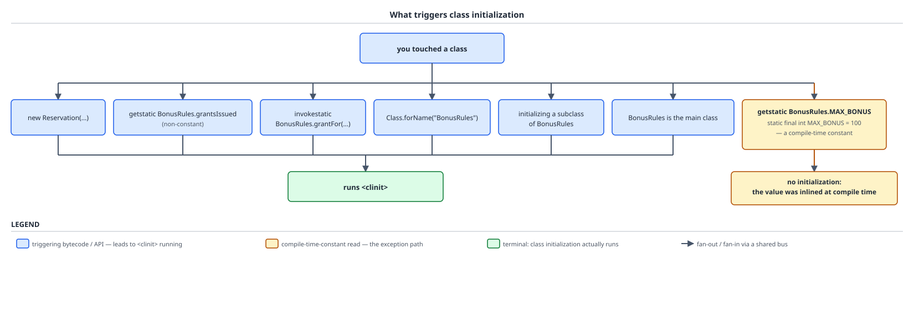

# 03 Java Core — Class initialization triggers and failure — BASICS (§1.13, 1.13.9–1.13.15)

**Target version: Java 21 LTS.** | **Part 1 of 5** | [Index](../00-index.md)
Previous: [Class anatomy and constructors](01c-class-anatomy-and-constructors.md) · Next: [Modifiers — `static` and `final`](02-modifiers.md)

A class is not initialized when it is loaded, and it is not initialized when you mention it in source. It is initialized at the last possible moment before a specific, enumerated set of things happens to it — six bytecode-and-API events in JVMS 21 §5.5, four source-level events in JLS 21 §12.4.1 — and the spec closes the list with the sentence "A class or interface will not be initialized under any other circumstance." This file is the language-visible half of that: which of your lines make `<clinit>` run, which look like they should and provably do not, what the failure looks like from a stack trace when a static initialiser throws, why the same failure is diagnosable exactly once and never again, and why the holder-class idiom is the only lazy-singleton form you need. Every measurement below was run on **Oracle JDK 21.0.7 (arm64, macOS)** unless another build is named.

## 1. What triggers class initialization, and what does not (1.13.9, 1.13.10)

Picture the JVM as deliberately lazy and slightly grudging. It will load `BonusRules` from the classpath, verify its bytecode, lay out its static fields and set every one of them to its default zero value — and then stop, refusing to run a single line of your `static { }` block, because nothing has yet *needed* the block's effects. `<clinit>` is a debt the JVM pays only when a creditor turns up, and the specification names every creditor by name. Everything else you can write about `BonusRules` — declaring a variable of that type, checking `instanceof`, taking `BonusRules.class`, catching a `BonusIneligibleException` — is not a creditor, and the debt goes unpaid.

### Why it exists

Two problems at once. First, startup: a program that eagerly initialized every class it referenced would run every static initialiser in its transitive reference graph before `main` did anything, and for a Spring Boot service with a few thousand classes on the path that is seconds of work for code paths the request will never touch. Second, and less obviously, **determinism**: if initialization were eager, its *order* would be an artifact of whatever order the loader happened to walk the classpath, and two classes whose static state depends on each other would produce different results on different runs. Pinning initialization to a small, enumerated list of observable events makes the order a function of what your program actually did, which is at least reasoncable-about — the one remaining hole is section 4's cycle.

The pre-lazy alternative is not hypothetical; it is what C++ static initialization order across translation units still is, and the "static initialization order fiasco" is that language's name for exactly the determinism problem Java's rule closes.

### The mechanism

`[SOURCE]` JVMS 21 §5.5 states the rule from the bytecode side. It has exactly **six** bullets, and the first is the one that carries almost all the weight:

> A class or interface C may be initialized only as a result of:
> - The execution of any one of the Java Virtual Machine instructions *new*, *getstatic*, *putstatic*, or *invokestatic* that references C. Upon execution of a *new* instruction, the class to be initialized is the class referenced by the instruction. Upon execution of a *getstatic*, *putstatic*, or *invokestatic* instruction, the class or interface to be initialized is the class or interface that declares the resolved field or method.
> - The first invocation of a `java.lang.invoke.MethodHandle` instance which was the result of method handle resolution (§5.4.3.5) for a method handle of kind 2 (`REF_getStatic`), 4 (`REF_putStatic`), 6 (`REF_invokeStatic`), or 8 (`REF_newInvokeSpecial`). […]
> - Invocation of certain reflective methods in the class library (§2.12), for example, in class `Class` or in package `java.lang.reflect`.
> - If C is a class, the initialization of one of its subclasses.
> - If C is an interface that declares a non-`abstract`, non-`static` method, the initialization of a class that implements C directly or indirectly.
> - Its designation as the initial class or interface at Java Virtual Machine startup (§5.2).

Read each line for what it actually says. **Bullet one is about instruction *execution*, not about instruction presence** — a `getstatic` sitting in a branch you never take triggers nothing, because the trigger is the execution. It also fixes *which* class gets initialized: "the class or interface that **declares** the resolved field or method," which is why section 5's declaring-class rule falls out of it rather than being a separate rule. **Bullet two**, the `MethodHandle` bullet, is not in the syllabus's own six-item summary at all and is worth knowing precisely because of that. **Bullet four** is one-directional: initializing a subclass initializes the superclass, never the reverse. **Bullet five** is asymmetric with bullet four in a way that catches people out — an interface is dragged in by its implementor's initialization *only if it declares a non-abstract, non-static method*, that is, only if it has a default method.

`[SOURCE]` JLS 21 §12.4.1 states the same rule from the source side, with **four** bullets:

> A class or interface T will be initialized immediately before the first occurrence of any one of the following:
> - T is a class and an instance of T is created.
> - A `static` method declared by T is invoked.
> - A `static` field declared by T is assigned.
> - A `static` field declared by T is used and the field is not a constant variable (§4.12.4).

The fourth bullet's trailing clause is the whole of leaf 1.13.10. And the JLS closes the section with the sentence that makes this a closed list rather than a set of examples: **"A class or interface will not be initialized under any other circumstance."**

The two lists lined up, with the exception:

| Event | JVMS §5.5 bullet | JLS §12.4.1 bullet | Initializes? |
|---|---|---|---|
| `new Reservation(depositId)` | *new* instruction | instance of T created | Yes |
| `BonusRules.grantsIssued` read (non-constant `static`) | *getstatic* | static field used, not a constant variable | Yes |
| `BonusRules.grantsIssued = 0` (assignment) | *putstatic* | static field assigned | Yes |
| `BonusRules.grantFor(deposit, coupon)` | *invokestatic* | static method invoked | Yes |
| `Class.forName("BonusRules")` | reflective methods | reflective methods (noted separately) | Yes |
| Initializing `HighRollerBonusRules extends BonusRules` | initialization of a subclass | (noted separately) | Yes — `BonusRules` |
| `BonusRules` named on the `java` command line | initial class at JVM startup | (noted separately) | Yes |
| First call of a `REF_invokeStatic` / `REF_newInvokeSpecial` `MethodHandle` | `MethodHandle` bullet | **absent** | Yes |
| Implementor of an interface with a **default** method | interface bullet | superinterfaces declaring default methods | Yes — the interface |
| Implementor of a **constants-only** interface | not covered by any bullet | not covered by any bullet | **No** |
| `BonusRules.MAX_BONUS` read (`static final int MAX_BONUS = 100`) | no instruction is emitted | excluded: constant variable | **No** |
| `BonusRules.class`, `x instanceof BonusRules`, declaring a `BonusRules` field | not covered by any bullet | not covered by any bullet | **No** |



**D-039** is that table as a decision tree rooted at "you touched a class." Six branches — `new Reservation(stakeId, amount)`, `getstatic BonusRules.grantsIssued (non-constant)`, `invokestatic BonusRules.grantFor(deposit, coupon)`, `Class.forName("BonusRules")`, initializing a subclass of `BonusRules`, and `BonusRules` as the main class — converge through a shared bus on one green terminal reading `runs <clinit>`. The seventh branch is drawn amber and separate: `getstatic BonusRules.MAX_BONUS`, sub-labelled `static final int MAX_BONUS = 100 — a compile-time constant`, going to its own terminal, `no initialization: the value was inlined at compile time`. The rest of this section is the argument for that amber branch, because the six green ones are just the spec read aloud and the amber one is the part that surprises people.

The classes every example in this file uses:

```java
public final class BonusRules {

    // A constant variable (JLS §4.12.4): final, primitive, constant-expression initializer.
    public static final int MAX_BONUS = 100;

    // NOT a constant variable: BigDecimal is neither primitive nor String,
    // and `new` is not a constant expression.
    public static final java.math.BigDecimal GRANT_CAP = new java.math.BigDecimal("100.00");

    public static int grantsIssued = 0;

    static {
        System.out.println("BonusRules <clinit> ran");
    }

    private BonusRules() {
    }

    public static int grantFor(long depositMinorUnits, String couponCode) {
        if (couponCode == null) {
            return 0;
        }
        grantsIssued++;
        return (int) Math.min(MAX_BONUS, depositMinorUnits / 10);
    }
}
```

`[PROVE]` `[TRAP]` Now prove that reading `MAX_BONUS` cannot trigger initialization, and prove it from the mechanism rather than by running it and observing silence. Two facts compose.

First, JLS 21 §4.12.4 defines the category: "A *constant variable* is a final variable of primitive type or type String that is initialized with a constant expression (§15.29). Whether a variable is a constant variable or not may have implications with respect to class initialization (§12.4.1), binary compatibility (§13.1), reachability (§14.22), and definite assignment (§16.1.1)." `MAX_BONUS` qualifies on all three counts — `final`, `int`, initialized by the literal `100`. `GRANT_CAP` fails on two: `BigDecimal` is not primitive and not `String`, and `new java.math.BigDecimal("100.00")` is not a constant expression.

Second, JLS 21 §13.1 says what the compiler is *required* to do with a constant variable, and the requirement is far stronger than "the compiler is allowed to inline it":

> A reference to a field that is a constant variable (§4.12.4) **must** be resolved at compile time to the value V denoted by the constant variable's initializer.
>
> If such a field is `static`, then **no reference to the field should be present in the code in a binary file, including the class or interface which declared the field.** Such a field must always appear to have been initialized (§12.4.2); the default initial value for the field (if different than V) must never be observed.

Compose the two. JVMS §5.5's first trigger is *the execution of a `getstatic` instruction*. §13.1 forbids the compiler from emitting any reference to the field into the binary at all. An instruction that was never emitted cannot be executed, and an instruction that is never executed triggers nothing. The class is not "skipped" or "optimised past" — from the running JVM's point of view **`BonusRules` was never mentioned**.

Measured, on JDK 21.0.7. A probe class with one method per read:

```java
public final class Probe {
    public static int readConstant() {
        return BonusRules.MAX_BONUS;
    }

    public static int readNonConstant() {
        return BonusRules.grantsIssued;
    }
}
```

`javap -c -p Probe.class` gives the two bodies side by side, and this is the whole proof in eight lines of bytecode:

```
  public static int readConstant();
    Code:
       0: bipush        100
       2: ireturn

  public static int readNonConstant();
    Code:
       0: getstatic     #9                  // Field BonusRules.grantsIssued:I
       3: ireturn
```

`readConstant` contains no `getstatic`, no symbolic reference to `BonusRules`, and no mention of the name `MAX_BONUS` — just `bipush 100`, the instruction that pushes the byte-sized literal `100` onto the stack. (A constant too large for a byte would be `ldc` against the *caller's own* constant pool; either way the value is in the caller, not fetched from the declarer.) `readNonConstant` contains the real `getstatic`, and that instruction's execution is trigger bullet one.

The inlining is aggressive enough to reach through string concatenation. `System.out.println("cap read: " + BonusRules.MAX_BONUS)` compiles, measured on 21.0.7, to `ldc "cap read: 100"` — a single pre-folded string constant, with no `invokedynamic makeConcatWithConstants` and no runtime concatenation at all. Reading `GRANT_CAP` in the same method compiles to `getstatic BonusRules.GRANT_CAP` followed by a real `invokedynamic` concat, and running the pair prints `cap read: 100`, then a marker line, and only then `BonusRules <clinit> ran` — the constant read produced no initialization, the `BigDecimal` read produced it.

`**Insight:**` The `MethodHandle` bullet is why this list is longer than it looks. A lambda body, a record's generated `hashCode`, and a `switch` over sealed types all compile to `invokedynamic`, whose resolution invokes a bootstrap method — and bullet two says the bootstrap method's declaring class is initialized when the bootstrap method is invoked. So a class can be initialized on a code path where your source contains no `new`, no `getstatic` and no `invokestatic` anywhere. JLS §12.4.1 has the companion note from the interface side: "Note that a compiler may generate synthetic default methods in an interface, that is, default methods that are neither explicitly nor implicitly declared (§13.1). Such methods will trigger the interface's initialization despite the source code giving no indication that the interface should be initialized." Read together: **the closed list is closed over bytecode, not over source**, and `javac` is allowed to emit bytecode your source did not ask for.

`**Pitfall:**` The wrong belief is "reading a `static final` constant will warm the class up for me" — reaching for `int unused = BonusRules.MAX_BONUS;` as a cheap way to force `<clinit>` before the first real request, so the first client on the deposit path does not pay for it. **Symptom:** nothing at all happens; the line compiles to a `bipush` and is then dead-code-eliminated, so the class stays uninitialized and the first real caller pays the full initialization cost exactly as before, with the warm-up line still sitting in the source looking like it works. **Fix:** touch something that is genuinely a trigger — `MethodHandles.lookup().ensureInitialized(BonusRules.class)`, which exists precisely for this and says what it means, or `Class.forName("BonusRules")` — never a constant read.

> A class is initialized immediately before the first *execution* of one of the six JVMS §5.5 events that reference it, and never for any other reason; reading a compile-time constant is not one of them, because the compiler is required to leave no reference to that field in the binary at all.

## 2. `ExceptionInInitializerError`, then silence (1.13.13)

Picture a class as having exactly one chance. `BonusRules` runs its `<clinit>` once, and if the block throws, the JVM does not retry, does not roll back, and does not leave the class in a state you can repair — it marks the `Class` object **erroneous** and leaves it that way for the life of the JVM. The first caller gets a diagnosable failure with the real cause attached. Every caller afterwards gets `NoClassDefFoundError: Could not initialize class BonusRules`, whose message describes a class-loading problem that is not what happened, pointing whoever reads the log at a classpath they will not find anything wrong with.

### Why it exists

There is no sane alternative to the erroneous state. `<clinit>` may have already run half its side effects — opened a connection, registered a listener, assigned three of five static fields — so re-running it is not idempotent, and continuing with partially assigned statics would hand every subsequent caller a silently half-built class. Failing permanently and loudly is the only option that does not manufacture corruption. The wrapping into `ExceptionInInitializerError` exists for a different reason: the caller of `BonusRules.grantFor(deposit, coupon)` never declared that a `NumberFormatException` could come out of it, and a checked exception escaping from a `<clinit>` the caller never wrote would break the checked-exception discipline outright, so the JVM converts it to an `Error`, which needs no declaration.

### The mechanism

`[SOURCE]` JVMS 21 §5.5, the abrupt-completion step, and the conditional in the middle is the part that is usually stated wrong:

> Otherwise, the class or interface initialization method must have completed abruptly by throwing some exception E. **If the class of E is not `Error` or one of its subclasses, then create a new instance of the class `ExceptionInInitializerError` with E as the argument, and use this object in place of E in the following step.** If a new instance of `ExceptionInInitializerError` cannot be created because an `OutOfMemoryError` occurs, then use an `OutOfMemoryError` object in place of E in the following step.
>
> Acquire LC, label the `Class` object for C as erroneous, notify all waiting threads, release LC, and complete this procedure abruptly with reason E or its replacement as determined in the previous step.

Line by line: **the wrap is conditional on E not being an `Error`.** A `RuntimeException` or a checked exception gets wrapped; an `Error` or any subclass of it propagates **unchanged**. And the second paragraph is the permanence: the `Class` object is labelled erroneous under the class's initialization lock, and nothing in the specification ever un-labels it.

`[SOURCE]` The state the label puts the class into is one of four the JVMS names in its own words: "This `Class` object is verified and prepared but not initialized." / "This `Class` object is being initialized by some particular thread." / "This `Class` object is fully initialized and ready for use." / "This `Class` object is in an erroneous state, perhaps because initialization was attempted and failed." The step that governs every later caller:

> If the `Class` object for C is in an erroneous state, then initialization is not possible. Release LC and throw a `NoClassDefFoundError`.


**D-040** is that as a timeline of three calls to `BonusRules.grantFor(deposit, coupon)`, drawn in two bands because the reporting changed under this leaf's feet. **Band A** is Java 18 and later, which includes your target 21 and the backports to 17.0.7 / 11.0.19 / 8u341: call 1 carries the real chain down to `at BonusRules.<clinit>(BonusRules.java:12)`, and calls 2 and 3 carry a `NoClassDefFoundError` that *does* have a `Caused by:` — a reconstructed `ExceptionInInitializerError` with an `[in thread "main"]` marker naming the first thread to touch the class. **Band B** is the pre-18 form, still the one every interviewer describes: calls 2 and 3 in red, carrying only `java.lang.NoClassDefFoundError: Could not initialize class BonusRules` with no `Caused by:` line at all. The ribbon under band A tracks the `Class` object through the states — `unlinked -> being-initialized -> erroneous -> erroneous -> erroneous` — and applies to both bands, because the erroneous state itself never changed; only the reporting improved. The program that produces both, complete:

```java
public final class BonusRules {

    public static final int MAX_BONUS = 100;

    public static final int COUPON_VALIDITY_DAYS;

    static {
        String configured = System.getProperty("quizstakes.bonus.couponValidityDays");
        COUPON_VALIDITY_DAYS = Integer.parseInt(configured);
    }

    private BonusRules() {
    }

    public static int grantFor(long depositMinorUnits, String couponCode) {
        if (couponCode == null) {
            return 0;
        }
        long tenth = depositMinorUnits / 10;
        return (int) Math.min(MAX_BONUS, tenth);
    }
}
```

```java
public final class BonusService {

    public int grant(long depositMinorUnits, String couponCode) {
        return BonusRules.grantFor(depositMinorUnits, couponCode);
    }

    public static void main(String[] args) {
        BonusService service = new BonusService();
        for (int attempt = 1; attempt <= 3; attempt++) {
            try {
                System.out.println("attempt " + attempt + " granted " + service.grant(5000L, "WELCOME10"));
            } catch (Throwable t) {
                System.out.println("--- attempt " + attempt + " ---");
                t.printStackTrace(System.out);
            }
        }
    }
}
```

Run with the coupon-validity window misconfigured — `-Dquizstakes.bonus.couponValidityDays=fourteen`, someone having written the number out in words in a config map — and the first attempt produces the diagnosable shape. This is the classic form, drawn as call 1 in both of D-040's bands and exactly as every interviewer will describe it:

```
java.lang.ExceptionInInitializerError
	at BonusService.grant(BonusService.java:41)
Caused by: java.lang.NumberFormatException: For input string: "fourteen"
	at java.lang.Integer.parseInt(Integer.java:652)
	at BonusRules.<clinit>(BonusRules.java:12)
```

Read the frames from the bottom. `BonusRules.<clinit>` is a real method in the class file, and it appears in the trace under exactly that name — that frame is the only thing in the whole trace telling you the failure was an initialization failure rather than a call failure. Above it, `Integer.parseInt` and the `NumberFormatException` say *what* was wrong. At the top, the `ExceptionInInitializerError` frame is `BonusService.grant` — the innocent caller who happened to be first through the door, and who has nothing to do with the bug. And on the second and third attempts, the classic form is:

```
java.lang.NoClassDefFoundError: Could not initialize class BonusRules
	at BonusService.grant(BonusService.java:41)
```

No `Caused by:`. Same call site, same code, different exception type, and the root cause gone.

`**Insight:**` That second shape is genuinely what JDK 8, JDK 11 (community builds), and JDK 17 up to 17.0.6 produce — and on **Java 21 it is stale**. `[RESEARCH]` [JDK-8048190](https://bugs.openjdk.org/browse/JDK-8048190), "NoClassDefFoundError omits original ExceptionInInitializerError," has fix version **18**, with backports to 17.0.7, 11.0.19-oracle and 8u341 and later. HotSpot now records the failure in a per-class side table (`InstanceKlass::add_initialization_error`, keyed in `_initialization_error_table` under `ClassInitError_lock`) and attaches it as the `NoClassDefFoundError`'s cause on every later touch. Measured on Oracle JDK 21.0.7, attempts 2 and 3 of the program above print:

```
java.lang.NoClassDefFoundError: Could not initialize class BonusRules
	at BonusService.grant(BonusService.java:4)
	at BonusService.main(BonusService.java:11)
Caused by: java.lang.ExceptionInInitializerError: Exception java.lang.NumberFormatException: For input string: "fourteen" [in thread "main"]
	at java.base/java.lang.NumberFormatException.forInputString(NumberFormatException.java:67)
	at java.base/java.lang.Integer.parseInt(Integer.java:662)
	at java.base/java.lang.Integer.parseInt(Integer.java:778)
	at BonusRules.<clinit>(BonusRules.java:9)
```

(The real output ends with a frame-elision line reading two more frames, trimmed here; every named frame above is verbatim.) The synthetic cause is not the original throwable object; it is a reconstructed `ExceptionInInitializerError` whose message is the original's type and message plus `[in thread "main"]` — the name of the thread that lost the race and paid for the initialization — with the original stack trace attached. The `Could not initialize class BonusRules` wording itself never changed in any version. So the honest statement of the leaf on Java 21 is: **the cause is preserved, and the name of the first thread to touch the class is preserved with it, but only for a build that has JDK-8048190.** Know both shapes. The old one is what an interviewer will describe and what a production log from a JDK 11 community build will actually show. (Line numbers in every trace above are from these specific builds; `Integer.parseInt` measured line 652 on 11.0.27, 668 on 17.0.15, and 662 on 21.0.7 — the frame positions are illustrative, the frame *names* are the load-bearing part.)

`**Pitfall:**` The wrong belief is that `ExceptionInInitializerError` wraps every failure out of a static initialiser. It does not: the JVMS wrap is explicitly conditional on E not being an `Error` or one of its subclasses. Measured on 21.0.7, a class whose static block throws a `StackOverflowError` — which is what a static initialiser that recurses, or that blows the stack inside a deeply nested config parse, actually produces — yields at the first touch `java.lang.StackOverflowError: watchlist recursion`, propagated unchanged with no `ExceptionInInitializerError` anywhere in it. **Symptom:** a log filter or a `catch (ExceptionInInitializerError e)` handler built to catch initialization failures silently misses the `OutOfMemoryError` and `StackOverflowError` cases — the two most likely failures for an initialiser doing real work — and the failure surfaces as an unrelated-looking `Error` at an arbitrary call site. **Fix:** if you must catch at a boundary, catch `Throwable` (or at minimum `Error`) rather than `ExceptionInInitializerError`, and treat the second touch's `NoClassDefFoundError: Could not initialize class …` as the reliable signal that a class is erroneous, since that one is produced regardless of what E was.

`[X-REF 06]` The diagnosis workflow, self-contained, because it is too useful to defer. The rule is **the earliest occurrence wins**: search the log for the first `ExceptionInInitializerError` in the whole run, not the most recent `NoClassDefFoundError`, because on a pre-18 build there will be exactly one instance of the real cause and thousands of the useless follow-up, and the useful one is the oldest. If the log has already rolled and the real cause is gone, `-Xlog:class+init=info` reproduces it: measured on 21.0.7 it prints `Start class verification for: BonusRules`, `End class verification for: BonusRules`, and `319 Initializing 'BonusRules' (0x000000f8010009f8)` immediately before the `<clinit>` output, so the last class it claims to be initializing before the failure is the culprit. Note carefully that `-verbose:class` does **not** do this — measured, it emits only `[info][class,load] BonusRules source: file:/private/tmp/qs4/`, a *load* event, and loading succeeds fine in this scenario; it is initialization that failed, and only `class+init` logs that. JFR, heap-dump and startup-profiling treatment of the same failure is guide **06 JVM internals**.

> A static initialiser that throws leaves its class permanently erroneous: the exception is wrapped in `ExceptionInInitializerError` unless it is already an `Error`, the first caller sees the real cause, and every caller after that gets `NoClassDefFoundError: Could not initialize class C` — with the cause attached on JDK 18 and later (and 17.0.7, 11.0.19-oracle, 8u341 and later), and without it on anything older.

## 3. Exactly-once, thread-safe initialization and the holder idiom (1.13.12, 1.13.15)

Picture the JVM as already owning the correct double-checked-locking implementation, written in C++ inside HotSpot, applied to every class in the system, and impossible for you to get wrong. Class initialization is a mutual-exclusion protocol on a per-class lock with a state machine and a happens-before edge, and the way you rent it is to put your lazily-created object in a `static final` field of a nested class nobody else touches. That is the entire holder idiom: it is not a clever trick, it is a way of spelling "use the JVM's initialization lock" in Java source.

### Why it exists

The problem is lazy initialization of a singleton that is expensive to build. The naive `if (instance == null) { instance = new BonusService(); }` races: two threads both see `null` and both construct. Wrapping the method in `synchronized` fixes correctness but taxes every read forever. Double-checked locking with a `volatile` field is correct on Java 5 and later — and is correct only because it is `volatile`, which is the fact that made it a famous bug before the Java 5 memory model — but it is four lines of subtle code plus a `volatile` read on every access, and it invites the next maintainer to "optimise away" the `volatile`. The holder idiom achieves the same guarantee with no lock, no `volatile`, no null check, and nothing to get wrong.

### The mechanism

`[SOURCE]` `[PROVE]` Three steps of the JVMS 21 §5.5 procedure carry the whole guarantee:

> - If the `Class` object for C indicates that initialization is in progress for C by some other thread, then release LC and block the current thread until informed that the in-progress initialization has completed, at which time repeat this procedure. Thread interrupt status is unaffected by execution of the initialization procedure.
> - If the `Class` object for C indicates that initialization is in progress for C by the current thread, then this must be a recursive request for initialization. Release LC and complete normally.
> - If the `Class` object for C is in an erroneous state, then initialization is not possible. Release LC and throw a `NoClassDefFoundError`.

Work the first bullet into the guarantee. Suppose `bonus-grant-1` and `stake-reservation-3` reach `Holder.INSTANCE` simultaneously. One of them wins the race for the class's initialization lock LC, marks the class in-progress-by-me, releases LC and runs `<clinit>`. The other acquires LC, reads "in progress by some other thread," and **blocks** — releasing LC first, so a third thread can queue behind it too — until notified. When `<clinit>` finishes, the winner marks the class fully initialized and notifies every waiter; each waiter wakes, repeats the procedure, now reads "fully initialized," and completes without running anything. So `<clinit>` executed exactly once, no thread proceeded before it completed, and — this is the part `volatile` was needed for in the hand-rolled version — the notify/wake pair through LC establishes the happens-before edge, so every waiter is guaranteed to see the fully constructed `BonusService`, not a partially initialized one. `[X-REF 05]` The memory-model argument for why that edge is what makes the object safely publishable, and why an unsynchronised read of a non-`volatile` field would not have it, is guide **05 Concurrency**; the point to carry here is that the edge is a specification guarantee attached to the initialization lock, not an accident of timing.

The idiom, complete:

```java
public final class BonusService {

    private final int couponValidityDays;
    private final int maxBonusMinorUnits;

    private BonusService() {
        this.couponValidityDays = 14;
        this.maxBonusMinorUnits = 10_000;
    }

    private static final class Holder {
        static final BonusService INSTANCE = new BonusService();
    }

    public static BonusService instance() {
        return Holder.INSTANCE;
    }

    public int grantFor(long depositMinorUnits) {
        return (int) Math.min(maxBonusMinorUnits, depositMinorUnits / 10);
    }

    public int couponValidityDays() {
        return couponValidityDays;
    }
}
```

`[PROVE]` Measured on 21.0.7, `javap -c -p` on the two classes shows exactly where the work went. `BonusService.instance()` is one instruction plus a return:

```
  static BonusService instance();
    Code:
       0: getstatic     #21                 // Field BonusService$Holder.INSTANCE:LBonusService;
       3: areturn
```

and `BonusService$Holder`'s generated `<clinit>` holds the construction:

```
  static {};
    Code:
       0: new           #7                  // class BonusService
       3: dup
       4: invokespecial #9                  // Method BonusService."<init>":()V
       7: putstatic     #10                 // Field INSTANCE:LBonusService;
      10: return
```

No lock in `instance()`, no null test, no `volatile` read — a single `getstatic`. And a single `getstatic` against `Holder` is trigger bullet one, so the *first* execution of that one instruction is what runs the `<clinit>` above. Running the program prints `BonusService class touched? not yet.`, then `first instance() call:` followed by `>> BonusService constructed`, then `second instance() call:` with no construction line, then `same instance: true` — lazy, once, and correct.

`[PROVE]` Is the steady-state `getstatic` genuinely free, or does it pay for the lock on every call? JVMS 21 §5.5 answers directly, and what it grants is a *permission*: "A Java Virtual Machine implementation may optimize this procedure by eliding the lock acquisition in step 1 (and release in step 4/5) when it can determine that the initialization of the class has already completed, provided that, in terms of the Java memory model, all happens-before orderings (JLS §17.4.5) that would exist if the lock were acquired, still exist when the optimization is performed." Read precisely: the implementation **may** elide, and only if the happens-before orderings survive. So the specification permits the fast path to be a bare field read with no synchronisation while still guaranteeing visibility, which is exactly what makes the holder idiom the cheapest correct lazy singleton available in the language. **Unverified:** whether HotSpot on JDK 21 actually takes this elision, and at what point in the JIT pipeline, is a claim about the implementation rather than the specification; the `getstatic`-only bytecode above shows only that `javac` emits no synchronisation, not what the JIT does with the resolved field access. Do not conflate the permission with an observation.

`[RESEARCH]` Now leaf 1.13.15 — the cost side, with the QuizStakes numbers. A static initialiser is the worst possible place to do slow or failable work, for three reasons that compound.

Startup latency. Suppose `BonusRules`'s static block calls the identity vendor to pre-warm a screening cache. The vendor's measured latency is p50 **900ms**, p99 **38s**. That work is now on the critical path of whichever request first touches `BonusRules`, and it is unavoidable: no timeout you set inside the block makes the block finish faster on a p99 draw. QuizStakes grants bonuses at 3.1k/day, **8/sec** peak, and stakes reserve at **1200/sec** peak; a 38-second stall in a class touched from the reservation path is not one slow request, it is roughly 45,000 requests queued behind a class lock that nobody can see in a thread dump without knowing to look for the initialization state. Escape hatch: move the call out of `<clinit>` entirely and behind a holder plus an explicit, bounded warm-up — a startup hook that calls `MethodHandles.lookup().ensureInitialized(BonusRules.class)` on a dedicated `payment-run-worker`-style thread with its own timeout and its own failure handling, so a slow vendor delays readiness instead of stalling live traffic.

Deadlock risk. The initialization lock LC is a real lock, held across the entire `<clinit>` body, and a static initialiser that starts a thread and waits for it — or that calls into code which initializes a second class whose `<clinit>` waits on the first — can deadlock two threads against each other with no `synchronized` block anywhere in your source. The watchlist provider's p50 **1.4s** / p99 **25s** with a 30-second timeout makes this concrete: a 30-second window in which one thread holds `BonusRules`'s LC while another holds `LedgerPositions`'s LC and each needs the other is a wide window, and the resulting hang shows up as threads parked in the initialization procedure rather than on any lock you wrote. `[X-REF 06]` The two-thread deadlock drawn against the twelve-step procedure, and the full state machine, is `03-internals-class-loading-and-init.md`'s territory.

Untestable failure. Section 2 is the third reason: work that can fail on configuration, inside a `<clinit>`, produces a permanently erroneous class and a stack trace whose root cause survives exactly once. The escape hatch is the same in all three cases, and the reason the holder idiom is preferable is not elegance: a holder puts the slow work behind a method you can call when *you* choose, on a thread you chose, with a timeout you set and a failure you can retry — because a failed *method* call leaves nothing permanently broken, while a failed `<clinit>` leaves the class dead for the life of the JVM.

`**Interview:**` "How do you implement a thread-safe lazy singleton?" — the 90-second answer is the holder idiom, and the reason it is strong is that it names the mechanism instead of the pattern. Weak: "use the holder class pattern, it's thread-safe." Strong: "a private static nested `Holder` with a `static final INSTANCE` field, returned from a static accessor. `instance()` compiles to a single `getstatic` on `Holder`, and a `getstatic` is a JVMS §5.5 trigger, so the first execution runs `Holder`'s `<clinit>` under the JVM's per-class initialization lock. §5.5 guarantees exactly-once execution and blocks concurrent threads until it completes, and the notify through that lock gives the happens-before edge that makes the constructed object safely visible — which is precisely the edge `volatile` had to supply by hand in double-checked locking. And §5.5 explicitly permits the JVM to elide the lock once initialization has completed, so the steady-state path is a plain field read." Then the caveat that shows judgment: put nothing slow or failable in that constructor, for the three reasons above.

> Class initialization runs exactly once per class per JVM under a per-class lock, with a happens-before edge to every thread that waited, which is why a `static final` field in a private nested holder class is a correct lazy singleton with no lock, no `volatile` and no null check in the accessor.

## 4. Initialization cycles observing default values (1.13.14)

Picture the middle bullet of section 3's three: when the thread already initializing a class re-enters it, the JVM **lets it through**. Not an error, not a warning, not a second `<clinit>` run — the recursive request "completes normally," and the thread proceeds to read static fields whose initialisers have not run yet. Those fields are still holding the zero values that preparation gave them, and the read simply returns `0` or `null`. Nothing anywhere reports that anything happened.

### Why it exists

The permissive middle bullet is not an oversight; it is load-bearing. `<clinit>` bodies routinely reach back into their own class — a static factory method called from a static field initialiser, a static field whose initialiser calls another static method of the same class — and a JVM that threw on re-entry would reject a large body of ordinary, correct code. The design choice is: let recursion through, and accept that a *cycle between two classes* becomes silently order-dependent rather than an error. The cross-thread bullet gets the opposite treatment, and the contrast is the sharpest thing here: **the same cycle silently misreads within one thread and deadlocks across two.** Same structure, same code, two entirely different failure modes depending on how many threads walk in.

### The mechanism

Two QuizStakes classes that each read the other during initialization, complete and compilable:

```java
final class BonusRules {
    static final int MAX_BONUS;

    static {
        System.out.println("BonusRules <clinit> starts; LedgerPositions.CASH_CODE = " + LedgerPositions.CASH_CODE);
        MAX_BONUS = 100;
        System.out.println("BonusRules <clinit> ends");
    }
}

final class LedgerPositions {
    static final int CASH_CODE;

    static {
        System.out.println("LedgerPositions <clinit> starts; BonusRules.MAX_BONUS = " + BonusRules.MAX_BONUS);
        CASH_CODE = 7;
        System.out.println("LedgerPositions <clinit> ends");
    }
}

public final class Cycle {
    public static void main(String[] args) {
        System.out.println("after: BonusRules.MAX_BONUS=" + BonusRules.MAX_BONUS
                + " LedgerPositions.CASH_CODE=" + LedgerPositions.CASH_CODE);
    }
}
```

Note that neither field is a constant variable — both are blank finals assigned in a static block, not initialized by a constant expression — so both reads emit real `getstatic` instructions and both are genuine triggers. That is deliberate: write `static final int MAX_BONUS = 100;` instead and section 1's rule takes over, no `getstatic` is emitted, and the cycle disappears.

`[TRAP]` `[PROVE]` Measured output on JDK 21.0.7:

```
LedgerPositions <clinit> starts; BonusRules.MAX_BONUS = 0
LedgerPositions <clinit> ends
BonusRules <clinit> starts; LedgerPositions.CASH_CODE = 7
BonusRules <clinit> ends
after: BonusRules.MAX_BONUS=100 LedgerPositions.CASH_CODE=7
```

Walk it against the specification. `main`'s first `getstatic` references `BonusRules.MAX_BONUS`, so `BonusRules` initialization begins and its `Class` object is marked in-progress-by-this-thread. `BonusRules`'s `<clinit>` evaluates the `println` argument, which does a `getstatic` on `LedgerPositions.CASH_CODE`, so `LedgerPositions` initialization begins on the same thread. `LedgerPositions`'s `<clinit>` does a `getstatic` on `BonusRules.MAX_BONUS`, and now the procedure reads "initialization is in progress for C by the current thread" — the middle bullet — so it **releases LC and completes normally**. The read then proceeds against the prepared-but-not-yet-assigned field and returns **`0`**, the `int` default. `LedgerPositions` finishes, assigning `CASH_CODE = 7`. Control returns to `BonusRules`'s `<clinit>`, which now sees `7` correctly and assigns `MAX_BONUS = 100`. By the time `main` prints, both fields read correctly — which is exactly what makes this so hard to catch: the wrong value existed only inside one `<clinit>`, and if `LedgerPositions` had *copied* that `0` into a field of its own instead of printing it, the `0` would have been baked in permanently and every later read would return it.

**Insight:** the whole outcome is a function of which class the program touched first. Swap `main`'s two reads and `BonusRules` becomes the one that observes `0`. Nothing in the source of either class changed; the classpath scan order, an unrelated new call site, or a Spring bean-creation order shuffle is enough to flip which of the two gets the default — which is precisely the C++ static-initialization-order fiasco that section 1's laziness was supposed to have eliminated, reappearing at the one place laziness cannot help.

`**Pitfall:**` The wrong belief is that the compiler catches this, because `javac` genuinely does catch the *intra*-class version. Referring to a static field before its declaration inside the same class is an illegal forward reference and a compile error — that rule is `01a-names-scope-and-var.md`'s territory. **Symptom:** the two-class cycle above compiles with no error, no warning, not even under `-Xlint:all`, because the compiler analyses one class at a time and neither class contains a forward reference to anything. **Fix:** the *runtime* half of the story has no compile-time check at all, so the two files together are the whole picture and neither is sufficient alone. Structurally: never let two classes read each other's static state during initialization — extract the shared constants to a third class that reads nothing, make them true constant variables (`static final int` with a literal, which removes the `getstatic` entirely), or move the derived value behind a lazily-called static method rather than a static field initialiser. `[X-REF 05]` And note the other branch: run the same two classes from two threads simultaneously, one entering via `BonusRules` and one via `LedgerPositions`, and neither thread is the recursive case — each hits "in progress by some other thread," each blocks, and the pair deadlocks with no lock in your source and no `<clinit>` frame in the thread dump's lock-held report. The drawn two-thread deadlock is `03-internals-class-loading-and-init.md`.

> Because the JVM lets a thread that is already initializing a class re-enter it and "complete normally," a two-class initialization cycle silently returns default values (`0`, `null`) to whichever class was entered second, with no exception, no warning and no compile error — and the same cycle deadlocks instead if two threads enter it from opposite ends.

## Supporting facts

### `Class.forName` initializes, `loadClass` does not (1.13.11)

`[TRAP]` The two look interchangeable and are not. Java 21 javadoc, verbatim: `Class.forName(String className)` — "A call to `forName("X")` causes the class named `X` to be initialized." `Class.forName(String name, boolean initialize, ClassLoader loader)` — "The class is initialized only if the `initialize` parameter is `true` and if it has not been initialized earlier." `ClassLoader.loadClass(String name)` — "Invoking this method is equivalent to invoking `loadClass(name, false)`," and that two-arg form's `false` is `resolve`, so no resolution and therefore no initialization.

| Call | Loads? | Initializes? |
|---|---|---|
| `Class.forName("BonusRules")` | Yes | **Yes** |
| `Class.forName("BonusRules", true, loader)` | Yes | **Yes** |
| `Class.forName("BonusRules", false, loader)` | Yes | No |
| `loader.loadClass("BonusRules")` | Yes | No |
| `MethodHandles.lookup().ensureInitialized(BonusRules.class)` | already loaded | **Yes** |
| `BonusRules.class` (a class literal) | Yes | No |

Measured on 21.0.7: `Probes.class.getClassLoader().loadClass("BonusRules")` and `Class.forName("BonusRules", false, loader)` both completed with no `BonusRules <clinit> ran` line; `Class.forName("BonusRules")` printed it immediately. **Pitfall:** the JDBC-driver idiom `Class.forName("com.example.Driver")` worked historically *because* the one-arg form initializes and the driver's static block called `DriverManager.registerDriver`. Swap in `loader.loadClass(name)` for "cleanliness" and the class loads, the call succeeds, nothing throws, and the registration silently never happens — the failure appears later and elsewhere as "no suitable driver," with nothing pointing at the line you changed. Prefer `MethodHandles.lookup().ensureInitialized(clazz)` (Java 15 and later) when initialization is what you actually want, because it says so in its name and cannot be mistaken for a load. `[X-REF 06]` `ClassNotFoundException` versus `NoClassDefFoundError`, the delegation model and class identity as (name, defining loader) are `03b-internals-class-loaders-and-identity.md`'s.

### A static field read initializes only the class that declares it (1.13.9)

`[PROVE]` JLS 21 §12.4.1, verbatim: "A reference to a `static` field (§8.3.1.1) causes initialization of only the class or interface that actually declares it, even though it might be referred to through the name of a subclass, a subinterface, or a class that implements an interface." This is the same fact as JVMS §5.5's "the class or interface that declares the resolved field or method" — field resolution walks up to the declarer, and the *resolved* declarer is what gets initialized. Measured on 21.0.7 with `HighRollerBonusRules extends BonusRules`, where `grantsIssued` is declared on `BonusRules`: reading `HighRollerBonusRules.grantsIssued` printed `BonusRules <clinit> ran` and **not** `HighRollerBonusRules <clinit> ran`. The subclass, whose name was the one written in the source, was not initialized at all. Calling `MethodHandles.lookup().ensureInitialized(HighRollerBonusRules.class)` afterwards then printed the subclass line on its own — confirming it really had been skipped rather than merely printing out of order. And the reverse direction holds too: JLS §12.4.1, "When a class is initialized, its superclasses are initialized (if they have not been previously initialized)" — initializing the subclass initializes the superclass, never the other way round. The JLS's own worked example makes the pair vivid; reframed with three QuizStakes classes each carrying a printing static block, `main` doing `LedgerPositions unused = null; HighRollerBonusRules rules = new HighRollerBonusRules();` and then printing `(Object) unused == (Object) rules`, measured output on 21.0.7 is `BonusRules`, `HighRollerBonusRules`, `false` — `LedgerPositions` never initialized (declaring a variable of a type and assigning it `null` is not on the list), and the superclass strictly before the subclass.

### The interface bullet is asymmetric: only default methods drag the interface in (1.13.9)

`[TRAP]` JVMS §5.5's interface bullet fires only "if C is an interface that declares a non-`abstract`, non-`static` method" — a default method. JLS §12.4.1 agrees from the other side: initializing a class initializes "any superinterfaces (§8.1.5) that declare any default methods (§9.4.3)." A constants-only interface is therefore **not** initialized by its implementors. Measured on 21.0.7 with two interfaces whose single field initialiser prints on evaluation: initializing `LedgerView implements LedgerPositions`, where `LedgerPositions` declares only a constant, printed `LedgerView <clinit> ran` alone; initializing `ProportionalSplitter implements StakeSplitter`, where `StakeSplitter` adds `default String describe()`, printed `StakeSplitter <clinit> ran` *then* `ProportionalSplitter <clinit> ran`. Adding one default method to an interface that previously held only constants therefore changes when its non-constant fields are initialized across every implementor in the codebase — a source-compatible, binary-compatible change with an initialization-order consequence, and the JLS's synthetic-default-method note from section 1 means `javac` can introduce one without you writing it. Note also that interfaces have no static initialiser blocks in Java; an interface's `<clinit>` is generated purely from its field initialisers, which is why the probe above had to make a field initialiser observable to detect it at all.

## Pitfalls

### Reading a `static final` constant to "warm up" a class

**Wrong**

```java
public final class BonusWarmup {
    public static void warm() {
        int unused = BonusRules.MAX_BONUS;   // "this forces BonusRules to initialize"
        System.out.println("BonusRules warmed: cap " + unused);
    }
}
```

Output, measured on 21.0.7: `BonusRules warmed: cap 100`, and **no** `BonusRules <clinit> ran` line at all. `javap -c -p` on `warm()` shows `bipush 100` and no `getstatic` — the name `BonusRules` does not appear in the method's bytecode. The class is still uninitialized; the first real request pays the full cost.

**Right**

```java
import java.lang.invoke.MethodHandles;

public final class BonusWarmup {
    public static void warm() throws IllegalAccessException {
        MethodHandles.lookup().ensureInitialized(BonusRules.class);
        System.out.println("BonusRules warmed");
    }
}
```

`ensureInitialized` (Java 15 and later) is specified to initialize the class and nothing else, so it cannot be optimised away and cannot be misread as a load. `Class.forName("BonusRules")` also works, at the cost of a string literal that refactoring will not follow.

**Why people believe it:** every other read of a `static` member — a method call, a non-final field, a `BigDecimal` constant — genuinely does trigger initialization, so `MAX_BONUS` looks like the same shape. The `static final int` case is the single exception, and the source gives no visual hint of it.

### `NoClassDefFoundError` means a jar is missing from the classpath

**Wrong**

```java
// Log line in production, third occurrence of thousands:
// java.lang.NoClassDefFoundError: Could not initialize class BonusRules
//     at BonusService.grant(BonusService.java:41)
//
// Response: rebuild the image, re-check the shaded jar, diff the dependency tree.
public final class Triage {
    public static void main(String[] args) {
        System.out.println("BonusRules on classpath? " + (BonusRules.class != null));
    }
}
```

The surprise: that prints `BonusRules on classpath? true`. The class is present and loadable — `BonusRules.class` is a class literal, which loads without initializing, exactly as the table in the supporting facts says. Nothing is missing. The class initialized once, its `<clinit>` threw, and it has been in the erroneous state ever since. Hours go into a classpath that was never wrong.

**Right**

```java
public final class Triage {
    public static void main(String[] args) {
        // The message wording that distinguishes the two cases:
        //   "NoClassDefFoundError: BonusRules"                        -> genuinely absent
        //   "NoClassDefFoundError: Could not initialize class BonusRules" -> present, erroneous
        // For the second: find the FIRST ExceptionInInitializerError in the run,
        // or reproduce under -Xlog:class+init=info.
        System.out.println("grep the log for the earliest ExceptionInInitializerError, not the latest NoClassDefFoundError");
    }
}
```

**Why people believe it:** the `NoClassDefFoundError` javadoc describes only the loading case — "Thrown if the Java Virtual Machine or a `ClassLoader` instance tries to load in the definition of a class […] and no definition of the class could be found" — and says nothing about failed initialization, even though HotSpot reuses the same error type for it. The `Could not initialize class` prefix is the only signal, and it is easy to read past.

### `ExceptionInInitializerError` wraps everything a static initialiser throws

**Wrong**

```java
public final class BonusBootstrap {
    public static void start() {
        try {
            System.out.println("stake limit " + ExhaustedRules.limit);
        } catch (ExceptionInInitializerError e) {
            System.out.println("initialization failed, cause: " + e.getCause());
        }
    }
}

final class ExhaustedRules {
    static {
        if (true) {
            throw new StackOverflowError("watchlist recursion");
        }
    }
    static int limit = 5;
}
```

Output, measured on 21.0.7: the handler never runs. The program terminates with `java.lang.StackOverflowError: watchlist recursion` propagated straight through, because JVMS §5.5 wraps E only "if the class of E is not `Error` or one of its subclasses," and `StackOverflowError` is an `Error`. The two failures most likely for an initialiser doing real work — `OutOfMemoryError` and `StackOverflowError` — are both exempt from the wrap.

**Right**

```java
public final class BonusBootstrap {
    public static void start() {
        try {
            System.out.println("stake limit " + ExhaustedRules.limit);
        } catch (Throwable t) {
            // Catches the wrapped case (ExceptionInInitializerError), the unwrapped
            // Error case, and the second-touch NoClassDefFoundError alike.
            System.out.println("class initialization failed: " + t.getClass().getName() + ": " + t.getMessage());
        }
    }
}
```

Measured, the corrected version prints `class initialization failed: java.lang.StackOverflowError: watchlist recursion` on the first touch and `class initialization failed: java.lang.NoClassDefFoundError: Could not initialize class ExhaustedRules` on the second.

**Why people believe it:** the `ExceptionInInitializerError` javadoc — "Signals that an unexpected exception has occurred in a static initializer" — reads like a total account of static-initialiser failure, and the conditional lives only in the JVMS, which fewer people read.

### Doing real work in a static initialiser because it "only happens once"

**Wrong**

```java
public final class BonusRules {
    static final ScreeningCache SCREENING_CACHE;

    static {
        // Identity vendor: p50 900ms, p99 38s. On the initialization lock, on
        // whichever thread happened to touch BonusRules first.
        SCREENING_CACHE = IdentityVendor.preloadWatchlist();
    }
}
```

The surprise: at a p99 draw this is 38 seconds during which every other thread that touches `BonusRules` blocks on its initialization lock — at QuizStakes' 1,200/sec peak stake-reservation rate, roughly 45,000 queued requests — and the wait is invisible in a thread dump unless you know to look for threads parked in the class-initialization procedure rather than on a monitor you wrote. If the vendor returns garbage instead of being slow, the class is permanently erroneous and every later caller gets a `NoClassDefFoundError` whose message says the class could not be initialized.

**Right**

```java
public final class BonusRules {

    private static final class Holder {
        static final ScreeningCache SCREENING_CACHE = IdentityVendor.preloadWatchlist();
    }

    public static ScreeningCache screeningCache() {
        return Holder.SCREENING_CACHE;
    }

    // Called once at startup, on a dedicated thread, with a bound you control
    // and a failure you can retry — none of which a <clinit> gives you.
    public static void warmOnStartup(java.util.concurrent.ExecutorService bonusGrantPool)
            throws java.util.concurrent.TimeoutException, InterruptedException,
                   java.util.concurrent.ExecutionException {
        bonusGrantPool.submit(BonusRules::screeningCache)
                .get(5, java.util.concurrent.TimeUnit.SECONDS);
    }
}
```

The slow work is still lazy and still exactly-once, but now it runs when you ask, on a thread you named, inside a timeout, and a failure is a failed `Future` you can retry rather than a class that is dead for the life of the JVM. The residual honesty: if the warm-up times out and a request later calls `screeningCache()`, that request pays the wait — the holder moves *when* you pay, it does not delete the cost.

**Why people believe it:** "it only happens once" is true and is the wrong frame. Once is enough when the once is 38 seconds on a lock held across a code path you cannot see, or when the once fails and cannot be retried.

## Cheat sheet

| Item | Value |
|---|---|
| JVMS 21 §5.5 triggers (six) | `new`/`getstatic`/`putstatic`/`invokestatic` execution · first call of a `REF_getStatic`/`REF_putStatic`/`REF_invokeStatic`/`REF_newInvokeSpecial` `MethodHandle` · certain reflective methods · initialization of a subclass · initialization of an implementor, if the interface declares a default method · designation as the initial class at JVM startup |
| JLS 21 §12.4.1 triggers (four) | instance of T created · `static` method of T invoked · `static` field of T assigned · `static` field of T used **and not a constant variable** |
| The closing sentence | "A class or interface will not be initialized under any other circumstance." |
| Constant variable (§4.12.4) | `final` + primitive or `String` + constant-expression initializer |
| Constant boundary | `static final int MAX_BONUS = 100` → no trigger (`bipush 100`) · `static final BigDecimal GRANT_CAP = new BigDecimal("100.00")` → real `getstatic`, triggers |
| Why the constant read cannot trigger | §13.1 forbids any reference to the field in the binary; §5.5's trigger is *execution* of a `getstatic` that was never emitted |
| Does **not** trigger | `BonusRules.class` · `instanceof` · declaring a field/variable of the type · `loader.loadClass(name)` · `Class.forName(name, false, loader)` · constants-only interface via an implementor |
| Which class a field read initializes | Only the class that **declares** the field, not the subclass name written in source |
| Superclass direction | Subclass init → superclass init. Never the reverse. Interface init does not init its superinterfaces. |
| Four `Class` states (§5.5) | verified and prepared but not initialized · being initialized by a particular thread · fully initialized and ready for use · erroneous |
| `ConstantValue` ordering | `static final` fields with a `ConstantValue` attribute are set **before** `<clinit>` runs, in `ClassFile` order |
| Abrupt completion | E wrapped in `ExceptionInInitializerError` **only if E is not an `Error` or subclass**; `OutOfMemoryError`/`StackOverflowError` propagate unchanged |
| After failure | `Class` labelled erroneous permanently; every later touch → `NoClassDefFoundError: Could not initialize class C` |
| Cause chain on the follow-up | Absent pre-JDK-18; present in **18+, 21 LTS, 17.0.7+, 11.0.19-oracle+, 8u341+** — [JDK-8048190](https://bugs.openjdk.org/browse/JDK-8048190), fix version `18` |
| Message wording | `Could not initialize class C` — unchanged in every JDK version |
| Recursive init, same thread | "must be a recursive request" → release LC, **complete normally** → reads observe `0`/`null` |
| Init in progress, other thread | Release LC and **block** until notified, then repeat the procedure → two-thread cycle deadlocks |
| Lock elision | §5.5 **permits** eliding the lock once initialization has completed, provided all happens-before orderings survive — a permission, not an observation |
| `Class.forName(name)` | Loads **and initializes** |
| `Class.forName(name, false, loader)` | Loads, does not initialize |
| `loader.loadClass(name)` | Equivalent to `loadClass(name, false)` — no resolve, no initialize |
| `MethodHandles.lookup().ensureInitialized(c)` | Initializes, and says so (Java 15+) |
| Diagnosis | Earliest `ExceptionInInitializerError` wins, not the latest `NoClassDefFoundError`; reproduce with `-Xlog:class+init=info` — `-verbose:class` logs **load** only |
| Holder idiom accessor | Compiles to a single `getstatic` — no lock, no null check, no `volatile` |
| Never in a `<clinit>` | Vendor calls (identity p50 900ms / p99 38s; watchlist p50 1.4s / p99 25s, 30s timeout), thread joins, anything failable on config |

## Self-test

**Q1.** Your service reads `BonusRules.MAX_BONUS` (declared `public static final int MAX_BONUS = 100;`) on startup specifically to force `BonusRules`'s static block to run early. Does it work? Prove your answer from the specification.

<details><summary>Answer</summary>

No, and it cannot. Two clauses compose. JLS §4.12.4 makes `MAX_BONUS` a *constant variable* — final, primitive type, initialized with a constant expression. JLS §13.1 then requires that a reference to a constant variable "must be resolved at compile time" and that "no reference to the field should be present in the code in a binary file, including the class or interface which declared the field." So the compiler is not merely permitted to inline the value, it is forbidden from leaving the field reference behind. JVMS §5.5's first trigger is *the execution* of a `new`/`getstatic`/`putstatic`/`invokestatic` instruction referencing the class — and no `getstatic` was emitted, so none can execute. Measured on JDK 21.0.7: a method whose body is `return BonusRules.MAX_BONUS;` compiles to `bipush 100; ireturn` — the name `BonusRules` appears nowhere in it — and running it produces no `<clinit>` output. Change the field to `static final BigDecimal GRANT_CAP = new BigDecimal("100.00")` and it is no longer a constant variable (not primitive, not `String`, and `new` is not a constant expression), so a real `getstatic` is emitted and the read does initialize. To force initialization deliberately, use `MethodHandles.lookup().ensureInitialized(BonusRules.class)` or `Class.forName("BonusRules")`.

</details>

**Q2.** A production log shows thousands of `java.lang.NoClassDefFoundError: Could not initialize class BonusRules` with no `Caused by:`. What actually happened, why is there no cause, and what is your first move?

<details><summary>Answer</summary>

`BonusRules` is on the classpath and loaded fine. Its `<clinit>` ran once, threw, and per JVMS §5.5 the JVM labelled the `Class` object erroneous — "If the `Class` object for C is in an erroneous state, then initialization is not possible. Release LC and throw a `NoClassDefFoundError`." That state is permanent for the life of the JVM, so every subsequent touch produces the same bare error. The real cause was reported exactly once, as an `ExceptionInInitializerError` in whichever thread first touched the class, and on a build without JDK-8048190 nothing prints it again. First move: search the log for the **earliest** `ExceptionInInitializerError` in the whole run, not the most recent `NoClassDefFoundError` — that single occurrence has the `Caused by:` and the `at BonusRules.<clinit>(BonusRules.java:9)` frame naming the failing line. If the log has rolled, reproduce under `-Xlog:class+init=info`, which names each class as it initializes (`-verbose:class` will not help; it logs loading, and loading succeeded). Note the version caveat: the missing cause is the pre-JDK-18 behaviour. JDK-8048190 (fix version 18, backported to 17.0.7, 11.0.19-oracle and 8u341) attaches a reconstructed `ExceptionInInitializerError` as the `NoClassDefFoundError`'s cause, including the name of the thread that first touched the class; measured on 21.0.7 the follow-up errors do carry it. Seeing no `Caused by:` on a Java 21 build would itself be surprising and worth checking the build's provenance.

</details>

**Q3.** Explain the holder-class singleton in terms of the JVMS, not the pattern name. Where does the thread safety come from, and why is no `volatile` needed?

<details><summary>Answer</summary>

A private static nested `Holder` holds `static final INSTANCE = new BonusService();`, and the public accessor is `return Holder.INSTANCE;` — measured on 21.0.7, that accessor compiles to exactly `getstatic BonusService$Holder.INSTANCE; areturn`, with no lock, no null check and no `volatile` read. A `getstatic` is JVMS §5.5's first trigger, so the first *execution* of that one instruction initializes `Holder`, which runs the `new BonusService()` in `Holder`'s generated `<clinit>`. Thread safety comes from the §5.5 procedure itself: the class's initialization lock LC is acquired, the winner marks the class in-progress-by-me and runs `<clinit>`, and any concurrent thread reads "initialization is in progress for C by some other thread, then release LC and block the current thread until informed that the in-progress initialization has completed, at which time repeat this procedure." On completion the winner labels the class initialized and notifies all waiters. So `<clinit>` runs exactly once, nobody proceeds early, and — the key point — the notify/wake through LC establishes the happens-before edge, so every waiter is guaranteed to see the fully constructed object. That edge is precisely what `volatile` had to supply by hand in double-checked locking, which is why the holder idiom needs none. And §5.5 explicitly permits the JVM to elide the lock once initialization has completed, "provided that, in terms of the Java memory model, all happens-before orderings that would exist if the lock were acquired, still exist" — so the steady-state cost is permitted to be a bare field read. That last part is a permission granted to implementations, not a measurement of what HotSpot does.

</details>

**Q4.** Two classes read each other's static fields during initialization. What happens in a single thread, what happens across two threads, and does the compiler warn you?

<details><summary>Answer</summary>

Single thread: whichever class is touched first begins initializing, its `<clinit>` triggers the second class, and the second class's `<clinit>` reaches back into the first — which JVMS §5.5 handles with "If the `Class` object for C indicates that initialization is in progress for C by the current thread, then this must be a recursive request for initialization. Release LC and complete normally." The thread is let straight through and reads a field whose initialiser has not run, getting the prepared default: `0` for an `int`, `null` for a reference. No exception, no warning, no log line. Measured on 21.0.7 with `BonusRules` and `LedgerPositions` in a cycle, entered via `BonusRules`: `LedgerPositions <clinit>` printed `BonusRules.MAX_BONUS = 0`, then both finished, and by the time `main` read them both were correct — the wrong value existed only inside one `<clinit>`, and would have been permanent only if it had been copied into a field. Which class observes the `0` depends entirely on which was touched first, so an unrelated new call site or a bean-creation reorder can flip it. Across two threads, entered from opposite ends: neither thread is the recursive case, both hit "in progress by some other thread, then release LC and block," and the pair deadlocks — with no `synchronized` anywhere in your source and no user-visible monitor in the dump. The compiler does not warn. `javac` rejects the *intra*-class version (an illegal forward reference to a static field declared later in the same class is a compile error), but it analyses one class at a time, and neither class in a two-class cycle contains a forward reference. Not even `-Xlint:all` flags it.

</details>

**Q5.** `loader.loadClass("com.quizstakes.rail.CardRailDriver")` replaced `Class.forName("com.quizstakes.rail.CardRailDriver")` in a refactor. What breaks, and what is the correct modern call?

<details><summary>Answer</summary>

The registration side effect stops happening. `Class.forName(String className)` is documented as "A call to `forName("X")` causes the class named `X` to be initialized" — that is the whole reason the old JDBC-driver idiom worked: the class's static block called `DriverManager.registerDriver`, and `forName` ran it. `ClassLoader.loadClass(String name)` is documented as "equivalent to invoking `loadClass(name, false)`", where the `false` is `resolve`; it loads and returns the `Class` object and does not initialize, so the static block never runs. Measured on 21.0.7, `loader.loadClass("BonusRules")` produced no `<clinit>` output while `Class.forName("BonusRules")` produced it immediately. The failure mode is the nasty part: `loadClass` succeeds, returns a perfectly valid `Class`, throws nothing, and the missing registration surfaces much later and somewhere else as "no suitable driver," with nothing pointing at the changed line. The same trap applies to `Class.forName(name, false, loader)`, which is explicitly documented as initializing "only if the `initialize` parameter is `true`." The correct modern call when initialization is the actual goal is `MethodHandles.lookup().ensureInitialized(CardRailDriver.class)` (Java 15 and later) — it is specified to initialize, it names what it does, it takes a `Class` rather than a string literal so refactoring follows it, and it cannot be misread as a load.

</details>

**Q6.** Reading `HighRollerBonusRules.grantsIssued`, where `grantsIssued` is declared on the superclass `BonusRules`. Which classes get initialized?

<details><summary>Answer</summary>

Only `BonusRules`. JLS §12.4.1: "A reference to a `static` field causes initialization of only the class or interface that actually declares it, even though it might be referred to through the name of a subclass, a subinterface, or a class that implements an interface." JVMS §5.5 says the same thing from the bytecode side — for a `getstatic`, "the class or interface to be initialized is the class or interface that declares the resolved field," and field resolution walks up to the declarer. Measured on 21.0.7, this read printed `BonusRules <clinit> ran` and nothing else; a subsequent explicit `ensureInitialized(HighRollerBonusRules.class)` then printed the subclass's line, confirming it had genuinely been skipped rather than merely printed out of order. The direction that *does* propagate is the other one: initializing the subclass initializes the superclass first ("When a class is initialized, its superclasses are initialized (if they have not been previously initialized)"), and never the reverse. Interfaces are a third case again: initializing an implementor initializes a superinterface only if that interface declares a default method, and initializing an interface does not initialize its superinterfaces at all.

</details>

**Q7.** Does `ExceptionInInitializerError` wrap everything a static initialiser can throw? Give the exact rule.

<details><summary>Answer</summary>

No. JVMS §5.5: "If the class of E is not `Error` or one of its subclasses, then create a new instance of the class `ExceptionInInitializerError` with E as the argument, and use this object in place of E in the following step." So the wrap is conditional — a `RuntimeException` or checked exception is wrapped, but an `Error` or any subclass propagates unchanged. The two cases that matter in practice are exactly the ones exempt: an `OutOfMemoryError` or a `StackOverflowError` out of a `<clinit>` reaches the caller as itself. Measured on 21.0.7, a class whose static block throws `new StackOverflowError("watchlist recursion")` produced `java.lang.StackOverflowError: watchlist recursion` at the first touch, with no `ExceptionInInitializerError` in the trace at all; the second touch produced `NoClassDefFoundError: Could not initialize class ExhaustedRules`. The spec adds one further degenerate case: if the `ExceptionInInitializerError` instance itself cannot be created because an `OutOfMemoryError` occurs, an `OutOfMemoryError` is used in its place. Consequence for code: a `catch (ExceptionInInitializerError e)` at a boundary silently misses the memory and stack cases; catch `Throwable`, and treat the follow-up `NoClassDefFoundError: Could not initialize class …` as the reliable signal, since that one appears regardless of what E was.

</details>

**Q8.** Name a way a class gets initialized where your source contains no `new`, no `static` field access, no `static` method call, and no reflection.

<details><summary>Answer</summary>

Two, both from bytecode `javac` emitted that the source did not spell out. First, JVMS §5.5's second bullet: "The first invocation of a `java.lang.invoke.MethodHandle` instance which was the result of method handle resolution for a method handle of kind 2 (`REF_getStatic`), 4 (`REF_putStatic`), 6 (`REF_invokeStatic`), or 8 (`REF_newInvokeSpecial`). This implies that the class of a bootstrap method is initialized when the bootstrap method is invoked for an *invokedynamic* instruction, as part of the continuing resolution of the call site specifier." Lambdas, record `equals`/`hashCode`/`toString`, string concatenation and pattern-matching `switch` all compile to `invokedynamic`, so the bootstrap method's declaring class is initialized on first execution of a call site your source never described as a static access. Note this bullet is in the JVMS and has no counterpart in JLS §12.4.1's four bullets. Second, JLS §12.4.1's own note: "Note that a compiler may generate synthetic default methods in an interface, that is, default methods that are neither explicitly nor implicitly declared. Such methods will trigger the interface's initialization despite the source code giving no indication that the interface should be initialized." Since the interface trigger fires only for an interface declaring a non-abstract, non-static method, a synthetic default method silently qualifies an interface that looked, in source, like a constants-only interface. The general lesson: the closed list of triggers is closed over *bytecode*, not over source, and `javac` may emit bytecode you did not write.

</details>

**Q9.** Your team wants to pre-load the identity vendor's watchlist in a static initialiser so it "only happens once." Argue the case with the numbers.

<details><summary>Answer</summary>

Three compounding costs. Startup latency: the identity vendor measures p50 900ms, p99 38s. Inside a `<clinit>`, that wait sits on the class's initialization lock, held for the whole body, on whichever thread happened to touch the class first — and no timeout inside the block makes a p99 draw finish sooner. The class is reachable from the stake-reservation path, which peaks at 1,200/sec, so a 38-second stall is on the order of 45,000 requests queued behind a lock that does not appear in a thread dump as any monitor you wrote; the threads are parked inside the class-initialization procedure. Deadlock: the watchlist provider is p50 1.4s / p99 25s under a 30-second timeout, and that 30-second window is enough for `BonusRules`'s `<clinit>` to hold its own lock while waiting on something that needs `LedgerPositions`'s, and vice versa from another thread — JVMS §5.5's "in progress by some other thread, then release LC and block" applies to both, and neither is the recursive case, so both block permanently. Unrecoverable failure: if the vendor returns something unparseable, the `<clinit>` throws, the class is labelled erroneous, and every later caller for the life of the JVM gets `NoClassDefFoundError: Could not initialize class BonusRules`, with the real cause reported exactly once. The escape hatch is the holder idiom plus an explicit warm-up: keep the value in a `static final` field of a private nested holder, expose it through an accessor, and call that accessor once at startup from a dedicated pool with `Future.get(5, TimeUnit.SECONDS)`. Same laziness, same exactly-once, but now the wait is on a thread you named, inside a timeout you set, and a failure is a failed `Future` you can retry rather than a permanently dead class. The honest residual: if the warm-up times out, a later request still pays the wait — the holder moves when you pay it, it does not remove the cost.

</details>

## Open questions

- Whether HotSpot on JDK 21 actually performs the lock elision that JVMS §5.5 permits for an already-initialized class, and at what stage of the JIT pipeline. The `getstatic`-only bytecode of a holder accessor shows only that `javac` emits no synchronisation, not what the runtime does with the resolved field access. The specification text is a permission; treating it as an observed behaviour would be a category error.
- The exact stack-trace line numbers in every fenced trace in section 2 are from the specific builds named (Oracle JDK 11.0.27, 17.0.15, 21.0.7, GraalVM 25.0.1+8.1) and will differ on other builds. The frame *names* — `BonusRules.<clinit>`, `Integer.parseInt` — are the load-bearing part.
- The pre-JDK-18 `NoClassDefFoundError`-with-no-`Caused by:` shape is sourced from [JDK-8048190](https://bugs.openjdk.org/browse/JDK-8048190) and its backport list rather than measured here: every locally installed JDK (11.0.27, 17.0.15, 21.0.7, 25.0.1) already contains the fix, and a JDK 8 run could not be executed in this environment. Community OpenJDK 11u builds (Temurin, Corretto) are reported in the backport list as *not* having received the fix — only Oracle's `11.0.19-oracle` did — which was not verifiable here.

---

**Leaves covered:** 1.13.9, 1.13.10, 1.13.11, 1.13.12, 1.13.13, 1.13.14, 1.13.15 (7 leaves)
**Leaves deferred:** none
**Diagrams included:** D-039, D-040
**Target version:** Java 21 LTS
**Lines:** 707
