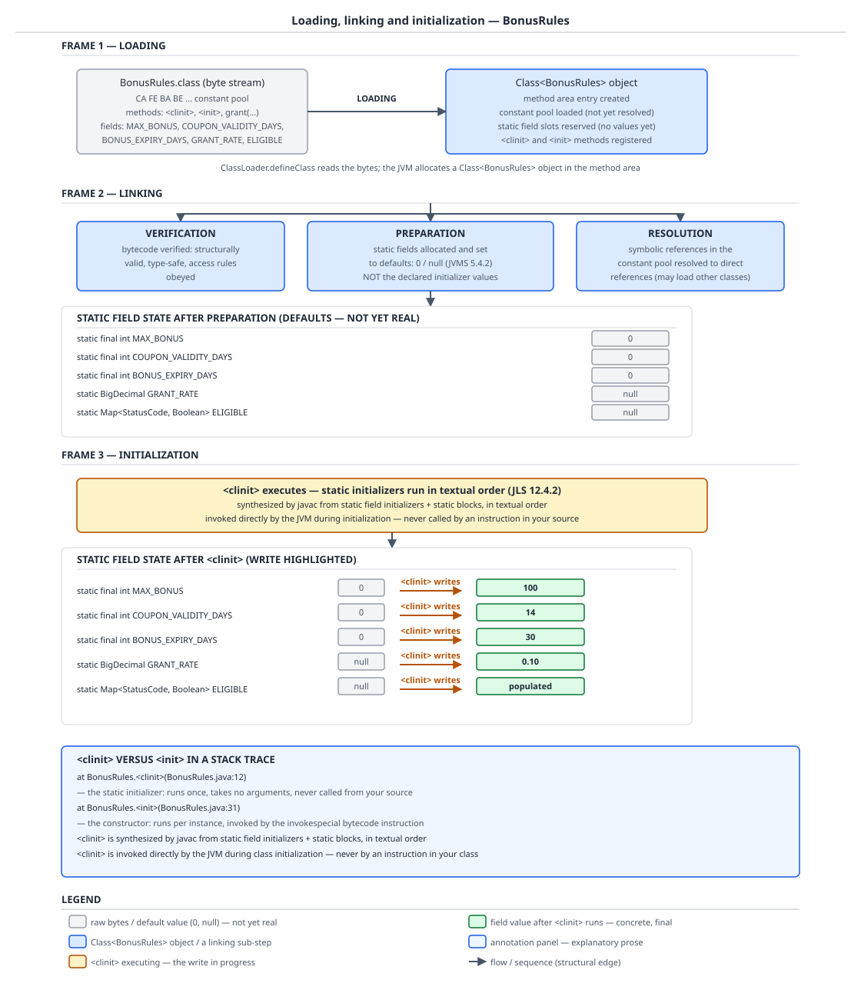

# 03 Java Core — Loading, linking and the initialization method — INTERNALS (§3.6, 3.6.1–3.6.6)

**Target version: Java 21 LTS.** | **Part 3 of 5** | [Index](../00-index.md)
Previous: [Access and the remaining modifiers](02a-access-and-other-modifiers.md) · Next: [Class-initialization locking and failure](03a-internals-class-init-locking-and-failure.md)

Between the moment a `BonusRules.class` byte stream reaches the JVM and the moment `BonusRules.GRANT_RATE` returns `0.10`, the class passes three checkpoints, and a method you cannot name runs once. This file is the mechanics half of that story: what each of the three phases actually does, why one of them is described by the specification as *optional*, why a `static final int` is already set before `<clinit>` is entered at all, what `<clinit>` looks like as bytes in a class file, why no instruction anywhere is permitted to call it even though it appears in stack traces, the six ways the specification permits initialization to be triggered, and why one whole category of static-field read compiles to no instruction at all and therefore triggers nothing. The concurrency half — the per-class lock, the exactly-once guarantee, class-init deadlock, and the permanently-erroneous state after a failed `<clinit>` — is [Class-initialization locking and failure](03a-internals-class-init-locking-and-failure.md).

## 1. The three phases, and the work preparation does that initialization never repeats (3.6.1, 3.6.2)

Picture the class as passing three checkpoints, not one. First a byte array becomes a `Class` object with a known shape — fields named, superclass identified, method bodies present but unexamined. Second, the JVM audits that shape for safety and lays out storage for it, zero-filling every static slot, and *separately* resolves symbolic names to real pointers, at whatever moment it chooses. Third, and only then, your code runs. The three checkpoints exist because the JVM must be able to trust a class file it did not compile, and because it must be able to defer running your static initialisers until the last possible instant.

### Why it exists

A `.class` file arrives from a network, a jar, a bytecode-generating framework, or an attacker. The JVM cannot assume `javac` produced it. If verification did not exist as a separate phase, every single bytecode instruction would need a runtime type check, because a hostile class file could claim a `BigDecimal` on the operand stack where an `int` sits. Verification pays that cost once, per method, at link time, so the interpreter and JIT can execute unchecked. Preparation exists separately because storage for static fields has to exist before anything — including `<clinit>` itself — can write to it. And initialization is separated from both because static initialisers are arbitrary user code: they can open sockets, read system properties, throw. The JVM defers them until an active use forces the issue, which is the entire content of leaf 3.6.5.

### The mechanism

`[SOURCE]` JVMS 21 §5.5 opens the initialization section with the sentence that anchors the whole phase model, verbatim:

> Prior to initialization, a class or interface must be linked, that is, verified, prepared, and optionally resolved.

The load-bearing word is **optionally**. Resolution — turning a constant-pool symbolic reference such as `#13 = Fieldref BonusRules.GRANT_RATE:Ljava/math/BigDecimal;` into a direct pointer to a field slot — is not required to happen at link time. A conforming JVM may resolve every symbolic reference eagerly when it links a class, or lazily, at the first execution of each instruction that uses it. HotSpot chooses lazy: a constant-pool entry stays symbolic until an instruction referencing it actually runs. **Unverified:** the claim that HotSpot resolves lazily rests on JVMS §5.4's non-normative discussion of the two strategies rather than on anything this file measured; the observable consequence — that a `NoSuchMethodError` for a missing method surfaces at the call site rather than at class-load time — is consistent with it, but the timing was not instrumented here. What is certain is the folklore correction: **"linking resolves all references" is wrong as a statement about the platform**, because the specification says *optionally*.

Preparation, by contrast, is not optional and is fully specified. JVMS §5.4.2 gives static fields their default values — `0`, `0L`, `0.0`, the char default (`'\u0000'`), `false`, `null` by type — and creates method tables. No user code runs. No `<clinit>`. The field slots exist and read as zeros.

`[PROVE]` Now the correction that most treatments of this material get slightly wrong, and it is provable straight out of the class file. Preparation does *not* set `static final int MAX_BONUS = 100` to `100`, but neither does `<clinit>`. A third step, between them, does. JVMS 21 §5.5's procedure step 6 reads, verbatim:

> Otherwise, record the fact that initialization of the `Class` object for C is in progress by the current thread, and release LC. Then, initialize each `final static` field of C with the constant value in its `ConstantValue` attribute (§4.7.2), in the order the fields appear in the `ClassFile` structure.

That clause sits inside the initialization procedure but **before** the step that executes `<clinit>` (step 9). So the order for the QuizStakes `BonusRules` is: preparation zeroes all five static slots → step 6 stamps `MAX_BONUS`, `COUPON_VALIDITY_DAYS` and `BONUS_EXPIRY_DAYS` from their `ConstantValue` attributes → step 9 runs `<clinit>`, which writes only `GRANT_RATE` and `ELIGIBLE`. The three `int`s were never zero at any moment `<clinit>` could observe.

The class under the microscope for the whole of this file:

```java
enum StatusCode { AO_400_SUBMITTED, AA_801_ACTIVATED, AA_900_DECLINED, DEP_301_CAPTURED }

class BonusRules {
    static final int MAX_BONUS = 100;
    static final int COUPON_VALIDITY_DAYS = 14;
    static final int BONUS_EXPIRY_DAYS = 30;
    static java.math.BigDecimal GRANT_RATE;
    static java.util.Map<StatusCode, Boolean> ELIGIBLE;

    static {
        GRANT_RATE = new java.math.BigDecimal("0.10");
        ELIGIBLE = new java.util.EnumMap<>(StatusCode.class);
        ELIGIBLE.put(StatusCode.AA_801_ACTIVATED, Boolean.TRUE);
        ELIGIBLE.put(StatusCode.DEP_301_CAPTURED, Boolean.TRUE);
        ELIGIBLE.put(StatusCode.AA_900_DECLINED, Boolean.FALSE);
    }

    private final java.math.BigDecimal firstDepositAmount;

    BonusRules(java.math.BigDecimal firstDepositAmount) {
        this.firstDepositAmount = firstDepositAmount;
    }

    java.math.BigDecimal grantFor() {
        java.math.BigDecimal raw = firstDepositAmount.multiply(GRANT_RATE);
        java.math.BigDecimal cap = new java.math.BigDecimal(MAX_BONUS);
        return raw.compareTo(cap) > 0 ? cap : raw.setScale(2, java.math.RoundingMode.DOWN);
    }
}
```

The evidence, from `javap -p -v BonusRules.class` on Oracle JDK 21.0.7 (class file major version 65), field section verbatim:

```
  static final int MAX_BONUS;
    descriptor: I
    flags: (0x0018) ACC_STATIC, ACC_FINAL
    ConstantValue: int 100

  static final int COUPON_VALIDITY_DAYS;
    descriptor: I
    flags: (0x0018) ACC_STATIC, ACC_FINAL
    ConstantValue: int 14

  static final int BONUS_EXPIRY_DAYS;
    descriptor: I
    flags: (0x0018) ACC_STATIC, ACC_FINAL
    ConstantValue: int 30

  static java.math.BigDecimal GRANT_RATE;
    descriptor: Ljava/math/BigDecimal;
    flags: (0x0008) ACC_STATIC

  static java.util.Map<StatusCode, java.lang.Boolean> ELIGIBLE;
    descriptor: Ljava/util/Map;
    flags: (0x0008) ACC_STATIC
    Signature: #89                          // Ljava/util/Map<LStatusCode;Ljava/lang/Boolean;>;

  private final java.math.BigDecimal firstDepositAmount;
    descriptor: Ljava/math/BigDecimal;
    flags: (0x0012) ACC_PRIVATE, ACC_FINAL
```

And the three constant-pool entries those `ConstantValue` attributes point at, from the same dump:

```
  #82 = Utf8               ConstantValue
  #83 = Integer            100
  #85 = Integer            14
  #87 = Integer            30
```

Read the two field groups against each other. The three `int` fields each carry a `ConstantValue` attribute holding the literal — `ConstantValue: int 100` is a class-file attribute, not code, and it points at constant-pool entry `#83 = Integer 100`, a plain `CONSTANT_Integer_info` structure sitting in the pool alongside the class's strings and method references. The two reference-typed static fields carry no `ConstantValue` at all; `GRANT_RATE` has only `ACC_STATIC`, and `ELIGIBLE` adds a `Signature` attribute recording the erased generic type `Ljava/util/Map<LStatusCode;Ljava/lang/Boolean;>;`. A field with a `ConstantValue` is set by the JVM from the attribute; a field without one can only be set by executing an instruction. The `ConstantValue` attribute's byte layout — its `attribute_name_index`, `attribute_length` and `constantvalue_index`, and which pool tags are legal for which field descriptor — is `../language-substrate/03a-internals-class-file-format.md`'s territory; what matters here is that it is data the JVM reads, not code the JVM runs.



**D-107** takes `BonusRules` through all three phases: frame 1 the byte stream becoming a `Class<BonusRules>`, frame 2 the three linking sub-boxes with preparation's field panel showing every slot at its default, frame 3 `<clinit>` overwriting those defaults in textual order. **One precision the art is coarse about, and the spec quote above is the fix:** the frame-2-to-frame-3 arrow is exactly right for `GRANT_RATE` (`null` → `0.10`) and `ELIGIBLE` (`null` → populated), and slightly coarse for `MAX_BONUS`, `COUPON_VALIDITY_DAYS` and `BONUS_EXPIRY_DAYS`, whose `0` → `100` / `14` / `30` transition happens at procedure step 6, before `<clinit>` is entered — not inside it. The bytecode in section 2 makes that visible: `<clinit>` contains no `putstatic` for any of the three.

`[X-REF 06]` The practical diagnosis handle for this whole phase model, self-contained before the pointer: `-Xlog:class+init=info` logs each phase transition per class, with verification bracketed separately. Measured on JDK 21.0.7 against a two-class program:

```
[0.016s][info][class,init] Start class verification for: BonusRulesR2
[0.016s][info][class,init] End class verification for: BonusRulesR2
[0.016s][info][class,init] 316 Initializing 'BonusRulesR2' (0x000000f8010009f8)
[0.016s][info][class,init] Start class verification for: LedgerPositionsR2
[0.016s][info][class,init] End class verification for: LedgerPositionsR2
[0.016s][info][class,init] 317 Initializing 'LedgerPositionsR2' (0x000000f801000bf0)
```

The monotonic counter (`316`, `317`) is the initialization order, and the nesting of the two `Initializing` lines — the second opening before the first has closed — is exactly the recursive-entry story that `03a-internals-class-init-locking-and-failure.md` builds its deadlock on. Note what this log does **not** cover: `-verbose:class` (equivalently `-Xlog:class+load`) logs *loading* only, so a class that loads fine and fails to initialize appears entirely normal in it. Class-loader-level tracing, GC of loaded classes, JFR and startup profiling are guide **06 JVM internals**.

> Loading produces a `Class` object from bytes; linking verifies it, prepares its static storage to type defaults, and *optionally* resolves its symbolic references; initialization then stamps `ConstantValue` fields and executes `<clinit>`, and is the only phase that runs code you wrote.

## 2. `<clinit>` and `<init>` as class-file artifacts (3.6.3, 3.6.4)

Picture two methods in the class file whose names are illegal Java identifiers, so nothing you write can name either one. `<init>` you can at least *point at* a caller for — some `new` site somewhere emitted an `invokespecial` naming it. `<clinit>` has no caller anywhere in any class file in the world. It is invoked only by the JVM, from inside the §5.5 procedure, and yet it shows up in stack traces as a frame like any other.

### Why it exists

Static initialisers and static field initialisers are scattered through the source in whatever order the author wrote them, interleaved arbitrarily. The JVM has no notion of "static block"; it executes methods. So `javac` collects every static field initialiser and every `static { }` block, concatenates their code **in textual order**, and emits the result as a single synthesized method. The name is deliberately unspellable so that no source-level method can collide with it and no source-level call can invoke it — the exactly-once guarantee would be meaningless if you could call `<clinit>` yourself.

### The mechanism

`[SOURCE]` JVMS 21 §2.9.2 defines the method precisely, verbatim:

> A method is a *class or interface initialization method* if all of the following are true:
> - It has the special name `<clinit>`.
> - It is `void` (§4.3.3).
> - In a `class` file whose version number is 51.0 or above, the method has its `ACC_STATIC` flag set and takes no arguments (§4.6).
>
> The requirement for `ACC_STATIC` was introduced in Java SE 7, and for taking no arguments in Java SE 9. In a class file whose version number is 50.0 or below, a method named `<clinit>` that is `void` is considered the class or interface initialization method regardless of the setting of its `ACC_STATIC` flag or whether it takes arguments.

Line by line: the name is fixed; the return type is `void`, so `<clinit>` cannot hand a value back to anyone (there is no one to hand it to); and from class file version 51.0 — Java SE 7 — `ACC_STATIC` is mandatory and the descriptor must be exactly `()V`. The last paragraph is a compatibility carve-out for class files at 50.0 and below, where a `void` method named `<clinit>` counted as the initialization method even if it took arguments; version 51.0 tightened that, and 53.0 (Java SE 9) added the no-arguments requirement to the format check itself.

And the clause that makes leaf 3.6.4 sharp, verbatim:

> Other methods named `<clinit>` in a `class` file are not class or interface initialization methods. They are never invoked by the Java Virtual Machine itself, cannot be invoked by any Java Virtual Machine instruction (§4.9.1), and are rejected by format checking (§4.6, §4.8).

> Because the name `<clinit>` is not a valid identifier in the Java programming language, it cannot be used directly in a program written in the Java programming language.

"Cannot be invoked by any Java Virtual Machine instruction" is the whole contrast with `<init>`. There is no `invokestatic BonusRules.<clinit>:()V` anywhere, in any class file, ever. `<init>` is the opposite: it is reached by exactly one instruction, `invokespecial`, and you can see the call site.

`[BYTECODE]` The real output, `javap -c -p -v BonusRules.class` on the section-1 source, Oracle JDK 21.0.7, class file major version 65, method section verbatim and complete:

```
  BonusRules(java.math.BigDecimal);
    descriptor: (Ljava/math/BigDecimal;)V
    flags: (0x0000)
    Code:
      stack=2, locals=2, args_size=2
         0: aload_0
         1: invokespecial #1                  // Method java/lang/Object."<init>":()V
         4: aload_0
         5: aload_1
         6: putfield      #7                  // Field firstDepositAmount:Ljava/math/BigDecimal;
         9: return
      LineNumberTable:
        line 24: 0
        line 25: 4
        line 26: 9

  java.math.BigDecimal grantFor();
    descriptor: ()Ljava/math/BigDecimal;
    flags: (0x0000)
    Code:
      stack=3, locals=3, args_size=1
         0: aload_0
         1: getfield      #7                  // Field firstDepositAmount:Ljava/math/BigDecimal;
         4: getstatic     #13                 // Field GRANT_RATE:Ljava/math/BigDecimal;
         7: invokevirtual #16                 // Method java/math/BigDecimal.multiply:(Ljava/math/BigDecimal;)Ljava/math/BigDecimal;
        10: astore_1
        11: new           #17                 // class java/math/BigDecimal
        14: dup
        15: bipush        100
        17: invokespecial #22                 // Method java/math/BigDecimal."<init>":(I)V
        20: astore_2
        21: aload_1
        22: aload_2
        23: invokevirtual #25                 // Method java/math/BigDecimal.compareTo:(Ljava/math/BigDecimal;)I
        26: ifle          33
        29: aload_2
        30: goto          41
        33: aload_1
        34: iconst_2
        35: getstatic     #29                 // Field java/math/RoundingMode.DOWN:Ljava/math/RoundingMode;
        38: invokevirtual #35                 // Method java/math/BigDecimal.setScale:(ILjava/math/RoundingMode;)Ljava/math/BigDecimal;
        41: areturn
      LineNumberTable:
        line 29: 0
        line 30: 11
        line 31: 21
      StackMapTable: number_of_entries = 2
        frame_type = 253 /* append */
          offset_delta = 33
          locals = [ class java/math/BigDecimal, class java/math/BigDecimal ]
        frame_type = 71 /* same_locals_1_stack_item */
          stack = [ class java/math/BigDecimal ]

  static {};
    descriptor: ()V
    flags: (0x0008) ACC_STATIC
    Code:
      stack=3, locals=0, args_size=0
         0: new           #17                 // class java/math/BigDecimal
         3: dup
         4: ldc           #39                 // String 0.10
         6: invokespecial #41                 // Method java/math/BigDecimal."<init>":(Ljava/lang/String;)V
         9: putstatic     #13                 // Field GRANT_RATE:Ljava/math/BigDecimal;
        12: new           #44                 // class java/util/EnumMap
        15: dup
        16: ldc           #46                 // class StatusCode
        18: invokespecial #48                 // Method java/util/EnumMap."<init>":(Ljava/lang/Class;)V
        21: putstatic     #51                 // Field ELIGIBLE:Ljava/util/Map;
        24: getstatic     #51                 // Field ELIGIBLE:Ljava/util/Map;
        27: getstatic     #55                 // Field StatusCode.AA_801_ACTIVATED:LStatusCode;
        30: getstatic     #59                 // Field java/lang/Boolean.TRUE:Ljava/lang/Boolean;
        33: invokeinterface #65,  3           // InterfaceMethod java/util/Map.put:(Ljava/lang/Object;Ljava/lang/Object;)Ljava/lang/Object;
        38: pop
        39: getstatic     #51                 // Field ELIGIBLE:Ljava/util/Map;
        42: getstatic     #71                 // Field StatusCode.DEP_301_CAPTURED:LStatusCode;
        45: getstatic     #59                 // Field java/lang/Boolean.TRUE:Ljava/lang/Boolean;
        48: invokeinterface #65,  3           // InterfaceMethod java/util/Map.put:(Ljava/lang/Object;Ljava/lang/Object;)Ljava/lang/Object;
        53: pop
        54: getstatic     #51                 // Field ELIGIBLE:Ljava/util/Map;
        57: getstatic     #74                 // Field StatusCode.AA_900_DECLINED:LStatusCode;
        60: getstatic     #77                 // Field java/lang/Boolean.FALSE:Ljava/lang/Boolean;
        63: invokeinterface #65,  3           // InterfaceMethod java/util/Map.put:(Ljava/lang/Object;Ljava/lang/Object;)Ljava/lang/Object;
        68: pop
        69: return
      LineNumberTable:
        line 15: 0
        line 16: 12
        line 17: 24
        line 18: 39
        line 19: 54
        line 20: 69
```

Read the `<clinit>` instruction by instruction. `javap` prints its header as `static {};` — that is `javap`'s rendering, and the real name in the constant pool is `#96 = Utf8 <clinit>`. `descriptor: ()V` and `flags: (0x0008) ACC_STATIC` are precisely the two §2.9.2 requirements for version 51.0 and above, satisfied. `locals=0, args_size=0` confirms the no-arguments requirement — there is not even a `this` slot, which is the visible consequence of `ACC_STATIC` being mandatory. `stack=3` is the deepest the operand stack gets, reached during the `Map.put` groups where a map reference, a key and a value are all live at once.

- `0: new #17` / `3: dup` / `4: ldc #39` / `6: invokespecial #41` — allocate a `BigDecimal`, duplicate the reference so one copy survives the constructor call, push the string literal `"0.10"`, and run `BigDecimal.<init>(String)`. Note this is the *other* special method, `<init>`, called by name through `invokespecial`, visible in the constant pool as `#41 = Methodref java/math/BigDecimal."<init>":(Ljava/lang/String;)V`. That is what a call to a constructor looks like as a constant-pool entry plus an instruction. There is no analogous entry for any `<clinit>` anywhere in this pool, or in any pool.
- `9: putstatic #13` — store into `BonusRules.GRANT_RATE`. **This is a write to a static field, from inside `<clinit>`.**
- `12: new #44` / `15: dup` / `16: ldc #46` / `18: invokespecial #48` / `21: putstatic #51` — the same shape for `ELIGIBLE`. `ldc #46` is worth pausing on: `#46 = Class StatusCode`, so this `ldc` pushes the `Class` object for `StatusCode` — a class literal, `StatusCode.class` in source, materialised by an `ldc` against a `CONSTANT_Class_info` entry rather than by a method call.
- `24`–`38`, `39`–`53`, `54`–`68` — three structurally identical five-instruction groups: `getstatic ELIGIBLE` to push the map, `getstatic StatusCode.<constant>` to push the key, `getstatic Boolean.TRUE` or `Boolean.FALSE` to push the value, `invokeinterface Map.put` (with its `, 3` argument-count operand, which `invokeinterface` carries and the other invoke forms do not), then `pop` to discard `put`'s returned previous value, which the source ignores. Each `getstatic StatusCode.AA_801_ACTIVATED` at offset 27 is itself a trigger for `StatusCode`'s initialization under JVMS 5.5's first bullet — the enum's own `<clinit>` runs, nested inside this one, at that instruction.
- `69: return` — `void`, no value.

**The count that matters:** exactly two `putstatic` instructions in this `<clinit>`, at offsets 9 and 21, for `GRANT_RATE` and `ELIGIBLE`. **Zero** `putstatic` for `MAX_BONUS`, `COUPON_VALIDITY_DAYS` or `BONUS_EXPIRY_DAYS`, even though the source assigns all three. Those three were set from their `ConstantValue` attributes at procedure step 6, and `javac` emitted no code for them at all. Section 1's spec quote and this instruction listing are the same fact seen from two sides.

Two more things in that dump earn their place. The `LineNumberTable` on `<clinit>` maps offsets `0`, `12`, `24`, `39`, `54`, `69` to source lines 15 through 20 — the static block's own lines, in ascending order, which is the mechanical evidence for "textual order" and the reason a stack trace can print a line number for a `<clinit>` frame at all. And `grantFor()` at offset 15 shows `bipush 100` where the source reads `MAX_BONUS` — section 3's subject, appearing here as a side effect of dumping the whole class.

The `javac` pipeline that performs this collection-and-concatenation, and the rest of the desugaring catalogue, is `../language-substrate/03-internals-javac-and-class-file.md`. The *ordering* rules between static initialisers, instance initialisers, field initialisers and constructor bodies during a `new` live in `01b-initialization-order.md`; the illegal-forward-reference compile error that stops you reading a static field before its declaration is `01a-names-scope-and-var.md`; class anatomy and JEP 513 flexible constructor bodies are `01c-class-anatomy-and-constructors.md`. This file owns the class-file artifact and its stack-trace signature. `invokespecial` and `invokestatic` as dispatch mechanisms, alongside the other three invoke instructions, are `../inheritance-and-dispatch/03-internals-dispatch.md`.

`[TRAP]` The stack traces, measured. Both printed by a a `new Throwable(message).printStackTrace(System.out)` placed inside the static block and inside the constructor of the same class, JDK 21.0.7:

```
java.lang.Throwable: frame from <clinit>
	at BonusRulesT.<clinit>(Traces.java:4)
	at Traces.main(Traces.java:15)
java.lang.Throwable: frame from <init>
	at BonusRulesT.<init>(Traces.java:9)
	at Traces.main(Traces.java:15)
```

The two look identical in shape, and that is exactly the trap. In the `<init>` trace, `Traces.main` really did call the constructor — there is an `invokespecial BonusRulesT.<init>` at that line in `main`'s bytecode, and "caller" is literally true. In the `<clinit>` trace, `Traces.main` did **not** call `<clinit>`; it executed a `new` whose *side effect* was to enter the initialization procedure, which pushed the `<clinit>` frame. The frame below a `<clinit>` frame is the trigger site, not the call site.

**Interview:** asked "what is the difference between `<clinit>` and `<init>`", the weak answer is "one is static and one is the constructor". The strong 90-second answer is: "`<clinit>` is `()V` with `ACC_STATIC` mandatory from class file 51.0, synthesized by `javac` from the static field initialisers and static blocks in textual order, and JVMS §2.9.2 says it cannot be invoked by any Java Virtual Machine instruction — so in a stack trace the frame beneath it is the trigger site, not a caller, whereas `<init>` is reached by a real `invokespecial` you can point at in the caller's bytecode. And `<clinit>` does not contain writes to `static final` primitives or `String`s initialised by constant expressions; those come from `ConstantValue` attributes at an earlier step of the initialization procedure."

**Pitfall:** reading `at BonusRules.<clinit>(BonusRules.java:12)` and searching the codebase for the call to that method. **Symptom:** you find nothing, because no such call can exist — §2.9.2 says `<clinit>` "cannot be invoked by any Java Virtual Machine instruction." **Fix:** read the frame *below* it as the trigger, and match it against JVMS 5.5's six bullets — the line will contain a `new`, a `getstatic`, a `putstatic`, an `invokestatic`, a reflective call, or a subclass initialization. And if the frame below is a different class's `<clinit>`, you are looking at an initialization chain, which is where cycles hide; that story is `03a-internals-class-init-locking-and-failure.md`.

| Property | `<clinit>` | `<init>` | An ordinary `static` method |
|---|---|---|---|
| Name in the constant pool | `<clinit>` | `<init>` | any legal identifier |
| Descriptor | exactly `()V` | `(<params>)V` | anything |
| Flags | `ACC_STATIC` mandatory from class file 51.0 | never `ACC_STATIC` | `ACC_STATIC` |
| `locals` / `args_size` in `Code` | `0` / `0` — no `this` slot | at least `1` / `1` — `this` in slot 0 | as declared |
| Written by | synthesized by `javac` from static field initialisers and `static { }` blocks, textual order | `javac`, from a declared constructor | you |
| Invoked by | the JVM, from the JVMS 5.5 procedure — no instruction can call it | `invokespecial` at a call site you can point to | `invokestatic` |
| Callable from source | no — not a legal identifier | yes, via `new` or an explicit `this`/`super` constructor invocation | yes |
| Times run per class | exactly once per (class, defining loader) | once per instance created | unbounded |
| Appears in a stack trace | yes; the frame below is the *trigger* | yes; the frame below is the *caller* | yes; the frame below is the *caller* |

> `<clinit>` is a `void`, no-argument, `ACC_STATIC` method that `javac` synthesizes by concatenating a class's static field initialisers and static blocks in textual order, and that no bytecode instruction anywhere is permitted to call — the JVM alone invokes it, exactly once, from the §5.5 initialization procedure.

## 3. Compile-time constants are inlined, so reading one triggers nothing (3.6.6)

Picture two reads that look the same in source and are not the same at all. `BonusRules.MAX_BONUS` and `BonusRules.GRANT_RATE` are both `static` field accesses on the same class, written identically. One of them compiles to an instruction that mentions `BonusRules`. The other compiles to a number, with `BonusRules` erased from the reader's class file entirely — and a class that is never mentioned is a class that is never triggered.

### Why it exists

The inlining is not an optimisation the compiler is permitted to skip; it is required behaviour, and it exists so that a constant can be used where the language demands a compile-time constant — a `case` label, an annotation element, an array dimension in some contexts, the condition of a conditionally-compiled `if (DEBUG)` block. For `javac` to accept `case MAX_BONUS:` it must know the value at compile time, and once it knows the value there is nothing left for a runtime field read to do.

### The mechanism

`[SOURCE]` `[PROVE]` The argument is a two-line syllogism across two specification texts, then a measurement.

JLS 21 §4.12.4, verbatim: "A *constant variable* is a final variable of primitive type or type String that is initialized with a constant expression (§15.29)."

JLS 21 §13.1, verbatim:

> A reference to a field that is a constant variable (§4.12.4) **must** be resolved at compile time to the value V denoted by the constant variable's initializer.
>
> If such a field is `static`, then **no reference to the field should be present in the code in a binary file, including the class or interface which declared the field.** Such a field must always appear to have been initialized (§12.4.2); the default initial value for the field (if different than V) must never be observed.

Now the syllogism. JVMS 5.5's first trigger bullet is *the execution of a `getstatic` instruction*. JLS §13.1 requires that **no** reference to a constant variable be present in any binary. An instruction that does not exist cannot execute. Therefore reading a constant variable cannot trigger initialization — not "usually does not", but cannot, as a matter of both specifications agreeing. Note also §13.1's last clause: "the default initial value for the field (if different than V) must never be observed" — the language guarantees you can never catch a constant variable at `0`, which is a stronger promise than the `ConstantValue` step of section 1 alone would give you.

`[BYTECODE]` The measurement. Two one-line methods in a *separate* class, reading one constant and one non-constant field of `BonusRules`, compiled and dumped with `javap -c -p` on JDK 21.0.7:

```java
class BonusRateReader {
    static int capFromConstant() {
        return BonusRules.MAX_BONUS;
    }

    static java.math.BigDecimal rateFromField() {
        return BonusRules.GRANT_RATE;
    }
}
```

```
class BonusRateReader {
  BonusRateReader();
    Code:
       0: aload_0
       1: invokespecial #1                  // Method java/lang/Object."<init>":()V
       4: return

  static int capFromConstant();
    Code:
       0: bipush        100
       2: ireturn

  static java.math.BigDecimal rateFromField();
    Code:
       0: getstatic     #9                  // Field BonusRules.GRANT_RATE:Ljava/math/BigDecimal;
       3: areturn
}
```

`capFromConstant` reads `BonusRules.MAX_BONUS` in source and compiles to `bipush 100` — the literal as an immediate operand of the instruction, with `BonusRules` appearing nowhere in the method's code and no `Fieldref` for `MAX_BONUS` in the reader's constant pool. `rateFromField` reads `BonusRules.GRANT_RATE` and compiles to a real `getstatic` against `#9 = Fieldref BonusRules.GRANT_RATE`. Two source reads that look identical; one has an instruction naming `BonusRules` and one does not.

The boundary, precisely, because the definition is narrower than most people assume:

| Declaration | Constant variable? | Why |
|---|---|---|
| `static final int MAX_BONUS = 100;` | yes | `int` is primitive, `100` is a constant expression |
| `static final String COUPON_PREFIX = "QS-";` | yes | `String` is explicitly included by §4.12.4 |
| `static final int TOTAL = MAX_BONUS + BONUS_EXPIRY_DAYS;` | yes | a constant expression may name other constant variables |
| `static final BigDecimal GRANT_CAP = new BigDecimal("100.00");` | no | `BigDecimal` is neither primitive nor `String`, and `new` is not a constant expression |
| `static final String COUPON_PREFIX = buildPrefix();` | no | a method invocation is not a constant expression |
| `static final int[] TIERS = { 10, 25, 50 };` | no | array type, and an array initialiser is not a constant expression |
| `static int grantsIssued = 0;` | no | not `final` |

And the clause almost every treatment omits: "**including the class or interface which declared the field**". `BonusRules.grantFor()` reads its own `MAX_BONUS`, and its bytecode in section 2 at offset 15 is `bipush 100`, not `getstatic BonusRules.MAX_BONUS`. A class does not read its own constants through the field either.

`[PROVE]` The consequence that makes this more than a curiosity, and the sharpest single demonstration in either of these two files: **a class-initialization deadlock can be deleted by changing a field's type.** Two classes whose static initialisers mirror each other's non-constant `static final BigDecimal` fields deadlock permanently when two threads enter them simultaneously — measured, and dumped, in `03a-internals-class-init-locking-and-failure.md`. Swap the mirrored field for `static final int MAX_BONUS = 100` and keep every other line identical, and the same two-thread program completes cleanly. Measured, JDK 21.0.7:

```
bonus-grant-1 saw 250000.00
payment-run-worker saw 100
both finished: true
```

Here is why, in bytecode. `javap -c -p` on the `LedgerPositions` whose `<clinit>` reads `BonusRules.MAX_BONUS`:

```
  static {};
    Code:
       0: new           #7                  // class java/math/BigDecimal
       3: dup
       4: ldc           #9                  // String 250000.00
       6: invokespecial #11                 // Method java/math/BigDecimal."<init>":(Ljava/lang/String;)V
       9: putstatic     #14                 // Field PROMOTIONAL_EXPENSE_BUDGET:Ljava/math/BigDecimal;
      12: bipush        100
      14: putstatic     #22                 // Field CAP_MIRROR:I
      17: return
```

Offset 12 is `bipush 100`. There is **no `getstatic BonusRules.MAX_BONUS`**, and `BonusRules` does not appear in `LedgerPositions`' constant pool as a `Fieldref` at all. One arm of the cycle has no instruction in it, so there is nothing to trigger `BonusRules`' initialization from `LedgerPositions.<clinit>`, so no lock is ever taken in that direction, so the cycle is not a cycle. **A deadlock that a type change can delete is a deadlock that lives in the bytecode, not in the source** — which is why reviewing for that hazard means checking the *types and initialisers* of the mirrored fields, not just their names.

**Pitfall:** the mirror image of the above — assuming that because a constant read does not trigger initialization, constants are always the safe choice. **Symptom:** `MAX_BONUS` is bumped from `100` to `150`, `BonusRules.jar` is rebuilt and redeployed, and every service that was not recompiled against the new jar keeps computing bonus caps at `100` — silently, correctly according to its own bytecode, with no linkage error anywhere, because each consumer baked `bipush 100` into its own class file at *its* compile time. **Fix:** treat a `public static final` primitive or `String` as part of your ABI, not your configuration. Values that change on a deployment cadence belong behind a method call or in a non-constant field (`static final BigDecimal`, or a config lookup), precisely so that a real `getstatic` or `invokestatic` exists to pick up the new value. The full stale-constant deploy hazard, with diagram D-042, is `02-modifiers.md` (leaf 1.14.7); this section owns the no-initialization consequence, that file owns the wrong-value consequence, and they are the same `bipush` seen from two directions.

The JIT's separate, *runtime* trust of non-constant `static final` fields — constant folding after initialization has completed, `@Stable`, and JEP 500 — is `04-internals-final-and-constant-folding.md`. That is a different mechanism at a different time: §13.1 inlining happens in `javac` and is mandatory; JIT folding happens in C2 and is opportunistic.

> A constant variable is a `final` field of primitive or `String` type with a constant-expression initialiser; JLS §13.1 forbids any binary from containing a reference to one, so the read compiles to a literal, no `getstatic` exists, and JVMS 5.5's first trigger cannot fire.

## Supporting facts

### The six active-use triggers, verbatim (3.6.5)

`[SOURCE]` `[RESEARCH]` JVMS 21 §5.5. Exactly six bullets, and the list is closed — "may be initialized **only** as a result of":

> A class or interface C may be initialized only as a result of:
> - The execution of any one of the Java Virtual Machine instructions *new*, *getstatic*, *putstatic*, or *invokestatic* that references C (§*new*, §*getstatic*, §*putstatic*, §*invokestatic*). Upon execution of a *new* instruction, the class to be initialized is the class referenced by the instruction. Upon execution of a *getstatic*, *putstatic*, or *invokestatic* instruction, the class or interface to be initialized is the class or interface that declares the resolved field or method.
> - The first invocation of a `java.lang.invoke.MethodHandle` instance which was the result of method handle resolution (§5.4.3.5) for a method handle of kind 2 (`REF_getStatic`), 4 (`REF_putStatic`), 6 (`REF_invokeStatic`), or 8 (`REF_newInvokeSpecial`). This implies that the class of a bootstrap method is initialized when the bootstrap method is invoked for an *invokedynamic* instruction (§*invokedynamic*), as part of the continuing resolution of the call site specifier.
> - Invocation of certain reflective methods in the class library (§2.12), for example, in class `Class` or in package `java.lang.reflect`.
> - If C is a class, the initialization of one of its subclasses.
> - If C is an interface that declares a non-`abstract`, non-`static` method, the initialization of a class that implements C directly or indirectly.
> - Its designation as the initial class or interface at Java Virtual Machine startup (§5.2).

Bullet 1's second sentence is the precision most summaries lose: for `getstatic`/`putstatic`/`invokestatic`, the class initialized is the one that **declares the resolved member**, not the one named in the instruction — so `getstatic ChildRules.INHERITED_LIMIT` where `ChildRules` inherits the field from `ParentRules` initializes `ParentRules`, not `ChildRules`. Section 3 is the other half of the same bullet: if the resolved field is a constant variable, no `getstatic` is emitted, so no bullet fires at all.

**Insight:** bullet 2 is the one nobody lists, and it is why a class can initialize with no `new`, `getstatic`, `putstatic` or `invokestatic` anywhere in your source. Every lambda and every record's generated `equals`/`hashCode`/`toString` compiles to an `invokedynamic`, whose resolution invokes a bootstrap method, and invoking the bootstrap method initializes the bootstrap method's declaring class — `java.lang.invoke.LambdaMetafactory`, `java.lang.runtime.ObjectMethods`, or `java.lang.invoke.StringConcatFactory` for string concatenation. `invokedynamic`, bootstrap methods and lambda linkage are guide **04 Modern Java**; `StringConcatFactory`'s bootstrap specifically is `../strings/04-internals-stringbuilder-and-concat.md`.

**Insight:** bullets 4 and 5 are **asymmetric**, and the asymmetry is testable. Bullet 4 is unconditional: initializing a subclass always initializes its superclass. Bullet 5 has a condition: initializing an implementor initializes an interface **only if that interface declares a non-`abstract`, non-`static` method** — that is, only if it has a default method. A pure constant-holder interface is never initialized by its implementors. Measured on JDK 21.0.7 with this program:

```java
interface BonusConstants {
    java.math.BigDecimal GRANT_CAP = capOf();

    static java.math.BigDecimal capOf() {
        System.out.println("BonusConstants.<clinit> ran");
        return new java.math.BigDecimal("100.00");
    }
}

interface BonusDefaults {
    java.math.BigDecimal EXPIRY_UNITS = unitsOf();

    static java.math.BigDecimal unitsOf() {
        System.out.println("BonusDefaults.<clinit> ran");
        return new java.math.BigDecimal("30");
    }

    default int expiryDays() {
        return 30;
    }
}

class BonusService implements BonusConstants, BonusDefaults {
    static {
        System.out.println("BonusService.<clinit> ran");
    }
}

public class InterfaceTriggerProbe {
    public static void main(String[] args) throws ClassNotFoundException {
        Class.forName("BonusService");
        System.out.println("-- BonusService initialized --");
    }
}
```

Output:

```
BonusDefaults.<clinit> ran
BonusService.<clinit> ran
-- BonusService initialized --
```

`BonusConstants.<clinit>` never ran. Two interfaces, both implemented directly by the same class, and only the one with a `default` method was initialized. The practical upshot worth carrying into an interview: adding a single `default` method to a constants-only interface silently converts it from lazy to eager with respect to every implementor.

Bullet 6's mechanism, from JVMS 21 §5.2, verbatim: "The Java Virtual Machine starts up by creating an initial class or interface using the bootstrap class loader (§5.3.1) or a user-defined class loader (§5.3.2). The Java Virtual Machine then links the initial class or interface, initializes it, and invokes the `public static` method `void main(String[])`." That is why your `main` class's static block runs before `main` does.

The language-visible face of this list — the decision tree an engineer actually reasons with, `Class.forName` versus `loadClass`, the holder idiom, long-running static work — is `01d-class-initialization-triggers.md` (leaves 1.13.9–1.13.15, diagrams D-039 and D-040) at BASICS depth. This entry owns the verbatim specification text and the two bullets that list does not have to carry. `Class.forName` versus `loadClass` at INTERNALS depth, class identity as (name, defining loader), and the delegation model are `03b-internals-class-loaders-and-identity.md`.

## Pitfalls

### Believing `<clinit>` writes every static field the source assigns

**Wrong**

```java
public final class ConstantValueProbe {
    // Belief: "the static block and the field initialisers together become <clinit>,
    // so every static assignment in the source shows up as a putstatic in it."
    public static void main(String[] args) {
        // Expected, on this belief: 5 putstatic instructions in BonusRules.<clinit>
        // (MAX_BONUS, COUPON_VALIDITY_DAYS, BONUS_EXPIRY_DAYS, GRANT_RATE, ELIGIBLE).
        System.out.println("expecting 5 putstatic in <clinit>");
    }
}
```

The surprise, measured with `javap -c -p -v BonusRules.class` on JDK 21.0.7: there are **two** `putstatic` instructions in `<clinit>`, at offsets 9 and 21, and neither of them targets any of the three `int` constants. Those three fields carry `ConstantValue` attributes instead, and JVMS 5.5's procedure step 6 sets them from those attributes *before* step 9 executes `<clinit>` at all.

**Right**

```java
public final class ConstantValueProbe {
    // Read the class file, not the source, when you need to know what runs.
    // Reflection reports the *fields*; javap reports the *instructions*, and only
    // the instructions tell you what <clinit> actually does.
    public static void main(String[] args) throws Exception {
        for (java.lang.reflect.Field field : BonusRules.class.getDeclaredFields()) {
            boolean isStatic = java.lang.reflect.Modifier.isStatic(field.getModifiers());
            boolean isFinal = java.lang.reflect.Modifier.isFinal(field.getModifiers());
            boolean couldBeConstantVariable = isStatic && isFinal
                    && (field.getType().isPrimitive() || field.getType() == String.class);
            System.out.printf("%-22s static=%b final=%b constant-variable-eligible=%b%n",
                    field.getName(), isStatic, isFinal, couldBeConstantVariable);
        }
    }
}
```

Output on JDK 21.0.7 separates the two groups exactly as the class file does — the three `int`s report `constant-variable-eligible=true`, `GRANT_RATE` and `ELIGIBLE` report `false`. Reflection cannot tell you where the value came from, so for that question the tool is `javap -p -v` and the thing to look for is the `ConstantValue` attribute.

**Why people believe it:** the source really does contain five static assignments, and the standard explanation of `<clinit>` — "javac collects the static initialisers into one method" — is true and complete for every field *except* the constant-variable ones, which is a carve-out that lives in a different specification (JLS §13.1 and JVMS §4.7.2) from the one that describes `<clinit>` (JVMS §2.9.2).

### Believing linking resolves every symbolic reference

**Wrong**

```java
public final class EagerResolutionAssumption {
    // Belief: "if the class linked, every method and field it references exists,
    // so a NoSuchFieldError can only happen at class-load time."
    static java.math.BigDecimal split(java.math.BigDecimal stake) {
        // Compiled against v2 of the library, running against v1 at runtime.
        return BonusRules.GRANT_RATE.multiply(stake);
    }

    public static void main(String[] args) {
        System.out.println("class linked, therefore safe");
    }
}
```

The surprise: JVMS 21 §5.5 says a class must be "verified, prepared, and **optionally** resolved" before initialization. Resolution is explicitly optional at link time, and HotSpot defers it, so a reference to a member that does not exist in the version actually on the classpath surfaces as a `NoSuchMethodError` or `NoSuchFieldError` at the *first execution of that instruction* — potentially days into a process's life, on a code path that only a rare request reaches.

**Right**

```java
public final class EagerResolutionAssumption {
    // Do not infer member existence from "it started up fine". Verify the
    // surface you depend on at a controlled point, where a failure is a
    // startup failure rather than a request failure.
    static void assertLibrarySurface() throws NoSuchFieldException {
        java.lang.reflect.Field rate = BonusRules.class.getDeclaredField("GRANT_RATE");
        if (rate.getType() != java.math.BigDecimal.class) {
            throw new IllegalStateException("BonusRules.GRANT_RATE has type " + rate.getType());
        }
    }

    public static void main(String[] args) throws NoSuchFieldException {
        assertLibrarySurface();
        System.out.println("library surface verified at startup");
    }
}
```

**Why people believe it:** "verification" and "resolution" both sound like exhaustive up-front checks, they are both listed under linking, and most descriptions of the phase model present the three linking sub-steps as a sequence that completes. The word *optionally* appears once, in one sentence of §5.5, and is almost never quoted.

### Reading a `<clinit>` stack frame as a call

**Wrong**

```java
public final class ClinitFrameHunt {
    // Log line: at BonusRules.<clinit>(BonusRules.java:12)
    // Response: grep the codebase for whatever calls it.
    //   grep -rn 'BonusRules.<clinit>'   -> nothing
    //   grep -rn 'clinit'                -> nothing
    //   search the IDE for callers       -> "no usages found"
    public static void main(String[] args) {
        System.out.println("looking for the caller that does not exist");
    }
}
```

The surprise: JVMS §2.9.2 states that a `<clinit>` "cannot be invoked by any Java Virtual Machine instruction", and `<clinit>` is not a legal Java identifier, so there is no call site to find in source or in bytecode. The frame beneath it is the *trigger*, and the JVM pushed the `<clinit>` frame itself from step 9 of the §5.5 procedure.

**Right**

```java
public final class ClinitFrameHunt {
    // Identify the trigger from the frame below, then classify it against the
    // six JVMS 5.5 bullets. This prints its own trigger frame to make the
    // relationship concrete.
    public static void main(String[] args) {
        StackTraceElement[] frames = new Throwable().getStackTrace();
        System.out.println("trigger frame for any <clinit> entered from here: " + frames[0]);
        System.out.println("first touch of BonusRules is the getstatic below:");
        System.out.println("  GRANT_RATE = " + BonusRules.GRANT_RATE); // getstatic — bullet 1
    }
}
```

Run with `-Xlog:class+init=info` and the `Initializing 'BonusRules'` line appears immediately after the trigger line executes, which is the confirmation that the trigger and not a caller is what put the frame there.

**Why people believe it:** every other frame in every other stack trace *is* a caller, so the convention is overwhelmingly reliable — and `<clinit>` frames are rare enough that most engineers meet their first one inside an already-confusing `ExceptionInInitializerError`, where they are looking for a cause rather than questioning frame semantics.

## Cheat sheet

| Item | Value |
|---|---|
| Three phases | loading → linking (verification, preparation, resolution) → initialization |
| JVMS 5.5's phase sentence | "must be linked, that is, verified, prepared, and **optionally** resolved" |
| What *optionally* means | resolution may be eager at link time or lazy at first use of each reference; HotSpot is lazy |
| Folklore corrected | "linking resolves all references" is wrong as a platform statement |
| Preparation (JVMS 5.4.2) | sets static fields to type defaults (`0`, `0L`, `0.0`, `'\u0000'`, `false`, `null`); creates method tables; runs no code |
| `ConstantValue` fields | set at §5.5 procedure **step 6**, before `<clinit>` (step 9) — never inside it |
| Measured field split | 3 `int`s carry `ConstantValue: int 100 / 14 / 30`; `GRANT_RATE` and `ELIGIBLE` carry none |
| Measured `<clinit>` `putstatic` count | **2** (offsets 9 and 21, `GRANT_RATE` and `ELIGIBLE`); **0** for the three `ConstantValue` `int`s |
| `<clinit>` definition (JVMS 2.9.2) | name `<clinit>`, `void`, and from class file **51.0** also `ACC_STATIC` and no arguments |
| Version history | `ACC_STATIC` required from **Java SE 7** (51.0); no-arguments required from **Java SE 9** (53.0); ≤50.0 accepted any `void` `<clinit>` |
| `<clinit>` callability | "cannot be invoked by any Java Virtual Machine instruction" — no `invokestatic` for it exists anywhere |
| `<clinit>` `Code` attribute, measured | `stack=3, locals=0, args_size=0` — no `this` slot |
| `<init>` | descriptor `(<params>)V`, never `ACC_STATIC`, reached by `invokespecial` at a visible call site |
| Stack-trace rule | below a `<clinit>` frame is the **trigger site**; below an `<init>` frame is the **caller** |
| `LineNumberTable` on `<clinit>`, measured | offsets 0, 12, 24, 39, 54, 69 → source lines 15–20, ascending = textual order |
| Six triggers (JVMS 5.5), closed list | `new`/`getstatic`/`putstatic`/`invokestatic` · first `MethodHandle` invocation of kind 2/4/6/8 · certain reflective calls · a subclass's initialization · an implementor's initialization **if** the interface declares a non-abstract non-static method · designation as the initial class at startup |
| Trigger bullet 1 precision | for `getstatic`/`putstatic`/`invokestatic`, the class initialized is the one **declaring the resolved member** |
| Trigger bullet 2's real subject | `invokedynamic` bootstraps — `LambdaMetafactory`, `ObjectMethods`, `StringConcatFactory` |
| Interface asymmetry, measured | constants-only `BonusConstants` never initialized by its implementor; `BonusDefaults` (has a `default` method) was |
| Startup (JVMS 5.2) | initial class is linked, initialized, then `public static void main(String[])` is invoked |
| Constant variable (JLS 4.12.4) | `final`, primitive **or** `String`, initialized with a constant expression |
| JLS 13.1 | "**no** reference to the field should be present in the code in a binary file, **including the class or interface which declared the field**" |
| JLS 13.1's extra promise | "the default initial value for the field (if different than V) must never be observed" |
| Measured inlining | `BonusRules.MAX_BONUS` read → `bipush 100`; `BonusRules.GRANT_RATE` read → `getstatic #9` |
| Not constant variables | `static final BigDecimal` (wrong type), `static final String x = method()` (not a constant expression), `static final int[]` (array), any non-`final` field |
| Self-read is inlined too | `BonusRules.grantFor()` reads its own `MAX_BONUS` as `bipush 100` at offset 15 |
| Deadlock consequence | a class-init cycle on a constant field does not form at all — measured: hangs on `BigDecimal`, completes on `int` |
| Stale-constant consequence | consumers bake the value in at *their* compile time; redeploying only the owner jar changes nothing (`02-modifiers.md`, D-042) |
| Right diagnostic flag | `-Xlog:class+init=info` (logs verification and `Initializing`); **not** `-verbose:class` / `-Xlog:class+load`, which log loading only |

## Self-test

**Q1.** `BonusRules` declares `static final int MAX_BONUS = 100` and `static BigDecimal GRANT_RATE`, both assigned in the source. Walk the exact sequence of phases and procedure steps that gets each to its final value, and say which appears as a `putstatic` in `<clinit>`.

<details><summary>Answer</summary>

Loading turns the byte stream into a `Class` object. Linking verifies the class, then preparation (JVMS §5.4.2) gives both fields their type defaults — `MAX_BONUS` becomes `0`, `GRANT_RATE` becomes `null` — running no code. Resolution is *optional* at this point per §5.5's opening sentence, and HotSpot defers it. Initialization then runs the §5.5 procedure. Step 6 records the class as in-progress by the current thread, releases the lock, and "initialize[s] each `final static` field of C with the constant value in its `ConstantValue` attribute, in the order the fields appear in the `ClassFile` structure" — this is where `MAX_BONUS` becomes `100`, from the class-file attribute `ConstantValue: int 100` pointing at pool entry `#83 = Integer 100`, not from any instruction. Step 9 then executes `<clinit>`, whose bytecode is `new BigDecimal` / `dup` / `ldc "0.10"` / `invokespecial BigDecimal.<init>(String)` / `putstatic GRANT_RATE`. So `GRANT_RATE` appears as a `putstatic` and `MAX_BONUS` does not — verified on JDK 21.0.7, where the measured `<clinit>` has exactly two `putstatic` instructions, at offsets 9 and 21, and none for any of the three `ConstantValue` `int`s.

</details>

**Q2.** You see `at BonusRules.<clinit>(BonusRules.java:12)` in a stack trace and want to find what called it. What do you look for, and why is the question itself slightly wrong?

<details><summary>Answer</summary>

Nothing called it, and nothing could. JVMS 21 §2.9.2 says a `<clinit>` "cannot be invoked by any Java Virtual Machine instruction", and the real class initialization method is invoked only by the JVM, from step 9 of the §5.5 procedure. There is no `invokestatic BonusRules.<clinit>` in any class file, and `<clinit>` is not a legal Java identifier so no source could name it. The frame immediately *below* the `<clinit>` frame is not the caller but the **trigger site**: the line whose execution matched one of §5.5's six bullets — a `new`, a `getstatic`, a `putstatic`, an `invokestatic`, a reflective call, a subclass initialization, or the startup designation. Contrast `<init>`, where the frame below genuinely is the caller, because a real `invokespecial` sits at that line in the caller's bytecode. And if the frame below a `<clinit>` frame is *another* class's `<clinit>`, you are looking at an initialization chain, which is where cycles hide.

</details>

**Q3.** What does the word "optionally" do in "must be linked, that is, verified, prepared, and optionally resolved", and what practical failure mode does it explain?

<details><summary>Answer</summary>

It makes resolution the one linking sub-step a JVM is not required to perform before initialization. A conforming implementation may resolve every constant-pool symbolic reference eagerly when it links a class, or lazily, at the first execution of each instruction that uses that reference. HotSpot chooses lazy. The practical consequence is that "it started up fine, so every method and field it references must exist" is an unsound inference: if you compile against v2 of a library and run against v1, the missing member does not surface at class-load time but as a `NoSuchMethodError` or `NoSuchFieldError` at the first execution of the instruction that needs it — potentially long after startup, on a rarely-taken code path. It is also the specific reason the folklore claim "linking resolves all references" is wrong as a statement about the platform, even though a JVM would be conforming if it did exactly that. The mitigation is to verify the surface you depend on at a controlled startup point so that a mismatch is a startup failure rather than a request failure.

</details>

**Q4.** How can a class initialize when your source contains no `new`, `getstatic`, `putstatic` or `invokestatic` naming it? Give a concrete Java 21 example.

<details><summary>Answer</summary>

Bullet 2 of JVMS 5.5: "The first invocation of a `java.lang.invoke.MethodHandle` instance which was the result of method handle resolution for a method handle of kind 2 (`REF_getStatic`), 4 (`REF_putStatic`), 6 (`REF_invokeStatic`), or 8 (`REF_newInvokeSpecial`)", plus the spec's own gloss: "This implies that the class of a bootstrap method is initialized when the bootstrap method is invoked for an *invokedynamic* instruction, as part of the continuing resolution of the call site specifier." Concretely, writing a lambda compiles to an `invokedynamic` whose bootstrap is `java.lang.invoke.LambdaMetafactory.metafactory`, so `LambdaMetafactory` initializes at that call site's first execution even though your source never mentions it. Same for a record's generated `hashCode`/`equals`/`toString`, whose bootstrap is `java.lang.runtime.ObjectMethods`, and for string concatenation, whose bootstrap is `java.lang.invoke.StringConcatFactory`. Bullet 3 — "invocation of certain reflective methods in the class library, for example, in class `Class` or in package `java.lang.reflect`" — is the other route, and it is why `Class.forName(name)` initializes the class while `ClassLoader.loadClass(name)` does not.

</details>

**Q5.** `BonusService implements BonusConstants, BonusDefaults`. `BonusConstants` declares only a field initialiser and a `static` helper; `BonusDefaults` declares a field initialiser and a `default` method. Initializing `BonusService` initializes which of them, and why?

<details><summary>Answer</summary>

Only `BonusDefaults`. JVMS 5.5's fifth trigger bullet is conditional: "If C is an interface that declares a non-`abstract`, non-`static` method, the initialization of a class that implements C directly or indirectly." A `default` method is non-abstract and non-static, so `BonusDefaults` qualifies. `BonusConstants` declares only a field and a `static` method — no non-abstract non-static method — so implementing it does not initialize it. This is deliberately asymmetric with bullet 4, which makes a superclass's initialization unconditional. Procedure step 7 states the same rule from the other side: it recurses over the superclass and "all superinterfaces of C (whether direct or indirect) that declare at least one non-`abstract`, non-`static` method". Measured on JDK 21.0.7, `Class.forName("BonusService")` printed `BonusDefaults.<clinit> ran` then `BonusService.<clinit> ran`, and `BonusConstants.<clinit>` never ran. The upshot: a pure constant-holder interface is genuinely lazy with respect to its implementors, and adding one `default` method to it silently makes it eager for all of them.

</details>

**Q6.** Prove that reading `BonusRules.MAX_BONUS` cannot trigger `BonusRules`' initialization. Do not appeal to "the compiler optimises it".

<details><summary>Answer</summary>

It is a syllogism across two specifications, not an optimisation. JLS 21 §4.12.4 defines a constant variable as "a final variable of primitive type or type String that is initialized with a constant expression", which `static final int MAX_BONUS = 100` satisfies. JLS 21 §13.1 then says a reference to such a field "**must** be resolved at compile time to the value V", and that if it is `static`, "**no** reference to the field should be present in the code in a binary file, including the class or interface which declared the field." Meanwhile JVMS 5.5's first trigger bullet requires *the execution of a `getstatic` instruction*. An instruction that the compiler is forbidden to emit does not exist, and an instruction that does not exist cannot execute, so no trigger fires. Measured on JDK 21.0.7: a separate class reading `BonusRules.MAX_BONUS` compiles to `0: bipush 100` / `2: ireturn`, with `BonusRules` absent from the reader's code and no `Fieldref` for `MAX_BONUS` in its constant pool, while the neighbouring method reading `BonusRules.GRANT_RATE` compiles to `0: getstatic #9`. §13.1 even adds a stronger promise than the `ConstantValue` mechanism alone gives: "the default initial value for the field (if different than V) must never be observed" — you cannot catch a constant variable at zero.

</details>

**Q7.** Where does the boundary of "constant variable" fall? Classify `static final BigDecimal GRANT_CAP = new BigDecimal("100.00")`, `static final String COUPON_PREFIX = "QS-"`, and `static final int[] TIERS = { 10, 25, 50 }`.

<details><summary>Answer</summary>

JLS §4.12.4 requires three things at once: `final`, a type that is primitive *or* `String`, and an initialiser that is a constant expression (§15.29). `static final String COUPON_PREFIX = "QS-"` is a constant variable — `String` is explicitly included, and a string literal is a constant expression. `static final BigDecimal GRANT_CAP = new BigDecimal("100.00")` is **not**, on two independent counts: `BigDecimal` is neither primitive nor `String`, and `new` is not a constant expression. `static final int[] TIERS = { 10, 25, 50 }` is **not** either — an array type is not primitive, and an array initialiser is not a constant expression, even though every element is a literal. Two further cases worth knowing: `static final int TOTAL = MAX_BONUS + BONUS_EXPIRY_DAYS` *is* a constant variable, because a constant expression may name other constant variables; and `static final String COUPON_PREFIX = buildPrefix()` is not, because a method invocation is never a constant expression. The consequence follows the classification exactly — reads of the first are inlined and trigger nothing, reads of the others compile to `getstatic` and trigger initialization of the declaring class.

</details>

**Q8.** How can changing a field's declared type delete a class-initialization deadlock?

<details><summary>Answer</summary>

Because the deadlock is made of `getstatic` instructions, and whether one is emitted depends on whether the field is a constant variable. Two classes whose static initialisers mirror each other's `static final BigDecimal` fields each compile to a real `getstatic` naming the other class, so entering them from two threads simultaneously puts each thread in step 2 of the §5.5 procedure waiting on the other's initialization lock — a permanent hang, measured and dumped in `03a-internals-class-init-locking-and-failure.md`. Change one mirrored field to `static final int MAX_BONUS = 100` and it becomes a constant variable under JLS §4.12.4, so JLS §13.1 forbids the reference from appearing in the reader's binary at all: measured on JDK 21.0.7, the reader's `<clinit>` shows `12: bipush 100` / `14: putstatic CAP_MIRROR:I` where the `getstatic` would have been, and `BonusRules` does not appear in its constant pool as a `Fieldref`. One arm of the cycle has no instruction in it, so no lock is taken in that direction, so there is no cycle — the same two-thread program that hung now prints both values and exits. The reviewing lesson: a cross-reference hazard between static initialisers cannot be assessed from field *names*; you have to look at each mirrored field's type and initialiser.

</details>

**Q9.** Which `javap` invocation answers "did `<clinit>` set this field, or did the JVM set it from an attribute?", and what exactly do you look for?

<details><summary>Answer</summary>

`javap -p -v <Class>.class`. The `-p` is required because static fields and `<clinit>` are frequently non-public and `javap` hides non-public members by default; `-v` is required because the `ConstantValue` attribute and the `Code` attribute are only printed in verbose mode. Then look for two things. In the field section, whether the field carries a `ConstantValue:` line — `ConstantValue: int 100` means the JVM sets it at §5.5 procedure step 6, from the attribute, before `<clinit>` is entered. In the method section, under `static {};`, whether a `putstatic` instruction targets that field — if it does, `<clinit>` sets it at step 9. The two are mutually exclusive in practice: `javac` emits no code for a field it has given a `ConstantValue`. On the measured `BonusRules`, the three `int`s have `ConstantValue` lines and no `putstatic`; `GRANT_RATE` and `ELIGIBLE` have no `ConstantValue` and have `putstatic` at offsets 9 and 21. Reflection cannot answer this question — it reports the field's modifiers and current value, not the provenance of the value.

</details>

## Open questions

- Whether HotSpot resolves constant-pool symbolic references lazily on JDK 21 as a matter of fact rather than of permitted strategy. JVMS §5.4's non-normative discussion describes both eager and lazy strategies, and the observable behaviour of `NoSuchMethodError` surfacing at the call site is consistent with lazy, but the timing was not instrumented here. Settled by `-Xlog:class+resolve=debug` output correlated against class-load timestamps.

---

**Leaves covered:** 3.6.1, 3.6.2, 3.6.3, 3.6.4, 3.6.5, 3.6.6 (6 leaves)
**Leaves deferred:** none
**Diagrams included:** D-107
**Target version:** Java 21 LTS
**Lines:** 717
