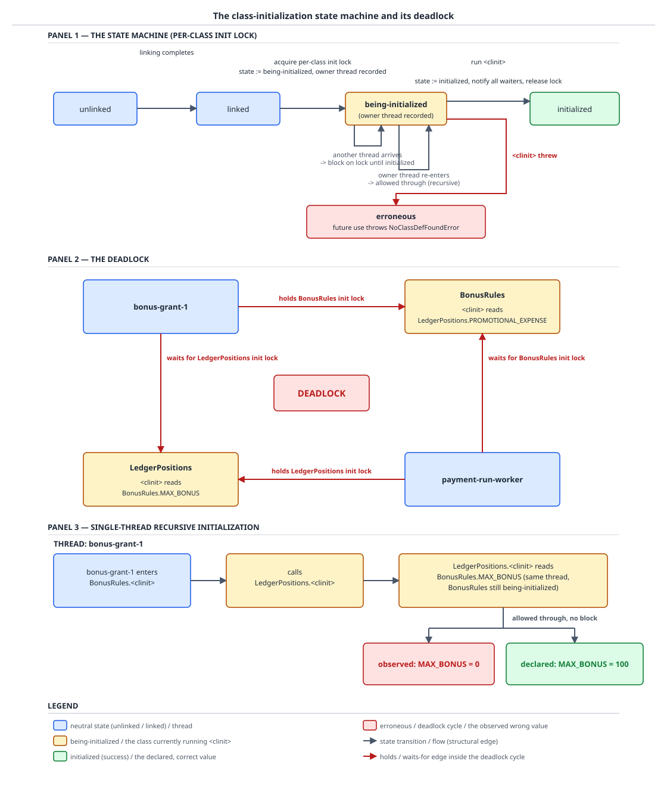

# 03 Java Core — Class-initialization locking and failure — INTERNALS (§3.6, 3.6.7–3.6.10)

**Target version: Java 21 LTS.** | **Part 3 of 5** | [Index](../00-index.md)
Previous: [Loading, linking and the initialization method](03-internals-class-loading-and-init.md) · Next: [Class loaders, identity and startup cost](03b-internals-class-loaders-and-identity.md)

JVMS 21 §5.5 does not describe class initialization in prose; it writes it out as a twelve-step algorithm with a named lock, a state field with four documented values, and separate rules for the thread that owns the initialization and every thread that does not. Every surprising thing about static initialisers is a consequence of that algorithm read literally: why 64 threads behind a slow `<clinit>` all pay the full cost and none can be interrupted out of it, why two classes that name each other deadlock permanently under two threads and silently return zeros under one, why an `OutOfMemoryError` from a static block is *not* wrapped in `ExceptionInInitializerError`, and why the second use of a broken class reports a `NoClassDefFoundError` whose message misdirects every engineer who reads it toward the classpath. The mechanics half — the three phases, `<clinit>` as a class-file artifact, the six triggers, and constant inlining — is [Loading, linking and the initialization method](03-internals-class-loading-and-init.md).

## 1. The per-class lock, the state machine, and the exactly-once guarantee (3.6.7)

Picture a turnstile in front of every class, with a state light above it. The first thread through flips the light to "being initialized by me", records its own identity, and walks in. Every *other* thread that reaches the turnstile waits — not spinning, genuinely blocked, and not interruptibly — until the light turns green. The thread that flipped the light, and only that thread, may walk back through the turnstile again while it is still amber, without waiting. Everything surprising in this file is a consequence of those two asymmetric rules.

### Why it exists

`BonusRules.<clinit>` builds an `EnumMap` and a `BigDecimal`, and its bytecode — walked instruction by instruction in `03-internals-class-loading-and-init.md` — does `putstatic ELIGIBLE` at offset 21 and then three `Map.put` calls at offsets 24 through 68. If two of QuizStakes' 1200-per-second stake-reservation threads both ran it, `ELIGIBLE` would be assigned twice and one of the two maps would be garbage before anyone read it; far worse, a thread could observe `ELIGIBLE` non-null but **half-populated**, because the field is published at offset 21 and the entries only arrive afterwards. Static initialisers are ordinary code with no synchronization in them, and the platform promises them single-threaded, exactly-once execution so that authors never have to write that synchronization themselves. That promise needs a lock the language does not expose.

### The mechanism

`[SOURCE]` JVMS 21 §5.5 names the lock and immediately declines to say what it is, verbatim:

> For each class or interface C, there is a unique initialization lock LC. The mapping from C to LC is left to the discretion of the Java Virtual Machine implementation. For example, LC could be the `Class` object for C, or the monitor associated with that `Class` object.

"Left to the discretion" is a real constraint on what you may assume, and it is the subject of this file's fourth pitfall. A JVM is free to use an entirely separate lock table; the `Class` object's monitor is named only as one permitted example.

The four states, in the specification's own words, verbatim:

> It assumes that the `Class` object has already been verified and prepared, and that the `Class` object contains state that indicates one of four situations:
> - This `Class` object is verified and prepared but not initialized.
> - This `Class` object is being initialized by some particular thread.
> - This `Class` object is fully initialized and ready for use.
> - This `Class` object is in an erroneous state, perhaps because initialization was attempted and failed.

`[SOURCE]` HotSpot implements those four as a six-value enum, because it also needs the two pre-link states the spec's list assumes away. Verbatim from `src/hotspot/share/oops/instanceKlass.hpp`, jdk21u:

```
  enum ClassState : u1 {
    allocated,                          // allocated (but not yet linked)
    loaded,                             // loaded and inserted in class hierarchy (but not linked yet)
    linked,                             // successfully linked/verified (but not initialized yet)
    being_initialized,                  // currently running class initializer
    fully_initialized,                  // initialized (successful final state)
    initialization_error                // error happened during initialization
  };
```

Reading it against the spec: `linked` is the spec's "verified and prepared but not initialized"; `being_initialized` is "being initialized by some particular thread"; `fully_initialized` is "fully initialized and ready for use"; `initialization_error` is "in an erroneous state". The two extra values, `allocated` and `loaded`, cover the loading phase that §5.5's list starts after. The enum is `u1` — one byte per class, which is worth noticing because it means the *diagnostic* payload for a failed initialization cannot live here; section 3 finds where it does live.

The procedure itself, the twelve steps of JVMS 21 §5.5:

| Step | What it does | Consequence |
|---|---|---|
| 1 | Synchronize on LC, waiting until the current thread can acquire it | The serialization point |
| 2 | If in progress **by another thread**: release LC, block until told the initialization completed, then repeat the procedure | Other threads wait, uninterruptibly |
| 3 | If in progress **by the current thread**: this is a recursive request — release LC and complete normally | Leaf 3.6.9, section 2 |
| 4 | If already initialized: release LC, complete normally | The steady-state path |
| 5 | If erroneous: release LC, throw `NoClassDefFoundError` | Leaf 3.6.10's second half |
| 6 | Record in-progress-by-current-thread, release LC, then set each `final static` field from its `ConstantValue` attribute in `ClassFile` order | `03-internals-class-loading-and-init.md` §1 |
| 7 | If C is a class: recursively run this whole procedure for the superclass, then for every superinterface declaring a non-`abstract`, non-`static` method. On abrupt completion, mark C erroneous, notify waiters, rethrow the same exception | Trigger bullets 4 and 5 |
| 8 | Determine whether assertions are enabled for C by querying its defining loader | Assertion status frozen here |
| 9 | Execute the class or interface initialization method of C | `<clinit>` runs |
| 10 | On normal completion: acquire LC, mark fully initialized, notify all waiters, release LC | Unblocks step 2's waiters |
| 11 | On abrupt completion by exception E: if E is not `Error` or a subclass, wrap it in `ExceptionInInitializerError` | Leaf 3.6.10's first half |
| 12 | Acquire LC, mark erroneous, notify all waiters, release LC, complete abruptly with E or its replacement | The permanent poisoning |

The three steps that carry the most weight, verbatim:

> - If the `Class` object for C indicates that initialization is in progress for C by some other thread, then release LC and block the current thread until informed that the in-progress initialization has completed, at which time repeat this procedure. Thread interrupt status is unaffected by execution of the initialization procedure.
> - If the `Class` object for C indicates that initialization is in progress for C by the current thread, then this must be a recursive request for initialization. Release LC and complete normally.
> - If the `Class` object for C is in an erroneous state, then initialization is not possible. Release LC and throw a `NoClassDefFoundError`.

Note "Thread interrupt status is unaffected by execution of the initialization procedure" in step 2. You cannot interrupt a thread out of a class-initialization wait. If a `<clinit>` calls the QuizStakes identity vendor, whose p50 is 900 ms and p99 is **38 seconds** against a 600-per-minute estate-wide cap, every thread waiting behind it is stuck for the full 38 seconds and `Thread.interrupt()` will not free them. Your own timeouts, cancellation and circuit breakers all sit *above* this lock and cannot reach into it.



**D-108** panel 1 draws the spine `unlinked -> linked -> being-initialized -> initialized`, with `erroneous` hanging below `being-initialized` on the `<clinit>` threw edge, transitions labelled with the lock operations, and the two self-transitions on `being-initialized` that are steps 2 and 3. The panel's working names map onto the spec's four descriptions and HotSpot's enum as follows: `unlinked` covers HotSpot's `allocated` and `loaded` (the spec's §5.5 procedure does not name them, because it assumes verification and preparation are done); `linked` is the spec's "verified and prepared but not initialized"; `being-initialized` is `being_initialized`; `initialized` is `fully_initialized`; `erroneous` is `initialization_error`. Panels 2 and 3 are section 2's two stories.

`[PROVE]` Prove the exactly-once guarantee costs one `<clinit>` execution and not N, and that the waiters really block rather than each running their own copy. `ScreeningRules.<clinit>` is made to take a measurable, fixed 3000 ms — standing in for the watchlist provider's p50 of 1.4 s and p99 of 25 s — and 64 threads named `stake-reservation-1` through `stake-reservation-64` are started simultaneously, each doing nothing but reading one static field and asserting it is published:

```java
final class ScreeningRules {
    static final java.math.BigDecimal WATCHLIST_THRESHOLD;

    static {
        try {
            Thread.sleep(3000); // stands in for the watchlist provider call
        } catch (InterruptedException interrupted) {
            Thread.currentThread().interrupt();
        }
        WATCHLIST_THRESHOLD = new java.math.BigDecimal("0.85");
    }

    private ScreeningRules() { }
}

public final class StakeReservationStorm {
    public static void main(String[] args) throws InterruptedException {
        int threads = 64;
        java.util.concurrent.CountDownLatch done = new java.util.concurrent.CountDownLatch(threads);
        long start = System.nanoTime();
        for (int i = 1; i <= threads; i++) {
            new Thread(() -> {
                if (ScreeningRules.WATCHLIST_THRESHOLD == null) {
                    throw new AssertionError("observed an unpublished threshold");
                }
                done.countDown();
            }, "stake-reservation-" + i).start();
        }
        done.await();
        System.out.printf("all %d threads through in %d ms%n",
                threads, (System.nanoTime() - start) / 1_000_000);
    }
}
```

Measured, Oracle JDK 21.0.7, macOS aarch64:

```
all 64 threads through in 3025 ms
```

Work the counterfactuals against that number, because the elapsed time alone proves less than it looks. If each thread ran its own `<clinit>`, the 64 sleeps would be concurrent and the total would *still* be roughly 3000 ms — so 3025 ms does not by itself distinguish "one execution, 63 waiters" from "64 concurrent executions". Two other observations do. First, `WATCHLIST_THRESHOLD` is `static final` and assigned exactly once in `<clinit>`; 64 executions would be 64 writes to a `final` field, which the JVM does not permit outside the initialization procedure. Second, and decisively: **not one of the 64 threads returned before 3000 ms**, and the in-body assertion never fired. Had the waiters been allowed to proceed while the initializer slept, the first threads would have returned in single-digit milliseconds having read `null`, and the `AssertionError` would have been thrown 63 times. It was thrown zero times. That is the guarantee — no thread observes a partially-initialized class, and every thread that arrives during initialization pays the full remaining cost of it.

**Interview:** the shape of that measurement is a better answer than the number. Asked "what happens when many threads hit a slow static initialiser", the strong answer names the step ("step 2 of the JVMS 5.5 procedure: release LC, block until notified, then repeat the procedure"), states the cost ("all of them pay the full remaining `<clinit>` duration, and 3025 ms for 64 threads behind a 3000 ms initialiser is 3000 plus thread-start overhead, with no fast path for anyone"), and lands the part interviewers rarely hear: "and the same step says thread interrupt status is unaffected, so you cannot time out or cancel your way out of it."

`[PROVE]` `[X-REF 05]` The happens-before claim, self-contained. Step 6 acquires and releases LC before `<clinit>` runs; step 10 re-acquires LC, marks the class fully initialized, notifies all waiters, and releases LC. A waiting thread in step 2 blocked on LC and, on being notified, re-acquires LC and repeats the procedure, reaching step 4. So every waiter's read of `WATCHLIST_THRESHOLD` is ordered after an acquire of LC, which is ordered after the release of LC in step 10, which is ordered after every write `<clinit>` performed. That is a lock release/acquire pair, and JLS §17.4.5 makes an unlock happen-before every subsequent lock of the same monitor — so all of `<clinit>`'s writes are visible to every thread that goes through the procedure, with no `volatile` on the fields and no barrier you write. This is exactly why lazy-singleton idioms built on class initialization need no memory-model reasoning from their authors. Memory-model foundations, the full happens-before catalogue and general deadlock diagnosis are guide **05 Concurrency**.

`[PROVE]` And the cost on the steady-state path, which is the question an interviewer actually asks: does every one of QuizStakes' 2.8M daily `getstatic` reads pay a lock acquisition? JVMS 21 §5.5 grants an explicit permission, verbatim:

> A Java Virtual Machine implementation may optimize this procedure by eliding the lock acquisition in step 1 (and release in step 4/5) when it can determine that the initialization of the class has already completed, provided that, in terms of the Java memory model, all happens-before orderings (JLS §17.4.5) that would exist if the lock were acquired, still exist when the optimization is performed.

Read that as exactly what it is: a **permission granted to the implementation**, with a proviso. It says a JVM *may* skip the lock once initialization has completed, but only if the happens-before edges survive. It does not say any JVM does. **Unverified:** whether HotSpot on JDK 21 actually elides the step-1 acquisition for an already-initialized class was not measured here; the JIT's usual treatment of a `getstatic` on an initialized class is to emit a plain load with no barrier, which would only be sound under this permission, but that is inference rather than measurement. Recorded in Open questions. What is safe to assert: the *specification* is written so that the exactly-once check need not cost anything after the first use, and any claim that it costs a lock per access on a real JVM should be treated as folklore until someone measures it.

**Insight:** procedure step 8 — "determine whether assertions are enabled for C by querying its defining loader" — runs once, at initialization. A class's assertion status is therefore frozen the moment the class initializes, which is why toggling `-ea` cannot change the behaviour of an already-initialized class, and why `Class.desiredAssertionStatus()` is a load-time question rather than a call-time one.

> Initialization is serialized by a per-class lock whose identity the specification deliberately leaves to the implementation, guarded by a state field with four documented values; the first arriving thread runs `<clinit>` while every other arriving thread blocks uninterruptibly, and the lock release that publishes the initialized state supplies the happens-before edge that makes every write `<clinit>` performed visible to all of them.

## 2. The deadlock across two threads, and its silent twin inside one (3.6.8, 3.6.9)

One picture, two readings. Two classes whose static initialisers each read a field of the other. Across two threads, both land in step 2 and wait on each other forever. Inside one thread, step 3 lets the re-entry through and it reads a zero. **Same cycle. Same two classes. Same bytecode. The number of threads decides whether you get a hang or a wrong number, and the wrong number is worse, because nothing anywhere reports it.**

### Why it exists

Neither behaviour is a bug in the JVM; both are the procedure doing exactly what it says. Step 2 must block, or a thread could observe a half-run `<clinit>` — the very thing section 1 exists to prevent. Step 3 must let the owner through, or *every* class whose static initialiser calls one of its own static methods that touches its own static fields — a large fraction of all static initialisers — would deadlock against itself immediately. Both rules are forced, and their combination is what produces the asymmetry.

### The mechanism

The cycle in the QuizStakes domain, using the fields D-108 names. `BonusGrantRules.<clinit>` mirrors `LedgerPositions.PROMOTIONAL_EXPENSE_BUDGET`; `LedgerPositions.<clinit>` mirrors `BonusGrantRules.GRANT_CAP`.

**The field choice is the whole trick, and D-108 draws it slightly wrong on purpose.** The diagram's cross-reference is on `MAX_BONUS`, and `static final int MAX_BONUS = 100` is a **constant variable** under JLS §4.12.4 — so `javac` inlines every read of it and emits no `getstatic` at all, so nothing triggers either class's initialization, so the cycle as drawn **does not form**. That is not a flaw to paper over; it is the sharpest available demonstration of leaf 3.6.6, and the bytecode diff proving it lives with that leaf in `03-internals-class-loading-and-init.md` §3, which shows the reader's `<clinit>` compiling to `12: bipush 100` / `14: putstatic CAP_MIRROR:I` where the `getstatic` would have been, and the same two-thread program below completing cleanly instead of hanging. The one-line summary to carry: **a deadlock a type change can delete is a deadlock that lives in the bytecode, not the source.** The cycle exists only if both mirrored reads compile to real `getstatic` instructions, which means both fields must be non-constant. `static final BigDecimal GRANT_CAP = new BigDecimal("100.00")` qualifies: `BigDecimal` is neither primitive nor `String`, and `new` is not a constant expression.

```java
final class BonusGrantRules {
    static final java.math.BigDecimal GRANT_CAP = new java.math.BigDecimal("100.00");
    static final java.math.BigDecimal PROMO_MIRROR;

    static {
        PROMO_MIRROR = LedgerPositions.PROMOTIONAL_EXPENSE_BUDGET; // getstatic — triggers LedgerPositions
    }

    private BonusGrantRules() { }
}

final class LedgerPositions {
    static final java.math.BigDecimal PROMOTIONAL_EXPENSE_BUDGET = new java.math.BigDecimal("250000.00");
    static final java.math.BigDecimal CAP_MIRROR;

    static {
        CAP_MIRROR = BonusGrantRules.GRANT_CAP; // getstatic — triggers BonusGrantRules
    }

    private LedgerPositions() { }
}

public final class InitDeadlock {
    static Thread racer(String name, java.util.concurrent.CountDownLatch ready,
                        java.util.function.Supplier<Object> read) {
        return new Thread(() -> {
            ready.countDown();
            try {
                ready.await();
            } catch (InterruptedException interrupted) {
                Thread.currentThread().interrupt();
                return;
            }
            System.out.println(name + " saw " + read.get());
        }, name);
    }

    public static void main(String[] args) throws InterruptedException {
        var ready = new java.util.concurrent.CountDownLatch(2);
        Thread bonusGrant1 = racer("bonus-grant-1", ready, () -> BonusGrantRules.PROMO_MIRROR);
        Thread paymentRunWorker = racer("payment-run-worker", ready, () -> LedgerPositions.CAP_MIRROR);
        bonusGrant1.start();
        paymentRunWorker.start();
        bonusGrant1.join(4000);
        paymentRunWorker.join(4000);
        System.out.println("bonus-grant-1 alive after 4s: " + bonusGrant1.isAlive());
        System.out.println("payment-run-worker alive after 4s: " + paymentRunWorker.isAlive());
        System.out.println("bonus-grant-1 state: " + bonusGrant1.getState());
        System.out.println("payment-run-worker state: " + paymentRunWorker.getState());
        System.exit(1);
    }
}
```

`[TRAP]` `[RESEARCH]` `[PROVE]` Measured, Oracle JDK 21.0.7 — the `join(4000)` calls both time out and the JVM has to be killed:

```
bonus-grant-1 alive after 4s: true
payment-run-worker alive after 4s: true
bonus-grant-1 state: RUNNABLE
payment-run-worker state: RUNNABLE
```

And the thread dump. To take it, the same two classes were driven by a variant whose `main` starts both threads and then parks — the class named `Hang` in the frames below — so that `jstack` could attach to a live, hung process. Verbatim `jstack` output for the two threads, unedited:

```
"bonus-grant-1" #20 [29443] prio=5 os_prio=31 cpu=0.74ms elapsed=5.23s tid=0x0000000157810c00 nid=29443 in Object.wait()  [0x0000000171c86000]
   java.lang.Thread.State: RUNNABLE
	at BonusGrantRules.<clinit>(InitDeadlock.java:8)
	- waiting on the Class initialization monitor for LedgerPositions
	at Hang.lambda$main$0(Hang.java:3)
	at Hang$$Lambda/0x000000f8010009f8.run(Unknown Source)
	at java.lang.Thread.runWith(java.base@21.0.7/Thread.java:1596)
	at java.lang.Thread.run(java.base@21.0.7/Thread.java:1583)

"payment-run-worker" #21 [25091] prio=5 os_prio=31 cpu=0.21ms elapsed=5.23s tid=0x0000000157811400 nid=25091 in Object.wait()  [0x0000000171e92000]
   java.lang.Thread.State: RUNNABLE
	at LedgerPositions.<clinit>(InitDeadlock.java:16)
	- waiting on the Class initialization monitor for BonusGrantRules
	at Hang.lambda$main$1(Hang.java:4)
	at Hang$$Lambda/0x000000f801000c08.run(Unknown Source)
	at java.lang.Thread.runWith(java.base@21.0.7/Thread.java:1596)
	at java.lang.Thread.run(java.base@21.0.7/Thread.java:1583)
```

Five things in that dump are the whole diagnostic lesson.

1. **`- waiting on the Class initialization monitor for LedgerPositions`** is the tell, and it is the only one. That exact string, and its mirror on the other thread, names the cycle: `bonus-grant-1` holds `BonusGrantRules`' init lock and waits for `LedgerPositions`'; `payment-run-worker` holds `LedgerPositions`' and waits for `BonusGrantRules`'. A rectangular cycle of two, exactly as D-108 panel 2 draws it. Note *where* the annotation sits — attached beneath the `<clinit>` frame, in the position a `- waiting to lock <0x…>` line would occupy for an ordinary monitor, but with no lock identity printed because there is no Java object to name.
2. **`java.lang.Thread.State: RUNNABLE`**, and on the header line, simultaneously, `in Object.wait()`. The two contradict each other and both are printed. The Java-level thread state is not `BLOCKED` and not `WAITING`, because the class-init wait is not a Java monitor wait that the `Thread.State` machinery tracks. `Thread.getState()` will lie to any liveness probe or health check you build on it, and the `getState()` output in the measured run above confirms it: `RUNNABLE`, for both permanently hung threads.
3. **`cpu=0.74ms` and `cpu=0.21ms` against `elapsed=5.23s`.** The threads are consuming no CPU at all. This is what distinguishes the hang from a spin or an infinite loop, and it is the reason "RUNNABLE" is so misleading — a genuinely runnable thread accumulating 5 seconds of wall time would show CPU in the same order of magnitude.
4. **`jstack` printed no "Found one Java-level deadlock" section at all.** Its deadlock detector reasons about Java monitors and `AbstractOwnableSynchronizer` locks; a class-initialization cycle is neither, so the automated detector misses it entirely. Verified by grepping the full dump: the string `Found one Java-level deadlock` does not appear anywhere in it.
5. **The `Hang$$Lambda/0x000000f8010009f8.run(Unknown Source)` frame** is the runtime-spun lambda proxy class, and `Unknown Source` because it has no class file on disk with line numbers. It is noise for this diagnosis, but it is worth recognising rather than chasing. The single-threaded twin. Same cycle, one thread. To make the observation visible, the mirroring read must come *before* the field the other class reads back is assigned — which is exactly the ordering a real static block falls into by accident, because `javac` concatenates in textual order:

```java
final class BonusGrantRules {
    static int grantsIssued;
    static final java.math.BigDecimal MIRRORED_BUDGET;

    static {
        MIRRORED_BUDGET = LedgerPositions.PROMOTIONAL_EXPENSE_BUDGET; // recursion into LedgerPositions
        grantsIssued = 100;                                           // not yet run when the read below happens
    }

    private BonusGrantRules() { }
}

final class LedgerPositions {
    static final java.math.BigDecimal PROMOTIONAL_EXPENSE_BUDGET;

    static {
        System.out.println("observed: BonusGrantRules.grantsIssued = " + BonusGrantRules.grantsIssued);
        PROMOTIONAL_EXPENSE_BUDGET = new java.math.BigDecimal("250000.00");
    }

    private LedgerPositions() { }
}

public final class RecursiveInit {
    public static void main(String[] args) {
        System.out.println("MIRRORED_BUDGET = " + BonusGrantRules.MIRRORED_BUDGET);
        System.out.println("declared: BonusGrantRules.grantsIssued = " + BonusGrantRules.grantsIssued);
    }
}
```

`[TRAP]` `[SOURCE]` `[RESEARCH]` `[PROVE]` Measured, Oracle JDK 21.0.7:

```
observed: BonusGrantRules.grantsIssued = 0
MIRRORED_BUDGET = 250000.00
declared: BonusGrantRules.grantsIssued = 100
```

Derive it from the procedure, step by step, and nothing is mysterious. `main`'s `getstatic BonusGrantRules.MIRRORED_BUDGET` triggers `BonusGrantRules` under §5.5's first bullet. Step 6 records in-progress-by-`main`, releases LC, sets no `ConstantValue` fields (neither field has one). Step 9 enters `BonusGrantRules.<clinit>`. Its first instruction is `getstatic LedgerPositions.PROMOTIONAL_EXPENSE_BUDGET`, which triggers `LedgerPositions`, so the whole procedure recurses on `LedgerPositions`; `main` acquires that class's lock and runs its `<clinit>`. That `<clinit>` executes `getstatic BonusGrantRules.grantsIssued`, which triggers `BonusGrantRules` — **again, on the same thread**. The procedure runs from step 1: acquire `BonusGrantRules`' LC, and step 3 fires:

> If the `Class` object for C indicates that initialization is in progress for C by the current thread, then this must be a recursive request for initialization. Release LC and complete normally.

"Complete normally." No block, no exception, no log line, no warning. The `getstatic` then proceeds against a class whose `<clinit>` is suspended at its first instruction — so `grantsIssued` still holds the preparation default from JVMS §5.4.2, and the read returns `0`. `LedgerPositions.<clinit>` finishes, `BonusGrantRules.<clinit>` resumes, assigns `grantsIssued = 100`, and the same field read from `main` afterwards returns `100`. **The class is not broken. The value was simply read during a window the language provides no way to detect.**

Line the two up, because the contrast is the sharpest thing in either of these files:

| | Two threads | One thread |
|---|---|---|
| Procedure step reached | step 2, on both threads | step 3 |
| Spec text | "release LC and block the current thread until informed that the in-progress initialization has completed" | "this must be a recursive request for initialization. Release LC and complete normally." |
| Outcome | permanent hang | proceeds, reads preparation defaults |
| Observable | threads alive forever; `- waiting on the Class initialization monitor for <Class>` | `0` where `100` was declared |
| `Thread.State` | `RUNNABLE` (misleading) | `RUNNABLE` (accurate) |
| CPU consumed | ~0 (measured `cpu=0.74ms` over `elapsed=5.23s`) | normal |
| Detected by `jstack` deadlock detector | no | not applicable |
| Reproduces in a single-threaded unit test | no | yes, but the test asserts the wrong value silently |
| Survives changing the mirrored field to a constant variable | no — the cycle evaporates | no — the cycle evaporates |

**Pitfall:** believing that two static initialisers referencing each other is "just an ordering question" that a passing test suite has settled. **Symptom:** every single-threaded test passes — because the single-threaded path takes step 3 and completes — and the service hangs the first time two request threads touch the two classes for the first time simultaneously, which on a 1200-per-second stake-reservation path is the first second after a deploy, and only after a deploy, never in staging. `Thread.State` reads `RUNNABLE`, CPU is flat, and `jstack`'s deadlock detector reports nothing. **Fix:** grep every `static { }` block and static field initialiser for reads of *other* classes' non-constant static fields, and break every cycle you find — either by moving the mirrored value into a third class that neither initialiser touches, or by making the read lazy behind a method call so it happens after both classes are fully initialized. The structural version of that fix, the holder-class idiom, is `01d-class-initialization-triggers.md` at BASICS depth and `03b-internals-class-loaders-and-identity.md` at INTERNALS depth.

**Pitfall:** assuming a `<clinit>` read of another class's static field always sees that field's initialised value. **Symptom:** a field visibly assigned `100` in the source reads as `0`, or a reference field reads `null`, exactly once per JVM, only during startup, and only when the initialization order happens to enter the cycle from one particular side — so the evidence is one anomalous value at 07:00 and clean data forever after, with the class working perfectly by the time anyone investigates. **Fix:** no static initialiser should read another class's mutable or reference-typed static state. If a value genuinely must be shared, expose it through a method (whose `invokestatic` forces full initialization of the owner before the value is computed) rather than reading the field directly, or compute it lazily on first use rather than at class-init time.

> A cycle between two classes' static initialisers deadlocks permanently when entered from two threads and silently returns preparation defaults when entered from one, and it exists at all only if the mirrored reads compile to real `getstatic` instructions.

## 3. `ExceptionInInitializerError`, then the erroneous state forever (3.6.10)

Picture the class as having one shot. `<clinit>` runs once. If it throws, the `Class` object is stamped `initialization_error` and stays that way for the JVM's whole life — no retry, no reset, no way back. The first thread to touch the class gets a reasonably informative error. Every later touch, from any thread, gets a *different* error whose message talks about not being able to *initialize* a class that the JVM has, in fact, already loaded perfectly well.

### Why it exists

A `<clinit>` may have run half its instructions before throwing — `GRANT_RATE` assigned, `ELIGIBLE` still `null`. There is no way to roll that back, and re-running `<clinit>` would double-apply whatever side effects the first half had (a file written, a connection opened, a counter incremented). The only sound option is to declare the class unusable and stay consistent about it forever. Two different exception types exist because the two situations genuinely differ: the first caller can be handed the actual cause, and every later caller is being told "this class is dead", which is a linkage-level fact rather than a runtime exception.

### The mechanism

`[SOURCE]` JVMS 21 §5.5, procedure step 11, verbatim — the clause almost everyone gets wrong is bolded:

> Otherwise, the class or interface initialization method must have completed abruptly by throwing some exception E. **If the class of E is not `Error` or one of its subclasses, then create a new instance of the class `ExceptionInInitializerError` with E as the argument, and use this object in place of E in the following step.** If a new instance of `ExceptionInInitializerError` cannot be created because an `OutOfMemoryError` occurs, then use an `OutOfMemoryError` object in place of E in the following step.

Read the condition literally. Wrapping happens **only if E is not an `Error` or a subclass**. A `RuntimeException`, a checked exception, anything under `Exception` — wrapped. An `OutOfMemoryError`, a `StackOverflowError`, a `LinkageError`, an `AssertionError`, a hand-thrown `Error` — **propagated unchanged**, straight to the caller, with no `ExceptionInInitializerError` anywhere in sight.

`[PROVE]` Measured, JDK 21.0.7. A `MoneyMath.<clinit>` that throws a `StackOverflowError`, caught at the trigger site:

```
threw: java.lang.StackOverflowError / cause=null
```

Not `ExceptionInInitializerError`. Not wrapped. `getCause()` is `null` because nothing wrapped it. Any `catch (ExceptionInInitializerError e)` written to handle "static initialiser failures" misses this case entirely — the first pitfall below works that through with the code and the output.

Now the full two-touch timeline. `BonusRules.<clinit>` reads a system property the deployment forgot to set:

```java
final class BonusRules {
    static final java.math.BigDecimal GRANT_RATE;

    static {
        GRANT_RATE = new java.math.BigDecimal(System.getProperty("quizstakes.grant.rate"));
    }

    private BonusRules() { }
}

public final class BonusGrantAttempts {
    public static void main(String[] args) {
        for (int attempt = 1; attempt <= 2; attempt++) {
            try {
                System.out.println(BonusRules.GRANT_RATE);
            } catch (Throwable failure) {
                System.out.println("attempt " + attempt + " threw " + failure.getClass().getName());
                System.out.println("  cause: " + failure.getCause());
                failure.printStackTrace(System.out);
            }
        }
    }
}
```

`[PROVE]` Measured, Oracle JDK 21.0.7, run with the property absent. Full output, both attempts, unedited (the harness classes in the run were named `BonusRulesE` and `Eiie`):

```
attempt 1 threw java.lang.ExceptionInInitializerError
  cause: java.lang.NullPointerException: Cannot invoke "String.toCharArray()" because "val" is null
java.lang.ExceptionInInitializerError
  at Eiie.main(Eiie.java:11)
Caused by: java.lang.NullPointerException: Cannot invoke "String.toCharArray()" because "val" is null
	at java.base/java.math.BigDecimal.<init>(BigDecimal.java:903)
	at BonusRulesE.<clinit>(Eiie.java:4)
	at Eiie.main(Eiie.java:11)
attempt 2 threw java.lang.NoClassDefFoundError
  cause: java.lang.ExceptionInInitializerError: Exception java.lang.NullPointerException [in thread "main"]
java.lang.NoClassDefFoundError: Could not initialize class BonusRulesE
  at Eiie.main(Eiie.java:11)
Caused by: java.lang.ExceptionInInitializerError: Exception java.lang.NullPointerException [in thread "main"]
	at java.base/java.math.BigDecimal.<init>(BigDecimal.java:903)
	at BonusRulesE.<clinit>(Eiie.java:4)
	at Eiie.main(Eiie.java:11)
```

Attempt 1 is steps 11 and 12: the `NullPointerException` is not an `Error`, so it is wrapped in `ExceptionInInitializerError`, the class is marked erroneous, all waiters are notified, and the wrapper propagates. Note that the wrapper's *own* stack trace shows only `at Eiie.main` — a single frame — while the useful `at BonusRulesE.<clinit>(Eiie.java:4)` frame lives on the **cause**. The wrapper was constructed at the point the procedure completed abruptly, in the trigger's frame; it never had a `<clinit>` frame of its own to record. Attempt 2 is step 5: the class is in an erroneous state, so the procedure throws `NoClassDefFoundError` before doing anything else — no lock work beyond acquiring and releasing LC, no `<clinit>`, no retry.

`[TRAP]` **The version trap, in three parts, because the classic telling of this story is stale on Java 21.**

1. **What used to be true.** Before JDK 18, the follow-up `NoClassDefFoundError` carried **no cause at all** — you got `Could not initialize class BonusRules` and nothing else, and the original exception was unrecoverable unless you happened to have logged it at the first failure. Every write-up of this trap from before 2022 says exactly that, and the syllabus leaf's own phrasing ("with no cause attached") is that pre-18 shape.
2. **What changed.** [JDK-8048190](https://bugs.openjdk.org/browse/JDK-8048190), "NoClassDefFoundError omits original ExceptionInInitializerError", fix version **18**, backported to **17.0.7, 11.0.19 and 8u341**. On a fixed JDK the `NoClassDefFoundError` carries a `Caused by:` holding a reconstructed `ExceptionInInitializerError` whose message names the original exception class and the first thread to touch the class: `Exception java.lang.NullPointerException [in thread "main"]`. The `[in thread "main"]` marker is the giveaway that this is a *reconstruction* recorded at first failure rather than the live object.
3. **The version boundary, measured across four JDKs on this machine**, one class file compiled at `--release 8` and run unchanged on each:

| JDK | `attempt 2` type | `getCause()` |
|---|---|---|
| 1.8.0_202 | `NoClassDefFoundError: Could not initialize class BonusRulesE` | `null` |
| 11.0.27 | `NoClassDefFoundError: Could not initialize class BonusRulesE` | `ExceptionInInitializerError: Exception java.lang.NullPointerException [in thread "main"]` |
| 17.0.15 | same as 11.0.27 | same as 11.0.27 |
| 21.0.7 | same as 11.0.27 | same as 11.0.27 |

8u202 predates the 8u341 backport and shows the old `null`-cause behaviour; 11.0.27 is past 11.0.19 and shows the fix. So the answer to "does `NoClassDefFoundError` tell you why?" on Java 21 is **yes**, and an interviewer expecting "no" is remembering a real fact about a JDK you are not running.

`[SOURCE]` The HotSpot mechanism behind that reconstruction, verified against `src/hotspot/share/oops/instanceKlass.cpp` in jdk21u:

```
static InitializationErrorTable* _initialization_error_table;

void InstanceKlass::add_initialization_error(JavaThread* current, Handle exception) {
  Handle init_error = java_lang_Throwable::create_initialization_error(current, exception);
  MutexLocker ml(THREAD, ClassInitError_lock);
  if (_initialization_error_table == nullptr) {
    _initialization_error_table = new (mtClass) InitializationErrorTable();
  }
  _initialization_error_table->put_if_absent(this, elem, &created);
}
```

Line by line. `_initialization_error_table` is a process-wide side table keyed by `InstanceKlass`, **not** a field on the class — which is exactly why the erroneous state itself can be a one-byte `ClassState` enum value while the diagnostic payload lives elsewhere. `create_initialization_error` builds the reconstructed throwable, including the `[in thread "<name>"]` marker, from the live exception at the moment of failure — this is the line that JDK-8048190 added. `MutexLocker ml(THREAD, ClassInitError_lock)` guards the table with a dedicated VM mutex, separate from any class-init lock, so recording an error cannot contend with initialization itself. `put_if_absent` means the **first** failure's error is recorded and later ones do not overwrite it, consistent with a class only ever failing once. The read side is `InstanceKlass::get_initialization_error`, called at `instanceKlass.cpp:1117` to attach the cause when the `NoClassDefFoundError` is constructed; `add_initialization_error` is called at lines 1162 and 1209, each immediately followed by `set_initialization_state_and_notify(initialization_error, THREAD)` — steps 11 and 12 of the specification, in the two places the procedure can complete abruptly (superclass initialization failure at step 7, and `<clinit>` failure at step 9).

`[X-REF 06]` The exception machinery itself — how `fillInStackTrace` walks frames, why a stack trace costs what it costs, and why the `ExceptionInInitializerError` wrapper's own trace is one frame while its cause's is three — is `../exceptions/03-internals-exception-mechanics.md`. Heap dumps, JFR event streams and loader-level tracing are guide **06 JVM internals**.

> A `<clinit>` that throws marks its class permanently erroneous: the throwing exception reaches the first caller wrapped in `ExceptionInInitializerError` unless it is already an `Error`, and every subsequent use from any thread for the rest of the JVM's life gets a `NoClassDefFoundError` whose message says *initialize*, not *find*.

## Pitfalls

### Believing `ExceptionInInitializerError` wraps every `<clinit>` failure

**Wrong**

```java
public final class BonusServiceBootstrap {
    static java.math.BigDecimal load() {
        try {
            return MoneyMath.roundingScaleAsRate();
        } catch (ExceptionInInitializerError failed) {
            // "This catches anything MoneyMath's static initialiser can throw."
            return java.math.BigDecimal.ZERO;
        }
    }
}

final class MoneyMath {
    static final int SCALE;

    static {
        // javac rejects a static block that cannot complete normally, hence the guard.
        if (Boolean.parseBoolean("true")) {
            throw new StackOverflowError("simulated deep recursion in MoneyMath.<clinit>");
        }
        SCALE = 2;
    }

    static java.math.BigDecimal roundingScaleAsRate() {
        return java.math.BigDecimal.valueOf(SCALE);
    }

    private MoneyMath() { }
}
```

Measured on JDK 21.0.7 — the `catch` never fires and the `StackOverflowError` escapes `load()` entirely:

```
Exception in thread "main" java.lang.StackOverflowError: simulated deep recursion in MoneyMath.<clinit>
	at MoneyMath.<clinit>(BonusServiceBootstrap.java:18)
	at BonusServiceBootstrap.load(BonusServiceBootstrap.java:4)
	at Run.main(Run.java:1)
```

**Right**

```java
public final class BonusServiceBootstrap {
    static java.math.BigDecimal load() {
        try {
            return MoneyMath.roundingScaleAsRate();
        } catch (ExceptionInInitializerError wrapped) {
            // Non-Error causes arrive here, wrapped per JVMS 5.5 step 11.
            return java.math.BigDecimal.ZERO;
        } catch (Error raw) {
            // Errors thrown from <clinit> arrive unchanged, with getCause() == null.
            // A fallback value cannot honestly paper over an OutOfMemoryError or a
            // LinkageError, so rethrow rather than swallow.
            throw raw;
        }
    }
}
```

JVMS 5.5 step 11 wraps only "if the class of E is **not** `Error` or one of its subclasses". An `OutOfMemoryError`, `StackOverflowError`, `AssertionError` or `LinkageError` out of a static initialiser reaches the caller as itself, with `getCause()` returning `null` because nothing wrapped it. Note that the class is still marked erroneous at step 12 either way, so the *second* touch produces `NoClassDefFoundError` identically in both the wrapped and unwrapped cases.

**Why people believe it:** the class name says "exception in initializer", and every tutorial example throws a `RuntimeException` from the static block, which does get wrapped. The `Error` carve-out is one bolded clause in one step of a twelve-step procedure and never appears in a worked example.

### `NoClassDefFoundError` meaning a missing jar

**Wrong**

```java
// Log line: java.lang.NoClassDefFoundError: Could not initialize class BonusRules
// Response: check the classpath.
//   mvn dependency:tree | grep bonus-rules      -> present
//   unzip -l app.jar | grep BonusRules.class    -> present
//   diff the shaded jar against staging          -> identical
//   -verbose:class | grep BonusRules             -> "[Loaded BonusRules from file:…]"
// Four hours later, the class was never missing.
```

The surprise: on the *first* touch the JVM threw `ExceptionInInitializerError` with the real cause attached, and that line is earlier in the log, probably under a different request id and possibly on a different thread. Everything after is step 5 of the §5.5 procedure reporting a class it has already loaded, verified and prepared, and merely refuses to initialize again. The `-verbose:class` line above is the cruellest part of the investigation: it confirms loading succeeded, which reads as evidence *against* the very hypothesis that is correct.

**Right**

```java
public final class BonusGrantHandler {
    private static final java.lang.System.Logger LOG =
            java.lang.System.getLogger(BonusGrantHandler.class.getName());

    java.math.BigDecimal grantRate() {
        try {
            return BonusRules.GRANT_RATE;
        } catch (NoClassDefFoundError erroneous) {
            // The message says "Could not initialize", not a bare class name: this is
            // a permanently erroneous class, not a lookup failure. On JDK 18+/17.0.7+/
            // 11.0.19+/8u341+ the cause names the original failure and the first thread.
            LOG.log(java.lang.System.Logger.Level.ERROR,
                    "BonusRules is permanently erroneous for the life of this JVM",
                    erroneous.getCause());
            throw erroneous;
        }
    }
}
```

The diagnosis workflow, in order. (a) Read the message shape: `Could not initialize class X` is §5.5 step 5, an initialization failure; a bare `com/quizstakes/BonusRules` is a genuine definition-not-found, which is `03b-internals-class-loaders-and-identity.md`'s `ClassNotFoundException`-versus-`NoClassDefFoundError` territory. (b) Read `getCause()` — on JDK 18+, 17.0.7+, 11.0.19+ or 8u341+ it holds the reconstructed error naming the original exception and the first thread to touch the class. (c) If the cause is `null` (an older JDK), find the **chronologically first** occurrence in the logs; that one carried the real `ExceptionInInitializerError` with the real cause, and every later line is an echo. (d) Confirm with `-Xlog:class+init=info` that the class reached initialization at all; do **not** reach for `-verbose:class` or `-Xlog:class+load`, which log loading only and will show the class loading cleanly.

**Why people believe it:** `NoClassDefFoundError`'s own javadoc describes a loading failure — "Thrown if the Java Virtual Machine or a `ClassLoader` instance tries to load in the definition of a class […] and no definition of the class could be found" — and says nothing about initialization. The specification reuses the type for a case its own javadoc does not describe.

### Two static initialisers that cross-reference, because the tests pass

**Wrong**

```java
final class BonusGrantRules {
    static final java.math.BigDecimal GRANT_CAP = new java.math.BigDecimal("100.00");
    static final java.math.BigDecimal PROMO_MIRROR = LedgerPositions.PROMOTIONAL_EXPENSE_BUDGET;

    private BonusGrantRules() { }
}

final class LedgerPositions {
    static final java.math.BigDecimal PROMOTIONAL_EXPENSE_BUDGET = new java.math.BigDecimal("250000.00");
    static final java.math.BigDecimal CAP_MIRROR = BonusGrantRules.GRANT_CAP;

    private LedgerPositions() { }
}
```

Every single-threaded test passes: whichever class is touched first takes step 3 on the re-entry and completes normally. Under two threads touching the two classes simultaneously, measured on JDK 21.0.7, both threads hang forever, `Thread.getState()` reports `RUNNABLE` for both, CPU sits at under a millisecond against five seconds elapsed, `jstack` prints no Java-level deadlock section, and the only signal is `- waiting on the Class initialization monitor for LedgerPositions` buried mid-stack.

**Right**

```java
// Neither class's <clinit> reads the other's state. The shared values live in a
// third class that depends on nothing, so the dependency graph is a tree and
// steps 2 and 3 can never form a cycle.
final class PromotionalBudget {
    static final java.math.BigDecimal PROMOTIONAL_EXPENSE_BUDGET = new java.math.BigDecimal("250000.00");
    static final java.math.BigDecimal GRANT_CAP = new java.math.BigDecimal("100.00");

    private PromotionalBudget() { }
}

final class BonusGrantRules {
    static final java.math.BigDecimal PROMO_MIRROR = PromotionalBudget.PROMOTIONAL_EXPENSE_BUDGET;

    private BonusGrantRules() { }
}

final class LedgerPositions {
    static final java.math.BigDecimal CAP_MIRROR = PromotionalBudget.GRANT_CAP;

    private LedgerPositions() { }
}
```

The guarantee is structural, not probabilistic — there is no interleaving that produces a cycle, because there is no cycle in the graph. A second, narrower fix exists and is worth knowing for the insight rather than the ergonomics: making both mirrored fields constant variables (`static final int`) deletes the `getstatic` instructions and therefore the cycle, measured and dumped in `03-internals-class-loading-and-init.md` §3. It is a worse fix in practice, because it changes the fields' types and re-introduces the stale-constant deploy hazard, but it proves where the deadlock actually lives.

**Why people believe it:** step 3's recursive-request rule means the single-threaded case *works*, and works deterministically, so the code is not merely lucky in tests — it is correct in tests, every time, on every machine. The failure needs concurrency that only production supplies.

### Believing `synchronized (BonusRules.class)` interacts with the class-init lock

**Wrong**

```java
public final class BonusGrantCoordinator {
    static java.math.BigDecimal rateUnderClassLock() {
        // "Holding the Class object's monitor serialises against class initialization,
        //  so this guarantees I never see a half-initialized BonusRules."
        synchronized (BonusRules.class) {
            return BonusRules.GRANT_RATE;
        }
    }
}
```

The surprise: JVMS 5.5 says the mapping from a class C to its initialization lock LC "is left to the discretion of the Java Virtual Machine implementation", and names the `Class` object's monitor only as *one example* of what LC could be. Nothing in the specification says the two are the same lock, so this `synchronized` block provides no documented ordering against initialization at all — and on any JVM where LC is a private lock-table entry, it provides none in fact either. It is also worse than useless: holding a monitor that the initialization procedure may also want is a straightforward way to add a real, `jstack`-visible deadlock on top of the invisible one, and unlike the class-init deadlock this one *will* be flagged by `jstack`'s detector, which makes the diagnosis look like a plain lock-ordering bug and hides the actual cause.

**Right**

```java
public final class BonusGrantCoordinator {
    // The JVM already guarantees exactly-once, fully-published initialization for
    // BonusRules per JVMS 5.5 steps 1-10, with the happens-before edge supplied by
    // step 10's release of LC paired with the acquire this thread performs at step 1
    // (JLS 17.4.5). Reading the field is sufficient and complete; no user-level lock
    // can add to it.
    static java.math.BigDecimal rate() {
        return BonusRules.GRANT_RATE;
    }
}
```

Class initialization is already the strongest lazy-initialization primitive the platform offers: exactly-once, thread-safe, lock-free on the steady-state path (as far as the specification's elision permission allows), and requiring no annotation or memory-model reasoning from the author. A user-level lock layered on top can only subtract. What `synchronized` actually locks, and the `ACC_SYNCHRONIZED` flag and monitor instructions behind it, are `02a-access-and-other-modifiers.md`.

**Why people believe it:** the specification's own example sentence — "LC could be the `Class` object for C, or the monitor associated with that `Class` object" — reads like a description of what happens rather than an illustration of what is permitted, and HotSpot's `jstack` wording, `waiting on the Class initialization monitor for LedgerPositions`, actively reinforces it by using the word "monitor". The word "could" is doing all the work in that sentence.

## Cheat sheet

| Item | Value |
|---|---|
| The lock | "For each class or interface C, there is a unique initialization lock LC" |
| LC identity | "left to the discretion of the Java Virtual Machine implementation" — the `Class` object's monitor is one *example*, not the contract |
| `synchronized (X.class)` | no documented interaction with initialization; can add a real, detector-visible deadlock |
| Spec's four `Class` states | verified-and-prepared-not-initialized · being-initialized-by-a-thread · fully-initialized · erroneous |
| HotSpot `ClassState` (`instanceKlass.hpp`, `u1`) | `allocated`, `loaded`, `linked`, `being_initialized`, `fully_initialized`, `initialization_error` |
| Step 1 | synchronize on LC — the serialization point |
| Step 2 (other thread) | release LC, block until notified, then **repeat the procedure**; "Thread interrupt status is unaffected" |
| Step 3 (same thread) | "recursive request" — release LC and **complete normally**; the read sees preparation defaults |
| Step 4 (initialized) | release LC, complete normally — the steady-state path |
| Step 5 (erroneous) | release LC and throw `NoClassDefFoundError` |
| Step 6 | record in-progress, release LC, set `ConstantValue` fields in `ClassFile` order |
| Step 7 | recurse into superclass, then superinterfaces declaring a non-abstract non-static method |
| Step 8 | assertion status queried from the defining loader — **frozen at initialization**, so `-ea` cannot affect an initialized class |
| Step 9 | execute `<clinit>` |
| Step 10 | acquire LC, mark fully initialized, notify all waiters, release LC |
| Step 11 | wrap in `ExceptionInInitializerError` **only if E is not `Error` or a subclass** |
| Step 12 | acquire LC, mark erroneous, notify all waiters, release LC, complete abruptly |
| Lock elision | JVMS grants **permission** to elide step 1's acquisition once initialized, if all happens-before orderings survive — a permission, not observed behaviour |
| Happens-before | step 10's LC release / a later thread's LC acquire ⇒ all `<clinit>` writes visible, no `volatile` needed (JLS §17.4.5) |
| Exactly-once, measured | 64 threads behind a 3000 ms `<clinit>` → all through in **3025 ms**, none early, the unpublished-value assertion fired **0** times |
| Interruptibility | none — you cannot interrupt a thread out of a class-init wait |
| Real cost in the domain | identity vendor p99 **38 s**, watchlist provider p99 **25 s**; a `<clinit>` calling either stalls every arriving request for the full p99 |
| Deadlock, measured | 2 threads, 2 mirrored non-constant `static final BigDecimal` fields → permanent hang |
| Deadlock tell in `jstack` | `- waiting on the Class initialization monitor for <Class>`, beneath the `<clinit>` frame, with no lock identity printed |
| `Thread.State` during the deadlock | `RUNNABLE` — not `BLOCKED`, not `WAITING`; header simultaneously says `in Object.wait()` |
| CPU during the deadlock, measured | `cpu=0.74ms` / `cpu=0.21ms` against `elapsed=5.23s` — flat |
| `jstack` deadlock detector | prints **no** "Found one Java-level deadlock" section — verified absent |
| Recursive read, measured | `observed: grantsIssued = 0` beside `declared: grantsIssued = 100` |
| Same cycle with a constant field | evaporates — `bipush` replaces `getstatic`, so one arm has no instruction (`03-internals-class-loading-and-init.md` §3) |
| First failure | `ExceptionInInitializerError`; the wrapper's own trace is **one frame** (built after `<clinit>`'s frame was popped), the useful `<clinit>` frame is on the **cause** |
| Every later failure | `NoClassDefFoundError: Could not initialize class X` — forever, from any thread, no retry |
| `Error` from `<clinit>` | propagates unchanged, `getCause() == null` — measured `StackOverflowError` on 21.0.7, which escaped a `catch (ExceptionInInitializerError)` entirely |
| JDK-8048190 | "NoClassDefFoundError omits original ExceptionInInitializerError" — fix **18**, backports **17.0.7, 11.0.19, 8u341** |
| Measured cause across JDKs | 8u202 `null` · 11.0.27 / 17.0.15 / 21.0.7 `ExceptionInInitializerError: Exception <type> [in thread "main"]` |
| The `[in thread "…"]` marker | proof the cause is a *reconstruction* recorded at first failure, not the live throwable |
| HotSpot error table | `_initialization_error_table` in `instanceKlass.cpp`, guarded by `ClassInitError_lock`, filled by `add_initialization_error` via `put_if_absent` (first failure wins) |
| HotSpot call sites | `get_initialization_error` at `instanceKlass.cpp:1117`; `add_initialization_error` at 1162 and 1209, each followed by `set_initialization_state_and_notify(initialization_error, THREAD)` |
| Right diagnostic flag | `-Xlog:class+init=info`; **not** `-verbose:class` / `-Xlog:class+load`, which log loading only and actively mislead by confirming the class loaded fine |

## Self-test

**Q1.** 64 stake-reservation threads simultaneously touch a class whose `<clinit>` blocks for 3 seconds. What happens to each, and what can you do about it?
<details><summary>Answer</summary>

Exactly one thread wins step 1, records itself at step 6, and runs `<clinit>` at step 9. The other 63 reach step 2 — "release LC and block the current thread until informed that the in-progress initialization has completed, at which time repeat this procedure" — and block for the full remaining duration. Measured on JDK 21.0.7, all 64 came through in **3025 ms**, none earlier, and an in-body assertion checking for an unpublished value fired zero times. Step 10's lock release supplies the happens-before edge (JLS §17.4.5) making every `<clinit>` write visible to all 63 waiters with no `volatile` anywhere. Critically, step 2 also says "Thread interrupt status is unaffected by execution of the initialization procedure" — you **cannot** interrupt a thread out of this wait, so timeouts, cancellation tokens and circuit breakers all sit above the lock and cannot reach into it. In the QuizStakes numbers that is the real cost: a `<clinit>` calling the identity vendor (p50 900 ms, **p99 38 s**, 600/min estate-wide cap) or the watchlist provider (p50 1.4 s, **p99 25 s**) stalls every arriving request for the full p99 with no way to bail out, and at 1200 stake reservations per second peak that is tens of thousands of threads parked on one class. The fix is not a faster lock but moving the work out of `<clinit>`: initialize the remote-dependent value lazily behind an explicit, cancellable, timeout-bounded call, or eagerly at a controlled startup point where a failure is a startup failure rather than a request failure.

</details>

**Q2.** Two classes' static initialisers each read a non-constant static field of the other. Describe what happens with two threads and with one, and cite the specification step for each.
<details><summary>Answer</summary>

Two threads: each acquires one class's initialization lock at step 1, records itself as the initializing thread at step 6, enters `<clinit>` at step 9, and there triggers the other class. Both then reach step 2 for the other class — "if the `Class` object for C indicates that initialization is in progress for C by some other thread, then release LC and block the current thread until informed that the in-progress initialization has completed" — and each waits for a completion that requires the other to finish first. Permanent deadlock, measured and dumped on JDK 21.0.7. The diagnostics are actively hostile: `Thread.getState()` returns `RUNNABLE`, not `BLOCKED`; CPU is flat (`cpu=0.74ms` against `elapsed=5.23s`); and `jstack` prints no "Found one Java-level deadlock" section, because the class-init lock is neither a Java monitor nor an `AbstractOwnableSynchronizer` its detector reasons about. The only tell is `- waiting on the Class initialization monitor for <Class>` beneath each `<clinit>` frame.

One thread: the first class's `<clinit>` triggers the second, and the second's `<clinit>` triggers the first — but now step 3 applies, not step 2: "if the `Class` object for C indicates that initialization is in progress for C by the current thread, then this must be a recursive request for initialization. Release LC and complete normally." The thread is let through, the class is *not* finished initializing, and the `getstatic` reads whatever the field holds at that moment — its JVMS §5.4.2 preparation default. Measured output was `observed: grantsIssued = 0` beside `declared: grantsIssued = 100`. No exception, no warning, no log line. The same cycle deadlocks across two threads and silently misreads within one, and the silent version is the harder bug, because a single-threaded test suite reproduces it faithfully and asserts the wrong value without complaint.

</details>

**Q3.** Does every `getstatic` on an initialized class pay the cost of the initialization lock? Answer carefully.
<details><summary>Answer</summary>

The specification is written so that it need not. JVMS 21 §5.5 grants an explicit optimisation permission: an implementation "may optimize this procedure by eliding the lock acquisition in step 1 (and release in step 4/5) when it can determine that the initialization of the class has already completed, provided that, in terms of the Java memory model, all happens-before orderings (JLS §17.4.5) that would exist if the lock were acquired, still exist when the optimization is performed." Read that as exactly what it is — a permission granted to the implementation, with a proviso — not as an observation about any JVM. Whether HotSpot on JDK 21 actually elides that acquisition was not measured here; the JIT's ordinary treatment of a `getstatic` on an initialized class is a plain load with no barrier, which would only be sound under this permission, but that is inference. So the correct answer is: the specification permits the steady-state path to be free of the lock, the language guarantees the exactly-once semantics regardless, and any confident claim in either direction about what a given JVM does deserves a measurement. This is recorded as an open question in this file rather than asserted.

</details>

**Q4.** `MoneyMath`'s static initialiser throws a `StackOverflowError`. What does the caller catch, and what happens on the second touch?
<details><summary>Answer</summary>

A `StackOverflowError`, unchanged, with `getCause()` returning `null` — measured on JDK 21.0.7, where it escaped a `catch (ExceptionInInitializerError)` entirely and propagated out of `main`. JVMS 5.5 step 11 wraps the thrown exception in `ExceptionInInitializerError` only "if the class of E is not `Error` or one of its subclasses." `StackOverflowError` extends `VirtualMachineError` extends `Error`, so the wrapping condition fails and the error propagates as itself. Step 12 still runs regardless of wrapping, so the class is marked erroneous, and a *second* touch of `MoneyMath` from any thread gets step 5's `NoClassDefFoundError: Could not initialize class MoneyMath` exactly as it would after a wrapped exception. The practical consequence: `catch (ExceptionInInitializerError e)` is not a complete handler for static-initialiser failures, and code that treats it as one lets `OutOfMemoryError`, `StackOverflowError`, `AssertionError` and `LinkageError` through untouched. Catching `Error` and rethrowing is the honest handling, since none of those is a condition a fallback value can legitimately paper over.

</details>

**Q5.** An interviewer says "`NoClassDefFoundError` from a class init has no cause, so you can never see the original exception." Is that right on Java 21?
<details><summary>Answer</summary>

Not on Java 21. That was true before JDK 18, and it is what most written material still says, but [JDK-8048190](https://bugs.openjdk.org/browse/JDK-8048190) — "NoClassDefFoundError omits original ExceptionInInitializerError" — fixed it in **18**, with backports to **17.0.7, 11.0.19 and 8u341**. On a fixed JDK the follow-up `NoClassDefFoundError` carries a `Caused by:` holding a reconstructed `ExceptionInInitializerError` whose message names the original exception type and the first thread to touch the class, in the form `Exception java.lang.NullPointerException [in thread "main"]` — and that bracketed thread name is the giveaway that it is a reconstruction recorded at first failure, not the live throwable. Measured across four JDKs on one class file compiled at `--release 8`: 1.8.0_202 reported `cause: null` (it predates the 8u341 backport), while 11.0.27, 17.0.15 and 21.0.7 all reported the reconstructed cause. The HotSpot mechanism is a process-wide side table, `_initialization_error_table` in `instanceKlass.cpp`, guarded by a dedicated `ClassInitError_lock` and populated by `InstanceKlass::add_initialization_error` with `put_if_absent`, so the *first* failure's error is the one kept. Naming the bug id and the fix version is a stronger answer than either bare "yes" or bare "no".

</details>

**Q6.** Why is `synchronized (BonusRules.class)` not a way to serialize against `BonusRules`' initialization?
<details><summary>Answer</summary>

Because the specification explicitly refuses to tell you what the initialization lock is. JVMS 5.5: "For each class or interface C, there is a unique initialization lock LC. The mapping from C to LC is left to the discretion of the Java Virtual Machine implementation. For example, LC could be the `Class` object for C, or the monitor associated with that `Class` object." The `Class` object's monitor is offered as *one example* of a legal choice, not as the platform's behaviour — a conforming JVM may keep LC in a private lock table with no relationship to any Java-visible monitor, in which case your `synchronized` block orders nothing against initialization at all. Two further points make this worse than merely useless. First, it is unnecessary: steps 1 through 10 already guarantee exactly-once initialization and, via step 10's lock release, a happens-before edge that publishes every `<clinit>` write to every thread that reads the class — there is nothing left to protect. Second, it is actively dangerous: holding a monitor the initialization procedure might also acquire is a normal lock-ordering hazard, and that deadlock *would* be reported by `jstack`'s detector, making the symptom look like an ordinary lock bug and obscuring the real structure. HotSpot's `jstack` wording, "waiting on the Class initialization monitor", encourages the mistake by using the word "monitor"; the word to weigh in the spec sentence is "could".

</details>

**Q7.** You are handed a thread dump where two threads are permanently stuck. What in the dump tells you it is a class-initialization deadlock rather than an ordinary lock-ordering deadlock?
<details><summary>Answer</summary>

Four signals, in descending order of decisiveness. First, the string `- waiting on the Class initialization monitor for <SomeClass>`, sitting beneath a `<clinit>` frame in the position an ordinary `- waiting to lock <0x…>` line would occupy — and notably with no lock identity or object address printed, because there is no Java object to name. Second, the *absence* of a "Found one Java-level deadlock" section: `jstack`'s detector reasons about Java monitors and `AbstractOwnableSynchronizer` locks, and a class-init cycle is neither, so an automated deadlock report will be missing exactly when you most want it. Third, `java.lang.Thread.State: RUNNABLE` on a thread that is plainly not running — for an ordinary monitor deadlock you would see `BLOCKED (on object monitor)`, so `RUNNABLE` on a stuck thread is itself the anomaly. Fourth, corroborate with the CPU counters on the header line: the measured dump showed `cpu=0.74ms` and `cpu=0.21ms` against `elapsed=5.23s`, which rules out a spin loop and confirms the threads are genuinely parked. Then read the two `<clinit>` frames and the two class names in the `waiting on` lines to close the cycle: each thread owns the initialization of the class in its own `<clinit>` frame and waits for the class named in its `waiting on` line.

</details>

**Q8.** A field visibly assigned `100` in a static block reads as `0`, once, during startup, and never again. What happened?
<details><summary>Answer</summary>

A single-threaded initialization cycle took step 3 of the §5.5 procedure. Class A's `<clinit>` read a static field of class B before assigning its own field; B's `<clinit>` read back A's field; that read triggered A again *on the same thread*, and step 3 — "if the `Class` object for C indicates that initialization is in progress for C by the current thread, then this must be a recursive request for initialization. Release LC and complete normally." — let it straight through. A's `<clinit>` was suspended at an earlier instruction at that moment, so the field still held its JVMS §5.4.2 preparation default and the `getstatic` returned `0`. Then A's `<clinit>` resumed, assigned `100`, and every read afterwards for the life of the JVM returned `100` — which is why the anomaly appears exactly once, at startup, and cannot be reproduced afterwards. Measured on JDK 21.0.7 as `observed: grantsIssued = 0` printed beside `declared: grantsIssued = 100`. There is no exception, no warning and no log line marking it; `-Xlog:class+init=info` is the only signal, where the two `Initializing` lines appear nested, the inner one opening before the outer has closed. The fix is that no static initialiser should read another class's mutable or reference-typed static state — route it through a method call, whose `invokestatic` forces the owner's initialization to complete first, or compute it lazily on first use.

</details>

**Q9.** Why does the `ExceptionInInitializerError` in the measured output have only one stack frame while its cause has three?
<details><summary>Answer</summary>

Because the two objects were created at different points, in different frames. The cause — the `NullPointerException` — was thrown inside `BigDecimal.<init>`, called from `BonusRulesE.<clinit>`, which the JVM had entered from the trigger in `Eiie.main`; so its trace captures all three frames: `at java.base/java.math.BigDecimal.<init>(BigDecimal.java:903)`, `at BonusRulesE.<clinit>(Eiie.java:4)`, `at Eiie.main(Eiie.java:11)`. The wrapper is constructed by the JVM at step 11 of the §5.5 procedure, *after* `<clinit>` has completed abruptly and its frame has been popped — so at the moment `fillInStackTrace` runs for the wrapper, the only frame left on the stack is the trigger's, and the trace reads `at Eiie.main(Eiie.java:11)` and nothing more. The practical consequence for debugging: never read an `ExceptionInInitializerError`'s own trace looking for the failing static initialiser; it will only ever point at the trigger. The `<clinit>` frame and the real failure site are always on `getCause()`. The frame-walking mechanics behind that behaviour are `../exceptions/03-internals-exception-mechanics.md`.

</details>

## Open questions

- Whether HotSpot on JDK 21 actually exercises JVMS 5.5's lock-elision permission for the step-1 acquisition on an already-initialized class. The specification grants the permission; the JIT's emission of a barrier-free load for a `getstatic` on an initialized class is consistent with it, but no measurement here distinguishes elision from a very cheap uncontended acquisition. Settled by reading `InstanceKlass::initialize`'s fast path and the C2 `getstatic` lowering, or by a contention benchmark against a synthetically slow lock.
- Whether HotSpot's per-class initialization lock is literally the same monitor as the `Class` object's Java-level monitor. `jstack`'s wording, `waiting on the Class initialization monitor for <Class>`, is suggestive, but JVMS explicitly leaves the mapping to the implementation and this file did not establish HotSpot's choice. Settled by reading `InstanceKlass::init_lock` in `instanceKlass.cpp` and its use in `initialize_impl`. Note that even if the two are the same on HotSpot, relying on it remains unsound per the specification, so the pitfall's advice does not depend on the answer.

---

**Leaves covered:** 3.6.7, 3.6.8, 3.6.9, 3.6.10 (4 leaves)
**Leaves deferred:** none
**Diagrams included:** D-108
**Target version:** Java 21 LTS
**Lines:** 744
