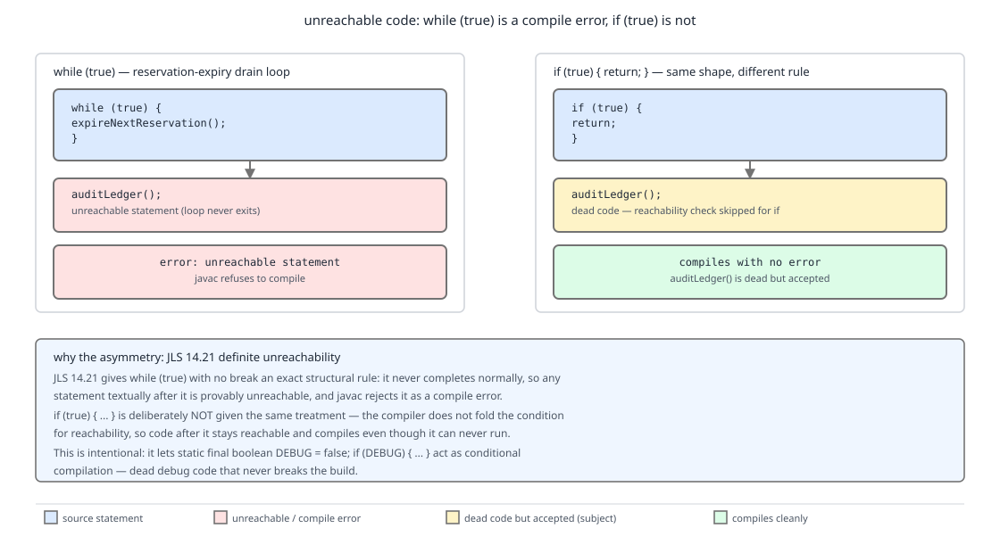

# 03 Java Core — Assertions, guarded blocks and unreachable code — BASICS (§1.8, 1.8.13–1.8.16)

**Target version: Java 21 LTS.** | **Part 1 of 5** | [Index](../00-index.md)
Previous: [Every form of switch](01a-switch.md) · Next: [Wrappers and autoboxing](../wrappers-and-boxing/01-basics.md)

The remaining statement forms are the ones that change control flow without looking
like control flow. An `assert` is a statement that usually does not exist. A
`synchronized` block is a region the compiler guarantees you leave. A `finally` can
replace the reason a statement completed abruptly. And `javac`'s reachability
analysis rejects a statement after `while (true)` while cheerfully accepting one
after `if (true) { return; }`. Everything below is grounded in JLS 21 §14 and in
`javap -c` and `java` runs captured on JDK 21.

Branching, looping, labels and abrupt completion are in
[Control flow: branches, loops and abrupt completion](01-basics.md); every form of
`switch` is in [Every form of switch](01a-switch.md).

---

## 13. `assert`, `-ea`, and why side effects are fatal (1.8.13) [TRAP]

**Concept.** An `assert` is a statement that usually does not exist. The bytecode is
emitted, but it is guarded by a synthetic `static final boolean $assertionsDisabled`
that the JVM sets from the command line at class-init time. Without `-ea` the guard
is true and the body never runs.

**Why it exists.** Java 1.4 added `assert` to give invariants a home that costs
nothing in production. The design decision — off by default — was deliberate: an
assertion is a *developer* check, and a regulated platform cannot have a
`StakeSplit` rounding invariant taking down the stake path at 1,200 reservations/sec
because a test-only assumption drifted. The consequence is the trap: an expression
that is never evaluated in production.

**How it works.** `assert cond : detail;` compiles to
`if (!$assertionsDisabled && !cond) throw new AssertionError(detail);`. Enabling is
per-classloader and per-package: `-ea` for everything, or `-ea:` followed by a package
name and the JVM's package-tree suffix (three dot characters) to cover that tree,
`-da` to disable, `-esa` for system classes. `AssertionError` extends
`Error`, so it is not caught by `catch (Exception e)` — which is what you want.

Observed on JDK 21 with a condition that increments a counter: `java As` prints
`calls=0`; `java -ea As` prints `calls=1`. Same class file, both times.

```java
record StakeSplit(Money bonusPortion, Money cashPortion) {}

final class FundsLedger {

    /** Draws proportionally from bonus before cash. The two portions must sum to the stake exactly. */
    static StakeSplit split(Money stake, Money bonusAvailable) {
        java.math.BigDecimal fromBonus = bonusAvailable.amount().min(stake.amount());
        java.math.BigDecimal fromCash = stake.amount().subtract(fromBonus);
        StakeSplit s = new StakeSplit(
                new Money(fromBonus, stake.currency()),
                new Money(fromCash, stake.currency()));

        // Correct: pure predicate, no state touched.
        assert s.bonusPortion().amount().add(s.cashPortion().amount())
                .compareTo(stake.amount()) == 0
                : "StakeSplit invariant broken: " + s + " != " + stake;
        return s;
    }

    private static int auditedSplits = 0;

    /** WRONG shape, shown to be recognised and deleted, never shipped. */
    static StakeSplit splitWithSideEffect(Money stake, Money bonusAvailable) {
        StakeSplit s = split(stake, bonusAvailable);
        // auditedSplits is incremented ONLY when -ea is on. Production count stays 0.
        assert recordAudit(s) : "audit failed";
        return s;
    }

    private static boolean recordAudit(StakeSplit s) {
        auditedSplits++;
        return true;
    }

    public static void main(String[] args) {
        Money stake = new Money(new java.math.BigDecimal("4.20"), java.util.Currency.getInstance("GBP"));
        Money bonus = new Money(new java.math.BigDecimal("1.50"), java.util.Currency.getInstance("GBP"));
        StakeSplit s = split(stake, bonus);
        System.out.println(s.bonusPortion().amount() + " + " + s.cashPortion().amount());  // 1.50 + 2.70
        splitWithSideEffect(stake, bonus);
        System.out.println("auditedSplits=" + auditedSplits);   // 0 without -ea, 1 with -ea
    }
}
```

**Pitfall:** putting work inside an `assert`. Symptom: a counter, a log line, a cache
warm-up or a lazy initialisation that is present in every local run and every CI run
(both with `-ea`) and absent in production — so the bug only ever appears in prod and
never reproduces. Fix: an assert's expression must be a pure predicate. If the check
must run in production, it is not an assertion — it is an `if` that throws
`LedgerImbalanceException`, and it belongs in the code path.

**Tradeoff:** assertions cost one static boolean read on the disabled path, which the
JIT folds away entirely once the guard is a constant — genuinely free. The cost is
that they are documentation, not enforcement. The escape hatch for an invariant that
must hold in production (the ledger balancing across ~19.8M entries/day) is an
explicit check plus a domain exception, reserving `assert` for assumptions whose
violation means the code is wrong rather than the data.

**Interview:** "Why are Java assertions disabled by default?" — Answer: so that
developer-time invariant checks cost nothing in production; the corollary is that any
side effect inside an `assert` silently disappears in production, so assertion
expressions must be pure.

> `assert` is a conditionally-compiled purity check enabled per-package with `-ea`
> and throwing `AssertionError`; its expression must have no side effects
> (JLS 21 §14.10).

---

## 14. `synchronized` blocks are control flow (1.8.14)

**Mechanism.** A `synchronized` statement is not a call — it is a structured region
with `monitorenter` at the top and `monitorexit` on *every* exit path, normal or
abrupt. `javac` guarantees the pairing by emitting a `catch any` handler around the
body whose only job is to release the monitor and rethrow. Captured on JDK 21:

```
void credit(long);
     1: getfield      #7    // Field lock:Ljava/lang/Object;
     4: dup
     5: astore_3            // stash the monitor object
     6: monitorenter
     7: aload_0
     9: getfield      #13   // Field available:J
    12: lload_1
    13: ladd
    14: putfield      #13
    17: aload_3
    18: monitorexit         // normal path
    19: goto          29
    22: astore        4     // abrupt path: any Throwable
    24: aload_3
    25: monitorexit
    26: aload         4
    28: athrow              // rethrow after releasing
    29: return
  Exception table:
     from    to  target type
         7    19    22   any
        22    26    22   any
```

That is why `synchronized` belongs in a control-flow chapter: it changes what
happens on a `throw` and on a `return` from inside the block, and there is no syntax
for entering without leaving.

```java
final class PositionStore {
    private final Object lock = new Object();
    private long clientCashAvailableMinor;
    private long clientCashReservedMinor;

    /** Reserve for a stake. Atomic against concurrent settles on the same Position. */
    boolean reserve(long minorUnits) {
        synchronized (lock) {
            if (clientCashAvailableMinor < minorUnits) {
                return false;                        // monitorexit still runs
            }
            clientCashAvailableMinor -= minorUnits;
            clientCashReservedMinor += minorUnits;
            return true;
        }
    }
}
```

**Pitfall:** believing `synchronized` only matters for mutual exclusion. It also
publishes: `monitorexit` flushes the writes made inside the block so that a thread
which later acquires the *same* monitor sees them. Symptom: a `Position` field read
without holding the lock returns a stale value even though every *write* was
synchronized. Fix: read under the same monitor, or make the field `volatile`. The
happens-before edges, the same-monitor requirement, and why a different lock object
buys nothing are in **05 Concurrency**.

> A `synchronized` statement is a monitor-scoped region whose exit is guaranteed on
> every path by a compiler-emitted `catch any` handler (JLS 21 §14.19).

---

## 15. `try`/`catch`/`finally` and try-with-resources as control flow (1.8.15)

**Mechanism.** `throw` is the fourth abrupt-completion reason from §5 (in
[Control flow: branches, loops and abrupt completion](01-basics.md)), and
`try`/`catch`/`finally` is the construct that consumes it. Three rules matter here
and are developed fully in `../exceptions/01-basics.md`:

1. `finally` runs on every exit from `try` — normal completion, `return`, `break`,
   `continue`, and any `throw`.
2. If `finally` itself completes abruptly, its reason **replaces** the pending one.
   A `return` in `finally` therefore discards an in-flight exception, which is why
   the compiler's `-Xlint:finally` and every static analyser flag it.
3. Try-with-resources is sugar: it emits a hidden `finally` that calls `close()` in
   reverse declaration order, and — unlike a hand-written `finally` — an exception
   from `close()` is *suppressed* onto the primary exception via
   `Throwable.addSuppressed` rather than replacing it.

```java
final class PaymentRunWriter implements AutoCloseable {
    private final String runId;
    PaymentRunWriter(String runId) { this.runId = runId; }
    void write(WithdrawalTransaction tx) { }
    @Override public void close() { }

    static void emit(PaymentRun run) {
        try (PaymentRunWriter w = new PaymentRunWriter(run.runId())) {
            for (WithdrawalTransaction tx : run.transactions()) {
                w.write(tx);
            }
        }
    }
}
```

**Pitfall:** a `return` inside `finally`. Symptom: a `LedgerImbalanceException` that
the logs prove was thrown but that no caller ever sees, because the `finally`
returned a value and the exception was dropped. Fix: `finally` must not contain
`return`, `break`, `continue`, or `throw`; use try-with-resources for cleanup so you
never need to write the `finally` at all.

Exception hierarchies, checked-vs-unchecked, suppression, and the full cost model
are in `../exceptions/01-basics.md` and §1.20.

> `try`/`catch`/`finally` is the construct that consumes an abrupt `throw`, and a
> `finally` completing abruptly replaces the pending reason (JLS 21 §14.20.2).

---

## 16. Unreachable statements: `while (true)` is an error, `if (true)` is not (1.8.16) [TRAP] [PROVE]

**Concept.** `javac` runs a conservative reachability analysis and rejects any
statement it can prove cannot execute. It treats `while (true)` as never completing
normally, so anything after it is unreachable and the build fails. It deliberately
refuses to apply the same reasoning to `if` — an `if (true)` whose branch returns
leaves the following statement formally reachable, even though it obviously is not.

**Why it exists.** The `if` exemption is a documented carve-out, not an oversight.
Before Java had `static final` constant folding used for feature flags, C
programmers wrote `#ifdef DEBUG`. Java's answer is
`static final boolean DEBUG = false;` plus `if (DEBUG) { }` — the compiler folds the
condition and emits no bytecode for the branch, giving conditional compilation with
no preprocessor. If reachability analysis treated `if` the way it treats `while`,
flipping `DEBUG` to `false` would make the *rest of the method* unreachable and break
the build. JLS 21 §14.21 exempts `if` for exactly this reason. What counts as a
constant expression for this folding is covered in
[Operators and expressions](../primitives-and-conversions/02-operators-and-expressions.md).

**How it works.** §14.21 is written in terms of §14.1's normal/abrupt vocabulary. A
`while` statement can complete normally only if its condition is not the constant
`true`, **or** the loop contains a reachable `break` that targets it. An `if`
statement can complete normally if its then-branch can, *or* its else-branch can,
*or* it has no else — and critically the analysis pretends the condition might be
either value regardless of constant folding.



**D-024** — Start on the left: `while (true)` with `auditLedger();` after it, and the
compiler's verdict `error: unreachable statement`. Then compare the right panel,
`if (true) { return; }` followed by the same call — accepted, dead, and shipped. The
annotation panel is the point: §14.21's exemption of `if` is what makes
`static final boolean DEBUG = false` work as conditional compilation.

**The proof.** Both halves compiled on JDK 21. The failing half:

```java
final class ReservationExpiry {
    static void bad() {
        while (true) { }
        auditLedger();
    }
    static void auditLedger() { }
}
```

```
Un2.java:5: error: unreachable statement
    static void bad() { while (true) { } auditLedger(); }
                                         ^
1 error
```

The accepted half, same compiler, same run:

```java
final class ReservationExpiryOk {
    static final boolean DEBUG = false;

    static void ok() {
        if (true) { return; }
        auditLedger();        // dead, but legal
    }

    static void alsoOk() {
        if (DEBUG) { return; }
        auditLedger();        // this is why the exemption exists
    }

    static void auditLedger() { }
}
```

Compiles with no error and no warning. Work the difference through: in `bad()`, §14.21
says the `while` cannot complete normally (constant `true` condition, no `break`
targeting it), so the statement *after* it is unreachable and the spec mandates a
compile-time error. In `ok()`, §14.21 says the `if` can complete normally because the
rule for `if` ignores the constant value of the condition entirely — so
`auditLedger()` is reachable *by the rule*, even though no execution reaches it. The
error is not about whether the code runs; it is about what the specified analysis can
conclude.

Add a `break` and the `while` becomes completable, which is exactly the real
reservation-expiry shape:

```java
final class ReservationSweeper {
    private volatile boolean shuttingDown = false;
    private int sweeps = 0;

    /** Expire stale stake reservations until told to stop. */
    void run() {
        while (true) {
            if (shuttingDown) {
                break;                 // makes the loop completable
            }
            expireOneBatch();
            sweeps++;
        }
        auditLedger();                 // now reachable, and compiles
    }

    private void expireOneBatch() { }
    private void auditLedger() { }
}
```

**Pitfall:** believing `if (false) { }` is a compile error like unreachable code
elsewhere. It is not — it compiles, emits nothing, and is the sanctioned conditional
compilation idiom. The symmetric wrong belief is that `while (true)` with a trailing
statement is "just a warning". Symptom: a build that fails only after somebody adds a
line below a supervisor loop. Fix: put the trailing work *inside* the loop after a
`break`, or restructure the loop condition to be a real boolean.

**Interview:** "Why does `while (true); stmt;` fail to compile but `if (true) return; stmt;`
not?" — Answer: JLS 21 §14.21 defines a `while` with a constant-`true` condition and no
targeting `break` as unable to complete normally, making the next statement
unreachable; it deliberately exempts `if` so that `if (CONSTANT_FALSE)` works as
conditional compilation without breaking every statement that follows.

> An unreachable statement is a compile-time error under JLS 21 §14.21, which
> analyses `while`/`for` conditions as constants but deliberately exempts `if` to
> permit constant-guarded conditional compilation.

---

## Pitfalls

### "Assertions run in production, so I can put bookkeeping in them"

**Wrong**

```java
private static int auditedSplits = 0;
static StakeSplit split(Money stake, Money bonus) {
    StakeSplit s = compute(stake, bonus);
    assert recordAudit(s);      // recordAudit increments auditedSplits
    return s;
}
// Local and CI (both -ea): auditedSplits climbs. Production (no -ea): stays 0 forever.
```

**Right**

```java
private static final java.util.concurrent.atomic.AtomicLong AUDITED = new java.util.concurrent.atomic.AtomicLong();
static StakeSplit split(Money stake, Money bonus) {
    StakeSplit s = compute(stake, bonus);
    AUDITED.incrementAndGet();                    // unconditional: this is real work
    assert s.bonusPortion().amount().add(s.cashPortion().amount())
            .compareTo(stake.amount()) == 0 : "StakeSplit invariant broken";
    return s;
}
```

**Why people believe it:** the code is present in the class file and runs in every
environment a developer ever looks at. `-ea` is set by IDE run configurations and by
Surefire's defaults, so the disabled path is the one nobody observes.

### "A `return` in `finally` is just a tidy way to name the result"

**Wrong**

```java
static boolean settle(FundsLedger ledger, WithdrawalTransaction tx) {
    boolean applied = false;
    try {
        ledger.apply(tx);            // may throw LedgerImbalanceException
        applied = true;
        return applied;
    } finally {
        return applied;              // swallows any in-flight exception
    }
}
// A thrown LedgerImbalanceException never reaches the caller; settle() returns false.
```

**Right**

```java
static boolean settle(FundsLedger ledger, WithdrawalTransaction tx) {
    try {
        ledger.apply(tx);
        return true;
    } finally {
        ledger.flushAuditBuffer();   // side effect only; no abrupt completion
    }
}
// The exception propagates, and the audit buffer is still flushed on every path.
```

**Why people believe it:** `finally` reads as "the last thing", and the last thing a
method does is return. JLS 21 §14.20.2 is explicit that a `finally` completing
abruptly *replaces* the pending reason — so a pending `throw` is discarded, silently
and with no diagnostic beyond `-Xlint:finally`. Reserve `finally` for side effects, and
prefer try-with-resources so you rarely write one.

### "Unreachable code is a warning, and `if (false)` is an error"

**Wrong**

```java
final class SweeperBad {
    static final boolean DEBUG = false;

    static void run() {
        while (true) { expireOneBatch(); }
        auditLedger();          // author expects a warning; the build fails
    }

    static void alsoBad() {
        if (DEBUG) { return; }  // author expects an error; this is perfectly legal
        auditLedger();
    }

    static void expireOneBatch() { }
    static void auditLedger() { }
}
```

**Right**

```java
final class SweeperOk {
    static final boolean DEBUG = false;
    private volatile boolean shuttingDown = false;

    void run() {
        while (true) {
            if (shuttingDown) { break; }   // the loop can now complete normally
            expireOneBatch();
        }
        auditLedger();                     // reachable by the rule, and compiles
    }

    void debugOnly() {
        if (DEBUG) { auditLedger(); }      // folded away, emits no bytecode
    }

    private void expireOneBatch() { }
    private void auditLedger() { }
}
```

**Why people believe it:** both beliefs come from expecting the compiler to reason
about what actually executes. It does not; JLS 21 §14.21 specifies a structural
analysis. A `while` whose condition is the constant `true` with no targeting `break`
is *defined* as unable to complete normally, which makes the next statement
unreachable and mandates `error: unreachable statement`. The rule for `if`
deliberately ignores the condition's constant value, which is exactly what makes
`static final boolean DEBUG = false` usable as conditional compilation.

---

## Cheat sheet

| Thing | Rule |
|---|---|
| `assert cond : detail;` | compiles to `if (!$assertionsDisabled && !cond) throw new AssertionError(detail);` |
| default state | disabled; the guard is a synthetic `static final boolean` set at class init |
| enabling | `-ea` for everything, `-ea:` plus a package and the tree suffix for a subtree, `-da` off, `-esa` system classes |
| observed proof | same class file: `java As` prints `calls=0`, `java -ea As` prints `calls=1` |
| `AssertionError` | extends `Error`, so `catch (Exception e)` does not catch it |
| assert expression | must be a pure predicate; any side effect vanishes in production |
| `synchronized` | `monitorenter` at entry, `monitorexit` on every exit path |
| how the pairing is guaranteed | compiler-emitted `catch any` handler that releases and rethrows |
| `synchronized` also publishes | `monitorexit` makes prior writes visible to the next acquirer of the **same** monitor |
| `finally` runs on | normal completion, `return`, `break`, `continue`, `throw` |
| `finally` abrupt | replaces the pending reason — never `return`/`break`/`continue`/`throw` there |
| try-with-resources | hidden `finally`, `close()` in reverse declaration order |
| `close()` throwing | suppressed onto the primary via `Throwable.addSuppressed`, not substituted |
| `while (true)` + trailing statement | `error: unreachable statement` (JLS 21 §14.21) |
| making the loop completable | a reachable `break` that targets it |
| `if (true) { return; }` + trailing statement | legal; the `if` rule ignores the constant condition |
| why the exemption exists | `static final boolean DEBUG = false` as conditional compilation |

---

## Self-test

**Q1.** Why does `while (true) { } auditLedger();` fail to compile while `if (true) { return; } auditLedger();` compiles?

<details><summary>Answer</summary>

JLS 21 §14.21 defines reachability structurally. A `while` whose condition is the
constant `true` and which contains no `break` targeting it cannot complete normally,
so the statement after it is unreachable and the spec mandates a compile-time error —
observed as `error: unreachable statement`. The rule for `if`, by contrast,
deliberately ignores whether the condition is a constant: an `if` can complete
normally if either branch can or if there is no else, so the following statement is
reachable *by the rule* even when no execution reaches it. The exemption is
intentional: it is what makes `static final boolean DEBUG = false;` plus
`if (DEBUG) { }` work as conditional compilation. Without it, flipping a debug flag to
false would render the rest of every method unreachable and break the build.

</details>

**Q2.** Why is `assert recordAudit(s);` a defect even though `recordAudit` returns `true`?

<details><summary>Answer</summary>

Because the expression only runs when assertions are enabled. `assert cond : msg;`
compiles to `if (!$assertionsDisabled && !cond) throw new AssertionError(msg);`, and
`$assertionsDisabled` is set from the command line at class init. Without `-ea` the
guard short-circuits and `cond` is never evaluated. Verified: the same class printed
`calls=0` under `java` and `calls=1` under `java -ea`. Since IDE run configurations and
most test harnesses enable `-ea`, the side effect is present in every environment a
developer observes and absent in production — the worst possible failure profile.
An assertion expression must be a pure predicate; anything that must happen in
production is an unconditional statement, and an invariant that must hold in
production is an `if` that throws a domain exception such as
`LedgerImbalanceException`.

</details>

**Q3.** You return from inside a `synchronized` block. What bytecode guarantees the monitor is released, and what does the exception table look like?

<details><summary>Answer</summary>

`javac` emits `monitorenter` once, after stashing the monitor object in a local via
`dup`/`astore`, and then emits `monitorexit` on *every* exit path. The normal path is
`aload` the stashed monitor, `monitorexit`, `goto` the join — that covers a `return`
from inside the block, because the return value is computed before the exit code runs.
The abrupt path is a compiler-generated handler registered for type `any`, meaning
every `Throwable`: it stores the throwable, reloads the monitor, `monitorexit`, reloads
the throwable and `athrow`s it. In the captured JDK 21 listing the exception table has
two rows: one covering the body (`from 7 to 19 target 22 any`) and one covering the
handler itself (`from 22 to 26 target 22 any`), so a throw *while releasing* still
retries the release. This is why there is no syntax for entering a monitor without
leaving it, and why `synchronized` belongs in a control-flow chapter at all: it changes
what happens on a `throw` and on a `return` from inside the block.

</details>

**Q4.** A `finally` block and a try-with-resources `close()` both run on the way out. What is the difference when both the body and the cleanup throw?

<details><summary>Answer</summary>

With a hand-written `finally` that throws, the `finally`'s reason *replaces* the
pending one (JLS 21 §14.20.2), so the body's exception is discarded and the caller sees
only the cleanup failure — the original cause is gone, with no diagnostic beyond
`-Xlint:finally`. Try-with-resources deliberately does not do that. It emits a hidden
`finally` that calls `close()` on each resource in reverse declaration order, and if a
`close()` throws while an exception from the body is already in flight, the `close()`
exception is *suppressed* onto the primary via `Throwable.addSuppressed` rather than
substituted for it. The caller therefore gets the body's exception, which is the one
that explains the failure, with the cleanup failure retrievable from
`getSuppressed()`. The same asymmetry applies to `return`: a `return` in `finally`
discards an in-flight exception, which is why the rule is that `finally` must not
contain `return`, `break`, `continue` or `throw`, and why cleanup belongs in
try-with-resources.

</details>

**Q5.** How do you enable assertions for only one package tree, and will `catch (Exception e)` swallow an `AssertionError`?

<details><summary>Answer</summary>

Enabling is per-classloader and per-package on the `java` command line. `-ea` turns
assertions on for everything the application classloader loads. To scope it, write
`-ea:` followed by a package name and the JVM's package-tree suffix — three dot
characters — which covers that package and everything below it; naming a package with
no suffix covers exactly that package. `-da` (with the same forms) disables, so a
common shape is broad `-ea` plus a narrow `-da` for a noisy subtree. `-esa` and `-dsa`
control assertions in system classes, which are separate because they load through the
bootstrap loader. And no: `AssertionError` extends `Error`, not `Exception`, so
`catch (Exception e)` does not catch it. That is deliberate — an assertion failure means
the code's own assumptions are wrong, so it should tear through the application's
ordinary error handling rather than be absorbed by a broad `catch` in a request handler.

</details>

---

## Open questions

None.

---

**Leaves covered:** 1.8.13, 1.8.14, 1.8.15, 1.8.16 (4 leaves)
**Leaves deferred:** none
**Diagrams included:** D-024
**Target version:** Java 21 LTS
**Lines:** 0
