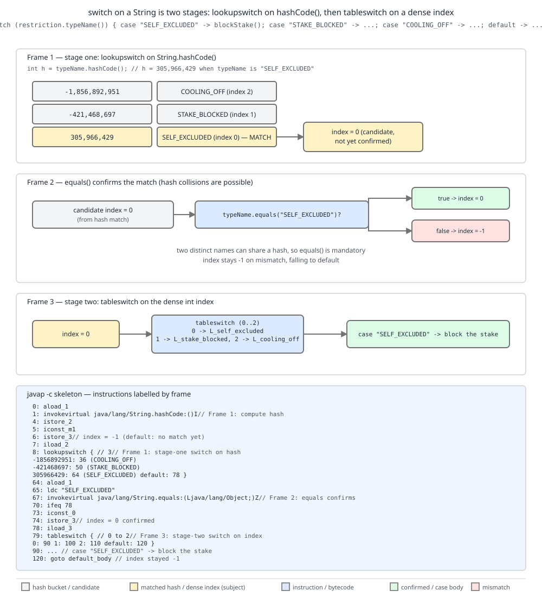

# 03 Java Core — switch on a String, on an enum, and on null — BASICS (§1.8, 1.8.8–1.8.10)

**Target version: Java 21 LTS.** | **Part 1 of 5** | [Index](../00-index.md)
Previous: [The classic switch statement and fall-through](01a-switch.md) · Next: [switch expressions and pattern matching](01c-switch-expressions-and-patterns.md)

A `switch` on a `String` is two switches. A `switch` on an enum does not switch on
`ordinal()`. And a `null` selector never reaches `default` — it throws before any label
is considered. Below is the compiled reality behind three selector types that look like
ordinary constants in source, against `javap -c` listings and two-run experiments
captured from a real JDK 21. The classic form and fall-through are in
[The classic switch statement and fall-through](01a-switch.md); the arrow form and
pattern matching in [switch expressions and pattern matching](01c-switch-expressions-and-patterns.md).

---

## 8. `switch` on a `String` is two stages (1.8.8) [BYTECODE] [SOURCE]

**Concept.** The JVM has no string-switch instruction. `javac` fabricates one out of
the two it has: first a `lookupswitch` on `hashCode()` to narrow to a candidate,
then an `equals()` call to confirm it, and only then a second, dense `tableswitch`
on a synthetic 0-based index to reach the case body.

**Why it exists.** Java 7 added `switch` on `String` as pure sugar. The alternative
was an `if`/`else if` chain of `equals()` calls, which is O(n) in the number of cases
and — worse — reads as a wall of duplicated boilerplate in exactly the code (status
routing, restriction dispatch) that is read most often. The compiler does the
transformation you would have hand-written, but gets the O(1)-ish hash dispatch for
free.

**How it works.** Stage one hashes the selector and jumps on the hash. Hashes are
not unique, so stage one cannot decide anything on its own — it can only route to a
block that calls `equals()`. On a confirmed match the block assigns a dense index
(0, 1, 2) to a hidden local; on a mismatch the index stays at its initialised −1 and
falls through to `default`. Stage two switches on that dense index, which is exactly
what `tableswitch` wants.



**D-023** — Look at frame 1 first: the three real hash values 305966429,
−421468697 and −1856892951 are the `lookupswitch` keys, and `"SELF_EXCLUDED"`
matches the first, yielding index 0. Frame 2 is the mandatory `equals` guard —
follow the −1 path to see how a hash collision or a near-miss name lands in
`default`. Frame 3 is the second switch, a `tableswitch` over the dense 0/1/2.

Captured listing (real, JDK 21, selector `"SELF_EXCLUDED"` / `"STAKE_BLOCKED"` /
`"COOLING_OFF"`):

```
static int tier(java.lang.String);
     0: aload_0
     1: astore_2          // copy of the selector
     2: iconst_m1
     3: istore_3          // hidden index := -1
     4: aload_2
     5: invokevirtual #7  // String.hashCode:()I
     8: lookupswitch  { // 3
         -1856892951: 72        // "COOLING_OFF"
          -421468697: 58        // "STAKE_BLOCKED"
           305966429: 44        // "SELF_EXCLUDED"
             default: 83
        }
    44: aload_2
    45: ldc           #13       // String SELF_EXCLUDED
    47: invokevirtual #15       // String.equals:(Ljava/lang/Object;)Z
    50: ifeq          83        // mismatch -> index stays -1
    53: iconst_0
    54: istore_3                // index := 0
    55: goto          83
    58: aload_2
    59: ldc           #19       // String STAKE_BLOCKED
    61: invokevirtual #15
    64: ifeq          83
    67: iconst_1
    68: istore_3
    69: goto          83
    72: aload_2
    73: ldc           #21       // String COOLING_OFF
    75: invokevirtual #15
    78: ifeq          83
    81: iconst_2
    82: istore_3
    83: iload_3
    84: tableswitch   { // 0 to 2
                   0: 112
                   1: 117
                   2: 122
             default: 127
        }
```

Instruction by instruction: `astore_2` at 1 copies the selector so the second stage
does not re-evaluate it; `iconst_m1`/`istore_3` at 2–3 pre-set the sentinel;
`lookupswitch` at 8 sorts its three keys ascending and binary-searches them; each
of the three blocks at 44/58/72 is `ldc` the literal, `equals`, `ifeq` out; the
`tableswitch` at 84 is dense 0-to-2 so it is a single array index. Note the
`lookupswitch` keys are printed ascending (−1856892951 first) regardless of source
order — the JVM spec requires sorted keys.

The `equals` call is not an optimisation the compiler could skip. `hashCode()` is
32 bits over an unbounded domain; two distinct restriction names *can* collide, and
if they did, stage one would route both to the same block, where `equals` picks the
right one. JLS 21 §14.11 specifies string case comparison in terms of `String.equals`
rather than reference identity, which is what makes this sound even for a selector
that is not interned.

**Unverified:** the exact verbatim JLS 21 sentence mandating `String.equals` for
string case labels (SE 8 §14.11 words it as a note). The `equals` calls at offsets
47/61/75 in the captured listing confirm the behaviour.

```java
final class RestrictionRouter {

    /** Compliance tier: 0 = hard stop, 1 = stake-only stop, 2 = timed stop, -1 = unknown. */
    static int tier(String restrictionTypeName) {
        int t;
        switch (restrictionTypeName) {
            case "SELF_EXCLUDED": t = 0; break;
            case "STAKE_BLOCKED": t = 1; break;
            case "COOLING_OFF":   t = 2; break;
            default:              t = -1;
        }
        return t;
    }

    public static void main(String[] args) {
        System.out.println(tier("SELF_EXCLUDED"));                 // 0
        System.out.println(tier("STAKE_BLOCKED"));                 // 1
        System.out.println(tier("COOLING_OFF"));                   // 2
        System.out.println(tier("self_excluded"));                 // -1, case-sensitive
        System.out.println(tier(new String("SELF_EXCLUDED")));     // 0, equals not ==
        System.out.println("SELF_EXCLUDED".hashCode());            // 305966429
        System.out.println("STAKE_BLOCKED".hashCode());            // -421468697
        System.out.println("COOLING_OFF".hashCode());              // -1856892951
    }
}
```

**Tradeoff:** the string switch costs one `hashCode()` (O(len), cached in the
`String` after the first call — but a fresh `String` off the wire pays it), one
`equals()` (O(len) on the matching path), and two jumps. Against an `if`/`else`
chain it wins from about four cases upward. Against an `enum` selector it loses
outright: the enum form (§9) is one `ordinal()` and one array load, with no hashing
and no character comparison. The escape hatch for a hot path — restriction checks
run alongside 1,200 stake reservations/sec at peak — is to parse the wire string to
a `RestrictionType` once at the boundary and switch on the enum everywhere inside.

**Pitfall:** switching on a `String` that may be `null`. See §10 — the `hashCode()`
at offset 5 is an `invokevirtual` on the selector, so a `null` selector throws NPE
before any case is considered.

> `switch` on `String` (Java 7+) compiles to a `lookupswitch` over `hashCode()`
> whose blocks confirm with `String.equals` and assign a dense index, followed by a
> `tableswitch` over that index.

---

## 9. `switch` on an enum goes through `$SwitchMap`, not `ordinal()` (1.8.9) [SOURCE] [PROVE]

**Concept.** The obvious compilation — `tableswitch` directly on `ordinal()` — would
be correct only until somebody reorders the enum. `javac` inserts a translation
table between the two: a synthetic `int[]` named `$SwitchMap$RestrictionType`,
indexed by ordinal, holding the *case index* the switch actually jumps on. The table
is built at class-init time by looking each constant up **by name**.

**Why it exists.** Binary compatibility. `RestrictionType` and `ClientRestrictions`
are separately compiled; in a real deployment the enum ships in a shared contract
JAR and the switch ships in a service. If the switch had baked in `ordinal()`
values, adding `DORMANT_FROZEN` in the middle of the enum and redeploying only the
contract JAR would silently re-point every case in every service that did not
recompile — a compliance defect that produces no error anywhere.

**How it works.** For each class containing an enum switch, `javac` emits a synthetic
holder class (`EnumRouter$1`) with a `static final int[]` field. Its static
initialiser does, per case label, `map[Constant.ordinal()] = <denseCaseIndex>` — and
wraps each assignment in a `try`/`catch (NoSuchFieldError)` so a constant that has
been *removed* from the enum since compile time leaves a 0 in the slot instead of
blowing up class init. Index 0 means "no case matched", which routes to `default`;
that is why case indices start at 1, not 0.

Captured listing (real, JDK 21):

```
class EnumRouter$1 {
  static final int[] $SwitchMap$RestrictionType;
  static {};
       0: invokestatic  #1    // RestrictionType.values:()[LRestrictionType;
       3: arraylength
       4: newarray       int
       6: putstatic     #7    // $SwitchMap$RestrictionType:[I
       9: getstatic     #7
      12: getstatic     #13   // RestrictionType.SELF_EXCLUDED
      15: invokevirtual #17   // RestrictionType.ordinal:()I
      18: iconst_1
      19: iastore             // map[SELF_EXCLUDED.ordinal()] = 1
      20: goto          24
      23: astore_0            // swallow NoSuchFieldError
      24: getstatic     #7
      27: getstatic     #23   // RestrictionType.STAKE_BLOCKED
      30: invokevirtual #17
      33: iconst_2
      34: iastore             // map[STAKE_BLOCKED.ordinal()] = 2
      35: goto          39
      38: astore_0
      39: return
    Exception table:
       from    to  target type
           9    20    23   Class java/lang/NoSuchFieldError
          24    35    38   Class java/lang/NoSuchFieldError
```

```
static int weight(RestrictionType);
     0: getstatic     #7    // EnumRouter$1.$SwitchMap$RestrictionType:[I
     3: aload_0
     4: invokevirtual #13   // RestrictionType.ordinal:()I
     7: iaload              // map[ordinal] -> dense case index
     8: lookupswitch  { // 2
                   1: 36
                   2: 39
             default: 42
        }
```

Offset 4 does call `ordinal()` — but only to index the map. The value switched on at
8 is `map[ordinal]`, and the map was populated by *name* at class init. The
indirection is the whole point.

**The proof.** Rather than assert this, work it: compile the enum and the switch
together, run it, then reorder the enum, recompile **only the enum**, and run the
*unchanged* switch class again.

Run 1, enum declared `{DEPOSIT_BLOCKED, STAKE_BLOCKED, WITHDRAWAL_BLOCKED, SELF_EXCLUDED, COOLING_OFF}`:

```
0 DEPOSIT_BLOCKED -> 0
1 STAKE_BLOCKED -> 50
2 WITHDRAWAL_BLOCKED -> 0
3 SELF_EXCLUDED -> 100
4 COOLING_OFF -> 0
```

Run 2, enum reordered to `{SELF_EXCLUDED, COOLING_OFF, DEPOSIT_BLOCKED, STAKE_BLOCKED, WITHDRAWAL_BLOCKED}`, `EnumRouter.class` **not** recompiled:

```
0 SELF_EXCLUDED -> 100
1 COOLING_OFF -> 0
2 DEPOSIT_BLOCKED -> 0
3 STAKE_BLOCKED -> 50
4 WITHDRAWAL_BLOCKED -> 0
```

Every ordinal changed. Every weight followed its *name*. `SELF_EXCLUDED` went from
ordinal 3 to ordinal 0 and still returns 100. If the switch had compiled to
`tableswitch` on `ordinal()`, run 2 would have charged the 100-weight self-exclusion
stop to whatever constant landed at ordinal 3 — `STAKE_BLOCKED`. That is the
compliance defect the `$SwitchMap` prevents, demonstrated rather than claimed.

The general contract this serves is JLS 21 §13 (Binary Compatibility): a change that
the spec deems binary-compatible must not silently change the meaning of
already-compiled code. **Unverified:** the specific JLS §13 subsection naming enum
constant reordering as binary-compatible — I have not read the current section
number, and the experiment above is the evidence I am relying on.

The full internals — one holder class per switching class, the interaction with
class-init ordering, why the field is `static final int[]` and not a `Map`, and how
Java 21's pattern switch over enum constants changes the emission — live in
`../enums/03-internals-enums.md`.

**Pitfall:** persisting `ordinal()` because "the switch uses it anyway". The switch
uses it as a private, recomputed-at-init index; your database row uses it as a
permanent key. Symptom: after an enum reorder, every stored `SELF_EXCLUDED`
restriction reads back as `COOLING_OFF`, and the switch — correctly — routes the
wrong way. Fix: persist `name()`, or an explicit `code` field on the enum. Never
`ordinal()`.

> An enum `switch` compiles to a switch over `$SwitchMap[ordinal()]`, a synthetic
> per-class `int[]` populated by constant *name* at class init, so that reordering
> the enum cannot re-point cases in separately compiled code.

---

## 10. `null` selectors: NPE in the classic form, `case null` in a pattern switch (1.8.10) [TRAP]

**Concept.** The classic `switch` treats `null` as a programming error, not as a
value to dispatch on. It dereferences the selector before considering any label, so
`null` throws before `default` is ever reached. Java 21's pattern switch reverses the
default: it *still* throws on `null` unless you write `case null`, at which point
`null` becomes an ordinary, matchable case.

**Why it exists.** SE 8 §14.11 explains the original design directly:

> "The prohibition against using null as a switch label prevents one from writing
> code that can never be executed." — JLS §14.11 note

Read that carefully: with no `case null` allowed, a `null` selector could only ever
reach `default`, and the language decided that silently funnelling a null into
`default` hides bugs. Java 21 had to loosen it, because a pattern switch over a
sealed hierarchy is meant to be *total*, and a hierarchy's reference type includes
`null`. Forcing every pattern switch to be preceded by a null check would defeat the
exhaustiveness guarantee it exists to provide.

**How it works.** Three distinct behaviours, and the difference is which switch kind
you wrote:

| Switch kind | `null` selector | Reaches `default`? |
|---|---|---|
| classic, `String`/wrapper/enum selector | `NullPointerException` | no |
| pattern switch, no `case null` | `NullPointerException` | no |
| pattern switch with `case null` | matches `case null` | no (the explicit label wins) |
| pattern switch with `case null, default ->` | matches that combined label | that label *is* default |

For the string form the mechanism is visible in §8's listing: offset 5 is
`invokevirtual String.hashCode()` on the selector. For the enum form it is
`invokevirtual ordinal()`. For the wrapper form it is `intValue()`. All three are
instance calls on the selector, so all three NPE.

```java
final class NullSelector {

    static String classicTier(String restrictionTypeName) {
        switch (restrictionTypeName) {
            case "SELF_EXCLUDED": return "hard stop";
            default:              return "no stop";
        }
    }

    static String patternTier(String restrictionTypeName) {
        return switch (restrictionTypeName) {
            case null -> "no restriction on file";
            case "SELF_EXCLUDED" -> "hard stop";
            default -> "no stop";
        };
    }

    public static void main(String[] args) {
        System.out.println(patternTier(null));           // no restriction on file
        try {
            classicTier(null);
        } catch (NullPointerException e) {
            System.out.println("classic switch on null -> NullPointerException");
        }
    }
}
```

Both outputs above were observed on JDK 21.

**Pitfall:** assuming a `null` selector falls into `default`. Symptom: an NPE thrown
from a line containing no explicit dereference, in a method whose `default` branch
you wrote precisely to handle "unknown or absent restriction". Fix: either guard with
`if (name == null)` before the classic switch, or move to a pattern switch and write
`case null ->` explicitly. Do not "fix" it by adding `default` — `default` is already
there and already unreachable for `null`.

**Interview:** "What happens when you switch on a null String?" — Answer: NPE, always,
because the compiler emits `hashCode()` on the selector before any label is tested;
since Java 21 a pattern switch can declare `case null` and handle it as a real case.

The full null-handling rules for pattern switches, including how `case null, default`
interacts with exhaustiveness, are in **04 Modern Java**; the pattern switch itself is in
[switch expressions and pattern matching](01c-switch-expressions-and-patterns.md).

> A classic `switch` dereferences its selector and therefore throws NPE on `null`;
> only a Java 21 pattern switch may declare `case null` and match it.

---

## Pitfalls

### "A `null` selector falls into `default`"

**Wrong**

```java
static String tier(String restrictionTypeName) {
    switch (restrictionTypeName) {
        case "SELF_EXCLUDED": return "hard stop";
        default:              return "no stop";   // the author's null handler
    }
}
// tier(null) -> NullPointerException, thrown at the switch line itself.
```

**Right**

```java
static String tier(String restrictionTypeName) {
    return switch (restrictionTypeName) {
        case null -> "no restriction on file";
        case "SELF_EXCLUDED" -> "hard stop";
        default -> "no stop";
    };
}
// tier(null) -> "no restriction on file". Verified on JDK 21.
```

**Why people believe it:** `default` reads as "everything else", and `null` feels
like part of everything else. The compiler emits `hashCode()` on the selector before
any label is tested, so the dereference happens first.

### "`switch` on an enum switches on `ordinal()`, so I can persist ordinals"

**Wrong**

```java
// Stored in the restrictions table: type_ordinal = 3  (meant SELF_EXCLUDED)
RestrictionType type = RestrictionType.values()[row.getInt("type_ordinal")];
// After DORMANT_FROZEN is inserted mid-enum, ordinal 3 is a different constant.
// The switch keeps working — by name — and now blocks the wrong action.
```

**Right**

```java
// Stored: type_name = 'SELF_EXCLUDED'
RestrictionType type = RestrictionType.valueOf(row.getString("type_name"));
// Names are the contract. Reordering the enum is now a no-op for stored data.
```

**Why people believe it:** `javap` shows `invokevirtual ordinal()` at the top of an
enum switch, which looks like confirmation. The next instruction is `iaload` — the
ordinal only indexes `$SwitchMap`, whose contents were assigned by constant *name* at
class init. §9's two runs show the difference.

### "A `String` switch is a hash lookup, so it costs the same as an enum switch"

**Wrong**

```java
/** On the stake path: 1,200 reservations/sec at peak, each carrying a wire status string. */
static boolean blocksStake(String restrictionTypeName) {
    switch (restrictionTypeName) {         // hashCode() + equals() per call, per switch
        case "SELF_EXCLUDED", "STAKE_BLOCKED", "COOLING_OFF": return true;
        default: return false;
    }
}
// Hashes the string (O(len) off the wire) then compares it character by character.
```

**Right**

```java
/** Parse once at the boundary; switch on the enum everywhere inside. */
static RestrictionType parseAtBoundary(String restrictionTypeName) {
    return RestrictionType.valueOf(restrictionTypeName);   // one hash, one comparison, once
}

static boolean blocksStake(RestrictionType type) {
    switch (type) {                       // ordinal() + one array load
        case SELF_EXCLUDED, STAKE_BLOCKED, COOLING_OFF: return true;
        default: return false;
    }
}
```

**Why people believe it:** "hash lookup" is remembered as O(1), and the O(1) part is
true of the `lookupswitch` jump. What it omits is the two O(len) string operations in
front of it: `hashCode()`, cached in the `String` but not in a freshly deserialised
one, and the mandatory `String.equals` on the matching path. The enum form has
neither — offset 4 of §9's listing is `ordinal()`, and offset 7 is one `iaload`.

---

## Cheat sheet

| Thing | Rule |
|---|---|
| `String` switch | `lookupswitch` on `hashCode()` → `equals` guard → `tableswitch` on dense index; the hidden index starts at −1, and a failed `equals` leaves it there, routing to `default` |
| why `equals` is mandatory | `hashCode` is 32 bits over an unbounded domain; stage one can only narrow |
| `lookupswitch` keys | stored and printed ascending per the JVM spec, not in source order |
| verified hashes | `SELF_EXCLUDED` 305966429, `STAKE_BLOCKED` −421468697, `COOLING_OFF` −1856892951 |
| `String` vs enum cost | `String`: hash + `equals`, both O(len); enum: `ordinal()` + one `iaload` |
| enum switch | `lookupswitch` on `$SwitchMap[ordinal()]`; map filled by **name** at class init |
| `$SwitchMap` holder | one synthetic class per switching class; each assignment wrapped in `catch (NoSuchFieldError)` |
| case indices start at 1 | 0 means "no case matched" → `default`; a removed constant leaves 0 |
| why the indirection exists | JLS 21 §13 binary compatibility: reordering the enum must not re-point cases; persist `name()`, never `ordinal()` |
| `null` selector | NPE in classic and in pattern switch without `case null`; never reaches `default` |
| where the NPE comes from | `hashCode()` (`String`), `ordinal()` (enum), `intValue()` (wrapper) on the selector |
| `case null` | Java 21 pattern switch only; `case null, default ->` combines them |

---

## Self-test

**Q1.** Walk the bytecode for `switch ("SELF_EXCLUDED")` against cases `"SELF_EXCLUDED"`, `"STAKE_BLOCKED"`, `"COOLING_OFF"`.

<details><summary>Answer</summary>

Copy the selector to a local, initialise a hidden index local to −1, call
`String.hashCode()` on the selector, and `lookupswitch` on the result. The three keys
are 305966429, −421468697 and −1856892951, printed ascending because the JVM spec
requires sorted `lookupswitch` keys. 305966429 matches, so control jumps to the block
that does `ldc "SELF_EXCLUDED"`, `String.equals`, and `ifeq` out to the join point.
The `equals` is mandatory, not an optimisation — `hashCode` is 32 bits over an
unbounded domain, so two names can collide, and stage one can only narrow, never
decide. On a match the block sets the hidden index to 0 and jumps to the join; on a
mismatch the index stays −1. At the join, a second switch — a `tableswitch`, because
0/1/2 is dense — selects the case body, with −1 falling to `default`. Two switch
instructions, one hash, one string comparison.

</details>

**Q2.** An enum has its constants reordered and only the enum's JAR is redeployed. Does a `switch` over it in an un-recompiled service still route correctly? Prove it.

<details><summary>Answer</summary>

Yes. The switch does not switch on `ordinal()`; it switches on
`$SwitchMap$RestrictionType[ordinal()]`, a synthetic `static final int[]` in a
per-class holder (`EnumRouter$1`) whose static initialiser does
`map[Constant.ordinal()] = denseIndex` for each case label, looking each constant up
by *name* at class-init time. Because the map is rebuilt at every JVM start from the
enum actually on the classpath, reordering the enum reshuffles the map, not the case
bodies. I proved it by compiling both together, running, then reordering the enum,
recompiling *only* the enum, and rerunning: every ordinal changed
(`SELF_EXCLUDED` moved from 3 to 0) and every weight still followed its name
(`SELF_EXCLUDED` still returned 100). Each map assignment is also wrapped in
`catch (NoSuchFieldError)`, so a *removed* constant leaves a 0 in the slot, and 0
means "no case matched" — which is why the dense case indices start at 1.

</details>

**Q3.** Why can't `javac` compile a `String` switch as a single `lookupswitch` on `hashCode()` and skip the `equals` call?

<details><summary>Answer</summary>

Because `hashCode()` is a 32-bit function over an unbounded domain of strings, so it
is not injective — two distinct case labels can, in principle, hash to the same value,
and so can a non-matching selector. A single `lookupswitch` on the hash would then
route a string that merely *collides* with `"SELF_EXCLUDED"` into the
`SELF_EXCLUDED` case body, which is a correctness bug, not a performance one. So stage
one can only narrow to a candidate; the `ldc` + `String.equals` + `ifeq` block at
offsets 44–50 in the captured listing is what actually decides, and a failed `equals`
leaves the hidden index at its initialised −1 so control reaches `default`. The
`equals` also makes the construct sound for a selector that is not interned — JLS 21
§14.11 specifies string case comparison in terms of `String.equals`, not reference
identity, which is why `tier(new String("SELF_EXCLUDED"))` returns 0. Only after
`equals` confirms does the compiler have a dense 0-based index worth handing to a
`tableswitch`.

</details>

**Q4.** Why does the `$SwitchMap` initialiser wrap each assignment in `catch (NoSuchFieldError)`, and why do the dense case indices start at 1 rather than 0?

<details><summary>Answer</summary>

The two facts are one design. The initialiser reads each case label's constant with
`getstatic` — `getstatic RestrictionType.SELF_EXCLUDED` in the captured listing — and
if that constant has been *removed* since the switching class was compiled, that
`getstatic` resolves against a field that no longer exists and throws
`NoSuchFieldError`. Left unhandled it would fire inside a static initialiser and
surface as an `ExceptionInInitializerError` that kills the holder class, and with it
every switch in the class, for a constant nobody was even passing. So `javac` brackets
each assignment with an exception-table row targeting a handler whose whole body is
`astore` — swallow it — and continues, leaving the missing constant's slot at the
array's default value, 0. That is why 0 has to mean "no case matched": it is what a
freshly `newarray`'d `int[]` already holds for every ordinal the switch does not name,
and now also for every constant that disappeared. Real case indices therefore begin at
1, and `map[ordinal] == 0` routes to `default`.

</details>

**Q5.** A `ClientRestrictions` lookup returns `null` for a client with no restrictions on file, and the code switches on `restriction.type()`. What happens, and what are the two fixes?

<details><summary>Answer</summary>

An NPE, and not from the line you would suspect. If `restriction` itself is `null` the
dereference is the `type()` call, which is ordinary. The interesting case is a non-null
`restriction` whose `type()` returns `null`: the classic `switch` throws NPE at the
switch statement itself, because the compiled form calls `ordinal()` on the selector
before any label is tested — the same shape as `hashCode()` for a `String` selector and
`intValue()` for a wrapper. `default` is never reached, so the branch written
specifically to mean "no restriction" is dead for exactly the input it was written for.
Two fixes: guard with `if (type == null)` before the classic switch, or convert to a
Java 21 pattern switch and write `case null ->` as a real arm, which is the better
shape when the absent value is a legitimate domain state rather than a bug. Adding or
moving `default` does not help; it is already there and already unreachable for `null`.

</details>

---

## Open questions

- The verbatim JLS 21 §14.11.1 sentence enumerating permitted selector types. JLS 21
  restructured the SE 8 wording into an enhanced/non-enhanced split and I have not read
  the current sentence. Settled by: the JLS 21 §14.11.1 text ("Switch Blocks").
- The verbatim JLS 21 requirement that `String` case labels compare by `String.equals`.
  SE 8 stated it as a note in §14.11; the captured `javap` listing confirms the
  behaviour but not the current wording. Settled by: JLS 21 §14.11 text.
- The JLS §13 subsection that names enum constant reordering as a binary-compatible
  change. The §9 two-run experiment confirms the *behaviour* `javac` guarantees.
  Settled by: JLS 21 §13 (Binary Compatibility) section listing.

---

**Leaves covered:** 1.8.8, 1.8.9, 1.8.10 (3 leaves)
**Leaves deferred:** none
**Diagrams included:** D-023
**Target version:** Java 21 LTS
**Lines:** 600
