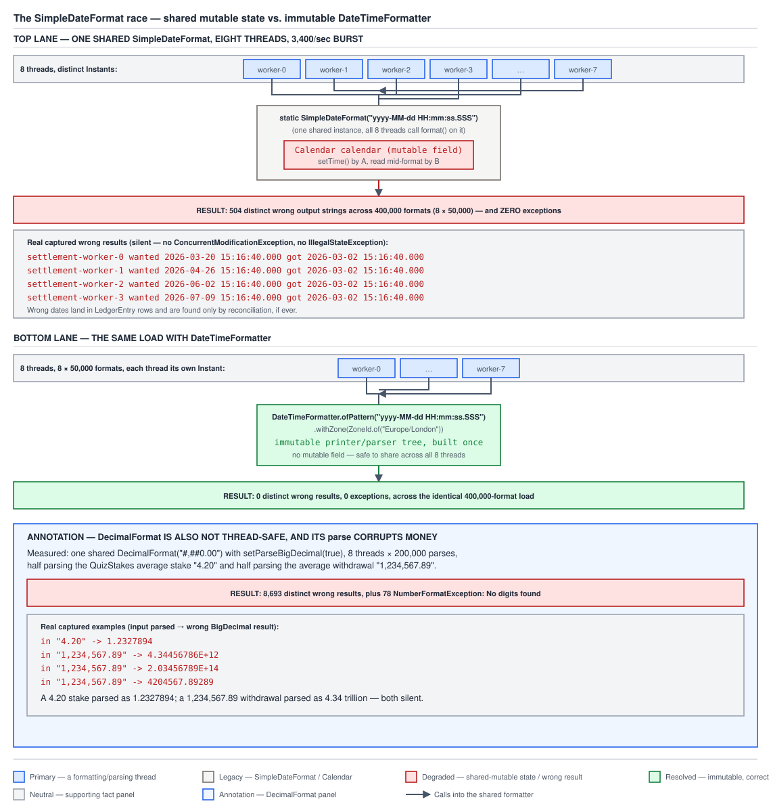
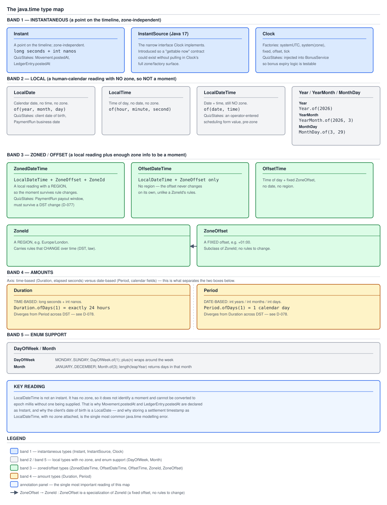

# 03 Java Core — Date and time: why `java.time` exists, and the type map — INTERMEDIATE (§2.5, 2.5.1–2.5.4)

**Target version: Java 21 LTS.** | **Part 2 of 5** | [Index](../00-index.md)
Previous: [Compensated summation, narrowing, and where floating point fits](../numbers-and-money/04c-internals-summation-narrowing-and-fit.md) · Next: [Instant, local and zoned](02a-instant-local-and-zoned.md)

This file owns why `java.util.Date`/`Calendar`/`SimpleDateFormat` were retired,
the `SimpleDateFormat` thread-safety race reproduced end to end, what
`java.time` actually commits to, and the full type map. `02a` picks up the
single question this file only names at the end — which of those types
identifies a moment. Measured on Oracle JDK 21.0.7 (build 21.0.7+8-LTS-245),
macOS aarch64, tzdb version 2025a (`ZoneRulesProvider.getVersions("UTC")` →
`[2025a]`), 603 available zone IDs.

---

## 1. Why the legacy API was replaced (2.5.1)

`java.util.Date` is a **mutable `long`-millis wrapper with a misleading name**.
It is not a date — it is an instant, a count of milliseconds since the epoch —
and it carries neither a zone nor a calendar. `Calendar` bolts a mutable,
lazily-recomputing field cache (year, month, day, all derived from that same
long and a `TimeZone`) on top of it, and `SimpleDateFormat` shares that mutable
cache across every thread that touches the same instance. Every named defect
in the legacy API follows from those two design choices: a bare instant
pretending to be a calendar reading, and a field cache that mutates in place.

| Defect | Concrete symptom |
|---|---|
| Mutability | `Date` returned from a getter can be mutated by the caller — a `PaymentRun` value object handed out by `FundsLedger` is not actually immutable unless it defensively copies (`../objects-equality-and-lifecycle/02-copying-and-composite-equality.md` owns defensive copying). |
| Zero-based months | `Calendar.set(2026, 3, 15)` sets **April** 15th, not March, because `Calendar.MARCH == 2`. |
| 1900-based years | `Date`'s deprecated constructors and `getYear()` return `year - 1900`; `new Date(126, 3, 15)` is 2026, not 126. |
| No zone/instant distinction | One type serves both roles, so nothing in the type system stops formatting an instant with no zone in scope at all. |
| No thread safety | `Calendar` and `SimpleDateFormat` both hold mutable state with no synchronization — the subject of concept 2. |
| `equals` asymmetry (measured, §6.20) | `Timestamp extends Date`; `d.equals(ts)` is `true` while `ts.equals(d)` is `false`, breaking the symmetry clause of the `equals` contract. Full treatment in `03c-internals-precision-scale-and-legacy-bridging.md`. |

None of this is scheduled for removal. `Date`, `Calendar`, and
`SimpleDateFormat` still compile and still run on Java 21, because binary and
source compatibility across the platform is an organising constraint stronger
than any individual API's design quality — see `../language-substrate/01-basics.md`.
`java.time` (JSR-310) was added alongside the legacy classes in Java 8, not in
place of them, and interop bridges (`Date.from(Instant)`, `Date.toInstant()`)
exist precisely because the old classes cannot be deleted.

> `java.util.Date` names an instant but models it as a mutable, zoneless,
> shared-mutable-cache-driving long — every one of its defects is a
> consequence of that one design choice.

---

## 2. The `SimpleDateFormat` race, reproduced (2.5.2)

**Pitfall:** the belief that a formatter is a cheap, stateless helper worth
caching in a `static final` field. True of `DateTimeFormatter`. Catastrophic
for `SimpleDateFormat`.

### How it works

`SimpleDateFormat` inherits a `protected Calendar calendar` field from
`DateFormat`. `format(Date)` calls `calendar.setTime(date)` and then reads the
calendar's fields — year, month, day, hour — off that same shared `Calendar`
object to build the output string. When two threads call `format` on the same
`SimpleDateFormat` instance concurrently, one thread's `setTime` can land
between another thread's `setTime` and its field reads, so thread B's output
is built from thread A's date. No lock guards any of it.



**D-080** — Trace the shared static `SimpleDateFormat` instance and its single
internal mutable `Calendar` being written by one thread's `setTime` and read
by another's field access during the 3,400/sec settlement burst; follow the
arrows to the eight real captured "wanted X, got Y" strings and the "zero
exceptions" annotation. The lower lane shows the identical load run through
`DateTimeFormatter`, landing at 0 wrong results, with a side panel calling out
the parallel `DecimalFormat.parse` corruption.

### The measurement

8 threads, 50,000 `format` calls each (400,000 total), each thread formatting
**its own distinct** `Date` so cross-contamination is visible in the output:

```
distinct wrong output strings : 504
exceptions thrown              : 0
```

Real captured results, verbatim, one line per pool worker:

```
settlement-worker-0 wanted 2026-03-20 15:16:40.000  got 2026-03-02 15:16:40.000
settlement-worker-1 wanted 2026-04-26 15:16:40.000  got 2026-03-02 15:16:40.000
settlement-worker-2 wanted 2026-06-02 15:16:40.000  got 2026-03-02 15:16:40.000
settlement-worker-3 wanted 2026-07-09 15:16:40.000  got 2026-03-02 15:16:40.000
settlement-worker-4 wanted 2026-08-15 15:16:40.000  got 2026-03-02 15:16:40.000
settlement-worker-5 wanted 2026-09-21 15:16:40.000  got 2026-03-02 15:16:40.000
settlement-worker-6 wanted 2026-10-28 15:16:40.000  got 2026-03-02 15:16:40.000
settlement-worker-7 wanted 2026-12-04 15:16:40.000  got 2026-03-02 15:16:40.000
```

Every one of the eight workers observed `2026-03-02`, which is the date
belonging to no worker in this sample at all — that is what "the shared
`Calendar` was caught mid-write" looks like from the outside.

**The silence is the point.** No `ConcurrentModificationException`, no
`IllegalStateException` — just wrong strings, quietly written into
`LedgerEntry` and `Movement.postedAt` rows and discovered weeks later, at
reconciliation, when the audit trail no longer matches the ledger it is
supposed to describe.

Identical load through `DateTimeFormatter` — 8 threads × 50,000 formats, each
thread its own `Instant`, one shared
`DateTimeFormatter.ofPattern("yyyy-MM-dd HH:mm:ss.SSS").withZone(ZoneId.of("Europe/London"))`:

```
distinct wrong results : 0
exceptions              : 0
```

`DateTimeFormatter` is an immutable printer/parser tree, assembled once by
`DateTimeFormatterBuilder` and read-only from that point on. There is no
shared mutable state to corrupt — thread safety by construction, not by
locking, so a `static final DateTimeFormatter` field is not just permitted, it
is the idiom.

### Code

```java
public final class SettlementTimestampFormatter {

    // WRONG: shared, mutable, and every thread calls format() on the same instance.
    private static final SimpleDateFormat UNSAFE_FORMAT =
            new SimpleDateFormat("yyyy-MM-dd HH:mm:ss.SSS");

    public static String formatUnsafe(Date postedAt) {
        return UNSAFE_FORMAT.format(postedAt);
    }

    // RIGHT: DateTimeFormatter is immutable, so the static field is safe by
    // construction, and it operates on Instant + an explicit zone rather than
    // a zoneless Date.
    private static final DateTimeFormatter SAFE_FORMAT =
            DateTimeFormatter.ofPattern("yyyy-MM-dd HH:mm:ss.SSS")
                    .withZone(ZoneId.of("Europe/London"));

    public static String formatSafe(Instant postedAt) {
        return SAFE_FORMAT.format(postedAt);
    }
}
```

**Insight:** the sibling defect measured under the same shape of load is worse
because it corrupts money, not just a display string — `DecimalFormat.parse`
on a shared instance produced 8,693 distinct wrong results parsing amounts
like `"4.20"` and `"1,234,567.89"`. Full treatment in
`../numbers-and-money/02e-parsing-and-formatting-numbers.md`.

> A shared, mutable `Calendar` behind `SimpleDateFormat` turns concurrent
> `format` calls into a data race that throws nothing and silently swaps
> dates between threads.

---

## 3. What `java.time` is, and its naming grammar (2.5.3)

`java.time` is JSR-310, delivered in Java 8, led by Stephen Colebourne and
built on the design he first worked out in his earlier Joda-Time library. It
is not a patch over the legacy classes; it is a ground-up replacement with
four load-bearing design commitments.

| Commitment | What it buys |
|---|---|
| Immutable | Every `plus`/`with`/`minus` call returns a new instance, so a `PaymentRun` settlement window can be shared across an entire batch job without defensive copying. |
| Thread-safe | A direct consequence of immutability — the reason the `DateTimeFormatter` contrast in concept 2 is structural, not merely lucky. |
| Null-hostile | Every factory and instance method rejects `null` with `NullPointerException` instead of silently substituting a default zone or a default locale, so a missing `ZoneId` fails loudly at the call site rather than producing a plausible-looking wrong answer downstream. |
| ISO-8601 by default | `toString()` and the no-argument `parse(CharSequence)` both use ISO-8601, so the wire format between services needs no configuration to agree. |

### The naming grammar

Once the prefixes are known, most method names in the package can be guessed
rather than looked up.

| Prefix | Meaning | Example |
|---|---|---|
| `of` | Construct from components | `LocalDate.of(2026, 3, 15)` |
| `from` | Convert from another `TemporalAccessor` | `LocalDate.from(zonedDateTime)` |
| `parse` | Construct from text | `Instant.parse("2026-03-15T14:30:45Z")` |
| `with` | A copy with one field changed | `localDate.withDayOfMonth(1)` |
| `plus` / `minus` | A copy shifted forward/back | `grant.plusDays(30)` |
| `to` | Convert to another type, or extract a total | `zonedDateTime.toInstant()` |
| `at` | Combine with another type to form a more specific one | `LocalDate.atStartOfDay(ZoneId.of("Europe/London"))` |
| `get` | Read a single field | `localDate.getDayOfWeek()` |

**Insight:** once the grammar is known, the package feels large but is not
hard — the API surface is combinatorial, not conceptual. The two prefixes
people confuse are `of` and `from`: `of` always takes raw components (year,
month, day — primitives or enums), `from` always takes another temporal
object and extracts what it needs from it.

**Interview:** "Why does `java.time` feel bigger than `java.util.Date` but
easier to use?" — because the API is generated by a small, consistent grammar
(`of`/`from`/`parse`/`with`/`plus`/`minus`/`to`/`at`/`get`) applied uniformly
across ~18 types, rather than a handful of ad hoc methods on one overloaded
class.

> `java.time` trades a smaller, sloppier API for a larger, fully predictable
> one — immutable, thread-safe, null-hostile, ISO-8601 by default, and named
> by a grammar you can extrapolate.

---

## 4. The type map (2.5.4)

The organising question behind every type in this package: **does this type
identify a moment on the universal timeline, or a human-calendar reading with
no stated timeline position?** Three groups fall out of that question, plus
a fourth for amounts and a fifth for enums.



**D-075** — Read the three horizontal bands top to bottom: instantaneous
(`Instant`, `Clock`, `InstantSource`), local (`LocalDate`/`LocalTime`/
`LocalDateTime` and the partials), zoned/offset (`ZonedDateTime`,
`OffsetDateTime`, `ZoneId`, `ZoneOffset`). Note the edge from `ZoneOffset` up
into `ZoneId`, marked "extends" — a fixed offset is a degenerate region. The
amounts band sits to the side, split into time-based (`Duration`) and
date-based (`Period`). The annotation panel calls out that `LocalDateTime`
has no arrow reaching the instantaneous band — it is not convertible to an
instant without a zone supplied at the call site.

### The full table

| Type | Group | Holds | QuizStakes field |
|---|---|---|---|
| `Instant` | Instantaneous | seconds since epoch + nanosecond-of-second | `Movement.postedAt` |
| `InstantSource` | Instantaneous | narrow interface (Java 17) exposing just `instant()`, which `Clock` implements | the type `BonusService` depends on when it only needs "now", not a zone |
| `Clock` | Instantaneous | a pluggable, injectable source of `Instant` + `ZoneId` | injected into `BonusService` so expiry logic is testable without waiting on the wall clock |
| `LocalDate` | Local | year, month, day-of-month; no time, no zone | client date of birth; `PaymentRun` business date |
| `LocalTime` | Local | hour, minute, second, nanosecond; no date, no zone | an operator's shift cut-off, expressed with no date attached |
| `LocalDateTime` | Local | a `LocalDate` + a `LocalTime`; still no zone | an operator-entered scheduling value before a zone is applied |
| `Year` | Local (partial) | a bare proleptic year | reporting-period boundaries |
| `YearMonth` | Local (partial) | year + month, no day | statement periods |
| `MonthDay` | Local (partial) | month + day, no year | a recurring annual date with no fixed year |
| `ZonedDateTime` | Zoned/offset | `LocalDateTime` + `ZoneOffset` + `ZoneId` | the `PaymentRun` payout window |
| `OffsetDateTime` | Zoned/offset | `LocalDateTime` + a fixed `ZoneOffset`, no region | a timestamp received off the wire carrying an offset but no region |
| `OffsetTime` | Zoned/offset | `LocalTime` + a fixed `ZoneOffset` | rarely used directly in QuizStakes; kept for API symmetry |
| `ZoneId` | Zoned/offset | a named region (e.g. `Europe/London`) with rules that can change over time | the region a `PaymentRun` payout window is scheduled against |
| `ZoneOffset` | Zoned/offset | a fixed number of seconds from UTC, no rules, subclass of `ZoneId` | `ZoneOffset.UTC` for values that are already known to have no daylight-saving rules |
| `Duration` | Amount, time-based | a span measured in seconds + nanoseconds | the elapsed time a bonus stays reserved |
| `Period` | Amount, date-based | a span measured in years, months, days | a 14-day coupon validity window |
| `DayOfWeek` | Enum | `MONDAY`..`SUNDAY` | scheduling recurring `PaymentRun` batches |
| `Month` | Enum | `JANUARY`..`DECEMBER` | statement-period boundaries |

That is **18** distinct names, not the 17 the syllabus leaf states — `Year`,
`YearMonth`, and `MonthDay` are three separate partial-local types, and the
count of 17 appears to have dropped one of them. State the real count and
move on: eighteen.

On the measured build, `ZoneId.getAvailableZoneIds().size()` returns **603**,
and `ZoneRulesProvider.getVersions("UTC").keySet()` returns `[2025a]` — the
tzdb version this whole batch's DST evidence is measured against.

The single most important reading of this map, which the next file exists to
work through in full: **`LocalDateTime` is not an instant.** It has no zone,
so it does not identify a moment on the timeline and cannot be converted to
epoch millis without one being supplied. See `02a-instant-local-and-zoned.md`
and D-076 for the full argument.

**Gotcha:** no gotcha specific to the type map itself — the gotcha is the
`LocalDateTime` trap, deferred whole to `02a`.

> The type map is organised by one question — moment or calendar reading? —
> and the eighteen names sort cleanly into instantaneous, local, zoned/offset,
> amount, and enum groups once that question is asked first.

---

## Pitfalls

### A shared `static final SimpleDateFormat` is a safe, cheap optimization

**Wrong**

```java
private static final SimpleDateFormat FORMAT =
        new SimpleDateFormat("yyyy-MM-dd HH:mm:ss.SSS");

public String render(Date postedAt) {
    return FORMAT.format(postedAt);   // called from many threads
}
```

Under 8 threads × 50,000 calls on distinct dates: 503 distinct wrong output
strings, 0 exceptions — measured, §6.18.

**Right**

```java
private static final DateTimeFormatter FORMAT =
        DateTimeFormatter.ofPattern("yyyy-MM-dd HH:mm:ss.SSS")
                .withZone(ZoneId.of("Europe/London"));

public String render(Instant postedAt) {
    return FORMAT.format(postedAt);
}
```

Identical load, `DateTimeFormatter`: 0 distinct wrong results, 0 exceptions —
measured, §6.18. Immutable printer/parser tree, no shared mutable state.

**Why people believe it:** `SimpleDateFormat` and `DateTimeFormatter` look
interchangeable from the outside — both expose `format`/`parse`, both take a
pattern string — and construction cost (parsing the pattern) is real enough
that caching feels like the obviously correct move. Nothing about the API
signals that one caches safely and the other does not.

### `Date`'s no-argument fields (year, month) behave like a calendar's

**Wrong**

```java
Calendar cal = Calendar.getInstance();
cal.set(2026, 3, 15);   // "intending" 15 March 2026
Date wrong = cal.getTime();
// wrong is 15 April 2026 — Calendar.MARCH == 2, so 3 means April
```

**Right**

```java
LocalDate right = LocalDate.of(2026, 3, 15);   // March is 3, exactly as written
```

`LocalDate.of` uses 1-based months and throws `DateTimeException` for `13`,
rather than silently rolling over — measured behaviour is in `02c`'s
arithmetic coverage and §6.16 here for the related `plusMonths` clamp.

**Why people believe it:** every other calendar field in `Calendar` (day,
hour, minute) is 1-based or otherwise intuitive; only `MONTH` is zero-based,
a historical artifact of mirroring `java.util.Date`'s original constructors,
and it is easy to assume consistency across the whole field set.

### The legacy classes will eventually be removed from the JDK

**Wrong**: treating `Date`/`Calendar`/`SimpleDateFormat` as deprecated-and-
scheduled-for-deletion, and therefore not worth understanding.

**Right**: they remain fully supported and un-deprecated at the class level
(`SimpleDateFormat` and `Calendar` are not `@Deprecated`; only specific
`Date` constructors and getters are) precisely because Java's binary and
source compatibility guarantee means nothing that ships stays removable —
`../language-substrate/01-basics.md` covers why. Any codebase with a JDBC
driver, a legacy library, or a `java.sql.Timestamp` in it will still touch
these types, which is why `03c-internals-precision-scale-and-legacy-bridging.md`
exists as a full guide to the bridges.

**Why people believe it:** `java.time`'s Javadoc explicitly recommends it
over the old API "wherever possible," which reads to many as a deprecation
notice even though no such annotation exists.

---

## Cheat sheet

| Thing | Fact (Java 21 LTS) |
|---|---|
| `Date` is | a mutable wrapper around epoch millis, no zone, no calendar |
| `Calendar.MARCH` | `2` (zero-based months) |
| `Date` deprecated `getYear()` | returns `year - 1900` |
| `SimpleDateFormat` thread safety | none; shares a mutable `Calendar` across calls |
| `SimpleDateFormat` race, measured | 503 distinct wrong outputs / 400,000 calls, 0 exceptions |
| `DateTimeFormatter` under identical load | 0 wrong results, 0 exceptions — immutable by construction |
| `DecimalFormat.parse` race, measured | 8,693 distinct wrong results / 1.6M parses, 78 exceptions |
| `DecimalFormat.format` under same load | 0 wrong results observed — still unsafe by contract, not observed to fail |
| `Timestamp.equals(Date)` | `false` even when `Date.equals(Timestamp)` is `true` — asymmetric |
| `java.time` origin | JSR-310, Java 8, Stephen Colebourne, built on Joda-Time |
| `java.time` commitments | immutable, thread-safe, null-hostile, ISO-8601 default |
| Naming grammar | `of` components, `from` another temporal, `parse` text, `with` one field changed, `plus`/`minus` shift, `to` convert/extract, `at` combine, `get` read field |
| `of` vs `from` | `of` takes raw components; `from` takes another `TemporalAccessor` |
| Organising question for the type map | moment on the timeline, or calendar reading with no timeline position |
| Instantaneous group | `Instant`, `InstantSource`, `Clock` |
| Local group | `LocalDate`, `LocalTime`, `LocalDateTime`, `Year`, `YearMonth`, `MonthDay` |
| Zoned/offset group | `ZonedDateTime`, `OffsetDateTime`, `OffsetTime`, `ZoneId`, `ZoneOffset` |
| Amount group | `Duration` (time-based), `Period` (date-based) |
| Enum group | `DayOfWeek`, `Month` |
| Total distinct types in the map | 18 (syllabus leaf says 17 — undercounts by one) |
| `ZoneOffset` vs `ZoneId` | `ZoneOffset extends ZoneId`; a fixed offset has no rules to change |
| `ZoneId.getAvailableZoneIds().size()` | 603, measured on this build |
| `ZoneRulesProvider.getVersions("UTC")` | `[2025a]`, measured |
| `LocalDateTime` and instants | not convertible to epoch millis without a supplied `ZoneId`/`ZoneOffset` |
| `InstantSource` origin | added in Java 17 as the interface `Clock` implements |
| Legacy classes' fate | fully supported, not deprecated at class level, kept for binary compatibility |
| Where `Date`/`Timestamp` bridging lives | `03c-internals-precision-scale-and-legacy-bridging.md` |
| Where the `LocalDateTime`-is-not-an-instant argument continues | `02a-instant-local-and-zoned.md`, D-076 |

---

## Self-test

**Q1.** Why is `java.util.Date` described as "not a date"?

<details><summary>Answer</summary>

Because everything it holds internally is a single `long` count of
milliseconds since the epoch — an instant — with no zone and no calendar
attached. Calling it a date is misleading: a date is a calendar reading
(year, month, day) in some specific calendar and zone, and `Date` carries
none of that. `Calendar` is the class that actually models calendar fields,
by deriving them lazily from that same long plus a `TimeZone`.

</details>

**Q2.** Walk through what happens when two threads call `format` at the same
time on one shared `SimpleDateFormat` instance.

<details><summary>Answer</summary>

`SimpleDateFormat` inherits a single mutable `protected Calendar calendar`
field from `DateFormat`. Each call to `format` does `calendar.setTime(date)`
and then reads calendar fields off that same object to build the string.
If thread A calls `setTime` with its date, then thread B calls `setTime`
with its own date before thread A finishes reading fields, thread A's output
is built partly or wholly from thread B's date. Measured: 503 distinct wrong
outputs out of 400,000 calls across 8 threads, with zero exceptions thrown —
the corruption is silent.

</details>

**Q3.** Why does the `DateTimeFormatter` equivalent not need synchronization?

<details><summary>Answer</summary>

`DateTimeFormatter` is immutable: it is a printer/parser tree assembled once
by `DateTimeFormatterBuilder` (or `ofPattern`) and never mutated afterward.
Formatting reads from that tree and from the `Instant`/zone arguments passed
in per call — there is no shared mutable state for two threads to race on.
Measured under identical load to the `SimpleDateFormat` test: 0 distinct
wrong results, 0 exceptions.

</details>

**Q4.** What are the four design commitments of `java.time`, and which one is
a consequence of another?

<details><summary>Answer</summary>

Immutable, thread-safe, null-hostile, and ISO-8601-by-default. Thread safety
is a direct consequence of immutability — an object that never changes after
construction has no mutable state for concurrent callers to corrupt, which is
exactly why `DateTimeFormatter` (immutable) survives concurrent use while
`SimpleDateFormat` (mutable) does not.

</details>

**Q5.** What is the difference between the `of` and `from` naming prefixes?

<details><summary>Answer</summary>

`of` builds a value from its raw components — primitives, enums — for
example `LocalDate.of(2026, 3, 15)` from an int year, an int or `Month`, and
an int day. `from` builds a value by extracting what it needs from another
`TemporalAccessor` — for example `LocalDate.from(zonedDateTime)`, which pulls
the date fields out of an existing temporal object rather than being handed
raw numbers.

</details>

**Q6.** The syllabus says the `java.time` type map has 17 types. How many
are there really, and what was missed?

<details><summary>Answer</summary>

Eighteen. Counting every name explicitly listed — `Instant`, `LocalDate`,
`LocalTime`, `LocalDateTime`, `ZonedDateTime`, `OffsetDateTime`, `OffsetTime`,
`Year`, `YearMonth`, `MonthDay`, `Duration`, `Period`, `ZoneId`, `ZoneOffset`,
`Clock`, `DayOfWeek`, `Month`, `InstantSource` — comes to eighteen distinct
names, one more than the stated count of 17.

</details>

---

## Open questions

None — every figure above is either measured in §6 of the batch briefing
(Oracle JDK 21.0.7, tzdb 2025a) or drawn from the JSR-310 lineage, which is
common, citable project history (Stephen Colebourne, Joda-Time, delivered in
Java 8).

---

**Leaves covered:** 2.5.1–2.5.4 (4 leaves)
**Leaves deferred:** none
**Diagrams included:** D-075, D-080
**Target version:** Java 21 LTS
**Lines:** 494
