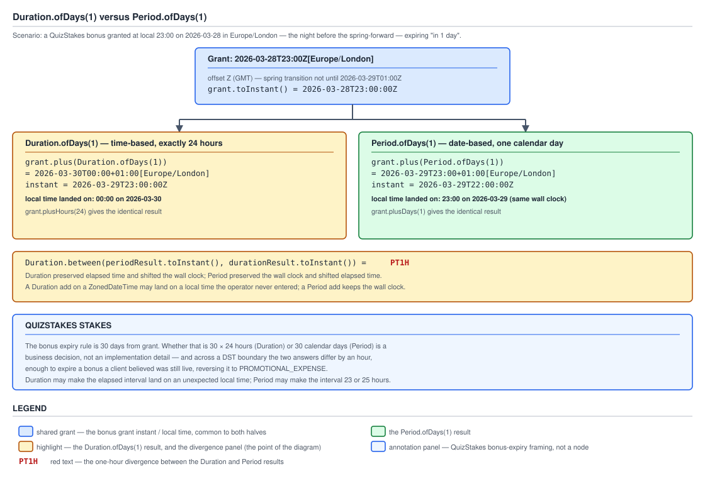
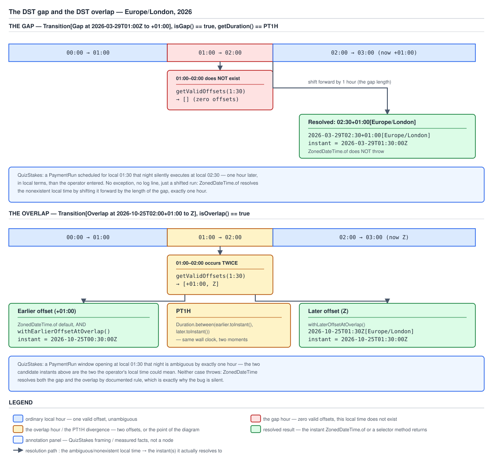

# 03 Java Core — `Duration` versus `Period`, DST gaps and overlaps, and the tzdb — INTERMEDIATE (§2.5, 2.5.7–2.5.10, 2.5.13)

**Target version: Java 21 LTS.** | **Part 2 of 5** | [Index](../00-index.md)
Previous: [Instant, local and zoned](02a-instant-local-and-zoned.md) · Next: [Temporal arithmetic and adjusters](02c-temporal-arithmetic-and-adjusters.md)

This file owns the two amount types (`Duration`, `Period`) and why they
disagree, the two DST anomalies (`gap`, `overlap`) and how `ZonedDateTime`
resolves each without throwing, the API for choosing an offset deliberately,
and the tzdb that supplies the rules underneath all of it. It answers: when I
add "1 day" or "30 days" to a timestamp, what actually happens across a
clock change, and where do the rules that decide it come from? Measured on
Oracle JDK 21.0.7 (build 21.0.7+8-LTS-245), macOS aarch64, tzdb **2025a**
(`ZoneRulesProvider.getVersions("UTC")` → `[2025a]`, `$JAVA_HOME/lib/tzdb.dat`
101,803 bytes dated 21 Feb 2025, 603 zone ids from
`ZoneId.getAvailableZoneIds().size()`).

---

## 1. `Duration` versus `Period`, and why they diverge (2.5.7, 2.5.8)

Picture a stopwatch and a wall calendar sitting side by side. The stopwatch
counts seconds; it does not know or care what a "day" means to a human. The
calendar counts days, months, years; it does not know or care how many
seconds actually elapsed. `Duration` is the stopwatch — a count of seconds
and nanoseconds, physics, elapsed time. `Period` is the calendar — a count of
years, months and days, a human's idea of "the same time tomorrow". On an
ordinary 24-hour day the stopwatch and the calendar agree, and that agreement
is precisely why the distinction stays invisible until a clock change makes
them disagree and something breaks.

### Why it exists

Before `java.time`, a single `long` of milliseconds (or a `Calendar.add`
call) was pressed into both jobs — "add one day" meant either "add
86,400,000 ms" or "increment the day-of-month field", and the same API call
could not express which one you meant. `Duration` and `Period` exist so the
two meanings have separate, non-interchangeable types, and the compiler
routes each to the arithmetic that actually matches it: `Duration` composes
with `Instant`, `LocalTime` and `LocalDateTime`'s time-based `plus`;
`Period` composes with `LocalDate` and `LocalDateTime`'s date-based `plus`.

### How it works

| | `Duration` | `Period` |
|---|---|---|
| Scale | seconds + nanos | years, months, days |
| Factory | `Duration.ofDays(1)`, `.ofHours`, `.ofMinutes` | `Period.ofDays(1)`, `.ofMonths`, `.ofYears` |
| `Comparable`? | Yes | **No** |
| `toString()` | `PT24H` | `P1D` |
| Drives | time-based `plus`/`minus` on `Instant`/`LocalTime`/`LocalDateTime` | date-based `plus`/`minus` on `LocalDate`/`LocalDateTime` |
| `ofDays(1)` means | exactly 24 hours, always | one calendar day, whatever its length turns out to be |

`Period` is not `Comparable` because "one month" has no fixed length — is
`P1M` bigger or smaller than `P31D`? It depends which month. Two `Period`s
cannot be ordered without first anchoring them to a concrete start date, so
the JDK correctly declines to give `Period` a `compareTo`. `Duration` has no
such ambiguity: a second is a second everywhere, so it orders naturally.



**D-078** — Look at the shared bonus-grant box anchored at `2026-03-28T23:00Z`
in `Europe/London`, the night before spring-forward. Follow the `Duration`
branch down to a local landing of `00:00` on the 30th, and the `Period`
branch down to a local landing of `23:00` on the 29th. Both resulting
instants are printed under their boxes, and the `PT1H` gap between them is
labelled where the two branches diverge.

`[PROVE]` — the full measured run (§6.15). A QuizStakes bonus is granted at
local 23:00 on 2026-03-28 in `Europe/London` and its 30-day expiry rule is
being modelled for a single day to see the mechanism:

```java
ZoneId london = ZoneId.of("Europe/London");
ZonedDateTime grant = ZonedDateTime.of(LocalDateTime.of(2026, 3, 28, 23, 0), london);

grant.toString();                     // 2026-03-28T23:00Z[Europe/London]
grant.toInstant().toString();         // 2026-03-28T23:00:00Z
// offset is Z here because the spring-forward transition is not until 2026-03-29T01:00Z

ZonedDateTime plusDuration = grant.plus(Duration.ofDays(1));
plusDuration.toString();              // 2026-03-30T00:00+01:00[Europe/London]
plusDuration.toInstant().toString();  // 2026-03-29T23:00:00Z
grant.plusHours(24).equals(plusDuration);   // true

ZonedDateTime plusPeriod = grant.plus(Period.ofDays(1));
plusPeriod.toString();                // 2026-03-29T23:00+01:00[Europe/London]
plusPeriod.toInstant().toString();    // 2026-03-29T22:00:00Z
grant.plusDays(1).equals(plusPeriod);       // true

Duration.between(plusPeriod.toInstant(), plusDuration.toInstant()); // PT1H
```

`plusHours(24)` matches the `Duration` result exactly; `plusDays(1)` matches
the `Period` result exactly. The convenience methods on `ZonedDateTime` are
not neutral shorthand — each belongs to one family or the other, and knowing
which family a method call belongs to is the entire skill this leaf is
testing.

**The reading:** `Duration` preserves elapsed time and moves the wall clock;
`Period` preserves the wall clock and moves elapsed time. QuizStakes bonus
expiry is written as "30 days from grant" — whether that means 30 × 24 hours
or 30 calendar days is a business decision, not an implementation detail, and
across a DST boundary the two answers differ by an hour. That is enough to
expire a bonus a client believed was still live and reverse the unspent
balance to `PROMOTIONAL_EXPENSE` a full hour before the calendar-day reading
says it should.

**Pitfall:** reaching for `Duration.ofDays(30)` because it reads naturally
for "30 days" — it silently encodes 720 hours of elapsed time rather than 30
calendar days, and disagrees with the calendar reading by an hour across
every DST transition the window spans.

```java
public final class BonusService {

    private final Clock clock;
    private final ZoneId operatingZone;

    public BonusService(Clock clock, ZoneId operatingZone) {
        this.clock = clock;
        this.operatingZone = operatingZone;
    }

    /**
     * Bonus expiry is a calendar-day rule ("30 days from grant"), so it is
     * expressed with Period, not Duration: the client reasons in calendar
     * days, and Period.ofDays(30) is the type that preserves that meaning
     * across a DST transition instead of silently adding 720 hours.
     */
    public ZonedDateTime expiryOf(Instant grantedAt) {
        ZonedDateTime grant = ZonedDateTime.ofInstant(grantedAt, operatingZone);
        return grant.plus(Period.ofDays(30));
    }
}
```

> **`Duration` measures elapsed seconds and nanoseconds; `Period` measures a
> calendar span of years, months and days. They agree on an ordinary day and
> diverge by exactly the DST offset change on a day that has one.**

---

## 2. The gap and the overlap (2.5.9)

Picture `ZoneId`'s rules as a lookup table mapping *instants* to offsets.
Walking that table forward in time, the offset occasionally jumps — and a
jump is not a smooth function of local time, so the map from local time back
to instant is not one-to-one. When the offset jumps **forward** an hour of
local time is skipped entirely, and no instant carries it. When the offset
jumps **backward** an hour of local time repeats, and two distinct instants
both carry it. Those are the only two anomalies that exist, and every DST bug
in a scheduling path is one of them.

### Why it exists

DST legislation moves clocks by discrete jumps rather than by a continuous
adjustment, because the point is to shift daylight relative to waking hours
on a specific calendar date, not to gradually drift. A jump necessarily
creates either a hole or a collision in the local-time line — there is no
DST scheme that avoids one or the other.

### How it works



**D-077** — Look at the local-time axis running across both 2026
`Europe/London` transitions. The spring frame shades the non-existent
01:00–02:00 hour and shows the forward-shift resolution landing the input at
02:30. The autumn frame shades the 01:00–02:00 hour that occurs twice and
draws both valid-offset instant lines separately, with the `withEarlier` and
`withLater` selectors labelled against each line.

`[PROVE]` — the measured transitions and resolutions (§6.14). `ZoneRules`
exposes each transition directly:

```java
ZoneId london = ZoneId.of("Europe/London");
ZoneRules rules = london.getRules();

ZoneOffsetTransition spring = rules.nextTransition(Instant.parse("2026-01-01T00:00:00Z"));
spring.toString();       // Transition[Gap at 2026-03-29T01:00Z to +01:00]
spring.isGap();          // true
spring.getDuration();    // PT1H

ZoneOffsetTransition autumn = rules.nextTransition(spring.getInstant());
autumn.toString();       // Transition[Overlap at 2026-10-25T02:00+01:00 to Z]
autumn.isOverlap();      // true
```

The gap — local 01:30 on 2026-03-29 does not exist:

```java
LocalDateTime gapTime = LocalDateTime.of(2026, 3, 29, 1, 30);
rules.getValidOffsets(gapTime);          // [] — empty list, zero valid offsets

ZonedDateTime resolved = ZonedDateTime.of(gapTime, london);
resolved.toString();                     // 2026-03-29T02:30+01:00[Europe/London]
resolved.getOffset();                    // +01:00
resolved.toInstant().toString();         // 2026-03-29T01:30:00Z
```

`ZonedDateTime.of` **does not throw**. It shifts the local time forward by
exactly the length of the gap (`PT1H`), so local 01:30 silently becomes local
02:30.

The overlap — local 01:30 on 2026-10-25 occurs twice:

```java
LocalDateTime overlapTime = LocalDateTime.of(2026, 10, 25, 1, 30);
rules.getValidOffsets(overlapTime);      // [+01:00, Z] — two valid offsets

ZonedDateTime resolved = ZonedDateTime.of(overlapTime, london);
resolved.toString();                     // 2026-10-25T01:30+01:00[Europe/London]
// ZonedDateTime.of picks the EARLIER offset by default
```

Both anomalies are resolved by documented rule rather than an exception —
the same shape of silence as the `SimpleDateFormat` race in
`02-date-and-time.md`: a DST bug in a scheduling path produces a *wrong
answer*, not a crash you would notice in a log. QuizStakes symptoms:
a `PaymentRun` scheduled for local 01:30 on 29 March silently runs an hour
late, at local 02:30; a `PaymentRun` window opening at local 01:30 on 25
October is ambiguous by exactly one hour, and the two candidate instants for
"the window opened" are an hour apart depending on which offset is chosen.

**Pitfall:** assuming `ZonedDateTime.of(LocalDateTime, ZoneId)` validates the
local time and throws on an impossible or ambiguous one. It never does —
every local time it is given resolves to *some* `ZonedDateTime`, silently.

> **A DST gap is a local time with zero valid offsets, resolved by shifting
> forward past it; a DST overlap is a local time with two valid offsets,
> resolved by picking one — neither ever throws.**

---

## 3. Choosing between the two offsets (2.5.10)

The size of the list `ZoneRules.getValidOffsets(LocalDateTime)` returns is
the whole diagnosis for a given local time: **0** means a gap, **1** means an
ordinary unambiguous local time, **2** means an overlap. That single integer
is the entire API surface you need to detect an anomaly before acting on a
local time.

### How it works

```java
rules.getValidOffsets(LocalDateTime.of(2026, 3, 29, 1, 30));   // [] — gap
rules.getValidOffsets(LocalDateTime.of(2026, 6, 15, 12, 0));   // [+01:00] — ordinary
rules.getValidOffsets(LocalDateTime.of(2026, 10, 25, 1, 30));  // [+01:00, Z] — overlap
```

`ZoneRules.getTransition(LocalDateTime)` is the companion query: it returns
the `ZoneOffsetTransition` covering an anomalous local time, and `null` for
an ordinary one. `ZoneOffsetTransition` is where `isGap()`, `isOverlap()` and
`getDuration()` live — everything concept 2 measured came from that one
object.

For an overlap already resolved into a `ZonedDateTime`, two selector methods
pick a side explicitly (§6.14):

```java
ZonedDateTime ambiguous = ZonedDateTime.of(LocalDateTime.of(2026, 10, 25, 1, 30), london);

ZonedDateTime earlier = ambiguous.withEarlierOffsetAtOverlap();
earlier.toString();                 // 2026-10-25T01:30+01:00[Europe/London]
earlier.toInstant().toString();     // 2026-10-25T00:30:00Z

ZonedDateTime later = ambiguous.withLaterOffsetAtOverlap();
later.toString();                   // 2026-10-25T01:30Z[Europe/London]
later.toInstant().toString();       // 2026-10-25T01:30:00Z

Duration.between(earlier.toInstant(), later.toInstant());   // PT1H
```

Both methods are **no-ops** when called on a local time that is not in an
overlap — they are safe to call unconditionally without checking first — and
neither has any effect on a gap, because a gap has no second offset to
select.

```java
public final class PaymentRunScheduler {

    private final ZoneId operatingZone;

    public PaymentRunScheduler(ZoneId operatingZone) {
        this.operatingZone = operatingZone;
    }

    /**
     * Rejects a gap outright rather than accepting the silent forward shift,
     * and for an overlap chooses the earlier offset deliberately: a payout
     * window is defined as "opens at this wall-clock moment", and the
     * earliest instant satisfying that reading is the one that should start
     * the batch window.
     */
    public ZonedDateTime resolveWindowOpen(LocalDateTime windowOpensAt) {
        ZoneRules rules = operatingZone.getRules();
        List<ZoneOffset> validOffsets = rules.getValidOffsets(windowOpensAt);

        if (validOffsets.isEmpty()) {
            throw new IllegalArgumentException(
                "PaymentRun window " + windowOpensAt + " falls in a DST gap in "
                    + operatingZone + " and does not exist; reschedule explicitly");
        }

        ZonedDateTime resolved = ZonedDateTime.of(windowOpensAt, operatingZone);
        return validOffsets.size() == 2 ? resolved.withEarlierOffsetAtOverlap() : resolved;
    }
}
```

**Insight:** the API cannot choose correctly for you, because which offset
is correct is a business question, not a technical one — the earlier offset
for "as soon as the window opens", the later offset for "the last possible
moment before the window is considered closed". `getValidOffsets` only tells
you a decision is needed; it never makes the decision.

> **`getValidOffsets(LocalDateTime).size()` — 0, 1 or 2 — is the complete
> gap/ordinary/overlap diagnosis; `withEarlierOffsetAtOverlap` and
> `withLaterOffsetAtOverlap` are safe no-ops outside an overlap and make the
> ambiguity an explicit, business-driven choice.**

---

## 4. The tzdb inside the JDK (2.5.13)

The fact people miss: **the zone rules `ZoneId` and `ZoneRules` consult are
data, not code, and that data ships bundled inside your JDK build.** Every
measurement in concepts 2 and 3 depended on that data being current — nothing
in `java.time` computes DST transitions from first principles, because the
rules are set by legislatures, not physics.

### How it works

Measured on this build (§6, environment line):

```
$JAVA_HOME/lib/tzdb.dat                                    101,803 bytes, dated 21 Feb 2025
ZoneRulesProvider.getVersions("UTC").keySet()               [2025a]
ZoneId.getAvailableZoneIds().size()                          603
```

`ZoneRulesProvider.getVersions(String)` is the runtime check worth naming
explicitly — it is a live, queryable fact about the running JVM, not
something you have to infer from a JDK build number. This is an operational
fact worth asserting at startup, not an implementation detail to skip past.

### Why it matters

The IANA tzdb is released several times a year — the `2025a` naming is
year-plus-revision-letter — driven by legislatures changing, extending or
abolishing DST with sometimes only weeks of notice. A JDK is only as current
as the tzdb it last shipped with. A long-lived container image built months
ago can be running stale rules for a region that legislated a change after
the image was built, and the failure mode is exactly the one this file has
been describing throughout: a wrong-by-an-hour answer, produced silently,
with no exception anywhere to flag it.

### When to reach for it, and when not

| Update path | Status |
|---|---|
| Update the JDK itself | The normal answer, and the only one that is continuously maintained by the vendor |
| `TZUpdater` | Oracle's standalone tool, documented to patch `tzdb.dat` in place without a full JDK update — whether it remains shipped and supported for JDK 21 specifically is not confirmed here; see Open questions |
| Custom `ZoneRulesProvider` via the SPI | The supported extension point (`java.time.zone.spi.ZoneRulesProvider`) for registering your own rule source ahead of the bundled one |

QuizStakes framing: the `PaymentRun` schedule (concept 3) and the 30-day
bonus expiry (concept 1) both depend on the zone rules the running JVM
happens to hold. A stale tzdb silently misplaces payout windows and expiry
boundaries for any affected region — which is why the tzdb version belongs
in a startup log line and in the deployment's build metadata, right next to
the JDK version, not buried in a dependency manifest nobody reads until
after the incident.

See `03a-internals-zonerules-and-tzdb.md` and D-128 for how `ZoneRulesProvider`
loads and caches `tzdb.dat` internally, and guide 19 by number for the
deployment and rollout half of keeping it current.

> **The tzdb is versioned data bundled inside the JDK, not derived logic —
> `ZoneRulesProvider.getVersions` is the runtime check, and a stale tzdb
> fails the same way every DST bug in this file fails: silently.**

---

## Pitfalls

### `Duration.ofDays(30)` correctly expresses "30 days" for a calendar rule

**Wrong**

```java
ZonedDateTime grant = ZonedDateTime.of(
    LocalDateTime.of(2026, 3, 28, 23, 0), ZoneId.of("Europe/London"));
ZonedDateTime expiry = grant.plus(Duration.ofDays(30));
```

Across the single DST transition this 30-day window spans, `expiry` lands
one hour later in wall-clock terms than a client counting calendar days
would expect — `plus(Duration.ofDays(1))` alone was already measured to
diverge from `plus(Period.ofDays(1))` by `PT1H` (§6.15), and that divergence
compounds identically whether the amount is 1 day or 30.

**Right**

```java
ZonedDateTime expiry = grant.plus(Period.ofDays(30));
```

`Period.ofDays(30)` preserves the wall-clock reading of "30 days from now"
exactly, moving the elapsed-time total by whatever the DST transitions
inside that window actually cost — which is what a calendar-day business
rule means.

**Why people believe it:** `Duration.ofDays` reads as the natural spelling
of "N days" in English, and on any day without a DST transition it produces
an identical answer to `Period.ofDays`, so the bug never surfaces in testing
unless the test explicitly spans a transition date.

### `ZonedDateTime.of` validates the local time it is given

**Wrong**

```java
LocalDateTime scheduled = LocalDateTime.of(2026, 3, 29, 1, 30);
ZonedDateTime run = ZonedDateTime.of(scheduled, ZoneId.of("Europe/London"));
// assumed: throws, because 01:30 on 2026-03-29 does not exist in Europe/London
```

Measured: no exception. `run` is `2026-03-29T02:30+01:00[Europe/London]`,
silently shifted forward by the gap length, and `run.toInstant()` is
`2026-03-29T01:30:00Z` — a `PaymentRun` scheduled for 01:30 executes an hour
later than the operator intended, with nothing in the logs to say so.

**Right**

```java
List<ZoneOffset> validOffsets = ZoneId.of("Europe/London").getRules().getValidOffsets(scheduled);
if (validOffsets.isEmpty()) {
    throw new IllegalArgumentException(scheduled + " falls in a DST gap and does not exist");
}
ZonedDateTime run = ZonedDateTime.of(scheduled, ZoneId.of("Europe/London"));
```

Checking `getValidOffsets().isEmpty()` before constructing catches the gap
explicitly and turns a silent one-hour shift into a loud, actionable
rejection at the point the schedule is created.

**Why people believe it:** every other `of` factory across `java.time`
(`LocalDate.of`, `LocalTime.of`) does throw `DateTimeException` on an
impossible field combination, so it is a reasonable but wrong extrapolation
that `ZonedDateTime.of` behaves the same way for an impossible local time.

### The tzdb bundled in the JDK is always current enough to trust

**Wrong**

```java
// assumed: whatever ZoneId.of("Europe/London") returns today reflects the
// latest DST legislation, because the JDK "just knows" the rules
ZonedDateTime run = ZonedDateTime.of(scheduled, ZoneId.of("Europe/London"));
```

Measured on this build, the tzdb is pinned at version `2025a`
(`ZoneRulesProvider.getVersions("UTC")` → `[2025a]`), a specific dated
snapshot (`tzdb.dat`, 21 Feb 2025) — not a live feed. A container image built
from this JDK months later is still running exactly `2025a`'s rules even if
a government has legislated a DST change since.

**Right**

```java
String tzdbVersion = ZoneRulesProvider.getVersions("UTC").keySet().iterator().next();
log.info("startup: JDK tzdb version = {}", tzdbVersion);
```

Logging the tzdb version at startup, alongside the JDK version, turns "is our
zone data current" from an unanswerable question into a one-line check
against the deployment's build metadata.

**Why people believe it:** DST rules feel like a fixed, physical fact rather
than legislation, so it is easy to assume the JDK's implementation of them
is similarly fixed rather than a periodically-updated data file that can go
stale between JDK releases.

---

## Cheat sheet

| Thing | Fact (Java 21 LTS) |
|---|---|
| `Duration` scale | seconds + nanos, elapsed time |
| `Period` scale | years + months + days, calendar span |
| `Duration` `Comparable`? | Yes |
| `Period` `Comparable`? | No — a month has no fixed length |
| `Duration.ofDays(1)` | exactly `PT24H`, always |
| `Period.ofDays(1)` | one calendar day, length varies with DST |
| `Duration.ofDays(1)` vs `Period.ofDays(1)` across a transition | differ by `PT1H`, measured |
| `plusHours(24)` matches | the `Duration` family |
| `plusDays(1)` matches | the `Period` family |
| `Duration` preserves | elapsed time; moves the wall clock |
| `Period` preserves | the wall clock; moves elapsed time |
| DST gap | a jump forward; a local time with **zero** valid offsets |
| DST overlap | a jump backward; a local time with **two** valid offsets |
| `getValidOffsets(LocalDateTime)` size | 0 = gap, 1 = ordinary, 2 = overlap |
| `ZonedDateTime.of` on a gap | never throws; shifts forward by the gap length |
| `ZonedDateTime.of` on an overlap | never throws; picks the **earlier** offset by default |
| `ZoneRules.getTransition(LocalDateTime)` | the `ZoneOffsetTransition` for an anomalous time, else `null` |
| `ZoneOffsetTransition.isGap()` / `isOverlap()` | mutually exclusive booleans on the transition |
| `ZoneOffsetTransition.getDuration()` | length of the jump, e.g. `PT1H` |
| `withEarlierOffsetAtOverlap()` | picks the earlier of two valid offsets; no-op outside an overlap |
| `withLaterOffsetAtOverlap()` | picks the later of two valid offsets; no-op outside an overlap |
| Measured 2026 `Europe/London` gap | `2026-03-29T01:00Z to +01:00`, `PT1H` |
| Measured 2026 `Europe/London` overlap | `2026-10-25T02:00+01:00 to Z` |
| Measured gap resolution | local `01:30` → `02:30+01:00[Europe/London]`, instant `01:30:00Z` |
| Measured overlap earlier/later instants | `00:30:00Z` / `01:30:00Z`, `PT1H` apart |
| tzdb version on this build | `2025a`, confirmed via `ZoneRulesProvider.getVersions` |
| `tzdb.dat` location and size | `$JAVA_HOME/lib/tzdb.dat`, 101,803 bytes, dated 21 Feb 2025 |
| Available zone ids on this build | 603 |
| tzdb update path (normal) | update the JDK |
| tzdb update path (in-place patch) | `TZUpdater` — exists; current support for JDK 21 unconfirmed |
| tzdb update path (custom rules) | register a `ZoneRulesProvider` via the SPI |
| Runtime tzdb check | `ZoneRulesProvider.getVersions("UTC")` |

---

## Self-test

**Q1.** Why does `Period` not implement `Comparable`, when `Duration` does?

<details><summary>Answer</summary>

`Duration` counts seconds, and a second has a fixed length everywhere, so any
two `Duration`s can be placed on a single number line and ordered
unambiguously. `Period` counts years, months and days, and a month's length
varies — 28 to 31 days depending which month, plus the leap-year wrinkle on
February. Without anchoring to a concrete start date, "one month" and "31
days" cannot be compared, so the JDK correctly declines to give `Period` a
`compareTo` rather than implementing one that would be wrong some of the
time.

</details>

**Q2.** A bonus is granted at local 23:00 the night before a spring-forward
transition and expires "in 1 day". Walk through what `plus(Duration.ofDays(1))`
and `plus(Period.ofDays(1))` each produce, and why they differ.

<details><summary>Answer</summary>

Measured for `2026-03-28T23:00Z[Europe/London]`: `plus(Duration.ofDays(1))`
adds exactly 24 hours of elapsed time and lands at
`2026-03-30T00:00+01:00[Europe/London]`, instant `2026-03-29T23:00:00Z` — the
wall clock moved from 23:00 to 00:00 because the DST jump ate an hour of
local time along the way. `plus(Period.ofDays(1))` instead preserves the
23:00 wall-clock reading and lands at `2026-03-29T23:00+01:00[Europe/London]`,
instant `2026-03-29T22:00:00Z` — 23 hours of elapsed time, one hour short of
a full day, because the calendar-day interpretation absorbs the DST jump
into the elapsed-time total instead of into the wall clock. The two
resulting instants are exactly `PT1H` apart.

</details>

**Q3.** `ZonedDateTime.of(localDateTime, zoneId)` is given a local time that
falls inside a DST gap. What happens?

<details><summary>Answer</summary>

It does not throw. `ZoneRules.getValidOffsets` would report an empty list
for that local time, meaning no offset makes it a real instant, but
`ZonedDateTime.of` resolves it anyway by shifting the local time forward by
exactly the length of the gap — for the measured `Europe/London` 2026 gap,
local `01:30` becomes `02:30+01:00[Europe/London]`, instant
`2026-03-29T01:30:00Z`. A `PaymentRun` or any other schedule built directly
from a local time in this window will silently run an hour later than
intended, with no exception to flag it.

</details>

**Q4.** What does the size of the list returned by
`ZoneRules.getValidOffsets(LocalDateTime)` tell you, and what does calling
`withEarlierOffsetAtOverlap()` do on a local time that is not ambiguous?

<details><summary>Answer</summary>

The size is the complete diagnosis: 0 means the local time falls in a gap
and does not exist, 1 means it is an ordinary unambiguous local time, 2
means it falls in an overlap and occurs twice. `withEarlierOffsetAtOverlap()`
called on a `ZonedDateTime` built from a non-ambiguous local time is a
documented no-op — it returns the same `ZonedDateTime` unchanged — so it is
safe to call unconditionally on any `ZonedDateTime` without first checking
whether an overlap applies.

</details>

**Q5.** The IANA tzdb version on a given JDK build is `2025a`. What does that
mean operationally, and how would you check it at runtime?

<details><summary>Answer</summary>

It means the zone rules — including every DST gap and overlap `ZoneRules`
resolves — reflect the state of DST legislation as captured in the `2025a`
release of the tzdb, dated to the `tzdb.dat` file's build date (21 Feb 2025
on the measured build), not whatever legislation is current today. If a
country changes its DST rules after that snapshot, a JVM running this build
will compute the old, now-wrong offsets for that region until its JDK or
tzdb data is updated — silently, with no exception. Check it at runtime with
`ZoneRulesProvider.getVersions("UTC").keySet()`, which returned `[2025a]` on
the measured build; logging this at startup next to the JDK version is the
practical mitigation.

</details>

**Q6.** Why does the QuizStakes 30-day bonus expiry rule use `Period.ofDays(30)`
rather than `Duration.ofDays(30)`?

<details><summary>Answer</summary>

The rule is phrased as "30 days from grant" in calendar terms — a client
reasoning about when their bonus expires counts calendar days, not elapsed
hours. `Period.ofDays(30)` preserves that wall-clock meaning across any DST
transition inside the 30-day window, whereas `Duration.ofDays(30)` would add
exactly 720 hours of elapsed time and land an hour off from the calendar
reading whenever the window crosses a transition — which, at QuizStakes'
volume, is common enough to matter and would incorrectly reverse a still-live
bonus's unspent balance to `PROMOTIONAL_EXPENSE` an hour early.

</details>

---

## Open questions

1. Whether Oracle's `TZUpdater` tool remains actively shipped and supported
   for patching `tzdb.dat` on JDK 21 specifically is not confirmed here — the
   Oracle TZUpdater release page and its JDK-version support matrix would
   settle it. Do not treat the tool's existence as confirmation of current
   JDK-21 support.

---

**Leaves covered:** 2.5.7–2.5.10, 2.5.13 (5 leaves)
**Leaves deferred:** none
**Diagrams included:** D-077, D-078
**Target version:** Java 21 LTS
**Lines:** 644
