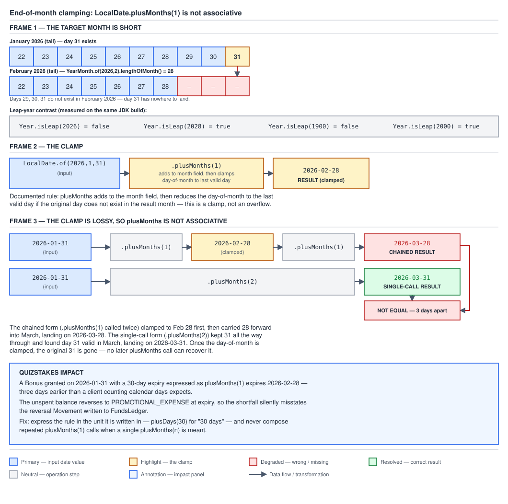

# 03 Java Core — Temporal arithmetic, adjusters and the SPI layer — INTERMEDIATE (§2.5, 2.5.14–2.5.17)

**Target version: Java 21 LTS.** | **Part 2 of 5** | [Index](../00-index.md)
Previous: [Duration versus Period, DST gaps and overlaps, and the tzdb](02b-amounts-dst-and-tzdb.md) · Next: [Formatting and parsing](02d-formatting-and-parsing.md)

This file owns date arithmetic's clamping rule, the `TemporalAdjusters`
family for expressing "move to the next X", the three `between` methods and
their truncation semantics, and the small interface layer (`TemporalAccessor`,
`Temporal`, `TemporalField`, `TemporalUnit`, `TemporalQuery`) that every
concrete `java.time` type is built on top of. It answers: when a calendar
operation has no single obviously-correct answer, what rule does the JDK
apply, and how do I express "move to a rule-defined point" or "measure the
gap between two points" without hand-rolling field arithmetic? Measured on
Oracle JDK 21.0.7 (build 21.0.7+8-LTS-245), macOS aarch64, tzdb 2025a.

---

## 1. Clamping, and why `plusMonths` is not associative (2.5.14)

`plusDays` is unambiguous: a day is a fixed unit, so "add N days" has exactly
one meaning regardless of where you start. `plusMonths` is not unambiguous,
because months have different lengths — "one month after 31 January" has no
literal answer, since February has no 31st day. The JDK resolves this by
**clamping to the last valid day of the target month**, never overflowing
into the following month and never throwing.

### Why it exists

The alternative designs are both worse: overflowing January 31 plus one
month into March 3 (as some older calendar libraries do) surprises anyone
expecting to land in February at all, and throwing on every end-of-month
addition would make `plusMonths` unusable for routine scheduling. Clamping
to the nearest valid day in the target month is the one behaviour that keeps
the result inside the month the caller asked for.

### How it works



**D-079** — Look at frame 1's side-by-side comparison of January's 31 days
against February's 28, frame 2's clamp landing on `2026-02-28`, and frame 3's
two differently-labelled answers: `2026-03-28` from two chained
`plusMonths(1)` calls against `2026-03-31` from one `plusMonths(2)` call,
with the three-day gap between them called out.

`[PROVE]` — the measured non-associativity (§6.16), which is the
interview-grade fact in this concept:

```java
LocalDate jan31 = LocalDate.of(2026, 1, 31);

jan31.plusMonths(1);                        // 2026-02-28 — clamped, Feb has no 31st
jan31.plusMonths(1).plusMonths(1);          // 2026-03-28 — clamp carried forward
jan31.plusMonths(2);                        // 2026-03-31 — 31 survived intact
```

**The two differ by three days.** The chained form's first call clamps 31
down to 28 and that information is gone — no later call can recover the
original 31, so the second `plusMonths(1)` adds one month to 28, landing on
28. The single `plusMonths(2)` call never clamps at all, because March has a
31st day and the original day-of-month survives the jump intact. The clamp
is lossy exactly once, at the point it fires, and every operation chained
after it inherits the loss.

Supporting measurements (§6.16), useful on their own and worth having ready:

```java
YearMonth.of(2026, 2).lengthOfMonth();      // 28
Year.isLeap(2026);                          // false
Year.isLeap(2028);                          // true
Year.isLeap(1900);                          // false — the century rule
Year.isLeap(2000);                          // true  — divisible by 400
```

A year divisible by 4 is a leap year unless it is also divisible by 100, in
which case it is not a leap year unless it is also divisible by 400 — `1900`
fails the 400 test and is not leap; `2000` passes it and is.

QuizStakes consequence: a bonus granted `2026-01-31` with its 30-day-ish
expiry rule mistakenly expressed as `plusMonths(1)` expires on `2026-02-28`,
three days earlier than a client who is counting actual days would expect,
and the unspent balance reverses to `PROMOTIONAL_EXPENSE` while the client
still believes the bonus is live.

**Pitfall:** composing repeated `plusMonths(1)` calls to walk forward month
by month, or expressing a day-counted business rule in months at all — both
silently discard information the moment a clamp fires.

```java
public final class BonusExpiryCalculator {

    /**
     * Expresses the arithmetic in the unit the business rule is actually
     * written in. "30 days" means plusDays(30) — never plusMonths, and
     * never a chain of repeated plusMonths(1) calls, both of which are
     * lossy the instant a clamp fires and give different answers depending
     * on how the same total span is decomposed.
     */
    public LocalDate expiryFrom(LocalDate grantDate) {
        return grantDate.plusDays(30);
    }
}
```

> **`plusMonths` clamps to the last valid day of the target month rather than
> overflowing or throwing, and that clamp is lossy — chaining `plusMonths(1)`
> calls can produce a different answer than one `plusMonths(N)` call over the
> same total span.**

---

## 2. `TemporalAdjusters` (2.5.15)

`with(TemporalAdjuster)` hands the temporal object to the adjuster and takes
back whatever the adjuster returns — an adjuster is nothing more than a
`Temporal -> Temporal` function. The entire "move to the next Friday" or
"move to the last day of the month" family needs no special-case support
inside `LocalDate` itself; it is built entirely on top of this one hook.
`TemporalAdjuster` is a functional interface with a single method,
`adjustInto(Temporal)`.

### How it works

| Adjuster | Applied to | Measured result |
|---|---|---|
| `firstDayOfMonth()` | `2026-02-10` | `2026-02-01` |
| `lastDayOfMonth()` | `2026-02-10` | `2026-02-28` (measured) |
| `firstDayOfNextMonth()` | `2026-02-10` | `2026-03-01` |
| `next(DayOfWeek.FRIDAY)` | `2026-03-15` | `2026-03-20` (measured) |
| `nextOrSame(DayOfWeek.SUNDAY)` | `2026-03-15` | `2026-03-15`, **unchanged** (measured) |
| `firstInMonth(DayOfWeek.MONDAY)` | `2026-03-01` | `2026-03-02` (measured) |

The `nextOrSame` row is the one people get wrong: `2026-03-15` is itself
measured to be a `SUNDAY` (`LocalDate.of(2026,3,15).getDayOfWeek()` →
`SUNDAY`), so `nextOrSame(DayOfWeek.SUNDAY)` returns the same date unchanged
rather than jumping a full week forward. `next(DayOfWeek.X)` always moves at
least one day, even if the input is already an `X`; `nextOrSame(DayOfWeek.X)`
returns the input untouched if it already is one. That is the entire
difference between the two, and it is exactly the case the measured example
exercises.

QuizStakes has 4 banking-partner payout windows per day and `PaymentRun`
batches are operator-signed, so an adjuster that snaps a `LocalDateTime` to
the next window boundary is a real domain need, written both as a lambda and
as a named class:

```java
public final class PayoutWindows {

    private static final List<LocalTime> WINDOW_STARTS = List.of(
        LocalTime.of(2, 0), LocalTime.of(8, 0), LocalTime.of(14, 0), LocalTime.of(20, 0));

    /** Lambda form: adjusts only the time-of-day, keeping the same date unless every window today has passed. */
    public static final TemporalAdjuster NEXT_WINDOW = temporal -> {
        LocalTime current = LocalTime.from(temporal);
        for (LocalTime windowStart : WINDOW_STARTS) {
            if (windowStart.isAfter(current)) {
                return temporal.with(windowStart);
            }
        }
        return temporal.plus(1, ChronoUnit.DAYS).with(WINDOW_STARTS.get(0));
    };

    private PayoutWindows() {
    }
}

/** Named-class form of the same adjuster, for call sites that prefer an explicit type. */
public final class NextPayoutWindowAdjuster implements TemporalAdjuster {

    private static final List<LocalTime> WINDOW_STARTS = List.of(
        LocalTime.of(2, 0), LocalTime.of(8, 0), LocalTime.of(14, 0), LocalTime.of(20, 0));

    @Override
    public Temporal adjustInto(Temporal temporal) {
        if (!temporal.isSupported(ChronoField.NANO_OF_DAY)) {
            throw new UnsupportedTemporalTypeException(
                "NextPayoutWindowAdjuster requires a time-bearing Temporal, got " + temporal.getClass());
        }
        LocalTime current = LocalTime.from(temporal);
        for (LocalTime windowStart : WINDOW_STARTS) {
            if (windowStart.isAfter(current)) {
                return temporal.with(windowStart);
            }
        }
        return temporal.plus(1, ChronoUnit.DAYS).with(WINDOW_STARTS.get(0));
    }
}
```

The rule that matters, and the one the built-in adjusters all follow: an
adjuster must never assume the incoming `Temporal` supports a field it needs
— query with `isSupported` first and throw `UnsupportedTemporalTypeException`
if it does not, exactly as `NextPayoutWindowAdjuster` does above before
touching `NANO_OF_DAY`.

No gotcha beyond the `nextOrSame` distinction already covered — the
mechanism itself has no other surprising edge.

> **A `TemporalAdjuster` is a `Temporal -> Temporal` function invoked through
> `with(TemporalAdjuster)`; the built-in family covers month boundaries and weekday
> navigation, and `next` always moves at least one unit while `nextOrSame`
> may return the input unchanged.**

---

## 3. The three `between` methods and their truncation (2.5.16)

| Method | Signature shape | Returns | Counts |
|---|---|---|---|
| `ChronoUnit.X.between(a, b)` | `(Temporal, Temporal) -> long` | a single count | complete units of one kind |
| `Period.between(LocalDate, LocalDate)` | `(LocalDate, LocalDate) -> Period` | years + months + days | a decomposed calendar span |
| `Duration.between(a, b)` | `(Temporal, Temporal) -> Duration` | seconds + nanos | elapsed time |

All three **truncate toward zero** — they count only *complete* units and
discard whatever remainder is left over — and all three are directional,
returning a negative result if `b` precedes `a`.

### How it works

Measured (§6.16):

```java
LocalDate jan31 = LocalDate.of(2026, 1, 31);
LocalDate mar1 = LocalDate.of(2026, 3, 1);

ChronoUnit.DAYS.between(jan31, mar1);       // 29
Period.between(jan31, mar1);                // P1M1D — same interval, decomposed
```

`29` and `P1M1D` describe the identical span two different ways and neither
is wrong — `DAYS.between` counts every whole day, `Period.between` splits
the same span into whole months plus a remainder in days.

The trap:

```java
LocalDate feb28 = LocalDate.of(2026, 2, 28);
ChronoUnit.MONTHS.between(jan31, feb28);    // 0
```

`MONTHS.between(jan31, feb28)` is **zero**, because `2026-02-28` is one day
short of a full month from `2026-01-31`, and `MONTHS.between` counts only
*complete* months — a partial month counts as none, no rounding. A
QuizStakes eligibility check written as `MONTHS.between(grantDate, today) >= 1`
returns `false` on the very day a human doing the arithmetic in their head
would say "yes, more than a month has passed" for that pair of dates.

`Duration.between` truncates the same way when applied to `LocalDateTime`,
and does so with **no zone applied at all**:

```java
Duration.between(
    LocalDateTime.of(2026, 3, 28, 23, 0),
    LocalDateTime.of(2026, 3, 30, 0, 0));   // PT25H
```

This span crosses the `Europe/London` 2026 spring-forward transition, but
`LocalDateTime` carries no zone, so the arithmetic is pure wall-clock local
time with no DST resolution involved — the answer is simply 25 hours of
clock face difference. See `02b-amounts-dst-and-tzdb.md` for what happens to
the equivalent computation once a `ZoneId` is applied and DST becomes part
of the calculation.

**Pitfall:** treating any of the three `between` methods as a rounding
operation. `ChronoUnit.MONTHS.between(jan31, feb28)` returning `0` rather
than `1` is the clearest evidence that all three count complete units only
and never round up.

> **`ChronoUnit.between`, `Period.between` and `Duration.between` all
> truncate toward zero, counting only complete units of their kind — a span
> one day short of a whole month counts as zero months, not one.**

---

## 4. The SPI layer underneath (2.5.17)

Every concrete `java.time` type — `LocalDate`, `Instant`, `ZonedDateTime` —
is a thin shell over a small set of interfaces, and once those interfaces are
visible the whole package stops feeling like an unrelated bag of classes and
starts looking like one mechanism reused five ways.

### How it works

| Interface | Role |
|---|---|
| `TemporalAccessor` | Read-only: "I can be asked for field values." `LocalDate`, `Instant`, and a raw parse result all implement it — which is why `DateTimeFormatter.parse` can hand back a generic `TemporalAccessor` before the caller has committed to a concrete type. |
| `Temporal` | Extends `TemporalAccessor`, adds `plus`/`minus`/`with`: "I can produce a modified copy of myself." |
| `TemporalField` | A field that can be read from a `TemporalAccessor`; `ChronoField` is the standard enum implementation, with constants such as `DAY_OF_MONTH` and `MONTH_OF_YEAR`. |
| `TemporalUnit` | A unit of measure for `plus`/`minus`/`between`; `ChronoUnit` is the standard enum implementation, with constants such as `DAYS` and `MONTHS`. |
| `TemporalAdjuster` / `TemporalAmount` | The two function-shaped extension points — `TemporalAdjuster` covered in concept 2, `TemporalAmount` (the common supertype of `Duration` and `Period`) covered in `02b-amounts-dst-and-tzdb.md`. |

`Temporal.plus(long, TemporalUnit)` is the mechanism worth seeing once,
because it explains why the same method call means different things on
different types without either type knowing about the other:

```java
someTemporal.plus(1, ChronoUnit.DAYS);
```

delegates to the unit itself — `ChronoUnit.DAYS.addTo(someTemporal, 1)` —
rather than `LocalDate` or `Instant` implementing "add a day" independently.
That double dispatch is why `plus(1, ChronoUnit.DAYS)` means exactly 24 hours
on an `Instant` and one calendar day on a `LocalDate`: the unit, not the
temporal, owns the meaning of "one day", and each `Temporal` implementation
only needs to answer `isSupported(TemporalUnit)` truthfully and let the unit
do the addition. Both sides guard with `isSupported` checks before
attempting the operation, throwing `UnsupportedTemporalTypeException`
otherwise — the same discipline concept 2's custom adjuster followed.

`truncatedTo(ChronoUnit)` zeroes every field smaller than the given unit, and
is only defined for units that divide a day evenly — `truncatedTo(ChronoUnit.HOURS)`
or `.MINUTES` work, but `truncatedTo(ChronoUnit.MONTHS)` throws
`UnsupportedTemporalTypeException`, because "truncate to the nearest month"
has no well-defined meaning as a sub-day field zeroing operation. The
precision consequences of this — what a truncated `Instant` equals and
doesn't equal — belong to `02e-clock-precision-and-storage.md`; this file
covers only the mechanism.

`ChronoField` is how a field is read generically rather than through a
type-specific getter: `temporal.get(ChronoField.DAY_OF_YEAR)` works on any
`TemporalAccessor` that supports it, and `ChronoField.range()` is what
produces the JDK's "Invalid value for MonthOfYear (valid values 1 - 12)"
class of message when a value falls outside a field's valid range.

`TemporalQuery` is the read-only mirror of `TemporalAdjuster` — a
`TemporalAccessor -> R` function, invoked through `query(TemporalQuery<R>)`
rather than `with(TemporalAdjuster)`, so it extracts a value instead of producing a
modified copy. `TemporalQueries` holds the standard ones: `zone()`,
`precision()`, `localDate()`. A short custom query for a coupon's validity
window:

```java
public final class CouponValidityQuery implements TemporalQuery<Boolean> {

    private final LocalDate couponIssuedOn;

    public CouponValidityQuery(LocalDate couponIssuedOn) {
        this.couponIssuedOn = couponIssuedOn;
    }

    /** True if the queried date falls within the coupon's 14-day validity window from issue. */
    @Override
    public Boolean queryFrom(TemporalAccessor temporal) {
        LocalDate candidate = LocalDate.from(temporal);
        LocalDate expiry = couponIssuedOn.plusDays(14);
        return !candidate.isBefore(couponIssuedOn) && !candidate.isAfter(expiry);
    }
}
```

Used as `someDate.query(new CouponValidityQuery(issuedOn))`.

No gotcha beyond `truncatedTo`'s sub-day restriction already covered — the
interfaces themselves compose predictably once the double-dispatch mechanism
is visible.

See `03b-internals-temporal-spi-and-formatter.md` for the internals of how
`ChronoUnit.addTo` and `ChronoField.getFrom` are actually wired to each
concrete type, and `02e-clock-precision-and-storage.md` for what
`truncatedTo` costs in equality and storage terms.

> **`TemporalAccessor` reads, `Temporal` reads and writes, `TemporalField`
> and `TemporalUnit` are the field/unit vocabulary, and `TemporalAdjuster`/
> `TemporalQuery` are the write/read function-shaped extension points — every
> concrete `java.time` type is built from this small, reused set.**

---

## Pitfalls

### Chaining `plusMonths(1)` calls gives the same result as one `plusMonths(N)` call

**Wrong**

```java
LocalDate jan31 = LocalDate.of(2026, 1, 31);
LocalDate viaChain = jan31.plusMonths(1).plusMonths(1);
```

`viaChain` is `2026-02-28`, not `2026-03-31`. Measured against
`jan31.plusMonths(2)`, which is `2026-03-31`, the two differ by three days —
the first `plusMonths(1)` clamps 31 down to 28 and that information cannot be
recovered by the second call.

**Right**

```java
LocalDate viaSingleCall = jan31.plusMonths(2);   // 2026-03-31
```

Express the total span as a single call in the unit the business rule uses;
never decompose a multi-unit addition into repeated single-unit additions
when a clamp can fire partway through.

**Why people believe it:** addition of plain numbers is associative, and it
is a reasonable but wrong extrapolation to assume `plusMonths` behaves the
same way — the clamping rule breaks associativity precisely at month-end
dates, which is an easy case to miss in ad hoc testing.

### `ChronoUnit.MONTHS.between` rounds to the nearest month

**Wrong**

```java
boolean overOneMonthOld = ChronoUnit.MONTHS.between(grantDate, LocalDate.of(2026, 2, 28)) >= 1;
```

For `grantDate = 2026-01-31`, this measures `0`, so `overOneMonthOld` is
`false` — even though 28 days have passed and a human would likely call that
"about a month".

**Right**

```java
boolean overOneMonthOld = !LocalDate.of(2026, 2, 28).isBefore(grantDate.plusDays(30));
```

Express the eligibility check in the same unit the business rule is actually
defined in (here, a day count), rather than relying on `MONTHS.between`'s
truncation to agree with informal human counting.

**Why people believe it:** `between` sounds like it should measure "how much
time has passed" in a proportional sense, but all three `between` methods
count only complete units of their kind and discard any remainder — there is
no rounding step anywhere in their contract.

### An adjuster or a generic `Temporal.plus(long, TemporalUnit)` call works on any `Temporal`

**Wrong**

```java
Instant.now().plus(1, ChronoUnit.MONTHS);
```

Throws `UnsupportedTemporalTypeException: Unsupported unit: Months` —
`Instant` does not support calendar-based units at all, only time-based ones,
because it has no concept of a calendar, only a count of seconds since the
epoch.

**Right**

```java
ZonedDateTime.now().plus(1, ChronoUnit.MONTHS);
```

`plus(long, TemporalUnit)` delegates to `ChronoUnit.MONTHS.addTo(temporal, 1)`, which
in turn requires the target to support calendar fields — `ZonedDateTime` (via
its `LocalDate` component) does, `Instant` does not, and each `Temporal`
implementation is expected to guard with `isSupported` and fail loudly rather
than silently degrading.

**Why people believe it:** the generic `plus(long, TemporalUnit)` signature
looks identical regardless of which `Temporal` it is called on, so it is easy
to assume the unit's applicability is universal rather than dependent on
what fields the specific `Temporal` implementation actually supports.

---

## Cheat sheet

| Thing | Fact (Java 21 LTS) |
|---|---|
| `plusMonths` on an invalid target day | clamps to the last valid day of the target month |
| `plusMonths` never | overflows into the next month or throws |
| `LocalDate.of(2026,1,31).plusMonths(1)` | `2026-02-28`, measured |
| `.plusMonths(1).plusMonths(1)` vs `.plusMonths(2)` | `2026-03-28` vs `2026-03-31` — 3 days apart, measured |
| `YearMonth.of(2026,2).lengthOfMonth()` | `28`, measured |
| `Year.isLeap(1900)` / `Year.isLeap(2000)` | `false` / `true` — the century rule |
| `TemporalAdjuster` shape | `Temporal -> Temporal`, one method `adjustInto` |
| `with(TemporalAdjuster)` | applies the adjuster, returns the result |
| `lastDayOfMonth()` on `2026-02-10` | `2026-02-28`, measured |
| `next(FRIDAY)` on `2026-03-15` | `2026-03-20`, measured |
| `nextOrSame(SUNDAY)` on `2026-03-15` | `2026-03-15` unchanged — the date is already a Sunday, measured |
| `firstInMonth(MONDAY)` on `2026-03-01` | `2026-03-02`, measured |
| `next` vs `nextOrSame` | `next` always moves >= 1 unit; `nextOrSame` may return input unchanged |
| Custom adjuster rule | check `isSupported` first; throw `UnsupportedTemporalTypeException` if not |
| `ChronoUnit.X.between(a,b)` returns | `long`, complete units only |
| `Period.between(LocalDate, LocalDate)` returns | `Period` (years+months+days) |
| `Duration.between(a,b)` returns | `Duration` (seconds+nanos) |
| All three `between` methods | truncate toward zero; directional (negative if `b` precedes `a`) |
| `DAYS.between(2026-01-31, 2026-03-01)` | `29`, measured |
| `Period.between` on the same pair | `P1M1D`, measured |
| `MONTHS.between(2026-01-31, 2026-02-28)` | `0` — one day short of a whole month, measured |
| `Duration.between` on `LocalDateTime` | pure wall-clock diff, no zone/DST applied |
| Measured `Duration.between` across a transition date (no zone) | `PT25H`, measured |
| `TemporalAccessor` | read-only: field access |
| `Temporal` | extends `TemporalAccessor`; adds `plus`/`minus`/`with` |
| `TemporalField` / standard enum | a readable field / `ChronoField` |
| `TemporalUnit` / standard enum | a unit of measure / `ChronoUnit` |
| `plus(long, TemporalUnit)` delegates to | `TemporalUnit.addTo(Temporal, long)` — double dispatch |
| `truncatedTo(ChronoUnit)` | zeroes sub-unit fields; only for units dividing a day evenly |
| `truncatedTo(ChronoUnit.MONTHS)` | throws `UnsupportedTemporalTypeException` |
| `ChronoField.range()` | source of "Invalid value for X (valid values 1 - 12)" style messages |
| `TemporalQuery<R>` | read-only mirror of `TemporalAdjuster`: `TemporalAccessor -> R`, via `query(TemporalQuery)` |
| `TemporalQueries` standard queries | `zone()`, `precision()`, `localDate()` |

---

## Self-test

**Q1.** Why does `LocalDate.of(2026,1,31).plusMonths(1).plusMonths(1)` give a
different answer than `LocalDate.of(2026,1,31).plusMonths(2)`?

<details><summary>Answer</summary>

Because the clamp `plusMonths` applies at an invalid target day is lossy.
The first `plusMonths(1)` call tries to land on the 31st of February, which
doesn't exist, so it clamps to `2026-02-28` — the original day-of-month, 31,
is now gone from the value entirely. The second `plusMonths(1)` call then
adds one month to 28, landing on `2026-03-28`. The single `plusMonths(2)`
call never clamps at all, because it targets March directly, which does have
a 31st day, so the original 31 survives intact and the result is
`2026-03-31`. The two answers differ by exactly three days, and the
divergence happens at the exact point the first chained call clamps.

</details>

**Q2.** What does `ChronoUnit.MONTHS.between(LocalDate.of(2026,1,31), LocalDate.of(2026,2,28))`
return, and why does that surprise people?

<details><summary>Answer</summary>

It returns `0`. `MONTHS.between` counts only complete months, and
`2026-02-28` is one day short of a full month after `2026-01-31` — February
simply doesn't have a 31st day to complete the month with. It surprises
people because they expect `between` to behave like a rounding or
proportional measure, so a gap of 28 days that "feels like about a month"
returns zero rather than one. The same truncation-toward-zero rule applies
to `ChronoUnit.between`, `Period.between` and `Duration.between` uniformly.

</details>

**Q3.** What is the difference between `TemporalAdjusters.next(DayOfWeek.SUNDAY)`
and `TemporalAdjusters.nextOrSame(DayOfWeek.SUNDAY)` when applied to a date
that is already a Sunday?

<details><summary>Answer</summary>

`next(SUNDAY)` always moves forward at least one day, even if the input is
already a Sunday — it would jump a full week ahead. `nextOrSame(SUNDAY)`
checks first whether the input already satisfies the condition and, if so,
returns it completely unchanged. Measured: `LocalDate.of(2026,3,15)` is
itself a Sunday, so `.with(TemporalAdjusters.nextOrSame(DayOfWeek.SUNDAY))`
returns `2026-03-15` unmodified, while `.with(TemporalAdjusters.next(DayOfWeek.SUNDAY))`
on the same date would return `2026-03-22`.

</details>

**Q4.** How does `someTemporal.plus(1, ChronoUnit.DAYS)` end up meaning
exactly 24 hours on an `Instant` but one calendar day on a `LocalDate`,
given that both call the same method?

<details><summary>Answer</summary>

`Temporal.plus(long, TemporalUnit)` doesn't implement the addition itself —
it delegates to the unit, calling `ChronoUnit.DAYS.addTo(temporal, 1)`. The
unit, not the temporal type, owns the meaning of "one day": for `Instant` it
means exactly 86,400 seconds of elapsed time, and for `LocalDate` it means
incrementing the day-of-month field with normal calendar carry rules. This
double dispatch is why the same call surface produces type-appropriate
behaviour without `Instant` and `LocalDate` needing to know anything about
each other, and each `Temporal` guards it with an `isSupported` check so
calling `plus(1, ChronoUnit.MONTHS)` on an `Instant` fails loudly with
`UnsupportedTemporalTypeException` rather than doing something wrong
silently.

</details>

**Q5.** What does `truncatedTo(ChronoUnit.MONTHS)` do, and why?

<details><summary>Answer</summary>

It throws `UnsupportedTemporalTypeException`. `truncatedTo` is defined only
for units that divide a day evenly, because its contract is to zero out
every field smaller than the given unit — that only has a well-defined
meaning for sub-day units like `HOURS`, `MINUTES`, `SECONDS` and `MILLIS`.
"Truncate to the nearest month" isn't a field-zeroing operation in the same
sense — a month has no fixed sub-day granularity to zero out — so the method
explicitly rejects it rather than guessing what truncating to a month should
mean.

</details>

**Q6.** What is `TemporalQuery`, and how does it differ from
`TemporalAdjuster`?

<details><summary>Answer</summary>

`TemporalQuery<R>` is a functional interface shaped as
`TemporalAccessor -> R`, invoked through `query(TemporalQuery<R>)` — it
extracts a value from a temporal without modifying it, which is why it only
needs `TemporalAccessor` rather than the read-write `Temporal`.
`TemporalAdjuster` is the write-side counterpart: `Temporal -> Temporal`,
invoked through `with(TemporalAdjuster)`, and it returns a modified copy
rather than an extracted value. The standard queries in `TemporalQueries`
(`zone()`, `precision()`, `localDate()`) are exactly the read-only mirror of
what the standard adjusters in `TemporalAdjusters` do on the write side.

</details>

---

## Open questions

None — every figure above is measured in §6 of the batch briefing (Oracle
JDK 21.0.7, tzdb 2025a) or follows directly from the documented `java.time`
API contract (`TemporalAdjuster`/`TemporalQuery` as single-method functional
interfaces, the truncation contract on the three `between` methods, both
verifiable against the Javadoc).

---

**Leaves covered:** 2.5.14–2.5.17 (4 leaves)
**Leaves deferred:** none
**Diagrams included:** D-079
**Target version:** Java 21 LTS
**Lines:** 618
