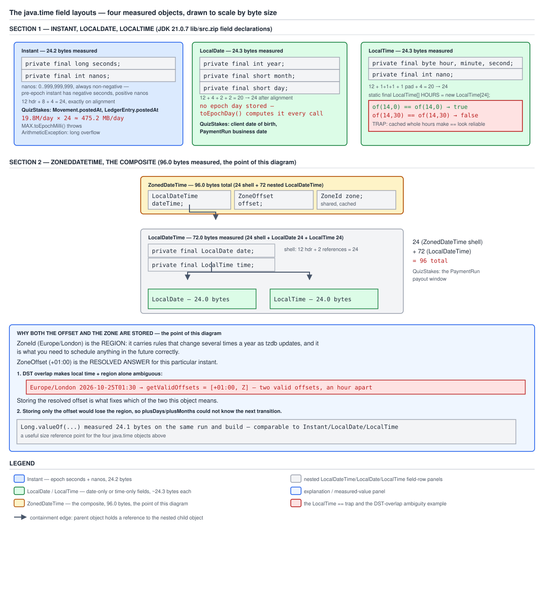

# 03 Java Core — `java.time` internals: the field layouts — INTERNALS (§3.16, 3.16.1–3.16.4)

**Target version: Java 21 LTS.** | **Part 3 of 5** | [Index](../00-index.md)
Previous: [Clock, precision, leap seconds and what goes on the wire](02e-clock-precision-and-storage.md) · Next: [ZoneRules and the tzdb](03a-internals-zonerules-and-tzdb.md)

This file owns the object layout of the four core `java.time` types — `Instant`,
`LocalDate`, `LocalTime`, `ZonedDateTime` — down to the field declaration, the
byte count, and the identity consequences of the caches the JDK builds around
them. It does not re-derive what these types *mean* (`02a-instant-local-and-zoned.md`
owns the model) or how DST resolution works at the application level
(`02b-amounts-dst-and-tzdb.md`). The question this file answers is: what does one
of these objects actually cost, and what invariants do its private fields encode
that the Javadoc states but the field declarations alone do not show?

Measured on **Oracle JDK 21.0.7 (build 21.0.7+8-LTS-245), macOS aarch64 (Apple
Silicon)**, `-Xmx5g`, `UseCompressedOops` on, `ObjectAlignmentInBytes = 8`.
Source quoted from that build's `lib/src.zip`. Heap deltas are the measured
figures from §6.11 of the batch briefing (2,000,000 retained instances, four
`System.gc()` rounds before each reading).

---

## 1. `Instant`: a `long` and an `int` (3.16.1)

An `Instant` is two numbers: how many whole seconds have passed since 1970, and
how many nanoseconds into the current second you are. That is the entire state
— no zone, no calendar, no fields for year or month anywhere near it.

### Why it exists

A machine-comparable point on the timeline needs exactly two things: enough
range to be useless as an excuse, and a fractional part fine enough that no
storage or wire format loses information going in. A `long` of millis (Java
8's `Date`/`Calendar` legacy) fails both — see the range derivation below and
`02e-clock-precision-and-storage.md` for the precision story. `Instant` fixes
both by splitting whole seconds from the sub-second remainder into two separate
fields instead of packing everything into one over-precise unit.

### How it works — the source walk

`java.base/java/time/Instant.java`, verbatim:

```java
    private final long seconds;   // line 257
    private final int nanos;      // line 262     0 .. 999,999,999, always >= 0
```

`seconds` is signed and epoch-relative: positive is after 1970-01-01T00:00:00Z,
negative is before. `nanos` is the field whose invariant the Javadoc states and
the declaration's type alone does not reveal: **it is always in the closed
range 0..999,999,999 and is never negative**, regardless of which side of the
epoch the instant falls on. That forces a specific normalisation for anything
before 1970. 1969-12-31T23:59:59.5Z — half a second before the epoch — is
stored as `seconds = -1, nanos = 500_000_000`, never as `seconds = 0, nanos =
-500_000_000`. The instant is "one second before epoch, plus 500ms forward from
there," not "zero seconds, minus 500ms."

That normalisation is not cosmetic. It is what makes `compareTo` a plain
two-field lexicographic comparison (compare `seconds`, then `nanos`, no sign
juggling) and what makes `Duration` subtraction exact: `Duration.between` can
compute `(a.seconds - b.seconds, a.nanos - b.nanos)` and borrow a second when
the nanos difference goes negative, exactly the way you would do manual
carrying arithmetic, because both operands' nanos are already known non-negative.

### The byte arithmetic

12-byte object header (8-byte mark word + 4-byte compressed klass pointer,
compressed oops on) + 8 bytes `seconds` + 4 bytes `nanos` = 24 bytes exactly,
landing precisely on the 8-byte alignment boundary with zero padding. Measured
**24.2** bytes/instance (§6.11) — the 0.2 is amortised JVM/GC bookkeeping noise
across 2,000,000 instances, not a layout discrepancy.

QuizStakes arithmetic: 19.8M `LedgerEntry` rows/day, each carrying one
`postedAt` `Instant`, is 19,800,000 × 24 = 475,200,000 bytes ≈ **475 MB/day**.
If `Movement.postedAt` and `LedgerEntry.postedAt` both store an `Instant` for
the same event, that doubles to ~950 MB/day for timestamps alone — a
line-item worth knowing when someone proposes denormalising the timestamp onto
both aggregates.

### Range, overflow, and the cached constant

`Instant.MIN` = `-1000000000-01-01T00:00:00Z`, `Instant.MAX` =
`+1000000000-12-31T23:59:59.999999999Z` — a billion years either side of the
epoch, vastly wider than a `long` of milliseconds could reach. That width is
exactly why `Instant.MAX.toEpochMilli()` throws `ArithmeticException: long
overflow`: converting `MAX`'s `seconds` value to milliseconds requires
multiplying by 1000, and that product does not fit in a `long`. `toEpochMilli`
uses checked arithmetic rather than silently wrapping, the same discipline
`../numbers-and-money/03b-internals-biginteger-and-long-cents.md` argues for on
`long`-cents multiplication via `Math.multiplyExact`.

`Instant.EPOCH` is a cached constant, and `Instant.ofEpochSecond(0) ==
Instant.EPOCH` is measured **`true`** (§6.13). That is an identity coincidence
from one specific factory call landing on one specific cached object — not a
guarantee `equals`-by-reference would ever be safe to rely on. Concept 3 below
covers the general shape of this trap in detail (`LocalTime.HOURS`), where it
is far more damaging because it only *sometimes* holds.

**Insight:** the non-negative-`nanos` invariant is the single fact that makes
`Instant` arithmetic simple two-field carrying instead of signed-remainder
bookkeeping — it is worth stating out loud precisely because the field
declaration `private final int nanos;` gives no hint of it.

**Interview:** "What are the two fields backing `Instant`, and what's the
signedness invariant on nanos?" — a `long seconds` (signed, epoch-relative) and
an `int nanos` (always 0..999,999,999, sub-second component pushed forward,
never negative even for pre-epoch instants).

**Gotcha:** none beyond the sign-normalisation trap already covered above.

> `Instant` is a signed epoch-second `long` plus an always-non-negative
> sub-second `int` nanos field, 24 bytes total, whose normalisation makes
> comparison and duration arithmetic exact two-field operations.

---

## 2. `LocalDate`: three fields, no epoch day (3.16.2)

A `LocalDate` is a year, a month, and a day, read the way a calendar page
reads them — not a disguised offset from some reference date.

### How it works — the source walk

`java.base/java/time/LocalDate.java`, verbatim:

```java
    private final int year;       // line 179
    private final short month;    // line 183
    private final short day;      // line 187
```

`year` is an `int` because the proleptic ISO year range the JDK supports is
±999,999,999 (see `03a-internals-zonerules-and-tzdb.md` for what "proleptic"
means), and that range needs the full 32 bits. `month` and `day` are declared
`short` even though their legal ranges — 1..12 and 1..31 — fit comfortably in
a `byte`. That is a real design choice, and the reason is the byte arithmetic
below: the padding makes the choice free either way, so there is no
performance reason to reach for the smaller type. `LocalTime`'s fields (concept
3) *are* `byte`, which shows the JDK does use the narrower type when it costs
nothing — here it happened not to help.

### The byte arithmetic

12-byte header + 4 (`year`, `int`) + 2 (`month`, `short`) + 2 (`day`, `short`)
= 20 bytes, rounded up to the 8-byte alignment boundary to **24**. That is
**4 bytes of padding** sitting unused after the three fields. Narrowing
`month`/`day` to `byte` would shrink the raw field total from 8 bytes to 6, but
20 → 24 already rounds up the same way 18 → 24 would (12 + 4 + 1 + 1 = 18 →
24) — the padding absorbs the difference, so it buys nothing. Measured
**24.3** bytes/instance, matching the 24-byte prediction.

### No epoch day is stored — the design point

The leaf's real content is what is *absent*: there is no fourth field caching
an epoch-day or Julian-day number. `toEpochDay()` computes the value from
`year`/`month`/`day` on every call using the proleptic Gregorian day-count
formula, and `ofEpochDay(long)` runs the exact inverse to reconstruct a date.
`LocalDate` is therefore a genuine calendar reading, not an offset with a
calendar-shaped facade — the field-level version of `02a-instant-local-and-zoned.md`'s
point that a `LocalDate` names no instant on the timeline at all, only a date
on a page.

That has a real cost consequence: `ChronoUnit.DAYS.between(a, b)` on two
`LocalDate`s runs `toEpochDay()` on both operands and subtracts, so it is not
free — it is a real (if cheap) calendar computation each time, not a field
read. `isBefore`/`isAfter`/`equals`, by contrast, compare the three fields
directly in `year`, then `month`, then `day` order, with no epoch-day
conversion at all.

**Gotcha:** none beyond the field/derived-value distinction already covered.

> `LocalDate` stores exactly `year`/`month`/`day` (24 bytes, 4 of them padding)
> and computes its epoch-day value on demand rather than caching it — it names
> a calendar date, never an instant.

---

## 3. `LocalTime`: four fields and the `HOURS` cache (3.16.3)

A `LocalTime` is a wall-clock reading with no date and no zone attached — and
a surprisingly large fraction of the ones your code creates are not new
objects at all.

### How it works — the source walk

`java.base/java/time/LocalTime.java`, verbatim:

```java
    private static final LocalTime[] HOURS = new LocalTime[24];  // line 150
    private final byte hour;      // line 231
    private final byte minute;    // line 235
    private final byte second;    // line 239
    private final int nano;       // line 243
```

`hour`, `minute`, `second` are `byte` because their ranges (0..23, 0..59,
0..59) fit trivially, and here — unlike `LocalDate` — narrowing genuinely lines
up with the padding, as the arithmetic below shows. `nano` must stay an `int`:
its range is 0..999,999,999, which needs 30 bits and does not fit in a `short`
let alone a `byte`.

### The byte arithmetic

12-byte header + 1 (`hour`) + 1 (`minute`) + 1 (`second`) + 1 byte of alignment
padding to bring `nano` onto a 4-byte boundary + 4 (`nano`) = 20 bytes, rounded
up to **24**. Measured **24.3** bytes/instance — identical to `LocalDate`'s
measured figure, for the unrelated reason that both land on the same 24-byte
alignment boundary from different field mixes.

### The `HOURS` cache — a trap, not trivia

`HOURS` is a 24-element array, one slot per whole hour, populated eagerly at
class-init. `LocalTime.of(int hour, int minute)` returns `HOURS[hour]` when
`minute == 0` and constructs a fresh instance otherwise; `LocalTime.NOON` and
`LocalTime.MIDNIGHT` are themselves entries of that same array. Measured on
JDK 21.0.7 (§6.13):

```
LocalTime.of(14, 0)  == LocalTime.of(14, 0)   -> true    (both are HOURS[14])
LocalTime.of(14, 30) == LocalTime.of(14, 30)  -> false
LocalTime.NOON       == LocalTime.of(12, 0)   -> true
```

`==` **works for exact whole hours and fails for everything else** — every
minute, second, or nanosecond value other than zero on the minute produces a
freshly allocated object. That is worse than failing consistently: a test
written against `PaymentRun` cutoffs at `14:00` passes on `==` by accident, and
the same code silently breaks the day someone changes the cutoff to `14:30`.

**Pitfall:** the same shape recurs in `Integer`'s −128..127 autoboxing cache
(`../wrappers-and-boxing/01-basics.md`) and `BigInteger.valueOf`'s −16..16
cache (`../numbers-and-money/03b-internals-biginteger-and-long-cents.md`), and
the rule is identical in all three: these are `@jdk.internal.ValueBased`
types, `==` is never the correct comparison, `equals` always is, and you must
not synchronize on an instance of one either — the JDK reserves the right to
share, and therefore contend on, any instance transparently. `Instant.EPOCH ==
Instant.ofEpochSecond(0)` (concept 1) is the identical accident on a different
type.

**Interview:** "Is `LocalTime.of(9, 0) == LocalTime.of(9, 0)` guaranteed?" —
it happens to be `true` on JDK 21 because `of` returns a shared `HOURS[9]`
instance, but it is an implementation detail, not a contract; always use
`equals`.

**Gotcha:** none beyond the cache trap covered above.

> `LocalTime` is four fields — `byte hour`/`minute`/`second` plus `int nano` —
> at 24 bytes, and its whole-hour factory returns a shared cached instance,
> which makes `==` pass by accident for exact hours and fail for everything
> else.

---

## 4. `ZonedDateTime`: why both the offset and the zone (3.16.4)

A `ZonedDateTime` looks like one object holding a date, a time, an offset and
a zone. It is actually four separate objects nested three deep, and both the
offset and the zone earn their place independently.

### How it works — the source walk

`java.base/java/time/ZonedDateTime.java`, verbatim:

```java
    private final LocalDateTime dateTime;  // line 177
    private final ZoneOffset offset;       // line 181
    private final ZoneId zone;             // line 185
```

Three reference fields, no primitives of its own — every date/time component
lives one level down, inside `dateTime`.

### The byte arithmetic

`ZonedDateTime`'s own shell: 12-byte header + three 4-byte compressed
references (`dateTime`, `offset`, `zone`) = 24 bytes. `LocalDateTime` is itself
12-byte header + two 4-byte references (a `LocalDate` and a `LocalTime`) = 20 →
24, plus the `LocalDate` object (24) plus the `LocalTime` object (24) it
points at = 24 + 24 + 24 = **72**, matching the measured `LocalDateTime.of(year, month, day, hour, minute)`
figure. `ZonedDateTime`'s total is its own shell plus the `LocalDateTime` tree:
24 + 72 = **96**, matching the measured `ZonedDateTime.ofInstant(instant, zone)` figure
exactly. The `ZoneOffset` and `ZoneId` referenced from the shell are **not**
counted per instance — both are shared, cached values (`ZoneOffset.of` and
`ZoneId.of` intern their results), so creating a million `ZonedDateTime`s in
`Europe/London` does not create a million `ZoneId` objects.

So a `ZonedDateTime` is **four heap objects**, not one: the `ZonedDateTime`
shell, the `LocalDateTime`, the `LocalDate`, the `LocalTime`. Against
`Instant`'s single 24-byte object, that is exactly **4x** the object count and
**4x** the footprint (96 vs 24). QuizStakes arithmetic: storing the
`PaymentRun` settlement window as a `ZonedDateTime` is the right call — you
need the zone for display and re-resolution — but storing all 19.8M/day ledger
timestamps that way instead of as `Instant` would cost 19,800,000 × 96 ≈
**1.9 GB/day**, against 475 MB/day for `Instant` (concept 1). Four objects per
entry also means four times the allocation-and-GC pressure at 19.8M/day, not
just four times the retained bytes.



**D-127** — the four object graphs drawn to scale against their measured byte
counts: `Instant` at 24 bytes as a single box, `LocalDate` and `LocalTime` each
at 24 bytes with their real field declarations, and `ZonedDateTime` at 96 bytes
drawn as a shell referencing a 72-byte `LocalDateTime` which itself nests the
`LocalDate` and `LocalTime` boxes. A side panel shows the `LocalTime.HOURS`
cache trap (`of(14,0) == of(14,0)` true, `of(14,30) == of(14,30)` false)
against the `Long.valueOf` 24-byte baseline for scale.

### Why both fields are stored, worked through

**First argument — the offset disambiguates.** From §6.14, measured:
`Europe/London` local `2026-10-25T01:30` — the autumn overlap — has **two**
valid offsets. `ZoneRules.getValidOffsets` returns `[+01:00, Z]`, and the
instants those two offsets produce are exactly `Duration.between(earlier, later) = PT1H`
apart: `2026-10-25T00:30:00Z` under `+01:00`, or `2026-10-25T01:30:00Z` under
`Z`. A `LocalDateTime` plus only a `ZoneId` therefore does **not** determine an
instant during an overlap — the local reading alone is ambiguous between two
real moments. Storing the *resolved* `ZoneOffset` on the object is exactly what
removes that ambiguity: it records which of the two instants this particular
`ZonedDateTime` means, so `toInstant()` can be a pure function of the object's
own fields with no external lookup and no re-resolution.

**Second argument — the zone is needed for future arithmetic.** If only the
offset were stored (i.e. if `ZonedDateTime` degenerated to an
`OffsetDateTime`), `plusDays(1)` would have no way to know that a DST
transition falls somewhere in the added interval, and so it could not
re-resolve the offset on the far side of that transition. `02b-amounts-dst-and-tzdb.md`
measures exactly that re-resolution happening: adding a day across the spring
transition changes the offset from `Z` to `+01:00` mid-arithmetic. Without the
`ZoneId`, that re-resolution has no rule set to consult.

Neither field is redundant, and the two are answering different questions:
the offset answers "which instant is this local reading fixed to right now",
the zone answers "what happens to that fixing when I move this object forward
or backward in time".

The resulting invariant is what matters to remember: a `ZonedDateTime`'s three
fields must be **mutually consistent** — `offset` must be one of the currently
valid offsets for `dateTime` under `zone`'s rules. The public factories enforce
this by *resolving* rather than throwing: `ZonedDateTime.of(LocalDateTime,
ZoneId)` picks a valid offset (measured in `02b`, the earlier offset at an
overlap, the gap-shifted result at a gap) instead of raising an exception on
an anomalous local time. `ZonedDateTime.ofStrict(LocalDateTime, ZoneOffset,
ZoneId)` is the sibling factory that refuses instead of resolving, and it
exists precisely because the invariant is a checkable predicate, not a
fiction. `03a-internals-zonerules-and-tzdb.md` covers how `ZoneRules` computes
the valid-offset set that both factories consult.

**Insight:** it is tempting to think `ZoneOffset` is redundant once you have
`ZoneId`, since the offset is theoretically derivable from the zone plus the
local time — except during an overlap it is not derivable, there are two
candidates, and the stored offset is the only record of which one this object
picked.

**Interview:** "Why does `ZonedDateTime` keep both a `ZoneOffset` and a
`ZoneId` when the offset could be looked up from the zone?" — because during
an overlap a local date-time plus a zone maps to two possible instants, and
the stored offset is what pins the object to one of them; the zone is kept
separately so later arithmetic can re-resolve the offset correctly after
crossing a future transition.

**Gotcha:** none beyond the resolve-vs-throw distinction already covered.

> `ZonedDateTime` is four nested objects (96 bytes total) whose stored offset
> disambiguates which of possibly several valid instants a local reading means,
> and whose stored zone lets later arithmetic re-resolve that offset across
> transitions the offset alone could never see coming.

---

## Pitfalls

### `LocalTime.of(h, 0) == LocalTime.of(h, 0)` is a safe comparison because it's a value type

**Wrong**

```java
LocalTime cutoff = LocalTime.of(14, 0);
LocalTime candidate = LocalTime.of(14, 0);
boolean sameCutoff = candidate == cutoff;
System.out.println(sameCutoff);
```

`true` — because `of(14, 0)` returns the shared `HOURS[14]` instance both
times. The check looks proven correct.

**Right**

```java
LocalTime cutoff = LocalTime.of(14, 0);
LocalTime candidate = LocalTime.of(14, 30);
boolean sameCutoff = candidate.equals(cutoff);
System.out.println(sameCutoff);
```

`false`, correctly, via `equals`. The moment the cutoff moves off a whole
hour — `14:30` instead of `14:00` — `of` stops returning a cached instance and
`==` would have silently started failing while looking identical in code.

**Why people believe it:** `java.time` types are immutable value-like objects,
and immutable objects are commonly (and usually safely) compared by identity
in tight, controlled code; the `HOURS` cache makes that habit work *some of
the time*, which is more dangerous than it never working at all.

### `new BigDecimal(BigInteger, int)` style thinking applied to `Instant.EPOCH`: "cached, so always safe to `==`"

**Wrong**

```java
Instant grantedAt = Instant.ofEpochSecond(0);
boolean isEpoch = grantedAt == Instant.EPOCH;
System.out.println(isEpoch);
```

`true`, measured. It looks like `Instant` guarantees canonicalisation for
every value.

**Right**

```java
Instant grantedAt = Instant.ofEpochSecond(1);
boolean isEpoch = grantedAt.equals(Instant.EPOCH.plusSeconds(1));
System.out.println(isEpoch);
```

`true` via `equals`, the only comparison `Instant`'s contract actually
promises; `Instant.ofEpochSecond(1) == Instant.EPOCH.plusSeconds(1)` is not
guaranteed and must not be relied on — there is exactly one cached `Instant`
constant (`EPOCH`), not a cache spanning arbitrary values.

**Why people believe it:** one true observation (`Instant.EPOCH` is a cached
singleton) gets over-generalised into "instants around the epoch are
interned," when in fact only the single named constant is cached.

### `ChronoUnit.DAYS.between` on `LocalDate` is a free field comparison

**Wrong**

```java
LocalDate settled = LocalDate.of(2026, 3, 15);
LocalDate today = LocalDate.of(2026, 3, 20);
long days = ChronoUnit.DAYS.between(settled, today);
```

Read as equivalent in cost to `settled.isBefore(today)` because "it's just
comparing two `LocalDate`s."

**Right**

Treat `between` as a real computation: it calls `toEpochDay()` on both dates
(a proleptic Gregorian day-count formula from `year`/`month`/`day`) and
subtracts the results. `isBefore`/`isAfter`/`equals` compare the three raw
fields directly and never touch `toEpochDay()`.

```java
long days = today.toEpochDay() - settled.toEpochDay();   // what between() does
boolean laterInMonth = today.isAfter(settled);            // direct field compare
```

**Why people believe it:** `LocalDate` reads as a flat, cheap value type
everywhere else in the API, so it is easy to assume every comparison-shaped
method on it is a field comparison, when `between` is specifically a
derived-value computation because no epoch day is stored.

---

## Cheat sheet

| Thing | Fact (Java 21 LTS) |
|---|---|
| `Instant` fields | `long seconds` (line 257), `int nanos` (line 262), 0..999,999,999 always |
| `Instant` pre-epoch normalisation | `-0.5s` = `seconds=-1, nanos=500_000_000`, never negative nanos |
| `Instant` measured size | 24.2 bytes (12 header + 8 + 4) |
| `Instant.MIN` | `-1000000000-01-01T00:00:00Z` |
| `Instant.MAX` | `+1000000000-12-31T23:59:59.999999999Z` |
| `Instant.MAX.toEpochMilli()` | throws `ArithmeticException: long overflow` |
| `Instant.ofEpochSecond(0) == Instant.EPOCH` | `true` (cached constant, coincidence not contract) |
| `LocalDate` fields | `int year` (179), `short month` (183), `short day` (187) |
| `LocalDate` measured size | 24.3 bytes (12 + 4 + 2 + 2 = 20 → 24, 4 padding) |
| `LocalDate` epoch day | not stored; `toEpochDay()`/`ofEpochDay()` compute each call |
| `LocalDate` cheap ops | `isBefore`/`isAfter`/`equals` compare fields directly |
| `LocalDate` non-free op | `ChronoUnit.DAYS.between` — two `toEpochDay()` calls |
| `LocalTime` fields | `byte hour` (231), `byte minute` (235), `byte second` (239), `int nano` (243) |
| `LocalTime` cache | `private static final LocalTime[] HOURS = new LocalTime[24];` (150) |
| `LocalTime` measured size | 24.3 bytes (12 + 1+1+1+1 pad + 4 = 20 → 24) |
| `LocalTime.of(14,0) == LocalTime.of(14,0)` | `true` (both `HOURS[14]`) |
| `LocalTime.of(14,30) == LocalTime.of(14,30)` | `false` (fresh instance each time) |
| `LocalTime.NOON == LocalTime.of(12,0)` | `true` |
| `ZonedDateTime` fields | `LocalDateTime dateTime` (177), `ZoneOffset offset` (181), `ZoneId zone` (185) |
| `ZonedDateTime` measured size | 96.0 bytes = own 24 + `LocalDateTime` 72 |
| `LocalDateTime` measured size | 72.0 bytes = own 24 + `LocalDate` 24 + `LocalTime` 24 |
| `ZonedDateTime` object count | 4 heap objects per instance |
| `Long.valueOf(long)` baseline | 24.1 bytes, for scale |
| Why offset is stored | disambiguates one of possibly 2 valid instants at an overlap |
| Why zone is stored | lets `plusDays`/etc. re-resolve offset across future transitions |
| `ZonedDateTime.of` | resolves ambiguous/invalid local times, never throws |
| `ZonedDateTime.ofStrict` | throws instead of resolving |
| These types' identity contract | `@jdk.internal.ValueBased` — `==` never guaranteed, `equals` always correct |
| Same cache-trap family | `Integer` −128..127, `BigInteger.valueOf` −16..16 |
| `Instant`/domain footprint at 19.8M/day | ~475 MB/day as `Instant`, ~1.9 GB/day if `ZonedDateTime` |

---

## Self-test

**Q1.** Why does `Instant` normalise a pre-epoch instant like
1969-12-31T23:59:59.5Z as `seconds=-1, nanos=500_000_000` rather than
`seconds=0, nanos=-500_000_000`?

<details><summary>Answer</summary>

Because the Javadoc-stated invariant on the `nanos` field is that it is always
in the closed range 0..999,999,999 and never negative, regardless of which
side of the epoch the instant sits on. Keeping `nanos` always non-negative
means `compareTo` can be a plain lexicographic comparison of `(seconds,
nanos)` with no special-casing for sign, and `Duration` arithmetic between two
instants can do straightforward carrying (borrow a second when subtracting
nanos would go negative) instead of juggling mixed-sign remainders. The field
declaration `private final int nanos;` doesn't reveal this on its own — it is
purely a documented invariant the implementation maintains.

</details>

**Q2.** `LocalDate` and `LocalTime` both measure at roughly the same 24 bytes.
Show the arithmetic for each and explain why `LocalDate` uses `short` for
`month`/`day` while `LocalTime` uses `byte` for `hour`/`minute`/`second`.

<details><summary>Answer</summary>

`LocalDate`: 12-byte header + 4 (`int year`) + 2 (`short month`) + 2 (`short
day`) = 20, rounded up to the 8-byte alignment boundary = 24, with 4 bytes of
padding. `LocalTime`: 12-byte header + 1 (`byte hour`) + 1 (`byte minute`) + 1
(`byte second`) + 1 byte of padding to align `nano` + 4 (`int nano`) = 20,
rounded up to 24, no leftover padding beyond the alignment byte already
counted. Both types happen to land on 24 either way, so narrowing
`LocalDate`'s `month`/`day` to `byte` would shrink the raw field total by 2
bytes but the alignment rounding would absorb that difference and still land
on 24 — there is no size benefit, which is presumably why the JDK didn't
bother. `LocalTime` genuinely benefits from `byte` because its three small
fields plus the padding byte line up exactly to a 4-byte boundary before
`nano`.

</details>

**Q3.** What does `ChronoUnit.DAYS.between(date1, date2)` actually do
internally, and why is it not "free" the way `date1.isBefore(date2)` is?

<details><summary>Answer</summary>

`LocalDate` stores no epoch-day value — only `year`, `month`, `day`. `between`
calls `toEpochDay()` on both dates, which runs the proleptic Gregorian
day-count formula from the three fields, and subtracts the two results.
`isBefore`/`isAfter`/`equals`, by contrast, compare the raw fields directly
(`year` first, then `month`, then `day`) with no epoch-day computation at all.
So `between` does real, if cheap, arithmetic on every call, while the direct
comparisons are pure field reads.

</details>

**Q4.** Explain, with the measured numbers, why storing `Instant` for 19.8M
ledger entries/day is cheaper than storing `ZonedDateTime`, and by what factor.

<details><summary>Answer</summary>

`Instant` measures at 24.2 bytes as a single object (12-byte header + 8-byte
`seconds` + 4-byte `nanos`). `ZonedDateTime` measures at 96.0 bytes across four
nested objects: its own 24-byte shell (header + three references) pointing at
a 72-byte `LocalDateTime` (its own 24-byte shell pointing at a 24-byte
`LocalDate` and a 24-byte `LocalTime`). That is exactly 4x both the object
count and the byte footprint. At 19.8M entries/day: `Instant` costs
19,800,000 × 24 ≈ 475 MB/day; `ZonedDateTime` would cost 19,800,000 × 96 ≈
1.9 GB/day — roughly 1.4 GB/day more, plus four times the allocation and GC
pressure from the extra nested objects.

</details>

**Q5.** Why does `ZonedDateTime` need to store both a `ZoneOffset` and a
`ZoneId` — isn't the offset always derivable from the zone and the local time?

<details><summary>Answer</summary>

Not always — during a DST overlap it is genuinely ambiguous. Measured on
`Europe/London`: local `2026-10-25T01:30` has two valid offsets,
`getValidOffsets` returning `[+01:00, Z]`, whose instants are an hour apart.
A `LocalDateTime` plus only a `ZoneId` cannot pick between the two possible
instants that local reading could mean, so the stored `ZoneOffset` records
which one this particular object is fixed to — that's what makes `toInstant()`
a pure function of the object's own fields. The `ZoneId` is kept separately
because later arithmetic (`plusDays`, etc.) needs the actual rule set to
re-resolve the offset if the operation crosses a future transition; an offset
alone carries no information about upcoming transitions. Both fields answer
different questions, so neither is redundant.

</details>

**Q6.** `LocalTime.of(9, 0) == LocalTime.of(9, 0)` returns `true` on JDK 21.
Is this safe to rely on? Why does it happen?

<details><summary>Answer</summary>

No — it is an implementation detail, not a contract. `LocalTime` maintains a
`private static final LocalTime[] HOURS = new LocalTime[24];` array, and
`of(int hour, int minute)` returns `HOURS[hour]` whenever `minute == 0`,
constructing a fresh object otherwise. So `==` happens to hold for exact whole
hours and fails for anything else — `LocalTime.of(9, 1) == LocalTime.of(9, 1)`
is `false`. `LocalTime` is a `@jdk.internal.ValueBased` type, so `equals` is
the only comparison the contract actually guarantees; relying on `==` risks
code that passes tests written against whole-hour values and silently breaks
the moment a value moves off the hour.

</details>

---

## Open questions

None — every claim in this file traces to §6.11 or §6.13 of the batch briefing
or to the quoted JDK 21 `lib/src.zip` source.

---

**Leaves covered:** 3.16.1–3.16.4 (4 leaves)
**Leaves deferred:** none
**Diagrams included:** D-127
**Target version:** Java 21 LTS
**Lines:** 625
