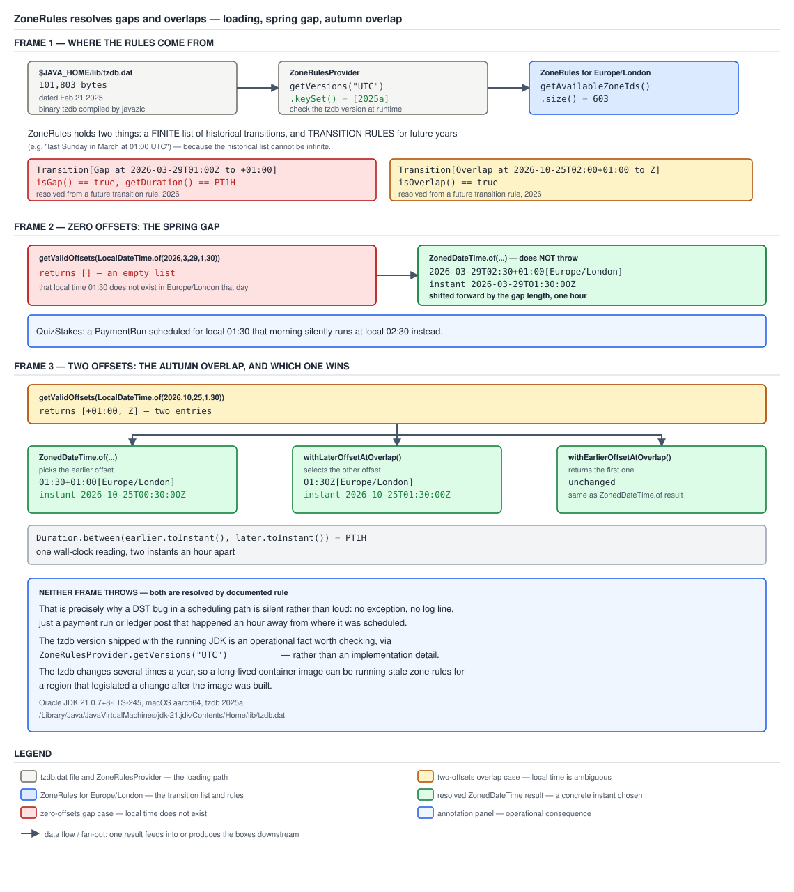

# 03 Java Core — `ZoneRules`, the tzdb file, and the proleptic ISO chronology — INTERNALS (§3.16, 3.16.5–3.16.7)

**Target version: Java 21 LTS.** | **Part 3 of 5** | [Index](../00-index.md)
Previous: [java.time internals: the field layouts](03-internals-java-time.md) · Next: [The Temporal SPI and DateTimeFormatter internals](03b-internals-temporal-spi-and-formatter.md)

This file owns how a `ZoneId` turns into a concrete set of rules, how those
rules resolve the gap and overlap cases at the query API level, where the raw
transition data physically lives inside the JDK, and how the proleptic ISO
calendar `LocalDate` is built on relates to the other `Chronology`
implementations. It does not re-cover application-level DST handling for
`Movement`/`PaymentRun` scheduling — `02b-amounts-dst-and-tzdb.md` owns that,
with its own diagram. The question this file answers is: what machinery sits
behind `ZoneId.getRules()`, and what does it mean that `LocalDate` belongs to
one specific, swappable calendar system?

Measured on **Oracle JDK 21.0.7 (build 21.0.7+8-LTS-245), macOS aarch64 (Apple
Silicon)**, **tzdb version 2025a**, confirmed at runtime by
`ZoneRulesProvider.getVersions("UTC").keySet()` → `[2025a]`; the file is
`$JAVA_HOME/lib/tzdb.dat`, 101,803 bytes, dated 21 Feb 2025.
`ZoneId.getAvailableZoneIds().size()` → `603`.

---

## 1. `ZoneRules`: a finite list plus rules for the rest of time (3.16.5)

Daylight-saving transitions are legislation, and legislation only exists for
dates that have already happened or that a currently-standing law already
describes going forward. `ZoneRules` is built around exactly that split.

### Why it exists, and how it works

The *past* for any zone is a closed, finite set of concrete events — Britain
either did or did not move its clocks on a given date, and once that date has
passed the fact never changes. The *future*, by contrast, is unbounded: no
finite list can cover every year to come, so it can only be described as a
repeating rule ("last Sunday in March at 01:00 UTC, offset moves from Z to
+01:00"). `ZoneRules` holds both halves. Internally it carries a sorted array
of concrete historical `ZoneOffsetTransition` instants — the events that
actually happened, one per legislated change — and a small set of
`ZoneOffsetTransitionRule`s that generate a transition for any year beyond the
point where the concrete list ends. A lookup for a given instant or
local-date-time binary-searches the historical list first and, once past its
end, falls through to evaluating the transition rules for whichever year is in
question.



**D-128** — frame 1 traces the loading path from `tzdb.dat` through
`ZoneRulesProvider` into a `ZoneRules` instance, showing the sorted historical
transition array feeding into the small set of future-year transition rules.
Frame 2 shows the spring gap: `getValidOffsets` returning an empty list for
local `2026-03-29T01:30`, with the forward-shifted `02:30+01:00` result
`ZonedDateTime.of` actually produces. Frame 3 shows the autumn overlap: two
offsets, `+01:00` and `Z`, both valid for local `2026-10-25T01:30`, with the
earlier one (`+01:00`) marked as the one `ZonedDateTime.of` picks by default.

### The measured transitions and what their rendering tells you

Walking forward from 2026-01-01 in `Europe/London` under tzdb 2025a (§6.14):

```
r.nextTransition(Instant.parse("2026-01-01T00:00:00Z"))
  -> Transition[Gap at 2026-03-29T01:00Z to +01:00]
     isGap() = true      getDuration() = PT1H
the following transition
  -> Transition[Overlap at 2026-10-25T02:00+01:00 to Z]
     isOverlap() = true
```

The two `toString()` forms are themselves informative and worth reading
carefully: the gap is rendered as an instant in UTC followed by the *new*
offset it transitions into (`+01:00`), while the overlap is rendered as a
local time followed by the *old* offset it is transitioning away from. That
asymmetry mirrors which side of the transition is unambiguous in each case —
going into a gap there is one instant and a new offset; coming out the far
side of an overlap there is one local reading and an old offset that still
applied a moment before.

### The query API — the diagnosis tool

The leaf's real content is the two query methods and how their return shapes
encode the answer.

`getValidOffsets(LocalDateTime)` returns a `List<ZoneOffset>` whose **size is
the answer to "is this local time anomalous, and how"**:

```
r.getValidOffsets(LocalDateTime.of(2026, 3, 29, 1, 30))   -> []              (GAP:     size 0)
r.getValidOffsets(LocalDateTime.of(2026, 10, 25, 1, 30))  -> [+01:00, Z]     (OVERLAP: size 2)
r.getValidOffsets(any ordinary local time)                -> [<one offset>] (size 1, always)
```

`getTransition(LocalDateTime)` returns the `ZoneOffsetTransition` covering an
anomalous local time, or `null` for an ordinary one — the object form of the
same information `getValidOffsets`' size already carries.

The implementation gets to these answers by converting the candidate local
date-time to a candidate instant under each offset that applies nearby, then
keeping only the offsets whose round trip is self-consistent (converting the
local time to an instant under that offset and back produces the same local
time). During a gap, no nearby offset round-trips correctly — the local time
was skipped entirely — so the result is empty. During an overlap, two
different offsets both round-trip correctly, because the same local time
genuinely occurs twice. That is exactly why the return type is a *list*
rather than a single value: the question "which offset does this local time
have" does not always have exactly one right answer.

`getOffset(Instant)` is the easy direction and is always single-valued — every
instant has exactly one offset, full stop. The ambiguity exists only going
from local-date-time to instant, never the reverse, and that asymmetry is
precisely why `02a-instant-local-and-zoned.md` argues `Instant` is the right
storage type for anything that must be unambiguous: instants never need this
resolution machinery at all.

The application-level gap/overlap handling — what a `PaymentRun` scheduler
should actually do when a stake window straddles one of these — belongs to
`02b-amounts-dst-and-tzdb.md` and its D-077 diagram; this file's job stops at
what `ZoneRules` returns and why.

**Interview:** "How does `ZoneRules` know the offset for a date fifty years in
the future?" — it doesn't consult a fixed table that far out; beyond the end
of its concrete historical transition list it evaluates a small number of
`ZoneOffsetTransitionRule`s (the legislated repeating pattern, e.g. "last
Sunday in March") for whatever year is being asked about.

**Gotcha:** none beyond the list-size-as-answer mechanism already covered.

> `ZoneRules` is a sorted list of transitions that actually happened plus a
> handful of rules that generate transitions for any future year, and its
> `getValidOffsets` query answers gap-or-overlap-or-ordinary purely by the size
> of the list it returns — 0, 2, or 1.

---

## 2. The tzdb file inside the JDK (3.16.6)

Every DST rule your code ever consults is data shipped inside your JDK
installation, not logic compiled into `java.time` itself — which means the
rules can and do change out from under a running binary that never
recompiled.

### The file and the loading path

The path is `$JAVA_HOME/lib/tzdb.dat` → `TzdbZoneRulesProvider` reads and
parses it at class-init → the parsed rule sets are registered with the
abstract `ZoneRulesProvider` → `ZoneId.getRules()` looks them up by zone id.
Measured on this build: the file sits at
`/Library/Java/JavaVirtualMachines/jdk-21.jdk/Contents/Home/lib/tzdb.dat`, is
**101,803 bytes**, dated **21 Feb 2025**.
`ZoneRulesProvider.getVersions("UTC").keySet()` returns `[2025a]`, and
`ZoneId.getAvailableZoneIds().size()` returns `603`.

The version string's grammar is worth knowing because it is short and useful
at a glance: IANA tzdb releases are named year-plus-letter, so `2025a` is the
first release cut in 2025, and there are typically several releases a year —
each one driven by some legislature somewhere changing, extending, or
abolishing daylight saving, which is a political decision on a schedule the
JDK release train does not control.

### Checking it at runtime — worth logging

`ZoneRulesProvider.getVersions(String zoneId)` is the supported runtime check,
and it is worth wiring into a startup log line next to the JDK build string,
because the tzdb version is an operational fact that changes independently of
your code and can silently shift a `PaymentRun` schedule the next time a JDK
patch bundles a newer tzdb:

```java
package com.quizstakes.payments.diagnostics;

import java.time.zone.ZoneRulesProvider;
import java.util.NavigableMap;

public final class TzdbVersionReporter {

    public String startupLine() {
        NavigableMap<String, String> versions = ZoneRulesProvider.getVersions("UTC");
        String latest = versions.lastEntry().getValue();
        return "runtime=" + Runtime.version()
                + " tzdb=" + latest
                + " zoneIds=" + java.time.ZoneId.getAvailableZoneIds().size();
    }
}
```

`Runtime.version()` and the tzdb version are two independently moving facts
about the same JVM, and neither one implies the other — a JDK security patch
can bump the tzdb bundled inside it without touching the language or library
version numbers at all, so logging both at startup is the cheap way to catch a
`PaymentRun` window computed under a stale tzdb before it becomes an incident.

### The SPI — the actual internals angle

`ZoneRulesProvider` is an abstract class, not a fixed built-in — it exposes a
`registerProvider(ZoneRulesProvider)` static method and is discoverable via a
`java.time.zone.ZoneRulesProvider` `ServiceLoader` entry, and the system
property `java.time.zone.DefaultZoneRulesProvider` names a replacement
implementation to load instead of the bundled `TzdbZoneRulesProvider`.
Supplying your own zone-rules source — for testing, or to pin a specific tzdb
release independently of the JDK's bundled one — is therefore a supported
extension point, not a hack against the platform.

**Insight:** the tzdb inside the JDK is not special-cased machinery — it is
one interchangeable implementation of a documented SPI, which is exactly why
`registerProvider` and the `ServiceLoader` hook exist at all.

**Interview:** "Where do DST rules actually live in a running JVM, and can
they be updated without a JDK upgrade?" — they live in `$JAVA_HOME/lib/tzdb.dat`,
loaded through the `ZoneRulesProvider` SPI; that data can, in principle, be
replaced or supplemented via a custom `ZoneRulesProvider` registered through
the SPI, independent of upgrading the JDK build itself.

**Gotcha:** on whether Oracle's standalone `TZUpdater` tool is still shipped
and supported for patching `tzdb.dat` in place on JDK 21 without a full JDK
update, this file cannot confirm either way from a primary source it has in
hand — see Open questions below rather than guessing.

> The tzdb is a versioned binary file (`tzdb.dat`, version `2025a` measured
> here) loaded through the documented `ZoneRulesProvider` SPI, not logic baked
> into `java.time` — which is exactly why its version is an operational fact
> worth logging at startup alongside the JDK build.

---

## 3. The proleptic ISO chronology, and comparing across chronologies (3.16.7)

`LocalDate` belongs to one specific calendar system, applied as though it had
always existed — and the JDK ships several *other* calendar systems that
compare against it in ways the type system does nothing to stop.

### What "proleptic" means, and why it's a deliberate simplification

The ISO-8601 calendar `LocalDate` implements is extended backwards past its
own real historical adoption date as though it had always been in force. That
is why `LocalDate.of(1500, 3, 15)` is a perfectly well-defined value even
though nobody in most of the world used the Gregorian calendar's rules in that
year — the proleptic extension is a deliberate simplification that trades
historical accuracy for a calendar that is total (every combination of valid
year/month/day maps to a value) and reversible (arithmetic never needs a
special case for "before this calendar existed"). One direct consequence: the
proleptic ISO year has a year 0, which the historical BC/AD numbering never
had (1 BC is followed immediately by 1 AD with no zero in between). That
difference is exactly why the `uuuu` (proleptic year) and `yyyy` (year-of-era)
pattern letters diverge, which `02d-formatting-and-parsing.md` measures as the
STRICT-parsing trap on the era field.

### `Chronology` and `ChronoLocalDate`

Every `LocalDate` carries `IsoChronology.INSTANCE` as its calendar system.
`ChronoLocalDate` is the calendar-agnostic interface sitting above it, with
`HijrahDate`, `JapaneseDate`, `MinguoDate`, and `ThaiBuddhistDate` as the other
JDK-supplied implementations, each pairing with its own `Chronology`. The
Javadoc states the design intent plainly: application code should be written
against `LocalDate`, and `ChronoLocalDate` exists for library code that must
genuinely be calendar-neutral — a scheduling library that has to work
correctly regardless of which calendar its caller uses, for instance. It is
not meant to be the everyday type your domain code declares fields as.

### The trap, measured

§6.21, measured on this build:

```
HijrahDate.now()  -> Hijrah-umalqura AH 1448-03-16
LocalDate.of(2026,3,15).compareTo(ChronoLocalDate.from(hijrahDate))  -> -1
```

That is a perfectly ordinary-looking `compareTo` call, between an ISO date and
an Islamic-calendar date, returning an ordinary-looking `-1` with no exception
anywhere. The mechanism is what makes it dangerous rather than merely
surprising: `ChronoLocalDate.compareTo` compares the underlying **epoch day
first**, and only consults the chronology as a tiebreak when the epoch days
are equal. Two dates from entirely different calendar systems are therefore
ordered by their raw day-number distance from a common epoch, which is a
meaningful comparison in the narrow sense that it is well-defined and total —
but it is almost never what a caller intends when they write
`a.compareTo(b)` on two domain objects. `equals`, by contrast, *does* require
matching chronologies, so `equals` and `compareTo` disagree with each other on
mixed-chronology pairs: a `TreeSet<ChronoLocalDate>` (ordered via
`compareTo`) will happily interleave Hijrah and ISO dates in epoch-day order,
while `equals` on the same two objects reports them unequal regardless of
epoch day. That is a direct violation of the recommended
"`compareTo` consistent with `equals`" guideline, and the JDK's own Javadoc
documents the inconsistency rather than hiding it.

**Pitfall:** the wrong belief is that Java's type system prevents mixing
calendar systems in a sort or a collection because `ChronoLocalDate` "is
still one type." The symptom is a `TreeSet` or a sorted list that silently
interleaves dates from different calendars in epoch-day order without ever
throwing. The fix is to type domain fields as `LocalDate`, never as
`ChronoLocalDate`, so a wrong-chronology value cannot enter the comparison at
all; where cross-chronology ordering is genuinely wanted, call
`ChronoLocalDate.timeLineOrder()` explicitly so the epoch-day ordering is a
stated choice rather than an accident of `compareTo`'s default behaviour. See
`../objects-equality-and-lifecycle/02a-composite-equality-and-ordering.md` for
the general `equals`/`compareTo` consistency contract this violates.

**Interview:** "Can `LocalDate.compareTo` ever be called against a value from
a different calendar system, and if so what happens?" — not directly, since
`LocalDate.compareTo(ChronoLocalDate)` requires an ISO chronology argument at
the type level, but `ChronoLocalDate.compareTo` (the interface method) accepts
any chronology and orders purely by epoch day as a tiebreak-free-until-equal
comparison, which silently produces a well-defined but usually meaningless
ordering across calendars.

**Gotcha:** none beyond the compareTo/equals inconsistency already covered.

> `LocalDate` is fixed to the proleptic ISO chronology, which extends today's
> calendar rules backward as a deliberate simplification; the JDK's other
> `Chronology` implementations compare against it via `ChronoLocalDate.compareTo`
> using epoch-day-first ordering that produces a legal but usually meaningless
> result when the two operands come from different calendar systems.

---

## Pitfalls

### `ZoneRules` must throw on an invalid or ambiguous local time, the way strict validation elsewhere in the JDK does

**Wrong**

```java
ZoneId london = ZoneId.of("Europe/London");
ZonedDateTime bonusExpiry = ZonedDateTime.of(
        LocalDateTime.of(2026, 3, 29, 1, 30), london);
System.out.println(bonusExpiry);
```

Expected either an exception (local `01:30` does not exist on 2026-03-29 in
London — it is skipped entirely by the spring-forward gap) or some sentinel
value. Instead it prints `2026-03-29T02:30+01:00[Europe/London]` — a
perfectly normal-looking result, silently shifted forward by the gap's
one-hour duration.

**Right**

Check `getValidOffsets` before trusting a local time that might straddle a
transition, or use `ofStrict` when a throw is actually wanted:

```java
ZoneRules rules = london.getRules();
LocalDateTime candidate = LocalDateTime.of(2026, 3, 29, 1, 30);
if (rules.getValidOffsets(candidate).isEmpty()) {
    throw new IllegalArgumentException("Local time falls in a DST gap: " + candidate);
}
```

Measured: `rules.getValidOffsets(candidate)` returns `[]` for exactly this
local time, which is the documented, checkable signal that `ZonedDateTime.of`
would otherwise resolve silently.

**Why people believe it:** most `java.time` parsing and construction paths do
validate strictly and throw on invalid input (`LocalDate.of(2026, 2, 30)`
throws, for instance), so it is a reasonable but wrong extrapolation that
`ZonedDateTime.of` would behave the same way for a locally-invalid time.

### tzdb version is baked into the JDK version, so pinning a JDK build pins the DST rules forever

**Wrong**

```
"We're on JDK 21.0.7, so our DST rules are fixed and reproducible for the
life of that build — no need to check tzdb separately."
```

Treated as self-evidently true because the JDK build number looks like the
single source of version truth.

**Right**

Check the tzdb version independently, because it is a separate artifact
bundled inside the same JDK distribution and can change across JDK patch
releases without the language or library version changing in any visible way:

```java
System.out.println("jdk=" + Runtime.version()
        + " tzdb=" + java.time.zone.ZoneRulesProvider.getVersions("UTC").lastEntry().getValue());
```

Measured on this exact build: `jdk=21.0.7+8-LTS-245 tzdb=2025a`. A later JDK
21.0.x patch release can legitimately ship a newer tzdb release (e.g. `2025b`)
while still reporting itself as "JDK 21" in every other visible respect.

**Why people believe it:** JDK release notes bundle "the JDK version" as a
single number, and most engineers never have reason to look past it to the
data files shipped alongside the class libraries.

### `ChronoLocalDate.compareTo` is a total ordering that behaves like `LocalDate.compareTo`

**Wrong**

```java
List<ChronoLocalDate> mixedDates = new ArrayList<>();
mixedDates.add(LocalDate.of(2026, 3, 15));
mixedDates.add(HijrahDate.now());
Collections.sort(mixedDates);
System.out.println(mixedDates);
```

Assumed to sort by "date-ness" the way a human would understand two calendar
readings to compare, or to throw on the mismatched types. Instead it sorts
silently by raw epoch day, interleaving an ISO date and a Hijrah date into one
ordering with no error.

**Right**

Never collect or compare across chronologies in domain code; keep the field
type as `LocalDate` so a `HijrahDate` cannot enter the collection at all:

```java
List<LocalDate> settlementDates = new ArrayList<>();
settlementDates.add(LocalDate.of(2026, 3, 15));
Collections.sort(settlementDates);
```

If cross-chronology ordering is genuinely required, call it out explicitly
with `ChronoLocalDate.timeLineOrder()` as the comparator rather than relying
on the default `compareTo`.

**Why people believe it:** `Comparable`'s contract is usually paired with
`equals` consistently everywhere else in the JDK, so it's reasonable to assume
`compareTo` and `equals` agree here too — the JDK's own Javadoc has to call
out that they deliberately do not, for this one interface.

---

## Cheat sheet

| Thing | Fact (Java 21 LTS) |
|---|---|
| `ZoneRules` structure | sorted historical transition list + transition rules for future years |
| Historical vs future lookup | binary search the concrete list, fall through to rules past its end |
| `getValidOffsets` empty | gap — local time does not exist |
| `getValidOffsets` size 2 | overlap — local time is ambiguous between two instants |
| `getValidOffsets` size 1 | ordinary local time, always |
| `getTransition` | returns the `ZoneOffsetTransition` for an anomalous local time, else `null` |
| `getOffset(Instant)` | always single-valued; the local→instant direction is the only ambiguous one |
| Measured spring transition | `Transition[Gap at 2026-03-29T01:00Z to +01:00]`, `isGap()` true, duration `PT1H` |
| Measured autumn transition | `Transition[Overlap at 2026-10-25T02:00+01:00 to Z]`, `isOverlap()` true |
| `ZonedDateTime.of` on gap | shifts forward by the gap length, never throws |
| `ZonedDateTime.of` on overlap | picks the earlier offset by default, never throws |
| `ZonedDateTime.ofStrict` | throws instead of resolving |
| tzdb file location | `$JAVA_HOME/lib/tzdb.dat` |
| tzdb file, this build | 101,803 bytes, dated 21 Feb 2025 |
| tzdb version, this build | `2025a`, via `ZoneRulesProvider.getVersions("UTC")` |
| Available zone ids, this build | 603, via `ZoneId.getAvailableZoneIds().size()` |
| tzdb version naming | year + letter; several releases/year, legislature-driven |
| Loading path | `tzdb.dat` → `TzdbZoneRulesProvider` → `ZoneRulesProvider` → `ZoneId.getRules()` |
| Custom rules extension point | `ZoneRulesProvider.registerProvider`, `ServiceLoader`, `java.time.zone.DefaultZoneRulesProvider` |
| `LocalDate`'s chronology | `IsoChronology.INSTANCE`, proleptic ISO |
| "Proleptic" meaning | today's calendar rules extended backward as if always in force |
| Proleptic ISO year 0 | exists; historical BC/AD numbering has none |
| Other `Chronology` impls | `HijrahDate`, `JapaneseDate`, `MinguoDate`, `ThaiBuddhistDate` |
| `ChronoLocalDate.compareTo` | compares epoch day first, chronology only as tiebreak |
| `ChronoLocalDate.equals` | requires matching chronology |
| Measured cross-chronology compare | `LocalDate.of(2026,3,15).compareTo(ChronoLocalDate.from(hijrahDate))` → `-1` |
| Recommended field type | `LocalDate`, never `ChronoLocalDate`, in application code |
| Explicit epoch-day ordering | `ChronoLocalDate.timeLineOrder()` |

---

## Self-test

**Q1.** Why does `ZoneRules` need both a concrete transition list and a set of
transition rules, rather than just one or the other?

<details><summary>Answer</summary>

The concrete list covers the past: DST changes are legislated events that
either happened on a specific date or didn't, and once past, that fact is
fixed and finite — so it's stored as a sorted array of actual
`ZoneOffsetTransition`s. The future is unbounded and cannot be enumerated as a
finite list, so it's described instead by a small number of repeating
`ZoneOffsetTransitionRule`s (e.g. "last Sunday in March at 01:00 UTC"), each
of which can generate the correct transition for any year asked about. A
lookup binary-searches the concrete list first and, once past its last entry,
evaluates the rules for whichever year applies.

</details>

**Q2.** What does it mean that `getValidOffsets(LocalDateTime.of(2026, 3, 29,
1, 30))` returns an empty list, and what does `ZonedDateTime.of` do with that
same local time instead of throwing?

<details><summary>Answer</summary>

An empty list means the local time is inside a DST gap — no offset makes that
local reading round-trip consistently to an instant and back, because the
clock skipped straight over it during the spring-forward transition.
`ZonedDateTime.of` does not throw on this; measured, it resolves by shifting
the local time forward by the length of the gap, so local `01:30` becomes
`02:30+01:00`. The empty list from `getValidOffsets` is the signal a caller
should check first if a throw (via `ofStrict`, or a manual check) is actually
wanted instead of that silent resolution.

</details>

**Q3.** Where do a JVM's DST rules physically come from, and can they be out
of date even on the "same" JDK version?

<details><summary>Answer</summary>

They come from `$JAVA_HOME/lib/tzdb.dat`, a binary file compiled from IANA
tzdb data, loaded at startup by `TzdbZoneRulesProvider` and registered with
`ZoneRulesProvider`. Measured on this build: 101,803 bytes, dated 21 Feb 2025,
reporting version `2025a` via `ZoneRulesProvider.getVersions("UTC")`. Yes,
this can be out of date independently of the JDK build number: the tzdb file
is a separate bundled artifact, and a later JDK patch release can ship a newer
tzdb version while both report themselves as "the same JDK line" in every
other respect — which is why logging the tzdb version alongside
`Runtime.version()` at startup is worthwhile.

</details>

**Q4.** What is the `ZoneRulesProvider` SPI, and why does its existence matter
beyond "the JDK ships some DST data"?

<details><summary>Answer</summary>

`ZoneRulesProvider` is an abstract class with a `registerProvider` static
method and a documented `ServiceLoader` entry point
(`java.time.zone.ZoneRulesProvider`), plus a
`java.time.zone.DefaultZoneRulesProvider` system property that can select a
replacement implementation. That means the bundled `TzdbZoneRulesProvider`
reading `tzdb.dat` is one interchangeable implementation of a public
extension point, not hardwired platform behaviour — supplying a custom zone
rules source (for testing, or to pin a specific tzdb release independent of
the JDK build) is a supported path, not a workaround.

</details>

**Q5.** What does "proleptic" mean for the ISO calendar `LocalDate` uses, and
what's one concrete consequence of it?

<details><summary>Answer</summary>

It means the calendar's rules are extended backward in time as though they
had always applied, even to dates before the calendar was historically
adopted anywhere — so `LocalDate.of(1500, 3, 15)` is a well-defined value
despite the Gregorian calendar not having been in use in most places in 1500.
This is a deliberate simplification that trades historical accuracy for a
calendar that is total and reversible for arithmetic. One direct consequence:
the proleptic ISO year includes a year 0, which the historical BC/AD numbering
never had — which is exactly why the `uuuu` (proleptic year) and `yyyy`
(year-of-era) format pattern letters can disagree.

</details>

**Q6.** `LocalDate.of(2026,3,15).compareTo(ChronoLocalDate.from(hijrahDate))`
returns `-1` with no exception. Explain the mechanism, and why it's dangerous
even though the result is technically well-defined.

<details><summary>Answer</summary>

`ChronoLocalDate.compareTo` compares the two dates' underlying epoch day
first, and only falls back to comparing chronology as a tiebreak when the
epoch days are equal. Two dates from entirely different calendar systems are
therefore ordered purely by their raw day-count distance from a shared epoch —
which is well-defined and total, but almost never what a caller means by
"compare these two dates." It's dangerous specifically because `equals`
requires matching chronologies while `compareTo` doesn't, so the two methods
disagree on cross-chronology pairs — a `TreeSet<ChronoLocalDate>` will happily
interleave, say, Hijrah and ISO dates in epoch-day order even though `equals`
would call every pair unequal. The fix is to keep domain fields typed as
`LocalDate`, never `ChronoLocalDate`, so a foreign-chronology value can't enter
the comparison at all.

</details>

---

## Open questions

1. Whether Oracle's standalone `TZUpdater` tool is still shipped, maintained,
   and supported for in-place `tzdb.dat` patching specifically against JDK 21
   LTS could not be confirmed from a primary source available while writing
   this file. The Oracle TZUpdater release page (or equivalent official JDK
   tooling documentation for the current LTS line) would settle whether it
   remains a supported update path versus superseded by JDK patch releases
   alone.

---

**Leaves covered:** 3.16.5–3.16.7 (3 leaves)
**Leaves deferred:** none
**Diagrams included:** D-128
**Target version:** Java 21 LTS
**Lines:** 588
