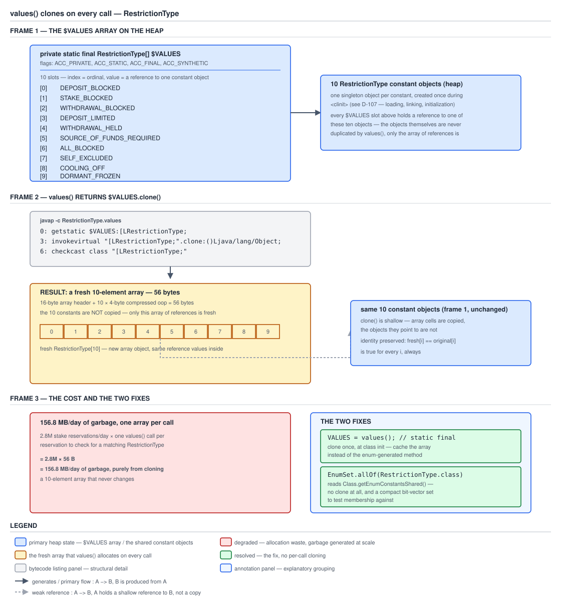

# 03 Java Core — Enums — BASICS (§1.18, 1.18.6–1.18.10)

**Target version: Java 21 LTS.** | **Part 1 of 5** | [Index](../00-index.md)
Previous: [Enums — the class and the uniqueness guarantee](01-basics.md) · Next: [Enums in use — collections, switch, patterns](01b-collections-patterns-and-guarantees.md)

Every enum arrives with an API you did not write, and four of its members are where the traps live. `values()` looks like an accessor and is a factory. `ordinal()` looks like an identifier and is a declaration index. `valueOf` looks like a lookup and is an assertion. `hashCode()` looks stable and is drawn from a per-run PRNG. This file is that API, member by member, with the JDK 21 source and the measured cost of each.

[`01-basics.md`](01-basics.md) established the model this file builds on: an enum is a `final class extends Enum<E>` whose constants are `public static final` fields created once by `<clinit>`. [`01b-collections-patterns-and-guarantees.md`](01b-collections-patterns-and-guarantees.md) takes the API into use — `EnumMap`, `EnumSet`, `switch`, the strategy and persisted-code patterns. The class-file evidence for `$VALUES` and the synthetic `$values()` helper is in [`03-internals-enums.md`](03-internals-enums.md).

All bytecode, reflective output and runtime results below were measured on **Oracle JDK 21.0.7 (21.0.7+8-LTS-245, macOS aarch64)**, with version comparisons against **Oracle JDK 17.0.15** and **Oracle JDK 11.0.27**. Quoted library source is from each JDK's own `lib/src.zip`. The enum under test is the ten-constant `RestrictionType` from [`01-basics.md`](01-basics.md), whose constant at index 7 is `SELF_EXCLUDED`.

---

## 1. The implicit members you did not declare (1.18.6)

The API arrives in two layers, and knowing which layer a member comes from tells you immediately whether you can override it (almost never) and whether it is on your class or inherited. Two `static` members are synthesised into *your* class by `javac`; everything else is inherited from `java.lang.Enum` and is `final`.

### Why it exists

The two layers exist for different reasons. `values()` and `valueOf(String)` must be `static` members of the *specific* enum type so they can be typed as `RestrictionType[]` and `RestrictionType` — a method on `Enum` could only return `Enum[]` and `Enum`, and generics cannot recover the specific type from a static context. They are therefore generated per enum, and `Enum`'s javadoc documents them as "implicitly declared" rather than declaring them. Everything else — identity, ordering, naming, serialization defence — is common behaviour with exactly one correct implementation, so it lives on `Enum` and is `final` so you cannot break it.

### The mechanism

The generated `static` members, measured on `RestrictionType`:

| Member | Flags | What it does |
|---|---|---|
| `public static RestrictionType[] values()` | `(0x0009) ACC_PUBLIC, ACC_STATIC` | returns `$VALUES.clone()` — a fresh array, every call |
| `public static RestrictionType valueOf(String)` | `(0x0009) ACC_PUBLIC, ACC_STATIC` | delegates to `Enum.valueOf(RestrictionType.class, name)` |

Neither is `ACC_SYNTHETIC`, which is why reflection lists them and why you can call them from source. The two members that *are* synthetic — `$VALUES` and the `$values()` helper — are in [`03-internals-enums.md`](03-internals-enums.md).

Now the inherited layer. `java.lang.Enum<E>` declares **three** fields on JDK 21, not the two everyone quotes:

```java
private final String name;
private final int ordinal;
@Stable private int hash;
```

`name` and `ordinal` are `final` and set by the constructor. `hash` is new — on JDK 11 and JDK 17 the field does not exist at all. Concept 5 has the detail.

| Member | Signature on `Enum<E>` | Notes |
|---|---|---|
| `name()` | `public final String name()` | the declared identifier, exactly as written |
| `ordinal()` | `public final int ordinal()` | zero-based declaration index |
| `toString()` | `public String toString()` | **not final** — returns `name` by default, overridable |
| `equals(Object)` | `public final boolean equals(Object)` | body is `return this == other;` |
| `hashCode()` | `public final int hashCode()` | identity-derived; cached since JDK 21 |
| `compareTo(E)` | `public final int compareTo(E)` | `self.ordinal - other.ordinal`, with a `ClassCastException` guard |
| `getDeclaringClass()` | `public final Class<E> getDeclaringClass()` | the enum type, even for a constant with a body |
| `describeConstable()` | `public final Optional<Enum.EnumDesc<E>> describeConstable()` | Java 12+, `Constable` support |
| `clone()` | `protected final Object clone() throws CloneNotSupportedException` | unconditionally throws |
| `finalize()` | `protected final void finalize()` | empty body; `@Deprecated(since="18", forRemoval=true)` |
| `readObject` / `readObjectNoData` | `private void`, `@java.io.Serial` | both throw `InvalidObjectException("can't deserialize enum")` |

Measured with reflection on JDK 21.0.7, confirming the `final` claims rather than trusting recall:

```
Enum.equals    final? true
Enum.hashCode  final? true
Enum.compareTo final? true
Enum.name      final? true
Enum fields    = [private final java.lang.String java.lang.Enum.name,
                  private final int java.lang.Enum.ordinal,
                  private int java.lang.Enum.hash]
```

`toString()` being the one non-final member is deliberate and useful: it is the hook for a display form that differs from the identifier. It is also the trap in concept 4, because `valueOf` parses `name()`, not `toString()`.

`finalize()` being declared `final` and empty on `Enum` is a small piece of defensive design worth noticing: it means no enum can have a finalizer, which removes enums from the finalizer queue entirely and closes the resurrection attack that finalizers otherwise open on a singleton. Finalization is in [`../objects-equality-and-lifecycle/03a-finalization-cleanup-and-leaks.md`](../objects-equality-and-lifecycle/03a-finalization-cleanup-and-leaks.md).

**Interview:** "How many methods does an empty enum have?" The answer they want is not a number, it is the decomposition: two generated `static` methods on your class (`values`, `valueOf`); plus the inherited `Enum` members, of which all but `toString` are `final`; plus `Object`'s `getClass`, `wait`, `notify`, `notifyAll`. Then the observation that makes it a good answer: `equals`, `hashCode` and `compareTo` are already correct *and sealed against you*, which is the actual point of the question.

### Diagram

No diagram for this concept: the content is a member inventory, and the tables above are the correct rendering.

### A concrete example

`describeConstable()` is the implicit member most people have never used, and it has a real purpose — it is how a constant becomes representable in a class file's constant pool, for `condy` and for `invokedynamic` bootstrap arguments:

```java
public final class RestrictionDescriptors {
    public static String describe(RestrictionType type) {
        return type.describeConstable()
                   .map(Object::toString)
                   .orElse("not describable");
    }
}
```

Measured output for `RestrictionType.SELF_EXCLUDED`:

```
Optional[EnumDesc[RestrictionType.SELF_EXCLUDED]]
```

The descriptor holds the enum's `ClassDesc` and the constant's *name* — not its ordinal — which is the same design decision serialization makes, for the same reason: the name is the stable identity, the ordinal is not.

### The gotcha

**Pitfall:** overriding `toString()` and then expecting `valueOf` to round-trip it.

```java
public enum RestrictionSource {
    SYSTEM_ONBOARDING, SYSTEM_COMPLIANCE, SYSTEM_LIFECYCLE, ADMIN, CLIENT;

    @Override public String toString() {
        return name().toLowerCase().replace('_', '-');
    }
}
```

Now `RestrictionSource.ADMIN.toString()` is `"admin"`, string concatenation and `"%s"` formatting produce `"admin"`, a log line reads `"admin"` — and `RestrictionSource.valueOf("admin")` throws. Measured: `java.lang.IllegalArgumentException: No enum constant RestrictionSource.admin`. Symptom: a value that serialises cleanly and fails to deserialise, usually discovered in production because the write path and the read path were tested separately. Fix: if you override `toString`, supply the matching parse explicitly — a `fromWireForm(String)` backed by a static map, as in the concrete example of concept 4 — and never let anything reach for `valueOf` on a display string. Better still: leave `toString` alone so the identifier appears everywhere, and add a separate `displayName()`.

> **Definition.** Every enum carries two `javac`-generated `static` members, `values()` and `valueOf(String)`, plus the members of `java.lang.Enum` — of which only `toString()` is overridable.

---

## 2. `values()` allocates a fresh array on every single call (1.18.7)

The mental model to install: **`values()` is not an accessor, it is a factory.** Exactly one array of constants exists at rest — a `private static final` field — and `values()` never hands it out. It hands out a copy, every time, because handing out the real one would let any caller write into the enum's own state.

### Why it exists

Arrays in Java are mutable and have no immutable variant. If `values()` returned the backing array, then `RestrictionType.values()[7] = null` — one line, no reflection, no warning — would corrupt the array that `EnumSet`, `EnumMap` and every subsequent `values()` caller reads from. There is no way to prevent that at the type level, so the generated method defends by copying. `List.of` would have been immutable and free to share, but `values()` predates it by nine years and its array return type is part of the language's implicit declaration, so it cannot change without breaking every caller that indexes it.

### The mechanism

`[SOURCE]` `[BYTECODE]` The whole method, measured with `javap -p -c RestrictionType.class` on JDK 21.0.7:

```
  public static RestrictionType[] values();
    Code:
       0: getstatic     #34   // Field $VALUES:[LRestrictionType;
       3: invokevirtual #38   // Method "[LRestrictionType;".clone:()Ljava/lang/Object;
       6: checkcast     #39   // class "[LRestrictionType;"
       9: areturn
```

Four instructions. `getstatic` reads the synthetic backing field; `invokevirtual clone()` on an array type is the JVM's array-copy intrinsic; `checkcast` restores the static type that `clone()`'s declared `Object` return erased; `areturn` hands the fresh array back. There is no cache, no `if`, no shared-immutable fast path, and nothing the caller can do to elide the call short of not making it.

`[NUM]` `[PROVE]` The cost, derived. With compressed oops on — confirmed on this JDK build, `UseCompressedOops = true`, `ObjectAlignmentInBytes = 8` — an object array's header is 12 bytes of standard object header plus a 4-byte `length` field, so 16 bytes, and each element is a 4-byte compressed reference. For `RestrictionType`'s ten constants:

```
16 bytes array header  +  10 elements × 4 bytes  =  56 bytes
56 is already a multiple of 8, so no padding: 56 bytes per values() call.
```

`[PROVE]` The constants themselves are **not** copied. `clone()` on an object array is a shallow copy, so the ten slots in the new array hold the same ten references. The per-call cost is therefore one 56-byte allocation plus a 40-byte `arraycopy`, not ten object allocations. That is exactly why the problem is invisible in a microbenchmark of a single call and lethal in a loop.

Measured confirmation that the array is fresh:

```
RestrictionType.values() == RestrictionType.values()   ->  false
RestrictionType.values().getClass().getName()          ->  [LRestrictionType;
```

Now put the QuizStakes volume against it. Stake reservations run at **2.8M/day, 1,200/sec peak**. A validation method that calls `values()` once per reservation to scan for a blocking restriction allocates:

```
2.8M calls/day × 56 bytes = 156,800,000 bytes/day ≈ 149.5 MiB/day of pure garbage
at peak: 1,200 calls/sec × 56 bytes = 67,200 bytes/sec ≈ 65.6 KiB/sec
```

It is all short-lived, so it dies in the young generation and costs allocation bandwidth and eden pressure rather than leaking — which is precisely why it survives code review and later shows up as an unexplained young-GC frequency. Multiply by the number of enums involved: a validator touching four enums per reservation is at 11.2M calls/day. Against the same reservation path's other costs it is small; against nothing at all, which is what the fix costs, it is indefensible.



**D-052** — Read the three frames top to bottom. Frame 1 is the single `$VALUES` array at rest, one slot per constant, carrying the `ACC_SYNTHETIC` flag that tells you `javac` wrote it. Frame 2 is the four-instruction `values()` body and its product: a fresh 56-byte array whose ten slots point at the *same* ten constant objects — follow the arrows leaving the new array and landing back on frame 1's constants, because that shallowness is what makes the cost 56 bytes rather than ten allocations. Frame 3 is the arithmetic at 2.8M reservations a day, and the two fixes: clone once into your own `static final`, or use `EnumSet.allOf`, which reads the shared universe and never clones at all.

### A concrete example

The wrong version, the right version, and the version that is better still:

```java
public final class StakeGuard {

    /** Cloned once, during StakeGuard's class initialisation. Never handed out. */
    private static final RestrictionType[] TYPES = RestrictionType.values();

    /** Handed out safely: an immutable view over that array, no copy per call. */
    private static final List<RestrictionType> TYPE_LIST = List.of(TYPES);

    private final Set<RestrictionType> activeOnClient;

    public StakeGuard(Set<RestrictionType> activeOnClient) {
        this.activeOnClient = activeOnClient.isEmpty()
            ? EnumSet.noneOf(RestrictionType.class)
            : EnumSet.copyOf(activeOnClient);
    }

    /** Allocates 56 bytes per call. At 1,200 reservations/sec that is 65.6 KiB/sec. */
    public boolean blockedSlow(RestrictionType.MoneyAction action) {
        for (RestrictionType type : RestrictionType.values()) {
            if (activeOnClient.contains(type) && type.blocks(action)) {
                return true;
            }
        }
        return false;
    }

    /** Allocates nothing. The array was cloned once, at class init. */
    public boolean blockedFast(RestrictionType.MoneyAction action) {
        for (RestrictionType type : TYPES) {
            if (activeOnClient.contains(type) && type.blocks(action)) {
                return true;
            }
        }
        return false;
    }

    /** Allocates nothing and iterates only what is set: one long, bit by bit. */
    public boolean blockedBest(RestrictionType.MoneyAction action) {
        for (RestrictionType type : activeOnClient) {
            if (type.blocks(action)) {
                return true;
            }
        }
        return false;
    }

    public static List<RestrictionType> all() {
        return TYPE_LIST;
    }
}
```

`blockedSlow` and `blockedFast` are identical in behaviour; the only difference is where the `clone()` happened. `blockedBest` is the real answer: it iterates the client's `EnumSet` — a single `long` — rather than the universe, so its work is proportional to the restrictions that exist rather than to the ones that could. Note that `all()` returns `TYPE_LIST`, not `TYPES`: exposing the array would reintroduce exactly the mutability that `values()` clones to prevent.

**Insight:** the enhanced-`for` loop hides the allocation completely. `for (RestrictionType t : RestrictionType.values())` reads as though it iterates a constant; it desugars to a local holding the result of a method call, and that method call is the factory. This is the single most common route by which the cost enters a hot path unnoticed. The desugaring is in [`../control-flow/01-basics.md`](../control-flow/01-basics.md).

### The gotcha

**Pitfall:** assuming `EnumSet.allOf(RestrictionType.class)` is another `values()` call in disguise. It is not, and the reason is worth knowing. `[SOURCE]` From JDK 21's `EnumSet`:

```java
private static <E extends Enum<E>> E[] getUniverse(Class<E> elementType) {
    return SharedSecrets.getJavaLangAccess()
                                    .getEnumConstantsShared(elementType);
}
```

`getEnumConstantsShared` returns `Class`'s own cached array — the *shared* one, not a clone. `EnumSet` and `EnumMap` are trusted internal callers permitted to see it, which is exactly why `EnumSet.allOf` and `new EnumMap<>(keyType)` allocate no per-call universe array. `Class` fills that cache by reflectively invoking your generated `values()` exactly once and keeping the result:

```java
T[] getEnumConstantsShared() {
    T[] constants = enumConstants;
    if (constants == null) {
        if (!isEnum()) return null;
        try {
            final Method values = getMethod("values");
            java.security.AccessController.doPrivileged(
                new java.security.PrivilegedAction<>() {
                    public Void run() {
                            values.setAccessible(true);
                            return null;
                        }
                    });
            @SuppressWarnings("unchecked")
            T[] temporaryConstants = (T[])values.invoke(null);
            enumConstants = constants = temporaryConstants;
        }
```

So the constants array is cloned twice in a process's life — once into `Class.enumConstants`, and once per user `values()` call — and the JDK's own collections use the copy that is never cloned again. The corollary for the *public* `Class.getEnumConstants()` is the opposite: it clones the shared array before handing it to you, so it has the same per-call cost as `values()`.

> **Definition.** `values()` is a generated `static` method whose entire body is `$VALUES.clone()`, so every call allocates a fresh, shallow array — 16 bytes of header plus 4 bytes per constant — and the only way to avoid the cost is to call it once and keep the result.

---

## 3. `ordinal()` is a declaration index, and that is all it is (1.18.8)

Think of `ordinal()` as a private implementation detail that the language accidentally made public. It exists so `EnumSet` can index a bit and `EnumMap` can index an array. It is not an identifier, not a version-stable code, and not a quantity.

### Why it exists

`EnumSet`'s entire performance story is "one bit per constant in a `long`", and `EnumMap`'s is "one array slot per constant". Both need a dense integer per constant, and the declaration index is the only such number available for free. `compareTo` then reuses it to give an enum a natural order at zero cost. Exposing it as a public method was, in hindsight, a mistake — *Effective Java* Item 35 (*Use instance fields instead of ordinals*) says so directly — but the collection classes needed it and there was no package-private route from `java.lang.Enum` to `java.util`.

### The mechanism

`ordinal()` returns the `private final int ordinal` field, which the compiler passes to `Enum`'s constructor as the constant's zero-based position in the declaration list. Measured: `SELF_EXCLUDED.ordinal() == 7`, being the eighth constant declared. `compareTo` is derived from it directly:

```java
public final int compareTo(E o) {
    Enum<?> other = o;
    Enum<E> self = this;
    if (self.getClass() != other.getClass() && // optimization
        self.getDeclaringClass() != other.getDeclaringClass())
        throw new ClassCastException();
    return self.ordinal - other.ordinal;
}
```

Two lines worth reading closely. The double test is the constant-body case from [`01-basics.md`](01-basics.md) concept 2: `getClass()` differs between `RestrictionSource.CLIENT` (a `RestrictionSource$1`) and `RestrictionSource.ADMIN` (a `RestrictionSource`), so the cheap identity check fails and the fallback to `getDeclaringClass()` is what makes cross-constant comparison work at all — without it, sorting a list containing `CLIENT` would throw. And `self.ordinal - other.ordinal` is a subtraction rather than `Integer.compare`, safe only because ordinals are small non-negative ints and the subtraction therefore cannot overflow; the same idiom on arbitrary ints is the classic broken comparator.

Measured: `SELF_EXCLUDED.compareTo(ALL_BLOCKED)` is `1`, because 7 − 6 = 1. Note that the *magnitude* is meaningful only as a declaration distance, so relying on anything beyond its sign is depending on the declaration list's spacing.

The consequence chain, which is the part to memorise:

- **Reordering the declaration silently renumbers every constant after the insertion point.** Measured: with `RestrictionType` reordered so `ALL_BLOCKED` is declared first, `ALL_BLOCKED.ordinal()` went from 6 to 0 and `SELF_EXCLUDED.ordinal()` from 7 to 1.
- **Natural ordering — and therefore `TreeSet`/`TreeMap` order, `Stream.sorted()` order, and `EnumSet`/`EnumMap` iteration order — is declaration order.** Change the declaration and every one of those changes. Measured, ten `RestrictionType` keys inserted in declaration order: `EnumMap.keySet()` returned exact declaration order; the `HashMap` over the same keys did not (concept 5).
- **`ordinal()` arithmetic is meaningless.** `type.ordinal() + 1` is "the constant declared after this one", which is not a concept the domain has. `type.ordinal() < SELF_EXCLUDED.ordinal()` is "declared earlier", not "less severe".

One confusion worth naming explicitly: enum ordering is *declaration* order, not alphabetical. `RestrictionType.ALL_BLOCKED` sorts sixth, not first, because it is declared sixth.

### Diagram

No diagram for this concept. The one thing `ordinal()` is genuinely for — indexing an `EnumSet` bit and an `EnumMap` slot — is drawn as D-119 in [`03c-internals-enumset-enummap.md`](03c-internals-enumset-enummap.md).

### A concrete example

The persistence version of the bug and its fix, side by side:

```java
public final class RestrictionRow {

    /** Wrong. The column holds a declaration index. */
    public static int toColumnWrong(RestrictionType type) {
        return type.ordinal();
    }

    public static RestrictionType fromColumnWrong(int column) {
        return RestrictionType.values()[column];
    }

    /** Right. The column holds a code the enum owns and can never renumber. */
    public static String toColumn(RestrictionType type) {
        return type.code();
    }

    public static RestrictionType fromColumn(String column) {
        return RestrictionType.fromCode(column)
            .orElseThrow(() -> new IllegalStateException(
                "unknown restriction code in ledger row: " + column));
    }
}
```

Run the wrong version for a year. Millions of restriction rows carry `7` for `SELF_EXCLUDED`. Someone then inserts `WAGERING_HELD` alphabetically, between `STAKE_BLOCKED` and `WITHDRAWAL_BLOCKED`, and deploys. Measured effect of exactly that edit: the constant at index 7 changed from `SELF_EXCLUDED` to `SOURCE_OF_FUNDS_REQUIRED`. Every stored `7` now reads back as a different, entirely valid restriction. Nothing throws. Nothing logs. Clients whose accounts are self-excluded — the population carrying `reversibleByOperator = false`, the population a regulator will ask about by name — are now recorded as needing a source-of-funds document, which an operator can clear. That is the scenario behind the flat prohibition, and it is why the rule is stated as *never*, not *prefer not to*.

`fromColumnWrong` has a second defect stacked on the first: `values()[column]` throws `ArrayIndexOutOfBoundsException` — not a domain exception, and with a message containing only an integer — for any stored value the current constant list does not cover. Which is precisely what happens when a row written by a newer deployment is read by an older one during a rolling upgrade.

### The gotcha

**Pitfall:** believing the danger is limited to databases. Anywhere an ordinal escapes the process it is the same bug: a `Map<Integer, X>` keyed on `ordinal()` and cached in Redis; a protobuf or Avro field populated from `ordinal()`; a Kafka message with a numeric `restrictionType`; an `int[]` counters array indexed by ordinal whose index becomes a metric tag; a bitmask persisted as `1 << ordinal()`. In JPA specifically, `@Enumerated(EnumType.ORDINAL)` — which is what a bare `@Enumerated` gives you, because `ORDINAL` is the annotation's **default** — is this bug wearing an annotation. Symptom: values that decode correctly until the day the enum is edited, then decode to a *different valid value*, which is the worst available failure mode because there is nothing to alert on. Fix: the only safe ordinal uses begin and end inside a single JVM run — `EnumSet`, `EnumMap`, a local array cache — because those are rebuilt from the current constant list every time the class initialises.

> **Definition.** `ordinal()` returns the constant's zero-based index in the declaration list; it is the substrate for `EnumSet`, `EnumMap` and `compareTo`, it changes whenever the declaration changes, and it must never cross a process boundary.

---

## 4. `valueOf` throws rather than returning null (1.18.9)

`valueOf(String)` is a strict parser with an unforgiving contract: an exact `name()` match, or `IllegalArgumentException`. It is not a lookup, it is an assertion. For internal names you control that is the right default; for anything arriving over a wire it is the wrong tool, and the fix is a static map you build once.

### Why it exists

Returning `null` for an unknown name would make every call site responsible for a null check that most would omit, and the resulting NPE would surface far from the bad input. Throwing puts the failure at the parse, with the offending string in the message. The `Optional`-returning variant a modern API would offer did not exist in 2004, and cannot be added now to an implicitly-declared member without changing every enum's shape.

### The mechanism

`[SOURCE]` The generated `valueOf` is a delegation, measured:

```
  public static RestrictionType valueOf(java.lang.String);
    Code:
       0: ldc           #1    // class RestrictionType
       2: aload_0
       3: invokestatic  #43   // Method java/lang/Enum.valueOf:(Ljava/lang/Class;Ljava/lang/String;)Ljava/lang/Enum;
       6: checkcast     #1    // class RestrictionType
       9: areturn
```

Push the `Class` literal, push the name, call the shared implementation, `checkcast` the `Enum` return back to the specific type. The `checkcast` is where erasure shows through: `Enum.valueOf` is declared to return `T`, which erases to `Enum`, so the caller has to narrow.

And the real work, from `java.lang.Enum`:

```java
public static <T extends Enum<T>> T valueOf(Class<T> enumClass,
                                            String name) {
    T result = enumClass.enumConstantDirectory().get(name);
    if (result != null)
        return result;
    if (name == null)
        throw new NullPointerException("Name is null");
    throw new IllegalArgumentException(
        "No enum constant " + enumClass.getCanonicalName() + "." + name);
}
```

Three facts fall out. It is a `HashMap` lookup, so it is O(1) rather than a linear scan of `values()`. A `null` name gets an NPE rather than an `IllegalArgumentException`, and note the ordering that makes that work: the map lookup happens *first*, and `HashMap.get(null)` returns null without throwing, so the explicit null check is reached second. And the message names the *canonical* class name plus the offending string, which is what makes the exception diagnosable — measured, `RestrictionType.valueOf("SELF-EXCLUDED")` produces `No enum constant RestrictionType.SELF-EXCLUDED`, with the hyphen visible.

The map is `Class.enumConstantDirectory()`, built lazily and cached:

```java
Map<String, T> enumConstantDirectory() {
    Map<String, T> directory = enumConstantDirectory;
    if (directory == null) {
        T[] universe = getEnumConstantsShared();
        if (universe == null)
            throw new IllegalArgumentException(
                getName() + " is not an enum class");
        directory = HashMap.newHashMap(universe.length);
        for (T constant : universe) {
            directory.put(((Enum<?>)constant).name(), constant);
        }
        enumConstantDirectory = directory;
    }
    return directory;
}
private transient volatile Map<String, T> enumConstantDirectory;
```

**Insight:** so the first `valueOf` call on any enum type builds a `HashMap` sized to the constant count and caches it on the `Class` object — for `RestrictionType`, ten entries plus the table, a few hundred bytes, once per class per loader. Every subsequent call is a hash lookup. The field is `volatile` and the build is benignly racy: two threads may each build a directory and one wins, which is safe because both maps have identical contents and the loser is simply collected. `HashMap.newHashMap(n)` — Java 19+ — sizes the table so that `n` entries fit without a resize, which is a small detail with a real effect: on older JDKs the same code used `new HashMap<>(2 * universe.length)`, an approximation that over- or under-allocated depending on the constant count.

`getEnumConstantsShared()`, quoted in concept 2's gotcha, obtains the universe by reflectively calling your generated `values()`. So the very first `valueOf` on an enum pays for one `values()` clone plus a `setAccessible` plus a `Method.invoke` — measurable at startup, irrelevant thereafter.

### Diagram

No diagram for this concept: the mechanism is a two-step delegation and the source above is the clearer rendering.

### A concrete example

The tolerant-parse pattern. Note it does not use `valueOf` at all — catching `IllegalArgumentException` for control flow would work but costs a stack-trace fill per bad input, which matters when the bad input is attacker-controlled:

```java
public enum RestrictionType {
    DEPOSIT_BLOCKED("DEP_BLK"),
    STAKE_BLOCKED("STK_BLK"),
    WITHDRAWAL_BLOCKED("WDR_BLK"),
    DEPOSIT_LIMITED("DEP_LIM"),
    WITHDRAWAL_HELD("WDR_HLD"),
    SOURCE_OF_FUNDS_REQUIRED("SOF_REQ"),
    ALL_BLOCKED("ALL_BLK"),
    SELF_EXCLUDED("SELF_EXC"),
    COOLING_OFF("COOL_OFF"),
    DORMANT_FROZEN("DORM_FRZ");

    private static final Map<String, RestrictionType> BY_CODE;
    private static final Map<String, RestrictionType> BY_NAME;

    static {
        Map<String, RestrictionType> byCode = new HashMap<>();
        Map<String, RestrictionType> byName = new HashMap<>();
        for (RestrictionType type : values()) {
            if (byCode.put(type.code, type) != null) {
                throw new IllegalStateException("duplicate restriction code: " + type.code);
            }
            byName.put(type.name(), type);
        }
        BY_CODE = Map.copyOf(byCode);
        BY_NAME = Map.copyOf(byName);
    }

    private final String code;

    RestrictionType(String code) {
        this.code = code;
    }

    public String code() {
        return code;
    }

    /** Tolerant: no exception, no stack trace, caller decides. */
    public static Optional<RestrictionType> fromCode(String code) {
        return code == null ? Optional.empty() : Optional.ofNullable(BY_CODE.get(code));
    }

    /** Tolerant parse of the declared name, for admin tooling and config files. */
    public static Optional<RestrictionType> fromName(String name) {
        return name == null ? Optional.empty() : Optional.ofNullable(BY_NAME.get(name));
    }
}
```

Two details are load-bearing. The `static` block runs **after** all ten constants exist — the constant assignments come first in `<clinit>`, in declaration order, then the static initialisers in textual order — which is why `values()` is safe to call there. Calling `values()` from a *constructor* would not be: the constants are still being created, `$VALUES` is still null, and you get an NPE from inside `<clinit>`, reported as `ExceptionInInitializerError`. And the `byCode.put(type.code, type) != null` check turns a copy-pasted duplicate code into a class-initialization failure at startup rather than a silently lost mapping — a two-line invariant that has caught real bugs.

`Map.copyOf` on the way out matters too: the fields are `static final`, but a `HashMap` behind a `final` reference is still mutable, and a `static final Map` is exactly the kind of thing that eventually acquires a caller who mutates it.

### The gotcha

**Pitfall:** `catch (IllegalArgumentException e)` around `valueOf` as the standard tolerant parse.

```java
// Wrong: works, but pays a stack-trace fill per unknown value, and misses null.
public static RestrictionType parse(String raw) {
    try {
        return RestrictionType.valueOf(raw);
    } catch (IllegalArgumentException e) {
        return null;
    }
}
```

Symptom: an endpoint accepting a `restrictionType` parameter becomes a cheap CPU-amplification target — each bad value costs an exception construction whose `fillInStackTrace` walks the whole request stack, and a Spring MVC request stack is deep. It is also wrong on `null`: `valueOf(null)` throws `NullPointerException`, which this `catch` does not handle, so the "tolerant" parser propagates an NPE for the single most likely bad input. Fix: the static-map lookup above, returning `Optional`. Where the value genuinely must be one of the constants and anything else is a programming error rather than bad input, keep `valueOf` and let it throw — the fail-fast is the feature. Exception cost is quantified in [`../exceptions/03-internals-exception-mechanics.md`](../exceptions/03-internals-exception-mechanics.md).

> **Definition.** `valueOf(String)` delegates to `Enum.valueOf`, which looks the exact `name()` up in a lazily built, `Class`-cached `HashMap` and throws `IllegalArgumentException` — or `NullPointerException` for a null name — rather than returning null.

---

## 5. Enum `hashCode` is identity-derived, so hash iteration order is not reproducible (1.18.10)

`Enum.hashCode()` does not hash the name, the ordinal, or anything else stable. It hands back the object's identity hash — a value HotSpot computes from a per-thread PRNG on first request and stores in the mark word. Two runs of the same program on the same JDK produce different values for the same constant, and therefore a different bucket layout in any `HashMap` or `HashSet` keyed on it.

### Why it exists

Identity is already the equality relation — `Enum.equals` is `return this == other;` — so the cheapest hash consistent with it is the identity hash, and `Object.hashCode()` provides that for free. Hashing `name()` would have cost a string hash and bought nothing, since two distinct constants can never be `equals` anyway. Hashing `ordinal()` would have been stable and cheap, but would collide across every enum type in the same map (`RestrictionType.DEPOSIT_BLOCKED` and `RestrictionSource.SYSTEM_ONBOARDING` would both hash to 0) and — more to the point — would have made the ordinal load-bearing in yet another place.

### The mechanism

The JDK 21 implementation, which is **not** what JDK 11 or 17 shipped:

```java
/**
 * The hash code of this enumeration constant.
 */
@Stable
private int hash;

public final int hashCode() {
    // Once initialized, the hash field value does not change.
    // HotSpot's identity hash code generation also never returns zero
    // as the identity hash code. This makes zero a convenient marker
    // for the un-initialized value for both @Stable and the lazy
    // initialization code below.
    int hc = hash;
    if (hc == 0) {
        hc = hash = System.identityHashCode(this);
    }
    return hc;
}
```

On **JDK 11.0.27 and 17.0.15**, read from each JDK's own `src.zip`, the body is the whole method:

```java
public final int hashCode() {
    return super.hashCode();
}
```

**Insight:** the JDK 21 change is a caching optimisation, not a semantic one. The value is still `System.identityHashCode(this)`; it is now read once into an `@Stable` field so the JIT can treat it as a constant after first use, and so repeated calls avoid the mark-word path. Zero is usable as the "not yet computed" marker precisely because HotSpot's identity-hash generator never returns zero — which the comment states, and which is also why `System.identityHashCode` can never be used to distinguish "hash is 0" from "hash not yet assigned". The observable behaviour is identical on all three releases, so nothing you can write depends on the difference; but if you are reading `Enum.java` from an older JDK and wondering where the field went, this is why.

Measured on JDK 21.0.7, one run:

```
RestrictionType.SELF_EXCLUDED.hashCode()          = 1639705018
System.identityHashCode(SELF_EXCLUDED)            = 1639705018
```

Identical, as the source requires. Run the program again and both numbers change.

`[PROVE]` The consequence for iteration order. `HashMap` places a key in bucket `(n - 1) & (h ^ (h >>> 16))` for table size `n`. With `h` drawn from a PRNG, the bucket is effectively random, so `keySet()` order is a function of that run's hashes. Measured, one run, the ten `RestrictionType` keys inserted in declaration order:

```
HashMap order: [DEPOSIT_BLOCKED, STAKE_BLOCKED, ALL_BLOCKED, SELF_EXCLUDED,
                DORMANT_FROZEN, COOLING_OFF, WITHDRAWAL_BLOCKED,
                SOURCE_OF_FUNDS_REQUIRED, DEPOSIT_LIMITED, WITHDRAWAL_HELD]
EnumMap order: [DEPOSIT_BLOCKED, STAKE_BLOCKED, WITHDRAWAL_BLOCKED, DEPOSIT_LIMITED,
                WITHDRAWAL_HELD, SOURCE_OF_FUNDS_REQUIRED, ALL_BLOCKED, SELF_EXCLUDED,
                COOLING_OFF, DORMANT_FROZEN]
```

The `EnumMap` order is declaration order, deterministically, because it iterates an ordinal-indexed array. The `HashMap` order is neither declaration nor alphabetical nor insertion order, and it will differ on the next run. The identity-hash mark-word mechanism is in [`../objects-equality-and-lifecycle/04-internals-hashcode-and-identity.md`](../objects-equality-and-lifecycle/04-internals-hashcode-and-identity.md); `HashMap`'s bucket mechanics belong to guide 02.

Worth stating the flip side, because it is the reason nobody notices: **lookup is unaffected.** `map.get(SELF_EXCLUDED)` works perfectly regardless of what the hash is this run, because the hash used to store and the hash used to look up are the same value within a run. Only *order* is unstable. That is what makes the bug latent — every functional test passes.

### Diagram

No diagram for this concept. The identity hash's storage in the mark word is drawn as D-124 in [`../objects-equality-and-lifecycle/04-internals-hashcode-and-identity.md`](../objects-equality-and-lifecycle/04-internals-hashcode-and-identity.md), and drawing it again here would repeat that file's subject.

### A concrete example

The flaky test and the fix:

```java
public final class RestrictionSummary {

    /** Non-deterministic output order. Any string assertion on this passes or fails by luck. */
    public static String summariseUnstable(Map<RestrictionType, Integer> counts) {
        StringBuilder out = new StringBuilder();
        for (Map.Entry<RestrictionType, Integer> entry : counts.entrySet()) {
            out.append(entry.getKey().name()).append('=').append(entry.getValue()).append(';');
        }
        return out.toString();
    }

    /** Deterministic: declaration order, every run, on every JDK. */
    public static String summarise(Map<RestrictionType, Integer> counts) {
        EnumMap<RestrictionType, Integer> ordered = new EnumMap<>(RestrictionType.class);
        ordered.putAll(counts);
        StringBuilder out = new StringBuilder();
        for (Map.Entry<RestrictionType, Integer> entry : ordered.entrySet()) {
            out.append(entry.getKey().name()).append('=').append(entry.getValue()).append(';');
        }
        return out.toString();
    }

    /** Deterministic in an order you chose rather than one the enum author chose. */
    public static String summariseByCode(Map<RestrictionType, Integer> counts) {
        Map<RestrictionType, Integer> ordered =
            new TreeMap<>(Comparator.comparing(RestrictionType::code));
        ordered.putAll(counts);
        StringBuilder out = new StringBuilder();
        for (Map.Entry<RestrictionType, Integer> entry : ordered.entrySet()) {
            out.append(entry.getKey().code()).append('=').append(entry.getValue()).append(';');
        }
        return out.toString();
    }
}
```

`summariseUnstable` is the shape that produces the flaky test everyone has met: a string-equality assertion on a serialised map that passes on a developer's machine for a month and fails once in CI. Copying into an `EnumMap` costs one array allocation and yields declaration order unconditionally. `summariseByCode` is the version to reach for when the wanted order is not declaration order — note that it orders by the enum's *own* stable code, so reordering the declaration cannot change the output.

### The gotcha

**Pitfall:** believing enum hashing is stable because the constants are. The constants are stable; their hashes are not. Symptom: the flaky test above; a cache key built by concatenating `hashCode()` values that misses on every restart; a shard or partition computed as `type.hashCode() % partitions` that reassigns every deploy, silently rerouting traffic; a log line whose field order changes between runs and defeats a diff. Fix: never let `Enum.hashCode()` reach anything outside the current JVM run, and never depend on `HashMap`/`HashSet` iteration order over enum keys. Use `EnumMap`/`EnumSet` for declaration order, `TreeMap` with an explicit comparator for a chosen order, and `name()` or an explicit code whenever you need a stable textual or numeric key.

> **Definition.** `Enum.hashCode()` is `final` and returns `System.identityHashCode(this)` — cached in an `@Stable int hash` field since JDK 21, recomputed per call before it — so it varies between JVM runs and no hash-ordered collection over enum keys has a reproducible iteration order.

---

## Pitfalls

### Persisting `ordinal()`

**Wrong**

```java
@Column(name = "restriction_type")
private int restrictionType;

public void apply(RestrictionType type) {
    this.restrictionType = type.ordinal();            // writes 7 for SELF_EXCLUDED
}

public RestrictionType type() {
    return RestrictionType.values()[restrictionType]; // reads values()[7]
}
```

Insert one constant earlier in the declaration list, redeploy, and every stored `7` reads back as a different constant. Measured, before and after inserting `WAGERING_HELD`: the constant at index 7 changed from `SELF_EXCLUDED` to `SOURCE_OF_FUNDS_REQUIRED`. Nothing throws — the read succeeds with the wrong answer.

**Right**

```java
@Column(name = "restriction_type", length = 16, nullable = false)
private String restrictionType;

public void apply(RestrictionType type) {
    this.restrictionType = type.code();               // writes "SELF_EXC"
}

public RestrictionType type() {
    return RestrictionType.fromCode(restrictionType)
        .orElseThrow(() -> new IllegalStateException(
            "unknown restriction code in row: " + restrictionType));
}
```

The code is a field the enum owns; reordering the declaration cannot change it, and an unknown code fails loudly with the offending value in the message. In JPA, a bare `@Enumerated` defaults to `EnumType.ORDINAL`, so it is the wrong version with an annotation in front of it; `@Enumerated(EnumType.STRING)` persists `name()`, which is safe against reordering but not against renaming — an explicit code column plus a converter is safe against both.

**Why people believe it:** an `int` column is smaller and indexes faster than a `varchar`, `ordinal()` is right there, and the code works perfectly until the first edit to the constant list — which may be a year later, by a different person, who has no reason to suspect that alphabetising a list is a data-corrupting change.

### Calling `values()` in a loop

**Wrong**

```java
public boolean anyBlocking(Set<RestrictionType> active, MoneyAction action) {
    for (RestrictionKey key : keys) {
        for (RestrictionType type : RestrictionType.values()) {   // 56 bytes, every pass
            if (active.contains(type) && type.blocks(action)) {
                return true;
            }
        }
    }
    return false;
}
```

At 1,200 stake reservations/sec with an average of three active restriction keys, the inner `values()` runs 3,600 times/sec for 201,600 bytes/sec ≈ 197 KiB/sec of garbage — for an array whose contents cannot change.

**Right**

```java
public boolean anyBlocking(Set<RestrictionType> active, MoneyAction action) {
    for (RestrictionType type : active) {          // iterate what is set, not the universe
        if (type.blocks(action)) {
            return true;
        }
    }
    return false;
}
```

Zero allocation, and the loop is now proportional to the restrictions that exist rather than to the ten that could. Where the whole universe genuinely is needed, hold it in a `private static final RestrictionType[]` cloned once at class init and never handed out — expose a `List.of` view instead, so no caller can write into it.

**Why people believe it:** `values()` reads like a field access, `RestrictionType.values()` looks like a constant, and the enhanced-`for` syntax hides the call entirely. Nothing in the source suggests an allocation, and a microbenchmark of a single call measures nothing worth noticing.

### Overriding `toString()` and parsing it back with `valueOf`

**Wrong**

```java
public enum RestrictionSource {
    SYSTEM_ONBOARDING, SYSTEM_COMPLIANCE, SYSTEM_LIFECYCLE, ADMIN, CLIENT;

    @Override public String toString() {
        return name().toLowerCase().replace('_', '-');
    }
}

String wire = source.toString();                    // "system-onboarding"
RestrictionSource back = RestrictionSource.valueOf(wire);
```

Measured: `java.lang.IllegalArgumentException: No enum constant RestrictionSource.system-onboarding`. The write path and the read path use different name spaces.

**Right**

```java
public enum RestrictionSource {
    SYSTEM_ONBOARDING, SYSTEM_COMPLIANCE, SYSTEM_LIFECYCLE, ADMIN, CLIENT;

    private static final Map<String, RestrictionSource> BY_WIRE_FORM;

    static {
        Map<String, RestrictionSource> byWire = new HashMap<>();
        for (RestrictionSource source : values()) {
            byWire.put(source.wireForm(), source);
        }
        BY_WIRE_FORM = Map.copyOf(byWire);
    }

    public String wireForm() {
        return name().toLowerCase().replace('_', '-');
    }

    public static Optional<RestrictionSource> fromWireForm(String wire) {
        return wire == null ? Optional.empty() : Optional.ofNullable(BY_WIRE_FORM.get(wire));
    }
}
```

`toString()` is left alone, so `valueOf(name())` still round-trips and every debugger, log line and `%s` shows the declared identifier. The wire form is an explicit method with an explicit inverse, and the inverse is a map lookup rather than a `try`/`catch`.

**Why people believe it:** `toString()` is the obvious place for a display form, and `valueOf` is the obvious inverse of "the string form of an enum". The two are inverses only while `toString` is the default — which it is for every enum until someone improves one.

### Asserting on `HashMap` iteration order over enum keys

**Wrong**

```java
@Test
void summaryListsEveryRestriction() {
    Map<RestrictionType, Integer> counts = new HashMap<>();
    counts.put(RestrictionType.STAKE_BLOCKED, 4);
    counts.put(RestrictionType.SELF_EXCLUDED, 1);
    counts.put(RestrictionType.COOLING_OFF, 2);

    assertEquals("STAKE_BLOCKED=4;SELF_EXCLUDED=1;COOLING_OFF=2;",
                 RestrictionSummary.summariseUnstable(counts));
}
```

The expected string encodes one particular run's identity hashes. It passes until it does not, and it fails in CI rather than locally because the failure is a per-JVM-run coin flip, not a per-machine one.

**Right**

```java
@Test
void summaryListsEveryRestrictionInDeclarationOrder() {
    Map<RestrictionType, Integer> counts = new EnumMap<>(RestrictionType.class);
    counts.put(RestrictionType.STAKE_BLOCKED, 4);
    counts.put(RestrictionType.SELF_EXCLUDED, 1);
    counts.put(RestrictionType.COOLING_OFF, 2);

    // EnumMap iterates by ordinal: STAKE_BLOCKED(1), SELF_EXCLUDED(7), COOLING_OFF(8).
    assertEquals("STAKE_BLOCKED=4;SELF_EXCLUDED=1;COOLING_OFF=2;",
                 RestrictionSummary.summarise(counts));
}
```

The same expected string, now guaranteed: `EnumMap` iterates its ordinal-indexed array, so the order is declaration order on every run and every JDK. Where the assertion should not depend on order at all, assert on a `Set` of entries instead.

**Why people believe it:** `HashMap` iteration order is *stable within a run*, so the test passes locally every time it is run, including a hundred times in a row. The instability is between JVM launches, and a developer rarely compares output across launches.

---

## Cheat sheet

| Thing | Fact (Java 21 LTS) |
|---|---|
| Generated statics | `public static E[] values()`, `public static E valueOf(String)`; flags `(0x0009)`, not synthetic |
| `Enum`'s fields | `private final String name`, `private final int ordinal`, `@Stable private int hash` (**21 only**) |
| Overridable members | `toString()` **only**. `equals`, `hashCode`, `compareTo`, `name`, `ordinal`, `clone`, `finalize` are `final` |
| `values()` body | `getstatic $VALUES` / `invokevirtual clone()` / `checkcast` / `areturn` — 4 instructions |
| `values()` cost | `16 B array header + 4 B × constants`; 10 constants = **56 B per call**, shallow |
| `values() == values()` | `false`, measured. Every call is a fresh array |
| `values()` fixes | cache once in a `static final`, expose a `List.of` view; or `EnumSet.allOf`, which never clones |
| `EnumSet`/`EnumMap` universe | `SharedSecrets…getEnumConstantsShared()` — the **shared** array, no clone |
| `Class.getEnumConstants()` | public API; **does** clone, same per-call cost as `values()` |
| `ordinal()` | zero-based declaration index. Safe only inside one JVM run. Never persist, never do arithmetic |
| `compareTo` | `final`; `self.ordinal - other.ordinal`, guarded by `getClass()` then `getDeclaringClass()` |
| Natural order | **declaration** order, not alphabetical. Drives `TreeMap`, `sorted()`, `EnumSet`, `EnumMap` |
| `valueOf` | delegates to `Enum.valueOf` → `Class.enumConstantDirectory()`, a lazily built cached `HashMap`; O(1) |
| `valueOf` unknown name | `IllegalArgumentException: No enum constant <canonical>.<name>` |
| `valueOf(null)` | `NullPointerException("Name is null")` — the map lookup runs first and returns null harmlessly |
| Tolerant parse | a `static final Map` built in a `static` block, returning `Optional`. Not `try`/`catch` around `valueOf` |
| `values()` in a `static` block | safe — constant assignments precede static initialisers in `<clinit>` |
| `values()` in a constructor | NPE inside `<clinit>` → `ExceptionInInitializerError`; `$VALUES` is not yet assigned |
| `equals` | `final`, `return this == other;` |
| `hashCode` | `final`, `System.identityHashCode(this)`. **Varies per JVM run.** Cached in `hash` since 21; `return super.hashCode();` on 11 and 17 |
| Why zero is the cache marker | HotSpot's identity hash never returns 0 |
| `HashMap` over enum keys | lookup is fine; **iteration order is not reproducible across runs** |
| Deterministic order | `EnumMap`/`EnumSet` for declaration order; `TreeMap` + explicit `Comparator` for a chosen order |
| `describeConstable()` | Java 12+; returns `Optional[EnumDesc[E.NAME]]` — keyed on the **name**, not the ordinal |
| `toString` vs `valueOf` | `valueOf` parses `name()`. Override `toString` and you must supply your own inverse |
| JPA default | bare `@Enumerated` means `ORDINAL`. Use `STRING`, or better an explicit code column plus a converter |

---

## Self-test

**Q1.** Derive the byte cost of `RestrictionType.values()` from the bytecode, and put a daily figure on calling it once per stake reservation.

<details><summary>Answer</summary>

The measured body is four instructions: `getstatic $VALUES` / `invokevirtual "[LRestrictionType;".clone()` / `checkcast "[LRestrictionType;"` / `areturn`. The allocation is the `clone()` — one fresh object array. With compressed oops on (confirmed `UseCompressedOops = true`, `ObjectAlignmentInBytes = 8` on this build), an object array is a 12-byte object header plus a 4-byte `length` field = 16 bytes, plus 4 bytes per element reference. Ten constants: `16 + 10 × 4 = 56` bytes, already 8-aligned so no padding. The constants themselves are not copied — `clone()` on an object array is shallow, so the new slots hold the same ten references, which is why the cost is one 56-byte allocation and not ten object allocations. At 2.8M stake reservations/day that is `2.8e6 × 56 = 156,800,000` bytes ≈ 149.5 MiB/day of short-lived garbage; at the 1,200/sec peak, 67,200 bytes/sec ≈ 65.6 KiB/sec. It never leaks, so it surfaces as young-GC frequency rather than heap growth — which is why it survives review.

</details>

**Q2.** Why is `values()` safe to call from an enum's `static` initialiser block but not from its constructor?

<details><summary>Answer</summary>

Because of the order `javac` writes into `<clinit>`. The measured `<clinit>` for `RestrictionType` runs, in order: ten `new`/`dup`/`ldc name`/`iconst ordinal`/`invokespecial <init>`/`putstatic` sequences — one per constant, in declaration order — then `invokestatic $values()` and `putstatic $VALUES`, then any static initialiser blocks and static field initialisers in textual order. So by the time a `static` block runs, every constant field *and* `$VALUES` are assigned, and `values()` returns a complete array. A constructor runs during the *first* phase: `$VALUES` is still `null`, so `values()` does `getstatic` of null and then `invokevirtual clone()` on it, producing a `NullPointerException` inside `<clinit>`. The JVM wraps it as `ExceptionInInitializerError`, marks the class erroneous, and every subsequent touch throws `NoClassDefFoundError` with no cause attached — hiding the original NPE. This is why a static lookup map must be built in a `static` block, or in a private holder class, and never in the constructor.

</details>

**Q3.** A colleague argues that persisting `ordinal()` is fine because the team has a code-review rule against reordering enum constants. What is your response?

<details><summary>Answer</summary>

That the rule protects against the wrong action. Reordering is only one of the ways the index moves; *inserting* a constant anywhere except the end moves every ordinal after it, and inserting a constant is a routine, obviously-safe-looking change — nobody reviewing "add `WAGERING_HELD` to the restriction list" thinks of it as a data migration. Deleting one is worse: it shifts everything after it *and* leaves stored rows pointing at a valid-but-different constant. Measured: inserting `WAGERING_HELD` into `RestrictionType` changed the constant at index 7 from `SELF_EXCLUDED` to `SOURCE_OF_FUNDS_REQUIRED`; the read path threw nothing and returned the wrong value. The failure is silent, undetectable by any test that does not span the schema change, and — for `SELF_EXCLUDED`, which carries `reversibleByOperator = false` — a compliance incident rather than a bug. The correct guard is structural, not procedural: persist a code the enum owns as a field, so no edit to the declaration list can change what a stored value means, and make an unrecognised code throw with the offending value in the message so a rolling upgrade fails loudly instead of quietly.

</details>

**Q4.** Explain why `Enum.hashCode()` is not stable across runs, and name three places that bites. Then say what it does *not* break.

<details><summary>Answer</summary>

It returns the object's identity hash. On JDK 21 the source is `int hc = hash; if (hc == 0) { hc = hash = System.identityHashCode(this); } return hc;` — a cache in an `@Stable int hash` field over the identity hash, with zero usable as the "unset" marker because HotSpot's identity hash never returns zero. On JDK 11 and 17 the body is just `return super.hashCode();`. Either way the value comes from `System.identityHashCode`, which HotSpot derives from a per-thread PRNG on first request, so it differs between runs. Measured on one JDK 21.0.7 run: `SELF_EXCLUDED.hashCode()` and `System.identityHashCode(SELF_EXCLUDED)` were both 1639705018; on the next run both are something else. Three consequences: `HashMap`/`HashSet` iteration order over enum keys is unreproducible — measured order for the ten `RestrictionType` keys was neither declaration nor alphabetical nor insertion order, whereas `EnumMap` gave exact declaration order; any cache key, shard or partition computed from `hashCode()` reassigns on restart; a string assertion over a serialised map of enum keys is flaky. What it does *not* break is **lookup**: `map.get(SELF_EXCLUDED)` is correct on every run, because the storing hash and the looking-up hash are the same value within a run. Only order is unstable, which is exactly why every functional test passes.

</details>

**Q5.** `EnumSet.allOf(RestrictionType.class)` and `RestrictionType.values()` both give you all ten constants. Which allocates, and why the difference?

<details><summary>Answer</summary>

`values()` allocates a 56-byte array every call; `EnumSet.allOf` allocates the set (one `RegularEnumSet`, one `long` of payload) but **no universe array at all**. The reason is who is allowed to see the shared copy. `EnumSet.getUniverse` is `SharedSecrets.getJavaLangAccess().getEnumConstantsShared(elementType)` — an internal back door to `Class.enumConstants`, the array `Class` caches after reflectively calling your `values()` exactly once. `EnumSet` and `EnumMap` are trusted not to write into it, so they get the original. Your `values()` cannot be, because an array is mutable and `values()[7] = null` is one line, so the generated method defends by cloning. The same distinction catches the public reflective API: `Class.getEnumConstants()` clones before returning, so it costs the same as `values()`, whereas the package-private `getEnumConstantsShared()` does not. Net effect: the constants array is cloned twice in a process's lifetime — once into the `Class` cache, once per user call — and the JDK's own collections use the copy that is never cloned again.

</details>

**Q6.** `RestrictionSource.CLIENT` has a constant body. Why does `Enum.compareTo` test the class twice?

<details><summary>Answer</summary>

Because `getClass()` is not the enum type for a constant with a body. The source is `if (self.getClass() != other.getClass() && self.getDeclaringClass() != other.getDeclaringClass()) throw new ClassCastException();`. `RestrictionSource.CLIENT.getClass()` is `RestrictionSource$1` while `ADMIN.getClass()` is `RestrictionSource`, so comparing those two constants fails the first test. Without the second, `compareTo` would throw `ClassCastException` for any comparison involving a body constant — meaning `Collections.sort` on a list containing `CLIENT`, or a `TreeSet` of `RestrictionSource`, would blow up. The comment in the JDK source labels the first test `// optimization`: `getClass()` is a single field read from the object header, whereas `getDeclaringClass()` walks up to find the enum type, so the cheap test short-circuits the common case where neither constant has a body and only the rarer case pays. The same double-check appears in `RegularEnumSet.contains`, as `eClass != elementType && eClass.getSuperclass() != elementType`, for the identical reason.

</details>

**Q7.** Someone proposes replacing a `Map<String, RestrictionType>` lookup with `RestrictionType.valueOf` plus a `catch`. Argue the case.

<details><summary>Answer</summary>

`valueOf` is already a `HashMap` lookup, so on the *success* path there is nothing to gain — `Enum.valueOf` is `enumClass.enumConstantDirectory().get(name)` against a map `Class` builds once and caches, so it is the same O(1) hash lookup the hand-rolled map would do. The difference is entirely on the failure path. `valueOf` throws, and constructing a `Throwable` runs `fillInStackTrace`, which walks the entire current stack — deep, in a Spring MVC request. So a `try`/`catch` parser turns every unrecognised input into a stack walk, which makes any endpoint that accepts the value a cheap CPU-amplification target for a client sending garbage. It is also wrong on `null`: `valueOf(null)` throws `NullPointerException("Name is null")`, not `IllegalArgumentException`, so a `catch (IllegalArgumentException)` "tolerant" parser propagates an NPE for the most likely bad input of all. And it discards the distinction between "not a valid name" and "a valid name in a different case or wire form", which a purpose-built map can encode. Conclusion: keep `valueOf` where a non-matching value is a programming error and fail-fast is the feature; use a static map returning `Optional` for anything crossing a trust boundary. Where the map's *only* content would be the names, `fromName` built from `values()` in a `static` block is the honest version of the same thing, with no exception in the loop.

</details>

---

## Open questions

- **Unverified:** the exact JDK release that introduced the `@Stable private int hash` cache in `java.lang.Enum`. Confirmed by reading `Enum.java` from three `src.zip` archives on this machine that JDK 11.0.27 and JDK 17.0.15 both have `hashCode()` as `return super.hashCode();` with no `hash` field, and that JDK 21.0.7 has the caching form quoted in concept 5 — so the change landed in 18, 19, 20 or 21. No JDK 18/19/20 install was available to narrow it, and no bug id is cited here rather than guessed. What would settle it: `git log -p src/java.base/share/classes/java/lang/Enum.java` in the `openjdk/jdk` repository, or a JDK bug database search for the `Enum.hashCode` caching change. Observable behaviour is unchanged either way, so nothing in these notes depends on the answer.
- **Unverified:** the 56-byte figure for `RestrictionType.values()` is derived, not measured. It follows from the confirmed flags on this build (`UseCompressedOops = true`, `ObjectAlignmentInBytes = 8`) plus the standard 12-byte object header and 4-byte `length` field for an array: `16 + 10 × 4 = 56`. What would settle it: `org.openjdk.jol.info.ClassLayout.parseInstance(RestrictionType.values()).instanceSize()`, or an allocation profile (an async-profiler `alloc` trace, or a JFR `ObjectAllocationSample` event) counting the array. JOL was not available in this environment. The 149.5 MiB/day figure inherits the same uncertainty; the call *count* is exact, taken from the domain's 2.8M reservations/day.
- **Unverified:** whether `Enum.valueOf`'s `enumConstantDirectory` build is specified as benignly racy or merely happens to be safe in this implementation. The field is `private transient volatile` and the code has no lock, so two threads can each build a directory and one write wins; both maps have identical contents, so the race is benign in fact. Whether any specification commits to that, or whether a future implementation could make the map lazily mutable, was not checked. What would settle it: the `Class.enumConstantDirectory` javadoc (it is package-private, so the internal comment is the only text) and the `Enum.valueOf` javadoc's thread-safety statement, if it has one.

---

**Leaves covered:** 1.18.6, 1.18.7, 1.18.8, 1.18.9, 1.18.10 (5 leaves)
**Leaves deferred:** none
**Diagrams included:** D-052
**Target version:** Java 21 LTS
**Lines:** 898
