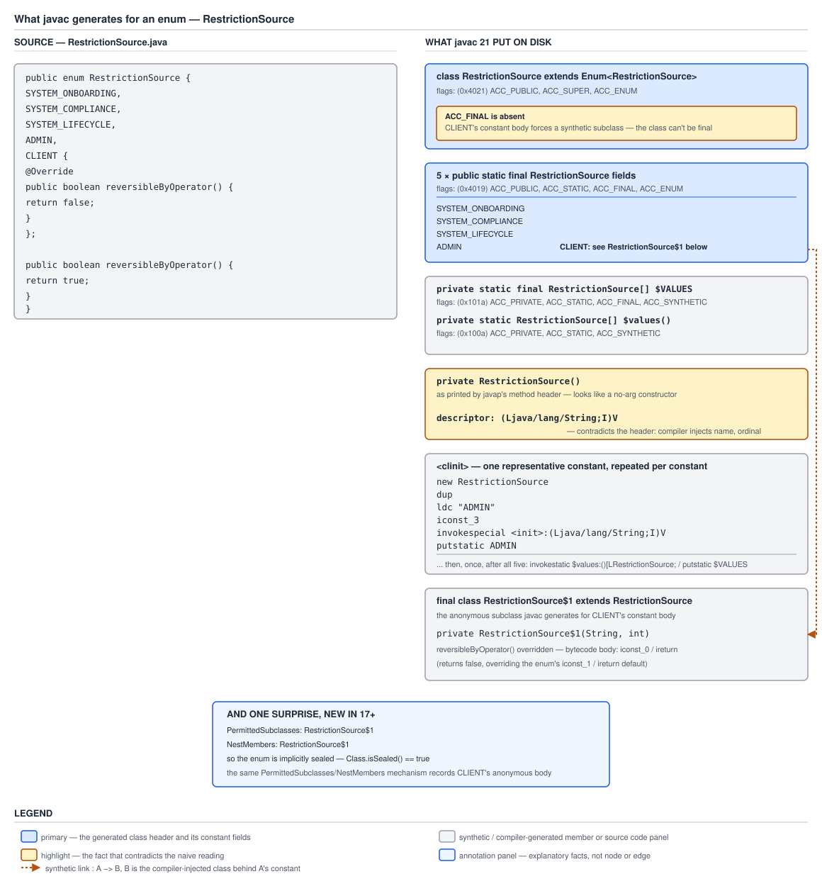

# 03 Java Core — Enum internals — INTERNALS (§3.10, 3.10.1–3.10.3)

**Target version: Java 21 LTS.** | **Part 3 of 5** | [Index](../00-index.md)
Previous: [Enums in production — patterns and guarantees](01c-production-patterns-and-guarantees.md) · Next: [`Enum`'s members and constant-body subclasses](03a-internals-enum-members.md)

`enum` is the most thoroughly desugared construct in the language. There is no enum in the JVM — there is a class access flag, a superclass, and about forty instructions per constant that `javac` writes for you. This file is the first half of that output, read instruction by instruction: which members are `ACC_SYNTHETIC` and therefore not yours, what the `<clinit>` actually executes and in what order, why the constructor's printed signature is a lie and the `descriptor:` line is the truth, and what the two generated static methods really do. [`03a-internals-enum-members.md`](03a-internals-enum-members.md) continues with constant-body subclasses, `Enum`'s three fields, and which of its members are `final` and why each one had to be.

Everything here is measured, not recalled. Where a claim is version-sensitive it is stated against four builds: **Oracle JDK 21.0.7 (21.0.7+8-LTS-245, macOS aarch64)** as the baseline, with **Oracle JDK 17.0.15**, **Oracle JDK 11.0.27** and **Oracle JDK 1.8.0_202** for comparison. Library source is quoted from JDK 21.0.7's `lib/src.zip`.

The language-level model this file explains is in [`01-basics.md`](01-basics.md) (the enum as a class, constant bodies, the uniqueness guarantee), [`01a-implicit-members-and-identity.md`](01a-implicit-members-and-identity.md) (`values()`, `valueOf`, `ordinal()`, `hashCode()`) and [`01b`](01b-collections-patterns-and-guarantees.md)/[`01c`](01c-production-patterns-and-guarantees.md) (collections, `switch`, patterns). This file does not re-argue those consequences; it shows the bytecode they follow from. The `$SwitchMap` holder, serialization and reflection are in [`03b-internals-guarantees-and-switch.md`](03b-internals-guarantees-and-switch.md); `EnumSet`/`EnumMap` layout and enum evolution in [`03c-internals-enumset-enummap.md`](03c-internals-enumset-enummap.md). For the class-file format itself — the constant pool, the attribute structures these attributes live in — see [`../language-substrate/03a-internals-class-file-format.md`](../language-substrate/03a-internals-class-file-format.md).

The two enums under test:

```java
public enum RestrictionType {
    DEPOSIT_BLOCKED, STAKE_BLOCKED, WITHDRAWAL_BLOCKED, DEPOSIT_LIMITED,
    WITHDRAWAL_HELD, SOURCE_OF_FUNDS_REQUIRED, ALL_BLOCKED, SELF_EXCLUDED,
    COOLING_OFF, DORMANT_FROZEN
}

public enum RestrictionSource {
    SYSTEM_ONBOARDING,
    SYSTEM_COMPLIANCE,
    SYSTEM_LIFECYCLE,
    ADMIN,
    CLIENT {
        @Override public boolean reversibleByOperator() { return false; }
    };
    public boolean reversibleByOperator() { return true; }
}
```

---

## 1. What `javac` actually emits for an enum (3.10.1)

Think of `javac` as writing a small class for you from a template. The template has five slots: a class header naming `Enum` as the superclass and setting `ACC_ENUM`; one `public static final` field per constant; a synthetic array field to hold them in order; two public static methods; and a `<clinit>` that populates all of it. Nothing in the JVM knows the word "enum" beyond a single bit in the access flags.

### Why it exists

The JVM has no enum concept, and adding one to the class file format in 2004 would have meant a new instruction or a new structure — and a JVM that could not load Java 5 class files. The design constraint was that an enum had to be expressible in the class file format that already existed. So the language feature is a `javac` transformation onto pre-existing machinery: a class, some static fields, a static initialiser. The single new thing is `ACC_ENUM` (`0x4000`), a spare bit in the access-flags word, and it exists only so that the JVM's reflection implementation and the serialization machinery can *recognise* an enum and apply the two rules that could not be desugared: refuse reflective construction, and serialize by name.

### The mechanism

`[SOURCE]` `[BYTECODE]` The class header first, measured with `javap -p -v RestrictionType.class` on JDK 21.0.7:

```
public final class RestrictionType extends java.lang.Enum<RestrictionType>
  minor version: 0
  major version: 65
  flags: (0x4031) ACC_PUBLIC, ACC_FINAL, ACC_SUPER, ACC_ENUM
  this_class: #1                          // RestrictionType
  super_class: #44                        // java/lang/Enum
  interfaces: 0, fields: 11, methods: 5, attributes: 2
```

`0x4031` decomposes as `ACC_PUBLIC` (0x0001) | `ACC_FINAL` (0x0010) | `ACC_SUPER` (0x0020) | `ACC_ENUM` (0x4000). `major version: 65` is Java 21. **Eleven fields** for ten constants: the eleventh is `$VALUES`. **Five methods** for a source file declaring none: `values`, `valueOf`, `<init>`, `$values`, `<clinit>`. And two class attributes, which the file's tail names:

```
Signature: #76                          // Ljava/lang/Enum<LRestrictionType;>;
SourceFile: "RestrictionType.java"
```

The `Signature` attribute is where the generic superclass `Enum<RestrictionType>` is recorded — the `super_class` entry itself is erased to plain `java/lang/Enum`, so without `Signature` reflection could not report the type argument. This is the general erasure mechanism, not an enum specialisation; see [`../generics/03-internals-erasure.md`](../generics/03-internals-erasure.md).

Now the fields. Each constant:

```
  public static final RestrictionType DEPOSIT_BLOCKED;
    descriptor: LRestrictionType;
    flags: (0x4019) ACC_PUBLIC, ACC_STATIC, ACC_FINAL, ACC_ENUM
```

`ACC_ENUM` appears on the *field* as well as the class. That is how reflection distinguishes a constant field from any other `public static final` field of the same type — `Field.isEnumConstant()` reads exactly this bit — and it is why a hand-written typesafe enum, however faithful, cannot be recognised as one.

And the synthetic array:

```
  private static final RestrictionType[] $VALUES;
    descriptor: [LRestrictionType;
    flags: (0x101a) ACC_PRIVATE, ACC_STATIC, ACC_FINAL, ACC_SYNTHETIC
```

`ACC_SYNTHETIC` (0x1000) marks it as compiler-generated and not present in source. The `$` prefix is convention on top of that: `$` is legal in a JVM identifier and by convention absent from hand-written Java, so the generated name cannot collide with a declared one.

The two public methods, with their flags — note that neither is synthetic:

```
  public static RestrictionType[] values();
    descriptor: ()[LRestrictionType;
    flags: (0x0009) ACC_PUBLIC, ACC_STATIC

  public static RestrictionType valueOf(java.lang.String);
    descriptor: (Ljava/lang/String;)LRestrictionType;
    flags: (0x0009) ACC_PUBLIC, ACC_STATIC
```

They are not `ACC_SYNTHETIC` because they are part of the enum's *specified* API — the JLS calls them "implicitly declared", which is a different thing from synthetic: implicitly declared members are visible to source, callable by name, and listed by `Class.getDeclaredMethods()`. A synthetic member is an implementation artefact. The distinction matters if you ever filter reflection output: skipping synthetic members hides `$VALUES` and `$values()` but keeps `values()` and `valueOf`.

**Insight — the constructor's printed header is not its signature.** Measured:

```
  private RestrictionType();
    descriptor: (Ljava/lang/String;I)V
    flags: (0x0002) ACC_PRIVATE
    Code:
      stack=3, locals=3, args_size=3
       0: aload_0
       1: aload_1
       2: iload_2
       3: invokespecial #49   // Method java/lang/Enum."<init>":(Ljava/lang/String;I)V
       6: return
```

`javap` prints `private RestrictionType()` — apparently no-arg — because it reconstructs the *source-level* signature, and the two injected parameters are not part of it. The truth is the next two lines: `descriptor: (Ljava/lang/String;I)V` declares a `String` and an `int`, and `args_size=3` counts the receiver plus those two. The body does nothing but forward them to `Enum.<init>`. Anyone who reads only the header concludes that `name` and `ordinal` arrive by magic; anyone who reads the descriptor sees an ordinary two-argument constructor. This is the same reading skill the anonymous-class constructor needs in [`../inheritance-and-dispatch/04-internals-nested-classes.md`](../inheritance-and-dispatch/04-internals-nested-classes.md).

The consequence for *your* constructor: whatever parameters you declare are appended after the injected two. An enum whose source constructor is `RestrictionType(String code, String description)` compiles to a descriptor of `(Ljava/lang/String;ILjava/lang/String;Ljava/lang/String;)V` — name, ordinal, then yours. Which is why reflective invocation of an enum constructor needs four arguments where the source shows two, and why frameworks that guess the signature get it wrong.

`[BYTECODE]` Finally, the `<clinit>`. Measured, with the repetitive middle elided by the structure rather than by an ellipsis — the pattern below repeats once per constant, with the `ldc` and the index changing:

```
  static {};
    Code:
       0: new           #1    // class RestrictionType
       3: dup
       4: ldc           #53   // String DEPOSIT_BLOCKED
       6: iconst_0
       7: invokespecial #54   // Method "<init>":(Ljava/lang/String;I)V
      10: putstatic     #3    // Field DEPOSIT_BLOCKED:LRestrictionType;
      13: new           #1    // class RestrictionType
      16: dup
      17: ldc           #55   // String STAKE_BLOCKED
      19: iconst_1
      20: invokespecial #54   // Method "<init>":(Ljava/lang/String;I)V
      23: putstatic     #7    // Field STAKE_BLOCKED:LRestrictionType;
```

then the same six instructions for `WITHDRAWAL_BLOCKED` at 26, `DEPOSIT_LIMITED` at 39, `WITHDRAWAL_HELD` at 52, `SOURCE_OF_FUNDS_REQUIRED` at 65, `ALL_BLOCKED` at 78, `SELF_EXCLUDED` at 92, `COOLING_OFF` at 106, `DORMANT_FROZEN` at 120, and then:

```
     134: invokestatic  #64   // Method $values:()[LRestrictionType;
     137: putstatic     #34   // Field $VALUES:[LRestrictionType;
     140: return
    LineNumberTable:
      line 2: 0
      line 3: 52
      line 4: 106
      line 1: 134
```

Six instructions per constant — `new`, `dup`, `ldc` the name, push the ordinal, `invokespecial`, `putstatic` — then the array build, then return. Two things follow that the BASICS files assert and this proves.

**First, the name is a `String` constant from the pool and the ordinal is a pushed integer literal.** `ldc #53 // String DEPOSIT_BLOCKED` and `iconst_0`. Both are baked into the class file at compile time. So `ordinal()` is not computed at runtime from any list — it is a literal that `javac` chose from the declaration order and wrote into the initialiser. Recompiling with a reordered declaration writes different literals, which is exactly why the ordinal is not stable across builds.

Note the switch from `iconst_N` to `bipush N` at ordinal 6: the JVM has dedicated single-byte opcodes `iconst_0` through `iconst_5` and falls back to the two-byte `bipush` above that. Purely a code-size detail, but it is why the offsets between constants change from 13 to 14 bytes partway down the listing.

**Second, `$VALUES` is assigned last, after every constant field.** Offsets 134–137. So during the constant-creation phase `$VALUES` is `null`, and `values()` — which is `getstatic $VALUES` then `clone()` — would throw `NullPointerException`. That is the whole reason a constructor may not call `values()` and a `static` block may: the static initialisers run after offset 137. The `LineNumberTable` even shows it, mapping offset 134 back to `line 1`, the enum declaration itself, because the array build belongs to no source line.

### Diagram



**D-117** — Source on the left, disk on the right. Three things to look at in the right lane. The class header's `flags: (0x4021)` with **no `ACC_FINAL`** — because `CLIENT` has a body, which is concept 4. The constructor's `descriptor: (Ljava/lang/String;I)V` line, highlighted because it contradicts the printed no-arg header directly above it. And the separate weak box for `RestrictionSource$1`, connected by the synthetic-link edge, with the annotation panel recording the `PermittedSubclasses` and `NestMembers` attributes that make the enum implicitly sealed.

### A concrete example

The version history of one small piece of this output is worth knowing, because it is the kind of thing an interviewer uses to check whether you have actually read bytecode or only read about it. On **JDK 17 and 21** there is a synthetic `$values()` helper method; on **JDK 8 and 11** there is not. Measured method lists, same source, four compilers:

```
JDK 1.8.0_202  ->  values(), valueOf(String), RestrictionType(), static {}
JDK 11.0.27    ->  values(), valueOf(String), RestrictionType(), static {}
JDK 17.0.15    ->  values(), valueOf(String), RestrictionType(), $values(), static {}
JDK 21.0.7     ->  values(), valueOf(String), RestrictionType(), $values(), static {}
```

On JDK 11 the array is built inline at the end of `<clinit>`, measured:

```
     203: putstatic     #1    // Field $VALUES:[LRestrictionType;
     206: return
```

— the array construction occupying offsets roughly 140 to 203, with the `<clinit>` ending at 206 rather than 140. On 17 and 21 that construction moved into its own method:

```
  private static RestrictionType[] $values();
    descriptor: ()[LRestrictionType;
    flags: (0x100a) ACC_PRIVATE, ACC_STATIC, ACC_SYNTHETIC
    Code:
       0: bipush        10
       2: anewarray     #1    // class RestrictionType
       5: dup
       6: iconst_0
       7: getstatic     #3    // Field DEPOSIT_BLOCKED:LRestrictionType;
      10: aastore
```

The same three-instruction `dup` / push-index / `getstatic` / `aastore` group repeats for each of the remaining nine slots, ending with `areturn` at offset 69. The `<clinit>` then just calls it. The measurable effect: `<clinit>`'s `Code` attribute shrank from 206 bytes to 140 for a ten-constant enum, roughly a third. A method's `Code` attribute is capped at 65,535 bytes, and `<clinit>` also has to hold your static initialisers, so factoring the array build out raises the constant count at which a very large enum stops compiling. The `values()` method body itself is *identical* on all four builds — `getstatic`, `invokevirtual clone()`, `checkcast`, `areturn` — so nothing observable changed.

**Interview:** if asked "what does `javac` generate for an enum", the answer that lands is the inventory with the flags on it: `ACC_ENUM` on the class *and* on each constant field; a `private static final ACC_SYNTHETIC` `$VALUES`; a `values()` that is `$VALUES.clone()` and is *not* synthetic because the JLS implicitly declares it; a `valueOf` that delegates to `Enum.valueOf`; a `private` constructor whose real descriptor prepends `(String, int)`; and a `<clinit>` of six instructions per constant with `$VALUES` assigned last. The last clause is the one that pays, because it is the reason `values()` works in a `static` block and not in a constructor.

### The gotcha

**Pitfall:** assuming the generated shape is stable enough to depend on. It is not, and the `$values()` change is the proof: a byte-code-rewriting agent, a Lombok-style annotation processor, or a test that asserts on `getDeclaredMethods().length` for an enum was correct on JDK 11 and wrong on 17 — four methods became five. Symptom: an instrumentation library or a reflection-based framework that works on one LTS and fails on the next with an error mentioning a method nobody wrote. Fix: filter on `ACC_SYNTHETIC` (`Method.isSynthetic()`) rather than counting or name-matching, and treat every `$`-prefixed member as off-limits. The JLS guarantees `values()`, `valueOf` and the `Enum` members; everything else in the listing above is this compiler's current choice.

> **Definition.** `javac` compiles an enum to a class with `ACC_ENUM` set, `java.lang.Enum` as superclass, one `ACC_ENUM public static final` field per constant, a `private static final ACC_SYNTHETIC` `$VALUES` array, implicitly-declared `values()` and `valueOf(String)`, a `private` constructor whose descriptor is prefixed with `(String name, int ordinal)`, and a `<clinit>` that creates each constant in declaration order and assigns `$VALUES` last.

---

## 2. `values()` is `$VALUES.clone()`, and the allocation is per call (3.10.2)

`[SOURCE]` `[NUM]` `[PROVE]` The four-instruction body and the 56-byte derivation are in [`01a-implicit-members-and-identity.md`](01a-implicit-members-and-identity.md) concept 2, with the 2.8M-reservations-a-day arithmetic. What belongs at this level is *why* those four instructions and not others, and what the JVM does with the third one.

### Why it exists

Two constraints meet. `$VALUES` must be `private` so no caller can write into it, because an array is mutable and there is no immutable array type — that decides the *existence* of an accessor. And the accessor's return type is fixed by the JLS as `E[]`, not `List<E>`, because `values()` was specified in 2004 and callers index it — that decides that the accessor must produce an array rather than an immutable view. Given both, a copy per call is the only correct implementation. `Arrays.copyOf` would have worked identically; `clone()` is chosen because on an array type it is the JVM's own operation and needs no `java.util.Arrays` dependency in the generated code.

### The mechanism

The four instructions, unchanged from JDK 8 through 21:

```
       0: getstatic     #34   // Field $VALUES:[LRestrictionType;
       3: invokevirtual #38   // Method "[LRestrictionType;".clone:()Ljava/lang/Object;
       6: checkcast     #39   // class "[LRestrictionType;"
       9: areturn
```

Three details worth reading.

**The `invokevirtual` target is spelled `"[LRestrictionType;".clone`.** The receiver is an *array type*, and array types have no class file. The JVMS specifies (§2.15) that every array type has `Object` as its superclass, implements `Cloneable` and `Serializable`, and has a `public` `clone()` that does not throw `CloneNotSupportedException` — the one place in the language where `clone()` is guaranteed to work and guaranteed to be a shallow copy. HotSpot implements it as a native allocation plus a bulk copy, not as a Java-level method, so there is no vtable dispatch to observe.

**The `checkcast` is erasure showing through.** `Object.clone()` returns `Object`, and the array's `clone()` inherits that erased return type in the descriptor even though the JVMS specifies the runtime result is an array of the same type. So the generated method must narrow. The `checkcast` cannot fail — the JVM guarantees the type — but it is still a real instruction the verifier requires, and it is why the listing has four instructions rather than three.

**Nothing is cached, and nothing can be.** There is no `if`, no field read of a memoised copy, no branch. A JIT compiler can, in principle, eliminate the allocation entirely when the array does not escape — escape analysis on the clone, with the loop over it scalar-replaced — and for the enhanced-`for` idiom `for (RestrictionType t : RestrictionType.values())` in a hot, inlined method that is a realistic outcome. But it is an optimisation, not a guarantee: it depends on the method being compiled, on the array not escaping, and on the loop being fully unrolled or the array's identity being unused. The honest statement is that the allocation is *emitted unconditionally and may sometimes be removed*, which is why the fix — clone once into a `static final` — is worth applying rather than relying on the JIT. Escape analysis of a short-lived allocation is treated in [`../wrappers-and-boxing/03-internals-boxing.md`](../wrappers-and-boxing/03-internals-boxing.md) with D-103.

`[PROVE]` The shallowness, derived from the instruction rather than asserted: `clone()` on an object array copies the *slots*, and each slot is a reference. So the new array's ten slots hold the same ten addresses as `$VALUES`. Measured consequence:

```
RestrictionType.values() == RestrictionType.values()          ->  false
RestrictionType.values()[7] == RestrictionType.SELF_EXCLUDED  ->  true
```

Different arrays, same constants. If `clone()` were deep, the second line would be `false` and the uniqueness guarantee of [`01-basics.md`](01-basics.md) concept 3 would be broken by the accessor that exists to protect it.

### Diagram

The three-frame picture of `$VALUES` at rest, the clone, and the daily allocation arithmetic is D-052, embedded in [`01a-implicit-members-and-identity.md`](01a-implicit-members-and-identity.md) concept 2 where the cost argument is made.

### A concrete example

The one measurement that separates "I read that `values()` clones" from "I know what that costs" is what happens to the shared copy. `Class` holds one, and there are two ways to reach it — one that clones and one that does not:

```java
public final class UniverseAccess {

    /** Clones. Same cost as values(): 56 bytes for a ten-constant enum. */
    public static RestrictionType[] viaReflection() {
        return RestrictionType.class.getEnumConstants();
    }

    /** Clones. This is values(), reached by name. */
    public static RestrictionType[] viaValues() {
        return RestrictionType.values();
    }

    /** Does not clone: EnumSet reads Class.enumConstants through SharedSecrets. */
    public static EnumSet<RestrictionType> viaEnumSet() {
        return EnumSet.allOf(RestrictionType.class);
    }

    /** Does not clone per call: one clone at UniverseAccess's class init. */
    private static final List<RestrictionType> UNIVERSE = List.of(RestrictionType.values());

    public static List<RestrictionType> viaCachedList() {
        return UNIVERSE;
    }
}
```

The chain behind `viaEnumSet` is worth tracing once, because it explains where the *first* clone goes. `EnumSet.getUniverse` calls `SharedSecrets.getJavaLangAccess().getEnumConstantsShared(elementType)`, and `Class.getEnumConstantsShared` is:

```java
T[] getEnumConstantsShared() {
    T[] constants = enumConstants;
    if (constants == null) {
        if (!isEnum()) return null;
        try {
            final Method values = getMethod("values");
            java.security.AccessController.doPrivileged(
                new java.security.PrivilegedAction<>() {
                    public Void run() {
                            values.setAccessible(true);
                            return null;
                        }
                    });
            @SuppressWarnings("unchecked")
            T[] temporaryConstants = (T[])values.invoke(null);
            enumConstants = constants = temporaryConstants;
        }
```

So `Class` bootstraps its cache by *reflectively calling your generated `values()`* — which clones — and keeps that clone forever. Note `if (!isEnum()) return null;`, which is the `ACC_ENUM` gate from concept 1: this is the exact point at which the class access flag earns its existence, because without it `EnumSet` and `EnumMap` could not exist. And note that `isEnum()` also requires `getSuperclass() == java.lang.Enum.class`, so passing a body-constant's class (`RestrictionSource$1`) here returns null — which is why `EnumSet.noneOf(CLIENT.getClass())` throws `ClassCastException: class RestrictionSource$1 not an enum` while `EnumSet.noneOf(CLIENT.getDeclaringClass())` works.

Total clones in a process's life for a given enum: one into `Class.enumConstants`, plus one per user call to `values()` or `getEnumConstants()`. The JDK's own enum collections use the copy that is never cloned again.

### The gotcha

**Pitfall:** expecting the JIT to remove the allocation because "escape analysis handles that". Sometimes it does. But the conditions are all outside your source: the enclosing method must be hot enough to compile, `values()` must inline, the array must provably not escape, and the loop must be shaped so that the array's identity is never needed. Change any one — add a `values().length` read into a field, pass the array to a method the compiler cannot inline, run the path only at startup so it stays interpreted — and the 56 bytes reappear. Symptom: an allocation profile that shows a `[LRestrictionType;` allocation site in a method where the code "obviously" cannot allocate, or a startup path that allocates far more than the steady state. Fix: do not make the JIT responsible for a correctness-neutral change you can make in one line. `private static final RestrictionType[] TYPES = values();` at class scope, and expose `List.of(TYPES)` rather than the array.

> **Definition.** `values()` is four instructions — `getstatic $VALUES`, `invokevirtual` the array type's `clone()`, `checkcast` to restore the erased type, `areturn` — identical from JDK 8 to 21; the clone is shallow and unconditional, and any elision is a JIT optimisation rather than a guarantee.

---

## 3. `valueOf` delegates, and `Class` caches a name-keyed map (3.10.3)

`[SOURCE]` `[RESEARCH]` Two levels: a five-instruction generated method that does nothing but supply the `Class` literal, and a shared implementation on `Enum` backed by a lazily-built map cached on the `Class` object.

### Why it exists

The lookup itself is type-independent — match a `String` against a set of names — so there is no reason to generate it per enum. What *is* per-enum is the `Class` object identifying which name space to search and the return type. So `javac` generates the thinnest possible shim: push the class literal, forward, narrow the result. Building the map lazily rather than in `<clinit>` matters because most enums never have `valueOf` called on them at all; the `Class` object would otherwise carry a `HashMap` for every enum in the application whether parsed or not.

### The mechanism

`[BYTECODE]` The generated shim, measured:

```
  public static RestrictionType valueOf(java.lang.String);
    Code:
       0: ldc           #1    // class RestrictionType
       2: aload_0
       3: invokestatic  #43   // Method java/lang/Enum.valueOf:(Ljava/lang/Class;Ljava/lang/String;)Ljava/lang/Enum;
       6: checkcast     #1    // class RestrictionType
       9: areturn
```

`ldc` of a `CONSTANT_Class` entry pushes the `Class` object — resolved by the constant pool, so it costs a pool resolution once and a constant read thereafter. `aload_0` pushes the name argument. `invokestatic` forwards. And `checkcast` again, for the same erasure reason as `values()`: `Enum.valueOf` is declared `<T extends Enum<T>> T`, whose erasure is `Enum`, so the caller narrows.

The shared implementation, from JDK 21's `Enum`:

```java
public static <T extends Enum<T>> T valueOf(Class<T> enumClass,
                                            String name) {
    T result = enumClass.enumConstantDirectory().get(name);
    if (result != null)
        return result;
    if (name == null)
        throw new NullPointerException("Name is null");
    throw new IllegalArgumentException(
        "No enum constant " + enumClass.getCanonicalName() + "." + name);
}
```

And the directory, from `Class`:

```java
Map<String, T> enumConstantDirectory() {
    Map<String, T> directory = enumConstantDirectory;
    if (directory == null) {
        T[] universe = getEnumConstantsShared();
        if (universe == null)
            throw new IllegalArgumentException(
                getName() + " is not an enum class");
        directory = HashMap.newHashMap(universe.length);
        for (T constant : universe) {
            directory.put(((Enum<?>)constant).name(), constant);
        }
        enumConstantDirectory = directory;
    }
    return directory;
}
private transient volatile Map<String, T> enumConstantDirectory;
```

Five things a careful read gives you.

**It is O(1), not a scan.** A `HashMap.get` against a map with as many entries as the enum has constants. A linear scan over `values()` would have been simpler to generate and would also have cost a clone per call.

**The map is per-`Class`, so per-loader.** `enumConstantDirectory` is an instance field of `Class`, and a `Class` object is identified by (binary name, defining loader). Two loaders defining the same enum have two directories and two constant sets — the class-loader caveat from [`01-basics.md`](01-basics.md) concept 3, visible in the implementation.

**The field is `transient volatile` and the build is unsynchronised.** Two threads can each see `null`, each build a directory, and each write; one write wins and the other map is collected. Benign, because both maps have identical contents and a `volatile` write publishes the winner safely. The absence of a lock here is deliberate — locking on first `valueOf` would serialise a common startup path for no correctness benefit.

**`HashMap.newHashMap(universe.length)` is Java 19+.** It sizes the table so that `length` entries fit without a resize. Older JDKs wrote `new HashMap<>(2 * universe.length)`, an approximation that over-allocated for small enums and under-allocated for some sizes. A micro-detail, but it is the kind of thing that shows up as a difference in a heap histogram between LTS versions.

**The null ordering is not an accident.** `enumConstantDirectory().get(null)` is reached *first* and returns `null` harmlessly, because `HashMap.get(null)` is defined. Only then does the explicit `if (name == null)` fire. So a null name produces `NullPointerException("Name is null")` — a *message*, deliberately, rather than the message-free NPE you would get from dereferencing. Reversing the two checks would have been equivalent; leaving the map lookup first keeps the success path to one branch.

The bootstrap cost, assembled: the first `valueOf` on an enum resolves `getMethod("values")` (a reflective method lookup), does a `setAccessible(true)` inside a `doPrivileged`, invokes it reflectively (one `values()` clone), stores the array on the `Class`, then builds and stores a right-sized `HashMap`. For a ten-constant enum that is a few hundred bytes and a handful of microseconds, once per class per loader. Every subsequent call is `ldc`, `aload`, one hash lookup, `checkcast`.

### Diagram

No diagram for this concept: the mechanism is a two-level delegation and the two source excerpts above are the clearer rendering. The class-init state machine that governs when the `Class` object itself becomes available is D-108 in [`../classes-and-initialization/03-internals-class-loading-and-init.md`](../classes-and-initialization/03-internals-class-loading-and-init.md).

### A concrete example

The reason to know the mechanism rather than just the behaviour is that it tells you what a tolerant parser costs relative to `valueOf`, and the answer is "nothing on the success path":

```java
public final class RestrictionParsing {

    /** Strict. One hash lookup on success; a stack-trace fill on failure. */
    public static RestrictionType strict(String name) {
        return RestrictionType.valueOf(name);
    }

    /**
     * Tolerant. Also one hash lookup on success — against our own map instead of
     * Class.enumConstantDirectory — and no exception on failure.
     */
    public static Optional<RestrictionType> tolerant(String name) {
        return RestrictionType.fromName(name);
    }

    /**
     * Tolerant and case-insensitive, which valueOf can never be: the directory is
     * keyed on name() exactly, and there is no hook to change that.
     */
    public static Optional<RestrictionType> lenient(String raw) {
        if (raw == null) {
            return Optional.empty();
        }
        return RestrictionType.fromName(raw.trim().toUpperCase(Locale.ROOT));
    }
}
```

`strict` and `tolerant` do the same amount of work when the name is valid. The entire difference is the failure path: `valueOf` constructs an `IllegalArgumentException`, and construction runs `fillInStackTrace`, which walks the current stack. That is the cost that makes `strict` unsuitable for parsing untrusted input and perfectly suitable for reading a value the code itself produced. `lenient` shows the other half of the argument: because the directory is keyed on `name()` with no normalisation hook, any tolerance at all — case, trimming, aliases, a renamed constant's old name — has to live in your map. `Locale.ROOT` on the `toUpperCase` is not decoration; the default-locale form famously mangles a lowercase `i` in Turkish, which is in [`../strings/01-basics.md`](../strings/01-basics.md).

### The gotcha

**Pitfall:** calling `Enum.valueOf(clazz, name)` with a `Class` obtained from a constant rather than from the type. Measured:

```
Enum.valueOf(RestrictionSource.CLIENT.getClass(), "ADMIN")
```

`CLIENT.getClass()` is `RestrictionSource$1`, whose `isEnum()` is `false` — it does not directly extend `java.lang.Enum` — so `getEnumConstantsShared()` returns `null` and `enumConstantDirectory()` throws `IllegalArgumentException: RestrictionSource$1 is not an enum class`. Symptom: a generic deserializer or a reflective mapper that resolves the target type from a sample value and works for every enum in the codebase until it meets one with a constant body, then fails with a message naming a class the developer never wrote. Fix: `getDeclaringClass()` for a constant, or the type token you already have. The same trap applies to `EnumSet.noneOf` and `new EnumMap<>`, both of which go through `getEnumConstantsShared` — measured `ClassCastException: class RestrictionSource$1 not an enum` from `EnumSet.noneOf`.

> **Definition.** The generated `valueOf(String)` is five instructions that push the enum's `Class` literal and forward to `Enum.valueOf`, which looks the exact `name()` up in `Class.enumConstantDirectory()` — a right-sized `HashMap` built lazily from `getEnumConstantsShared()`, cached in a `transient volatile` field, and therefore per `Class` and per defining loader.

---

## Pitfalls

### Counting or name-matching generated enum members

**Wrong**

```java
@Test
void enumHasNoExtraMethods() {
    // Passed on JDK 8 and 11. Fails on 17 and 21.
    assertEquals(4, RestrictionType.class.getDeclaredMethods().length);
}
```

Measured method lists for the identical source: JDK 1.8.0_202 and 11.0.27 produce `values`, `valueOf`, `<init>`, `<clinit>` — and `getDeclaredMethods()` reports the first two plus nothing else visible. JDK 17.0.15 and 21.0.7 add the synthetic `$values()`, so the count changes. Any assertion, agent, or annotation processor keyed on the count or on a `$`-prefixed name was correct on one LTS and wrong on the next.

**Right**

```java
@Test
void enumDeclaresOnlyTheImplicitMembers() {
    List<String> declared = Arrays.stream(RestrictionType.class.getDeclaredMethods())
        .filter(method -> !method.isSynthetic())
        .map(Method::getName)
        .sorted()
        .toList();
    assertEquals(List.of("valueOf", "values"), declared);
}
```

Filtering on `isSynthetic()` — which reads the `ACC_SYNTHETIC` bit — expresses the actual intent: "no members beyond what the JLS implicitly declares". It is stable across every version tested, because `values()` and `valueOf` are implicitly declared and therefore not synthetic, while `$VALUES` and `$values()` are.

**Why people believe it:** the generated shape is deterministic for a given compiler, so a count-based assertion passes reliably for years. The instability is between compilers, and nothing in the test hints that it has a JDK dependency.

---

## Cheat sheet

| Thing | Fact (Java 21 LTS) |
|---|---|
| Class flags, no constant bodies | `(0x4031) ACC_PUBLIC, ACC_FINAL, ACC_SUPER, ACC_ENUM`; `ACC_ENUM` is `0x4000` |
| Superclass | `java/lang/Enum`, erased. The type argument lives in the `Signature` attribute |
| Class attributes | `Signature` and `SourceFile` for a plain enum — two, measured |
| Field count | constants + 1. Ten constants means eleven fields, the extra being `$VALUES` |
| Method count | 5 for a source file declaring none: `values`, `valueOf`, `<init>`, `$values`, `<clinit>` |
| Constant field flags | `(0x4019) ACC_PUBLIC, ACC_STATIC, ACC_FINAL, ACC_ENUM`. `Field.isEnumConstant()` reads that bit |
| `$VALUES` flags | `(0x101a) ACC_PRIVATE, ACC_STATIC, ACC_FINAL, ACC_SYNTHETIC` |
| `$values()` flags | `(0x100a) ACC_PRIVATE, ACC_STATIC, ACC_SYNTHETIC` |
| `$values()` version history | **absent on JDK 8 and 11**, present on 17 and 21. `<clinit>` shrank 206 → 140 bytes for 10 constants |
| `values()` / `valueOf` flags | `(0x0009) ACC_PUBLIC, ACC_STATIC` — **not** synthetic; the JLS *implicitly declares* them |
| Synthetic vs implicitly declared | synthetic = artefact, invisible to source; implicitly declared = real API, callable by name, JLS-guaranteed |
| Constructor | `flags: (0x0002) ACC_PRIVATE`, `descriptor: (Ljava/lang/String;I)V`. `javap`'s printed header hides both parameters |
| Reading the constructor | trust `descriptor:` and `args_size`, not the reconstructed header |
| Your constructor parameters | appended **after** the injected `(String, int)` — a 2-arg source constructor has a 4-arg descriptor |
| `Enum.<init>` | `protected`, reached by `invokespecial` from the generated constructor |
| `<clinit>` per constant | 6 instructions: `new`, `dup`, `ldc` name, push ordinal, `invokespecial <init>`, `putstatic` |
| Ordinal in the class file | an integer **literal** — `iconst_0`..`iconst_5`, then `bipush`. Never computed at runtime |
| `$VALUES` assignment | **last**, at offsets 134–137 for ten constants. Static initialisers run after it |
| Consequence of that ordering | `values()` NPEs in a constructor; works in a `static` block |
| `values()` body | `getstatic $VALUES` / `invokevirtual "[LE;".clone()` / `checkcast` / `areturn` — identical JDK 8 through 21 |
| Why the `checkcast` | `Object.clone()`'s erased `Object` return; the array descriptor inherits it, so the caller narrows |
| Array `clone()` | JVMS §2.15 — every array type has a `public clone()` that cannot throw and is a shallow copy |
| Clone is shallow | `values()[7] == E.SELF_EXCLUDED` is `true`; only the slot array is fresh |
| Escape analysis | may remove the clone; **not** a guarantee. Cache in a `static final` rather than rely on it |
| `values()` cost | `16 B array header + 4 B × constants`; 10 constants = 56 B, derived |
| `valueOf` shim | `ldc` class literal / `aload_0` / `invokestatic Enum.valueOf` / `checkcast` / `areturn` |
| `Enum.valueOf` | `enumClass.enumConstantDirectory().get(name)`, then a null check, then `IllegalArgumentException` |
| Why the map lookup is first | `HashMap.get(null)` returns null harmlessly, so the success path stays one branch |
| Null name | `NullPointerException("Name is null")` — with a message, deliberately |
| `Class.enumConstantDirectory()` | right-sized `HashMap` (`HashMap.newHashMap`, Java 19+), `transient volatile`, benignly racy build |
| Directory scope | per `Class`, therefore per **defining loader** — the class-loader caveat, visible in the field |
| `Class.getEnumConstantsShared()` | gated on `isEnum()`; bootstraps by reflectively calling your `values()`, so one clone kept forever |
| `Class.getEnumConstants()` (public) | **clones** the shared array. Same cost as `values()` |
| Total clones per process | one into `Class.enumConstants`, plus one per user `values()`/`getEnumConstants()` call |
| Why `EnumSet`/`EnumMap` are free of it | they reach the shared array via `SharedSecrets.getJavaLangAccess()` |
| `isEnum()` | requires the `ACC_ENUM` bit **and** `getSuperclass() == java.lang.Enum.class` |
| Consequence for body constants | `EnumSet.noneOf(CLIENT.getClass())` throws `ClassCastException: class E$1 not an enum`. Use `getDeclaringClass()` |
| First-`valueOf` bootstrap cost | a `getMethod`, a `setAccessible` in a `doPrivileged`, one reflective `values()` call, one right-sized map |
| Depend on / do not depend on | JLS guarantees `values()`, `valueOf`, the `Enum` members. Everything `$`-prefixed is compiler choice |
| Right reflection filter | `!method.isSynthetic()`, never a method count and never a `$` name match |

---

## Self-test

**Q1.** `javap` prints an enum's constructor as `private RestrictionType()`. Where do `name` and `ordinal` come from?

<details><summary>Answer</summary>

From constructor parameters that `javap`'s reconstructed source-level header does not show. The evidence is two lines below it: `descriptor: (Ljava/lang/String;I)V` and `args_size=3` (receiver plus two). The body is four instructions — `aload_0`, `aload_1`, `iload_2`, `invokespecial java/lang/Enum."<init>":(Ljava/lang/String;I)V` — so the generated constructor does nothing but forward the two injected arguments to `Enum`'s `protected` constructor, which assigns its `private final String name` and `private final int ordinal`. `javac` supplies the values at each call site in `<clinit>`: `ldc` the name as a `String` constant from the pool, and `iconst_N` or `bipush N` for the ordinal as an integer literal. The consequence people trip over: your own constructor's parameters are *appended* after those two, so a source constructor declared `RestrictionType(String code, String description)` has the descriptor `(Ljava/lang/String;ILjava/lang/String;Ljava/lang/String;)V`. Which is why reflective invocation needs four arguments where the source shows two, and why a framework that guesses the signature from the source shape gets it wrong.

</details>

**Q2.** From the `<clinit>` bytecode, prove why `values()` may be called from a `static` block but not from an enum's constructor.

<details><summary>Answer</summary>

Because `$VALUES` is assigned last. The measured `<clinit>` for the ten-constant `RestrictionType` runs six instructions per constant — `new`, `dup`, `ldc` the name, push the ordinal, `invokespecial <init>`, `putstatic` the constant field — in declaration order, occupying offsets 0 through 133. Only then, at offsets 134 and 137, does it do `invokestatic $values:()[LRestrictionType;` and `putstatic $VALUES`. Static initialiser blocks and static field initialisers run after that. So in a `static` block, `$VALUES` holds the array and `values()` — which is `getstatic $VALUES` then `invokevirtual clone()` — returns a complete copy. In a *constructor*, execution is inside the first phase: `$VALUES` is still `null`, so the `getstatic` pushes null and the `invokevirtual clone()` on it throws `NullPointerException`. The JVM wraps any `Throwable` escaping `<clinit>` in `ExceptionInInitializerError`, marks the class erroneous, and every subsequent touch throws `NoClassDefFoundError` with no cause attached — so the original NPE appears exactly once, in whichever log caught the very first failure. This is why a static lookup map must be built in a `static` block or a private holder class, never in the constructor.

</details>

**Q3.** What changed about the generated enum between JDK 11 and JDK 17, and what did not?

<details><summary>Answer</summary>

The array build moved out of `<clinit>` into a synthetic helper. Measured method lists for identical source: JDK 1.8.0_202 and 11.0.27 emit `values`, `valueOf`, `<init>`, `<clinit>`; JDK 17.0.15 and 21.0.7 emit those plus `private static RestrictionType[] $values()` with `flags: (0x100a) ACC_PRIVATE, ACC_STATIC, ACC_SYNTHETIC`. On 11 the `anewarray` and the ten `aastore`s sit inline at the end of `<clinit>`, whose `Code` runs to offset 206; on 17 and 21 `<clinit>` ends at 140 and just calls `$values()`. The measurable effect is a roughly one-third smaller `<clinit>` for ten constants, which matters because a method's `Code` attribute is capped at 65,535 bytes and `<clinit>` also has to hold your static initialisers — so the change raises the constant count at which a very large enum stops compiling. What did **not** change: the `values()` body is byte-for-byte identical on all four builds (`getstatic`, `invokevirtual "[LE;".clone()`, `checkcast`, `areturn`), the constructor descriptor is still `(Ljava/lang/String;I)V`, and the per-constant `<clinit>` sequence is still the same six instructions. So nothing observable to a program changed — but anything counting `getDeclaredMethods()` or matching method names broke, which is why the right filter is `isSynthetic()`.

</details>

**Q4.** How many times is an enum's constants array cloned in a process's life, and by whom?

<details><summary>Answer</summary>

Once into `Class.enumConstants`, plus once per user call to `values()` or `Class.getEnumConstants()`. The first clone is a side effect of the bootstrap: `Class.getEnumConstantsShared()` is a null check on `enumConstants`, then `if (!isEnum()) return null;`, then `getMethod("values")`, a `setAccessible(true)` inside a `doPrivileged`, `values.invoke(null)`, and finally `enumConstants = constants = temporaryConstants;` — so `Class` fills its cache by *reflectively calling your generated `values()`*, which clones, and keeps that clone forever. After that, `getEnumConstantsShared()` returns the cached array with no copy, and that is what `EnumSet.getUniverse` and `EnumMap.getKeyUniverse` reach through `SharedSecrets.getJavaLangAccess()` — which is precisely why `EnumSet.allOf` and `new EnumMap<>(type)` allocate no universe array. `Class.enumConstantDirectory()` also builds off the shared copy without cloning. The public `Class.getEnumConstants()`, by contrast, clones before returning, so it costs the same 56 bytes as `values()` for a ten-constant enum. Note the `if (!isEnum()) return null;` gate: `isEnum()` requires both the `ACC_ENUM` bit and `getSuperclass() == java.lang.Enum.class`, which is exactly why passing a body constant's class — `RestrictionSource$1` — makes `EnumSet.noneOf` throw `ClassCastException: class RestrictionSource$1 not an enum`.

</details>

**Q5.** What is the difference between `ACC_SYNTHETIC` and "implicitly declared", and why does it matter?

<details><summary>Answer</summary>

`ACC_SYNTHETIC` (`0x1000`) marks a member the compiler invented as an implementation artefact, with no counterpart in source: on an enum, `private static final E[] $VALUES` (`flags: (0x101a)`) and `private static E[] $values()` (`flags: (0x100a)`). "Implicitly declared" is a JLS notion: the specification says every enum *has* `public static E[] values()` and `public static E valueOf(String)` without you writing them, and those are real API — measured `flags: (0x0009) ACC_PUBLIC, ACC_STATIC`, with no synthetic bit. You can call them by name from source, they appear in `getDeclaredMethods()` unfiltered, and the JLS guarantees their signatures. It matters in two places. First, when filtering reflection output: `!method.isSynthetic()` keeps `values` and `valueOf` and drops `$values`, which is exactly the intent "no members beyond the implicit API" — whereas counting methods or matching on `$` breaks between JDK 11 and 17, because `$values()` appeared. Second, when deciding what you may depend on: the JLS commits to `values()`, `valueOf` and the `Enum` members, so those are contracts. Everything `$`-prefixed is this compiler's current choice, which is why the `$VALUES`/`$values()` split changed between LTS releases and why a bytecode agent or annotation processor keyed on it needed a fix.

</details>

---


**Q6.** Trace the four instructions of `values()` and say which one cannot fail, and why it is there anyway.

<details><summary>Answer</summary>

`getstatic $VALUES:[LE;` reads the synthetic backing field. `invokevirtual "[LE;".clone:()Ljava/lang/Object;` calls the array type's `clone()` — note the receiver is spelled as an *array type*, which has no class file at all; JVMS §2.15 specifies that every array type has `Object` as superclass, implements `Cloneable` and `Serializable`, and has a `public clone()` that cannot throw `CloneNotSupportedException`, and HotSpot implements it as a native allocation plus a bulk copy rather than a Java method. `checkcast class "[LE;"` narrows the result. `areturn` returns it. The `checkcast` is the one that cannot fail: the JVMS guarantees `clone()` on an array returns an array of the same runtime type, so the cast is always satisfied. It is there because the *descriptor* says `()Ljava/lang/Object;` — inherited from `Object.clone()` and never specialised — so the verifier sees an `Object` on the stack where the method's declared return type is `[LE;`, and only an explicit `checkcast` reconciles them. It is erasure showing through in the one place people do not expect it, since no generics are involved. This is also why the body is four instructions rather than three, and it is identical on JDK 8, 11, 17 and 21.

</details>

**Q7.** Why is `Class.enumConstantDirectory` built without a lock, and is that safe?

<details><summary>Answer</summary>

Safe, and deliberately unlocked. The field is `private transient volatile Map<String, T> enumConstantDirectory;` and the build is the classic benign race: `Map<String, T> directory = enumConstantDirectory; if (directory == null) { build it; enumConstantDirectory = directory; } return directory;`. Two threads arriving together can both see `null`, both build a complete directory, and both write; one write wins and the loser's map becomes garbage. That is correct because the two maps have *identical contents* — both are built from the same `getEnumConstantsShared()` array, keyed by the same `name()` values — so a caller cannot tell which one it got. The `volatile` is what makes it safe rather than merely likely: it gives the reading thread a happens-before edge to the writer's map construction, so no thread can observe a partially-built `HashMap`. Without `volatile` this would be the broken-double-checked-locking bug. The design reason to avoid a lock: `valueOf` is a common startup path, and locking it would serialise every thread parsing an enum during application boot for no correctness benefit. The same pattern appears at the layer below in `getEnumConstantsShared()`, where `enumConstants` is also written unsynchronised — and there the two racing threads each pay one `values()` clone, which is the reason the "one clone into the `Class` cache" figure is a lower bound rather than an exact count under contention.

</details>

---

## Open questions

- **Unverified:** the reason `javac` moved the `$VALUES` construction into a synthetic `$values()` method, and the exact release it happened in. Measured that JDK 1.8.0_202 and 11.0.27 build the array inline in `<clinit>` (running to offset 206 for ten constants) while 17.0.15 and 21.0.7 factor it into `private static E[] $values()` with `<clinit>` ending at 140 — so the change landed somewhere in 12 through 17. The `<clinit>` code-size argument given in concept 1 is a plausible motivation consistent with the measurement, not a sourced one, and no bug id is cited here rather than guessed. No JDK 12–16 install was available to narrow the range. What would settle it: `git log --follow` on `com/sun/tools/javac/comp/Lower.java` in `openjdk/jdk`, or a JDK bug database search for the enum `$values` change. Nothing observable to a program depends on the answer — the `values()` body is byte-identical across all four builds.
- **Unverified:** whether escape analysis actually eliminates the `values()` clone in the enhanced-`for` idiom on this build. Concept 2 states that it *may* and that the elision is not a guarantee, which is the honest position, but no measurement was taken either way. What would settle it: `-XX:+UnlockDiagnosticVMOptions -XX:+PrintEliminateAllocations`, or an async-profiler allocation trace, on a hot loop doing `for (RestrictionType t : RestrictionType.values())`, with `-XX:-DoEscapeAnalysis` as a control. The recommendation — cache in a `static final` rather than rely on the JIT — does not depend on the answer.
- **Unverified:** the 56-byte figure for a ten-constant `values()` array. It is derived from the confirmed flags on this build (`UseCompressedOops = true`, `ObjectAlignmentInBytes = 8`) plus the standard 12-byte object header and 4-byte `length` field for an array: `16 + 10 × 4 = 56`, already 8-aligned. What would settle it: `org.openjdk.jol.info.ClassLayout.parseInstance(RestrictionType.values()).instanceSize()`. JOL was not available in this environment. The instruction count and the shallowness are measured; only the byte total is derived.

---

**Leaves covered:** 3.10.1, 3.10.2, 3.10.3 (3 leaves)
**Leaves deferred:** none
**Diagrams included:** D-117
**Target version:** Java 21 LTS
**Lines:** 600
