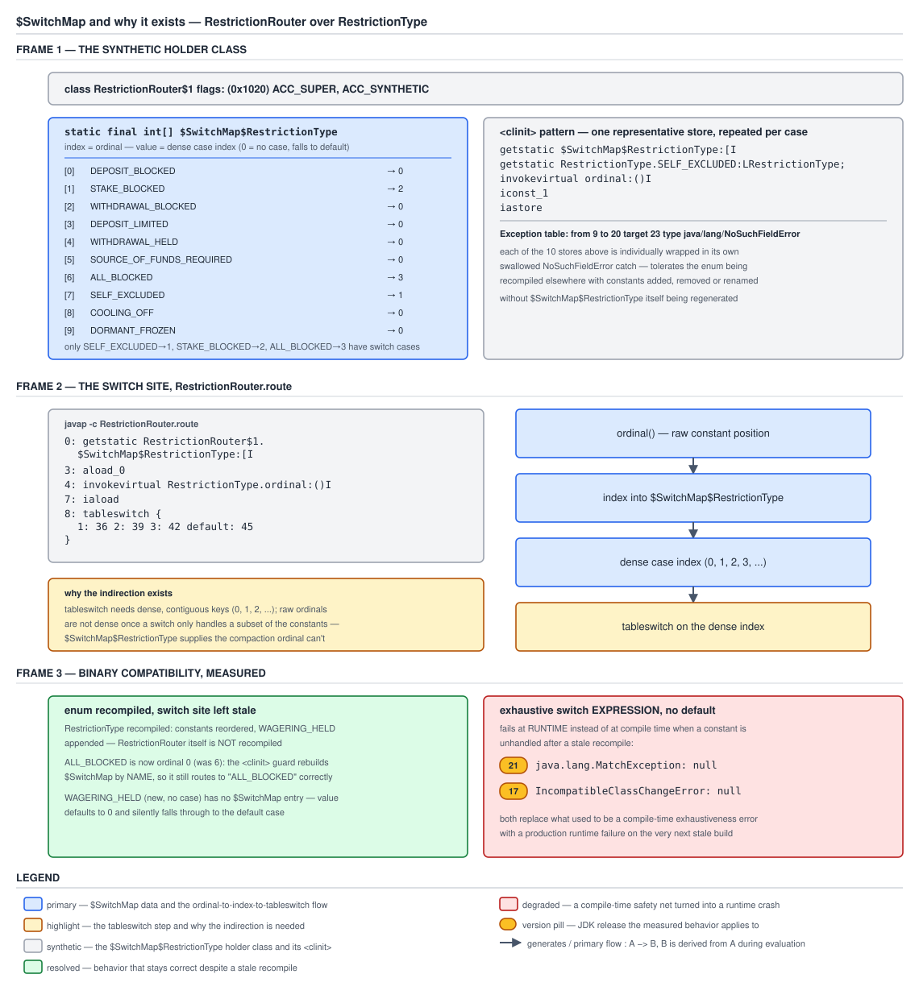

# 03 Java Core — Enum guarantees and the switch map — INTERNALS (§3.10, 3.10.7–3.10.9)

**Target version: Java 21 LTS.** | **Part 3 of 5** | [Index](../00-index.md)
Previous: [`Enum`'s members and constant-body subclasses](03a-internals-enum-members.md) · Next: [`EnumSet` and `EnumMap` internals](03c-internals-enumset-enummap.md)

Three mechanisms, all of them things the language could not desugar and had to push into the platform. Serialization by name, which is a rule in the serialization specification keyed on `ACC_ENUM` rather than anything `javac` emits. Reflective construction being refused, which is a hard-coded check inside `Constructor.newInstance` and not an accessibility rule. And the `$SwitchMap` holder class, which is the opposite case — pure `javac` desugaring, with no JVM involvement at all, and the most instructive piece of generated code in the language because it is a complete solution to a binary-compatibility problem written in twenty instructions.

Everything below is measured. Version-sensitive claims are stated against **Oracle JDK 21.0.7 (21.0.7+8-LTS-245, macOS aarch64)** as the baseline, with **Oracle JDK 17.0.15** for the version comparisons; library source is quoted from JDK 21.0.7's `lib/src.zip`.

The language-level statements of these three are in [`01-basics.md`](01-basics.md) concept 3 (the uniqueness guarantee, with the measurements), [`01c-production-patterns-and-guarantees.md`](01c-production-patterns-and-guarantees.md) concepts 2 and 3 (their costs), and [`01b-collections-patterns-and-guarantees.md`](01b-collections-patterns-and-guarantees.md) concept 2 (the `switch` language rules and the `default` decision). The language-side treatment of `String` and enum switch, including the two-stage `String` case, is [`../control-flow/01b-string-and-enum-switch.md`](../control-flow/01b-string-and-enum-switch.md) — this file owns the enum switch's *bytecode*, and does not repeat its language rules.

The enum and the switch under test:

```java
public enum RestrictionType {
    DEPOSIT_BLOCKED, STAKE_BLOCKED, WITHDRAWAL_BLOCKED, DEPOSIT_LIMITED,
    WITHDRAWAL_HELD, SOURCE_OF_FUNDS_REQUIRED, ALL_BLOCKED, SELF_EXCLUDED,
    COOLING_OFF, DORMANT_FROZEN
}

public class RestrictionRouter {
    public static String route(RestrictionType type) {
        switch (type) {
            case SELF_EXCLUDED:
                return "SELF_EXCLUDED";
            case STAKE_BLOCKED:
                return "STAKE_BLOCKED";
            case ALL_BLOCKED:
                return "ALL_BLOCKED";
            default:
                return "OTHER";
        }
    }
}
```

Three of ten constants are handled, which is deliberate: the interesting behaviour only appears when the switch covers a *subset*.

---

## 1. Serialization is by `name`, and the hooks are specified away (3.10.7)

`[SOURCE]` `[RESEARCH]` `[PROVE]` The model: an enum constant on the wire is a string, and deserialization is a lookup rather than a construction. No field is ever written into an enum instance by `ObjectInputStream`, because no enum instance is ever created by it.

### Why it exists

Standard Java serialization reconstructs an object by allocating it without calling a constructor and then writing its fields directly from the stream. Applied to an enum that would produce a *new* instance with a copied `name` and `ordinal` — an eleventh `RestrictionType` that prints as `SELF_EXCLUDED`, is not `==` to `SELF_EXCLUDED`, and therefore fails every `switch`, every `EnumSet.contains`, and every `==` comparison in the program while looking correct in every log line. That is the single worst failure mode available, so the specification does not merely discourage it: it replaces the whole mechanism for enums with a by-name form, and closes the customisation hooks so no application author can reintroduce the problem by accident or on purpose.

The design also has to survive the class-loader case: the resolved constant must be the one belonging to the `Class` the deserializing side resolved, which a name lookup gives naturally and a field copy would not.

### The mechanism

The wire form, measured. Serializing `RestrictionType.SELF_EXCLUDED` through `ObjectOutputStream` produced an **81-byte** stream, and reading it back as ISO-8859-1 text confirmed it contains the literal `SELF_EXCLUDED`. There is no ordinal in the stream and no field data. On read, `ObjectInputStream` resolves the class descriptor, reads the name, and calls `Enum.valueOf(enumType, name)` — which goes through `Class.enumConstantDirectory()`, as [`03-internals-enums.md`](03-internals-enums.md) concept 3 shows — and returns the existing constant. Measured: `identical = true` against the original constant.

`[PROVE]` The hooks. The measurement that settles it, rather than the specification quotation that asserts it:

```java
enum BonusState implements Serializable {
    GRANTED, ACTIVE, CONSUMED, EXPIRED, CLAWED_BACK;

    private Object readResolve()  { System.out.println("readResolve CALLED");  return GRANTED; }
    private Object writeReplace() { System.out.println("writeReplace CALLED"); return GRANTED; }
    private void readObject(ObjectInputStream in) { System.out.println("readObject CALLED"); }
}
```

All three print to stdout if called. A complete `ObjectOutputStream`/`ObjectInputStream` round trip of `BonusState.CLAWED_BACK` on JDK 21.0.7 printed:

```
B. round trip = CLAWED_BACK, identical = true
```

and nothing else. Not one of the three fired. Note also what `writeReplace` *would* have done had it been honoured — return `GRANTED` — so the round trip returning `CLAWED_BACK` is independent evidence that the write side ignored it too, not just the read side.

`java.lang.Enum` closes the door from its own side as well, and the two methods are worth reading because they are the belt-and-braces half of the design:

```java
/**
 * prevent default deserialization
 */
@java.io.Serial
private void readObject(ObjectInputStream in) throws IOException,
    ClassNotFoundException {
    throw new InvalidObjectException("can't deserialize enum");
}

@java.io.Serial
private void readObjectNoData() throws ObjectStreamException {
    throw new InvalidObjectException("can't deserialize enum");
}
```

The comment is the JDK's own: *prevent default deserialization*. `readObject` fires if a stream claims to hold field data for this class; `readObjectNoData` fires if a stream was written by a version of the class hierarchy that did not include this class. Both throw. So a hand-crafted or malicious stream asserting a field-by-field enum instance is refused at the `java.lang.Enum` layer even if something upstream of it went wrong. **Insight:** this is defence in depth against a *deserialization gadget*. An attacker who controls a stream cannot use an enum as a fabrication primitive, which matters because enums are frequently the discriminators in state machines and permission checks — exactly the values a gadget chain would want to forge. Java serialization as an attack surface is in [`../serialization/02-serialization.md`](../serialization/02-serialization.md).

Note the interaction with the `@java.io.Serial` annotation: it is a compile-time check, added in Java 14, that the annotated member actually matches one of the serialization mechanism's magic signatures. It has no runtime effect — serialization has always found these members reflectively by exact signature — but it turns a misspelled `readResolve` (the classic `readResolv`, or the wrong return type) from a silently-ignored method into a compile error. Worth adopting in your own `Serializable` classes for exactly that reason.

`Enum` also declares:

```java
@Deprecated(since="18", forRemoval=true)
@SuppressWarnings("removal")
protected final void finalize() { }
```

`final` and empty, so no enum can have a finalizer. Related to serialization only indirectly, but it closes the other classic singleton-forgery route: a finalizer that resurrects the object being collected. With `finalize` final and empty, enums never enter the finalizer queue at all.

### Diagram

No diagram for this concept: the evidence is an 81-byte stream, three uncalled methods and two quoted throw statements, and the prose above is the clearer rendering.

### A concrete example

The cost, which is the part worth designing around. Because the wire form is the name, the *name* is a published contract:

```java
public enum BonusState {
    GRANTED, ACTIVE, CONSUMED, EXPIRED, CLAWED_BACK,

    /**
     * Retained only so that streams written before the 2026-06 rename still
     * deserialize. Nothing produces it. Remove once the Kafka topic's 7-day
     * retention has fully rolled past the deployment.
     *
     * @deprecated superseded by {@link #CLAWED_BACK}
     */
    @Deprecated(forRemoval = true)
    REVERSED;

    /** Fold the retained alias onto the constant that replaced it. */
    public BonusState canonical() {
        return this == REVERSED ? CLAWED_BACK : this;
    }
}
```

That is the *only* migration mechanism available: keep the old constant, fold it at the boundary, and delete it once the streams have drained. You cannot write `readResolve` to do the folding, because it will not be called. And you cannot add an alias map inside the enum that `Enum.valueOf` consults, because `valueOf` reads `Class.enumConstantDirectory()`, which is built from `name()` with no hook.

The alternative, and the reason [`01c`](01c-production-patterns-and-guarantees.md) concept 1 recommends it, is to stop putting the enum on the wire:

```java
public final class BonusStateCodec {

    private static final Map<String, BonusState> BY_WIRE_CODE = Map.of(
        "GRANTED",     BonusState.GRANTED,
        "ACTIVE",      BonusState.ACTIVE,
        "CONSUMED",    BonusState.CONSUMED,
        "EXPIRED",     BonusState.EXPIRED,
        "CLAWED_BACK", BonusState.CLAWED_BACK,
        "REVERSED",    BonusState.CLAWED_BACK);   // the rename, absorbed here

    public static String encode(BonusState state) {
        return state.name();
    }

    public static BonusState decode(String wireCode) {
        BonusState state = BY_WIRE_CODE.get(wireCode);
        if (state == null) {
            throw new IllegalArgumentException("unknown bonus state on the wire: " + wireCode);
        }
        return state;
    }
}
```

Now the rename is one line in a map you own, and the enum is free to evolve. The trade-off is explicit: you have taken responsibility for a mapping the platform was maintaining for you, and the map must be updated whenever a constant is renamed — which is why the `decode` failure message names the offending code, so a missed update fails loudly on the first message rather than silently.

### The gotcha

**Pitfall:** assuming the guarantee extends to *adding* constants. It does not, in the read direction. An older consumer receiving a stream naming a constant it does not have gets `IllegalArgumentException: No enum constant <class>.<name>` thrown from inside `ObjectInputStream.readEnum`, wrapped by whatever framework is above it — commonly surfacing as a Spring `MessageConversionException`, a Kafka `SerializationException`, or a bare `InvalidClassException` depending on the layer. Symptom: during a rolling upgrade, the *old* instances start failing on messages the *new* instances produce, so the error appears on the nodes you did not change. Fix: treat adding an enum constant to a serialized type as a two-phase deployment — deploy the constant to every consumer first, then start producing it — or, better, use an explicit codec so an unknown code is a decision your code makes rather than an exception the platform throws.

> **Definition.** Enum serialization writes the constant's `name()` and resolves it with `Enum.valueOf`, with `writeReplace`, `readResolve` and `readObject` specified as ignored and `Enum`'s own `readObject`/`readObjectNoData` throwing `InvalidObjectException` — so the form cannot be forged and cannot be customised, which also means a constant rename has no in-enum migration path.

---

## 2. Reflective construction is refused, and `setAccessible` does not help (3.10.8)

`[PROVE]` The claim usually stated as "reflection cannot create an enum" is true of the reflection API and false of the JVM. Getting the boundary right is the difference between a correct answer and an overconfident one.

### Why it exists

The constructor being `private` is not sufficient on its own, because `setAccessible(true)` exists precisely to defeat access modifiers. So the uniqueness guarantee of [`01-basics.md`](01-basics.md) concept 3 needs a check that is not an access check — something reflection refuses regardless of accessibility, module opens, or the absence of a security manager. `Constructor.newInstance` therefore tests the *declaring class's* `ACC_ENUM` bit and refuses unconditionally. This is one of exactly two things `ACC_ENUM` is for; the other is serialization, in concept 1.

### The mechanism

`[PROVE]` The measurement, on JDK 21.0.7:

```java
Constructor<?> c = RestrictionType.class.getDeclaredConstructors()[0];
c.setAccessible(true);                       // succeeds
c.newInstance("FORGED", 99);
```

produces

```
java.lang.IllegalArgumentException: Cannot reflectively create enum objects
```

Read the two lines together. `setAccessible(true)` **succeeded** — no exception, no warning. So the refusal is not an accessibility decision: it happens later, inside `newInstance`, after every access check has passed. Which means none of the usual accessibility levers move it. `--add-opens java.base/java.lang=ALL-UNNAMED` does not; opening your own module does not; removing a security manager does not (and there is none by default since Java 18 anyway). The check is in the reflection implementation and the only input it consults is the declaring class's access flags.

Note also the argument count in the call: `("FORGED", 99)` — two arguments for a constructor whose *source* takes none, because the descriptor is `(Ljava/lang/String;I)V`. That is the injected `(String name, int ordinal)` pair from [`03-internals-enums.md`](03-internals-enums.md) concept 1, and getting it wrong produces `IllegalArgumentException: wrong number of arguments` — a *different* exception, from a different check, which is worth distinguishing when reading a stack trace.

The other two doors, for completeness. `Enum.clone` is `protected final Object clone() throws CloneNotSupportedException` and unconditionally throws; measured, reflective invocation with `--add-opens java.base/java.lang=ALL-UNNAMED` produced `java.lang.CloneNotSupportedException`. And reflective *mutation* of `name` is refused too: `setAccessible(true)` on the `Field` succeeds, and `Field.set` then throws `IllegalAccessException: Can not set final java.lang.String field`, because since Java 9 a reflective write to a `final` instance field is rejected outright rather than merely discouraged. The version-stale folklore that reflection can rewrite `final` fields is in [`../classes-and-initialization/04-internals-final-and-constant-folding.md`](../classes-and-initialization/04-internals-final-and-constant-folding.md).

**The honest caveat.** `sun.misc.Unsafe.allocateInstance` does not go through a constructor at all — it allocates a zeroed instance of a class and returns it, with no initialisation of any kind. Measured on JDK 21.0.7, with `sun.misc` opened (the JVM printed `WARNING: package sun.misc not in java.base`, confirming the class now lives in the `jdk.unsupported` module):

```
Unsafe.allocateInstance SUCCEEDED: RestrictionType name=null ordinal=0
  == SELF_EXCLUDED?  false
  in values()?       false
```

So an eleventh `RestrictionType` object *can* be brought into existence. Three things about it are worth noting, because they bound how dangerous it is. Its `name` is `null` and its `ordinal` is `0`, because `name` and `ordinal` are `final` fields set only by the constructor and the instance is zeroed — so it is immediately detectable and useless as a stand-in for a real constant in any code that logs, switches, or indexes on it. It is `==` to no constant, so every `switch` sends it to `default` and every `EnumSet.contains` returns false. And it is absent from `values()`, because `$VALUES` was built at class initialization and is `final`.

The correct framing: **the supported reflection API cannot create an enum instance; `Unsafe` can.** Operationally this is not a concern — anything holding `Unsafe` can also write arbitrary bytes into arbitrary object fields and has already defeated every invariant in the process — but "the JVM enforces this" and "the supported API enforces this" are different claims, and the second is the true one.

### Diagram

No diagram for this concept: the evidence is three measured exception messages and one measured success, and a picture of a refused call adds nothing.

### A concrete example

The reason to know this precisely is that frameworks instantiate objects reflectively for a living, and the ones that get enums wrong produce a diagnosable-only-if-you-know symptom:

```java
public final class EnumBoundaryGuard {

    /**
     * Reject any enum-typed value that is not one of the declared constants.
     * Cheap: an EnumSet membership test is one shift and one AND.
     */
    public static <E extends Enum<E>> E requireDeclared(E value) {
        if (value == null) {
            throw new IllegalArgumentException("null enum value at boundary");
        }
        EnumSet<E> universe = EnumSet.allOf(value.getDeclaringClass());
        if (!universe.contains(value)) {
            throw new IllegalStateException(
                "forged enum instance of " + value.getDeclaringClass().getName()
                    + ": name=" + value.name() + " ordinal=" + value.ordinal());
        }
        return value;
    }
}
```

Two details make this work rather than merely look defensive. `getDeclaringClass()` rather than `getClass()`, because a legitimate constant with a body reports `E$N` and `EnumSet.allOf` on that throws `ClassCastException: class E$1 not an enum` — the trap from [`03a-internals-enum-members.md`](03a-internals-enum-members.md) concept 1. And `EnumSet.contains` rather than `Arrays.asList(values()).contains`, because `RegularEnumSet.contains` is `(elements & (1L << ordinal)) != 0` after a class check — one shift and one AND, with no `equals` call and no allocation, so it is cheap enough to run at a real boundary. A forged instance with `ordinal() == 0` will report a *false* membership if bit 0 happens to be set, which is why the message prints `name()` too: a null name is the unambiguous tell.

Note what `requireDeclared` cannot do: it cannot be relied on as a security control, because anything that could forge the instance could also have corrupted the `EnumSet`. It is a *diagnostic* — it converts a confusing downstream symptom into a message naming the class and the forged state, at the point the object entered your code.

### The gotcha

**Pitfall:** configuring a deserializer or object mapper to instantiate enums "like any other type". Some tools offer an instantiation strategy — reflection, `Unsafe`, or a no-arg-constructor requirement — and the `Unsafe` strategy exists precisely to handle classes with no accessible constructor, which describes every enum. Symptom: an enum-typed field holding an object whose `name()` is `null`; a `switch` on it hitting `default` or throwing `MatchException`; an `EnumMap.put` writing to slot 0 and silently overwriting the first constant's entry; and a log line that should have identified the offending value printing nothing at all, because `name()` is null and `toString()` returns it. Fix: configure the tool to resolve enums by name through `valueOf` (every serious library has that option), and put a `requireDeclared`-style check at the boundary where external data becomes domain objects, so the failure is a message rather than a mystery.

> **Definition.** `Constructor.newInstance` refuses any constructor whose declaring class carries `ACC_ENUM`, with `IllegalArgumentException: Cannot reflectively create enum objects`, after `setAccessible(true)` has already succeeded — so the check is not an access check and no module opens defeat it; only `Unsafe.allocateInstance`, which bypasses constructors entirely, can forge an instance, and it arrives with a null `name`, ordinal 0, and no membership in `values()`.

---

## 3. `$SwitchMap`: twenty instructions that buy binary compatibility (3.10.9)

`[SOURCE]` `[PROVE]` `[BYTECODE]` This is the most instructive generated code in the language. A `switch` over an enum does not switch on the ordinal. It switches on the result of *looking the ordinal up in a table* — a table built at runtime, in a synthetic holder class, with every entry individually wrapped in a swallowed `NoSuchFieldError`. Every part of that shape is load-bearing, and the reason is a problem you would not otherwise notice existed.

### Why it exists

`tableswitch` is the fast form of `switch`: it indexes a jump table directly, in constant time, and it requires its case keys to be **dense and contiguous**. Ordinals are dense across the whole enum — 0 to 9 for `RestrictionType` — but a switch usually handles a *subset*, and the subset's ordinals are not contiguous. The three handled here are 1, 6 and 7. A `tableswitch` over keys 1, 6, 7 would need a ten-entry jump table with seven default slots, which is wasteful; `lookupswitch`, the sparse form, is a binary search and therefore not constant time.

That is the performance half. The correctness half is worse, and it is the real reason. Suppose `javac` compiled `case SELF_EXCLUDED:` to `case 7:` — the ordinal, baked in as a literal. Now the enum is recompiled with one constant inserted earlier and `RestrictionRouter` is *not* recompiled, which is entirely legal: adding a constant is a source-compatible and binary-compatible change under JLS §13, so nothing forces a downstream rebuild. Every stored `7` in the switch now means a different constant. The switch would silently route the wrong restriction, with no error, in a separately-compiled artefact — exactly the failure mode that makes persisted ordinals a data-corruption bug, promoted into the bytecode of every switch in the codebase.

So `javac` needs an indirection that is resolved *at the switching class's runtime*, from the enum's *current* constants, rather than baked in at the switching class's compile time. That is `$SwitchMap`.

### The mechanism

`[BYTECODE]` The switch site first, measured with `javap -p -c RestrictionRouter.class` on JDK 21.0.7:

```
  public static java.lang.String route(RestrictionType);
    Code:
       0: getstatic     #7    // Field RestrictionRouter$1.$SwitchMap$RestrictionType:[I
       3: aload_0
       4: invokevirtual #13   // Method RestrictionType.ordinal:()I
       7: iaload
       8: tableswitch   { // 1 to 3
                     1: 36
                     2: 39
                     3: 42
               default: 45
          }
      36: ldc           #19   // String SELF_EXCLUDED
      38: areturn
      39: ldc           #21   // String STAKE_BLOCKED
      41: areturn
      42: ldc           #23   // String ALL_BLOCKED
      44: areturn
      45: ldc           #25   // String OTHER
      47: areturn
```

Four instructions of indirection, then a dense `tableswitch`. Read them in order: push the `int[]` from the holder class; push the enum value; call `ordinal()` on it; `iaload` — index the array with the ordinal. The result is a **dense case index**, 1 to 3 here, and the `tableswitch` covers exactly `1 to 3` with everything else falling to `default`. Note the case indices start at **1**, not 0, so that 0 — the array's default value for any ordinal the switch does not handle — means "default".

Now the holder class. Measured header:

```
class RestrictionRouter$1
  flags: (0x1020) ACC_SUPER, ACC_SYNTHETIC
  interfaces: 0, fields: 1, methods: 1, attributes: 4
```

`ACC_SYNTHETIC`, package-private, one field, one method — and the method is `<clinit>`. There is no constructor, because nothing ever instantiates it; it exists only to own a `static` field and a `static` initialiser. That is the *holder class* idiom, used here for the same reason it is used for lazy singletons: the field is initialised on first access to the class and not before, and the JVM's class-initialization lock makes it thread-safe for free.

`[SOURCE]` And the `<clinit>`, measured in full — this is the part worth reading slowly:

```
class RestrictionRouter$1 {
  static final int[] $SwitchMap$RestrictionType;

  static {};
    Code:
       0: invokestatic  #1    // Method RestrictionType.values:()[LRestrictionType;
       3: arraylength
       4: newarray       int
       6: putstatic     #7    // Field $SwitchMap$RestrictionType:[I
       9: getstatic     #7    // Field $SwitchMap$RestrictionType:[I
      12: getstatic     #13   // Field RestrictionType.SELF_EXCLUDED:LRestrictionType;
      15: invokevirtual #17   // Method RestrictionType.ordinal:()I
      18: iconst_1
      19: iastore
      20: goto          24
      23: astore_0
      24: getstatic     #7    // Field $SwitchMap$RestrictionType:[I
      27: getstatic     #23   // Field RestrictionType.STAKE_BLOCKED:LRestrictionType;
      30: invokevirtual #17   // Method RestrictionType.ordinal:()I
      33: iconst_2
      34: iastore
      35: goto          39
      38: astore_0
      39: getstatic     #7    // Field $SwitchMap$RestrictionType:[I
      42: getstatic     #26   // Field RestrictionType.ALL_BLOCKED:LRestrictionType;
      45: invokevirtual #17   // Method RestrictionType.ordinal:()I
      48: iconst_3
      49: iastore
      50: goto          54
      53: astore_0
      54: return
    Exception table:
       from    to  target type
           9    20    23   Class java/lang/NoSuchFieldError
          24    35    38   Class java/lang/NoSuchFieldError
          39    50    53   Class java/lang/NoSuchFieldError
```

Five facts, in the order they matter.

**The array is sized from `values().length` at runtime.** Offsets 0–6: call `values()`, take its `arraylength`, `newarray int`, store. Not a compile-time constant — the array is exactly as long as the enum *currently* has constants. So an enum that has grown since `RestrictionRouter` was compiled gets a longer array, and the new constants' slots are 0, meaning default.

**Each entry is `map[CONSTANT.ordinal()] = denseIndex`.** Offsets 9–19 for the first: push the array, push the constant *by field reference*, call `ordinal()` on it, push the dense index, `iastore`. The ordinal is read from the constant at runtime; nothing about it is baked in. `getstatic RestrictionType.SELF_EXCLUDED` is the only compile-time link, and it is a *symbolic* reference to a field name — resolved when the holder class initialises, against whatever `RestrictionType` is on the classpath then.

**Every entry is individually wrapped in a swallowed `NoSuchFieldError` catch.** The exception table has one row per entry — `from 9 to 20 target 23`, `from 24 to 35 target 38`, `from 39 to 50 target 53` — and each handler is a single `astore_0` followed by falling through to the next entry. `astore_0` stores the caught error into a local and then nothing reads it. That is a deliberate swallow. **Insight:** this is what makes *removing* a constant survivable. If `STAKE_BLOCKED` no longer exists, resolving `getstatic RestrictionType.STAKE_BLOCKED` throws `NoSuchFieldError`; the per-entry handler catches it, discards it, and continues with the next entry. The map is left with 0 in that slot, so the removed constant's `case` becomes unreachable and everything else still routes correctly. Wrapping the *whole* initialiser in one handler would have abandoned every later entry after the first failure — hence one row per entry, which is why the exception table has three rows for three cases rather than one.

**The whole thing runs once, lazily.** The first execution of `route` touches `RestrictionRouter$1.$SwitchMap$RestrictionType`, which triggers `RestrictionRouter$1`'s initialization under the JVM's per-class init lock. Every subsequent call is a `getstatic` of an initialised `final` array. So the cost of the indirection at steady state is `getstatic`, `invokevirtual ordinal()` (a `getfield` behind an inlinable accessor), `iaload` — three instructions and one dependent load, all of which the JIT typically folds into the `tableswitch`.

**One holder per switching class, not per switch and not per enum.** The field name encodes the enum (`$SwitchMap$RestrictionType`), so a class switching over three different enums gets one holder class with three fields, and a class with five switches over the same enum gets one field shared by all five — which means the dense indices are allocated across all of them and the array holds the union. Measured indirectly: `LedgerProbe`, which contains a switch *expression* over `RestrictionType` alongside an unrelated pattern switch, produced exactly one extra class file, `LedgerProbe$1`.

The same shape is emitted for a switch **expression**, not only a statement. Measured on a a switch expression whose arms are `case SELF_EXCLUDED, COOLING_OFF -> "SELF_SERVICE"`, `case ALL_BLOCKED -> "COMPLIANCE"` and `default -> "OTHER"`:

```
       0: getstatic     #36   // Field LedgerProbe$1.$SwitchMap$RestrictionType:[I
       3: aload_0
       4: invokevirtual #42   // Method RestrictionType.ordinal:()I
       7: iaload
       8: tableswitch   { // 1 to 3
                     1: 36
                     2: 36
                     3: 41
               default: 46
          }
```

Note `1: 36` and `2: 36` both targeting offset 36 — two constants sharing an arm get two dense indices pointing at the same code, rather than one shared index. And a `switch` over a *sealed hierarchy* uses an entirely different mechanism — an `invokedynamic` whose bootstrap is `java.lang.runtime.SwitchBootstraps` — which is [`../records-and-sealed/01-basics.md`](../records-and-sealed/01-basics.md) territory, not this one.



**D-118** — Three frames. Frame 1 is the holder class with the array's actual contents: ordinal 1 (`STAKE_BLOCKED`) → 2, ordinal 6 (`ALL_BLOCKED`) → 3, ordinal 7 (`SELF_EXCLUDED`) → 1, and 0 in the other seven slots meaning default; below it the `<clinit>` pattern and the `Exception table` row showing the per-entry `NoSuchFieldError` guard. Frame 2 is the two-step indirection at the switch site — `ordinal()`, then `iaload`, then a `tableswitch` over the *dense* range 1 to 3. Frame 3 is the measured binary-compatibility result: the enum recompiled with reordered constants and a new one appended, `RestrictionRouter` untouched, and the routing still correct.

### A concrete example

`[PROVE]` Three separate-compilation experiments, all measured on JDK 21.0.7. In each, the enum was recompiled and the switching class was **not**.

**Experiment 1 — reorder the constants and append a new one.** `RestrictionType` recompiled with `ALL_BLOCKED` and `SELF_EXCLUDED` moved to the front and `WAGERING_HELD` added at the end. Before, with the original enum:

```
  DEPOSIT_BLOCKED  ordinal=0  route=OTHER
  STAKE_BLOCKED    ordinal=1  route=STAKE_BLOCKED
  ALL_BLOCKED      ordinal=6  route=ALL_BLOCKED
  SELF_EXCLUDED    ordinal=7  route=SELF_EXCLUDED
  COOLING_OFF      ordinal=8  route=OTHER
```

After, with the reordered enum and the *same* `RestrictionRouter.class`:

```
  ALL_BLOCKED      ordinal=0  route=ALL_BLOCKED
  SELF_EXCLUDED    ordinal=1  route=SELF_EXCLUDED
  DEPOSIT_BLOCKED  ordinal=2  route=OTHER
  STAKE_BLOCKED    ordinal=3  route=STAKE_BLOCKED
  COOLING_OFF      ordinal=8  route=OTHER
  WAGERING_HELD    ordinal=10 route=OTHER
```

Every ordinal changed. Every route stayed correct. `WAGERING_HELD`, which the switch has never heard of, fell to `default`. That is the guarantee, demonstrated: the map absorbed the renumbering because it is built from the constants' *current* ordinals at the holder class's initialization.

**Experiment 2 — remove a constant the switch handles.** `STAKE_BLOCKED` deleted from the enum, `RestrictionRouter` untouched:

```
  DEPOSIT_BLOCKED          ordinal=0  route=OTHER
  WITHDRAWAL_BLOCKED       ordinal=1  route=OTHER
  ALL_BLOCKED              ordinal=5  route=ALL_BLOCKED
  SELF_EXCLUDED            ordinal=6  route=SELF_EXCLUDED
  COOLING_OFF              ordinal=7  route=OTHER
```

No exception. `ALL_BLOCKED` and `SELF_EXCLUDED` still route correctly even though the `<clinit>` entry between them failed. That is the swallowed `NoSuchFieldError` doing its job: resolving `getstatic RestrictionType.STAKE_BLOCKED` threw, the per-entry handler discarded it, and the remaining two entries were still written. Had the guard been one handler around the whole initialiser, `ALL_BLOCKED` and `SELF_EXCLUDED` would both have been left at 0 and both would now route to `OTHER`.

**Experiment 3 — the exhaustive switch expression, which has no such protection.** A `switch` *expression* covering all ten constants with **no `default`**, compiled against the original enum, then run against the enum with `WAGERING_HELD` appended:

```
  SOURCE_OF_FUNDS_REQUIRED -> SOF
  COOLING_OFF              -> SELF_SERVICE
  DORMANT_FROZEN           -> DORMANT
  WAGERING_HELD            -> THREW java.lang.MatchException: null
```

And the identical experiment on **JDK 17.0.15**:

```
  WAGERING_HELD            -> THREW java.lang.IncompatibleClassChangeError: null
```

Both with a `null` message. The bytecode explains it: the exhaustive expression's `tableswitch` covers `1 to 10` and its `default` branch is not a case you wrote — it is

```
      64: new           #19   // class java/lang/MatchException
      67: dup
      68: aconst_null
      69: aconst_null
      70: invokespecial #21   // Method java/lang/MatchException."<init>":(Ljava/lang/String;Ljava/lang/Throwable;)V
      73: athrow
```

`aconst_null` twice, so the message and the cause are both null by construction — which is why the runtime error is so unhelpful. **This is the residual risk of omitting `default`**, and the honest counterweight to [`01b`](01b-collections-patterns-and-guarantees.md) concept 2's recommendation: the compile error you gain protects you when you rebuild, and this runtime throw is what happens when you do not. It is a deployment error rather than a logic error, and a loud failure is the right response — but "loud" here means an exception with no message, so it is worth knowing the shape on sight.

### The gotcha

**Pitfall:** believing the `$SwitchMap` indirection means `ordinal()` is not on the hot path. It is — `invokevirtual RestrictionType.ordinal:()I` is the second instruction of every enum switch. It is cheap (`ordinal()` is a `final` accessor over a `private final int`, so it inlines to a `getfield`), but two consequences follow. First, **`switch` on a `null` enum throws `NullPointerException` at that `invokevirtual`**, not at any case label — so the stack trace points at the switch statement's line with no indication of which value was null, and a `default` branch does *not* catch it. Second, the `iaload` is a dependent load on a `getstatic`, so a cold switch on a cold holder class pays a class initialization before its first branch, which occasionally shows up as a first-request outlier. Fix for the first, which is the one that bites: null-check before the switch, or use a pattern switch with an explicit `case null` (Java 21), which compiles to a null test before the `typeSwitch` rather than relying on the ordinal call.

> **Definition.** `javac` compiles an enum `switch` to a `getstatic` of a `static final int[] $SwitchMap$E` in a synthetic package-private holder class, indexed by `ordinal()`, feeding a dense `tableswitch`; the array is sized from `values().length` and populated at the holder's initialization with one `map[E.CONSTANT.ordinal()] = denseIndex` entry per case, each individually guarded by a swallowed `NoSuchFieldError` — which is what makes reordering, adding and removing constants binary-compatible without recompiling the switch.

---

## Pitfalls

### Configuring a deserializer to instantiate enums reflectively

**Wrong**

```java
// A custom Kryo-style registration, or a mapper configured with an
// Unsafe-based instantiation strategy for "types without a usable constructor".
serializer.setInstantiatorStrategy(new UnsafeInstantiatorStrategy());
serializer.register(RestrictionType.class);
```

Every enum has no *accessible* constructor, so an `Unsafe`-based strategy applies to all of them. Measured on JDK 21.0.7, `Unsafe.allocateInstance(RestrictionType.class)` succeeded and produced an object with `name() == null`, `ordinal() == 0`, `==` to no constant, and absent from `values()`. Downstream: `switch` falls to `default` or throws `MatchException`, `EnumMap.put` writes to slot 0 and overwrites the first constant's entry, and the log line meant to identify the offender prints nothing because `toString()` returns the null `name`.

**Right**

```java
// Resolve by name, which is what the platform's own serialization does.
serializer.setInstantiatorStrategy(new DefaultInstantiatorStrategy());
serializer.register(RestrictionType.class, new EnumNameSerializer<>(RestrictionType.class));
```

with a boundary check on the way in, for anything the configuration cannot cover:

```java
public static <E extends Enum<E>> E requireDeclared(E value) {
    if (value == null) {
        throw new IllegalArgumentException("null enum value at boundary");
    }
    if (!EnumSet.allOf(value.getDeclaringClass()).contains(value)) {
        throw new IllegalStateException("forged enum instance of "
            + value.getDeclaringClass().getName()
            + ": name=" + value.name() + " ordinal=" + value.ordinal());
    }
    return value;
}
```

`getDeclaringClass()` rather than `getClass()`, because a legitimate body constant reports `E$N` and `EnumSet.allOf` on that throws `ClassCastException: class E$1 not an enum`.

**Why people believe it:** "no accessible constructor" is exactly the case an `Unsafe` strategy exists for, and enabling it fixes a real class of failures for immutable value types. Nothing in the option's name warns that enums are in its blast radius, and the resulting objects look valid until something compares them.

### Adding an enum constant to a serialized type in one deployment

**Wrong**

```java
// Deployed to producers and consumers in the same rolling release.
public enum BonusState {
    GRANTED, ACTIVE, CONSUMED, EXPIRED, CLAWED_BACK,
    REVERSED_BY_OPERATOR          // new
}
```

The wire form of an enum is its `name()`, resolved on read by `Enum.valueOf`. During the roll, a new instance produces a message naming `REVERSED_BY_OPERATOR` and an old instance reads it: `IllegalArgumentException: No enum constant BonusState.REVERSED_BY_OPERATOR`, thrown from inside `ObjectInputStream` and wrapped by whatever layer is above it. The failures appear on the nodes you did not change, which is where nobody is looking.

**Right**

Two deployments. First, ship the constant to every consumer without producing it:

```java
public enum BonusState {
    GRANTED, ACTIVE, CONSUMED, EXPIRED, CLAWED_BACK,
    REVERSED_BY_OPERATOR          // known, never produced yet
}
```

Then, once every consumer is on that build, enable production of it. Or remove the platform from the decision entirely with an explicit codec, so an unrecognised value is something your code chooses how to handle:

```java
public static BonusState decode(String wireCode) {
    BonusState state = BY_WIRE_CODE.get(wireCode);
    if (state == null) {
        throw new IllegalArgumentException("unknown bonus state on the wire: " + wireCode);
    }
    return state;
}
```

**Why people believe it:** adding an enum constant is a source-compatible and binary-compatible change under JLS §13, so it needs no downstream recompilation — and for a `switch` with a `default`, or for the `$SwitchMap`, it genuinely is safe. Serialization is the exception, and it fails in the *read* direction on the old code, which inverts the usual mental model of which side a compatibility break lands on.

### Switching on a possibly-null enum and expecting `default` to catch it

**Wrong**

```java
public Queue route(Restriction restriction) {
    switch (restriction.type()) {      // type() may be null for a partially-built row
        case SELF_EXCLUDED: return Queue.SELF_SERVICE;
        case ALL_BLOCKED:   return Queue.COMPLIANCE;
        default:            return Queue.PAYMENTS;
    }
}
```

The `default` branch does not run. The measured bytecode's second instruction is `invokevirtual RestrictionType.ordinal:()I`, which throws `NullPointerException` before any case label is considered. The stack trace names the switch's line with no indication of which value was null — and since Java 15 the helpful-NPE message is on by default, so it will read something like `Cannot invoke "RestrictionType.ordinal()" because the return value of "Restriction.type()" is null`, which is at least diagnosable if you know to look for `ordinal()` in a method containing no such call.

**Right**

```java
public Queue route(Restriction restriction) {
    RestrictionType type = restriction.type();
    if (type == null) {
        throw new IllegalStateException(
            "restriction " + restriction.id() + " has no type");
    }
    return switch (type) {
        case DEPOSIT_BLOCKED, DEPOSIT_LIMITED -> Queue.PAYMENTS;
        case STAKE_BLOCKED -> Queue.TRADING;
        case WITHDRAWAL_BLOCKED, WITHDRAWAL_HELD -> Queue.PAYMENTS;
        case SOURCE_OF_FUNDS_REQUIRED, ALL_BLOCKED -> Queue.COMPLIANCE;
        case SELF_EXCLUDED, COOLING_OFF -> Queue.SELF_SERVICE;
        case DORMANT_FROZEN -> Queue.LIFECYCLE;
    };
}
```

The null is rejected with a message naming the offending row, and the switch is exhaustive so adding a constant is a compile error. The pattern-switch alternative, a pattern switch with `case null -> …` alongside `case SELF_EXCLUDED -> …`, is legal in Java 21 and compiles to an explicit null test rather than relying on the `ordinal()` call — use it when null is a *meaningful* case rather than a bug.

**Why people believe it:** `default` reads as "everything else", and for every non-null value it is. The null case is handled one instruction earlier than any label, by an `invokevirtual` the source does not contain, which is exactly the kind of thing reading the bytecode once fixes permanently.

---

## Cheat sheet

| Thing | Fact (Java 21 LTS) |
|---|---|
| Enum wire form | `TC_ENUM` marker, class descriptor, then `name()`. Measured 81 bytes for one constant |
| Deserialization | `ObjectInputStream` reads the name and calls `Enum.valueOf` — no instance is constructed |
| `writeReplace` / `readResolve` / `readObject` | all **ignored** for enums by specification. Measured: none of three fired on a round trip |
| `Enum.readObject` | `private`, `@java.io.Serial`, throws `InvalidObjectException("can't deserialize enum")` |
| `Enum.readObjectNoData` | same, for a stream written without this class in the hierarchy |
| Why the belt and braces | an enum must not be usable as a fabrication primitive in a deserialization gadget chain |
| `@java.io.Serial` | Java 14+, compile-time only; catches a misspelled `readResolve` that would otherwise be silently ignored |
| `Enum.finalize` | `final` and empty — no enum enters the finalizer queue, closing the resurrection route |
| Renaming a constant | breaks every stream in flight, with **no** in-enum migration. Keep a deprecated alias, or use a codec |
| Adding a constant | safe to write, unsafe to **read** on older consumers: `IllegalArgumentException: No enum constant` |
| Rolling-upgrade rule | ship the constant to every consumer first, then start producing it |
| Reflective construction | `IllegalArgumentException: Cannot reflectively create enum objects` from `Constructor.newInstance` |
| `setAccessible(true)` | **succeeds**. The refusal is not an access check, so `--add-opens` does not defeat it |
| Wrong-arg-count confusion | the descriptor is `(Ljava/lang/String;I)V`; a no-arg call gives a *different* IAE, "wrong number of arguments" |
| `Enum.clone` | `protected final`, throws `CloneNotSupportedException` — measured |
| Reflective write to `name` | `Field.set` throws `IllegalAccessException: Can not set final java.lang.String field` (Java 9+) |
| `Unsafe.allocateInstance` | **does** forge an instance: `name() == null`, `ordinal() == 0`, `==` nothing, absent from `values()` |
| Accurate claim | the *supported reflection API* cannot; `Unsafe`, which skips constructors, can |
| Boundary check | `EnumSet.allOf(v.getDeclaringClass()).contains(v)` — one shift and one AND, plus print `name()` for the null tell |
| Enum switch, instruction 1 | `getstatic <Switching>$1.$SwitchMap$E:[I` |
| Enum switch, instruction 2 | `invokevirtual E.ordinal:()I` — **this is where a null selector throws NPE** |
| Enum switch, instructions 3–4 | `iaload`, then a dense `tableswitch` |
| Dense indices | start at **1**; 0 is the array default and means "default branch" |
| Holder class | `class <Switching>$1`, `flags: (0x1020) ACC_SUPER, ACC_SYNTHETIC`, one field, one method (`<clinit>`), no constructor |
| Holder granularity | one holder class per **switching class**; one field per enum switched over, shared by all switches on it |
| Array sizing | `values().length` at the holder's initialization — not a compile-time constant |
| Per-entry code | `getstatic $SwitchMap` / `getstatic E.CONSTANT` / `invokevirtual ordinal()` / push index / `iastore` |
| Per-entry guard | one `Exception table` row per entry, `Class java/lang/NoSuchFieldError`, handler is `astore_0` and fall through |
| Why per-entry, not per-method | one handler around the whole `<clinit>` would abandon every entry after the first failure |
| Reordering constants | absorbed. Measured: every ordinal changed, every route still correct, switch not recompiled |
| Adding a constant | absorbed. Falls to `default` |
| Removing a handled constant | absorbed. `NoSuchFieldError` swallowed, that slot stays 0, other cases unaffected |
| Steady-state cost | `getstatic` + inlined `getfield` + `iaload`, then the jump table. First call also pays the holder's class init |
| Switch **expression** | same `$SwitchMap` shape. Two constants on one arm get two dense indices targeting the same offset |
| Exhaustive expression, no `default` | its default branch is `new MatchException` with `aconst_null` twice — message and cause both null |
| Exhaustive expression + new constant | `MatchException: null` on JDK 21; `IncompatibleClassChangeError: null` on JDK 17 |
| Switch on a sealed hierarchy | an entirely different mechanism: `invokedynamic … typeSwitch` via `java.lang.runtime.SwitchBootstraps` |
| `switch` on a null enum | NPE at the `ordinal()` call, **before** any label. `default` does not catch it. `case null` needs a pattern switch |

---

## Self-test

**Q1.** Walk the four instructions at the head of an enum `switch` and say what each buys.

<details><summary>Answer</summary>

Measured on JDK 21.0.7: `getstatic RestrictionRouter$1.$SwitchMap$RestrictionType:[I` pushes an `int[]` from a synthetic holder class; `aload_0` pushes the selector; `invokevirtual RestrictionType.ordinal:()I` gets its declaration index; `iaload` uses that index to read the array. The result is a *dense* case index — 1, 2 or 3 for a switch handling three of ten constants — which the following `tableswitch { // 1 to 3 }` can jump on in constant time. What each buys: the `getstatic`/`iaload` pair is an indirection resolved at the *switching class's runtime* rather than baked in at its compile time, which is the binary-compatibility mechanism; the `ordinal()` call is the input to that lookup; and the density is what makes `tableswitch` (a direct jump-table index) usable instead of `lookupswitch` (a binary search), since the handled constants' ordinals are 1, 6 and 7 and therefore not contiguous. Two consequences to volunteer: the dense indices start at 1, so 0 — the array's default value for any unhandled or unknown ordinal — automatically means "default"; and the `ordinal()` call is where a `null` selector throws `NullPointerException`, before any case label is considered, which is why a `default` branch does not catch a null.

</details>

**Q2.** Why does the `$SwitchMap` `<clinit>` have one exception-table row per entry rather than one for the whole method?

<details><summary>Answer</summary>

So that removing a constant only breaks that constant's entry. Measured exception table for a three-case switch: `from 9 to 20 target 23`, `from 24 to 35 target 38`, `from 39 to 50 target 53`, all `Class java/lang/NoSuchFieldError`, and each handler is a bare `astore_0` that stores the error into an unread local and falls through to the next entry. Each entry does `getstatic RestrictionType.STAKE_BLOCKED` — a *symbolic* field reference resolved when the holder class initialises — so if the constant has been deleted from the enum since the switching class was compiled, that resolution throws `NoSuchFieldError`. With one handler per entry, the error is swallowed, that slot stays 0 (meaning default), and the remaining entries are still written. With a single handler around the whole `<clinit>`, the first failure would abandon every later entry, so all remaining cases would also be left at 0 and would all silently route to `default`. Measured proof: deleting `STAKE_BLOCKED` and rerunning the untouched `RestrictionRouter` left `ALL_BLOCKED` and `SELF_EXCLUDED` — both declared *after* it in the switch — routing correctly. Ten instructions of extra exception table, and it converts "removing a constant silently breaks unrelated cases" into "removing a constant breaks only its own case".

</details>

**Q3.** Prove that an enum switch survives reordering the constants without recompiling the switch.

<details><summary>Answer</summary>

Measured on JDK 21.0.7 by recompiling only the enum. `RestrictionType` was recompiled with `ALL_BLOCKED` and `SELF_EXCLUDED` moved to the front and a new `WAGERING_HELD` appended; `RestrictionRouter.class` was left untouched from the original compilation. Before: `STAKE_BLOCKED` ordinal 1 → `"STAKE_BLOCKED"`, `ALL_BLOCKED` ordinal 6 → `"ALL_BLOCKED"`, `SELF_EXCLUDED` ordinal 7 → `"SELF_EXCLUDED"`. After: `ALL_BLOCKED` ordinal **0** → `"ALL_BLOCKED"`, `SELF_EXCLUDED` ordinal **1** → `"SELF_EXCLUDED"`, `STAKE_BLOCKED` ordinal **3** → `"STAKE_BLOCKED"`, and `WAGERING_HELD` ordinal 10 → `"OTHER"`. Every ordinal changed; every route stayed correct. The mechanism is in the `<clinit>`: the array is sized from `values().length` at runtime (`invokestatic values()`, `arraylength`, `newarray int`) and each entry is `map[E.CONSTANT.ordinal()] = denseIndex`, with the ordinal *read from the constant* rather than baked in. So the only compile-time link is a symbolic reference to a field *name*, resolved against whatever enum is on the classpath at the holder class's initialization. Had `javac` compiled `case SELF_EXCLUDED:` to `case 7:` — the ordinal as a literal — the reorder would have routed the wrong restriction silently, in a separately-compiled artefact, which is the failure the whole mechanism exists to prevent. Adding a constant is source- and binary-compatible under JLS §13, so nothing forces a rebuild; the indirection is what makes that safe.

</details>

**Q4.** Someone declares `readResolve` on an enum to be safe. What happens, and what is the real constraint they should be worrying about?

<details><summary>Answer</summary>

Nothing happens — the method is never called, and the safety it was meant to add is already unconditional. Measured on JDK 21.0.7 with an enum declaring `readResolve`, `writeReplace` *and* `readObject`, all three printing to stdout: a full `ObjectOutputStream`/`ObjectInputStream` round trip of `CLAWED_BACK` printed none of the three lines and returned `identical = true` against the original constant. Note that `writeReplace` was declared to return `GRANTED`, so the round trip returning `CLAWED_BACK` is independent evidence the *write* side ignored it too. The specification defines the enum wire form as `TC_ENUM` plus the class descriptor plus `name()` — measured 81 bytes for one constant, containing the literal text — and resolves it with `Enum.valueOf`, so no instance is ever constructed. `java.lang.Enum` reinforces it with its own `private void readObject` and `readObjectNoData`, both throwing `InvalidObjectException("can't deserialize enum")` under a source comment reading *prevent default deserialization*, so even a crafted stream claiming field data is refused. The real constraint is **evolution**, and it is the mirror image: because the form is the name, renaming or removing a constant breaks every stream in flight, and `readResolve` — the hook you would use to migrate an old name — is precisely the one unavailable. So the only options are a retained deprecated alias folded at the boundary, or moving to an explicit codec whose mapping table you control. Adding a constant is safe to write and unsafe to read on older consumers, which makes it a two-phase deployment.

</details>

**Q5.** "Nothing can reflectively create an enum instance." Bound that claim precisely.

<details><summary>Answer</summary>

The supported reflection API cannot; `Unsafe` can. Measured on JDK 21.0.7: `Constructor.newInstance("FORGED", 99)` on an enum's declared constructor throws `IllegalArgumentException: Cannot reflectively create enum objects`, and — this is the informative part — `setAccessible(true)` **succeeded** on the line before. So the refusal is not an accessibility decision; it happens inside `newInstance`, after every access check has passed, by testing the declaring class's `ACC_ENUM` bit. Consequently `--add-opens`, opening your own module, and the absence of a security manager all make no difference. Note the two arguments in that call: the descriptor is `(Ljava/lang/String;I)V` because `javac` prepends `name` and `ordinal`, and calling it with none produces a *different* `IllegalArgumentException` reading "wrong number of arguments" — worth distinguishing in a stack trace. The other doors are shut too: `Enum.clone` is `protected final` and threw `CloneNotSupportedException` when invoked reflectively, and `Field.set` on `Enum.name` threw `IllegalAccessException: Can not set final java.lang.String field`. But `sun.misc.Unsafe.allocateInstance` skips constructors entirely, and measured, it succeeded: a `RestrictionType` object with `name() == null`, `ordinal() == 0`, `==` to no constant, and absent from `values()`. Operationally irrelevant — anything holding `Unsafe` has already defeated every invariant in the process — but the accurate claim is about the API, not the JVM. The practical trace of it is a framework configured with an `Unsafe` instantiation strategy handing you an enum-typed object whose `name()` is null, which is why a boundary check printing `name()` is worth having.

</details>

**Q6.** An exhaustive enum switch expression with no `default` is deployed, and the enum later gains a constant without the switch being recompiled. What happens, and how does the bytecode explain the message?

<details><summary>Answer</summary>

It throws, with a null message. Measured on JDK 21.0.7: `java.lang.MatchException: null` for the new constant, every other constant routing correctly. On **JDK 17.0.15**, the identical experiment throws `java.lang.IncompatibleClassChangeError: null` — so the throwable changed between LTS releases, and neither has a message. The bytecode explains why. The exhaustive expression compiles to the usual `$SwitchMap` indirection plus a `tableswitch { // 1 to 10 }`, and its `default` target is not a branch you wrote: it is `new java/lang/MatchException` / `dup` / `aconst_null` / `aconst_null` / `invokespecial MatchException."<init>":(Ljava/lang/String;Ljava/lang/Throwable;)V` / `athrow`. Two `aconst_null`s — the message and the cause are null *by construction*, because at compile time there was nothing to say: the compiler had proved the branch unreachable. The new constant maps to 0 in the switch map (its slot did not exist when the map's entries were written, and the array is sized from the *current* `values().length`, so the slot exists but is unwritten), 0 is outside `1 to 10`, and the unreachable branch runs. This is the residual risk of omitting `default`, and it is the honest counterweight to the recommendation to omit it: the compile error protects you when you rebuild, and this is what happens when you do not. It is a deployment error rather than a logic error, so a loud failure is correct — but "loud" here means an exception with no message and no cause, so recognising the shape on sight is the whole value of knowing this.

</details>

**Q7.** How many synthetic holder classes does a class containing five switches over two different enums produce, and how many fields?

<details><summary>Answer</summary>

One class, two fields. The field name encodes the enum — `$SwitchMap$RestrictionType`, `$SwitchMap$RestrictionSource` — and the holder is per *switching class*, named `<Switching>$1`, so a class switching over two enums gets one synthetic holder with one `static final int[]` per enum. All the switches over the same enum share that one field, which means the dense case indices are allocated across all of them and the array holds the union of every case any of those switches handles. Measured indirectly: `LedgerProbe`, containing a switch expression over `RestrictionType` alongside an unrelated pattern switch over a sealed interface, produced exactly one extra class file, `LedgerProbe$1`. The holder's own shape, measured: `flags: (0x1020) ACC_SUPER, ACC_SYNTHETIC`, package-private, one method — `<clinit>` — and no constructor at all, because nothing ever instantiates it. That is the holder-class idiom used for the same reason as a lazy singleton: the array is built on first access to the class and not before, and the JVM's per-class initialization lock makes it thread-safe with no code. One caveat about the numbering: `$1` is positional among the class's anonymous and synthetic classes, so a class that also has anonymous inner classes will have its switch-map holder at some other number, and that number moves when anonymous classes are added earlier in the source.

</details>

**Q8.** What does `ACC_ENUM` actually do, given that everything else about an enum is desugared?

<details><summary>Answer</summary>

Exactly two things, and both are rules that could not be desugared. First, **reflection refuses construction**: `Constructor.newInstance` tests the declaring class's `ACC_ENUM` bit and throws `IllegalArgumentException: Cannot reflectively create enum objects`, after accessibility has already been granted — so this is a check the JVM's reflection implementation performs and `javac` could not have emitted, since `javac` cannot control what a future reflective caller does. Second, **serialization is by name**: the serialization specification's enum rule is keyed on the class being an enum, which is how `ObjectOutputStream` knows to write a `TC_ENUM` marker plus `name()` instead of field data, and how it knows to ignore `writeReplace`/`readResolve`/`readObject`. Everything else is `javac`: the `$VALUES` array, `values()`, `valueOf`, the `<clinit>`, the injected constructor parameters, the `$SwitchMap` holder. There is one derived consumer worth adding, because it is the reason `EnumSet` and `EnumMap` can exist at all: `Class.isEnum()` reads the bit — and additionally requires `getSuperclass() == java.lang.Enum.class` — and `Class.getEnumConstantsShared()` starts with `if (!isEnum()) return null;`. So the bit gates access to the shared constants array, which is what the two enum collections are built on. It is also why a hand-written typesafe-enum class, however faithful, gets none of this: it cannot set the flag, so it cannot be recognised. And the extra superclass condition in `isEnum()` is why a body constant's `E$N` class fails all of it.

</details>

---

## Open questions

- **Unverified:** whether the JLS or JVMS *specifies* the `$SwitchMap` desugaring, or whether it is entirely a `javac` implementation choice. The measured shape is consistent across the JDK 17 and 21 compilers tested here, and the binary-compatibility property it delivers is required by JLS §13's treatment of adding an enum constant as a binary-compatible change — but whether the *mechanism* is normative, or merely one way to satisfy the requirement, was not established. A different compiler could satisfy §13 differently. What would settle it: JLS 21 §13.4.26 (adding enum constants) and §14.11, plus the JVMS's treatment of `tableswitch`. Nothing here depends on the answer, because the file reports measured bytecode from a named compiler rather than a specification claim — but a reader should not assume another compiler emits the same holder class.
- **Unverified:** whether the change from `IncompatibleClassChangeError` (JDK 17) to `MatchException` (JDK 21) for an exhaustive switch expression meeting an unknown constant is a specified behaviour change or a `javac` code-generation change. Measured both, on the identical experiment, with the identical source. The JDK 21 bytecode constructs `MatchException` with two `aconst_null`s in the unreachable default branch, so the choice is visibly made by the *compiler*, which suggests the 17 build emitted `IncompatibleClassChangeError` there instead — but the JDK 17 bytecode for that branch was not dumped to confirm. What would settle it: `javap -c` on the JDK 17-compiled exhaustive switch, plus the `java.lang.MatchException` javadoc, which states when the runtime throws it.
- **Unverified:** the claim that `ordinal()` inlines to a `getfield` in a compiled enum switch. It is a `final` method reading a `private final int`, which makes it a textbook inlining candidate, and the switch is the hottest possible caller — but no compilation log was inspected. What would settle it: `-XX:+UnlockDiagnosticVMOptions -XX:+PrintInlining` on a hot loop over `RestrictionRouter.route`. The weaker claim — that the `invokevirtual` is present in the bytecode and is where a null selector throws — is measured and is the one the pitfall relies on.

---

**Leaves covered:** 3.10.7, 3.10.8, 3.10.9 (3 leaves)
**Leaves deferred:** none
**Diagrams included:** D-118
**Target version:** Java 21 LTS
**Lines:** 708
