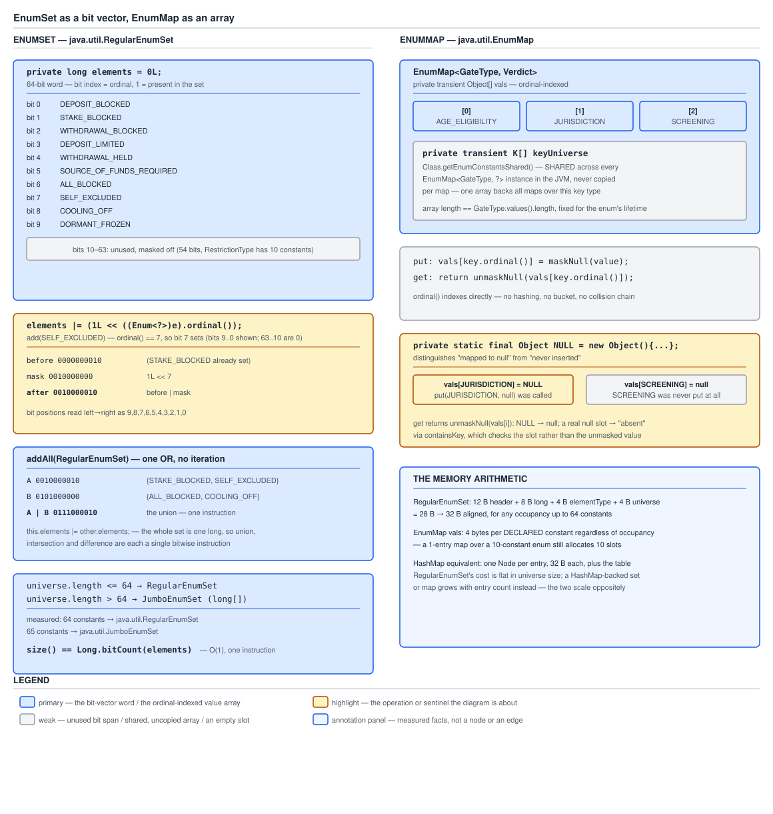

# 03 Java Core — `EnumSet` and `EnumMap` internals — INTERNALS (§3.10, 3.10.10–3.10.12)

**Target version: Java 21 LTS.** | **Part 3 of 5** | [Index](../00-index.md)
Previous: [Enum guarantees and the switch map](03b-internals-guarantees-and-switch.md) · Next: [Enum evolution — adding constants, wires and databases](03d-internals-enum-evolution.md)

Two collections. `EnumSet` and `EnumMap` are the reason `ordinal()` is public — they are its only sanctioned consumers — and they are worth reading at this level because their implementations are the shortest complete demonstration in the JDK of what a closed, densely-numbered key space buys you: bit arithmetic instead of hashing, and array indexing instead of bucket walks. Plus the byte arithmetic, which is the one place both classes behave the opposite way round from every hash collection you have internalised. The two rules for changing an enum after it has shipped are in [`03d-internals-enum-evolution.md`](03d-internals-enum-evolution.md).

[`01b-collections-patterns-and-guarantees.md`](01b-collections-patterns-and-guarantees.md) concept 1 owns the language-level operation table and the choose-between-them comparison. This file owns the layout, the shift arithmetic, the `JumboEnumSet` word indexing and the byte totals. [`03b-internals-guarantees-and-switch.md`](03b-internals-guarantees-and-switch.md) owns the `$SwitchMap` bytecode.

Everything below is measured on **Oracle JDK 21.0.7 (21.0.7+8-LTS-245, macOS aarch64)**, with **Oracle JDK 17.0.15** for version comparisons; library source is quoted from JDK 21.0.7's `lib/src.zip`. The enum under test is the ten-constant `RestrictionType` from [`01-basics.md`](01-basics.md), with `SELF_EXCLUDED` at ordinal 7.

---

## 1. `EnumSet` is a bit vector, in one word or several (3.10.10)

`[NUM]` The model: a set over a closed key space of *n* constants is *n* bits. If *n* is at most 64 those bits fit in one `long` and every set operation is a single machine instruction. Above 64 they spill into a `long[]` and every operation becomes a loop over words — still no hashing, still no allocation per element, but no longer one instruction.

### Why it exists

`ordinal()` gives every constant a dense integer in `[0, n)` at compile time. That is exactly the input a bit vector needs, and a bit vector is the theoretically optimal representation for a subset of a known finite universe: one bit per candidate, so *n* bits total regardless of occupancy, with membership as a test and set algebra as bitwise operations. `HashSet` cannot use it because its key space is unbounded and unnumbered. The split at 64 exists because a `long` is the widest primitive, and one-word arithmetic is qualitatively cheaper than array arithmetic — no bounds check, no indirection, no loop.

### The mechanism

`[SOURCE]` The dispatch, from `EnumSet.noneOf` — every factory routes through it:

```java
public static <E extends Enum<E>> EnumSet<E> noneOf(Class<E> elementType) {
    Enum<?>[] universe = getUniverse(elementType);
    if (universe == null)
        throw new ClassCastException(elementType + " not an enum");

    if (universe.length <= 64)
        return new RegularEnumSet<>(elementType, universe);
    else
        return new JumboEnumSet<>(elementType, universe);
}
```

`[PROVE]` Measured with purpose-built enums of exactly 64 and exactly 65 constants:

```
EnumSet.allOf(Exactly64.class).getClass()  ->  java.util.RegularEnumSet   size=64
EnumSet.allOf(Jumbo.class).getClass()      ->  java.util.JumboEnumSet     size=65
```

The boundary is `<= 64`, inclusive, exactly as the source reads. Both implementation classes are package-private, so you can only observe them through `getClass()`.

The shared base holds the two fields that make the type check possible:

```java
final transient Class<E> elementType;
final transient Enum<?>[] universe;

EnumSet(Class<E>elementType, Enum<?>[] universe) {
    this.elementType = elementType;
    this.universe    = universe;
}
```

Both `transient`, because `EnumSet` serialises through a `SerializationProxy` that captures the logical contents rather than the implementation — the source comment says so: *"This class is used to serialize all EnumSet instances, regardless of implementation type. It captures their 'logical contents' and they are reconstructed using public static factories. This is necessary to ensure that the existence of a particular implementation type is an implementation detail."* Which is why crossing the 64-constant boundary is not a wire-format change.

Crucially, `universe` is **not** a per-set copy:

```java
private static <E extends Enum<E>> E[] getUniverse(Class<E> elementType) {
    return SharedSecrets.getJavaLangAccess()
                                    .getEnumConstantsShared(elementType);
}
```

`getEnumConstantsShared` returns `Class`'s own cached array — the shared one, no clone. So a million `EnumSet`s over `RestrictionType` hold a million references to one array, not a million arrays. That is why the byte arithmetic in concept 3 counts a reference and not an array.

**`RegularEnumSet` — one word.** The whole state and the three core operations:

```java
private long elements = 0L;

public boolean add(E e) {
    typeCheck(e);
    long oldElements = elements;
    elements |= (1L << ((Enum<?>)e).ordinal());
    return elements != oldElements;
}

public boolean contains(Object e) {
    if (e == null)
        return false;
    Class<?> eClass = e.getClass();
    if (eClass != elementType && eClass.getSuperclass() != elementType)
        return false;

    return (elements & (1L << ((Enum<?>)e).ordinal())) != 0;
}

public int size() {
    return Long.bitCount(elements);
}
```

`add(SELF_EXCLUDED)` with `ordinal() == 7` is `elements |= (1L << 7)` — one shift, one OR, one comparison for the return value. `contains` is one shift, one AND, one comparison. `size()` is `Long.bitCount`, a HotSpot intrinsic rather than a loop. Note there is **no `size` field**: `RegularEnumSet` recomputes it, because `bitCount` is cheaper than maintaining a counter across every mutation.

Note also the class check in `contains`: `eClass != elementType && eClass.getSuperclass() != elementType`. The second test is for constants with bodies, whose `getClass()` is `E$N` — the same accommodation `Enum.compareTo` makes, described in [`03a-internals-enum-members.md`](03a-internals-enum-members.md) concept 3.

**The shift-masking tricks.** Three of `RegularEnumSet`'s methods depend on the JVM masking shift distances, and they read as errors until you see it:

```java
void addRange(E from, E to) {
    elements = (-1L >>>  (from.ordinal() - to.ordinal() - 1)) << from.ordinal();
}

void addAll() {
    if (universe.length != 0)
        elements = -1L >>> -universe.length;
}

void complement() {
    if (universe.length != 0) {
        elements = ~elements;
        elements &= -1L >>> -universe.length;  // Mask unused bits
    }
}
```

`-1L >>> -universe.length` looks like a shift by a negative distance. It is not: for a `long`, the JVM masks the shift distance to its low **6 bits** (`distance & 0x3f`), so for `universe.length == 10`, `-10` is `0xFFFFFFF6`, whose low six bits are `0b110110` = 54. So `-1L >>> 54` leaves the low ten bits set — exactly one bit per constant, with the unused 54 masked off. `addRange`'s expression is the same trick applied to a range: `from.ordinal() - to.ordinal() - 1` is negative for a valid range, and masking turns it into the right positive distance. Shift masking is the subject of [`../primitives-and-conversions/01b-shifts-and-unsigned.md`](../primitives-and-conversions/01b-shifts-and-unsigned.md); this is the JDK's own most compact use of it.

Measured, confirming the range semantics are *ordinal* semantics:

```
EnumSet.range(DEPOSIT_BLOCKED, DEPOSIT_LIMITED)
  ->  [DEPOSIT_BLOCKED, STAKE_BLOCKED, WITHDRAWAL_BLOCKED, DEPOSIT_LIMITED]
```

Ordinals 0 through 3, both bounds inclusive — so `range` is the one `EnumSet` factory that makes the declaration order load-bearing in *your* source, and reordering the enum changes what it returns.

Bulk operations are one instruction each, and `containsAll` is the clearest:

```java
public boolean containsAll(Collection<?> c) {
    if (!(c instanceof RegularEnumSet<?> es))
        return super.containsAll(c);

    if (es.elementType != elementType)
        return es.isEmpty();

    return (es.elements & ~elements) == 0;
}
```

`(other & ~this) == 0` — a NOT, an AND, a compare, independent of either set's size. The `instanceof` guard is the fast-path gate: a non-`EnumSet` argument falls back to `AbstractCollection`'s element-by-element loop, so `mySet.containsAll(anArrayList)` gets none of this. Worth knowing, because it means the cheap path depends on the *argument's* runtime type, not just the receiver's.

**`JumboEnumSet` — a word array.** Above 64 constants:

```java
private long elements[];

// Redundant - maintained for performance
private int size = 0;

JumboEnumSet(Class<E>elementType, Enum<?>[] universe) {
    super(elementType, universe);
    elements = new long[(universe.length + 63) >>> 6];
}
```

`(n + 63) >>> 6` is ceiling division by 64 — the standard idiom, and `>>> 6` rather than `/ 64` because the compiler would emit the shift anyway for a power-of-two divisor and the shift states the intent. For 65 constants that is `(65 + 63) >>> 6 = 128 >>> 6 = 2` words.

Every operation gains a word index, computed the same way:

```java
public boolean add(E e) {
    typeCheck(e);

    int eOrdinal = e.ordinal();
    int eWordNum = eOrdinal >>> 6;

    long oldElements = elements[eWordNum];
    elements[eWordNum] |= (1L << eOrdinal);
    boolean result = (elements[eWordNum] != oldElements);

public boolean contains(Object e) {
    if (e == null)
        return false;
    Class<?> eClass = e.getClass();
    if (eClass != elementType && eClass.getSuperclass() != elementType)
        return false;

    int eOrdinal = ((Enum<?>)e).ordinal();
    return (elements[eOrdinal >>> 6] & (1L << eOrdinal)) != 0;
}
```

Two details. `eOrdinal >>> 6` selects the word — integer division by 64. And `1L << eOrdinal` uses the *unmasked* ordinal, which works because the shift distance is masked to 6 bits anyway: ordinal 70 shifts by `70 & 0x3f == 6`, which is bit 6 of word 1, which is exactly right. The masking that looks like a hazard elsewhere is load-bearing here.

`JumboEnumSet` **does** maintain a `size` field — the comment says *"Redundant - maintained for performance"* — because `size()` would otherwise be a `bitCount` loop over every word. So the two implementations differ on that trade: one word makes recomputation cheaper than bookkeeping, many words makes bookkeeping cheaper than recomputation.

And the mask trick reappears, now applied only to the last word:

```java
void addAll() {
    for (int i = 0; i < elements.length; i++)
        elements[i] = -1;
    elements[elements.length - 1] >>>= -universe.length;
    size = universe.length;
}
```

Set every word to all-ones, then shave the high bits off the *last* word with the same `>>> -universe.length`. For 65 constants, `-65` masked to 6 bits is `63`, so `>>>= 63` leaves exactly one bit in the last word — the single bit for the 65th constant. The arithmetic is correct precisely because masking makes `-n` and `64 - (n mod 64)` agree.

### Diagram



**D-119** — Two lanes. On the left, `RegularEnumSet`'s single 64-bit word with the low ten bit positions labelled by `RestrictionType` ordinal and name and the upper 54 marked as masked off; `add(SELF_EXCLUDED)` shown as `elements |= (1L << 7)` with the before word, the mask and the after word aligned in binary; a union drawn as one `|` with both operands and the result; and the `<= 64` / `> 64` split with the measured class names. On the right, `EnumMap`'s ordinal-indexed `vals` array with the shared `keyUniverse` beside it and the `NULL` sentinel occupying one slot next to a genuinely unmapped `null`. The annotation panel carries the byte arithmetic that concept 3 derives.

### A concrete example

The restriction model exercises exactly the operations the representation is good at — union across sources, complement for "everything not blocked", and a subset test for a permission check:

```java
public final class RestrictionAlgebra {

    /** One OR per source. No allocation beyond the result. */
    public static EnumSet<RestrictionType> union(
            Collection<EnumSet<RestrictionType>> perSource) {
        EnumSet<RestrictionType> all = EnumSet.noneOf(RestrictionType.class);
        for (EnumSet<RestrictionType> fromOneSource : perSource) {
            all.addAll(fromOneSource);          // one long |= long
        }
        return all;
    }

    /** One NOT plus one mask. */
    public static EnumSet<RestrictionType> permitted(
            EnumSet<RestrictionType> active) {
        return EnumSet.complementOf(active);
    }

    /**
     * One NOT, one AND, one compare — regardless of how many restrictions
     * either side holds. Note both arguments must be EnumSets for the fast
     * path: a List<RestrictionType> falls back to an element-by-element loop.
     */
    public static boolean allLiftedBy(EnumSet<RestrictionType> active,
                                      EnumSet<RestrictionType> lifting) {
        return lifting.containsAll(active);
    }

    /**
     * Removing every SYSTEM_ONBOARDING restriction at AA-801 ACTIVATED is
     * one AND-NOT, not a filtered rebuild.
     */
    public static void onActivation(EnumSet<RestrictionType> active,
                                    EnumSet<RestrictionType> onboardingSet) {
        active.removeAll(onboardingSet);        // one long &= ~long
    }
}
```

Measured behaviour of the algebra on `RestrictionType`:

```
EnumSet.of(SELF_EXCLUDED, COOLING_OFF) ∪ EnumSet.of(ALL_BLOCKED, SOURCE_OF_FUNDS_REQUIRED)
  ->  [SOURCE_OF_FUNDS_REQUIRED, ALL_BLOCKED, SELF_EXCLUDED, COOLING_OFF]

complementOf(EnumSet.of(SELF_EXCLUDED, COOLING_OFF))
  ->  [DEPOSIT_BLOCKED, STAKE_BLOCKED, WITHDRAWAL_BLOCKED, DEPOSIT_LIMITED,
       WITHDRAWAL_HELD, SOURCE_OF_FUNDS_REQUIRED, ALL_BLOCKED, DORMANT_FROZEN]
```

Both results are in ordinal order — 5, 6, 7, 8 for the union — because iteration walks the bits from the low end. That ordering is *not* insertion order, and it is worth noticing: the union was built from a set containing ordinals 7 and 8 first, and the result lists 5 and 6 first.

At QuizStakes volumes the choice matters. Stake reservations run at **1,200/sec peak**, each needing "does any active restriction block a stake". With `EnumSet` that is one iteration over the set bits of one `long`. With `HashSet<RestrictionType>` it is a hash and an `equals` per element, plus the `Node` chain walk, plus — because [`01a-implicit-members-and-identity.md`](01a-implicit-members-and-identity.md) concept 5 shows enum hashes are identity-derived — no reproducible iteration order for any log line built from it.

### The gotcha

**Pitfall:** assuming the fast paths apply whenever the *receiver* is an `EnumSet`. They do not — every bulk operation guards on the *argument*:

```java
public boolean containsAll(Collection<?> c) {
    if (!(c instanceof RegularEnumSet<?> es))
        return super.containsAll(c);
```

and, one level further, `if (es.elementType != elementType) return es.isEmpty();` — so an `EnumSet` of a *different* enum type also misses the fast path (correctly: it can only be contained if it is empty). Symptom: a method whose signature takes `Collection<RestrictionType>` or `Set<RestrictionType>` gets the element-by-element fallback for every caller that passes a `List` or a `Set.of` literal, so the "one bitwise instruction" reasoning silently does not apply — and it is invisible at the call site because the code is identical. Fix: type the parameters as `EnumSet<RestrictionType>` where the bit arithmetic is the point, which documents the requirement in the signature, and convert at the boundary with `EnumSet.copyOf` (guarding the empty-`Collection` case, which throws `IllegalArgumentException: Collection is empty` — see [`01b`](01b-collections-patterns-and-guarantees.md)).

> **Definition.** `EnumSet` is abstract with two package-private implementations chosen by `universe.length <= 64`: `RegularEnumSet`, whose entire state is one `long` with bit *i* meaning "ordinal *i* present" and whose `size()` is `Long.bitCount`; and `JumboEnumSet`, a `long[(n + 63) >>> 6]` with a maintained `size` field, indexing word `ordinal >>> 6` and relying on 6-bit shift masking for the bit within it.

---

## 2. `EnumMap` is an ordinal-indexed array with a sentinel (3.10.11)

`[NUM]` The model: a map over a closed key space is an array with one slot per candidate key. Lookup is an array load. There is no hashing, no bucket, no `Node`, no load factor and no resize — ever.

### Why it exists

Same argument as `EnumSet`, one level up: the key already carries a dense index, so the map can be an array. The one thing an array cannot express is the difference between "this key is not in the map" and "this key maps to null", because both would be a `null` slot — and a `Map` is contractually required to distinguish them (`containsKey` must differ from `get() == null`). So the implementation needs a sentinel, and that sentinel is the only piece of cleverness in the class.

### The mechanism

`[SOURCE]` The state, with the JDK's own comment on the array:

```java
private transient K[] keyUniverse;

/**
 * Array representation of this map.  The ith element is the value
 * to which universe[i] is currently mapped, or null if it isn't
 * mapped to anything, or NULL if it's mapped to null.
 */
private transient Object[] vals;

/**
 * The number of mappings in this map.
 */
private transient int size = 0;
```

Three fields, all `transient` — `EnumMap` also serialises a logical form rather than its layout. `keyUniverse` is shared, not copied:

```java
private static <K extends Enum<K>> K[] getKeyUniverse(Class<K> keyType) {
    return SharedSecrets.getJavaLangAccess()
                                    .getEnumConstantsShared(keyType);
}
```

and the constructor is two lines:

```java
public EnumMap(Class<K> keyType) {
    this.keyType = keyType;
    keyUniverse = getKeyUniverse(keyType);
    vals = new Object[keyUniverse.length];
}
```

So constructing an `EnumMap` allocates exactly one array, sized to the enum's *declared* constant count, and takes one reference to the shared universe. No `values()` clone.

The sentinel:

```java
/**
 * Distinguished non-null value for representing null values.
 */
private static final Object NULL = new Object() {
    public int hashCode() {
        return 0;
    }

    public String toString() {
        return "java.util.EnumMap.NULL";
    }
};

private Object maskNull(Object value) {
    return (value == null ? NULL : value);
}

@SuppressWarnings("unchecked")
private V unmaskNull(Object value) {
    return (V)(value == NULL ? null : value);
}
```

An anonymous `Object` subclass with `hashCode()` pinned to 0 and a self-describing `toString()`. **Insight:** both overrides exist for the same reason — the sentinel occasionally leaks into a computation that was written for real values. `hashCode() == 0` makes it contribute nothing to an entry-set hash, which is what keeps `EnumMap.hashCode()` consistent with a `HashMap` holding the same null-valued mapping. And `toString()` returning `"java.util.EnumMap.NULL"` means that if it ever *does* escape into a log line, the message names the mechanism instead of printing `java.lang.Object@1b6d3586`. That is a deliberate diagnosability choice in three lines of code, and it is worth copying whenever you introduce a sentinel of your own.

The two operations:

```java
public V get(Object key) {
    return (isValidKey(key) ?
            unmaskNull(vals[((Enum<?>)key).ordinal()]) : null);
}

public V put(K key, V value) {
    typeCheck(key);

    int index = key.ordinal();
    Object oldValue = vals[index];
    vals[index] = maskNull(value);
    if (oldValue == null)
        size++;
    return unmaskNull(oldValue);
}
```

`get` is a validity check and one array load. `put` is a type check, one array store, and a conditional increment — and note the increment condition is `oldValue == null`, testing the *raw* slot rather than the unmasked value, which is exactly what makes overwriting a null-valued mapping not double-count.

`[PROVE]` The sentinel working, measured on JDK 21.0.7 with `SELF_EXCLUDED -> "self"` and `DEPOSIT_BLOCKED -> null`:

```
EnumMap = {DEPOSIT_BLOCKED=null, SELF_EXCLUDED=self}
size = 2
containsKey(DEPOSIT_BLOCKED) = true
get(DEPOSIT_BLOCKED) = null
```

`size` is 2 and `containsKey` is `true` for the null-valued key, so the map distinguishes the two cases correctly. Null *keys* are refused — measured `NullPointerException` from `put(null, "x")`, and likewise from `EnumSet.add(null)` — because both need `key.ordinal()` and there is no slot for "no key". This is a real difference from `HashMap`, which permits one null key.

Iteration order is ordinal order, unconditionally, because iterating means walking `vals` from index 0. Measured against a `HashMap` over the same ten keys inserted in the same order:

```
EnumMap: [DEPOSIT_BLOCKED, STAKE_BLOCKED, WITHDRAWAL_BLOCKED, DEPOSIT_LIMITED,
          WITHDRAWAL_HELD, SOURCE_OF_FUNDS_REQUIRED, ALL_BLOCKED, SELF_EXCLUDED,
          COOLING_OFF, DORMANT_FROZEN]
HashMap: [DEPOSIT_BLOCKED, STAKE_BLOCKED, ALL_BLOCKED, SELF_EXCLUDED,
          DORMANT_FROZEN, COOLING_OFF, WITHDRAWAL_BLOCKED,
          SOURCE_OF_FUNDS_REQUIRED, DEPOSIT_LIMITED, WITHDRAWAL_HELD]
```

Exact declaration order versus an order that is neither declaration, alphabetical nor insertion — and that will differ on the next JVM run, because enum hashes are identity-derived.

### Diagram

The `vals` array, the shared `keyUniverse` and the `NULL` sentinel in a slot beside a genuinely unmapped `null` are the right-hand lane of D-119, embedded in concept 1.

### A concrete example

The gate set, where ordinal iteration order is not a convenience but the specification — the onboarding journey's order *is* the declaration order:

```java
public final class GateSet {

    private final EnumMap<GateType, GateCheck> checks;

    public GateSet(Map<GateType, GateCheck> configured) {
        EnumMap<GateType, GateCheck> ordered = new EnumMap<>(GateType.class);
        ordered.putAll(configured);
        for (GateType gate : GateType.values()) {
            if (!ordered.containsKey(gate)) {
                throw new IllegalStateException("no check registered for gate " + gate);
            }
        }
        this.checks = ordered;
    }

    /**
     * Evaluates in declaration order — age, then jurisdiction, then screening —
     * because EnumMap iterates its ordinal-indexed array from index 0. Reordering
     * the enum reorders the journey, deliberately and in one visible place.
     */
    public Optional<GateType> firstFailing(Application application) {
        for (Map.Entry<GateType, GateCheck> entry : checks.entrySet()) {
            if (!entry.getValue().evaluate(application).passed()) {
                return Optional.of(entry.getKey());
            }
        }
        return Optional.empty();
    }

    public interface GateCheck {
        Verdict evaluate(Application application);
    }
}
```

`ordered.putAll(configured)` is doing real work: whatever the caller passed — a `HashMap` from a configuration binder, a `Map.of` literal — the copy into an `EnumMap` imposes the order. And `containsKey` in the completeness loop is correct even for a gate deliberately configured with a null check, because of the sentinel: `containsKey` reads the raw slot rather than the unmasked value.

### The gotcha

**Pitfall:** `EnumMap.equals` against a `HashMap` and expecting the ordering difference to matter. It does not, and the reason is worth knowing: `AbstractMap.equals` compares entry sets, which is order-independent, so an `EnumMap` and a `HashMap` with the same mappings *are* equal in both directions. What does bite is `toString()` and any serialised form built by iterating — those differ, and the `EnumMap` version is the reproducible one. Symptom: a test that asserts on `map.toString()` or on a joined string passes with `EnumMap` and is flaky with `HashMap`, which leads people to conclude the two maps are "not really equal". They are; only their iteration is different. Fix: assert on equality when you mean equality, and copy into an `EnumMap` when you mean order.

> **Definition.** `EnumMap` holds an `Object[] vals` indexed by `ordinal()`, a shared `keyUniverse` from `getEnumConstantsShared()`, and an `int size`; `get` is one array load and `put` one array store, null values are stored as a `NULL` sentinel whose `hashCode()` is 0 and whose `toString()` names itself, null keys are refused, and iteration is unconditionally in declaration order.

---

## 3. The memory arithmetic, derived (3.10.12)

`[NUM]` `[PROVE]` Three numbers to be able to derive on a whiteboard: what one enum constant costs, what an `EnumSet` costs, and what an `EnumMap` costs — and the one case where `EnumMap` is the wrong choice.

### Why it exists

The reason to know these is that both collections have a cost profile the opposite way round from every hash collection you have internalised. A `HashMap`'s footprint scales with *occupancy*; an `EnumMap`'s scales with *declared constants* and is flat in occupancy. So the intuition "a one-entry map is cheap" is wrong for `EnumMap`, and the intuition "a full map is expensive" is wrong too. There is exactly one enum shape where that matters, and it is worth being able to spot it.

### The mechanism

All arithmetic below uses the settings confirmed on this build: `UseCompressedOops = true`, `ObjectAlignmentInBytes = 8`. So an object header is 12 bytes, a reference is 4 bytes, an array adds a 4-byte `length` field, and every object rounds up to a multiple of 8. Object layout in general is [`../objects-equality-and-lifecycle/05-internals-object-layout.md`](../objects-equality-and-lifecycle/05-internals-object-layout.md).

**One enum constant.** Fields, read from `Enum.java` on JDK 21: `String name` (4 B reference), `int ordinal` (4 B), `int hash` (4 B).

```
12 B header + 4 B name + 4 B ordinal + 4 B hash = 24 B, already 8-aligned.
```

Plus your own per-constant fields. On JDK 17 and earlier there is no `hash` field, so it is 12 + 4 + 4 = 20 B, which pads to 24 — the field landed in padding that already existed and is free in practice. The `String` objects for the names are interned literals shared with the class's constant pool, so they are not fairly attributable per constant.

Ten `RestrictionType` constants: **240 bytes**, once, for the life of the class.

**The `$VALUES` array**, allocated once in `<clinit>`:

```
16 B (12 B header + 4 B length) + 10 × 4 B = 56 B.
```

And **56 bytes per `values()` call**, since the method is `$VALUES.clone()` — see [`03-internals-enums.md`](03-internals-enums.md) concept 2.

**One `RegularEnumSet`.** Fields: `long elements` (8 B), plus inherited `Class<E> elementType` (4 B reference) and `Enum<?>[] universe` (4 B reference).

```
12 B header + 8 B elements + 4 B elementType + 4 B universe = 28 B → 32 B aligned.
```

**32 bytes for any occupancy from zero to 64 constants.** That is the headline: an empty `EnumSet` and a full one over a 64-constant enum cost the same. The `universe` reference points at the array `Class` already holds, so it is not counted again.

Compare a `HashSet<RestrictionType>` holding the same members. A `HashSet` is a `HashMap` wrapper: the `HashMap` object, a `Node[]` table (16 slots by default = 16 B header + 64 B = 80 B), and one `Node` per element at 12 B header + 4 B hash + 4 B key + 4 B value + 4 B next = 28 B → 32 B. For three active restrictions that is roughly 48 + 80 + 3 × 32 = **224 bytes** against the `EnumSet`'s 32 — a factor of seven, and the gap widens with occupancy rather than closing.

**One `JumboEnumSet`** over *n* > 64 constants. Fields: `long[] elements` (4 B reference), `int size` (4 B), plus the two inherited references.

```
12 B header + 4 B elements + 4 B size + 4 B elementType + 4 B universe = 28 B → 32 B
plus the long[]:  16 B + 8 B × ((n + 63) >>> 6)
```

For 65 constants: 32 + 16 + 16 = **64 bytes**. For 200 constants: `(200 + 63) >>> 6 = 4` words, so 32 + 16 + 32 = **80 bytes**. Still flat in occupancy.

**One `EnumMap`.** Fields: `Class<K> keyType` (4 B), `K[] keyUniverse` (4 B reference to the shared array), `Object[] vals` (4 B reference), `int size` (4 B).

```
12 B header + 4 + 4 + 4 + 4 = 28 B → 32 B aligned
plus the vals array:  16 B + 4 B × (declared constant count)
```

For a ten-constant enum: 32 + 16 + 40 = **88 bytes**, whether it holds one mapping or ten. Which gives the syllabus's headline figure directly: **4 bytes per declared constant, regardless of occupancy.**

`[PROVE]` And the one case where that is the wrong trade. Take an enum of **200** constants and a map holding **one** entry:

```
EnumMap:  32 B + 16 B + 4 B × 200 = 848 B for one mapping.
HashMap:  48 B (map) + 80 B (16-slot table) + 32 B (one Node) = 160 B.
```

`EnumMap` loses by a factor of five. Now the same 200-constant enum with **150** entries:

```
EnumMap:  848 B, unchanged.
HashMap:  48 B + (256-slot table: 16 + 1024 = 1040 B) + 150 × 32 B = 5,888 B.
```

`EnumMap` wins by a factor of seven. The break-even is where `HashMap`'s per-entry cost overtakes `EnumMap`'s per-declared-constant cost — roughly when occupancy exceeds about a tenth of the declared constants, since a `Node` plus its table slot is around 36 B against `EnumMap`'s 4 B per slot. **So the rule is: `EnumMap` unless the enum is large and the map is sparse**, which in practice means unless you are holding a handful of entries keyed by a status-code enum with a hundred-plus constants. For every enum in the QuizStakes model — `RestrictionType` at 10, `RestrictionSource` at 5, `GateType` at 3, `BonusState` at 5 — `EnumMap` wins unconditionally, and by a wide margin.

There is a second reason to prefer it even in the sparse case, which the byte counts do not show: iteration order. An `EnumMap` gives declaration order on every run; a `HashMap` over enum keys gives an order derived from that run's identity hashes.

### Diagram

The annotation panel of D-119, embedded in concept 1, carries these three derivations alongside the layouts they describe.

### A concrete example

The arithmetic applied to the restriction model at scale:

```java
public final class RestrictionFootprint {

    /**
     * Per-client restriction state, as held in a session cache.
     *
     * EnumMap<RestrictionSource, EnumSet<RestrictionType>>:
     *   32 B  EnumMap object
     * + 16 B  vals array header
     * +  4 B × 5 declared RestrictionSource constants = 20 B
     * + 32 B  per populated RegularEnumSet
     * ---------------------------------------------------------------
     *   68 B + 32 B × populated sources
     *
     * A client with restrictions from two sources: 68 + 64 = 132 B.
     * A client with no restrictions at all:        68 B (the empty map).
     */
    private final EnumMap<RestrictionSource, EnumSet<RestrictionType>> bySource;

    public RestrictionFootprint() {
        this.bySource = new EnumMap<>(RestrictionSource.class);
    }

    public void apply(RestrictionType type, RestrictionSource source) {
        bySource.computeIfAbsent(source, key -> EnumSet.noneOf(RestrictionType.class))
                .add(type);
    }

    public boolean blocks(RestrictionType.MoneyAction action) {
        for (EnumSet<RestrictionType> fromOneSource : bySource.values()) {
            for (RestrictionType type : fromOneSource) {
                if (type.blocks(action)) {
                    return true;
                }
            }
        }
        return false;
    }
}
```

At **14,000 steady concurrent sessions** and an average of two restriction sources per restricted client, holding this per session costs `14,000 × 132 B = 1,848,000 B ≈ 1.76 MiB`. At the **55,000 peak**: `55,000 × 132 = 7,260,000 B ≈ 6.92 MiB`. The `HashMap`/`HashSet` equivalent — a `HashMap<RestrictionSource, HashSet<RestrictionType>>` with two entries and three elements — is roughly `48 + 80 + 2 × 32` for the outer map plus `2 × 224` for the inner sets, about 640 B, so `55,000 × 640 = 35,200,000 B ≈ 33.6 MiB`. A 27 MiB difference at peak, for a data structure nobody would think of as a memory decision.

State the assumptions honestly: the 132 B and 640 B figures are derived from the header and reference sizes above, not measured with a heap profiler, and they ignore the cache's own per-entry overhead, which is identical for both and therefore cancels in the comparison.

### The gotcha

**Pitfall:** creating an `EnumMap` per item in a large collection over a large enum. The per-instance cost is `32 + 16 + 4 × declaredConstants`, and the `declaredConstants` term does not care that you are storing one value. A `List<Record>` of 100,000 rows, each holding an `EnumMap` over a 60-constant status enum with a single entry, is `100,000 × (32 + 16 + 240) = 28,800,000 B ≈ 27.5 MiB` of mostly-empty arrays. Symptom: a heap dump whose largest retained set is `java.lang.Object[]` with a shallow-to-retained ratio near 1 and almost every slot null — the tell is thousands of small `Object[]` instances of identical length. Fix: for one value, hold the value; for a few, a `Map.of` or a two-field record; for a per-row map over a large enum, reconsider whether the map belongs on the row at all rather than in one place keyed by the row.

> **Definition.** With compressed oops and 8-byte alignment: an enum constant is 24 bytes on JDK 21 (20 padded to 24 before it), `$VALUES` and each `values()` call are `16 + 4n` bytes, a `RegularEnumSet` is 32 bytes for any occupancy up to 64 constants, a `JumboEnumSet` adds `16 + 8 × ceil(n/64)`, and an `EnumMap` is `32 + 16 + 4n` bytes where *n* is the **declared** constant count — flat in occupancy, which is why it loses to `HashMap` only for a large enum held sparsely.

---

## Pitfalls

### Typing a parameter as `Collection` and expecting `EnumSet`'s fast path

**Wrong**

```java
/** "One bitwise instruction", according to the comment. */
public static boolean allLifted(EnumSet<RestrictionType> active,
                                Collection<RestrictionType> lifting) {
    return lifting.containsAll(active);
}
```

Every `EnumSet` bulk operation guards on the *argument's* runtime type. `RegularEnumSet.containsAll` opens with `if (!(c instanceof RegularEnumSet<?> es)) return super.containsAll(c);`, and here the *receiver* is the `Collection` — so unless the caller happens to pass an `EnumSet`, this is `AbstractCollection.containsAll`, an element-by-element loop with a `contains` call per element. The signature invites `List.of`, and the fast path silently never applies.

**Right**

```java
public static boolean allLifted(EnumSet<RestrictionType> active,
                                EnumSet<RestrictionType> lifting) {
    return lifting.containsAll(active);        // (active & ~lifting) == 0
}
```

The requirement is now in the signature, so the compiler enforces it and the caller converts at its own boundary — with `EnumSet.copyOf` guarded for the empty case, or `EnumSet.noneOf(RestrictionType.class)` plus `addAll`.

**Why people believe it:** the reasoning "an `EnumSet` is a bit vector, so its operations are bitwise" is correct about the *receiver* and says nothing about the argument. The fallback is invisible: identical source, identical results, different complexity class.

### One `EnumMap` per row over a large enum

**Wrong**

```java
public record LedgerRow(UUID id, Money amount, EnumMap<StatusCode, Instant> transitions) { }
```

with `StatusCode` carrying the domain's full code set — the `AO-`, `AA-`, `DEP-` and `BDP-` families together are well over sixty constants. Each `EnumMap` is `32 B + 16 B + 4 B × declaredConstants`; at 60 constants that is 288 B per row, whether the row has one transition or sixty. For 100,000 rows in memory: `100,000 × 288 = 28,800,000 B ≈ 27.5 MiB`, almost all of it null slots.

**Right**

```java
public record StatusTransition(StatusCode code, Instant at) { }

public record LedgerRow(UUID id, Money amount, List<StatusTransition> transitions) { }
```

A row with three transitions now costs three small records plus a list, on the order of 150 B, and the cost scales with what actually happened. Where a keyed lookup genuinely is needed, hold **one** `EnumMap` in the aggregate that owns the rows, keyed by status code and valued by whatever the rows contribute — one 288-byte array instead of a hundred thousand.

**Why people believe it:** `EnumMap` is the right answer so consistently — flat cost, declaration order, no hashing — that "use `EnumMap` for enum keys" becomes unconditional. The condition it hides is that the cost is per *declared constant*, so the advice inverts for a large enum held sparsely.

---

## Cheat sheet

| Thing | Fact (Java 21 LTS) |
|---|---|
| `EnumSet` split | `universe.length <= 64` → `RegularEnumSet`; `> 64` → `JumboEnumSet`. Measured at exactly 64 and 65 |
| `RegularEnumSet` state | `private long elements = 0L;` plus inherited `elementType` and shared `universe`. **No `size` field** |
| `RegularEnumSet.add` | `elements \|= (1L << ordinal)` |
| `RegularEnumSet.contains` | `(elements & (1L << ordinal)) != 0`, after `eClass != elementType && eClass.getSuperclass() != elementType` |
| `RegularEnumSet.size()` | `Long.bitCount(elements)` — recomputed, because it is cheaper than bookkeeping for one word |
| `containsAll` fast path | `(other & ~this) == 0` — NOT, AND, compare, size-independent |
| Fast paths guard on the **argument** | `if (!(c instanceof RegularEnumSet<?> es)) return super.containsAll(c);`. A `List` argument gets the slow loop |
| Different enum type as argument | `if (es.elementType != elementType) return es.isEmpty();` — also skips the fast path, correctly |
| The mask idiom | `-1L >>> -universe.length`. Shift distance is masked to 6 bits, so `-10` becomes 54 and ten low bits survive |
| `addRange` | `(-1L >>> (from.ordinal() - to.ordinal() - 1)) << from.ordinal()` — the same trick on a range |
| `EnumSet.range` | inclusive **ordinal** bounds. Measured: `range(DEPOSIT_BLOCKED, DEPOSIT_LIMITED)` gives ordinals 0–3 |
| `JumboEnumSet` state | `long[] elements` sized `(n + 63) >>> 6`, plus a **maintained** `int size` ("Redundant - maintained for performance") |
| `JumboEnumSet` indexing | word `ordinal >>> 6`; bit `1L << ordinal`, correct because the shift is masked to 6 bits |
| `EnumSet` serialization | a `SerializationProxy` capturing logical contents — so crossing 64 constants is **not** a wire change |
| Shared universe | `SharedSecrets…getEnumConstantsShared()`. A million sets hold one array, not a million |
| `EnumMap` state | `Object[] vals` indexed by ordinal, shared `keyUniverse`, `Class keyType`, `int size`. All `transient` |
| `EnumMap.get` / `put` | one array load / one array store plus a conditional `size++` on the **raw** old slot |
| `EnumMap` constructor | `vals = new Object[keyUniverse.length]` — one array, sized to declared constants, no `values()` clone |
| `NULL` sentinel | anonymous `Object` with `hashCode() == 0` and `toString() == "java.util.EnumMap.NULL"` |
| Why `hashCode() == 0` | keeps `EnumMap.hashCode()` consistent with a `HashMap` holding the same null-valued mapping |
| Why the named `toString()` | if the sentinel ever leaks into a log, the message names the mechanism. Copy this idea |
| Null key | `NullPointerException` from `EnumMap.put` and `EnumSet.add`. `HashMap` permits one null key; these do not |
| Null value | permitted in `EnumMap`, via the sentinel. `size` and `containsKey` are correct — measured |
| Iteration order | declaration order, unconditionally, both classes. `HashMap` over enum keys is unreproducible across runs |
| `EnumMap.equals` vs `HashMap` | **equal** — `AbstractMap.equals` compares entry sets and is order-independent. Only `toString` differs |
| Enum constant size | 12 + 4 (`name`) + 4 (`ordinal`) + 4 (`hash`) = **24 B** on 21; 20 → 24 padded on 17. Derived |
| `$VALUES` / `values()` | `16 + 4n` bytes; 10 constants = 56 B, and 56 B **per `values()` call** |
| `RegularEnumSet` size | 12 + 8 + 4 + 4 = 28 → **32 B**, for any occupancy up to 64 constants |
| `JumboEnumSet` size | 32 B + `16 + 8 × ceil(n/64)`. 65 constants = 64 B; 200 constants = 80 B |
| `EnumMap` size | 32 + 16 + **4 B per declared constant**. 10 constants = 88 B, one entry or ten |
| `HashSet` comparison | ~224 B for 3 enum members (map + 16-slot table + 3 Nodes) against `EnumSet`'s 32 B |
| When `EnumMap` loses | large enum, sparse map. 200 constants + 1 entry: 848 B vs `HashMap`'s 160 B |
| When `EnumMap` wins big | 200 constants + 150 entries: 848 B vs `HashMap`'s ~5,888 B |
| Rough break-even | occupancy above roughly a tenth of the declared constants |

---

## Self-test

**Q1.** Derive the memory cost of an `EnumMap<RestrictionType, String>` holding one entry, and say when that is the wrong structure.

<details><summary>Answer</summary>

Using the settings confirmed on this build (`UseCompressedOops = true`, `ObjectAlignmentInBytes = 8`), so a 12-byte object header, 4-byte references, a 4-byte array `length` field, and 8-byte rounding. `EnumMap` declares `Class keyType`, `K[] keyUniverse`, `Object[] vals` and `int size` — four 4-byte slots — so the object is 12 + 16 = 28 → **32 B**. The constructor does `vals = new Object[keyUniverse.length]`, which for a ten-constant enum is 16 B header-plus-length plus 10 × 4 B = **56 B**. Total **88 B**, and it is the same for one entry as for ten, because the array is sized to *declared* constants. `keyUniverse` is a reference to the array `Class` already caches — `getKeyUniverse` is `SharedSecrets.getJavaLangAccess().getEnumConstantsShared(keyType)` — so it is not counted again. It is the wrong structure when the enum is large and the map is sparse: 200 constants holding one entry is 32 + 16 + 800 = 848 B, against a `HashMap`'s roughly 48 B (map) + 80 B (16-slot table) + 32 B (one `Node`) = 160 B, a factor of five the wrong way. The same 200-constant enum with 150 entries reverses it: `EnumMap` still 848 B, `HashMap` about 5,888 B. Rough break-even is occupancy above a tenth of the declared constants. All of these are derived, not measured with a profiler — JOL was unavailable here.

</details>

**Q2.** `-1L >>> -universe.length` appears three times in `RegularEnumSet`. What does it do?

<details><summary>Answer</summary>

It builds a mask with exactly `universe.length` low bits set, using the JVM's shift-distance masking. For a `long`, the shift distance is masked to its low **6 bits** — `distance & 0x3f` — so a negative distance is not an error and not a right-shift-by-negative: it is a shift by `64 - (n mod 64)`. For `universe.length == 10`, `-10` as an `int` is `0xFFFFFFF6`, whose low six bits are `0b110110` = 54, so `-1L >>> 54` turns all-ones into ten low ones. That is one bit per constant with the unused 54 masked off. It is used in `addAll()` (`elements = -1L >>> -universe.length`), in `complement()` (`elements = ~elements; elements &= -1L >>> -universe.length;` — the JDK's own comment on that line is `// Mask unused bits`), and the same trick in a range form in `addRange`, where `from.ordinal() - to.ordinal() - 1` is negative for a valid range and masking turns it into the right positive distance. `JumboEnumSet` reuses it on the last word only: `elements[elements.length - 1] >>>= -universe.length`, so for 65 constants `-65` masks to 63 and exactly one bit survives in the second word. Reading as an error until you know the masking rule is the point — it is the JDK's most compact use of a language rule most people have only met as a trap.

</details>

**Q3.** Why does `EnumMap` need a `NULL` sentinel, and what are the two overrides on it for?

<details><summary>Answer</summary>

Because a single `Object[]` cannot distinguish "no mapping" from "mapped to null" if both are a raw `null`, and the `Map` contract requires `containsKey` to differ from `get() == null`. So a null *value* is stored as a distinguished non-null object: `private static final Object NULL = new Object() { … };`, with `maskNull(value)` on the way in and `unmaskNull` on the way out, and `put` incrementing `size` only when the *raw* old slot was `null` — which is what stops overwriting a null-valued mapping from double-counting. Measured proof on JDK 21.0.7: `SELF_EXCLUDED -> "self"` plus `DEPOSIT_BLOCKED -> null` gives `size = 2`, `containsKey(DEPOSIT_BLOCKED) = true`, `get(DEPOSIT_BLOCKED) = null`, and `toString` of `{DEPOSIT_BLOCKED=null, SELF_EXCLUDED=self}`. The two overrides handle the sentinel leaking. `hashCode()` returns 0, so it contributes nothing to an entry-set hash and `EnumMap.hashCode()` stays consistent with a `HashMap` holding the same null-valued mapping — without it, two maps that are `equals` could have different hashes. And `toString()` returns `"java.util.EnumMap.NULL"`, so if the sentinel ever escapes into a log line the message names the mechanism instead of printing `java.lang.Object@1b6d3586`. Three lines of code, both aimed at the failure mode where an internal marker reaches code that was written for real values — worth copying whenever you introduce a sentinel.

</details>

**Q4.** `EnumSet`'s bulk operations are one instruction. Give the condition under which that is false in your code.

<details><summary>Answer</summary>

When the *argument* is not an `EnumSet` of the same enum type. Every bulk method opens with an `instanceof` gate — `RegularEnumSet.containsAll` is `if (!(c instanceof RegularEnumSet<?> es)) return super.containsAll(c);`, and `addAll`, `retainAll` and `removeAll` have the same shape — so a non-`EnumSet` argument falls back to `AbstractCollection`'s element-by-element loop with a `contains` call per element. One level further in, `if (es.elementType != elementType) return es.isEmpty();` means an `EnumSet` of a *different* enum type also misses the fast path, correctly, since it can only be contained if empty. The practical consequence is about signatures: a method declared `boolean allLifted(EnumSet<RestrictionType> active, Collection<RestrictionType> lifting)` invites `List.of` at the call site, and then `lifting.containsAll(active)` is the slow loop even though both the code and the results are identical. It is invisible from the call site — same source, same answers, different complexity class. The fix is to type the parameters as `EnumSet` where the bit arithmetic is the point, so the compiler enforces the requirement and the caller converts at its own boundary — with `EnumSet.copyOf` guarded for the empty-`Collection` case, which throws `IllegalArgumentException: Collection is empty` because erasure leaves an empty `List` carrying no element type.

</details>

**Q5.** Why is the 64-constant boundary between `RegularEnumSet` and `JumboEnumSet` not a serialization concern?

<details><summary>Answer</summary>

Because `EnumSet` serialises a logical form, not its layout. The base class holds `final transient Class<E> elementType` and `final transient Enum<?>[] universe` — both `transient` — and the class ships a nested `SerializationProxy` whose own source comment reads: *"This class is used to serialize all EnumSet instances, regardless of implementation type. It captures their 'logical contents' and they are reconstructed using public static factories. This is necessary to ensure that the existence of a particular implementation type is an implementation detail."* So the stream carries the element type and the members, and deserialization rebuilds the set through the public factories, which re-run the `universe.length <= 64` dispatch against the enum as it exists on the reading side. That means three things. Adding a 65th constant to an enum changes every new `EnumSet` from `RegularEnumSet` to `JumboEnumSet` without changing the wire format, so producers and consumers on either side of the change interoperate. Neither implementation class name appears in any stream, which is what lets the JDK keep them package-private and free to change. And the `universe` array is not serialised at all — it is refetched from `getEnumConstantsShared()` on the reading side, which is also why crossing a class-loader boundary resolves to the right constants. This is the serialization-proxy pattern doing exactly what it is for, and it is worth contrasting with the enum's *own* serialization, which is by name and cannot be customised at all.

</details>


---

## Open questions

- **Unverified:** every byte figure in concept 3 is derived, not measured. They follow from the confirmed flags on this build (`UseCompressedOops = true`, `ObjectAlignmentInBytes = 8`) plus a 12-byte object header, 4-byte compressed references, a 4-byte array `length` field, and 8-byte rounding, applied to field lists read from the JDK 21 source. HotSpot may reorder fields, and the header's exact composition under compressed oops is version-sensitive. What would settle it: `org.openjdk.jol.info.ClassLayout.parseInstance` applied to each of `RestrictionType.SELF_EXCLUDED`, a `RegularEnumSet`, a `JumboEnumSet` and an `EnumMap`, plus `GraphLayout.parseInstance(x).totalSize()` for the composite figures. JOL was not available in this environment. The derived 1.76 MiB and 6.92 MiB session-cache totals, and the `HashMap`/`HashSet` comparison figures, inherit the same uncertainty; the *session counts* (14k steady, 55k peak) are exact domain figures.
- **Unverified:** whether `EnumSet`'s 64-constant threshold, or the existence of `RegularEnumSet` and `JumboEnumSet`, is contractual. Measured that 64 constants yields `java.util.RegularEnumSet` and 65 yields `java.util.JumboEnumSet` on JDK 21.0.7, and the `noneOf` source reads `if (universe.length <= 64)`. Both classes are package-private and the serialization proxy's own comment calls the implementation type "an implementation detail", which strongly suggests they are not contractual — but the `java.util.EnumSet` class-level javadoc was not read in full to confirm whether the *threshold* is documented. What would settle it: that javadoc. The class names are reported here as measured `getClass()` output rather than as API.
- **Unverified:** whether `Long.bitCount` is intrinsified on this aarch64 build, which the claim that `RegularEnumSet.size()` costs one instruction depends on. It is a HotSpot intrinsic on x86-64 via `POPCNT` and on aarch64 via `CNT` plus `ADDV`; whether the aarch64 intrinsic is enabled by default on Oracle JDK 21.0.7 was not checked. What would settle it: `-XX:+UnlockDiagnosticVMOptions -XX:+PrintIntrinsics` on a loop calling `size()`, or `vmIntrinsics.hpp` for the build. The weaker claim — that `size()` is O(1) and does not iterate — holds unconditionally from the source, as does the observation that `JumboEnumSet` maintains a `size` field precisely because a multi-word `bitCount` loop would not be O(1).
- **Unverified:** the `HashMap`/`HashSet` comparison figures assume a 16-slot default table, a 0.75 load factor, and a 28-byte `Node` padded to 32. Those are the documented defaults and the standard layout, but the table size at a given occupancy depends on the resize history, and `HashMap` internals belong to guide 02 rather than this file. What would settle it: the same JOL `GraphLayout` measurement on the comparison structures. The *direction* of every comparison is robust to the assumption; the multipliers are not.

---

**Leaves covered:** 3.10.10, 3.10.11, 3.10.12 (3 leaves)
**Leaves deferred:** none
**Diagrams included:** D-119
**Target version:** Java 21 LTS
**Lines:** 756
