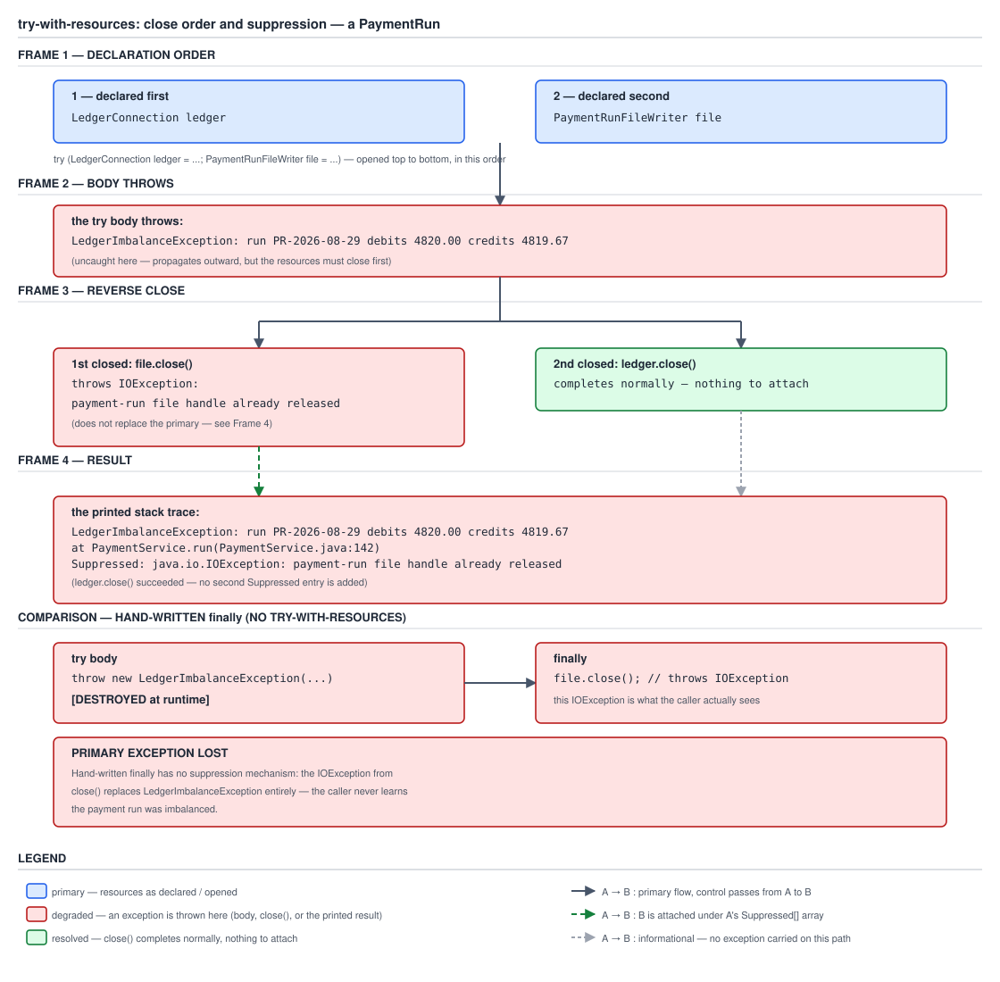

# 03 Java Core — try-with-resources and suppressed exceptions — BASICS (§1.20, 1.20.12–1.20.15)

**Target version: Java 21 LTS.** | **Part 1 of 5** | [Index](../00-index.md)
Previous: [`catch`, multi-catch and precise rethrow](01b-catch-multicatch-and-precise-rethrow.md) · Next: [`finally` traps](01d-finally-traps.md)

A `try`-with-resources block is a `try`/`finally` the compiler writes for you, with one refinement a hand-written `finally` cannot give itself: if both the body and the close throw, neither exception is thrown away. The body's exception becomes the one the caller sees; the close's exception is attached to it as a rider, retrievable but not in the way. Everything in this file is that one refinement, worked out from first principles and then measured against **Oracle JDK 21.0.7 (21.0.7+8-LTS-245, macOS aarch64)**, with one comparison against **JDK 8u202** and one against **JDK 17.0.15**. The relevant language is JLS 21 §14.20.3.

The two resource types used throughout, matching the domain: `LedgerConnection`, an `AutoCloseable` handle on the double-entry ledger, and `PaymentRunFileWriter`, an `AutoCloseable` writer for the batched payout file the banking partner ingests four times a day. Both carry 7k bank withdrawals a day through this exact code path in production, which is why a close failure here is not a hypothetical.

---

## 1. `try`-with-resources: `AutoCloseable`, reverse close order, close before `catch`/`finally` (1.20.12)

### Mental model

A `try`-with-resources block is sugar over a `try`/`finally` where the `finally` closes every declared resource, in the reverse of the order they were declared, and does so as the very first thing that happens once the body exits — before any `catch` clause is even considered, and before any hand-written `finally` that follows. Picture the resources as plates stacked one on top of another as they open; closing unstacks them from the top down, because a resource opened later may depend on one opened earlier (a writer that assumes its underlying connection is still live), so the dependency must be closed before the thing it depends on.

### Why it exists

Before Java 7, resource cleanup was a hand-written `finally { conn.close(); }`, and that form has a defect explored fully in concept 3 below: if the body throws and the `close()` call also throws, the hand-written form has exactly one exception slot to report through, and the close exception overwrites the body's exception — silently. try-with-resources exists specifically to stop discarding the more important exception.

### When to reach for it, and when not

Reach for it whenever the resource type is `AutoCloseable` — which by Java 21 covers nearly everything with an open/close lifecycle: JDBC `Connection`/`Statement`/`ResultSet`, all I/O streams and channels, locks obtained via `Lock.lock()` do *not* implement it (locking is not open/close-shaped and needs the unlock in a plain `finally`), and this file's own `LedgerConnection`/`PaymentRunFileWriter`. Do not reach for it when the "resource" has no deterministic close — a `Thread` you merely started, or a value with reference-counted sharing where closing on every exit is wrong. And do not reach for it as a substitute for a `finally` that must run logic unrelated to closing anything; that is [`01d-finally-traps.md`](01d-finally-traps.md) territory.

### How it works

The declaration list sits inside the `try`'s parentheses, semicolon-separated, each naming a variable of a type implementing `AutoCloseable`:

```java
try (LedgerConnection ledger = new LedgerConnection();
     PaymentRunFileWriter file = new PaymentRunFileWriter()) {
    ledger.debit();
    file.write();
}
```

Declaration order is `ledger` then `file`. Close order is the reverse: `file.close()` runs, then `ledger.close()` runs. Measured on JDK 21.0.7, a program that prints on entry to the body and on entry to each `close()`, with a `catch` and a `finally` attached:

```java
try (LedgerConnection ledger = new LedgerConnection();
     PaymentRunFileWriter file = new PaymentRunFileWriter()) {
    ledger.debit();
    file.write();
    throw new IllegalStateException("body: run PR-2026-08-29 failed");
} catch (IllegalStateException e) {
    System.out.println("catch: " + e.getMessage());
} finally {
    System.out.println("finally: cleanup done");
}
```

printed:

```
body: LedgerConnection in use
body: PaymentRunFileWriter in use
close: PaymentRunFileWriter
close: LedgerConnection
catch: body: run PR-2026-08-29 failed
finally: cleanup done
```

Read the last four lines in order. Both resources close — `file` first, `ledger` second, confirming reverse declaration order — and **both closes complete before `catch` runs**, which itself completes before `finally` runs. This is the ordering people get backwards: they expect `finally` to be where cleanup happens and assume the resources are still open while the `catch` block runs. Neither is true. The `try`-with-resources block has its own hidden `finally`-equivalent that runs first, entirely separate from and prior to any `catch` or `finally` written in the source.

A `try`-with-resources needs neither a `catch` nor a `finally` — the block above is legal as `try (LedgerConnection ledger = new LedgerConnection()) { ledger.debit(); }` with nothing following, and that is in fact the common case: the resource cleanup is the *only* thing the construct is for, and callers add a `catch` only when they intend to handle an exception rather than let it propagate.

**Multiple resources**, already shown above, are declared in one comma-free, semicolon-separated list inside the parentheses. Each is closed regardless of whether an earlier resource's close threw — every declared resource gets exactly one close attempt.

**When a resource constructor throws.** Measured, three resources declared, the second one's constructor throwing:

```java
try (LedgerConnection ledger = new LedgerConnection();
     PaymentRunFileWriter file = new PaymentRunFileWriter();  // constructor throws
     ThirdResource third = new ThirdResource()) {
    System.out.println("body: never reached");
} catch (Exception e) {
    System.out.println("caught: " + e);
}
```

printed:

```
ctor: LedgerConnection
ctor: PaymentRunFileWriter (about to throw)
close: LedgerConnection
caught: java.lang.IllegalStateException: payment-run file already open for PR-2026-08-29
```

`ThirdResource`'s constructor never ran — a later resource in the list is never opened once an earlier construction step fails. `PaymentRunFileWriter` itself was never assigned to its local (its constructor never returned normally), so it is never closed either. Only `ledger`, which finished constructing before the failure, gets `close()` called on it. The rule, stated generally: only resources whose constructor has already **completed normally** are closed; the body never runs at all in this case, so this is fully a construction-time failure, not a body failure.

### Diagram

See concept 2 for D-054, which covers this ordering as its first frame; a separate diagram for construction order alone is not warranted, since the mechanism is the same reverse-order-close rule applied one step earlier.

### A concrete example

The program above, in full, is the example: `LedgerConnection` and `PaymentRunFileWriter`, declared in that order, closed in reverse, before `catch`, before `finally`. Nothing about it needs a separate contrived example — this is the shape every real use of the construct in the payments code takes.

### The gotcha

**Insight:** the hidden `finally`-equivalent is why a `catch` clause attached to a `try`-with-resources can never observe a resource as still open. This matters when writing a `catch` that itself tries to use the resource for diagnostics — by the time `catch` runs, `close()` has already been called, so `ledger.debit()` inside a `catch` block is operating on an already-closed connection, which is very likely to throw its own exception (typically `IllegalStateException` from a connection implementation, though `AutoCloseable` does not mandate detecting reuse — a lenient implementation may instead silently no-op or corrupt state) rather than the diagnostic being sought.

> **Definition.** `try`-with-resources closes every declared `AutoCloseable` resource in the reverse of its declaration order, as part of the `try` block's own implicit cleanup, which completes in full before any `catch` clause and before any `finally` block attached to the same statement runs.

---

## 2. Suppressed exceptions: the body's exception wins, close's is attached (1.20.14)

`[PROVE]` The claim usually stated as "the original exception isn't lost" needs the actual printed trace to be convincing, not the sentence.

### Mental model

Think of the exception that comes out of a `try`-with-resources block as a small envelope with one main letter and a clip on the back for extra notes. The main letter is whichever exception the *body* threw — that is what `catch` sees, what propagates, what a caller's `catch (LedgerImbalanceException e)` matches against. Every exception thrown while *closing* a resource, if the body already threw, is clipped to the back as a suppressed exception rather than replacing the main letter or being thrown separately.

### Why it exists

The alternative — letting the close exception fully replace the body exception — is exactly what the pre-Java-7 hand-written form does, and concept 3 measures how badly that goes wrong. The alternative to *that* alternative — letting both propagate — is not even a coherent option, because a single `throw` statement can only carry one `Throwable` up the call stack at a time. Suppression is the design that keeps the more diagnostically important exception (the body's — it is almost always the root cause) primary, while still preserving the close failure somewhere a sufficiently careful caller or log formatter can find it.

### When to reach for it, and when not

You do not "reach for" suppression — it is not something you invoke, it is what the compiler does for you automatically inside every `try`-with-resources block whenever both the body and a `close()` throw. The one place you *do* reach for the underlying mechanism directly is the hand-written equivalent in concept 3, which you should almost never write by hand precisely because the compiler already writes it correctly. The one case where you should override the default and *not* rely on suppression: a close failure that is itself operationally significant — for example `PaymentRunFileWriter.close()` failing to flush a batch of withdrawals — should usually be surfaced as its own alert rather than left as a suppressed exception nobody reads unless the log formatter happens to print `Suppressed:` lines. That is a logging/alerting decision layered on top of the language mechanism, not a replacement for it.

### How it works

Mechanically: the `try`-with-resources block keeps the body's exception (if any) as the "primary" `Throwable`. When closing a resource throws, and there is already a primary exception in flight, the compiler calls `primary.addSuppressed(closeException)` instead of throwing the close exception. If the body did *not* throw, the *first* close failure becomes the primary exception itself (there being nothing else for it to be suppressed under), and any *further* close failures — from resources still to be closed — are suppressed under that one. A suppressed exception is retrieved with `Throwable.getSuppressed()`, returning `Throwable[]`; the full API surface (`addSuppressed`, `getSuppressed`, and the four-argument `Throwable` constructor's `enableSuppression` flag) belongs to [`01a-throwable-api-and-chaining.md`](01a-throwable-api-and-chaining.md) — this file owns only the mechanism by which try-with-resources populates it.

Three failure combinations, and what happens in each — worth a table given there are exactly three shapes and each is asked about independently:

| Body | `close()` calls | Primary exception | Suppressed exceptions |
|---|---|---|---|
| Throws | All succeed | Body's exception | none |
| Succeeds | One or more throw | First close failure (in reverse close order) | Every close failure after the first |
| Throws | One or more throw | Body's exception | Every close failure, in reverse close order |



**D-054** — Four frames plus a comparison panel, for the case where the body throws and both resources fail to close. Frame 1 shows `ledger` and `file` opened in declaration order. Frame 2 shows the body throwing `LedgerImbalanceException: run PR-2026-08-29 debits 4820.00 credits 4819.67`. Frame 3 shows the reverse-order close — `file` then `ledger` — with `file.close()` also throwing `IOException: payment-run file handle already released`. Frame 4 shows the resulting trace: `LedgerImbalanceException` as the primary, the `IOException` nested under a `Suppressed:` line. The comparison panel beside it repeats the identical scenario written with a hand-written `finally`, labelled "primary exception LOST" — that panel is concept 3's proof, placed here for the side-by-side.

**Case 1 — body throws, one `close()` throws.** Measured on JDK 21.0.7:

```java
try (LedgerConnection ledger = new LedgerConnection();          // close(): no-op
     PaymentRunFileWriter file = new PaymentRunFileWriter()) {  // close(): throws
    throw new LedgerImbalanceException(
        "run PR-2026-08-29 debits 4820.00 credits 4819.67");
} catch (Exception primary) {
    System.out.println("caught: " + primary);
    System.out.println("suppressed count: " + primary.getSuppressed().length);
    for (Throwable s : primary.getSuppressed()) {
        System.out.println("  suppressed: " + s);
    }
    primary.printStackTrace(System.out);
}
```

printed:

```
close: LedgerConnection (no throw)
caught: Suppress1$LedgerImbalanceException: run PR-2026-08-29 debits 4820.00 credits 4819.67
suppressed count: 1
  suppressed: java.io.IOException: payment-run file handle already released
Suppress1$LedgerImbalanceException: run PR-2026-08-29 debits 4820.00 credits 4819.67
	at Suppress1.main(Suppress1.java:18)
	Suppressed: java.io.IOException: payment-run file handle already released
		at Suppress1$PaymentRunFileWriter.close(Suppress1.java:12)
		at Suppress1.main(Suppress1.java:16)
```

The primary is `LedgerImbalanceException`; the `IOException` from `PaymentRunFileWriter.close()` is attached and rendered under its own `Suppressed:` line, with its own frame in the trace. `getSuppressed().length` is `1`. This is the exact shape D-054's frame 4 draws.

**Case 2 — inverted: body succeeds, only `close()` throws.** Measured:

```java
try (LedgerConnection ledger = new LedgerConnection();          // close(): no-op
     PaymentRunFileWriter file = new PaymentRunFileWriter()) {  // close(): throws
    System.out.println("body: run PR-2026-08-29 completed, no exception");
} catch (Exception primary) {
    System.out.println("caught: " + primary);
    System.out.println("suppressed count: " + primary.getSuppressed().length);
}
```

printed:

```
body: run PR-2026-08-29 completed, no exception
close: LedgerConnection (no throw)
caught: java.io.IOException: payment-run file handle already released
suppressed count: 0
```

With no body exception to be primary, the close failure **is** the primary — it is thrown directly, not suppressed under anything, and `getSuppressed()` is empty. This is the middle row of the table above.

**Case 3 — body throws, both `close()` calls throw.** Measured, `LedgerConnection.close()` now also throwing:

```java
try (LedgerConnection ledger = new LedgerConnection();          // close(): throws
     PaymentRunFileWriter file = new PaymentRunFileWriter()) {  // close(): throws
    throw new LedgerImbalanceException(
        "run PR-2026-08-29 debits 4820.00 credits 4819.67");
} catch (Exception primary) {
    System.out.println("caught: " + primary);
    System.out.println("suppressed count: " + primary.getSuppressed().length);
    for (Throwable s : primary.getSuppressed()) {
        System.out.println("  suppressed: " + s);
    }
}
```

printed:

```
caught: Suppress3$LedgerImbalanceException: run PR-2026-08-29 debits 4820.00 credits 4819.67
suppressed count: 2
  suppressed: java.io.IOException: payment-run file handle already released
  suppressed: java.io.IOException: ledger connection reset by peer
```

Both `IOException`s land under `Suppressed:` on the one primary, in reverse close order (`file` closes first and its `IOException` is suppressed first; `ledger` closes second and its `IOException` is suppressed second) — `getSuppressed()` returns them in the order they were added, which is the order the resources closed.

**Suppressed is not a cause.** Note in Case 1's full stack trace above: there is no `Caused by:` line anywhere. `addSuppressed` populates a distinct array from the `cause` chain `initCause`/the four-argument constructor populates, and `printStackTrace` renders the two differently — `Caused by:` recurses through `getCause()`, `Suppressed:` recurses through `getSuppressed()`, and a `Throwable` can carry both simultaneously with no interaction between them. Exception chaining and the `Caused by:` mechanism itself are [`01a-throwable-api-and-chaining.md`](01a-throwable-api-and-chaining.md)'s territory.

### The gotcha

**Insight:** a suppressed exception is exactly as invisible as your log formatter lets it be. `Throwable.printStackTrace()` renders `Suppressed:` blocks by default, so a trace pasted into a terminal or an unstructured log file shows it — but a JSON-structured log formatter that serialises `message` and `stackTrace` fields and does not specifically know to walk `getSuppressed()` will silently drop the close failure on the floor, indistinguishable from success. This is why a close failure that is itself operationally meaningful — like `PaymentRunFileWriter` failing on a batch that feeds the banking partner's ingest window — should not be left purely to suppression; log or alert on it explicitly at the point it is caught, in addition to letting it ride along suppressed.

> **Definition.** When both the `try`-with-resources body and a resource's `close()` throw, the body's exception becomes the primary exception propagated to the caller, and every `close()` failure is attached to it via `addSuppressed` (with the first close failure becoming primary instead if the body itself did not throw) — suppressed exceptions render under `Suppressed:` in a stack trace, are retrievable via `getSuppressed()`, and are entirely distinct from the `cause` chain rendered under `Caused by:`.

---

## 3. The old `finally { conn.close(); }` form destroys the original exception (1.20.15)

`[TRAP]` `[PROVE]`

### Mental model

A hand-written `try { throwsHere(); } finally { conn.close(); }` has exactly one exception slot on the way out of the method: whatever the `finally` block itself throws, if it throws anything, is what the caller receives — full stop, with no memory of whatever was already in flight when `finally` started running.

### Why it exists

This is not "why suppression exists" restated — it is the specific, narrower fact that motivates it: **an exception thrown from a `finally` block unconditionally replaces any exception already propagating out of the corresponding `try` block**, per JLS §14.20.2's abrupt-completion rules for `try`-`finally`. This is ordinary Java control flow, not a bug, and it existed for exactly the same reason a `return` inside `finally` swallows a prior `return` or `throw` — the mechanism is generalised in [`01d-finally-traps.md`](01d-finally-traps.md). It is fine when the `finally` block cannot itself throw. It becomes a data-loss bug the moment the cleanup step — a `close()` call — can throw, which for I/O-backed resources is routine: `PaymentRunFileWriter.close()` flushing a network-backed file handle, or `LedgerConnection.close()` releasing a pooled database connection, both have realistic failure modes.

### When you would still see this form, and why you should not write it

You will still see this form in code predating Java 7, in code that has not been modernised, or — occasionally — in code where the author didn't know try-with-resources existed for the type in hand. There is no case in modern Java 21 code where the hand-written form is preferable to `try`-with-resources for an `AutoCloseable` resource; the only reason to write the manual `primary`/`addSuppressed` pattern shown below is to *understand* what the compiler now does for you, never to actually ship it.

### How it works

Measured on JDK 21.0.7, the pre-Java-7 shape verbatim, run against the same two failures used above — the body throws `LedgerImbalanceException`, and `conn.close()` throws `IOException`:

```java
LedgerConnection conn = new LedgerConnection();
try {
    throw new LedgerImbalanceException(
        "run PR-2026-08-29 debits 4820.00 credits 4819.67");
} finally {
    conn.close();  // conn.close() throws IOException("ledger connection reset by peer")
}
```

Run as a program's whole `main`, uncaught, this printed:

```
Exception in thread "main" java.io.IOException: ledger connection reset by peer
	at OldForm$LedgerConnection.close(OldForm.java:9)
	at OldForm.main(OldForm.java:18)
```

**The `LedgerImbalanceException` is gone.** Not suppressed — there is no `Suppressed:` line. Not chained — there is no `Caused by:` line. It was constructed, began propagating out of the `try` block, and was replaced in full the instant the `finally` block's `conn.close()` threw. `getSuppressed()` on the caught `IOException`, if you check it, is empty; the `LedgerImbalanceException` object still exists as a Java object somewhere on the heap until garbage collected, but nothing in the program retains a reference to it, and nothing in the printed trace names it. For a payment run in the middle of 7k batched bank withdrawals a day, this is the exact failure that turns "the ledger was out of balance by 0.33 on run PR-2026-08-29" into "the file handle for PR-2026-08-29 was already released" with no trace of the balance problem that actually mattered.

**Pitfall:** believing a `try { throwsHere(); } finally { resource.close(); }` is "basically the same as" try-with-resources because both call `close()` at the right time. The *timing* is the same; the *exception-handling behavior on the failure path* is not, and the failure path is precisely the case that matters, because the success path never exercises either form's exception handling at all. Symptom: an incident where the logged exception is a low-value infrastructure failure (a closed socket, a released file handle) and the actual root cause — a business-rule violation, a data-integrity check, an assertion — is nowhere in any log, because it was silently replaced. Fix: use `try`-with-resources for anything `AutoCloseable`; where the resource type predates `AutoCloseable` and the manual form is unavoidable, write the primary-exception-plus-`addSuppressed` pattern below rather than a bare `finally { resource.close(); }`.

**The hand-written form that actually preserves it** — this is, functionally, what the compiler now emits for a `try`-with-resources block, and the reason nobody should write it by hand once the compiler will write it correctly:

```java
LedgerConnection conn = new LedgerConnection();
RuntimeException primary = null;
try {
    throw new LedgerImbalanceException(
        "run PR-2026-08-29 debits 4820.00 credits 4819.67");
} catch (RuntimeException e) {
    primary = e;
    throw e;
} finally {
    try {
        conn.close();
    } catch (IOException closeFailure) {
        if (primary != null) {
            primary.addSuppressed(closeFailure);
        } else {
            throw closeFailure;
        }
    }
}
```

Measured, run against the identical two failures:

```
Exception in thread "main" HandWritten$LedgerImbalanceException: run PR-2026-08-29 debits 4820.00 credits 4819.67
	at HandWritten.main(HandWritten.java:16)
	Suppressed: java.io.IOException: ledger connection reset by peer
		at HandWritten$LedgerConnection.close(HandWritten.java:9)
		at HandWritten.main(HandWritten.java:23)
```

Same shape as concept 2's Case 1: the `LedgerImbalanceException` is primary, the `IOException` rides along suppressed. Getting this right by hand requires an extra local variable to hold the primary exception, a `catch` clause purely to capture it before rethrowing, a nested `try`/`catch` around the close call, and a branch on whether a primary exists — five moving parts, every one of which a typo turns back into concept-3's data loss. `try`-with-resources is exactly this, generated correctly, every time, for every resource in the list, in the right reverse order, with no local variable for you to get wrong.

### Diagram

Covered by D-054's comparison panel in concept 2 — the "primary exception LOST" side-by-side is this concept's proof, placed there rather than duplicated as a second figure.

### The gotcha

Already stated above as the section's `**Pitfall:**`, per the `[TRAP]` obligation on this leaf.

> **Definition.** In a hand-written `try { throwsHere(); } finally { closesHere(); }`, an exception thrown from the `finally` block unconditionally replaces — not suppresses, not chains — any exception already propagating from the `try` block, per JLS §14.20.2; `try`-with-resources exists specifically to replace this bare-`finally` idiom for `AutoCloseable` resources with the primary-exception-plus-`addSuppressed` behavior of concept 2, generated by the compiler rather than hand-maintained.

---

## Supporting fact — effectively-final resource expressions (Java 9) (1.20.13)

**Mechanism.** Java 7 required every resource in a `try`-with-resources declaration list to be a *new local variable declared right there* — `try (LedgerConnection r = ledger) { r.debit(); }` even when `ledger` already existed as an effectively-final local. Java 9 (JEP 213) allows the resource list to name an existing effectively-final (or `final`) variable or field access directly:

```java
LedgerConnection ledger = new LedgerConnection();
try (ledger) {
    ledger.debit();
}   // ledger.close() called here
```

Measured: compiling this with `javac --release 9` (or later) on JDK 21.0.7 succeeds and runs correctly, printing the same body-then-close order as the Java 7 form. Compiling the identical source with **JDK 8's** `javac` fails outright at the syntax level — `<identifier> expected` / `')' expected` — because Java 8's grammar for the resource list requires a type and a variable declarator; it does not merely warn, it does not parse.

**Gotcha — the one real behavioural difference worth knowing.** The natural guess is that a resource expressed as a variable reference (Java 9+ form) versus a fresh declaration (Java 7 form) behaves differently on `null`. Measured on JDK 21.0.7, both forms given a `null` local:

```java
LedgerConnection nullLocal = null;
try (LedgerConnection r = nullLocal) {   // Java 7 form
    System.out.println("body: declared-null form");
}
```

```java
LedgerConnection nullLocal = null;
try (nullLocal) {                        // Java 9 form
    System.out.println("body: effectively-final-null form");
}
System.out.println("completed normally");
```

Both printed their body line, called no `close()`, threw nothing, and completed normally — identical behavior. `javap` on both shows the identical shape: `aload` the resource, `ifnull` jump past the close call, `invokevirtual close()` only on the non-null path. **The claim that "a null resource throws NPE at close time in the Java 7 form" does not hold** — measured, it does not throw; it silently closes nothing, in both the Java 7 and the Java 9 form. The real dividing line is not Java-7-versus-Java-9 syntax at all: it is whether the resource expression is a **variable reference** (gets a compiler-emitted `ifnull` guard, in both forms) versus a **`new` expression** (`try (LedgerConnection r = new LedgerConnection())`), which the compiler knows statically cannot be null and for which the `ifnull` guard is measured to be absent from the bytecode entirely — `close()` is called unconditionally on that path. So: `new X()` resources are unconditionally closed; any other resource expression, old syntax or new, gets a null check and a silent no-op close on `null`.

> **Definition.** Java 9 (JEP 213) allows a `try`-with-resources declaration to name an existing effectively-final local variable or field directly, without redeclaring it; the compiler emits the identical reverse-order-close, suppression, and (for any non-`new`-expression resource) null-guarded close behavior as the Java 7 form — the two differ only in surface syntax, not in runtime semantics.

---

## What this file does not cover

[`02e-resources-interrupts-and-testing.md`](02e-resources-interrupts-and-testing.md) owns try-with-resources *in practice*: multiple resources with mixed success/failure, a genuinely `null` resource in a realistic call site, writing an idempotent `close()`, and declaring `close()` without a `throws` clause. [`03a-internals-finally-and-twr-desugaring.md`](03a-internals-finally-and-twr-desugaring.md) owns the measured `javap` desugaring of a full try-with-resources block — the inlined close calls, the null checks measured above at the source level, the primary-exception local, and the `addSuppressed` call, all seen in bytecode; one fact stated here because it was measured for this file and is worth stating now: on JDK 21's `javac`, the close logic is **inlined at each call site**, with no synthetic `$closeResource` helper method generated. [`../objects-equality-and-lifecycle/03a-finalization-cleanup-and-leaks.md`](../objects-equality-and-lifecycle/03a-finalization-cleanup-and-leaks.md) owns try-with-resources as a cleanup *idiom* in resource-lifetime design, and `Cleaner`. [`../control-flow/01e-try-and-unreachable-code.md`](../control-flow/01e-try-and-unreachable-code.md) owns `try`/`finally` control flow from the language side generally.

---

## Pitfalls

### Closing a resource in a hand-written `finally` block

**Wrong**

```java
LedgerConnection conn = new LedgerConnection();
try {
    throw new LedgerImbalanceException(
        "run PR-2026-08-29 debits 4820.00 credits 4819.67");
} finally {
    conn.close();   // throws IOException("ledger connection reset by peer")
}
```

Measured output — an uncaught, unhandled program exit:

```
Exception in thread "main" java.io.IOException: ledger connection reset by peer
	at OldForm$LedgerConnection.close(OldForm.java:9)
	at OldForm.main(OldForm.java:18)
```

The `LedgerImbalanceException` — the actual root cause — does not appear anywhere in this output. It was replaced, not suppressed, not chained.

**Right**

```java
try (LedgerConnection conn = new LedgerConnection()) {
    throw new LedgerImbalanceException(
        "run PR-2026-08-29 debits 4820.00 credits 4819.67");
}
```

Measured output:

```
Exception in thread "main" PitfallRight$LedgerImbalanceException: run PR-2026-08-29 debits 4820.00 credits 4819.67
	at PitfallRight.main(PitfallRight.java:14)
	Suppressed: java.io.IOException: ledger connection reset by peer
		at PitfallRight$LedgerConnection.close(PitfallRight.java:9)
		at PitfallRight.main(PitfallRight.java:13)
```

The root cause is primary; the close failure rides along suppressed instead of erasing it.

**Why people believe it:** the success path of both forms is identical — `close()` runs when the block exits, either way — so unless you specifically test the case where *both* the body and the close throw, the two forms are behaviourally indistinguishable in every test you are likely to write. The bug is dormant until exactly the failure mode you most need diagnosed.

### Assuming `catch` can still see resources as open

**Wrong**

```java
try (LedgerConnection ledger = new LedgerConnection()) {
    ledger.debit();
    throw new LedgerImbalanceException(
        "run PR-2026-08-29 debits 4820.00 credits 4819.67");
} catch (LedgerImbalanceException e) {
    ledger.debit();   // does not compile: `ledger` is out of scope in `catch`
}
```

This particular example is actually a compile error, because `ledger`'s scope is the `try` block only — which is itself evidence of the underlying rule. The dangerous version is when the resource is stored in an outer variable so it remains reachable:

```java
LedgerConnection ledger = new LedgerConnection();
try (ledger) {
    throw new LedgerImbalanceException(
        "run PR-2026-08-29 debits 4820.00 credits 4819.67");
} catch (LedgerImbalanceException e) {
    ledger.debit();   // compiles — but ledger.close() already ran
}
```

`ledger.close()` completed before this `catch` block started, per concept 1's measured ordering, so `ledger.debit()` here operates on an already-closed connection.

**Right**

```java
LedgerConnection ledger = new LedgerConnection();
try (ledger) {
    throw new LedgerImbalanceException(
        "run PR-2026-08-29 debits 4820.00 credits 4819.67");
} catch (LedgerImbalanceException e) {
    log.error("run PR-2026-08-29 failed after ledger closed", e);
    // any recovery here must open a fresh LedgerConnection, not reuse `ledger`
}
```

**Why people believe it:** `finally` is the block people associate with "still has access to things that need cleaning up," and a `catch` written directly under a `try`-with-resources looks lexically identical to a `catch` under a plain `try`, where the resource genuinely would still be usable at that point.

### Treating a suppressed exception as chained, or as visible by default

**Wrong**

```java
try {
    doPaymentRun();
} catch (LedgerImbalanceException e) {
    log.error("payment run failed: {}", e.getCause());   // null — nothing here
}
```

where `doPaymentRun()` is a `try`-with-resources whose close also failed. `getCause()` is unrelated to suppression; a suppressed exception is never the `cause` unless something separately calls `initCause`. Worse, many structured-logging setups serialise only `message` and the `cause` chain, so the suppressed `IOException` from `PaymentRunFileWriter.close()` is dropped from the log entirely — no `Suppressed:` line, no trace it ever happened.

**Right**

```java
try {
    doPaymentRun();
} catch (LedgerImbalanceException e) {
    log.error("payment run failed: {}", e.getMessage(), e);
    for (Throwable suppressed : e.getSuppressed()) {
        log.error("  suppressed during cleanup: {}", suppressed.getMessage(), suppressed);
    }
}
```

Passing `e` itself to a logging framework's throwable parameter typically renders the full `printStackTrace`-equivalent output including `Suppressed:` blocks, but explicitly walking `getSuppressed()` is the only way to guarantee a structured/JSON logger surfaces the close failure as its own field rather than depending on whether the formatter happens to walk it.

**Why people believe it:** "suppressed" and "caused by" are both "another exception attached to this one," and the API surface (`getCause()` vs `getSuppressed()`) is easy to conflate unless you have specifically compared the two side by side, as concept 2 does above.

---

## Cheat sheet

| Thing | Fact (Java 21 LTS) |
|---|---|
| `AutoCloseable.close()` | `void close() throws Exception` — added Java 7 |
| `Closeable.close()` | `void close() throws IOException`, extends `AutoCloseable` — narrower, predates it by name only (both added together in Java 7) |
| Declaration order | as written in the `try` statement's resource-specification parentheses |
| Close order | **reverse** of declaration order |
| Close vs `catch`/`finally` | all resource closes run **before** any `catch` and before any hand-written `finally` |
| `catch`/`finally` optional | yes — a `try`-with-resources needs neither |
| Resource constructor throws | later resources in the list are never constructed; earlier, already-constructed resources are still closed |
| Body throws, `close()` throws | body's exception is primary; close's exception is `addSuppressed` onto it |
| Body succeeds, `close()` throws | close's exception (the first one, if several) becomes primary directly — nothing suppressed under it |
| Body throws, multiple `close()` throw | body's exception primary; every close failure suppressed, in reverse close order |
| Suppressed vs `Caused by:` | `Suppressed:` from `getSuppressed()`; `Caused by:` from `getCause()` — fully independent, never conflated by the platform |
| Old `finally { r.close(); }` form | a `close()` exception **replaces** (not suppresses, not chains) any exception already propagating from `try` — JLS §14.20.2 |
| Hand-written correct form | primary-exception local + `catch`-and-rethrow + nested `try`/`catch` in `finally` + `addSuppressed` — exactly what the compiler now generates |
| Effectively-final resource expr | Java 9 (JEP 213): `try (existingVar)`, no redeclaration needed |
| Java 8 on that syntax | fails to parse: `<identifier> expected` |
| Null resource, variable-reference form | compiler emits `ifnull` guard; measured: closes nothing, **no NPE**, completes normally — true for both Java 7's `try (T r = nullVar)` and Java 9's `try (nullVar)` |
| Null resource, `new`-expression form | no `ifnull` guard emitted — `close()` called unconditionally (moot for `new X()`, which cannot be null) |
| `javap`, JDK 21 desugaring | close logic inlined at each call site — no synthetic `$closeResource` method (measured; full walk in `03a-internals-finally-and-twr-desugaring.md`) |

---

## Self-test

**Q1.** Two resources, `ledger` then `file`, declared in that order in one `try`-with-resources. In what order do they close, and does that happen before or after an attached `catch` block runs?

<details><summary>Answer</summary>

They close in reverse declaration order: `file` first, then `ledger`. Both closes complete before the `catch` block runs, and before any `finally` block runs — measured on JDK 21.0.7 with a program that throws from the body and prints on every close, catch, and finally: the two `close:` lines print before the `catch:` line, which prints before the `finally:` line. The reverse order exists because a later-declared resource may depend on an earlier one (a writer built on top of a connection), so it must be torn down first.

</details>

**Q2.** Body throws `LedgerImbalanceException`. `close()` throws `IOException`. Which one does the caller see as the primary exception, and where does the other go?

<details><summary>Answer</summary>

The caller sees `LedgerImbalanceException` as the primary — that is what a `catch (LedgerImbalanceException e)` matches, and what propagates if uncaught. The `IOException` from `close()` is attached to it via `Throwable.addSuppressed`, retrievable through `e.getSuppressed()` (an array, length 1 here) and rendered in a printed stack trace under a `Suppressed:` line with its own nested trace. Measured: `printStackTrace` produced the primary's trace followed by `Suppressed: java.io.IOException: payment-run file handle already released` with `PaymentRunFileWriter.close`'s frame beneath it. This is the whole point of try-with-resources over the old `finally` form: the more diagnostically important exception — the body's — is never discarded.

</details>

**Q3.** Body completes normally; only `close()` throws, on the sole resource in the block. Is that exception suppressed under anything?

<details><summary>Answer</summary>

No. With nothing already in flight from the body, the close failure has no primary to be suppressed under, so it becomes the primary exception itself and propagates directly. Measured: `catch (Exception primary)` caught the `IOException` from `PaymentRunFileWriter.close()` directly, and `primary.getSuppressed().length` was `0`. Suppression only happens when there are at least two exceptions competing for the one propagation slot; with only one exception in the whole block, there is nothing to suppress it under.

</details>

**Q4.** Two resources, both of whose `close()` calls throw, and the body also throws. How many suppressed exceptions land on the primary, and in what order?

<details><summary>Answer</summary>

Two, in reverse close order — which is reverse declaration order. Measured with `ledger` declared first and `file` second, both `close()` methods throwing `IOException`, and the body throwing `LedgerImbalanceException`: `getSuppressed()` returned an array of length 2, with `file`'s `IOException` first (it closes first, being declared second) and `ledger`'s `IOException` second. `getSuppressed()` returns them in the order `addSuppressed` was called, which is the order the resources actually closed.

</details>

**Q5.** Someone writes `try { doWork(); } finally { conn.close(); }`. `doWork()` throws `LedgerImbalanceException`; `conn.close()` throws `IOException`. What does the caller actually see, and what happened to the `LedgerImbalanceException`?

<details><summary>Answer</summary>

The caller sees only the `IOException` — measured, an uncaught run of exactly this shape printed `Exception in thread "main" java.io.IOException: ledger connection reset by peer` with no mention of `LedgerImbalanceException` anywhere in the trace, no `Suppressed:` block, no `Caused by:` chain. Per JLS §14.20.2, an exception thrown from a `finally` block unconditionally replaces whatever was already propagating out of the corresponding `try` block — this is ordinary abrupt-completion semantics, not a defect, but applied to a `close()` call it means the original, usually more important, exception is permanently gone. This is the exact defect `try`-with-resources exists to fix.

</details>

**Q6.** Why does the JDK 9 effectively-final resource form `try (ledger)` behave identically to `try (LedgerConnection r = ledger)` rather than differently on a `null` resource?

<details><summary>Answer</summary>

Because both forms compile the resource expression down to the same shape: load the resource reference, guard it with an `ifnull` check, and call `close()` only on the non-null path. Measured with `javap` on JDK 21.0.7: both the Java-7-style redeclaration and the Java-9-style bare-variable form produce byte-identical control flow — `aload`, `ifnull <skip>`, `invokevirtual close()`. Given a `null` local in either form, the program prints its body line, calls no `close()`, throws no exception, and completes normally. The one shape that differs is a `new` expression resource (`try (LedgerConnection r = new LedgerConnection())`), where the compiler knows the value statically cannot be null and omits the `ifnull` guard entirely, calling `close()` unconditionally. Java-7-versus-Java-9 syntax is not the dividing line; variable-expression-versus-`new`-expression is.

</details>

**Q7.** What, precisely, does `Closeable` add over `AutoCloseable`, given that `Closeable extends AutoCloseable`?

<details><summary>Answer</summary>

A narrower `close()` signature and an idempotency convention, nothing else. Measured via `javap`: `AutoCloseable` declares `void close() throws Exception`; `Closeable` declares `void close() throws IOException` and extends `AutoCloseable`. So every `Closeable` is an `AutoCloseable`, but the reverse is not true — a type whose `close()` can throw a checked exception other than `IOException`, or whose `close()` can throw nothing at all (a plain `void close()` with no `throws` clause, which is legal because narrowing a `throws` clause on override is always allowed), only implements `AutoCloseable`. `Closeable`'s javadoc additionally documents that `close()` should be idempotent — safe to call more than once — which `AutoCloseable`'s javadoc explicitly does not require of implementers in general, though it recommends it. This file's `LedgerConnection` and `PaymentRunFileWriter` both implement `AutoCloseable` directly with plain, unchecked-or-no-`throws` `close()` methods, which is the common shape for domain resources that are not I/O streams specifically.

</details>

**Q8.** A resource's own constructor throws partway through a multi-resource `try`-with-resources declaration. What gets closed, and what never gets constructed?

<details><summary>Answer</summary>

Only resources whose constructors have already **completed normally** before the failing one are closed; any resource declared after the failing one is never constructed at all. Measured with three resources declared in order — `LedgerConnection`, `PaymentRunFileWriter` (constructor throws), `ThirdResource`: the output was `ctor: LedgerConnection`, `ctor: PaymentRunFileWriter (about to throw)`, `close: LedgerConnection`, then the caught `IllegalStateException`. `ThirdResource`'s constructor never ran — `System.out.println("ctor: ThirdResource")` never printed — and `PaymentRunFileWriter` itself was never closed, because it never finished constructing (its local variable was never assigned). The body of the `try` block also never ran, since the block never got past resource acquisition.

</details>

---

## Open questions

None.

---

**Leaves covered:** 1.20.12–1.20.15 (4 leaves)
**Leaves deferred:** none
**Diagrams included:** D-054
**Target version:** Java 21 LTS
**Lines:** 594
