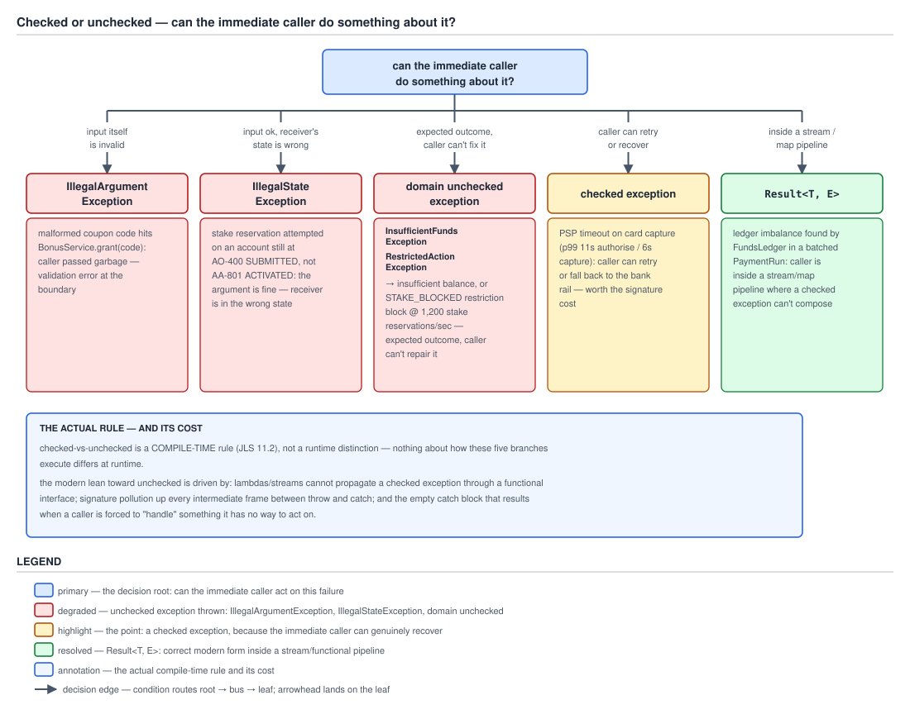

# 03 Java Core — Exceptions in practice: the design decision — INTERMEDIATE (§2.6)

**Target version: Java 21 LTS.** | **Part 2 of 5** | [Index](../00-index.md)
Previous: [Catch discipline and top-level handling](01e-catch-discipline-and-top-level-handling.md) · Next: [Checked exceptions and lambdas](02a-checked-exceptions-and-lambdas.md)

[`01-basics.md`](01-basics.md) settled the mechanical question: a `Throwable` is checked or unchecked by JLS 21 §11.1.1, purely by where it sits relative to `RuntimeException` and `Error`, and the compiler enforces catch-or-declare on the checked half with zero regard for whether the exception is actually likely or actually meaningful. That file does not ask *which* family your own exceptions should join — it only tells you what the compiler does once you have decided. This file asks the question that actually gets argued about in code review: given that `InsufficientFundsException`, `RestrictedActionException`, `IllegalTransitionException`, `LedgerImbalanceException` and `BonusIneligibleException` all extend `RuntimeException` directly, was that the right call, or is it a QuizStakes-wide policy hiding a decision that should have been made per-exception? The honest answer requires taking the checked side seriously before dismantling it, which is what this file does.

Everything below is measured against **Oracle JDK 21.0.7 (21.0.7+8-LTS-245, macOS aarch64)**. The Spring claims in concept 3 are documentation checks against the Spring Framework javadoc — Spring is not on this machine's classpath, so nothing there is a compile check, and that boundary is called out at the point it matters.

---

## 1. Checked versus unchecked as a design decision (2.6.1)

Picture two doors on every method that can fail. One door is locked by the compiler — you cannot leave the method without either opening it (`catch`) or nailing a sign to your own door saying "this door exists too" (`throws`). The other door has no lock at all; it swings open at runtime and nobody upstream is warned it is there until it happens. The mechanical question `01-basics.md` answers is "which door does the compiler lock." This concept answers the question a designer actually has to make a judgment call on: which door *should* be locked, for a failure you are inventing yourself, before the compiler even enters the picture.

### Why it exists

Java is the only mainstream language that shipped compiler-checked exceptions as a first-class mechanism. C++ never adopted them in the way originally proposed; C# considered and rejected the idea explicitly; Kotlin, which runs on the same JVM and interoperates with Java's own checked exceptions, does not have them at the language level at all — a Kotlin method that calls `FundsLedger.append` sees no compile-time obligation whatsoever, checked or not. That is worth sitting with: the mechanism this whole topic is about is not a JVM feature, it is a `javac` feature, and one other JVM language sharing the same runtime declined to build it.

More telling still is what happened inside the JDK itself. `java.util.stream`, shipped in Java 8, has no checked-exception-throwing method anywhere in its functional interfaces — `Function.apply`, `Consumer.accept`, `Predicate.test` all declare no `throws` clause, which is the pivot concept 2 turns on. `java.time`, also Java 8, throws `DateTimeException`, unchecked. NIO.2's `Files` methods still throw the checked `IOException` for historical-compatibility reasons, but Java 8 introduced `UncheckedIOException` specifically as an escape hatch for code that needs to wrap checked I/O failures for use inside the new unchecked-only functional interfaces — the JDK's own authors building a bridge *out* of the mechanism they had shipped decades earlier. `Optional`, the JDK's answer to "this might not have a value," carries no exception at all; absence is a value, not a `throw`. Four flagship additions across two decades, and three of them route around checked exceptions entirely while the fourth needed a purpose-built adapter to interoperate with the first three. That pattern is not evidence checked exceptions are worthless — it is evidence the platform's own authors found them a poor fit for a specific, common shape of code: composed, functional-style pipelines. Concept 2 makes that concrete.

### When to reach for it, and when not

The test that actually discriminates is not "is this condition recoverable" — nearly everything is recoverable in some abstract sense, given enough context, which is exactly why that framing produces endless disagreement. The test is: **can the immediate caller do something specific about it, and will it actually do that thing at this call site?** "Immediate" matters as much as "specific." A failure three layers below the code that can actually act on it is not recoverable *there*, no matter how recoverable it is in principle somewhere upstream — and Java's checked-exception mechanism forces every layer in between to acknowledge a failure only one layer can act on, which is exactly the signature-pollution cost concept 2 measures.

Joshua Bloch's rule, stated in *Effective Java* and worth quoting precisely because most retellings soften it: use checked exceptions for conditions from which the caller can reasonably be expected to recover, and runtime exceptions for everything else — including violated preconditions, which are always the caller's bug rather than the environment's failure. Applied honestly, Bloch's rule and the design-time test above agree, and the disagreement people have with "checked exceptions were a mistake" is usually a disagreement with how narrowly Bloch scoped "reasonably be expected to recover," not with the rule itself.

Four QuizStakes cases, worked through against that test rather than asserted:

**A PSP timeout on card capture.** The card PSP's authorise/capture/payout calls run at p50 240ms/180ms/400ms but p99 11s/6s/9s — a real, frequent tail, not a hypothetical. When a capture call times out at the 6-second p99, the *immediate* caller — the code that issued the capture — has two genuinely different, genuinely actionable responses available: retry the capture against the same PSP, or fall back to routing the payout over the bank rail instead. Both are decisions only that call site can make well, because only it knows the deposit amount, the client's available instruments, and whether a retry window is still open. This is the strongest case for checked: the caller can do something specific, and it is specific to this call site, not to some generic top-level handler three frames up.

**An insufficient balance at 1,200 stake reservations/sec.** `PaymentService.reserveStake` checking a client's stakeable balance against the requested stake and finding it short is an *expected*, frequent outcome — arguably more expected than the PSP timeout, since balance shortfalls happen on a meaningful fraction of the 2.8M/day stake reservations. But the immediate caller, `StakeController.post`, cannot do anything about it beyond propagating a rejection to the client — it cannot manufacture funds, cannot silently substitute a smaller stake without violating the client's actual instruction, and cannot retry, because retrying an unchanged balance produces the identical failure. Expected does not imply actionable. This is `InsufficientFundsException` territory, and it is unchecked in QuizStakes precisely because propagation, not local handling, is the only real behaviour at every call site between the check and the HTTP response.

**A `STAKE_BLOCKED` restriction.** A client with an active `STAKE_BLOCKED` restriction attempting to stake hits a wall that is not a database hiccup or a network blip — it is a compliance answer, arrived at deliberately by `ClientRestrictions`, and the correct response is to surface it as a 4xx to the client, not to retry it or route around it. `RestrictedActionException` is unchecked for the same reason `InsufficientFundsException` is: the immediate caller's only correct move is to let it propagate to a boundary that turns it into an HTTP response, and forcing every intermediate frame to declare `throws RestrictedActionException` would buy nothing, because none of those frames does anything with it except pass it on.

**A ledger imbalance.** A double-entry mismatch caught inside `FundsLedger` — the debits and credits for a movement not summing to zero — is the sharpest case, because at the frame where it is detected, there is genuinely nothing the immediate caller can do. It cannot repair the arithmetic, cannot decide which side of the entry is wrong, and retrying changes nothing, because the inputs that produced the imbalance are already committed. `LedgerImbalanceException` is unchecked in QuizStakes for exactly this reason — no call site between the point of detection and a top-level alerting handler has a specific response available, so a `throws` clause on every intermediate frame would be pure ceremony. There is one context where this case gets interesting rather than settled: a batched `PaymentRun` processing a `Stream` of payout entries, where one entry's ledger imbalance should not necessarily abort the other 259 entries in that day's average bank-withdrawal batch. Neither a checked nor an unchecked exception composes cleanly with a `Stream.map` over that batch — which is exactly the gap `02a-checked-exceptions-and-lambdas.md`'s `Result<T, E>` type exists to fill, and it is why the decision diagram below routes that specific case there rather than to either exception flavour.

Be fair to the case checked exceptions actually win, because it is real and dismissing it caricatures the argument: an API whose *only correct use* involves handling the failure is a legitimate checked-exception design. `TimeoutException` on the identity-vendor client from `01-basics.md` concept 5 is close to this shape — a caller of `DocumentVerification.verify` that ignores the possibility of a timeout is not merely being lazy, it is shipping a bug, because the 30-second watchlist timeout against a p99 of 38 seconds means the timeout *will* happen in production, repeatedly, and there is no sensible default behaviour that does not require the caller to decide something. The compiler forcing that decision at compile time, rather than trusting a code reviewer to notice a missing check, is checked exceptions doing exactly the job they were designed for. The lean toward unchecked in concept 2 is a lean, not an absolute — this case is the reason it is not a rule.

### How it works

The mechanism here is a design classification, not a runtime behaviour — `01-basics.md` concept 2 already measured that checked and unchecked exceptions throw and unwind identically at the `athrow` instruction, so "how it works" for this concept is the four-way discrimination above, applied consistently: recoverable-by-the-immediate-caller with a specific action available is the only case that earns checked; everything else, including "recoverable in principle but not by anyone standing at this call site," is unchecked. The design consequence that concept 2 quantifies is what it costs to get this classification wrong in the checked direction: a `throws` clause that climbs frames which cannot act on the failure.

### Diagram



**D-081** — A decision tree rooted at the one question that matters: can the immediate caller do something specific about this, and will it. Five leaves branch from it, each carrying a QuizStakes case: `IllegalArgumentException` for a malformed coupon code reaching `BonusService.grant`; `IllegalStateException` for a stake attempted on an account still at `AO-400 SUBMITTED`; a domain unchecked exception (`InsufficientFundsException`, `RestrictedActionException`) for an insufficient balance and a `STAKE_BLOCKED` block; a checked exception for a PSP timeout on card capture; and a `Result<T, E>` type for a ledger imbalance found while processing a batched `PaymentRun` inside a stream pipeline. An annotation panel states the compile-time rule from JLS 11.2 alongside the three reasons the modern lean favours the unchecked leaves, both covered in full in concept 2.

### A concrete example

The PSP-timeout case, worked as real code, because it is the leaf where checked genuinely earns its keep:

```java
public class CardPayments {
    private static final Duration CAPTURE_TIMEOUT = Duration.ofSeconds(9);

    private final PspClient pspClient;

    public CardPayments(PspClient pspClient) {
        this.pspClient = pspClient;
    }

    /**
     * Captures a previously authorised card payment.
     *
     * @throws PspTimeoutException if the capture call does not complete within
     *     {@link #CAPTURE_TIMEOUT}. The p99 capture latency is 6s against this
     *     9s budget, so callers must have a real fallback, not a log line.
     */
    public CaptureResult capture(PaymentIntent intent) throws PspTimeoutException {
        try {
            return pspClient.capture(intent.authorisationId(), intent.amount())
                .get(CAPTURE_TIMEOUT.toMillis(), TimeUnit.MILLISECONDS);
        } catch (TimeoutException | InterruptedException e) {
            if (e instanceof InterruptedException) {
                Thread.currentThread().interrupt();
            }
            throw new PspTimeoutException(intent.authorisationId(), e);
        } catch (ExecutionException e) {
            throw new IllegalStateException("capture failed for " + intent.authorisationId(), e.getCause());
        }
    }
}
```

`PspTimeoutException` is declared as a checked exception on purpose:

```java
public class PspTimeoutException extends Exception {
    private final String authorisationId;

    public PspTimeoutException(String authorisationId, Throwable cause) {
        super("card capture timed out for authorisation " + authorisationId, cause);
        this.authorisationId = authorisationId;
    }

    public String authorisationId() {
        return authorisationId;
    }
}
```

And the caller, which is the point of the whole exercise — it is not a pass-through, it makes the two decisions the case above described:

```java
public class BankWithdrawalFallback {
    private final CardPayments cardPayments;
    private final BankWithdrawal bankWithdrawal;

    public BankWithdrawalFallback(CardPayments cardPayments, BankWithdrawal bankWithdrawal) {
        this.cardPayments = cardPayments;
        this.bankWithdrawal = bankWithdrawal;
    }

    public CaptureResult captureWithFallback(PaymentIntent intent, int attemptsRemaining) {
        try {
            return cardPayments.capture(intent);
        } catch (PspTimeoutException e) {
            if (attemptsRemaining > 0) {
                return captureWithFallback(intent, attemptsRemaining - 1);
            }
            return bankWithdrawal.routeToRail(intent);
        }
    }
}
```

`captureWithFallback` is exactly the caller Bloch's rule has in mind: it catches `PspTimeoutException` and does something the code above it could not — retry, or switch rails — rather than logging and rethrowing.

### The gotcha

**Pitfall:** treating "recoverable" as a property of the *failure* rather than a property of the *call site*. A ledger imbalance is, in the abstract, something a human operator can eventually reconcile — so by a loose reading it is "recoverable," and someone reasons their way into making `LedgerImbalanceException` checked on that basis. The result is `throws LedgerImbalanceException` climbing from `FundsLedger` through every service that ever touches the ledger, none of which can do anything with it beyond propagating it to the same top-level handler a human operator eventually reads. The fix is to ask the question at the frame that would have to write the `catch`, not in the abstract: does *this* code, right here, have a specific action — and the answer for every frame except the top-level handler is no.

> **Definition.** Checked versus unchecked, as a design decision rather than a compiler rule, is the choice between forcing every intermediate caller to acknowledge a failure syntactically (checked) and letting it propagate silently until something chooses to catch it (unchecked) — and the test that should drive that choice is whether the *immediate* caller has a specific, actionable response available, not whether the failure is recoverable in some more general or more distant sense.

---

## 2. Why modern practice leans unchecked (2.6.2)

The mental model: a checked exception is a contract term stapled onto a method signature, and Java's newer APIs are built around passing methods *as values* — to `Stream.map`, to `CompletableFuture.thenApply`, to a `Comparator`. A stapled-on contract term does not travel with the method once it becomes a value; it has nowhere to attach, because the interface receiving it (`Function<T, R>`) was declared once, ahead of time, with no `throws` clause, for every possible `T` and `R` that will ever be plugged into it. That mismatch is not a minor inconvenience — it is why the lean toward unchecked is a lean the platform's own designers made, not a fashion.

### Why it exists

Checked exceptions predate the functional-interface style of programming by nearly two decades. When `throws` clauses were designed, the dominant shape of Java code was imperative and sequential — one statement at a time, each free to have its own `try`/`catch` wrapped around it. `Stream`, lambdas, and method references are a different shape: a pipeline of composed transformations where the framework, not your code, is the one calling each step. The framework cannot know, when it calls `Function.apply`, whether the particular lambda plugged in that day happens to throw a checked exception — and the interface's signature was fixed once, when `java.util.function` shipped, for every use forever. The three problems below are what happens when a compile-time-checked mechanism meets a style of code the mechanism was never built to compose with.

### When it applies, and when it does not

The lean applies with full force to any code that will be passed as a value into a functional-interface-shaped API — `Stream`, `CompletableFuture`, `Comparator.comparing`, event listeners, or your own higher-order methods. It applies with much less force to plain, sequential, imperative code, where a `throws` clause costs exactly what it always cost and none of the three reasons below bite as hard. A method that does one JDBC call and returns is not paying the composition tax; a `Function` passed into `Stream.map` over 7,200 `AO-400` submissions a day is.

### How it works

Three reasons, made concrete rather than asserted.

**No composition with lambdas and streams.** `java.util.function.Function<T, R>` declares `R apply(T t)` — no `throws` clause. Every functional interface `Stream`, `CompletableFuture`, and the rest of `java.util.function` are built on follows the same pattern. Measured on JDK 21.0.7: scoring a `Stream` of `AO-400` submissions through a method that throws the checked `SQLException` fails to compile —

```java
static void score(ApplicationCase app) throws SQLException {
    if (app.applicationId().isEmpty()) {
        throw new SQLException("cannot score " + app.applicationId());
    }
}

List<ApplicationCase> scored = batch.stream()
    .map(app -> { score(app); return app; })
    .toList();
```

produces, verbatim:

```
StreamCheckedTest.java:16: error: unreported exception SQLException; must be caught or declared to be thrown
            .map(app -> { score(app); return app; })
                               ^
```

The lambda body is still an ordinary method body subject to catch-or-declare, and `Function.apply`'s signature gives it nowhere to declare to. The workarounds — wrapping in an unchecked exception inside the lambda, "sneaky throwing," a custom checked-throwing functional interface, or a `Result<T, E>` return type — are `02a-checked-exceptions-and-lambdas.md`'s full territory; this file states the shape of the wall, not how to climb it.

**Signature pollution.** `01-basics.md` concept 2 already measured `SQLException` climbing from `FundsLedger.append` through `PaymentService.reserveStake` to `StakeController.post` — three signatures carrying a JDBC detail that only the first of the three has any business knowing about. The damage is not cosmetic. `PaymentService` and `StakeController` are now coupled to *how* `FundsLedger` persists, not merely to what it does — if `FundsLedger` is later rewritten against a different store that throws a different checked exception, or none at all, every intermediate signature that declared `throws SQLException` has to change, and every caller of *those* methods has to be recompiled against the new signature. A checked exception in a method signature is not documentation, it is a binary and source compatibility commitment, propagated to everyone downstream regardless of whether they care.

**Empty catch blocks.** `01-basics.md` concept 2 states this as an insight; here it is the empirical consequence. A developer under deadline pressure, faced with a compile error from a checked exception they are certain "cannot really happen" at this call site, has exactly two escape routes that satisfy the compiler with the least effort: widen the `throws` clause (the `throws Exception` pitfall from `01-basics.md`), or write a `catch` block with nothing useful inside it —

```java
try {
    fundsLedger.append(entry);
} catch (SQLException e) {
    // deal with this once it actually happens
}
```

the shape above is the real, common, production form: a caught checked exception with no logging, no rethrow, no metric — because the compiler's only demand was that the exception be *acknowledged*, not that anything be *done*. The forced acknowledgment `01-basics.md` describes as the reason checked exceptions exist is precisely what produces this failure mode, because "acknowledge" and "handle correctly" are different bars and the compiler can only check the first.

The honest counterweight, named rather than glossed over: unchecked exceptions buy composability by making the exception invisible in the signature — which means a caller of `PaymentService.reserveStake` has no compiler-enforced way to discover that `InsufficientFundsException` or `RestrictedActionException` can come out of it. Discoverability moves entirely from the compiler to the javadoc and the code reviewer. That is why `@throws` documentation on an unchecked exception is not optional practice, it is the *only* remaining mechanism carrying the information a `throws` clause used to carry for free:

```java
/**
 * Reserves stake against the client's stakeable balance.
 *
 * @throws InsufficientFundsException if the stake exceeds the client's
 *     stakeable balance (cash available + bonus available)
 * @throws RestrictedActionException if the client carries an active
 *     STAKE_BLOCKED restriction
 */
public Reservation reserveStake(ClientId clientId, Money stake) {
    // implementation as in 01-basics.md concept 2, unchanged
    return null;
}
```

| Reason for the lean | What it costs to ignore | Counterweight |
|---|---|---|
| No composition with lambdas/streams | Compile error inside any `Stream.map`/`Function` body that calls a checked-throwing method, verified above | None — this is a hard wall, not a style preference; workarounds exist in `02a` but the wall is real |
| Signature pollution | Every intermediate frame's signature is coupled to an implementation detail it does not otherwise depend on; changing the detail is a multi-file signature change | A checked `throws` clause is at least a compiler-verified contract; an undocumented unchecked exception is not verified at all |
| Empty catch blocks | A caught-and-discarded failure that a monitoring system never sees, discovered only when its silent absence causes a worse failure downstream | Checked exceptions at least force a `catch` or `throws` to exist syntactically — unchecked exceptions do not even force that much |

**Insight:** the three reasons are not independent complaints about checked exceptions in general — they are three symptoms of the same root cause, which is that `throws` clauses are part of a method's *static type*, fixed once for every use, while lambdas passed into `Stream`/`CompletableFuture` need their exception behaviour to vary per call site. Any fix that does not touch the type system (widening to `Exception`, swallowing) trades the symptom for a worse one; the fixes that do touch it — a custom functional interface, or a `Result<T, E>` — are `02a`'s territory.

### A concrete example

Already shown above in full: the `StreamCheckedTest` compile failure is the example, and it is real, measured, and complete — there is no fuller version of "no composition with lambdas and streams" than the compiler's own error message.

### The gotcha

**Pitfall:** concluding from the compile error that `Stream` "cannot handle exceptions" and therefore avoiding streams for any operation that might fail. `Stream` handles unchecked exceptions exactly as well as any other Java code — an `IllegalStateException` thrown from inside `Stream.map` propagates out of the terminal operation exactly as it would from a plain loop. The wall is specific to *checked* exceptions inside functional-interface bodies, not to failure in general, and the fix in most QuizStakes code is the same fix concept 3 demonstrates for JDBC: translate the checked exception to an unchecked one at the point closest to where it is thrown, before it ever needs to cross a `Function` boundary.

> **Definition.** The modern lean toward unchecked exceptions is a response to a genuine incompatibility between checked exceptions — a static, per-signature, compiler-enforced contract — and the functional-interface style `java.util.function`, `Stream` and `CompletableFuture` are built on, which fixes each interface's exception behaviour once, ahead of time, for every lambda ever plugged into it; the cost paid in return is that discoverability of an unchecked exception moves entirely from the compiler to `@throws` javadoc and code review.

---

## 3. Spring's translation of `SQLException` into the unchecked `DataAccessException` hierarchy (2.6.5)

The mental model: JDBC hands every failure to you through one door — `java.sql.SQLException` — no matter what actually went wrong behind it, and tells you which failure it was only by way of a vendor-specific integer or string tucked inside the object. Spring's data access layer puts a second door in front of that one: it inspects what came through the first door and hands you back an object from a *hierarchy of unchecked types*, one type per failure category, so your `catch` clause can say what it means instead of decoding a vendor code.

### Why it exists

`SQLException` is a single checked class for every JDBC failure a driver can report — a duplicate key, a deadlock, a dropped connection, a syntax error, a constraint violation — distinguished only by `getErrorCode()` (a vendor-specific integer) and `getSQLState()` (a five-character code standardised by ISO/ANSI SQL but inconsistently populated across drivers). Distinguishing "this insert violated a unique constraint" from "this write deadlocked and should be retried" therefore means matching against a vendor-specific table of codes inside a `catch (SQLException e)` block — code that is both unreadable and non-portable, because the codes differ by database vendor. Spring's `SQLExceptionTranslator` (interface, package `org.springframework.jdbc.support`, confirmed against the Spring Framework javadoc) exists to do that matching once, centrally, and hand back a typed, unchecked result instead.

### When to reach for it, and when not

Reach for the translated hierarchy whenever JDBC or Spring Data JPA is anywhere in the call path — which in a Spring Boot application is by default, not by opt-in, since `JdbcTemplate` and Spring Data repositories translate automatically. Do not reach for hand-rolled `SQLState` matching once this is available; it is strictly worse on every axis the hierarchy improves. The one case where you still need to look past the translated type is when the translation itself is ambiguous or missing — covered in the caveat below — at which point the original `SQLException` is still available as the cause.

### How it works

One self-contained mechanism paragraph, sufficient to answer this in an interview. `SQLExceptionTranslator` (`org.springframework.jdbc.support`) is Spring's strategy interface for the translation step; its primary method takes a task description, the offending SQL, and the `SQLException`, and returns a `DataAccessException` — or `null` if no specific translation applies — with the original `SQLException` preserved as the returned exception's cause. `DataAccessException` itself (`org.springframework.dao`) is the abstract root of the hierarchy, and it is unchecked — it extends `NestedRuntimeException`, itself a `RuntimeException`. Beneath it sit the specific categories: `DataIntegrityViolationException` for constraint violations, and `DuplicateKeyException` (which extends `DataIntegrityViolationException`) specifically for a primary-key or unique-constraint violation. Beneath a separate branch, `PessimisticLockingFailureException` covers lock-contention failures, with `CannotAcquireLockException` as the concrete type for "could not acquire a lock in the given time." **Version-sensitive claim, verified against the Spring Framework javadoc:** `DeadlockLoserDataAccessException`, the type this task's brief names as canonical, was deprecated as of Spring Framework 6.0.3 in favour of `PessimisticLockingFailureException`/`CannotAcquireLockException` — so the accurate answer in 2026, against any Spring Boot 3.1+ application, names `CannotAcquireLockException` as the current type and mentions `DeadlockLoserDataAccessException` only as the pre-6.0.3 name for the same concept. `SQLErrorCodeSQLExceptionTranslator`, the default implementation, does the actual dispatch — it consults an internal, vendor-keyed table of `SQLState`/error-code ranges (shipped as `sql-error-codes.xml` inside `spring-jdbc`) to decide which concrete `DataAccessException` subtype to construct.

Two things this buys, stated precisely. First, the caller writes `catch (DuplicateKeyException e)` and means it — the category *is* the check, with no vendor-code inspection inside the block, and every other `SQLException` category the caller does not name simply is not caught, which is the correct behaviour since the caller genuinely has nothing to say about a category it did not ask for. Second, the checked exception stops climbing: because `DataAccessException` is unchecked, none of `JdbcTemplate`'s callers are forced to add a `throws` clause, which is exactly the signature-pollution fix concept 2 describes, applied by the framework rather than by hand.

**The vendor-specific caveat, stated as a limit rather than a footnote.** Translation is best-effort, driven by the error-code table for the specific database dialect in use, and different databases signal the same logical failure with different codes — a duplicate key is SQL state `23505` on PostgreSQL and a different code on other vendors' drivers. `SQLErrorCodeSQLExceptionTranslator` handles that variance for you by dispatching on the configured dialect, which is precisely why `catch (DuplicateKeyException e)` is portable across a database migration in a way that

```java
catch (SQLException e) {
    if ("23505".equals(e.getSQLState())) {
        throw new BonusIneligibleException("client already has a bonus grant");
    }
}
```

is not — the hand-written check is silently wrong the day the underlying database changes, while the Spring translation layer's dialect table is the thing that would need to change, once, in a location that is not scattered across every `catch` block in the codebase.

`[X-REF 07]` The container, dependency injection, and how `JdbcTemplate` gets wired to a `DataSource` and a `SQLExceptionTranslator` in the first place is Guide 07 (Spring core)'s territory. `[X-REF 08]` How Spring Data JPA's repository layer performs the same translation for JPA/Hibernate exceptions — a parallel but distinct translation path, since Hibernate does not throw `SQLException` directly — and how the persistence context interacts with transaction boundaries, is Guide 08 (Spring Data JPA)'s territory. Neither is duplicated here; this concept is the mechanism paragraph both of those guides assume you already have.

### Diagram

No diagram for this concept: the mechanism is a translation table and a two-level type hierarchy, both stated precisely in prose above, and a picture of "checked type in, unchecked type out" would repeat concept 1's decision-tree shape without adding information.

### A concrete example

A `BonusService.grant` write that can race with a concurrent grant attempt for the same client, written against the translated hierarchy rather than raw `SQLException`:

```java
public class BonusService {
    private final JdbcTemplate jdbcTemplate;

    public BonusService(JdbcTemplate jdbcTemplate) {
        this.jdbcTemplate = jdbcTemplate;
    }

    public Bonus grant(ClientId clientId, Money deposit, String couponCode) {
        Money bonusAmount = computeBonus(deposit);
        try {
            jdbcTemplate.update(
                "INSERT INTO bonus (client_id, amount, coupon_code, status) VALUES (?, ?, ?, 'GRANTED')",
                clientId.value(), bonusAmount.amount(), couponCode);
        } catch (DuplicateKeyException e) {
            throw new BonusIneligibleException(
                "client " + clientId + " already has a bonus grant for coupon " + couponCode);
        } catch (CannotAcquireLockException e) {
            throw new BonusIneligibleException(
                "bonus grant for " + clientId + " could not acquire a lock; retry the deposit");
        }
        return new Bonus(clientId, bonusAmount, BonusStatus.GRANTED);
    }

    private Money computeBonus(Money deposit) {
        BigDecimal tenPercent = deposit.amount().multiply(BigDecimal.valueOf(0.10));
        BigDecimal capped = tenPercent.min(BigDecimal.valueOf(100));
        return new Money(capped, deposit.currency());
    }
}
```

Note what is absent: no `throws SQLException` anywhere, no `getSQLState()` call, no vendor-code table. `grant`'s signature makes no mention of JDBC at all — a caller sees only `BonusIneligibleException`, which is `02b-designing-an-exception-hierarchy.md`'s translation pattern applied at the framework layer instead of by hand, and it is the pattern `02b` generalises beyond Spring's own hierarchy.

### The gotcha

**Pitfall:** catching the abstract `DataAccessException` everywhere "to be safe," the same instinct as `catch (Exception e)` from `01-basics.md`'s pitfalls, applied one level down. `catch (DataAccessException e)` compiles and catches every category — duplicate keys, deadlocks, connection failures, syntax errors — indiscriminately, which throws away exactly the precision the hierarchy exists to provide. The fix is the same discipline `01b-catch-multicatch-and-precise-rethrow.md` argues for generally: catch the specific subtype your call site has an actual response for (`DuplicateKeyException` to translate into a domain-meaningful rejection), and let everything else propagate to a boundary that logs it as an unexpected data-access failure.

> **Definition.** Spring's `SQLExceptionTranslator` converts the single checked `SQLException` JDBC always throws into a typed hierarchy of unchecked `DataAccessException` subclasses — `DuplicateKeyException`, `CannotAcquireLockException`, `DataIntegrityViolationException`, and others — each preserving the original `SQLException` as its cause, so a caller can `catch` the specific category it can act on with no checked-exception signature pollution and no vendor-code inspection, at the cost of the translation being only as accurate as the dialect-specific error-code table backing it.

---

## 4. Choosing between `IllegalArgumentException`, `IllegalStateException`, `NullPointerException` and a custom type (2.6.8)

The mental model: every precondition failure answers one of three questions about the call — was *what you handed me* wrong, was *I* not ready for this call, or was *the specific piece you handed me* simply missing — and the fourth option exists for when the caller downstream needs to do more with the failure than log it. Getting the choice right means asking those questions in order, not reaching for whichever exception name comes to mind first.

### Why it exists

`java.lang.IllegalArgumentException`, `IllegalStateException`, and `NullPointerException` are three of the ten common unchecked exceptions `01-basics.md` concept 4 catalogues, and the JDK itself is not perfectly consistent about which one it throws in a given circumstance — which is exactly why an explicit rule, applied consistently within your own codebase, is worth more than trying to reverse-engineer the JDK's own precedent case by case. A custom type exists because sometimes the caller genuinely needs structured data or a `catch`-able category the three generic types cannot carry.

### When to reach for each, and when not

Four QuizStakes cases, one per type, each stated as the rule first and the case second.

**`IllegalArgumentException`** — the *argument* itself is invalid, independent of the receiver's state. A malformed coupon code like `SUMMR25` failing a checksum inside `BonusService.grant` is this: the account is perfectly capable of receiving a bonus, the deposit is perfectly valid, but the specific string handed to `grant` does not pass validation. Do not reach for this when the argument is fine and the *object* is the problem — that is `IllegalStateException` below, and conflating the two is the single most common misuse in this group.

**`IllegalStateException`** — the argument is fine, but the receiver cannot honour the call *right now*. A stake attempted against an account still sitting at `AO-400 SUBMITTED`, before it has reached `AA-801 ACTIVATED`, is this exactly: the stake amount, the client ID, everything handed to `PaymentService.reserveStake` is well-formed, but the account's lifecycle state rejects the operation. Do not reach for this when the failure is a *domain rule* a caller might reasonably want to branch on or retry differently than a generic "wrong state" — see the boundary case below.

**`NullPointerException`** — the argument is null, full stop, and this is the one the room gets wrong most often. The convention, settled since `Objects.requireNonNull` shipped in **Java 7**, is that a null argument is an `NullPointerException`, not an `IllegalArgumentException` — and it is worth quoting the actual behaviour rather than asserting it, because it is the cleanest way to end the argument. Measured on JDK 21.0.7, `Objects.requireNonNull`'s source (`java.base/java.util/Objects.java`):

```java
public static <T> T requireNonNull(T obj, String message) {
    if (obj == null)
        throw new NullPointerException(message);
    return obj;
}
```

and running it:

```java
Objects.requireNonNull(null, "coupon code must not be null");
// java.lang.NullPointerException: coupon code must not be null
```

`NullPointerException`, not `IllegalArgumentException`, with the supplied message attached verbatim. The reasoning behind the convention, not just its existence: "the argument was null" is a strictly more specific fact than "the argument was invalid," and every JDK collection, `Optional`, and record accessor throws `NullPointerException` for a null where a value was required — so writing `IllegalArgumentException` for null in your own code is inconsistent with everything a caller has already learned to expect from the platform. A malformed but non-null coupon code is `IllegalArgumentException`; a null coupon code reaching `BonusService.grant` is `NullPointerException`, thrown by a `requireNonNull` call at the top of the method rather than discovered three lines later from a `NullPointerException` on `.length()` with a less specific message.

**A custom type** — reach for this when the caller needs to *branch* on the failure category, or needs *data* off the exception the three generic types cannot carry. `RestrictedActionException` carries a `RestrictionType type()` accessor specifically so a caller can route different restriction categories to different queues; a generic `IllegalStateException` with the type baked into a message string would force the caller to parse text to recover that same information. The rule is symmetric with the JDK's own: `NumberFormatException` exists as a custom subtype of `IllegalArgumentException`, from `01-basics.md` concept 4, for exactly this reason — a caller sometimes needs to distinguish "malformed number" from "invalid argument in general," and a dedicated type is how you make that distinguishable without string matching.

| Type | Question it answers | QuizStakes case | Carries structured data? |
|---|---|---|---|
| `IllegalArgumentException` | Is the argument itself wrong? | A malformed coupon code (`SUMMR25`) failing a checksum in `BonusService.grant` | No — message only, by convention |
| `IllegalStateException` | Is the receiver unready for this call, argument aside? | A stake attempted on an account still at `AO-400 SUBMITTED`, not yet `AA-801 ACTIVATED` | No — message only, by convention |
| `NullPointerException` | Is the argument specifically null? | A null coupon code reaching `BonusService.grant`, via `Objects.requireNonNull` | No — message only, since Java 7's `requireNonNull(obj, message)` |
| Custom type | Does the caller need to branch on this, or read data off it? | `RestrictedActionException.type()` — a caller routes `STAKE_BLOCKED` differently from `SELF_EXCLUDED` | Yes — that is the entire reason to write one |

**The boundary case worth knowing:** `IllegalStateException` versus a domain exception, when the "wrong state" is itself a business rule rather than a generic precondition. `IllegalStateException` is the right call when the wrongness is structural and uninteresting to the caller beyond "not now" — calling `Iterator.next()` after `hasNext()` returned false, for instance. But a stake against an account at `AO-400 SUBMITTED` is not a structural accident; it is a specific, named domain transition rule that a caller may reasonably want to catch and respond to differently than an arbitrary "bad state" — perhaps by surfacing "your account is still being reviewed" instead of a generic 500. That is exactly what `IllegalTransitionException` is for, and it already exists in `01-basics.md` concept 1's catalogue of QuizStakes domain exceptions:

```java
public class IllegalTransitionException extends RuntimeException {
    public IllegalTransitionException(String fromStatus, String toStatus) {
        super("cannot transition from " + fromStatus + " to " + toStatus);
    }
}
```

The rule that separates the two: if the invalid state is a JDK-shaped structural precondition with no domain meaning a caller would branch on, `IllegalStateException` is correct and sufficient. If the invalid state *is* the domain logic — a status machine transition a caller might reasonably want to catch, log with structured `fromStatus`/`toStatus` fields, or map to a specific client-facing message — it belongs in a named domain exception like `IllegalTransitionException`, not folded into a generic `IllegalStateException` whose message is the only place the transition detail lives. `02b-designing-an-exception-hierarchy.md` covers how to design that hierarchy once you have decided a custom type is warranted; this concept only owns the four-way choice of *which* type to reach for.

### How it works

The mechanism, at the depth this tier demands, is the source-level check each type performs and where in the call that check runs. `IllegalArgumentException` and `IllegalStateException` carry no special runtime machinery — they are thrown explicitly, by your own validation code, at whatever point in the method body the check is written; there is no compiler or JVM support distinguishing "the argument was wrong" from "the state was wrong" beyond the class name you chose. `NullPointerException` is the one exception in this group with dedicated runtime support: since **Java 15** (JEP 358, on by default), a JVM-thrown `NullPointerException` — from a bare `.length()` on a null reference, not from `Objects.requireNonNull` — carries a "helpful" message naming the exact null expression, confirmed on JDK 21.0.7 in `01-basics.md` concept 4 (`Cannot invoke "String.length()" because "<local1>" is null`). That mechanism is orthogonal to the convention here: `Objects.requireNonNull(coupon, "coupon code must not be null")` produces a clearer, purpose-written message than the JVM's helpful-NPE inference ever could, because you already know which argument and why it matters, which is the actual argument for calling `requireNonNull` explicitly at the top of a method rather than relying on the first accidental dereference to fail informatively.

### A concrete example

All four choices, applied consistently inside one method, because seeing them side by side is what makes the discrimination stick:

```java
public class BonusService {
    private final JdbcTemplate jdbcTemplate;
    private final AccountMaintenance accountMaintenance;

    public BonusService(JdbcTemplate jdbcTemplate, AccountMaintenance accountMaintenance) {
        this.jdbcTemplate = jdbcTemplate;
        this.accountMaintenance = accountMaintenance;
    }

    public Bonus grant(ClientId clientId, Money deposit, String couponCode) {
        Objects.requireNonNull(clientId, "clientId must not be null");
        Objects.requireNonNull(deposit, "deposit must not be null");
        Objects.requireNonNull(couponCode, "couponCode must not be null");

        if (!passesChecksum(couponCode)) {
            throw new IllegalArgumentException("coupon code failed checksum: " + couponCode);
        }

        Account account = accountMaintenance.find(clientId);
        if (account.status() != AccountStatus.ACTIVE) {
            throw new IllegalTransitionException(account.status().name(), AccountStatus.ACTIVE.name());
        }

        if (isFirstDepositWindowClosed(clientId)) {
            throw new BonusIneligibleException("coupon " + couponCode + " expired for " + clientId
                + ": more than 14 days since registration");
        }

        Money bonusAmount = computeBonus(deposit);
        try {
            jdbcTemplate.update(
                "INSERT INTO bonus (client_id, amount, coupon_code, status) VALUES (?, ?, ?, 'GRANTED')",
                clientId.value(), bonusAmount.amount(), couponCode);
        } catch (DuplicateKeyException e) {
            throw new BonusIneligibleException("client " + clientId + " already has a bonus grant");
        }
        return new Bonus(clientId, bonusAmount, BonusStatus.GRANTED);
    }

    private boolean passesChecksum(String couponCode) {
        return couponCode.length() == 7 && Character.isDigit(couponCode.charAt(6));
    }

    private boolean isFirstDepositWindowClosed(ClientId clientId) {
        return false;
    }

    private Money computeBonus(Money deposit) {
        BigDecimal tenPercent = deposit.amount().multiply(BigDecimal.valueOf(0.10));
        return new Money(tenPercent.min(BigDecimal.valueOf(100)), deposit.currency());
    }
}
```

Read the four failures in the order they appear: `requireNonNull` for missing arguments, `IllegalArgumentException` for a malformed-but-present coupon code, `IllegalTransitionException` for the domain-meaningful state rejection (not `IllegalStateException`, per the boundary case above, because a caller may want to branch on `fromStatus`), and the custom `BonusIneligibleException` for a business rule that is not a precondition failure at all but an eligibility decision. Four different failures, four different exception shapes, each chosen by the question it answers rather than by habit.

### The gotcha

**Pitfall:** validating with `if (arg == null) throw new IllegalArgumentException("message")` instead of `Objects.requireNonNull`. It is not wrong in the sense of failing to compile or failing to communicate — but it breaks the convention every `catch (NullPointerException e)` in downstream code, every null-safety static analysis tool, and every other JDK method already relies on, and it throws away `requireNonNull`'s one-line form for no benefit. Prefer `Objects.requireNonNull(arg, "message")` at the top of a method for exactly the null case, and reserve a hand-written `if` for the cases that are not simply "null or not" — a malformed-but-present value, or a cross-field check `requireNonNull` cannot express.

> **Definition.** `IllegalArgumentException` faults the argument, `IllegalStateException` faults the receiver's readiness independent of the argument, `NullPointerException` — by convention since Java 7's `Objects.requireNonNull` — is reserved specifically for a null argument rather than folded into `IllegalArgumentException`, and a custom type is warranted only when a caller needs to branch on the failure category or read structured data off it that none of the three generic types can carry.

---

## Pitfalls

### Making every exception in a service checked "to be thorough"

**Wrong**

```java
public class FundsLedger {
    public void append(LedgerEntry entry) throws SQLException, LedgerImbalanceException {
        writeToStore(entry);
        if (!entry.balances()) {
            throw new LedgerImbalanceException("entry does not balance: " + entry.roundId());
        }
    }
}
```

`LedgerImbalanceException` declared checked, believing that "a serious failure deserves the compiler's enforcement." Every caller of `append` — `PaymentService`, every stake-settlement path, every reconciliation job — now must catch or declare a failure none of them has any specific response to beyond propagating it to an operator alert, exactly the case concept 1's gotcha describes.

**Right**

```java
public class FundsLedger {
    public void append(LedgerEntry entry) throws SQLException {
        writeToStore(entry);
        if (!entry.balances()) {
            throw new LedgerImbalanceException("entry does not balance: " + entry.roundId());
        }
    }
}
```

`LedgerImbalanceException extends RuntimeException` (from `01-basics.md` concept 1), so it climbs to a top-level handler without touching any intermediate signature. Only `SQLException` — a genuine external-system boundary a caller might retry — stays checked here, and even that is a candidate for translation per concept 3.

**Why people believe it:** "checked exceptions are for serious failures" is a plausible-sounding rule, but seriousness and actionability are different axes — a ledger imbalance is maximally serious and minimally actionable by any of `append`'s callers, which is exactly the combination concept 1's design test is built to catch.

### Treating `IllegalArgumentException` as the default for any bad input, including null

**Wrong**

```java
public Bonus grant(ClientId clientId, Money deposit, String couponCode) {
    if (couponCode == null) {
        throw new IllegalArgumentException("couponCode must not be null");
    }
    return doGrant(clientId, deposit, couponCode);
}
```

Compiles, reads reasonably, and is what most developers reach for by habit — "null is a kind of invalid argument." It is inconsistent with `Objects.requireNonNull`'s behaviour, every JDK collection's own null handling, and every downstream `catch (NullPointerException e)` written by someone who assumed the platform convention held.

**Right**

```java
public Bonus grant(ClientId clientId, Money deposit, String couponCode) {
    Objects.requireNonNull(couponCode, "couponCode must not be null");
    return doGrant(clientId, deposit, couponCode);
}
```

Measured on JDK 21.0.7: this throws `NullPointerException: couponCode must not be null`, matching the convention every other null check in the JDK follows since `Objects.requireNonNull` shipped in Java 7.

**Why people believe it:** "illegal argument" reads as the natural English description of a null where a value was required, and the belief is old enough — predating `Objects.requireNonNull`'s Java 7 introduction — that plenty of pre-2011 code and tutorials modelled on it still circulates.

### Assuming Spring's `DataAccessException` translation covers every failure identically across databases

**Wrong**

```java
try {
    jdbcTemplate.update(sql, params);
} catch (DuplicateKeyException e) {
    // assumed to fire identically regardless of which database is configured
    throw new BonusIneligibleException("duplicate bonus grant");
}
```

Written on the assumption that `DuplicateKeyException` is guaranteed to fire for any unique-constraint violation on any database Spring supports. Translation is driven by `SQLErrorCodeSQLExceptionTranslator`'s dialect-specific error-code table — if that table lacks an entry for a given vendor's specific error code (a driver upgrade introducing a new code, or a less common database), the translator can fall back to the generic `UncategorizedSQLException` instead of the specific subtype, and the `catch (DuplicateKeyException e)` block silently does not fire.

**Right**

```java
try {
    jdbcTemplate.update(sql, params);
} catch (DuplicateKeyException e) {
    throw new BonusIneligibleException("duplicate bonus grant");
} catch (UncategorizedSQLException e) {
    // translation table had no entry for this vendor code; log the raw
    // SQLException (available as e.getSQLException()) for the gap to be closed
    throw new BonusIneligibleException("bonus grant failed with an untranslated data-access error", e);
}
```

with the untranslated case logged loudly enough that the missing entry in the error-code table gets noticed and fixed, rather than silently mis-routing to a generic handler.

**Why people believe it:** the translated hierarchy is accurate the overwhelming majority of the time for the mainstream databases and drivers most teams run against, so the gap only surfaces on a driver upgrade or an uncommon vendor — which is exactly the kind of failure that goes unnoticed until it does not.

---

## Cheat sheet

| Thing | Fact |
|---|---|
| The design test | Can the *immediate* caller do something specific about it, and will it — not "is this recoverable" in the abstract |
| Bloch's rule | Checked for conditions the caller can reasonably recover from; unchecked for everything else, including all precondition violations |
| Strongest checked case | An API whose only correct use involves handling the failure — a real PSP timeout with a genuine retry/fallback decision at the call site |
| JDK's own evidence | `java.util.stream`, `java.time`, `Optional` all avoid checked exceptions; `UncheckedIOException` (Java 8) is a purpose-built bridge out of them |
| Reason 1 for the lean | No composition with lambdas/streams — `Function.apply` etc. declare no `throws`; measured compile error confirmed |
| Reason 2 for the lean | Signature pollution — a checked exception in a low-level method's signature couples every intermediate caller to an implementation detail |
| Reason 3 for the lean | Empty catch blocks — the compiler only demands acknowledgment, not correct handling |
| Counterweight to all three | Unchecked exceptions are invisible in the signature; `@throws` javadoc is the only remaining discoverability mechanism |
| Spring's translator | `SQLExceptionTranslator` (`org.springframework.jdbc.support`) converts `SQLException` to `DataAccessException` (`org.springframework.dao`, unchecked) |
| `DuplicateKeyException` | Extends `DataIntegrityViolationException`; unique/primary-key violation |
| Lock-contention type (current) | `CannotAcquireLockException` under `PessimisticLockingFailureException` |
| Lock-contention type (deprecated) | `DeadlockLoserDataAccessException` — deprecated since Spring Framework 6.0.3 |
| Translation caveat | Best-effort, driven by a vendor-specific `SQLState`/error-code table; an untranslated case falls to `UncategorizedSQLException` |
| `IllegalArgumentException` | The argument is wrong; receiver's state is irrelevant |
| `IllegalStateException` | The argument is fine; the receiver cannot honour the call right now |
| `NullPointerException` for null args | Convention since Java 7's `Objects.requireNonNull`; measured: throws NPE, not IAE |
| `Objects.requireNonNull` source | `if (obj == null) throw new NullPointerException(message);` — verified against JDK 21.0.7's `Objects.java` |
| Custom type | Warranted when the caller needs to branch on the category or read structured data off the exception |
| `IllegalStateException` vs domain exception | Structural, uninteresting-to-caller wrongness stays `IllegalStateException`; a named business-rule transition becomes `IllegalTransitionException` |

---

## Self-test

**Q1.** State the design test for checked versus unchecked, and explain why "is this recoverable" is the wrong question to ask instead.

<details><summary>Answer</summary>

The test is whether the *immediate* caller — the specific frame that would have to write the `catch` — has a specific, actionable response available at that call site, not whether the failure is recoverable in some more general or more distant sense. "Is this recoverable" fails as a question because almost everything is recoverable given enough context somewhere in the system — a ledger imbalance is eventually reconcilable by a human operator, an insufficient balance is eventually resolved by the client depositing more funds — but neither of those facts gives the *immediate* caller anything to do, and it is the immediate caller's action, or lack of one, that determines whether forcing a `throws` clause onto every intermediate frame buys anything. `LedgerImbalanceException` is unchecked in QuizStakes precisely because no frame between the point of detection and a top-level alert handler can act on it, even though the underlying imbalance is, in the loosest sense, "recoverable."

</details>

**Q2.** Argue the case for checked exceptions as strongly as you can, then say why the platform moved away from them.

<details><summary>Answer</summary>

The strongest case: a checked exception forces every caller to confront a failure mode at compile time rather than trusting a code reviewer, a test suite, or production traffic to surface a missing handling path. For an API whose only correct use genuinely involves handling the failure — the identity-vendor client with a p99 of 38 seconds against a 30-second watchlist timeout, where ignoring `TimeoutException` is not laziness but a real, frequently-triggered bug — the compiler catching the omission at every call site, forever, including call sites written by developers who have never read the javadoc, is a real correctness win that no amount of documentation discipline replicates. The platform moved away from making this the default because most code is not that API: `java.util.function`'s interfaces (`Function`, `Consumer`, `Predicate`) were fixed once, ahead of time, with no `throws` clause, so any checked-throwing method plugged into `Stream.map` or `CompletableFuture.thenApply` fails to compile — measured directly on JDK 21.0.7, a lambda calling a method declared `throws SQLException` inside `Stream.map` produces `unreported exception SQLException; must be caught or declared to be thrown`. Combined with the signature-pollution cost (a low-level implementation detail forcing every intermediate frame to change its `throws` clause) and the empirical tendency toward empty `catch` blocks once "acknowledge" and "handle correctly" diverge, the JDK's own newer APIs — `java.time`, `Optional`, and `UncheckedIOException` as an explicit bridge away from `IOException` — reflect the platform's own authors concluding that unchecked is the better default, reserving checked for the narrower case the first paragraph describes.

</details>

**Q3.** Why does a lambda passed to `Stream.map` fail to compile when it calls a method declared `throws SQLException`, and what does the error actually say?

<details><summary>Answer</summary>

`Function<T, R>.apply` (and every other `java.util.function` interface) declares no `throws` clause, fixed once when the interface was written for every possible lambda that will ever implement it. A lambda body is still an ordinary block of Java code subject to catch-or-declare, so if it calls a method that throws a checked exception without catching it, `javac` demands the enclosing method declare it — but the enclosing "method" here is the interface's `apply`, whose signature the lambda cannot alter. Measured on JDK 21.0.7, calling a method declared `throws SQLException` inside `.map(app -> { score(app); return app; })` produces `unreported exception SQLException; must be caught or declared to be thrown`, pointing at the call inside the lambda body. The fix has to happen inside the lambda — catching and translating to an unchecked exception, or one of the workarounds `02a-checked-exceptions-and-lambdas.md` covers in full (wrapping, sneaky-throw, a custom checked-throwing functional interface, or a `Result<T, E>` type) — because there is no `throws` clause on `Function.apply` to declare into.

</details>

**Q4.** What does Spring's `SQLExceptionTranslator` actually do, and name the two packages the relevant types live in.

<details><summary>Answer</summary>

`SQLExceptionTranslator` (package `org.springframework.jdbc.support`) is Spring's strategy interface for converting a JDBC `SQLException` into Spring's own `DataAccessException` hierarchy (package `org.springframework.dao`, root class unchecked, extending `NestedRuntimeException`). Its default implementation, `SQLErrorCodeSQLExceptionTranslator`, inspects the `SQLException`'s vendor-specific error code or SQL state against a dialect-specific table and constructs the matching concrete subtype — `DuplicateKeyException` for a unique-constraint violation, `CannotAcquireLockException` (the current name; `DeadlockLoserDataAccessException` is the same concept's pre-Spring-6.0.3 name, now deprecated) for lock contention, `DataIntegrityViolationException` for a broader constraint failure — always preserving the original `SQLException` as the returned exception's cause. This buys two things: the caller can `catch` a specific, unchecked category it has an actual response for, with no vendor-code inspection in the catch block, and the checked `SQLException` never climbs past the translation point, so no caller of `JdbcTemplate` needs a `throws SQLException` clause. The limit worth naming: translation is only as good as the dialect table backing it, so an unrecognised vendor error code falls to the generic `UncategorizedSQLException` instead of the specific subtype.

</details>

**Q5.** A coupon code argument to `BonusService.grant` is `null`. What exception should be thrown, and cite the mechanism that settles the question rather than asserting the convention.

<details><summary>Answer</summary>

`NullPointerException`, not `IllegalArgumentException`. The convention has been settled since `Objects.requireNonNull` shipped in Java 7, and its source — verified against JDK 21.0.7's `java.base/java.util/Objects.java` — is `if (obj == null) throw new NullPointerException(message);`, confirmed by running `Objects.requireNonNull(null, "coupon code must not be null")`, which produces `java.lang.NullPointerException: coupon code must not be null`. The reasoning behind the convention: "the argument was null" is strictly more specific than "the argument was invalid," and every JDK collection, `Optional`, and record accessor already throws `NullPointerException` for a required-but-missing value, so a hand-written `if (couponCode == null) throw new IllegalArgumentException("message")` is inconsistent with that platform-wide precedent and with every downstream `catch (NullPointerException e)` written on the assumption it holds. A malformed-but-non-null coupon code, by contrast, is correctly `IllegalArgumentException`.

</details>

**Q6.** Distinguish `IllegalStateException` from `IllegalTransitionException` for a stake attempted against an account still at `AO-400 SUBMITTED`.

<details><summary>Answer</summary>

Both are technically defensible, but the rule that separates them is whether the wrongness is structural and uninteresting to the caller, or a named domain rule the caller may reasonably want to branch on. `IllegalStateException` is correct for a structural precondition with no domain meaning worth extracting programmatically — comparable to `Iterator.next()` after `hasNext()` returned false. A stake against an account not yet `AA-801 ACTIVATED` is not that: it is a specific, named lifecycle transition rule, and a caller — say, a controller translating the failure into a client-facing message — may reasonably want to catch it specifically and read the `fromStatus`/`toStatus` detail rather than parse a generic message string. `IllegalTransitionException(String fromStatus, String toStatus)`, already declared in `01-basics.md` concept 1's catalogue of QuizStakes domain exceptions, carries exactly that structured detail and is the correct choice here; folding it into a generic `IllegalStateException` would throw away information a caller might need.

</details>

**Q7.** Someone declares `throws Exception` on a method to make a compile error from a checked exception disappear, arguing "it's unchecked-adjacent behaviour now anyway." Is that argument sound?

<details><summary>Answer</summary>

No. `throws Exception` does not make the method's failures behave like unchecked exceptions — it is still a checked declaration, and it still forces every caller to catch or declare, but now against the maximally broad `Exception` type rather than the specific one that was actually thrown. This is strictly worse than either alternative: a caller cannot distinguish "this throws `SQLException`" from "this throws `InterruptedException`" without reading the implementation, defeating catch-or-declare's entire purpose of surfacing what can go wrong from the signature alone, and it also silently permits any *other* checked exception added inside the method later without the signature changing to announce it. `01-basics.md` concept 2 covers this as a pitfall directly; the fix here is either to declare the specific checked exception, or — the more common real answer for QuizStakes services — to catch it immediately and translate it into an unchecked, domain-meaningful exception at the boundary closest to where it is thrown, exactly as concept 3's `BonusService.grant` example does for `SQLException`.

</details>

---

## Open questions

None.

---

**Leaves covered:** 2.6.1, 2.6.2, 2.6.5, 2.6.8 (4 leaves)
**Leaves deferred:** none
**Diagrams included:** D-081
**Target version:** Java 21 LTS
**Lines:** 636
