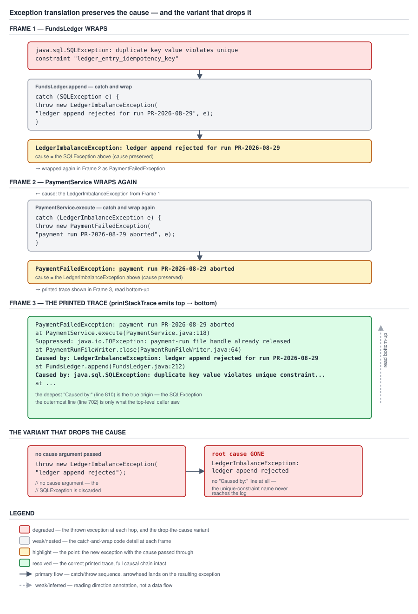

# 03 Java Core — Designing an exception hierarchy — INTERMEDIATE (§2.6, 2.6.6–2.6.10)

**Target version: Java 21 LTS.** | **Part 2 of 5** | [Index](../00-index.md)
Previous: [Checked exceptions and lambdas](02a-checked-exceptions-and-lambdas.md) · Next: [Exception cost and exceptions as control flow](02c-cost-and-control-flow.md)

Four leaves, and they are one design discipline seen from four angles: what to do at the moment a low-level failure crosses a boundary, how to shape the types that failure becomes, how to make sure the failure is checked for before it happens rather than discovered after, and how to make sure an object that fails is not left half-mutated. `01a-throwable-api-and-chaining.md` already gave you the mechanism — `getCause`, `initCause`, the `cause == this` sentinel, the two-constructor convention. `02-in-practice.md` already gave you the decision of *whether* an exception should be checked or unchecked, and the four-way choice between `IllegalArgumentException`, `IllegalStateException`, `NullPointerException` and a custom type. This file assumes both of those are settled and asks the next question: once you have decided a failure deserves its own type, how do you design the *hierarchy* it lives in, so that a `catch` clause somewhere upstream can say something true and useful about the category of failure it is looking at, rather than either nothing (one root exception for the whole application) or too much (one exception type per status code).

Everything below is measured against **Oracle JDK 21.0.7 (21.0.7+8-LTS-245, macOS aarch64)**; library source is quoted from that build's `lib/src.zip`, `java.base/java/util/Objects.java`. Compiled and run in a scratch directory under `/tmp/`.

---

## 1. Exception translation: wrap, and always preserve the cause (2.6.6)

The mental model: a boundary between two layers of a system is a place where one *vocabulary* stops and another starts. `FundsLedger` speaks JDBC — connections, statements, `SQLException`, SQL states. `PaymentService` speaks payments — reservations, insufficient funds, ledger imbalances. `StakeController` speaks HTTP — status codes, response bodies. Exception translation is the act of restating a failure in the vocabulary of the layer that is about to hand it to its own caller, at exactly the point where the vocabulary changes — and the one rule that makes translation safe rather than lossy is that the original exception rides along as the `cause`, so the vocabulary changes but nothing is thrown away.

### Why it exists

Without translation, a raw `SQLException` — or a raw `HttpClientErrorException`, or a raw `IOException` — leaks straight through every layer that happens to sit between where it was thrown and where a human eventually reads about it. That leak is not merely untidy. It couples every intermediate layer's public contract to an implementation detail none of those layers otherwise depends on: `StakeController`'s callers now indirectly know that `PaymentService` talks to something JDBC-shaped, and if `FundsLedger` is later rewritten against a different store, every signature that leaked the old exception type has to change. `01-basics.md` concept 2 already measured this specific leak, and `02-in-practice.md` concept 2 named it as one of the three costs that push modern practice toward unchecked exceptions. Translation is the fix: catch the low-level type at the boundary, throw a type that belongs to the *calling* layer's vocabulary instead.

But translation done carelessly creates a worse problem than the one it fixes, because a wrapped exception with no cause looks identical, from the outside, to a wrapped exception that preserved everything — until the one day someone needs the detail that was thrown away.

### When to reach for it, and when not

Reach for translation at every architectural boundary a failure crosses: persistence to domain, domain to another domain's client, domain to transport (HTTP, gRPC, a message queue). Do not reach for it *inside* a single layer's own internal call graph — a private helper method inside `FundsLedger` calling another private helper inside the same class has no boundary to cross, and wrapping there is ceremony with no payoff, just an extra frame for a reader to peel back for no information gained. The test is the same shape as `02-in-practice.md` concept 1's checked-versus-unchecked test: is the exception about to leave the vocabulary the layer it is currently expressed in.

Three failure modes to watch for, precisely, because each one has a specific symptom:

**Dropping the cause.** The translation happens, the new exception's message is built from `e.getMessage()`, but `e` itself is never passed to the new exception's constructor. The type changes, the message text survives in mangled form, and the original exception's type, fields and stack frames are all gone the instant the `catch` block exits. This is `01a`'s pitfall, restated at the design level: it is not a slip at one call site, it is what happens when the exception class chosen for the wrap has no `(String, Throwable)` constructor to pass the cause *to*.

**Translating too eagerly.** A `SQLException` becomes a domain exception at the very first layer that sees it — inside the DAO, before anything about *why* the SQL failed has been examined — and the domain exception is a flat, generic type with no way to distinguish "this was a duplicate key, retrying with a different idempotency key will work" from "this was a connection timeout, retrying the identical operation might work" from "this was a syntax error, retrying will never work." The retryability information that was sitting right there in the `SQLException`'s SQL state is thrown away at the first opportunity, and every layer above the DAO now has to treat every failure identically because the type system gives it nothing finer to branch on. `02-in-practice.md` concept 3 covers Spring's `SQLExceptionTranslator` as the fix for exactly this failure mode at the JDBC boundary — it translates late enough, and specifically enough, to preserve the distinction (`DuplicateKeyException` versus `CannotAcquireLockException`) rather than flattening everything into one generic wrapper.

**Translating too late.** The opposite failure: nothing translates the `SQLException` at all, and it — or a persistence-layer type built directly on top of it, such as a raw Hibernate `ConstraintViolationException` — reaches `StakeController`, which now has to either import a persistence-layer type into its own module (a dependency direction that should not exist) or catch it as `Exception` and lose all specificity. Translating too late is translating never, dressed up as deferral.

The correct boundary placement for the QuizStakes stack, worked through: `FundsLedger.append` is where JDBC ends and the ledger's own domain vocabulary begins, so it is where `SQLException` gets caught and `LedgerImbalanceException` gets thrown, with the `SQLException` as the cause. `PaymentService.execute` is where the ledger's vocabulary ends and the payment vocabulary begins, so it is where `LedgerImbalanceException` gets caught and `PaymentFailedException` gets thrown, with `LedgerImbalanceException` as the cause. `StakeController` is where the payment vocabulary ends and the HTTP contract begins — it does not translate again into a third exception type, it maps `PaymentFailedException` directly to a `ResponseEntity`, because a controller advice mapping exception types to HTTP status codes is itself the final translation, into a wire contract rather than another Java type. Two Java-to-Java translation hops, one Java-to-wire translation, and at every hop the cause travels with the exception.

### How it works

The mechanism is exactly `01a`'s two-constructor convention and `getCause()`/`initCause()`, applied at a boundary rather than described in the abstract — nothing new to verify here beyond what `01a` already measured. What is new is the shape of the *catch site* at a translation boundary: catch the specific low-level type (not `Exception`, per `01b-catch-multicatch-and-precise-rethrow.md`'s discipline), construct the new exception with both a message meaningful in the new vocabulary and the caught exception as the cause, and let it propagate — never swallow it, never log-and-continue at a translation point, because a translation boundary is not a top-level handler.



**D-082** — Three frames plus a degraded panel. Frame 1 shows the root `java.sql.SQLException` — naming the violated `ledger_entry_idempotency_key` constraint — thrown inside `FundsLedger.append` and immediately wrapped as `LedgerImbalanceException: ledger append rejected for run PR-2026-08-29`, cause attached. Frame 2 shows the second hop, `PaymentService.execute` catching that and wrapping again as `PaymentFailedException: payment run PR-2026-08-29 aborted`. Frame 3 renders the printed trace exactly as `printStackTrace` produces it, with a `Suppressed: java.io.IOException: payment-run file handle already released` entry attached to the outermost exception and an arrow marked **read bottom-up**, pointing at the root `SQLException` as the place a reader's eye should land first. The degraded panel beside it shows the drop-the-cause variant: the identical scenario, constructed with the single-argument constructor instead, printing no `Caused by:` line at all — labelled "root cause GONE."

### A concrete example

The three-hop translation, measured on JDK 21.0.7, cause preserved at every hop, plus a suppressed exception from a failed compensating cleanup at the outermost frame:

```java
public final class LedgerImbalanceException extends RuntimeException {
    public LedgerImbalanceException(String message, Throwable cause) { super(message, cause); }
    public LedgerImbalanceException(String message) { super(message); }
}

public final class PaymentFailedException extends RuntimeException {
    public PaymentFailedException(String message, Throwable cause) { super(message, cause); }
    public PaymentFailedException(String message) { super(message); }
}

public final class FundsLedger {
    public void append(LedgerEntry entry) {
        try {
            writeToStore(entry);
        } catch (SQLException e) {
            throw new LedgerImbalanceException("ledger append rejected for run PR-2026-08-29", e);
        }
    }

    private void writeToStore(LedgerEntry entry) throws SQLException {
        throw new SQLException(
            "duplicate key value violates unique constraint \"ledger_entry_idempotency_key\"");
    }
}

public final class PaymentService {
    private final FundsLedger fundsLedger;

    public PaymentService(FundsLedger fundsLedger) { this.fundsLedger = fundsLedger; }

    public void execute(LedgerEntry entry) {
        try {
            fundsLedger.append(entry);
        } catch (LedgerImbalanceException e) {
            PaymentFailedException toThrow = new PaymentFailedException(
                "payment run PR-2026-08-29 aborted", e);
            try {
                releasePaymentRunFileHandle();
            } catch (IOException fileFailure) {
                toThrow.addSuppressed(fileFailure);
            }
            throw toThrow;
        }
    }

    private void releasePaymentRunFileHandle() throws IOException {
        throw new IOException("payment-run file handle already released");
    }
}
```

Measured, printed with `printStackTrace()` on JDK 21.0.7:

```
Chain$PaymentFailedException: payment run PR-2026-08-29 aborted
	at Chain.controllerPost(Chain.java:28)
	at Chain.main(Chain.java:39)
	Suppressed: java.io.IOException: payment-run file handle already released
		at Chain.controllerPost(Chain.java:30)
		... 1 more
Caused by: Chain$LedgerImbalanceException: ledger append rejected for run PR-2026-08-29
	at Chain.execute(Chain.java:20)
	at Chain.controllerPost(Chain.java:26)
	... 1 more
Caused by: java.sql.SQLException: duplicate key value violates unique constraint "ledger_entry_idempotency_key"
	at Chain.append(Chain.java:13)
	at Chain.execute(Chain.java:18)
	... 2 more
```

Read bottom-up, exactly as the diagram's arrow says: the actual violated constraint is three lines from the bottom, `ledger_entry_idempotency_key`, which is the one fact that tells an on-call engineer this is a duplicate stake reservation rather than a generic outage. The suppressed `IOException` rides alongside the top-level exception without replacing it, because the file-handle cleanup failure and the payment failure are two independent facts, not one masking the other — `01c-try-with-resources-and-suppression.md` owns the mechanism that generates suppression automatically inside try-with-resources; this is the same API used by hand at an ordinary `catch` block.

**The same scenario with the cause dropped at the translation point**, constructed with the single-argument constructor and the `SQLException`'s message hand-folded into the new message string instead:

```java
public final class LedgerImbalanceException extends RuntimeException {
    public LedgerImbalanceException(String message) { super(message); }
}

public void append(LedgerEntry entry) {
    try {
        writeToStore(entry);
    } catch (SQLException e) {
        throw new LedgerImbalanceException(
            "ledger append rejected for run PR-2026-08-29: " + e.getMessage());
    }
}
```

Measured:

```
ChainDropped$LedgerImbalanceException: ledger append rejected for run PR-2026-08-29: duplicate key value violates unique constraint "ledger_entry_idempotency_key"
	at ChainDropped.execute(ChainDropped.java:14)
	at ChainDropped.main(ChainDropped.java:18)
```

No `Caused by:` block, anywhere. The constraint name happens to still be readable this one time, because it was folded into a string — but the exception's *type* information is gone (nothing downstream can `catch (SQLException e)` or inspect `getSQLState()`), every frame of where the SQL statement actually executed is gone, and the next engineer to touch this code has no way to tell, from the type alone, that this was ever a JDBC failure at all.

### The gotcha

**Pitfall:** translating at the DAO layer using a single generic exception type for every `SQLException`, on the theory that "the domain doesn't care about JDBC details." The domain does not care about JDBC *as a concept*, but it frequently cares about the *category* of failure JDBC is reporting, because different categories warrant different responses — retry, do-not-retry, surface-to-user, page-an-operator. Symptom: every `FundsLedger` failure surfaces as the same `LedgerImbalanceException`, and `PaymentService` has no way to decide whether to retry a transient lock timeout differently from a permanent constraint violation, short of parsing the message string — which is exactly the string-matching anti-pattern `02-in-practice.md` concept 3 already rejected at the Spring layer. Fix: let the translation preserve *enough* type information for the caller's real decisions — either by using Spring's translated hierarchy (`DuplicateKeyException` versus `CannotAcquireLockException`) directly as input to the domain translation, or by giving the domain exception itself a field carrying the distinction, which is exactly concept 2's data-as-fields rule, applied one layer earlier.

> **Definition.** Exception translation is catching a failure expressed in one layer's vocabulary and re-throwing it expressed in the calling layer's vocabulary, at the exact point the vocabulary changes — correct translation always passes the caught exception as the new exception's cause, translates neither before the failure's category is known (too eager, loses retryability information) nor after the wrong vocabulary has already leaked past the boundary (too late), and never happens more than once per real boundary crossed.

---

## 2. Designing the hierarchy: one base per bounded context (2.6.7) `[BUILD]`

The mental model: an exception hierarchy is an API a `catch` clause consumes, and like any API it can be too coarse to be useful, too fine to be usable, or shaped correctly. Too coarse is one root exception for the whole application — `catch (QuizStakesException e)` catches everything and tells the reader nothing about *what kind* of everything. Too fine is one exception type per status code — dozens of one-off classes, `catch` clauses that have to enumerate them all to express a category, and a hierarchy nobody can hold in their head. Correct is one abstract base per **bounded context** — funds, compliance, lifecycle, bonus — with concrete leaf types beneath each base carrying the data a caller actually needs.

### Why it exists

A hierarchy exists to answer one question well: *what can a caller usefully catch?* A `catch` clause is a promise — "I know how to handle everything of this type and everything beneath it" — and the hierarchy's shape determines whether that promise can be kept at a sensible grain. If the only options are "catch this one exact leaf type" and "catch literally everything," every caller that wants to act on a *category* of failure ("anything to do with money," "anything the client can retry after fixing something") has no type to write in the `catch` clause and has to fall back to `instanceof` chains or string matching — precisely the discipline `01b-catch-multicatch-and-precise-rethrow.md` argues against.

### When to reach for each shape, and when not

Three exception-hierarchy shapes exist in practice, and only one of them is right for QuizStakes.

| Shape | What a caller can catch | QuizStakes example | Verdict |
|---|---|---|---|
| One root for everything (`QuizStakesException`) | Everything, indiscriminately, or one exact leaf — nothing in between | `catch (QuizStakesException e)` catches `InsufficientFundsException`, `IllegalTransitionException` and a ledger imbalance identically | Anti-pattern: the category information a caller actually wants ("is this a funds problem or a compliance problem") does not exist as a type |
| One base per bounded context | The exact leaf, or its entire category (`FundsException`, `ComplianceException`, `LifecycleException`, `BonusException`) | `catch (FundsException e)` catches `InsufficientFundsException` and `LedgerImbalanceException` together, without also catching `RestrictedActionException` | Correct shape for QuizStakes — matches the grain callers actually reason at |
| One type per error code (`WealthRejectedException`, `ScreeningProhibitedException`, `DocumentsExhaustedException`, …) | The exact leaf only, for every one of dozens of codes | A `catch` clause wanting "anything the compliance team should see" has to enumerate every one of QuizStakes's dozens of `AA-`/`AO-` codes by hand | Anti-pattern: the hierarchy is as flat as no hierarchy at all, just with more class files |

Reach for **one base per bounded context** as the default for any QuizStakes service exposing more than one or two exception types. Reach for a single concrete type with no base at all only when a bounded context genuinely has exactly one failure mode worth naming — premature to build a base class for a category of one. Never reach for one root exception for the whole application, and never reach for one type per status code; both fail the same test (what can a caller usefully catch) from opposite directions.

**One base per bounded context, worked through.** `FundsException` is the base for `InsufficientFundsException` and `LedgerImbalanceException` — both are about money not being where it should be, and a caller such as a reconciliation job wants to catch "any funds problem" without also catching a compliance restriction. `ComplianceException` is the base for `RestrictedActionException` — a caller such as a compliance dashboard wants to catch every restriction-driven rejection without also catching a lifecycle error. `LifecycleException` is the base for `IllegalTransitionException` — a caller such as `AccountActivation`'s own error handling wants to catch every illegal-transition failure across every status machine QuizStakes has (application, account, restriction, document requirement, bonus) without also catching a funds problem. `BonusException` is the base for `BonusIneligibleException` — a caller such as the promotions team's alerting wants to catch every bonus-eligibility rejection without also catching an unrelated funds shortfall. What each base earns, stated plainly: a caller one level above where the exception is thrown can write exactly one `catch` clause for "the category of thing I know how to act on," rather than a clause per leaf type or a clause that also lets through failures it has no business handling.

**Data as fields, not formatted into the message.** The wrong form bakes every fact into a string at construction time:

```java
throw new InsufficientFundsException(
    "client " + clientId + " has " + available + " needs " + required);
```

which reads fine in a log line and is useless everywhere else: a `@ControllerAdvice` handler that wants to build a structured JSON error body has to parse the message string back apart to recover `clientId`, `available` and `required` — which is fragile the moment the message wording changes, and `02d-logging-and-api-boundaries.md` covers exactly this consumer. A metric wanting to tag by shortfall band (`available` minus `required`, bucketed) has nothing to compute against except a string. A test wanting to assert "this failed because of an insufficient balance of at least 1.80" has to match a substring of prose instead of comparing a `Money` value, which `02e-resources-interrupts-and-testing.md` covers as the concrete payoff. The right form carries the data as fields and composes `getMessage()` from them:

```java
public final class InsufficientFundsException extends FundsException {
    private final ClientId clientId;
    private final Money available;
    private final Money required;

    public InsufficientFundsException(ClientId clientId, Money available, Money required) {
        super(null);
        this.clientId = Objects.requireNonNull(clientId, "clientId must not be null");
        this.available = Objects.requireNonNull(available, "available must not be null");
        this.required = Objects.requireNonNull(required, "required must not be null");
    }

    public ClientId clientId() { return clientId; }
    public Money available() { return available; }
    public Money required() { return required; }

    @Override
    public String getMessage() {
        return "client " + clientId + " has " + available.amount() + " " + available.currency()
            + " available, needs " + required.amount() + " " + required.currency();
    }
}
```

`getMessage()` is overridden rather than composed once in the constructor and stored, and that is deliberate: the constructor cannot call an overridable instance method safely before the fields it depends on are assigned (a `final` field read from an overridden `getMessage()` called during construction would see the field's default value, not what the constructor is about to set), so `getMessage()` is computed lazily from fields that are guaranteed initialized by the time anything calls it, and `super(null)` leaves `Throwable`'s own `detailMessage` field unused entirely — the fields are the single source of truth, not a cached string alongside them.

Two constraints keep this pattern honest, and both are costs, not free wins. First, **the fields must be immutable** — `ClientId`, `Money` are both records, and a mutable field on an exception is a mutable object floating around a stack unwind, readable by every frame that catches it, which is a well-known source of action-at-a-distance bugs if anything downstream ever thinks it owns a private copy. Second, **`getMessage()` must not be able to throw.** A `getMessage()` computed from fields that are themselves guaranteed non-null by constructor validation (the `Objects.requireNonNull` calls above) cannot throw a `NullPointerException` when called later — but a `getMessage()` that, say, formats a `Money` value through a locale-sensitive formatter that itself can throw on a bad `Currency` would be catastrophic exactly where it matters least: inside a logging call, inside a `catch` block, inside the code path that is trying to report a failure. An exception whose own message-rendering throws a second exception is the single hardest failure mode to diagnose in a production system, because the original failure's information is gone and the new failure's stack trace points at logging code, not business logic.

**No exception per error code.** QuizStakes has dozens of status codes — `AO-149 WEALTH_REJECTED`, `AA-599 SCREENING_PROHIBITED`, `AA-699 DOCUMENTS_EXHAUSTED`, and every other `AO-`/`AA-` code in the catalogue. Modelling each as its own exception type (`WealthRejectedException`, `ScreeningProhibitedException`, `DocumentsExhaustedException`, …) produces a hierarchy with the width of the status-code list and none of its structure — a caller wanting "anything the compliance team should be alerted about" cannot write one `catch` clause for that, because the codes that matter to compliance are scattered across dozens of unrelated leaf types with nothing connecting them except convention. The right shape is one exception type **per category of caller response**, carrying the `StatusCode` as a field so the specific code is still recoverable without being baked into the type system:

```java
public record StatusCode(String domain, int phase, int disposition, String variant) {
    public String display() { return domain + "-" + phase + disposition + "0" + " " + variant; }
}

public final class BonusIneligibleException extends BonusException {
    private final StatusCode statusCode;

    public BonusIneligibleException(StatusCode statusCode) {
        super(null);
        this.statusCode = Objects.requireNonNull(statusCode, "statusCode must not be null");
    }

    public StatusCode statusCode() { return statusCode; }

    @Override
    public String getMessage() {
        return "bonus ineligible: " + statusCode.display();
    }
}
```

Measured, constructing `new BonusIneligibleException(new StatusCode("AA", 5, 9, "SCREENING_PROHIBITED"))` and calling `getMessage()` produced `bonus ineligible: AA-599 SCREENING_PROHIBITED` — one exception type, carrying any of the compliance-domain codes as data, rather than one type per code.

**Every custom exception needs both constructors.** `01a`'s convention applies without exception here: `(String message)` for the rare leaf that genuinely has no cause to attach, `(String message, Throwable cause)` for every leaf that translates a lower-level failure per concept 1. `IllegalTransitionException` above only needs the first, because a status-machine transition rejection is discovered directly, not caught from something lower; `LedgerImbalanceException` needs both, because it is sometimes thrown directly (an in-memory balance check failing) and sometimes as a translation of a caught `SQLException`.

**The four-argument constructor, named but deferred.** `01a` covers `protected Throwable(String, Throwable, boolean, boolean)` in full — `writableStackTrace = false` is the option worth naming here because it interacts directly with hierarchy design: a domain exception thrown at very high frequency (a repeated, expected rejection rather than a rare failure) is a candidate for skipping stack-trace capture entirely, at the cost `02c-cost-and-control-flow.md` measures precisely; this file names the option, that file prices it.

**Whether to make a domain exception `abstract`.** `FundsException`, `ComplianceException`, `LifecycleException` and `BonusException` above are all declared `abstract` — deliberately, because a base that exists purely to be caught, never to be thrown directly, should not be constructible as a bare instance. A bare `throw new FundsException("something about money went wrong")` with no more specific type is exactly the coarse-grained failure the whole hierarchy exists to avoid, and making the base `abstract` turns that mistake into a compile error rather than a code-review finding. The one exception to this rule: a base with genuinely no useful specialization yet, where a caller needs the category to exist as a catchable type today even though no second leaf exists yet — in that narrow case, a concrete base is a temporary, explicitly-noted debt, not a design choice to repeat.

**Exceptions cannot be records.** Worth one line, because Java 21's record syntax is otherwise the obvious-looking tool for "a small immutable class carrying a few named fields" — exactly the shape `InsufficientFundsException` has. A record cannot extend a class (it implicitly extends `java.lang.Record`, and Java has no multiple class inheritance), and every exception must extend `Throwable` — so an exception can never be a record, however record-shaped its data. `records-and-sealed/01-basics.md` owns records and sealed types in full; the plain classes with explicit fields above are not a stylistic choice, they are the only option.

**The serialization consideration.** An exception that crosses a process boundary (a remote call, an RPC framework, a message queue payload) may need to be `Serializable` — `Throwable` itself already implements `Serializable`, so every custom exception is serializable by default whether or not that was intended. A `Serializable` class without an explicit `serialVersionUID` gets one computed from its structure at serialization time, which means adding a field (exactly what concept 2's data-as-fields pattern encourages) can silently change the computed UID and break deserialization of any already-serialized instance from before the change. `../serialization/02-serialization.md`, a later batch, owns `Serializable` and `serialVersionUID` in full; the actionable note here is that a domain exception carrying fields per this concept's own recommendation should declare an explicit `serialVersionUID` the moment it is ever expected to cross a process boundary, precisely because the fields that make it useful are the same fields that make its serialized shape brittle.

### How it works

The mechanism is ordinary single-inheritance class design — nothing about exceptions changes how `abstract`, `extends`, or constructor chaining behave — so "how it works" here is the design consequence rather than a runtime mechanism: a caller's `catch (FundsException e)` matches any subtype of `FundsException` by the JVM's ordinary `instanceof`-based exception-table matching (the same mechanism `01b` covers for multi-catch), which is what makes "catch the category" and "catch the leaf" both expressible from the identical hierarchy with no extra machinery — the entire cost of getting the grain right is paid once, at design time, in how the classes are arranged.

### A concrete example

The complete, compiling hierarchy, `[BUILD]` — every base, every leaf named in the row above, real generics, no sketch:

```java
import java.math.BigDecimal;
import java.util.Objects;
import java.util.UUID;

public record ClientId(UUID value) {
    public ClientId { Objects.requireNonNull(value, "value must not be null"); }
    @Override public String toString() { return value.toString(); }
}

public enum Currency { GBP }

public record Money(BigDecimal amount, Currency currency) {
    public Money {
        Objects.requireNonNull(amount, "amount must not be null");
        Objects.requireNonNull(currency, "currency must not be null");
    }
}

public enum RestrictionType { STAKE_BLOCKED, DEPOSIT_BLOCKED, WITHDRAWAL_BLOCKED }

public record StatusCode(String domain, int phase, int disposition, String variant) {
    public String display() { return domain + "-" + phase + disposition + "0" + " " + variant; }
}

// --- one base per bounded context ---

public abstract class FundsException extends RuntimeException {
    protected FundsException(String message) { super(message); }
    protected FundsException(String message, Throwable cause) { super(message, cause); }
}

public final class InsufficientFundsException extends FundsException {
    private final ClientId clientId;
    private final Money available;
    private final Money required;

    public InsufficientFundsException(ClientId clientId, Money available, Money required) {
        super(null);
        this.clientId = Objects.requireNonNull(clientId, "clientId must not be null");
        this.available = Objects.requireNonNull(available, "available must not be null");
        this.required = Objects.requireNonNull(required, "required must not be null");
    }

    public ClientId clientId() { return clientId; }
    public Money available() { return available; }
    public Money required() { return required; }

    @Override
    public String getMessage() {
        return "client " + clientId + " has " + available.amount() + " " + available.currency()
            + " available, needs " + required.amount() + " " + required.currency();
    }
}

public final class LedgerImbalanceException extends FundsException {
    public LedgerImbalanceException(String message, Throwable cause) { super(message, cause); }
    public LedgerImbalanceException(String message) { super(message); }
}

public abstract class ComplianceException extends RuntimeException {
    protected ComplianceException(String message) { super(message); }
    protected ComplianceException(String message, Throwable cause) { super(message, cause); }
}

public final class RestrictedActionException extends ComplianceException {
    private final RestrictionType type;

    public RestrictedActionException(ClientId clientId, RestrictionType type) {
        super(null);
        Objects.requireNonNull(clientId, "clientId must not be null");
        this.type = Objects.requireNonNull(type, "type must not be null");
    }

    public RestrictionType type() { return type; }

    @Override
    public String getMessage() { return "restricted action blocked by " + type; }
}

public abstract class LifecycleException extends RuntimeException {
    protected LifecycleException(String message) { super(message); }
}

public final class IllegalTransitionException extends LifecycleException {
    public IllegalTransitionException(String fromStatus, String toStatus) {
        super("cannot transition from " + fromStatus + " to " + toStatus);
    }
}

public abstract class BonusException extends RuntimeException {
    protected BonusException(String message) { super(message); }
    protected BonusException(String message, Throwable cause) { super(message, cause); }
}

public final class BonusIneligibleException extends BonusException {
    private final StatusCode statusCode;

    public BonusIneligibleException(StatusCode statusCode) {
        super(null);
        this.statusCode = Objects.requireNonNull(statusCode, "statusCode must not be null");
    }

    public StatusCode statusCode() { return statusCode; }

    @Override
    public String getMessage() { return "bonus ineligible: " + statusCode.display(); }
}
```

Measured, compiling and running against JDK 21.0.7:

```
client 9f2c4a1b-e88d-4e91-a7fa-11ab22cc33dd has 3.20 GBP available, needs 5.00 GBP
caught as FundsException: InsufficientFundsException
bonus ineligible: AA-599 SCREENING_PROHIBITED
```

The middle line is the entire point of the hierarchy: `try { throw ife; } catch (FundsException e) { … }` caught `InsufficientFundsException` through its category base with no knowledge of the leaf type, and would catch `LedgerImbalanceException` through the identical `catch` clause without change.

### The gotcha

**Insight:** the four bases are not arbitrary groupings, they mirror QuizStakes's own bounded contexts as stated in the domain vocabulary — funds, compliance, lifecycle, bonus are the same divisions `FundsLedger`/`PaymentService`, `ClientRestrictions`/`ScreeningService`, `AccountActivation`/`ApplicationHistory`, and `BonusService` already draw between themselves. A hierarchy that mirrors the service boundaries a system already has is far more durable than one invented independently, because a new exception type almost always belongs to whichever bounded context the service throwing it already belongs to, and the question "which base does this extend" answers itself rather than needing a fresh design decision every time.

**Pitfall:** designing the hierarchy around *technical* categories (`ValidationException`, `PersistenceException`, `TimeoutException`) rather than *domain* categories. A technical taxonomy groups exceptions by how they were detected, not by what a caller can do about them — a caller catching `PersistenceException` learns nothing about whether the underlying problem is a funds shortfall or a bonus-eligibility rejection, both of which might happen to have been detected by a failed database write. The fix is the same test used throughout this file: ask what a caller one layer up wants to *act on*, and that is almost always a domain concept (funds, compliance, lifecycle, bonus), not a mechanism (validation, persistence, network).

> **Definition.** A well-designed exception hierarchy has exactly one abstract base per bounded context, carries the data a caller needs as immutable fields rather than folded into a formatted message, and never has more than one concrete leaf type per distinct *category of caller response* — a status code, or any other fine-grained discriminator, belongs inside a leaf as a field, not as the leaf's own type.

---

## 3. `Objects.requireNonNull` and fail-fast (2.6.9)

The mental model: a bug found the moment it happens, at the exact line that would have caused it, with the exact parameter named, is cheap. The same bug found three calls later, as a `NullPointerException` on some unrelated field access with no indication of which of five constructor parameters was actually the null one, is expensive — the cost did not go away, it moved downstream and multiplied. Fail-fast is choosing to pay the cheap version, on purpose, at the boundary where a bad value first enters your code.

### Why it exists

Every public method and every constructor is a contract: the caller supplies arguments, the method promises a result given those arguments meet its preconditions. A method that does not check its preconditions does not avoid the cost of a violated precondition — it defers it, to whichever line happens to dereference the bad value first, which is rarely the line that would tell a reader anything useful about what went wrong. `Objects.requireNonNull`, added in **Java 7**, exists to make the cheap version a one-line habit rather than a hand-written `if` block repeated with subtly different wording at every call site.

### When to reach for it, and when not

Reach for `requireNonNull` at **public API boundaries and in constructors that store the reference** — anywhere a caller outside your own tight control can hand you a null, and anywhere a null stored now becomes a null read much later by code that has forgotten where it came from. Do not reach for it on every parameter of every private method: a `requireNonNull` on every parameter of every method, public and private alike, is noise — a private helper called only from three call sites you wrote yourself, all of which are already known not to pass null, gains nothing from the check except a line that a reader has to confirm is not protecting against something real. The counterweight is explicit: fail-fast bought indiscriminately costs readability, and a codebase where every method opens with five `requireNonNull` calls trains readers to skip past all of them, including the one that actually mattered.

### How it works

Quoted in full from JDK 21.0.7's `lib/src.zip`, `java.base/java/util/Objects.java`, both overloads named in the leaf:

```java
public static <T> T requireNonNull(T obj) {
    if (obj == null)
        throw new NullPointerException();
    return obj;
}

public static <T> T requireNonNull(T obj, String message) {
    if (obj == null)
        throw new NullPointerException(message);
    return obj;
}
```

Both **Java 7**. Every line matters. The generic `<T>` return type means `requireNonNull` can sit directly inside an assignment or a field initializer — `this.clientId = Objects.requireNonNull(clientId, "clientId must not be null");` both validates and assigns in one expression, which is why it composes so well inside a constructor body. The two-argument overload's `message` parameter is not decoration: without it, the `NullPointerException` thrown points at the line inside `requireNonNull` (or, for the JVM's own helpful-NPE inference since **Java 15**, at the dereferencing expression) but says nothing about *which* of a constructor's several parameters was the null one — a constructor taking `(ClientId clientId, Money available, Money required)` that calls `Objects.requireNonNull` three times with no message on any of them produces three identical, useless `java.lang.NullPointerException` stack traces distinguishable only by which line number threw. The message is the entire value of choosing this call over a bare null check.

The `Supplier<String>` overload, quoted:

```java
public static <T> T requireNonNull(T obj, Supplier<String> messageSupplier) {
    if (obj == null)
        throw new NullPointerException(messageSupplier == null ?
                                       null : messageSupplier.get());
    return obj;
}
```

**Java 8** (`@since 1.8`, confirmed against the same source file), added specifically so the message string is not built when the check passes — the common case — deferring the cost of message construction to the rare case where it is actually needed. The JDK's own Javadoc, quoted, states the trade-off precisely: this "may confer a performance advantage in the non-null case," but "the costs of creating the message supplier are less than the cost of just creating the string message directly" should hold before reaching for it — a plain string concatenation is cheap enough that the supplier overload is worth reaching for only when the message construction itself is expensive (formatting a large object graph, say), not as a default habit over the simpler two-argument form.

`Objects.checkIndex(int, int)` and the sibling `checkFromToIndex`/`checkFromIndexSize`, `@since 9` — confirmed in the same source file — are the identical idea applied to bounds rather than nullity: a single call that both validates and, on failure, throws an `IndexOutOfBoundsException` naming the index and the bound, replacing a hand-written `if (index < 0 || index >= length) throw new IndexOutOfBoundsException(…)` the same way `requireNonNull` replaces a hand-written null check.

Fail-fast generalizes past nullity to any precondition, and the sharpest QuizStakes case is validating at construction so an invalid object cannot exist at all: `StakeSplit`'s invariant — the two portions sum exactly to the stake — is enforced in the constructor, not checked later by every consumer of a `StakeSplit`:

```java
public record StakeSplit(Money bonusPortion, Money cashPortion) {
    public StakeSplit {
        Objects.requireNonNull(bonusPortion, "bonusPortion must not be null");
        Objects.requireNonNull(cashPortion, "cashPortion must not be null");
    }

    public static StakeSplit of(Money stake, Money bonusAvailable) {
        BigDecimal tenPercent = stake.amount().multiply(new BigDecimal("0.10"));
        BigDecimal bonusPortionAmount = tenPercent.min(bonusAvailable.amount())
            .setScale(2, RoundingMode.DOWN);
        BigDecimal cashPortionAmount = stake.amount().subtract(bonusPortionAmount);
        return new StakeSplit(new Money(bonusPortionAmount, stake.currency()),
            new Money(cashPortionAmount, stake.currency()));
    }
}
```

The canonical rounding case, measured on JDK 21.0.7: a stake of **3.33** with **0.33** bonus available splits as **bonus=0.33, cash=3.00** — the bonus portion (`min(0.333, 0.33)` rounded **down** to two decimal places per the domain's rounding rule) takes exactly what is available, and the cash portion absorbs the remainder by subtraction rather than by its own independent computation, which is what *guarantees* the invariant holds: `cashPortionAmount` is defined as `stake.amount().subtract(bonusPortionAmount)`, so the two can never fail to sum to the stake, by construction, rather than by a separate check verifying they happen to. A `StakeSplit` built any other way — computing both portions independently and hoping the rounding lines up — is the version that needs a runtime invariant check; deriving one portion from the other needs none, which is the stronger form of fail-fast: making the invalid state *unconstructible* rather than merely *detected*.

### The diagram

No diagram for this concept: the evidence is two quoted one-line method bodies, a measured constructor invariant, and one worked rounding example — a picture of "if null then throw" would repeat the quoted source with boxes around it.

### A concrete example

`Objects.requireNonNull` at the top of a public method, alongside an argument-range check that has no JDK helper because it is domain-specific rather than a bound on an index:

```java
public final class BonusService {
    public Bonus grant(ClientId clientId, Money deposit, String couponCode) {
        Objects.requireNonNull(clientId, "clientId must not be null");
        Objects.requireNonNull(deposit, "deposit must not be null");
        Objects.requireNonNull(couponCode, "couponCode must not be null");
        if (deposit.amount().signum() <= 0) {
            throw new IllegalArgumentException("deposit must be positive: " + deposit.amount());
        }
        return doGrant(clientId, deposit, couponCode);
    }

    private Bonus doGrant(ClientId clientId, Money deposit, String couponCode) {
        return new Bonus(clientId, deposit, couponCode);
    }

    public record Bonus(ClientId clientId, Money deposit, String couponCode) {}
}
```

Three `requireNonNull` calls for the three reference-typed parameters, in the order the parameters are declared — a convention worth keeping consistently, because a stack trace naming `"deposit must not be null"` is only immediately useful if the reader can trust the checks run top to bottom in declaration order, rather than having to scan the whole method to find which check actually threw. The positive-amount check is not a null check and has no `Objects` helper — fail-fast is the discipline of checking every precondition at the boundary, of which nullity is only the most common instance.

### The gotcha

**Pitfall:** believing `Objects.requireNonNull(clientId)` (no message) is equivalent to writing the message by hand later. It compiles, and it does throw `NullPointerException` — but the single-argument overload's thrown exception has `getMessage() == null`, which since **Java 14** (JEP 358, helpful NPE messages, on by default) is usually rescued by the JVM's own inferred message at the *point of dereference* rather than the point of the failed check — but only if the null value is dereferenced immediately in a way the JVM can describe; `Objects.requireNonNull(obj)` used purely for its side effect, with the returned value discarded, produces a bare `java.lang.NullPointerException` with no message and no helpful inference to fall back on, because there is no dereferencing bytecode instruction for the JVM's message generator to describe. Fix: always supply the two-argument form's message (or the `Supplier<String>` form when the message itself is expensive to build), naming the parameter, rather than relying on inference that only sometimes applies.

> **Definition.** `Objects.requireNonNull(T obj, String message)` — Java 7 — throws `NullPointerException(message)` if `obj` is null and returns `obj` otherwise, letting a null check compose directly into an assignment; the `Supplier<String>` overload — Java 8 — defers message construction to the failing case only; `Objects.checkIndex`/`checkFromToIndex` — Java 9 — are the same idea for bounds; and fail-fast as a discipline means validating at construction, at public boundaries, so an invalid object cannot exist rather than merely being caught later — while a `requireNonNull` on every private-method parameter regardless of whether a null could plausibly arrive there is a readability cost with no matching safety gain.

---

## 4. Failure atomicity: an object must be usable after a failed operation (2.6.10)

The mental model: an operation that mutates an object should behave like a single indivisible step from the object's own point of view — either it fully happens, or nothing about the object's visible state changes at all. An object left in a state where *part* of an operation applied and the rest did not is not merely wrong, it is a state nothing in the type's own contract describes, which means every other method on that object is now operating on an input its author never designed for.

### Why it exists

At 2.8M stake reservations a day, a `Reservation.apply(StakeSplit)` that partially debits — bonus successfully reduced, then a failure before the cash side is touched — leaves an object where `bonusAvailable + cashAvailable` no longer equals what it should, for a reservation that the caller was told, via the thrown exception, never happened. If nothing catches this at the object level, that gap becomes a real ledger imbalance the moment anything downstream trusts the object's post-failure state — a reconciliation job summing balances across all 2.4M registered clients would find a discrepancy with no corresponding transaction to explain it, days or weeks after the code that caused it ran, exactly the delayed-discovery pattern `01a` describes for a dropped cause.

### When to reach for it, and when not

Failure atomicity matters for every mutable object whose invariants are relied on by code other than the operation that just failed — which in QuizStakes is essentially every aggregate carrying money or state (`Reservation`, `Account`, `Restriction`, `Position`). It matters less for an object that is discarded immediately after a failed operation regardless (a short-lived builder whose only possible next step, on failure, is to be thrown away and rebuilt from scratch) — atomicity is a cost worth paying for objects with a life beyond the failing call, and a smaller concern for ones that do not.

### How it works

Four techniques, each real QuizStakes code, in the order to reach for them — earlier techniques are cheaper and should be preferred when they apply.

| Technique | What it does | QuizStakes example | When it applies |
|---|---|---|---|
| Check parameters before mutating | Validate every precondition first; mutate only once nothing can fail | `Reservation.apply` checking `cashAvailable` before touching either bucket | Whenever every failure-prone check can run before any mutation starts |
| Order the failure-prone part before any mutation | If a check cannot be separated from doing the work, do the risky part first, store its result, then mutate | A network call whose result is needed to know how much to debit — call it, hold the result, then mutate | When the risky step produces a value the mutation needs, so it cannot be a pure up-front check |
| Operate on a copy, then swap | Build the new state in a fresh object; only replace the original reference once the new state is fully built | Building `nextBonus`/`nextCash` locals, assigning both fields only after both computations succeeded | When mutation itself might partially fail partway through (multiple fields, no way to order around it) |
| Recovery / rollback path | When none of the above apply, catch the failure and explicitly undo whatever succeeded before re-throwing | A `PaymentRun` step that already wrote a provisional ledger row before a later step fails, explicitly reversing that row in a `catch` before propagating | Multi-step operations spanning more than one object or one call, where up-front checks and copy-and-swap cannot cover the whole span |

**Check parameters before mutating** and **copy-and-swap** are shown together in the QuizStakes example below because `Reservation.apply` needs both: the cash check is a pure precondition (technique 1), and the actual debiting of two fields is done via locals swapped in together at the end (technique 3), so that even if a defensive change later reordered the two field assignments, neither one alone is ever visible without the other.

The failure, concretely — `Reservation.apply` that debits bonus first, then discovers the cash side is short:

```java
public final class ReservationBroken {
    private Money bonusAvailable;
    private Money cashAvailable;

    public ReservationBroken(Money bonusAvailable, Money cashAvailable) {
        this.bonusAvailable = bonusAvailable;
        this.cashAvailable = cashAvailable;
    }

    public void apply(StakeSplit split) {
        bonusAvailable = bonusAvailable.minus(split.bonusPortion()); // mutates first
        if (cashAvailable.lessThan(split.cashPortion())) {
            throw new InsufficientFundsException("cash available " + cashAvailable.amount()
                + " short of required " + split.cashPortion().amount());
        }
        cashAvailable = cashAvailable.minus(split.cashPortion());
    }
}
```

Measured, on JDK 21.0.7, staking a **3.33** split (bonus **0.33**, cash **3.00** per concept 3's canonical example) against a reservation holding **0.33** bonus available and only **1.00** cash available:

```
broken threw: cash available 1.00 short of required 3.00
broken post-failure: bonusAvailable=0.00 cashAvailable=1.00
```

`InsufficientFundsException` was thrown, correctly — the stake should have been rejected. But `bonusAvailable` is now **0.00**, down from 0.33, even though the entire reservation failed and the caller was told, via the exception, that nothing happened. The 0.33 is not in `cashAvailable` either — it is simply gone from the object's visible state, present nowhere, which is a ledger imbalance the instant anything sums this client's total balance and compares it against the ledger's own record of what should be there.

The fixed version — check the cash precondition first, compute both next-states as locals, assign both only once neither computation can fail:

```java
public final class ReservationFixed {
    private Money bonusAvailable;
    private Money cashAvailable;

    public ReservationFixed(Money bonusAvailable, Money cashAvailable) {
        this.bonusAvailable = bonusAvailable;
        this.cashAvailable = cashAvailable;
    }

    public void apply(StakeSplit split) {
        if (cashAvailable.lessThan(split.cashPortion())) {
            throw new InsufficientFundsException("cash available " + cashAvailable.amount()
                + " short of required " + split.cashPortion().amount());
        }
        Money nextBonus = bonusAvailable.minus(split.bonusPortion());
        Money nextCash = cashAvailable.minus(split.cashPortion());
        bonusAvailable = nextBonus;
        cashAvailable = nextCash;
    }
}
```

Measured, identical inputs:

```
fixed threw: cash available 1.00 short of required 3.00
fixed post-failure: bonusAvailable=0.33 cashAvailable=1.00
```

`bonusAvailable` is untouched at **0.33** — the exact value it held before the call — because the precondition check ran before either local was computed, and even the local computation itself was ordered so that both fields are written only in the last two lines, together, with nothing failure-prone between them. An object caught mid-`apply` by a debugger, or inspected by any other thread with a visible happens-before edge, sees either the state before the call or the state after a fully successful call — never a state describing half a reservation.

### The diagram

No diagram for this concept: the evidence is two measured before/after object states differing in exactly one field, and the four-technique table above — a picture of "field debited, then exception, then field still debited" is the printed numbers themselves, not a rendering that needs a separate figure.

### A concrete example

Already given above, in full: `ReservationBroken` and `ReservationFixed`, both measured, differing only in the order of the mutation relative to the check — which is the entire lesson of technique 1 and technique 3 applied together.

### The gotcha

**Pitfall:** believing failure atomicity is achieved by wrapping the whole method body in a `try`/`catch` that logs and rethrows. A `catch` block that only logs and rethrows does not undo anything — it observes the failure after the damage (if any) is already done, and re-throwing the identical exception gives a caller no reason to suspect the object's state changed. Failure atomicity has to be designed into the *order of operations before the throw*, not bolted on as exception handling after it; a `try`/`catch` is the right tool only for technique 4 (an explicit rollback), where something has to be actively undone, and it is the wrong tool for techniques 1 through 3, where the goal is to arrange the code so nothing ever needs undoing.

**Interview:** "What does failure atomicity mean, and how do you achieve it without a full transaction?" The one-line answer: an object's visible state after a failed operation must be identical to its state before the operation started, achieved by validating everything that can fail before mutating anything, or by computing all of the new state into local variables and only assigning it in a final step nothing between the check and the assignment can fail.

**The one honest limit.** Failure atomicity is a property of *the object*, not a property of the system. `ReservationFixed.apply` leaving the in-memory `Reservation` object correctly unchanged says nothing about whether a partially-committed database write, or a partially-applied change to a *different* aggregate the same business operation touches, is also rolled back — that is a transaction's job, spanning storage rather than a single object's fields, and it is a different mechanism entirely. Guide 09 (SQL databases) covers transactions and isolation directly; Guide 08 (Spring Data JPA) covers `@Transactional` and how Spring demarcates a transaction boundary around a service method. An `apply` method that is failure-atomic in memory but called from inside a JPA-managed transaction still needs that transaction to roll back correctly on the same exception, or the in-memory correctness bought here does not survive a crash between the object mutation and the database commit — the two mechanisms solve adjacent but distinct problems, and neither substitutes for the other.

> **Definition.** Failure atomicity means an object throwing an exception from a mutating method leaves that object's visible state exactly as it was before the call — achieved, in order of preference, by validating every precondition before any mutation, by doing the failure-prone part of the work before any mutation and only mutating with its already-known-good result, by computing the new state into locals and swapping them in together once nothing between the check and the swap can fail, or, when none of those apply across a multi-step operation, by an explicit rollback in a `catch` block — and it is a guarantee about one object's fields, never a substitute for a transaction spanning storage or multiple aggregates.

---

## Pitfalls

### Formatting the failure data into the message string

**Wrong**

```java
throw new InsufficientFundsException(
    "client " + clientId + " has " + available + " needs " + required);
```

Reads fine in a log line, and is the only place the data now lives. A `@ControllerAdvice` handler wanting a structured error body has to parse the string apart; a metric wanting to bucket by shortfall amount has nothing to compute against; a test asserting the failure reason has to match a substring of prose that breaks the moment the wording changes.

**Right**

```java
public final class InsufficientFundsException extends FundsException {
    private final ClientId clientId;
    private final Money available;
    private final Money required;

    public InsufficientFundsException(ClientId clientId, Money available, Money required) {
        super(null);
        this.clientId = Objects.requireNonNull(clientId, "clientId must not be null");
        this.available = Objects.requireNonNull(available, "available must not be null");
        this.required = Objects.requireNonNull(required, "required must not be null");
    }

    public ClientId clientId() { return clientId; }
    public Money available() { return available; }
    public Money required() { return required; }

    @Override
    public String getMessage() {
        return "client " + clientId + " has " + available.amount() + " " + available.currency()
            + " available, needs " + required.amount() + " " + required.currency();
    }
}
```

The fields carry the data; `getMessage()` composes a human-readable line from them, but a caller that needs `required.amount()` calls `required()`, not a string parser.

**Why people believe it:** the message string already contains a readable summary of every fact — it is right there, printed — so it feels like nothing is missing. What is missing is a *structured* form of the same facts, and a printed string is not one, however complete it looks to a human reading a log.

### One root exception for the whole application

**Wrong**

```java
public class QuizStakesException extends RuntimeException {
    public QuizStakesException(String message) { super(message); }
}

public class InsufficientFundsException extends QuizStakesException {
    public InsufficientFundsException(String message) { super(message); }
}
public class RestrictedActionException extends QuizStakesException {
    public RestrictedActionException(String message) { super(message); }
}
public class IllegalTransitionException extends QuizStakesException {
    public IllegalTransitionException(String message) { super(message); }
}
```

`catch (QuizStakesException e)` now catches an insufficient balance, a compliance restriction and a lifecycle error identically — a caller that only knows how to act on funds problems has no type to write that expresses that boundary, and either catches everything (swallowing failures it has no business handling) or falls back to `instanceof` checks the hierarchy was supposed to make unnecessary.

**Right**

```java
public abstract class FundsException extends RuntimeException {
    protected FundsException(String message) { super(message); }
}
public abstract class ComplianceException extends RuntimeException {
    protected ComplianceException(String message) { super(message); }
}
public abstract class LifecycleException extends RuntimeException {
    protected LifecycleException(String message) { super(message); }
}

public final class InsufficientFundsException extends FundsException {
    public InsufficientFundsException(String message) { super(message); }
}
public final class RestrictedActionException extends ComplianceException {
    public RestrictedActionException(String message) { super(message); }
}
public final class IllegalTransitionException extends LifecycleException {
    public IllegalTransitionException(String message) { super(message); }
}
```

A caller writes `catch (FundsException e)` and means exactly "any funds-related failure," with `RestrictedActionException` and `IllegalTransitionException` correctly excluded because they extend a different base entirely.

**Why people believe it:** a single root feels like it centralizes "the application's own exceptions" the same way `RuntimeException` centralizes the JDK's, and it does answer one narrow question — "is this a QuizStakes exception or something from a library" — reasonably. The mistake is stopping there and assuming that one axis of grouping is the only one a caller will ever want, when the far more common caller question is "which *category* of QuizStakes failure is this," which a single flat root cannot answer at all.

### Skipping `Objects.requireNonNull` because "the caller obviously won't pass null"

**Wrong**

```java
public final class BonusService {
    public Bonus grant(ClientId clientId, Money deposit, String couponCode) {
        // no null checks — internal callers always pass real values, so why bother
        BigDecimal tenPercent = deposit.amount().multiply(BigDecimal.valueOf(0.10));
        return doGrant(clientId, deposit, couponCode);
    }
}
```

Compiles, and works for as long as every caller really does pass non-null arguments. The first null `deposit` — from a bug three layers up, a deserialization gap, a test double built incompletely — fails on `deposit.amount()` with a bare `NullPointerException` whose helpful-NPE message (Java 15+) at best names `deposit.amount()` as the failing expression, and at worst, if `deposit` itself came from a chain of method calls, names something several calls removed from `grant`'s own parameter list.

**Right**

```java
public final class BonusService {
    public Bonus grant(ClientId clientId, Money deposit, String couponCode) {
        Objects.requireNonNull(clientId, "clientId must not be null");
        Objects.requireNonNull(deposit, "deposit must not be null");
        Objects.requireNonNull(couponCode, "couponCode must not be null");
        BigDecimal tenPercent = deposit.amount().multiply(BigDecimal.valueOf(0.10));
        return doGrant(clientId, deposit, couponCode);
    }
}
```

The failure, when it happens, points directly at `grant`'s own precondition, with a message naming the exact parameter — `"deposit must not be null"` — rather than an accidental dereference several calls into the method body.

**Why people believe it:** for a method with a small, well-known set of callers, "obviously won't pass null" is often true today — which is exactly the trap, because the check's entire value is for the day it stops being true, and by then the method may have acquired callers nobody who wrote the original code anticipated. The cost of the check when the belief holds is one line per parameter; the cost of skipping it when the belief breaks is an unattributable `NullPointerException` discovered in production.

---

## Cheat sheet

| Thing | Fact (Java 21 LTS) |
|---|---|
| Translation rule | Catch the low-level type at the boundary, throw the calling layer's type, always pass the caught exception as the cause |
| Dropping the cause | New exception built from `e.getMessage()` alone; type, fields and stack frames of `e` are gone the instant `catch` exits |
| Translating too eagerly | Flattening every `SQLException` into one generic domain type at the first layer loses retryability information |
| Translating too late | A persistence-layer type reaches the controller because nothing translated it |
| Correct QuizStakes boundary placement | `FundsLedger.append` (SQL→ledger), `PaymentService.execute` (ledger→payment), `StakeController` (payment→HTTP, via `@ControllerAdvice`) |
| Measured two-level chain | `PaymentFailedException` ← `LedgerImbalanceException` ← `SQLException`, printed with `Caused by:` at each hop |
| Measured dropped-cause variant | Identical scenario, single-arg constructors: no `Caused by:` block at all |
| One root for everything | Anti-pattern — `catch (QuizStakesException e)` catches every category indiscriminately |
| One base per bounded context | Correct shape — `FundsException`, `ComplianceException`, `LifecycleException`, `BonusException` |
| One type per error code | Anti-pattern — dozens of leaf types, no way to catch a category across them |
| Data as fields | Immutable fields, `getMessage()` composed from them, never the reverse |
| `getMessage()` constraint | Must not itself be able to throw — computed from already-validated, already-immutable fields |
| Exceptions cannot be records | A record implicitly extends `java.lang.Record`; every exception must extend `Throwable`; no multiple inheritance |
| `abstract` bases | Prevents a bare, uncategorized `throw new FundsException(message)` — compile error instead of code-review finding |
| `Objects.requireNonNull(T)` | Java 7. Throws bare `NullPointerException()`, no message |
| `Objects.requireNonNull(T, String)` | Java 7. Throws `NullPointerException(message)` — always supply the message |
| `Objects.requireNonNull(T, Supplier<String>)` | Java 8 (`@since 1.8`). Defers message construction to the failing case only |
| `Objects.checkIndex` / `checkFromToIndex` | Java 9 (`@since 9`). Same idea, for bounds instead of nullity |
| Where to `requireNonNull` | Public API boundaries and constructors that store the reference — not every private-method parameter |
| `StakeSplit` invariant | Two portions sum exactly to the stake; enforced by deriving cash as `stake − bonus`, not by checking after the fact |
| Canonical rounding case | Stake 3.33, bonus available 0.33 → split bonus=0.33, cash=3.00 (bonus rounds down) |
| Failure atomicity | An object's visible state after a failed mutating call equals its state before the call |
| Technique 1 | Check parameters before mutating anything |
| Technique 2 | Do the failure-prone part first, before any mutation, when it cannot be a pure precondition |
| Technique 3 | Compute new state into locals, assign all mutated fields together at the end |
| Technique 4 | Explicit rollback in a `catch`, for multi-step operations the first three cannot cover |
| Measured broken reservation | Bonus debited before the cash check; failure leaves `bonusAvailable=0.00` though the whole stake was rejected |
| Measured fixed reservation | Cash checked first, both fields swapped together; failure leaves `bonusAvailable=0.33`, untouched |
| Failure atomicity's limit | A guarantee about one object's fields only — not a substitute for a transaction across storage (Guide 09, Guide 08) |

---

## Self-test

**Q1.** State the three failure modes of exception translation, and give the QuizStakes symptom of each.

<details><summary>Answer</summary>

Dropping the cause: the new exception is built from `e.getMessage()` alone rather than from `e` itself, so the caught exception's type, any fields it carried, and every one of its stack frames vanish the instant the `catch` block exits — measured, the resulting printed trace has no `Caused by:` block at all, even though the message text still mentions the constraint name that happened to be interpolated into it. Translating too eagerly: a `SQLException` is flattened into a single generic domain exception type at the very first layer that sees it, before anything about the failure's category has been examined, which loses the retryability distinction sitting right there in the SQL state — a caller above the translation point can no longer tell a duplicate-key failure (retry with a new idempotency key) from a lock timeout (retry the same operation) from a syntax error (never retry), because the type system gives it nothing finer than "some ledger problem" to branch on. Translating too late: nothing translates the exception at all, and a persistence-layer type reaches a layer that has no business depending on persistence details — `StakeController` catching a raw `SQLException` or a Hibernate-specific type, which either forces an inappropriate module dependency or a `catch (Exception e)` that loses all specificity.

</details>

**Q2.** Walk the correct translation boundary placement for a stake reservation that fails at the database layer, naming which QuizStakes class does the translating at each hop and what it catches versus what it throws.

<details><summary>Answer</summary>

Three hops, two of them real Java-to-Java translations and the third a translation into the wire contract rather than another Java type. First, `FundsLedger.append` is where JDBC's vocabulary ends and the ledger's domain vocabulary begins: it catches `SQLException` and throws `LedgerImbalanceException`, with the `SQLException` passed as the cause. Second, `PaymentService.execute` is where the ledger's vocabulary ends and the payment vocabulary begins: it catches `LedgerImbalanceException` and throws `PaymentFailedException`, with `LedgerImbalanceException` as the cause. Third, `StakeController` is where the payment vocabulary ends and the HTTP contract begins — it does not throw a third Java exception type; a `@ControllerAdvice` maps `PaymentFailedException` directly to a `ResponseEntity` with an appropriate status code, which is the final translation, into a wire format rather than another exception class. Measured on JDK 21.0.7, printing the full chain with both Java-to-Java hops intact produces two `Caused by:` blocks, the innermost naming the actual violated constraint `ledger_entry_idempotency_key` — the fact an on-call engineer needs, preserved across both hops because each one passed its caught exception as the new exception's cause rather than discarding it.

</details>

**Q3.** Why is one root exception for the whole application an anti-pattern, and what does "one base per bounded context" buy that it does not?

<details><summary>Answer</summary>

A single root exception answers only one question — "is this exception part of my application's own hierarchy, or something from a library" — and that is rarely the question a caller actually needs answered. The far more common need is "which *category* of my application's failures is this," and a flat root gives a caller exactly two options for a `catch` clause: catch the one exact leaf type, or catch literally everything beneath the root indiscriminately, with nothing expressible in between. `catch (QuizStakesException e)` catches an insufficient balance, a compliance restriction, and a lifecycle transition error identically, which means a caller that only knows how to act on funds problems either has to also swallow compliance and lifecycle failures it has no business handling, or fall back to `instanceof` chains inside the catch block — precisely the discipline `01b-catch-multicatch-and-precise-rethrow.md` argues against. One base per bounded context (`FundsException`, `ComplianceException`, `LifecycleException`, `BonusException`) gives a caller a third option between "one leaf" and "everything": catch the category it actually knows how to act on, with everything outside that category correctly excluded by the type system rather than by manual filtering.

</details>

**Q4.** Someone writes `throw new InsufficientFundsException("client " + clientId + " has " + available + " needs " + required)`. What breaks downstream, concretely, and what is the fix?

<details><summary>Answer</summary>

Three concrete consumers lose access to the data, all at once. A `@ControllerAdvice` handler wanting to build a structured JSON error body — one field for `clientId`, one nested object for `available`, one nested object for `required` — has nothing to read except the message string, and would have to parse it back apart, which breaks the moment anyone edits the message's wording for readability. A metric wanting to tag failures by shortfall band (bucketing `required minus available`) has no numeric value to compute against, only text. A test asserting "this failed because the client was short by at least 1.80" has to match a substring of prose rather than compare a `Money` value directly, which is brittle for the same reason as the controller advice. The fix is carrying `clientId`, `available` and `required` as immutable fields with accessors, and composing `getMessage()` from them only for the human-readable case — `02d-logging-and-api-boundaries.md` covers the `@ControllerAdvice` consumer and `02e-resources-interrupts-and-testing.md` covers the test-assertion consumer in full; this file owns only the exception's own shape.

</details>

**Q5.** Why must `getMessage()` on a data-carrying exception never be able to throw, and what specifically makes that guarantee hold in the `InsufficientFundsException` example?

<details><summary>Answer</summary>

An exception's `getMessage()` is called from exactly the code paths that are least tolerant of a second failure: logging calls, `catch` blocks, `printStackTrace`'s own recursive traversal. If `getMessage()` itself throws — say, because it formats a field through a locale-sensitive formatter that can fail on an unexpected value — the original failure's information is lost entirely and replaced by a new exception whose stack trace points at logging or exception-handling code rather than at the business logic that actually failed, which is one of the hardest failure modes to diagnose because nothing about the symptom points at the real cause. In the `InsufficientFundsException` example this is guaranteed structurally rather than merely by care: every field the overridden `getMessage()` reads (`clientId`, `available`, `required`) was already validated non-null by `Objects.requireNonNull` in the constructor before the object could exist at all, so by the time anything calls `getMessage()`, every value it touches is guaranteed present, and the formatting itself is plain string concatenation over `BigDecimal`/`enum` values with no formatter that can fail on a well-formed input.

</details>

**Q6.** Why can no exception ever be declared as a Java `record`, even though a small immutable class carrying a few named fields is exactly what a record is designed for?

<details><summary>Answer</summary>

A `record` implicitly extends `java.lang.Record`, and Java has no multiple class inheritance — a class can extend exactly one superclass. Every exception, by definition, must extend `Throwable` (directly or through `Exception`/`RuntimeException`/`Error`), which is itself a class, not an interface, so an exception type cannot also implicitly extend `Record`. This is a hard structural constraint, not a missing feature that a future Java version could lift without changing how classes work at a more fundamental level. The practical consequence is that a data-carrying exception like `InsufficientFundsException`, however record-shaped its fields are conceptually, has to be written as an ordinary class with explicit fields, an explicit constructor, and explicit accessor methods — the boilerplate a record would otherwise eliminate has to be written by hand for every exception that needs to carry structured data.

</details>

**Q7.** State the difference between `Objects.requireNonNull(T, String)` and `Objects.requireNonNull(T, Supplier<String>)`, including which Java version introduced each, and when the second is actually worth using over the first.

<details><summary>Answer</summary>

Both throw `NullPointerException` with a supplied message when the argument is null and return the argument unchanged otherwise; the difference is when the message is constructed. `requireNonNull(T obj, String message)` — Java 7 — takes the message as an already-built `String`, which means the string is constructed on every call regardless of whether the check passes, even though it is only ever used in the failing case. `requireNonNull(T obj, Supplier<String> messageSupplier)` — Java 8, `@since 1.8` confirmed against JDK 21.0.7's `Objects.java` — takes a `Supplier<String>` and only calls `.get()` on it if `obj` is null, so the message-construction cost is paid only in the failure case. The JDK's own Javadoc states the trade-off precisely: this "may confer a performance advantage in the non-null case," but the cost of *creating the supplier itself* (typically a lambda allocation) should be weighed against the cost of just building the string directly — for a cheap string concatenation, the supplier overload is not worth it, and the two-argument `String` form is simpler and just as fast in practice. The supplier form earns its keep only when the message itself is expensive to build — formatting a large object graph, serializing something for diagnostic purposes — which is rare for a simple parameter-name message like `"clientId must not be null"`.

</details>

**Q8.** Walk the broken and fixed versions of `Reservation.apply(StakeSplit)` and explain precisely why the broken version leaves the object in a state that is worse than simply "wrong."

<details><summary>Answer</summary>

The broken version debits `bonusAvailable` first, unconditionally, and only afterward checks whether `cashAvailable` can cover the cash portion — so a stake that fails the cash check has already had its bonus portion subtracted by the time the exception is thrown. Measured on JDK 21.0.7, staking a 3.33 split (bonus 0.33, cash 3.00) against a reservation with 0.33 bonus available and only 1.00 cash available: the call throws `InsufficientFundsException` correctly, but afterward `bonusAvailable=0.00` — down from 0.33 — while `cashAvailable` remains 1.00, unchanged. The 0.33 is not sitting in either field; it has simply vanished from the object's visible state. This is worse than "wrong" because the caller was told, via the thrown exception, that the reservation did not happen — so nothing anywhere expects to reconcile a missing 0.33, and it becomes an unexplained ledger discrepancy the moment any code sums this client's total balance and compares it against what the ledger's own transaction history says should be there, discoverable only by a reconciliation process running independently, potentially days later. The fixed version checks the cash precondition before computing or assigning either field, then computes both next-state values into local variables (`nextBonus`, `nextCash`) and assigns both fields together only in the last two lines, with nothing failure-prone in between — measured, the identical failing call leaves `bonusAvailable=0.33`, exactly as it was before the call, because the precondition check ran to completion before either field was touched.

</details>

**Q9.** "Failure atomicity means the operation is transactional." Is that accurate?

<details><summary>Answer</summary>

Not quite, and the imprecision matters. Failure atomicity, as this leaf uses the term, is a guarantee about a single object's own fields: after a failed mutating call, the object's visible state must equal its state before the call. That guarantee is achievable entirely in memory, with no database, no distributed coordination and no rollback log — `ReservationFixed.apply` achieves it with nothing more than ordering a precondition check before two field assignments. A transaction is a broader, storage-level mechanism that can span multiple aggregates and multiple statements, coordinated by a database or a framework such as Spring's `@Transactional`, and it solves a different problem: what happens if the process crashes between two related writes, or if two writes to different tables need to succeed or fail together. An object that is failure-atomic in memory but is being mutated inside a transaction still needs that transaction to actually roll back on the same exception for the two guarantees to add up to real correctness — the in-memory guarantee alone says nothing about whether a partially-committed database write from the same failed operation was also undone. Guide 09 (SQL databases) and Guide 08 (Spring Data JPA) own the transactional half; this leaf owns only the object-level half, and the two are complementary, not substitutes for each other.

</details>

---

## Open questions

None.

---

**Leaves covered:** 2.6.6, 2.6.7, 2.6.9, 2.6.10 (4 leaves)
**Leaves deferred:** none
**Diagrams included:** D-082
**Target version:** Java 21 LTS
**Lines:** 860
