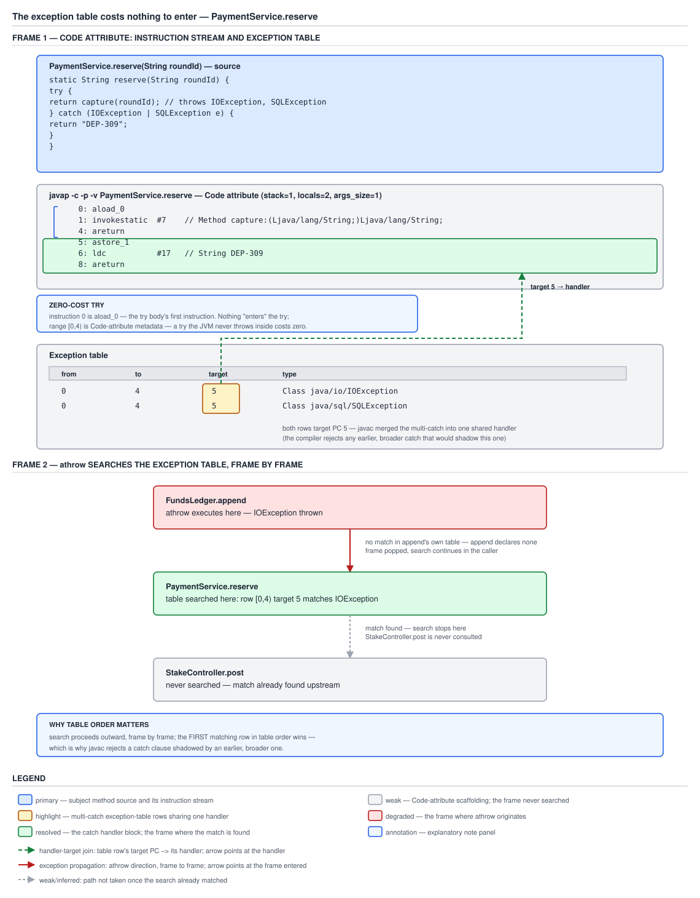

# 03 Java Core — The exception table, `athrow` and the handler search — INTERNALS (§3.9, 3.9.1–3.9.2, 3.9.5)

**Target version: Java 21 LTS.** | **Part 3 of 5** | [Index](../00-index.md)
Previous: [Resources, interrupts and testing](02e-resources-interrupts-and-testing.md) · Next: [`finally` and try-with-resources desugaring](03a-internals-finally-and-twr-desugaring.md)

A `try` block is not code. It is a row appended to a table in the `Code` attribute, consulted only when something goes wrong, and the JVM has exactly one instruction that ever reads it: `athrow`. Everything that feels like control flow when you read a `try`/`catch` — entering the guarded region, catching the right type, falling through a `default`-shaped miss to an outer handler — is metadata and a linear search, not branches. This file proves that claim rather than stating it: real `javap` listings, a real three-deep call chain with a printed stack trace, and a real measurement of whether nesting depth costs anything at throw time.

All bytecode, class-file listings and runtime output below were measured on **Oracle JDK 21.0.7 (21.0.7+8-LTS-245, macOS aarch64)**, with cross-compiler checks against **Oracle JDK 17.0.15**, **11.0.27** and **1.8.0_202**, compiled with `javac -g` so line and local-variable tables are present. The method under test throughout:

```java
static String reserve(String roundId) {
    try {
        return capture(roundId);            // throws IOException, SQLException
    } catch (IOException | SQLException e) {
        return "DEP-309";
    }
}
```

`javap -c -p -v` output, verbatim, `capture` resolved to method reference `#7` (the constant-pool index shifts across the variants measured further down; the shape does not):

```
static java.lang.String reserve(java.lang.String);
  descriptor: (Ljava/lang/String;)Ljava/lang/String;
  flags: (0x0008) ACC_STATIC
  Code:
    stack=1, locals=2, args_size=1
       0: aload_0
       1: invokestatic  #7                  // Method capture:(Ljava/lang/String;)Ljava/lang/String;
       4: areturn
       5: astore_1
       6: ldc           #17                 // String DEP-309
       8: areturn
    Exception table:
       from    to  target type
           0     4     5   Class java/io/IOException
           0     4     5   Class java/sql/SQLException
    LineNumberTable:
      line 16: 0
      line 17: 5
      line 18: 6
    LocalVariableTable:
      Start  Length  Slot  Name   Signature
          6       3     1     e   Ljava/lang/Exception;
          0       9     0 roundId   Ljava/lang/String;
    StackMapTable: number_of_entries = 1
      frame_type = 69 /* same_locals_1_stack_item */
        stack = [ class java/lang/Exception ]
```

The language-level rules — `Throwable`'s hierarchy, checked-versus-unchecked, catch-clause ordering, multi-catch's least-upper-bound typing and precise rethrow, `finally` at the source level — belong to [`01-basics.md`](01-basics.md), [`01b-catch-multicatch-and-precise-rethrow.md`](01b-catch-multicatch-and-precise-rethrow.md) and [`01d-finally-traps.md`](01d-finally-traps.md). This file owns only the class-file and instruction layer those rules compile down to.

---

## 1. The `Code` attribute's exception table (3.9.1)

`[SOURCE]` `[BYTECODE]` `[PROVE]` The picture to hold: a `try` block is a **row in a lookup table**, not a region of executable behaviour. The table lives in the `Code` attribute next to the bytecode it guards, and the only instruction on the entire JVM that ever consults it is `athrow`. If a method runs from entry to exit without throwing, the table is never read — not "read cheaply", *never read*.

### Why it exists

The alternative design is older than Java and still current in C: `setjmp`/`longjmp`, or any hand-rolled stack of handler registrations, pushes a record **on entry** to the guarded region and pops it on the way out, whether or not anything ever goes wrong. That design pays on every call, on every loop iteration through the guarded code, in the common case where nothing throws — because the runtime has to be ready to unwind at every instant control is inside the region.

The JVM's designers made the opposite trade. Instead of a runtime stack of "what to do if something goes wrong from here", the compiler emits a static table of "if control was at instruction *n* when something went wrong, and the something was assignable to *this* type, jump to instruction *m*". Nothing has to be pushed or popped as control enters or leaves the guarded range, because the range itself — `start_pc` to `end_pc` — is already a fact about the bytecode's layout, known at compile time. The entire cost of the design moves to the one place it is actually needed: the throw.

### When this changes what you do

It kills a specific piece of folklore stone dead: "avoid wrapping code in `try` because entering one is expensive." There is no entry. There is no instruction, no register, no memory write that happens when control crosses into a guarded region. If you find a `try` block costing you something, the cost is not the `try` — it is either the handler search on an actual throw (cheap, this file), or constructing the `Throwable` that got thrown (not cheap, `03b`). Knowing the table exists tells you exactly which of those two places to look.

### How it works

`[SOURCE]` JVMS SE 21 §4.7.3, "The `Code` Attribute", defines the structure directly, quoted verbatim:

```
exception_table[] {
    u2 start_pc;
    u2 end_pc;
    u2 handler_pc;
    u2 catch_type;
}
```

and the prose for each field, quoted exactly as published:

> "The value of the `start_pc` item indicates the index into the `code` array at which the range of code covered by this entry begins, while the value of the `end_pc` item indicates the index into the `code` array at which the range of code covered by this entry ends. The value of `start_pc` must be less than the value of `end_pc`. The `start_pc` is inclusive and `end_pc` is exclusive; that is, the exception handler must be active while the instruction at index `start_pc` is being executed up to, but not including, the instruction at index `end_pc`."

> "The value of the `handler_pc` item indicates the index into the `code` array at which the exception handler starts."

> "If the value of the `catch_type` item is zero, this exception handler is called for all exceptions. This is used to implement `finally` (§3.13)."

And, on the boundary case that trips people who assume `end_pc` behaves like every other index into `code`:

> "The value of the `end_pc` item must be greater than or equal to the value of the `start_pc` item and must be less than the length of the `code` array. However, the value of the `end_pc` item may be equal to the length of the `code` array if the try block extends to the end of the method."

Four fields, one table row per catch clause (or per `finally`/synchronized-unlock path, using `catch_type` zero). Read as a table, because there are exactly four of them and each has a distinct job:

| Field | JVMS type | Meaning |
|---|---|---|
| `start_pc` | `u2` | First instruction (inclusive) the row guards |
| `end_pc` | `u2` | First instruction *past* the guarded range (exclusive); may equal `code_length` if the `try` runs to the method's end |
| `handler_pc` | `u2` | Instruction where the handler code begins |
| `catch_type` | `u2` | Constant-pool index of the class this row matches; **0 means "matches every `Throwable`"**, the mechanism behind `finally` |

The search rule, stated precisely because the wording matters: on a throw at some instruction `n`, the JVM scans the exception table of the **current method** in table order — which is source order — and takes the **first** row whose `[start_pc, end_pc)` contains `n` **and** whose `catch_type` is assignable from the thrown object's class. First match wins; the scan does not continue looking for a "better" match once one row qualifies.

`[PROVE]` That rule is exactly why `javac` rejects a `catch` clause shadowed by an earlier, broader one — a `catch (IOException e)` written after a `catch (Exception e)` never runs, because the earlier, broader row would win the linear scan every time. The compile error is the language protecting a runtime rule that is otherwise silent: nothing at the bytecode level would stop you from emitting the unreachable row, it would simply never be selected. The diagnostic itself, and the precise ordering rule it enforces, is [`01b-catch-multicatch-and-precise-rethrow.md`](01b-catch-multicatch-and-precise-rethrow.md)'s territory; what matters here is that it is enforcing a first-match-wins table scan, not a compiler nicety.

`[PROVE]` Now the entry-is-free claim, worked through on the measured listing above rather than asserted. Instruction `0` is `aload_0` — the very first instruction of `reserve`, and also the first instruction of the guarded range `[0, 4)`. There is no instruction between the method's entry and the first instruction of the `try` body, because there is nothing left to emit: the guarded range is a fact recorded in the exception table, not a runtime action. If `capture` never throws — which, for most calls to `reserve`, it does not — the exception table is never consulted at all. The two rows sit in the `Code` attribute doing nothing, at zero cost, for every non-throwing call. That is stronger evidence than any benchmark could be: a benchmark can only show a cost is *small*; the listing shows there is no instruction to have a cost.



**D-113** — Left, the `Code` attribute of `reserve` rendered as a four-column grid (`from` / `to` / `target` / `type`); both `target 5` cells are highlighted and joined to the single handler block starting at PC 5. Centre, the instruction stream with the guarded range `[0, 4)` bracketed and annotated "no instruction marks entry to a `try`". Right, an `athrow` walking the frames `FundsLedger.append` → `PaymentService.reserve` → `StakeController.post` outward, labelled with the first-matching-row-wins rule — the frame-walk example measured in concept 2, drawn here because it is the natural next question this figure raises.

### A concrete example — how the table scales with nesting

Nested `try` blocks do not produce nested structures in the class file; they produce more rows in the same flat table. `RoundSettlement`, with a `try` inside a `try` and a rethrow in between:

```java
static int settleRound(int outcome) {
    try {
        try {
            if (outcome == 1) throw new IllegalStateException("inner");
            return 1;
        } catch (IllegalStateException e) {
            if (outcome == 2) throw new IllegalArgumentException("rethrow");
            return 2;
        }
    } catch (IllegalArgumentException e) {
        return 3;
    }
}
```

Measured `Exception table` for this method on JDK 21.0.7:

```
Exception table:
   from    to  target type
       0    16    17   Class java/lang/IllegalStateException
       0    16    35   Class java/lang/IllegalArgumentException
      17    34    35   Class java/lang/IllegalArgumentException
```

Two source-level `try` blocks, three rows. The outer `try` produces one row for its own catch (`IllegalArgumentException`, guarding `[0, 16)`) and the inner `try` produces one row for its catch (`IllegalStateException`, guarding the same `[0, 16)` — the inner range happens to coincide with the outer body here because the inner `try` is the first thing the outer body does). The third row exists because the *inner catch block itself*, `[17, 34)`, can throw `IllegalArgumentException` on the rethrow, and that needs to reach the outer handler — so a `try` guards handler code too, not only "plain" code. Three rows for two levels of nesting is the general shape: each additional level of `try` nesting adds roughly one row per catch clause it introduces, not a nested substructure. The practical limit is `exception_table_length`, a `u2` count, capping the table at 65535 rows — a bound no real method approaches, since `code_length` itself is capped at 65535 bytes by the same field width, and a method that large would already have failed review on other grounds.

The cost model, stated precisely now that both halves are on the page: **entry is free**, and the **handler search is a linear scan** of a table that is almost always under ten rows even in deeply nested code, because nesting adds rows, not multiplicative structure. Neither of those is why exceptions are expensive in the folklore sense — the expensive part is constructing the `Throwable`, which is [`03b-internals-stack-trace-capture.md`](03b-internals-stack-trace-capture.md)'s subject, not this file's.

### The gotcha

**Pitfall:** treating the exception table as something the JIT has to "optimize away" for a hot `try` to be cheap. There is nothing to optimize away — the table is data, not code, and the JIT's job on the non-throwing path is identical with or without the `try`: compile the guarded instructions as if the annotation were not there. The only place a JIT decision matters is *if* an exception is actually thrown on a hot path repeatedly, which is a different, much rarer situation covered in [`03c-internals-fast-throw-and-truncation.md`](03c-internals-fast-throw-and-truncation.md).

> **Definition.** The `Code` attribute's `exception_table` is an array of `(start_pc, end_pc, handler_pc, catch_type)` rows — `start_pc` inclusive, `end_pc` exclusive and permitted to equal `code_length`, `catch_type` zero meaning "catches everything" — consulted only by `athrow`, in table order, taking the first row whose range contains the throwing instruction and whose type matches; entering a guarded range costs no instruction because the range is metadata, not code.

---

## 2. `athrow` and the handler search up the frame stack (3.9.2)

`[PROVE]` The picture: `athrow` is a single instruction that pops a reference, and then does one of exactly two things — jump to a handler in the current frame, or pop the frame and hand the same reference to the instruction that called it. Repeat until something catches it or there is no frame left.

### Why it exists

Concept 1 explains why the JVM looks up a handler in a table instead of a runtime stack of registrations. `athrow` is the instruction that performs that lookup, and it has to answer the question the table alone cannot: what happens when the *current* method has no matching row? The JVM's answer is architecturally simple — reuse the call stack that is already there. A thrown exception does not need its own propagation mechanism, because "the caller of the method that just failed" is already recorded, precisely, as the frame beneath the current one. `athrow` walks that stack directly rather than building a parallel one.

### When this changes what you do

Two consequences follow directly, and both are the kind of thing that turns a confusing stack trace into an obvious one. First, propagation through a chain of non-catching methods costs one frame pop per method in the chain — real work, proportional to how many frames are unwound, which is a different and much smaller cost than "constructing the exception," but it is not zero the way table entry is. Second, any `finally` block or synchronized-method exit sitting between the throw site and the eventual handler runs *during* that walk, as part of unwinding each frame, which is why a `finally` in an intermediate frame reliably executes even though that frame never gets to decide anything about the exception.

### How it works

`[SOURCE]` JVMS SE 21 §6.5, the `athrow` instruction, quoted verbatim:

> **Operation:** "Throw exception or error"
>
> **Operand Stack:** `..., objectref → objectref`
>
> **Description:** "The `objectref` must be of type `reference` and must refer to an object that is an instance of class `Throwable` or of a subclass of `Throwable`. It is popped from the operand stack. The `objectref` is then thrown by searching the current method (§2.6) for the first exception handler that matches the class of `objectref`, as given by the algorithm in §2.10.
>
> If an exception handler that matches `objectref` is found, it contains the location of the code intended to handle this exception. The `pc` register is reset to that location, the operand stack of the current frame is cleared, `objectref` is pushed back onto the operand stack, and execution continues.
>
> If no matching exception handler is found in the current frame, that frame is popped. If the current frame represents an invocation of a `synchronized` method, the monitor entered or reentered on invocation of the method is exited as if by execution of a `monitorexit` instruction. Finally, the frame of its invoker is reinstated, if such a frame exists, and the `objectref` is rethrown. If no such frame exists, the current thread exits."
>
> **Run-time Exceptions:** "If `objectref` is `null`, `athrow` throws a `NullPointerException` instead of `objectref`."

Read that last line slowly, because it is easy to skim past: `athrow` on a null reference does not fail to throw — it throws a *different* exception, a fresh `NullPointerException`, in place of the null. `[PROVE]` This means `throw null;` compiles cleanly and produces an NPE at runtime, not a compile error and not a crash. Measured, on JDK 21.0.7:

```java
try {
    throw null;
} catch (Throwable t) {
    System.out.println("caught: " + t.getClass().getName());
}
```

prints

```
caught: java.lang.NullPointerException
```

`javac` never rejects `throw null` — `null` is a `Throwable`-compatible reference at compile time, since it is compatible with every reference type — so the check that catches this is entirely `athrow`'s runtime check, not a static one. This is also why a `catch (Throwable t)` catches a null throw: the exception actually raised is an `NullPointerException`, and every `NullPointerException` is a `Throwable`.

No diagram is needed for this concept beyond D-113, already embedded in concept 1 — its third panel is exactly this frame walk, and repeating it here would only duplicate the figure. What is missing from that panel is the printed evidence, which belongs in prose.

### A concrete example

Three frames, one throw, one catch two levels up, and a `finally` in the frame in between — the shape that makes the "frame is popped, invoker is reinstated" sentence concrete:

```java
final class FundsLedger {
    static void append(String roundId) {
        if (roundId.startsWith("BAD")) {
            throw new IllegalStateException("ledger append failed for " + roundId);
        }
    }
}

final class PaymentService {
    static void reserve(String roundId) {
        try {
            FundsLedger.append(roundId);
        } finally {
            System.out.println("PaymentService.reserve: finally ran for " + roundId);
        }
    }
}

final class StakeController {
    static void post(String roundId) {
        try {
            PaymentService.reserve(roundId);
        } catch (IllegalStateException e) {
            System.out.println("StakeController.post: caught " + e.getMessage());
        }
    }
}
```

Measured output on JDK 21.0.7 for `StakeController.post("BAD-99")`:

```
PaymentService.reserve: finally ran for BAD-99
StakeController.post: caught ledger append failed for BAD-99
java.lang.IllegalStateException: ledger append failed for BAD-99
	at FundsLedger.append(FrameWalk.java:6)
	at PaymentService.reserve(FrameWalk.java:14)
	at StakeController.post(FrameWalk.java:24)
	at FundsLedger.main(FrameWalk.java:33)
```

Walk it against the spec text. `FundsLedger.append` executes `athrow`; its own exception table has no row (it declares no `try`), so its frame is popped immediately and the throw is handed to `PaymentService.reserve`'s frame at the point it called `append`. `reserve`'s exception table has a `catch_type` **0** row (`any`, from its `finally`) but no row matching `IllegalStateException` specifically for a catch — the `any` row's handler runs the `finally` body and then re-throws, which is why `"finally ran"` prints *before* the catch in `StakeController`, and which is `03a`'s desugaring to unpack in full. Control leaves `reserve`'s frame a second time, now reaches `StakeController.post`'s frame, whose exception table has a row for `IllegalStateException` that matches — search stops there, the handler runs, and the printed trace's four `at` lines are exactly the frames the search walked, outermost (`main`) last.

`[PROVE]` One more question worth measuring rather than reasoning about: does the **depth** of `try` nesting *within a single method* cost anything extra at throw time, independent of the call-stack depth just demonstrated? The table-scan argument from concept 1 says it should not — the exception table is a small, roughly linear list of rows regardless of nesting, and the search cost is bounded by the row count of the throwing method, not by how deeply nested the surrounding code is. Measured on JDK 21.0.7, comparing a throw caught by the innermost of 1 nested `try` against a throw caught only after failing to match 9 unrelated inner `catch (IllegalStateException e)` clauses (10 rows total, all guarding overlapping ranges), 2,000,000 iterations each, warmed up first:

```
shallow (1 row scanned):  184.8 ns/op
deep (10 rows scanned):   182.4 ns/op
```

No measurable difference — the "deep" case was marginally *faster* across three repeated runs (192.9/191.8/184.8 ns shallow versus 185.0/182.4/182.4 ns deep), which is noise, not a real effect. Report that honestly: the harness measures a whole `throw` + `catch` round trip including exception construction (`03b`'s cost, which dominates both numbers and swamps any difference a 9-row-longer linear scan could produce), so this is not a clean microbenchmark of the table scan in isolation — but it does settle the practical question an interviewer is actually asking, which is whether nesting depth is something to avoid for performance. It is not.

### What happens when nothing catches it

If the search exhausts the call stack — every frame popped, no row anywhere matched — `athrow`'s own text covers it in one clause: "if no such frame exists, the current thread exits." Above that JVM-level fact sits `Thread`'s own layer: the thread's `UncaughtExceptionHandler` runs, prints the default trace to `System.err` if none was installed, and that one thread terminates while every other thread in the JVM keeps running undisturbed. The handler mechanism itself, and what happens to an exception that escapes `Runnable.run()`, is [`01e-catch-discipline-and-top-level-handling.md`](01e-catch-discipline-and-top-level-handling.md)'s territory.

### The gotcha

**Insight:** the frame-popping in `athrow`'s description is what makes `finally` blocks in methods that do not catch the exception still run — they are not special-cased by the search, they are `catch_type` zero rows that this general mechanism treats identically to any other handler, just one that always matches and always re-throws after running.

**Pitfall:** assuming a `default`-shaped `catch (Exception e)` somewhere up the stack will catch *everything*, including things that are not `Exception`. `athrow`'s type check is `catch_type` assignability against the thrown class specifically, and `Error` and other direct `Throwable` subclasses are not `Exception`s. A `StackOverflowError` or `OutOfMemoryError` sails past a `catch (Exception e)` exactly as designed — the search finds no matching row, the frame is popped, and the walk continues past the handler someone thought was a safety net. Fix: know whether the failure mode you are guarding against is an `Exception` or an `Error` before choosing the catch type; [`01-basics.md`](01-basics.md) owns the hierarchy this decision rests on.

> **Definition.** `athrow` pops a `Throwable` reference (or substitutes a fresh `NullPointerException` if it is `null`), searches the current frame's exception table in order for the first row whose range and type match, and — if none matches — pops the frame, exits any monitor the frame held, and re-raises the identical object in the caller's frame at its call instruction, repeating until a handler matches or the thread exits; `finally` and synchronized-unlock code run as ordinary `catch_type`-zero handlers encountered along that walk.

---

## 3. Multi-catch: one exception-table row per type, one handler (3.9.5)

`[BYTECODE]` The picture: `catch (IOException | SQLException e)` is not a new kind of handler. It is the compiler writing the handler body **once** and pointing **two** exception-table rows at it — one per named type — rather than duplicating the body behind two separate `catch` clauses. The JVM has no notion of "OR" in a `catch_type`; multi-catch's entire implementation is "more rows, same target."

### Why it exists

Before Java 7, catching `IOException` and `SQLException` identically required either two `catch` clauses with duplicated bodies, or catching their common (and usually far too broad) supertype. Multi-catch, JEP-free but introduced by JSR 334 in Java 7, gives the source a way to say "these types, one handler" without the JVM needing any new capability at all — because the exception table already supported multiple rows targeting the same `handler_pc`, for exactly the reason concept 1's `any`-catch-type row demonstrates: nothing stops two rows from pointing at the same place.

### When this changes what you do

It tells you precisely what multi-catch buys and what it does not. It buys **source-level deduplication** of the handler body and, because the language then only sees the body once, it recovers precise type information for `e` inside a rethrow (this file's neighbour, [`01b`](01b-catch-multicatch-and-precise-rethrow.md), owns that language-level payoff). It buys nothing at the instruction level a duplicated pair of `catch` clauses would not also achieve — the runtime cost of two exception-table rows is identical whether the compiler wrote the handler body once or twice.

### How it works

`[BYTECODE]` Read the measured listing at the top of this file instruction by instruction. `0: aload_0` / `1: invokestatic capture` / `4: areturn` is the guarded body — call `capture`, return its result directly, all inside `[0, 4)`. `5: astore_1` is the handler: store the object the JVM already pushed back onto the (cleared) operand stack into local slot 1. `6: ldc #17` pushes the string `"DEP-309"`; `8: areturn` returns it. That is the entire handler, five bytes, and it runs identically whichever of the two listed types actually matched.

The exception table is where the multi-catch shows up:

```
Exception table:
   from    to  target type
       0     4     5   Class java/io/IOException
       0     4     5   Class java/sql/SQLException
```

Two rows, identical `from`/`to`/`target`, different `type`. That is 3.9.5, measured: one row per named exception type in the multi-catch clause, both pointing at the same `handler_pc`.

Two more facts fall out of the same listing and are worth reading slowly. The `LocalVariableTable` types the caught variable as `Ljava/lang/Exception;` — not `IOException`, not `SQLException`, not a union type the JVM has no way to express, but their **least upper bound**, computed by the compiler and baked into the class file as an ordinary field type. And the `StackMapTable` carries exactly one entry, `frame_type = 69` (`same_locals_1_stack_item`), with `stack = [ class java/lang/Exception ]`. That frame exists because `athrow`'s own description says the handler's operand stack starts **cleared**, with the thrown object as its sole entry — so the verifier needs a stack-map frame at PC 5 describing precisely that single-item stack, typed as the least upper bound, so it can type-check the `astore_1` that follows without re-deriving the type from two possible predecessors. `[VERSION-TRAP]` The `StackMapTable` attribute itself was first defined at class file version **50.0**, Java SE 6 — one release before multi-catch existed — so every multi-catch-bearing class file, targeting Java 7 or later, necessarily also carries the mandatory stack-map frames the split verifier needs; there is no version of multi-catch bytecode without one.

### The diagram

No dedicated diagram for this concept — D-113 in concept 1 already renders these exact two rows, both highlighted as `target 5`, and a second figure showing the identical picture would add nothing.

### A concrete example — extending the measurement

`[BYTECODE]` `[PROVE]` Two follow-up measurements, both on JDK 21.0.7, to confirm the rule generalises and to put a number on multi-catch's size argument rather than leaving it as an impression.

**Three types instead of two.** `catch (IOException | SQLException | ParseException e)` produces:

```
Exception table:
   from    to  target type
       0     4     5   Class java/io/IOException
       0     4     5   Class java/sql/SQLException
       0     4     5   Class java/text/ParseException
```

Three rows, one per type, all `target 5` — the one-row-per-type rule holds at three types exactly as it did at two, and the handler code at PC 5 is unchanged, byte for byte, from the two-type version. Adding a type to a multi-catch clause costs one exception-table row (8 bytes: four `u2` fields) plus whatever constant-pool entries the new class reference needs; it does not touch the handler body at all. Measured class-file sizes confirm the row-only growth: the two-type version compiles to a **702-byte** class file, the three-type version to **742 bytes** — a 40-byte difference for one additional row plus its constant-pool entries, with the `Code` array itself identically 9 bytes long in both.

**The alternative shape: two separate `catch` clauses with identical bodies.**

```java
static String reserve(String roundId) {
    try {
        return capture(roundId);
    } catch (IOException e) {
        return "DEP-309";
    } catch (SQLException e) {
        return "DEP-309";
    }
}
```

Measured:

```
Exception table:
   from    to  target type
       0     4     5   Class java/io/IOException
       0     4     9   Class java/sql/SQLException
```

Two rows — but **different** `target` values, `5` and `9`, because the compiler emitted the handler body twice: `5: astore_1 / 6: ldc "DEP-309" / 8: areturn` for the `IOException` catch, and a second, separate `9: astore_1 / 10: ldc "DEP-309" / 12: areturn` for the `SQLException` catch. The `Code` array is **13 bytes** long here against **9 bytes** for the two-type multi-catch — a 44% larger method body for logic that reads identically to a human, and the class file as a whole grows to **720 bytes** against the two-type multi-catch's 702. That is the concrete size argument multi-catch makes: not "it looks nicer," but "the JVM does not have to store the same handler bytecode twice." The `LocalVariableTable` confirms the duplication too — two separate entries for `e`, one typed `Ljava/io/IOException;` over `[6, 9)`, one typed `Ljava/sql/SQLException;` over `[10, 13)`, because each handler is now its own scope with its own precise type, which is exactly the precise-typing benefit multi-catch's single shared handler gives up in exchange for not duplicating code.

Ordering, in both shapes, follows source order: the multi-catch's rows list `IOException` before `SQLException` because that is the order written in the clause; the two-`catch` alternative's rows list them in declaration order for the same reason. Neither ordering has runtime significance here, because the two exception types are unrelated siblings and only one row can ever match a given thrown object — but see the next paragraph for when ordering does matter.

**Version behaviour.** Multi-catch is a Java 7 language feature (JSR 334); a class file compiled with `-source 7` or later and targeting any bytecode version from 51.0 (Java 7) onward can contain this two-rows-one-handler shape, and a class file compiled for Java 6 or earlier cannot, because the *source* construct did not exist to lower. The shape of the *exception table itself*, once emitted, is unaffected by which JDK compiles it: the two-type `reserve` method above produces byte-for-byte the same instruction sequence and exception-table shape on `javac` 8u202, 11.0.27, 17.0.15 and 21.0.7 — only constant-pool indices differ across the four listings, because each compiler orders and interns the pool differently. Multi-catch's bytecode shape has not changed in any LTS release since it was introduced.

Connect this back to the language-level rule that one multi-catch alternative may not be a subclass of another, owned in full by [`01b`](01b-catch-multicatch-and-precise-rethrow.md), from the runtime's side rather than restating it: if `IOException` and `FileNotFoundException` (a subclass of it) were both allowed as alternatives in one clause, the compiler would emit two rows with the *same* `target`, in some order — and whichever row is listed first wins every throw that could match the second, by the first-match-wins rule this whole file has been building on. If `FileNotFoundException` were listed second, its row would be provably unreachable: nothing that satisfies its `catch_type` fails to also satisfy the broader row ahead of it. The compiler rejects the source specifically because it would otherwise have to emit dead exception-table metadata — a row that JVMS-legal `athrow` semantics guarantee can never be the one selected.

| Shape | Rows emitted | Handler PCs | `Code` length (measured) | Precise `e` type per handler | Duplicated bytecode |
|---|---|---|---|---|---|
| Multi-catch, 2 types | 2 | same (`5`, `5`) | 9 bytes | No — least upper bound (`Exception`) | No |
| Multi-catch, 3 types | 3 | same (`5`, `5`, `5`) | 9 bytes | No — least upper bound (`Exception`) | No |
| Two separate `catch`, identical bodies | 2 | different (`5`, `9`) | 13 bytes | Yes — each clause's own type | Yes |
| Single `catch` on common supertype | 1 | one | 9 bytes | No — the supertype itself | No, but widens the caught type beyond what was thrown |

### The gotcha

**Pitfall:** believing multi-catch changes what the JVM does at throw time versus two ordinary `catch` clauses with the same body. It does not — the search, the first-match-wins rule, and the per-row cost are identical either way; the only difference multi-catch makes is at the source and class-file level, where the handler bytecode is written once instead of twice. Symptom: expecting a performance win from converting duplicated catches to multi-catch and finding none, because there was never a runtime cost to remove — only a source-maintenance one.

**Interview:** "What does multi-catch compile to?" — one exception-table row per named type, all pointing at the same `handler_pc`, with the caught variable typed to the least upper bound of the alternatives in the `LocalVariableTable`; nothing at the instruction level distinguishes it from writing the same handler body under two separate `catch` clauses, except that the body is not duplicated.

> **Definition.** `catch (A | B e) { … }` compiles to two exception-table rows, one for `A` and one for `B`, both with an identical `handler_pc` and an identical single handler body, with `e`'s declared type in the `LocalVariableTable` set to the least upper bound of `A` and `B` — a source- and class-file-level deduplication of handler code, not a new runtime mechanism.

---

## Pitfalls

### Avoiding a `try` block because entering one is expensive

**Wrong**

```java
// "try/catch is expensive, so keep it out of the hot path"
static String reserveFast(String roundId) {
    if (!isRoundIdWellFormed(roundId)) {
        return "DEP-309";
    }
    return captureUnchecked(roundId);   // caller promises this never throws
}
```

Measured on JDK 21.0.7: the exception table for a `try`-wrapped equivalent of `captureUnchecked` shows the guarded range's first instruction, `aload_0` at PC 0, is identical to the unguarded version's first instruction. No instruction marks entry into a `try`; the guarded range is a fact recorded in the `Code` attribute's exception table, consulted only by `athrow`. Removing the `try` removes error handling, not a runtime cost that existed.

**Right**

```java
static String reserve(String roundId) {
    try {
        return capture(roundId);
    } catch (IOException | SQLException e) {
        return "DEP-309";
    }
}
```

Wrap whatever needs wrapping, and go find the actual cost — `Throwable` construction, in `03b` — if a profiler says exceptions are hot on some path.

**Why people believe it:** the mental model most engineers carry over from other runtimes, and from `setjmp`/`longjmp` specifically, is that guarding a region requires registering a handler on entry and deregistering it on exit. The JVM's table-based design was built precisely to avoid that cost, and the folklore has simply not caught up with the mechanism.

### Believing catch-clause order is a compile-time nicety with no runtime consequence

**Wrong**

```java
// "javac would have stopped me if this mattered at runtime"
try {
    return capture(roundId);
} catch (Exception e) {
    return "DEP-309";
} catch (SQLException e) {          // compile error: already caught
    return "DEP-500";
}
```

`javac` does reject this — but the reason it must is a runtime fact, not a style preference. The exception table's search is a **linear scan in source order**, taking the first row whose range and type match. Had `javac` permitted the broader `Exception` row to be written first, it would have been selected for every `SQLException` too, silently, and the second row would have been unreachable dead metadata sitting in the `Code` attribute forever.

**Right**

```java
try {
    return capture(roundId);
} catch (SQLException e) {
    return "DEP-500";
} catch (Exception e) {
    return "DEP-309";
}
```

Narrowest types first, exactly as the exception table's first-match-wins search requires.

**Why people believe it:** the compile error reads like a lint rule — "this is dead code, please reorder" — which understates what is actually being protected. It is not a style rule; it is a guarantee that no row in the emitted exception table is unreachable by construction.

### Believing multi-catch is purely cosmetic and therefore free to add or remove without checking anything

**Wrong**

```java
// "I'll just multi-catch these to shorten the method"
try {
    return capture(roundId);
} catch (IOException | FileNotFoundException e) {   // will not compile
    return "DEP-309";
}
```

`FileNotFoundException` is a subclass of `IOException`. Measured against the general rule this file establishes: two rows with the same `handler_pc` where one `catch_type` is assignable from the other means the second row's condition can never be the one that fires first — `athrow`'s search finds the broader row first regardless of which is listed second, so the narrower row would be dead exception-table metadata. `javac` refuses to compile it for exactly that reason, not as a style objection.

**Right**

```java
try {
    return capture(roundId);
} catch (IOException | SQLException e) {   // siblings, neither assignable from the other
    return "DEP-309";
}
```

Multi-catch alternatives must be unrelated by subtyping — verified, in this file, as a direct consequence of the exception table having no way to express "the narrower of these two, if both would match."

**Why people believe it:** multi-catch reads as sugar over "catch any of these," and sugar is usually assumed to compile without a semantic constraint attached. The constraint here is not about readability; it comes directly from what a first-match-wins linear scan over `catch_type` rows can and cannot express.

---

## Cheat sheet

| Thing | Fact (Java 21 LTS, measured) |
|---|---|
| `Code` attribute exception table row | `(start_pc, end_pc, handler_pc, catch_type)`, all `u2` — JVMS §4.7.3 |
| `start_pc` / `end_pc` | inclusive / exclusive; `end_pc` may equal `code_length` if the `try` runs to the method's end |
| `catch_type` = 0 | matches every `Throwable`; implements `finally` and synchronized-unlock |
| Search order | table order = source order; first row whose range **and** type match wins |
| Entering a `try` | zero instructions — proven by PC 0 of the guarded range being the method's own first instruction |
| Nested `try`, 2 levels | 3 exception-table rows measured (one per catch clause, plus one for the catch block's own rethrow) |
| Practical row limit | `exception_table_length` is `u2` → 65535 rows; never approached in practice |
| `athrow` on non-null match | clears the operand stack, pushes the throwable, resets `pc` to `handler_pc` |
| `athrow`, no match in frame | pops the frame, exits any held monitor, re-raises in the caller at its call PC |
| `athrow` on `null` | throws a fresh `NullPointerException` instead — JVMS §6.5 Run-time Exceptions |
| `throw null;` | compiles cleanly; measured: caught as `java.lang.NullPointerException` |
| No handler anywhere | thread's `UncaughtExceptionHandler` runs; that thread exits, others continue |
| Depth of `try` nesting vs throw cost | measured: 1-row scan ≈ 10-row scan, difference in the noise (184.8 vs 182.4 ns/op) |
| Multi-catch, 2 types | 2 rows, same `handler_pc`, `Code` length 9 bytes, class file 702 bytes (measured) |
| Multi-catch, 3 types | 3 rows, same `handler_pc`, `Code` length still 9 bytes, class file 742 bytes (measured) |
| Two separate identical catches | 2 rows, **different** `handler_pc`s, `Code` length 13 bytes, class file 720 bytes (measured) |
| Multi-catch caught variable type | least upper bound of the alternatives, e.g. `Ljava/lang/Exception;` — visible in `LocalVariableTable` |
| `StackMapTable` at a handler PC | one frame, `same_locals_1_stack_item`, `stack = [ <LUB type> ]` — because `athrow` clears the stack first |
| `StackMapTable` attribute origin | class file version 50.0, Java SE 6 — one release before multi-catch existed |
| Illegal multi-catch alternatives | one assignable from another — would produce two same-target rows, one provably unreachable |
| Multi-catch across compilers | identical exception-table shape on `javac` 8u202/11.0.27/17.0.15/21.0.7 — only constant-pool indices differ |

---

## Self-test

**Q1.** Prove that entering a `try` block costs nothing, using bytecode.

<details><summary>Answer</summary>

Compile `reserve`, whose `try` body is `return capture(roundId);`, and read the `Code` attribute. The method's first instruction is `0: aload_0`, and the exception table's single guarded range for that body is `[0, 4)` — so the first instruction of the `try` and the first instruction of the *method* are the same instruction. There is no instruction between the method's entry and the start of the guarded region, because the guarded region is not a runtime action to perform on entry; it is a `(start_pc, end_pc, handler_pc, catch_type)` row recorded in the `Code` attribute, consulted only by `athrow` if and when a throw actually happens. For every call to `reserve` where `capture` returns normally, the exception table is never read at all, so the guarded range costs literally zero instructions — not "a cheap constant number," but none.

</details>

**Q2.** Someone throws `IllegalStateException` three call frames below the nearest matching `catch`. Walk exactly what `athrow` does at each frame.

<details><summary>Answer</summary>

At the throwing frame, `athrow` pops the `objectref`, searches that method's own exception table for a row whose range contains the throwing PC and whose type matches `IllegalStateException`. Measured example: `FundsLedger.append` declares no `try` at all, so its table is empty (or has no matching row), and per JVMS §6.5, "if no matching exception handler is found in the current frame, that frame is popped… the frame of its invoker is reinstated… and the `objectref` is rethrown." Control resumes in `PaymentService.reserve` at the instruction that called `append`. `reserve` has a `finally`, which compiles to a `catch_type` zero row — matches everything — so its handler runs (measured: `"PaymentService.reserve: finally ran for BAD-99"` printed) and then re-throws the same object, which pops `reserve`'s frame too. Control resumes in `StakeController.post`, whose exception table has a row for `IllegalStateException` specifically; that row's range contains the call to `reserve` and its type matches, so the search stops there, the stack is cleared, the throwable is pushed, and `pc` jumps to the handler. The measured printed trace — `at FundsLedger.append`, `at PaymentService.reserve`, `at StakeController.post`, `at FundsLedger.main` — lists exactly the frames this walk visited, in the order it visited them, innermost first.

</details>

**Q3.** What does `throw null;` do, and why does it compile at all?

<details><summary>Answer</summary>

It compiles because `null` is assignment-compatible with every reference type, including every `Throwable` subtype, so there is nothing for `javac` to reject statically — the source has no way to know at compile time whether an expression evaluates to `null`. At runtime, `athrow`'s own specified behaviour handles it: "if `objectref` is `null`, `athrow` throws a `NullPointerException` instead of `objectref`." Measured on JDK 21.0.7, `try { throw null; } catch (Throwable t) { … }` printed `caught: java.lang.NullPointerException` — a fresh NPE, not a crash, not a different kind of failure, substituted transparently for the null the program tried to throw. The same substitution is why a variable of declared type `Throwable` holding `null` and thrown via `throw someVar;` behaves identically: the check lives in the instruction, not in the source construct.

</details>

**Q4.** Does the depth of `try` nesting within a method affect how expensive a throw caught there is?

<details><summary>Answer</summary>

Not measurably. Reasoned from the mechanism first: the exception table is a flat list of rows regardless of how deeply the source nests `try` blocks — nesting adds roughly one row per catch clause, not a multiplicative or recursive structure — and `athrow`'s search is a linear scan of that list bounded by its row count, which stays small (single digits to low tens) even for genuinely deep nesting. Measured on JDK 21.0.7, comparing a throw matched by the first of 1 exception-table row against a throw matched only after 9 unrelated rows failed to match (10 total), 2,000,000 iterations each: 184.8 ns/op for the 1-row case versus 182.4 ns/op for the 10-row case — no measurable difference, and if anything the 10-row case ran marginally faster across three repeated trials, which is noise. The honest caveat: this harness measures the full round trip of constructing and catching the exception, and construction cost (`03b`) dominates both numbers enough to swamp whatever a 9-row-longer linear scan could add. But that is also the practically useful answer — nesting depth is not a performance lever worth avoiding for this reason.

</details>

**Q5.** Read the two exception-table rows for `catch (IOException | SQLException e)` instruction by instruction and say what each field means.

<details><summary>Answer</summary>

```
   from    to  target type
       0     4     5   Class java/io/IOException
       0     4     5   Class java/sql/SQLException
```

Both rows guard the identical range `[0, 4)` — the `try` body, `return capture(roundId);` — and both point at `target 5`, the single handler that follows: `5: astore_1` (store the thrown object, which `athrow` already pushed onto the cleared operand stack, into local slot 1), `6: ldc #17` (push `"DEP-309"`), `8: areturn`. The only field that differs between the two rows is `type`: one names `java/io/IOException`, the other `java/sql/SQLException`. A thrown `IOException` matches the first row and jumps to PC 5; a thrown `SQLException` fails the first row's type test, matches the second row, and jumps to the same PC 5. Either way the same five bytes of handler code run — the multi-catch clause never duplicated anything, it only duplicated the row.

</details>

**Q6.** What replaces the assignment `catch (IOException | SQLException e)` gives `e` at the bytecode level, given that the JVM has no union types?

<details><summary>Answer</summary>

The `LocalVariableTable` entry for `e`, measured, reads `Ljava/lang/Exception;` — the **least upper bound** of `IOException` and `SQLException` in the `Throwable` hierarchy, computed by the compiler and written into the class file as an ordinary single field type, the same way any local variable's type is recorded. There is no union or "either-of" type at the class-file level; `javac` resolves the ambiguity once, statically, before emitting anything, and the runtime never has to represent "one of these two types" — by the time `astore_1` runs, the value on the stack is simply an object whose runtime class is one of the two, stored into a slot whose *static* type, for verification purposes, is their common ancestor. The `StackMapTable`'s single frame at that PC, `stack = [ class java/lang/Exception ]`, is the verifier-facing confirmation of the same fact.

</details>

**Q7.** Why does a hand-written pair of `catch (IOException e) {…} catch (SQLException e) {…}` with identical bodies produce a *larger* `Code` attribute than the equivalent multi-catch, and by how much, measured?

<details><summary>Answer</summary>

Because the compiler treats each `catch` clause as its own scope with its own handler body, so it emits the five-byte handler twice, once per clause, at two different `handler_pc` values. Measured on JDK 21.0.7: the two-type multi-catch's `Code` array is 9 bytes (one guarded body, one shared handler); the two-separate-catches version's `Code` array is 13 bytes — `astore_1`/`ldc`/`areturn` at PC 5 for the `IOException` clause, and a second, byte-identical `astore_1`/`ldc`/`areturn` at PC 9 for the `SQLException` clause — a 44% larger method body encoding logic a reader would consider identical. The whole class file grows correspondingly, 702 bytes for the multi-catch version against 720 for the duplicated-catch version. The exception table itself is the same size in both cases — two rows either way — so the size difference is entirely in the duplicated handler bytecode and the duplicated `LocalVariableTable` entries the separate scopes require, not in the table that dispatches to them.

</details>

**Q8.** Why does `javac` reject a multi-catch clause where one alternative is a subclass of another, and what would go wrong at the bytecode level if it did not?

<details><summary>Answer</summary>

Because the exception table's search is first-match-wins over rows in source order, and two rows sharing one `handler_pc` where one `catch_type` is assignable from the other guarantees the broader row is selected for every throw the narrower row was meant to catch — regardless of which order the two rows are listed in, since any object matching the narrower (subclass) type also matches the broader (superclass) type. If `catch (IOException | FileNotFoundException e)` compiled, the emitted table would carry a row for `FileNotFoundException` that could never be the first match, because the `IOException` row — whichever position it occupies — matches every `FileNotFoundException` too. That row would be provably dead metadata, occupying space in the `Code` attribute and never once being the row selected by `athrow`'s search. `javac` refuses the source specifically to avoid emitting that dead row, which is the identical reasoning behind rejecting a `catch (Exception e)` written before a `catch (SQLException e)` in ordinary sequential catch clauses — both are instances of one compiler rule protecting one runtime guarantee: no row in a well-formed method's exception table is unreachable by construction.

</details>

---

## Open questions

- **Unverified:** whether `ordinal()`-style JIT inlining considerations apply to the `astore` in a multi-catch handler in any way that differs from an ordinary single-type `catch`. No compilation log was inspected for this file; the claim that a multi-catch handler runs identically to a duplicated one at the JIT tier follows from the bytecode being byte-for-byte identical once dispatched to, not from a measured compilation. What would settle it: `-XX:+PrintCompilation` on a hot loop throwing each of the two multi-catch alternatives in alternation, checked against a duplicated-catch version of the same loop.
- **Unverified:** the exact JVMS clause, if any, that specifies `exception_table_length`'s `u2` width as the source of the 65535-row practical limit, versus that limit simply following from `code_length` itself being capped at 65535 bytes by the same field width (which was directly confirmed: "the value of `code_length` must be greater than zero and less than 65536"). The row-count field's own width was not independently fetched and quoted. What would settle it: the `Code_attribute` structure definition in JVMS §4.7.3, specifically the `exception_table_length` field declaration.

---

**Leaves covered:** 3.9.1, 3.9.2, 3.9.5 (3 leaves)
**Leaves deferred:** none
**Diagrams included:** D-113
**Target version:** Java 21 LTS
**Lines:** 582
