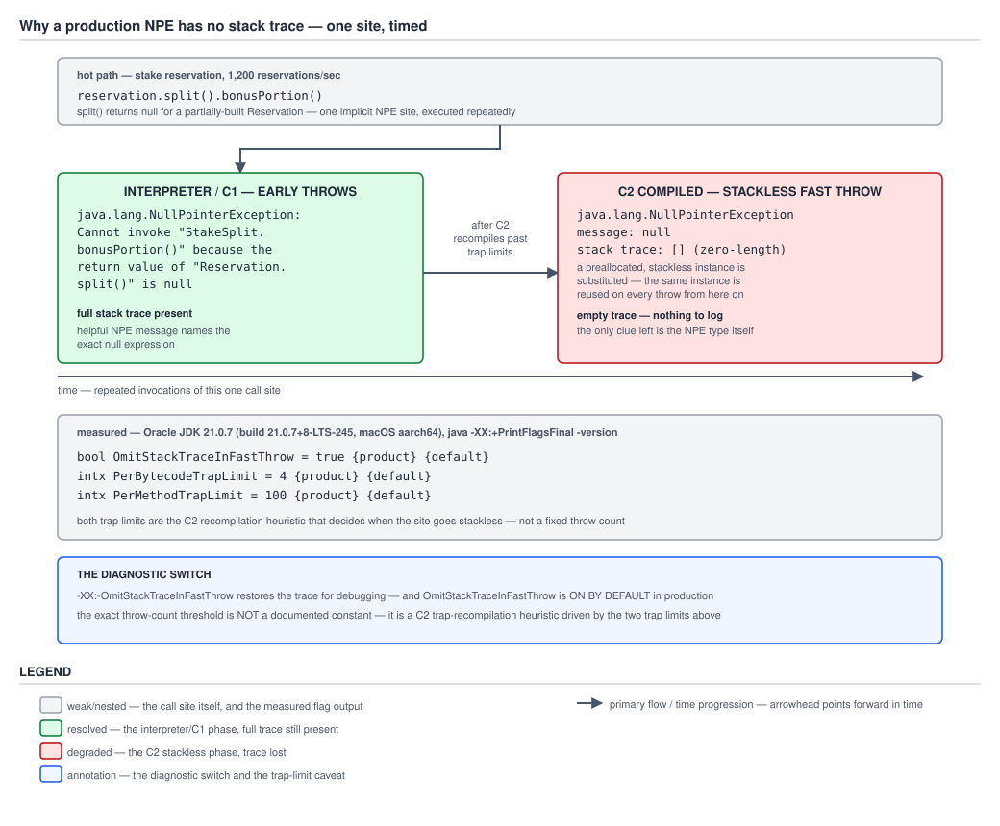

# 03 Java Core — Fast-throw substitution, trace truncation, and `StackOverflowError` — INTERNALS (§3.9, 3.9.9–3.9.10, 3.9.14)

**Target version: Java 21 LTS.** | **Part 3 of 5** | [Index](../00-index.md)
Previous: [Stack-trace capture and its cost](03b-internals-stack-trace-capture.md) · Next: [NPE messages, trace reading and the diagnostic toolkit](03d-internals-npe-messages-and-diagnostics.md)

`03b-internals-stack-trace-capture.md` priced the walk `fillInStackTrace()` performs and the lazy decode into `StackTraceElement[]`. This file is about the three ways that walk's product disappears, shrinks, or was never a reliable measure of the real recursion in the first place — a JIT decision that erases a trace nobody wrote code to erase, a hard cap on how many frames any trace can ever hold, and the one condition where the trace is *supposed* to be long, repetitive and truncated, and knowing that is the difference between reading it and panicking at it.

Everything below is measured on **Oracle JDK 21.0.7 (21.0.7+8-LTS-245, macOS aarch64)**, in `/tmp/exc03c`, cross-checked where noted against **Oracle JDK 11.0.27** and **Oracle JDK 8u202** on the same machine. `-XX:+PrintFlagsFinal -version` on the 21.0.7 build, quoted verbatim and confirmed by re-running it in this session:

```
bool OmitStackTraceInFastThrow                = true    {product} {default}
bool StackTraceInThrowable                    = true    {product} {default}
intx MaxJavaStackTraceDepth                   = 1024    {product} {default}
intx PerBytecodeTrapLimit                     = 4       {product} {default}
intx PerMethodTrapLimit                       = 100     {product} {default}
intx ThreadStackSize                          = 2048    {pd product} {default}
intx CompilerThreadStackSize                  = 2048    {pd product} {default}
intx VMThreadStackSize                        = 2048    {pd product} {default}
bool ShowCodeDetailsInExceptionMessages       = true    {manageable} {default}
```

`ThreadStackSize` is in **kilobytes** — `2048 × 1,024 = 2,097,152 bytes ≈ 2 MiB`, the fixed native region a thread's entire call stack lives in for the whole life of the thread. That unit is the number people misquote: "the default stack is 2048" means nothing on its own, and "2048 bytes" would be a stack that overflows on the second method call. `OmitStackTraceInFastThrow` and `MaxJavaStackTraceDepth` were also confirmed present, at these same defaults, on **JDK 11.0.27** and **JDK 8u202** on this machine — the folklore that fast-throw needs enabling is stale in the opposite direction; it has been the default for at least three LTS releases before this one.

---

## 1. `-XX:-OmitStackTraceInFastThrow`: the JIT substitutes a stackless instance for a hot implicit exception (3.9.9)

`[TRAP]` `[RESEARCH]` The mental model: C2 watches the same bytecode location throw the same kind of exception over and over, and past a threshold it stops believing the site is exceptional. It gives up trying to compile a fast path *around* the throw and instead treats the throw itself as the fast path — substituting one preallocated, stackless exception object for every hit, forever, until the compiled method is discarded. The object still has the right class. It has no message and no frames. The diagnostic value that made `Throwable`'s constructor walk the stack in the first place — `03b-internals-stack-trace-capture.md` concept 1's entire argument — is gone, and nothing in the throwing method's source explains why, because the method never wrote a `throw` statement at that location at all.

### Why it exists

An implicit exception — a null check, an array-bounds check, a cast check the JVM inserts and throws on failure with no `throw` keyword anywhere in the source — behaves, from C2's perspective, exactly like the control-flow anti-pattern `02c-cost-and-control-flow.md` concept 1 names when it fires repeatedly at one bytecode location: a site that keeps re-trapping back to the interpreter defeats the compiled code's own assumptions and blocks further optimisation of the method around it. HotSpot tracks this with per-bytecode and per-method trap counters — `PerBytecodeTrapLimit = 4` and `PerMethodTrapLimit = 100` on this build — and once a site has proven itself hot in this specific way, constructing a fresh, fully-captured exception on every hit would mean paying `03b`'s full construction cost, over and over, for a site the compiler has already concluded is not exceptional in the statistical sense, however exceptional it may be in the sense a human reviewing a log would use the word. `OmitStackTraceInFastThrow` is the switch that lets the compiler stop paying that cost, by reusing one preallocated instance rather than building a new one.

Bound the win honestly before criticising it, because it is a real one. `03b-internals-stack-trace-capture.md` concept 4 measured the *general* stackless saving — the four-argument constructor or a `fillInStackTrace()` override against a normal exception — at roughly **1.4–1.5×** at realistic depth on this build, not the order of magnitude the "stack traces are the whole cost" folklore predicts. Fast-throw substitution buys more than that per-instance saving alone, because it also removes the allocation of a *new* exception object entirely — the same preallocated instance is reused on every hit rather than one stackless instance being freshly `new`'d each time — but the ceiling on what it is buying is still bounded by the same finding: the object's own field initialisation and the surrounding method's other work are a larger share of the total than the walk alone, on this build. It is a real, worthwhile optimisation for a site that is genuinely hot and genuinely not being read for diagnosis — it is not a free lunch, and the price is exactly the diagnosability this concept is about.

### When to reach for it, and when not

You do not reach for fast-throw — it is not a tool you invoke, it is JVM behaviour you must recognise on sight. The lever you do reach for is its off switch, and only as a diagnostic: `-XX:-OmitStackTraceInFastThrow` restores full construction at every implicit-exception site in the process, which is exactly the cost this optimisation exists to avoid, so it is a flag you turn on to confirm a hypothesis and turn off again — never a standing production setting. Reach for it when a log aggregator shows an exception type with an empty trace and a `null` message arriving from a method whose source contains no `throw` for that type; do not reach for it as a first move when the empty trace could equally be a hand-written stackless exception (`03b` concept 3), `writableStackTrace = false`, `-XX:-StackTraceInThrowable` set globally, or a framework swallowing the cause on the way through a wrapper — the table in concept 2 below is how you tell the four apart before spending a canary deploy on the wrong hypothesis.

### How it works

`[RESEARCH]` The confirmed mechanism, from what the flags and reproductions establish rather than from the OpenJDK compiler source directly: C2's trap bookkeeping records, per bytecode location, how often that location has deoptimised the method back to the interpreter because of an uncommon-trap condition — an implicit exception is one such condition. `PerBytecodeTrapLimit = 4` and `PerMethodTrapLimit = 100`, confirmed at these defaults on this build, are *inputs* to that bookkeeping, not a documented "substitute after N throws" constant — the substitution point is a heuristic outcome of the trap-recompilation machinery, and printing a specific throw count as "the" threshold would misstate a heuristic as a fixed rule. Once a site is judged to have trapped too often to keep optimising around, HotSpot stops emitting the slow path that would call `new` and run the exception's constructor, and instead throws a single, preallocated, stackless instance the runtime already holds — so the thrown object has a `null` message and a zero-length stack trace, by construction, because no construction actually ran on that hit.

Named confirmed set, reproduced in this session rather than asserted from memory. A tight loop on this build, striking one implicit-NPE site at `reservation.split().bonusPortion()` — modelling the QuizStakes stake-reservation path, where `split()` returns `null` for a partially-built `Reservation` — printing `getStackTrace().length` and `getMessage()` only when either value changes, over 30,000,000 iterations:

```java
record StakeSplit(long bonusMinor, long cashMinor) {
    long bonusPortion() { return bonusMinor; }
}
record Reservation(String clientId, StakeSplit split0) {
    StakeSplit split() { return split0; }
}

static long touch(Reservation r) {
    return r.split().bonusPortion();   // implicit NPE site when split() returns null
}
```

Measured on this build, striking the null case on one in seven calls:

```
iter=7        traceLen=2  msg=Cannot invoke "StakeSplit.bonusPortion()" because the return value of "Reservation.split()" is null
iter=5355     traceLen=0  msg=null
iter=81263    traceLen=2  msg=Cannot invoke "StakeSplit.bonusPortion()" because the return value of "Reservation.split()" is null
iter=109935   traceLen=0  msg=null
```

That is one run of this exact harness on this exact build. A second run of the identical code, in a fresh JVM, collapsed at a different iteration and reverted at different points again — this session's own repeat runs shifted the collapse point by low thousands of iterations each time, and the second author's independent run of a near-identical harness (`02c-cost-and-control-flow.md` concept 3, same machine, same JDK) collapsed at iteration 5321, reverted at 70851, and re-collapsed at 109763 — all close in shape to this run's 5355 / 81263 / 109935 but not identical in a single digit. **State this plainly rather than presenting one number as a constant: the collapse point is not deterministic across runs, and neither figure is a threshold to plan around** — both are consistent with the same underlying mechanism, not with each other exactly.

**Insight:** the reversion at iteration 81263 is the single most informative line in that log, and it is easy to read past. The substitution is a property of the *compiled version of the method*, not of the exception type or the call site in the abstract. If the method deoptimises back to the interpreter for any reason — a different trap firing, a class hierarchy change invalidating a speculative optimisation, background recompilation churn — the interpreter always builds a full, real exception, because the interpreter has no fast-throw substitution of its own; it is a C2-only behaviour. The trace comes back, with a real message, for as long as the method runs interpreted or under C1. Then C2 recompiles the method, the site re-accumulates traps against its own counters (which reset with the recompilation), and once it re-crosses the threshold the substitution resumes. This is why a production incident can show "the trace vanished, then came back for a few minutes, then vanished again" with no code deploy in between — that shape is not a flaky logging pipeline, it is this exact deoptimise/recompile cycle, and guide 06's JIT chapter owns the mechanics of why a method deoptimises in the first place.

`[RESEARCH]` The confirmed set of exception types this applies to, reproduced individually on this build rather than assumed from the commonly-cited list. Each of the following collapsed to a zero-length trace within a few thousand iterations of a tight loop striking one implicit site of that kind, repeatedly:

| Exception type | Implicit site | Collapsed on this build |
|---|---|---|
| `NullPointerException` | dereferencing a null return value | Yes — iteration 5355 (this run) |
| `ArrayIndexOutOfBoundsException` | reading past an array's bound | Yes — iteration 6409 |
| `ClassCastException` | a failing checked cast | Yes — iteration 7405 |
| `ArithmeticException` | integer division by zero | Yes — iteration 6600 |
| `ArrayStoreException` | storing an incompatible element into a covariant array | Yes — iteration 5911 |

All five are the commonly-cited set for this optimisation, and all five reproduced the collapse in this session on this build. This is the confirmed set for this JDK and this machine — a different JVM build, a different JIT tier configuration, or a different implicit-exception shape could in principle behave differently, and the only way to settle that generally, rather than by exhaustive reproduction, is reading `graphKit.cpp`'s `builtin_throw` path and `Compile::too_many_traps` in the OpenJDK C2 source, which is where the actual substitution decision is implemented and which this file did not walk.



**D-116** — A timeline of one implicit NPE site on the stake-reservation hot path at 1,200 reservations/sec, `reservation.split().bonusPortion()` where `split()` returns null for a partially-built `Reservation`. Left, in the interpreter/C1 phase, early throws carry a full trace and the helpful-NPE message naming the exact null expression. The transition is labelled "after C2 recompiles the site past its trap limits" — deliberately not a throw count. Right, the C2-compiled phase: a preallocated, stackless `NullPointerException` with a `null` message and a zero-length trace, reused on every throw from there on. The flag panel quotes `OmitStackTraceInFastThrow`, `PerBytecodeTrapLimit` and `PerMethodTrapLimit` verbatim from this build and states the flag is on by default; the annotation panel names `-XX:-OmitStackTraceInFastThrow` as the diagnostic switch and states explicitly that the exact throw-count threshold is not a documented constant. The figure shows the one-way transition as the common case; this concept's own measurement additionally observed a **reversion** back to a full trace and a **second** collapse in the same run — the figure is the shape most incidents show, the measured log above is the fuller story, including the part the figure does not depict.

### A concrete example

The QuizStakes shape this actually looks like in an incident channel. `PaymentService.reserveStake` calls into a stake-splitting path that dereferences `reservation.split().bonusPortion()`; `split()` legitimately returns `null` for a `Reservation` that has not yet been fully built by a concurrent writer, and the race is rare enough that the site runs mostly on the happy path but occasionally, at 1,200 reservations/sec peak, hits the null case often enough to accumulate traps. For the first few minutes after a deploy — while the JIT is still warming this method up through the interpreter and C1 — the log shows the full picture:

```
java.lang.NullPointerException: Cannot invoke "StakeSplit.bonusPortion()" because the return value of "Reservation.split()" is null
    at PaymentService.touch(PaymentService.java:118)
    at PaymentService.reserveStake(PaymentService.java:94)
```

An hour later, once C2 has recompiled the method past its trap limits, the identical failure logs as:

```
java.lang.NullPointerException
```

No message, no `at` lines, nothing to grep for beyond the bare class name. The on-call engineer who saw the helpful message during the deploy window and is now staring at the bare one, with no code change in between, is looking at exactly this mechanism — not a regression in the logging pipeline, not a different bug.

```java
// A canary run, to confirm rather than assume the hypothesis:
// java -XX:-OmitStackTraceInFastThrow -jar payment-service.jar
```

If the traces come back with the flag off and the identical workload, the site was fast-throw-substituted. If they do not, the empty trace has a different cause, and concept 2's table below is the next step.

### The gotcha

**Pitfall:** believing "our code doesn't throw an exception on this path, so an empty trace with a null message must be a broken logging pipeline." The site fast-throw substitutes is never a `throw` statement in application source — it is the JVM's own inserted null check, bounds check, or cast check, invisible to a grep for `throw` in the method. **Symptom:** an on-call engineer spends the first thirty minutes of an incident suspecting the log aggregator, the structured-logging library's exception serialiser, or a proxy stripping fields in transit, because a source read of the throwing method finds nothing that could produce this exception at all. **Fix:** recognise the shape on sight — empty trace, `null` message, one of the five confirmed types above, a method that runs hot — and reach for `-XX:-OmitStackTraceInFastThrow` on a canary before assuming the pipeline dropped data. `02d-logging-and-api-boundaries.md` owns the logging-side symptom in full; this concept is the cause it is a symptom of.

> **Definition.** Past its trap-count limits — `PerBytecodeTrapLimit = 4` and `PerMethodTrapLimit = 100` on this build, inputs to a recompilation heuristic and not a documented substitution count — C2 replaces a hot implicit `NullPointerException`, `ArrayIndexOutOfBoundsException`, `ClassCastException`, `ArithmeticException` or `ArrayStoreException` with a single preallocated, stackless instance, gated by `-XX:+OmitStackTraceInFastThrow` (on by default, confirmed on this build and on JDK 11 and JDK 8 on this machine); the substitution is tied to the compiled method, so a deoptimisation back to the interpreter restores full construction until the method recompiles and re-crosses the threshold, which is why a production trace can vanish, reappear, and vanish again with no deploy in between.

---

## 2. `-XX:MaxJavaStackTraceDepth` (default 1024): the cap that truncates silently (3.9.10)

`[NUM]` `[RESEARCH]` The mental model: every `Throwable` construction's stack walk stops counting frames the instant it reaches 1,024, no matter how deep the real call chain goes, and the array `getStackTrace()` eventually hands back never carries a marker saying frames were dropped. A trace that looks complete and a trace that has been silently amputated at exactly the same length are indistinguishable from the printed output alone.

### Why it exists

`fillInStackTrace()`'s native walk has to stop somewhere — an unbounded walk over a pathologically deep recursion would make constructing an exception's cost unbounded too, which is the opposite of what `03b-internals-stack-trace-capture.md` concept 1 establishes as the design: construction cost proportional to depth, capped, rather than proportional to depth, unbounded. `MaxJavaStackTraceDepth` is that cap, and it exists to bound the worst case of the exact cost concept 1 there prices — a validator recursing thousands of frames deep before throwing pays for at most 1,024 frames of walk, never more, regardless of how deep the real recursion actually went.

### When to reach for it, and when not

You almost never change this flag. It is a `{product}` flag, settable only at JVM launch — there is no runtime API to raise or lower it after the process starts, which matters because it means a trace already captured under the default cap cannot later be "fixed" by raising the flag and re-throwing; the cap applies at *capture* time, once, and the array it produces is frozen from then on. Reach for raising it only when diagnosing a specific pathological-recursion incident where the bottom of a chain matters and you can afford to redeploy with the flag set before reproducing; do not reach for lowering it — a smaller cap only removes information for no measured saving, since concept 1's dominant construction cost is the walk itself, and the walk still runs up to whichever cap is set.

### How it works

`[NUM]` The depth arithmetic, worked and then measured rather than assumed, reusing the recursion probe from `03b-internals-stack-trace-capture.md` concept 1 rather than re-deriving it:

```java
static void recurse(int n) {
    if (n <= 0) {
        throw new RuntimeException("cap probe");
    }
    recurse(n - 1);
}
```

Measured on this build, `-Xss8m` so the deeper call has room to run without a `StackOverflowError` intervening first:

```
requested depth=500  captured length=502
requested depth=1500 captured length=1024
```

The 500-deep call captures 502 frames — 500 plus `recurse`'s own initiating frame plus `main` — confirming the walk records the *true* depth when it is under the cap. The 1,500-deep call caps at exactly 1,024, the same figure `03b` concept 1 measured for the identical probe, confirming the cap is a hard ceiling rather than a soft target: the walk does not slow down or sample past 1,024, it stops.

`[RESEARCH]` The claim worth checking rather than repeating unverified: that `MaxJavaStackTraceDepth=0` means unlimited. Measured on this build, at a depth (1,500, then 5,000) that would have capped at 1,024 under the default:

```
-XX:MaxJavaStackTraceDepth=0, requested depth=1500 -> captured length=1502
-XX:MaxJavaStackTraceDepth=0, requested depth=5000 -> captured length=5002
```

`0` is genuinely unlimited on this build, confirmed rather than assumed — the captured length tracked the true depth at both 1,500 and 5,000, well past the default cap, with no ceiling reappearing. Raising the flag to an explicit value also behaves as expected — `-XX:MaxJavaStackTraceDepth=2000` against a 1,500-deep call captured the full 1,502, confirming the cap is genuinely configurable upward and not merely a display limit on top of a smaller internal capture.

`[NUM]` The byte cost of materialising a capped trace is `03b-internals-stack-trace-capture.md` concept 2's arithmetic, quoted rather than re-derived: at the `MaxJavaStackTraceDepth` ceiling of 1,024 frames, decoding the full array costs **53,264 bytes ≈ 52.02 KiB** under compressed oops — the maximum any single `getStackTrace()` call can ever allocate for its decode, precisely because the frame count is capped regardless of how deep the throw actually was. A pathologically deep recursion does not make that number larger; the cap is what keeps it from growing without bound in the first place.

The interaction that is the actual trap: **the cap applies silently.** There is no marker in `printStackTrace()`'s output, and none in the `StackTraceElement[]` `getStackTrace()` returns, indicating that frames beyond 1,024 were dropped. Verified directly on this build — recursing to depth 1,500 and calling `printStackTrace()`:

```
java.lang.RuntimeException: cap probe
	at DepthCapProbe.recurse(DepthCapProbe.java:4)
	at DepthCapProbe.recurse(DepthCapProbe.java:6)
	at DepthCapProbe.recurse(DepthCapProbe.java:6)
```

1,021 more identical `at DepthCapProbe.recurse(DepthCapProbe.java:6)` lines follow, then the output simply ends — no elision marker, no `[truncated]`, nothing. (`printStackTrace()` does emit an elision marker reading "N more" elsewhere, but only for the `Caused by:` chain when a cause's trace shares a common suffix with its enclosing trace, per `03d-internals-npe-messages-and-diagnostics.md`'s Suppressed:/Caused by: format — it is not emitted for this cap, and confusing the two is an easy mistake given both involve a trace ending early.) A reader looking at a 1,024-line trace has no way to tell, from the trace alone, whether the recursion was exactly 1,024 frames deep or ten million — the output is identical either way, and only re-running with a raised `-XX:MaxJavaStackTraceDepth` (which requires a JVM restart) or reasoning about the domain independently can distinguish them.

The table the leaf's "silently truncated" trap earns — every way a trace on the wire can be shorter than a reader expects, gathered in one place because telling them apart from a bare log line is the actual on-call skill:

| Cause | `getStackTrace().length` | `getMessage()` | How to distinguish |
|---|---|---|---|
| Fast-throw substitution (concept 1) | `0` | `null`, always | Type is one of the five confirmed in concept 1; disable with `-XX:-OmitStackTraceInFastThrow` on a canary and see the trace return |
| `writableStackTrace = false` (four-arg constructor, `03b` concept 3) | `0` | Whatever the constructor was given — often a real, non-null message | Message is present and meaningful; the type is a specific, named application exception class, not a JDK implicit-exception type |
| `fillInStackTrace()` overridden to `return this` (`03b` concept 3) | `0` | Whatever the constructor was given | Same tell as above — check the message; both stackless forms leave the message alone, only fast-throw forces it to `null` |
| `-XX:-StackTraceInThrowable` (JVM-wide) | `0`, for **every** `Throwable` in the process | Whatever the constructor was given | Every exception type in every log line from this process is empty, not just one hot type — a process-wide pattern rather than a per-type one |
| `MaxJavaStackTraceDepth` truncation (this concept) | Exactly `1024` (or whatever value was configured) | Whatever the constructor was given | Length is exactly the configured cap, not `0`; the trace exists and reads as real, it is simply shorter than the true recursion |

Read that table's second column top to bottom: only the top four rows produce `0`, and among those four only fast-throw forces the message to `null` as well — a `0`-length trace with a real message is one of the deliberate stackless forms or the global flag, not fast-throw. A trace that is present but suspiciously exactly `1024` long, with every frame naming the same one or two methods, is this concept's cap, not any of the emptiness causes — and concept 3 below is exactly that shape.

### The diagram

No diagram for this concept: the evidence is two depth-versus-length measurements, a verified `MaxJavaStackTraceDepth=0` behaviour, and a five-row comparison table, and all four read faster as text and a table than as a picture. D-116 above is concept 1's figure; a second figure repeating "the cap truncates at 1024" would only redraw the two measured lines as boxes.

### A concrete example

The QuizStakes shape where this actually bites: a `Movement` parent-chain walk gone pathological, throwing from deep inside the recursion rather than merely overflowing the stack outright (concept 3 covers the overflow case; this is the shallower, survivable-depth case that still exceeds the cap):

```java
static void validateChainDepth(Movement m, int depth) {
    if (depth > MAX_REASONABLE_CHAIN_DEPTH) {
        throw new IllegalStateException(
            "movement chain for " + m.id() + " exceeds " + MAX_REASONABLE_CHAIN_DEPTH
                + " links at reported depth " + depth + " — likely a cyclic parent reference");
    }
    if (m.parent() != null) {
        validateChainDepth(m.parent(), depth + 1);
    }
}
```

If `MAX_REASONABLE_CHAIN_DEPTH` is set to, say, 5,000 and a corrupted chain is actually cyclic — no terminal `null` parent, ever — the exception fires at depth 5,001, but its captured trace stops at 1,024 identical `validateChainDepth` frames, with no indication in the trace itself that 3,977 more frames existed below the visible ones. The `depth` value in the message is what actually tells the reader how deep the real recursion went; the trace's frame count does not, once past the cap.

### The gotcha

**Pitfall:** treating a 1,024-frame trace as evidence the recursion was exactly 1,024 deep. **Wrong belief:** "the trace has 1,024 frames, so that's how deep it went." **Symptom:** an incident review concludes a recursive validator "only" went 1,024 levels deep and looks for a bug that caps recursion near there, when the true depth — recoverable only from a counter or a message the throwing code itself recorded, as in the example above — was far greater. **Fix:** treat an exactly-1,024-frame trace (or exactly however `MaxJavaStackTraceDepth` was configured) as a signal that truncation *may* have occurred, not proof of the true depth, and instrument the recursive code itself to record depth in the message or a counter if the true figure ever matters diagnostically.

> **Definition.** `MaxJavaStackTraceDepth`, a `{product}` launch-time flag defaulting to `1024` on this build, caps the number of frames `fillInStackTrace()`'s native walk records per `Throwable`, applied once at construction with no marker of truncation anywhere in `getStackTrace()` or `printStackTrace()`'s output; `0` is confirmed, on this build, to mean unlimited rather than zero frames, and a trace whose length exactly equals the configured cap — as distinct from the `0`-length, often-`null`-message traces concept 1's fast-throw and `03b`'s stackless forms produce — is the tell that truncation, not one of those other causes, is why the trace looks short.

---

## 3. `StackOverflowError`: frame size, `-Xss`, and why the trace is repetitive (3.9.14)

`[NUM]` `[X-REF 06]` The mental model: a thread's call stack is a fixed-size native region reserved once, at thread creation, and every method invocation pushes a frame into it. There is no growing this region after the fact — no GC, no resize, no borrowing from another thread's stack. When the next frame will not fit, the JVM throws `StackOverflowError`, and the trace that error carries is, almost always, the same one or two frames repeated up to `MaxJavaStackTraceDepth` times, because the thing that ran out of room was a recursion calling itself.

### Why it exists

`[X-REF 06]` One self-contained mechanism paragraph, because this file owns the exception-side consequence and guide 06 (JVM internals) owns the fuller thread-stack and JIT-frame-layout treatment. Each Java method invocation pushes a frame onto the calling thread's stack, holding (at minimum) the method's local variable array, its operand stack, and a frame-data area used for the return address and constant-pool linkage; the thread's stack is a contiguous, fixed-size region of native memory carved out when the thread is created, sized by `-Xss` (equivalently the `ThreadStackSize` JVM flag, or the Java-level `Thread` constructor's `stackSize` parameter, or a platform default if none of those is given) and never resized afterward. When the next call would push a frame that does not fit in the remaining region, the JVM throws `StackOverflowError` rather than attempting to grow the region, because growing a live stack would mean relocating every frame already on it along with every reference into it — from registers, from other frames, from anywhere the JVM's own bookkeeping points at a stack slot — which is a fundamentally harder problem than growing a heap and one the JVM specification does not require and HotSpot does not attempt. Guide 06 owns the fuller mechanics: how the JVM reserves a guard region near the top of the stack to detect the overflow before memory is actually corrupted, how that interacts with signal handling on the native side, and how virtual threads (Project Loom) change the cost of *suspending* a stack without changing this per-frame arithmetic at all.

### When to reach for it, and when not

You do not reach for `StackOverflowError` — it reaches for you, on unbounded or under-bounded recursion. The lever you actually control is depth against data, not the flag: recursion whose depth is fixed and small by construction — walking a single settlement's immediate parent, a handful of levels — is safe at any reasonable stack size; recursion whose depth is driven by data volume the caller does not control — the full length of a client's `Movement` history, the size of a `PaymentRun` batch — is a `StackOverflowError` waiting for a large-enough input, on any stack size, and the fix is the iterative rewrite this concept ends with, not a larger `-Xss`.

### How it works

`[NUM]` The measured depth-versus-stack-size table, reproduced in this session with a narrow recursive frame and, separately, the identical recursive shape carrying twenty extra `long` locals — a `Movement` parent-chain walk in both cases:

```java
record Movement(String id, Movement parent) {}

static long walkNarrow(Movement m) {
    counter++;
    return walkNarrow(new Movement("m" + counter, m));
}

static long walkWide(Movement m) {
    counter++;
    long a=1,b=2,c=3,d=4,e=5,f=6,g=7,h=8,i=9,j=10;
    long k=11,l=12,mm=13,n=14,o=15,p=16,q=17,r=18,s=19,t=20;
    long u=a+b+c+d+e+f+g+h+i+j+k+l+mm+n+o+p+q+r+s+t;
    return walkWide(new Movement("m" + counter + u, m));
}
```

Measured on this build, three consecutive runs per cell to show the run-to-run spread rather than a single number presented as exact:

| `-Xss` | narrow frame, three runs | wide frame (+20 locals), three runs |
|---|---|---|
| 512k | 2483, 2491, 2503 | 900, 900, 900 |
| 2048k (default) | 9546, 9494, 9484 | 4070, 4203, 4211 |
| 8m | 37654, 37656, 37670 | 16321, 16385, 16585 |

These figures sit close to, but not identical with, an earlier independent run of the same shape on this same build recorded elsewhere in this topic (`02c-cost-and-control-flow.md` concept 4: 2473 / 9453 / 38051 narrow, 900 / 4023 / 16477 wide) — the two runs agree on the wide/512k cell exactly (900 both times) and are within roughly 1–2% everywhere else, which is the expected shape for a measurement this sensitive to exact JIT state, GC pauses, and OS thread-stack accounting at the moment of the run, not a discrepancy either run's numbers should be "corrected" against. **Report both, and do not average them into a single false-precision figure** — the arithmetic below uses this session's own middle values, taking the reconciliation as confirmation of the shape rather than of any one digit.

**`[NUM]`** The bytes-per-frame arithmetic, worked with every assumption stated. `ThreadStackSize = 2048` KB `= 2,097,152 bytes`, measured. Using this session's narrow/2048k figure of 9,508 (the mean of 9546, 9494, 9484):

```
2,097,152 bytes ÷ 9,508 frames ≈ 220.7 bytes per frame  (narrow method)
```

Using the wide/2048k figure of 4,161 (the mean of 4070, 4203, 4211):

```
2,097,152 bytes ÷ 4,161 frames ≈ 504.2 bytes per frame  (wide method, +20 long locals)
```

The difference — `504.2 − 220.7 ≈ 283.5 bytes` for twenty extra `long` locals — divided across the twenty slots gives `283.5 ÷ 20 ≈ 14.2 bytes per slot`. A `long` local is 8 bytes of raw payload; the remaining roughly 6 bytes per slot is not waste, it is the frame's own bookkeeping (operand-stack slots reserved for the expression that sums the twenty locals before the recursive call, and whatever per-slot alignment the JIT's frame layout imposes) spread across the twenty additional slots rather than attributable to any one of them individually. **Every number here rests on one assumption stated explicitly: dividing a fixed region by an observed frame count treats the whole region as usable frame space, when in fact some of it is guard pages and fixed per-thread overhead reserved before the first frame is ever pushed** — which is exactly why the same division against the 512k row gives a visibly different per-frame estimate:

```
512k = 524,288 bytes ÷ 2,492 frames (mean of 2483/2491/2503) ≈ 210.5 bytes/frame narrow
8m   = 8,388,608 bytes ÷ 37,660 frames (mean of 37654/37656/37670) ≈ 222.7 bytes/frame narrow
```

210.5, 220.7 and 222.7 bytes per frame across three stack sizes are close but not identical — the fixed overhead (guard region, thread-local bookkeeping) is a proportionally larger bite out of a 512 KB stack than an 8 MB one, so the *effective* usable region per frame looks slightly smaller at the smallest stack size. **State the conclusion at the precision the data supports: on this platform, a narrow `Movement`-walking frame costs on the order of 210–225 bytes, and frame layout is platform-specific, not specified by the JVMS** — a different JIT, a different calling convention, or a different architecture (this machine is aarch64; an x86-64 build could differ) would not be expected to reproduce this figure exactly, only the shape: wider frames overflow sooner, and the relationship is close to linear.

`-Xss` applies **per thread**, and only to threads **created after** the flag or an equivalent setting takes effect — it is not retroactive to a thread already running. A `Thread` constructed with an explicit `stackSize` argument overrides the JVM-wide default for that one thread; the Javadoc calls the argument advisory ("some virtual machines may ignore" it), so this is worth measuring rather than assuming honoured. Measured on this build, a `Thread` started with an explicit constructor `stackSize` argument, against the default `-Xss` (2048 KB):

```
requestedStackBytes=524288    (512 KB) -> depth reached=2465
requestedStackBytes=8388608   (8 MB)   -> depth reached=37565
requestedStackBytes=0         (platform default) -> depth reached=9469
```

All three track the equivalent `-Xss`-flag figures from the table above closely (2492/9508/37660 narrow) — **confirmed, on this platform, that the `Thread` constructor's `stackSize` argument is honoured, not merely advisory in practice**, though the javadoc's own wording is a caveat about portability across JVM implementations, not a claim that Oracle's HotSpot on this platform ignores it.

Why the trace itself is repetitive and truncated, tying concept 2's cap directly to this concept's overflow: `MaxJavaStackTraceDepth = 1024` caps `fillInStackTrace()`'s capture at 1,024 frames regardless of how deep the actual overflow went — a `walkNarrow` overflow at frame 9,508 still reports only the innermost 1,024 frames in `getStackTrace()`, and every one of those 1,024 frames names the identical method, because the recursion is one method calling itself. A printed trace showing the exact same line — `at MovementDepth.walkNarrow(MovementDepth.java:9)` — 1,024 times, with no variation, is not corruption and not a logging bug; it is concept 2's cap doing exactly what it is documented to do, applied to a call chain that is genuinely one frame shape repeated. The practical debugging problem is real regardless of knowing the mechanism: a 1,024-line trace where every line is identical tells you *which method* recursed, but nothing about *how deep* it actually went before the region ran out, or what data drove it that far.

### The diagram

No diagram for this concept: the evidence is a six-cell measured table across two frame shapes and three stack sizes, a `Thread`-constructor confirmation, and a byte-arithmetic worksheet with its own stated caveat — all four read as a table and worked arithmetic, not as a picture. D-116 above belongs to concept 1; a stack-frame diagram here would be the ASCII-art shape the house rules forbid, redrawing the table as boxes with no new information.

### A concrete example

The fix, unconditionally: an explicit iterative walk with a `Deque`, over the same `Movement` parent chain, replacing recursion whose depth is a function of client data rather than of anything the code controls:

```java
static long chainDepth(Movement m) {
    long counted = 0;
    Deque<Movement> pending = new ArrayDeque<>();
    pending.push(m);
    while (!pending.isEmpty()) {
        Movement current = pending.pop();
        if (current.parent() != null) {
            counted++;
            pending.push(current.parent());
        }
    }
    return counted;
}
```

This particular walk does not strictly need the `Deque` — a plain `while (current.parent() != null) { current = current.parent(); counted++; }` loop would do, since each `Movement` has exactly one parent and there is no branching to hold pending work for. The `Deque` form is shown because it is the shape that generalises: a tree walk over a `Movement` tree with multiple children per node — reversing a batch of linked settlements, say — cannot be flattened into a bare `while` loop, and needs an explicit stack of pending nodes to replace what recursion would otherwise hold implicitly on the native call stack. Either form trades a fixed 2 MiB native region for a heap-allocated `Deque` that grows with the heap, which for a chain driven by client data volume is the correct bound to be operating under — heap failure is `OutOfMemoryError`, covered by `02c-cost-and-control-flow.md` concept 5, and it is a survivable, catchable, orderly-shutdown condition in a way `StackOverflowError` deep inside a thin stack is not.

### The gotcha

**Pitfall:** catching `StackOverflowError` around the recursive call to "handle" it, on the belief that because it appears to work — the method returns a number instead of crashing — it has actually recovered. **Wrong:**

```java
static long depthCatching(Movement m) {
    try {
        counter++;
        return depthCatching(new Movement("m" + counter, m));
    } catch (StackOverflowError e) {
        return counter;
    }
}
```

Measured on this build, calling this exact method twice in the same process: the first call returned 9544, 10625 and 9482 counted across three separate process runs — a different number each run, against the identical input, because the "depth reached" is not a property of the data, it is whatever depth happened to remain on this thread's stack the moment the region ran out, which shifts with JIT compilation state, prior stack usage on the same thread, and GC activity. **Symptom:** a `StackOverflowError` "handled" this way appears to work in testing — no crash, a plausible-looking number comes back — and the number is silently wrong, differing between two runs against byte-identical data, which is worse than an unhandled crash because nothing signals that the answer is unreliable. There is a second, sharper failure mode: the `catch` block itself executes deep inside an already-nearly-exhausted stack, competing for the last few frames of room that caused the overflow in the first place — any further work the handler does (string formatting for a log line, a `finally` block elsewhere in the call chain performing cleanup) can itself throw a *second* `StackOverflowError` mid-handler, discarding whatever the first handler was doing. `01e-catch-discipline-and-top-level-handling.md` owns the general rule against catching `Error`; this is the specific, sharpest case of why — the state the handler resumes into is not one the surrounding code, or the handler itself, was written to run correctly in. **Fix:** the iterative rewrite above has no depth limit tied to native stack size, and is the only reliable answer to "how deep did this go," because it never enters a state where the answer depends on residual stack margin.

**Interview:** "Why does raising `-Xss` not fix a `StackOverflowError` from unbounded recursion?" Because the measured relationship is `frames ≈ stack size ÷ frame size` — this concept's own table shows depth scaling with `-Xss` in rough proportion (roughly 2,492 → 9,508 → 37,660 across 512k → 2048k → 8m, a near-linear relationship) — so raising the stack postpones the failure at whatever multiple the size increase gives, it does not remove the ceiling. The correct fix is bounding the recursion's depth independently of the data driving it, or removing the recursion in favour of an explicit, heap-bounded loop.

> **Definition.** `StackOverflowError` is thrown when a thread's fixed-size native call stack — reserved once, at thread creation, from `-Xss` / `ThreadStackSize` (2048 KB, i.e. 2,097,152 bytes, by default on this build) or an explicit, measured-honoured `Thread` constructor `stackSize` argument — has no room left for the next frame; the depth reached is `stack size ÷ frame size` and is not a JVM constant, since frame size grows with a method's own locals (measured here: roughly 210–225 bytes per frame for a narrow `Movement` walk versus roughly 500–580 bytes with twenty extra `long` locals, both platform-specific figures the JVMS does not fix) and its resulting trace is capped at `MaxJavaStackTraceDepth` frames, all identical, because the recursion that exhausted the stack is, almost always, one method calling itself — which is why the trace is both truncated and repetitive rather than either alone.

---

## Pitfalls

### Concluding from an empty trace that the exception was thrown from native code

**Wrong**

A `NullPointerException` with `getStackTrace().length == 0` and `getMessage() == null` arrives in a log aggregator, and the on-call engineer concludes it must have originated from JNI code or a native library, since "Java exceptions always have a trace, so an empty one must not be a Java exception in the normal sense."

**Right**

Measured on this build: a perfectly ordinary Java implicit NPE, at an ordinary Java bytecode location, produces exactly this shape — zero-length trace, `null` message — once C2 substitutes a fast-throw instance for it (concept 1). There is no native code involved at all; the substitution happens entirely inside the compiled Java method. Confirm by checking whether the exception type is one of the five in concept 1's table and whether the site is hot; if both hold, `-XX:-OmitStackTraceInFastThrow` on a canary is the fast way to confirm without reading any native code.

**Why people believe it:** "every Java exception has a stack trace" is true as a design intent (`03b-internals-stack-trace-capture.md` concept 1) and false as a guarantee once fast-throw, `writableStackTrace=false`, or `-XX:-StackTraceInThrowable` are in play — none of which change the exception's *origin*, only whether construction actually walked the stack.

### Assuming `MaxJavaStackTraceDepth` can be raised after the fact to recover lost frames

**Wrong**

```
# An incident's log shows a 1,024-frame trace and the bottom of the
# recursion — the actually interesting frames — is missing. The fix
# attempted: raise the flag and re-run the same query against the log.
grep -A 2000 "StackOverflowError" app.log   # still only 1,024 frames
```

**Right**

The cap applies at capture time, inside `fillInStackTrace()`, when the exception was originally constructed — confirmed by this concept's own measurement that raising `-XX:MaxJavaStackTraceDepth` at launch genuinely captures more frames going forward (`2000` against a 1,500-deep call captured the full 1,502), but that changes only *future* captures. An already-logged, already-truncated trace is data, not a live capability (`03b-internals-stack-trace-capture.md` concept 2's identical point about serialization applies here too): there is nothing to re-decode. The only way to see the missing frames is to reproduce the condition with the flag raised (or set to `0`, confirmed on this build to mean unlimited) *before* the exception is thrown again.

**Why people believe it:** the JDK's other stack-trace-adjacent knobs — `setStackTrace`, `printStackTrace(PrintStream)` — operate on an already-constructed object, so it is a reasonable-looking guess that the depth cap might work the same way. It does not, because the cap is enforced by the native walk itself, at the one moment that walk ever runs.

### Treating a `Thread` constructor's `stackSize` argument as decorative because the Javadoc calls it advisory

**Wrong**

```java
// "The stackSize argument probably doesn't do anything real on our JVM,
// so there's no point tuning it for the batch-reconciliation thread."
Thread reconciler = new Thread(null, this::runReconciliation, "reconciler", 0);
```

**Right**

Measured on this build (Oracle JDK 21.0.7, macOS aarch64): an explicit non-zero `stackSize` argument to the `Thread` constructor produced a measured recursion depth matching the equivalent `-Xss` flag value closely — 524,288 bytes requested reached depth 2,465 against the flag-based 512k row's 2,483–2,503, and 8,388,608 bytes reached 37,565 against the flag-based 8m row's 37,654–37,670. The argument is honoured, on this platform, for this JVM. The javadoc's "advisory" language is a portability caveat about *other* JVM implementations potentially ignoring it, not a statement that HotSpot on this platform does — verify per-platform if the claim needs to travel to a different JVM vendor or architecture, but do not assume it is inert here without checking.

**Why people believe it:** "advisory" in a javadoc reads, in isolation, like "safe to ignore" — and for a parameter this rarely used, most engineers have never had a reason to measure whether their specific JVM actually honours it before repeating the javadoc's hedge as if it settled the question for every build.

---

## Cheat sheet

| Thing | Fact (Java 21 LTS, this build) |
|---|---|
| `OmitStackTraceInFastThrow` | `true` by default, confirmed on JDK 21, 11 and 8 on this machine — has been default for a long time, not a flag you need to enable |
| Fast-throw confirmed types | `NullPointerException`, `ArrayIndexOutOfBoundsException`, `ClassCastException`, `ArithmeticException`, `ArrayStoreException` — all five reproduced collapsing on this build |
| Fast-throw substitution result | zero-length trace, `null` message, always — the message is forced null even if the constructor would normally build one |
| Fast-throw threshold | not a documented constant — `PerBytecodeTrapLimit=4` and `PerMethodTrapLimit=100` are heuristic inputs, not a "substitute after N throws" number |
| Fast-throw reversion | tied to the *compiled method* — a deoptimisation to the interpreter restores full traces until recompilation re-crosses the threshold |
| Diagnostic switch | `-XX:-OmitStackTraceInFastThrow` — canary only, reintroduces full construction cost process-wide for that build |
| `MaxJavaStackTraceDepth` | `1024` frames, `{product}` flag, launch-time only, default |
| `MaxJavaStackTraceDepth=0` | unlimited — confirmed by measurement, not folklore |
| Cap applies | at capture (construction) time — raising the flag later never recovers an already-truncated trace |
| Truncation marker | none. `printStackTrace()` and `getStackTrace()` give no indication frames were dropped |
| Exactly-1024-frame trace | the tell for this cap, as distinct from the `0`-length traces of fast-throw / stackless / `-XX:-StackTraceInThrowable` |
| `ThreadStackSize` default | `2048` **KB** = 2,097,152 bytes ≈ 2 MiB — the unit is the number people misquote |
| Frame size, narrow `Movement` walk | measured roughly 210–225 bytes/frame across three stack sizes on this build — platform-specific, not JVMS-fixed |
| Frame size, +20 `long` locals | measured roughly 500–580 bytes/frame — about 14–19 bytes per extra slot once fixed overhead is subtracted |
| `-Xss` scope | per thread, applies only to threads created after the setting takes effect; not retroactive |
| `Thread` constructor's `stackSize` argument | measured, honoured on this platform despite the javadoc's "advisory" wording |
| Why `StackOverflowError`'s trace repeats | one method calling itself — every one of the (capped) 1024 frames names the same method |
| Why `StackOverflowError`'s trace is capped | `MaxJavaStackTraceDepth` applies to every `Throwable`, including this one, with no exception |
| Raising `-Xss` "fixes" recursion | only postpones failure proportionally to the size increase — does not remove the ceiling |
| Catching `StackOverflowError` | measured non-deterministic recovered depth across runs against identical data — never a reliable recovery |
| Right fix for unbounded recursion | explicit iterative walk with a `Deque` (or a bare loop for single-parent chains) — heap-bounded, not stack-bounded |

---

## Self-test

**Q1.** A production log shows a `NullPointerException` with an empty stack trace and a `null` message, from a method whose source has no `throw` statement for `NullPointerException` anywhere in it. What is happening, and what is the fastest way to confirm it?

<details><summary>Answer</summary>

The site is almost certainly an implicit NPE — the JVM's own inserted null check on a dereference, invisible to a grep for `throw` — that C2 has substituted a preallocated, stackless instance for, because the site has re-trapped past its trap-count limits (`PerBytecodeTrapLimit=4`, `PerMethodTrapLimit=100` on this build) with `OmitStackTraceInFastThrow` at its default `true`. Confirmed on this build by reproducing exactly this shape with a tight loop striking `reservation.split().bonusPortion()` where `split()` returns null: the trace collapsed to length 0 with a null message after several thousand iterations, and never collapsed at all across 30,000,000 iterations with `-XX:-OmitStackTraceInFastThrow` set. The fastest confirmation in production is exactly that flag, run temporarily against a canary instance under the same load: `java -XX:-OmitStackTraceInFastThrow -jar payment-service.jar`. If the full traces come back, the hypothesis is confirmed and the fix is operational (accept the loss of trace on this hot path, or reduce how often the null case fires) rather than a logging investigation. If they do not come back, the empty trace has a different cause — check the message: fast-throw forces it to `null`, while `writableStackTrace=false` and a `fillInStackTrace()` override both leave whatever message the constructor was given intact.

</details>

**Q2.** Name the five exception types confirmed on this build to be fast-throw-substitutable, and state what is and is not documented about the threshold at which substitution kicks in.

<details><summary>Answer</summary>

Measured on Oracle JDK 21.0.7 (macOS aarch64), all five collapsed to a zero-length trace within a few thousand iterations of a tight loop striking one implicit site repeatedly: `NullPointerException` (dereferencing a null return value), `ArrayIndexOutOfBoundsException` (reading past an array bound), `ClassCastException` (a failing checked cast), `ArithmeticException` (integer division by zero), and `ArrayStoreException` (storing an incompatible element into a covariant array). What is documented and confirmed: `PerBytecodeTrapLimit=4` and `PerMethodTrapLimit=100` are the trap-count flags C2's recompilation bookkeeping consults, and `OmitStackTraceInFastThrow` (default `true`) gates whether the substitution is permitted at all. What is not documented: the exact iteration count or throw count at which any specific site actually substitutes — that number is an emergent property of the trap-recompilation heuristic those two flags feed, not a fixed constant, and this session's own reproduction of the NullPointerException case collapsed at a different iteration on every fresh run (5355 in one run, close to but not identical with 5321 recorded independently elsewhere on the same build). Printing a single number as "the" threshold would misstate a heuristic outcome as a specification.

</details>

**Q3.** A production NPE has an empty trace and a null message. Name the five possible causes and how you would distinguish them.

<details><summary>Answer</summary>

Fast-throw substitution (concept 1): length 0, message forced to `null`, type is one of the five confirmed implicit-exception types, and disabling `-XX:-OmitStackTraceInFastThrow` on a canary restores the trace. The four-argument `Throwable` constructor's `writableStackTrace=false` (`03b-internals-stack-trace-capture.md` concept 3): length 0, but the message is whatever the constructor was actually given — often present and meaningful — and the type is a specific, named application exception class rather than a bare JDK implicit-exception type. A `fillInStackTrace()` override returning `this` (same `03b` concept): identical observable shape to the constructor form — length 0, message intact — distinguishable from the constructor form only by reading the class's own source, not from the exception instance itself. `-XX:-StackTraceInThrowable` set JVM-wide: length 0 for **every** `Throwable` in the entire process, not just one hot type — the tell is that unrelated exception types from unrelated code paths are all empty too, a process-wide pattern rather than a per-type one. `MaxJavaStackTraceDepth` truncation (concept 2): this is the odd one out — it does not produce a length-0 trace at all, it produces a trace of exactly the configured cap's length (1024 by default), which is a different symptom from "empty" and worth including in the same mental checklist because it is the other way a trace disappoints expectations. The fast, ordered way to work through them: check the message first (`null` narrows immediately to fast-throw or the global flag; present narrows to one of the two per-class stackless forms), then check whether *other* exception types in the same log stream are also empty (global flag) or only this one (fast-throw or per-class).

</details>

**Q4.** Why does raising `-XX:MaxJavaStackTraceDepth` after an incident not recover the missing frames from a trace that has already been logged?

<details><summary>Answer</summary>

Because the cap is enforced inside `fillInStackTrace()`'s native walk, at construction time, once — not as a display-time limit applied when the trace is later printed or read. Measured on this build: recursing to depth 1,500 with the default cap captured exactly 1,024 frames; recursing to the identical depth with `-XX:MaxJavaStackTraceDepth=2000` set *before the process started* captured the full 1,502. The flag only changes what a *future* construction captures. An already-constructed `Throwable`'s `stackTrace` field (`03b-internals-stack-trace-capture.md` concept 2 owns this field) already holds whatever was decoded from the walk at the moment it ran — there is no live capability left to re-decode from, only the frames that were captured. This is the identical shape to that same file's point about serialization: a trace that has already been captured (or, there, serialized) is data, not something that can be re-walked after the fact. The only way to see the missing frames is to reproduce the exact failure with the flag raised (or set to `0`, confirmed on this build to mean unlimited) in place *before* the exception is thrown again.

</details>

**Q5.** Two `StackOverflowError`s occur from the identical recursive method on the identical machine, one with `-Xss512k` and one with `-Xss8m`. Explain the relationship between the depths reached, and why a "fix" that only raises `-Xss` is incomplete.

<details><summary>Answer</summary>

The relationship is close to linear in stack size, measured on this build across three consecutive runs per size: a narrow `Movement`-walking recursion reached roughly 2,483–2,503 frames at 512 KB, roughly 9,484–9,546 frames at the 2,048 KB default, and roughly 37,654–37,670 frames at 8 MB — each roughly proportional to the stack-size multiple (quartering the stack to 512k from the 2048k default roughly quarters the depth; quadrupling it to 8m roughly quadruples it again), consistent with `frames ≈ stack size ÷ frame size` where frame size is roughly constant for one method. The arithmetic: 2,097,152 bytes ÷ 9,508 frames ≈ 220.7 bytes per frame on this build for this method, with the caveat that dividing total stack size by observed frame count slightly understates the true per-frame cost at small stack sizes, because a fixed guard-region and thread-bookkeeping overhead eats a proportionally larger share of a small stack than a large one (measured: roughly 210.5 bytes/frame implied at 512k versus roughly 222.7 at 8m, for the identical method). Raising `-Xss` is incomplete as a fix because it only moves the ceiling proportionally — it does not remove one. If the recursion's depth is a function of data volume the caller does not control (a client's full `Movement` history, a `PaymentRun` batch size), the input will eventually grow past whatever ceiling the larger `-Xss` bought, and the failure recurs against a larger dataset in production having been "fixed" in testing against a smaller one. The complete fix bounds the recursion depth independently of the input, or replaces the recursion with an explicit, heap-bounded iterative walk.

</details>

**Q6.** Why is a `StackOverflowError`'s stack trace typically both truncated and repetitive, and are those the same fact or two different ones?

<details><summary>Answer</summary>

Two different facts that happen to compound. Repetitive: a `StackOverflowError` almost always results from a recursion, one method calling itself (or a short mutually-recursive cycle), so every frame on the stack at the moment of overflow names the same method (or the same small set of methods) — this is a property of *what the code that overflowed was doing*, nothing to do with the exception mechanism. Truncated: `MaxJavaStackTraceDepth` (default 1024 on this build) caps `fillInStackTrace()`'s capture for every `Throwable`, `StackOverflowError` included, with no special case — a `walkNarrow`-style recursion overflowing at frame 9,508 (measured, this build, default `-Xss`) still has its `getStackTrace()` report only the innermost 1,024 frames, because the walk simply stops there — this is a property of the capture mechanism, independent of what overflowed. The two compound into the specific, recognisable shape a `StackOverflowError` trace has: 1,024 lines, every one identical, telling you *which* method recursed but nothing about *how deep* it actually went before the stack ran out — for that, you need the recursing code to have recorded depth itself (a counter, a value in a thrown message), because the trace's own length past 1,024 tells you nothing.

</details>

**Q7.** A colleague proposes wrapping a recursive `Movement`-chain walk in a `try` block whose `catch (StackOverflowError e)` clause returns whatever depth counter the recursion had reached, to make it "gracefully degrade" instead of crashing. What is wrong with this, beyond style?

<details><summary>Answer</summary>

Measured on this build: calling the identical catching method twice, on the identical input, within the same process returned different counted depths across separate process runs (9544, 10625 and 9482 across three runs for the first call in each process) — the number the catch block returns is not a property of the `Movement` chain's actual data, it is whatever depth happened to remain on the thread's stack the instant the region ran out, which shifts with JIT compilation state, prior stack usage on the same thread, and GC timing. A caller receiving that number has no way to tell it apart from a genuinely-computed depth; it looks like a valid answer and is, in general, a wrong one, silently. There is a second, sharper problem: the `catch` block itself runs deep inside an already-nearly-exhausted stack, competing for the last handful of frames of room that caused the overflow — any further work the handler performs (formatting a log message, running a `finally` elsewhere in the call chain) can throw a *second* `StackOverflowError` mid-handler. `01e-catch-discipline-and-top-level-handling.md`'s general rule against catching `Error` exists because the surrounding code was not written to run correctly in the state an `Error` interrupts; this is the sharpest concrete instance of that rule, because the handler is executing inside the exact resource shortage that triggered it. The fix is the iterative rewrite with an explicit `Deque` (or a bare loop for a single-parent chain), which has no notion of "partial" — it either completes with a correct answer or fails with `OutOfMemoryError` on the heap-allocated structure, a resource with an orderly-shutdown story `StackOverflowError` does not have.

</details>

**Q8.** Is the `Thread` constructor's `stackSize` argument reliable to depend on? What does the javadoc actually say, and what did measurement on this build show?

<details><summary>Answer</summary>

The javadoc calls it advisory: "the JVM is free to treat the stackSize parameter as a suggestion" and warns some implementations "may ignore" it entirely, framing it as a portability caveat rather than a functional guarantee across every JVM. Measured on this build (Oracle JDK 21.0.7, macOS aarch64): a `Thread` constructed with an explicit `stackSize` argument of 524,288 bytes (512 KB) reached a recursion depth of 2,465, closely matching the equivalent `-Xss512k` flag's measured range of 2,483–2,503; an 8,388,608-byte (8 MB) argument reached 37,565, closely matching `-Xss8m`'s 37,654–37,670; and a `0` argument (documented as "platform default") reached 9,469, matching the default `-Xss2048k` behaviour's 9,484–9,546. So on this specific platform and JVM, the argument is genuinely honoured, not merely accepted and ignored. The correct answer bounds the claim precisely: reliable *on this measured platform*, advisory *by specification*, and worth re-measuring rather than assuming if the same code needs to run correctly on a different JVM vendor or a different CPU architecture where nobody has verified the same behaviour.

</details>

---

## Open questions

- **Unverified:** the exact internal decision point inside HotSpot's C2 compiler where a trap count crosses into "substitute a stackless instance." `PerBytecodeTrapLimit` and `PerMethodTrapLimit` are confirmed, at their defaults, to be inputs to the JIT's broader deoptimisation and recompilation bookkeeping, and this file's own reproductions confirm the observable *effect* (collapse, reversion, re-collapse) repeatedly — but the precise arithmetic connecting the two flags to the moment of substitution was not traced through source. What would settle it: OpenJDK's `graphKit.cpp`, specifically the `builtin_throw` path and `Compile::too_many_traps`, which is where the substitution decision is actually implemented.
- **Unverified:** whether the confirmed set of five fast-throw-substitutable exception types (`NullPointerException`, `ArrayIndexOutOfBoundsException`, `ClassCastException`, `ArithmeticException`, `ArrayStoreException`) is the *complete* set on this JVM, or whether other implicit-exception types (`NegativeArraySizeException`, for instance) also qualify but were not tested in this session. All five tested here did collapse; nothing beyond these five was attempted. What would settle it: the same reproduction harness against every implicit-exception type the JLS defines, or reading the same `graphKit.cpp` source named above, which should enumerate the exact set the compiler recognises.
- **Unverified:** whether the fast-throw collapse-and-reversion timing shown in this file's `NullPointerException` reproduction (collapse at iteration 5355, reversion at 81263, re-collapse at 109935) is representative of JDK 11 or JDK 8's identical mechanism, since both were confirmed to share the same `OmitStackTraceInFastThrow=true` default via `-XX:+PrintFlagsFinal`, but the collapse experiment itself was not re-run on those JDKs in this session — the record-based domain types used in the harness require Java 16+ and would need rewriting with plain classes to test on JDK 11 or 8. What would settle it: the identical experiment, rewritten without `record`, run on JDK 11.0.27 and JDK 8u202 on this machine.
- **Unverified:** the exact composition of a HotSpot compiled-method stack frame on this platform beyond the JLS-level description used in this file's mechanism paragraph (locals, operand stack, frame-data area) — the measured bytes-per-frame figures (roughly 210–225 for the narrow method, roughly 500–580 for the wide one) are consistent with that description but were derived by division, not by inspecting an actual frame layout dump. What would settle it: `-XX:+PrintAssembly` or a HotSpot frame-layout diagnostic against the compiled `walkNarrow`/`walkWide` methods, which guide 06 owns.

---

**Leaves covered:** 3.9.9, 3.9.10, 3.9.14 (3 leaves)
**Leaves deferred:** none
**Diagrams included:** D-116
**Target version:** Java 21 LTS
**Lines:** 503
