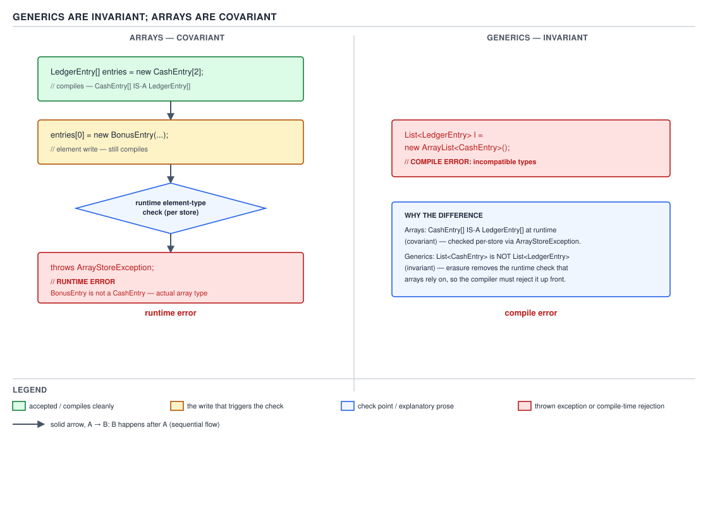
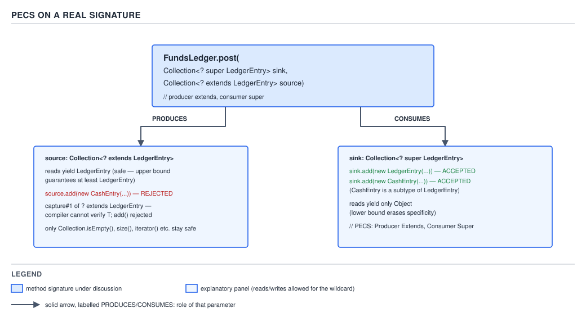

# 03 Java Core — Variance and wildcards — BASICS (§1.21, 1.21.9–1.21.14)

**Target version: Java 21 LTS.** | **Part 1 of 5** | [Index](../00-index.md)
Previous: [Erasure and its consequences](01a-erasure-and-its-consequences.md) · Next: [Raw types and unchecked warnings](01c-raw-types-and-unchecked-warnings.md)

This file covers the substitutability rule generics apply to their type arguments (invariance), the opposite rule arrays apply to their component types (covariance), the three wildcard forms that buy back some of the flexibility invariance removes, and the PECS discipline for reading that flexibility off a real method signature. It hands off erasure itself to `01a-erasure-and-its-consequences.md`, raw types and `List<Object>` vs `List<?>` vs raw `List` to `01c-raw-types-and-unchecked-warnings.md`, the wildcard-capture helper idiom and PECS on hard JDK signatures to `02-in-anger.md`, generic array creation to `02b-generic-arrays-and-self-types.md` and `03b-internals-reifiable-types-and-generic-arrays.md`, capture conversion at the bytecode level to `03d-internals-erasure-limits-and-capture.md`, and the array-mutability story in full to `../arrays/01a-covariance-and-mutability.md`.

## 1. Generics are invariant, arrays are covariant (1.21.9, 1.21.10)

Two container types sit in the same standard library, both indexed by a component type, and they answer the exact same question — "if `S` is a subtype of `T`, is `Container<S>` a subtype of `Container<T>`?" — with opposite rules. A `List<CashEntry>` is never a `List<LedgerEntry>`, no matter how obviously `CashEntry` is a `LedgerEntry`. A `CashEntry[]` *is* a `LedgerEntry[]`, automatically, every time. The divide is not an accident of naming; it is two different eras of the language answering the same substitutability question with the tools they had, and the price for each answer is paid at a different time.

### Why it exists

Arrays are as old as Java 1.0. Before generics existed there was no way to write one `sort` or `equals`-based utility that worked over an array of any reference type without either duplicating it per type or writing it against `Object[]`. Covariance was the mechanism that let `Object[]` utilities such as sorting and printing routines operate over a `String[]` or a `CashEntry[]` by simple upcast, with no generic type parameter in sight — because there were no type parameters yet. It is a pre-generics answer to a pre-generics problem, and it is still load-bearing for that reason: change it now and every array-based API written since 1996 breaks.

Generics arrived in Java 5 answering a different problem: eliminate the casts scattered through every line that pulled an element out of a raw `Collection`, by having the compiler check element types at the call site instead of at the cast. Covariant generic collections would have defeated that goal on day one. If `List<CashEntry>` were a `List<LedgerEntry>`, then code holding the `List<LedgerEntry>` reference could legally call `add(new BonusEntry(id, amount))`, and the underlying object — the same `List<CashEntry>` the caller still has a reference to — would now hold a `BonusEntry` where the caller's code assumes only `CashEntry`. The compiler could not catch it, because the `add` call type-checks fine against the reference's static type. The failure would surface later, at an unrelated `get`, as a `ClassCastException` far from the line that actually broke the invariant. Generics exist to move that exact class of failure to compile time, so they had to close the one path — covariant assignment — that would let it back in.

### The mechanism

**Proving invariance.** Suppose, for contradiction, that the assignment below were legal:

```java
List<CashEntry> cashEntries = new ArrayList<>();
List<LedgerEntry> entries = cashEntries;   // assumed legal
```

`entries` and `cashEntries` are two references to the *same* `ArrayList` object; `entries` only changes what the compiler believes about it. Because `entries` is statically typed `List<LedgerEntry>`, this call now type-checks:

```java
entries.add(new BonusEntry(idOf(entries), zeroGbp()));
```

`BonusEntry` is a `LedgerEntry`, so `add` accepts it against the parameter type `LedgerEntry` — nothing about this call looks wrong to the compiler. But the object underneath is the same `ArrayList` that `cashEntries` still refers to, and it is documented, by its own static type, to hold only `CashEntry` values. The next read through `cashEntries` —

```java
CashEntry first = cashEntries.get(0);
```

— now fails at runtime with a `ClassCastException`, at a line that has nothing wrong with it and is nowhere near the `add` call that actually introduced the bad value. That failure mode — a runtime cast failure whose root cause is an unrelated line, possibly in a different method or class — is precisely what generics were built to eliminate. So the specification refuses to let the premise happen at all: JLS §4.10 makes parameterized types invariant in their type arguments regardless of any subtype relationship between those arguments, and the assignment above is rejected before either line involving `add` or `get` is ever reached. `javac` says so directly. Compiled on JDK 21.0.7, against a listing where this exact assignment sits on line 18 of `Invariance2.java`:

```
Invariance2.java:18: error: incompatible types: List<CashEntry> cannot be converted to List<LedgerEntry>
        List<LedgerEntry> entries = cashEntries;
                                    ^
1 error
```

Read that diagnostic literally: "cannot be *converted*", not "cannot be assigned to a narrower slot" — `javac` is telling you `List<CashEntry>` and `List<LedgerEntry>` are two unrelated types, full stop, independent of the fact that `CashEntry` and `LedgerEntry` are related. That is the whole of invariance in one sentence.

**Pitfall:** the belief "since `CashEntry` is-a `LedgerEntry`, `List<CashEntry>` should be a `List<LedgerEntry>` too" is the single most common wrong intuition new generics users bring from arrays or from plain OO subtyping. The symptom is exactly the diagnostic above, usually hit while trying to pass a `List<CashEntry>` into a method declared to take a `List<LedgerEntry>`. The fix is not to weaken the method's element type to `Object` or to `LedgerEntry` and cast internally — it is to declare the parameter with a wildcard, `List<? extends LedgerEntry>`, which is exactly the tool §2 below introduces for this situation.

**Proving covariance.** Arrays take the opposite position. JLS §10.10 states it as a subtyping rule: if `S` is a subtype of `T`, then `S[]` is a subtype of `T[]`. So this compiles without a diagnostic:

```java
Money oneFifty = new Money(new BigDecimal("1.50"), Currency.getInstance("GBP"));
LedgerEntry[] entries = new CashEntry[2];
entries[0] = new BonusEntry(UUID.randomUUID(), oneFifty);
```

Line 2 is legal by array covariance: `CashEntry[]` really is assignable to a `LedgerEntry[]`-typed reference, unconditionally, with no diagnostic — `javac -Xlint:all` on `ArrayCovariance2.java` produces zero warnings and zero errors for this file. Line 3 also compiles: `entries` is statically a `LedgerEntry[]`, and `BonusEntry` is a `LedgerEntry`, so the store type-checks against the static type exactly the way the generic `add` call type-checked in the invariance proof above. The difference is what happens next. Where the generic list has no per-element runtime type to check against — erasure means an `ArrayList`'s backing storage is a plain `Object[]` with no memory of "only `CashEntry` values here" — an array object carries its actual, runtime component type as part of the object header, set once at `new CashEntry[2]` and never erased. Every reference-array store instruction, `aastore`, is specified by JVMS §6.5 to compare the value being stored against that stored component type before the store is allowed to happen, on every single execution of the instruction, not once at compile time. Running the exact listing above on JDK 21.0.7:

```
Exception in thread "main" java.lang.ArrayStoreException: ArrayCovariance2$BonusEntry
	at ArrayCovariance2.main(ArrayCovariance2.java:17)
```

Line 17 is the `entries[0] = new BonusEntry(id, amount)` store. `javap -c` on the compiled class confirms there is no separate `checkcast` bytecode guarding that store — the check is folded into the `aastore` opcode itself:

```
      27: aload_2
      28: iconst_0
      29: new           #29                 // class ArrayCovariance2$BonusEntry
      32: dup
      33: invokestatic  #31                 // Method java/util/UUID.randomUUID:()Ljava/util/UUID;
      36: aload_1
      37: invokespecial #37                 // Method ArrayCovariance2$BonusEntry."<init>":(Ljava/util/UUID;LArrayCovariance2$Money;)V
      40: aastore
      41: return
```

Offset 40 is the single `aastore` instruction; the array-element-type check and the actual store are the same instruction, not two. Compare that with what the generic `add` call compiled to for the analogous `ArrayList<CashEntry>` case: there is no runtime tag check at the store site at all, because there is no per-element type tag to check — the safety already happened once, at `javac` time, at the `add(CashEntry)` call site, as a signature match against the erased `Object` parameter with a compiler-inserted `checkcast` only at the *read* side (owned in full by `01a-erasure-and-its-consequences.md`).



**D-056** — left lane: `LedgerEntry[] entries = new CashEntry[2]` is accepted by the compiler, then `entries[0] = new BonusEntry(id, amount)` reaches a runtime gate — the per-store element-type check — and throws `ArrayStoreException` there; the lane is labelled "runtime error". Right lane: `List<LedgerEntry> l = new ArrayList<CashEntry>()` never gets past the compiler at all; the lane is labelled "compile error". Read the two lanes side by side: the same shape of mistake is caught at two different times by the two container families.

**Pitfall:** the belief "`LedgerEntry[] entries = new CashEntry[2]` is exactly as safe as the equivalent generic code, since both compile" mistakes "compiles" for "safe". The symptom is an `ArrayStoreException` thrown at a store site that can be arbitrarily far — a different method, a library call three frames up — from where the array was actually created with the narrower component type. The fix is to recognise that writing an array, unlike writing a generic collection, defers the safety check to every single write at runtime; prefer `List<LedgerEntry>` for anything shaped like this, and reserve raw arrays for the cases that specifically need array identity (interop with an array-typed API signature, or a hot loop tuned in `06 JVM internals`).

**Unverified:** whether the JIT can ever eliminate a hot-loop `aastore` check via component-type profiling (as it does for some array bounds checks) is not confirmed here; it would take a `-XX:+PrintCompilation`/`-XX:+PrintOptoAssembly` walk on a specific hot loop to settle, and is out of scope for a BASICS file.

**[NUM]** the cost above is not academic at this domain's volume: stake reservations run at 2.8M/day, 1,200/sec peak. If a batch of `LedgerEntry` values destined for the ledger is materialized as a `LedgerEntry[]` instead of a `List<LedgerEntry>`, every element write into that array pays the `aastore` component-type check, every time, on every one of those reservations — a cost with no equivalent on the generic-collection path, where the equivalent safety was proven once at the `add` call site and erased away by the time the JVM executes anything. The escape hatch is simply not to reach for a reference array when a `List` will do; the narrow case that legitimately needs array identity is covered in `../arrays/01a-covariance-and-mutability.md`, which owns the array-mutability story end to end — this section owns only the *contrast* with generic invariance.

Put the two rules together and a third fact falls out for free: you cannot legally write `new List<CashEntry>[3]`. If it were allowed, array covariance would make that array assignable to a `List<LedgerEntry>[]`-typed reference, and by the array-store proof above, storing a `List<BonusEntry>` into that reference would need to fail at the `aastore` check the same way storing a `BonusEntry` into a `CashEntry[]` fails — but erasure has already thrown away the distinction between `List<CashEntry>` and `List<LedgerEntry>` by the time any `aastore` executes; there is no component type left to check against. Covariance's safety net depends on a runtime-checkable component type, and erasure removes exactly that for any parameterized type. That combination — covariance's assumption plus erasure's information loss — is why generic array creation is illegal by rule rather than merely inconvenient; the compiler-level mechanics of that rejection, and the workarounds (`(T[]) new Object[n]`, `Array.newInstance`), belong to `03b-internals-reifiable-types-and-generic-arrays.md` and `02b-generic-arrays-and-self-types.md`.

**Interview:** asked directly as "why isn't `List<String>` a `List<Object>`?", the one-line answer is the aliasing argument, compressed: because a `List<Object>` reference to the same list would let you `add` any `Object` — including one that isn't a `String` — and that write would be invisible to, and unrejectable by, any other reference that still believes the list holds only `String`. Asked as "why are arrays covariant but generics aren't?", the one-line answer is that arrays predate generics and needed covariance for pre-generic array utilities to exist at all, and they can afford it because the JVM keeps a runtime-checkable component type per array object; generics erase exactly that information, so they close the hole at compile time instead.

> Generic type parameters carry no subtyping between different instantiations of the same generic type — `List<CashEntry>` and `List<LedgerEntry>` are unrelated types, full stop — while arrays carry the subtyping of their component type and enforce it with a per-store runtime check instead of a one-time compile-time proof.

## 2. Wildcards: `? extends T`, `? super T`, and unbounded `?` (1.21.11)

A wildcard is not a type you can write down and hand to `new`. It is a hole punched into a generic type where you have deliberately given up naming what fills it, in exchange for the compiler granting you a controlled, asymmetric slice of the substitutability that invariance otherwise forbids outright.

### Why it exists

Invariance from §1 is safe but rigid to the point of being unusable for a common shape of method: a routine that only ever *reads* `LedgerEntry` values out of a collection has no reason to reject a `List<CashEntry>` argument, since reading a `CashEntry` as a `LedgerEntry` is always safe — but a parameter typed plain `List<LedgerEntry>` rejects it anyway, because of the exact invariance rule proven above. Before wildcards, the only ways around this were to declare the parameter as raw `List` or `List<Object>`, both of which throw away element-type checking entirely (raw types and their unchecked warnings are `01c-raw-types-and-unchecked-warnings.md`'s territory), or to write one overload per concrete element type, which does not scale. Wildcards give back the flexibility invariance removes for exactly the read-only and write-only shapes, without reopening the aliasing hole the invariance proof in §1 closed.

### The mechanism

Each wildcard form trades a use in one direction for safety in the other:

| Form | Admits as the argument | What a read gives you | What you can write in | Why |
|---|---|---|---|---|
| `? extends T` | any `List<S>` where `S` is `T` or a subtype of `T` | `T` | nothing except `null` | the unknown `S` is *some* subtype of `T`, so every element read out is safely widened to `T` — but the compiler does not know which `S` it is, so it cannot prove any value you hand it belongs to that specific `S` |
| `? super T` | any `List<S>` where `S` is `T` or a supertype of `T` | `Object` | `T`, or any subtype of `T` | the unknown `S` is *some* supertype of `T`, so a `T` is always safely narrowed into it on write — but a read can only be typed to what every possible supertype of `T` has in common, which is `Object` |
| `?` (unbounded) | any `List<S>` for any `S` at all | `Object` | nothing except `null` | no bound in either direction — it combines the write restriction of `extends` with the read restriction of `super` |

The mechanism behind the "nothing except `null`" and "gives you `Object`" columns is worked through with real `javac` diagnostics in §4 below, once the running example is in place.

**Insight:** a wildcard type is a constraint attached to a *use* of a generic type, not a nameable type in its own right — you cannot write `new ArrayList<? extends LedgerEntry>()`, because there is no single type there for `new` to instantiate. The compiler resolves each occurrence of a wildcard type into a fresh, unnamed type variable — a *capture*, per JLS §5.1.10 — at the point that occurrence is used as an operand. The clause that trips people up: two `? extends LedgerEntry` occurrences, even on parameters of the very same method, denote *two different* captured unknowns unless the compiler can prove otherwise. That is exactly why swapping two elements of a `List<?>` in place cannot be written directly against the wildcard type and needs a small private generic helper method underneath to let the compiler unify the unknown with a named type variable — the capture-helper idiom itself, and PECS applied to the harder JDK signatures that need it, belong to `02-in-anger.md`; this file only needs you to know the idiom exists and why.

No diagram: the manifest assigns this section none — the table above is the picture for the three forms; D-056 already covered the invariance/covariance contrast and D-057 below covers PECS on a real signature.

```java
static Money totalCents(List<? extends LedgerEntry> entries) {
    Money running = new Money(BigDecimal.ZERO, Currency.getInstance("GBP"));
    for (LedgerEntry entry : entries) {
        running = new Money(running.amount().add(entry.amount().amount()), running.currency());
    }
    return running;
}
```

`totalCents` accepts a `List<CashEntry>`, a `List<BonusEntry>`, or a `List<LedgerEntry>` — every read out of `entries` comes back typed `LedgerEntry`, which is all the method needs, and the caller loses nothing by passing a more specific list. Written as `List<LedgerEntry> entries` instead, this method would reject a `List<CashEntry>` for exactly the invariance reason proven in §1, even though nothing about summing amounts cares which concrete subtype the list holds.

No gotcha beyond the capture-per-occurrence rule already called out as the *Insight* above: the table's restrictions are the whole story, and there is no further surprise once you have internalised that a wildcard names an unknown, not a type.

**Interview:** asked "when would you use `? extends` versus `? super` versus a plain type parameter `<T>`?", the one-line answer is: use `? extends T` for a parameter you only read from, `? super T` for a parameter you only write into, and a plain `<T>` type parameter the moment you need to both read and write the *same* element type in one method body — a wildcard's whole value is letting the compiler forget which concrete type is behind it, which only pays off when the method never needs to name that type again.

> A wildcard is a constraint on an unknown type argument, not a nameable type — `? extends T` proves every element is at least a `T` on the way out and proves nothing about what goes in; `? super T` proves the reverse.

## 3. PECS: Producer Extends, Consumer Super (1.21.12) `[X-REF 02]`

### Why it exists

The two wildcard forms in §2 are correct but easy to reach for backwards under pressure — nothing about the syntax `? extends T` versus `? super T` tells you at a glance which one belongs on which parameter of a two-collection method. PECS is the mnemonic the JDK's own designers reach for and name in the Javadoc: **P**roducer **E**xtends, **C**onsumer **S**uper. A parameter your method only *reads from* — a producer, from the method's point of view — takes `? extends T`. A parameter your method only *writes into* — a consumer — takes `? super T`. The mnemonic is worth nothing memorised; it earns its keep read off a real signature.

### The mechanism

`java.util.Collections.copy` is the canonical signature to learn PECS from, because it has one parameter of each kind in the same method. Quoted from the JDK 21 `Collections` source:

```java
public static <T> void copy(List<? super T> dest, List<? extends T> src)
```

Read it left to right against the mnemonic: `dest` is where elements get written — a consumer — so it is `? super T`, meaning `dest` may be a `List` of `T` or of anything *broader* than `T`, and every write of a `T` into it is guaranteed safe because whatever the real element type of `dest` is, it is a supertype of `T`. `src` is where elements get read from — a producer — so it is `? extends T`, meaning `src` may be a `List` of `T` or of anything *narrower* than `T`, and every value read out of it is guaranteed to be at least a `T`. The same shape appears throughout the collections API once you know to look for it: `Collection.addAll(Collection<? extends E> c)` takes its argument as a pure producer of `E`, and `Comparator<? super T>` (as used by `List.sort` and `Collections.sort`) takes a comparator that only needs to *consume* pairs of `T`, so it is allowed to be a comparator written for some broader type. `02 Java collections` owns the full API-level treatment of where PECS shows up across `Collection`, `List`, and `Comparator`; this file only needs the mechanism paragraph above to make the signature legible.

Map `Collections.copy`'s shape directly onto QuizStakes: `FundsLedger.post` moves entries from one collection into another, and is this file's running example for the rest of this section and §4:

```java
static void post(Collection<? super LedgerEntry> sink, Collection<? extends LedgerEntry> source) {
    for (LedgerEntry entry : source) {
        sink.add(entry);
    }
}
```

`sink` is the consumer — `post` only ever calls `sink.add(entry)` — so it is `? super LedgerEntry`: a caller may pass a `Collection<LedgerEntry>`, or a broader one such as `Collection<Object>`, and every `add(entry)` call is guaranteed to type-check, because whatever `sink`'s real element type is, it is a supertype of `LedgerEntry`. `source` is the producer — `post` only ever reads elements *out of* `source` via the enhanced-`for` — so it is `? extends LedgerEntry`: a caller may pass a `Collection<CashEntry>`, a `Collection<BonusEntry>`, or the base `Collection<LedgerEntry>`, and every element read back is guaranteed to be at least a `LedgerEntry`.



**D-057** — the box is `FundsLedger.post(Collection<? super LedgerEntry> sink, Collection<? extends LedgerEntry> source)`. The `source` arrow is labelled PRODUCES: reads off it come back typed `LedgerEntry`, and the `add` call on it is barred with a cross. The `sink` arrow is labelled CONSUMES: writes into it are accepted, and reads off it come back typed `Object`. The rejected `add` on `source` is annotated with the capture type name, `capture#1 of ? extends LedgerEntry`, which is exactly the diagnostic worked through in §4 below.

No gotcha beyond the direction itself: get `sink` and `source`'s bounds backwards and the method still compiles as long as it does nothing with either parameter — the compiler only objects the moment you try to read from a `? super` parameter as anything narrower than `Object`, or write anything but `null` into a `? extends` parameter, which is exactly §4's subject.

**Interview:** asked to recite PECS on the spot, don't stop at the mnemonic — name the signature. "Producer Extends, Consumer Super, and the canonical example is `Collections.copy(List<? super T> dest, List<? extends T> src)`: `dest` is written to, so it's the consumer and takes `super`; `src` is read from, so it's the producer and takes `extends`." Naming a real signature from memory is what separates "I memorised a mnemonic" from "I understand why it holds."

> PECS names which wildcard direction belongs on which parameter by asking one question per parameter — does this method only read from it (producer, `? extends T`) or only write into it (consumer, `? super T`)?

## 4. What a producer wildcard refuses on write, and what a consumer wildcard gives back on read (1.21.13, 1.21.14)

### Why it exists

§2's table stated the restrictions; this section is where they stop being asserted and start being proven, on the exact `FundsLedger.post` signature §3 built. Both restrictions come from the same root cause — the compiler reasoning about an unknown type it refuses to guess at — approached from opposite ends: one is about what is safe to put *in*, the other about what is safe to take *out*.

### The mechanism

**[PROVE] 1.21.13 — you cannot add anything but `null` to `source`.** Inside `post`, `source` is declared `Collection<? extends LedgerEntry>`. The unknown real element type of whatever collection the caller passed — call it `S` — is *some* subtype of `LedgerEntry`, but the body of `post` has no way to know which one. It might be `CashEntry`, it might be `BonusEntry`, it might be some third `LedgerEntry` implementor that does not exist yet. For `source.add(value)` to be safe, `value` would have to be provably an `S` — but no expression in `post`'s body can be typed as that specific, unknown `S`, because `S` was never named anywhere the method can see. So the compiler refuses every `add` argument that is not provably assignable to *every possible* `S` at once. Attempting it on the exact listing below — where the failing call sits on line 23 of `WildcardCapture2.java` and reads `source.add(new BonusEntry(UUID.randomUUID(), zero))` — produces, on JDK 21.0.7:

```
WildcardCapture2.java:23: error: incompatible types: BonusEntry cannot be converted to CAP#1
            source.add(new BonusEntry(UUID.randomUUID(), zero));
                       ^
  where CAP#1 is a fresh type-variable:
    CAP#1 extends LedgerEntry from capture of ? extends LedgerEntry
Note: Some messages have been simplified; recompile with -Xdiags:verbose to get full output
1 error
```

That diagnostic is the single most useful sentence in this file, and it is worth being able to read cold in an interview: `CAP#1` is the compiler's name for the fresh, unnamed type variable §2's *Insight* described — the capture of `? extends LedgerEntry` at this specific occurrence of `source`. The error says `BonusEntry` cannot be converted *to* `CAP#1` — not the other way around — because the method needs to hand `CAP#1` a value it can prove belongs to whatever `CAP#1` turns out to be, and `BonusEntry` is only proven to be a `LedgerEntry`, one specific possibility among many `CAP#1` could be. There is exactly one value the compiler can prove belongs to every possible `CAP#1` regardless of what it turns out to be: `null`, because the null type is defined by JLS §4.1 to be a subtype of every reference type, including whatever `CAP#1` resolves to. So `source.add(null)` compiles cleanly — verified on the same method body with only that one line changed:

```java
static void post(Collection<? super LedgerEntry> sink, Collection<? extends LedgerEntry> source) {
    for (LedgerEntry entry : source) {
        sink.add(entry);
    }
    source.add(null);
}
```

compiles with zero diagnostics under `-Xlint:all` on JDK 21.0.7.

**Pitfall:** Context rather than a [TRAP] leaf here, but worth stating plainly. this is not a defect in wildcards, it is the entire point of them — a producer wildcard is a promise from the caller that *only reading* is safe, and the compiler enforces that promise by refusing every write the caller did not explicitly carve out with `null`.

**[PROVE] 1.21.14 — reading from `sink` gives you `Object`, not `LedgerEntry`.** `sink` is declared `Collection<? super LedgerEntry>`. Its unknown real element type `S` is *some* supertype of `LedgerEntry` — it could be `LedgerEntry` itself, or `Object`, or (once `01c-raw-types-and-unchecked-warnings.md`'s territory is set aside) some other supertype in between. A read off `sink.iterator().next()` returns a value of type `S`, but the method body has no way to know which supertype `S` is, so it cannot type that read as `LedgerEntry` — the only type every possible supertype of `LedgerEntry` is guaranteed to have in common is `Object`, the root of the reference type hierarchy. Attempting to type the read narrower fails, with the failing assignment on line 17 of `SuperRead2.java`:

```
SuperRead2.java:17: error: incompatible types: CAP#1 cannot be converted to LedgerEntry
            LedgerEntry first = sink.iterator().next();
                                                    ^
  where CAP#1 is a fresh type-variable:
    CAP#1 extends Object super: LedgerEntry from capture of ? super LedgerEntry
1 error
```

The capture description reads the other way from §4's first proof: `CAP#1 extends Object super: LedgerEntry` — bounded above by `Object`, below by `LedgerEntry`. That upper bound of `Object` is exactly what the read is stuck at.

**Insight:** `var` does not rescue this the way it might feel like it should. `var first = sink.iterator().next()` compiles, but `first`'s inferred type is `Object`, not `LedgerEntry` — `var` infers whatever type the right-hand side actually has, and the right-hand side's type here is `Object` for the exact reason just proven, not because `var` is somehow more permissive than an explicit type. Confirmed by disassembling the compiled method: the call after the read is `invokevirtual java/lang/Object.getClass:()Ljava/lang/Class;`, not any `LedgerEntry` member — the compiler generated an `Object` call because `first`'s static type really is `Object`, with no `checkcast` inserted anywhere to narrow it:

```
  static void reportFirst(java.util.Collection<? super SuperReadVar2$LedgerEntry>);
    Code:
       0: aload_0
       1: invokeinterface #7,  1            // InterfaceMethod java/util/Collection.iterator:()Ljava/util/Iterator;
       6: invokeinterface #13,  1           // InterfaceMethod java/util/Iterator.next:()Ljava/lang/Object;
      11: astore_1
      12: getstatic     #19                 // Field java/lang/System.out:Ljava/io/PrintStream;
      15: aload_1
      16: invokevirtual #25                 // Method java/lang/Object.getClass:()Ljava/lang/Class;
      19: invokevirtual #29                 // Method java/io/PrintStream.println:(Ljava/lang/Object;)V
      22: return
```

Offset 16 is `Object.getClass`, called on the exact local that `var` inferred — there is no narrower type anywhere in this bytecode for `var` to have quietly recovered.

No gotcha beyond the two proofs above: once you can name the capture type in the diagnostic and say what it is bounded by, both restrictions stop being surprising and start being predictable from the declaration alone.

**Interview:** if asked "why can't you add to a `List<? extends Number>`?" and you only say "because it's read-only", you've given the mnemonic, not the mechanism — the stronger answer names the capture: "the compiler captures the unknown element type as a fresh type variable bounded above by `Number`, and no expression except `null` is provably a value of that specific captured type, since the compiler never learns which subtype of `Number` it actually is." That is the sentence that shows you've read the `javac` diagnostic and not just the JavaDoc summary.

> Through a `? extends T` parameter you may write nothing but `null`, because no expression is provably a value of the unknown captured subtype; through a `? super T` parameter a read can only be typed `Object`, because `Object` is the only type every possible captured supertype of `T` is guaranteed to share.

## Supporting facts

### Wildcards cannot appear as a type argument to `new`

A wildcard is a constraint on a use, not a nameable type — `new ArrayList<? extends LedgerEntry>()` does not compile, because there is no single concrete type for `new` to instantiate against an unbounded-from-below constraint. Always instantiate with a concrete type argument (`new ArrayList<CashEntry>()`) and only widen to a wildcard type at the point of assignment or a parameter declaration.

> A wildcard describes what a reference may point at, never what `new` may construct.

### Unbounded `?` is not the same as raw

`List<?>` still carries a real, single, unknown element type that the compiler tracks and refuses to let you break — it is `List<? extends Object>` in effect for reads. A raw `List` carries no type argument at all and disables generic type-checking on that variable entirely, including the unchecked-warning machinery. `01c-raw-types-and-unchecked-warnings.md` owns the full raw-type story; this file only needs you to keep the two apart.

> `List<?>` is generics saying "I don't know the element type, but there is one and I will enforce it"; raw `List` is generics turned off.

### `Object` is also the bound-free wildcard's write ceiling, same as `? super T`'s read ceiling

Because `?` combines `? extends Object`'s write restriction with `? super`-style read behaviour bottoming out at `Object`, an unbounded wildcard collection can neither be written to (except `null`) nor read from at any type narrower than `Object` — it is the most restrictive of the three forms in both directions, which is exactly why it is reached for only when a method genuinely does not care about the element type at all (counting elements, checking emptiness).

> Unbounded `?` gives up both directions of type information at once — it is for methods that need neither.

### A bounded type parameter and a bounded wildcard look alike but answer different questions

`<T extends LedgerEntry>` on a method's type-parameter list names a real type variable `T` that the method body can use consistently — write it once, and `T` means the same type everywhere in that method's signature and body, which is why a generic method with `<T extends LedgerEntry> void post(List<T> entries)` can also take a second parameter `List<T> destination` and know both refer to the *same* `T`. `List<? extends LedgerEntry>` names no such reusable variable — as §2's *Insight* established, each wildcard occurrence captures its own unknown, so two `List<? extends LedgerEntry>` parameters cannot be assumed to share an element type at all, even though they read identically. Reach for a type parameter the moment two or more positions in a signature must provably agree on the same unknown type; reach for a wildcard the moment they don't need to. `01-basics.md` owns bounded type parameters and generic method declaration forms in full.

> `<T extends X>` binds a name you can reuse across a signature; a wildcard binds nothing — it is a fresh unknown at every occurrence.

## Pitfalls

### Since `CashEntry` is-a `LedgerEntry`, `List<CashEntry>` should be usable wherever `List<LedgerEntry>` is expected

**Wrong**

```java
static void postAll(List<LedgerEntry> entries) {
    for (LedgerEntry entry : entries) {
        System.out.println(entry.id());
    }
}

static void callSite(List<CashEntry> cashEntries) {
    postAll(cashEntries);
}
```

```
Invariance2.java:18: error: incompatible types: List<CashEntry> cannot be converted to List<LedgerEntry>
```

**Right**

```java
static void postAll(List<? extends LedgerEntry> entries) {
    for (LedgerEntry entry : entries) {
        System.out.println(entry.id());
    }
}

static void callSite(List<CashEntry> cashEntries) {
    postAll(cashEntries);
}
```

Declaring the parameter with `? extends LedgerEntry` accepts `List<CashEntry>`, `List<BonusEntry>`, and `List<LedgerEntry>` alike, because `postAll` only reads elements out of `entries` and never writes into it — exactly the producer shape PECS names.

**Why people believe it:** ordinary object-reference assignment (`LedgerEntry e = new CashEntry(id, amount)`) works this way, so it feels natural to expect the same substitutability to carry through a generic type parameter — but §1 proves that assumption breaks the exact safety generics exist to provide.

### `LedgerEntry[] entries = new CashEntry[2]` is safe because it compiles cleanly

**Wrong**

```java
LedgerEntry[] entries = new CashEntry[2];
entries[0] = new BonusEntry(UUID.randomUUID(), oneFifty);
```

```
Exception in thread "main" java.lang.ArrayStoreException: ArrayCovariance2$BonusEntry
	at ArrayCovariance2.main(ArrayCovariance2.java:17)
```

**Right**

```java
List<LedgerEntry> entries = new ArrayList<>(List.of(
    new CashEntry(UUID.randomUUID(), oneFifty)
));
entries.set(0, new BonusEntry(UUID.randomUUID(), oneFifty));
```

A `List<LedgerEntry>` declared and populated as `LedgerEntry` from the start has no narrower runtime component type hiding underneath it the way the `CashEntry[]` array does, so there is no per-write tag check to fail — the earlier `CashEntry`-typed array creation is what introduced the trap, and a `List<LedgerEntry>` never lets that narrower typing leak into a shared reference in the first place.

**Why people believe it:** a clean compile with `-Xlint:all` and zero warnings reads as "the compiler checked this and it's fine" — but for arrays a clean compile only means the *static* types line up; the narrower *runtime* component type is still there, unchecked until the next store.

### `var` on a `Collection<? super LedgerEntry>` read infers `LedgerEntry`, since that's obviously what's in there

**Wrong**

```java
static void reportFirst(Collection<? super LedgerEntry> sink) {
    var first = sink.iterator().next();
    LedgerEntry entry = first;
}
```

```
error: incompatible types: Object cannot be converted to LedgerEntry
```

**Right**

```java
static void reportFirst(Collection<? super LedgerEntry> sink) {
    Object first = sink.iterator().next();
    if (first instanceof LedgerEntry entry) {
        System.out.println(entry.id());
    }
}
```

`var` infers exactly the static type the expression already has — `Object`, per §4's proof — so getting a `LedgerEntry` back out requires an explicit runtime check, such as a pattern-matching `instanceof`, not a declaration-site type annotation.

**Why people believe it:** `sink` is conceptually "a collection that can hold `LedgerEntry` values", so it feels like reading from it should hand back a `LedgerEntry` — but `? super LedgerEntry` only proves what can safely go *in*, never what specifically already came out, which is why §4 reads the capture bound as `extends Object super: LedgerEntry` rather than pinned to `LedgerEntry` on the read side.

## Cheat sheet

| Question | Answer |
|---|---|
| Is `List<CashEntry>` a `List<LedgerEntry>`? | No — generics are invariant (JLS §4.10); unrelated types regardless of `CashEntry`/`LedgerEntry` subtyping |
| Is `CashEntry[]` a `LedgerEntry[]`? | Yes — arrays are covariant (JLS §10.10); enforced per-write by `aastore` at runtime |
| Where does the generic mistake fail? | At compile time — `incompatible types` from `javac` |
| Where does the array mistake fail? | At runtime — `ArrayStoreException` at the store site |
| `? extends T` reads as | `T` |
| `? extends T` accepts writes of | nothing except `null` |
| `? super T` reads as | `Object` |
| `? super T` accepts writes of | `T` or any subtype of `T` |
| `?` (unbounded) reads as | `Object` |
| `?` (unbounded) accepts writes of | nothing except `null` |
| PECS | Producer `extends`, Consumer `super` |
| Canonical PECS signature | `Collections.copy(List<? super T> dest, List<? extends T> src)` |
| Capture error tells you | the fresh type-variable name (`CAP#1`) and its bound, from whichever wildcard occurrence you used |
| Why generic arrays are illegal | covariance needs a runtime-checkable component type; erasure removes it for parameterized types |

## Self-test

**Q1.** Why doesn't Java let `List<CashEntry>` be assigned to a `List<LedgerEntry>`-typed variable, when `CashEntry` is a subtype of `LedgerEntry`?

<details><summary>Answer</summary>

Because if it were allowed, a caller holding the `List<LedgerEntry>` reference could call `add` with any `LedgerEntry` — say a `BonusEntry` — and that call would type-check against the reference's static type. But the underlying object is the same list a `List<CashEntry>`-typed reference still points at, which is documented by its type to hold only `CashEntry`. The next read through that `List<CashEntry>` reference would then fail with a `ClassCastException`, far from the line that actually introduced the bad value. Generics exist specifically to move that class of failure to compile time, so JLS §4.10 makes parameterized types invariant regardless of any subtyping between their type arguments, and `javac` rejects the assignment up front with "incompatible types: List<CashEntry> cannot be converted to List<LedgerEntry>".

</details>

**Q2.** `LedgerEntry[] entries = new CashEntry[2]` compiles with no warnings. What happens when you then execute `entries[0] = new BonusEntry(id, amount)`, and why does the equivalent generic-collection mistake never reach runtime at all?

<details><summary>Answer</summary>

It throws `java.lang.ArrayStoreException` at that exact store line. Arrays are covariant — `CashEntry[]` really is a `LedgerEntry[]` per JLS §10.10 — so the assignment to `entries` and the subsequent store both type-check statically. But the array object still carries its actual runtime component type, `CashEntry`, and the JVM's `aastore` instruction is specified to check the value being stored against that runtime component type on every execution, per JVMS §6.5 — there is no separate `checkcast`, the check is folded into `aastore` itself. The generic equivalent never gets this far because it's rejected by `javac` before compilation even finishes, since generics are invariant and the assignment that would set this up is itself a compile error.

</details>

**Q3.** What is a wildcard, mechanically — is `?` a type the same way `LedgerEntry` is a type?

<details><summary>Answer</summary>

No. A wildcard is a constraint on an unknown type, attached to a *use* of a generic type — you can write `List<? extends LedgerEntry>` as a parameter or variable type, but you cannot write `new ArrayList<? extends LedgerEntry>()`, because there's no single concrete type there for `new` to instantiate. The compiler resolves each occurrence of a wildcard type into a fresh, unnamed type variable — a capture, per JLS §5.1.10 — at the point that occurrence is used. Two separate `? extends LedgerEntry` occurrences, even in the same method signature, are two different captured unknowns unless the compiler can prove otherwise, which is exactly why some wildcard manipulations need a small generic helper method to let the compiler unify the unknown with a name it can reason about.

</details>

**Q4.** State PECS, then read `Collections.copy(List<? super T> dest, List<? extends T> src)` against it, parameter by parameter.

<details><summary>Answer</summary>

PECS: Producer Extends, Consumer Super — a parameter your method only reads from is a producer and takes `? extends T`; a parameter it only writes into is a consumer and takes `? super T`. In `Collections.copy`, `dest` is where elements get written, so it's the consumer and correctly takes `? super T` — meaning `dest`'s real element type is `T` or something broader, so every `T` written into it is guaranteed to fit. `src` is where elements get read from, so it's the producer and correctly takes `? extends T` — meaning `src`'s real element type is `T` or something narrower, so every value read out of it is guaranteed to be at least a `T`.

</details>

**Q5.** Inside `FundsLedger.post(Collection<? super LedgerEntry> sink, Collection<? extends LedgerEntry> source)`, why does `source.add(new BonusEntry(id, amount))` fail to compile, and why does `source.add(null)` compile fine?

<details><summary>Answer</summary>

`source`'s real element type is some unknown subtype of `LedgerEntry`, captured by the compiler as a fresh type variable — `javac` names it `CAP#1` in the diagnostic, with the bound `CAP#1 extends LedgerEntry from capture of ? extends LedgerEntry`. For the `add` call to be safe, the argument would need to be provably a value of that specific unknown subtype, but `BonusEntry` is only proven to be *a* `LedgerEntry`, not necessarily the same subtype `CAP#1` turns out to be — so the compiler rejects it with "BonusEntry cannot be converted to CAP#1". `null` is the one exception, because the null type is a subtype of every reference type by JLS §4.1, so it's provably assignable to `CAP#1` no matter what `CAP#1` resolves to.

</details>

**Q6.** Why does reading `sink.iterator().next()` from a `Collection<? super LedgerEntry> sink` give you `Object` rather than `LedgerEntry`, and does declaring the variable with `var` change that?

<details><summary>Answer</summary>

`sink`'s real element type is some unknown supertype of `LedgerEntry` — it could be `LedgerEntry` itself, `Object`, or anything in between — captured as `CAP#1 extends Object super: LedgerEntry`. A read has to be typed to something every possible supertype of `LedgerEntry` is guaranteed to share, and the only such type is `Object`, the root of the reference hierarchy. `var` does not change this: `var` infers whatever static type the expression actually has, and that type is `Object` for the reason just given — disassembling the compiled method shows the following call is `invokevirtual Object.getClass`, with no narrower type or `checkcast` anywhere.

</details>

**Q7.** Why is `new List<CashEntry>[3]` illegal, given that both `new CashEntry[3]` and `List<CashEntry>` are individually legal?

<details><summary>Answer</summary>

Array covariance requires a runtime-checkable component type to enforce safety on every write — that's what makes `aastore`'s per-store check possible for `CashEntry[]`. But erasure removes the distinction between `List<CashEntry>` and `List<LedgerEntry>` by the time the JVM runs anything; there is no `List<CashEntry>`-specific runtime component type left for an equivalent `aastore` check to test against. Allowing generic array creation would let covariance apply to a component type that erasure has already made indistinguishable from any other parameterization of the same raw type, so the language forbids the array creation expression outright rather than allow a hole with no possible runtime guard. The bytecode-level mechanics are `03b-internals-reifiable-types-and-generic-arrays.md`'s territory.

</details>

## Open questions

- **Unverified:** whether the JIT can eliminate a hot-loop `aastore` component-type check via profiling the way it elides some array bounds checks — would need a `-XX:+PrintCompilation`/disassembly walk on a specific hot loop against JDK 21.0.7 to settle; out of scope for a BASICS-tier file.

---

**Leaves covered:** 1.21.9, 1.21.10, 1.21.11, 1.21.12, 1.21.13, 1.21.14 (6 leaves)
**Leaves deferred:** none
**Diagrams included:** D-056, D-057
**Target version:** Java 21 LTS
**Lines:** 461
