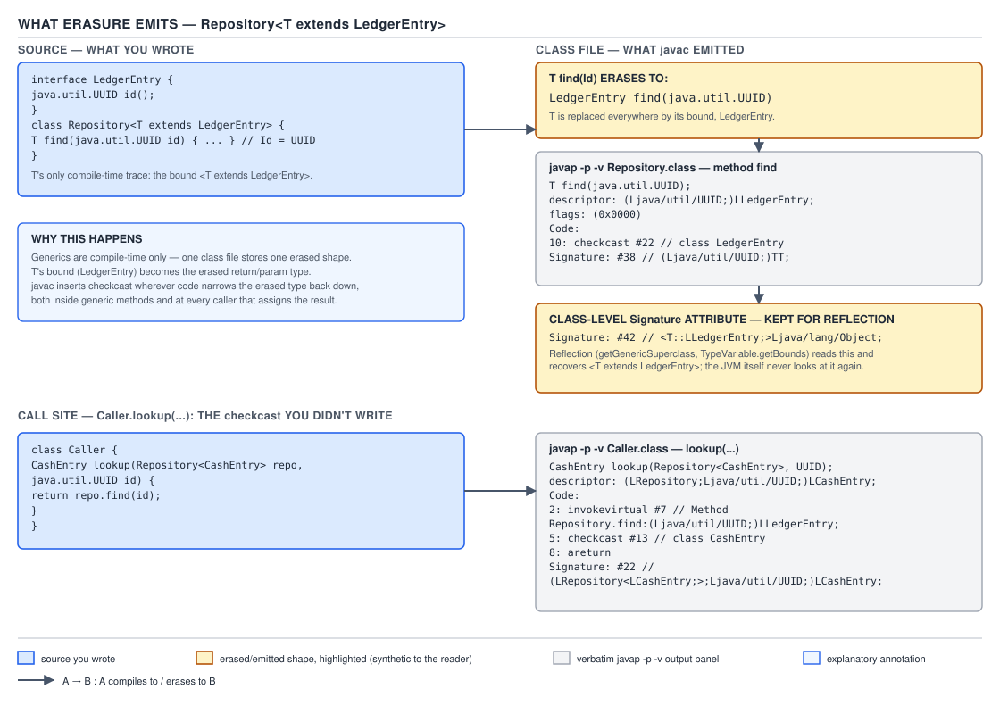

# 03 Java Core — What erasure emits, and what the `Signature` attribute keeps — INTERNALS (§3.5, 3.5.1, 3.5.2)

**Target version: Java 21 LTS.** | **Part 3 of 5** | [Index](../00-index.md)
Previous: [Migration compatibility and reading hard signatures](02d-migration-and-reading-signatures.md) · Next: [Bridge methods](03a-internals-bridge-methods.md)

This file answers one question at the bytecode level: when `javac` erases a generic program, what exactly lands in the `.class` file, and what — if anything — survives? `01a-erasure-and-its-consequences.md` already states erasure once, at the BASICS tier, with the six-consequence list and the reifiable/non-reifiable split; this file does not repeat that table. Here the reader compiles the same declarations twice — once as source, once as evidence — and reads the disassembly instruction by instruction: §3.5.1 covers what erasure emits into method and field descriptors and where the compensating `checkcast` instructions land, and §3.5.2 covers the `Signature` attribute that keeps the generic declaration alive in the file for reflection and separate compilation even though the executable bytecode has none of it. Bridge methods — the second mechanism `javac` emits to keep an erased program sound — are `03a-internals-bridge-methods.md`, immediately next.

## 1. What erasure actually emits into the descriptor (3.5.1)

### The mental model

Split `javac`'s work into two phases that run one after the other, not interleaved. Phase one is the type checker: it walks the fully generic AST — `Repository<T extends LedgerEntry>`, `T find(UUID id)`, the call site `repo.find(id)` where `repo` is a `Repository<CashEntry>` — and proves every expression well-typed *using the type arguments*. Phase two is erasure: it rewrites that same tree into a program that contains no type variables and no parameterized types at all, and — because deleting the type information can turn a previously well-typed program into a badly-typed one — it inserts exactly the casts needed to keep the *erased* program type-correct on its own terms. The output of phase two, not phase one, is what gets written to the `.class` file. A method descriptor never contains `<T>`; it contains whatever phase two decided `T` erases to.

### Why it exists

Generics shipped in Java 5 (JSR 14) with a constraint that shaped everything downstream: migration compatibility. Existing `.class` files compiled against `List` had to keep working unchanged against `List<String>` call sites, and existing JVMs — which knew nothing of type parameters — had to keep running the new bytecode without modification. The chosen design makes every generic class compile to exactly one class file with exactly one raw runtime shape, and pushes all of the type-argument checking into the compiler, at the boundary where the erased program is turned back into source-level guarantees. `01a-erasure-and-its-consequences.md` covers why this specific trade beat reification; this file is about what the trade actually produces in the file.

### The mechanism

`[SOURCE]` JLS 21 §4.6 defines the erasure mapping in five clauses. Quoting the operative ones:

> * The erasure of a parameterized type (§4.5) `G<T1,…,Tn>` is `|G|`.
> * The erasure of an array type `T[]` is `|T|[]`.
> * The erasure of a type variable (§4.4) is the erasure of its leftmost bound.
> * The erasure of every other type is the type itself.

Reading each clause against the shared declarations:

```java
interface LedgerEntry { UUID id(); }
record CashEntry(UUID id, BigDecimal amount) implements LedgerEntry {}
record BonusEntry(UUID id, BigDecimal amount) implements LedgerEntry {}

class Repository<T extends LedgerEntry> {
    private final Map<UUID, T> byId = new HashMap<>();
    T find(UUID id) { return byId.get(id); }
    void store(T entry) { byId.put(entry.id(), entry); }
}
```

- **Parameterized type → raw type.** `Map<UUID, T>` is `G<T1,T2>` with `G = Map`, so its erasure is `|Map|`, i.e. plain `Map`. The field `byId` is declared `Map` in the descriptor, never `Map<UUID,T>` — the type arguments are gone from the *executable* type of the field.
- **Type variable → erasure of its leftmost bound.** `T extends LedgerEntry` is a type variable whose (only) bound is `LedgerEntry`, so `|T| = |LedgerEntry| = LedgerEntry`. Every occurrence of `T` in a descriptor — the return type of `find`, the parameter type of `store` — becomes `LedgerEntry`.
- **Everything else → itself.** `UUID` is not a type variable and not parameterized, so it erases to `UUID` unchanged. This is the case that makes it easy to forget erasure is happening at all: most of a signature is already erasure-stable.

An **unbounded** type variable has an implicit bound of `Object` (JLS 4.4: "if a type variable is declared without an explicit bound, `Object` is assumed"), so `class Box<E> { E get(); }` erases `E` to `Object` — `javap` on a compiled `Box` shows `E get();` with `descriptor: ()Ljava/lang/Object;`. That is the leftmost-bound rule applied to the trivial case: no explicit bound means the implicit bound is leftmost by default, because it is the only one.

**Insight:** bound *order* is observable in the binary, and this is the fact interviewers actually probe. Compile an intersection-bounded variant:

```java
class SortedRepository<T extends LedgerEntry & Comparable<T>> {
    private T best;
    T best() { return best; }
    void offer(T candidate) { best = candidate; }
}
```

`javap -p -c -v SortedRepository.class` (JDK 21.0.7) gives:

```
class SortedRepository<T extends LedgerEntry & java.lang.Comparable<T>> extends java.lang.Object
  T best();
    descriptor: ()LLedgerEntry;
    Signature: #18                          // ()TT;
Signature: #22   // <T::LLedgerEntry;:Ljava/lang/Comparable<TT;>;>Ljava/lang/Object;
```

`T` is declared `LedgerEntry & Comparable<T>` — two bounds — and the descriptor for `best()` erases to `LLedgerEntry;`, not `Ljava/lang/Comparable;`. Swap the order in the source to `Comparable<T> & LedgerEntry` and the descriptor changes to `Ljava/lang/Comparable;`, because "leftmost" is read off the declaration text, not off any notion of "most specific" or "most useful" bound. The class-level `Signature` attribute (§3.5.2 below) still records both bounds as `<T::LLedgerEntry;:Ljava/lang/Comparable<TT;>;>` — the double colon before the first bound and single colons before the rest, decoded in the next section — so nothing is lost for reflection; only the descriptor, which the linker and every non-generic caller sees, picks the leftmost one.

### D-104



**D-104** — On the left, the source `class Repository<T extends LedgerEntry>` with `T find(Id)`; on the right, the emitted method descriptor `LedgerEntry find(Id)`, the `checkcast` inserted at the call site, and the `Signature` attribute holding `<T extends LedgerEntry>` for reflection. Follow the arrow from the source `T` to both outputs: the descriptor loses it (erased to `LedgerEntry`), the `Signature` string keeps it (`TT;`) — that fork is the whole leaf pair in one picture.

### `[BYTECODE]`: reading the disassembly instruction by instruction

Compiling the shared declarations on JDK 21.0.7 (`javac -Xlint:all *.java && javap -p -c -v Repository.class`) gives this constant pool and method bodies (excerpted to the relevant entries):

```
Constant pool:
  #10 = Fieldref           #11.#12        // Repository.byId:Ljava/util/Map;
  #16 = InterfaceMethodref #17.#18        // java/util/Map.get:(Ljava/lang/Object;)Ljava/lang/Object;
  #22 = Class              #23            // LedgerEntry
  #24 = InterfaceMethodref #22.#25        // LedgerEntry.id:()Ljava/util/UUID;
  #28 = InterfaceMethodref #17.#29        // java/util/Map.put:(Ljava/lang/Object;Ljava/lang/Object;)Ljava/lang/Object;

  T find(java.util.UUID);
    descriptor: (Ljava/util/UUID;)LLedgerEntry;
    Code:
      stack=2, locals=2, args_size=2
         0: aload_0
         1: getfield      #10                 // Field byId:Ljava/util/Map;
         4: aload_1
         5: invokeinterface #16,  2           // InterfaceMethod java/util/Map.get:(Ljava/lang/Object;)Ljava/lang/Object;
        10: checkcast     #22                 // class LedgerEntry
        13: areturn
    Signature: #38                          // (Ljava/util/UUID;)TT;
```

Reading `find` line by line: `0: aload_0` pushes `this`. `1: getfield #10` reads the `byId` field, whose *own* descriptor is the raw `Map` (the parameterized-type-to-raw-type clause above already fired on the field). `4: aload_1` pushes the `UUID` argument. `5: invokeinterface #16` calls `Map.get(Object)Object` — note the descriptor here is `Object`, not `T`, because `Map.get` is itself generic and erased the same way; the JVM has already handed back a bare `Object` reference at this point, with no memory of what it actually points to. `10: checkcast #22` is the compensating cast the mental model promised: it asserts the popped `Object` is an instance of `LedgerEntry` before `13: areturn` hands it back — this cast exists purely to make the erased body ( which promises callers `LedgerEntry`, per its own descriptor) consistent with what `Map.get` erased to (`Object`). This is **cast site 1: inside the generic method itself**, inserted so the callee's body type-checks against its own erased return type.

Now a caller, compiled separately against `Repository.class`:

```java
class Caller {
    CashEntry lookupCash(Repository<CashEntry> repo, UUID id) {
        return repo.find(id);
    }

    LedgerEntry lookupLoose(Repository<CashEntry> repo, UUID id) {
        return repo.find(id);
    }
}
```

`javap -p -c -v Caller.class`:

```
  CashEntry lookupCash(Repository<CashEntry>, java.util.UUID);
    descriptor: (LRepository;Ljava/util/UUID;)LCashEntry;
    Code:
      stack=2, locals=3, args_size=3
         0: aload_1
         1: aload_2
         2: invokevirtual #7                  // Method Repository.find:(Ljava/util/UUID;)LLedgerEntry;
         5: checkcast     #13                 // class CashEntry
         8: areturn

  LedgerEntry lookupLoose(Repository<CashEntry>, java.util.UUID);
    descriptor: (LRepository;Ljava/util/UUID;)LLedgerEntry;
    Code:
      stack=2, locals=3, args_size=3
         0: aload_1
         1: aload_2
         2: invokevirtual #7                  // Method Repository.find:(Ljava/util/UUID;)LLedgerEntry;
         5: areturn
```

`lookupCash`: `0: aload_1` pushes `repo`, `1: aload_2` pushes `id`, `2: invokevirtual #7` calls `Repository.find`, whose descriptor (as seen from outside) is `(Ljava/util/UUID;)LLedgerEntry;` — the caller only gets a promise of `LedgerEntry` back, because the erased descriptor is all that is visible past the compilation boundary. But the caller's source knew, from `Repository<CashEntry>`, that this particular `find` returns a `CashEntry`. So `5: checkcast #13 // class CashEntry` asserts that fact before `8: areturn`. This is **cast site 2: at the caller**, inserted because the caller's compile-time type argument promises more than the descriptor does.

`lookupLoose` calls the exact same `find`, on the exact same `repo`, and gets **no cast at all** — instruction `2` is followed directly by `5: areturn`. This is the case that proves the rule is driven by the *descriptor*, not by "generics are involved somewhere": the declared return type here is `LedgerEntry`, which is exactly what `Repository.find`'s descriptor already promises, so there is nothing left to assert. **This is cast site 3, the absence** — javac inserts a `checkcast` only when the compile-time target type is strictly narrower than the erased descriptor's promise, never as a blanket policy on every generic call.

Between them, `find`'s own `checkcast` (site 1) and the caller's `checkcast` (site 2) are the two places "a cast is inserted at every read site" cashes out concretely, and `lookupLoose` (site 3) is the read site where it correctly is not.

`[NUM]` a `checkcast` is a real instruction — the JVM Specification defines it as popping a reference, checking it against the resolved class/interface/array type, and either leaving it on the stack unchanged or throwing `ClassCastException`; it does not allocate and does not call user code. At QuizStakes's **2.8M stake reservations/day**, if every reservation touches one `Repository<CashEntry>.find` call from application code, that is 2.8M `checkcast` executions/day plus whatever the callee-side cast (site 1) adds on top — small individually, and the HotSpot C2 JIT can and does fold a `checkcast` whose target type it has proven statically (for instance, when profiling shows the call site is monomorphic and the type has already been checked on the dominant path), so the steady-state cost after warm-up is frequently near zero. **Unverified:** the actual measured per-call nanosecond cost of a `checkcast` on this workload's hardware, and how much of it C2 folds away in practice — neither is confirmed here; profiling this specific call site on the real service would settle it. State the mechanism, not an invented number.

## 2. The `Signature` attribute keeps the generic declaration in the file (3.5.2)

### The mental model

Erasure, as read above, deletes type arguments from the executable program: the bytecode of `find` never mentions `T`, only `LedgerEntry`. But the `.class` file is bigger than its bytecode. Alongside every method's `Code` there can be side-channel attributes that carry information the JVM's *linker and verifier* never look at, and `Signature` is one of them: a UTF-8 string, sitting in the constant pool, spelling out the generic declaration the erased descriptor threw away. The JVM does not resolve, does not verify, does not dispatch against a `Signature` string — only two consumers ever parse it: `javac`, when compiling new code against this class file, and the reflection API, at runtime. "Generics are erased at runtime" is true of *execution* — no instruction ever branches on a type argument — and false of *the file* — the type argument is sitting right there as a string, for anyone who asks the right API.

### Why it exists

Without `Signature`, erasure would be lossy in a way that broke exactly the two things migration compatibility was supposed to preserve: separate compilation and reflection. If `javac` erased `Repository<T>` to a file that recorded only `Repository`, then compiling a *new* file against the already-compiled `.class` — the ordinary edit-compile-link cycle for any multi-file project — could never recover that `find` returns `T`, and every caller would see it return `LedgerEntry` with no further checking, silently degrading every existing call site to something like a raw-type call. `Signature` closes that gap by recording the declaration once, in the file, so each downstream compilation reads it back.

### The mechanism

`[SOURCE]` JVMS 21 §4.7.9 defines the attribute's structure:

```
Signature_attribute {
    u2 attribute_name_index;
    u4 attribute_length;
    u2 signature_index;
}
```

`attribute_name_index` must index a `CONSTANT_Utf8_info` holding the literal string `"Signature"` — this is how the class file's generic attribute-table mechanism identifies which attribute this is, the same mechanism `../language-substrate/03a-internals-class-file-format.md` covers in general. `attribute_length` "must be two" — fixed, because the payload is a single constant-pool index, not a variable-length blob. `signature_index` indexes a second `CONSTANT_Utf8_info`, this one holding "a class signature, method signature, or type signature" — the actual generic-declaration string. The spec also states where this attribute may appear: in the `attributes` table of a `ClassFile`, a `field_info`, a `method_info`, or a `record_component_info` — one per declaration site, so `Repository` itself, the `byId` field, `find`, and `store` each carry their own.

Real output on `Repository.class` (JDK 21.0.7):

```
class Repository<T extends LedgerEntry> extends java.lang.Object
  private final java.util.Map<java.util.UUID, T> byId;
    descriptor: Ljava/util/Map;
    Signature: #33                          // Ljava/util/Map<Ljava/util/UUID;TT;>;

  T find(java.util.UUID);
    descriptor: (Ljava/util/UUID;)LLedgerEntry;
    Signature: #38                          // (Ljava/util/UUID;)TT;
}
Signature: #42                          // <T::LLedgerEntry;>Ljava/lang/Object;
```

Decoding `<T::LLedgerEntry;>Ljava/lang/Object;` (the class-level one) character by character: `<` opens the type-parameter section. `T` is the parameter's name. `::` — **two** colons, not one — is the detail almost nobody carries into an interview: JVMS 4.7.9.1's grammar for `TypeParameter` is `Identifier ClassBound {InterfaceBound}`, and `ClassBound` itself is `":" [ReferenceTypeSignature]`, so a type parameter always starts with one colon before its class bound; when that class bound is *empty* — because the actual bound named is an interface, and Java only lets you name an interface as a first bound when there is no class bound to state — the grammar still emits the colon for the (empty) class bound, immediately followed by the colon that introduces the first interface bound. Two colons in a row is exactly the signature that says "this parameter's first named bound is an interface, and it has no separate class bound." `LedgerEntry` is an interface, which is exactly why `Repository`'s signature shows `::` rather than a single `:`. `LLedgerEntry;` is the bound itself, in the same `L<binary-name>;` object-reference form field descriptors use. `>` closes the parameter section, and `Ljava/lang/Object;` is the erased superclass — every class implicitly extends `Object`, and the signature grammar always states it explicitly even when the source never wrote `extends Object`.

Decoding `(Ljava/util/UUID;)TT;` (the method-level one, on `find`): `(Ljava/util/UUID;)` is the parameter-type list, identical in shape to an ordinary descriptor because `UUID` is not a type variable and erasure never touches it. `TT;` is the return type — the grammar `T` (capital T as a literal token, not the variable's own name) followed by the type variable's name (`T`, in this case coincidentally the same letter) and a terminating `;`, meaning "a reference to the type variable named `T` visible in this scope," which is exactly how a `Signature` string can say what a descriptor structurally cannot: that this return type is not just *some* `LedgerEntry`, it is *the* `T` this generic method or its enclosing class is parameterized over. Contrast this with `LLedgerEntry;` in the field's descriptor line above, which names a concrete type with no such binding.

`[PROVE]` erasure is not total, proved two ways because the leaf names two consumers.

**Proof 1 — reflection**, at runtime, on a class the JVM linked purely by descriptor:

```java
Method find = Repository.class.getDeclaredMethod("find", java.util.UUID.class);
System.out.println("getGenericReturnType() = " + find.getGenericReturnType());

TypeVariable<?> t = Repository.class.getTypeParameters()[0];
System.out.println("type parameter name = " + t.getName());
System.out.println("bounds = " + java.util.Arrays.toString(t.getBounds()));
```

Run on JDK 21.0.7:

```
getGenericReturnType() = T
type parameter name = T
bounds = [interface LedgerEntry]
```

`getGenericReturnType()` reads the method's `Signature` attribute and hands back a live `TypeVariable` object named `T` — not `LedgerEntry`, which is all `getReturnType()` (the non-generic reflection call, reading the descriptor) could have told you. `getTypeParameters()[0].getBounds()` walks the class-level `Signature` string and reconstructs the bound as `LedgerEntry` itself, an actual resolved `Class` object, not a string. The JVM linked and verified this method using nothing but its erased descriptor; the generic shape reflection just printed came entirely from parsing the `Signature` attribute after the fact.

**Proof 2 — separate compilation**, the more interesting one because it is the one usually skipped. Compile `Repository.java` (with `LedgerEntry`, `CashEntry`, `BonusEntry`) on its own, then delete `Repository.java` and keep only `Repository.class`. Now write a brand-new caller against nothing but that `.class` file:

```java
class CallerSep {
    Repository<CashEntry> repo = new Repository<>();

    CashEntry lookupCash(UUID id) {
        return repo.find(id);
    }
}
```

`javac CallerSep.java` (JDK 21.0.7, `Repository.java` absent from the directory) compiles clean, exit code 0 — `repo.find(id)` is accepted as returning `CashEntry` directly, with no cast in the source, because `javac` read `Repository`'s class-level and method-level `Signature` attributes off the `.class` file and reconstructed the full generic declaration, exactly as if the `.java` were still there. Now try the illegal call the type system should still catch:

```java
class CallerSep {
    Repository<CashEntry> repo = new Repository<>();
    void badStore(BonusEntry bonus) {
        repo.store(bonus);
    }
}
```

`javac CallerSep.java` against the same `.class`-only `Repository`, real diagnostic:

```
CallerSep.java:11: error: incompatible types: BonusEntry cannot be converted to CashEntry
        repo.store(bonus);
                   ^
```

`javac` still rejects storing a `BonusEntry` into a `Repository<CashEntry>` with zero access to source — that rejection is only possible because the `Signature` attribute told it `store`'s parameter is `T`, and the class's own `Signature` told it this particular `repo` binds `T = CashEntry`.

Now strip the attribute's effect by having the caller use `Repository` as a **raw type** instead — the classic way generic checking collapses even when `Signature` is present and intact on the class file, because a raw-type use tells `javac` to ignore the class-level `Signature` entirely:

```java
class CallerRaw {
    Repository repo = new Repository();
    CashEntry lookupCash(UUID id) {
        return repo.find(id);
    }
}
```

```
CallerRaw.java:4: warning: [rawtypes] found raw type: Repository
CallerRaw.java:7: error: incompatible types: LedgerEntry cannot be converted to CashEntry
        return repo.find(id);
                        ^
```

Through the raw type, `find` is checked against nothing but the erased descriptor — `javap` earlier showed that descriptor promises `LedgerEntry`, not `CashEntry` — so the same call that compiled silently in `CallerSep` now needs an explicit cast. Nothing changed in `Repository.class`; the `Signature` attribute is still there, byte for byte. What changed is that the raw-type declaration told `javac` not to consult it. That is the contrast the leaf is asking for: with `Signature` in play, checking is as strong as if the source were still on disk; the moment a raw type opts out, checking collapses to the descriptor's erased shape, and the difference is entirely in whether `javac` chooses to read a string that was there all along.

**Insight:** because `Signature` is data, not code, nothing enforces that it agrees with the descriptor. A bytecode-manipulation framework that rewrites a method's descriptor (adding a parameter, say) without updating or stripping its `Signature` attribute produces a class file the JVM links and runs without complaint — the linker never reads `Signature` — while `javac` and reflection, which do read it, would report a generic shape that no longer matches what the method actually does. This is a real-world source of confusing "field says one type, reflection says another" bugs, and it is squarely a bytecode-manipulation-tooling problem rather than a `javac` or JVM defect.

## Supporting facts

### `Signature` also appears on fields and record components

The attribute is not method-only: `byId`'s field-level `Signature` (`Ljava/util/Map<Ljava/util/UUID;TT;>;`, shown above) is what lets reflection's `Field.getGenericType()` recover `Map<UUID, T>` instead of the descriptor's bare `Map`. Record components get the same treatment through `record_component_info`, which is how `RecordComponent.getGenericType()` on a generic record works.

> A `Signature` attribute can be attached to a `ClassFile`, `field_info`, `method_info`, or `record_component_info` structure — one generic declaration string per declaration site.

### `javap -v` prints attribute names, not attribute contents, unless you ask with `-v`

`javap -c` alone shows bytecode but not attributes; `javap -v` (verbose) is what surfaces `Signature:` lines and the constant-pool entries they index. Every listing in this file used `-p -c -v` together for exactly that reason — `-p` to include private/package members, `-c` for the disassembly, `-v` for the attributes and constant pool.

> `javap -v` is the tool-level switch that turns a `Signature` attribute from an invisible constant-pool entry into a readable generic-declaration string.

## Pitfalls

### "The compiled `.class` file has no trace of generics at all"

**Wrong**

```
$ javap -p Repository.class
class Repository<T extends LedgerEntry> extends java.lang.Object {
  T find(java.util.UUID);
  void store(T);
}
```

Seeing `javap`'s *default* (non-verbose) rendering print `T extends LedgerEntry` and `T find(java.util.UUID)` looks like proof that the class file "kept the generics" in some ordinary sense — as if the JVM itself understood `T`.

**Right**

```
$ javap -p -c -v Repository.class | grep -E 'descriptor|Signature'
    descriptor: Ljava/util/Map;
    Signature: #33                          // Ljava/util/Map<Ljava/util/UUID;TT;>;
    descriptor: (Ljava/util/UUID;)LLedgerEntry;
    Signature: #38                          // (Ljava/util/UUID;)TT;
```

`javap`'s friendly, non-verbose rendering is itself *reading the `Signature` attribute* and substituting it back into the printed declaration for readability — it is not looking at the descriptor, which is all the JVM ever consults. The `descriptor:` line, visible only with `-v`, is what the linker and verifier actually see, and it says `LedgerEntry`, never `T`.

**Why people believe it:** `javap`'s default output is deliberately source-like, and most people never run it with `-v` to see the descriptor line sitting right next to the `Signature` line it was reconstructed from.

### "Since erasure removes `T`, reflection can't know what a `Repository<CashEntry>`'s `T` was at runtime"

**Wrong**

```java
Repository<CashEntry> repo = new Repository<>();
// "there's no way to ask what T is - it's erased"
```

Treating erasure as total leads people to reach for a `Class<T>` token parameter purely to "remember" `T`, even in cases where the *declaration's* type parameter is all that is needed.

**Right**

```java
TypeVariable<?> t = Repository.class.getTypeParameters()[0];
System.out.println(t.getName() + " extends " + java.util.Arrays.toString(t.getBounds()));
// prints: T extends [interface LedgerEntry]
```

What erasure removes is the *runtime binding* of `T` to a specific argument like `CashEntry` for a specific object — no `Repository` instance carries "I am a `Repository<CashEntry>`" anywhere in its object header, and no reflection call recovers that binding from a bare instance. What survives, via `Signature`, is the *declaration-level* shape: the type parameter's name and bound, on the `Class` object, always available regardless of which instance you hold. `02a-type-tokens-and-generic-reflection.md` covers the type-token pattern for the case where the per-instance binding genuinely does need to be recovered.

**Why people believe it:** "erasure" and "erased at runtime" get used as if they mean the file has nothing left, when what is actually gone is only the per-instance argument, not the per-declaration parameter.

### "A `checkcast` failing at a generic call site means the generic code is wrong"

**Wrong**

```
Exception in thread "main" java.lang.ClassCastException: class BonusEntry cannot be cast to class CashEntry
	at Caller.lookupCash(Caller.java:5)
```

Seeing a `ClassCastException` originate from a line with no visible cast in the source reads as a compiler bug or a corrupted class file.

**Right**

Reproduce it deliberately by making a raw-typed producer actually store the wrong runtime type, then read the frame against the disassembly this file already captured: `Caller.lookupCash` compiles to `invokevirtual #7` (the erased `find`, promising `LedgerEntry`) followed by `checkcast #13 // class CashEntry` at offset `5`. If some other, unchecked code path (a raw-typed `Repository` used elsewhere in the same object graph, or an unchecked cast) stored a `BonusEntry` where a `CashEntry` was promised, the `checkcast` this file traced back to the caller's own compile-time type argument is exactly where that lie surfaces — because it is the first point past the unchecked write where a concrete cast is actually asserted. This is unsurprising once §3.5.1's site-2 cast is understood: the caller inserted that cast because it trusted its own type argument, and the exception is that trust being checked, correctly, against reality.

**Why people believe it:** the cast is invisible in the caller's source — `return repo.find(id);` has no `(CashEntry)` anywhere — so the stack frame naming that exact line, for an exception the developer never wrote a cast to trigger, looks like it must be coming from somewhere else.

## Cheat sheet

| Rule | Concrete instance |
|---|---|
| Parameterized type `G<T1,…,Tn>` erases to `|G|` | `Map<UUID,T>` → `Map` |
| Type variable erases to erasure of its **leftmost** bound | `T extends LedgerEntry` → `LedgerEntry`; unbounded `E` → `Object` |
| Intersection bound: leftmost wins in the descriptor, all bounds survive in `Signature` | `<T extends LedgerEntry & Comparable<T>>` descriptor uses `LedgerEntry`; `Signature` keeps both |
| `checkcast` site 1 | inside the generic method, compensating for the callee it invoked (e.g. `Map.get`) returning erased `Object` |
| `checkcast` site 2 | at the caller, when the caller's type argument promises more than the descriptor |
| No `checkcast` (site 3) | when the compile-time target type equals what the descriptor already promises |
| `Signature_attribute` fields | `attribute_name_index` → `"Signature"`; `attribute_length` → always 2; `signature_index` → the generic string |
| `Signature` appears on | `ClassFile`, `field_info`, `method_info`, `record_component_info` |
| Who reads `Signature` | `javac` (separate compilation) and reflection; **never** the JVM linker/verifier |
| `::` vs `:` in a class signature | `::` = first bound is an interface, no class bound stated; single `:` introduces each subsequent interface bound |
| `TT;` vs `LSomeType;` | `T<name>;` = reference to a type variable; `L<binary name>;` = reference to a concrete type |
| Raw-type use | opts the call site out of consulting `Signature` even when the attribute is present and correct |

## Self-test

**Q1.** `class Repository<T extends LedgerEntry>` — what does `T` erase to in `find`'s descriptor, and which JLS clause says so?

<details><summary>Answer</summary>

`LedgerEntry`. JLS 21 §4.6: "the erasure of a type variable is the erasure of its leftmost bound." `T`'s only bound is `LedgerEntry`, whose own erasure is itself (it's not parameterized or a type variable), so `|T| = LedgerEntry`.

</details>

**Q2.** For `<T extends LedgerEntry & Comparable<T>>`, which type ends up in the method descriptor, and does swapping the bound order in the source change it?

<details><summary>Answer</summary>

`LedgerEntry`, because it's written first — "leftmost" is read straight off the declaration text. Swapping the source to `<T extends Comparable<T> & LedgerEntry>` changes the descriptor to `Comparable`. The `Signature` attribute keeps both bounds regardless of order, so reflection sees the same information either way; only the descriptor is order-sensitive.

</details>

**Q3.** In `Repository.find`, why is there a `checkcast` inside the method body itself, when the method's own return type is already `T`?

<details><summary>Answer</summary>

Because `find`'s body calls `byId.get(id)`, and `Map.get` is itself generic and erased, so its descriptor returns bare `Object` — the JVM hands back an untyped reference at that call. `find`'s own erased descriptor promises callers `LedgerEntry` (the erasure of `T`), so `javac` inserts a `checkcast` to `LedgerEntry` right there to make the method's body consistent with its own descriptor before returning.

</details>

**Q4.** A caller assigns `repo.find(id)` (where `repo` is `Repository<CashEntry>`) to a variable of type `LedgerEntry`. Does the caller get a `checkcast`? Why or why not?

<details><summary>Answer</summary>

No. `find`'s erased descriptor already returns `LedgerEntry`, and that's exactly the target type the caller declared, so there is nothing to assert — `javac` only inserts a `checkcast` when the compile-time target type is strictly narrower than what the descriptor promises. Assigning to `CashEntry` instead would get a `checkcast #13 // class CashEntry`, because that's narrower than the descriptor's `LedgerEntry`.

</details>

**Q5.** What does the `Signature` attribute's `attribute_length` field always equal, and why is it fixed rather than variable?

<details><summary>Answer</summary>

Two. The attribute's payload is exactly one `u2` — `signature_index`, a single constant-pool reference to the UTF-8 string holding the actual generic signature. Since the payload is always exactly one two-byte index, the length never varies; the variable-length data lives in the constant pool entry the index points to, not in the attribute's own bytes.

</details>

**Q6.** Decode `<T::LLedgerEntry;>Ljava/lang/Object;` piece by piece.

<details><summary>Answer</summary>

`<` opens the type-parameter list. `T` is the parameter's name. The double colon `::` means the class-bound slot is empty and the first named bound, `LLedgerEntry;`, is an interface bound rather than a class bound — you only get `::` when a type parameter's first bound is an interface. `>` closes the parameter list, and `Ljava/lang/Object;` is the (implicit, always-present) erased superclass.

</details>

**Q7.** Two programmers compile `Repository.java`, then one deletes it and keeps only the `.class`. A third person writes a brand-new caller against the `.class` alone. Does `javac` still catch `repo.store(bonusEntry)` on a `Repository<CashEntry>` as an error, with no `.java` file anywhere?

<details><summary>Answer</summary>

Yes — `javac CallerSep.java` against `Repository.class` alone still reports "incompatible types: BonusEntry cannot be converted to CashEntry" at the `repo.store(bonus)` line. `javac` reconstructs the full generic declaration — that `store` takes `T` and that this particular `repo` binds `T = CashEntry` — entirely from the `Signature` attributes on the `.class` file, without ever reading source.

</details>

**Q8.** Why does using `Repository` as a raw type in the caller make the exact same `find` call now require an explicit cast, even though `Repository.class`'s `Signature` attribute is untouched?

<details><summary>Answer</summary>

A raw-type declaration tells `javac` to check the call site against nothing but the erased descriptor, ignoring the class-level `Signature` attribute entirely — that's the deliberate escape hatch raw types provide for pre-generics compatibility. The `Signature` string is still sitting in the `.class` file byte for byte; the raw type just tells `javac` not to consult it, so checking collapses to whatever the descriptor alone promises (`LedgerEntry`), and getting `CashEntry` back now needs an explicit cast.

</details>

**Q9.** Who actually reads a `Signature` attribute at runtime or compile time, and who never does?

<details><summary>Answer</summary>

`javac`, when compiling new source against an already-compiled class file, and the reflection API (`getGenericReturnType`, `getTypeParameters`, `Field.getGenericType`, and similar) both parse `Signature` strings. The JVM's class linker and bytecode verifier never read it — they work entirely from descriptors, which is exactly why a `Signature` attribute can drift out of sync with the descriptor after bad bytecode rewriting and the JVM will not notice.

</details>

## Open questions

- **Unverified:** the measured per-call nanosecond cost of a `checkcast` at the `Repository<CashEntry>.find` call site under QuizStakes's 2.8M/day stake-reservation load, and how much of that cost HotSpot C2 folds away once the call site is warm and monomorphic. Settling it needs profiling (async-profiler or JFR) against the actual production call site, not a microbenchmark of `checkcast` in isolation.

---

**Leaves covered:** 3.5.1, 3.5.2 (2 leaves)
**Leaves deferred:** none
**Diagrams included:** D-104
**Target version:** Java 21 LTS
**Lines:** 453
