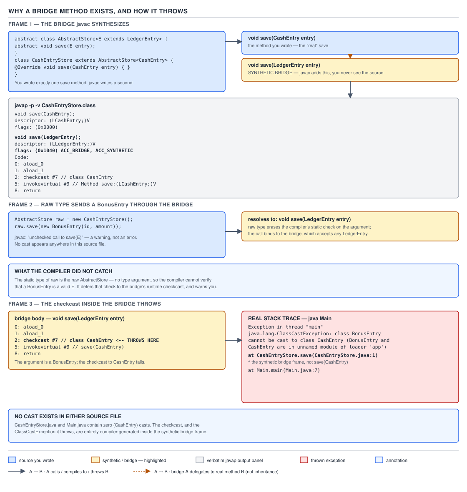

# 03 Java Core — Bridge methods — INTERNALS (§3.5, 3.5.3–3.5.6)

**Target version: Java 21 LTS.** | **Part 3 of 5** | [Index](../00-index.md)
Previous: [What erasure emits](03-internals-erasure.md) · Next: [Reifiable types and generic arrays](03b-internals-reifiable-types-and-generic-arrays.md)

This file is the canonical treatment of bridge methods: why `javac` synthesises them, the two independent causes (generic override erasure, covariant return narrowing), how they surface through reflection, and the `ClassCastException` they throw from a stack frame that contains no cast in your source. `03-internals-erasure.md` already covered what erasure emits at the bytecode level and the caller-side `checkcast` at a generic read site — assume that file has just been read; this one picks up exactly where a subclass overrides a generic superclass method and the two descriptors stop matching. Every other file in this note set that mentions bridge methods in passing forward-links here rather than re-deriving any of it — this is the one place the mechanism, the bytecode, the reflection API, and the failure mode are all worked through together.

## 1. Why a bridge exists — the descriptor mismatch a virtual call would otherwise fail on (3.5.3)

Picture a virtual method table with two rows that were supposed to be the same slot and aren't. `AbstractStore<E extends LedgerEntry>` declares `abstract void save(E entry)`. `CashEntryStore extends AbstractStore<CashEntry>` overrides it as `void save(CashEntry entry)`. At the source level this is one method, overridden once. At the class-file level, after erasure, it is two different method descriptors that happen to share a name — and the JVM does not resolve `invokevirtual` by "same method conceptually," it resolves by exact name-and-descriptor match. Nothing in the class file says these two methods are the same override. `javac` has to manufacture the connective tissue itself, and the tissue it manufactures is a bridge method.

### Why it exists

Before generics (Java 1.4 and earlier), overriding was already name-and-descriptor matching, and that was fine because a subclass override always had the *identical* parameter types as the method it overrode — there was no erasure step to widen them. Generics broke that invariant. `AbstractStore.save` is declared against the type variable `E`, and erasure replaces `E` with the erasure of its leftmost bound, `LedgerEntry` — so the class file descriptor for the abstract method is `(LLedgerEntry;)V`, never `(LE;)V` (`E` is not a runtime type). `CashEntryStore.save(CashEntry entry)` erases to `(LCashEntry;)V`. Those are two different descriptors. Without a bridge, a call through an `AbstractStore<CashEntry>`-typed reference — which the JVM sees purely as `AbstractStore`, its erasure — would `invokevirtual` the descriptor `(LLedgerEntry;)V`, and `CashEntryStore` would have no method with that descriptor at all. The override would silently fail to override. `javac` fixes this by emitting a *second* method in `CashEntryStore` with the superclass's descriptor, whose only job is to cast the argument down and forward to the real, narrower override. Covariant return narrowing (§2 below) creates the identical problem from the other end of the signature, independently of generics.

### The mechanism

`[PROVE]` the necessity rather than asserting it — walk the virtual call as the JVM actually resolves it. Take a call site typed against the erased supertype:

```java
AbstractStore<CashEntry> store = new CashEntryStore();
store.save(new CashEntry(UUID.randomUUID(), BigDecimal.ONE));
```

`javap -c` on the class holding this call site shows the invocation compiled as `invokevirtual` against the descriptor `Method AbstractStore.save:(LLedgerEntry;)V` — the compile-time static type of `store` is `AbstractStore<CashEntry>`, but the *descriptor* recorded at the call site is the erasure of `AbstractStore`'s own declaration, `(LLedgerEntry;)V`, because that is the only descriptor `AbstractStore` has. Dynamic dispatch then walks `CashEntryStore`'s method table looking for exactly that name-and-descriptor pair. `CashEntryStore` declares only one `save` in source — `save(CashEntry)`, descriptor `(LCashEntry;)V` — and that does not match `(LLedgerEntry;)V`. If that were the only method in the class file, the lookup would find nothing to override and the call would silently resolve to `AbstractStore`'s own `abstract` slot, which has no body — an `AbstractMethodError` at best, undefined behaviour at worst. For how the JVM actually walks a vtable slot to a descriptor match, see `../inheritance-and-dispatch/03-internals-dispatch.md` — that file owns the five invoke instructions and vtable/itable layout; the one fact borrowed here is that `invokevirtual` dispatch is a descriptor lookup, not a name lookup with parameter coercion. The lookup succeeds only because `javac` also emitted a *second* method, `save(LedgerEntry)`, with exactly the descriptor the call site needs — confirmed below by `javap`.

`[BYTECODE]`, read instruction by instruction, this is the actual bridge body from `CashEntryStore.class` compiled on JDK 21.0.7:

```
void save(LedgerEntry);
  descriptor: (LLedgerEntry;)V
  flags: (0x1040) ACC_BRIDGE, ACC_SYNTHETIC
  Code:
    stack=2, locals=2, args_size=2
       0: aload_0
       1: aload_1
       2: checkcast     #7                  // class CashEntry
       5: invokevirtual #9                  // Method save:(LCashEntry;)V
       8: return
```

`0: aload_0` pushes the receiver (`this`, a `CashEntryStore`). `1: aload_1` pushes the incoming argument — statically typed `LedgerEntry` at this method's own descriptor, but at the call site it is always actually a `CashEntry` (or a subtype), because that is the only thing the generic type system let a well-typed caller pass in. `2: checkcast #7` verifies that assumption at runtime and narrows the operand stack's static type to `CashEntry`; constant-pool entry `#7` is the `Class` reference for `CashEntry`. `5: invokevirtual #9` calls the real override, `CashEntryStore.save(CashEntry)`, passing the now-`CashEntry`-typed argument. `8: return` discharges the `void` frame. Five instructions, no branch, no loop — a straight-line thunk. That shape is why a bridge is essentially free once the JIT inlines it into the call site; this file did not measure JIT behaviour, so treat that as a structural observation about the bytecode, not a benchmarked claim.

It is worth asking why `javac` repairs this by *adding* a method rather than simply changing `AbstractStore.save`'s own descriptor to `(LCashEntry;)V` to match the subclass — the answer is binary compatibility, and it is the same constraint that motivated erasure in the first place (`03e-internals-why-erasure-and-super-type-tokens.md` owns the full argument for why erasure was chosen at all; this is the one consequence of that choice that lands specifically on overriding). `AbstractStore<E>` is a single class file, compiled once, used by every parameterization — `AbstractStore<CashEntry>`, `AbstractStore<BonusEntry>`, and any future one — and its own abstract method's descriptor has to stay `(LLedgerEntry;)V` forever, because that is the only descriptor any of those parameterizations could possibly agree on after erasure. Giving `AbstractStore` a per-subclass descriptor is not an option; the bridge is what lets each individual subclass supply its own narrower, type-safe override while the shared supertype method keeps a single, stable, erasure-compatible signature.

`[SOURCE]` `[RESEARCH]`: JVMS 21 Table 4.6-A (method `access_flags`) gives `ACC_BRIDGE` the value `0x0040` — "A bridge method, generated by the compiler" — and `ACC_SYNTHETIC` the value `0x1000` — "Declared synthetic; not present in the source code." Do the arithmetic the flags word actually encodes: `0x1000 | 0x0040 = 0x1040`, and that is exactly the flags word `javap -p -c -v` printed above, confirmed against real JDK 21.0.7 output rather than assumed. The two flags answer two different questions for a consumer of the class file: `ACC_SYNTHETIC` says "no line of source produced this member, do not show it to a user"; `ACC_BRIDGE` narrows that further to "specifically, this is a compiler-generated forwarding thunk that repairs a type-erasure or covariant-return descriptor mismatch" — every `ACC_BRIDGE` method is `ACC_SYNTHETIC`, but plenty of `ACC_SYNTHETIC` methods (constructor-access forwarders, lambda factory methods) are not bridges. As for the JLS's own statement that bridge generation happens: **Unverified:** a text search of JLS 21 Chapter 4 (Types, Values, and Variables — Type Erasure, Raw Types) and Chapter 8 (Classes) turned up no section that names "bridge methods" explicitly; the term appears to live in JVMS and `javac`/tooling vocabulary rather than JLS vocabulary proper. What would settle it: a full-text search of the JLS 21 HTML or PDF for the string "bridge" across all chapters, which this pass did not exhaustively perform. Absent that, the claim here rests on the JVMS flag definitions and the `javap` evidence above, which are both directly confirmed.



**D-105** — Frame 1 shows `CashEntryStore` overriding `AbstractStore<CashEntry>.save`, with `javap`'s two method entries side by side: `void save(CashEntry)` at `flags: (0x0000)` and the synthetic `void save(LedgerEntry)` at `flags: (0x1040) ACC_BRIDGE, ACC_SYNTHETIC` — the exact flags word derived above. Frame 2 shows a raw-typed `AbstractStore` reference passing a `BonusEntry` through that bridge instead of the `CashEntry` it was built for. Frame 3 shows the `checkcast` inside the bridge failing and throwing `ClassCastException`, with the bridge's own frame — `CashEntryStore.save`, at the class declaration's line number — visible in the stack trace; §4 below reruns this exact failure and reads the trace line by line.

Also confirm the interface case, since a reader meets this shape at least as often as the abstract-class shape: a `StakeAmount` implementing `Comparable<StakeAmount>` gets a synthetic `compareTo(Object)` for the identical reason — `Comparable<T>.compareTo` erases to `compareTo(Object)`, and the real override takes `StakeAmount`.

```java
import java.math.BigDecimal;

record Money(BigDecimal amount) {}

class StakeAmount implements Comparable<StakeAmount> {
    final Money value;
    StakeAmount(Money value) { this.value = value; }

    @Override public int compareTo(StakeAmount other) {
        return value.amount().compareTo(other.value.amount());
    }
}
```

`javap -p -c -v` on `StakeAmount.class` (JDK 21.0.7) shows both methods:

```
public int compareTo(StakeAmount);
  descriptor: (LStakeAmount;)I
  flags: (0x0001) ACC_PUBLIC

public int compareTo(java.lang.Object);
  descriptor: (Ljava/lang/Object;)I
  flags: (0x1041) ACC_PUBLIC, ACC_BRIDGE, ACC_SYNTHETIC
  Code:
       0: aload_0
       1: aload_1
       2: checkcast     #8                  // class StakeAmount
       5: invokevirtual #25                 // Method compareTo:(LStakeAmount;)I
       8: ireturn
```

`0x1041` is `ACC_PUBLIC (0x0001) | ACC_BRIDGE (0x0040) | ACC_SYNTHETIC (0x1000)` — the bridge inherits `ACC_PUBLIC` from the interface method it satisfies, on top of the same two synthetic-bridge bits seen above. `Comparable`/`Comparator` as a subject — natural ordering, the `compareTo` contract — belongs to `../objects-equality-and-lifecycle/02a-composite-equality-and-ordering.md`; the one fact borrowed here is that its generic parameter is exactly as erasure-prone as any other.

This shape is not an academic curiosity for a backend engineer — it is exactly what a Spring Data JPA repository interface produces. `interface CashEntryRepository extends JpaRepository<CashEntry, UUID>` inherits `save(S entity)` from `JpaRepository<T, ID>`'s superinterface `CrudRepository<T, ID>`; Spring's implementation class ends up in the identical position as `CashEntryStore` above, with a bridge repairing the same erased-parameter mismatch. The container's proxying, and how it deals with methods it discovers via reflection, belongs to guide `07 Spring core`, forward-linked only — the mechanism-level fact that transfers is this file's, not that guide's.

**Gotcha:** the bridge's name is identical to the real method's name. `CashEntryStore.class.getDeclaredMethods()` therefore returns two methods both named `save` — harmless until something iterates methods by name expecting exactly one, which is §3.

> A bridge method is a compiler-synthesised, `ACC_BRIDGE | ACC_SYNTHETIC`-flagged forwarding thunk that gives a subclass's narrower override the exact descriptor its erased superclass method needs, so that `invokevirtual`'s exact name-and-descriptor dispatch still finds it.

## 2. Bridges for covariant return types — a second, independent cause (3.5.4)

The mental model shifts by ninety degrees here: this bridge has nothing to do with generics at all, and treating bridges as a generics-only artefact is the misconception this section exists to correct. Java 5 introduced covariant return types in the same release as generics, and the two features share a compiler-generated fix for an unrelated reason — the JVM's exact-descriptor matching also covers the return type, not just the parameters.

### Why it exists

Before Java 5, an override had to repeat its supertype's return type verbatim. Java 5 allowed narrowing it: a factory method declared to return `LedgerEntry` could be overridden to return the more specific `CashEntry`, because every `CashEntry` is usable wherever a `LedgerEntry` is expected. But `invokevirtual` dispatch, exactly as in §1, matches on the full descriptor, and a method's descriptor includes its return type. `EntryFactoryBase.create()` has descriptor `()LLedgerEntry;`; `CashEntryFactory.create()` narrows it to `()LCashEntry;`. Those are different descriptors, so the same failure mode as §1 threatens: a call through an `EntryFactoryBase`-typed reference would look for `()LLedgerEntry;` and not find it in `CashEntryFactory` unless `javac` again manufactures the connective tissue.

### The mechanism

```java
class EntryFactoryBase {
    LedgerEntry create() { return new CashEntry(); }
}
class CashEntryFactory extends EntryFactoryBase {
    @Override CashEntry create() { return new CashEntry(); }
}
```

`javap -p -c -v` on `CashEntryFactory.class` (JDK 21.0.7):

```
CashEntry create();
  descriptor: ()LCashEntry;
  flags: (0x0000)

LedgerEntry create();
  descriptor: ()LLedgerEntry;
  flags: (0x1040) ACC_BRIDGE, ACC_SYNTHETIC
  Code:
    stack=1, locals=1, args_size=1
       0: aload_0
       1: invokevirtual #10                 // Method create:()LCashEntry;
       4: areturn
```

Read it: `0: aload_0` pushes the receiver; `1: invokevirtual #10` calls the real, narrower `create()` and leaves a `CashEntry` reference on the stack; `4: areturn` returns it *without a `checkcast`* — unlike the §1 bridge, there is nothing to narrow on the way out, because a `CashEntry` reference is already a valid value wherever `LedgerEntry` (its supertype, per the wider descriptor) is expected. The asymmetry is the whole lesson: parameter-side bridges must narrow (need a `checkcast`, can throw); return-side covariant bridges only widen (no cast needed, cannot throw from this instruction).

The same binary-compatibility logic from §1 applies here too, in mirror image: `EntryFactoryBase.create()`'s own descriptor has to stay `()LLedgerEntry;` because every caller compiled against `EntryFactoryBase` — including code compiled before `CashEntryFactory` ever existed — resolved its call against that exact descriptor, and changing it after the fact would break every such caller's class file without a recompile. The bridge lets `CashEntryFactory` advertise a strictly more useful, narrower return type to callers that know about it, while `invokevirtual` dispatch through the older, wider descriptor still finds a matching method to call.

| Cause | What mismatched | What the bridge does | Can it throw? |
|---|---|---|---|
| Generic override erasure (§1) | Parameter descriptor: bound's erasure vs. override's concrete type | `checkcast`s the incoming argument down, then `invokevirtual`s the real override | Yes — `ClassCastException` |
| Covariant return narrowing (§2) | Return-type descriptor: wider declared return vs. override's narrower return | Calls the real override, returns its result unmodified (widening needs no cast) | No |
| Generic interface method (`Comparable<T>.compareTo`) | Parameter descriptor: `Object` (erasure of `T`) vs. override's concrete type | `checkcast`s the incoming argument down, then `invokevirtual`s the real override | Yes — `ClassCastException` |

**Gotcha:** because the covariant-return bridge can never throw, a `ClassCastException` you see coming out of a `save`-shaped bridge is diagnostic of a *parameter*-side mismatch, never a return-side one — useful when you are staring at a stack trace and trying to guess which of the two causes produced the frame before you have even opened the class file.

**Interview:** "Can you get a bridge method in a class that uses no generics at all?" The one-line answer: yes — any override that narrows its return type relative to the method it overrides gets one, because `invokevirtual` matches on the whole descriptor including the return type, and generics are only one of the two ways a subclass's descriptor can diverge from its supertype's. The interviewer is testing whether "bridge methods" is filed under "generics trivia" or understood as a general consequence of exact-descriptor virtual dispatch — §1 and this section are the same mechanism applied to opposite ends of the same descriptor.

> Covariant return narrowing produces its own `ACC_BRIDGE` method independently of generics, because `invokevirtual` matches the whole descriptor including the return type, and the two causes are told apart by whether the bridge body contains a `checkcast`.

## 3. Bridges and reflection: the doubled method, and how to filter it (3.5.3, 3.5.5)

The symptom a reader actually hits in production code is not a compiler warning — it is a reflective scan that silently sees the same logical method twice. A hand-rolled serialiser, a validation framework, a `@EventListener` scanner, or a unit test asserting "this class declares exactly one public method" walks `getDeclaredMethods()` expecting one `save` and gets two, with different parameter types, and does something wrong with the second one it didn't expect.

### Why it exists

Reflection reports what is actually in the class file, and §1 established that the class file genuinely contains two methods named `save`. Reflection has no special-case suppression for compiler-generated members by default — `getDeclaredMethods()` is a literal transcription of the `methods` table, bridge or not. This bites hardest in code that treats "the methods of a class" as a source-level concept rather than a class-file one: a hand-rolled serialiser that walks every declared method to build a schema, a validation framework that scans for annotated methods, a Spring `@EventListener` classpath scan matching by method name and a single parameter type, or a unit test asserting `assertEquals(1, MyStore.class.getDeclaredMethods().length)` — every one of these was written against the mental model of "one override, one method," and every one of them is handed the bridge as a second, indistinguishable-by-name candidate the moment the class in question overrides a generic supertype method or narrows a covariant return.

### The mechanism

`[TRAP]` `[RESEARCH]`: verified directly rather than assumed — a loop over `CashEntryStore.class.getDeclaredMethods()`, printing name, parameter type, and both `isBridge()` and `isSynthetic()`, on JDK 21.0.7:

```java
for (Method m : CashEntryStore.class.getDeclaredMethods()) {
    System.out.println(m.getName() + " " + Arrays.toString(m.getParameterTypes())
        + " isBridge=" + m.isBridge() + " isSynthetic=" + m.isSynthetic());
}
```

Real output:

```
save [class CashEntry] isBridge=false isSynthetic=false
save [interface LedgerEntry] isBridge=true isSynthetic=true
```

Two entries, confirming the class file really does carry both. `Method.isBridge()` and `Method.isSynthetic()` agree here because every bridge is synthetic — but they are not the same predicate in general: a lambda's compiler-generated implementation method, or a nested class's `access$000` field-access forwarder, is `isSynthetic() == true` while `isBridge() == false`. Filtering on `isSynthetic()` would over-exclude; filtering on `isBridge()` is the precise fix for this specific symptom.

`getMethods()` (public, inherited, not just declared) was also checked rather than assumed to behave the same way — using a public-visibility variant of the same hierarchy so `getMethods()` returns anything at all for `save`:

```
public getMethods() named save:
  public void CashEntryStore.save(CashEntry) isBridge=false
  public void CashEntryStore.save(LedgerEntry) isBridge=true
```

Confirmed: `getMethods()` doubles the method exactly the same way `getDeclaredMethods()` does — the bridge is a real, public (when the override is public), invokable member, not an artefact `getMethods()` filters out for you.

The subtler trap is `Class.getMethod(name, paramTypes)`. Per its own contract it performs an *exact* parameter-type match, not overload resolution — pass it the override's real, narrow parameter type and it returns the non-bridge method every time:

```
getMethod(save, CashEntry) -> public void CashEntryStore.save(CashEntry) isBridge=false
```

That is safe only because the caller already knew the exact declared parameter type. A framework that only knows the method *name* — the exact situation that provoked this section — cannot use `getMethod` to dodge the problem; it still has to filter `getDeclaredMethods()`/`getMethods()` results on `isBridge()`.

**Pitfall:** believing `getDeclaredMethods()` returns each source-level method once. The fix is `Arrays.stream(cls.getDeclaredMethods()).filter(m -> !m.isBridge())` before doing anything keyed on method name — every reflective consumer that iterates by name and does not already filter bridges is exposed to this, silently, only on classes that override a generic method.

**Gotcha:** the bridge also carries a `MethodParameters` attribute marking its lone parameter `synthetic` with no name — confirmed in the same `javap -v` dump as §1 — so even parameter-name reflection (`Parameter.getName()` without `-parameters`) cannot use naming to tell the two methods apart; only `isBridge()` can.

**Interview:** "You're writing a generic serialisation framework and you scan a class's declared methods to find getters and setters by naming convention. What has to change once the class hierarchy involves generics?" The one-line answer: every scan keyed only on method name (and, for setters, arity) has to add `!m.isBridge()` to its filter, because any override of a generic supertype method or an interface's generic method doubles that method's declared-method entries with a bridge carrying the same name and a wider erased parameter type — and the framework, having no idea the class overrides anything generic, would otherwise treat the bridge as a second, spurious setter candidate.

> `getDeclaredMethods()` and `getMethods()` both report the bridge as a full, independent `Method` with the same name as the real override, and only `Method.isBridge()` — not `isSynthetic()`, not parameter-type inspection — reliably tells them apart.

## 4. The `ClassCastException` with no cast in your source (3.5.3, 3.5.6)

This is the leaf that turns the whole file into interview material, and it has to be run, not narrated.

### Why it exists

§1 showed the bridge body contains a `checkcast`. A `checkcast` that fails throws `ClassCastException`. The bridge exists specifically to accept the erased supertype and narrow it back down — which means the bridge is exactly where an unsound cast, if one is ever forced through, will blow up, and it will blow up inside a method your IDE will insist has no cast in it, because your IDE is reading the source file, and the cast is not in the source file.

This is the general shape every erasure repair takes, and it is worth stating once, explicitly, because it is the pattern an interviewer is really probing for across all four leaves in this file: erasure buys binary-representation simplicity and migration compatibility by deferring a compile-time-checkable guarantee to a runtime check inserted somewhere the source never wrote one — a caller-side `checkcast` at a generic read site (`03-internals-erasure.md`), a callee-side `checkcast` inside a bridge (this file), or an unchecked write into a polluted array (`03c-internals-heap-pollution-and-safevarargs.md`). Every one of those runtime checks can fail, and every failure surfaces at a location that looks, from the source alone, like it couldn't possibly contain a cast.

### The mechanism

`[PROVE]` by running the exact sequence, laundering a `BonusEntry` through a raw-typed reference to reach `CashEntryStore.save`:

```java
interface LedgerEntry { UUID id(); }
record CashEntry(UUID id, BigDecimal amount) implements LedgerEntry {}
record BonusEntry(UUID id, BigDecimal amount) implements LedgerEntry {}

abstract class AbstractStore<E extends LedgerEntry> {
    abstract void save(E entry);
}

class CashEntryStore extends AbstractStore<CashEntry> {
    @Override void save(CashEntry entry) { }
}

public class Main {
    public static void main(String[] args) {
        AbstractStore raw = new CashEntryStore();
        BonusEntry bonus = new BonusEntry(UUID.randomUUID(), BigDecimal.TEN);
        raw.save(bonus);
    }
}
```

Compiled with `-Xlint:all` on JDK 21.0.7, `javac` gives its only advance warning — at the laundering site, not at the throw site:

```
Main.java:27: warning: [rawtypes] found raw type: AbstractStore
        AbstractStore raw = new CashEntryStore();
        ^
  missing type arguments for generic class AbstractStore<E>
Main.java:29: warning: [unchecked] unchecked call to save(E) as a member of the raw type AbstractStore
        raw.save(bonus);
                ^
```

Raw types as a mechanism, and why the compiler permits this at all, are `01c-raw-types-and-unchecked-warnings.md`'s territory — the raw `AbstractStore` variable here is exactly the laundering vector that file explains is legal for migration compatibility. Running it produces:

```
Exception in thread "main" java.lang.ClassCastException: class BonusEntry cannot be cast to class CashEntry (BonusEntry and CashEntry are in unnamed module of loader 'app')
	at CashEntryStore.save(Main.java:12)
	at Main.main(Main.java:29)
```

Read the trace. `Main.main(Main.java:29)` is the ordinary frame — line 29 is `raw.save(bonus);`, a real statement with a real line to point at. `CashEntryStore.save(Main.java:12)` is the tell: line 12 in this listing is `class CashEntryStore extends AbstractStore<CashEntry> {` — the *class declaration line*, not any statement inside `save`. That happens because the bridge method has no source of its own; `javac` has to attribute its `LineNumberTable` entry to *some* line, and it uses the line of the class declaration that implicitly triggered the bridge's generation. A stack frame naming a method you wrote, pinned to a line with no code on it, is the diagnostic fingerprint of a bridge-method failure — recognising that shape in a production log, without a debugger attached, is the actual skill being tested.

`[PROVE]` where the cast physically lives: `javap -p -c -v` on this exact `CashEntryStore.class` shows the bridge body from §1 again — `2: checkcast #7 // class CashEntry`. That is the only cast anywhere in this program. The class declaration is cast-free, the override `save(CashEntry entry) { }` is cast-free, `Main.main` is cast-free — grep the source and you will not find the word `cast` or a `(CashEntry)` anywhere. The cast lives in a synthetic method that does not appear in `CashEntryStore.java` at all, only in `CashEntryStore.class`. Contrast this with `03-internals-erasure.md`'s caller-side `checkcast`, inserted at a generic *read* site inside the caller's own bytecode (e.g., reading from a raw-typed collection) — there the cast belongs to the method that appears to fail; here it belongs to a synthetic method of the *callee's* class that the caller never wrote and cannot see. Telling a caller-side erasure `checkcast` apart from a callee-side bridge `checkcast` from a stack trace alone — by checking whether the failing frame's line number lands on real code or on a declaration line — is the transferable diagnostic.

**Pitfall:** assuming every `ClassCastException` names, in its top frame, a line where your source performs a cast. The fix: when the top frame's line number does not correspond to any executable statement in that method — especially when it lands on the enclosing class's declaration line — check `javap -p -v` on that class for an `ACC_BRIDGE` method matching the failing method name before assuming the trace is corrupt or the debugger is lying.

**Interview:** "You get a `ClassCastException` whose stack trace names a method you wrote, on a line with no cast anywhere near it — what happened?" The one-line answer: the named method is a compiler-generated bridge that erasure (or covariant-return narrowing) forced into existence to keep an override callable through its erased supertype descriptor, its `LineNumberTable` entry points at the enclosing class declaration because it has no source line of its own, and the actual failing `checkcast` is inside that bridge, narrowing an argument that a raw type or an unchecked cast let through the type system.

A debugger makes the same trap easier to fall into, not harder: stepping into a call that resolves to a bridge lands the cursor on the class declaration line, and most IDEs render that as "stepped into the constructor" or simply refuse to show a meaningful line highlight, because their line-mapping logic assumes a `LineNumberTable` entry always corresponds to a statement a human could have written. Some IDE debuggers hide bridge frames from the call stack view entirely by default (filtering on `ACC_SYNTHETIC`), which removes the confusing frame but also removes the one piece of evidence — "there is a frame here that isn't in my source" — that would have pointed straight at the actual cause. Toggling "show synthetic frames" (or reading the raw thread dump instead of the IDE's filtered view) restores it.

**Gotcha:** heap pollution through generic varargs is the *other* classic route to a `ClassCastException` thrown from a method that contains no visible cast — but there the frame is a plain user method reading back from a polluted `Object[]`, not a synthetic bridge, and the `LineNumberTable` entry points at a real statement. `03c-internals-heap-pollution-and-safevarargs.md` owns that sequence in full; the one-line distinguishing test is exactly the test used above — a bridge failure's frame sits on a declaration line, a heap-pollution failure's frame sits on an ordinary statement.

> A `ClassCastException` thrown from inside a bridge method carries a stack frame named after a method you wrote, at the enclosing class's declaration line rather than any statement, because the failing `checkcast` belongs to a synthetic forwarding method that has no source line of its own — recognising that line-number shape is how you tell a bridge failure from an ordinary cast bug in a production log.

## Supporting facts

### `Method.isBridge()` is exactly as old as bridge methods themselves

`java.lang.reflect.Method.isBridge()` was added in Java 5, the same release that introduced generics, covariant return types, and the bridge methods that repair both — there was never a Java release in which bridges existed but reflection had no vocabulary to name them. This matters for version-trap awareness: any Java 5+ codebase, including ones targeting older language levels than 21, can rely on `isBridge()` being present; there is no historical form of the API that lacked it, unlike some reflection additions from later releases.

### `java.lang.reflect.Modifier` cannot decode the bridge/synthetic bits for you

`Modifier` declares `BRIDGE` and `SYNTHETIC` constants internally, but `javap -p` on `java.lang.reflect.Modifier` (JDK 21.0.7) shows them with flags `(0x0018) ACC_STATIC, ACC_FINAL` — no `ACC_PUBLIC` — meaning they are package-private and unreachable from application code. Calling the public `Modifier.toString(0x1040)` confirms this the hard way: it prints `volatile`, because `0x0040` happens to coincide with `ACC_VOLATILE`'s value in the *field* modifier space and `Modifier.toString` has no idea it was handed a *method*'s flags word with the bridge bit set. `Method.isBridge()` and `Method.isSynthetic()` exist precisely because the general-purpose `Modifier` utility cannot see these two bits at all.

### The bridge's parameter is marked synthetic in `MethodParameters`

`javap -v` on a bridge shows a `MethodParameters` attribute entry with `<no name>` and flag `synthetic` for its sole parameter — confirmed in the §1 dump above. This means parameter-name reflection cannot distinguish the bridge from the real override by name even when the class was compiled with `-parameters`; both methods are named `save`, and the bridge's parameter carries no recoverable name at all.

> `MethodParameters` marks a bridge's parameter `synthetic`, with no name, independently of whether the class was compiled with `-parameters`.

### Erasure bridges vs. nested-class access bridges — both `ACC_SYNTHETIC`, different origin

`javac` also synthesises `access$000`-style forwarding methods so an outer class's private members are reachable from a nested class across the two separate top-level class files the JVM requires — a completely different repair for a completely different problem (private-member visibility across class-file boundaries, not descriptor mismatch), covered by `../inheritance-and-dispatch/04-internals-nested-classes.md`. Both kinds of synthetic method carry `ACC_SYNTHETIC`; only erasure/covariant-return bridges also carry `ACC_BRIDGE`, which is the flag to check if you need to tell them apart programmatically.

> `access$000` forwarders and erasure bridges are both `ACC_SYNTHETIC`, but only the latter also carry `ACC_BRIDGE`.

### A bridge never participates in source-level overload resolution

Overload resolution (JLS 15.12.2, owned by `../inheritance-and-dispatch/01a-overload-resolution-and-dispatch.md`) runs against the source `CashEntryStore.java` is compiled from, and that source has exactly one `save` declaration — the bridge does not exist yet at the point overload resolution happens, because it is emitted afterward, as part of the same compilation pass that also inserts the erasure `checkcast`s covered in `03-internals-erasure.md`. A second, `save(LedgerEntry)`-shaped method never competes for a call at `MyStore.save(someCashEntry)`; the compiler always statically binds that call to the source-level `save(CashEntry)` overload, and the bridge is invoked only indirectly, when dynamic dispatch is forced through the erased supertype's descriptor as in §1.

> Bridge methods are a class-file-only artefact — they play no role in `javac`'s own overload resolution, which sees only the source-level declarations.

## Pitfalls

### "Bridge methods only happen with generics"

**Wrong**

```java
class EntryFactoryBase {
    LedgerEntry create() { return new CashEntry(); }
}
class CashEntryFactory extends EntryFactoryBase {
    @Override CashEntry create() { return new CashEntry(); }
}
```

Reasoning "there are no type parameters anywhere in this pair, so there is no erasure, so there is no bridge" — and then being surprised when `javap -p -c -v CashEntryFactory.class` shows a second `LedgerEntry create()` method flagged `ACC_BRIDGE, ACC_SYNTHETIC`.

**Right**

Treat "does the override's descriptor differ from the declared supertype method's descriptor" as the actual test, not "does this involve a type variable." Covariant return narrowing (Java 5, same release as generics, unrelated mechanism) fails that test exactly as an erased generic parameter does, and produces exactly the same kind of bridge — confirmed above with no generic type anywhere in the pair.

**Why people believe it:** every worked example of bridge methods in tutorials and blog posts uses a generic superclass, because that is the more common real-world trigger — so the covariant-return trigger, which is arguably simpler, gets no airtime and the association with "generics" hardens into a rule.

### "`getDeclaredMethods()` returns each source-level method once"

**Wrong**

```java
for (Method m : CashEntryStore.class.getDeclaredMethods()) {
    if (m.getName().equals("save")) {
        // assume exactly one match, dispatch on it
        invokeSave(m, entry);
    }
}
```

Real output on JDK 21.0.7 is two matches, not one:

```
save [class CashEntry] isBridge=false isSynthetic=false
save [interface LedgerEntry] isBridge=true isSynthetic=true
```

A loop that assumes the last (or first) match wins silently dispatches through whichever method the array happened to list second — sometimes the real override, sometimes the erased bridge, depending on class-file emission order, which is not a contract you should rely on.

**Right**

```java
Method real = Arrays.stream(CashEntryStore.class.getDeclaredMethods())
    .filter(m -> m.getName().equals("save"))
    .filter(m -> !m.isBridge())
    .findFirst()
    .orElseThrow();
```

Filtering on `isBridge()` before matching by name removes the synthetic forwarder deterministically, leaving exactly the method that appears in the source file.

**Why people believe it:** for any class that does not override a generic method or narrow a covariant return, `getDeclaredMethods()` really does return exactly one method per source-level name-and-arity, so the bug only appears the first time the reflective code is pointed at a class shaped like `CashEntryStore` — often much later than the code was written and tested.

### "A `ClassCastException` always means a cast is in the code that threw it"

**Wrong**

```java
AbstractStore raw = new CashEntryStore();
BonusEntry bonus = new BonusEntry(UUID.randomUUID(), BigDecimal.TEN);
raw.save(bonus);
```

```
Exception in thread "main" java.lang.ClassCastException: class BonusEntry cannot be cast to class CashEntry (BonusEntry and CashEntry are in unnamed module of loader 'app')
	at CashEntryStore.save(Main.java:12)
	at Main.main(Main.java:29)
```

Opening `CashEntryStore.java` at line 12 to find the offending cast finds `class CashEntryStore extends AbstractStore<CashEntry> {` — a class declaration, no cast, no statement at all — and the natural next move is to distrust the trace or the debugger rather than the assumption.

**Right**

Recognise the shape: a named user method, a line number that lands on a declaration rather than a statement, is the signature of a bridge-method `checkcast`. Confirm with `javap -p -v CashEntryStore.class`, find the `ACC_BRIDGE` method with the matching name, and read its body — the cast is there, in a method the source file never wrote.

**Why people believe it:** it is true for the overwhelming majority of `ClassCastException`s, which really are thrown by an explicit `(Type) value` cast at the line the trace names — bridge-induced and heap-pollution-induced exceptions are the two exceptions to a rule that otherwise holds essentially all the time.

## Cheat sheet

| Fact | Value / rule |
|---|---|
| `ACC_BRIDGE` | `0x0040` (JVMS 21 Table 4.6-A) |
| `ACC_SYNTHETIC` | `0x1000` (JVMS 21 Table 4.6-A) |
| Erasure-bridge flags word | `0x1040` = `0x1000 \| 0x0040` |
| Interface-bridge flags word (public method) | `0x1041` = `0x0001 \| 0x0040 \| 0x1000` |
| Cause 1 | generic override: erased param descriptor ≠ override's concrete param descriptor |
| Cause 2 | covariant return: declared return descriptor ≠ override's narrowed return descriptor |
| Parameter-side bridge body | `aload_0, aload_1, checkcast, invokevirtual, return` — can throw CCE |
| Return-side bridge body | `aload_0, invokevirtual, areturn` — no `checkcast`, cannot throw |
| Reflection symptom | `getDeclaredMethods()` / `getMethods()` both return the bridge as a full extra `Method` |
| Correct filter | `Method.isBridge()` — not `isSynthetic()`, which also matches unrelated synthetic members |
| `getMethod(name, exactParamTypes)` | exact descriptor match; returns the non-bridge method only if given the override's real parameter type |
| CCE fingerprint | top frame names a real method, at the *class declaration's* line number, not a statement |
| Distinguish from erasure caller-side `checkcast` | erasure cast lives in the *caller's* bytecode; bridge cast lives in a synthetic method of the *callee's* class |
| Distinguish from heap pollution | heap-pollution frame sits on a real statement line; bridge frame sits on the declaration line |

## Self-test

**Q1.** `AbstractStore<E extends LedgerEntry>` declares `abstract void save(E entry)`, and `CashEntryStore extends AbstractStore<CashEntry>` overrides it. Why can't the JVM just dispatch `save` by name?

<details><summary>Answer</summary>

Because `invokevirtual` resolves by exact name-and-descriptor match, not by name plus some notion of "the override." After erasure, `AbstractStore.save` has descriptor `(LLedgerEntry;)V` — `E` erases to the erasure of its bound, `LedgerEntry` — while `CashEntryStore.save(CashEntry entry)` has descriptor `(LCashEntry;)V`. Those are two different descriptors that happen to share a name; without a bridge, a call typed through `AbstractStore` would look for `(LLedgerEntry;)V` and find nothing in `CashEntryStore` matching it, since the subclass's own override doesn't have that descriptor.

</details>

**Q2.** What five instructions make up the bridge body for `save`, and what does each one do?

<details><summary>Answer</summary>

`aload_0` pushes the receiver. `aload_1` pushes the incoming argument, statically typed as the erased superclass parameter type (`LedgerEntry`). `checkcast` narrows it at runtime to the real override's parameter type (`CashEntry`), throwing `ClassCastException` if the actual object isn't one. `invokevirtual` calls the real, narrower override with the now-narrowed argument. `return` discharges the void frame. No branches, so it is a straight-line forwarding thunk that the JIT can inline essentially for free — though I haven't personally measured that inlining.

</details>

**Q3.** Does a covariant-return bridge ever throw `ClassCastException`? Why or why not?

<details><summary>Answer</summary>

No. Its body is `aload_0, invokevirtual, areturn` — it calls the real override and returns the result unmodified, with no `checkcast`. That's because covariant narrowing only ever widens on the way out: the real override returns a subtype (say `CashEntry`), and that value is always already valid wherever the wider declared return type (`LedgerEntry`) is expected, so there's nothing to verify at runtime. Parameter-side bridges narrow, which does need a runtime check; return-side bridges widen, which doesn't.

</details>

**Q4.** `CashEntryStore.class.getDeclaredMethods()` returns two methods named `save`. How do you tell which one is the real override without relying on iteration order?

<details><summary>Answer</summary>

Filter on `Method.isBridge()`, keeping the one where it's `false`. `isSynthetic()` isn't precise enough here — it's `true` for the bridge, but it's also `true` for unrelated compiler-generated members like nested-class access forwarders, so it doesn't uniquely identify a bridge. `isBridge()` is the specific predicate `java.lang.reflect.Method` provides for exactly this situation, and both `getDeclaredMethods()` and the public `getMethods()` need the same filter — the bridge shows up in both.

</details>

**Q5.** You see `ClassCastException: class BonusEntry cannot be cast to class CashEntry`, with the top frame `at CashEntryStore.save(CashEntryStore.java:12)`, and line 12 is the class declaration `class CashEntryStore extends AbstractStore<CashEntry> {`. There's no cast anywhere in that file. What's going on?

<details><summary>Answer</summary>

The failing frame is the compiler-generated bridge for `save`, not the real override. The bridge has no line of its own in the source, so `javac` attributes its `LineNumberTable` entry to the class declaration line that implicitly caused the bridge to be generated — which is why the trace points at a line with no executable code. The actual `checkcast` is inside the bridge's bytecode, narrowing whatever was passed in (here, a `BonusEntry` that reached `save` through a raw-typed `AbstractStore` reference) down to `CashEntry`, and it fails because a `BonusEntry` isn't one.

</details>

**Q6.** A class implements `Comparable<StakeAmount>` with `public int compareTo(StakeAmount other)`. What second method does the compiler add, and what's different about its flags compared to the `AbstractStore.save` bridge?

<details><summary>Answer</summary>

It adds `public int compareTo(Object)`, flagged `0x1041` — `ACC_PUBLIC | ACC_BRIDGE | ACC_SYNTHETIC` — versus `0x1040` for the package-private `save` bridge, which lacks `ACC_PUBLIC`. The extra bit is inherited from the interface method's own visibility (`Comparable.compareTo` is public), not from anything different about the bridge mechanism — the body is the identical shape, `checkcast` down to `StakeAmount` then `invokevirtual` the real `compareTo(StakeAmount)`.

</details>

**Q7.** A colleague argues bridge methods are purely a generics artefact and can't happen in code with no type parameters anywhere. What's the counter-example, and why does it still get a bridge?

<details><summary>Answer</summary>

Covariant return narrowing. `EntryFactoryBase.create()` returning `LedgerEntry`, overridden in `CashEntryFactory` as `create()` returning `CashEntry`, involves no type variable at all, yet `javap` still shows a synthetic `LedgerEntry create()` bridge with `ACC_BRIDGE, ACC_SYNTHETIC`. The reason is the same category of mismatch as the generics case — `invokevirtual` matches on the full descriptor, and the descriptor includes the return type, so a narrowed return type is just as much a descriptor mismatch as an erased parameter type. Generics and covariant returns are two independent triggers for the identical repair.

</details>

**Q8.** Would filtering reflectively-discovered methods on `Method.isSynthetic()` instead of `Method.isBridge()` be safe?

<details><summary>Answer</summary>

Not in general. Every bridge is synthetic, so `isSynthetic()` would correctly exclude it, but `isSynthetic()` also matches compiler-generated members that have nothing to do with erasure or covariant returns — for example the `access$000`-style forwarders `javac` emits so a nested class can reach an outer class's private members. Filtering on `isSynthetic()` risks silently dropping methods a framework actually needs to see for an unrelated reason. `isBridge()` is the narrower, correct predicate for specifically this problem.

</details>

**Q9.** Why doesn't `javac` just change `AbstractStore.save`'s descriptor to `(LCashEntry;)V` to match `CashEntryStore`'s override, instead of adding a bridge?

<details><summary>Answer</summary>

Because `AbstractStore<E>` compiles to exactly one class file, shared by every parameterization of it — `AbstractStore<CashEntry>`, `AbstractStore<BonusEntry>`, and any future subclass — and its abstract method's descriptor has to be the one thing every parameterization can agree on after erasure, which is `(LLedgerEntry;)V`, the erasure of the bound. There's no way to give the shared supertype method a per-subclass descriptor. The bridge is what lets each subclass supply its own concrete, type-safe override while the supertype keeps one stable, erasure-compatible signature that every caller compiled against the supertype can still invoke.

</details>

**Q10.** The `Comparable<StakeAmount>.compareTo` bridge has flags `0x1041`, but the `AbstractStore.save` bridge has flags `0x1040`. Same mechanism — why the different value?

<details><summary>Answer</summary>

`0x1041` is `0x1040` (`ACC_BRIDGE | ACC_SYNTHETIC`) with the extra bit `0x0001` (`ACC_PUBLIC`) set. The bridge inherits its visibility from the method it's satisfying: `Comparable.compareTo` is declared public on the interface, so the bridge that implements it has to be public too, while `AbstractStore.save` was declared with default (package-private) access, so its bridge has no visibility flag at all. The `ACC_BRIDGE`/`ACC_SYNTHETIC` bits are constant across both; the visibility bits just reflect whatever access the original method declared.

</details>

## Open questions

- **Unverified:** could not locate a JLS 21 section that names "bridge methods" explicitly, after checking Chapter 4 (Type Erasure, Raw Types) and Chapter 8 (Classes, method declarations, overriding). The term may be JVMS/tooling vocabulary rather than JLS vocabulary. What would settle it: a full-text search of the complete JLS SE21 HTML/PDF for the string "bridge" across every chapter, which this pass did not exhaustively perform.
- **Unverified:** whether the JIT actually inlines the five-instruction bridge thunk at a hot call site was asserted as a structural inference from the bytecode shape (straight-line, no branch), not measured. What would settle it: a `-XX:+PrintCompilation` / `-XX:+PrintInlining` run against a hot loop calling through the bridge on JDK 21.0.7.

---

**Leaves covered:** 3.5.3, 3.5.4, 3.5.5, 3.5.6 (4 leaves)
**Leaves deferred:** none
**Diagrams included:** D-105
**Target version:** Java 21 LTS
**Lines:** 494
