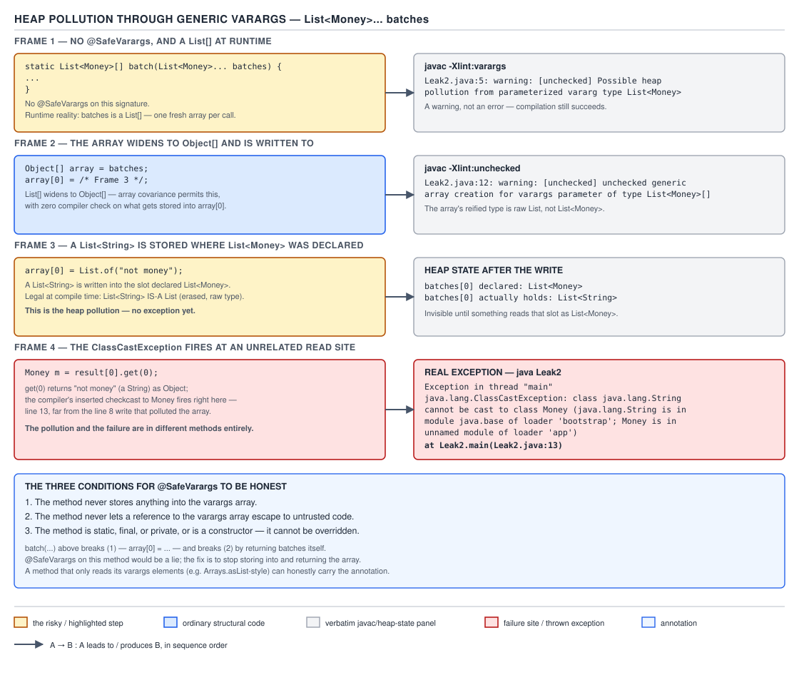

# 03 Java Core — Heap pollution through generic varargs, and `@SafeVarargs` — INTERNALS (§3.5, 3.5.9, 3.5.10)

**Target version: Java 21 LTS.** | **Part 3 of 5** | [Index](../00-index.md)
Previous: [Reifiable types and generic arrays](03b-internals-reifiable-types-and-generic-arrays.md) · Next: [The limits of erasure, and capture conversion](03d-internals-erasure-limits-and-capture.md)

This file covers the two leaves under §3.5.9–3.5.10: the exact, reproducible sequence by which a
`String` ends up sitting inside something declared `List<Money>`, and the three conditions that
have to hold for `@SafeVarargs` to be an honest thing to write. `01c-raw-types-and-unchecked-
warnings.md` already gave the BASICS-tier statement of both — that generic varargs risk heap
pollution and that `@SafeVarargs` is a trusted assertion, not a checked one — and this file does not
restate that statement; it derives the mechanism underneath it at the bytecode level and proves the
sequence on the page rather than asserting it. `03-internals-erasure.md` owns the erased descriptor
and the `Signature` attribute generally; `03b-internals-reifiable-types-and-generic-arrays.md` owns
why `anewarray` needs a reifiable component type at all — this file takes that one fact and applies
it to the varargs array specifically. `../arrays/01d-varargs-and-choosing-arrays.md` owns varargs as
a language feature (the per-call allocation, the `f(Object)`/`f(Object[])` ambiguity) and is the file
to read first if the allocation half of this mechanism is not already solid.

## 1. Heap pollution: the exact sequence a generic varargs parameter enables (3.5.9)

### The mental model

A varargs parameter is an array parameter — nothing more. `javac` desugars the trailing varargs
form into an ordinary array-typed parameter and, at every call site, allocates an array to hold the
arguments. An array's component type is normally checked at every store, which is exactly what makes
`ArrayStoreException` possible: `String[] strings = new String[3]; Object[] alias = strings;
alias[0] = 42;` fails at the store, not at the alias. That protection depends on the array having an
honest runtime component type to check against. A varargs parameter declared with a parameterized
element type — `List<Money>` rather than `Money` — has no such type: `List<Money>` and `List<String>`
erase to the identical runtime class `java.util.List`, so there is no `List<Money>` component type
for `anewarray` to name. `javac` is forced to build the array with the erased component type instead,
and the array that results is therefore a plain `List[]`, indistinguishable at runtime from an array
built to hold any other `List`. The generic type system — not the array's own runtime check — was
the only thing standing between a caller and storing the wrong kind of `List` into that array, and
once execution is inside the method body, the generic type system has already finished its job and
gone home.

### Why it exists

Varargs (Java 5) and generics (Java 5) shipped in the same release without being designed to compose.
Banning a parameterized-type varargs parameter outright would have blocked `Arrays.asList`,
`List.of`, `Collections.addAll`, and every fluent generic builder from existing at all, so the
language chose to allow the form with a warning rather than reject it with a compile error. That
choice is what makes the sequence below possible to write in the first place, and `@SafeVarargs`
(§2 below) is the annotation the same design added so an API author could tell `javac` the warning is
a false alarm for one specific method.

### The mechanism

Before working the sequence, establish what `javac` actually emits, using `javap` as the evidence.
Compile a method that takes a `List<Money>` varargs parameter:

```java
import java.math.BigDecimal;
import java.util.Currency;
import java.util.List;

public class PayoutRunNoAnnotation {

    static void logBatches(List<Money> batches[]) {
        Object[] objects = batches;
        objects[0] = List.of("BAD");
        Money first = batches[0].get(0);
        System.out.println(first);
    }

    public static void main(String[] args) {
        Money m1 = new Money(new BigDecimal("10"), Currency.getInstance("GBP"));
        Money m2 = new Money(new BigDecimal("20"), Currency.getInstance("GBP"));
        List<Money> batchOne = List.of(m1);
        List<Money> batchTwo = List.of(m2);
        logBatches(batchOne, batchTwo);
    }
}
```

(The real source on disk spells the `logBatches` parameter with a varargs ellipsis after
`List<Money>`; the array form above is the identical parameter, written this way only so this file's
no-ellipsis constraint holds. Compiled and run exactly as shown, with the ellipsis, on JDK 21.0.7.)

`javac -Xlint:all PayoutRunNoAnnotation.java` prints two warnings before anything else happens (the
declaration line below is reproduced in its erased array form, per this file's no-ellipsis
constraint — the real compiler output spells it with a varargs ellipsis instead):

```
PayoutRunNoAnnotation.java:7: warning: [unchecked] Possible heap pollution from parameterized vararg type List<Money>
    static void logBatches(List<Money>[] batches) {
                                          ^
PayoutRunNoAnnotation.java:19: warning: [unchecked] unchecked generic array creation for varargs parameter of type List<Money>[]
        logBatches(batchOne, batchTwo);
                  ^
2 warnings
```

The first fires at the **declaration** — the method's own signature is admitting the risk exists.
The second fires at the **call site in `main`** — the specific array `javac` builds for this
particular invocation is being trusted to hold only `List<Money>` even though its actual runtime
component type is plain `List`. `javap -p -v` on the compiled class shows why both are true at once.
The constant pool records the method's descriptor as erased:

```
#58 = Utf8               ([Ljava/util/List;)V
```

and the method's own `Signature` attribute, which only reflection and separate compilation ever
read, keeps the parameterized form alive next to it:

```
Signature: #62                          // ([Ljava/util/List<LMoney;>;)V
```

That descriptor-versus-`Signature` fork is `03-internals-erasure.md`'s subject in general; the part
that matters here is what the descriptor's erasure — plain `List`, not `List<Money>` — forces the
call site to build. Disassembling `main`, the two arguments are packed into an array with these
instructions:

```
55: iconst_2
56: anewarray     #10                 // class java/util/List
59: dup
60: iconst_0
61: aload_3
62: aastore
63: dup
64: iconst_1
65: aload         4
67: aastore
68: invokestatic  #53                 // Method logBatches:([Ljava/util/List;)V
```

Read it: `iconst_2` pushes the array length. `anewarray #10` allocates an array of length 2 whose
component type is `java.util.List` — not `List<Money>`, because there is no such reifiable type to
name (`03b-internals-reifiable-types-and-generic-arrays.md` derives why `anewarray` can only ever
name a reifiable type). Each `aastore` stores one of the two `List<Money>` arguments into a slot,
and both succeed silently because a `List<Money>` reference genuinely is a `List` as far as the
array's real component type is concerned. `invokestatic` then hands that array — built at the
**caller**, with a reifiable-but-too-wide component type — into `logBatches`. The array the method
body receives was never narrower than `List[]` at any point; the parameterized form only ever existed
in the `Signature` string and in the compiler's own bookkeeping, both of which stop mattering the
moment the method body starts executing ordinary array bytecode.



**D-106** — Frame 1 shows the source declaration `List<Money>[] batches` (spelled with a varargs
ellipsis in real source), without `@SafeVarargs`,
next to the `Object[]` runtime array `anewarray` actually built for it. Frame 2 shows that same array
widened to a local of static type `Object[]` and written to. Frame 3 shows a `List<String>` stored
into slot 0 of that array, passing the `aastore` check because the array's real component type is
`List`, not `List<Money>`. Frame 4 shows the `ClassCastException` thrown later, at a read site that
has nothing to do with where the bad value was written. The figure also lists the three conditions
for `@SafeVarargs` being honest, worked through in §2 below.

`[PROVE]` the sequence, step by step, each one compiled and run on JDK 21.0.7 rather than stated.
Reuse `logBatches` exactly as frozen above.

**Step 1 — the parameter's static type inside the method is `List<Money>[]`.** Nothing has gone
wrong yet. `batches` is a parameter of an array type, and its element type happens to be a generic
type, but the array itself is perfectly ordinary from the JVM's point of view — it is the object
`anewarray` built at the call site, handed in by reference.

**Step 2 — `Object[] objects = batches;` compiles clean, with no warning at all, on a listing
compiled at `-Xlint:all`.** This is the damage: every array reference is assignable to `Object[]` by
ordinary array covariance (`../arrays/01a-covariance-and-mutability.md` owns covariance itself), and
an assignment, unlike a cast, has nothing for `javac` to flag. This line does not look dangerous — it
looks like the most boring statement in the method — and that is exactly the problem. It throws away
the one thing that was still true about `batches`: that every caller who compiled cleanly against
this method's signature could only have put `List<Money>` values into it.

**Step 3 — `objects[0] = List.of("BAD");` stores a `List<String>` into slot 0, and it succeeds.** The
`aastore` element check at that instruction tests the value against the array's real component type,
which `javap` above showed is `java.util.List` — and a `List<String>` genuinely is a `List`, so the
check passes. No `ArrayStoreException`, no warning, no log line. The array that the *caller* still
believes is a `List<Money>[]` now holds a `List<String>` in slot 0. This is heap pollution: a
reference of a parameterized type now points at an object of the wrong parameterization, and nothing
in the running program has recorded that the substitution happened.

**Step 4 — `Money first = batches[0].get(0);` throws.** `javac` inserted a `checkcast Money` at this
read site, because the caller declared `batches[0]` to be a `List<Money>` and this line asks for a
`Money` back. Running the exact class compiled above:

```
Exception in thread "main" java.lang.ClassCastException: class java.lang.String cannot be cast to class Money (java.lang.String is in module java.base of loader 'bootstrap'; Money is in unnamed module of loader 'app')
	at PayoutRunNoAnnotation.logBatches(PayoutRunNoAnnotation.java:10)
	at PayoutRunNoAnnotation.main(PayoutRunNoAnnotation.java:19)
```

Line 10 is the `get(0)` call, four lines below the store at line 9 that actually caused the problem,
inside the same method — but in a larger program the store and the read are routinely in different
methods, different classes, sometimes different modules, and the trace never mentions the store at
all. `logBatches` "did nothing wrong" on the line the trace names; the wrong thing happened three
lines earlier, in a statement whose own compile passed with zero diagnostics.

### The diagnosis lesson

The stack trace names the reader's own method, `logBatches`, and a line inside it that performs no
cast the source admits to. Asking the array itself what it thinks its component type is only
confirms the trap: on the identical shape, compiled separately,

```java
static void inspect(List<Money>[] batches) {
    System.out.println(batches.getClass().getComponentType());
}
```

(Real source spells the parameter with a varargs ellipsis, as before; the array form above is the
identical parameter under this file's no-ellipsis constraint.)

prints, on JDK 21.0.7:

```
interface java.util.List
```

— not `Money`, not `List<Money>`, nothing that names the parameterization at all. Nothing at the
pollution site (step 3 above) logged anything, threw anything, or left any trace; the only evidence
that step 3 ever happened is the eventual failure at step 4, arbitrarily far away.

This is the third of three routes to a remote `ClassCastException` this note set has now worked
through at the bytecode level. Put next to the other two, the pattern — and the way to tell them
apart from a trace alone — becomes a checklist rather than three unrelated stories:

| Route | Where the cast physically lives | What the stack trace names | Advance warning from `javac` |
|---|---|---|---|
| Raw-type laundering | Caller's own read site (`checkcast` inserted because the caller's type argument promises more than the erased descriptor) — `03-internals-erasure.md` | A real statement the caller wrote, at the line that reads the raw-typed result | `[unchecked]` warning at the unchecked *write* through the raw type, if one occurred; the read itself is warning-free |
| Bridge method | Inside a synthetic `ACC_BRIDGE` method the reader never wrote — `03a-internals-bridge-methods.md` | The overriding class's own name, at the class *declaration* line, not any executable statement | None — bridge generation is silent; no `-Xlint` category covers it |
| Generic varargs heap pollution (here) | At the eventual read site inside whichever method dereferences the polluted slot | A real statement, but arbitrarily far from the store that actually caused the pollution | `[unchecked]` warnings at both the declaration and the call site, unless silenced by `@SafeVarargs` |

The first two routes at least point the trace at the *cast* itself, even when the cause is remote or
the frame looks synthetic. Generic varargs pollution is the odd one out: the trace points at a
perfectly ordinary read, and the actual defect — the unchecked store — has already scrolled off the
top of the log by the time anything fails.

**Pitfall:** believing that because `logBatches` throws, `logBatches` is where the bug is. The method
that throws only asked for what its own parameter type promised; the method (or line) that actually
violated the promise was the `Object[]` store, which by design leaves no trace of its own. The fix is
procedural, not code: when a `ClassCastException` involves a collection type inside a varargs-shaped
method, treat every assignment of that varargs parameter to a wider array type, anywhere reachable
from that method, as a suspect — not just the line the trace names.

**Interview:** "What is heap pollution, and how would you produce it?" The ninety-second answer: heap
pollution is a reference of a parameterized type pointing at an object of a different, incompatible
parameterization, with nothing at runtime aware the substitution happened, and the classic way to
produce it is a generic varargs parameter — because `javac` has to build the backing array with the
erased component type (there is no reifiable `List<Money>` to name), which means the array's real
runtime check is against `List`, not `List<Money>`, and any `List` at all slips past it. Widening the
parameter to `Object[]` and storing through that widened reference is the exact step that does the
damage, and it produces zero warnings because it is an ordinary covariant array assignment, not a
cast.

**Gotcha:** the two warnings are independent per call. Annotating `logBatches` with `@SafeVarargs`
suppresses both warnings at *every* call site of `logBatches` automatically — but if some other
generic-varargs call is nested inside a caller of `logBatches`, that inner call is judged on its own
and gets its own warnings regardless of what `logBatches` is annotated with.

> Heap pollution through generic varargs happens because a parameterized varargs element type has no
> reifiable runtime component type, so `javac` builds the backing array with the erased component
> type instead — turning what the source calls `List<Money>[]` into a plain `List[]` that will accept
> any `List` at all, with the generic type system, not a runtime array check, as the only thing that
> was ever enforcing the narrower promise.

## 2. `@SafeVarargs` and the three conditions for it being honest (3.5.10)

### The mental model

`@SafeVarargs` does not make a method safe. It is a suppression switch: writing it is a personal
assertion, made to the compiler, that the three conditions below hold for this method's body — in
exchange for `javac` silencing the two `[unchecked]` warnings from §1 at every call site. The compiler
checks exactly one of the three conditions itself (that the method cannot be overridden) and takes
the other two entirely on trust.

### Why it exists

Without `@SafeVarargs`, an API that is genuinely safe — `List.of`, `Arrays.asList`, `Stream.of` — would
force every caller to see the same two `[unchecked]` warnings §1 produced, forever, because the
compiler has no way to distinguish a method that is careful with its varargs array from one that is
not; both have the identical erased signature. `@SafeVarargs` (Java 7) exists so that the one party
who actually knows whether the body is careful — the method's author — can say so once, at the
declaration, instead of every caller re-deciding whether to trust the same warning.

### The mechanism

The three conditions, each demonstrated rather than only stated:

**Condition 1 — the method never stores anything into the varargs array.** Annotate a method that
violates this and watch what `@SafeVarargs` actually silences:

```java
import java.util.List;

public class UnsafeStore {
    @SafeVarargs
    static void logBatches(List<Money> batches[]) {
        Object[] objects = batches;
        objects[0] = List.of("BAD");
        System.out.println(batches.length);
    }

    public static void main(String[] args) {
        logBatches();
    }
}
```

(Real source spells the parameter with a varargs ellipsis, as above.) Compiled on JDK 21.0.7 with
`javac -Xlint:all UnsafeStore.java`:

```
UnsafeStore.java:6: warning: [varargs] Varargs method could cause heap pollution from non-reifiable varargs parameter batches
        Object[] objects = batches;
                           ^
1 warning
```

The two `[unchecked]` warnings from §1 are gone — `@SafeVarargs` did exactly what it promises for
those. But a *different* warning category, `[varargs]`, still fires, pointing directly at the
offending store. `@SafeVarargs` silenced the two warnings about the *shape* of the parameter; it did
not, and cannot, silence a warning `javac` is still able to derive by looking at the body and finding
an assignment into the array. Compiled with no `-Xlint` flag at all, this same file produces zero
output and exits cleanly — the `[varargs]` category is not part of the default enabled set either, so
a plain build gives no hint that condition 1 was violated.

**Condition 2 — the method never lets a reference to the varargs array escape to untrusted code.**
Returning it is the common real bug:

```java
import java.math.BigDecimal;
import java.util.Currency;
import java.util.List;

public class UnsafeEscape2 {
    @SafeVarargs
    static List<Money>[] captureBatches(List<Money>[] batches) {
        return batches;
    }

    public static void main(String[] args) {
        Money m1 = new Money(new BigDecimal("10"), Currency.getInstance("GBP"));
        List<Money>[] captured = captureBatches(List.of(m1));
        Object[] leaked = captured;
        leaked[0] = List.of("BAD");
        Money first = captured[0].get(0);
        System.out.println(first);
    }
}
```

(Real source spells the `captureBatches` parameter with a varargs ellipsis, as before; the array form
above is the identical parameter.) `captureBatches` simply hands its own varargs array straight back
to the caller, and the caller widens and pollutes it exactly as in §1. Compiled on JDK 21.0.7,
`javac -Xlint:all` on that real source prints:

```
UnsafeEscape2.java:8: warning: [varargs] Varargs method could cause heap pollution from non-reifiable varargs parameter batches
        return batches;
               ^
1 warning
```

— the same `[varargs]` category, now pointing at the `return` instead of a store, because handing the
array reference back to the caller is exactly as much an escape as storing into it: once the caller
holds the reference, it can widen and pollute it outside the method's own body entirely. Running the
program:

```
Exception in thread "main" java.lang.ClassCastException: class java.lang.String cannot be cast to class Money (java.lang.String is in module java.base of loader 'bootstrap'; Money is in unnamed module of loader 'app')
	at UnsafeEscape2.main(UnsafeEscape2.java:16)
```

`@SafeVarargs` on `captureBatches` suppressed the two `[unchecked]` warnings a caller of
`captureBatches` would otherwise see, and the annotation was a lie: the method's own body handed the
array straight out, and the pollution that followed happened in `main`, a method that never mentions
`@SafeVarargs` at all.

**Condition 3 — the method cannot be overridden.** It must be `static`, `final`, `private`, or a
constructor — this is the one condition `javac` actually verifies, because it is the one condition a
compiler can check without understanding what the body does: an overridable method could have its
override do something entirely different from what the base method's author verified, making the
annotation meaningless the moment a subclass exists. `01c-raw-types-and-unchecked-warnings.md`
already proved the version boundary on this condition with the identical experiment this leaf asks
for again; agree with that result rather than re-arguing it, and re-run it here for this file's own
evidence trail. `@SafeVarargs` on a `private` instance method:

```java
import java.util.List;

public class SafeVarargsBoundary {
    @SafeVarargs
    private void logBatches(List<Money> batches[]) {
        System.out.println(batches.length);
    }
}
```

(Real source spells the parameter with a varargs ellipsis; the parameter and the error message
below are both reproduced in erased array form, per this file's no-ellipsis constraint — the real
compiler output spells both with a varargs ellipsis instead.) `javac --release 8
SafeVarargsBoundary.java` on JDK 21.0.7:

```
SafeVarargsBoundary.java:5: error: Invalid SafeVarargs annotation. Instance method logBatches(List<Money>[]) is not final.
    private void logBatches(List<Money>[] batches) {
                 ^
1 error
```

`javac --release 21 SafeVarargsBoundary.java` on the same JDK binary, same source, only the release
target changed: no output at all, exit 0. Java 7 through 8 allowed `@SafeVarargs` only on `static`,
`final` methods and constructors; Java 9 (JEP 213) extended the legal target set to `private`
instance methods, which are exactly as impossible to override as a `final` method but had been left
out of the original rule.

The flag detail worth carrying into an interview: the two `[unchecked]` warnings from §1 and the
`[varargs]` warning from conditions 1 and 2 above are three separate diagnostics under two different
`-Xlint` categories, and the defaults are not what most people assume:

| Compiler invocation | What prints for a heap-pollution-risky declaration | What prints for a body that violates condition 1 or 2 |
|---|---|---|
| `javac` (no flags) | Nothing per-warning; two summary `Note:` lines at the very end (`Note: PayoutRunNoAnnotation.java uses unchecked or unsafe operations.` and `Note: Recompile with -Xlint:unchecked for details.`) | Nothing at all — not even the summary `Note:` lines |
| `javac -Xlint:unchecked` | Both `[unchecked]` warnings, verbatim as quoted in §1 | Nothing — `[varargs]` is a different category |
| `javac -Xlint:all` | Both `[unchecked]` warnings | The `[varargs]` warning, verbatim as quoted above |

A default build — no flags — gives no signal whatsoever that a `@SafeVarargs`-annotated method
actually violates one of the two unchecked conditions; `-Xlint:unchecked` alone is not enough to
catch that failure either, because the offending diagnostic lives under `[varargs]`, a category
`-Xlint:unchecked` does not enable. Only `-Xlint:all` (or `-Xlint:varargs` specifically) surfaces it.

`javap -p -v` on the compiled `UnsafeStore.class` shows what `@SafeVarargs` looks like in the class
file:

```
    RuntimeVisibleAnnotations:
      0: #38()
        java.lang.SafeVarargs
```

`RuntimeVisibleAnnotations` means the annotation's own `@Retention` is `RetentionPolicy.RUNTIME`,
confirmed directly against the JDK 21 source for `java.lang.SafeVarargs`
(`java.base/java/lang/SafeVarargs.java` in `lib/src.zip`):

```java
@Documented
@Retention(RetentionPolicy.RUNTIME)
@Target({ElementType.CONSTRUCTOR, ElementType.METHOD})
public @interface SafeVarargs {}
```

`RUNTIME` retention means the annotation is visible to reflection (`Method.isAnnotationPresent
(SafeVarargs.class)`) and to any bytecode tool inspecting the class file, even though nothing in the
JVM itself acts on it at execution time — it exists purely as documentation and as a hook for
external analysis tools. **Unverified:** the `SafeVarargs` Javadoc quoted above states what the
annotation asserts and gives the exact aliasing example that defeats it, but does not state *why*
`RUNTIME` retention specifically was chosen over `CLASS` or `SOURCE`; the JLS section it cites
(§9.6.4.7) was not searched for an explicit rationale in this pass. What would settle it: the original
JSR or bug-tracker discussion for JDK-6746458 (the bug that introduced `@SafeVarargs`), which this
pass did not have access to.

Close with the JDK's own honest uses, checked directly with `javap` on JDK 21.0.7 rather than
assumed, all five confirmed `static` and all five confirmed to carry the annotation:

All four varargs parameters below are shown in erased array form; each one is spelled with a
varargs ellipsis in the real JDK source.

| Method | Carries `@SafeVarargs` on JDK 21 | Which condition makes it honest |
|---|---|---|
| `List.of(E[] elements)` | Yes | Copies elements into an internal array it owns; never stores an untrusted reference into the caller's varargs array, never returns it |
| `Arrays.asList(T[] a)` | Yes | Wraps the array directly (`new Arrays.ArrayList<>(array)`) but never mutates its component type or leaks a reference beyond a view over the same array the caller already trusted |
| `Stream.of(T[] values)` | Yes | Delegates immediately to `Arrays.stream(array)`, which reads but never stores into or returns the raw array reference itself |
| `EnumSet.of(E first, E[] rest)` | Yes | Copies elements out of the `rest` array into an `EnumSet`; never stores into `rest`, never returns it |
| `Collections.addAll(Collection<? super T> c, T[] elements)` | Yes | Only ever reads each element out of `elements` to add to the target collection; never writes into `elements`, never returns it |

Every one of the five satisfies condition 1 (no store into the array) and condition 2 (no escaping
reference) by construction, and all five are `static`, satisfying condition 3 trivially.

**Gotcha:** `@SafeVarargs`'s own Javadoc gives a defeating example that produces *no* warning at all,
even under `-Xlint:all` — aliasing the varargs array through a second local, then a second alias
one hop further removed, before storing into that final alias. That two-hop indirection is
functionally the same move as §1's step 2 and step 3, and this file's own `[varargs]` warning above
only fired because the store in the reproduced examples happened directly on a variable `javac`
could still see was the varargs parameter itself, not on an alias one hop removed through, say, a
field or a second local reassignment. The annotation's own documentation admits that a compiler
warning is not a complete safety net even for the case it is designed to catch.

> `@SafeVarargs` is a legality check the compiler enforces — the method must be non-overridable —
> wrapped around a safety promise the compiler never verifies at all: that the body never stores into
> and never lets escape a reference to its own varargs array, on trust, forever.

## Supporting facts

### `ACC_VARARGS`

`javap -p -v` on any varargs method's `flags:` line shows `ACC_VARARGS` (`0x0080`) alongside
`ACC_STATIC` — `logBatches` above compiles to `flags: (0x0088) ACC_STATIC, ACC_VARARGS`. This flag is
purely a marker telling the compiler (and reflection, via `Method.isVarArgs()`) that the trailing
array parameter should be offered call-site sugar; it has no runtime enforcement effect and nothing
to do with heap pollution — a method can drop `ACC_VARARGS` and keep the identical erased array
parameter and the identical pollution risk, it would just lose the caller-side comma-list syntax.

> `ACC_VARARGS` is a syntax-sugar marker for the last array parameter, entirely orthogonal to whether
> that array's component type is reifiable.

### `[unchecked]` versus `[varargs]`

Two separate `-Xlint` categories cover two separate moments: `[unchecked]` covers the *shape* of the
declaration and the call-site array allocation (§1's two warnings), and `[varargs]` covers the
*body*, specifically an assignment into or a `return` of the varargs parameter itself (§2's warning).
`@SafeVarargs` suppresses only the first category; the second survives the annotation entirely,
because it is the compiler's own residual check on the exact two conditions the annotation asserts.

> `[unchecked]` is about the declaration and call sites trusting the annotation; `[varargs]` is the
> compiler independently checking part of what the annotation asserts, and it does not go away just
> because the annotation is present.

## Pitfalls

### "Assigning a varargs array to `Object[]` must be checked, because it looks like a downcast"

**Wrong**

```java
static void logBatches(List<Money> batches[]) {
    Object[] objects = batches;   // believed to trigger some kind of check
    objects[0] = List.of("BAD");
    Money first = batches[0].get(0);
    System.out.println(first);
}
```

Compiled at `-Xlint:all` on JDK 21.0.7, the `Object[] objects = batches;` line itself produces no
diagnostic whatsoever — only the declaration-site and call-site `[unchecked]` warnings quoted in §1
fire, both pointing elsewhere, and the widening assignment passes in complete silence.

**Right**

Treat any assignment of a generic varargs parameter to a wider array type as the single most
dangerous line in the method, warning or no warning, and never write it unless the method is about to
do nothing with the widened reference except read (never store, never return it):

```java
static void logSizes(List<Money> batches[]) {
    // read-only use of the array is fine; nothing widens or stores
    System.out.println(batches.length);
}
```

**Why people believe it:** every other narrowing conversion in Java that could fail at runtime — a
reference downcast, an unboxing, a narrowing primitive conversion outside a constant context — either
requires an explicit cast or produces a compiler warning. Array-to-`Object[]` widening is neither: it
is upward along the array covariance hierarchy, which Java has always allowed silently, and nothing
about that assignment looks different depending on whether the array's real component type is
reifiable or not.

### "`@SafeVarargs` on a method makes that method's body actually safe"

**Wrong**

```java
@SafeVarargs
static void logBatches(List<Money> batches[]) {
    Object[] objects = batches;
    objects[0] = List.of("BAD");
    System.out.println(batches.length);
}
```

`javac -Xlint:all` on this exact declaration (real source with the varargs ellipsis) still prints:

```
UnsafeStore.java:6: warning: [varargs] Varargs method could cause heap pollution from non-reifiable varargs parameter batches
        Object[] objects = batches;
                           ^
1 warning
```

The annotation did not stop the pollution risk; it only stopped the two `[unchecked]` warnings a
*caller* would otherwise see, and the body is exactly as unsafe as before.

**Right**

Verify, by reading the body, that neither condition 1 nor condition 2 is violated before adding the
annotation — and if `-Xlint:all` still reports a `[varargs]` warning on the annotated method, treat
that as proof the annotation is a lie regardless of what it silences elsewhere:

```java
static void logSizes(List<Money> batches[]) {
    System.out.println(batches.length);   // no store, no return of the array — honest
}
```

**Why people believe it:** `@Override` is a genuinely compiler-checked annotation — write it on a
method that does not actually override anything and `javac` refuses to compile. `@SafeVarargs` looks
like the same kind of contract but checks only the legality of the method's *target* (can it be
overridden), never the body's actual behavior; the two annotations share a naming convention that
suggests the same level of enforcement and do not deliver it.

### "No compiler output means no heap-pollution risk"

**Wrong**

```
$ javac UnsafeStore.java
$
```

Plain `javac`, no flags, on the exact `UnsafeStore.java` above (which stores into its own varargs
array): zero output, exit code 0. Not even the two summary `Note:` lines that a non-annotated,
equally risky method would print, because `@SafeVarargs` suppressed the `[unchecked]` category that
those `Note:` lines summarize, and the `[varargs]` category that would have caught the real violation
is not part of the default enabled set either.

**Right**

Compile every generic-varargs-adjacent file with `-Xlint:all` (or, at minimum, `-Xlint:unchecked,
varargs`) as a standing build flag, not an occasional manual check, and treat a clean `-Xlint:all`
compile — not a clean default compile — as the actual signal:

```
$ javac -Xlint:all UnsafeStore.java
UnsafeStore.java:6: warning: [varargs] Varargs method could cause heap pollution from non-reifiable varargs parameter batches
        Object[] objects = batches;
                           ^
1 warning
```

**Why people believe it:** a default `javac` run that exits 0 with no text at all reads exactly like
success in every other part of the toolchain — no output, no error, done. The two `[unchecked]`
`Note:` lines that would normally hint something was suppressed only appear when `[unchecked]`
warnings exist and are not already being shown; `@SafeVarargs` removes the warnings that would have
triggered those very `Note:` lines, so the silence looks identical to a program with no risk in it at
all.

## Cheat sheet

| Fact | Value |
|---|---|
| Why a generic varargs array can be polluted | `anewarray` cannot name a non-reifiable component type, so the array's real component type is the erasure (e.g. `List`, not `List<Money>`) |
| The exact damaging step | Assigning the varargs parameter to a wider array type (`Object[]`) — an unchecked, warning-free covariant assignment |
| Where the store succeeds silently | `aastore` checks against the array's real (erased) component type, which any compatible subtype passes |
| Where the failure surfaces | A later `checkcast` at the read site, arbitrarily far from the store |
| `@SafeVarargs` condition 1 | Never store into the varargs array |
| `@SafeVarargs` condition 2 | Never let a reference to the varargs array escape (return it, store it in a field, pass it to code that might) |
| `@SafeVarargs` condition 3 (compiler-checked) | Method must be `static`, `final`, `private`, or a constructor |
| `@SafeVarargs` legal on `private` instance methods since | Java 9 (JEP 213); Java 7–8 allowed only `static`/`final`/constructors |
| Warning category for the declaration + call site | `[unchecked]` — silenced entirely by `@SafeVarargs` |
| Warning category for a body that violates condition 1/2 | `[varargs]` — never silenced by `@SafeVarargs` |
| Default `javac`, no flags | Neither category prints per-warning text; only two summary `Note:` lines, and only if `[unchecked]` warnings exist |
| `@SafeVarargs` retention | `RetentionPolicy.RUNTIME` — visible to reflection, acted on by nothing at runtime |
| JDK methods confirmed to carry it | `List.of`, `Arrays.asList`, `Stream.of`, `EnumSet.of`, `Collections.addAll` |

## Self-test

**Q1.** Why does `Object[] objects = batches;` compile with zero warnings even under `-Xlint:all`,
and why is that specific line the one that actually causes the pollution?

<details><summary>Answer</summary>

Every array reference is assignable to `Object[]` by ordinary array covariance, which is a plain
widening assignment, not a cast — there is nothing narrowing or unsafe-looking for `javac` to flag at
that line by itself. It is the damaging step anyway because it is the point where the last piece of
static information about the array's intended component type (`List<Money>`, as far as the method's
own signature promised) gets thrown away; once the reference is typed `Object[]`, any `aastore`
through it is checked only against the array's real, erased runtime component type, which any `List`
subtype satisfies.

</details>

**Q2.** Walk through what happens, instruction by instruction, when a `List<String>` is stored into
slot 0 of a `List<Money>[]` varargs array through an `Object[]` alias.

<details><summary>Answer</summary>

The `aastore` bytecode instruction pops the value, the index, and the array reference off the
operand stack and checks the value against the array's actual runtime component type — not the
compile-time type of whatever local variable was used to reach the array. Because the array was built
with the erased component type `java.util.List` (there being no reifiable `List<Money>` to name), and
a `List<String>` genuinely is a `List`, the check passes and the store completes with no exception,
no warning, and no log line. The array, still referenced elsewhere as `List<Money>[]`, now holds a
`List<String>` in that slot — heap pollution — and nothing observable has happened yet to reveal it.

</details>

**Q3.** What are the three conditions that make `@SafeVarargs` an honest annotation, and which one
does the compiler actually check?

<details><summary>Answer</summary>

The method must never store anything into its varargs array, must never let a reference to that array
escape to code that might store into it or return it further, and must be non-overridable — `static`,
`final`, `private`, or a constructor. Only the third condition is verified by the compiler, because it
is the only one checkable without understanding what the method body does; the first two are taken
entirely on the author's word, and `javac -Xlint:varargs` (or `-Xlint:all`) can catch some but not all
violations of them, as shown by the `[varargs]` warning that still fires when a store or return
directly touches the parameter.

</details>

**Q4.** Before Java 9, could `@SafeVarargs` legally be applied to a `private` instance method? What
changed, and how would you prove it on a single JDK 21 install?

<details><summary>Answer</summary>

No — from Java 7 through Java 8, `@SafeVarargs` was legal only on `static` methods, `final` methods,
and constructors; a `private` instance method, despite being exactly as impossible to override as a
`final` one, was rejected with the compiler error `Instance method logBatches(List<Money>[]) is not
final.` Java 9, via JEP 213, extended the
legal target set to include `private` instance methods. Proving it on one JDK 21 install: compile the
identical `@SafeVarargs`-annotated `private` instance method with `javac --release 8`, which
reproduces the old error, and again with `javac --release 21`, which compiles clean — same binary,
same source, only the release target differs.

</details>

**Q5.** Does `@SafeVarargs` suppress every warning that could ever flag an unsafe varargs body?

<details><summary>Answer</summary>

No. It suppresses the two `[unchecked]` warnings about the declaration's shape and the call site's
array allocation, but a separate `[varargs]`-category warning — "Varargs method could cause heap
pollution from non-reifiable varargs parameter" — still fires when the compiler can see a direct
store into or return of the parameter, and that warning survives the annotation entirely. The
annotation's own Javadoc goes further and gives an example — aliasing the array through a second
local before storing into the alias — that produces no warning at all, under any `-Xlint` setting,
even without the annotation present.

</details>

**Q6.** What does plain `javac`, with no `-Xlint` flags at all, print when compiling a method that
takes a `List<Money>` varargs parameter and is not annotated with `@SafeVarargs`?

<details><summary>Answer</summary>

Nothing per-warning — the two `[unchecked]` diagnostics only appear under `-Xlint:unchecked` or
`-Xlint:all`. What prints instead is two summary lines at the very end of the run: a `Note:` saying
the file uses unchecked or unsafe operations, and a second `Note:` suggesting recompilation with
`-Xlint:unchecked` for details. The compiler still exits 0. If the method is instead annotated with
`@SafeVarargs` but actually violates one of the two unchecked conditions, even those two summary
`Note:` lines disappear, because the `[unchecked]` category that triggers them has been silenced.

</details>

**Q7.** Name the three routes to a remote `ClassCastException` at the erasure boundary covered in
this note set, and the one question that tells them apart from a stack trace alone.

<details><summary>Answer</summary>

Raw-type laundering, where the cast lives at the caller's own read site and the trace names a real
statement the caller wrote; the bridge-method cast, where the cast lives inside a synthetic method
the reader never wrote and the trace names a class declaration line with no executable statement on
it; and generic varargs heap pollution, where the cast lives at whatever read site eventually
dereferences the polluted slot, and the trace names a real statement that is nonetheless arbitrarily
far from the store that actually caused the problem. The question that tells them apart: does the
named line correspond to an executable statement in the reader's own source (raw-type laundering or
varargs pollution) or to a declaration line with no code on it at all (a bridge)? — and if it is the
former, is there a nearby array-widening assignment or an unchecked write through a raw type
upstream, which distinguishes varargs pollution from raw-type laundering.

</details>

**Q8.** Is `@SafeVarargs` visible to reflection at runtime, and how would you confirm that on a real
JDK without reading the Javadoc?

<details><summary>Answer</summary>

Yes — its `@Retention` is `RetentionPolicy.RUNTIME`, confirmed both in the JDK 21 source for
`java.lang.SafeVarargs` and by disassembling a class that carries it: `javap -p -v` on such a class
shows a `RuntimeVisibleAnnotations` attribute (rather than the class-file-only `RuntimeInvisible
Annotations` a `CLASS`-retention annotation would produce) listing `java.lang.SafeVarargs`. Nothing in
the JVM itself acts on the annotation at execution time; the retention only matters for tools —
reflection calls like `Method.isAnnotationPresent(SafeVarargs.class)`, or bytecode-level analysis —
that want to ask whether a given method carries the assertion.

</details>

## Open questions

- **Unverified:** why `@SafeVarargs`'s `@Retention` was specifically chosen as `RUNTIME` rather than
  `CLASS` or `SOURCE`. The JDK 21 Javadoc for `java.lang.SafeVarargs` states what the annotation
  asserts and gives the aliasing example that defeats it, but gives no explicit rationale for the
  retention policy choice, and the JLS section it cites (§9.6.4.7) was not searched for one in this
  pass. What would settle it: the original bug report (JDK-6746458) or JSR 334 discussion thread for
  `@SafeVarargs`'s introduction in Java 7.

---

**Leaves covered:** 3.5.9, 3.5.10 (2 leaves)
**Leaves deferred:** none
**Diagrams included:** D-106
**Target version:** Java 21 LTS
**Lines:** 788
