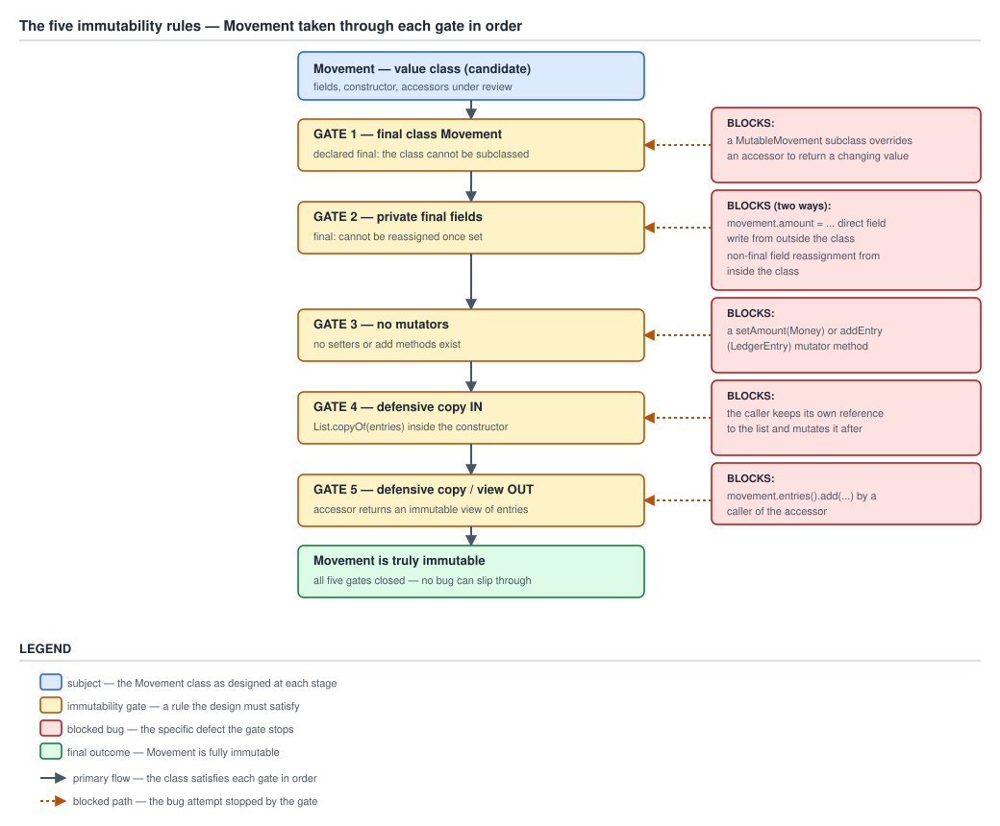
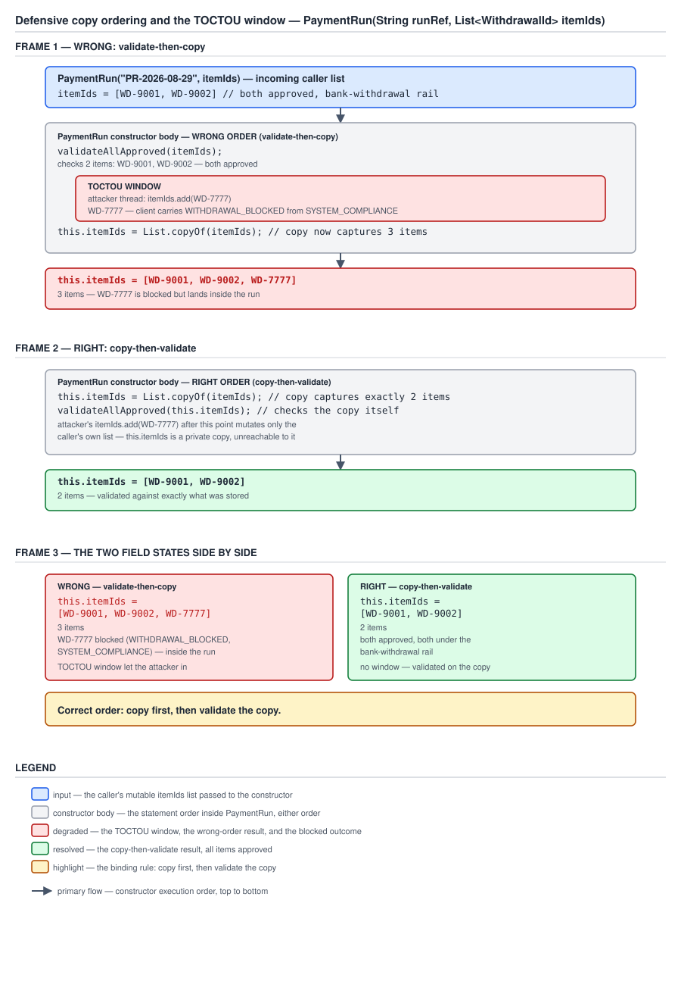

# 03 Java Core — Immutability and design — The five rules and the defensive-copy discipline — INTERMEDIATE (§2.3, 2.3.1–2.3.5)

**Target version: Java 21 LTS.** | **Part 2 of 5** | [Index](../00-index.md)
Previous: [What the harness can and cannot measure](../cost-model/02a-measurement-and-amortisation.md) · Next: [Shallow versus deep immutability](02a-shallow-deep-and-building-blocks.md)

---

The cost-model files settled what a defensive copy actually costs and, more importantly, what a benchmark can and cannot tell you about it. This file spends that budget: it establishes the five rules that make a class immutable, the one alternative to rule 1 that buys caching and subtype control, and the two orderings — copy before validity check, copy or view on the way out — that decide whether the guarantee actually holds under a hostile or merely careless caller. It stops at the boundary of shallow versus deep immutability, which `02a-shallow-deep-and-building-blocks.md` owns, and of records, the JMM freeze and builders, which `02b-records-jmm-and-builders.md` owns.

Every measured output below was produced on **Oracle JDK 21.0.7 (21.0.7+8-LTS-245), macOS aarch64**, compiled and run from a scratch directory under `/tmp/`. Library source is quoted from that build's `lib/src.zip`.

---

## 1. The five rules: final class, private final fields, no mutators, copy in, copy out (2.3.1)

An immutable object is one for which **no sequence of calls any caller can make, in any order, from any thread, changes what it reports.** That is the whole definition, and note what it is a claim about: not the fields, not the syntax, but the *observable behaviour under an adversarial caller*. `Movement` is immutable if there is no program — including a program that keeps the list it handed to the constructor, calls accessors and mutates whatever they return, and does all of that from four threads at once — that can make two calls to `movement.balances()` disagree.

Read that way, the five rules are not a style checklist. They are five separate holes through which that single guarantee leaks, and each one leaks *completely on its own*: a class with four of the five is not eighty percent immutable, it is mutable, with a narrower attack surface. That is why they are worth enumerating rather than summarising as "make everything final."

### Why it exists

The guarantee buys three things, and they compound. First, an immutable object needs no synchronisation to be shared across threads — there is no write to order against, so there is no race, which is why `Money` and `LedgerEntry` can be passed freely between the 1,200/sec stake-reservation path and the 230/sec ledger-writer path with no lock anywhere. Second, its `hashCode` cannot drift, so it is safe as a `HashMap` key and as a `Set` member for its whole lifetime — §5 shows what happens when that fails. Third, and least appreciated: an immutable object's invariants are checked exactly once, in the constructor, and are true forever after. A `StakeSplit` whose two portions sum exactly to the stake needs that check in one place; a mutable one needs it re-established after every setter, and in practice after every combination of setters, which nobody writes.

### When to reach for it, and when not

Reach for immutability by default for every value type and every aggregate that is read far more often than it is replaced: `Money`, `ClientId`, `StatusCode`, `LedgerEntry`, `Movement`, `Restriction`, `StakeSplit`. Do not reach for it where the object *is* the mutable thing — a running accumulator inside a hot loop, a `StringBuilder`, a builder object whose entire purpose is to be mutated and then frozen (`02b-records-jmm-and-builders.md` owns the builder). And do not reach for it where the object is genuinely large and edited in small increments: an immutable 10,000-entry `PaymentRun` that must be copied wholesale to add one withdrawal turns an O(1) append into O(n), and at 7k bank withdrawals per day batched into runs that is a real cost, not a theoretical one. The correct answer there is an immutable `PaymentRun` built once from a mutable local list, not an immutable one mutated by copying.

### How it works

Each rule, with the exact leak it plugs, over the running example `Movement` — an aggregate carrying a `List<LedgerEntry>`, a `Money amount` and an `Instant postedAt`.

| Rule | Mechanism | The leak it plugs |
|---|---|---|
| 1. `final class` (or a private constructor — §2) | No subclass can exist | A `MutableMovement extends Movement` overriding `entries()` to return a live list, passed anywhere a `Movement` is expected |
| 2. `private final` fields | No external write; no internal reassignment after construction | Any code with a reference writing `movement.amount = other` directly, or a later method on `Movement` itself reassigning the field |
| 3. No mutators | No method changes observable state | `setAmount(Money)`, and less obviously a `recalculate()` that repopulates a cache callers can see |
| 4. Defensive copy **in** | The field references an object the caller has no reference to | The caller keeps its own reference to the `List<LedgerEntry>` it passed and adds to it later |
| 5. Defensive copy or unmodifiable view **out** | No accessor hands out a mutable alias of internal state | `movement.entries().add(entry)` |

**Rule 1 is the blunt instrument.** `final class` forbids subclassing outright, which is correct and cheap, but it also forbids the *useful* subclass: a package-private implementation specialised for the common currency, a test double, a proxy. §2 covers the alternative — a private or package-private constructor plus static factories — which achieves the same guarantee against hostile subclasses while leaving the door open inside the package. Reach for `final class` as the default and swap only when you have a named reason. `../classes-and-initialization/02-modifiers.md` owns `final` as a modifier; `../inheritance-and-dispatch/01-basics.md` owns the fragile-base-class problem that rule 1 is a special case of.

**Rule 3 is not "no setters".** The absence of `setX` methods is necessary and nowhere near sufficient. Rule 3 says *no method changes observable state* — so a `recalculate()` that repopulates a `totalDebit` field, where a caller can observe `totalDebit()` returning one value before the call and another after, breaks immutability just as thoroughly as a setter would, even though nothing named `set` appears anywhere. The test is behavioural: can two calls to any accessor, with only other public calls in between, disagree? A `recalculate()` that changes what `totalDebit()` returns fails it.

This is distinct from the **benign lazy cache**, where a field is computed on first access and thereafter always returns the same value — `String.hash` is the canonical example. That does mutate a field after construction, and it does *not* break immutability, because no sequence of calls can make the accessor disagree with itself. The distinction is subtle enough and the JMM consequences sharp enough that leaf 2.3.12 in `02b-records-jmm-and-builders.md` owns it in full; the rule to carry here is that "mutates a field" and "changes observable state" are different predicates, and rule 3 is about the second. Guide 05 owns the Java memory model that decides what a *second* thread sees while such a cache is being populated, and leaf 2.3.13 in `02b-records-jmm-and-builders.md` owns the final-field freeze that makes safe publication of a fully-immutable object work without it.

**Records satisfy rules 1, 2 and 3 by construction, and neither 4 nor 5.** A `record Movement(List<LedgerEntry> entries, Money amount, Instant postedAt)` is implicitly final, its fields are implicitly `private final`, and no mutator is generated — but the canonical constructor assigns the parameter straight to the field and the generated accessor returns the field directly, so a record over a mutable component is exactly `MovementLeaky` below with less typing. Leaf 2.3.11 in `02b-records-jmm-and-builders.md` owns what a compact constructor has to do about that, and `../records-and-sealed/01a-object-methods-sealed-and-fit.md` owns the generated `equals`/`hashCode`/`toString` and the "when to reach for a record" decision.

### Diagram



**D-069** — The five immutability rules. Each gate carries the specific bug it blocks: a
`MutableMovement` subclass overriding an accessor, a direct field write, a `setAmount` mutator,
the caller retaining its own reference to the list it passed in, and `movement.entries().add(...)`.

### A concrete example

All five rules applied. This compiles and runs as written.

```java
public final class Movement {                                    // rule 1
    private final List<LedgerEntry> entries;                     // rule 2
    private final Money amount;
    private final Instant postedAt;

    public Movement(List<LedgerEntry> entries, Money amount, Instant postedAt) {
        Objects.requireNonNull(entries, "entries must not be null");
        this.entries = List.copyOf(entries);                     // rule 4 — see §3 for the ordering
        if (this.entries.isEmpty()) {
            throw new IllegalArgumentException("a movement needs at least two entries");
        }
        this.amount = Objects.requireNonNull(amount, "amount must not be null");
        this.postedAt = Objects.requireNonNull(postedAt, "postedAt must not be null");
    }

    public List<LedgerEntry> entries() { return entries; }       // rule 5 — see §4 for why direct is right here
    public Money amount() { return amount; }
    public Instant postedAt() { return postedAt; }

    public Movement withEntryAppended(LedgerEntry entry) {       // rule 3 — derive, never mutate
        List<LedgerEntry> next = new ArrayList<>(entries);
        next.add(Objects.requireNonNull(entry, "entry must not be null"));
        return new Movement(next, amount, postedAt);
    }
}
```

Measured, handing in a mutable `ArrayList` of two balancing entries, then attacking it from both directions:

```
after caller mutated its own list: [CLIENT_CASH_AVAILABLE:-4.20, CLIENT_CASH_RESERVED:4.20]
entries().add -> UnsupportedOperationException
field returned directly, same instance every call? true
original: [CLIENT_CASH_AVAILABLE:-4.20, CLIENT_CASH_RESERVED:4.20]
derived : [CLIENT_CASH_AVAILABLE:-4.20, CLIENT_CASH_RESERVED:4.20, FEES:0.05]
```

Line 1: the caller added a `HOUSE_REVENUE:99.00` entry to *its* list after construction and the `Movement` did not notice — rule 4. Line 2: `entries().add(...)` threw — rule 5, for free, because `List.copyOf`'s result is already immutable. Line 3: the accessor returns the same instance on every call and allocates nothing, which is §4's payoff. Lines 4–5: `withEntryAppended` produced a new `Movement` and left the original untouched — rule 3's replacement for a mutator.

**Now the same class with rule 4 omitted** — the field assigned straight from the parameter, everything else identical:

```java
MovementLeaky(List<LedgerEntry> entries, Money amount, Instant postedAt) {
    this.entries = Objects.requireNonNull(entries, "entries must not be null");   // no copy
    this.amount = Objects.requireNonNull(amount, "amount must not be null");
    this.postedAt = Objects.requireNonNull(postedAt, "postedAt must not be null");
}
```

The four-line caller that breaks it:

```java
List<LedgerEntry> caller = new ArrayList<>(List.of(
    new LedgerEntry("CLIENT_CASH_AVAILABLE", new BigDecimal("-4.20")),
    new LedgerEntry("CLIENT_CASH_RESERVED", new BigDecimal("4.20"))));
MovementLeaky m = new MovementLeaky(caller, amount, postedAt);
caller.add(new LedgerEntry("HOUSE_REVENUE", new BigDecimal("99.00")));
```

Measured:

```
entryCount=2 balances=true
entryCount=3 balances=false
entryCount=4 balances=false
```

The first line is after construction. The second is after the caller's own `add` — one entry appeared and the movement no longer balances, meaning the double-entry invariant this aggregate exists to enforce is now false in an object whose constructor verified it. The third line is after `m.entries().add(...)`, the rule-5 leak, which was reachable only because rule 4 had already handed out a mutable field. That is the compounding: one missing rule opened two holes.

### The gotcha

**Pitfall:** believing rule 2 (`private final`) is what makes the object immutable, so a class with all-`private final` fields is done. `MovementLeaky` above has `private final List<LedgerEntry> entries` — perfectly final, never reassigned — and is mutable in the only sense that matters, because `final` constrains the *reference*, not the object it points at. Symptom: a `Movement` that passed its constructor's balance check and later reports `balances() == false`, discovered by a reconciliation job days later with no transaction to explain it. Fix: rules 4 and 5. `final` on a reference field buys exactly one thing — the reference cannot be repointed — and `../classes-and-initialization/04-internals-final-and-constant-folding.md` owns the precise semantics of what else it buys at the JMM level.

**Interview:** "What makes a class immutable?" The weak answer lists `final class`, `private final` fields, no setters — three of five, and the two missing ones are the two that actually get exploited. The strong 90-second answer states the behavioural definition first ("no sequence of calls from any caller in any thread changes what it reports"), then names all five rules as five independent leaks, then volunteers that the two people forget are defensive copy in and out, and that `final` on a reference field constrains the reference and not the referent.

> **Definition.** A class is immutable when no sequence of public calls, from any caller in any thread, can change what any of its accessors reports — achieved by forbidding subclassing, making every field `private final`, exposing no method that changes observable state, defensively copying every mutable constructor argument on the way in, and copying or wrapping every mutable field on the way out.

---

## 2. Rule 1's alternative: a private constructor plus static factories (2.3.2)

Rule 1 asks for one guarantee — no hostile subclass — and `final class` delivers it by forbidding all subclasses, hostile and useful alike. A private constructor plus static factories delivers the same guarantee by a different mechanism: a subclass needs to call a superclass constructor, and it cannot call one it cannot see. The difference is that constructor visibility is a dial (`private`, package-private, `protected`) where `final` is a switch.

### Why it exists

Three things the swap buys that `final class` cannot.

**Interning and caching of common values.** A factory can decide not to allocate. `Money.zero(GBP)` returning a single shared `ZERO_GBP` instance costs nothing per call, where a public constructor must allocate every time — and at 2.8M stake reservations a day, each producing a `StakeSplit` whose bonus portion is very often zero, that is 2.8M allocations a factory can decline. The JDK's own shapes are the precedent: `BigDecimal.valueOf(0) == BigDecimal.ZERO` is `true` on JDK 21.0.7 (measured) because `valueOf` consults a `zeroThroughTen` table; `Boolean.valueOf(true) == Boolean.TRUE` is `true` for the same reason; `Integer.valueOf` returns a cached instance in −128..127, which `../wrappers-and-boxing/01-basics.md` owns in full. None of these are expressible with a public constructor, because `new` is contractually obliged to produce a fresh object.

**Returning a subtype the caller cannot name.** A factory's declared return type is the abstraction; what it actually returns is free to specialise. A `Money.of` can return a `MinorUnitMoney` backed by a single `long` of pence for the common currency — cheaper than a `BigDecimal` on every arithmetic operation and in memory — and a `BigDecimalMoney` for anything with unusual scale or a currency with three decimal places. Callers write `Money` and never learn which they got, which means the specialisation can change without touching a single call site. `final class Money` forecloses this entirely.

**Controlling subclassing without forbidding it.** This is the dial. A **private** constructor bars every subclass, including ones in the same file's package. A **package-private** constructor bars every subclass outside the package while permitting implementation subclasses inside it — so `MinorUnitMoney` and `BigDecimalMoney` can extend `Money` and a hostile `MutableMoney` in someone else's module cannot, because it cannot see a constructor to call. That is a guarantee `final class` cannot express at all.

### When to reach for it, and when not

Reach for it when at least one of the three payoffs is real: there are common values worth interning, there is more than one plausible representation, or there are implementation subclasses you want inside the package. Reach for plain `final class` otherwise — the default, and the right one for `LedgerEntry` and `Movement`, which have neither hot repeated values nor a second representation. `04-design-idioms.md` in this batch owns the static-factory idiom in full: naming conventions, the `of`/`from`/`valueOf`/`getInstance` vocabulary, the interaction with generics inference, and the service-provider shape. What is settled here is only the narrow question of whether it substitutes for rule 1. It does.

### How it works

The mechanism is JLS 21 §8.8.10 read backwards: a constructor body's first statement is an explicit or implicit superclass constructor invocation, so a subclass declaration is only well-formed if some superclass constructor is accessible from it. Reduce that accessibility and the subclass stops compiling. There is no runtime check and no bytecode marker — it is a compile-time consequence of ordinary access control, which also means it is enforced by `javac` and not by the JVM's verifier.

### Diagram

No diagram for this concept. The mechanism is one line of access-control reasoning and its evidence is two `==` comparisons; D-069's rule-1 gate already carries the picture of what is being blocked, and `04-design-idioms.md` owns the idiom's own figure.

### A concrete example

```java
public final class Money {
    private static final Money ZERO_GBP = new Money(BigDecimal.ZERO, Currency.GBP);

    private final BigDecimal amount;
    private final Currency currency;

    private Money(BigDecimal amount, Currency currency) {
        this.amount = amount;
        this.currency = currency;
    }

    public static Money of(BigDecimal amount, Currency currency) {
        Objects.requireNonNull(amount, "amount must not be null");
        Objects.requireNonNull(currency, "currency must not be null");
        if (currency == Currency.GBP && amount.signum() == 0) {
            return ZERO_GBP;
        }
        return new Money(amount.setScale(2, RoundingMode.UNNECESSARY), currency);
    }

    public static Money zero(Currency currency) {
        return currency == Currency.GBP ? ZERO_GBP : new Money(BigDecimal.ZERO, currency);
    }

    public BigDecimal amount() { return amount; }
    public Currency currency() { return currency; }
}
```

Measured on JDK 21.0.7:

```
Money.zero(GBP) interned? true
Money.zero(USD) interned? false
BigDecimal.valueOf(0) == BigDecimal.ZERO? true
Boolean.valueOf(true) == Boolean.TRUE? true
```

Line 1 is the payoff: two independent calls that would each have allocated under a public constructor returned the identical instance. Line 2 is the honest limit — the cache covers the common currency only, deliberately, because a table over every `Currency` would be a memory cost for values nobody asks for. Lines 3 and 4 are the JDK precedents the shape is modelled on. `../numbers-and-money/02-numbers-and-money.md` owns `BigDecimal`, scale and `RoundingMode`; the `setScale(2, UNNECESSARY)` above is a *normalisation* in the factory, which is a fourth thing a factory can do and a constructor cannot express as cleanly.

### The gotcha

Three costs, all real.

**No `new` to grep for.** `grep -rn 'new Money('` finds every construction site under a public constructor and finds nothing under a factory. The replacement is a naming discipline you now have to maintain and enforce in review, and there is no compiler help for it.

**No accessible constructor for a framework to reflect over.** This one bites. JPA requires a no-argument constructor of at least package-private visibility on every `@Entity` and `@Embeddable`; Jackson needs either a visible constructor, a `@JsonCreator`-annotated factory, or the parameter-names module; Spring's constructor injection needs a constructor it can see. A private constructor plus factories is therefore a decision about the *boundary* the type lives at: perfect for a domain value type, actively hostile for a type mapped directly to a table or deserialized straight off the wire. Guide 08 (Spring Data JPA) owns the entity-constructor requirement and the usual workaround of a package-private no-arg constructor kept solely for the provider; guide 07 (Spring core) owns constructor injection; `../reflection/02-reflection.md` owns `setAccessible` and why a framework can sometimes bypass the restriction anyway.

**Pitfall:** believing a private constructor makes the class immutable. It makes the class *unsubclassable*, which is rule 1 and rule 1 only. Symptom: a `Money` with a private constructor, a `Money.of` factory, and a `public void setAmount(BigDecimal)` — every reviewer's eye stops at the private constructor and reads "immutable value type," and the mutator sails through. Fix: rules 2 through 5 are independent obligations that a factory does nothing about.

> **Definition.** A private or package-private constructor plus public static factories satisfies rule 1 by making the superclass constructor inaccessible rather than the class `final`, and additionally lets the factory intern common values, return an unnameable subtype, normalise its arguments, and permit implementation subclasses inside the package — at the cost of no greppable `new`, no constructor for a reflective framework, and a naming discipline to maintain.

---

## 3. Copy in the constructor **after** the null check and **before** the validity check (2.3.3) `[TRAP]` `[PROVE]`

`[TRAP]` `[PROVE]` — Rule 4 says "defensively copy mutable arguments." It does not say where, and the position of that one line inside the constructor decides whether the constructor's postcondition is a guarantee or a wish. The correct order is exactly: **null check, then defensive copy, then validity check on the copy.** Get it wrong by one line and the constructor validates one object and stores a different one.

### Why it exists

A constructor is a contract with a postcondition. `PaymentRun`'s is: *every withdrawal in this run has been approved and none carries a restriction*. The whole point of a `PaymentRun` — a batch of approved bank withdrawals with operator sign-off, 7k withdrawals a day across four banking-partner windows — is that whatever is inside it has already been checked, so the operator signing the file does not have to re-check it. A constructor that validates the caller's list and then copies validates an object that is not the one it stores, and the postcondition becomes "every withdrawal in this run had been approved at some earlier instant," which is not the same statement and not a useful one.

### When to reach for it, and when not

Always, for every constructor that both copies and validates a mutable argument. There is no case where validate-then-copy is preferable; the copy-then-validate order is strictly better and costs nothing extra, because it is the same two operations in the other sequence. The one thing that is genuinely optional is the null check's position — it must come first only because `List.copyOf(null)` throws a bare `NullPointerException` with no parameter name, and an explicit `Objects.requireNonNull(itemIds, "itemIds must not be null")` produces a diagnosable message instead. That is a message-quality argument, not a correctness one.

### How it works

`[PROVE]`. Here is the wrong constructor. Everything in it is correct line by line.

```java
PaymentRunWrong(String runRef, List<WithdrawalId> itemIds) {
    this.runRef = Objects.requireNonNull(runRef, "runRef must not be null");
    Objects.requireNonNull(itemIds, "itemIds must not be null");
    validateAllApproved(itemIds);              // reads the CALLER's list
    this.itemIds = List.copyOf(itemIds);       // copies the CALLER's list, later
}
```

`validateAllApproved` walks the list and throws if any item carries `WITHDRAWAL_BLOCKED` from `SYSTEM_COMPLIANCE`. `List.copyOf` produces a genuinely immutable list. Both lines are right. The bug is the gap between them.

Now the schedule. Constructing thread **C** runs the constructor with `runRef = "PR-2026-08-29"` and an incoming `ArrayList` holding `[WD-9001, WD-9002]`; attacker thread **A** holds the same list reference and wants `WD-7777` — a withdrawal whose client carries `WITHDRAWAL_BLOCKED` from `SYSTEM_COMPLIANCE`, so it must never enter a `PaymentRun` — inside the run.

| Step | Thread | Operation | The caller's list after this step | `this.itemIds` after this step |
|---|---|---|---|---|
| 1 | C | `requireNonNull(runRef)` passes | `[WD-9001, WD-9002]` | unassigned |
| 2 | C | `requireNonNull(itemIds)` passes | `[WD-9001, WD-9002]` | unassigned |
| 3 | C | `validateAllApproved(itemIds)` walks both items, finds neither blocked, **returns normally** | `[WD-9001, WD-9002]` | unassigned |
| 4 | A | `incoming.add(WD-7777)` | `[WD-9001, WD-9002, WD-7777]` | unassigned |
| 5 | C | `this.itemIds = List.copyOf(itemIds)` | `[WD-9001, WD-9002, WD-7777]` | `[WD-9001, WD-9002, WD-7777]` |
| 6 | C | constructor returns | `[WD-9001, WD-9002, WD-7777]` | `[WD-9001, WD-9002, WD-7777]` |

At step 6 the constructor has returned without throwing, `this.itemIds` is a truly immutable list, and it contains `WD-7777`. The postcondition "every item in this run is approved" is **false on exit**, and not one line of the constructor misbehaved: the validation genuinely inspected a list that genuinely contained only approved items, and the copy genuinely produced an immutable snapshot. The two statements were simply about different list contents, one instant apart. That is time-of-check-to-time-of-use, and the "use" here is the copy.

Measured, with a `CountDownLatch` pair forcing the interleaving at exactly step 3→4 so the run is reproducible rather than one-in-a-million:

```
validate-then-copy: constructor RETURNED, field = [WD-9001, WD-9002, WD-7777]
caller's list is now      = [WD-9001, WD-9002, WD-7777]
```

### Diagram



**D-070** — Defensive copy ordering. Frame 1 validates then copies, and an attacker thread slips
`WD-7777` in between; frame 2 copies then validates the private copy; frame 3 shows the two
resulting field states.

### A concrete example

The right order. The copy moves up two lines and the validation now reads `this.itemIds`, not the parameter.

```java
public final class PaymentRun {
    private final String runRef;
    private final List<WithdrawalId> itemIds;

    public PaymentRun(String runRef, List<WithdrawalId> itemIds) {
        this.runRef = Objects.requireNonNull(runRef, "runRef must not be null");
        Objects.requireNonNull(itemIds, "itemIds must not be null");   // 1. null check
        this.itemIds = List.copyOf(itemIds);                            // 2. copy
        validateAllApproved(this.itemIds);                              // 3. validate the COPY
    }

    private static void validateAllApproved(List<WithdrawalId> itemIds) {
        for (int i = 0; i < itemIds.size(); i++) {
            WithdrawalId id = itemIds.get(i);
            if (WITHDRAWAL_BLOCKED.contains(id)) {
                throw new IllegalArgumentException(
                    "withdrawal " + id + " carries WITHDRAWAL_BLOCKED from SYSTEM_COMPLIANCE");
            }
        }
    }

    public String runRef() { return runRef; }
    public List<WithdrawalId> itemIds() { return itemIds; }
}
```

Measured, the identical attacker thread and the identical forced interleaving, this time at the gap between the copy and the validation:

```
copy-then-validate: constructor RETURNED, field = [WD-9001, WD-9002]
caller's list is now      = [WD-9001, WD-9002, WD-7777]
```

**Why the order closes it, stated exactly.** After `List.copyOf(itemIds)` returns, `this.itemIds` references an object no other thread has a reference to and no other thread can obtain one to — it was allocated inside `copyOf` from a fresh array and never published anywhere. So validating it is validating the thing that will actually be stored, and nothing can change between the check and the storage because the check happens *after* the storage. The window has not been narrowed; it has been removed, because there is no longer an interval during which the validated object and the stored object could differ. The attacker's `add` still succeeds — line 2 of the output shows the caller's list did grow — it just lands on a list the `PaymentRun` no longer has anything to do with.

**Insight:** the JDK makes this exact argument about itself, in a comment. From `java.base/java/util/ImmutableCollections.java`, JDK 21.0.7:

```java
@SafeVarargs
static <E> List<E> listFromArray(E... input) {
    // copy and check manually to avoid TOCTOU
    @SuppressWarnings("unchecked")
    E[] tmp = (E[])new Object[input.length]; // implicit nullcheck of input
    for (int i = 0; i < input.length; i++) {
        tmp[i] = Objects.requireNonNull(input[i]);
    }
    return new ListN<>(tmp, false);
}
```

Read it line by line. `listFromArray` is what `List.of(E...)` calls for three or more elements, and its input is a varargs array the *caller* may still hold a reference to. The comment names the hazard outright. Line 4 allocates `tmp`, a fresh array nothing else can see. Line 5–7 copy **and** null-check element by element, writing each element into `tmp` and checking the value already in `tmp`'s slot — not checking `input[i]` and then separately copying it, which would leave exactly the window §3 is about, per element. Line 8 hands `tmp` to `ListN` with `allowNulls = false`, a promise the loop just made true. This is the same ordering discipline as `PaymentRun`, applied at element granularity by the library that `PaymentRun` uses to implement it.

### The gotcha

**Pitfall:** believing that a `List.copyOf` *anywhere* in the constructor makes the field safe. The wrong belief is that the copy is a property of the constructor — "we copy, so we're immutable" — when it is a property of the *order*. Symptom: a `PaymentRun` that passed validation, holds a genuinely immutable list, and contains `WD-7777`, a withdrawal carrying `WITHDRAWAL_BLOCKED` from `SYSTEM_COMPLIANCE`; the operator signs off the banking-partner payout file on the strength of the constructor having succeeded, and money leaves for a client it must not leave for. Nothing in the code review looks wrong, because nothing in the code *is* wrong except two adjacent lines' sequence. Fix: null check, copy, validate the copy — in that order, with the validation reading `this.field` and never the parameter, which is the mechanical rule that makes the error impossible to make by accident.

**This is not only an attacker story.** A caller with no malice at all produces the identical corruption: `BankWithdrawal` builds up a run's item list in a reusable `ArrayList` field, constructs the `PaymentRun`, then keeps adding to the same list for the next window instead of allocating a new one. Under validate-then-copy the previous run's field is fine — the copy already happened — but the version of the bug where the copy is skipped entirely (rule 4 omitted, §1) means run *n* silently acquires run *n+1*'s items. The TOCTOU variant is what happens when the copy is present but late, and it needs only a second thread on the same list, which in a service where operators build runs concurrently is not exotic. `../objects-equality-and-lifecycle/02-copying-and-composite-equality.md` owns the aliasing mechanics underneath both variants.

> **Definition.** A constructor that copies a mutable argument must do so after the null check and before any validity check, validating the copy rather than the parameter — because a validity check performed on the caller's still-reachable object is a statement about a past instant, and the interval between that check and the copy is a time-of-check-to-time-of-use window in which any other holder of the reference can invalidate the constructor's postcondition without violating a single line of it.

---

## 4. Copy out of getters, or return an unmodifiable view (2.3.4)

Rule 5's job is that no accessor hands out a mutable alias of internal state. There are three ways to satisfy it and they are not interchangeable: return the field directly, return a fresh copy on every call, or return a wrapper. The choice is decided by one question — *is the field's own type already immutable?* — and almost every real case answers yes, which makes the cheapest option the correct one.

### Why it exists

An accessor is a publication point. Whatever it returns escapes into caller code you do not control and cannot audit, and it escapes on every call, in every thread. If what escapes is a reference to the object the field points at, and that object is mutable, then rule 4's copy bought nothing: the caller did not get to keep the list it passed in, but it gets handed the private one on the way out and can mutate that instead. `MovementLeaky` above demonstrated both leaks in sequence for exactly this reason.

### When to reach for each, and when not

| Option | What escapes | Cost per call | Caller sees later writes to the field's object? | Correct when |
|---|---|---|---|---|
| `return entries;` | The field's own reference | Zero — no allocation | Irrelevant: there are no later writes | The field's type is **already immutable** — a `List.copyOf` result, a `Money`, an `Instant`, a `String`, a record of immutables. **The default.** |
| `return List.copyOf(entries);` | A fresh independent snapshot | One list allocation plus one array copy per call — price against `../cost-model/02-master-cost-table.md` | No | The field is a mutable type you deliberately kept mutable, and the caller must get a stable snapshot |
| `return Collections.unmodifiableList(entries);` | A read-only **view** onto the field's object | One small wrapper allocation per call (or zero if cached in a field) | **Yes** — the wrapper forwards reads to the backing list | The field is already immutable (in which case it is pointless) or the caller is *meant* to observe a live collection. A live-aliasing bug otherwise. |

**The decision rule.** If the field was copied in per rule 4, it is already immutable, so return it directly and pay nothing. A copy-out is only load-bearing when the field is a mutable type you chose to keep mutable — and that choice is usually a sign rule 4 was done wrong, because there is rarely a reason to store a mutable `ArrayList` in an immutable class when `List.copyOf` at the boundary would have removed the question. Reaching for a per-call `List.copyOf` on a field that is *already* a `List.copyOf` result is the most common form of this mistake: it allocates on every read for a guarantee the field type already provides.

At the scale in play the difference is worth stating as arithmetic. A `Movement` accessor called once per ledger write, at 230 ledger writes/sec sustained and 13,600/sec peak, returning the field directly allocates **zero** bytes; returning `List.copyOf(entries)` on a two-element list allocates a `List12` (a 12-byte header plus two 4-byte compressed-oop fields, rounded up to 24 bytes) on every call, which is 13,600 × 24 ≈ 326 KB/sec of pure garbage at peak, for no guarantee the direct return did not already give. Escape analysis may eliminate some of those allocations when the returned list does not escape the caller's frame, but C2 makes no documented guarantee about when scalar replacement fires, and an accessor's result usually does escape — so the honest planning number is that the allocation happens.

### How it works

`Collections.unmodifiableList` is a wrapper, and its source says so directly. From `java.base/java/util/Collections.java`, JDK 21.0.7:

```java
public static <T> List<T> unmodifiableList(List<? extends T> list) {
    if (list.getClass() == UnmodifiableList.class || list.getClass() == UnmodifiableRandomAccessList.class) {
       return (List<T>) list;
    }

    return (list instanceof RandomAccess ?
            new UnmodifiableRandomAccessList<>(list) :
```

Line 2–4: already-wrapped lists are not wrapped twice — an idempotence check, so repeated wrapping does not build a chain of proxies. Line 6–8: otherwise a wrapper is constructed *around* `list`, holding it as a field. That field is the entire mechanism: every read on the wrapper delegates to the backing list, so the wrapper's contents are whatever the backing list's contents are *right now*, and every mutator on the wrapper throws. Read-only, not immutable — those are different properties, and §5 measures the difference.

### Diagram

No diagram for this concept. The three-way choice is a table, and the copy-versus-view distinction that decides it is drawn as D-070's frame 3 in §3 and demonstrated as printed output in §5.

### A concrete example

The three options side by side on the same class, and the one that is right:

```java
public final class Movement {
    private final List<LedgerEntry> entries;   // already immutable: a List.copyOf result

    public List<LedgerEntry> entries() {
        return entries;                                        // correct, zero cost
    }

    public List<LedgerEntry> entriesSnapshot() {
        return List.copyOf(entries);                           // pointless here: allocates for nothing
    }

    public List<LedgerEntry> entriesView() {
        return Collections.unmodifiableList(entries);          // pointless here, and one wrapper per call
    }
}
```

Measured on the correct form:

```
entries().add -> UnsupportedOperationException
field returned directly, same instance every call? true
```

The first line is rule 5 satisfied with no accessor code at all — the field's own type refuses mutation. The second is the payoff of the field being immutable: identity is stable across calls, so a caller can even use the returned list as a cache key without the accessor having to promise anything.

### The gotcha

**Pitfall:** using `Collections.unmodifiableList(mutableField)` as the copy-out and believing it makes the class immutable. It makes the *returned reference* unable to mutate, and nothing else. Symptom: `movement.entries().add(entry)` throws, so a test asserting exactly that passes and the class is signed off as immutable — while the object holding the mutable backing `ArrayList` (the constructor's caller, or a `recalculate()` method inside the class) keeps writing to it, and every previously-returned view silently reports the new contents. Two calls to `entries().size()` disagree with no intervening call on the `Movement` at all, which is precisely the behavioural definition of immutability failing. Fix: make the field immutable at the boundary with `List.copyOf` in the constructor (§3), and then the accessor needs no wrapper at all.

**Interview:** "Should an immutable class's getter return a copy?" The strong answer inverts the question: if you need a copy on the way out, the field is mutable, and the real bug is on the way in — copy once in the constructor, make the field's own type immutable, and the getter becomes a free field read. A copy-out is a symptom, not a design.

> **Definition.** Rule 5 is satisfied by returning the field directly when the field's own type is immutable (the default, zero cost), by returning `List.copyOf(field)` when the field is deliberately mutable and the caller needs an independent snapshot (correct, allocates per call), or by returning `Collections.unmodifiableList(field)` when the caller is meant to observe a live collection (a read-only view, not an immutable one — the caller sees every later write to the backing list).

---

## 5. `List.copyOf` versus `Collections.unmodifiableList`, in both directions (2.3.5) `[X-REF 02]`

`[X-REF 02]` — Two API shapes that both produce a list whose mutators throw, and one difference that decides which is correct where: **`List.copyOf` copies, `Collections.unmodifiable*` wraps.** Everything else follows from that.

### Why it exists

Both exist because both are wanted, at different boundaries. A constructor copying an argument (§3) wants a snapshot that no later mutation of the source can reach — a copy. A method returning a live internal collection to a caller that must not modify it but *should* see updates wants a view. The failure mode is using one where the other belongs, and because both produce something that throws `UnsupportedOperationException` on `add`, the wrong choice passes every test that checks only for throwing.

### How it works

Verified, not recalled. Both objects built over the same `ArrayList` source, then `WD-7777` added to the source afterwards:

```java
List<WithdrawalId> source = new ArrayList<>(
    List.of(new WithdrawalId("WD-9001"), new WithdrawalId("WD-9002")));

List<WithdrawalId> copy = List.copyOf(source);
List<WithdrawalId> view = Collections.unmodifiableList(source);

System.out.println("before add  copy=" + copy + " view=" + view);
source.add(new WithdrawalId("WD-7777"));
System.out.println("after  add  copy=" + copy + " view=" + view);
System.out.println("copy class = " + copy.getClass().getName());
System.out.println("view class = " + view.getClass().getName());
```

Measured on JDK 21.0.7:

```
before add  copy=[WD-9001, WD-9002] view=[WD-9001, WD-9002]
after  add  copy=[WD-9001, WD-9002] view=[WD-9001, WD-9002, WD-7777]
copy class = java.util.ImmutableCollections$List12
view class = java.util.Collections$UnmodifiableRandomAccessList
```

Line 1: indistinguishable. Line 2: the whole distinction, printed. `copy` is still the two approved withdrawals; `view` now reports the blocked one, because it is a wrapper that forwards `toString` — and therefore `size`, `get`, `iterator` and `contains` — to the backing `ArrayList` the source variable still points at. Line 3 confirms `copy` is an `ImmutableCollections$List12`, a distinct object holding its own two elements. Line 4 confirms `view` is a `Collections$UnmodifiableRandomAccessList`, the wrapper whose source §4 quoted.

The details that get asked, all measured on JDK 21.0.7:

```
copyOf(null elem) threw java.lang.NullPointerException
unmodifiableList(null elem) = [WD-9001, null]
copyOf(List.of 2 elems) same instance? true
copyOf(List.of 3 elems) same instance? true
copyOf(copyOf(x)) same instance? true
copyOf(Arrays.asList) same instance? false
copyOf(unmodifiableList) same instance? false
List12.add -> UnsupportedOperationException
List12.add -> UnsupportedOperationException
UnmodifiableRandomAccessList.add -> UnsupportedOperationException
```

(The `List12.add` line appears twice because the loop that produced it walked a `List.of(...)` literal and a `List.copyOf` result in turn, and both are `List12` instances — itself a small confirmation that `copyOf` of a two-element source produces the same implementation class as a two-element `List.of`.)

**Null elements.** `List.copyOf` throws `NullPointerException` if any element is null — the javadoc says "must not contain any null elements" and the `listFromArray`/`listFromTrustedArray` loops quoted in §3 enforce it with `Objects.requireNonNull` per element. `Collections.unmodifiableList` accepts a list containing nulls without complaint, because it never inspects the elements at all. This is a real migration hazard: swapping `unmodifiableList` for `copyOf` in a codebase that tolerates null elements turns a silent pass into a construction-time `NullPointerException`.

**The same-instance optimisation.** `List.copyOf` on an argument that is already an immutable `List.of`/`copyOf` result returns the same instance rather than copying. That is documented as an `@implNote` and not as a guarantee — quoted from `java.base/java/util/List.java`, JDK 21.0.7: *"If the given Collection is an unmodifiable List, calling copyOf will generally not create a copy."* The exact condition in JDK 21.0.7's implementation, from `ImmutableCollections.listCopy`:

```java
static <E> List<E> listCopy(Collection<? extends E> coll) {
    if (coll instanceof List12 || (coll instanceof ListN<?> c && !c.allowNulls)) {
        return (List<E>)coll;
    } else if (coll.isEmpty()) { // implicit nullcheck of coll
        return List.of();
    } else {
        return (List<E>)List.of(coll.toArray());
    }
}
```

Line 2 is the condition: the argument is returned unchanged only if it is a `List12` (a `List.of` of one or two elements) or a `ListN` that prohibits nulls (a `List.of` of three or more, or a previous `copyOf` result). Nothing else qualifies — which is why `copyOf(Arrays.asList(...))` and `copyOf(Collections.unmodifiableList(...))` both measured `false`. The `Collections` wrapper is *not* an "unmodifiable List" in the javadoc's sense; that phrase is a defined term anchored to `List.of`/`List.copyOf` results specifically, and mistaking it for "any list that throws on mutation" is exactly how the `copyOf(unmodifiableList) == view` expectation gets formed and disappointed. The practical consequence: `List.copyOf` in a constructor is free when the caller already passed an immutable list, and a real allocation otherwise, so it is a copy you cannot budget away but can often avoid paying by making callers pass immutable lists.

**Mutator behaviour.** Both throw `UnsupportedOperationException` from `add`, `remove`, `set`, `clear` and friends — `ImmutableCollections.AbstractImmutableCollection` and `Collections.UnmodifiableCollection` each override every mutator to throw. Identical symptom, which is precisely why the copy-versus-view distinction cannot be detected by a test that only asserts throwing.

| | `List.of(e1, e2)` | `List.copyOf(source)` | `Collections.unmodifiableList(source)` |
|---|---|---|---|
| Copy or view | Neither — constructs from its own arguments | **Copy** (or the same instance, if the source is already a `List.of`/`copyOf` result) | **View** onto `source` |
| Null elements | Rejected — `NullPointerException` | Rejected — `NullPointerException` | Accepted; never inspected |
| Sees later writes to the source | No source to see | **No** | **Yes** |
| Mutator behaviour | `UnsupportedOperationException` | `UnsupportedOperationException` | `UnsupportedOperationException` |
| Right direction | Constructing a literal immutable list | **In** — the constructor's defensive copy (§3) | **Out** — only when the caller is meant to observe a live collection (§4) |
| Since | Java 9 | Java 10 | Java 1.2 |

### Diagram

No diagram for this concept. D-070's frame 3 already draws the two resulting field states, and the copy-versus-view distinction is carried by the measured output above rather than by a picture. Guide 02 owns the collections hierarchy figure.

### A concrete example

How this lands in a hash table, which is where the distinction stops being academic. A `HashMap` computes a key's `hashCode` once, at insertion, and files the entry in the bucket that hash selects; it never recomputes it. `List.hashCode` is specified as a fold over the elements' hashes, so a list's hash is a function of its contents — which means a mutable list used as a key files itself in one bucket and then, if mutated, starts reporting a hash that points at a different bucket, and the entry becomes unreachable through the very reference that inserted it. Measured on JDK 21.0.7:

```
lookup before mutation: PR-2026-08-29
lookup after  mutation: null
```

The map still holds the entry; `size()` is still 1; nothing was removed. The key simply can no longer find itself. An immutable list is safe as a `Map` key precisely because its `hashCode` cannot drift — the contents are fixed for the object's lifetime, so the hash computed at insertion is the hash computed at every subsequent lookup, for ever. An *unmodifiable view* is **not** safe, because its hash is its backing list's hash and the backing list can still change. This is the sharpest practical consequence of copy-versus-view, and it is one more reason the constructor's defensive copy (§3) should be `List.copyOf` and not a wrapper. Guide 02 owns the collections chapter — bucket layout, treeification, `hashCode` folding and the full key-contract discussion; `../objects-equality-and-lifecycle/01b-equals-hashcode-and-object-methods.md` owns the `equals`/`hashCode` contracts themselves.

### The gotcha

**Pitfall:** treating `Collections.unmodifiableList` and `List.copyOf` as interchangeable because both throw on `add`. Symptom, exactly as measured above: a constructor that stores `Collections.unmodifiableList(itemIds)` produces a `PaymentRun` whose `itemIds()` reports `[WD-9001, WD-9002]` immediately after construction and `[WD-9001, WD-9002, WD-7777]` an hour later, with no method on `PaymentRun` ever having been called in between — and every unit test asserting `assertThrows(UnsupportedOperationException.class, () -> run.itemIds().add(x))` passes throughout. Fix: `List.copyOf` for the inbound direction, always, because inbound is where an independent snapshot is the requirement; reserve `Collections.unmodifiable*` for the outbound direction and only when live observation is intended.

**Version note.** `Collections.unmodifiableList` has existed since **Java 1.2**; `List.of` arrived in **Java 9** (JEP 269, convenience factory methods for collections) and `List.copyOf`/`Map.copyOf`/`Set.copyOf` in **Java 10**. Material written before Java 10 therefore shows `Collections.unmodifiableList(new ArrayList<>(source))` — a manual copy wrapped in a view — as the idiomatic defensive copy, and that is still *correct*, just two allocations where one now suffices. Old code doing exactly that is not a bug to fix urgently; old *advice* recommending the wrapper alone, with no inner copy, is.

> **Definition.** `List.copyOf(source)` — Java 10 — returns a new immutable list containing the source's elements, rejecting null elements and never reflecting later changes to the source (and returning the source itself when it is already a `List.of`/`copyOf` result, an `@implNote` rather than a guarantee); `Collections.unmodifiableList(source)` — Java 1.2 — returns a read-only wrapper that forwards every read to the source and therefore does reflect later changes to it; both throw `UnsupportedOperationException` from every mutator, which is why the distinction is invisible to a test that checks only for throwing, and the first belongs on the way in while the second belongs on the way out and only when live observation is intended.

---

## Pitfalls

### All fields are `private final`, so the class is immutable

**Wrong**

```java
public final class MovementLeaky {
    private final List<LedgerEntry> entries;   // final. never reassigned.

    MovementLeaky(List<LedgerEntry> entries) {
        this.entries = Objects.requireNonNull(entries, "entries must not be null");
    }

    public int entryCount() { return entries.size(); }
    public boolean balances() { /* sums entries, returns whether the total is zero */ }
}
```

```
entryCount=2 balances=true
entryCount=3 balances=false
```

Two calls to `balances()` on the same object, with no method on that object called in between — the caller merely added to the list it had passed in. The double-entry invariant the constructor verified is now false.

**Right**

```java
MovementLeaky(List<LedgerEntry> entries) {
    Objects.requireNonNull(entries, "entries must not be null");
    this.entries = List.copyOf(entries);       // the field now points at an unreachable object
}
```

Measured with the identical attacking caller, on the `Movement` of §1 which does exactly this:

```
after caller mutated its own list: [CLIENT_CASH_AVAILABLE:-4.20, CLIENT_CASH_RESERVED:4.20]
```

The `HOUSE_REVENUE:99.00` entry the caller appended is absent, so the entry count and the balance check are both unchanged. `final` constrains the reference; `List.copyOf` constrains what the reference points at, which is the part the caller can reach.

**Why people believe it:** `final` is the keyword the language gives you for "cannot change," and it delivers on that promise exactly — for the variable. The mental slip is that in Java a field of reference type holds a pointer, so "the field cannot change" and "the object cannot change" are different statements, and only the weaker one is what `final` says. Every tutorial's `private final int` and `private final String` examples happen to satisfy both, because `int` has no interior and `String` is already immutable, so the distinction never surfaces until the first `List` field.

### A `List.copyOf` anywhere in the constructor makes the field safe

**Wrong**

```java
PaymentRunWrong(String runRef, List<WithdrawalId> itemIds) {
    this.runRef = Objects.requireNonNull(runRef, "runRef must not be null");
    Objects.requireNonNull(itemIds, "itemIds must not be null");
    validateAllApproved(itemIds);              // validates the caller's list
    this.itemIds = List.copyOf(itemIds);       // copies it afterwards
}
```

```
validate-then-copy: constructor RETURNED, field = [WD-9001, WD-9002, WD-7777]
```

The constructor returned without throwing, the field is a genuinely immutable list, and it contains a withdrawal carrying `WITHDRAWAL_BLOCKED` from `SYSTEM_COMPLIANCE`.

**Right**

```java
public PaymentRun(String runRef, List<WithdrawalId> itemIds) {
    this.runRef = Objects.requireNonNull(runRef, "runRef must not be null");
    Objects.requireNonNull(itemIds, "itemIds must not be null");
    this.itemIds = List.copyOf(itemIds);       // copy first
    validateAllApproved(this.itemIds);         // then validate the copy
}
```

```
copy-then-validate: constructor RETURNED, field = [WD-9001, WD-9002]
```

After `List.copyOf` the field references an object no other thread holds a reference to, so validating it is validating what will actually be stored, and there is no interval in which the two could differ.

**Why people believe it:** the copy is visibly present, and everyone has been taught that the copy is the fix. The instruction people carry away from rule 4 is "copy mutable arguments," which is a statement about *whether*, not *where* — and since the copy does produce a truly immutable list either way, the bug leaves no trace in the field's type, its class name, or any assertion about its mutability.

### `Collections.unmodifiableList` and `List.copyOf` are interchangeable

**Wrong**

```java
this.itemIds = Collections.unmodifiableList(itemIds);
```

```
before add  copy=[WD-9001, WD-9002] view=[WD-9001, WD-9002]
after  add  copy=[WD-9001, WD-9002] view=[WD-9001, WD-9002, WD-7777]
```

Read the `view=` half. The field's contents changed with no call on the owning object, because the wrapper forwards every read to the `ArrayList` the caller still holds. `assertThrows(UnsupportedOperationException.class, () -> run.itemIds().add(x))` passes both before and after.

**Right**

```java
this.itemIds = List.copyOf(itemIds);
```

The `copy=` half of the same two printed lines never moves, across the identical mutation of the same source list. `List.copyOf` returns an `ImmutableCollections$List12` holding its own elements; `Collections.unmodifiableList` returns a `Collections$UnmodifiableRandomAccessList` holding a reference to the source.

**Why people believe it:** the two are presented side by side in every "how to make a collection unmodifiable" answer, and the observable behaviour a developer actually reaches for — `add` throws — is identical. The word "unmodifiable" is also doing damage: it accurately describes the wrapper's *own* API and says nothing about the contents, but it reads as a claim about the data.

### A getter on an immutable class should return a defensive copy

**Wrong**

```java
public List<LedgerEntry> entries() {
    return List.copyOf(entries);   // entries is already a List.copyOf result
}
```

At 13,600 ledger writes/sec peak, a two-element `List12` is a 12-byte header plus two 4-byte compressed-oop references, rounded up to 24 bytes: 13,600 × 24 ≈ 326 KB/sec of garbage. The guarantee bought is zero, because the field's type already refuses mutation.

**Right**

```java
public List<LedgerEntry> entries() {
    return entries;
}
```

```
entries().add -> UnsupportedOperationException
field returned directly, same instance every call? true
```

Rule 5 satisfied with no accessor code, no allocation, and stable identity across calls as a bonus.

**Why people believe it:** "defensive copy in, defensive copy out" is taught as a symmetric pair, and the symmetry is genuinely there in the *rule* — rule 5 does exist. What gets lost is that copying in makes the field's own type immutable, which discharges rule 5 for free, so the outbound copy is only ever needed for a field that stayed mutable. The pair is symmetric as a statement of obligations and asymmetric in what it costs to satisfy them.

---

## Cheat sheet

| Thing | Value |
|---|---|
| Behavioural definition | No sequence of calls, from any caller in any thread, changes what any accessor reports |
| Rule 1 | `final class` — or a private/package-private constructor plus static factories |
| Rule 2 | Every field `private final` — constrains the reference, **not** the referent |
| Rule 3 | No method changes observable state — includes a `recalculate()` callers can see, excludes a benign lazy cache (`02b`) |
| Rule 4 | Defensive copy of every mutable argument, **in** the constructor |
| Rule 5 | Copy or wrap every mutable field **out** of every accessor |
| Four of five rules | Mutable, with a narrower attack surface — not "mostly immutable" |
| Constructor order | null check → **defensive copy** → validity check on the copy |
| Why that order works | After `List.copyOf` the field points at an object no other thread can reach, so the validated object *is* the stored object |
| TOCTOU symptom | Constructor returned normally; field is genuinely immutable; contents violate the postcondition |
| Static factory buys | Interning (`Money.ZERO`, `BigDecimal.ZERO`, `Boolean.valueOf`), an unnameable subtype, argument normalisation, package-scoped subclassing |
| Static factory costs | No greppable `new`; no constructor for JPA/Jackson/Spring to reflect over (guides 07, 08); a naming discipline |
| Copy out — default | `return field;` — correct and free whenever the field's type is already immutable |
| Copy out — snapshot | `return List.copyOf(field);` — correct, allocates per call, only needed if the field stayed mutable |
| Copy out — view | `return Collections.unmodifiableList(field);` — the caller sees later writes to the backing list |
| Decision rule | Needing a copy-out means the field is mutable, which usually means rule 4 was done wrong |
| `List.copyOf` | Java 10. **Copy.** Rejects null elements with `NullPointerException`. Never sees later source writes |
| `Collections.unmodifiableList` | Java 1.2. **View.** Accepts null elements. **Does** see later source writes |
| Both mutators | `UnsupportedOperationException` — identical, which is why a throwing test cannot tell them apart |
| `copyOf` same-instance condition (21.0.7) | `List12`, or `ListN` with `allowNulls == false` — i.e. a prior `List.of`/`copyOf`. `@implNote`, not a guarantee |
| `copyOf(Arrays.asList(...))` | Measured `false` — copies |
| `copyOf(Collections.unmodifiableList(...))` | Measured `false` — copies; the `Collections` wrapper is not an "unmodifiable List" in the javadoc's sense |
| JDK's own TOCTOU comment | `ImmutableCollections.listFromArray`: "copy and check manually to avoid TOCTOU" |
| Immutable list as a `Map` key | Safe — `hashCode` cannot drift. A mutable one becomes unreachable through its own reference after mutation |
| Pre-Java-10 idiom | `Collections.unmodifiableList(new ArrayList<>(source))` — still correct, two allocations instead of one |

---

## Self-test

**Q1.** Give the behavioural definition of an immutable object, and explain why a class satisfying four of the five rules is not "mostly immutable."

<details><summary>Answer</summary>

An immutable object is one for which no sequence of calls any caller can make, in any order, from any thread, changes what it reports. That is a claim about observable behaviour under an adversarial caller, not about syntax — it is satisfied or not by the whole class, including what its accessors hand out and what its constructor retains a reference to. The five rules matter because each one is a complete, independent leak of that single guarantee: a `final` class with `private final` fields, no setters and a copy-out but no copy-in is exactly as mutable as a class with public fields, because a caller that keeps the list it passed to the constructor can change what `balances()` reports at will. Measured: `MovementLeaky` with all-`private final` fields reported `entryCount=2 balances=true`, then `entryCount=3 balances=false` after the caller added one entry to its own list, with no method on the `Movement` called in between. There is no partial credit — the guarantee is a universally quantified statement over all callers and all interleavings, and one reachable counterexample falsifies it entirely.

</details>

**Q2.** `private final List<LedgerEntry> entries` is final and never reassigned. Why is that not enough, and what exactly does `final` buy?

<details><summary>Answer</summary>

`final` on a field of reference type constrains the reference, not the object the reference points at. It guarantees that `entries` will point at the same list object for the whole life of the enclosing object — nothing can repoint it — and it additionally participates in the JMM's final-field freeze, which is what makes safe publication of a properly-constructed immutable object work without synchronisation (leaf 2.3.13, owned by `02b-records-jmm-and-builders.md`; the `final`-field semantics themselves are in `../classes-and-initialization/04-internals-final-and-constant-folding.md`). What it does not do is stop anyone holding a reference to *that list* from adding to it. If the constructor assigned the field straight from its parameter, the caller holds such a reference, so the contents of a `final` field can change freely. The fix is rule 4: assign `List.copyOf(entries)`, so the field points at an object nobody else has a reference to and the `final` reference and the immutable referent together give the guarantee neither gives alone. The reason the distinction rarely surfaces early is that `private final int` and `private final String` satisfy both properties for free — `int` has no interior and `String` is already immutable.

</details>

**Q3.** Construct the interleaving that makes validate-then-copy wrong, and state precisely why copy-then-validate closes it.

<details><summary>Answer</summary>

Constructing thread C runs `PaymentRunWrong("PR-2026-08-29", incoming)` where `incoming` is an `ArrayList` holding `[WD-9001, WD-9002]`; attacker thread A holds the same reference. Step 1, C's null check on `runRef` passes. Step 2, C's null check on `itemIds` passes. Step 3, C calls `validateAllApproved(itemIds)`, which walks both items, finds neither carrying `WITHDRAWAL_BLOCKED`, and returns normally — the caller's list at this instant is `[WD-9001, WD-9002]`. Step 4, A executes `incoming.add(WD-7777)`; the caller's list is now `[WD-9001, WD-9002, WD-7777]`. Step 5, C executes `this.itemIds = List.copyOf(itemIds)`, which faithfully copies whatever is there now — all three items. Step 6, the constructor returns without throwing. The postcondition "every item in this run is approved" is false on exit even though every line ran correctly: the validation and the copy were both truthful statements about the caller's list, one instant apart, and the object stored is not the object validated. Measured with a latch pair forcing that exact interleaving, the field printed `[WD-9001, WD-9002, WD-7777]`. Copy-then-validate closes it because after `List.copyOf` returns, the field references an object allocated inside `copyOf` from a fresh array and published nowhere — no other thread has, or can obtain, a reference to it. Validating that object is therefore validating the thing that will actually be stored, and the check happens after the storage, so there is no interval in which the validated and stored contents could diverge. The window is not narrowed, it ceases to exist. Measured with the same forced interleaving, the field printed `[WD-9001, WD-9002]`.

</details>

**Q4.** Rule 1 is "make the class `final`." What does swapping it for a private constructor plus static factories buy, and what does it cost?

<details><summary>Answer</summary>

It satisfies rule 1 by a different mechanism: JLS 21 requires a constructor body to begin with an explicit or implicit superclass constructor invocation, so a subclass only compiles if some superclass constructor is accessible to it — reduce the visibility and hostile subclasses stop compiling, with no runtime check involved. Three payoffs follow. First, the factory can decline to allocate: `Money.zero(GBP)` returns a shared `ZERO_GBP` instance, measured identical (`==`) across independent calls, which a public constructor cannot do because `new` must produce a fresh object; the JDK's own `BigDecimal.valueOf(0) == BigDecimal.ZERO` and `Boolean.valueOf(true) == Boolean.TRUE` both measure `true` for the same reason. Second, the factory's declared return type can be the abstraction while what it returns is a specialised subtype the caller cannot name — a minor-unit-backed `Money` for the common currency, a `BigDecimal`-backed one otherwise — so the representation can change without touching a call site. Third, constructor visibility is a dial where `final` is a switch: package-private permits implementation subclasses inside the package and bars every subclass outside it, a guarantee `final class` cannot express. The costs are equally real: there is no `new Money(` to grep for, so construction sites become a naming convention enforced only by review; there is no accessible constructor for a reflective framework, which breaks JPA's no-arg-constructor requirement for `@Entity` and `@Embeddable` types (guide 08) and Jackson deserialization and Spring constructor injection (guide 07) unless deliberately accommodated; and the naming vocabulary itself becomes a discipline to maintain. `04-design-idioms.md` owns the idiom in full.

</details>

**Q5.** Should an immutable class's getter return a defensive copy? Answer with the decision rule and the cost.

<details><summary>Answer</summary>

Usually not, and the question is best inverted. Three options exist. Return the field directly — correct and free, but only when the field's own type is already immutable: a `List.copyOf` result, a `Money`, an `Instant`, a `String`. Return `List.copyOf(field)` on every call — an independent snapshot, correct but allocating per call; for a two-element list that is a `List12` at 12 bytes of header plus two 4-byte compressed-oop fields rounded to 24 bytes, so at 13,600 ledger writes/sec peak `13,600 × 24 = 326,400 bytes/sec ≈ 326 KB/sec` of garbage, and escape analysis is no help to plan around because C2 documents no guarantee about when scalar replacement fires and an accessor's result usually escapes anyway. Return `Collections.unmodifiableList(field)` — cheap, but a view: the caller sees every later write to the backing list, which is fine when the field is already immutable (in which case the wrapper is pointless) and a live-aliasing bug when it is not. The decision rule that resolves it: if the field was copied in per rule 4, it is already immutable, so return it directly and pay nothing. A copy-out is only load-bearing when the field is a mutable type you chose to keep mutable, and that choice is usually a sign rule 4 was done wrong — so needing a copy-out is a symptom pointing back at the constructor, not a design.

</details>

**Q6.** State the difference between `List.copyOf` and `Collections.unmodifiableList`, name the version each arrived in, and give the two secondary differences that get asked.

<details><summary>Answer</summary>

`List.copyOf` — Java 10 — copies; `Collections.unmodifiableList` — Java 1.2 — wraps. Measured over an `ArrayList` holding `[WD-9001, WD-9002]` with `WD-7777` added afterwards: the `copyOf` result still printed `[WD-9001, WD-9002]` and the `unmodifiableList` result printed `[WD-9001, WD-9002, WD-7777]`, because the wrapper holds a reference to the backing list and forwards every read to it — `getClass()` confirms `ImmutableCollections$List12` versus `Collections$UnmodifiableRandomAccessList`. First secondary difference: `List.copyOf` rejects null elements with `NullPointerException` (the javadoc says the collection "must not contain any null elements", enforced by a per-element `Objects.requireNonNull` in `ImmutableCollections`), while `Collections.unmodifiableList` accepts a list containing nulls because it never inspects the elements — a real hazard when migrating one to the other. Second: `List.copyOf` on an argument that is already an immutable `List.of`/`copyOf` result may return the same instance rather than copying, documented as an `@implNote` ("calling copyOf will generally not create a copy") and not a guarantee; in JDK 21.0.7 the exact condition in `ImmutableCollections.listCopy` is `coll instanceof List12 || (coll instanceof ListN<?> c && !c.allowNulls)`, so `copyOf` of an `Arrays.asList` result and `copyOf` of a `Collections.unmodifiableList` result both measured `false` — the `Collections` wrapper is not an "unmodifiable List" in the javadoc's defined sense. Both types throw `UnsupportedOperationException` from every mutator, which is exactly why a test asserting only that `add` throws cannot distinguish them.

</details>

**Q7.** Rule 3 is "no mutators." A class has no method whose name starts with `set`. Is rule 3 satisfied?

<details><summary>Answer</summary>

Not established. Rule 3 says no method changes *observable state*, and the absence of `set`-prefixed methods is neither necessary nor sufficient for that. The counterexample that matters is a `recalculate()` that repopulates a cache field in a way callers can see: if `totalDebit()` returns one value before `recalculate()` and another after, then two calls to an accessor, with only public calls in between, disagreed — which is the behavioural definition of immutability failing, regardless of what the mutating method is called. The correct test is behavioural rather than lexical: is there any sequence of public calls after which some accessor reports a different value than it did before? This has to be distinguished carefully from the *benign* lazy cache, where a field is computed on first access and thereafter always yields the same value — `String.hash` is the canonical case. That does mutate a field after construction and does not break immutability, because no sequence of calls can make the accessor disagree with itself; it does, however, raise real Java-memory-model questions about what other threads can see mid-computation, which is why leaf 2.3.12 in `02b-records-jmm-and-builders.md` owns it in full. The rule to carry away: "mutates a field" and "changes observable state" are different predicates, and rule 3 is about the second one.

</details>

**Q8.** Why is an immutable list safe as a `HashMap` key when a mutable one is not, and what does that imply about which of the two collection idioms belongs in a constructor?

<details><summary>Answer</summary>

A `HashMap` computes a key's `hashCode` once, at insertion, and files the entry in the bucket that hash selects; it never recomputes it for an already-stored key. `List.hashCode` is specified as a fold over the elements' hash codes, so a list's hash is a pure function of its contents. A mutable list therefore files itself in one bucket, and after mutation reports a hash that selects a different bucket — so a lookup with the very reference that inserted the entry probes the wrong bucket and finds nothing. Measured on JDK 21.0.7: `runs.get(mutableKey)` returned `PR-2026-08-29` before the key was mutated and `null` afterwards, with nothing removed and `size()` still 1. The entry is still in the map; the key can no longer find itself. An immutable list is safe precisely because its contents are fixed for its lifetime, so the hash computed at insertion is the hash computed at every later lookup for ever. The implication for the constructor is direct and sharp: an unmodifiable *view* is not safe as a key either, because its hash is its backing list's hash and the backing list can still change — so the constructor's defensive copy must be `List.copyOf` and not `Collections.unmodifiableList`, and the standard "both throw on `add`, so pick either" reasoning gets this wrong. Guide 02 owns bucket layout, treeification and the full key contract; `../objects-equality-and-lifecycle/01b-equals-hashcode-and-object-methods.md` owns the `equals`/`hashCode` contracts themselves.

</details>

---

## Open questions

- **Escape analysis of a per-call defensive copy.** §4 prices `return List.copyOf(field)` at one `List12` allocation (24 bytes) per call and notes that C2 may eliminate some of those via escape analysis and scalar replacement. `DoEscapeAnalysis` and `EliminateAllocations` are both `true` by default on JDK 21.0.7, but C2 publishes no guarantee about which allocations are eliminated under which inlining conditions, so the per-call cost cannot be stated as either paid or avoided for a given call site. Settling it would require a JMH benchmark with `-XX:+PrintEliminateAllocations` on the specific shape and inlining depth in question, and the answer would be valid only for that build and that call site.
- **Durability of `List.copyOf`'s same-instance behaviour.** The condition quoted from `ImmutableCollections.listCopy` (`List12`, or `ListN` with `allowNulls == false`) is verified against JDK 21.0.7's `src.zip` and confirmed by measurement, and the javadoc marks it `@implNote` rather than specification. Whether a future JDK narrows or widens it — for instance to recognise `Collections`' own unmodifiable wrappers, which JDK 21.0.7 does not — is not knowable from the current spec or source. Settling it would need the corresponding source or a CSR for the target release.

---

**Leaves covered:** 2.3.1, 2.3.2, 2.3.3, 2.3.4, 2.3.5 (5 leaves)
**Leaves deferred:** none
**Diagrams included:** D-069, D-070
**Target version:** Java 21 LTS
**Lines:** 784
