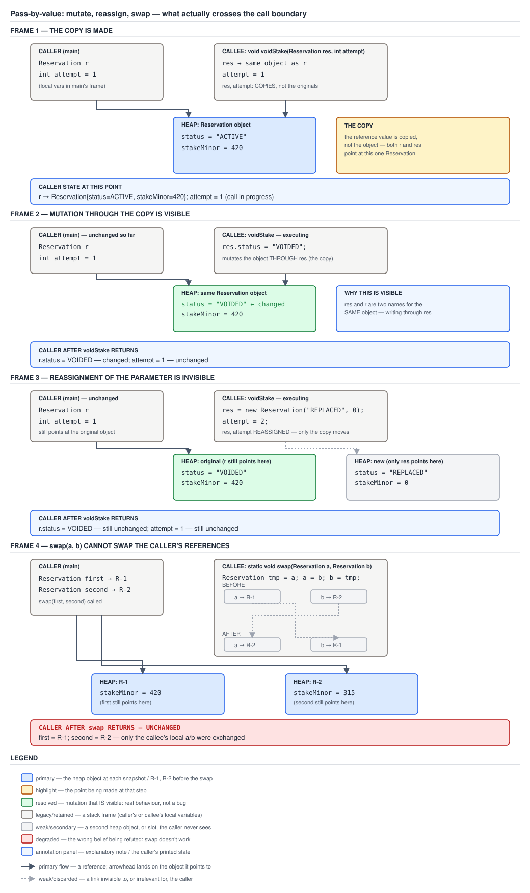

# 03 Java Core — Immutability and design — Pass-by-value, and every question it settles — INTERMEDIATE (§2.13)

**Target version: Java 21 LTS.** | **Part 2 of 5** | [Index](../00-index.md)
Previous: [Unsafe immutables, builders, and interning](02c-unsafe-immutables-builders-and-interning.md) · Next: [Design idioms the interview expects](04-design-idioms.md)

---

## Orientation

[02b](02b-records-jmm-and-builders.md) closed out how an immutable object is *built* — the record's generated constructor, the final-field freeze that publishes it safely, and the builder that assembles one field at a time. This file answers the question that comes next and gets asked in almost every loop: once you hand that object to a method, what exactly did the method receive, and what can it do to you? The answer is one rule with no exceptions, and the whole difficulty is that the rule is usually taught wrong. Everything measured or quoted here was run on **Oracle JDK 21.0.7 (21.0.7+8-LTS-245), macOS aarch64**; the program source, its stdout and the `javap -c -p` output are pasted exactly as produced.

## 1. The one rule, and the folklore it refutes (2.13.1, 2.13.5)

`[TRAP]`

A method call in Java does exactly one thing to each argument: it **copies the contents of the argument variable into the parameter slot of the new frame**. That is the whole mechanism. It is true for every type, every method, every call site, in every version of the language since 1.0. There is no second mechanism, no opt-in, no annotation and no type that behaves differently.

What varies is not the copying — it is what the variable *contained*. `int attempt` contains the number `1`, so the number `1` is copied. `Reservation r` contains a *reference* to a `Reservation` on the heap, so that reference is copied. Both copies are byte-for-byte identical to the original and both are made the same way. Every confusion anyone has ever had about Java parameters is a confusion about what was in the box, never about the copying.

### Why it exists

The design falls out of Java having no way to name a variable's *location*. C has `&x`; C++ has reference types (`Reservation&`); C# has `ref` and `out`. Java deliberately has none of these — there is no expression in the language that denotes "the caller's slot" — so there is nothing a parameter could be bound to except a copy of a value. Removing address-of was a safety decision (no pointer arithmetic, no dangling stack references), and pass-by-value is the direct consequence of it, not a separate choice.

### When to reach for it, and when not

There is nothing to reach for; the rule is not a feature you elect. What it does give you is a design constraint you can lean on: **a method signature that returns `void` and takes only immutable parameters cannot affect its caller at all** except by throwing, by touching static state, or by I/O. That is a real reasoning tool, and §3 spends itself on it.

### How it works

JLS 21 §8.4.1 is the normative text, and it is blunt about it: a formal parameter is a local variable of the method, and "when the method or constructor is invoked, the value of the actual argument expression initializes the newly created parameter variable". A parameter is a *local variable*. It lives in the invoked method's own frame, in its own local-variable slot. The caller's variable lives in the caller's frame, in a different slot. The two are connected only by the one-time copy that happened at invocation.

At the JVM level, the argument values are pushed onto the caller's operand stack and, on `invokestatic`/`invokevirtual`/`invokespecial`, moved into local slots `0..n` of the callee's new frame (JVMS 21 §2.6.1). After that transfer there is no link of any kind between the two frames' local-variable arrays.

| Language | Parameter binding | Can the callee rebind the caller's variable? |
|---|---|---|
| Java (all versions) | Copy of the variable's contents | No — never, for any type |
| C++ with `Reservation&` | Alias to the caller's storage | Yes — assignment to the parameter assigns the caller's variable |
| C# with `ref Reservation` | Alias to the caller's storage | Yes — same |
| C with `Reservation *` | Copy of a pointer value | No — the pointer is itself passed by value; you must dereference |

The last row is the one worth staring at: C's pointer passing is *also* pass-by-value, and Java's reference passing is the same shape with the dereference syntax removed. Java's `res.status` is C's `res->status`; Java has no equivalent of C's `*res = otherValue`.

**The accurate name.** The behaviour Java exhibits — the callee can mutate the shared object but cannot rebind the caller's variable — has a real name in the literature: **call-by-sharing** (Liskov's term, from CLU). The callee *shares the object* with the caller, and does not share the *variable*. "Pass-by-value where the value is a reference" and "call-by-sharing" describe the same thing; the first is the mechanism, the second is the observable contract.

### Diagram

The four-frame picture belongs in §2, at the exact point where the mutate-versus-reassign asymmetry is established, because that is where the picture earns its keep. See D-088 below.

### A concrete example

```java
final class Reservation {
    String status;
    long stakeMinor;

    Reservation(String status, long stakeMinor) {
        this.status = status;
        this.stakeMinor = stakeMinor;
    }

    @Override
    public String toString() {
        return "Reservation[status=" + status + ", stakeMinor=" + stakeMinor + "]";
    }
}
```

One heap object: `status = "ACTIVE"`, `stakeMinor = 420` (the domain's average stake, 4.20, in minor units). The caller holds `Reservation r` pointing at it and `int attempt = 1`. Whatever `voidStake(r, attempt)` does, it does with a *copy* of the reference in `r` and a *copy* of the number in `attempt`.

### The gotcha

**Pitfall:** the belief is "primitives are passed by value and objects are passed by reference." The symptom is not an immediate bug — it is worse than that. The belief **makes correct predictions most of the time**, which is exactly why it survives peer review, blog posts and interview panels. It correctly predicts that mutating a passed object is visible to the caller (frame 2 of D-088). It only breaks on assignment to the parameter, which most method bodies never do.

The precise counterexample is frame 3. Under genuine pass-by-reference, `res = new Reservation("REPLACED", 0)` inside the callee would rebind the caller's `r`, and the caller would then see `REPLACED`. §2 runs it: the caller sees `VOIDED`. If objects were passed by reference, that output would be impossible. **The fix** is to stop describing the *type* and describe the *variable's contents*: everything is copied; a reference variable's contents happen to be a reference.

The same family carries three smaller stale claims, all false: "Java 8 changed this" (lambdas capture *values* of effectively-final locals, which is the same rule, not a new one), "records changed this" (a record component is a field; passing a record still copies the reference), and "`final` parameters change this" (§5 shows they change only what the method body may write). The rule is JLS §8.4.1 and it has not moved since Java 1.0.

**Interview:** asked as "is Java pass-by-value or pass-by-reference?" The 15-second answer: "Always pass-by-value. For a reference type the value being copied is the reference, which is why the callee can mutate my object but can never make my variable point somewhere else. The accurate term is call-by-sharing."

> **Definition.** Java parameter passing copies the contents of the argument variable into a fresh local slot in the callee's frame — always, for every type — so a callee shares the caller's *object* but never the caller's *variable*.

## 2. Mutate versus reassign, and why `swap` is impossible (2.13.2, 2.13.3)

`[PROVE]` `[PROVE]` `[BYTECODE]`

Two claims here, both of which must be earned rather than announced. The mental model is a house key: the caller has a key to a house, and hands the callee a *duplicate* of the key. The callee can repaint the house (mutation — visible to the caller, one house). The callee can throw its duplicate away and have a key cut for a different house (reassignment — invisible to the caller, whose key still opens the original). Nothing the callee does to its own key affects the caller's key.

### Why it exists

The asymmetry is not a special case bolted on for objects. It is the direct consequence of §1's single rule meeting the fact that a heap object has exactly one existence. Two frames holding copies of the same reference are two arrows pointing at one object. Writing *through* an arrow changes the one thing both arrows point at. Writing *to* an arrow changes only that arrow.

### When to reach for it, and when not

Rely on mutation-through-a-parameter only where the object is deliberately a shared mutable collaborator — an accumulator, a `StringBuilder`, a metrics registry. Never rely on it as an accidental return channel (§4 prices that). And never write to a parameter expecting the caller to notice; §5 gives you the compiler check that turns that mistake into an error.

### How it works

The two operations compile to different instruction *kinds*, and that is the entire proof.

- `res.status = "VOIDED"` compiles to `putfield`. `putfield` takes an object reference off the operand stack and writes a field *inside that object*. The object is on the heap and there is exactly one of it, so the write is observable through every reference to it — including the caller's.
- `res = new Reservation("REPLACED", 0)` compiles to `astore_0`. `astore_n` writes into local-variable slot `n` **of the currently executing frame**. The caller's `r` lives in a different slot in a different frame, and no instruction in the entire instruction set can reach into another frame's local-variable array.

### Diagram



**D-088** — Pass-by-value in four frames. Frame 1 makes the copy of the reference; frame 2 mutates
through it and the caller sees the change; frame 3 reassigns the parameter and the caller sees
nothing; frame 4 exchanges only the callee's own slots, which is why `swap` cannot work.

### A concrete example

The complete program, exactly as compiled and run:

```java
final class Reservation {
    String status;
    long stakeMinor;

    Reservation(String status, long stakeMinor) {
        this.status = status;
        this.stakeMinor = stakeMinor;
    }

    @Override
    public String toString() {
        return "Reservation[status=" + status + ", stakeMinor=" + stakeMinor + "]";
    }
}

public class PassByValue {

    static void voidStake(Reservation res, int attempt) {
        res.status = "VOIDED";
        res = new Reservation("REPLACED", 0);
        attempt = 2;
        System.out.println("  inside callee : res = " + res + ", attempt = " + attempt);
    }

    static void swap(Reservation a, Reservation b) {
        Reservation tmp = a;
        a = b;
        b = tmp;
        System.out.println("  inside swap   : a = " + a.status + ", b = " + b.status);
    }

    public static void main(String[] args) {
        Reservation r = new Reservation("ACTIVE", 420);
        int attempt = 1;
        System.out.println("before  : r = " + r + ", attempt = " + attempt);
        voidStake(r, attempt);
        System.out.println("after   : r = " + r + ", attempt = " + attempt);

        Reservation first = new Reservation("R-1", 420);
        Reservation second = new Reservation("R-2", 315);
        System.out.println("before  : first = " + first.status + ", second = " + second.status);
        swap(first, second);
        System.out.println("after   : first = " + first.status + ", second = " + second.status);
    }
}
```

Output on Oracle JDK 21.0.7, pasted verbatim:

```
before  : r = Reservation[status=ACTIVE, stakeMinor=420], attempt = 1
  inside callee : res = Reservation[status=REPLACED, stakeMinor=0], attempt = 2
after   : r = Reservation[status=VOIDED, stakeMinor=420], attempt = 1
before  : first = R-1, second = R-2
  inside swap   : a = R-2, b = R-1
after   : first = R-1, second = R-2
```

Read the three `r`/`attempt` lines together. The callee genuinely saw `REPLACED` and `2` — its own slots were overwritten and it observed the overwrite. The caller, one line later, sees `VOIDED` (the mutation survived) and `1` (the reassignment did not) and `stakeMinor = 420` (the caller's object was never replaced). **Mutation crossed the boundary; reassignment did not.** That is 2.13.2, demonstrated rather than asserted.

The `swap` lines are 2.13.3. Inside the method the exchange visibly worked: `a = R-2, b = R-1`. One line later the caller reads `first = R-1, second = R-2`. The method did a correct swap of its own two slots and the caller was untouched.

`javap -c -p PassByValue.class`, the two methods, pasted verbatim:

```
  static void voidStake(Reservation, int);
    Code:
       0: aload_0
       1: ldc           #7                  // String VOIDED
       3: putfield      #9                  // Field Reservation.status:Ljava/lang/String;
       6: new           #10                 // class Reservation
       9: dup
      10: ldc           #15                 // String REPLACED
      12: lconst_0
      13: invokespecial #17                 // Method Reservation."<init>":(Ljava/lang/String;J)V
      16: astore_0
      17: iconst_2
      18: istore_1
```

Instruction by instruction. `0: aload_0` pushes the *copy* of the reference that arrived in slot 0. `1: ldc #7` pushes the constant `"VOIDED"`. `3: putfield #9` pops both and writes into the field of the object on the heap — this is the instruction that crosses the frame boundary, and it crosses it by going through the heap, not through the frames. Then `6..13` construct a brand-new `Reservation`, and `16: astore_0` stores it into **slot 0 of this frame** — overwriting the copy, reaching nothing else. `17: iconst_2` / `18: istore_1` do the same for the `int`: slot 1 of this frame, nobody else's. There are two writes to slot-local storage (`astore_0`, `istore_1`) and one write to the heap (`putfield`), and only the heap write is observable to the caller.

```
  static void swap(Reservation, Reservation);
    Code:
       0: aload_0
       1: astore_2
       2: aload_1
       3: astore_0
       4: aload_2
       5: astore_1
```

Six instructions, and every single one is a load from or a store to a local slot of `swap`'s own frame. Slot 2 is `tmp`. Slots 0 and 1 are the parameters. There is no `putfield`, no array store, no static write — nothing that touches memory shared with the caller. The method is a perfectly correct swap of three local slots that happen to be invisible to everyone.

**The general proof, which is stronger than "swap doesn't work."** A method body has no access to the caller's variables *at all* — only to copies of their contents, in its own frame. No instruction in the JVM instruction set addresses another frame's local-variable array; JVMS 21 §2.6.1 gives each invocation its own frame with its own local variables, and the only inter-frame data transfer defined is arguments in and a single return value out. Therefore no method body whatsoever — not this one, not a cleverer one, not one written in a future Java version — can rebind a caller's variable. `swap` is not unimplemented; it is unexpressible.

**The three things people reach for instead:**

| Workaround | Works? | Why, and what it costs |
|---|---|---|
| One-element array or `long[]` holder | Yes | The array is a heap object; writing `holder[0]` is an `aastore`/`lastore` into shared heap storage, the same channel `putfield` uses. Costs an allocation and destroys the signature's meaning — §4 prices it. |
| Mutable holder object (`AtomicReference`, a two-field mutable class) | Yes | Identical mechanism to the array, with a name and a type. Still a mutable shared object, still not what the signature says. |
| Return a result object or record carrying both values | Yes, and correct | No shared mutable state, no allocation the caller did not ask for, and the type says what happened. |

The third one, shipped:

```java
record SwapResult(Reservation first, Reservation second) { }

static SwapResult swapped(Reservation a, Reservation b) {
    return new SwapResult(b, a);
}
```

and the caller, two lines:

```java
SwapResult swapped = swapped(first, second);
first = swapped.first();
second = swapped.second();
```

Note what happened: the *caller* rebound its own variables, which is the only place in the language where that can happen. Every working "swap" in Java is this shape with the assignments hidden somewhere.

### The gotcha

There is one case where none of the workarounds help, and it is the reason the question keeps coming back: **you cannot write a generic `swap` over two local variables**, full stop, because a local variable is not a first-class thing you can pass. This is exactly why the JDK ships `Collections.swap(List<?> list, int i, int j)` rather than `Collections.swap(a, b)` — it swaps *elements of a shared mutable object*, addressed by index. The list is standing in for the variables, and the indices are standing in for the names. `Collections.swap` on a `List<Reservation>` works for the same reason `holder[0] = x` works and for no other reason.

**Insight:** every apparent counterexample to pass-by-value turns out to be a write to a heap object that both frames can reach. Once you learn to spot "which shared object was written," the folklore stops being tempting.

> **Definition.** A callee may mutate the object its parameter refers to, because both frames' references designate one heap object; it may not rebind the caller's variable, because a parameter is a local variable of the callee's own frame and no instruction reaches across frames.

## 3. `String`: no mutation path at all, and the parameter boundary (2.13.4, 2.13.8)

`[X-REF 04]`

The `String` case is where the whole question evaporates rather than being answered. Pass a `String` and the callee receives a copy of the reference, exactly as with `Reservation`. But `String` has no mutator — no field of it is writable, and every operation that looks like a change returns a *new* `String`. §2's `putfield` channel simply does not exist for this type, so the callee cannot affect the caller by any route at all.

### Why it exists

Immutability turns "can this method modify my object?" from a code-review question into a *type-level* guarantee. With a mutable parameter you must read the callee to know. With `String`, `Money`, `Instant` or a `List.copyOf` result you do not: the answer is no, by construction, and it stays no when someone else edits the callee next quarter.

### When to reach for it, and when not

Reach for an immutable parameter type by default. Reach for a mutable one only when shared mutation is the deliberate contract (an accumulator, a builder being filled, a metrics sink). The cost is that producing a *changed* immutable value allocates, which §4 and the cost model quantify.

### How it works

`s.toUpperCase()` reads the receiver's `byte[] value` and, if any character changes case, allocates a new `String` over a new byte array. It writes nothing into the receiver. Discarding the return value therefore discards the entire effect of the call — the compiler will not stop you, because an expression statement is legal, and nothing else will either.

### Diagram

No diagram is assigned here. The picture that matters is D-088's frame 3, one section up: the `String` case is frame 3 with the mutation of frame 2 made *impossible by the type* rather than merely absent from this particular method body.

### A concrete example

```java
static void normaliseCouponCode(String couponCode) {
    couponCode.toUpperCase();                 // result discarded — no effect anywhere
    couponCode = couponCode.toUpperCase();    // rebinds the callee's slot only
}

public static void main(String[] args) {
    String couponCode = "welcome10";
    normaliseCouponCode(couponCode);
    System.out.println("couponCode = " + couponCode);
}
```

Output on JDK 21.0.7, verbatim:

```
couponCode = welcome10
```

Both lines of the callee were no-ops as far as the caller is concerned, and for *different* reasons: line one because `toUpperCase` mutates nothing and the new string was dropped, line two because assignment to a parameter is a frame-local store (§2). The coupon code the caller passes to `BonusService` is untouched.

**Defensive copying at the parameter boundary.** Restate §2.3's copy-in rule as a fact about parameter semantics, because that is what it actually is. When a constructor or setter receives a `List<WithdrawalId>` and stores the reference it was handed, **the caller still holds its own copy of that same reference** — the pass-by-value copy — and can write through it afterwards. The aggregate's invariant is therefore not enforced by the aggregate; it is enforced by the caller's good manners. Copying in (`List.copyOf(withdrawalIds)`, `values.clone()`) severs the second arrow, and it is the only thing that does.

The corollary that saves real work: the copy is needed **only when the parameter's declared type is mutable**. A method taking `Money`, `Instant`, `String`, `ClientId`, `StatusCode` or a `List.copyOf` result needs no copy, because there is no mutation path for the caller to use. A method taking `List<WithdrawalId>`, `long[]`, `Date`, `Calendar`, `StringBuilder` or any mutable aggregate does. [`02-immutability.md`](02-immutability.md) owns the five rules, and [`02a-shallow-deep-and-building-blocks.md`](02a-shallow-deep-and-building-blocks.md) owns the catalogue of which JDK types are mutable and the shallow-versus-deep decision; [`../objects-equality-and-lifecycle/02-copying-and-composite-equality.md`](../objects-equality-and-lifecycle/02-copying-and-composite-equality.md) owns the copy mechanics themselves. Do not re-derive them from here.

### The gotcha

The copy is not free, and treating it as a reflex is its own failure mode. `List.copyOf` on a list of `n` elements is an `n`-reference array copy plus one allocation; on the ledger write path at **13,600 entries/sec peak**, a per-call copy of a 4-element movement list is 13,600 allocations and `13,600 × 4 = 54,400` reference copies per second — small, but not zero, and it competes with the allocation the actual write needs. The figures live in [`../cost-model/02-master-cost-table.md`](../cost-model/02-master-cost-table.md). The rule: copy at the boundary by default, and when the boundary is inside a 13,600/sec loop, **measure before you either keep it or remove it** — do not reason about it, and in particular do not remove it on the grounds that "nobody mutates that list," because that is a claim about every current and future caller.

**Interview:** "Why does an immutable class need to copy a `List` constructor argument if it's storing it in a `final` field?" One line: `final` freezes the reference, not the object, and the caller kept its own copy of the same reference — so without a copy-in the caller can keep adding elements after construction.

> **Definition.** An immutable parameter type makes callee-to-caller interference impossible by construction; a mutable one leaves the caller holding a live second reference, which is precisely why the boundary must copy in.

## 4. Arrays and varargs as the mutable out-parameter (2.13.6, 2.13.7)

`[TRAP]` `[X-REF 02]`

An array is the standard Java workaround for "return a second value through a parameter," and it works for one reason: an array *is* an object, its components are writable, and both frames' references point at the one array. `long[] out = new long[2]; splitStake(333, out);` genuinely returns values through a parameter. Everything below is about why you should not.

### Why it exists

Before records, before `Map.Entry`, before generics, returning two values from a Java method meant either declaring a class for the pair or writing into something the caller already held. The array holder was the cheap option, and it is baked into APIs that predate the alternatives — `String.getChars(int, int, char[], int)`, `System.arraycopy`, most of `java.util.Arrays`' in-place operations, and the `int[]`-out convention in older parsing code.

### When to reach for it, and when not

Reach for an out-array only when the caller already owns the buffer and reuse is the point — a pooled `byte[]` in a hot decode loop, where the whole design intent is to avoid per-call allocation. In every other case return a value. In QuizStakes the stake-split path is the second case: it runs at **1,200 reservations/sec peak**, allocates a `StakeSplit` per call, and that allocation is nothing next to the `BigDecimal` arithmetic it wraps.

### How it works

`out[0] = bonusPortion` compiles to `lastore` — pop an array reference, an index and a value; write into the array object on the heap. Structurally identical to §2's `putfield`: a write through a reference into shared heap storage. The array's *reference* in the callee's slot is still a private copy, and reassigning `out = new long[2]` inside the method is as invisible as any other parameter reassignment.

### Diagram

No diagram assigned. [`../arrays/01-basics.md`](../arrays/01-basics.md) carries D-059 for the per-call varargs allocation, which is the picture the varargs half of this section wants.

### A concrete example

The out-array version, and its real output:

```java
static void splitStake(long stakeMinor, long[] out) {
    long bonusPortion = stakeMinor / 10;
    out[0] = bonusPortion;
    out[1] = stakeMinor - bonusPortion;
}

public static void main(String[] args) {
    long[] out = new long[2];
    splitStake(333, out);
    System.out.println("out = " + java.util.Arrays.toString(out));
}
```

```
out = [33, 300]
```

It works, and it is worse than the alternative on four specific counts:

1. **The signature no longer says what the method produces.** `void splitStake(long, long[])` tells a reader nothing about arity, order or meaning. Is `out[0]` the bonus or the cash? Does it need length 2 or 3? The answer lives only in the Javadoc and the body.
2. **Nothing is checked at compile time.** A caller passing `new long[1]` compiles cleanly and throws `ArrayIndexOutOfBoundsException` at runtime. A caller reading `out[1]` when it wanted the bonus compiles cleanly and is silently, arithmetically wrong — it books 3.00 as bonus and 0.33 as cash.
3. **The array stays mutable and reachable.** Anyone holding the array — the caller, a field it was stored in, another thread — can write to it after `splitStake` returns. The result has no owner and no point at which it becomes final.
4. **It defeats named, invariant-carrying return types.** An out-array cannot express "these two values sum exactly to the stake." A record can, and can enforce it in the constructor.

The replacement, shipped, with the canonical domain arithmetic:

```java
record Money(BigDecimal amount, Currency currency) { }

record StakeSplit(Money bonusPortion, Money cashPortion) {
    StakeSplit {
        if (!bonusPortion.currency().equals(cashPortion.currency())) {
            throw new IllegalArgumentException("mixed currency in StakeSplit");
        }
    }

    Money stake() {
        return new Money(bonusPortion.amount().add(cashPortion.amount()), bonusPortion.currency());
    }

    static StakeSplit of(Money stake, Money bonusAvailable) {
        BigDecimal tenth = stake.amount()
                .multiply(new BigDecimal("0.10"))
                .setScale(2, RoundingMode.DOWN);
        BigDecimal bonus = tenth.min(bonusAvailable.amount());
        BigDecimal cash = stake.amount().subtract(bonus);
        return new StakeSplit(new Money(bonus, stake.currency()),
                              new Money(cash, stake.currency()));
    }
}
```

Run on `stake = 3.33` with `bonusAvailable = 42.00` (the domain's average bonus grant), JDK 21.0.7, verbatim:

```
StakeSplit[bonusPortion=Money[amount=0.33, currency=GBP], cashPortion=Money[amount=3.00, currency=GBP]]
```

`RoundingMode.DOWN` on the bonus tenth is the load-bearing choice: 10% of 3.33 is 0.333, and rounding **down** to 0.33 leaves cash covering 3.00 for an exact total of 3.33. Rounding half-up gives 0.34 + 3.00 = 3.34 and creates a penny of money out of nothing — a ledger imbalance, at 2.8M reservations/day. `subtract` rather than a second percentage is what makes `bonusPortion + cashPortion == stake` structurally true rather than coincidentally true. [`../numbers-and-money/02-numbers-and-money.md`](../numbers-and-money/02-numbers-and-money.md) owns scale and `RoundingMode` in full.

**Varargs is the same fact in different syntax.** A varargs parameter **is an array**, and the compiler allocates a fresh one at every call site that spreads arguments. The class file records the erased array type plus the `ACC_VARARGS` flag on the method; the ellipsis exists only in source. Written in the erased form the class file actually holds:

```java
// Declared in source with the varargs marker (a `long` followed by three dots)
// on the parameter. The class file records exactly this erased signature plus
// ACC_VARARGS on the method, which is why the two call shapes below differ.
static long totalStake(long[] stakesMinor) {
    long total = 0;
    for (int i = 0; i < stakesMinor.length; i++) {
        total += stakesMinor[i];
        stakesMinor[i] = 0;   // scrubbing the buffer — harmless, or catastrophic
    }
    return total;
}
```

Two call shapes, one method, measured on JDK 21.0.7 against the varargs-marker form of the same declaration:

```
varargs, spread call  : 915
varargs, array call   : 915
caller array after    : [0, 0, 0]
```

The spread call `totalStake(420, 315, 180)` compiles to `new long[]{420, 315, 180}` at the call site, so the array the method scrubs is a throwaway nobody else can see. The array call `totalStake(caller)` passes **the caller's own array** — no wrapping, no copy — so the scrub lands in the caller's variable, and `caller` comes back `[0, 0, 0]`.

**Pitfall:** the belief is "a varargs parameter is a fresh array, so mutating it inside the method is safe." The symptom is a caller whose `long[]` of stake amounts is silently zeroed — and it only reproduces on the call sites that pass an array, so it survives every test written in the spread form. The fix: treat a varargs parameter as a possibly-borrowed array. Never write to it; if you need a mutable working copy, take `stakesMinor.clone()` first.

### The gotcha

The same "a varargs parameter is really an array" fact is the root of generic varargs heap pollution: `List<Reservation>[]` cannot exist as a reifiable type, so a generic varargs parameter is created as `List[]` and the compiler warns, which is what `@SafeVarargs` suppresses when *you* have checked the body never stores a wrong-typed element into it. [`../generics/02-in-anger.md`](../generics/02-in-anger.md) owns that argument; [`../arrays/01-basics.md`](../arrays/01-basics.md) owns array covariance and the per-call allocation.

> **Definition.** An out-parameter works because an array is a shared heap object with writable components; a returned record does the same job with the arity, the names and the invariant stated in the type, and a varargs parameter is that same array — freshly allocated on a spread call, borrowed from the caller on an array call.

## 5. `final` parameters (2.13.9)

`final` on a parameter forbids **reassigning the parameter inside the method body**, and does exactly nothing else. It does not affect the caller. It does not appear in the method descriptor. It does not affect overload resolution or overriding — an override may add or drop it freely. It does not make the referenced object immutable.

### How it works

The compiler rejects the assignment and emits nothing extra into the descriptor. Verified on JDK 21.0.7:

```java
static void voidStake(final Reservation res, final int attempt) {
    res.status = "VOIDED";                      // legal — mutating the object, not the slot
    res = new Reservation("REPLACED", 0);       // compile error
}
```

```
FinalParam.java:4: error: final parameter res may not be assigned
        res = new Reservation("REPLACED", 0);
        ^
1 error
```

`res.status = "VOIDED"` compiles. That single line is the most useful thing in this section: it is the exact mirror of [02a](02a-shallow-deep-and-building-blocks.md)'s `final`-field point — `final` freezes the *slot*, never the object the slot refers to. [`../classes-and-initialization/04-internals-final-and-constant-folding.md`](../classes-and-initialization/04-internals-final-and-constant-folding.md) owns `final`'s full semantics.

`javap -v -p` confirms the descriptor is unchanged — `descriptor: (LReservation;)V`, `flags: (0x0008) ACC_STATIC` — and that an override in an implementing class may drop `final` from an interface method's parameter and still compile.

### Diagram

None assigned; the relevant picture is D-088 frame 3, which `final` turns into a compile error.

### The two real reasons to write it, and the reason most codebases do not

1. It converts §2's frame-3 mistake — assigning to a parameter and expecting the caller to see it — from a silently dead store into a compile error. That is a genuine, if narrow, win.
2. It is required in effect for lambda and inner-class capture. A local variable or parameter captured by a lambda or anonymous class must be **effectively final** (JLS 21 §4.12.4): assigned exactly once and never reassigned thereafter. `final` satisfies that trivially and documents the intent. See [`../classes-and-initialization/01a-names-scope-and-var.md`](../classes-and-initialization/01a-names-scope-and-var.md) and guide 04.

Against that: `final` on every parameter is visual noise on every signature in the codebase, guarding against a mistake that is rare, always local to one method body, and usually obvious on sight. That trade is why Google's and the JDK's own style avoid it and most Spring codebases follow suit.

**One reflection detail, verified.** `-parameters` at compile time makes real parameter *names* available to reflection; without it, `Parameter.getName()` returns `arg0`. Finality rides along in the same class-file attribute. Measured on JDK 21.0.7 for `voidStake(final Reservation res)`:

| Compiled | `Parameter.getName()` | `getModifiers()` | `Modifier.isFinal` | `MethodParameters` attribute present |
|---|---|---|---|---|
| without `-parameters` | `arg0` | `0` | `false` | no (`javap -v` finds 0 occurrences) |
| with `-parameters` | `res` | `16` | `true` | yes, `Flags` column reads `final` |

So `Parameter.getModifiers()` reporting `final` (`0x0010` = `ACC_FINAL`) is entirely an artefact of the `MethodParameters` attribute (JVMS 21 §4.7.24) being emitted, which only `-parameters` does. It is not part of the method descriptor and it is not visible to a caller in any other way. `javap -v` on the `-parameters` build shows the attribute with `res` under `Name` and `final` under `Flags`.

> **Definition.** `final` on a parameter is a compile-time constraint on the method body's own local slot — it blocks reassignment inside the method, is invisible to the caller and to the method descriptor, and says nothing about the mutability of the object referred to.

---

## Pitfalls

### Objects are passed by reference in Java

**Wrong**

```java
static void replaceReservation(Reservation res) {
    res = new Reservation("REPLACED", 0);   // "the caller now has the new one"
}

Reservation r = new Reservation("ACTIVE", 420);
replaceReservation(r);
System.out.println(r);
```

Surprise:

```
Reservation[status=ACTIVE, stakeMinor=420]
```

The caller's `r` still points at the original object with `stakeMinor = 420`. If objects were passed by reference this output would be impossible — assignment to the parameter would have rebound `r`.

**Right**

```java
static Reservation replacedReservation(Reservation res) {
    return new Reservation("REPLACED", 0);
}

Reservation r = new Reservation("ACTIVE", 420);
r = replacedReservation(r);   // the CALLER rebinds its own variable
```

The only code that can rebind the caller's variable is the caller's own code. Return the new value and let it assign.

**Why people believe it:** the belief predicts frame 2 of D-088 — mutation through a parameter being visible — perfectly, and frame 2 is what almost every real method does. The belief is only falsified by assigning to a parameter, which good code rarely does, so it can survive an entire career unchallenged.

### A varargs parameter is always a fresh array, so writing to it is safe

**Wrong**

```java
static long totalStake(long[] stakesMinor) {   // declared in source with the varargs marker
    long total = 0;
    for (int i = 0; i < stakesMinor.length; i++) {
        total += stakesMinor[i];
        stakesMinor[i] = 0;                    // "it's a private copy"
    }
    return total;
}

long[] caller = {420, 315, 180};
System.out.println(totalStake(caller));
System.out.println(java.util.Arrays.toString(caller));
```

Surprise, verbatim from JDK 21.0.7:

```
915
[0, 0, 0]
```

The caller's array was zeroed. Every test written as `totalStake(420, 315, 180)` passes, because *that* call site really does allocate a throwaway array — the bug only appears at array-passing call sites.

**Right**

```java
static long totalStake(long[] stakesMinor) {   // declared in source with the varargs marker
    long[] working = stakesMinor.clone();      // never write to a possibly-borrowed array
    long total = 0;
    for (int i = 0; i < working.length; i++) {
        total += working[i];
        working[i] = 0;
    }
    return total;
}
```

Better still: do not scrub at all. A read-only loop over `stakesMinor` needs no copy and no allocation.

**Why people believe it:** the spread call shape, which is how varargs is taught and how it is overwhelmingly used, genuinely does allocate a fresh array per call. The array-passing shape is a compatibility affordance that reuses the caller's array with no copy, and nothing in the signature distinguishes the two.

### `final` on a parameter protects the object from the method

**Wrong**

```java
static void auditStake(final Reservation res) {
    res.status = "VOIDED";       // compiles fine — "but it's final!"
    res.stakeMinor = 0;          // also fine
}

Reservation r = new Reservation("ACTIVE", 420);
auditStake(r);
System.out.println(r);
```

Surprise:

```
Reservation[status=VOIDED, stakeMinor=0]
```

`final` blocked nothing that mattered. The only statement it would have rejected is `res = somethingElse`, which the caller could not have observed anyway.

**Right**

```java
record ReservationView(String status, long stakeMinor) { }

static void auditStake(ReservationView res) {
    // no mutation path exists — the guarantee is in the type, not in a modifier
}
```

If the method must not change the object, pass a type that cannot be changed. That is §3's whole point, and it is enforced by the compiler for every present and future body of the method.

**Why people believe it:** `final` reads as "unchangeable," and in the one place developers meet it most — `final` fields — it does prevent the *field* from changing. Carrying that across to "the object cannot change" conflates the slot with the thing in the slot, which is the same conflation as the pass-by-reference belief, one level down.

### Passing a `String` and calling a method on it can change the caller's string

**Wrong**

```java
static void normaliseCouponCode(String couponCode) {
    couponCode.toUpperCase();     // "normalises it in place"
}

String couponCode = "welcome10";
normaliseCouponCode(couponCode);
System.out.println("couponCode = " + couponCode);
```

Surprise, verbatim:

```
couponCode = welcome10
```

Nothing happened. `toUpperCase()` allocated a new `String` and the statement discarded it. No compiler warning fires, because an expression statement discarding a value is legal Java.

**Right**

```java
static String normalisedCouponCode(String couponCode) {
    return couponCode.toUpperCase();
}

String couponCode = normalisedCouponCode("welcome10");
```

Name the method for what it returns, and return it. A `void` method taking only immutable parameters has almost nowhere left to put an effect.

**Why people believe it:** every other collection-ish operation in the JDK that people learn early — `list.add`, `map.put`, `builder.append` — really does mutate the receiver in place, so `string.toUpperCase()` reads as the same shape. The naming does not help: `toUpperCase` sounds imperative, not like a query.

## Cheat sheet

| Item | Value |
|---|---|
| The rule | Always pass-by-value; the copied value is the variable's contents |
| Reference type | The *reference* is copied, never the object |
| Accurate term | Call-by-sharing — shares the object, not the variable |
| Normative text | JLS 21 §8.4.1 (parameter is a local variable, initialized by the argument value) |
| Mutation through a parameter | Visible to the caller — `putfield` writes the one heap object |
| Assignment to a parameter | Invisible to the caller — `astore_n` writes this frame's slot `n` |
| `swap(a, b)` | Impossible, and unexpressible: no instruction reaches another frame's locals |
| `Collections.swap(list, i, j)` | Swaps list *elements*; the list is the shared object standing in for variables |
| Correct two-value return | `record SwapResult(Reservation first, Reservation second)` |
| `String` parameter | No mutation path exists; discarding `toUpperCase()`'s result is a total no-op |
| Copy-in needed when | Parameter type is mutable (`List`, `long[]`, `Date`, `StringBuilder`) |
| Copy-in not needed when | `Money`, `Instant`, `String`, `ClientId`, `List.copyOf` result, any record over immutables |
| Out-array | Works (`lastore` into shared heap) but loses arity, names, checks and invariants |
| Canonical split | Stake 3.33 → 0.33 bonus + 3.00 cash; bonus rounds **DOWN** or you create money |
| Varargs parameter | Is an array; fresh per call on a spread call, the caller's own on an array call |
| Varargs in the class file | Erased array type plus `ACC_VARARGS`; ellipsis is source-only |
| `final` parameter blocks | Reassigning the parameter inside the body — nothing else |
| `final` parameter does not | Affect the caller, the descriptor, overload resolution, overriding, or object mutability |
| `final` parameter and capture | Satisfies the effectively-final requirement (JLS 21 §4.12.4) trivially |
| Reflection sees `final` | Only with `-parameters`; via the `MethodParameters` attribute (JVMS 21 §4.7.24) |
| Without `-parameters` | `getName()` is `arg0`, `getModifiers()` is `0`, attribute absent |
| Stale claims, all false | "Java 8 changed it", "records changed it", "`final` params change it" |

## Self-test

**Q1.** A colleague says "Java passes primitives by value and objects by reference." Give the single output that proves this false, and say why the belief survives anyway.

<details><summary>Answer</summary>

Take a caller holding `Reservation r` with `status = "ACTIVE"`, `stakeMinor = 420`, and a callee `voidStake(Reservation res, int attempt)` whose body does `res.status = "VOIDED"; res = new Reservation("REPLACED", 0);`. Inside the callee, printing `res` shows `REPLACED` with `stakeMinor = 0`. Immediately after the call the caller prints `Reservation[status=VOIDED, stakeMinor=420]`. If objects were passed by reference, assigning to `res` would have rebound the caller's `r` and the caller would read `REPLACED`. It reads `VOIDED`, so the assignment did not cross the boundary — only the field write did.

The belief survives because it makes the right prediction for the case that occurs constantly (mutating a passed object is visible to the caller) and is only falsified by assigning to a parameter, which well-written method bodies rarely do. The accurate statement is that everything is passed by value, and for a reference type the value copied is the reference. The term for the resulting behaviour is call-by-sharing.

</details>

**Q2.** Prove that no method body in Java, however clever, can swap two of the caller's local variables.

<details><summary>Answer</summary>

A formal parameter is a local variable of the invoked method (JLS 21 §8.4.1), living in that invocation's own frame, and it is initialized by copying the value of the argument expression. JVMS 21 §2.6.1 gives every invocation its own frame with its own local-variable array, and the only inter-frame data transfer the instruction set defines is arguments passed in and a single value returned out. No instruction — `astore`, `istore`, `putfield`, anything — can address another frame's local-variable array.

Therefore a method body has no handle on the caller's variables at all; it only ever holds copies of their contents. Rebinding a caller's variable would require writing into the caller's slot, which is not expressible. `swap` is not merely unimplemented in current Java — it is unexpressible, and no future implementation can change that without adding a way to name a variable's location. `Collections.swap(list, i, j)` sidesteps the problem entirely by swapping *elements of a shared mutable object* addressed by index, not variables.

</details>

**Q3.** `record StakeSplit(Money bonusPortion, Money cashPortion)` is stored in an immutable aggregate. `Money` wraps a `BigDecimal`. Does the aggregate's constructor need to defensively copy a `StakeSplit` parameter? What if the parameter were `List<WithdrawalId>`?

<details><summary>Answer</summary>

No copy is needed for the `StakeSplit`. `BigDecimal` is immutable, `Currency` is immutable, `Money` is a record over immutables, and `StakeSplit` is a record over two `Money` values — so there is no mutation path anywhere in that graph. The caller retains a copy of the reference, as it always does, but there is nothing it can do with it. The guarantee is structural, not behavioural.

`List<WithdrawalId>` is the opposite case. `List` is an interface whose commonest implementations are mutable, so the caller keeps a live second reference to a mutable object and can `add` to it after construction — silently violating any invariant the aggregate believes it enforces. The constructor must copy in, with `List.copyOf(withdrawalIds)`, which both snapshots the contents and returns an unmodifiable list. The element type being immutable (`WithdrawalId` wrapping a `UUID`) is what makes that one-level copy sufficient rather than needing a deep copy.

</details>

**Q4.** `long[] out = new long[2]; splitStake(333, out);` returns two values through a parameter. Name four concrete defects, and the replacement.

<details><summary>Answer</summary>

One: `void splitStake(long, long[])` does not say what it produces — arity, order and meaning of the slots live only in the documentation, so a reader cannot tell whether `out[0]` is bonus or cash. Two: nothing is checked at compile time — `new long[1]` compiles and throws `ArrayIndexOutOfBoundsException`, and reading the wrong index compiles and is silently wrong, booking 3.00 as bonus and 0.33 as cash. Three: the array remains mutable and reachable, so anyone holding it can overwrite the result after the method returned; there is no point at which the answer becomes final. Four: it cannot carry an invariant — an array cannot express "these two sum exactly to the stake," which is precisely the property the ledger depends on.

The replacement is a returned record: `record StakeSplit(Money bonusPortion, Money cashPortion)` with the sum invariant checkable in the compact constructor. It names both values, fixes their types, allocates once instead of forcing the caller to pre-allocate, and cannot be tampered with afterwards.

</details>

**Q5.** The same varargs method zeroes a caller's array at one call site and not at another. Explain.

<details><summary>Answer</summary>

A varargs parameter *is* an array; the ellipsis exists only in source, and the class file records the erased array type plus the `ACC_VARARGS` flag. At a spread call site — `totalStake(420, 315, 180)` — the compiler synthesises `new long[]{420, 315, 180}` at the call site, so the array the method receives is a throwaway that nothing else references, and scrubbing it is invisible. At an array call site — `totalStake(caller)` where `caller` is already a `long[]` — the compiler passes the caller's array directly, with no wrapping and no copy, because that is the compatibility affordance varargs was designed with. The method now scrubs the caller's array, and `caller` comes back `[0, 0, 0]`.

The consequence for testing is the nasty part: tests written in the spread form can never catch this, so the bug reaches production through the one call site written in the array form. Treat a varargs parameter as possibly borrowed: never write to it, and take `clone()` if you need a mutable working copy.

</details>

**Q6.** What exactly does `final` on a parameter buy, and what does reflection see?

<details><summary>Answer</summary>

It forbids assigning to the parameter inside the method body and nothing else. `javac` on JDK 21.0.7 rejects `res = new Reservation("REPLACED", 0)` with "final parameter res may not be assigned", while `res.status = "VOIDED"` compiles fine — `final` freezes the slot, never the object in it. It does not affect the caller (which could not observe the assignment anyway), does not appear in the method descriptor, does not affect overload resolution, and an override may add or drop it freely.

The two real reasons to write it: it turns "assigned to a parameter expecting the caller to see it" from a silently dead store into a compile error, and it trivially satisfies the effectively-final requirement (JLS 21 §4.12.4) for capture by a lambda or anonymous class.

Reflection sees finality only when the class was compiled with `-parameters`. Measured on JDK 21.0.7: without it, `Parameter.getName()` returns `arg0`, `getModifiers()` returns `0`, and `javap -v` finds no `MethodParameters` attribute at all. With it, the name is `res`, `getModifiers()` returns `16` (`ACC_FINAL`, `0x0010`), and the attribute lists `res` under `Name` with `final` under `Flags`. So the visible finality is an artefact of the `MethodParameters` attribute (JVMS 21 §4.7.24), not of the descriptor.

</details>

**Q7.** Why does `couponCode.toUpperCase();` as a standalone statement produce no warning and no effect, and what does that tell you about immutable parameter types generally?

<details><summary>Answer</summary>

`toUpperCase()` reads the receiver's backing byte array and, when a character changes case, allocates and returns a *new* `String`. It writes nothing into the receiver, because no field of a `String` is writable. As a standalone expression statement the returned reference is simply discarded, which is legal Java and draws no mandatory diagnostic — the compiler has no rule that says the result of a method call must be used. So the statement is a pure no-op that also costs an allocation.

Generalised: with an immutable parameter type there is no mutation path at all, so a callee cannot affect its caller through that parameter by any route — not by mutating, since there is no mutator, and not by reassigning, since reassignment is frame-local. That converts "does this method modify my object?" from a question you answer by reading the callee into a guarantee you read off the signature, and one that survives future edits to the callee. It is also the reason a method taking `Money`, `Instant`, `String` or a `List.copyOf` result needs no defensive copy at the boundary, while one taking `List<WithdrawalId>` or `long[]` does.

</details>

## Open questions

- None. Every claim in this file was verified on Oracle JDK 21.0.7 (21.0.7+8-LTS-245), macOS aarch64: the mutate-versus-reassign and `swap` outputs and their `javap -c -p` disassembly, the `String` no-op output, the out-array and varargs outputs, the 3.33 split, the `final`-parameter compile error, the override-drops-`final` compile, and the `-parameters`/`MethodParameters` table (including confirming the attribute is absent without `-parameters`) — all from real runs, pasted unedited.

---

**Leaves covered:** 2.13.1, 2.13.2, 2.13.3, 2.13.4, 2.13.5, 2.13.6, 2.13.7, 2.13.8, 2.13.9 (9 leaves)
**Leaves deferred:** none
**Diagrams included:** D-088
**Target version:** Java 21 LTS
**Lines:** 746
