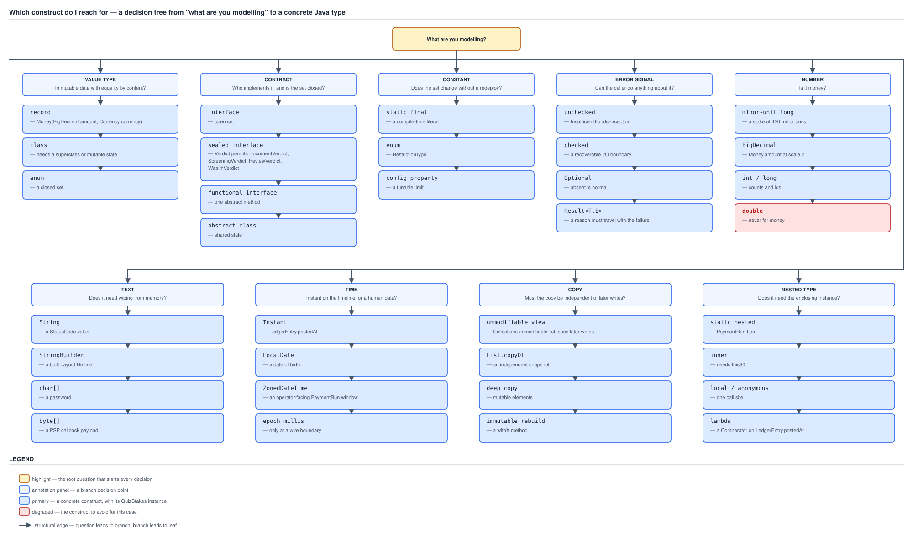

# 03 Java Core — Immutability and design — Which construct do I reach for: value types, contracts, constants, error signals and numbers — INTERMEDIATE (§2.15, 2.15.1–2.15.5)

**Target version: Java 21 LTS.** | **Part 2 of 5** | [Index](../00-index.md)
Previous: [Composition, the small rules, and the Effective Java cross-index](04a-composition-and-cross-index.md) · Next: [Text, time, copying, and nested types](05a-text-time-copy-and-nested.md)

---

[04a-composition-and-cross-index.md](04a-composition-and-cross-index.md) closed the mechanism half of §2: it taught composition, the small mandates, and where each idiom is over-applied. Every file in §2 up to that point taught *a mechanism* — what a record generates, what `sealed` permits, what `final` freezes. This file teaches none. It is the decision: five questions a reviewer asks about code in front of them, each with three or more candidate answers, each resolved by a rule you can state in one sentence and apply without re-reading the section. Every leaf below names its QuizStakes instance, because "use a record for value types" is advice and "`Money(BigDecimal amount, Currency currency)` is a record, `Application` is not, because an application has a lifecycle and an audit trail and is still the same application after its status changes" is a decision.

Measured figures and compiler output quoted below were produced on **Oracle JDK 21.0.7 (21.0.7+8-LTS-245, macOS aarch64)** in a scratch directory under `/tmp/`; where a number comes from a sibling file's harness rather than this one, the file is named at the point of the claim.



**D-089** — Which construct do I reach for. Nine branches from the root question, each ending in a
concrete construct with its QuizStakes instance. This file walks the first five — value type,
contract, constant, error signal, number; [05a-text-time-copy-and-nested.md](05a-text-time-copy-and-nested.md) walks text, time,
copying and nested types.

---

## 1. Value type: record vs class vs enum vs `Map<String,Object>` (2.15.1)

`[BUILD]` `[TRAP]` The question is not "is this data" — almost everything is data. The question is **what the type's identity is**, and there are exactly three answers, which is why there are exactly three real candidates. If identity is the *content* — two instances built from the same components are the same value, and there is no meaningful sense in which one is "this one" and the other is "that one" — it is a record. If identity is the *instance* — this `Account`, which has a lifecycle, an audit trail, and is still the same account after its balance moves from 0 to 65 — it is a class. If the value set is *closed and known at compile time*, it is an enum. `Map<String,Object>` is not a fourth answer; it is the absence of one, which is why D-089's value-type branch has three leaves and not four.

### Why it exists

Before records (Java 16, JEP 395), a value type cost about forty lines: private final fields, a constructor, an accessor each, `equals`, `hashCode`, `toString`. The cost was high enough that engineers routinely skipped it — a `Map<String,Object>` or a bare `BigDecimal` passed around with the currency implied by convention was the path of least resistance, and every invariant that should have lived in the type lived instead in whichever service happened to remember it. A record makes the forty lines into one, which removes the last economic argument for not declaring the type. `../records-and-sealed/01a-object-methods-sealed-and-fit.md` owns the mechanics of what is generated and the full "when to reach for a record" argument; this section owns the choice against the other three.

### When to reach for it, and when not

| Candidate | Identity is | Mutable? | `equals`/`hashCode`/`toString` | Compiler catches a missing or misspelled component? | Framework can bind to it? | QuizStakes instance |
|---|---|---|---|---|---|---|
| `record` | content | no — components are `final` | generated from all components | **yes** — a wrong name is a compile error, a missing argument is a compile error | yes (Jackson, Spring `@ConstructorBinding`) | `Money`, `StakeSplit`, `RestrictionKey`, `IdempotencyKey`, `AgreementRef` |
| `class` | the instance | usually — that is the point | hand-written, or inherited identity from `Object` | yes | yes | `Application`, `Account`, `Reservation`, `PaymentRun` |
| `enum` | a named constant, one per value | no | inherited from `Enum` — identity comparison, `name()`-based `toString` | **yes, plus exhaustiveness** in a `switch` | yes, by name | `RestrictionType`, `RestrictionSource`, `BonusStatus`, `AccountStatus` |
| `Map<String,Object>` | nothing — it is a bag | yes, unavoidably | `AbstractMap`'s, comparing entry sets | **no** — a typo is a runtime `null`, a wrong type is a `ClassCastException` at the point of *use* | only as an untyped blob | a freshly deserialised PSP callback, for exactly one statement |

Two boundaries worth stating as rules rather than examples. **A record is wrong the moment the type needs a superclass**, because a record implicitly extends `java.lang.Record` and that slot is taken — so a type that must extend a framework base class is a `class`, full stop. And **a record is wrong for a JPA entity**: an entity needs a no-arg constructor, mutable fields for the dirty-checking mechanism, and identity semantics based on the primary key rather than on every field, all three of which a record refuses by construction. Guide 08 (Spring Data JPA) owns why in full; the decision here is that `Account` is a class and the `AccountSnapshot` you project out of it for the wire is a record.

**Insight:** the record-versus-class question is often mistaken for "is it small" or "is it immutable". Neither discriminates — `LimitSet(dailyDeposit, maxStake, monthlyLoss)` and a three-field mutable `Restriction` are the same size, and an immutable `Application` would still not be a record. The discriminator is whether two independently constructed instances with equal contents are *the same thing*. Two `Money(4.20, GBP)` values are. Two `Application`s with identical field values are two different onboarding cases, and treating them as equal would break every `Set` and every audit query that touches them.

### How it works

The compile-time guarantee is the whole of the difference, and it is worth being precise about what "the compiler catches it" means. A record's canonical constructor is generated with one parameter per component, in declaration order, with the declared types. Calling it with the arguments transposed, with one missing, or with a `BigDecimal` where a `Currency` belongs, is a compile error before the code ever runs. A compact constructor gives the invariant a home: it runs before the fields are assigned, so a `StakeSplit` whose two portions do not sum to the stake, or a `Money` at the wrong scale, cannot exist. `Map<String,Object>` has none of this. The key `"bonusPortion"` is a `String` the compiler never checks against anything, the value is an `Object` the compiler never narrows, and there is no constructor at all — so there is nowhere to put the invariant, and a rename is a text search rather than a refactor.

### Diagram

D-089 is embedded above, in this file's orientation, because it is the map all five sections walk. Its value-type branch is the one this section resolves: `record` for content identity, `class` for instance identity, `enum` for a closed set — three leaves, with `Map<String,Object>` deliberately absent from the picture because it is not a choice the tree offers.

### A concrete example

`StakeSplit` both ways. The canonical arithmetic first, because it is the invariant: a stake of **3.33** splits as **0.33 bonus + 3.00 cash**, with the bonus portion rounding **down** — rounding up gives 0.34 + 3.00 = 3.34, which creates 0.01 of money out of nothing.

```java
record Money(BigDecimal amount, Currency currency) {
    Money {
        if (amount.scale() != 2) {
            throw new IllegalArgumentException("Money must be held at scale 2, got scale " + amount.scale());
        }
    }

    static Money of(String amount, String currencyCode) {
        return new Money(new BigDecimal(amount), Currency.getInstance(currencyCode));
    }

    Money subtract(Money other) {
        return new Money(amount.subtract(other.amount), currency);
    }

    Money tenPercentRoundedDown() {
        return new Money(amount.multiply(new BigDecimal("0.10")).setScale(2, RoundingMode.DOWN), currency);
    }
}

record StakeSplit(Money bonusPortion, Money cashPortion) {
    StakeSplit {
        if (!bonusPortion.currency().equals(cashPortion.currency())) {
            throw new IllegalArgumentException("mixed currencies in a StakeSplit");
        }
    }

    static StakeSplit of(Money stake, Money bonusAvailable) {
        Money tenPercent = stake.tenPercentRoundedDown();
        Money bonus = tenPercent.amount().compareTo(bonusAvailable.amount()) <= 0 ? tenPercent : bonusAvailable;
        return new StakeSplit(bonus, stake.subtract(bonus));
    }

    Money total() {
        return new Money(bonusPortion.amount().add(cashPortion.amount()), bonusPortion.currency());
    }
}
```

The same shape as a map, with the invariant homeless:

```java
static Map<String, Object> splitLoosely(BigDecimal stake, BigDecimal bonusAvailable) {
    BigDecimal tenPercent = stake.multiply(new BigDecimal("0.10")).setScale(2, RoundingMode.DOWN);
    BigDecimal bonus = tenPercent.compareTo(bonusAvailable) <= 0 ? tenPercent : bonusAvailable;
    Map<String, Object> split = new HashMap<>();
    split.put("bonusPortion", bonus);
    split.put("cashPortion", stake.subtract(bonus));
    return split;
}
```

Run against `StakeSplit.of(Money.of("3.33", "GBP"), Money.of("5.00", "GBP"))` and the map version's two failure modes, measured on JDK 21.0.7:

```
split = 0.33 bonus + 3.00 cash, total 3.33
map typo lookup: null
map wrong type: ClassCastException: class java.math.BigDecimal cannot be cast to class java.lang.String (java.math.BigDecimal and java.lang.String are in module java.base of loader 'bootstrap')
Money scale guard: Money must be held at scale 2, got scale 1
```

Read the four lines. The record's arithmetic is right and its invariant held. `split.get("bonus_portion")` — one underscore, a plausible typo — returned `null` rather than failing, so the shortfall becomes a `NullPointerException` several frames later in whichever service dereferenced it. The wrong-type cast failed at the point of *use*, not the point of *error*: the map was populated correctly and the mistake was in the reader, so the stack trace points at innocent code. And `new Money(new BigDecimal("4.2"), GBP)` was rejected at construction, because the compact constructor is a place to put a rule and a `HashMap` is not.

**Interview:** "when would you use `Map<String,Object>` instead of a class?" Two answers, and only two. Genuinely dynamic data whose *keys are themselves data* — a client-defined metadata bag on a `Restriction`, where the platform never reads a specific key and only stores and returns them. And a short-lived adapter at a deserialization boundary whose shape is not yours: a PSP callback payload arriving as a JSON object you do not control, held as a map for exactly as long as it takes to map it into a real type, with the validation done in that mapping step. Anything past that one statement is a type you declined to declare.

### The gotcha

**Pitfall:** believing the `Map<String,Object>` cost is "slightly less type safety". It is four distinct compile-time guarantees lost at once, and they fail at four different times. A misspelled key fails as a `null` at an arbitrary later dereference. A wrong type fails as a `ClassCastException` in the reader, blaming the wrong code. A rename is a textual search across every producer and consumer with no compiler backstop, which is how a key ends up spelled two ways in the same codebase. And there is nowhere to put an invariant, so `bonusPortion + cashPortion == stake` becomes a comment. The fix is not "add validation to the map" — validation on a map runs at the wrong time and cannot be enforced at construction, because a map has no construction. The fix is a record with a compact constructor, which is now one line.

> **Definition.** The value-type choice is decided by what the type's identity is: content identity means a `record`, instance identity with a lifecycle means a `class`, a closed compile-time-known set means an `enum`, and `Map<String,Object>` is not a fourth option but the deferral of the decision, paid for with the loss of key checking, type checking, refactoring safety and any home for an invariant.

---

## 2. Contract: interface vs abstract class vs functional interface vs sealed hierarchy (2.15.2)

`[BUILD]` `[VERSION-TRAP]` One question resolves all four: **who is allowed to implement this, and does the compiler need to know all of them?** Nobody in particular, and no — a plain interface. A fixed set the compiler must know exhaustively — a sealed interface. Exactly one method, so a lambda can be the implementation — a functional interface. Implementors that must inherit *state*, not just behaviour — an abstract class. Four answers, one question, and the fourth is now the rare one.

### Why it exists

Java shipped with a hard split: interfaces carried no behaviour at all, abstract classes carried behaviour but consumed the single inheritance slot. Java 8 collapsed half of that split by giving interfaces default methods, which is why every pre-2014 rule of thumb about "interface for contract, abstract class for shared behaviour" is stale — an interface can now carry behaviour. Java 17 (JEP 409) added the other half: `sealed`, which lets an interface declare its implementors exhaustively, so the compiler can reason about the *whole* set rather than one member at a time. Those two changes moved the default: in Java 21 the answer is an interface unless inherited state forces otherwise, and a sealed interface when the domain genuinely owns every case.

### When to reach for it, and when not

| Candidate | Who can implement | Set closed? | Inherits state? | Exhaustive `switch` with no `default`? | QuizStakes case |
|---|---|---|---|---|---|
| `interface` | anyone on the classpath | no | no — no instance fields permitted | no | `PaymentRail`, an extension point third-party code plugs into |
| `sealed interface` | only the named `permits` list, in the same module or package | **yes** | no | **yes** | `Verdict permits DocumentVerdict, ScreeningVerdict, ReviewVerdict, WealthVerdict` |
| functional interface | anyone — including a lambda or method reference | no | no | no | a `Predicate<Reservation>` gate condition on a `GateSet` |
| `abstract class` | subclasses only, single inheritance slot consumed | no | **yes** — fields plus a constructor that runs | no | an abstract `LedgerEntry` base holding the `postedAt`/`movementId` fields every entry shares |

**Interface versus abstract class, in Java 21 terms.** Since default methods, three real differences remain and they are the only ones worth arguing about. *State*: an abstract class can declare instance fields; an interface cannot — only `static final` constants. *Constructors*: an abstract class runs one, which is where a shared invariant can be enforced before any subclass body executes; an interface has no constructor and therefore no such hook. *Single inheritance*: extending the abstract class spends the implementor's one superclass slot, and a type that must extend a framework base class cannot also extend yours. Everything else — shared behaviour, partial implementation, a template method — an interface with default methods now does. So the modern default is the interface, and an abstract class earns its place only when implementors genuinely need to inherit fields. `../inheritance-and-dispatch/01b-interfaces.md` owns interfaces, default methods and the diamond in full, and carries D-047.

**Sealed versus open** is the decision worth the most in an interview, and the reason is a single compile-time property. `sealed interface Verdict permits DocumentVerdict, ScreeningVerdict, ReviewVerdict, WealthVerdict` tells `javac` the set is closed, which buys **exhaustiveness checking in a pattern-matching `switch` with no `default` branch**. Adding a fifth verdict then becomes a *compile error at every site that must handle it*, instead of a silent fall-through to a `default` that returns the wrong status code. That is the entire reason to reach for `sealed`: it moves a whole class of "we forgot to handle the new case" defects from runtime to compile time.

**Functional interface, last and briefly.** It is not a different kind of contract. It is an interface with exactly one abstract method, which is what makes it a lambda target — `@FunctionalInterface` only asks the compiler to verify that property. So the decision is never "functional interface or interface"; it is "does exactly one abstract method express the whole contract", and if it does you have a functional interface whether you annotate it or not. Guide 04 (Modern Java) owns lambdas and pattern matching.

### How it works

The exhaustiveness check is a `javac` behaviour with a precise trigger, and the honest way to show it is the error. The four-verdict switch below, minus its `WealthVerdict` case, compiles as follows on JDK 21.0.7:

```
Verdicts.java:14: error: the switch expression does not cover all possible input values
        return switch (verdict) {
               ^
1 error
```

That is not a warning and not a lint rule — it is a compile error from `javac` itself, because the switch is a *switch expression* over a sealed type and JLS 21 §14.11.2 requires a switch expression to be exhaustive. The mechanism: because `permits` names every direct implementor, the compiler can enumerate the type's subtypes and check the case labels against that enumeration. Drop `sealed` from the declaration and the same code stops compiling for a different reason — an unsealed reference type is not exhaustively coverable, so the switch expression requires a `default`, and the day a fifth verdict arrives that `default` swallows it silently.

The honest cost, which the interview answer must include: a sealed hierarchy is *closed*. A third party cannot add a case. That is exactly right for QuizStakes' own verdicts — a `Verdict` the platform does not know how to turn into a status code is not a feature — and exactly wrong for an extension point, where the whole value of the interface is that implementations arrive from outside. Sealing an extension point is not a safety improvement; it is removing the point. `../records-and-sealed/01a-object-methods-sealed-and-fit.md` owns sealed types in full, including the module and package constraints on `permits`.

### Diagram

D-089's CONTRACT branch, embedded in this file's orientation above, is the picture for this section: four leaves off the question "who implements it, and is the set closed?" — `interface` for an open set, `sealed interface` for `Verdict` and its four permitted records, functional interface for a one-abstract-method contract, `abstract class` for shared state. No second diagram; the interface/default-method picture is D-047 in `../inheritance-and-dispatch/01b-interfaces.md`.

### A concrete example

The sealed hierarchy and the exhaustive switch, complete and compiling:

```java
sealed interface Verdict permits DocumentVerdict, ScreeningVerdict, ReviewVerdict, WealthVerdict {
    Instant decidedAt();
}

record DocumentVerdict(String outcome, String reason, Instant decidedAt, String decidedBy) implements Verdict {}
record ScreeningVerdict(String outcome, String reason, Instant decidedAt, String decidedBy) implements Verdict {}
record ReviewVerdict(String outcome, String reason, Instant decidedAt, String decidedBy) implements Verdict {}
record WealthVerdict(String outcome, String reason, Instant decidedAt, String decidedBy) implements Verdict {}

final class ApplicationHistory {
    static String statusCode(Verdict verdict) {
        return switch (verdict) {
            case DocumentVerdict d  -> "AA-611 DOCUMENTS_VERIFIED";
            case ScreeningVerdict s -> "AA-501 SCREENING_CLEAR";
            case ReviewVerdict r    -> "AA-711 REVIEW_APPROVED";
            case WealthVerdict w    -> "AO-141 WEALTH_ACCEPTABLE";
        };
    }

    private ApplicationHistory() {}
}
```

Four cases, no `default`, and it compiles. Add `InstrumentVerdict` to the `permits` list and this method stops compiling until someone decides which status code it maps to — which is precisely the review conversation you want to be forced into, rather than discovering in production that a new verdict silently produced `AA-900 DECLINED`.

### The gotcha

**Pitfall:** writing `default -> throw new IllegalStateException("unknown verdict")` inside a switch over a sealed type "for safety". It is the opposite of safety: the `default` branch makes the switch trivially exhaustive, so the compiler stops checking it, and adding the fifth verdict now compiles cleanly and fails at runtime instead. The symptom is an `IllegalStateException` in production on a code path a compile error would have caught weeks earlier in a pull request. The fix is to delete the `default` and let the sealed exhaustiveness check do its job — and if you want a runtime guard for a class file compiled against an older version of the hierarchy, the JLS 21 rule already covers you: `javac` inserts an implicit `MatchException`-throwing branch for exactly that separate-compilation case, so a hand-written `default` buys nothing the language does not already provide.

> **Definition.** The contract choice is decided by who may implement and whether the compiler must know all of them: a plain `interface` for an open set, a `sealed interface` when the set is the domain's own and exhaustiveness checking in a `default`-free pattern-matching `switch` is worth giving up third-party extension, a functional interface whenever exactly one abstract method expresses the whole contract, and an `abstract class` only where implementors must inherit state and a constructor.

---

## 3. Constant: `static final` vs enum vs config property (2.15.3)

`[TRAP]` `[BYTECODE]` `[X-REF 07]` One question again: **when does this value change, and who changes it?** Never, and only by a recompile — `static final`. Never, but it is one of a closed set with behaviour attached — an enum. Between deployments, per environment, or by an operator at 3am — a config property. Everything else in this section is consequence.

### Why it exists

The three mechanisms have three different change frequencies baked into them, and mismatching the value to the mechanism produces one of two failures. A tunable that is a `static final` needs a release to change, which means it does not get changed when it needs to be. A genuine invariant that is a config property can be changed by anyone with access to the config, which means it will be, at the worst possible moment, with no compiler and no test standing in the way.

### When to reach for it, and when not

| Candidate | When can it change | Who changes it | Compiler inlines it? | Type-safe? | Can carry behaviour? |
|---|---|---|---|---|---|
| `static final` primitive or `String` literal | recompile of **every** dependent class | a developer, via a release | **yes** — folded into every caller's class file | as far as its type goes | no |
| `static final` object reference (e.g. a `Money`) | recompile of the declaring class | a developer, via a release | no — a `getstatic` at every use | as far as its type goes | no |
| `enum` | recompile | a developer, via a release | no | **yes, plus exhaustiveness** | **yes** — fields and methods per constant |
| config property | between deployments, per environment | an operator, with no recompile | n/a | **no** — a `String` until something parses it | no |

**`static final` constant inlining, and the binary-compatibility trap it creates.** A `static final` field of primitive or `String` type, initialised from a *compile-time constant expression* (JLS 21 §15.29), is a constant variable, and `javac` folds its value directly into every class file that reads it. That is not a JIT optimisation and not reversible at runtime. Measured on JDK 21.0.7 — `LedgerLimits.MAX_STAKE_MINOR_UNITS = 50000` read from a separate class, then changed to `25000` with **only the declaring class recompiled**:

```
max stake minor units = 50000
```

Still 50000. The reader's class file no longer contains a reference to the field at all; the concatenation folded to a single `ldc` of the finished string. The boundary is exactly the "compile-time constant expression" rule, and the bytecode shows it directly:

```
  static int cap();
    Code:
         0: sipush        10000
         3: ireturn

  static java.math.BigDecimal capDecimal();
    Code:
         0: getstatic     #9                  // Field Caps.BONUS_CAP:Ljava/math/BigDecimal;
         3: areturn
```

`BONUS_CAP_MINOR_UNITS`, a `static final int` from a literal, became `sipush 10000` — the value, not a reference. `BONUS_CAP`, a `static final BigDecimal`, stayed a `getstatic`, because `new BigDecimal("100.00")` is not a constant expression, so there is nothing to fold and no staleness to fear. The fix when you need a `static final int` to be changeable without recompiling the world is to stop making it a constant variable: expose it through a static accessor method, or initialise it from something non-constant. `../classes-and-initialization/04-internals-final-and-constant-folding.md` owns the mechanism in full and carries D-042 and D-123.

**Why an enum beats a set of `static final int`s** is the most reusable answer in this section. Five reasons: type safety, exhaustive `switch`, a namespace, `values()`, and the ability to attach fields and behaviour per constant. The domain's own subtlety makes the first reason concrete, because it is where `int` constants fail structurally rather than aesthetically: **restriction identity is the pair (type, source), not the type alone.** `STAKE_BLOCKED` from `SYSTEM_ONBOARDING` lifts automatically at `AA-801 ACTIVATED`; the same type from `ADMIN` does not. With two enums that is a record over two type-distinct values:

```java
enum RestrictionType { DEPOSIT_BLOCKED, STAKE_BLOCKED, WITHDRAWAL_BLOCKED, SELF_EXCLUDED }
enum RestrictionSource { SYSTEM_ONBOARDING, SYSTEM_COMPLIANCE, SYSTEM_LIFECYCLE, ADMIN, CLIENT }

record RestrictionKey(RestrictionType type, RestrictionSource source) {
    boolean liftsAutomaticallyAtActivation() {
        return source == RestrictionSource.SYSTEM_ONBOARDING;
    }
}
```

Running it: `new RestrictionKey(STAKE_BLOCKED, SYSTEM_ONBOARDING).equals(new RestrictionKey(STAKE_BLOCKED, ADMIN))` is `false`, and the two keys answer `liftsAutomaticallyAtActivation()` as `true` and `false` respectively — the pair *is* the identity, enforced by the type system. As two sets of `static final int`s, `RestrictionType.STAKE_BLOCKED` and `RestrictionSource.ADMIN` are both just `int`, so `new RestrictionKey(2, 3)` with the arguments transposed compiles happily and lifts a compliance restriction at activation. That is not a style preference; it is a class of bug the `int` version cannot exclude and the enum version cannot admit. `../enums/01-basics.md` and `../enums/01c-production-patterns-and-guarantees.md` own enums in full.

**The config-property case, and the one thing that always goes wrong with it.** A config property has **no compile-time validation whatsoever** — it is a `String` in a YAML file until something reads and parses it. So the failure mode is not "wrong value" but "wrong value discovered late": a malformed `quizstakes.bonus.cap` is only a problem the first time `BonusService.grant` runs, which at 8 bonus grants/sec is soon but at a rarely-exercised limit could be hours after the deployment, in a code path nobody was watching. The rule is to validate at *startup*, not at first use — bind the property to a typed object and fail the application context if it does not parse or falls outside its permitted range. Guide 07 (Spring core) owns configuration binding and validation.

### How it works

Covered above at the mechanism level: the inlining rule is the "constant variable" definition in JLS 21 §4.12.4 plus §13.1's binary-compatibility consequence, demonstrated with real bytecode and a real stale read; the enum advantage is nominal typing plus the compiler's ability to enumerate an enum's constants; the config property has neither, which is why it must be parsed and range-checked at startup.

### Diagram

D-089's CONSTANT branch, above, is the picture: three leaves off "does the set change without a redeploy?" — `static final` for a compile-time literal, `enum` for `RestrictionType`, config property for a tunable limit. No additional diagram; the constant-folding picture is D-042 in `../classes-and-initialization/04-internals-final-and-constant-folding.md`.

### A concrete example

The three mechanisms side by side, each carrying the value that belongs to it:

```java
final class BonusPolicy {
    static final int BONUS_PERCENT = 10;
    static final BigDecimal BONUS_CAP = new BigDecimal("100.00");

    private final Duration couponValidity;

    BonusPolicy(Duration couponValidity) {
        if (couponValidity.isNegative() || couponValidity.isZero()) {
            throw new IllegalArgumentException("coupon validity must be positive, got " + couponValidity);
        }
        this.couponValidity = couponValidity;
    }

    Duration couponValidity() {
        return couponValidity;
    }
}
```

`BONUS_PERCENT` is a `static final int` because 10% is the rule, not a setting — and it is a *constant variable*, so it inlines, which is fine precisely because it is never going to change without a release. `BONUS_CAP` is a `static final BigDecimal`, which does not inline, so the same never-changes intent costs nothing in staleness. `couponValidity` — 14 days from registration — is a constructor argument fed from a config property and validated *here*, at construction, so a malformed value fails the application context at startup rather than the first coupon redemption. `RestrictionType` is not in this class at all, because it is a closed set with behaviour and belongs in an enum.

### The gotcha

**Pitfall:** believing a `static final int` can be changed by recompiling the class that declares it. Measured above: it cannot. The wrong belief is that a `static final` field is read at runtime like any other field. The symptom is a value that changed in the source, passed code review, and is still the old number in production — usually surfacing as two halves of a system disagreeing about a limit, because one module was rebuilt in the release and one was not. The fix is either a full rebuild of every dependent class, or — better, because it removes the trap rather than working around it — a static accessor method (`static int maxStakeMinorUnits() { return MAX_STAKE_MINOR_UNITS; }`) or a non-constant initialiser, both of which compile to a `getstatic`/`invokestatic` and are read at runtime.

> **Definition.** The constant choice is decided by when the value changes and who changes it: `static final` for a value that changes only by a release — remembering that a primitive or `String` from a compile-time constant expression is *inlined into every caller's class file* and so needs every caller rebuilt; an `enum` when the value is one of a closed set, because it buys nominal type safety, exhaustiveness and per-constant behaviour that `int` constants cannot; and a config property when an operator must change it between deployments, at the price of no compile-time validation at all, which is why it must be validated at startup rather than at first use.

---

## 4. Error signalling: return value vs `Optional` vs checked vs unchecked vs `Result` type (2.15.4)

`[BUILD]` `[NUM]` `[TRAP]` Five candidates, and the choice is fixed by two questions asked **in order**. First: **can the immediate caller do something about it?** If not, it is an exception and the only remaining question is checked or unchecked. If yes: **does a *reason* have to travel with the failure?** If no, a return value or an `Optional`. If yes, a `Result<T, E>`. Everything people argue about in this section is a consequence of asking those two questions in the wrong order, or of substituting "is it frequent?" for the first one.

### Why it exists

Java shipped with exactly one failure mechanism — `throw` — and the checked/unchecked split as its only tuning knob. `Optional` arrived in Java 8 for the specific case of a single absent value, and a `Result` type has never arrived at all, which is why it is hand-rolled in every codebase that needs one. The five candidates are therefore not a designed family; they are three eras of the platform's answer to "how does a method report that it did not do the thing", and choosing between them means knowing what each was built for.

### When to reach for it, and when not

| Candidate | Failure expected at frequency? | Caller can act on it? | Reason travels? | Compiler forces handling? | Cost |
|---|---|---|---|---|---|
| return value (`boolean`, a status) | yes, often | yes | no — the caller infers it | no | single-digit ns — a monomorphic virtual call returning a value measured **1.15–1.38 ns**, against **338.5 ns** to construct an exception at call depth 10 (`../cost-model/02a-measurement-and-amortisation.md`'s depth sweep) |
| `Optional<T>` | yes — absence is *normal* | yes | no — `empty` says nothing about why | no, but `get()` on empty throws | one allocation, and `orElse` evaluates its argument eagerly |
| checked exception | rarely, at an I/O boundary | yes, with a real fallback | yes, as a type + message | **yes** — catch or declare | ~280 ns to construct; and it does not compose with lambdas |
| unchecked exception | rarely — genuinely exceptional | not at this frame | yes, as a type + message | no | ~280 ns to construct and throw |
| `Result<T, E>` | yes, often | yes | **yes** — `E` is the reason, as data | yes, if the switch is exhaustive over a sealed `Result` | one allocation, no stack capture |

The numbers matter here more than anywhere else in this file, so quote them rather than re-deriving: `../cost-model/02-master-cost-table.md` measures `new InsufficientFundsException(msg)` construction at **278.05–282.39 ns** and `throw`+`catch` at **282.48–284.49 ns** — the cost is the `fillInStackTrace()` capture, not the unwind — against **1.34–1.46 ns** for a preallocated stackless instance thrown and caught — a gap of `278.05 / 1.46 = 190×` to `282.39 / 1.34 = 211×`. `../exceptions/02c-cost-and-control-flow.md` owns the mechanism. For the value-return comparison the traceable rows are the same file's monomorphic virtual call at **1.15–1.38 ns** and its depth-sweep construction at **338.5 ns** at call depth 10, i.e. `338.5 / 1.38 = 245×` to `338.5 / 1.15 = 294×`.

Five QuizStakes cases, one per candidate:

**A stake reservation short of funds — a return value or an `Optional`, not an exception.** At 1,200 stake reservations/sec peak, a shortfall is *expected* and the caller acts on it immediately by declining the stake. At ~280 ns per exception construction against single-digit nanoseconds for a boolean, this is the one place in the domain where the cost argument alone settles it: 1,200/sec × 280 ns is 0.336 ms/sec of pure stack-capture, which is not itself a crisis, but the design is wrong for a reason independent of the arithmetic — an expected, locally-handled outcome is not exceptional, and using `InsufficientFundsException` for it makes the normal path pay for a diagnostic nobody reads.

**A malformed PSP callback — an unchecked `IllegalArgumentException` at a trust boundary.** A callback whose amount field does not parse is a bug in something outside the platform, and no frame between the parse and the top-level handler has a response. Unchecked, propagate, alert.

**A watchlist provider timeout — a checked exception, correctly, despite the frequency.** The watchlist provider runs p50 1.4s, p99 25s, against a 30-second timeout. That timeout fires often. **Frequency alone does not decide it** — this is the trap in this leaf. What decides it is that the immediate caller has two genuinely different, genuinely actionable responses (retry within the 200/min budget, or route the application to `AA-700 REVIEW_QUEUED` for a human) and that a caller which ignores the possibility is shipping a bug rather than being terse. That is exactly the shape checked exceptions were built for, and `../exceptions/02-in-practice.md` owns the checked-versus-unchecked decision in full and carries D-081.

**An unsatisfied document requirement — `Optional.empty()`.** `DocumentRequirements.latestSatisfied(applicationId)` returning empty is not a failure at all; a requirement sitting at `REQUIRED` rather than `SATISFIED` is the normal state of most in-flight applications. Absence is the answer, so `Optional` is the type.

**A declined `Verdict` — a `Result<Verdict, DeclineReason>`.** Four named decline reasons (`SCREENING_PROHIBITED`, `DOCUMENTS_EXHAUSTED`, `WEALTH_REJECTED`, `REVIEW_DECLINED`), each mapping to a different client-facing message and a different operator queue. `Optional.empty()` cannot carry which one it was. An exception per reason is a four-class hierarchy nobody wants for an outcome that is not exceptional. The reason has to travel with the failure as *data*, and that is precisely the case `Result` exists for.

**Two things that must be said about `Optional`.** It is for a **single absent value** — never for a collection, where the empty collection already means "none" and `Optional<List<Reservation>>` gives the caller two ways to spell nothing; return `List.of()`. And never as a field or a method parameter: as a field it adds an allocation and a second null state to every instance, and as a parameter it forces every caller to wrap. The trap that actually bites is that `orElse` evaluates its argument **eagerly**, so `requirement.orElse(fetchFromVendor(applicationId))` calls the vendor on every invocation including the ones where the `Optional` was present — use `orElseGet` with a supplier. `../null-discipline/02-null-discipline.md` owns this and carries D-086.

**And one thing about checked exceptions.** They do not compose with lambdas or streams: `Function.apply` declares no `throws`, so a checked-throwing call inside a `Stream.map` body is a compile error with nowhere to declare to. That incompatibility is a real part of why the modern default has moved to unchecked-plus-`Result`-at-the-boundaries. `../exceptions/02a-checked-exceptions-and-lambdas.md` owns the full `Result<T, E>` type and the lambda workarounds; `../exceptions/02b-designing-an-exception-hierarchy.md` owns hierarchy design once a custom type is warranted.

### How it works

The `Result` mechanism is the only one in this list that is not already a language feature, and the whole of it is a sealed interface with two record cases, which makes an exhaustive `switch` over it possible without a `default` — the same §2 property, reused. The minimal shape:

```java
sealed interface Result<T, E> {
    record Ok<T, E>(T value) implements Result<T, E> {}
    record Err<T, E>(E error) implements Result<T, E> {}

    static <T, E> Result<T, E> ok(T value) {
        return new Ok<>(value);
    }

    static <T, E> Result<T, E> err(E error) {
        return new Err<>(error);
    }
}
```

`Ok` and `Err` are nested inside the interface, so no `permits` clause is needed — a sealed type's permitted subclasses may be inferred when they are declared in the same compilation unit. Two records, one allocation each, and **no stack capture**, which is why a `Result` costs an allocation rather than the ~280 ns an exception costs.

### Diagram

D-089's ERROR SIGNAL branch, above, is the picture for this section: four leaves off "can the caller do anything about it?" — unchecked for `InsufficientFundsException`, checked for a recoverable I/O boundary, `Optional` where absent is normal, and `Result<T,E>` where a reason must travel with the failure. The full checked-versus-unchecked decision tree is D-081 in `../exceptions/02-in-practice.md`.

### A concrete example

The verdict decision and its consumer, complete and compiling:

```java
enum DeclineReason { SCREENING_PROHIBITED, DOCUMENTS_EXHAUSTED, WEALTH_REJECTED, REVIEW_DECLINED }

final class AccountActivation {
    static Result<Verdict, DeclineReason> decide(String screeningStatus) {
        if ("AA-599".equals(screeningStatus)) {
            return Result.err(DeclineReason.SCREENING_PROHIBITED);
        }
        return Result.ok(new ScreeningVerdict("CLEAR", "no match", Instant.EPOCH, "ScreeningService"));
    }

    static String render(Result<Verdict, DeclineReason> result) {
        return switch (result) {
            case Result.Ok<Verdict, DeclineReason>(Verdict v) -> ApplicationHistory.statusCode(v);
            case Result.Err<Verdict, DeclineReason>(DeclineReason r) -> "AA-900 DECLINED (" + r + ")";
        };
    }

    private AccountActivation() {}
}
```

Measured output on JDK 21.0.7:

```
AA-501 SCREENING_CLEAR
AA-900 DECLINED (SCREENING_PROHIBITED)
```

The record deconstruction pattern in the case labels pulls the payload out in the same step that tests the shape, and the switch has no `default` because `Result` is sealed — so a third case added to `Result` would break this method at compile time. Note what the `Err` branch can do that `Optional.empty()` could not: it names the reason, so `ApplicationGateway` can map `SCREENING_PROHIBITED` to a different client message and a different operator queue than `WEALTH_REJECTED`, with no string parsing and no exception hierarchy.

### The gotcha

**Pitfall:** deciding checked-versus-unchecked by how *often* the failure happens. The watchlist provider's 30-second timeout fires against a p99 of 25 seconds, so it is frequent — and it is still correctly an exception, because the caller has a real fallback and ignoring it is a bug. Conversely, a ledger imbalance is rare and is still correctly *unchecked*, because no intermediate frame can act on it. The symptom of getting this backwards is a codebase where every frequent outcome has been converted to a return code including the ones that needed a real fallback, and every rare one has been made checked including the ones nobody can handle. The fix is to ask the two questions in order and ignore frequency entirely for the first: *can this frame act on it*, then *does a reason need to travel*.

> **Definition.** The error-signalling choice is decided by two ordered questions — can the immediate caller act on the failure, and must a reason travel with it: no to the first means an exception, checked only where the caller has a real fallback and ignoring it is a bug; yes to the first and no to the second means a return value, or `Optional` where absence is the normal answer; yes to both means a `Result<T, E>`, which carries the reason as data for the cost of one allocation instead of the ~280 ns of stack capture an exception pays.

---

## 5. Number: `int` vs `long` vs `BigDecimal` vs `long` minor units vs `double` (2.15.5)

`[PROVE]` `[NUM]` `[TRAP]` Three categories, and the type falls out of which one you are in. **Is it money?** Then `BigDecimal` at a fixed scale, or a `long` of minor units — never `double`. **Is it a count or an id?** Then `int` or `long`. **Is it a measurement where relative error is acceptable** — a latency percentile, a ratio, an affordability score? Then `double`, and that is the *only* category `double` belongs to.

### Why it exists

`double` is the default numeric type in most languages' arithmetic literals and it is fast, hardware-backed and allocation-free, which makes it the path of least resistance for anything with a decimal point. It is also binary floating point, so it cannot represent 0.1, 0.01 or 0.42 exactly — and a money system's entire correctness requirement is that the sum of the parts equals the whole, exactly, every time. `BigDecimal` exists because IEEE 754 cannot do decimal exactly; minor-unit `long` exists because integers can, if you move the decimal point out of the type and into a convention.

### When to reach for it, and when not

| Candidate | Exact or approximate | Range | Allocates? | Does `equals` behave? | QuizStakes field |
|---|---|---|---|---|---|
| `int` | exact | ±2.1×10⁹ | no | yes | `Application.reviewAttempts`, `PaymentRun.entryCount` |
| `long` | exact | ±9.2×10¹⁸ | no | yes | `LedgerEntry.sequenceNumber`, minor-unit amounts |
| `long` minor units | exact | ±9.2×10¹⁸ minor units | no | yes | the stake amount on the wire — 420 minor units for a 4.20 stake |
| `BigDecimal` | exact, at a stated scale | unbounded | **yes, one per operation** | **no** — `equals` compares scale, so `2.0` != `2.00` | `Money.amount`, held at scale 2 |
| `double` | **approximate** | ±1.8×10³⁰⁸, ~15–17 significant digits | no | technically, but `0.1 + 0.2 != 0.3` | `AssessmentService` affordability score, a latency percentile — **never money** |

**`BigDecimal` versus `long` minor units** is the genuine engineering choice, not a matter of taste, and both sides have a real case. Minor units are exact, allocation-free, fast, and trivially summable with `+` — a `long` accumulator over the day's 2.8M stake reservations is one instruction per add. What they cost you is *information*: a `long` of 420 does not say whether it is 4.20, 0.420 or 420, nothing in it says GBP, and a currency with a different minor-unit exponent (JPY has 0, so 420 JPY is 420, not 4.20) silently means something else. `BigDecimal` carries the scale explicitly, handles division with a stated `RoundingMode` instead of silently truncating, and pairs naturally with a `Currency` inside a `Money` record — for an allocation per operation, measured on JDK 21.0.7 in `../cost-model/02-master-cost-table.md` at **2.50–2.58 ns** for `add` with both operands compact and **3.28–3.44 ns** for `divide` with a scale and `HALF_UP`.

The resolution most systems land on, and it is worth stating as the answer rather than as a compromise: **`BigDecimal` inside a `Money` value type for all domain arithmetic, minor-unit `long` at the storage and wire boundaries, with the conversion in exactly one place.** The domain gets scale and currency checked by the type system where the rules live; the wire and the database get a compact exact integer; and there is one class to look at when someone asks whether 420 is pounds or pence.

**Why `double` is disqualified for money** has to be *shown*, not asserted. Measured on JDK 21.0.7:

```
0.1 + 0.2 = 0.30000000000000004
double  : 1176000.0000230612
BigDecimal: 1176000.00
minor long: 117600000 (= 1176000.0)
```

Line one is the textbook case, in domain terms: a bonus balance of 0.10 plus a stake refund of 0.20 does not equal 0.30, so an equality check against the expected total fails. Lines two through four are the version that actually costs money: the bonus portion of an average 4.20 stake is `10% of 4.20 = 0.42`, accumulated across one day's **2.8M stake reservations**, so the exact total is `2,800,000 × 0.42 = 1,176,000.00`. The `double` accumulator reports 1176000.0000230612 — drifting `1176000.0000230612 − 1176000.00 = 0.0000230612` above the exact total in a single day, and the drift is unbounded across days. `BigDecimal` reports 1176000.00. The minor-unit `long` reports 117600000, exactly. A reconciliation job comparing the `double` total against the ledger's exact total fails every day, by a different amount every day, and the difference is not attributable to any transaction — which is the worst diagnostic position a money system can be in.

**Two `BigDecimal` traps that get asked**, as one-liners with pointers, because they are the two things that actually break code. `equals` compares *scale as well as value*, so `new BigDecimal("2.0").equals(new BigDecimal("2.00"))` is `false` while `compareTo` returns `0` — measured on JDK 21.0.7 — which breaks `assertEquals` in tests and breaks `HashSet`/`HashMap` membership, since `hashCode` follows `equals`; `../numbers-and-money/02-numbers-and-money.md` owns it and carries D-073, and guide 16 (Testing) owns the `assertThat(x).isEqualByComparingTo(y)` fix. And `divide` without a scale and a `RoundingMode` throws rather than rounding: `new BigDecimal("10").divide(new BigDecimal("3"))` produces `ArithmeticException: Non-terminating decimal expansion; no exact representable decimal result.`, while `divide(new BigDecimal("3"), 2, RoundingMode.HALF_UP)` returns `3.33`.

**The storage answer**, in one line, because the decision has a database consequence: money is `NUMERIC(19,4)` — exact decimal, four fractional digits so intermediate rates and fees survive without a second rounding — never `FLOAT` or `DOUBLE PRECISION`. Guide 09 (SQL databases) owns it.

### How it works

The mechanism behind the `double` drift is IEEE 754 binary representation: a `double` is a sign, an 11-bit exponent and a 52-bit significand interpreted in base 2, so a value is exactly representable only if it is a dyadic rational — an integer over a power of two. 0.42 is 42/100, whose denominator has a factor of 5, so it is not, and the stored value is the nearest `double`, off by up to half an ulp. Each `+=` rounds again, and the errors accumulate in a direction that depends on the bit patterns involved — which is why the drift is 2.3×10⁻⁵ rather than zero and why it is not predictable from the inputs. `../primitives-and-conversions/01c-floating-point.md` owns IEEE 754, `NaN` and `-0.0` in full. `BigDecimal`, by contrast, is an unscaled `long` or `BigInteger` plus an `int` scale, interpreted in base 10 — so 0.42 is the pair (42, 2), exact by construction, and identical in kind to the minor-unit `long` representation with the scale written down instead of remembered.

### Diagram

D-089's NUMBER branch, above, is the picture: four leaves off "is it money?" — minor-unit `long` for a stake of 420 minor units, `BigDecimal` for `Money.amount` at scale 2, `int`/`long` for counts and ids, and `double` drawn in the degraded colour with the label "never for money", which is the branch this section spends most of its length justifying.

### A concrete example

The boundary conversion, in the one place it belongs:

```java
final class MinorUnits {
    static long toMinorUnits(Money money) {
        BigDecimal scaled = money.amount().setScale(money.currency().getDefaultFractionDigits(), RoundingMode.UNNECESSARY);
        return scaled.movePointRight(scaled.scale()).longValueExact();
    }

    static Money fromMinorUnits(long minorUnits, Currency currency) {
        int digits = currency.getDefaultFractionDigits();
        return new Money(BigDecimal.valueOf(minorUnits, digits).setScale(2, RoundingMode.UNNECESSARY), currency);
    }

    private MinorUnits() {}
}
```

Three deliberate choices. `getDefaultFractionDigits()` reads the exponent off the `Currency` rather than assuming 2, so JPY does not silently become a hundredth of itself. `RoundingMode.UNNECESSARY` throws an `ArithmeticException` if a rounding would be required — at a boundary conversion, rounding means the caller already lost precision somewhere upstream, and failing loudly is correct. And `longValueExact()` throws rather than truncating if the value does not fit a `long`, which for money it never will, but a silent wrap is not a failure mode a ledger can tolerate.

### The gotcha

**Pitfall:** believing `BigDecimal.valueOf(0.42)` and `new BigDecimal("0.42")` are the same thing. They are not: the `double` constructor `new BigDecimal(0.42)` captures the *exact binary value* of the `double`, which measured on Oracle JDK 21.0.7 is `0.419999999999999984456877655247808434069156646728515625` — `scale=54, precision=54`, a `BigDecimal` that is faithfully, uselessly exact about the wrong number, and note it sits *below* 0.42, not above. `BigDecimal.valueOf(double)` is better, because it routes through `Double.toString` and gives you 0.42 at scale 2 (measured `scale=2`), but it still passes through a `double` on the way. The fix is to never let a money value be a `double` at any point, including for one expression: construct from a `String`, from a `long` with a scale via `BigDecimal.valueOf(long, int)`, or from another `BigDecimal`.

> **Definition.** The numeric choice is decided by the category: money is `BigDecimal` at a fixed scale for domain arithmetic and a minor-unit `long` at the storage and wire boundaries, with one conversion class between them; a count or an id is `int` or `long`; a measurement whose relative error is acceptable is `double` — and `double` is disqualified for money not by convention but by demonstration, drifting 0.0000230612 above the exact total across a single day's 2.8M stake reservations at 0.42 each.

---

## Pitfalls

### A `Map<String,Object>` is fine at a boundary because you validate it anyway

**Wrong**

```java
static StakeSplit readSplit(Map<String, Object> payload) {
    BigDecimal bonus = (BigDecimal) payload.get("bonus_portion");
    BigDecimal cash = (BigDecimal) payload.get("cashPortion");
    return new StakeSplit(new Money(bonus, Currency.getInstance("GBP")),
                          new Money(cash, Currency.getInstance("GBP")));
}
```

The map was populated with the key `"bonusPortion"`. Measured on JDK 21.0.7, `payload.get("bonus_portion")` returns:

```
map typo lookup: null
```

No exception at the lookup. The `null` flows into the `Money` constructor, which throws a `NullPointerException` from `amount.scale()` inside the compact constructor — one frame away from the actual mistake, with a message that names `scale()` and not the key. Change `"cashPortion"` to be read as a `String` and the failure moves again:

```
map wrong type: ClassCastException: class java.math.BigDecimal cannot be cast to class java.lang.String (java.math.BigDecimal and java.lang.String are in module java.base of loader 'bootstrap')
```

blaming the reader, when the producer was correct.

**Right**

```java
record StakeSplitPayload(BigDecimal bonusPortion, BigDecimal cashPortion) {}

static StakeSplit readSplit(StakeSplitPayload payload) {
    Currency gbp = Currency.getInstance("GBP");
    return new StakeSplit(new Money(payload.bonusPortion(), gbp),
                          new Money(payload.cashPortion(), gbp));
}
```

`payload.bonus_portion()` does not compile. `(String) payload.cashPortion()` does not compile. The deserializer's own binding failure names the field it could not populate, at the boundary, before any domain code runs — and a rename is a refactor with compiler backing rather than a text search.

**Why people believe it:** the validation *is* usually written, and it usually works, so the map feels equivalent to a type with a slower failure. The gap only shows on the code path the validation did not cover — a typo in a key nobody tested, or a producer changing a field's type — which is precisely the path a compile error would have covered for free.

### `default -> throw` makes a switch over a sealed type safer

**Wrong**

```java
static String statusCode(Verdict verdict) {
    return switch (verdict) {
        case DocumentVerdict d  -> "AA-611 DOCUMENTS_VERIFIED";
        case ScreeningVerdict s -> "AA-501 SCREENING_CLEAR";
        case ReviewVerdict r    -> "AA-711 REVIEW_APPROVED";
        default -> throw new IllegalStateException("unknown verdict: " + verdict);
    };
}
```

Compiles cleanly, and `WealthVerdict` is unhandled. The `default` makes the switch trivially exhaustive, so `javac` performs no check at all, and the missing case surfaces as a runtime `IllegalStateException` on whichever `AO-140 WEALTH_PENDING` application reached it first in production.

**Right**

```java
static String statusCode(Verdict verdict) {
    return switch (verdict) {
        case DocumentVerdict d  -> "AA-611 DOCUMENTS_VERIFIED";
        case ScreeningVerdict s -> "AA-501 SCREENING_CLEAR";
        case ReviewVerdict r    -> "AA-711 REVIEW_APPROVED";
    };
}
```

Measured on JDK 21.0.7, this fails to compile:

```
Verdicts.java:14: error: the switch expression does not cover all possible input values
        return switch (verdict) {
               ^
1 error
```

which is the entire point of sealing `Verdict` in the first place. Add the `WealthVerdict` case and it compiles; add a fifth verdict later and it breaks again, at every site that must decide.

**Why people believe it:** "always handle the unexpected case" is correct advice for an *open* type and for an `enum` compiled separately, and it was the only option before Java 17's sealed types made exhaustiveness checkable. The habit outlived the constraint that justified it.

### Changing a `static final int` and recompiling its class updates every caller

**Wrong**

```java
public final class LedgerLimits {
    public static final int MAX_STAKE_MINOR_UNITS = 25000;   // was 50000
    private LedgerLimits() {}
}
```

with `StakeGuard` — which reads `LedgerLimits.MAX_STAKE_MINOR_UNITS` — left as previously compiled. Measured on JDK 21.0.7 after `javac LedgerLimits.java` alone:

```
max stake minor units = 50000
```

Still the old value. `StakeGuard.class` never referenced the field: the constant, and in this case the entire concatenation around it, folded at compile time into `ldc` of the finished string.

**Right**

```java
public final class LedgerLimits {
    private static final int MAX_STAKE_MINOR_UNITS = 25000;

    public static int maxStakeMinorUnits() {
        return MAX_STAKE_MINOR_UNITS;
    }

    private LedgerLimits() {}
}
```

A method call compiles to `invokestatic`, resolved at runtime against whatever the declaring class currently says — so recompiling only `LedgerLimits` is enough. The alternative fix, if the field must stay a field, is a non-constant initialiser, which makes it not a constant variable in the JLS 21 §4.12.4 sense and produces a `getstatic` at every use, exactly as the `static final BigDecimal` case does.

**Why people believe it:** every other field in Java *is* read at runtime, so a `static final int` looks like one more field. The constant-variable inlining rule is a narrow special case of primitives and `String`s from compile-time constant expressions, and nothing in the source distinguishes an inlined constant from a non-inlined one.

### `InsufficientFundsException` is the right way to report a stake shortfall

**Wrong**

```java
Reservation reserveStake(ClientId clientId, Money stake) {
    Money stakeable = balanceView.stakeable(clientId);
    if (stakeable.amount().compareTo(stake.amount()) < 0) {
        throw new InsufficientFundsException("client " + clientId + " has " + stakeable.amount()
            + " stakeable against a requested stake of " + stake.amount());
    }
    return fundsLedger.reserve(clientId, stake);
}
```

A shortfall is an expected outcome at 1,200 stake reservations/sec peak, and every one of them pays for a stack capture nobody reads. `../cost-model/02-master-cost-table.md` measures the construction at 278.05–282.39 ns and the throw-plus-catch at 282.48–284.49 ns, and its depth sweep puts construction at call depth 10 at 338.5 ns — against 1.15–1.38 ns for the monomorphic virtual call an `Optional`-returning check compiles to, i.e. `338.5 / 1.38 = 245×` to `338.5 / 1.15 = 294×`.

**Right**

```java
Optional<Reservation> reserveStake(ClientId clientId, Money stake) {
    Money stakeable = balanceView.stakeable(clientId);
    if (stakeable.amount().compareTo(stake.amount()) < 0) {
        return Optional.empty();
    }
    return Optional.of(fundsLedger.reserve(clientId, stake));
}
```

An expected, locally-handled outcome reported as a value. If the caller needs to know *why* — shortfall versus a `STAKE_BLOCKED` restriction versus a closed round — the type is `Result<Reservation, ReserveFailure>` rather than `Optional`, because a reason has to travel and `Optional.empty()` cannot carry one. `InsufficientFundsException` stays in the codebase for the case it is actually for: a shortfall discovered *after* the reservation was already accepted, which is an invariant violation and genuinely exceptional.

**Why people believe it:** "insufficient funds" reads as an error, and the type is already named as one, so throwing it feels like using the domain vocabulary correctly. The design test is not what the condition is *called* but whether the immediate caller acts on it — and here it does, on every single occurrence, which makes it a return value.

---

## Cheat sheet

| Question | Answer | QuizStakes instance |
|---|---|---|
| Value type, identity is content | `record` | `Money(BigDecimal amount, Currency currency)` |
| Value type, identity is the instance | `class` | `Application` — lifecycle, status, audit trail |
| Value type, closed compile-time set | `enum` | `RestrictionType` |
| `Map<String,Object>` is defensible when | keys are data, or one adapter statement at a deserialization boundary | a raw PSP callback payload |
| Record is wrong when | it needs a superclass, or it is a JPA entity | `Account` is a class; `AccountSnapshot` is a record |
| Contract, open set | `interface` | a `PaymentRail` extension point |
| Contract, closed set the domain owns | `sealed interface` | `Verdict permits DocumentVerdict, ScreeningVerdict, ReviewVerdict, WealthVerdict` |
| Contract, one abstract method / inherited state | functional interface / `abstract class` | a `Predicate<Reservation>` gate; an abstract `LedgerEntry` base |
| What `sealed` buys | exhaustive `switch` with **no** `default`; a new case is a compile error at every site | adding `InstrumentVerdict` breaks `statusCode` |
| What `sealed` costs | closure — third parties cannot extend it | wrong for an extension point |
| Interface vs abstract class in 21 | only state, constructors and the single-inheritance slot still differ | default methods removed the rest |
| Constant, changes only by a release | `static final` | `BONUS_PERCENT = 10` |
| `static final` inlining trap | a primitive or `String` from a compile-time constant expression is folded into every caller's class file; measured stale read after recompiling only the declaring class | fix: static accessor, or a non-constant initialiser |
| Enum beats `int` constants because | type safety, exhaustive `switch`, namespace, `values()`, per-constant behaviour | `RestrictionKey(RestrictionType, RestrictionSource)` — the pair is the identity |
| Config property costs | no compile-time validation at all | validate at startup, not at first use |
| Error signal, the two ordered questions | can the *immediate* caller act on it? no → exception. must a reason travel? yes → `Result<T,E>` | ledger imbalance → unchecked; `Result<Verdict, DeclineReason>` |
| Checked exception earns it when | the caller has a real fallback and ignoring it is a bug | watchlist 30s timeout → retry, or `AA-700 REVIEW_QUEUED` |
| Frequency does **not** decide checked vs unchecked | watchlist timeout is frequent and still an exception; ledger imbalance is rare and still unchecked | ask "can this frame act", not "how often" |
| Exception cost | 278.05–282.39 ns construct at depth ~5, 282.48–284.49 ns throw+catch, 338.5 ns construct at depth 10, 1.34–1.46 ns preallocated stackless, 1.15–1.38 ns monomorphic virtual call | `../cost-model/02-master-cost-table.md`, `../cost-model/02a-measurement-and-amortisation.md` |
| `Optional` rules | single absent value only; never a collection (`List.of()`), never a field or parameter; `orElse` is **eager** — use `orElseGet` | an unsatisfied `DocumentRequirement` |
| Money in the domain / on the wire | `BigDecimal` at scale 2 inside `Money` (2.50–2.58 ns add, 3.28–3.44 ns divide) / minor-unit `long`, one conversion class, `NUMERIC(19,4)` in the database | 420 minor units for a 4.20 stake; JPY has 0 fraction digits |
| `double` for money | never — 0.42 × 2.8M drifts to 1176000.0000230612 against an exact 1176000.00 | reconciliation fails daily by a different amount |
| `BigDecimal.equals` | compares scale — `2.0` != `2.00`, while `compareTo` returns `0` | breaks `assertEquals` and `HashSet` |
| `BigDecimal.divide` without scale | `ArithmeticException: Non-terminating decimal expansion` | pass a scale and a `RoundingMode` |
| `new BigDecimal(double)` | captures the exact binary value — measured `0.419999999999999984456877655247808434069156646728515625`, `scale=54` for `0.42` | construct from a `String` |
| Canonical bonus split | stake 3.33 → 0.33 bonus + 3.00 cash, bonus rounds **down** | rounding up gives 3.34 and creates money |

---

## Self-test

**Q1.** Distinguish record from class using a rule that does not mention size or immutability, and apply it to `Money` and `Application`.

<details><summary>Answer</summary>

The rule is what the type's identity is. If two independently constructed instances with equal components are *the same thing*, identity is the content and the type is a record. If they are two different things that happen to hold equal values, identity is the instance and the type is a class. `Money(BigDecimal amount, Currency currency)` is content identity: two `Money(4.20, GBP)` values are the same amount of money, there is no "this 4.20" and "that 4.20", so it is a record — and the compact constructor is where the scale-2 invariant lives. `Application` is instance identity: it has a lifecycle running from `AO-100 IDENTITY_CREATED` to `AA-801 ACTIVATED`, a status that changes, and an audit trail, and it is still *the same application* after its status moves — so two applications with identical field values are two different onboarding cases and must not be equal, which is exactly what a record's generated `equals` would get wrong. Size does not discriminate (`LimitSet` has three fields and so does `Restriction`) and neither does immutability (an immutable `Application` would still not be a record, because content equality would still be wrong for it).

</details>

**Q2.** Someone argues that in Java 21 the interface-versus-abstract-class question no longer has an answer, since interfaces can carry behaviour. What is left of the distinction?

<details><summary>Answer</summary>

Three things, and only three. First, **state**: an abstract class can declare instance fields; an interface cannot — it may only hold `static final` constants — so a hierarchy whose implementors must inherit fields needs the abstract class. Second, **constructors**: an abstract class runs one before any subclass body executes, which is the only place a shared invariant can be enforced at construction; an interface has no constructor and therefore no such hook. Third, **the single-inheritance slot**: extending the abstract class consumes the implementor's one superclass slot, so a type that must extend a framework base class cannot also extend yours, while it can implement any number of interfaces. Everything else the old rule of thumb was about — shared behaviour, partial implementation, a template method — default methods now give an interface. So the answer in Java 21 is: default to the interface, and reach for an abstract class only when implementors genuinely need inherited fields and a constructor.

</details>

**Q3.** What exactly does `sealed` buy, what does it cost, and why is `default -> throw` inside a switch over a sealed type a mistake?

<details><summary>Answer</summary>

It buys exhaustiveness checking. Because `permits` names every direct implementor, `javac` can enumerate the subtypes of `Verdict` and check the case labels of a pattern-matching switch against that enumeration — so a switch expression with a case for each permitted type needs no `default`, and adding a fifth verdict becomes a compile error at every site that must handle it rather than a silent fall-through. Measured on JDK 21.0.7, dropping the `WealthVerdict` case produces `error: the switch expression does not cover all possible input values`. That is the entire reason to seal: it moves "we forgot the new case" from runtime to compile time. It costs closure — a third party cannot add an implementation — which is right for the domain's own `Verdict` set and wrong for an extension point, where closing the type removes the point. `default -> throw` defeats the whole mechanism: it makes the switch trivially exhaustive, so the compiler performs no check, and the missing case surfaces as a runtime exception on the first application that reaches it. It is also unnecessary, because JLS 21 already inserts an implicit `MatchException` branch to cover the separate-compilation case where a class file was compiled against an older version of the hierarchy.

</details>

**Q4.** You change a `public static final int MAX_STAKE_MINOR_UNITS` from 50000 to 25000, recompile the declaring class, and the reader still prints 50000. Explain and give two fixes.

<details><summary>Answer</summary>

The field is a *constant variable* in the JLS 21 §4.12.4 sense — `static final`, of primitive or `String` type, initialised from a compile-time constant expression — so `javac` folded its value directly into every class file that read it. The reader's class file contains no reference to the field at all; in the measured case on JDK 21.0.7 the surrounding string concatenation folded too, leaving a single `ldc` of the finished string, and recompiling only the declaring class therefore changed nothing the reader looks at. This is a binary-compatibility trap, not a caching bug: `javap -c` shows `sipush 10000` for a `static final int` read and `getstatic` for a `static final BigDecimal` read, because `new BigDecimal("100.00")` is not a constant expression and so has nothing to fold. Two fixes. Rebuild every dependent class — correct but fragile, since it depends on the build doing a full compile. Or remove the trap: make the field private and expose a `static int maxStakeMinorUnits()` accessor, which compiles to `invokestatic` and is resolved at runtime, or give the field a non-constant initialiser so it stops being a constant variable and compiles to `getstatic` at every use.

</details>

**Q5.** A stake reservation finds the client short of funds, at 1,200 reservations/sec peak. Should this be `InsufficientFundsException`? Answer without appealing to how frequent it is.

<details><summary>Answer</summary>

No — it should be a return value or an `Optional<Reservation>`, and the reason is not the frequency. The first decision question is whether the *immediate* caller can act on the failure, and here it can and does on every single occurrence: it declines the stake and returns a rejection to the client. An outcome that is handled locally, always, at the very next frame, is not exceptional; it is a result. The cost figures reinforce the conclusion without being the argument: `../cost-model/02-master-cost-table.md` measures exception construction at 278.05–282.39 ns and throw-plus-catch at 282.48–284.49 ns, dominated by the `fillInStackTrace()` capture, against 1.34–1.46 ns for a preallocated stackless instance, and its depth sweep puts construction at call depth 10 at 338.5 ns against 1.15–1.38 ns for a monomorphic virtual call — `338.5 / 1.38 = 245×` to `338.5 / 1.15 = 294×`, so the normal path pays better than two orders of magnitude for a stack trace nobody reads. If the caller needs to know *which* reason the reservation failed for — shortfall, a `STAKE_BLOCKED` restriction, or a closed round — then the second question ("must a reason travel?") flips to yes and the type becomes `Result<Reservation, ReserveFailure>` rather than `Optional`, since `Optional.empty()` cannot carry a reason. `InsufficientFundsException` remains correct for the genuinely exceptional variant: a shortfall discovered *after* the reservation was already accepted, which is an invariant violation.

</details>

**Q6.** The watchlist provider times out often — p99 25 seconds against a 30-second timeout. Does that frequency argue for converting `TimeoutException` into a return value?

<details><summary>Answer</summary>

No, and this is the trap in the leaf: frequency does not decide checked versus unchecked, or exception versus value. What decides it is whether the immediate caller has a specific, actionable response and whether ignoring the failure is a bug. Here the caller of `ScreeningService` has two genuinely different actions available — retry within the provider's 200/min budget, or route the application to `AA-700 REVIEW_QUEUED` for a human — and a caller that silently proceeds as though screening had cleared is shipping a compliance defect, not being terse. That is precisely the shape checked exceptions were designed for: the compiler forcing the decision at every call site, including sites written by someone who never read the javadoc. The mirror-image case makes the point from the other side: a `LedgerImbalanceException` is *rare* and is still correctly unchecked, because no frame between detection and a top-level alerting handler can act on it, so a `throws` clause on every intermediate signature would be pure ceremony. Rare-and-unchecked and frequent-and-checked are both correct here, which is exactly why frequency is not the discriminator. `../exceptions/02-in-practice.md` owns this decision in full and carries D-081.

</details>

**Q7.** Argue the case for minor-unit `long` over `BigDecimal` for money as strongly as you can, then say where you would actually draw the line.

<details><summary>Answer</summary>

The case is strong and worth making properly. A minor-unit `long` is exact by construction, since an integer count of pennies has no representation error at all; it is allocation-free, so at 3,400 stake settlements/sec burst there is no garbage on the hot path; addition is one machine instruction rather than a method call plus an allocation, against `BigDecimal.add`'s measured 2.50–2.58 ns; it sums trivially with `+` and a plain accumulator; and it maps directly onto a `BIGINT` column and onto most payment-provider wire formats, which quote amounts in minor units anyway. What it costs is *information the type no longer carries*. A `long` of 420 does not say whether it is 4.20, 0.420 or 420 — the scale lives in a convention, and conventions are not checked. Nothing in it says GBP, so mixing currencies is a silent addition rather than a type error. And it assumes a two-digit minor unit: JPY has `getDefaultFractionDigits() == 0`, so 420 JPY is 420 yen, not 4.20, and a shared helper that hardcodes 100 is wrong for it. Where I draw the line: `BigDecimal` inside a `Money` record for all domain arithmetic, because that is where scale and currency need to be checked and where the rounding rules live — the bonus split rounding **down** so a stake of 3.33 gives 0.33 + 3.00 rather than a 3.34 that creates money — and minor-unit `long` at the storage and wire boundaries, with the conversion in exactly one class that reads the fraction digits off the `Currency` and uses `RoundingMode.UNNECESSARY` so a conversion that would need rounding fails loudly instead of quietly losing a penny.

</details>

**Q8.** Show, rather than assert, why `double` is disqualified for money, and name the two `BigDecimal` traps that most often break code that got the type right.

<details><summary>Answer</summary>

Measured on JDK 21.0.7: `0.1 + 0.2` prints `0.30000000000000004`, so a bonus balance of 0.10 plus a stake refund of 0.20 fails an equality check against 0.30. The version that costs money is accumulation. The bonus portion of an average 4.20 stake is 0.42; accumulated as a `double` across one day's 2.8M stake reservations the total prints `1176000.0000230612`, against `1176000.00` from a `BigDecimal` accumulator and `117600000` exactly from a minor-unit `long` — a drift of 0.0000230612 in a single day, unbounded across days, and not attributable to any individual transaction, so a reconciliation job comparing it against the ledger fails every day by a different amount with nothing to point at. The mechanism is that a `double` is base-2, so it represents a value exactly only if it is an integer over a power of two; 0.42 is 42/100 and 100 has a factor of 5, so each `+=` rounds again. The two `BigDecimal` traps: `equals` compares scale as well as value, so `new BigDecimal("2.0").equals(new BigDecimal("2.00"))` is `false` while `compareTo` returns `0` — measured — which breaks `assertEquals` and `HashSet` membership since `hashCode` follows `equals`, and the fix is to compare with `compareTo`; and `divide` without a scale and a `RoundingMode` throws `ArithmeticException: Non-terminating decimal expansion; no exact representable decimal result.` on a non-terminating result rather than rounding, so always pass both — `divide(new BigDecimal("3"), 2, RoundingMode.HALF_UP)` returns `3.33`.

</details>

---

## Open questions

- **The *Effective Java* item numbering behind the design rules this file applies.** The advice that a value type should be immutable and that a class should be designed for inheritance or else forbid it is cited by title in `04a-composition-and-cross-index.md`; the item *numbers* remain on the standing unverified list, and a copy of *Effective Java*, third edition would settle them. Nothing in this file cites an item number.
- **Whether the escape analysis that eliminates a non-escaping `BigDecimal` allocation fires on the stake-split path in production.** The 2.50–2.58 ns `add` and 3.28–3.44 ns `divide` figures quoted from `../cost-model/02-master-cost-table.md` were measured in a loop where the result does not escape, and HotSpot documents no guarantee about when C2's scalar replacement applies. Only a JIT-level guarantee or a documented C2 heuristic would settle it; a profiled run of `PaymentService.reserveStake` under 1,200/sec would answer it for that path specifically.

---

**Leaves covered:** 2.15.1, 2.15.2, 2.15.3, 2.15.4, 2.15.5 (5 leaves)
**Leaves deferred:** none
**Diagrams included:** D-089
**Target version:** Java 21 LTS
**Lines:** 756
