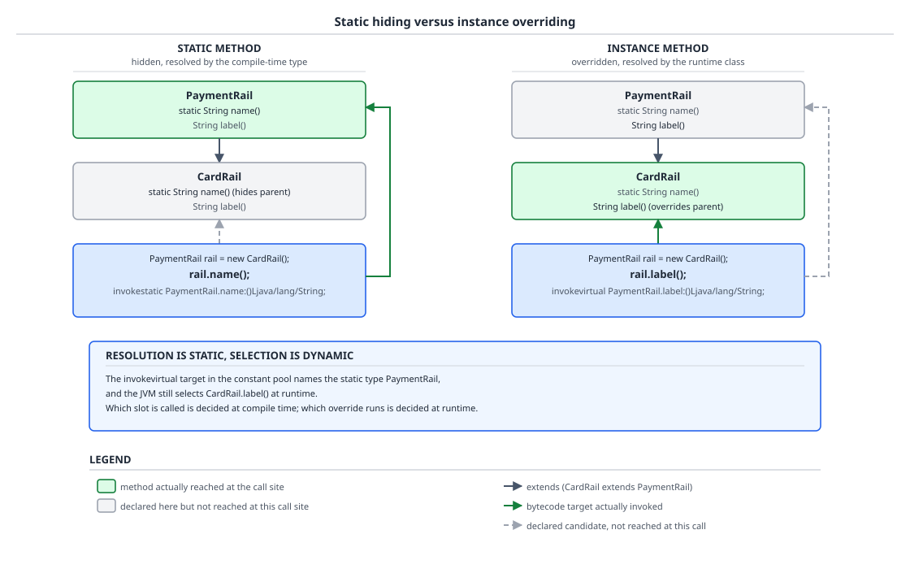
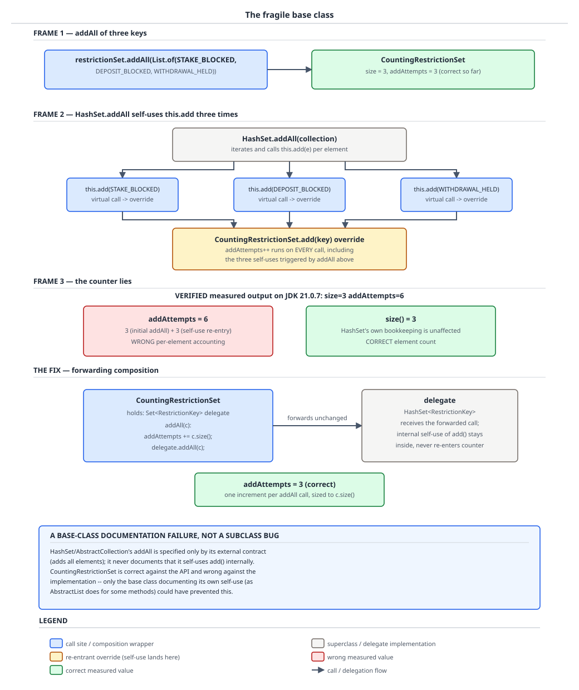

# 03 Java Core — Inheritance and overriding — BASICS (§1.15, 1.15.1–1.15.5, 1.15.12–1.15.18)

**Target version: Java 21 LTS.** | **Part 1 of 5** | [Index](../00-index.md)
Previous: [`final` semantics and constant folding](../classes-and-initialization/04-internals-final-and-constant-folding.md) · Next: [Overload resolution and dynamic dispatch](01a-overload-resolution-and-dispatch.md)

Inheritance in Java is two separate mechanisms wearing one keyword. One of them — the sharing of *implementation* — is single, rigid, and the source of nearly every design regret in a mature codebase. The other — the acquisition of *type* — is multiple, cheap, and the thing you actually wanted. This file separates them, then works out exactly what the JVM does when a subclass redeclares something a superclass already declared: methods are selected at runtime, fields are not, statics are not, and `super.` deliberately switches selection off. By the end you should be able to look at a line like `wt.state` and say, without running it, which of the two `state` fields in the object it reads and which `Fieldref` entry the compiler wrote into the constant pool — and to explain why a three-element `addAll` on a counting subclass of `HashSet` measures six.

## 1. Inheritance: one implementation, many types (1.15.1, 1.15.2, 1.15.18)

Picture a `CardWithdrawal` object in memory as a stack of slabs. The bottom slab is the `Object` part, above it the `WithdrawalTransaction` part, above that the `CardWithdrawal` part. Each slab was poured by exactly one constructor, bottom-up, and each slab can be poured by exactly one parent — a slab cannot rest on two foundations, because the layout would be ambiguous and two parents could both define a field named `state` at conflicting offsets. That is single inheritance of implementation.

Now picture the *labels* you may stick on the finished object: `Object`, `WithdrawalTransaction`, `CardWithdrawal`, `Auditable`, `Comparable<WithdrawalTransaction>`, `PaymentRailPort`. Labels cost nothing, carry no storage, and stack without limit, because an interface (before default methods, and still mostly after) says only *what messages the object answers*, not *how it is laid out*. That is multiple inheritance of type.

| Axis | `extends` a class | `implements` an interface |
|---|---|---|
| How many | Exactly one (implicitly `Object`) | Any number |
| Brings state | Yes — instance fields, layout | No instance fields; `static final` constants only |
| Brings implementation | Yes, all non-private methods | Only `default` and `static` method bodies |
| Brings constructors | No — constructors are not inherited, but the chain must be satisfied | No constructors at all |
| Subtyping | Yes | Yes |
| Cost when the parent changes | High — every subclass recompiles against new internals | Low — only the abstract surface matters |

### Why it exists

Two problems, historically confused. The first is code reuse: in 1995 the alternative to inheriting a method body was copying it. The second is substitutability: a `PaymentService` wants to write one deposit path that works for card and bank rails alike, which needs a *type* both rails belong to. C++ answered both with the same tool, multiple inheritance of classes, and paid for it with the diamond problem — if `CardWithdrawal` inherits `state` from two paths, which storage does `this.state` mean? Java's designers split the answers: classes for the layout question (single, so the answer is never ambiguous), interfaces for the substitutability question (multiple, so it never constrains you). Java 8's default methods reintroduced inherited *behaviour* through interfaces, and had to add explicit conflict rules for it, but deliberately did not reintroduce inherited *state*.

### The mechanism

**`extends` and the implicit `Object`.** A class declaration with no `extends` clause has `extends java.lang.Object` supplied by the compiler (JLS 8.1.4). The single exception is `Object` itself, which has no superclass; in the class file its `super_class` entry is the only one permitted to be zero. Everything else in the platform is reachable from `Object` by a finite chain of single steps, which is why `getClass()`, `hashCode()`, `equals` and the monitor methods are available on every reference without anyone declaring them.

**The constructor chain.** Constructors are not inherited. What *is* enforced is that every constructor body begins by running some other constructor, so that each slab is poured before the one above it:

1. If the first statement is an explicit `this(args)`, that sibling constructor runs, and *it* satisfies the chain.
2. If the first statement is an explicit `super(args)`, that superclass constructor runs.
3. If there is no explicit invocation, the compiler inserts `super()` — the *no-argument* superclass constructor. If the superclass has no accessible no-arg constructor, this is a compile error, which is the real reason a class with only an argument-taking constructor breaks its subclasses.

After the superclass constructor returns, this class's instance initialisers and instance field initialisers run in source order, and only then the rest of the constructor body (JLS 12.5). That ordering is precisely what makes `this` escaping dangerous — see the supporting fact on 1.15.14.

**Version trap.** In Java 21, `super(args)` or `this(args)` must be the *first statement* of the constructor body; you cannot validate an argument before the chain runs, which is why the standard workaround is a `private static` helper called inside the argument expression. Older material and newer material disagree here: flexible constructor bodies, which permit statements before the explicit constructor invocation, arrived as a preview feature *after* 21 (JEP 447, first previewed in Java 22). On 21 LTS the old rule holds without a flag.

**Liskov as the rule behind the rules (1.15.18).** Barbara Liskov's substitution principle, stated informally: if `S` is a subtype of `T`, then a program written against `T` must not be able to detect that it was handed an `S`. Java cannot check that — "detect" is about behaviour, and behaviour is not in the type system. What the compiler *can* check is the observable *signature* surface, and if you read the overriding rules in the next concept as "the compiler enforcing the checkable half of Liskov", every one of them stops needing to be memorised:

| Overriding rule | The Liskov violation it prevents |
|---|---|
| Return type must be the same or a subtype | Caller assigns the result to `T`'s return type; a broader return type would not fit |
| No new checked exceptions | Caller's `catch` clauses were written against `T`; a new checked type would be unhandled |
| Access may not be narrowed | Caller could call it through `T`; making it `protected` in `S` would make the same call illegal |
| Same parameter types after erasure | Otherwise it is not the same method at all — it is an overload, and the caller's call site would not reach it |

The unchecked half is on you: `LimitSet.maxStake` returning a *negative* `Money` from a subclass breaks every caller without breaking a single compiler rule.

### Code

```java
sealed interface Verdict permits DocumentVerdict, ScreeningVerdict, ReviewVerdict, WealthVerdict {
    StatusCode outcome();
    Instant decidedAt();
}

abstract class WithdrawalTransaction implements Comparable<WithdrawalTransaction> {
    private final AccountId account;
    private final Money amount;
    private final Instant requestedAt;
    private StatusCode status;

    protected WithdrawalTransaction(AccountId account, Money amount, Instant requestedAt) {
        if (account == null || amount == null) {
            throw new IllegalArgumentException("account and amount are required");
        }
        this.account = account;
        this.amount = amount;
        this.requestedAt = requestedAt;
        this.status = StatusCode.of("PENDING_VERIFICATION");
    }

    public final AccountId account() { return account; }
    public final Money amount() { return amount; }
    public StatusCode status() { return status; }

    protected void transitionTo(StatusCode next) {
        if (!next.followsFrom(this.status)) {
            throw new IllegalTransitionException(this.status + " -> " + next);
        }
        this.status = next;
    }

    /** Every rail must say how long the client should be told to wait. */
    public abstract Duration expectedSettlement();

    @Override
    public int compareTo(WithdrawalTransaction other) {
        return this.requestedAt.compareTo(other.requestedAt);
    }
}

final class CardWithdrawal extends WithdrawalTransaction {
    private final IdempotencyKey pspKey;

    CardWithdrawal(AccountId account, Money amount, Instant requestedAt, IdempotencyKey pspKey) {
        super(account, amount, requestedAt);   // must be first; pours the parent slab
        this.pspKey = pspKey;                  // this slab, after the parent returned
    }

    IdempotencyKey pspKey() { return pspKey; }

    @Override
    public Duration expectedSettlement() { return Duration.ofSeconds(9); }
}

final class BankWithdrawalTransaction extends WithdrawalTransaction {
    private final PaymentRun run;

    BankWithdrawalTransaction(AccountId account, Money amount, Instant requestedAt, PaymentRun run) {
        super(account, amount, requestedAt);
        this.run = run;
    }

    PaymentRun run() { return run; }

    @Override
    public Duration expectedSettlement() { return Duration.ofHours(24); }
}
```

`CardWithdrawal` inherits *one* implementation (`WithdrawalTransaction`'s fields, `transitionTo`, `compareTo`) and carries *three* types beyond itself: `WithdrawalTransaction`, `Comparable<WithdrawalTransaction>`, `Object`. `PaymentService` can hold a `List<WithdrawalTransaction>`, sort it, and call `expectedSettlement()` on each without knowing the rail.

### Gotcha

`protected` is weaker than most people read it. A `protected` member is visible to subclasses *and to every class in the same package*, and — the part that bites — a subclass in another package may access the protected member only through a reference whose static type is that subclass or lower (JLS 6.6.2). So a `protected StatusCode status` in `WithdrawalTransaction` is readable by anything in its own package, meaning `protected` is not the private-to-the-family door it looks like. Declaring the field `private` with a `protected` accessor keeps the extension point without exposing the storage.

> **Definition.** `extends` establishes single inheritance of implementation — one superclass, whose fields and non-private methods become part of the subclass — while `implements` establishes multiple inheritance of type, adding subtyping and an abstract surface without adding state.

## 2. The overriding contract (1.15.3, 1.15.4)

An override is a *replacement* of one entry in the method table the runtime builds for a class. For that replacement to be safe, the new entry must be usable everywhere the old entry was, because every existing call site was type-checked against the old one and will not be re-checked. The five rules are just the checkable consequences of "usable everywhere the old one was".

### Why it exists

Without the rules, a subclass could quietly break code it has never seen. Concretely: `BonusService` calls `withdrawal.expectedSettlement()` and catches nothing, because the declared method throws nothing. If a subclass could add `throws LedgerImbalanceException`, that call site would now be able to throw a checked exception the compiler already certified as impossible. There is no place to put the error, so the language forbids the declaration instead.

### The mechanism

A subclass method overrides a superclass method when all of these hold (JLS 8.4.8.1):

**1. Same name, and the same parameter types after erasure.** The signature match uses erased types, because that is what the class file records. `record(Verdict v)` and `record(DocumentVerdict v)` are different methods, not an override — the classic silent-overload trap of 1.15.17.

**2. Return type must be *return-type-substitutable*.** For reference types this means identical or a subtype (covariant); for primitives it means identical, with no widening allowed. `Money` cannot be overridden by `BigDecimal`, but `RailAdapter` can be overridden by `CardRail`.

**3. No broader checked exceptions.** The overriding method's `throws` clause may list only exception types that are subtypes of something in the overridden method's `throws` clause — or nothing at all. Unchecked types (`RuntimeException`, `Error` and their subtypes) are unconstrained, which is why `RestrictedActionException extends RuntimeException` slides in anywhere.

**4. Access may not be weakened.** `public` → `public` only. `protected` → `protected` or `public`. Package-private → package-private, `protected` or `public`. `private` is not inherited at all, so it cannot be overridden.

**5. `final`, `static` and `private` methods cannot be overridden.** Each for a different reason:
- `final` — the declaration is a promise to callers (and to the JIT) that this body is the only body. JLS 8.4.8 makes redeclaring it in a subclass an error. *(Paraphrased diagnostic: `javac` reports that the method cannot override a final method in the superclass; treat the exact wording as a paraphrase, not verified text.)*
- `static` — a static method is not in any instance's method table, so there is nothing to replace. A subclass static with the same signature *hides* it, and the compile-time type of the qualifying expression picks the target. This is proved in concept 3.
- `private` — not inherited, hence not visible to redeclare against. A same-named subclass method is an unrelated new method that happens to share a name.

Two more constraints worth stating because they are asked: an instance method cannot override a static one and a static cannot hide an instance one (either way is a compile error), and a `default` method inherited from an interface loses to any class-declared method with the same erased signature — the class always wins (JLS 8.4.8.1, the "class wins" rule).

**Covariant return and the bridge (1.15.4) [SOURCE].** Covariant returns were added in Java 5; before that the return type had to match exactly, and the workaround was returning the supertype and making every caller cast. The JVM, however, *still* has no notion of covariant return. Two facts from JVMS make that a problem:

- JVMS 4.3.3: a method descriptor ends in a **return descriptor** — the return type is part of the descriptor, not merely documentation on it.
- JVMS 4.6: no two methods in one class file may have the same name *and* descriptor. Different descriptors, same name, is fine — so a class file may legally hold two methods named `self` differing only in return type, which Java source may not.

Method selection at runtime matches on name *and* descriptor. So if `CardRail.self()` were compiled with only the descriptor `()LCardRail;`, a caller holding a `RailAdapter` reference — which emitted `invokevirtual RailAdapter.self:()LRailAdapter;` — would find no matching entry. `javac` closes the hole by emitting a **bridge method**: a synthetic method with the *superclass's* descriptor whose entire body forwards to the real one. Compiled with `javac 21`:

```java
abstract class RailAdapter implements Comparable<RailAdapter> {
    abstract RailAdapter self();
}
class CardRail extends RailAdapter {
    @Override CardRail self() { return this; }
    @Override public int compareTo(RailAdapter o) { return 0; }
}
```

`javap -p CardRail.class`, verified on Oracle JDK 21.0.7:

```
class CardRail extends RailAdapter {
  CardRail();
  CardRail self();
  public int compareTo(RailAdapter);
  RailAdapter self();
  public int compareTo(java.lang.Object);
}
```

Five members from three source declarations. `javap -v -p` on the two extra ones:

```
  RailAdapter self();
    descriptor: ()LRailAdapter;
    flags: (0x1040) ACC_BRIDGE, ACC_SYNTHETIC

  public int compareTo(java.lang.Object);
    descriptor: (Ljava/lang/Object;)I
    flags: (0x1041) ACC_PUBLIC, ACC_BRIDGE, ACC_SYNTHETIC
```

Line by line. `RailAdapter self()` — the name matches the source method, the *return type* does not; this is the covariant-return bridge, and its descriptor `()LRailAdapter;` is exactly what a `RailAdapter`-typed call site emitted. `descriptor: ()LRailAdapter;` — no parameters, returns a `RailAdapter`; contrast the real method's `()LCardRail;`. `flags: (0x1040)` decomposes into `ACC_BRIDGE` (`0x0040`, which JVMS 4.6 describes as a bridge method generated by the compiler) and `ACC_SYNTHETIC` (`0x1000`, declared synthetic and not present in the source code). The second entry, `compareTo(Object)`, is a *different* cause: `Comparable<T>` erases to `compareTo(Object)`, so the interface's erased descriptor needs a landing pad too. Both bridges do the same thing — cast the argument or the receiver as needed, call the real method, return its result — and both are invisible to source code but fully visible to reflection, which is why `getDeclaredMethods()` on a generic or covariant class returns more than you declared. The erasure side of bridging, including how a bridge turns a generics violation into a `ClassCastException`, belongs to [`../generics/03-internals-erasure.md`](../generics/03-internals-erasure.md).

**Insight:** a bridge is not an optimisation and not a generics artefact specifically. It is the compiler papering over the gap between a language whose method identity is (name, parameters) and a class file whose method identity is (name, parameters, return type).

### Code

```java
interface PaymentRailPort {
    /** Contract: may fail transiently; callers must handle it. */
    Verdict authorise(PaymentIntent intent) throws RailUnavailableException;

    PaymentRailPort self();
}

abstract class AbstractRailAdapter implements PaymentRailPort {
    @Override
    public abstract AbstractRailAdapter self();   // covariant already: bridge emitted here
}

final class CardRailAdapter extends AbstractRailAdapter {

    private final CardPayments psp;

    CardRailAdapter(CardPayments psp) { this.psp = psp; }

    @Override
    public CardRailAdapter self() { return this; }          // rule 2: covariant, legal

    @Override
    public Verdict authorise(PaymentIntent intent) {          // rule 3: narrower - throws nothing
        return psp.authorise(intent.idempotencyKey(), intent.amount());
    }
}

final class BankRailAdapter extends AbstractRailAdapter {

    private final BankWithdrawal bank;

    BankRailAdapter(BankWithdrawal bank) { this.bank = bank; }

    @Override
    public BankRailAdapter self() { return this; }

    @Override
    public Verdict authorise(PaymentIntent intent) throws RailUnavailableException {
        // rule 3: RailUnavailableException is already in the interface's throws clause
        return bank.queueForRun(intent);
    }

    // Would not compile - rule 3, LedgerImbalanceException is not a subtype of
    // RailUnavailableException:
    // @Override public Verdict authorise(PaymentIntent i) throws LedgerImbalanceException

    // Would not compile - rule 4, interface methods are implicitly public:
    // @Override protected Verdict authorise(PaymentIntent i)
}
```

`CardRailAdapter.self()` returns `CardRailAdapter`, so `new CardRailAdapter(psp).self().authorise(intent)` needs no cast — and behind it sit *two* bridges, one for `AbstractRailAdapter self()` and one for `PaymentRailPort self()`.

### Gotcha

Covariant returns interact badly with `clone()`-style self-typing across a deep hierarchy: each level that narrows the return type adds another bridge, and a subclass six levels down carries five synthetic forwarders for one method. They are cheap individually (the JIT inlines them away) but they show up in reflection-driven frameworks — a Spring `@Transactional` proxy or a Jackson serialiser walking `getDeclaredMethods()` will see the bridges, and code that filters on name alone will process the same logical method twice. The fix is `method.isBridge()`.

> **Definition.** Overriding replaces a superclass method's table entry with one that is usable at every call site the original was: same name and erased parameter types, a return type that is the same or narrower, no broader checked exceptions, no weaker access, and the original must not be `final`, `static` or `private`.

## 3. Overloading is compile-time, overriding is runtime (1.15.5)

Two questions get asked about every call in Java, and they are answered by two different parties at two different times.

- **Which method did you mean?** — answered by `javac`, from the *static types* of the receiver and the arguments, and burned into the class file as a symbolic constant-pool reference. This is **resolution**. Overloading lives entirely here.
- **Which body runs?** — answered by the JVM at the call, from the *runtime class* of the receiver. This is **selection**. Overriding lives entirely here.

Everything confusing about dispatch in Java is one of these two being mistaken for the other.

### Why it exists

Resolution has to be static because Java is statically typed: the compiler must know the return type to type-check the rest of the expression, and it cannot know it if the target method is not fixed. Selection has to be dynamic because that is the entire point of subtyping: `PaymentService` compiled against `WithdrawalTransaction` must run `CardWithdrawal`'s body without being recompiled. Before virtual dispatch, the C answer was a struct of function pointers you wired by hand — which is exactly what the JVM's method table is, only maintained by the runtime instead of by you.

### The mechanism [PROVE]

Walk it through on one call, `wt.label()`, where `wt` is declared `WithdrawalTransaction` and holds a `CardWithdrawal`.

*Compile time.* `javac` looks at the static type `WithdrawalTransaction`, finds the applicable methods named `label` accessible from here, picks the most specific one, and writes a `Methodref` into the constant pool naming **`WithdrawalTransaction.label:()Ljava/lang/String;`** — the class named is the *compile-time* type, not the runtime class, which the compiler does not know. It emits `invokevirtual` against that entry.

*Run time.* The JVM resolves the `Methodref` once to a method, then — because the instruction is `invokevirtual` — performs *selection*: it takes the actual class of the object on the stack, `CardWithdrawal`, and looks for the most specific override of the resolved method starting from that class and walking up. It finds `CardWithdrawal.label` and invokes that. The constant-pool entry never changes; the body that runs does. (The table-and-index machinery, `invokeinterface`'s itable, and the inline caches the JIT layers on top, are in [`01a-overload-resolution-and-dispatch.md`](01a-overload-resolution-and-dispatch.md) and [`03-internals-dispatch.md`](03-internals-dispatch.md).)

Now change one thing: make `label` `static`. The instruction becomes `invokestatic`, and `invokestatic` has *no selection step* — there is no receiver to select on. The constant-pool entry names `WithdrawalTransaction.rail`, and that is what runs, even though the expression was written on a variable holding a `CardWithdrawal`. The subclass's `rail()` did not override anything; it **hid** it.

Same story for overloading. Given `record(Verdict v)` and `record(DocumentVerdict v)` on the same class, and a variable declared `Verdict v` holding a `DocumentVerdict`, the compiler resolves against the *static* type `Verdict` and writes `record:(LVerdict;)V`. The `DocumentVerdict` overload is never reached — not because the JVM chose wrong, but because it was never asked.



**D-044** — Read the two lanes as the same call written twice. On the left the static method: the `invokestatic` target is `PaymentRail.name`, fixed by the compile-time type, and `CardRail.name` never runs. On the right the instance method: the `invokevirtual` target *named in the constant pool* is also `PaymentRail.label`, yet the body *selected* at runtime is `CardRail.label`. The annotation panel is the point — resolution picked the same class on both sides; only selection made the difference.

### Code

```java
class WithdrawalTransaction {
    String state = "PENDING_VERIFICATION";
    static String rail() { return "generic"; }
    String label() { return "withdrawal"; }
}

class CardWithdrawal extends WithdrawalTransaction {
    String state = "DEP-301 CAPTURED";
    static String rail() { return "card"; }
    @Override String label() { return "card withdrawal"; }
}

class DispatchProof {
    public static void main(String[] args) {
        CardWithdrawal cw = new CardWithdrawal();
        WithdrawalTransaction wt = cw;                  // one object, two static types

        System.out.println(wt.state + " | " + cw.state + " | "
                + ((WithdrawalTransaction) cw).state);
        System.out.println(wt.rail() + " | " + wt.label());
    }
}
```

Measured output on Oracle JDK 21.0.7 (21.0.7+8-LTS-245, macOS aarch64):

```
PENDING_VERIFICATION | DEP-301 CAPTURED | PENDING_VERIFICATION
generic | card withdrawal
```

`javap -c` on that `main`, verified:

```
      14: getfield      #16   // Field WithdrawalTransaction.state:Ljava/lang/String;
      18: getfield      #22   // Field CardWithdrawal.state:Ljava/lang/String;
      22: getfield      #16   // Field WithdrawalTransaction.state:Ljava/lang/String;
      38: invokestatic  #33   // Method WithdrawalTransaction.rail:()Ljava/lang/String;
      42: invokevirtual #37   // Method WithdrawalTransaction.label:()Ljava/lang/String;
```

The last two lines are the whole concept in two instructions on one receiver. Both constant-pool entries name `WithdrawalTransaction`. The `invokestatic` runs `WithdrawalTransaction.rail` — output `generic`. The `invokevirtual` runs `CardWithdrawal.label` — output `card withdrawal`. Identical resolution, opposite outcome, because only one of the two instructions has a selection step.

### Gotcha

The trap is a *combination* of the two, and it is the single most common Java puzzler. Overload resolution happens first, on static types; only then does the winner get virtually dispatched. So if `BalanceView` declares `render(WithdrawalTransaction w)` and `render(CardWithdrawal w)`, a call `render(wt)` on a `WithdrawalTransaction`-typed variable holding a `CardWithdrawal` picks the *first* overload — and then, inside it, `w.label()` correctly runs `CardWithdrawal.label`. Half of the call is dynamic and half is static, in the same statement. The fix when you genuinely need dispatch on the argument type is a pattern-matching `switch` over a sealed hierarchy, which makes the decision explicit and exhaustive rather than accidental:

```java
static String describe(Verdict v) {
    return switch (v) {
        case DocumentVerdict d  -> "documents: " + d.outcome();
        case ScreeningVerdict s -> "screening: " + s.outcome();
        case ReviewVerdict r    -> "manual review: " + r.outcome();
        case WealthVerdict w    -> "source of funds: " + w.outcome();
    };
}
```

> **Definition.** Overloading is resolved by the compiler from static types and fixed in the constant pool; overriding is selected by the JVM from the receiver's runtime class. Resolution is static, selection is dynamic, and only instance methods have a selection step.

## 4. Fields are not polymorphic (1.15.12)

There is no such thing as overriding a field. When a subclass declares a field with a name a superclass already used, the object ends up holding **both** — two distinct slots, two distinct offsets, both alive for the whole life of the object. Which one a given expression reads is decided by the compiler from the static type of the expression, and never revisited.

### Why it exists

Not a design choice so much as a consequence of how fields are accessed. A field read is one machine instruction against a known offset; making it polymorphic would mean an indirection through a per-class table on every read, at which point a field is just a method with worse syntax. The language also cannot *remove* the superclass's slot, because the superclass's own methods were compiled against it and must keep working — `WithdrawalTransaction.label()` reading `state` has to see `WithdrawalTransaction.state`, or the parent class would be broken by an unrelated subclass. Given both slots must exist, the only remaining question is which one an expression names, and the only answer available at compile time is the static type.

### The mechanism [PROVE]

Work it out from the class file. A field access compiles to `getfield` (or `putfield`) with an index into the constant pool, and that entry is a `Fieldref` — a triple of *class name*, *field name*, *field descriptor*. Two independent facts follow:

1. The class name in the `Fieldref` is chosen by `javac` from the static type of the qualifying expression (JLS 15.11.1: the meaning of `Primary.name` is determined by the *type* of `Primary`, not its value).
2. `getfield` performs resolution and then reads at the resolved field's offset. There is no selection step — the JVMS description of `getfield` has no clause that consults the runtime class of `objectref` to choose among candidate fields, because there is nothing to choose: the `Fieldref` already identified exactly one field of exactly one class.

Therefore three reads of the *same object* through three differently-typed expressions can name two different fields and produce two different values. Note step 1's corollary: an explicit cast changes the static type, and therefore changes which `Fieldref` is emitted — the cast is not a runtime operation that redirects a read, it is a compile-time instruction to the resolver about which slot you meant.


**D-045** — Look at the single `CardWithdrawal` object in the middle: it holds *both* `WithdrawalTransaction.state = "PENDING_VERIFICATION"` and `CardWithdrawal.state = "DEP-301 CAPTURED"` simultaneously. Then follow the three arrows in, from `wt`, from `cw`, and from the cast expression, each labelled with the `getfield` constant-pool entry the compiler emitted for it. The annotation panel carries the measured line: two of the three reads land on the parent slot.

### Code

Using the same `WithdrawalTransaction` / `CardWithdrawal` pair and `DispatchProof.main` from concept 3, the measured output on Oracle JDK 21.0.7 is:

```
PENDING_VERIFICATION | DEP-301 CAPTURED | PENDING_VERIFICATION
```

and the bytecode for those three reads, verified:

```
      14: getfield      #16   // Field WithdrawalTransaction.state:Ljava/lang/String;
      18: getfield      #22   // Field CardWithdrawal.state:Ljava/lang/String;
      22: getfield      #16   // Field WithdrawalTransaction.state:Ljava/lang/String;
```

Three reads, one object, **two** constant-pool entries — `#16` twice and `#22` once. `cw.state` uses `#22` because `cw`'s static type is `CardWithdrawal`. `wt.state` uses `#16` because `wt`'s static type is `WithdrawalTransaction`, even though the object is the very same `CardWithdrawal`. And `((WithdrawalTransaction) cw).state` uses `#16` too — the cast did nothing at runtime; it changed the static type of the expression so `javac` emitted a different `Fieldref`. Also worth reading straight down the listing: `#22`'s slot still holds `"DEP-301 CAPTURED"` while `#16`'s holds `"PENDING_VERIFICATION"`, which is the proof that both fields exist at once. Hiding, not overriding.

Here is what you write instead when you actually want the subclass's answer to win:

```java
abstract class WithdrawalTransaction {
    private StatusCode status = StatusCode.of("PENDING_VERIFICATION");

    /** Polymorphic because it is a method. Subclasses narrow the answer, not the storage. */
    public StatusCode status() { return status; }

    protected final void setStatus(StatusCode next) { this.status = next; }
}

final class CardWithdrawal extends WithdrawalTransaction {
    @Override
    public StatusCode status() {
        // The card rail reports the PSP phase, not the generic lifecycle phase.
        return pspCaptured ? StatusCode.of("DEP-301 CAPTURED") : super.status();
    }

    private boolean pspCaptured;

    void markCaptured() { this.pspCaptured = true; setStatus(StatusCode.of("DEP-301 CAPTURED")); }
}
```

One slot, one accessor, dynamic selection. `private` field plus `protected` mutator is the entire fix.

### Gotcha

**Pitfall:** believing that redeclaring a field in a subclass "overrides" it, so the parent's methods will see the child's value. The symptom is uglier than a wrong `println`: `WithdrawalTransaction`'s own `compareTo`, `toString` and validation logic keep reading the *parent* slot, which nobody is updating any more, so a card withdrawal reports `PENDING_VERIFICATION` to the ledger reconciliation job for the rest of its life while the client's screen shows `DEP-301 CAPTURED`. It is a silent divergence, not a crash, and it survives every unit test that only ever touches the subclass. The fix is to never shadow a superclass field: make superclass fields `private`, expose a `protected` accessor, and override the *accessor*.

> **Definition.** Field access is resolved statically: the compiler picks the `Fieldref` from the static type of the qualifying expression, `getfield` has no selection step, and a subclass field with a superclass field's name *hides* it — both slots exist in every instance.

## 5. The fragile base class, and composition instead (1.15.15, 1.15.16)

Subclassing is calling a private API you were never shown. When you extend a class you inherit not just its methods but its **self-use pattern** — which of its own public methods it calls internally — and that pattern is an implementation detail the author is free to change in a patch release. Your override sits in the middle of the superclass's private control flow, and neither of you knows it.

### Why it exists

Nothing "exists" here to be justified; this is the cost side of inheritance, and it is why the modern default is composition. The historical point worth knowing: `java.util`'s collection classes were written before this was widely understood, so `AbstractCollection` and `HashSet` are the canonical demonstration, and `Vector`/`Stack`/`Hashtable`/`Properties` are the canonical casualties (`Properties extends Hashtable<Object,Object>`, so `Properties.put` accepts non-`String` keys forever and cannot be fixed without breaking binary compatibility).

### The mechanism [PROVE]

`CountingRestrictionSet extends HashSet` overrides both `add` and `addAll` and increments a counter in each. Trace `addAll(List.of(a, b, c))`:

1. `addAll` is called on the `CountingRestrictionSet`. `addAttempts += c.size()` → **3**.
2. It calls `super.addAll(c)`. `HashSet` does not declare `addAll`; it inherits `AbstractCollection.addAll`, whose body is a loop over `c` calling `add(e)` on `this`.
3. `this` is the `CountingRestrictionSet`. `add` is public and overridden, and the call inside `AbstractCollection.addAll` compiles to `invokevirtual` — so selection lands in `CountingRestrictionSet.add`, not `HashSet.add`.
4. Three elements, three re-entrant calls, `addAttempts++` each time → **3 + 3 = 6**.
5. Each of those calls `super.add(e)`, which is `invokespecial` to `HashSet.add`, so the set itself is correct: `size() == 3`.

The count is exactly double, and only because the collection had three elements — the error scales with input, which is what makes it look like an intermittent data bug rather than a design bug. Nothing in `HashSet`'s Javadoc obliges `addAll` to be implemented in terms of `add`; if a future JDK rewrote `AbstractCollection.addAll` to bulk-insert directly, the same code would start reporting 3 and the "fix" of removing the `addAll` override would break.



**D-046** — Follow the three frames left to right: frame 1, the override's own `addAttempts += 3` for the three restriction keys; frame 2, the inherited `AbstractCollection.addAll` calling `this.add` three times straight back into the override; frame 3, the result — `addAttempts = 6` in red against a correct `size() = 3` in green. The band underneath is the forwarding-composition fix, where the same scenario measures `addAttempts = 3` because there is no `this` to re-enter.

### Code

The broken version:

```java
class CountingRestrictionSet<E> extends HashSet<E> {
    private int addAttempts = 0;

    @Override public boolean add(E e) {
        addAttempts++;
        return super.add(e);
    }

    @Override public boolean addAll(Collection<? extends E> c) {
        addAttempts += c.size();
        return super.addAll(c);
    }

    int getAddAttempts() { return addAttempts; }
}
```

Adding `List.of("STAKE_BLOCKED", "DEPOSIT_BLOCKED", "WITHDRAWAL_HELD")` through `addAll`, the measured output on Oracle JDK 21.0.7 is:

```
size=3 addAttempts=6
```

The forwarding-composition fix — implement the interface, hold the implementation, forward every method, override nothing:

```java
final class CountingRestrictionSet implements Set<RestrictionKey> {

    private final Set<RestrictionKey> delegate;
    private int addAttempts = 0;

    CountingRestrictionSet(Set<RestrictionKey> delegate) {
        this.delegate = Objects.requireNonNull(delegate);
    }

    int getAddAttempts() { return addAttempts; }

    @Override public boolean add(RestrictionKey key) {
        addAttempts++;
        return delegate.add(key);
    }

    @Override public boolean addAll(Collection<? extends RestrictionKey> keys) {
        boolean changed = false;
        for (RestrictionKey key : keys) {
            changed |= add(key);          // deliberate, visible self-use - counts once each
        }
        return changed;
    }

    @Override public boolean remove(Object o) { return delegate.remove(o); }
    @Override public boolean contains(Object o) { return delegate.contains(o); }
    @Override public int size() { return delegate.size(); }
    @Override public boolean isEmpty() { return delegate.isEmpty(); }
    @Override public Iterator<RestrictionKey> iterator() { return delegate.iterator(); }
    @Override public Object[] toArray() { return delegate.toArray(); }
    @Override public <T> T[] toArray(T[] a) { return delegate.toArray(a); }
    @Override public boolean containsAll(Collection<?> c) { return delegate.containsAll(c); }
    @Override public boolean retainAll(Collection<?> c) { return delegate.retainAll(c); }
    @Override public boolean removeAll(Collection<?> c) { return delegate.removeAll(c); }
    @Override public void clear() { delegate.clear(); addAttempts = 0; }
    @Override public boolean equals(Object o) { return delegate.equals(o); }
    @Override public int hashCode() { return delegate.hashCode(); }
    @Override public String toString() { return delegate + " (attempts=" + addAttempts + ")"; }
}
```

Same scenario, this measures `addAttempts = 3`. `addAll` here calls *this* class's `add`, which is a self-use pattern the class's own author chose and can see; there is no inherited body reaching back in. `Set`'s contract obligations on `equals`/`hashCode` are honoured by forwarding to the delegate — the collection-contract side of that is [`../../02-java-collections`](../../02-java-collections) territory (guide 02).

**Tradeoff, honestly.** Composition costs you the twenty forwarding methods above, and it costs you the subtype relationship if a caller needs `HashSet` specifically rather than `Set` (which is why programming to interfaces is a prerequisite, not a nicety). It buys you immunity to superclass changes, freedom to swap the delegate (`LinkedHashSet` for deterministic ordering of restriction keys, `ConcurrentHashMap.newKeySet()` for a shared one), and the ability to wrap something you do not control. The escape hatch when the boilerplate is genuinely intolerable: extend the JDK's `AbstractSet` or `ForwardingSet`-style base if one exists for your interface, or accept inheritance *from a class you own and version together with the subclass*.

**Designing for inheritance, or prohibiting it (1.15.16).** If you ship a non-final public class, you have three obligations, and they are the whole of the discipline:

| Obligation | What it means concretely |
|---|---|
| Document self-use | For every overridable method, say which other overridable methods it invokes, in what order, and under what conditions. The JDK marks these "This implementation" notes, generated by `@implSpec`. Without them, no subclass can be written correctly. |
| Provide the hooks deliberately | Choose the `protected` methods and fields that are extension points, and treat that set as public API forever. Test them by writing at least three subclasses before shipping. |
| Never call an overridable method from a constructor | The override runs before the subclass's fields are initialised. See the supporting fact on 1.15.14. |

If you are not willing to do all three, take the other path: make the class `final`, or make the constructor `private` and hand out static factories. That is a design decision, not a lack of one, and it is what `record`, sealed hierarchies and every value type in QuizStakes (`Money`, `ClientId`, `StakeSplit`) do.

### Gotcha

**Pitfall:** believing that if you only *add* methods and never override, subclassing is safe. It is not, in the other direction: a future superclass release may add a method with the *same signature as yours* and a different contract. Your `Account` subclass declares `boolean isFrozen()` meaning "restriction `DORMANT_FROZEN` present"; the library's next version adds `isFrozen()` meaning "the row is locked for a payment run", and now the library's own internals call *your* method and act on the wrong answer. Your method silently became an override of something you never saw. Composition has no such exposure, because a new superclass method does not become part of your class's surface.

> **Definition.** A base class is fragile when its correctness depends on which of its own overridable methods it calls internally — an unspecified detail that a subclass can break and a superclass release can change; the remedies are forwarding composition, or documenting self-use and treating it as API, or `final`.

## Supporting facts

### `super.method()` and `invokespecial` (1.15.13)

`super.label()` inside `CardWithdrawal` compiles to `invokespecial WithdrawalTransaction.label:()Ljava/lang/String;`. This is the one place the language deliberately switches selection *off*. If `super.label()` compiled to `invokevirtual`, selection would start from the receiver's runtime class — `CardWithdrawal` — find `CardWithdrawal.label` again, and recurse until the stack overflowed. `invokespecial` is defined so that the method to run is the *resolved* method (subject to a superclass-lookup adjustment for the `ACC_SUPER` case), with no consultation of the receiver's class; it is used for exactly three things — `super.` calls, `private` instance methods, and constructor (`<init>`) invocations, all of which are the cases where the target must not be re-chosen. The five invoke instructions in full are [`03-internals-dispatch.md`](03-internals-dispatch.md)'s subject.

**Version trap, verified on this machine.** A call to a *private instance method from within the same class* compiles to `invokespecial` on JDK 8 (1.8.0_202) but to `invokevirtual` on JDK 11.0.27 and JDK 21.0.7. The nestmate work of JEP 181 made private members of a nest directly accessible, so the compiler no longer needs `invokespecial`'s access relaxation to reach them. Older interview material and older blog posts assert "private methods always use `invokespecial`" — that was true through 8 and is false from 11 on. `super.` calls still use `invokespecial` on 21.

One consequence worth remembering: `super.super.method()` does not exist and cannot be simulated, because `invokespecial` resolves against a *named* class and the verifier requires that class to be the direct superclass or an interface of the current class. Skipping a level would let you bypass an intermediate class's invariants, so the JVM forbids it structurally, not just the syntax.

### `this` escaping during construction (1.15.14) [TRAP]

Object construction runs bottom-up: `super(args)` completes the parent slab before *any* of this class's field initialisers or instance initialisers run. So during a superclass constructor, `this` already has its final runtime class — `getClass()` returns `CardWithdrawal` — and its virtual method table is already the subclass's, but every field the subclass declares is still at its default (`null`, `0`, `false`), and every `final` field the subclass declares is not yet assigned. If the superclass constructor calls an overridable method, the *subclass's* override runs against that half-built state. If it publishes `this` anywhere — a registry, a listener list, an executor, a `Map` keyed by `AccountId` — another thread can observe the object in the same half-built state, and the JMM offers no guarantee at all about what that thread sees, including seeing a `final` field as `null` after the constructor returned. The safe-publication half of this is guide 05 (`src/topics/05-multithreading-concurrency.md`); the mechanism above is all you need here.

**Pitfall:** believing a `final` field is safe to read from anything a constructor triggers, because "final fields are initialised before the constructor returns". They are initialised before *that class's* constructor returns, which is *after* the superclass constructor — and after any override the superclass constructor called. Symptom: a `NullPointerException` on a `final` field, or worse, a silently-wrong default such as a `Money` limit reading as `null` and being treated as unlimited. Concretely: `WithdrawalTransaction`'s constructor calls `expectedSettlement()`, `CardWithdrawal` overrides it as `return psp.timeout();`, and `psp` is still `null` because `this.psp = psp` runs after `super(args)` returns. Fix: constructors call only `private`, `static` or `final` methods; do anything that needs a fully-built object in a static factory that constructs first and registers second, and never pass `this` out of a constructor, including implicitly by registering a non-static inner class or a lambda that captures `this`.

### `@Override` as the only defence against a silent overload (1.15.17) [TRAP]

`@Override` generates no code and changes no semantics. It asks the compiler one question: *does this method actually override or implement something?* If the answer is no, compilation fails. That is its entire value, and it is large, because the failure mode it catches is otherwise silent: get one parameter type wrong, or one name character wrong, and you have written a brand-new method that nobody calls, while the superclass's version keeps running and every test that exercises the superclass keeps passing.

**Pitfall:** believing that a method with the right name and a plausible parameter type overrides the superclass method. `boolean equals(CardWithdrawal other)` does not override `boolean equals(Object)` — it is an overload, so `HashSet.contains` and `List.remove` keep calling the inherited identity `equals` and your withdrawal deduplication silently stops working. Same class of bug: `record(DocumentVerdict v)` where the interface declares `record(Verdict v)`; `hashcode()` for `hashCode()`; `toString(Locale l)` for `toString()`. Symptom is always "my override is not being called", investigated for an hour. Fix: put `@Override` on every method you intend to override or implement, without exception, and let `javac` answer the question instead of guessing. Note the version fact: `@Override` on an *interface implementation* was a compile error in Java 5 and became legal in Java 6, so pre-2007 code omits it on interface methods for a reason that no longer applies. Configure the build to treat the `overrides` lint category as an error and the whole class of bug disappears.

## Pitfalls

### A field redeclared in a subclass overrides the superclass field

**Wrong**

```java
class WithdrawalTransaction {
    String state = "PENDING_VERIFICATION";
    String describe() { return "state=" + state; }        // reads the PARENT slot
}
class CardWithdrawal extends WithdrawalTransaction {
    String state = "DEP-301 CAPTURED";                    // hides, does not override
}

WithdrawalTransaction wt = new CardWithdrawal();
System.out.println(wt.state);        // PENDING_VERIFICATION
System.out.println(wt.describe());   // state=PENDING_VERIFICATION
```

Measured on JDK 21.0.7, `wt.state` prints `PENDING_VERIFICATION` while `((CardWithdrawal) wt).state` prints `DEP-301 CAPTURED` — both slots exist in the one object, and `javap -c` shows two different `Fieldref` entries, `WithdrawalTransaction.state` and `CardWithdrawal.state`. The damaging half is `describe()`: the parent's own method was compiled against the parent's slot and can never see the child's value, so anything routed through inherited behaviour reports the stale state forever.

**Right**

```java
class WithdrawalTransaction {
    private String state = "PENDING_VERIFICATION";
    String state() { return state; }                       // one slot, polymorphic accessor
    String describe() { return "state=" + state(); }       // virtual call, subclass wins
}
class CardWithdrawal extends WithdrawalTransaction {
    @Override String state() { return "DEP-301 CAPTURED"; }
}
```

Methods have a selection step and fields do not, so the only way to get the subclass's answer is to route through a method. Making the parent field `private` also makes the mistake unwriteable: you cannot shadow a field you cannot see.

**Why people believe it:** methods and fields are both "members", both written with a dot, and both look identical at the call site. Nothing in the syntax hints that one compiles to `invokevirtual` with a selection step and the other to `getfield` without one.

### Overriding `addAll` and `add` on a `HashSet` subclass counts each element once

**Wrong**

```java
class CountingRestrictionSet<E> extends HashSet<E> {
    private int addAttempts = 0;
    @Override public boolean add(E e) { addAttempts++; return super.add(e); }
    @Override public boolean addAll(Collection<? extends E> c) {
        addAttempts += c.size(); return super.addAll(c);
    }
    int getAddAttempts() { return addAttempts; }
}

var restrictions = new CountingRestrictionSet<String>();
restrictions.addAll(List.of("STAKE_BLOCKED", "DEPOSIT_BLOCKED", "WITHDRAWAL_HELD"));
// measured on JDK 21.0.7: size=3 addAttempts=6
```

Three elements in, six attempts counted. `HashSet` has no `addAll` of its own; it inherits `AbstractCollection.addAll`, which loops calling `this.add(e)` — a virtual call that lands right back in the override. Three from `addAll`'s own increment plus three re-entrant `add` calls. The set contents are correct; only the instrumentation is wrong, so it ships.

**Right**

```java
final class CountingRestrictionSet implements Set<RestrictionKey> {
    private final Set<RestrictionKey> delegate = new LinkedHashSet<>();
    private int addAttempts = 0;

    @Override public boolean add(RestrictionKey key) { addAttempts++; return delegate.add(key); }
    @Override public boolean addAll(Collection<? extends RestrictionKey> keys) {
        boolean changed = false;
        for (RestrictionKey key : keys) { changed |= add(key); }
        return changed;
    }
    int getAddAttempts() { return addAttempts; }
    // remaining Set methods forward to delegate
    @Override public int size() { return delegate.size(); }
    @Override public boolean isEmpty() { return delegate.isEmpty(); }
    @Override public boolean contains(Object o) { return delegate.contains(o); }
    @Override public Iterator<RestrictionKey> iterator() { return delegate.iterator(); }
    @Override public Object[] toArray() { return delegate.toArray(); }
    @Override public <T> T[] toArray(T[] a) { return delegate.toArray(a); }
    @Override public boolean remove(Object o) { return delegate.remove(o); }
    @Override public boolean containsAll(Collection<?> c) { return delegate.containsAll(c); }
    @Override public boolean retainAll(Collection<?> c) { return delegate.retainAll(c); }
    @Override public boolean removeAll(Collection<?> c) { return delegate.removeAll(c); }
    @Override public void clear() { delegate.clear(); }
}
```

This measures `addAttempts = 3`. There is no inherited body to re-enter: the only self-use is the loop this class wrote, visible on the page and under its author's control.

**Why people believe it:** `HashSet`'s Javadoc never says `addAll` is implemented via `add`, so a reader reasonably assumes each public method is self-contained. Self-use is an implementation detail that leaks through inheritance and through nothing else.

### A constructor can safely call an overridable method

**Wrong**

```java
abstract class WithdrawalTransaction {
    private final Duration sla;
    protected WithdrawalTransaction() {
        this.sla = expectedSettlement();     // virtual call - subclass override runs NOW
    }
    public abstract Duration expectedSettlement();
    public Duration sla() { return sla; }
}

final class CardWithdrawal extends WithdrawalTransaction {
    private final CardPayments psp;
    CardWithdrawal(CardPayments psp) { super(); this.psp = psp; }
    @Override public Duration expectedSettlement() { return psp.payoutTimeout(); }
}

new CardWithdrawal(cardPayments);   // NullPointerException: psp is null
```

`super()` runs to completion before `this.psp = psp`, so when the parent constructor calls `expectedSettlement()` the override executes with `psp` still at its default `null`. The subclass's method table is already installed — `getClass()` returns `CardWithdrawal` — but its fields are not. If the override had returned a default instead of dereferencing, there would be no exception at all, just a permanently wrong SLA on every card withdrawal.

**Right**

```java
abstract class WithdrawalTransaction {
    private final Duration sla;
    protected WithdrawalTransaction(Duration sla) {
        this.sla = Objects.requireNonNull(sla);   // supplied by the subclass, not asked for
    }
    public Duration sla() { return sla; }
}

final class CardWithdrawal extends WithdrawalTransaction {
    private final CardPayments psp;
    private CardWithdrawal(CardPayments psp, Duration sla) { super(sla); this.psp = psp; }

    static CardWithdrawal open(CardPayments psp) {
        return new CardWithdrawal(psp, psp.payoutTimeout());  // fully built, then used
    }
}
```

The value is computed by the caller and passed *down* the chain rather than pulled *up* through a virtual call, so no override observes a half-built object. A `private` constructor plus a static factory also gives you a place to do work before and after construction.

**Why people believe it:** "the object is fully constructed when the constructor returns" is true, and people apply it to the wrong constructor. Each slab is only fully built when *its own* constructor returns, and the parent's constructor returns first.

### A subclass may tighten a signature — narrower parameters, a narrower access modifier, an extra checked exception

**Wrong**

```java
interface PaymentRailPort {
    Verdict authorise(PaymentIntent intent) throws RailUnavailableException;
}

final class CardRailAdapter implements PaymentRailPort {
    // 1. narrower parameter type: a NEW method, not an implementation
    public Verdict authorise(CardPaymentIntent intent) { return Verdict.approved(); }
    // 2. weaker access: compile error, interface methods are implicitly public
    // protected Verdict authorise(PaymentIntent intent) { return Verdict.approved(); }
    // 3. broader checked exception: compile error
    // public Verdict authorise(PaymentIntent i) throws LedgerImbalanceException { return Verdict.approved(); }
}
```

Case 1 is the dangerous one because it *compiles* — right up to the point where the class no longer implements the interface's abstract method and `javac` complains that `authorise(PaymentIntent)` is not implemented. In a class extending an abstract base with a concrete default, there is no error at all: the base's version silently keeps running. Cases 2 and 3 are rejected outright, because a caller holding a `PaymentRailPort` could otherwise find the method inaccessible, or could be handed a checked exception it was certified not to need.

**Right**

```java
final class CardRailAdapter implements PaymentRailPort {
    private final CardPayments psp;
    CardRailAdapter(CardPayments psp) { this.psp = psp; }

    @Override                                        // catches case 1 at compile time
    public Verdict authorise(PaymentIntent intent) {  // same erased parameters, public
        if (!(intent.instrument() instanceof CardInstrument card)) {
            throw new IllegalArgumentException("card rail requires a card instrument");
        }
        return psp.authorise(intent.idempotencyKey(), intent.amount(), card);
    }
}
```

Parameter types must match exactly after erasure; narrowing is dispatch on the argument type, which Java does at compile time only, so it can never be an override. Narrow *inside* the method with a pattern-matching `instanceof`, keep the signature identical, and let `@Override` prove it.

**Why people believe it:** covariant *return* types are legal, so symmetry suggests contravariant or covariant parameters should be too. Return types are covariant because the caller receives the value; parameters would need to be *contravariant* for substitutability, and Java simply does not offer that — it requires exact match.

## Cheat sheet

| Thing | Resolved by | Decided from | Instruction | Subclass redeclaration is |
|---|---|---|---|---|
| Instance method | JVM at call | Receiver's runtime class | `invokevirtual` / `invokeinterface` | **Overriding** |
| `static` method | Compiler | Static type of qualifier | `invokestatic` | **Hiding** |
| Field | Compiler | Static type of qualifier | `getfield` / `putfield` | **Hiding** (both slots exist) |
| `private` instance method | Compiler | Enclosing class | `invokevirtual` (11+), `invokespecial` (8) | Unrelated new method |
| `super.method()` | Compiler | Named superclass | `invokespecial` | n/a — selection off |
| Constructor | Compiler | Named class | `invokespecial` `<init>` | Not inherited |
| Overload choice | Compiler | Static types of arguments | (fixed in constant pool) | n/a |

| Overriding rule (JLS 8.4.8) | Requirement |
|---|---|
| Name and parameters | Identical after erasure |
| Return type | Same, or a subtype (reference types only; primitives must match) |
| Checked exceptions | Same or narrower; unchecked unconstrained |
| Access | Same or wider: `public`→`public`, `protected`→`protected`/`public` |
| Cannot override | `final`, `static`, `private`; cannot mix static and instance either way |
| Class vs interface | A class-declared method always beats an inherited `default` |

| Fact | Value |
|---|---|
| Superclasses per class | Exactly 1 (implicit `Object`); `Object` alone has 0 |
| Interfaces per class | Unbounded |
| Constructor chain | `this(args)` or `super(args)` first statement; compiler inserts `super()` |
| Java 21 constructor rule | Explicit invocation must be the first statement (JEP 447 previewed later, in 22) |
| Init order | super constructor → instance initialisers and field initialisers in source order → rest of constructor body |
| Bridge flags | `ACC_BRIDGE` `0x0040` + `ACC_SYNTHETIC` `0x1000` |
| Bridge causes | Covariant return, and erasure of a generic supertype |
| Detect a bridge | `Method.isBridge()` |
| `@Override` on interface methods | Error in Java 5, legal from Java 6 |
| `private` method instruction | `invokespecial` on 8; `invokevirtual` on 11 and 21 (JEP 181) |
| Fragile-base measurement | 3-element `addAll` on counting `HashSet` subclass → `addAttempts = 6`, `size = 3` |
| Composition fix measurement | Same scenario → `addAttempts = 3` |

## Self-test

**Q1.** One object, three reads: `wt.state`, `cw.state`, `((WithdrawalTransaction) cw).state`, where `cw` is a `CardWithdrawal` and `wt` is the same object typed as `WithdrawalTransaction`, and both classes declare `String state`. What does each print, and how many constant-pool entries are involved?

<details><summary>Answer</summary>

Measured on JDK 21.0.7: `PENDING_VERIFICATION | DEP-301 CAPTURED | PENDING_VERIFICATION`. Two constant-pool `Fieldref` entries, used three times — `#16` for `WithdrawalTransaction.state` twice and `#22` for `CardWithdrawal.state` once. Both fields exist simultaneously in the single object; the subclass declaration *hides* the superclass field rather than overriding it, and no storage is replaced. Which slot an expression reads is fixed by `javac` from the static type of the qualifying expression, and `getfield` has no selection step to revisit it. The third read is the instructive one: the cast performs no runtime work at all — it changes the static type of the expression, which makes the compiler emit the parent's `Fieldref`, so a cast on a field access is effectively a compile-time slot selector.

</details>

**Q2.** Why does `javac` emit *two* bridge methods for `class CardRail extends RailAdapter implements Comparable<RailAdapter>` when the source declares only `CardRail self()` and `compareTo(RailAdapter)`?

<details><summary>Answer</summary>

Two independent causes. The covariant-return bridge: the source narrows the return type from `RailAdapter` to `CardRail`, but the JVM has no concept of covariant return — a method's identity in the class file is name plus descriptor, and JVMS 4.3.3 puts the return type inside the descriptor. A caller with a `RailAdapter`-typed receiver emitted `self:()LRailAdapter;`, which would not match `()LCardRail;`, so `javac` adds a synthetic `RailAdapter self()` that forwards. The erasure bridge: `Comparable<RailAdapter>` erases to `compareTo(Object)`, so a synthetic `public int compareTo(Object)` is needed for callers going through the raw interface. Verified flags are `ACC_BRIDGE, ACC_SYNTHETIC` (0x1040) and `ACC_PUBLIC, ACC_BRIDGE, ACC_SYNTHETIC` (0x1041). Note the class then legally holds two methods named `self` differing only in return type — legal in a class file, illegal in Java source.

</details>

**Q3.** `CountingRestrictionSet extends HashSet` overrides `add` (increment by one) and `addAll` (increment by `c.size()`). You call `addAll` with three restriction keys. What is the count, and what exactly happens?

<details><summary>Answer</summary>

Measured: `size=3 addAttempts=6`. `addAll` increments by 3, then calls `super.addAll(c)`. `HashSet` declares no `addAll`, so this reaches `AbstractCollection.addAll`, whose body loops calling `add(e)` on `this`. That is an `invokevirtual` on the actual object, so selection lands in `CountingRestrictionSet.add` three more times: 3 + 3 = 6. The set itself is correct because each override calls `super.add`, which is `invokespecial` to `HashSet.add`. The general lesson is that subclassing inherits the superclass's *self-use pattern*, an unspecified implementation detail — nothing obliges `addAll` to go through `add`, and a future JDK could change it in either direction, breaking whichever version of the code you wrote. The forwarding-composition version measures 3.

</details>

**Q4.** A superclass constructor calls an overridable method. Describe precisely what state the subclass is in when the override runs, and why `final` fields do not save you.

<details><summary>Answer</summary>

The object's runtime class is already the subclass — `getClass()` returns it, and its method table is installed, which is why the override is selected at all. But construction runs bottom-up: `super(args)` completes entirely before any of the subclass's instance initialisers, instance field initialisers, or remaining constructor statements execute (JLS 12.5). So every field the subclass declares is still at its default: `null`, `0`, `false`. `final` does not help, because `final` guarantees assignment before *that class's* constructor returns, and the superclass constructor returns strictly earlier. The typical symptom is a `NullPointerException` on a collaborator, or worse, a silently-wrong default that never throws. The fix is that constructors call only `private`, `static` or `final` methods, and anything needing a complete object goes in a static factory that constructs first and then acts.

</details>

**Q5.** `wt.rail()` and `wt.label()` on a `WithdrawalTransaction`-typed variable holding a `CardWithdrawal` print `generic` and `card withdrawal`. Both `rail` and `label` are redeclared in `CardWithdrawal`. Explain the difference from the bytecode.

<details><summary>Answer</summary>

Verified bytecode: `invokestatic WithdrawalTransaction.rail:()Ljava/lang/String;` and `invokevirtual WithdrawalTransaction.label:()Ljava/lang/String;`. Both constant-pool entries name the compile-time type `WithdrawalTransaction` — resolution is identical and static in both cases, because `javac` does not know the runtime class. The difference is entirely in the instruction. `invokestatic` has no receiver and therefore no selection step, so the resolved method is the method that runs: `WithdrawalTransaction.rail`, output `generic`. The subclass's `static rail()` merely *hid* it. `invokevirtual` performs selection from the receiver's actual class, finds `CardWithdrawal.label`, and runs that: output `card withdrawal`. Two instructions, one receiver, opposite outcomes — resolution is static, selection is dynamic, and only instance methods have the second step.

</details>

**Q6.** Why is `super.super.method()` not merely unsupported syntax but structurally impossible on the JVM?

<details><summary>Answer</summary>

`super.` calls compile to `invokespecial`, which names a specific class in its `Methodref`, and the verifier requires that named class to be the current class's *direct* superclass, the current class itself, or one of its direct superinterfaces. Naming a grandparent fails verification. That is deliberate rather than incidental: allowing it would let a subclass bypass an intermediate class's invariants — imagine skipping `WithdrawalTransaction`'s `transitionTo` validation to reach a raw base implementation — which would make it impossible for any class to guarantee its own state machine. The only legitimate way to reach a grandparent behaviour is for the intermediate class to expose it deliberately, for instance a `protected` method that itself calls `super.method()`.

</details>

**Q7.** What does `@Override` actually do, and what is the single most expensive bug it prevents?

<details><summary>Answer</summary>

It generates no code and changes no semantics. It asks `javac` one question — does this method actually override or implement a supertype method? — and fails compilation if not. The bug it prevents is a silent overload: `boolean equals(CardWithdrawal other)` looks like an override of `equals` and compiles cleanly, but its erased parameter type differs from `Object`, so it is a new, unrelated method. Every `HashSet.contains`, `List.remove` and `Map` lookup keeps calling the inherited identity `equals`, so deduplication silently stops working, and tests that call `a.equals(b)` directly on the concrete type still pass because they bind to the overload. Same class of failure for `hashcode()` versus `hashCode()`, or narrowing a parameter to a subtype. Version note: `@Override` on interface implementations was an error in Java 5 and legal from Java 6, which is why old code omits it there.

</details>

**Q8.** You are shipping a non-final public class in a library. What are your obligations, and what is the alternative?

<details><summary>Answer</summary>

Three obligations. First, document self-use: for every overridable method, state which other overridable methods it calls, in what order and under what conditions — this is what the JDK's "This implementation" notes and `@implSpec` exist for, and without them no subclass can be written correctly. Second, choose the `protected` hooks deliberately and treat that set as permanent public API, having validated it by writing at least three real subclasses before release. Third, never call an overridable method from a constructor, an initialiser, or `clone`/`readObject`, because the override will run against a half-built object. The alternative, and the better default, is to prohibit inheritance outright: make the class `final`, or make the constructor `private` and expose static factories. That forces clients into forwarding composition, which is more boilerplate for them but immune to your future changes. Records and sealed hierarchies are the language making this default easy.

</details>

## Open questions

- None.

---

**Leaves covered:** 1.15.1, 1.15.2, 1.15.3, 1.15.4, 1.15.5, 1.15.12, 1.15.13, 1.15.14, 1.15.15, 1.15.16, 1.15.17, 1.15.18 (12 leaves)
**Leaves deferred:** none
**Diagrams included:** D-044, D-045, D-046
**Target version:** Java 21 LTS
**Lines:** 866
