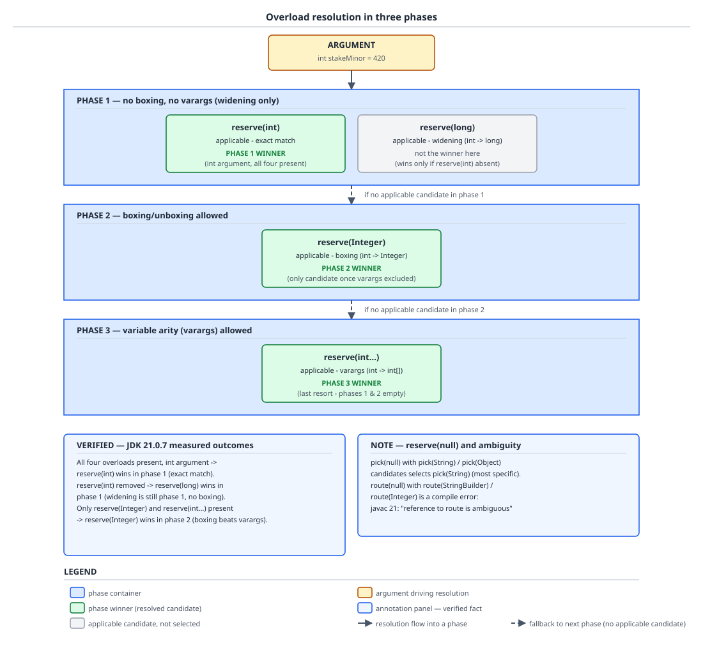

# 03 Java Core — Overload resolution and dynamic dispatch — BASICS (§1.15, 1.15.6–1.15.11)

**Target version: Java 21 LTS.** | **Part 1 of 5** | [Index](../00-index.md)
Previous: [Inheritance and overriding](01-basics.md) · Next: [Interfaces versus abstract classes](01b-interfaces.md)

Two different machines decide which method body runs when you write `reservations.reserve(stakeMinor)`. The compiler picks a *signature* — one specific overload, frozen into the class file, decided purely from the static types of the expressions you wrote. The JVM then picks a *body* — walking from that frozen signature to whatever the receiver's actual runtime class provides. Everything in this file lives at that seam. By the end you will be able to say which of `reserve(int)`, `reserve(long)`, `reserve(Integer)` or the variable-arity form wins and derive why from the JLS algorithm rather than a memorised table, explain why `reserve(null)` is a compile-time decision and sometimes a compile-time error, name which of the five invoke instructions `javac` emits for any call site you are shown (including the one that changed in Java 11), and describe why the settlement loop's rail dispatch costs more when three adapters flow through it than when one does — while keeping straight which half of that last claim is specified Java and which half is HotSpot.

## 1. Overload resolution in three phases (1.15.6, 1.15.7)

Think of `javac` facing an overload set as a hiring panel running three rounds with progressively relaxed criteria. Round one: only candidates who need no special accommodation at all. If anybody clears round one, the job is filled from round one and rounds two and three never happen. Round two runs only on a completely empty round one, and relaxes one thing: boxing and unboxing are now allowed. Round three runs only on an empty round two, and relaxes the last thing: variable-arity calls are now allowed. Within whichever round produced candidates, a tie-break runs — "most specific" — and that tie-break is a subtype-like comparison between the candidates' parameter types.

The consequence people miss is that the famous ordering — widening beats boxing beats varargs — is not a preference list the compiler consults. It is a *side effect of the round structure*. Widening lives in round one; boxing lives in round two; varargs lives in round three. A round-one candidate beats a round-two candidate not because widening is "cheaper" but because round two was never run.

### Why it exists

Java 1.0 had a single-phase resolution because there was nothing to phase: no autoboxing, no varargs. Both arrived in Java 5, and both are silent conversions that can change which method runs. Had they been folded into one flat applicability test, adding `reserve(Integer)` to a library would have been able to steal calls away from an existing `reserve(long)`, and adding a variable-arity `reserve(int[] minorAmounts)` would have been able to steal calls away from every fixed-arity overload — a source-and-binary compatibility disaster for every library on earth. The three-phase design is a backward-compatibility guarantee written into the algorithm: pre-Java-5 code resolves exactly as it did before, because pre-Java-5 code only ever needed phase 1.

### The mechanism

`[SOURCE]` JLS 21 §15.12.2 states the structure directly:

> "The first phase performs overload resolution without permitting boxing or unboxing conversion, or the use of variable arity method invocation."
> "The second phase performs overload resolution while allowing boxing and unboxing, but still precludes the use of variable arity method invocation."
> "The third phase allows overloading to be combined with variable arity methods, boxing, and unboxing."

Reading that line by line:

- **"without permitting boxing or unboxing conversion"** — phase 1 admits identity conversion, widening primitive conversion, and widening reference conversion, and nothing else. `int` to `long` is a widening primitive conversion, so it is a phase-1 citizen. `int` to `Integer` is boxing, so it is not. This single distinction is the whole of leaf 1.15.7.
- **"or the use of variable arity method invocation"** — a method declared with a variable-arity parameter is still *considered* in phase 1 and 2, but only in its fixed-arity form, that is, as if the parameter were declared as the array type it erases to. So `reserve(int[] minorAmounts)` declared variable-arity is a phase-1 candidate for the call `reserve(someIntArray)`, and is not a candidate at all in phases 1 and 2 for the call `reserve(420)`.
- **"but still precludes"** in phase 2 — the ordering between boxing and varargs is explicit, not emergent. Boxing gets its own dedicated round before varargs is even on the table.
- **"allows overloading to be combined with"** in phase 3 — the last round relaxes everything simultaneously, which is why phase-3 ambiguities are the ugliest ones to debug.

The formal sub-clause names are worth knowing verbatim because interviewers quote them: §15.12.2.2 "Identify Matching Arity Methods Applicable by Strict Invocation" (phase 1), §15.12.2.3 "Identify Matching Arity Methods Applicable by Loose Invocation" (phase 2), §15.12.2.4 "Identify Methods Applicable by Variable Arity Invocation" (phase 3), and §15.12.2.5 "Choosing the Most Specific Method" (the tie-break that runs inside whichever phase succeeded).

The conversions permitted at each phase are collectively "method invocation conversion", a context defined in JLS §5.3. Which conversions are legal in that context, and how it differs from assignment and casting contexts, is owned by [`../primitives-and-conversions/03a-promotion-boxing-and-inference.md`](../primitives-and-conversions/03a-promotion-boxing-and-inference.md) — go there for the conversion lattice; here all you need is the phase-to-conversion mapping in the table below.

| Phase | JLS clause | Identity | Widening primitive | Widening reference | Boxing / unboxing | Variable arity |
|---|---|---|---|---|---|---|
| 1 — strict | §15.12.2.2 | yes | yes | yes | no | no |
| 2 — loose | §15.12.2.3 | yes | yes | yes | yes | no |
| 3 — variable arity | §15.12.2.4 | yes | yes | yes | yes | yes |

Two properties of the algorithm matter more than the table:

1. **First non-empty phase wins outright.** There is no cross-phase comparison. A phase-1 candidate is never weighed against a phase-2 candidate.
2. **Most-specific selection is intra-phase only**, and it compares parameter types by subtyping (for reference types) and by the widening ordering (for primitives). `int` is more specific than `long` because every `int` value is method-invocation-convertible to `long` but not conversely.

**Insight:** phase 1 tolerating widening is the single fact that makes the classic puzzle non-obvious. Most engineers mentally file "phase 1 = exact match", which is wrong; phase 1 is "no boxing, no varargs", and widening is neither.



**D-043** — Follow `int stakeMinor = 420` down the vertical spine and read which candidates each phase box lists as applicable: phase 1 already lists two (`reserve(int)` and `reserve(long)`, the latter by widening), so the green winner is decided there and the two lower boxes are unreachable. The right-hand annotation panel carries the three measured runs — delete `reserve(int)` and the winner is still a phase-1 method, `reserve(long)`, not the boxing one; only when both primitive forms are gone does phase 2 fire and pick `reserve(Integer)`. The lower panel is the `null` case, with the verbatim `reference to route is ambiguous` error from the unrelated-candidates run.

### Worked example — the QuizStakes overload set

```java
public final class StakeReservationService {

    private final FundsLedger ledger;

    public StakeReservationService(FundsLedger ledger) {
        this.ledger = ledger;
    }

    String reserve(int minorAmount) {
        return "int";
    }

    String reserve(long minorAmount) {
        return "long";
    }

    String reserve(Integer minorAmount) {
        return "Integer";
    }

    // Declared in source as a variable-arity parameter; its erasure is exactly int[].
    String reserve(int[] minorAmounts) {
        return "varargs";
    }

    public static void main(String[] args) {
        StakeReservationService reservations =
                new StakeReservationService(new FundsLedger());
        int stakeMinor = 420;                       // 4.20 in minor units
        System.out.println(reservations.reserve(stakeMinor));
    }
}
```

`[PROVE]` Work the algorithm rather than recalling the answer. The call is `reserve(stakeMinor)` with the argument expression's static type being `int`, arity 1.

**Run A — all four candidates present. Measured output: `int`.**

Phase 1, matching arity, strict invocation. Candidate `reserve(int)`: `int` to `int` is the identity conversion, permitted, applicable. Candidate `reserve(long)`: `int` to `long` is a widening primitive conversion, permitted in phase 1, applicable. Candidate `reserve(Integer)`: `int` to `Integer` requires boxing, excluded from phase 1, not applicable. Candidate `reserve(int[] minorAmounts)`: in its fixed-arity form the parameter type is `int[]`, and `int` to `int[]` is no conversion at all, not applicable. Phase 1 therefore ends with a non-empty candidate set `{reserve(int), reserve(long)}`, so phases 2 and 3 never run. Most-specific selection compares `int` against `long`: `reserve(int)` can be passed to `reserve(long)` by widening but not conversely, so `reserve(int)` is strictly more specific. Selected: `reserve(int)`. Measured `int`. Derivation matches.

**Run B — `reserve(int)` deleted, the other three present, same `int` argument. Measured output: `long`.**

Phase 1 candidate set is now `{reserve(long)}` — the widening candidate survives on its own. Non-empty, so phase 2 never runs and the boxing candidate is never even examined. Single candidate, so most-specific selection is trivial. Selected: `reserve(long)`. Measured `long`. This is the run that breaks the common mental model, which predicts `Integer`.

**Run C — only `reserve(Integer)` and `reserve(int[] minorAmounts)` present, call `reserve(420)`. Measured output: `Integer`.**

Phase 1: `int` to `Integer` is boxing, excluded; `int` to `int[]` is nothing, excluded. Phase 1 empty. Phase 2, loose invocation: `int` to `Integer` is boxing, now permitted, applicable; the variable-arity method in fixed-arity form still requires `int` to `int[]`, still not applicable. Phase 2 candidate set `{reserve(Integer)}`, non-empty, so phase 3 never runs. Selected: `reserve(Integer)`. Measured `Integer`. Varargs is genuinely the last resort — it only ever wins when the first two rounds both came back empty.

Collapsing the three runs: **identity or widening (phase 1) beats boxing (phase 2) beats variable arity (phase 3)**, and the mechanism is round sequencing, not a scoring function.

**Interview:** "Given `reserve(int)`, `reserve(long)`, `reserve(Integer)` and a variable-arity `reserve` on `StakeReservationService`, what does `reserve(420)` call, and what if you delete the first one?" — `reserve(int)`, then `reserve(long)`, because widening is permitted in phase 1 and phase 2 never runs while phase 1 has any applicable candidate.

### Gotcha

The overload set above is a design defect in production code even though its resolution is well-defined. Any *future* change to the argument's static type silently relocates the call. Widen a field from `int` to `long` and every call site quietly moves from `reserve(int)` to `reserve(long)`; the code still compiles, no warning is emitted, and if the two bodies differ in behaviour — say one debits `CLIENT_BONUS_AVAILABLE` first and the other does not — you have shipped a wallet bug with a clean build. Overloading on types that are mutually convertible is the hazard; overloading on arity, or on unrelated reference types, is not.

A second edge: erasure can collapse two source-level signatures into one, so `reserve(List<Money>)` and `reserve(List<RoundId>)` do not compile as an overload pair at all. That interaction, and the bridge methods the compiler synthesises around it, belong to [`../generics/03-internals-erasure.md`](../generics/03-internals-erasure.md).

> **Overload resolution** is the compile-time selection of one method signature from an overload set, performed by running three applicability rounds in sequence — strict, then loose, then variable-arity — and applying most-specific tie-breaking inside the first round that yields any applicable candidate.

## 2. `null` at a call site (1.15.8)

`null` looks like the absence of a type, and that is exactly why it behaves surprisingly. In the resolution algorithm `null` is not typeless — it has the *null type*, which is a subtype of every reference type and of no primitive type. So a `null` argument is applicable to every reference-typed overload simultaneously, and the entire decision falls through to most-specific selection. When the candidates are related by subtyping, that works and picks the narrowest. When they are unrelated, there is no narrowest, and the program does not compile.

### Why it exists

There is no alternative that keeps the language sound. Giving `null` a single concrete type would break its assignability to every reference type. Making `null` arguments always ambiguous would break the overwhelmingly common two-candidate case of a specific type versus `Object`. Deferring the choice to runtime is impossible: the class file records one `Methodref` per call site, chosen at compile time, so there is nothing left to decide at runtime. Falling back on most-specific selection is the only rule consistent with the rest of §15.12.2.

### The mechanism

The null type is defined in JLS §4.1 as having no name, and being assignable to any reference type. In phase 1 a `null` argument satisfies every reference-typed parameter by widening reference conversion, so phase 1 typically ends with every reference-typed overload applicable at once. §15.12.2.5 then compares them pairwise: candidate A is more specific than candidate B when A's parameter type is a subtype of B's. If exactly one candidate is more specific than all the others, it is selected. If no such candidate exists, the compiler reports the invocation as ambiguous — a compile error, not a runtime one.

Two things follow that are worth stating flatly. First, primitive overloads are irrelevant: `null` is never applicable to `reserve(int)` in any phase, because no conversion takes the null type to a primitive. Second, an argument of a *variable* whose static type is a reference type behaves like any other reference argument, even if its runtime value is `null` — the value never participates. Resolution reads types, not values.

No diagram here; D-043's lower annotation panel already carries both measured `null` outcomes.

### Worked example — verdict routing

```java
public final class VerdictRouter {

    static String pick(String reference) {
        return "String";
    }

    static String pick(Object reference) {
        return "Object";
    }

    public static void main(String[] args) {
        System.out.println(pick(null));            // measured: String
        System.out.println(pick((Object) null));   // measured: Object
    }
}
```

Both candidates are applicable in phase 1. `String` is a subtype of `Object`, so `pick(String)` is strictly more specific and is selected — **measured output `String`**. The second line changes the *static type* of the argument expression to `Object` by casting, which makes `pick(String)` inapplicable (there is no implicit narrowing reference conversion in method invocation context), leaving `pick(Object)` alone — measured `Object`. The cast is the escape hatch, and it is the only one.

Now the unrelated case, on the payment-rail side of the domain:

```java
public final class DepositRouter {

    static String route(StringBuilder auditNote) {
        return "sb";
    }

    static String route(Integer minorAmount) {
        return "i";
    }

    public static void main(String[] a) {
        System.out.println(route(null));
    }
}
```

`[TRAP]` This does not compile. Verbatim `javac` 21 output:

```
NullAmbig.java:4: error: reference to route is ambiguous
    public static void main(String[] a) { System.out.println(route(null)); }
                                                             ^
  both method route(StringBuilder) in NullAmbig and method route(Integer) in NullAmbig match
1 error
```

`StringBuilder` and `Integer` are unrelated — neither is a subtype of the other — so §15.12.2.5 finds no most-specific candidate among two applicable ones. The fix is to supply the static type the compiler cannot infer: `route((Integer) null)` selects the second overload, `route((StringBuilder) null)` the first.

### Gotcha

**Pitfall:** the belief that `reserve(null)` or `route(null)` is a runtime `NullPointerException` waiting to happen. The symptom is a developer wrapping the call in a null guard, or worse, "fixing" the ambiguity error by deleting one overload and changing which method every other call site in the module resolves to. The reality: `null` at a call site is a purely compile-time selection decision. It either resolves (to the most specific reference overload) or it fails the build; it never defers anything to runtime. An NPE can of course occur *inside* the selected body when it dereferences the argument, but that is unrelated to dispatch. The fix for ambiguity is always a cast at the call site, never a change to the overload set.

> A **`null` argument** has the null type, which is a subtype of every reference type, so it is applicable to every reference-typed overload at once and the choice is made entirely by most-specific selection — resolving to the narrowest candidate when the candidates are related, and failing to compile when they are not.

## 3. Which instruction the compiler emits, and resolution versus selection (1.15.9, 1.15.10)

The class file does not contain "call the method the receiver has". It contains one invoke instruction plus a constant-pool `Methodref` naming a class, a method name and a descriptor — and that class is the *static* type of the receiver expression, fixed at compile time. The runtime's job is to walk from that static naming to the actual body. Two distinct steps do that walking, and conflating them is the single most common source of confused answers on this topic.

**Resolution** happens once per call site, the first time it executes: the JVM turns the symbolic `Methodref` into a concrete method reference, checking that the named class exists, that a method with that name and descriptor is findable by the lookup rules, and that access is permitted. **Selection** happens on every execution of `invokevirtual` and `invokeinterface`: given the resolved method and the receiver's actual runtime class, the JVM picks the most-derived override visible from that runtime class. `invokestatic`, `invokespecial` and `invokedynamic` do no selection at all — resolution alone determines what runs, which is exactly what makes them non-virtual.

### Why it exists

The alternative — recording the runtime class at the call site — is impossible, because the compiler does not and cannot know it; a `PaymentRailPort` field may hold a `CardRailAdapter` today and a `SuspenseRailAdapter` after a config change, with no recompilation. The alternative on the other side — resolving by name and descriptor on every single call — is what late-bound dynamic languages do, and it costs a hash lookup per invocation, which at 3,400 settlements per second in burst multiplied by the rails each settlement touches is not affordable. Splitting into resolve-once plus select-per-call buys both: symbolic linkage, so a subclass compiled later still gets picked up, and a per-call step cheap enough to be a table read.

### The mechanism

`javac` chooses the instruction from purely static properties of the call site.

| Instruction | Emitted for | Selection at runtime? |
|---|---|---|
| `invokestatic` | `static` methods | no |
| `invokevirtual` | instance methods whose declaring type is a class; on Java 11+ also `private` instance methods | yes |
| `invokeinterface` | instance methods invoked through an interface-typed receiver | yes |
| `invokespecial` | constructors, `super.` calls, and `private` instance methods through Java 8 | no |
| `invokedynamic` | lambda and method-reference capture, string concatenation, record `Object` methods | no (the bootstrap decides once) |

The full instruction-by-instruction treatment, including the JVMS §5.4.3.3 resolution walk, the §5.4.6 selection walk, and which linkage error each step throws, lives in [`03-internals-dispatch.md`](03-internals-dispatch.md) §3.7, which owns diagrams D-109, D-110 and D-111. Keep the table above as the recall aid and go there for the derivation.

`[BYTECODE]` The private-method case, verified on this machine by compiling one source file under three JDKs:

```java
public class DispatchProbe {
    private int reserved = 0;
    private int bump() { return ++reserved; }
    int caller() { return bump(); }
}
```

`javap -p -c` of `caller()` gives, for the instruction that performs the call:

- **JDK 21.0.7** → `1: invokevirtual #13  // Method bump:()I`
- **JDK 11.0.27** → `1: invokevirtual #3   // Method bump:()I`
- **JDK 8u202** → `1: invokespecial #3   // Method bump:()I`

Reading the JDK 21 form: offset 0 (not shown) pushes `this` with `aload_0`, because `bump()` is an instance method and every non-static invoke consumes a receiver from the operand stack. Offset 1 is `invokevirtual` against constant-pool entry `#13`, whose comment `Method bump:()I` is `javap` rendering the `Methodref` as a class-qualified name plus the descriptor `()I` — no parameters, returns `int`. The descriptor is what makes overload resolution's compile-time choice permanent: `#13` names one specific signature, and no runtime information can move the call to a different one. What runtime information *can* do is change which `bump` body that signature selects — except that here it cannot, because `private` members are not inherited and not overridable, so selection has exactly one outcome. `invokevirtual` on a private method is a virtual instruction on a provably monomorphic target.

`[VERSION-TRAP]` A call to a private instance method compiled to `invokespecial` through Java 8 and compiles to `invokevirtual` from Java 11 onward. The cause is JEP 181, nestmates: before it, private access across a nest was faked by the compiler (synthetic access bridges) and the non-virtual instruction was needed for the member to be reachable; once the JVM itself enforces nest membership via the `NestHost` and `NestMembers` attributes, `invokevirtual` works uniformly and the special case disappears. Every article asserting "private methods use `invokespecial`" is stale by three LTS releases — but interviewers who learned Java on 8 still ask for the old form, so answer with both and name the version boundary. `super.` calls and constructors do still use `invokespecial` on 21.

`[BYTECODE]` The `invokedynamic` cases, also verified on JDK 21.0.7. String concatenation:

```
invokedynamic #21,  0  // InvokeDynamic #0:makeConcatWithConstants:(Ljava/lang/String;)Ljava/lang/String;
```

bootstrapped by `REF_invokeStatic java/lang/invoke/StringConcatFactory.makeConcatWithConstants`. Reading it: the instruction carries a bootstrap-method index and the trailing `0` is a mandatory zero byte in the instruction encoding. The descriptor `(Ljava/lang/String;)Ljava/lang/String;` records the *dynamic* arguments — the one value being spliced in — while the literal text around it travels as a static bootstrap argument. The first execution calls `StringConcatFactory`, which builds a `CallSite` holding a `MethodHandle` for this exact shape; every later execution goes straight through the linked call site with no bootstrap cost. This is why concatenation is not `StringBuilder` chaining on modern JDKs and why `javap` output of concatenation-heavy code looks empty of `append` calls.

A lambda compiles to an `invokedynamic` bootstrapped by `REF_invokeStatic java/lang/invoke/LambdaMetafactory.metafactory`, with the lambda body compiled as a private method on the enclosing class, named `lambda$register$0` for a lambda inside a `register` method. Verified on 21: a lambda that touches instance state becomes a private **instance** method, referenced from the bootstrap arguments as `REF_invokeVirtual BonusService.lambda$register$0:(Ljava/lang/String;)V`; a lambda touching no instance state becomes a private **static** method, referenced as `REF_invokeStatic`. So the invoke instruction for the lambda's *creation* is `invokedynamic`, and the instruction for its *body* is whatever the capture analysis produced.

### Worked example

```java
public final class BonusService {

    private final NotificationService notifications;
    private final FundsLedger ledger;

    public BonusService(NotificationService notifications, FundsLedger ledger) {
        this.notifications = notifications;
        this.ledger = ledger;
    }

    private Money capBonus(Money deposit) {
        Money tenPercent = new Money(
                deposit.amount().movePointLeft(1), deposit.currency());
        Money ceiling = new Money(new java.math.BigDecimal("100"), deposit.currency());
        return tenPercent.amount().compareTo(ceiling.amount()) > 0 ? ceiling : tenPercent;
    }

    public void register(ClientId clientId, Money deposit, PaymentRailPort rail) {
        Money bonus = capBonus(deposit);                          // invokevirtual (Java 11+)
        String note = "DEP-301 CAPTURED bonus=" + bonus.amount(); // invokedynamic
        Runnable audit = () -> notifications.record(clientId, note); // invokedynamic
        rail.credit(clientId, bonus);                             // invokeinterface
        Money.zero(deposit.currency());                           // invokestatic
        audit.run();                                              // invokeinterface
    }
}
```

Six call sites, four instructions. `capBonus` is private and instance, so `invokevirtual` on 21 and `invokespecial` had this been compiled on 8. The concatenation is `invokedynamic` into `StringConcatFactory`. The lambda captures `this` through `notifications`, so it becomes a private instance method and its creation is `invokedynamic` into `LambdaMetafactory`. `rail.credit` has an interface-typed receiver, so `invokeinterface`; the static factory is `invokestatic`. A `super`-delegating constructor chain, had one been present, would have been `invokespecial`.

### Gotcha

**Pitfall:** reading a stack trace or a `javap` listing and concluding the *declaring class in the `Methodref` comment* is the class whose body ran. It is not — it is the static type at the call site. A `Methodref` naming `PaymentRailPort.credit` executes `BankRailAdapter.credit` whenever that is the receiver's runtime class. The symptom is chasing a bug in the wrong file, typically an abstract class or interface with no body at all. The fix is to read the *stack trace* frames, which name runtime classes, rather than inferring from the call site's descriptor. Frame reading and the linkage errors that surface when resolution and selection disagree — `AbstractMethodError`, `NoSuchMethodError`, `IncompatibleClassChangeError` — are covered in [`03-internals-dispatch.md`](03-internals-dispatch.md).

> **Resolution** is the one-time, per-call-site act of turning a symbolic `Methodref` into a concrete method under the static type named in the class file; **selection** is the per-invocation act, performed only by `invokevirtual` and `invokeinterface`, of choosing the most-derived override visible from the receiver's actual runtime class.

## 4. Call-site shape decides the cost (1.15.11)

Every claim in this concept is **HotSpot behaviour, not language semantics.** Nothing below is guaranteed by the JLS or the JVMS; a conforming JVM may implement identical semantics with entirely different costs.

A virtual call site is not intrinsically expensive or cheap. Its cost is a function of how many distinct receiver classes have actually flowed through *that specific bytecode index* during this run. The JIT profiles that population and compiles accordingly. One class seen: it can emit a class check plus a direct call, and inline the body outright. Two classes: it can emit two checks and two direct calls. Many classes: it gives up on speculation and falls back to a genuine table-driven indirect call, which cannot be inlined, which in turn blocks every optimisation that inlining would have unlocked downstream.

This is why the settlement loop is the interesting call site in QuizStakes and the deposit path is not. Stake settlements run 2.8M/day with 3,400/sec bursts, all through one `rail.settle` call. If that line only ever sees `CardRailAdapter`, it is effectively a direct call. Once `BankRailAdapter` and `SuspenseRailAdapter` start flowing through the same line, the same source code gets slower without a single character changing.

### Why it exists

Pure table dispatch on every virtual call is correct and predictable but blocks inlining, and inlining is the enabling optimisation for nearly everything else a JIT does. Pure static binding is fast but wrong for a polymorphic language. Profile-guided speculation resolves the tension: assume what the profile says, guard the assumption with a cheap class check, and keep a correct slow path for when the guard fails. The cost is a deoptimisation cliff — a call site that was monomorphic for an hour and then meets a second class must be recompiled, and the code cached for it thrown away.

### The mechanism

`[RESEARCH]` The specification boundary first, because it is the point of the section. **The words "vtable" and "itable" appear nowhere in the JVMS.** The JVMS specifies method resolution (§5.4.3.3) and method selection (§5.4.6) as *semantics* — which method must end up running — and says nothing about the data structure used to get there. The per-class array of method pointers indexed by `invokevirtual`, the interface method tables scanned by `invokeinterface`, the slot indices, and the entire inline-cache machinery are HotSpot implementation details, version-sensitive, and replaceable. State it that way in an interview: a candidate who says "`invokevirtual` is a vtable index" as though it were a language guarantee has learned a HotSpot fact and mislabelled it; a candidate who can name which half is specified is the stronger one.

`[X-REF 06]` With that boundary drawn, the HotSpot mechanism in one paragraph. Each loaded class carries a table of method entries laid out so that an override occupies the same slot as the method it overrides, which lets `invokevirtual` become a fixed-offset read from the receiver's class metadata followed by an indirect branch — the slot offset is known at resolution time and never changes. Interface dispatch cannot use that trick, because a class implements several interfaces and no single consistent numbering exists across them, so `invokeinterface` consults a per-class set of interface tables and finds the entry for the resolved interface before indexing within it, which is structurally more work than the class case. Above that, the JIT maintains a per-call-site inline cache recording the receiver classes observed by the interpreter and by earlier tiers, and compiles the site as a guarded direct call, a small chain of guarded direct calls, or an unspeculated table call according to how many distinct classes that profile holds. GC, the JIT compilation tiers, deoptimisation and class loading are owned by guide 06 (JVM internals); the table layouts and the source walk are owned by [`03-internals-dispatch.md`](03-internals-dispatch.md), which carries D-110 and D-111 for this mechanism.

| Call-site shape | Receiver classes seen at that bytecode index | HotSpot's typical strategy | Inlining |
|---|---|---|---|
| Monomorphic | 1 | guarded direct call — class check, then a direct call | yes, freely |
| Bimorphic | 2 | two guarded direct calls | often, both branches |
| Megamorphic | many | table-driven indirect call, speculation abandoned | no |

**Unverified:** the exact receiver-count threshold at which HotSpot 21 abandons speculation, the precise devirtualisation heuristics, and any nanosecond figure for `invokeinterface` versus `invokevirtual` are not confirmed here. Parked in `## Open questions`.

### Worked example — the rail family

```java
public sealed interface PaymentRailPort
        permits CardRailAdapter, BankRailAdapter, SuspenseRailAdapter {

    void settle(RoundId roundId, Money amount);
}

public final class CardRailAdapter implements PaymentRailPort {
    private final FundsLedger ledger;
    public CardRailAdapter(FundsLedger ledger) { this.ledger = ledger; }
    @Override public void settle(RoundId roundId, Money amount) {
        ledger.post(roundId, "PSP_RECEIVABLE", amount);
    }
}

public final class BankRailAdapter implements PaymentRailPort {
    private final FundsLedger ledger;
    public BankRailAdapter(FundsLedger ledger) { this.ledger = ledger; }
    @Override public void settle(RoundId roundId, Money amount) {
        ledger.post(roundId, "BANK_SETTLEMENT", amount);
    }
}

public final class SuspenseRailAdapter implements PaymentRailPort {
    private final FundsLedger ledger;
    public SuspenseRailAdapter(FundsLedger ledger) { this.ledger = ledger; }
    @Override public void settle(RoundId roundId, Money amount) {
        ledger.post(roundId, "SUSPENSE", amount);
    }
}

public final class SettlementLoop {

    private final FundsLedger ledger;

    public SettlementLoop(FundsLedger ledger) { this.ledger = ledger; }

    // One bytecode index for rail.settle. Its shape is decided by what flows here.
    public void drain(java.util.List<Reservation> batch,
                      java.util.function.Function<Reservation, PaymentRailPort> router) {
        for (Reservation reservation : batch) {
            PaymentRailPort rail = router.apply(reservation);
            rail.settle(reservation.roundId(), reservation.amount());
        }
    }
}
```

The `rail.settle` call compiles to a single `invokeinterface` at a single bytecode index. Deploy with card-only routing and that index is monomorphic: HotSpot can guard on `CardRailAdapter` and inline the `ledger.post` body straight into the loop. Enable bank settlement and the same index becomes bimorphic. Route the unmatched tail into suspense as well and it is three-way, heading for the unspeculated path — at 2.8M settlements a day through this one line, that is where the cost lands.

The escape hatch, and its price: split the call site. Partition the batch by rail before draining, so each partition runs its own copy of the loop and each copy sees one receiver class.

```java
public void drainPartitioned(java.util.List<Reservation> batch,
                             java.util.function.Function<Reservation, PaymentRailPort> router) {
    java.util.Map<Class<?>, java.util.List<Reservation>> byRail =
            new java.util.LinkedHashMap<>();
    for (Reservation reservation : batch) {
        byRail.computeIfAbsent(router.apply(reservation).getClass(),
                key -> new java.util.ArrayList<>()).add(reservation);
    }
    for (java.util.List<Reservation> partition : byRail.values()) {
        drain(partition, router);   // each inlined copy sees one receiver class
    }
}
```

The cost is real: a map allocation and a full extra pass per batch, plus ordering that is now grouped rather than arrival-ordered, which matters if downstream posting order is load-bearing for the `Ledger`. Do this only with a profiler pointing at that call site, never speculatively.

**Insight:** the shape belongs to the *call site*, not to the interface. `PaymentRailPort` having three implementations does not make every call through it megamorphic. A call site inside `CardPayments` that only ever holds a `CardRailAdapter` stays monomorphic and fully inlined however many siblings that interface has elsewhere in the process. This is why "an interface with one implementation is free" is really "a call site with one receiver class is free" — and why adding a second implementation for testability can measurably slow production code if the test double flows through the same hot line.

### Gotcha

**Pitfall:** reaching for `final` on the class or the method to make a hot call faster. The symptom is a diff full of `final` keywords and a benchmark that does not move. In HotSpot, a monomorphic call site has already been devirtualised by profile-guided speculation, so the keyword adds no information the JIT lacked; and a genuinely megamorphic site is megamorphic *because* several classes flow through it, which `final` cannot change. `final` earns its place as a design constraint — it forbids subclassing, which is a correctness and API-evolution property — not as an optimisation. Label this as a HotSpot claim when you say it: on a different JVM without profile-guided devirtualisation, `final` could well matter. The measurement that does move the needle is reducing the receiver population at the specific hot bytecode index, as `drainPartitioned` does.

> A **call site's shape** — monomorphic, bimorphic or megamorphic — is the count of distinct receiver classes HotSpot has profiled at that one bytecode index, and it governs whether the JIT can speculate and inline; it is a HotSpot property of the site, not a specified property of the language or of the interface being called.

## Supporting facts

### Records and `invokedynamic` (1.15.10)

A record's generated `equals`, `hashCode` and `toString` are not written out field by field by `javac`. Each is a small method whose body is a single `invokedynamic` bootstrapped by `java.lang.runtime.ObjectMethods.bootstrap`, which spins the actual implementation at first use from the record's component list. Consequence for reading bytecode: a `record Money(BigDecimal amount, Currency currency)` shows three tiny methods with one `invokedynamic` each, and nothing that looks like field comparison. Consequence for dispatch: these are still ordinary virtual methods to callers — `invokevirtual` on `Object.equals` selects the record's override normally. Only the *body* is dynamically linked.

### Most-specific selection also runs when both candidates are applicable in phase 3 (1.15.6)

Phase 3 admits variable-arity candidates, and two of them can both be applicable — for example a variable-arity `post(String position, Money[] amounts)` and a variable-arity `post(String position, Object[] values)`, both declared with variable-arity parameters. §15.12.2.5 still applies, comparing the element types, and `Money[]` being a subtype of `Object[]` makes the first more specific. Phase-3 ambiguity errors are the same error as the `null` case, arising from the same clause; they just take longer to reach.

## Pitfalls

### Deleting the exact-match overload drops the call to the boxing overload

**Wrong**

```java
public final class StakeReservationService {
    // reserve(int) has been deleted in this revision.
    String reserve(long minorAmount)    { return "long"; }
    String reserve(Integer minorAmount) { return "Integer"; }
    String reserve(int[] minorAmounts)  { return "varargs"; }

    public static void main(String[] args) {
        int stakeMinor = 420;
        System.out.println(new StakeReservationService().reserve(stakeMinor));
        // expected by the belief: Integer      measured: long
    }
}
```

The surprise is that the boxing overload is never even examined. Measured output is `long`. Phase 1 excludes boxing but *includes* widening primitive conversion, so `reserve(long)` is applicable in phase 1; phase 1 is therefore non-empty and phase 2 never runs. Run B in the evidence above is exactly this program.

**Right**

```java
public final class StakeReservationService {
    String reserve(long minorAmount)    { return "long"; }
    String reserve(Integer minorAmount) { return "Integer"; }
    String reserve(int[] minorAmounts)  { return "varargs"; }

    public static void main(String[] args) {
        int stakeMinor = 420;
        System.out.println(
                new StakeReservationService().reserve(Integer.valueOf(stakeMinor)));
        // measured: Integer
    }
}
```

Boxing at the call site makes the argument's static type `Integer`, so `reserve(Integer)` wins by identity in phase 1 and `reserve(long)` is inapplicable (there is no conversion from `Integer` to `long` in one step in method invocation context). The choice is made by changing the static type, which is the only lever the caller has.

**Why people believe it:** "phase 1 = exact match" is a tidy and almost-right summary that everyone forms early, and it gives the right answer for every call site where the exact overload exists — which is most of them. The model only breaks on the removal case, which is rare enough to never get corrected.

### `reserve(null)` is a runtime NullPointerException

**Wrong**

```java
public final class DepositRouter {
    static String route(StringBuilder auditNote) { return "sb"; }
    static String route(Integer minorAmount)     { return "i"; }

    public static void main(String[] a) {
        System.out.println(route(null));   // expected: compiles, maybe NPEs at runtime
    }
}
```

There is no runtime. The build fails, with the measured `javac` 21 message `error: reference to route is ambiguous` naming both `route(StringBuilder)` and `route(Integer)` as matches. `StringBuilder` and `Integer` are unrelated, so §15.12.2.5 finds no most-specific candidate.

**Right**

```java
public final class DepositRouter {
    static String route(StringBuilder auditNote) { return "sb"; }
    static String route(Integer minorAmount)     { return "i"; }

    public static void main(String[] a) {
        System.out.println(route((Integer) null));   // measured: i
    }
}
```

The cast supplies a static type, which makes exactly one candidate applicable. Note the other half of the same belief is also wrong: `null` is *not* always ambiguous — with `pick(String)` and `pick(Object)` it resolves cleanly to `pick(String)`, because those two are related by subtyping.

**Why people believe it:** `null` is associated with runtime failure in every other context in the language, so the instinct is to file this under NPE rather than under compile-time type analysis.

### Private methods compile to `invokespecial`

**Wrong**

```java
public class DispatchProbe {
    private int reserved = 0;
    private int bump() { return ++reserved; }
    int caller() { return bump(); }   // believed: invokespecial
}
```

Measured `javap -p -c` output for the call in `caller()`: `invokevirtual #13  // Method bump:()I` on JDK 21.0.7, and `invokevirtual #3` on JDK 11.0.27. The belief holds only on JDK 8u202 and earlier, where the same source gives `invokespecial #3`.

**Right**

State it with the version boundary: private instance methods compiled to `invokespecial` through Java 8 and compile to `invokevirtual` from Java 11 onward, because JEP 181 nestmates moved nest-access enforcement into the JVM and removed the need for the non-virtual instruction. `super.` calls and constructors still use `invokespecial` on 21.

The reason the change is safe is that `private` members are neither inherited nor overridable, so selection under `invokevirtual` has exactly one possible outcome — the instruction is virtual in form and monomorphic in fact.

**Why people believe it:** it was true, it was true for a long time, and it is still the answer in most books and blog posts. It is also the mnemonic version — "the three non-virtual things are constructors, `super.`, and `private`" — which is memorable precisely because it is now one item too long.

### `final` on the class or the method makes the hot call faster

**Wrong**

```java
public final class CardRailAdapter implements PaymentRailPort {
    private final FundsLedger ledger;
    public CardRailAdapter(FundsLedger ledger) { this.ledger = ledger; }
    // final added in the hope of speeding up SettlementLoop.drain
    @Override public final void settle(RoundId roundId, Money amount) {
        ledger.post(roundId, "PSP_RECEIVABLE", amount);
    }
}
```

The `rail.settle` call site in `drain` still emits `invokeinterface` — `final` on the implementation cannot change the instruction, because the instruction is chosen from the *receiver expression's static type*, which is the interface. And if that site was already monomorphic, HotSpot had already devirtualised it from the profile, so there was nothing for the keyword to contribute.

**Right**

```java
// Reduce the receiver population at the hot bytecode index instead.
public void drainPartitioned(java.util.List<Reservation> batch,
                             java.util.function.Function<Reservation, PaymentRailPort> router) {
    java.util.Map<Class<?>, java.util.List<Reservation>> byRail =
            new java.util.LinkedHashMap<>();
    for (Reservation reservation : batch) {
        byRail.computeIfAbsent(router.apply(reservation).getClass(),
                key -> new java.util.ArrayList<>()).add(reservation);
    }
    for (java.util.List<Reservation> partition : byRail.values()) {
        drain(partition, router);
    }
}
```

Each inlined copy of `drain` now sees one receiver class, which is the property the JIT actually speculates on. The price is a map allocation, an extra pass, and grouped rather than arrival-ordered posting — pay it only with a profiler pointing at that site. Both the claim and the fix are HotSpot claims, not language guarantees.

**Why people believe it:** `final` genuinely does enable devirtualisation in ahead-of-time-compiled languages, and older JVMs benefited more from it. The advice was once sound and has outlived its mechanism.

### `invokevirtual` is a vtable index — that is how Java works

**Wrong**

Stated in an interview as a language fact: "`invokevirtual` looks up slot *n* in the receiver's vtable, and `invokeinterface` scans the itable." Presented that way it is a mislabelled claim. The JVMS specifies method resolution (§5.4.3.3) and method selection (§5.4.6) as semantics — which method must run — and the words "vtable" and "itable" appear nowhere in it.

**Right**

Split the answer. The specified part: `invokevirtual` resolves a `Methodref` under the static type, then selects the most-derived override visible from the receiver's runtime class, and `invokeinterface` does the same through an interface type. The implementation part: HotSpot realises that selection with per-class method tables laid out so overrides share a slot with the method they override, plus per-interface tables for the interface case, plus per-call-site inline caches — all version-sensitive and all replaceable by a conforming JVM.

**Why people believe it:** it is how HotSpot works, it is what every JVM-internals talk shows, and the distinction between "the spec requires this" and "the dominant implementation does this" is not something the material usually flags. Naming the boundary is the differentiator.

## Cheat sheet

| Item | Answer |
|---|---|
| Phase order | 1 strict (§15.12.2.2) → 2 loose (§15.12.2.3) → 3 variable arity (§15.12.2.4); tie-break §15.12.2.5 |
| Phase 1 allows | identity, widening primitive, widening reference |
| Phase 1 forbids | boxing, unboxing, variable arity |
| Phase 2 adds | boxing and unboxing; variable arity still excluded |
| Phase 3 adds | variable arity |
| Cross-phase rule | first non-empty phase wins outright; no cross-phase comparison |
| Effective precedence | identity or widening > boxing > variable arity |
| Run A (`int`, all four present) | `int` |
| Run B (`int`, no `reserve(int)`) | `long` — widening is phase 1 |
| Run C (only `Integer` and variable arity) | `Integer` — phase 2 wins, phase 3 never runs |
| `null` type | null type, subtype of every reference type, of no primitive |
| `null`, related candidates | most specific wins (`pick(String)` over `pick(Object)`) |
| `null`, unrelated candidates | compile error `reference to route is ambiguous`; fix with a cast |
| `static` method | `invokestatic` |
| Instance method, class-typed receiver | `invokevirtual` |
| Instance method, interface-typed receiver | `invokeinterface` |
| Constructor, `super.` | `invokespecial` |
| Private instance method, Java 8 and earlier | `invokespecial` |
| Private instance method, Java 11 and later | `invokevirtual` (JEP 181 nestmates) |
| Lambda or method reference creation | `invokedynamic` via `LambdaMetafactory.metafactory` |
| String concatenation | `invokedynamic` via `StringConcatFactory.makeConcatWithConstants` |
| Record `equals`/`hashCode`/`toString` body | `invokedynamic` via `ObjectMethods.bootstrap` |
| Capturing lambda body | private instance method, `REF_invokeVirtual` |
| Non-capturing lambda body | private static method, `REF_invokeStatic` |
| Non-capturing lambda identity | same instance every evaluation (constant `CallSite`) — measured `true` |
| Capturing lambda identity | new instance per evaluation — measured `false` |
| Lambda class name shape | `LambdaId$$Lambda/0x00000003010009f8`, `isHidden()` is `true` |
| Resolution | once per call site, symbolic to concrete, under the static type |
| Selection | per invocation, `invokevirtual` and `invokeinterface` only, on the runtime class |
| Specified by JVMS | resolution §5.4.3.3, selection §5.4.6 — semantics only |
| NOT in the JVMS | "vtable", "itable", slot indices, inline caches — HotSpot detail |
| Monomorphic site | 1 receiver class, guarded direct call, inlines |
| Bimorphic site | 2 receiver classes, two guarded direct calls, often inlines |
| Megamorphic site | many receiver classes, table call, does not inline |
| Call-site shape belongs to | the bytecode index, not the interface |
| `final` for speed | no measurable gain in HotSpot; monomorphic sites already devirtualised |

## Self-test

**Q1.** `StakeReservationService` declares `reserve(long)`, `reserve(Integer)` and a variable-arity `reserve` erasing to `int[]`. What does `reserve(420)` print, and derive it.

<details><summary>Answer</summary>

It prints `long`. Phase 1 permits identity, widening primitive and widening reference conversion, and excludes boxing and variable arity. `int` to `long` is a widening primitive conversion, so `reserve(long)` is applicable in phase 1. `int` to `Integer` needs boxing, excluded from phase 1. The variable-arity method in fixed-arity form takes `int[]`, and `int` to `int[]` is no conversion, so it is not applicable either. Phase 1 therefore ends non-empty with a single candidate, which means phase 2 never runs and the `Integer` overload is never examined. Most-specific selection over one candidate is trivial. Measured on JDK 21.0.7: `long`.

</details>

**Q2.** Why is "widening beats boxing beats varargs" a bad way to describe the rule, even though it gives the right answer?

<details><summary>Answer</summary>

Because it implies the compiler builds one candidate set and ranks it by conversion cost, which is not what happens. The compiler runs three independent applicability rounds in sequence, and the first round that yields any applicable candidate is the only round that matters — later rounds are not run at all. So a widening candidate does not out-score a boxing candidate; the boxing candidate is never considered. The distinction is testable: if you believe in a scoring function you will predict that most-specific selection can compare a phase-1 candidate against a phase-3 candidate, and it never can. Getting the structure right is also what lets you answer the removal question in Q1 without memorising it.

</details>

**Q3.** `route(StringBuilder)` and `route(Integer)` both exist. What happens at `route(null)`, and what happens if you replace `StringBuilder` with `Object`?

<details><summary>Answer</summary>

With `StringBuilder` and `Integer` it does not compile. Measured `javac` 21 output: `error: reference to route is ambiguous`, followed by `both method route(StringBuilder) in NullAmbig and method route(Integer) in NullAmbig match`. `null` has the null type, a subtype of every reference type, so both overloads are applicable; the two parameter types are unrelated, so §15.12.2.5 finds no most-specific candidate. Replace `StringBuilder` with `Object` and it compiles and selects `route(Integer)`, because `Integer` is a subtype of `Object` and is therefore strictly more specific. The fix in the unrelated case is a cast at the call site: `route((Integer) null)`. Nothing here happens at runtime — this is entirely a compile-time selection decision.

</details>

**Q4.** Which invoke instruction does a call to a private instance method compile to? Answer for an interviewer who learned Java on 8.

<details><summary>Answer</summary>

Both answers, with the boundary named. Through Java 8, `invokespecial`; from Java 11 onward, `invokevirtual`. Verified on this machine by compiling the same `DispatchProbe` source under three JDKs and reading `javap -p -c`: JDK 8u202 emits `invokespecial #3  // Method bump:()I`, JDK 11.0.27 and JDK 21.0.7 both emit `invokevirtual`. The cause is JEP 181, nestmates: before it, private access within a nest relied on compiler-synthesised bridges and needed the non-virtual instruction to be reachable; once the JVM enforces nest membership itself through the `NestHost` and `NestMembers` attributes, `invokevirtual` works uniformly. The change is semantically safe because private members are neither inherited nor overridable, so selection under `invokevirtual` has exactly one possible outcome. Constructors and `super.` calls still use `invokespecial` on 21.

</details>

**Q5.** Distinguish resolution from selection, and say which instructions do which.

<details><summary>Answer</summary>

Resolution (JVMS §5.4.3.3) happens once per call site, on first execution: the symbolic `Methodref` in the constant pool — which names the *static* type of the receiver expression, a method name and a descriptor — is turned into a concrete method, with existence and access checks. Selection (JVMS §5.4.6) happens on every execution, and only for `invokevirtual` and `invokeinterface`: given the resolved method and the receiver's actual runtime class, the JVM picks the most-derived override visible from that class. `invokestatic`, `invokespecial` and `invokedynamic` perform no selection — resolution (or, for `invokedynamic`, the one-time bootstrap that produces a linked `CallSite`) fully determines what runs, which is precisely what makes those three non-virtual. The practical consequence: the class named in a `javap` comment is the static type, not the class whose body ran, so read stack-trace frames rather than call-site descriptors when locating a body.

</details>

**Q6.** An interface has twenty implementations. Is every call through it megamorphic?

<details><summary>Answer</summary>

No. The shape is a property of the individual call site — one specific bytecode index — not of the interface. HotSpot profiles which receiver classes actually flow through that index. A call site inside `CardPayments` that only ever holds a `CardRailAdapter` is monomorphic and fully inlinable however many siblings `PaymentRailPort` has elsewhere in the process. Conversely, a single call site can be megamorphic on an interface with only three implementations if all three flow through it, which is the `SettlementLoop.drain` case: one `rail.settle` line taking 2.8M settlements a day across card, bank and suspense rails. This also explains a real regression pattern: adding a test double that flows through the same hot line as production receivers can measurably slow production code. All of this is HotSpot behaviour, not specified semantics.

</details>

**Q7.** How much faster is a call after you add `final` to the method?

<details><summary>Answer</summary>

In HotSpot, not measurably, in either direction. A monomorphic call site has already been devirtualised by profile-guided speculation — the JIT emits a class guard plus a direct call and inlines the body — so `final` supplies no information the compiler lacked. A megamorphic site is megamorphic because several receiver classes genuinely flow through it, which `final` cannot change; and if the receiver expression is interface-typed, `final` on an implementation does not even change the emitted instruction, which stays `invokeinterface`. `final` is worth using as a design constraint, because it forbids subclassing and constrains API evolution, not as an optimisation. Two caveats to state alongside: this is a HotSpot claim, not a language guarantee, so a JVM without profile-guided devirtualisation could behave differently; and the intervention that does help is reducing the receiver population at the specific hot bytecode index, for instance by partitioning the batch so each inlined copy of the loop sees one rail.

</details>

**Q8.** You see `invokedynamic` three times in one small method's bytecode. What are the likely causes on Java 21?

<details><summary>Answer</summary>

String concatenation, lambda or method-reference creation, and — if the method is a record's generated `equals`, `hashCode` or `toString` — the record `Object`-method bootstrap. Verified bootstraps on JDK 21.0.7: concatenation goes through `REF_invokeStatic java/lang/invoke/StringConcatFactory.makeConcatWithConstants`, with the instruction rendered by `javap` as `invokedynamic #21,  0  // InvokeDynamic #0:makeConcatWithConstants:(Ljava/lang/String;)Ljava/lang/String;`; a lambda goes through `REF_invokeStatic java/lang/invoke/LambdaMetafactory.metafactory`, with the lambda body compiled as a private method named after the enclosing method, such as `lambda$register$0`; record `Object` methods go through `java.lang.runtime.ObjectMethods.bootstrap`. In all three cases the bootstrap runs once and links a `CallSite`, after which the site is a direct handle invocation. A related measured detail: a non-capturing lambda's `CallSite` is a constant, so `nonCapturing() == nonCapturing()` is `true`, while `capturing("DEP-301") == capturing("DEP-301")` is `false`, and the generated class is hidden — `getClass().getName()` gives `LambdaId$$Lambda/0x00000003010009f8` and `isHidden()` is `true`.

</details>

## Open questions

- **Unverified:** the exact number of distinct receiver classes at which HotSpot 21 stops speculating at a call site and falls back to an unspeculated table call. Settled by reading `src/hotspot/share/ci` and the type-profile handling in `src/hotspot/share/opto` in the OpenJDK 21 source, which `03-internals-dispatch.md` owns.
- **Unverified:** the precise devirtualisation and bimorphic-inlining heuristics the C2 compiler applies, including how profile pollution from earlier tiers is weighed. Settled by the same OpenJDK 21 source, or by `-XX:+PrintInlining` output on a controlled benchmark.
- **Unverified:** any nanosecond-level cost difference between `invokeinterface` and `invokevirtual` on JDK 21. Not measured here, and it is not meaningfully a single number — it depends on call-site shape, so it would need a JMH harness with receiver population as a parameter.

---

**Leaves covered:** 1.15.6, 1.15.7, 1.15.8, 1.15.9, 1.15.10, 1.15.11 (6 leaves)
**Leaves deferred:** none
**Diagrams included:** D-043
**Target version:** Java 21 LTS
**Lines:** 670
