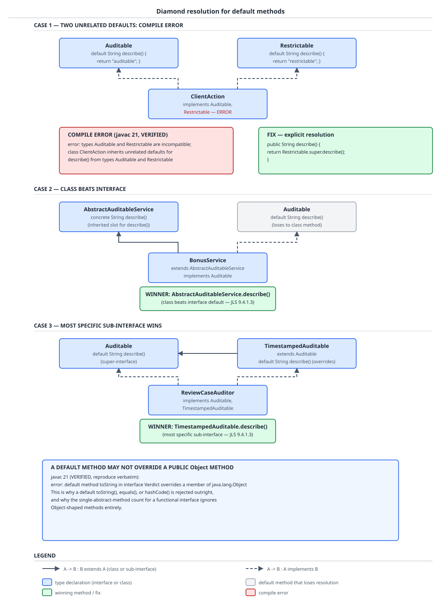

# 03 Java Core — Interfaces versus abstract classes — BASICS (§1.16, 1.16.1–1.16.12)

**Target version: Java 21 LTS.** | **Part 1 of 5** | [Index](../00-index.md)
Previous: [Overload resolution and dynamic dispatch](01a-overload-resolution-and-dispatch.md) · Next: [Nested, inner, local and anonymous classes](02-nested-classes.md)

An interface is a promise about *what a type can do*; an abstract class is a partly-built *thing*. That one distinction is the whole file, and every rule below is a consequence of it: a promise carries no state, so it needs no constructor and can be made by many types at once; a partly-built thing owns fields, so it must be initialised, so it can have exactly one parent. By the end you will be able to fill in the interface-versus-abstract-class table from first principles rather than memory, state the three diamond precedence rules and derive why the unrelated-defaults case is a compile error while the sub-interface case is silent, explain from the "class beats interface" rule alone why the compiler rejects a `default toString()`, and argue — with a measured `AbstractMethodError` — why adding one abstract method to a published interface is a production incident waiting for the one code path nobody smoke-tested.

## 1. Interface or abstract class (1.16.1, 1.16.11)

Picture the QuizStakes payment layer. `PaymentRailPort` says "whatever you are, you can authorise and refund a movement of money" — card, bank transfer, an in-memory test double, a legacy adapter that already extends a vendor base class. That is a *capability contract*, and it must be joinable by types that already have a parent, so it has to be an interface. `AbstractRailAdapter` says "you are a rail adapter, you hold an idempotency store and a retry budget, and you run authorise-then-capture in that order with these hooks" — that is *shared state plus a template lifecycle*, so it has to be a class. `Verdict` says "the set of possible decisions is exactly these four and no more" — a closed set, which is a sealed interface with records under it.

### Why it exists

Java has single class inheritance because a class carries fields, and a field inherited along two paths would need two initialisations and one storage slot — the classic C++ diamond-of-state problem, solved there by virtual inheritance and solved in Java by simply forbidding it. But single inheritance alone leaves no way to say "these unrelated types share a capability", which is exactly what polymorphic dispatch needs. The interface is the answer: multiple inheritance restricted to the part that is safe to inherit multiply, because it has no storage.

### The mechanism

Read the table as one causal chain, not nine independent facts. No instance fields → no per-instance storage to initialise → no constructor → no `new` on the type itself → nothing to protect from concurrent partial initialisation → so multiple inheritance is safe. Reverse it for the abstract class: it has fields, so it has a constructor, so it participates in the single-parent chain, so a subclass can have exactly one.

**D-047** — Interface versus abstract class versus sealed interface plus records.

| | Interface | Abstract class | Sealed interface + records |
|---|---|---|---|
| Multiple inheritance | Yes, unlimited: `CardRailAdapter implements PaymentRailPort, RestrictionPort, AutoCloseable` | No — one superclass only, so `CardRailAdapter extends AbstractRailAdapter` and nothing else | Yes for the interface; each permitted record still has one superclass (`java.lang.Record`) |
| Instance state | None. No instance fields are declarable | Yes: `AbstractRailAdapter` holds a `Map<IdempotencyKey, PaymentIntent>` and an `int retryBudget` | Yes, but only as final record components: `DocumentVerdict(Outcome outcome, String reason)` |
| Constructors | None. `RestrictionPort` cannot declare one | Yes, `protected`, invoked by the subclass via an explicit superclass constructor call | The canonical record constructor, generated, validated in a compact constructor |
| Method bodies | `default`, `static`, `private`, `private static` may have bodies; plain methods may not | Any method may have a body; `abstract` methods may not | Interface may carry `default`/`static`; each record supplies its own bodies |
| Allowed member access | `public` (implicit or explicit), plus `private` for helper methods since Java 9. No `protected`, no package-private | All four: `public`, `protected`, package-private, `private` | Interface as for interface; record members as for a final class |
| Fields | Implicitly `public static final` constants only — `RestrictionPort.ALL_BLOCKED_KEY` | Instance fields, static fields, mutable or final, any access | Final components plus static constants; no mutable instance fields |
| Instantiation | Never directly; only an implementing class, lambda (if functional), or anonymous class | Never directly; only a concrete subclass | The interface never; each permitted record freely |
| Evolution cost | Adding an `abstract` method breaks every existing implementor at runtime; adding a `default` method does not | Adding a concrete method is source- and binary-compatible; adding an `abstract` method breaks subclasses | Adding a permitted subtype breaks every exhaustive `switch` over it at compile time — a *compile* error, which is the point |
| When to choose | A capability contract joined by types you do not own or cannot reparent: `RestrictionPort` | Shared state or a fixed lifecycle you want subclasses to slot into: `AbstractRailAdapter` | A closed, known set of alternatives you want to pattern-match exhaustively: `Verdict` |

The sealed-interface column deserves its one paragraph of mechanism. `sealed interface Verdict permits DocumentVerdict, ScreeningVerdict, ReviewVerdict, WealthVerdict` compiles a `PermittedSubclasses` attribute into `Verdict.class`; the compiler rejects any other type that tries to implement it, and — because the compiler now knows the full set — a `switch` over a `Verdict` with one case per permitted type needs no `default` branch and becomes a *total* function. That converts "did I handle every decision type" from a code-review question into a compile error. Sealed interfaces arrived in **Java 17** (JEP 409, previewed in 15 and 16); records in **Java 16** (JEP 395, previewed in 14 and 15). The full treatment lives in [records and sealed types](../records-and-sealed/01-basics.md).

The skeletal implementation is the combination rather than a fourth option: publish `PaymentRailPort` as the interface everyone codes against, ship `AbstractRailAdapter implements PaymentRailPort` as an optional convenience carrying the idempotency map and the retry loop, and let an implementor who already has a superclass ignore the abstract class and implement the interface directly. That is exactly what `AbstractList`, `AbstractMap` and `AbstractSet` are, and guide 02 (Java Collections) owns their internals.

```java
public interface PaymentRailPort {
    PaymentIntent authorise(AccountId accountId, Money amount, IdempotencyKey key);
    void refund(IdempotencyKey key, Money amount);

    default boolean supports(Money amount) {
        return amount.amount().signum() > 0;
    }
}

public abstract class AbstractRailAdapter implements PaymentRailPort {
    private final Map<IdempotencyKey, PaymentIntent> seen = new ConcurrentHashMap<>();
    private final int retryBudget;

    protected AbstractRailAdapter(int retryBudget) {
        if (retryBudget < 0) {
            throw new IllegalArgumentException("retryBudget must be non-negative");
        }
        this.retryBudget = retryBudget;
    }

    @Override
    public final PaymentIntent authorise(AccountId accountId, Money amount, IdempotencyKey key) {
        PaymentIntent replay = seen.get(key);
        if (replay != null) {
            return replay;
        }
        RuntimeException last = null;
        for (int attempt = 0; attempt <= retryBudget; attempt++) {
            try {
                PaymentIntent intent = sendAuthorisation(accountId, amount, key);
                seen.put(key, intent);
                return intent;
            } catch (RestrictedActionException fatal) {
                throw fatal;
            } catch (RuntimeException transientFailure) {
                last = transientFailure;
            }
        }
        throw last;
    }

    protected abstract PaymentIntent sendAuthorisation(AccountId accountId, Money amount, IdempotencyKey key);
}

public final class CardRailAdapter extends AbstractRailAdapter {
    private final CardPayments psp;

    public CardRailAdapter(CardPayments psp) {
        super(2);
        this.psp = psp;
    }

    @Override
    protected PaymentIntent sendAuthorisation(AccountId accountId, Money amount, IdempotencyKey key) {
        return psp.authorise(accountId, amount, key);
    }

    @Override
    public void refund(IdempotencyKey key, Money amount) {
        psp.payout(key, amount);
    }
}
```

`authorise` is `final` on purpose: the template lifecycle — replay check, retry loop, memoise — is the abstract class's contribution and a subclass overriding it would silently lose idempotency. That is the abstract class's real cost, and the tradeoff is explicit: you bought a shared lifecycle and shared state, and you paid with the subclass's only inheritance slot plus a `final` method it cannot adapt. If `CardRailAdapter` later needs to extend a vendor SDK base class, the abstract class becomes an obstacle and the interface plus a delegating helper object is the escape hatch.

**Interview:** "Interface or abstract class?" The one-line answer: interface when the thing is a capability that unrelated types must be able to claim, abstract class when there is instance state or a fixed call order to enforce, and both together as a skeletal implementation when you want to offer convenience without mandating it.

> An interface declares a type's capabilities with no instance state and no constructor, so a class may inherit many of them; an abstract class is a partially implemented class with state and a constructor, so a class may inherit exactly one.

## 2. `default` methods and why the language grew them (1.16.3, 1.16.4, 1.16.7)

Before Java 8, publishing an interface was a one-way door. `java.util.Collection` had been public API since 1.2, implemented by thousands of classes inside and outside the JDK, and the lambda work needed it to grow a `stream()` method. Adding an abstract `stream()` would have broken every one of those implementors. The language grew a new member kind instead: a method declared in the interface *with a body*, inherited by any implementor that does not supply its own.

### Why it exists

`Collection.stream`, `Iterable.forEach`, `Comparator.reversed`, `Map.forEach`, `Map.getOrDefault`, `Map.computeIfAbsent` and `List.sort` are all real Java 8 default-method additions, and every one of them exists because the alternative was a new parallel interface hierarchy — the pattern the JDK had already been forced into once, and did not want again. The workaround people used before Java 8 was exactly the skeletal implementation from concept 1: put the new behaviour on `AbstractCollection` and hope implementors extended it. That fails for anyone who could not spend their inheritance slot, which is why the fix had to live on the interface.

### The mechanism

A `default` method is an interface method with a body, `public` by implicit modifier. Resolution is ordinary virtual dispatch with the interface's body as the fallback: if the runtime class or any of its superclasses provides a concrete `stream()`, that wins; otherwise the inherited default body runs. The implementing class does not get a copy of the code, so *fixing* a default method in the library fixes it for every implementor on the next library upgrade with no recompilation.

Java 8 also allowed `static` interface methods, so factories can live on the type they produce instead of in a companion class — `RestrictionPort.denyAll()` rather than a separate holder. A `static` interface method is **not inherited**: `CardRailAdapter.denyAll()` does not compile even when `CardRailAdapter implements RestrictionPort`, and it cannot be overridden, which is why static interface methods are effectively private to the interface's own namespace. Java 9 then added `private` and `private static` interface methods so two defaults could share a helper without exporting it into every implementor's public surface.

| Member kind | Body allowed | Inherited by implementors | Overridable | Implicit modifiers | Since |
|---|---|---|---|---|---|
| Plain method | No | Yes, as an obligation | Must be implemented | `public abstract` | 1.0 |
| `default` method | Yes | Yes, as behaviour | Yes | `public` | Java 8 |
| `static` method | Yes | No | No | `public` | Java 8 |
| `private` method | Yes (required) | No | No | none beyond `private` | Java 9 |
| `private static` method | Yes (required) | No | No | none beyond `private static` | Java 9 |
| Field | Initialiser required | Accessible via the type | No | `public static final` | 1.0 |

### The correction that matters: behaviour, not state `[TRAP]`

The line "Java 8 added multiple inheritance" is half-true in a way that misleads. Java 8 added multiple inheritance of **behaviour**. It did not add multiple inheritance of **state**, and it could not have, because an interface still cannot declare an instance field. That is why the diamond problem in Java is *only* a name-resolution problem with a local, mechanical fix (pick one, explicitly) rather than a storage-layout problem needing anything like virtual inheritance. There is no second copy of a field to reconcile, because there is no field.

**Pitfall:** Believing `default` methods let an interface carry per-instance state, and reaching for a `static` map keyed by `this` to fake it. Symptom: the map is a global, never cleared, and every adapter instance that is garbage in your code is still strongly reachable from the interface's static field — a slow leak that only shows under the 55k-peak session load. Fix: if the behaviour needs state, that is the signal to use an abstract class (or delegate to a collaborator object passed in through an abstract accessor the implementor supplies).

```java
public interface RestrictionPort {
    RestrictionKey ALL_BLOCKED_KEY =
            new RestrictionKey(RestrictionType.ALL_BLOCKED, RestrictionSource.SYSTEM_COMPLIANCE);

    Set<RestrictionKey> activeFor(ClientId clientId);

    default boolean blocks(ClientId clientId, RestrictionType type) {
        Set<RestrictionKey> active = activeFor(clientId);
        return active.contains(ALL_BLOCKED_KEY) || matchesAnySource(active, type);
    }

    default void assertPermitted(ClientId clientId, RestrictionType type) {
        if (blocks(clientId, type)) {
            throw new RestrictedActionException(clientId + " blocked by " + type);
        }
    }

    private static boolean matchesAnySource(Set<RestrictionKey> active, RestrictionType type) {
        for (RestrictionKey key : active) {
            if (key.type() == type) {
                return true;
            }
        }
        return false;
    }

    static RestrictionPort denyAll() {
        return clientId -> Set.of(ALL_BLOCKED_KEY);
    }
}
```

`blocks` and `assertPermitted` are behaviour every implementor gets free, expressed purely in terms of the one abstract method — that is the shape a good default method always has. `matchesAnySource` is `private static` (Java 9), so it is shared between the two defaults without appearing on `CardRailAdapter`'s API. `denyAll` is `static`, so it does not appear there either, and note that the returned lambda is legal only because the interface has exactly one abstract method after the defaults and privates are excluded — the rule in 1.16.9 below.

**Insight:** A default method that does not reduce to the interface's abstract methods is a design smell. If it needs a field, it belongs on an abstract class; if it needs no receiver at all, it is a `static` method.

> A `default` method is an interface method with a body, inherited as behaviour by implementors that do not override it, added in Java 8 so a published interface could gain members without breaking existing implementors — inheritance of behaviour, never of state.

## 3. Diamond resolution (1.16.5, 1.16.6) `[PROVE]` `[TRAP]`

Two interfaces, each with a `default describe()`, and one class implementing both. The class asks: which body? Java refuses to guess. But it also refuses to complain in two of the three shapes this can take, and knowing which two is the whole skill.

### Why it exists

Once interfaces could carry bodies (Java 8), a class could inherit two competing bodies for one signature — the situation single class inheritance had been designed to avoid. The language needed a rule that was total (some answer for every program), local (decidable from the immediate supertypes without a global search) and never silently arbitrary. The result is a three-rule precedence with a compile error as the last resort and an explicit syntax to break the tie.

### The mechanism, derived

**Rule 1 — a class method beats any interface default.** Derivation: a concrete class method is closer to the receiver on the only inheritance path that carries state, and it is a stronger commitment — the class author wrote a body specifically for this class. If the interface default could beat it, adding a default method to a library interface would silently change the behaviour of an existing class that already had its own implementation. That is precisely the breakage default methods were invented to avoid, so the class must win. This holds even when the class method is inherited from a superclass and the interface default is declared directly on an interface the class itself lists.

**Rule 2 — the most specific interface beats a less specific one.** Derivation: if `TimestampedAuditable extends Auditable` and both declare `describe()`, then `TimestampedAuditable.describe()` *overrides* `Auditable.describe()` in the ordinary sense. There is no ambiguity to resolve, only overriding, so no diagnostic is warranted and none is issued. Notice the corollary: the same two bodies produce either silence or a compile error depending purely on whether a sub-interfacing relationship exists between the declaring interfaces.

**Rule 3 — otherwise, compile error.** Derivation: with neither rule applicable the two candidates are incomparable, and any choice the compiler made would be arbitrary and invisible in the source. So it makes the programmer choose, and gives them `Interface.super.method()` to express the choice.

Now read the verified javac 21 diagnostic for the unrelated case:

```java
interface Auditable    { default String describe() { return "Auditable"; } }
interface Restrictable { default String describe() { return "Restrictable"; } }
class ClientAction implements Auditable, Restrictable { }
```

```
Diamond.java:3: error: types Auditable and Restrictable are incompatible;
class ClientAction implements Auditable, Restrictable { }
^
  class ClientAction inherits unrelated defaults for describe() from types Auditable and Restrictable
1 error
```

The load-bearing word is **unrelated**. The error is not "two defaults" — it is "two *unrelated* defaults", which is rule 3 restated as a message. Relate them by sub-interfacing and rule 2 applies with no error; make one of them a class method and rule 1 applies with no error.



**D-048** — Read the three lanes as the three rules in the same order as the derivation above. Lane A is the only one with a red box: two unrelated defaults on the same y band, `ClientAction` below, the verbatim javac error, and the green `Restrictable.super.describe()` fix beside it. Lane B greys out the losing interface default to show a concrete superclass method winning, and Lane C shows `TimestampedAuditable extends Auditable` with the sub-interface marked winner and no error at all. The annotation panel carries the second verified error and the reason `Object`-shaped methods do not count toward a functional interface's abstract-method total.

### Why a default method may never override an `Object` method (1.16.6) `[TRAP]`

Rule 1 has a consequence sharp enough to be its own compile error. Every class implicitly extends `Object`, which supplies concrete `toString`, `equals`, `hashCode`, `getClass`, `clone` (protected), `finalize` (deprecated for removal) and the `wait`/`notify` family. So for *any* implementing class whatsoever, a `default toString()` loses rule 1 against `Object.toString()`. The default body would therefore be unreachable in every possible program. The language rejects the declaration rather than letting you write dead code that looks live:

```java
interface Verdict { default String toString() { return "v"; } }
```

```
DefaultToString.java:1: error: default method toString in interface Verdict overrides a member of java.lang.Object
interface Verdict { default String toString() { return "v"; } }
                                   ^
1 error
```

Two details to keep. The message says `overrides a member of java.lang.Object` — the rule is about `Object` membership, not about `toString` specifically, so `default boolean equals(Object other)` and `default int hashCode()` fail identically. And it fires at the **declaration site**, in the interface's own compilation unit, with no implementing class in sight. The `equals`/`hashCode`/`toString` contracts themselves live in [equals and hashCode](../objects-equality-and-lifecycle/01b-equals-hashcode-and-object-methods.md) and [the other Object methods](../objects-equality-and-lifecycle/01c-object-methods.md).

The same rule read from the other direction is what makes `Comparator<T>` work: an interface may re-declare an **abstract** `Object`-shaped method, and `Comparator` does exactly that with `boolean equals(Object)`, purely to attach documentation. That re-declaration does not count toward the single-abstract-method total, so `Comparator` is still a functional interface and still a lambda target. Abstract re-declaration is fine; a `default` body is not.

```java
public interface Auditable {
    default String describe() {
        return "auditable";
    }
}

public interface Restrictable {
    default String describe() {
        return "restrictable";
    }
}

public interface TimestampedAuditable extends Auditable {
    Instant recordedAt();

    @Override
    default String describe() {
        return "auditable at " + recordedAt();
    }
}

public final class ClientAction implements Auditable, Restrictable {
    private final ClientId clientId;
    private final StatusCode statusCode;

    public ClientAction(ClientId clientId, StatusCode statusCode) {
        this.clientId = clientId;
        this.statusCode = statusCode;
    }

    @Override
    public String describe() {
        return Restrictable.super.describe() + " " + clientId + " " + statusCode;
    }
}

public final class TimestampedClientAction implements TimestampedAuditable {
    private final Instant recordedAt;

    public TimestampedClientAction(Instant recordedAt) {
        this.recordedAt = recordedAt;
    }

    @Override
    public Instant recordedAt() {
        return recordedAt;
    }
}
```

`ClientAction` needs the explicit override — without it, it does not compile. `TimestampedClientAction` needs nothing: rule 2 already picked `TimestampedAuditable.describe()`, and adding an override there would be a choice, not a requirement. `Interface.super.method()` is legal only for an interface named in the *immediate* `implements` clause of the enclosing class, and only for a method that interface actually provides a body for — you cannot reach two levels up with `Auditable.super.describe()` from `TimestampedClientAction`.

**Interview:** "What happens when a class implements two interfaces with the same default method?" One line: it is a compile error only if the two declarations are unrelated, and you fix it by overriding and delegating with `Restrictable.super.describe()`; if one declaring interface extends the other, or if a class in the hierarchy has a concrete version, there is no error at all.

> Default-method conflicts resolve by three rules in order — a class method beats any interface default, a more specific sub-interface beats its super-interface, and otherwise it is a compile error the programmer settles with `Interface.super.method()` — and because `Object` always supplies a concrete body, rule 1 makes a `default` override of an `Object` method rejected at its declaration.

## 4. Adding to a published interface (1.16.12) `[PROVE]`

You own `RailPort`. Six teams implement it. You add `refund` in a normal-looking commit, the build is green, the tests pass, you ship — and eleven days later a card withdrawal on the one adapter nobody rebuilt takes down the payment run. This is the single most consequential thing in the file, because the failure is invisible to compilation.

### Why it exists

Java separates *source* compatibility from *binary* compatibility. Source compatibility asks: does the dependent code still compile? Binary compatibility asks a harder question: does an already-compiled `.class` file, produced against the old version, still link and run against the new one without recompilation? JLS 21 chapter 13 defines the second, and it matters because in practice you never recompile the world — Maven resolves your new interface jar against someone's old adapter jar, and nothing in that process recompiles the adapter.

### The mechanism, derived

A call to an interface method compiles to a `CONSTANT_InterfaceMethodref` naming the interface, the method name and the descriptor. Resolution of that reference happens against whatever `RailPort.class` is on the classpath at runtime, and it succeeds as long as the interface declares a matching method — which after your change it does. The *implementation* search is separate: the JVM looks in the receiver's runtime class and its superclasses, then in its superinterfaces for a default. The old adapter has neither, and nothing earlier in the process had a reason to notice.

That is the derivation of the key asymmetry:

- **Adding an `abstract` method: binary-incompatible.** Existing compiled implementors provide no body and inherit none, so the implementation search comes up empty at the call site.
- **Adding a `default` method: binary-compatible.** Existing compiled implementors inherit the body from the interface. Nothing in their class file needs to change, because a default method is not copied into implementors.

Verified end to end on JDK 21.0.7. `RailPort` v1 declares only `void authorise(String intentId)`; `CardRailAdapter` is compiled against v1 and implements only `authorise`; `RailPort` v2 adds `void refund(String intentId)`; the **old** `CardRailAdapter.class` is dropped onto a classpath with the **new** `RailPort.class` and a caller invokes both:

```
DEP-301 CAPTURED DEP-301
Exception in thread "main" java.lang.AbstractMethodError: Receiver class CardRailAdapter does not define or inherit an implementation of the resolved method 'abstract void refund(java.lang.String)' of interface RailPort.
	at Runner.main(Runner.java:5)
```

Two things to draw out. First, the adapter **linked and loaded successfully** — the `authorise` call printed `DEP-301 CAPTURED DEP-301` before anything failed. This is not a load-time failure; the JVM does not verify at load time that every interface method has an implementation. The error arrives only when that specific method is invoked, which is exactly why this class of breakage survives a smoke test and lands in production on the one path nobody exercised. Second, had the change added a `default refund` instead, the old adapter would have inherited the body and nothing would have failed. That is the entire reason default methods were added in Java 8, and it is what let `Collection` gain `stream()` without breaking every `Collection` implementation in the world.

```java
public interface RailPort {
    void authorise(String intentId);

    /**
     * Added in v2. A default body keeps every adapter compiled against v1 linkable:
     * they inherit this instead of failing with AbstractMethodError at the call site.
     */
    default void refund(String intentId) {
        throw new UnsupportedOperationException(
                getClass().getSimpleName() + " does not support refund for " + intentId);
    }
}

public final class BankRailAdapter implements RailPort {
    private final BankWithdrawal withdrawals;

    public BankRailAdapter(BankWithdrawal withdrawals) {
        this.withdrawals = withdrawals;
    }

    @Override
    public void authorise(String intentId) {
        withdrawals.queueForRun(intentId);
    }

    @Override
    public void refund(String intentId) {
        withdrawals.reverse(intentId);
    }
}
```

The tradeoff is real and you should state it out loud rather than pretending the default is free. A throwing default converts a link-time-invisible `AbstractMethodError` at an arbitrary call site into an `UnsupportedOperationException` you chose the message for — better diagnostics, same runtime failure. A default that silently no-ops is worse than the error, because it turns a loud failure into a lost refund. So: default with a real, correct fallback when one exists; default that throws with a clear message when it does not and you must preserve linkage; plain abstract method plus a major version bump when you can force every implementor to recompile. `AbstractMethodError` versus `NoSuchMethodError` versus `IncompatibleClassChangeError` — the full taxonomy and the invoke instructions behind it — is [the dispatch internals file](03-internals-dispatch.md)'s territory.

**Pitfall:** Believing a green build proves an interface change is safe. Symptom: `AbstractMethodError` in production days later, on a module whose jar was not rebuilt because nothing in it changed. Fix: treat any added `abstract` method on a published interface as a major version bump, and use a `default` (real fallback, or throwing with a message) whenever you cannot guarantee every implementor recompiles.

> Adding an `abstract` method to a published interface is binary-incompatible — already-compiled implementors link fine and then throw `AbstractMethodError` at the first call to it — whereas adding a `default` method is binary-compatible, because existing implementors inherit the body without recompilation.

## Supporting facts

### Implicit modifiers on interface members (1.16.2)

Everything in an interface is `public` unless you say `private` (Java 9 or later, and only for a method with a body). A field declaration is implicitly `public static final`, so it must have an initialiser and it is a constant, not per-instance state — `RestrictionKey ALL_BLOCKED_KEY = new RestrictionKey(RestrictionType.ALL_BLOCKED, RestrictionSource.SYSTEM_COMPLIANCE);` needs no modifiers at all and adding them is redundant. A method with no body is implicitly `public abstract`; writing `public abstract` is legal, redundant, and flagged by most linters. There is no `protected` and no package-private member in an interface: an interface's whole purpose is to be a public contract, so the two intermediate access levels have no meaning there. A nested type inside an interface is implicitly `public static`, which is why `interface Gate { record Result(boolean held, String reason) { } }` gives you `Gate.Result` as a top-level-equivalent nested record with no `static` keyword written.

### Marker interfaces versus marker annotations (1.16.8)

A marker interface declares no members and exists so that code can *ask about the type*: `Serializable`, `Cloneable`, `RandomAccess`. The reason the interface form survives despite annotations existing is that it participates in the type system — `if (entries instanceof RandomAccess)` is a single `instanceof` bytecode, checked by the JVM, and it also lets an API demand the marker in a signature (`<T extends Serializable> void enqueue(T payload)`), which an annotation cannot do. `java.util.Collections.binarySearch` really does branch on `RandomAccess` to choose indexed access over iterator walking.

| | Marker interface | Marker annotation | Sealed hierarchy |
|---|---|---|---|
| Checkable at runtime | Yes, `instanceof` / `isInstance` | Only via reflection, and only if retention is `RUNTIME` | Yes, and exhaustively in a pattern-matching `switch` |
| Usable as a type bound | Yes | No | Yes |
| Inherited by subclasses | Yes, always | Only with `@Inherited`, and not through interfaces | Subtypes are fixed at the declaration |
| Can be added retroactively | Yes, source- and binary-compatible | Yes | Adding a subtype breaks exhaustive switches at compile time |
| QuizStakes example | `Serializable` on `LedgerEntry` | `@Deprecated` on the v1 `RailPort.authorise` | `Verdict` permitting the four verdict records |

`Serializable` names the marker only; the serialization protocol itself is [the serialization file](../serialization/02-serialization.md)'s subject.

### Functional interfaces and the single-abstract-method rule (1.16.9) `[X-REF 04]`

An interface is *functional* when it has exactly one abstract method, and only then can a lambda or method reference target it. The count excludes three things: `default` methods, `static` methods, and any abstract method whose signature matches a `public` method of `Object`. That third exclusion is the direct consequence of rule 1 from concept 3 — an `Object`-shaped abstract method is guaranteed to be satisfied by every possible implementing class, so demanding a lambda supply it would be meaningless. This is why `Comparator<T>` remains functional while declaring `int compare(T, T)`, `boolean equals(Object)` and around twenty defaults and statics.

`@FunctionalInterface` is optional and changes no behaviour at a use site; it makes the compiler check the property at the *declaration*, so a later maintainer who adds a second abstract method gets an error in the interface file instead of breaking every lambda downstream. Put it on any interface you intend to be lambda-targetable.

```java
@FunctionalInterface
public interface Gate {
    boolean holdsFor(Application application);

    default Gate and(Gate other) {
        return application -> holdsFor(application) && other.holdsFor(application);
    }

    static Gate always() {
        return application -> true;
    }
}
```

`Gate` has three methods and one abstract method, so it is functional: `Gate wealthChecked = application -> application.statusCode().equals(AO_141_WEALTH_ACCEPTABLE);` compiles. Lambda capture mechanics, `invokedynamic`, method references and the rest of the modern-Java surface are guide 04 (Modern Java)'s subject.

### The constant interface anti-pattern (1.16.10) `[TRAP]`

Because interface fields are implicitly `public static final`, an interface with nothing but fields "works" as a constant holder, and `class PaymentService implements LedgerConstants` then reads those constants unqualified. Do not. Implementing an interface is a public statement about what your type *is*, and `PaymentService implements LedgerConstants` claims a capability it does not have; the constants leak into `PaymentService`'s public API, so every subtype inherits them and removing one becomes a breaking change to a type that never wanted them. Use a `final` class with a private constructor and `static final` fields, imported statically if you want short names, or — much better when the constants form a closed set — an `enum`, which additionally gives you exhaustive switching and a real type instead of interchangeable `String` values.

**Pitfall:** Believing a constant interface is the idiomatic way to share constants because the implicit `public static final` makes it so concise. Symptom: `PaymentService` advertises `SUSPENSE_POSITION` in its own API, an `instanceof LedgerConstants` check somewhere becomes meaningful-looking nonsense, and the constants cannot be removed without breaking dependents. Fix: `public enum LedgerPosition { CLIENT_CASH_AVAILABLE, CLIENT_BONUS_AVAILABLE, SUSPENSE, HOUSE_REVENUE }` for closed sets; a `final` class with a private constructor otherwise.

## Pitfalls

### Default methods gave Java multiple inheritance of state

**Wrong**

```java
interface RetryBudget {
    Map<Object, Integer> ATTEMPTS = new ConcurrentHashMap<>();   // "per-instance" state

    default boolean consumeAttempt() {
        return ATTEMPTS.merge(this, 1, Integer::sum) <= 2;
    }
}

final class CardRailAdapter implements RetryBudget { }
```

`ATTEMPTS` is implicitly `public static final`: one map for the whole JVM, shared by every adapter, never cleared. Every `CardRailAdapter` that `consumeAttempt` ever touched is a live key in a static map, so it is strongly reachable forever — at 40 card deposits per second the map grows without bound and the adapters never become garbage. Worse, the "budget" is per-key-identity rather than per-attempt-sequence, so a replayed idempotency key silently exhausts a different adapter's allowance.

**Right**

```java
public abstract class AbstractRailAdapter implements PaymentRailPort {
    private int attemptsUsed;          // real per-instance state, needs a class
    private final int retryBudget;

    protected AbstractRailAdapter(int retryBudget) {
        this.retryBudget = retryBudget;
    }

    protected final boolean consumeAttempt() {
        return ++attemptsUsed <= retryBudget;
    }
}
```

Per-instance mutable state requires an instance field, an instance field requires a class, and a class requires a constructor to initialise it — which is the causal chain that makes multiple inheritance of state impossible in Java in the first place. Default methods inherit *behaviour* multiply; there is no field to inherit, so there is no diamond of state.

**Why people believe it:** "Multiple inheritance" is the phrase everyone reaches for to describe Java 8's change, and it is accurate about behaviour. Interface fields being legal at all — with no `static` keyword visible in the source — makes them look like instance fields.

### A `default toString()` will be used by my implementing classes

**Wrong**

```java
interface Verdict { default String toString() { return "v"; } }
```

```
DefaultToString.java:1: error: default method toString in interface Verdict overrides a member of java.lang.Object
interface Verdict { default String toString() { return "v"; } }
                                   ^
1 error
```

It is not "ignored at runtime" — it does not compile, and the error fires in the interface's own file with no implementing class involved. Verified on JDK 21.0.7. The reason is rule 1: every class inherits a concrete `Object.toString()`, class beats interface, so the default body could never run in any possible program.

**Right**

```java
public sealed interface Verdict permits DocumentVerdict, ScreeningVerdict {
    String reason();

    default String describe() {          // a new name, not an Object method
        return getClass().getSimpleName() + ": " + reason();
    }
}

public record DocumentVerdict(String reason, Instant decidedAt) implements Verdict {
    @Override
    public String toString() {           // records generate this anyway; shown explicitly
        return describe();
    }
}
```

Give the shared formatting a name `Object` does not own, then let each implementor's own `toString` delegate to it. For records the generated `toString` already exists, so the override above is a deliberate choice to route through `describe`.

**Why people believe it:** Every other default method behaves as a supplied body, so `toString` looks like it should too, and the special case is not visible until you compile.

### Adding a method to a published interface is safe because it recompiled cleanly

**Wrong**

```java
// RailPort v2, shipped after a green build
public interface RailPort {
    void authorise(String intentId);
    void refund(String intentId);        // new, abstract
}
```

```
DEP-301 CAPTURED DEP-301
Exception in thread "main" java.lang.AbstractMethodError: Receiver class CardRailAdapter does not define or inherit an implementation of the resolved method 'abstract void refund(java.lang.String)' of interface RailPort.
	at Runner.main(Runner.java:5)
```

Measured on JDK 21.0.7 with the old `CardRailAdapter.class` and the new `RailPort.class` on one classpath. The green build proves nothing, because the build recompiled the module you changed, not the six jars that were resolved unchanged. The adapter loaded and linked, `authorise` ran fine, and the failure waited for the first `refund` call.

**Right**

```java
public interface RailPort {
    void authorise(String intentId);

    default void refund(String intentId) {
        throw new UnsupportedOperationException(
                getClass().getSimpleName() + " has no refund rail for " + intentId);
    }
}
```

The old adapter inherits the default, so it still links *and* the failure — if it happens — names the adapter and the intent instead of surfacing as a bare `AbstractMethodError` from an unrelated call site.

**Why people believe it:** In a single-module build, adding an abstract method genuinely does surface every unimplemented case as a compile error. The intuition is correct and only fails once artifacts are versioned independently.

### A `@FunctionalInterface` may declare only one method

**Wrong**

```java
@FunctionalInterface
public interface Gate {
    boolean holdsFor(Application application);
    default Gate negate() { return application -> !holdsFor(application); }   // "breaks it"
    static Gate always() { return application -> true; }                      // "breaks it"
}
```

Nothing here breaks anything: `Gate` has three methods and remains functional, and `Gate g = application -> true;` compiles. The rule counts **abstract** methods only, and further excludes any abstract method matching a `public` method of `Object`. `java.util.Comparator` is the proof at library scale — one counted abstract method, an abstract `boolean equals(Object)` that does not count, and a large set of defaults and statics.

**Right**

```java
@FunctionalInterface
public interface Gate {
    boolean holdsFor(Application application);
    boolean holdsForAll(List<Application> applications);   // second ABSTRACT method
}
```

*This* is what actually breaks it: two abstract methods, so `javac` rejects the `@FunctionalInterface` annotation at the declaration. That early failure is the entire value of the annotation — without it the interface would compile and every lambda downstream would break instead.

**Why people believe it:** "Single abstract method" gets shortened to "single method" in conversation, and the word doing the work is the one that gets dropped.

## Cheat sheet

| Item | Fact |
|---|---|
| Diamond rule 1 | Class method beats any interface default, inherited or declared |
| Diamond rule 2 | More specific sub-interface beats its super-interface — no error |
| Diamond rule 3 | Otherwise compile error; fix with `Restrictable.super.describe()` |
| Diamond error, short | `inherits unrelated defaults for describe() from types Auditable and Restrictable` |
| `Object` default error, short | `default method toString in interface Verdict overrides a member of java.lang.Object` |
| Binary compatibility | Add `abstract` to a published interface = breaks compiled implementors (`AbstractMethodError` at the call site, not at load); add `default` = safe |
| `AbstractMethodError` text | `Receiver class CardRailAdapter does not define or inherit an implementation of the resolved method` |
| `default` methods | Java 8. Implicitly `public`. Inherited, overridable |
| `static` interface methods | Java 8. Implicitly `public`. Not inherited, not overridable |
| `private` / `private static` interface methods | Java 9. Body required. Not inherited |
| Interface fields | Implicitly `public static final`; initialiser required; no instance fields ever |
| Interface plain methods | Implicitly `public abstract` |
| Nested types in an interface | Implicitly `public static` |
| Sealed interfaces / `permits` | Java 17 (JEP 409); records Java 16 (JEP 395) |
| Functional interface count | Abstract methods only; excludes `default`, `static`, `private`, and `Object`-shaped abstract methods |
| Interface state | None. Multiple inheritance of behaviour, never of state |
| Access levels in an interface | `public` and `private` only — no `protected`, no package-private |
| `Interface.super.m()` | Legal only for an interface in the immediate `implements` clause that supplies a body |
| Constants | `enum` for a closed set, `final` class with a private constructor otherwise; never a constant interface |
| Choose interface | Capability contract joined by types you do not own or cannot reparent |
| Choose abstract class | Shared instance state or an enforced call order |
| Choose both | Skeletal `AbstractRailAdapter` alongside the published `PaymentRailPort` |

## Self-test

**Q1.** `CardRailAdapter implements Auditable, Restrictable` and both declare `default String describe()`. Does it compile? Under what single change to the interfaces would the answer flip with no change to the class?

<details><summary>Answer</summary>

It does not compile. javac 21 reports `class ClientAction inherits unrelated defaults for describe() from types Auditable and Restrictable` and calls the two types "incompatible". The answer flips if you make one interface extend the other — say `Restrictable extends Auditable` — because diamond rule 2 then applies: `Restrictable.describe()` overrides `Auditable.describe()` in the ordinary sense, the candidates are no longer unrelated, the more specific one wins, and the class compiles unchanged with no override. That is the whole force of the word "unrelated" in the diagnostic: the same two bodies are either a hard error or completely silent depending only on whether a sub-interfacing relationship exists between their declaring interfaces.

</details>

**Q2.** Why does `javac` reject `interface Verdict { default String toString() { return "v"; } }`, and why is `Comparator`'s abstract `boolean equals(Object)` fine?

<details><summary>Answer</summary>

Rejected at the declaration site with `default method toString in interface Verdict overrides a member of java.lang.Object`. The reason is diamond rule 1: every class implicitly extends `Object`, which supplies a concrete `toString`, and a class method always beats an interface default — so the default body would be unreachable in every possible implementing class. Rather than accept a declaration that can never have an effect, the language rejects it. `Comparator.equals(Object)` is different because it is **abstract**, not `default`: an abstract re-declaration adds only documentation, it is guaranteed satisfied by `Object`'s own body in every implementing class, and for exactly that reason it is excluded from the single-abstract-method count — which is why `Comparator` is still a functional interface and still a lambda target.

</details>

**Q3.** `RailPort` gains an abstract `refund(String)`. An adapter jar compiled against the old version is not rebuilt. What exactly fails, and when?

<details><summary>Answer</summary>

Nothing fails at load or link time. The adapter class loads successfully and calls to `authorise` run normally — the measured run printed `DEP-301 CAPTURED DEP-301` first. The failure arrives at the first invocation of `refund` on that receiver: `java.lang.AbstractMethodError: Receiver class CardRailAdapter does not define or inherit an implementation of the resolved method 'abstract void refund(java.lang.String)' of interface RailPort.` The interface method reference resolves fine, because the new interface does declare the method; what fails is the search for an implementation in the receiver's class, its superclasses, and its superinterfaces' defaults. Because it is invocation-time and path-specific, it survives smoke tests and appears in production on the one path nobody exercised. Adding `refund` as a `default` instead would have been binary-compatible: the old adapter inherits the body with no recompilation.

</details>

**Q4.** Your interface needs to give implementors a shared retry counter. Interface with a `default` method, or abstract class?

<details><summary>Answer</summary>

Abstract class, and the reason is mechanical rather than stylistic. A counter is per-instance mutable state; an interface cannot declare an instance field, because every interface field is implicitly `public static final`. Faking it with a `static Map` keyed on `this` gives you one JVM-wide map that never releases its keys, so every adapter that ever incremented the counter stays strongly reachable — a leak that only shows at load. If you also need the capability to be joinable by types that already have a superclass, publish both: `PaymentRailPort` as the interface everyone codes against, and `AbstractRailAdapter implements PaymentRailPort` as an optional skeletal implementation holding the counter. Implementors who can spend their inheritance slot extend it; those who cannot implement the interface directly and manage the state themselves.

</details>

**Q5.** Name three things an interface cannot do that an abstract class can, and one thing an interface can do that an abstract class cannot.

<details><summary>Answer</summary>

An interface cannot declare instance fields (so it cannot carry per-instance state), cannot declare a constructor (so it cannot enforce an initialisation invariant on implementors), and cannot use `protected` or package-private access for members — it has only `public` and, since Java 9, `private` for methods with bodies. Two further ones if pressed: it cannot declare an instance initialiser block, and it cannot make a member `final` in the overriding sense. What it can do that an abstract class cannot is be inherited multiply: `CardRailAdapter implements PaymentRailPort, RestrictionPort, AutoCloseable` is legal, while a class has exactly one superclass, and that asymmetry exists precisely because the interface has no state to reconcile along two paths.

</details>

**Q6.** What is wrong with `class PaymentService implements LedgerConstants`, where `LedgerConstants` declares only fields?

<details><summary>Answer</summary>

It compiles and it works, and it is still a design defect. `implements` is a public statement that `PaymentService` *is a* `LedgerConstants`, which is meaningless — the interface names no capability, so an `instanceof LedgerConstants` test somewhere downstream looks meaningful and is not. Mechanically, the constants become part of `PaymentService`'s public API and are inherited by every subtype, so removing or renaming one is a breaking change to a type that never asked for them, and the implementation detail of where your constants live is now visible in your published type hierarchy. Use an `enum` when the constants form a closed set — you additionally get a real type and exhaustive switching instead of interchangeable strings — or a `final` class with a private constructor and `static final` fields, statically imported if you want the short names.

</details>

**Q7.** `RestrictionPort` declares `static RestrictionPort denyAll()`. Does `CardRailAdapter.denyAll()` compile when `CardRailAdapter implements RestrictionPort`?

<details><summary>Answer</summary>

No. Static interface methods, added in Java 8, are deliberately **not inherited** by implementing classes, and they cannot be overridden — they are reachable only through the declaring interface's own name, `RestrictionPort.denyAll()`. This is a real difference from static methods on classes, which *are* inherited and can be hidden by a subclass declaration. The design reason is that inheriting statics into implementors would flood every implementing class's namespace with factory methods it never declared, and would resurrect an ambiguity question for a class implementing two interfaces with same-named statics. Keeping them uninherited means a static interface method is effectively scoped to the interface, which is exactly what you want from a factory.

</details>

## Open questions

- None.

---

**Leaves covered:** 1.16.1, 1.16.2, 1.16.3, 1.16.4, 1.16.5, 1.16.6, 1.16.7, 1.16.8, 1.16.9, 1.16.10, 1.16.11, 1.16.12 (12 leaves)
**Leaves deferred:** none
**Diagrams included:** D-047 (rendered as a Markdown table), D-048
**Target version:** Java 21 LTS
**Lines:** 648
