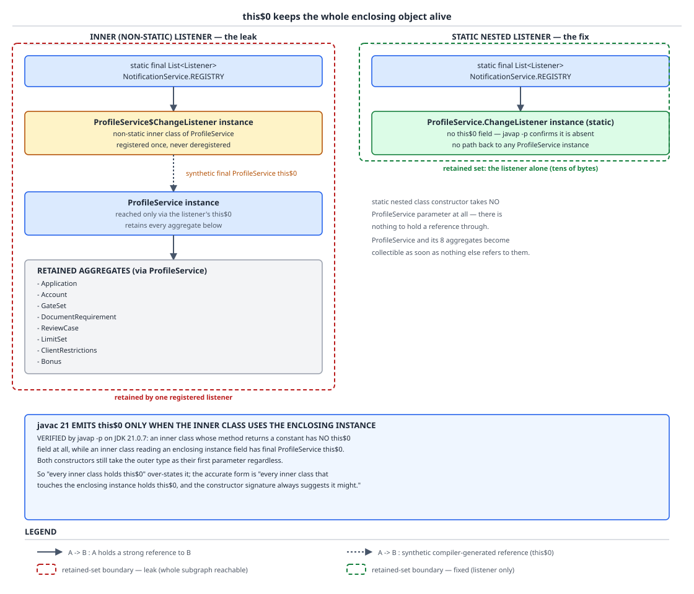
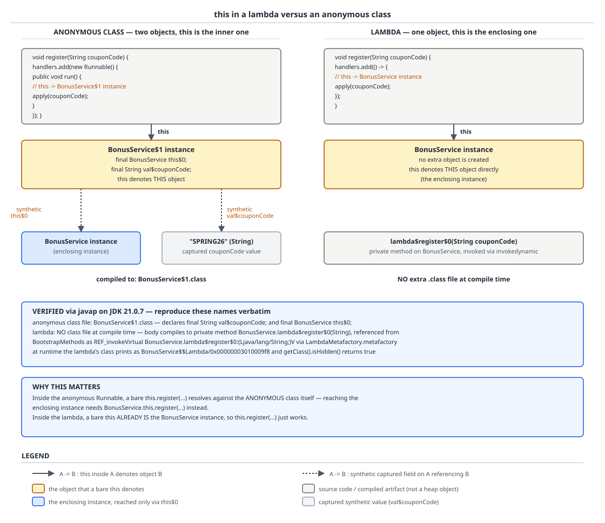

# 03 Java Core — Nested, inner, local and anonymous classes — BASICS (§1.17, 1.17.1–1.17.13)

**Target version: Java 21 LTS.** | **Part 1 of 5** | [Index](../00-index.md)
Previous: [Interfaces versus abstract classes](01b-interfaces.md) · Next: [Method dispatch internals](03-internals-dispatch.md)

Four different things in Java look like "a class inside another class", and exactly one axis separates them: whether the nested thing carries a hidden pointer back to an instance of the thing it was declared in. That one bit decides whether a cached listener retains a whole object graph, whether a captured local can be reassigned, whether `this` means the object you wrote the code inside of or the object the compiler just invented, and what name shows up in a production stack trace. This file builds the language-level model of all four kinds plus the lambda for contrast, proves the capture-is-a-copy rule from real `javap` output, and gives you the decision table. By the end you should be able to look at a nested declaration and say, without compiling, what it costs and what it retains — and know when the source alone is not enough and you have to look at the class file. The class-file walk itself (the constant pool, the pre-11 `access$000` bridges, JEP 181 nestmates, `Class.getNestHost`, hidden classes, retained-heap arithmetic) lives in the sibling file [`04-internals-nested-classes.md`](04-internals-nested-classes.md).

## 1. The four kinds, and the one axis that separates them (1.17.1, 1.17.2, 1.17.3, 1.17.13)

Picture a `BonusService` object on the heap. Now picture a second, smaller object beside it whose job is to compute a `StakeSplit`. There are exactly two possible relationships between those two objects. Either the small one has a field pointing at the big one, or it does not. Everything else about nested classes — the syntax you are allowed to write, what `static` means in the declaration, what `this` resolves to, what the garbage collector can free — is a consequence of which of those two pictures you chose.

A **static nested class** is picture two: no field, no back-pointer. It is a top-level class that happens to be namespaced inside another and granted access to its private members. An **inner class** (the spec's term is *non-static member class*) is picture one: the compiler adds a synthetic final field, conventionally called `this$0`, and every constructor takes the enclosing instance as a hidden first parameter. A **local class** is an inner class (or a static one, if declared in a static method) that is additionally scoped to a block, and can also capture local variables. An **anonymous class** is a local class with no name, declared and instantiated in a single expression.

### Why it exists

Before nested classes existed in Java 1.0, a helper type that logically belonged to one class had to be a package-private top-level type, which meant its name polluted the package and its coupling was invisible. Static nesting solved the naming and access problem. The inner class solved a different problem: iterators. An iterator over a `ReservationBook` needs continuous access to the book's internal array and mod count; without an enclosing reference you would have to pass the book into the iterator's constructor and store it yourself, in a field, by hand. The inner class is that field, generated for you, plus the `Outer.this` syntax to read through it. Anonymous classes then existed purely because Java had no function type: an event callback or a `Comparator` needed a class, and writing a named one per callback was intolerable. Lambdas (Java 8) took that job over, which is why anonymous classes are now a narrow tool rather than the default.

### The mechanism

Because an inner class instance needs an enclosing instance, the language needs syntax to supply one and syntax to read it back.

- **Supplying it.** Inside an instance method of `Outer`, `new Inner()` implicitly passes `this`. From outside, or from a static context, you must be explicit: `outer.new Inner()`. The qualified-`new` form reads oddly because it is not `outer.new` calling a method on `outer` — the receiver expression before `.new` *is* the enclosing instance argument.
- **Reading it back.** Inside `Inner`, an unqualified `this` is the `Inner` instance. `Outer.this` reads the synthetic field and gives you the enclosing instance. If names collide — an `Inner` field named `state` shadowing an `Outer` field named `state` — `Outer.this.state` is the only way to reach the outer one.
- **A static nested class has neither.** `new Outer.Inner()` needs no receiver, and `Outer.this` is a compile error inside it, because there is no field to read.

**Insight:** the interesting refinement is that `javac 21` emits `this$0` **only when the inner class actually uses its enclosing instance**. Verified on JDK 21.0.7 with two inner classes side by side, one reading an enclosing field and one not:

```java
public class InnerNoUse {
    private int stakeCount = 42;
    class Independent { int f() { return 7; } }
    class Dependent   { int f() { return stakeCount; } }
}
```

`javap -p` shows:

```
class InnerNoUse$Independent {
  InnerNoUse$Independent(InnerNoUse);
  int f();
}

class InnerNoUse$Dependent {
  final InnerNoUse this$0;
  InnerNoUse$Dependent(InnerNoUse);
  int f();
}
```

`Independent` has no `this$0` field at all, though its constructor still takes `InnerNoUse` and discards it. So the accurate statement is: **every inner class that touches its enclosing instance holds `this$0`; the constructor descriptor always suggests it might; and you cannot tell from the source alone — you have to look.** Design-wise, still assume "inner class implies a retained enclosing reference", because adding one enclosing-member access in a later edit silently puts the field back with no signal at the call site.

**D-049** — The four nested-class kinds, with the lambda for contrast.

| | Static nested | Inner (non-static member) | Local | Anonymous | Lambda |
|---|---|---|---|---|---|
| **Enclosing instance held** | Never | Yes, via synthetic `this$0` — emitted only if the enclosing instance is actually used | Yes if declared in an instance method and it uses the enclosing instance; no if in a static method | Same rule as local | Only if the body reads `this` or an instance member; otherwise the body compiles to a private *static* method and holds nothing |
| **Can declare static members** | Yes, always | Since **Java 16**: yes, including non-constant `static` fields and `static` methods. Java 15 and earlier: only `static final` compile-time constants | Same as inner (Java 16 onward) | Same as inner (Java 16 onward), but you cannot name the type to reach them | Not a declaration; nothing to declare |
| **Capture rules** | Captures nothing | Captures nothing local; reads enclosing state live through `this$0` | Captures effectively-final enclosing locals by value into `val$` fields | Same as local | Same as local |
| **Generated class file name** | `Outer$Inner` | `Outer$Inner` | `Outer$1Local` (index then name) | `Outer$1` (index only) | No class file; body becomes `lambda$method$0`, class is spun at runtime and is hidden |
| **What `this` means** | The nested instance | The nested instance; `Outer.this` for the enclosing one | The local-class instance | The **anonymous** instance, not the enclosing one | The **enclosing** instance |
| **When it is the right answer** | Default for any helper: `BonusService.StakeSplitCalculator` computing a `StakeSplit` | Only when the helper is meaningless without live enclosing state: a `Reservation` iterator inside `ReservationBook` | Almost never; a type needed by exactly one method body and worth naming, e.g. a row grouper inside a `PaymentRun` method | Only when you need a class (multiple methods, or a field, or to extend an abstract class) and it is used once | Any single-abstract-method target: `Comparator<LedgerEntry>` by amount, a `Runnable` task |

That table also discharges 1.17.13 — the last row is the decision.

### A minimal concrete example

```java
public final class ReservationBook implements Iterable<Reservation> {

    private final Reservation[] entries;
    private int size;
    private int modCount;

    public ReservationBook(int capacity) {
        this.entries = new Reservation[capacity];
    }

    public void add(Reservation reservation) {
        if (size == entries.length) {
            throw new IllegalStateException("reservation book full");
        }
        entries[size++] = reservation;
        modCount++;
    }

    // INNER: needs live access to entries, size and modCount. Correct use of an
    // enclosing reference — the iterator is meaningless detached from its book.
    private final class BookIterator implements Iterator<Reservation> {
        private int cursor;
        private final int expectedModCount = modCount;

        @Override public boolean hasNext() {
            return cursor < size;                      // reads ReservationBook.this.size
        }

        @Override public Reservation next() {
            if (modCount != expectedModCount) {
                throw new ConcurrentModificationException();
            }
            if (cursor >= size) {
                throw new NoSuchElementException();
            }
            return entries[cursor++];
        }
    }

    @Override public Iterator<Reservation> iterator() {
        return new BookIterator();                     // implicit enclosing instance = this
    }

    // STATIC NESTED: pure function of its arguments. No enclosing state, so no
    // enclosing reference, so it can be constructed and unit-tested standalone.
    public static final class StakeSplitCalculator {
        private static final BigDecimal BONUS_SHARE = new BigDecimal("0.10");

        public StakeSplit split(Money stake, Money bonusAvailable) {
            BigDecimal cap = stake.amount()
                    .multiply(BONUS_SHARE)
                    .setScale(2, RoundingMode.DOWN);           // 3.33 -> 0.33
            BigDecimal bonus = cap.min(bonusAvailable.amount());
            return new StakeSplit(
                    new Money(bonus, stake.currency()),
                    new Money(stake.amount().subtract(bonus), stake.currency()));
        }
    }
}
```

Constructed from outside, the two kinds read completely differently:

```java
var calculator = new ReservationBook.StakeSplitCalculator();   // no receiver needed
var book = new ReservationBook(64);
// A BookIterator would need: book.new BookIterator() — the receiver before .new
// IS the enclosing-instance argument. Here it is private, so iterator() supplies it.
```

### The gotcha

An inner class cannot be instantiated from a static context without a receiver, and the error message does not say "you forgot the enclosing instance" in those words. Inside `public static void main`, `new BookIterator()` fails with `non-static variable this cannot be referenced from a static context` — because the implicit argument the compiler wanted to pass was `this`, and there is no `this`. The second, quieter gotcha is that an inner class cannot be a top-level API type in any framework that instantiates by no-arg reflection: `Class.newInstance` and most JSON binders will fail on `Outer$Inner` because its only constructor takes an `Outer`.

> **Definition.** A **static nested class** is a member class with no enclosing instance; an **inner class** is a member class each of whose instances is associated with an enclosing instance, reached in source by `Outer.this` and supplied at construction by an implicit `this` or an explicit `outer.new Inner()`.

## 2. Capture is a copy (1.17.10, 1.17.11)

When a local class, anonymous class or lambda mentions a local variable of the enclosing method, nothing is shared. The compiler adds a field to the generated class, assigns the variable's *current value* into it at construction time, and rewrites every read of the variable in the body into a read of that field. Two independent storage locations now hold the same value. The "effectively final" rule is not a taste decision — it is the only way to stop those two locations from drifting apart.

### Why it exists

The local variable lives in a stack frame that ends when the method returns. The object frequently outlives it — it goes into a registry, a queue, an executor. A captured-by-reference design would need the local promoted off the stack into a heap cell shared by both (which is exactly what Scala, Kotlin and C# do for mutable captures). Java chose the cheaper option: copy the value, and forbid the programs where copying is observably different from sharing. The cost is that you cannot write to a captured local; the benefit is that capture is one field write and one field read, with no indirection and no cross-thread visibility question about the cell itself.

### The mechanism, proved from bytecode

`[PROVE]` Here is `javap -p -c` on the anonymous `Runnable` from a `BonusService.register(String couponCode)` method, on JDK 21.0.7:

```
class BonusService$1 implements java.lang.Runnable {
  final java.lang.String val$couponCode;
  final BonusService this$0;

  BonusService$1();
    descriptor: (LBonusService;Ljava/lang/String;)V
    Code:
       0: aload_0
       1: aload_1
       2: putfield      #1    // Field this$0:LBonusService;
       5: aload_0
       6: aload_2
       7: putfield      #7    // Field val$couponCode:Ljava/lang/String;
      10: aload_0
      11: invokespecial #11   // Method java/lang/Object."<init>":()V
      14: return

  public void run();
    Code:
       0: getstatic     #17   // Field java/lang/System.out:Ljava/io/PrintStream;
       3: aload_0
       4: getfield      #1    // Field this$0:LBonusService;
       7: invokevirtual #23   // Method BonusService.position:()Ljava/lang/String;
      10: aload_0
      11: getfield      #7    // Field val$couponCode:Ljava/lang/String;
      14: invokedynamic #29,  0
      19: invokevirtual #33   // Method java/io/PrintStream.println:(Ljava/lang/String;)V
      22: return
}
```

Work the argument through. The field is `final java.lang.String val$couponCode`. It is written exactly once, in the constructor, from parameter slot 2 — the caller's value of the local, pushed at the `new` site. In `run`, the read at offset 11 is `getfield val$couponCode` on `this`. There is no instruction anywhere in the class file that refers to the enclosing method's local-variable slot, and there could not be: that slot belongs to a frame this code does not have access to and which may already have been popped. So if the language allowed `couponCode = "DEP-302";` after the `new`, that write would land in the frame slot and the field would keep the old value — the two would diverge, visibly, with no syntax at the divergence point to warn you. Effectively-final is the rule that removes that case. That is the whole derivation: **the restriction is a consequence of the copy, not an addition to it.**

Two side facts from the same listing. The enclosing instance is reached by an ordinary `getfield this$0` followed by a virtual call — nothing magic, just a field read. And both `putfield`s run at offsets 2 and 7, *before* the `invokespecial Object.<init>` at offset 11; ordinary Java source cannot touch a field before the super constructor, but synthetic captures are compiler-generated and exempt.

**Interview:** "Why must captured locals be effectively final?" — Because capture copies the value into a synthetic `val$` field on the generated class; two storage locations cannot be kept in step, so the language forbids the programs where they could differ. Instance and static fields are *not* copied — they are read live through `this$0` or `getstatic` — which is why you can freely mutate a field from a lambda and not a local.

### A minimal concrete example, and the workarounds

```java
public final class SettlementBatch {

    private final FundsLedger ledger;
    private int settledCount;                  // FIELD: mutable from a lambda, read live

    public SettlementBatch(FundsLedger ledger) {
        this.ledger = ledger;
    }

    // LEGITIMATE: the accumulator is read on the same thread after forEach returns.
    // A one-element array works, but a long adder or a reduce is clearer.
    public Money totalStaked(List<LedgerEntry> entries) {
        final Money[] running = { Money.zero(Currency.getInstance("GBP")) };
        entries.forEach(entry -> running[0] = running[0].plus(entry.amount()));
        return running[0];
    }

    // BETTER: no mutable cell at all. Same result, no capture question to answer.
    public Money totalStakedReduced(List<LedgerEntry> entries) {
        return entries.stream()
                .map(LedgerEntry::amount)
                .reduce(Money.zero(Currency.getInstance("GBP")), Money::plus);
    }

    // LEGITIMATE: genuinely shared across threads, so the cell must be atomic.
    // AtomicInteger here is not a capture workaround — it is the correct type
    // for a counter several settlement threads increment.
    public int settleConcurrently(List<Reservation> reservations, ExecutorService pool) {
        AtomicInteger settled = new AtomicInteger();
        reservations.forEach(reservation ->
                pool.execute(() -> {
                    ledger.settle(reservation);
                    settled.incrementAndGet();
                    settledCount++;            // compiles, but is a data race — see below
                }));
        return settled.get();                  // only meaningful after pool drains
    }
}
```

Three verdicts. `Money[] running` is legitimate but low-value: it works only because `forEach` on a sequential stream runs on the calling thread and the read happens after, and the `reduce` version says the same thing without a mutable cell. `AtomicInteger settled` is legitimate for a different reason — it is a genuinely shared counter with atomic increment, which is the right type independent of capture. `settledCount++` is the smell: it compiles because `settledCount` is a *field*, not a captured local, so no effectively-final rule applies — and it is a lost-update data race across pool threads with no warning from anywhere. Memory-model detail (visibility, happens-before, why `AtomicInteger` fixes what a plain `int[]` does not) belongs to guide 05 (Concurrency); the point here is only that the capture rule polices locals and says nothing at all about fields.

### The gotcha

`final Money[] running` is `final` in the sense the compiler cares about — the *reference* never changes — while the contents change freely. The effectively-final rule is about the variable, never about the object it points at. So a one-element array or a mutable holder always slips past the check, which means the check is not protecting you from the mutation, only from the divergence of two copies of a value. If you reach for the array to defeat the compiler rather than because you genuinely want a shared cell, you have kept the danger and thrown away the warning.

> **Definition.** A captured local is **copied by value into a synthetic `val$`-prefixed final field** of the generated class at construction time; the variable must therefore be effectively final, because the language has no mechanism to keep the field and the frame slot in step.

## 3. The retained-object leak, and the double-brace idiom (1.17.8, 1.17.7)

A `ProfileService` is a request-scoped object holding a client's `Application`, `Account`, `GateSet`, open `DocumentRequirement` set, `ReviewCase`, `LimitSet`, `ClientRestrictions` and `Bonus`. It registers an inner-class listener into a `static final` registry on `NotificationService` and is then dropped. The registry is a GC root. The listener is reachable from the root. `this$0` on the listener is reachable from the listener. The `ProfileService` is therefore reachable, and so is every aggregate it holds. One 40-byte listener has pinned the whole graph, and nothing in the source of either class says so.

### Why it exists

Nobody designed this. It falls out of the enclosing reference being *implicit*: the retaining edge is created by writing `class ChangeListener` instead of `static class ChangeListener`, and there is no syntax anywhere at the registration site that shows an edge exists. Compare a static nested listener that takes what it needs in its constructor — there the retained set is exactly the constructor arguments, visible on one line.

### The mechanism `[PROVE]`

Work the reachability out edge by edge rather than trusting the shape.

1. `NotificationService.REGISTRY` is a `static final List<Listener>` — a field of an initialised class, so it is a GC root for the lifetime of its class loader.
2. `REGISTRY` holds a strong reference to the `ProfileService$ChangeListener` instance. Strong, because `ArrayList` stores plain object references in its backing array.
3. The listener's `this$0` field is a strong reference to the `ProfileService` instance — and here it *is* emitted, because the listener body reads `account` and `restrictions` through the enclosing instance.
4. `ProfileService` holds strong references to eight aggregates.
5. Reachability is transitive, so all ten objects plus everything the aggregates transitively hold are live. Removing the `ProfileService` variable from the request scope changes nothing: the path from the root does not go through that variable.

Note the shape rather than a byte figure: **one registered listener retains one `ProfileService` and, transitively, its entire aggregate graph.** With 380k monthly active clients and one leaked registration per profile view, the retained set grows without bound and the symptom is a slow old-generation climb that survives every full GC — not an allocation spike. Any total byte figure would need per-object sizes I have not measured, so I am not printing one; see `## Open questions`. Making `ChangeListener` `static` and passing it the `AccountId` it needs cuts the graph at step 3 and the retained set becomes the listener itself.



**D-050** — Follow the dotted edge in the left lane: it is the only difference between the two designs, and it is not written anywhere in the source. On the left the red dashed retained-set boundary swallows the `ProfileService` and all eight aggregates because the path `REGISTRY → ChangeListener → this$0 → ProfileService` is unbroken; on the right the same registry entry retains one object. The annotation panel carries the verified caveat that `javac 21` emits `this$0` only when the inner class actually uses the enclosing instance — so a listener that happens not to touch enclosing state today leaks nothing, and leaks everything the moment someone adds one field read.

### A minimal concrete example

```java
public final class NotificationService {
    // GC root for the life of the class loader.
    private static final List<Consumer<RestrictionKey>> REGISTRY = new CopyOnWriteArrayList<>();

    public static Runnable subscribe(Consumer<RestrictionKey> listener) {
        REGISTRY.add(listener);
        return () -> REGISTRY.remove(listener);      // the unsubscribe handle
    }

    public static void publish(RestrictionKey key) {
        REGISTRY.forEach(listener -> listener.accept(key));
    }
}

public final class ProfileService {
    private final Account account;
    private final GateSet gates;
    private final ReviewCase reviewCase;
    private final LimitSet limits;
    private final List<DocumentRequirement> requirements;

    ProfileService(Account account, GateSet gates, ReviewCase reviewCase,
                   LimitSet limits, List<DocumentRequirement> requirements) {
        this.account = account;
        this.gates = gates;
        this.reviewCase = reviewCase;
        this.limits = limits;
        this.requirements = requirements;
    }

    // LEAK: inner class, reads account through this$0, registered forever.
    private final class ChangeListener implements Consumer<RestrictionKey> {
        @Override public void accept(RestrictionKey key) {
            if (key.type() == RestrictionType.WITHDRAWAL_HELD) {
                account.markWithdrawalHeld();
            }
        }
    }

    void registerLeaky() {
        NotificationService.subscribe(new ChangeListener());
    }

    // FIX: static nested. Its retained set is exactly its constructor arguments,
    // and the subscription returns a handle so the registration is not forever.
    private static final class BoundedChangeListener implements Consumer<RestrictionKey> {
        private final AccountId accountId;
        private final AccountMaintenance maintenance;

        BoundedChangeListener(AccountId accountId, AccountMaintenance maintenance) {
            this.accountId = accountId;
            this.maintenance = maintenance;
        }

        @Override public void accept(RestrictionKey key) {
            if (key.type() == RestrictionType.WITHDRAWAL_HELD) {
                maintenance.markWithdrawalHeld(accountId);
            }
        }
    }

    Runnable registerBounded(AccountMaintenance maintenance) {
        return NotificationService.subscribe(
                new BoundedChangeListener(account.id(), maintenance));
    }
}
```

The same bug arrives dressed as an executor task (`pool.submit(new GrantTask(couponCode))` where `GrantTask` is inner and the queue is deep), as a static cache of anonymous `Comparator<LedgerEntry>` instances, and as a `ThreadLocal` holding an anonymous supplier. In every case the registry is long-lived, the object is small, and the retained graph is not.

### The double-brace idiom is this exact bug, with a syntax that hides it further

```java
// WRONG on two counts.
Set<RestrictionKey> blocked = new HashSet<RestrictionKey>() {{
    add(new RestrictionKey(RestrictionType.DEPOSIT_BLOCKED, RestrictionSource.SYSTEM_COMPLIANCE));
    add(new RestrictionKey(RestrictionType.STAKE_BLOCKED, RestrictionSource.SYSTEM_COMPLIANCE));
}};
```

The outer braces open an anonymous subclass of `HashSet`; the inner braces are an instance initialiser block in it. Three consequences. First, this is not a `HashSet` — it is an anonymous class named `Outer$1`, so `getClass()` differs, and any code doing an exact class check or a `HashSet`-specific optimisation behaves differently. Second, if the declaration sits in an instance method it captures the enclosing instance exactly as in D-050, and a "constant" set declared this way inside a service and stored in a static field pins that service forever. Third, the serialization hazard: an anonymous subclass of a serializable type is itself *not* reliably serializable, because writing it writes its synthetic `this$0` too, and the write fails with `NotSerializableException` naming the enclosing class unless that enclosing instance is serializable — which a Spring service never is. Worse, the class's name `Outer$1` is positional, assigned by declaration order in the file, so inserting an unrelated anonymous class earlier in the same source file renumbers it and breaks deserialization of previously written bytes. Full treatment of serialized-form stability is in [`../serialization/02-serialization.md`](../serialization/02-serialization.md).

The fix is `Set.of(firstKey, secondKey)` for an immutable set, or `new HashSet<>(List.of(firstKey, secondKey))` for a mutable one. Both are shorter than the idiom they replace.

**Pitfall:** the belief is that double-brace initialisation is a concise literal syntax with no cost. The symptom is a `NotServiceSerializableException`-shaped failure at a cache boundary, or an old-gen leak where the retained root is a "constant" collection. The fix is `Set.of` / `Map.of` / `List.of`, or a static factory method that builds and returns a plain collection.

> **Definition.** A non-static inner, local or anonymous class instance that uses its enclosing instance holds a strong synthetic reference to it, so storing that instance anywhere longer-lived than the enclosing object makes the entire enclosing object graph unreachable-for-collection for as long as the store lives.

## 4. Lambdas are not anonymous classes (1.17.9, 1.17.12)

An anonymous `Runnable` and a lambda `Runnable` compile to nothing alike. The anonymous class is a class file on disk, loaded eagerly with the enclosing class, one instance per evaluation, holding `this$0` and `val$` fields, and `this` inside it means *itself*. The lambda produces no class file; its body becomes a private method on the enclosing class, the instance is manufactured at first execution by an `invokedynamic` call site, a non-capturing one is a singleton, and `this` inside it means the **enclosing** instance. That last difference silently changes what your code does when you copy a body from one form to the other.

### Why it exists

Anonymous classes as function values cost one class file per callback — link time, metaspace, and a JAR full of `Outer$7`. JEP 126 chose `invokedynamic` plus `LambdaMetafactory` instead so that the strategy is a runtime decision, not baked into the bytecode: a non-capturing lambda can be cached as a singleton, and the class the JVM spins is hidden, so it is not on any class path and is collectible with its loader. The `this` change is a consequence, not a design goal: a lambda is not a new object with its own identity in the source's eyes, so the spec keeps `this` meaning what it means in the surrounding code.

### The mechanism

Verified against JDK 21.0.7. Compiling a `BonusService.register(String couponCode)` that contains a named inner class, an anonymous class, a lambda and a local class produced exactly four class files and no more:

```
BonusService$1.class
BonusService$1LocalTask.class
BonusService$GrantTask.class
BonusService.class
```

Read the list. `Outer$Inner` for the named inner class. `Outer$1` for the anonymous class — a positional number, not a name, which is why an anonymous class's identity is not a stable contract across a recompile. `Outer$1Local` for the local class — number *then* name, so two local classes with the same name in different methods do not collide. And **the lambda produced no class file at all.**

Instead, the lambda body becomes a private method on the enclosing class named `lambda$register$0`, referenced from the class's `BootstrapMethods` attribute through `LambdaMetafactory.metafactory`. Verified: a lambda that touches instance state becomes a private *instance* method, referenced as `REF_invokeVirtual`; a lambda that touches no instance state becomes a private *static* method, referenced as `REF_invokeStatic`. That second form is precisely why a non-capturing lambda needs no enclosing reference — there is no instance for it to reference.

Identity, measured on JDK 21.0.7:

```
nonCapturing() == nonCapturing()               ->  true
capturing("DEP-301") == capturing("DEP-301")   ->  false
nonCapturing().getClass().getName()            ->  LambdaId$$Lambda/0x00000003010009f8
nonCapturing().getClass().isHidden()           ->  true
```

A non-capturing lambda's `CallSite` is constant, so every evaluation yields the same instance and nothing is allocated after the first. A capturing lambda allocates per evaluation — which matters at the QuizStakes stake-settlement burst of 3,400/sec, where a capturing lambda in the hot path is 3,400 short-lived objects a second and a non-capturing one is zero. **Version trap:** the class-name shape in JDK 21 is `Outer$$Lambda/0x…`; earlier releases printed `Outer$$Lambda$1`, so any test or log filter that string-matches the old form breaks on 21.



**D-051** — Count the boxes in each lane. The left lane has two heap objects and the `this` arrow points at the *inner* one, the `BonusService$1`, with its dotted `this$0` and `val$couponCode` fields drawn; the right lane has one object for the interface instance and the `this` arrow points straight back at the `BonusService`, because the body was compiled as a private method on it (`lambda$register$0`). The annotation panel makes the practical consequence: in the anonymous class, calling the enclosing method needs `BonusService.this.register(couponCode)`, while in the lambda a bare `register(couponCode)` already means that.

### A minimal concrete example

```java
public final class BonusService {

    private final List<Runnable> registry = new ArrayList<>();
    private final FundsLedger ledger;

    public BonusService(FundsLedger ledger) {
        this.ledger = ledger;
    }

    public void grant(ClientId clientId, Money deposit) {
        ledger.credit(clientId, "CLIENT_BONUS_AVAILABLE", bonusFor(deposit));
    }

    private Money bonusFor(Money deposit) {
        BigDecimal tenth = deposit.amount().multiply(new BigDecimal("0.10"));
        BigDecimal capped = tenth.min(new BigDecimal("100"));
        return new Money(capped.setScale(2, RoundingMode.DOWN), deposit.currency());
    }

    public void register(ClientId clientId, Money deposit) {
        // ANONYMOUS: `this` is the Runnable. Reaching the service needs a qualifier.
        registry.add(new Runnable() {
            @Override public void run() {
                BonusService.this.grant(clientId, deposit);
                assert this.getClass().getName().endsWith("$1");   // itself, not the service
            }
        });

        // LAMBDA: `this` is the BonusService. The bare call already targets it.
        registry.add(() -> grant(clientId, deposit));
    }

    // Non-capturing lambda: hoisted to a constant so the singleton is reused
    // across all 3,400/sec settlement calls rather than reallocated.
    private static final Comparator<LedgerEntry> BY_AMOUNT =
            Comparator.comparing(entry -> entry.amount().amount());

    public List<LedgerEntry> largestFirst(List<LedgerEntry> entries) {
        return entries.stream().sorted(BY_AMOUNT.reversed()).toList();
    }
}
```

### Reading the generated names in a stack trace

Measured on JDK 21.0.7:

```
java.lang.IllegalStateException: AA-599 SCREENING_PROHIBITED
	at Frames.lambda$main$0(Frames.java:8)
	at java.base/java.lang.Iterable.forEach(Iterable.java:75)
	at Frames.main(Frames.java:8)
```

The lambda frame is `lambda$<enclosing method>$<index>` — here `lambda$main$0`. It is a *method* on `Frames`, which is why the class in the frame is `Frames` and not some `$$Lambda` type; the hidden class's `run` frame does not appear because it is a trivial forwarder the JIT inlines and the stack-walker attributes to the target method. Both the lambda frame and the enclosing frame report line 8 because the lambda body and the `forEach` call are on the same source line. The naming table across all five forms:

| Form | Frame or class you see | Stable across recompile |
|---|---|---|
| Static nested / inner | `Outer$Inner` | Yes — derived from the declared name |
| Local | `Outer$1Local` | Only if you do not add or remove a local class of the same name in the same class |
| Anonymous | `Outer$1` | No — index is positional in the source file |
| Lambda body method | `Outer.lambda$method$0` | No — index is positional among lambdas in that method |
| Lambda runtime class | `Outer$$Lambda/0x…` (JDK 21 shape; `Outer$$Lambda$1` pre-15) | No — the hex is an address-like suffix, different every run |

### The gotcha

`[TRAP]` Converting an anonymous class to a lambda silently rebinds `this`. If the anonymous body contained `this.getClass()`, `this.hashCode()`, `synchronized (this)`, or passed `this` to a registration call to allow later removal, the lambda version compiles and means something entirely different: `synchronized (this)` now locks the `BonusService`, and a `deregister(this)` now hands over the service instead of the callback. Nothing warns you.

**Insight:** the reason a lambda has no stable identity to hand over is the same reason it is cheap — the runtime is free to return the same instance twice for a non-capturing lambda, so `deregister(theSameLambdaExpressionWrittenAgain)` may or may not match, depending on capture. If you need to unsubscribe, hold the instance in a variable and pass that variable; never re-write the lambda expression at the removal site.

> **Definition.** A lambda is not a class declaration: its body compiles to a private method of the enclosing class, its instance is produced by an `invokedynamic` call site into a runtime-spun hidden class, it carries an enclosing reference only when its body needs one, and `this` inside it denotes the enclosing instance.

## Supporting facts

### An inner class may declare static members — since Java 16 (1.17.4)

`[VERSION-TRAP]` `[RESEARCH]` Verified on two JDKs. This source:

```java
public class Inner16 {
    class Reservation {
        static final int MAX_STAKE_MINOR = 42000;
        static int counter = 0;
        static int next() { return ++counter; }
    }
}
```

**On JDK 21.0.7 it compiles cleanly.** On JDK 11.0.27, verbatim:

```
Inner16.java:4: error: Illegal static declaration in inner class Inner16.Reservation
        static int counter = 0;
                   ^
  modifier 'static' is only allowed in constant variable declarations
Inner16.java:5: error: Illegal static declaration in inner class Inner16.Reservation
        static int next() { return ++counter; }
                   ^
  modifier 'static' is only allowed in constant variable declarations
```

The JDK 11 wording is the old rule stated exactly: `modifier 'static' is only allowed in constant variable declarations`, meaning only `static final` fields initialised with compile-time constant expressions were permitted. The restriction was lifted by the specification work for **JEP 395 (Records, Java 16)**, and the relaxation applies to inner classes generally, not only to records — Java 16 also allows an inner class to declare a nested *record*, *enum* or *interface*, which are implicitly static. **Interview:** interviewers trained on Java 8 material still ask "can an inner class have a static method?" and expect "no". Answer both halves: no through Java 15, yes from Java 16 (JEP 395), and the JDK 11 error text is `Illegal static declaration in inner class`.

The trade-off is worth stating: the relaxation makes an inner class a plausible home for a small `static` counter or factory, but it does not make the inner class cheaper — the `this$0` retention story is unchanged, and a type that has static members and no need for enclosing state is telling you it wanted to be `static class` all along.

### Local classes: scoped, capturing, and rare (1.17.5)

A local class is declared inside a block — a method body, a constructor, an initialiser, or even a `for` body. Its scope is that block and nothing else: you cannot name the type outside, you cannot mark it `public`, `protected`, `private` or (before Java 16 semantics) `static`, and it cannot be referenced from a return type unless you return it as some supertype. It captures effectively-final enclosing locals with the same `val$` mechanism as an anonymous class, and it holds `this$0` if declared in an instance context and it uses the enclosing instance. Its class file is `Outer$1LocalName`.

They are rare for a simple reason: a local class exists precisely when you need a *named*, *multi-method or stateful* type used by exactly one method body. A single-method type is a lambda. A type worth naming and testing is usually a static nested class. That leaves a thin band — a stateful helper too intricate for a lambda and too method-specific to justify a member declaration, for instance a row-grouping accumulator inside a `PaymentRun` batching method that needs three mutable counters and two methods. The one genuine advantage over a static nested class is proximity: nothing outside those ten lines can depend on it, so it can change freely.

```java
public PaymentRun buildRun(List<WithdrawalTransaction> pending) {
    class RailGrouper {
        private final Map<Rail, List<WithdrawalTransaction>> byRail = new EnumMap<>(Rail.class);
        private Money total = Money.zero(Currency.getInstance("GBP"));

        void accept(WithdrawalTransaction transaction) {
            byRail.computeIfAbsent(transaction.rail(), rail -> new ArrayList<>()).add(transaction);
            total = total.plus(transaction.amount());
        }

        PaymentRun toRun() {
            return new PaymentRun(Map.copyOf(byRail), total);
        }
    }
    var grouper = new RailGrouper();
    pending.forEach(grouper::accept);
    return grouper.toRun();
}
```

### An anonymous class has no constructor, so use an instance initialiser (1.17.6)

An anonymous class has no name, so it cannot declare a constructor — a constructor's declaration *is* its class's name. The consequences are precise. Arguments in the `new` expression are passed to the **superclass** constructor, not to the anonymous class, so `new AssessmentService(jurisdiction) { }` selects a superclass constructor taking a `Jurisdiction`. Any setup you want *after* the superclass constructor runs must go in an instance initialiser block, which the compiler folds into the generated constructor after the `super` call and after field initialisers. An anonymous class can extend exactly one class **or** implement exactly one interface — never both, and never two interfaces — because the `new` expression names exactly one type. If you need two interfaces, or a constructor, or the type named anywhere else, you have outgrown the anonymous class and want a local or static nested one.

```java
// Superclass constructor takes the Jurisdiction; the initialiser block does the rest.md.
var strictScreening = new ScreeningService(jurisdiction) {
    private final Set<RestrictionKey> preapplied = new HashSet<>();
    {   // instance initialiser: the constructor you cannot declare
        preapplied.add(new RestrictionKey(
                RestrictionType.SOURCE_OF_FUNDS_REQUIRED, RestrictionSource.SYSTEM_COMPLIANCE));
    }
    @Override public ScreeningVerdict screen(Application application) {
        return preapplied.isEmpty()
                ? super.screen(application)
                : new ScreeningVerdict.Referred("AA-650 DOCUMENTS_REFERRED");
    }
};
```

## Pitfalls

### `this` inside an anonymous class refers to the enclosing object

**Wrong**

```java
public final class BonusService {
    private final List<Runnable> registry = new ArrayList<>();

    void register(ClientId clientId) {
        registry.add(new Runnable() {
            @Override public void run() {
                System.out.println(this.getClass().getName());   // prints BonusService$1
                synchronized (this) {                            // locks the Runnable
                    grant(clientId);
                }
            }
        });
    }
    void grant(ClientId clientId) { /* credits CLIENT_BONUS_AVAILABLE */ }
}
```

`this.getClass().getName()` prints `BonusService$1`, not `BonusService` — the anonymous class is a real class with a real instance and `this` is that instance. The `synchronized (this)` block therefore locks a freshly allocated `BonusService$1` that no other thread can ever see, so it provides no mutual exclusion whatsoever and the intended guard around `grant` does not exist. The generated class file `BonusService$1.class` is direct evidence: it was listed in the verified compile output alongside `BonusService.class`.

**Right**

```java
registry.add(new Runnable() {
    @Override public void run() {
        System.out.println(BonusService.this.getClass().getName());   // BonusService
        synchronized (BonusService.this) {
            BonusService.this.grant(clientId);
        }
    }
});
```

`Outer.this` reads the synthetic `this$0` field and yields the enclosing instance, so the lock is the one every other method of `BonusService` would take. Converting the same body to a lambda flips the default the other way: inside `() -> grant(clientId)`, a bare `this` already *is* the `BonusService`, because the body compiled to a private method on it.

**Why people believe it:** in a lambda the belief is true, and most people meet lambdas first. The anonymous class looks like an inline block of the enclosing method, so `this` reads like the enclosing method's `this`.

### An inner class still cannot declare a non-constant static member

**Wrong**

```java
public class ReservationBook {
    class Reservation {
        static int counter = 0;                  // "cannot compile" — stale since Java 16
        static int next() { return ++counter; }
    }
}
```

On JDK 11.0.27 this is two errors, verbatim `Illegal static declaration in inner class ReservationBook.Reservation` with the note `modifier 'static' is only allowed in constant variable declarations`. Measured on JDK 21.0.7, the identical source **compiles cleanly** — so a reviewer who rejects it citing "inner classes can only have static final constants" is applying a rule that was retired five LTS releases ago.

**Right**

```java
// Compiles on Java 16+. Also note: a static counter with no need for enclosing
// state is a signal the class wanted to be `static class` in the first place.
public class ReservationBook {
    static class Reservation {
        static int counter = 0;
        static int next() { return ++counter; }
    }
}
```

Both compile on 21; the `static class` version is the better design because it also removes the enclosing reference, and the relaxation changed only what is *legal*, not what is *cheap*.

**Why people believe it:** the rule held from Java 1.1 through Java 15, which is the entire span of most training material. It was lifted by the specification work for JEP 395 (Records, Java 16) so records could nest anywhere, and the relaxation to inner classes generally travelled with it, unadvertised.

### A one-element array is a safe way to mutate a captured local from another thread

**Wrong**

```java
public int settleAll(List<Reservation> reservations, ExecutorService pool) {
    final int[] settled = { 0 };
    reservations.forEach(reservation -> pool.execute(() -> {
        ledger.settle(reservation);
        settled[0]++;                       // compiles; lost updates
    }));
    pool.shutdown();
    return settled[0];                      // may read a stale or torn-in-time value
}
```

The compiler is satisfied because `settled` is never reassigned — the effectively-final rule is about the *variable*, not the array contents. What the array bought you is a shared mutable cell with no atomicity and no happens-before edge: `settled[0]++` is a read, an add and a write, so concurrent increments lose updates, and the `return` can run before the pool threads have finished or published their writes. With 2.8M settlements a day the undercount is not a rare race, it is the normal result.

**Right**

```java
public int settleAll(List<Reservation> reservations, ExecutorService pool)
        throws InterruptedException {
    AtomicInteger settled = new AtomicInteger();
    for (Reservation reservation : reservations) {
        pool.execute(() -> {
            ledger.settle(reservation);
            settled.incrementAndGet();
        });
    }
    pool.shutdown();
    pool.awaitTermination(30, TimeUnit.SECONDS);   // establishes the happens-before edge
    return settled.get();
}
```

`incrementAndGet` is a single atomic read-modify-write, and `awaitTermination` returning gives the reading thread a happens-before edge against every task's writes. The visibility reasoning belongs to guide 05 (Concurrency); the point here is that the array never addressed either problem, it only silenced the compiler. On a single thread — accumulating into a cell you read after a sequential `forEach` returns — the array is correct but a `reduce` or a returned value is clearer.

**Why people believe it:** the compiler error the array removes ("local variables referenced from a lambda expression must be final or effectively final") *sounds* like a thread-safety check, so making it go away feels like solving a thread-safety problem.

### `Outer$1` is a stable name you can match on

**Wrong**

```java
// A log filter, or a deserialization allow-list, keyed on the generated name.
if (throwable.getStackTrace()[0].getClassName().equals("BonusService$1")) {
    metrics.increment("bonus.anon.listener.failure");
}
// Or worse: bytes on disk whose serialized form records the class BonusService$1.
```

The `1` is positional — assigned by the order anonymous classes appear in the source file, verified by the compile that produced `BonusService$1.class` as the only numbered anonymous class in that file. Add an unrelated anonymous `Comparator<LedgerEntry>` earlier in the same file and the listener becomes `BonusService$2`; the filter silently stops matching and the deserialization fails with a missing-class error. The lambda case is worse still: the runtime class name is `BonusService$$Lambda/0x00000003010009f8` on JDK 21, where the hex suffix differs every run, and the pre-15 shape was `BonusService$$Lambda$1`, so a matcher written against either form is wrong on the other.

**Right**

```java
// Name what you depend on. A named static nested class has a stable binary name.
private static final class BonusListener implements Consumer<RestrictionKey> {
    @Override public void accept(RestrictionKey key) { /* handle WITHDRAWAL_HELD */ }
}
if (throwable.getStackTrace()[0].getClassName().endsWith("$BonusListener")) {
    metrics.increment("bonus.listener.failure");
}
```

A declared name is derived from source you control, so it changes only when you rename it. For anything crossing a persistence or configuration boundary — a serialized form, an allow-list, a metric tag — never let a compiler-generated name be the key. Serialized-form stability rules are in [`../serialization/02-serialization.md`](../serialization/02-serialization.md).

**Why people believe it:** the name is completely deterministic for a given source file, so it looks like a contract. It is deterministic and *not* stable — recompiling different source gives a different answer for the same class.

## Cheat sheet

| Question | Static nested | Inner | Local | Anonymous | Lambda |
|---|---|---|---|---|---|
| Holds enclosing instance | No | Yes, if it uses it (`this$0`) | Yes, if instance context and it uses it | Same as local | Only if body uses `this` or an instance member |
| Construct from outside | `new Outer.Inner()` | `outer.new Inner()` | Not addressable outside the block | Not addressable | Not a type |
| `Outer.this` legal | No | Yes | Yes, in instance context | Yes | Redundant — `this` already is it |
| `this` denotes | the nested instance | the nested instance | the local instance | **the anonymous instance** | **the enclosing instance** |
| Non-constant `static` member | Always | **Java 16+** yes; ≤15 only `static final` constants | Java 16+ yes | Java 16+ yes | N/A |
| Captures locals | No | No | Yes, effectively final, into `val$x` | Yes, into `val$x` | Yes, into constructor args of the hidden class |
| Class file | `Outer$Inner` | `Outer$Inner` | `Outer$1Local` | `Outer$1` | **none** |
| Stack frame shape | `Outer$Inner.method` | `Outer$Inner.method` | `Outer$1Local.method` | `Outer$1.method` | `Outer.lambda$method$0` |
| Runtime class name | declared | declared | declared | `Outer$1` | `Outer$$Lambda/0x…` (JDK 21; `Outer$$Lambda$1` pre-15) |
| Instances per evaluation | 1 | 1 | 1 | 1 | 1 if capturing; **0 after the first** if non-capturing (singleton) |
| Extends / implements | anything | anything | anything | one class **or** one interface | one functional interface |
| Can declare a constructor | Yes | Yes | Yes | **No** — use an instance initialiser block | No |
| Default choice? | **Yes** | Only for a live view (iterator) | Almost never | Only when a lambda cannot do it | For any single-method target |

| Fact | Value |
|---|---|
| Synthetic enclosing field | `final Outer this$0`, written in the constructor **before** `invokespecial Object.<init>` |
| Synthetic capture field | `final T val$name`, one per captured local, copy of the value |
| Effectively-final rule, in one line | capture copies, and two storage locations cannot be kept in step |
| Effectively-final applies to | locals and parameters only — never fields |
| Java 16 change (JEP 395) | inner classes may declare non-constant `static` members, and nested records/enums/interfaces |
| JDK 11 error text for the old rule | `Illegal static declaration in inner class …` / `modifier 'static' is only allowed in constant variable declarations` |
| Lambda body method | `lambda$<method>$<index>`; private *static* if it uses no instance state, private *instance* if it does |
| Lambda identity | non-capturing `==` itself across calls: `true`; capturing: `false` |
| Leak shape | long-lived registry → inner-class instance → `this$0` → whole enclosing graph |
| Leak fix | `static` nested class + explicit constructor arguments + an unsubscribe handle |
| Double-brace idiom | anonymous subclass + instance initialiser: wrong `getClass()`, enclosing capture, unstable name, not serializable |

## Self-test

**Q1.** Why must a local variable captured by a lambda be effectively final, while an instance field mutated by the same lambda needs no such restriction?

<details><summary>Answer</summary>

Because capture of a local is a copy and access to a field is not. The compiler adds a synthetic `final` field to the generated class — verified as `final java.lang.String val$couponCode` — and writes the local's current value into it in the constructor, from a constructor parameter. Every read in the body becomes `getfield val$couponCode` on `this`. There is no instruction that could reach back to the enclosing method's local-variable slot, and no mechanism to keep the field and the slot in step, so the language forbids the programs where they could diverge: reassigning the local after the capture would change one storage location and not the other, with no syntax at the divergence point to warn you. A field is different: the body reads it live, via `getfield this$0` then `getfield` on the enclosing instance, or via `getstatic` for a static field. There is one storage location, so mutation is coherent — coherent, note, but not thread-safe, which is a separate question.

</details>

**Q2.** A `ProfileService` registers an inner-class listener into a `static final List` on `NotificationService` and is then dropped from the request scope. What is retained, and by exactly what chain of references?

<details><summary>Answer</summary>

Everything the `ProfileService` transitively holds is retained. The chain: `NotificationService.REGISTRY` is a static field of an initialised class, so it is a GC root; the list's backing array holds a strong reference to the `ProfileService$ChangeListener` instance; that instance has a synthetic `final ProfileService this$0` field — emitted because the listener body reads enclosing state — which is a strong reference to the `ProfileService`; the `ProfileService` holds its `Application`, `Account`, `GateSet`, `DocumentRequirement` set, `ReviewCase`, `LimitSet`, `ClientRestrictions` and `Bonus`. Reachability is transitive, so all of it is live. Dropping the request-scope variable changes nothing, because the path from the root does not pass through it. The symptom is a monotonic old-generation climb that survives full GCs, not an allocation spike. Two fixes: make the listener `static` and pass it the `AccountId` and the collaborator it needs, and return an unsubscribe handle from `subscribe` so the registration is bounded.

</details>

**Q3.** Is it true that every inner class holds a reference to its enclosing instance?

<details><summary>Answer</summary>

Not literally, and this is a good place to show you have looked. Verified on JDK 21.0.7: given two inner classes in the same outer class, one whose method returns a constant and one whose method reads an enclosing field, `javap -p` shows the `this$0` field only on the second. Both constructors still take the outer type as their first parameter — the descriptor keeps it — but the one that does not need it discards the argument. A related case from the same evidence: an inner class that reads a `private final String` initialised from a string literal also gets no `this$0`, because that is a compile-time constant and gets folded in rather than read through the enclosing instance. The correct formulation is: every inner class *that touches its enclosing instance* holds `this$0`; the constructor signature always suggests it might; and you cannot tell from the source. For design purposes, still assume it holds one, because adding a single enclosing-member access in a later edit puts the field back with no visible change at the construction site.

</details>

**Q4.** What exactly is wrong with `Set<RestrictionKey> blocked = new HashSet<RestrictionKey>() {{ add(key); }};`?

<details><summary>Answer</summary>

Three things. First, it is not a `HashSet` — the outer braces create an anonymous subclass, compiled to `Outer$1`, so `getClass()` is not `HashSet` and any exact-class check or type-specific fast path behaves differently. Second, if the declaration is in an instance method, the anonymous class captures the enclosing instance, so a "constant" set built this way in a service and stashed in a static field pins that whole service for the life of the class loader — exactly the leak in D-050. Third, serialization: an anonymous subclass of a serializable type is not reliably serializable, because writing it also writes its synthetic `this$0`, which fails with `NotSerializableException` naming the enclosing class unless that instance is serializable; and its name `Outer$1` is positional, so inserting an unrelated anonymous class earlier in the same source file renumbers it and breaks deserialization of bytes already written. The replacement is `Set.of(firstKey, secondKey)` for immutable or `new HashSet<>(List.of(firstKey, secondKey))` for mutable — both shorter than the idiom.

</details>

**Q5.** You convert an anonymous `Runnable` into a lambda with an identical body. Name two ways that can change behaviour.

<details><summary>Answer</summary>

`this` rebinds, and identity changes. In the anonymous class `this` is the `Outer$1` instance; in the lambda it is the enclosing instance, because the lambda body compiled to a private method on the enclosing class and the spec keeps `this` meaning what it means in the surrounding code. So `synchronized (this)` goes from locking a private, invisible object — providing no mutual exclusion at all — to locking the enclosing service, which is a real lock other methods contend on. `this.getClass()` goes from `Outer$1` to the outer class. Passing `this` to a `deregister` call goes from handing over the callback to handing over the service. Separately, identity: a non-capturing lambda is a singleton, verified as `nonCapturing() == nonCapturing() -> true`, so two syntactically identical non-capturing lambda expressions may be the same object, while two `new Runnable() { }` expressions never are — which breaks any add/remove-by-instance registry unless you hold the instance in a variable.

</details>

**Q6.** Compiling one class containing a named inner class, an anonymous class, a local class and a lambda produced four class files. Which four, and what does the count prove?

<details><summary>Answer</summary>

`BonusService.class`, `BonusService$GrantTask.class`, `BonusService$1.class`, `BonusService$1LocalTask.class`. The count proves three things. The naming scheme: `Outer$Inner` from the declared name; `Outer$1` for the anonymous class, an index with no name, which is why its identity is not a stable contract across a recompile; `Outer$1Local` for the local class, index *then* name, so two local classes with the same name in different methods do not collide. And the absence proves the fourth: the lambda produced no class file at all. Its body became a private method `lambda$register$0` on the enclosing class, referenced from the `BootstrapMethods` attribute through `LambdaMetafactory.metafactory`, and the class implementing the interface is spun at runtime, is hidden (`isHidden()` returns `true` on JDK 21), and is named `BonusService$$Lambda/0x…`.

</details>

**Q7.** Can an inner class declare a `static` method? Answer as if the interviewer's material is from Java 8.

<details><summary>Answer</summary>

Both halves. Through Java 15, no — only `static final` fields initialised with compile-time constant expressions were allowed, and JDK 11 rejects the code with `Illegal static declaration in inner class Inner16.Reservation` and the note `modifier 'static' is only allowed in constant variable declarations`. From Java 16, yes: the specification work for JEP 395 (Records) lifted the restriction for inner classes generally, so non-constant `static` fields, `static` methods and nested records, enums and interfaces are all legal, and the identical source compiles cleanly on JDK 21.0.7. Then add the design point, which is what the question is really testing: legality changed, cost did not. An inner class with static members and no need for enclosing state is telling you it should have been `static class`, and making it static also removes the `this$0` retention hazard.

</details>

**Q8.** An anonymous class cannot declare a constructor. What are the consequences, and what is the workaround?

<details><summary>Answer</summary>

A constructor's declaration is its class's name, and an anonymous class has none, so it cannot declare one. Consequences: arguments in the `new` expression go to the *superclass* constructor, so `new ScreeningService(jurisdiction) { }` selects a superclass constructor taking a `Jurisdiction`; there is no way to accept a parameter the superclass does not; and the class can extend one class **or** implement one interface, never both and never two interfaces, because the `new` expression names exactly one type. The workaround for post-superclass setup is an instance initialiser block — a bare `{ }` block in the class body, which the compiler folds into the generated constructor after the `super` call and after field initialisers. That is exactly the mechanism the double-brace idiom abuses. If you need a real constructor, two interfaces, or the type named anywhere else, you have outgrown the anonymous class: use a local class if it is confined to one method, a static nested class otherwise.

</details>

## Open questions

- **Unverified:** the retained-byte total for the D-050 leak. The shape is derived on the page (one registered listener retains one `ProfileService` and its entire aggregate graph), but a byte figure would need measured per-object shallow sizes for `Application`, `Account`, `GateSet`, `DocumentRequirement`, `ReviewCase`, `LimitSet`, `ClientRestrictions` and `Bonus`. A JOL (`java.lang.instrument` object-layout) run or an Eclipse MAT retained-size report on a real heap dump would settle it; the arithmetic belongs to `04-internals-nested-classes.md`.
- **Unverified:** the claim that the hidden class's interface-method frame is absent from the measured lambda stack trace *because the JIT inlines a trivial forwarder*. The absence of the frame is measured; the attribution to inlining is my explanation, not something I confirmed. `LambdaMetafactory` and `StackWalker` implementation detail in the OpenJDK source, or `-XX:+PrintInlining` output, would settle it. The mechanism belongs to `04-internals-nested-classes.md`.

---

**Leaves covered:** 1.17.1, 1.17.2, 1.17.3, 1.17.4, 1.17.5, 1.17.6, 1.17.7, 1.17.8, 1.17.9, 1.17.10, 1.17.11, 1.17.12, 1.17.13 (13 leaves)
**Leaves deferred:** none
**Diagrams included:** D-049 (rendered as a Markdown table), D-050, D-051
**Target version:** Java 21 LTS
**Lines:** 808
