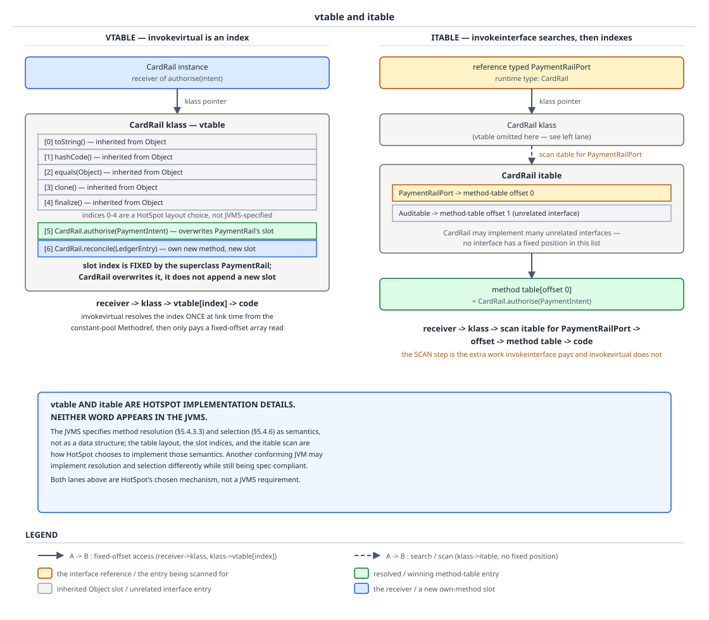
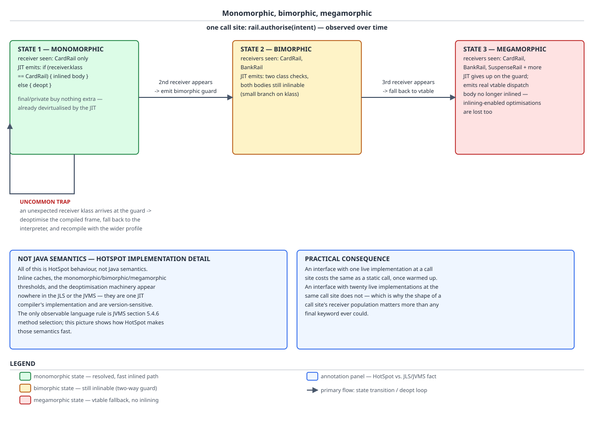

# 03 Java Core — Method dispatch internals — INTERNALS (§3.7, 3.7.1–3.7.12)

**Target version: Java 21 LTS.** | **Part 3 of 5** | [Index](../00-index.md)
Previous: [Nested, inner, local and anonymous classes](02-nested-classes.md) · Next: [Nested class internals](04-internals-nested-classes.md)

When a QuizStakes settlement loop calls `rail.authorise(intentId)` 3,400 times a second, three separate machines have already made decisions about that call: `javac` chose one of five invocation instructions and burned a symbolic method name into the constant pool; the JVM, on first execution of that instruction, ran a *resolution* algorithm against that name and then, on every execution, ran a *selection* algorithm against the receiver's class; and HotSpot, once the call site got hot, tried very hard to make both of those disappear. This file separates those three layers and, more importantly, tells you which of them the specification actually guarantees. By the end you will be able to predict the instruction `javac` emits from the source form alone, read a `javap -c` listing and say which lines have a runtime selection step and which are already decided, explain resolution versus selection with the JVMS section numbers, and — the part that distinguishes a strong candidate — say out loud which half of what you just explained is HotSpot trivia rather than portable Java semantics.

## 1. The five instructions, and what each one commits to (3.7.1, 3.7.2, 3.7.3)

Think of `javac` as a clerk filling in a movement instruction for the `FundsLedger`. The clerk cannot see the money; it can only see the *form* of the request in the source. From that form alone it must pick one of five stamps, and the stamp it picks determines how much freedom the runtime has left. `invokestatic` is the stamp that says "there is nothing to look up, run exactly this"; `invokevirtual` is the stamp that says "I have written down a name, but ask the object which method that name means"; `invokedynamic` is the stamp that says "I do not even know what code should run — the first time you get here, run this bootstrap and it will tell you, and then remember the answer forever."

### Why it exists

The JVM could have had one invocation instruction with a runtime tag. It has five because the amount of work required per call differs by an order of magnitude across the cases, and the *instruction* is where that difference is encoded so the interpreter does not have to re-derive it. A static method has no receiver, so there is no class to consult. A constructor and a `super.` call must *not* consult the receiver's class — the whole point of `super.authorise(intentId)` is to run the superclass body on an object whose class overrides it, which a receiver-driven lookup would make impossible. An interface call cannot use a fixed per-class slot index because a class implements many interfaces and cannot give each one a stable position. And `invokedynamic`, added by JSR 292 for JVM-hosted dynamic languages and then used by Java itself for lambdas, string concatenation and record `Object` methods, exists because the compiler wanted to name a *linkage strategy* rather than a method.

### The mechanism

`javac` decides purely from the source form and the compile-time types. The decision procedure, exactly:

- the resolved method is `static` → `invokestatic`, with a `Methodref` (or `InterfaceMethodref` for a static interface method);
- the call is `new X(args)`, an explicit `this(args)` or `super(args)`, or an explicit `super.m(args)` → `invokespecial`;
- the compile-time type of the receiver expression is a class type and the method is a normal instance method → `invokevirtual` with a `Methodref`;
- the compile-time type of the receiver expression is an interface type → `invokeinterface` with an `InterfaceMethodref`;
- the call site is a lambda, a method reference, a string concatenation expression, or a record's generated `equals`/`hashCode`/`toString` → `invokedynamic`, with an `InvokeDynamic` constant-pool entry pointing at an entry in the class file's `BootstrapMethods` attribute.

Note the third and fourth bullets carefully: the choice between `invokevirtual` and `invokeinterface` is made from the **static type of the receiver expression**, not from the runtime class of the object. A `CardRailAdapter` held in a `PaymentRailPort` variable is called through `invokeinterface`; the same object held in a `CardRailAdapter` variable is called through `invokevirtual`. The constant-pool entry kind differs too, which is exactly the seam that produces `IncompatibleClassChangeError` in concept 6.

For the constant-pool entry structures themselves — how a `Methodref` points at a `Class` and a `NameAndType`, and how `BootstrapMethods` is laid out — see [`../language-substrate/03a-internals-class-file-format.md`](../language-substrate/03a-internals-class-file-format.md). Here they are names on a `javap` line.

**D-109** — The five invoke instructions.

| Instruction | What `javac` emits it for | Resolution time | Dispatch mechanism | QuizStakes call site that produces it |
|---|---|---|---|---|
| `invokestatic` | any `static` method, on a class or an interface; no receiver on the stack | first execution of the instruction (JVMS §5.4.3.3), then cached | none — the resolved method *is* the method run; no selection step | `WithdrawalTransaction.rail()` called through a `WithdrawalTransaction`-typed expression |
| `invokespecial` | `new` / `this(args)` / `super(args)` constructor invocation, and explicit `super.m(args)`; **pre-Java-11 also private instance methods** | first execution, then cached | non-virtual: run the resolved method itself, deliberately bypassing any override in the receiver's class | `super.authorise(intentId)` inside `CardRail`, and `Object."<init>":()V` from an anonymous `PaymentRailPort` |
| `invokevirtual` | normal instance methods reached through a receiver whose compile-time type is a class; **since Java 11 also private instance methods (JEP 181 nestmates)** | first execution, then cached | resolution (§5.4.3.3) then **selection** on the receiver's runtime class (§5.4.6); HotSpot implements selection as a per-class method-table index | `WithdrawalTransaction.label()` selecting `CardWithdrawal.label`; `bump()` inside `DispatchProbe` on JDK 11 and later |
| `invokeinterface` | instance methods reached through a receiver whose compile-time type is an interface type | first execution, then cached | resolution then selection, same semantics as `invokevirtual`; HotSpot must first locate the right interface method table for the receiver's class | `railPort.authorise(intentId)` in the settlement loop where `railPort` is declared `PaymentRailPort` |
| `invokedynamic` | lambdas, method references, string concatenation, record-generated `equals`/`hashCode`/`toString` | bootstrap runs **once**, on first execution, producing a `CallSite`; thereafter the linked target is a constant | the `CallSite`'s `MethodHandle` is invoked; no receiver-driven selection at the call site at all | `LambdaMetafactory.metafactory` for a `BonusService` lambda; `StringConcatFactory.makeConcatWithConstants` for a status-code message |

### The bytecode, read line by line `[BYTECODE]` `[VERSION-TRAP]`

Leaf 3.7.3 is the one piece of dispatch folklore most likely to be stale in the reader's head, so it gets the bytecode. The probe:

```java
public class DispatchProbe {
    private int reserved = 0;

    private int bump() {
        return ++reserved;
    }

    int caller() {
        return bump();
    }
}
```

`javap -p -c DispatchProbe` on the body of `caller()`, verified on three JDKs on this machine:

| JDK | Instruction at offset 1 |
|---|---|
| Oracle JDK 21.0.7 (21.0.7+8-LTS-245) | `1: invokevirtual #13  // Method bump:()I` |
| Oracle JDK 11.0.27 | `1: invokevirtual #3   // Method bump:()I` |
| Oracle JDK 1.8.0_202 | `1: invokespecial #3   // Method bump:()I` |

Instruction by instruction, the JDK 21 form of `caller()` is `aload_0` (push `this`, the receiver, onto the operand stack), then `invokevirtual #13` (pop the receiver, resolve constant-pool entry 13 to `DispatchProbe.bump()I`, select on the receiver's class, run it, push the `int` result), then `ireturn`. The receiver is `this`, whose class is `DispatchProbe`, and `bump` is private so no subclass can possibly declare a method that overrides it — selection is guaranteed to land back on `DispatchProbe.bump`. The instruction is *virtual* and the outcome is *non-virtual*, and that is not a contradiction: JVMS §5.4.6 selection skips private methods when walking the hierarchy, so a private method resolved from a nestmate is always selected as itself.

**Why the change happened.** JEP 181 (nest-based access control, Java 11) moved the enforcement of private access across a nest from `javac` to the JVM. Before Java 11, `javac` faked cross-nest private access by generating synthetic bridging accessors, and a private method call needed `invokespecial` because `invokevirtual` on a private method was not permitted from outside the declaring class. Once the JVM itself checks the `NestHost`/`NestMembers` attributes, `invokevirtual` on a private nestmate method is legal, so `javac` stopped special-casing it. Nestmates in depth, including the attribute pair and the removal of the synthetic accessors, belong to [`04-internals-nested-classes.md`](04-internals-nested-classes.md).

**Pitfall:** the belief that "private methods compile to `invokespecial`" — repeated by essentially every pre-2018 blog post and a fair number of current interview answer keys. **Symptom:** you confidently predict `invokespecial` for the probe above and the `javap` on the interviewer's screen says `invokevirtual`, or worse, a bytecode-manipulating library you wrote that pattern-matches on `invokespecial` to find private calls silently stops finding any of them after a JDK 11 upgrade. **Fix:** on Java 11 and later, a private *instance* method of a class uses `invokevirtual`, and a private instance method of an *interface* uses `invokeinterface` — the replacement instruction follows the receiver's static type. `invokespecial` on 21 means one of exactly two things: a constructor invocation (`"<init>"`), or an explicit `super.` call. State the version boundary and both receiver shapes in an interview.

### The other four, verified on JDK 21.0.7

From a class using string concatenation, a lambda and an anonymous class:

- string concatenation compiles to `invokedynamic #21,  0  // InvokeDynamic #0:makeConcatWithConstants:(Ljava/lang/String;)Ljava/lang/String;`, with the `BootstrapMethods` attribute entry reading `REF_invokeStatic java/lang/invoke/StringConcatFactory.makeConcatWithConstants:(Ljava/lang/invoke/MethodHandles$Lookup;Ljava/lang/String;Ljava/lang/invoke/MethodType;Ljava/lang/String;[Ljava/lang/Object;)Ljava/lang/invoke/CallSite;`. There is no `StringBuilder` in the bytecode at all on 21; the shape of the concatenation is a bootstrap argument and the strategy is chosen at link time.
- a lambda compiles to `invokedynamic`, bootstrapped by `REF_invokeStatic java/lang/invoke/LambdaMetafactory.metafactory:(Ljava/lang/invoke/MethodHandles$Lookup;Ljava/lang/String;Ljava/lang/invoke/MethodType;Ljava/lang/invoke/MethodType;Ljava/lang/invoke/MethodHandle;Ljava/lang/invoke/MethodType;)Ljava/lang/invoke/CallSite;`.
- an anonymous class's constructor calling its superclass constructor compiles to `invokespecial #11  // Method java/lang/Object."<init>":()V`.
- the `invokestatic` and `invokevirtual` cases are proved in concept 2, on the same object, in the same instruction stream.

**Insight:** the instruction is a *promise about how much is already decided*, and the promises get weaker down the list. `invokestatic` and `invokespecial` promise the resolved method is the method run. `invokevirtual` and `invokeinterface` promise only the *name and descriptor*; the body is the receiver's business. `invokedynamic` promises nothing but a bootstrap, and buys in exchange the ability to change the implementation strategy of lambdas and string concatenation in a JDK update without recompiling a single class file.

> **Definition.** The five invocation instructions differ not in what they can call but in how much of the call is already decided when the instruction executes: `invokestatic` and `invokespecial` are non-virtual, `invokevirtual` and `invokeinterface` add a runtime selection step keyed on the receiver's class, and `invokedynamic` defers even the choice of target to a bootstrap method that runs once.

## 2. Resolution versus selection (3.7.8, 3.7.9)

Two different questions get asked about a call, at two different times, by two different machines, and almost every muddled answer about Java dispatch comes from collapsing them into one. Question one: *which declared member does this symbolic name in the constant pool refer to?* That is **resolution**, JVMS §5.4.3.3, done once per constant-pool entry, against types, with no object in sight. Question two: *given that declared member and this actual receiver, which method body runs?* That is **selection**, JVMS §5.4.6, done per invocation, against the receiver's runtime class. `invokestatic` and field access answer question one and stop. `invokevirtual` and `invokeinterface` answer both.

### Why it exists

Separating them is what lets Java be both statically typed and dynamically dispatched. Resolution against static types is how the compiler can promise you at compile time that the member exists with a compatible descriptor, and how overload choice can be a *compile-time* decision (which method signature) while override choice is a *runtime* one (which body). Collapse them and you get either C-style no-polymorphism or a fully dynamic language where a typo is a runtime error.

The language-level half of resolution — the JLS §15.12.2 three-phase applicable-method algorithm, phase 1 without boxing or varargs, phase 2 with boxing, phase 3 with variable arity, then most-specific selection — belongs to the sibling [`01a-overload-resolution-and-dispatch.md`](01a-overload-resolution-and-dispatch.md). Do not re-derive it here. What this file owns is the *consequence*: whatever that algorithm decided, `javac` writes the winner's exact name and descriptor into a `Methodref`, and the runtime never revisits the decision.

### The mechanism, derived on the page `[PROVE]`

The probe is deliberately cruel: one object, three field reads, two method calls, and every one of them written through a differently-typed expression.

```java
class WithdrawalTransaction {
    String state = "PENDING_VERIFICATION";

    static String rail() {
        return "generic";
    }

    String label() {
        return "withdrawal";
    }
}

class CardWithdrawal extends WithdrawalTransaction {
    String state = "DEP-301 CAPTURED";

    static String rail() {
        return "card";
    }

    @Override
    String label() {
        return "card withdrawal";
    }
}

public class DispatchProof {
    public static void main(String[] args) {
        CardWithdrawal cw = new CardWithdrawal();
        WithdrawalTransaction wt = cw;
        System.out.println(wt.state + " | " + cw.state + " | " + ((WithdrawalTransaction) cw).state);
        System.out.println(wt.rail() + " | " + wt.label());
    }
}
```

`javap -c DispatchProof`, the five load-bearing instructions:

```
      14: getfield      #16   // Field WithdrawalTransaction.state:Ljava/lang/String;
      18: getfield      #22   // Field CardWithdrawal.state:Ljava/lang/String;
      22: getfield      #16   // Field WithdrawalTransaction.state:Ljava/lang/String;
      38: invokestatic  #33   // Method WithdrawalTransaction.rail:()Ljava/lang/String;
      42: invokevirtual #37   // Method WithdrawalTransaction.label:()Ljava/lang/String;
```

Measured runtime output on JDK 21.0.7:

```
PENDING_VERIFICATION | DEP-301 CAPTURED | PENDING_VERIFICATION
generic | card withdrawal
```

Read them one at a time.

**Offset 14, `getfield #16`.** The receiver on the stack is the single `CardWithdrawal` object. The `Fieldref` names `WithdrawalTransaction.state`, chosen because the *expression* `wt` has compile-time type `WithdrawalTransaction`. `getfield` reads the slot that entry resolved to and pushes it. There is no step in the `getfield` semantics that consults the receiver's runtime class — JVMS resolves the `Fieldref` to a specific field of a specific class and the instruction reads that field. Output: `PENDING_VERIFICATION`.

**Offset 18, `getfield #22`.** Same object. Different constant-pool entry, `CardWithdrawal.state`, because the expression `cw` has compile-time type `CardWithdrawal`. Output: `DEP-301 CAPTURED`. One object now demonstrably has two live `state` fields, at two distinct slots, both initialised, both readable, and which one you get is a property of the *expression you wrote*, not of the object.

**Offset 22, `getfield #16` again.** The cast `((WithdrawalTransaction) cw)` changed nothing at runtime — a widening reference cast to a supertype is a compile-time-only operation, and here its entire effect was to change which `Fieldref` `javac` selected. Output: `PENDING_VERIFICATION`. That is field hiding, and this instruction is *why* it behaves that way. The language rule in [`01-basics.md`](01-basics.md) says a subclass field with the same name hides rather than overrides; the mechanism is that `getfield` has a resolution step and no selection step, so there is nowhere in the instruction's semantics for an override to happen.

**Offset 38, `invokestatic #33`.** The source reads `wt.rail()`, which looks like an instance call on an object. `javac` resolved it to the static method `WithdrawalTransaction.rail`, discarded the receiver expression's *value* after evaluating it, and emitted `invokestatic` — an instruction that takes no receiver at all. The object's runtime class is `CardWithdrawal`, which declares its own `rail()`. It is not consulted. Output: `generic`. Statics are hidden exactly as fields are hidden, for the same structural reason: no selection step.

**Offset 42, `invokevirtual #37`.** Here is the payoff. The constant-pool entry says `WithdrawalTransaction.label:()Ljava/lang/String;` — the *superclass's* method, because resolution used the static type of `wt`, exactly as it did for the two `getfield`s and the `invokestatic`. And the printed answer is `card withdrawal`. The JVM resolved `WithdrawalTransaction.label`, then ran §5.4.6 selection: starting from the receiver's actual class `CardWithdrawal`, walk up looking for a method with the same name and descriptor that can override the resolved method, and take the most specific one found. `CardWithdrawal.label` overrides, so `CardWithdrawal.label` runs.

That is the whole proof, and it is why this bytecode fragment is worth memorising. Four of the five instructions name a member of `WithdrawalTransaction` and run a member of `WithdrawalTransaction`. The fifth names a member of `WithdrawalTransaction` and runs a member of `CardWithdrawal`. Same object, same instruction stream, adjacent offsets. The only difference is that `invokevirtual` has a selection step and the others do not.

**Insight:** "resolution uses the static type, selection uses the dynamic type" is not a slogan — it is a statement about which JVMS section governs which phase, and you can point at the line of `javap` where each one happens. Overload choice lives entirely in resolution and is therefore frozen in the class file; override choice lives entirely in selection and is therefore re-evaluated on every single invocation.

### The gotcha

Because resolution is baked into the caller's class file, changing the *set* of overloads in `WithdrawalTransaction` and recompiling only that class does not change which overload existing callers invoke. A caller compiled against `settle(long amount)` keeps its `Methodref` naming the `long` form even after you add a more specific `settle(int amount)` — its bytecode is not consulted by `javac` again. Recompile the caller and the `Methodref` changes silently, and the call now goes somewhere else. This is a source-incompatible-looking change that is technically binary compatible, which is the worst combination: nothing errors, the behaviour just differs by whether a given class file was recompiled. It is also the reason overload sets that differ only in primitive width or in `Object` versus a specific type are a maintenance hazard.

> **Definition.** Resolution (JVMS §5.4.3.3) maps a symbolic constant-pool reference to a declared member using compile-time type information and happens once per constant-pool entry; selection (JVMS §5.4.6) maps that declared member plus a concrete receiver to the method body that executes, and happens only for `invokevirtual` and `invokeinterface`.

## 3. How HotSpot makes selection fast (3.7.4, 3.7.5)

Everything in this concept is an implementation detail. **State this before you state the mechanism, because it is the difference between a good answer and a wrong one:** the words *vtable* and *itable* do not appear anywhere in the JVM Specification. What the JVMS specifies is the §5.4.6 selection *outcome* — which method must run for a given resolved method and receiver. It says nothing about data structures. A conforming JVM could implement selection by hashing the method name at every call and would be just as correct, only slower. HotSpot's per-class method-pointer array is one implementation, it is version-sensitive, and a candidate who presents it as a language guarantee has learned a true fact and attached it to the wrong authority.

### Why it exists

Naive selection is a walk: take the receiver's class, look for a matching name and descriptor, if absent go to the superclass, repeat. That is a loop with string comparisons in it, per call, at 3,400 settlements a second. The optimisation available is that the *answer* depends only on the receiver's class and the resolved method, and the receiver's class is fixed for the object's lifetime — so the walk can be done once per class at link time and its results tabulated.

### The mechanism, derived `[PROVE]`

Derive the per-class method table rather than being told it. Take the class family:

```java
class PaymentRail {
    void authorise(String intentId) {
        throw new UnsupportedOperationException("AA-500 SCREENING_IN_PROGRESS");
    }

    void settle(String intentId) {
        throw new UnsupportedOperationException("no rail");
    }
}

class CardRail extends PaymentRail {
    @Override
    void authorise(String intentId) {
        System.out.println("DEP-301 CAPTURED " + intentId);
    }
}

class BankRail extends PaymentRail {
    @Override
    void authorise(String intentId) {
        System.out.println("BDP-301 " + intentId);
    }

    @Override
    void settle(String intentId) {
        System.out.println("BANK_SETTLEMENT " + intentId);
    }
}
```

Suppose you must build, per class, an array of code pointers such that a single fixed integer index — the same index for every class in the family — always lands on the correct override. Two properties force the layout. First, the index must be assigned by the class that *first declares* the method, because callers holding a `PaymentRail`-typed reference only know about `PaymentRail`'s declarations. Second, a subclass that overrides must **overwrite** the inherited entry rather than append a new one, because appending would give `CardRail.authorise` a different index from `PaymentRail.authorise` and the caller's fixed index would still find the superclass body. So: `PaymentRail` assigns slots for `authorise` and `settle` after the slots it inherited from `Object`; `CardRail` copies its superclass's array and overwrites the `authorise` slot; `BankRail` copies and overwrites both. `invokevirtual` then becomes: dereference the receiver to its klass, index the array at the constant the resolved method determined, jump. No name comparison, no loop.

Now try to reuse that for interfaces, and watch it fail. If the settlement loop holds `PaymentRailPort` and `CardRailAdapter` implements `PaymentRailPort` plus `AutoCloseable` plus `Comparable`, each interface would want to assign slot indices in the implementing class's array — and a class implementing several interfaces cannot satisfy all of their independent numbering schemes simultaneously, because a class can implement arbitrarily many interfaces that were compiled without knowledge of each other. Single inheritance of *classes* is what made the single array work; multiple inheritance of *interfaces* breaks it. So HotSpot adds a second structure: per class, a region of (interface klass, offset) pairs, and `invokeinterface` first **searches** that region for the resolved method's interface, then indexes from the offset it finds. The search is the extra work, and it is the entire reason `invokeinterface` is described as more expensive than `invokevirtual`.



**D-110** — Follow the two computations written out along the bottom of each lane. On the left, `receiver -> klass -> vtable[index] -> code`: note that `CardRail.authorise` **overwrites** the slot inherited from `PaymentRail` rather than appending, which is the property that makes a fixed caller-side index correct. On the right, the highlighted SCAN step is the extra work `invokeinterface` pays before it can index. The sub-labels and the annotation panel say the part that matters most: the exact slot assignment is a HotSpot layout choice, and neither structure is named by the JVMS.

### The tradeoff, honestly

"`invokeinterface` is slower than `invokevirtual`" is documentation, not a note. The mechanism of the difference is the itable search; the conditions under which it stops mattering are the ones that actually govern real code. First, HotSpot caches the resolved itable position per call site, so the search is not paid on every execution of a warm interpreted call site. Second, and far more important, if the JIT devirtualises the call site — which it does whenever the receiver population is monomorphic or bimorphic, concept 4 — then *neither* structure is consulted at all, and the interface-versus-class distinction evaporates entirely. The dominant cost at a hot polymorphic call site is not which of the two instructions you used; it is whether the call site is inlinable at all, because a non-inlined call also blocks escape analysis, constant folding and loop optimisations across the call boundary. Declaring your settlement loop against `PaymentRailPort` instead of `PaymentRail` is not the thing that will show up in a profile. How many distinct implementations reach that loop is.

I am deliberately not quoting a nanosecond delta between the two instructions, an itable scan length, or a vtable slot index for any `Object` method. Those are either HotSpot internals that move between releases or benchmarks not run here; they are parked in `## Open questions`.

**Pitfall:** answering "how does `invokevirtual` work?" with "it is an index into the vtable", full stop. **Symptom:** the follow-up — "where in the JVMS is that specified?" — has no answer, and the interviewer now knows you learned dispatch from blog posts rather than the spec. **Fix:** answer in two layers, always in this order. "The JVMS specifies resolution in §5.4.3.3 and selection in §5.4.6; selection walks from the receiver's class upward for an overriding method with the same name and descriptor. HotSpot implements that by precomputing a per-class array of method pointers at link time so selection becomes a constant index, and a parallel set of interface method tables that `invokeinterface` searches first. The second half is implementation, not specification."

> **Definition.** HotSpot implements the specified §5.4.6 selection as a table lookup — a per-class array of method pointers in which an override overwrites the inherited slot, plus per-class interface method tables that `invokeinterface` searches before indexing — an optimisation of the specified semantics, not part of them.

## 4. The JIT gets there first (3.7.6, 3.7.7)

Everything in this concept is HotSpot behaviour and appears in neither the JLS nor the JVMS. Guide 06 owns the JIT in full; what follows is the one self-contained mechanism paragraph per leaf that dispatch cannot be explained without.

The picture: the interpreter runs the settlement loop and, while doing so, keeps notes on what actually turned up as the receiver at each call site. When the loop gets hot enough to compile, the compiler reads those notes and treats them as a *bet*. If the notes say only `CardRailAdapter` ever appeared, the compiler emits a single class check followed by the inlined body of `CardRailAdapter.authorise` — no table, no indirect jump, and the body's code now fuses with the surrounding loop. The bet is guarded, not assumed: if a `BankRailAdapter` ever arrives, the guard fails and the JVM falls back.

### Why it exists

Java made every non-final instance method virtual by default, which on the naive model means every call in a well-factored codebase is an indirect jump that blocks inlining, and inlining is the enabling optimisation for nearly everything else. Devirtualisation is what makes idiomatic, interface-heavy Java competitive with code that hand-rolled its polymorphism away. Without it, the language's default would be a performance mistake.

### The mechanism `[PROVE]`

Three ingredients, all HotSpot.

**Class hierarchy analysis (CHA).** The JIT knows every class currently loaded. If `PaymentRailPort` has exactly one loaded implementation, then a call through `PaymentRailPort` provably has exactly one possible target *right now*, and the compiler can compile as if the call were static — with a dependency registered so that loading a second implementation invalidates the compiled code. CHA is why a codebase with one implementation per interface behaves as if it had no virtual calls, and also why adding the second implementation can cause a throughput change with no source change at the call site.

**Inline caches.** Where CHA is not conclusive, the profile is. A call site whose profile recorded one receiver class becomes **monomorphic**: one class check, then the inlined body. Two classes makes it **bimorphic**: two checks, both bodies inlinable. Beyond that the compiler gives up on speculation and the site becomes **megamorphic** — a real virtual dispatch through the runtime's tables, no inlining, and the loss of every optimisation that depended on seeing through the call. This is precisely the settlement loop's risk profile: `CardRailAdapter` alone is state 1, adding `BankRailAdapter` is state 2, and adding `SuspenseRailAdapter` and its successors pushes the 3,400-per-second settlement call site into state 3.

**Uncommon-trap deoptimisation.** The guard is what makes the bet safe. When a monomorphic site's class check fails, control transfers to an uncommon trap: execution is rolled back into the interpreter at a safe point with the interpreter's view of the frame reconstructed, the compiled code is discarded or the branch marked, the profile is updated, and the method is eventually recompiled against the new reality. Speculation is therefore always sound — a wrong bet costs a transition, never a wrong answer.

I am not quoting the receiver-count threshold at which HotSpot abandons speculation, nor the specific bimorphic-inlining heuristic in C2. Both are internals; both are parked in `## Open questions`.



**D-111** — Read the band left to right as the settlement call site's history: one rail implementation, then two, then many. The labelled transitions are what a deployment change does to your call site. The orthogonal three-segment edge looping back into STATE 1 is uncommon-trap deoptimisation — the reason a failed speculation is a cost and not a bug. The two annotation panels carry the load: this is all HotSpot, absent from both specs, and what governs the cost is the shape of the receiver population, not any keyword you can write.

### The code, and the trap `[TRAP]`

```java
interface PaymentRailPort {
    void authorise(String intentId);
}

final class CardRailAdapter implements PaymentRailPort {
    @Override
    public void authorise(String intentId) {
        System.out.println("DEP-301 CAPTURED " + intentId);
    }
}

final class BankRailAdapter implements PaymentRailPort {
    @Override
    public void authorise(String intentId) {
        System.out.println("BDP-301 " + intentId);
    }
}

final class SuspenseRailAdapter implements PaymentRailPort {
    @Override
    public void authorise(String intentId) {
        System.out.println("SUSPENSE " + intentId);
    }
}

final class SettlementLoop {
    void run(List<PaymentIntent> batch, Map<RestrictionKey, PaymentRailPort> rails) {
        for (PaymentIntent intent : batch) {
            PaymentRailPort rail = rails.get(intent.railKey());
            rail.authorise(intent.idempotencyKey().value());
        }
    }
}
```

The `final` on the three adapters buys nothing at the `rail.authorise(intentId)` call site, and this is leaf 3.7.7. Work the argument rather than quoting a benchmark. The compiler's question at that call site is "how many distinct receiver classes can arrive here?" `final` on `CardRailAdapter` tells it that `CardRailAdapter` has no subclasses — but the call is through `PaymentRailPort`, and the number of `PaymentRailPort` implementations reaching this site is unchanged by that keyword. So `final` has answered a question the compiler was not asking. Conversely, in the case where `final` *would* help — a single-implementation call site — CHA has already proved the same thing from the loaded hierarchy, and the profile has already recorded a single receiver class, so the compiler was going to devirtualise and inline regardless. `final` and `private` therefore add nothing the profile has not already supplied: in the monomorphic case the information was available anyway, and in the megamorphic case the keyword does not reduce the receiver count.

The genuine reasons to write `final` on a method are design reasons — sealing a template method's invariants, preventing an override that would break a superclass's contract, making a class safely publishable. Those are good reasons. "Faster dispatch" is not one, and offering it in an interview invites the follow-up "compared with what, measured how?"

**Pitfall:** marking methods `final` as a performance measure. **Symptom:** a codebase whose extension points are closed for a speedup that CHA and the inline cache were already delivering, and which now cannot be tested with a stub or decorated by the `ClientRestrictions` layer. **Fix:** if a call site is genuinely hot and megamorphic, the fix is to reduce the receiver population — split the loop so each branch sees one rail kind, or dispatch on the `RestrictionKey` outside the loop — not to sprinkle keywords. Measure the call site before believing any of this applies to it.

**Interview:** "Does `final` make method calls faster?" — "Not in practice: the JIT already devirtualises monomorphic and bimorphic call sites from the profile and from class hierarchy analysis, so the keyword tells it nothing it did not have. What governs the cost is how many receiver classes reach the call site."

> **Definition.** HotSpot removes most virtual dispatch before it happens, using class hierarchy analysis and per-call-site receiver profiles to speculate a monomorphic or bimorphic target and inline it behind a class-check guard, falling back through an uncommon trap when the speculation fails and to true table dispatch when the site goes megamorphic — none of which is specified behaviour.

## 5. `invokedynamic` and the lambda call site (3.7.10)

A lambda in the source is not an object, not an inner class, and not a method call. It is a *hole* in the class file, plus a note saying who to ask to fill it. The note is an `InvokeDynamic` constant-pool entry pointing at a `BootstrapMethods` attribute entry; the person asked is `LambdaMetafactory`; and the answer, once given, is nailed down as a constant for the lifetime of the call site.

### Why it exists

`javac` could have compiled every lambda to an anonymous class, and for a while during Java 8's development that was the plan. Three things killed it. Class-count explosion: one class file per lambda, all loaded eagerly, all costing metaspace and verification time. Strategy lock-in: the translation would be frozen in every class file ever compiled, so no JDK release could improve it. And the singleton problem below: an anonymous-class translation allocates on every evaluation, even when the lambda captures nothing. `invokedynamic` solves all three by making the *linkage* the compiler's output and leaving the implementation to the runtime library.

### The mechanism

Compiling a lambda produces two artefacts. The body becomes a private synthetic method on the enclosing class, named `lambda$<enclosing method>$<index>`. The expression site becomes an `invokedynamic` whose bootstrap is `LambdaMetafactory.metafactory`, receiving the `MethodHandles$Lookup` for the enclosing class, the interface method's name, the invoked type (captured-argument types in, functional interface out), the erased and instantiated `MethodType`s of the interface method, and a `MethodHandle` to the body method. On first execution the JVM runs that bootstrap once; it spins a hidden class implementing the functional interface, and returns a `CallSite` whose target either produces or *is* an instance of it. Thereafter the call site is linked and the bootstrap never runs again. Hidden classes (JEP 371) and the class-spinning details belong to [`04-internals-nested-classes.md`](04-internals-nested-classes.md); lambda semantics and the functional-interface rules belong to guide 04.

The reference kind of the body `MethodHandle` is worth reading off the `BootstrapMethods` attribute, because it tells you whether the lambda captured `this`. Verified on JDK 21.0.7: a lambda that touches instance state compiles its body to a private *instance* method and is referenced as `REF_invokeVirtual BonusService.lambda$register$0:(Ljava/lang/String;)V`; a lambda that touches no instance state compiles to a private *static* method and is referenced as `REF_invokeStatic`. Both forms verified on this machine.

```java
final class BonusService {
    private final NotificationService notifications;
    private static final BigDecimal BONUS_RATE = new BigDecimal("0.10");

    BonusService(NotificationService notifications) {
        this.notifications = notifications;
    }

    void register(List<ClientId> eligible) {
        eligible.forEach(id -> notifications.bonusGranted(id, BONUS_RATE));
    }

    static Runnable nonCapturing() {
        return () -> System.out.println("AA-801 ACTIVATED");
    }

    static Runnable capturing(String intentId) {
        return () -> System.out.println(intentId);
    }
}
```

`register`'s lambda reads `notifications`, an instance field, so its body is a private instance method and the handle is `REF_invokeVirtual`. `nonCapturing`'s lambda reads nothing from the enclosing instance, so its body is a private static method and the handle is `REF_invokeStatic`.

### Measured identity, and the singleton derivation

On JDK 21.0.7:

```
nonCapturing() == nonCapturing()               ->  true
capturing("DEP-301") == capturing("DEP-301")   ->  false
nonCapturing().getClass().getName()            ->  LambdaId$$Lambda/0x00000003010009f8
nonCapturing().getClass().isHidden()           ->  true
```

Derive the `true`. The `invokedynamic` inside `nonCapturing` bootstraps exactly once, and after that its `CallSite` target is a constant the JIT may treat as such. A non-capturing lambda's instance carries no state — there is nothing an instance of it could differ in — so `LambdaMetafactory` is free to instantiate one at link time and bind it as a constant into the call site. Every evaluation of the expression then returns that same instance and allocates nothing: the second and subsequent evaluations are not a cheap allocation, they are *no* allocation. `capturing` cannot work that way, because each returned instance must carry its own `intentId`; its call site is linked to a factory, and each evaluation allocates. That is the whole rule, and it follows from state, not from syntax.

Note that this is a *permitted* optimisation, not a specified guarantee. The `LambdaMetafactory` javadoc explicitly does not promise instance identity for lambdas, and Java forbids you from relying on it — never use `==`, identity hashing, or synchronisation on a lambda instance. The measurement above tells you what the JDK 21 implementation does so you can reason about allocation pressure at 2.8M settlements a day; it does not license identity-based logic.

**Pitfall:** tests or logs that string-match the generated class name. **Symptom:** an assertion or a log-scraping alert that matched `BonusService$$Lambda$1` on Java 8 through 17 quietly stops matching on 21, where the shape is `BonusService$$Lambda/0x00000003010009f8` — the trailing counter was replaced by the hidden class's address-derived suffix. **Fix:** never match generated class names. If you need a stable identity for a callback, declare a named class or a record implementing the interface.

**Interview:** "Why is a non-capturing lambda a singleton?" — "Because `invokedynamic` links its call site once and a stateless lambda instance has nothing to vary, so `LambdaMetafactory` can bind a constant instance into the linked call site; a capturing lambda must carry its captures, so its call site is a factory and each evaluation allocates."

> **Definition.** `invokedynamic` moves the choice of target from the compiler to a bootstrap method that runs once per call site and returns a `CallSite`; for lambdas the bootstrap is `LambdaMetafactory.metafactory`, which spins a hidden class implementing the functional interface and — when the lambda captures nothing — binds a single constant instance into the call site.

## 6. When dispatch fails, and how to read the frame (3.7.11, 3.7.12)

These errors are all one story told three ways: the class files disagree. Each was compiled against a version of another class file, each recorded its assumptions symbolically in its constant pool, and at some point the assumption met a class file that no longer honours it. All three are `LinkageError` subclasses, all three surface at *first use* rather than at startup, and each one names precisely which step of the resolution-then-selection pipeline broke.

### Why it exists

Java resolves lazily and symbolically, which is what allows you to redeploy one jar without recompiling the world. The price is that a mismatch is not caught by the compiler and not caught at load time — it is caught at the first invocation that needs it, in production, in whatever thread got there first.

### The mechanism, measured end to end `[PROVE]`

Verified by compile-and-swap on JDK 21.0.7. `RailPort` v1 declares `void authorise(String)`; `CardRailAdapter` is compiled against v1 and implements only that method; `RailPort` v2 adds `void refund(String)`; the **old** adapter class file is then placed on a classpath with the **new** interface, and a caller invokes both methods.

```java
interface RailPort {
    void authorise(String intentId);
    void refund(String intentId);
}

final class Runner {
    public static void main(String[] args) {
        RailPort rail = new CardRailAdapter();
        rail.authorise("DEP-301");
        rail.refund("DEP-301");
    }
}
```

Verbatim measured output:

```
DEP-301 CAPTURED DEP-301
Exception in thread "main" java.lang.AbstractMethodError: Receiver class CardRailAdapter does not define or inherit an implementation of the resolved method 'abstract void refund(java.lang.String)' of interface RailPort.
	at Runner.main(Runner.java:5)
```

Two things to draw out, and both are the point.

First, the first line printed. The stale adapter **loaded and linked successfully** and one of its methods ran to completion. The JVM does not verify at load time that a concrete class supplies an implementation for every abstract interface method it inherits — that check is part of §5.4.6 selection, which is per-invocation. So this is not a startup failure that integration tests would catch on boot; it is a latent failure that fires the first time a client requests a refund.

Second, the message's own wording diagnoses itself: *does not define or inherit an implementation of the **resolved** method*. Resolution succeeded — `RailPort` genuinely declares `refund(String)`, so §5.4.3.3 found the member it was looking for. It was *selection* that walked `CardRailAdapter` and its supertypes and found no implementation. That single word is the taxonomy in miniature.

| Error | Which step failed | Typical cause | Verified symptom |
|---|---|---|---|
| `NoSuchMethodError` | **resolution** — the named member does not exist in the resolved class or interface | a method was renamed, had its parameter types changed, or was deleted, and a caller compiled against the old signature was not recompiled | thrown at the call site whose `Methodref` cannot be resolved; message names the missing name and descriptor |
| `AbstractMethodError` | **selection** — resolution succeeded, no implementation found for the receiver | an interface or abstract class gained an abstract method; an implementation compiled against the older version was not recompiled | measured above: linking and one call succeed, then the failure fires on first invocation of the new method |
| `IncompatibleClassChangeError` | the class-file *shape* contradicts the instruction | a type that was an interface when the caller was compiled is now a class, or the reverse, so `invokeinterface` and `invokevirtual` disagree about the receiver kind; also thrown for illegal hierarchy changes such as a class gaining a `final` supertype | thrown at link or first use; often the parent of the other two in the hierarchy sense, and the one that signals "recompile everything" rather than "fix one signature" |

The corollary is the binary-compatibility argument for *default* methods: adding a `default` method to an interface cannot produce the `AbstractMethodError` above, because selection will find the interface's own implementation. The full interface-evolution treatment belongs to [`01b-interfaces.md`](01b-interfaces.md); the error taxonomy is this file's.

**Pitfall:** believing a missing interface implementation is caught at class load. **Symptom:** a partial redeploy passes its smoke test, serves traffic for hours, and then throws `AbstractMethodError` from a rarely exercised path such as a bank-transfer refund at `BDP` volume. **Fix:** any `LinkageError` in production means *rebuild the whole artefact set from one source revision*, not patch the one class. Do not chase the individual signature; the mismatch is a build-hygiene failure and there are probably more of them.

### Reading the frame `[TRAP]`

Four frame kinds surprise people, and none of them indicates a corrupt stack trace.

| Frame kind | How it looks | Where it came from | What to do with it |
|---|---|---|---|
| synthetic | a method name containing `$` that you never wrote, flagged `ACC_SYNTHETIC` in the class file | compiler-generated: an accessor, an `enum` `values()`, a `switch` map holder, an assertion flag initialiser | skip it; it is `javac`'s plumbing, not a layer of your design |
| lambda | `lambda$<enclosing method>$<index>`, e.g. `lambda$main$0` | the private synthetic method holding a lambda body, concept 5 | read it as "the lambda literal inside `main`"; the enclosing frame is usually the next one down |
| bridge | an ordinary-looking frame whose descriptor is the *superclass's* or the *erased* one, followed immediately by the same method name again | `ACC_BRIDGE` forwarder generated for covariant returns or for generic erasure | the two consecutive same-name frames are one logical call; the second is the real body |
| proxy | `com.sun.proxy.$Proxy17.authorise`, or a CGLIB-style `CardRailAdapter$$EnhancerBySpringCGLIB$$…`, sitting between the caller and the real method | a JDK dynamic proxy or a subclass proxy interposed by an AOP or transaction layer | everything above the proxy frame is interception; the real target is below it. Guide 07 owns Spring proxying and its self-invocation consequences |

The measured lambda trace, on JDK 21.0.7:

```
java.lang.IllegalStateException: AA-599 SCREENING_PROHIBITED
	at Frames.lambda$main$0(Frames.java:8)
	at java.base/java.lang.Iterable.forEach(Iterable.java:75)
	at Frames.main(Frames.java:8)
```

Three details. The lambda frame is `lambda$main$0` — synthetic method, enclosing method `main`, index 0. Both the lambda frame and the enclosing `main` frame report line 8, because the lambda body sits on the same source line as the `forEach` call that ran it; that repeated line number is correct, not a bug. And the `java.base/` prefix on the JDK frame is the module name, present on JDK frames since Java 9.

The bridges themselves, verified on JDK 21.0.7:

```java
abstract class RailAdapter implements Comparable<RailAdapter> {
    abstract RailAdapter self();
}

class CardRail extends RailAdapter {
    @Override
    CardRail self() {
        return this;
    }

    @Override
    public int compareTo(RailAdapter o) {
        return 0;
    }
}
```

`javap -v -p CardRail.class`:

```
  RailAdapter self();
    descriptor: ()LRailAdapter;
    flags: (0x1040) ACC_BRIDGE, ACC_SYNTHETIC

  public int compareTo(java.lang.Object);
    descriptor: (Ljava/lang/Object;)I
    flags: (0x1041) ACC_PUBLIC, ACC_BRIDGE, ACC_SYNTHETIC
```

Two bridges from two different causes, both carrying `ACC_BRIDGE | ACC_SYNTHETIC`. The first exists because `CardRail.self()` returns `CardRail` while callers holding a `RailAdapter` reference invoke a `Methodref` whose descriptor returns `RailAdapter` — the bridge has that descriptor, forwards to the covariant method, and is what selection actually finds for those callers. The second exists because `Comparable<RailAdapter>` erases to `compareTo(Object)`, so a caller holding a raw `Comparable` needs a method with the erased descriptor. Neither appears in your source, both appear in your class file, and either can appear in a stack trace as a frame with the same method name as the frame directly below it. The full erasure and bridge-generation treatment is in [`../generics/03-internals-erasure.md`](../generics/03-internals-erasure.md).

**Pitfall:** treating a `lambda$main$0` or a doubled bridge frame as somebody else's code, or as evidence the trace is corrupt. **Symptom:** hours lost searching the codebase for a method named `lambda$main$0`, or a bug report claiming the stack is "duplicated". **Fix:** learn the four name shapes above. `lambda$X$n` means "the n-th lambda literal in method X"; two consecutive frames with the same name and different descriptors mean a bridge; a `$Proxy` or `$$Enhancer` frame means an interception layer, and the real work is below it.

> **Definition.** `NoSuchMethodError`, `AbstractMethodError` and `IncompatibleClassChangeError` are the three ways a symbolic reference can outlive the class file it named — resolution failed, selection found no implementation, and the receiver's shape contradicts the instruction respectively — and each surfaces at first use, in a stack trace whose synthetic, lambda, bridge and proxy frames are compiler and framework artefacts rather than layers of your design.

## Supporting facts

### Static interface methods and `invokestatic` (3.7.2)

A `static` method declared on an interface is invoked with `invokestatic`, but the constant-pool entry is an `InterfaceMethodref` rather than a `Methodref`. Before Java 8 the JVMS did not permit `invokestatic` on an `InterfaceMethodref` at all; the constraint was relaxed to support static interface methods. The practical consequence is inheritance: a static interface method is **not** inherited by implementing classes, so `PaymentRailPort.defaultKey()` cannot be called as `CardRailAdapter.defaultKey()` — the name must be qualified by the interface. This is unlike static class methods, which are inherited and hidden as concept 2 showed.

### Private interface methods moved too, but to `invokeinterface` (3.7.3) `[VERSION-TRAP]`

The nestmate change moved a class's private *instance* methods from `invokespecial` to `invokevirtual`. Private *interface* methods, legal since Java 9, moved on the same release — but to `invokeinterface`, because the receiver's static type is an interface and that is the instruction the JVMS pairs with an `InterfaceMethodref` receiver. Verified by compiling one interface three ways:

```java
public interface PrivIface {
    private String position() { return "CLIENT_BONUS_AVAILABLE"; }
    private static String staticPosition() { return "CLIENT_CASH_AVAILABLE"; }
    default String describe() { return position() + staticPosition(); }
}
```

Compiled with `javac 11 --release 9` (class file version 53), `javap -p -c` of `describe()` reads:

```
       0: aload_0
       1: invokespecial #3    // InterfaceMethod position:()Ljava/lang/String;
       4: invokestatic  #4    // InterfaceMethod staticPosition:()Ljava/lang/String;
```

Compiled by `javac 11` and by `javac 21` at their default targets, the same method reads:

```
       0: aload_0
       1: invokeinterface #5,  1    // InterfaceMethod position:()Ljava/lang/String;
       6: invokestatic  #11         // InterfaceMethod staticPosition:()Ljava/lang/String;
```

Read the change: the private instance call went from `invokespecial` to `invokeinterface`, while the private *static* call was `invokestatic` on an `InterfaceMethodref` in both. Note the `, 1` operand on `invokeinterface` — that is the historical `count` byte, the argument-slot count including the receiver, which the JVMS still requires the instruction to carry even though HotSpot does not need it. So the one-line version fact is not "private means `invokevirtual` now": it is that Java 11 stopped using `invokespecial` for private instance methods everywhere, and the replacement instruction follows the receiver's static type — `invokevirtual` for a class receiver, `invokeinterface` for an interface one. The call is still non-virtual in effect, because a private interface method cannot be overridden and so selection has exactly one candidate.

## Pitfalls

### Private instance methods compile to `invokespecial`

**Wrong**

```java
public class DispatchProbe {
    private int reserved = 0;

    private int bump() {
        return ++reserved;
    }

    int caller() {
        return bump();   // predicted: invokespecial
    }
}
// javap -p -c on JDK 21.0.7 actually prints:
//   1: invokevirtual #13  // Method bump:()I
```

Measured on three JDKs on this machine: JDK 8u202 emits `invokespecial #3`, JDK 11.0.27 emits `invokevirtual #3`, JDK 21.0.7 emits `invokevirtual #13`. The change is JEP 181 nest-based access control — once the JVM enforces nest membership from the `NestHost` and `NestMembers` attributes, a private method no longer needs a non-virtual instruction to be reachable across a nest, so `javac` stopped special-casing it. Selection still lands on the private method itself, because §5.4.6 skips private methods when looking for an override.

**Right**

```java
// On JDK 11+ the two remaining producers of invokespecial are the
// deliberately non-virtual calls: constructor invocation and super.
// A private interface method is shown below for contrast: it is NOT
// invokespecial on 11+, it is invokeinterface.
class CardRail extends PaymentRail {
    CardRail() {
        super();                          // invokespecial PaymentRail."<init>":()V
    }

    @Override
    void authorise(String intentId) {
        super.authorise(intentId);        // invokespecial PaymentRail.authorise
    }
}

interface RailPort {
    private void audit(String intentId) {           // private interface method
        System.out.println("DEP-301 " + intentId);  // callers use invokeinterface on 11+
    }

    default void authorise(String intentId) {
        audit(intentId);
    }
}
```

Constructor invocations and explicit `super.` calls are the `invokespecial` cases that survive on 21 — both are non-virtual because the language means them to be, not for an access reason. Every case that used `invokespecial` merely to *reach* a private member is gone: a private instance method of a class is now `invokevirtual`, and a private instance method of an interface is now `invokeinterface` (see the supporting fact below, verified against `--release 9`).

**Why people believe it:** it was correct for Java's first twenty-two years, and it is still the answer in most published interview material, which was written before Java 11 and never revised.

### Marking a method `final` makes the call faster

**Wrong**

```java
final class CardRailAdapter implements PaymentRailPort {
    @Override
    public final void authorise(String intentId) {   // "final for speed"
        System.out.println("DEP-301 CAPTURED " + intentId);
    }
}

// the hot call site, unchanged by any of that:
void run(List<PaymentIntent> batch, Map<RestrictionKey, PaymentRailPort> rails) {
    for (PaymentIntent intent : batch) {
        rails.get(intent.railKey()).authorise(intent.idempotencyKey().value());
    }
}
```

The call is through `PaymentRailPort`. `final` on the adapter tells the compiler that `CardRailAdapter` has no subclasses; it says nothing about how many `PaymentRailPort` implementations reach this site, which is the only question the compiler was asking. And in the case where `final` would be informative — a single reaching implementation — class hierarchy analysis has already proved it from the loaded hierarchy and the receiver profile has already recorded it, so the site was going to be devirtualised and inlined anyway. The keyword supplies nothing the profile did not.

**Right**

```java
// If the site is genuinely hot and megamorphic, reduce the receiver population.
void run(List<PaymentIntent> batch, Map<RestrictionKey, PaymentRailPort> rails) {
    Map<RestrictionKey, List<PaymentIntent>> byRail = batch.stream()
            .collect(Collectors.groupingBy(PaymentIntent::railKey));
    for (Map.Entry<RestrictionKey, List<PaymentIntent>> group : byRail.entrySet()) {
        PaymentRailPort rail = rails.get(group.getKey());
        for (PaymentIntent intent : group.getValue()) {
            rail.authorise(intent.idempotencyKey().value());   // one receiver class per inner loop
        }
    }
}
```

Grouping first gives the inner loop's call site a single receiver class for the duration of each group, which is the condition under which the JIT devirtualises and inlines. Write `final` for design reasons — sealing a template method's invariants, safe publication — and measure before believing dispatch is your bottleneck at all.

**Why people believe it:** the naive mental model is right on paper (a non-virtual call really is cheaper than a table lookup), and it *was* materially true on interpreter-only and early-JIT JVMs in the 1990s. The advice outlived the machine it was true on.

### `invokevirtual` is a vtable index — as a language guarantee

**Wrong**

```java
// Asked "how does invokevirtual work?", the answer given:
//   "It's an index into the object's vtable."
//
// Follow-up: "Where does the JVM Specification say that?"
// There is no answer, because it doesn't.
class CardWithdrawal extends WithdrawalTransaction {
    @Override
    String label() {
        return "card withdrawal";
    }
}
```

The words *vtable* and *itable* appear nowhere in the JVMS. What the specification defines is method resolution (§5.4.3.3) and method selection (§5.4.6) as *semantics*: given a resolved method and a receiver, which method body must run. The per-class array of method pointers, the slot indices, the interface method tables, the itable scan, and the whole inline-cache machinery are HotSpot implementation choices — version-sensitive, and a conforming JVM may implement identical semantics with no table anywhere.

**Right**

```java
// Answer in two labelled layers, in this order:
//
// SPECIFIED (JVMS): invokevirtual resolves its Methodref to a declared method
//   (§5.4.3.3), then selects (§5.4.6) by searching the receiver's runtime class
//   and its superclasses for a method with the same name and descriptor that
//   overrides the resolved one, taking the most specific.
//
// HOTSPOT (implementation): selection is precomputed at link time into a
//   per-class array of method pointers where an override overwrites the
//   inherited slot, so selection becomes a constant index; invokeinterface
//   searches per-class interface method tables first, then indexes.
```

Naming which half is normative is the answer that distinguishes a candidate who read the spec from one who read blog posts, and it costs one extra sentence.

**Why people believe it:** every popular explanation of Java dispatch describes HotSpot's tables, because they are concrete and memorable, and almost none of them says "this is one implementation." The reader has no signal that the authority boundary was crossed.

### A missing interface implementation is caught at class load

**Wrong**

```java
// RailPort v2 adds refund(String). CardRailAdapter was compiled against v1
// and is deployed unchanged. Expectation: the JVM refuses to load the adapter.
final class Runner {
    public static void main(String[] args) {
        RailPort rail = new CardRailAdapter();
        rail.authorise("DEP-301");   // this succeeds
        rail.refund("DEP-301");      // AbstractMethodError, here, not at load
    }
}
```

Measured on JDK 21.0.7, the program prints `DEP-301 CAPTURED DEP-301` and only then throws `java.lang.AbstractMethodError: Receiver class CardRailAdapter does not define or inherit an implementation of the resolved method 'abstract void refund(java.lang.String)' of interface RailPort.` The adapter linked and loaded fine and one of its methods ran to completion, because the "every abstract method has an implementation" check is part of per-invocation selection, not of loading. The message says *resolved method*, which tells you resolution succeeded and selection is what found nothing.

**Right**

```java
// The interface change that is binary compatible: give the new method a body.
interface RailPort {
    void authorise(String intentId);

    default void refund(String intentId) {
        throw new UnsupportedOperationException("refund not supported by this rail: " + intentId);
    }
}
```

Selection now finds the interface's own default implementation for a stale adapter, so no `AbstractMethodError` is possible. The operational rule stands regardless: on any `LinkageError`, rebuild the whole artefact set from one source revision rather than patching the single class, because the mismatch is a build-hygiene failure and there are likely others hiding on colder paths.

**Why people believe it:** the compiler catches exactly this mistake when you compile the adapter against v2, so it feels like a compile-time-shaped error, and people assume the JVM performs the same completeness check at load. Java's linking is lazy and symbolic precisely so that it does not.

### A `lambda$main$0` or a doubled frame means the stack trace is broken

**Wrong**

```java
public class Frames {
    public static void main(String[] args) {
        List.of("AA-599").forEach(code -> { throw new IllegalStateException(code + " SCREENING_PROHIBITED"); });
    }
}
// java.lang.IllegalStateException: AA-599 SCREENING_PROHIBITED
//   at Frames.lambda$main$0(Frames.java:8)
//   at java.base/java.lang.Iterable.forEach(Iterable.java:75)
//   at Frames.main(Frames.java:8)
// "There is no method called lambda$main$0 in my code, and line 8 appears twice."
```

Both observations are correct and neither is a defect. `lambda$main$0` is the private synthetic method `javac` generated to hold the lambda body — `lambda$<enclosing method>$<index>` — and line 8 appears twice because the lambda body and the `forEach` call that ran it are on the same source line. A bridge produces the analogous surprise: two consecutive frames with the same method name and different descriptors, the upper one being the `ACC_BRIDGE` forwarder.

**Right**

```java
// Read the name shape and map it back to source:
//   lambda$main$0                              -> the 0th lambda literal inside main
//   CardRail.self() with descriptor ()LRailAdapter;  -> ACC_BRIDGE forwarder; real body is the frame below
//   com.sun.proxy.$Proxy17.authorise           -> JDK dynamic proxy; real target is below the proxy frame
//   java.base/java.lang.Iterable.forEach       -> module-qualified JDK frame, normal since Java 9
```

Naming a lambda-heavy pipeline's stages by extracting them into named private methods, where the trace matters, gives you readable frames instead of `lambda$process$3` — a debuggability argument for extraction, not a style preference.

**Why people believe it:** synthetic names look like corruption because nothing in the source contains them, and the duplicated line number looks like a stack-walking bug. Nobody is taught the naming scheme, so the first encounter is always in an incident.

## Cheat sheet

| Item | Fact |
|---|---|
| `invokestatic` | any `static` method; no receiver; `InterfaceMethodref` if declared on an interface (legal since Java 8); no selection step |
| `invokespecial` | on JDK 21: constructors (`"<init>"`) and explicit `super.m()` only; non-virtual, deliberately bypasses overrides |
| `invokevirtual` | instance method through a class-typed receiver expression; **plus private instance methods since Java 11** (JEP 181 nestmates); resolution + selection |
| `invokeinterface` | instance method through an interface-typed receiver expression; resolution + selection; HotSpot searches interface method tables first |
| `invokedynamic` | lambdas, method references, string concatenation, record `equals`/`hashCode`/`toString`; bootstrap runs once, yields a `CallSite` |
| Private-method version trap | class receiver: JDK 8 `invokespecial` → JDK 11 and 21 `invokevirtual` (verified 8u202 / 11.0.27 / 21.0.7). Interface receiver: `--release 9` `invokespecial` → JDK 11 and 21 `invokeinterface` (verified). The replacement instruction follows the receiver's static type |
| Resolution vs selection | resolution = JVMS §5.4.3.3, symbolic reference → declared member, static types, once per constant-pool entry. selection = JVMS §5.4.6, resolved method + receiver → body, runtime class, per invocation, only for `invokevirtual`/`invokeinterface` |
| The one-line proof | `invokevirtual #37 // WithdrawalTransaction.label` prints `card withdrawal`; the adjacent `invokestatic #33 // WithdrawalTransaction.rail` prints `generic`; same object |
| Virtual-vs-static choice | driven by the **compile-time type of the receiver expression**, never by the object's class |
| Fields and statics | `getfield`/`putfield`/`getstatic`/`putstatic` resolve and stop — no selection step. That is the mechanism of field hiding and static hiding |
| Specified vs HotSpot | specified: §5.4.3.3 resolution, §5.4.6 selection. HotSpot only: vtable, itable, slot indices, inline caches, CHA, monomorphic/bimorphic/megamorphic, uncommon traps. The words *vtable* and *itable* are absent from the JVMS |
| Devirtualisation | monomorphic = 1 profiled receiver, class check + inline. bimorphic = 2, two checks, both inlinable. megamorphic = beyond that, real table dispatch, no inlining, surrounding optimisations lost |
| `final` / `private` for speed | no. CHA and the receiver profile already devirtualise the monomorphic case; the keyword does not reduce the receiver count in the megamorphic case |
| Lambda linkage | `LambdaMetafactory.metafactory` bootstrap; body is a private synthetic `lambda$<method>$<index>`; `REF_invokeStatic` if it captures no instance state, `REF_invokeVirtual` if it does |
| Lambda identity | non-capturing evaluates to the same instance and allocates nothing after linkage; capturing allocates per evaluation. A permitted optimisation, not a guarantee — never `==` a lambda |
| Lambda class name | JDK 21 shape `Outer$$Lambda/0x00000003010009f8`, hidden class (`isHidden()` is `true`); pre-21 shape was `Outer$$Lambda$1` — never string-match it |
| `NoSuchMethodError` | resolution failed: the named member is gone |
| `AbstractMethodError` | resolution succeeded, selection found no implementation. Fires at first invocation, not at load |
| `IncompatibleClassChangeError` | class-file shape contradicts the instruction — classically interface-became-class or the reverse |
| String concat on 21 | `invokedynamic` → `StringConcatFactory.makeConcatWithConstants`; no `StringBuilder` in the bytecode |
| Frame name shapes | `lambda$<method>$<n>` = lambda body · same name twice with different descriptors = `ACC_BRIDGE` forwarder then real body · `$Proxy17` or `$$Enhancer` = interception layer · `java.base/` prefix = module, normal since Java 9 |
| Bridge flags | `ACC_BRIDGE` plus `ACC_SYNTHETIC` (`0x1040`, or `0x1041` with `ACC_PUBLIC`); generated for covariant returns and for generic erasure |

## Self-test

**Q1.** One `CardWithdrawal` object. `wt` is a `WithdrawalTransaction`-typed reference to it, `cw` a `CardWithdrawal`-typed one. Why does `wt.state` differ from `cw.state`, while `wt.label()` runs `CardWithdrawal.label`?

<details><summary>Answer</summary>

Because `getfield` has only a resolution step and `invokevirtual` has resolution plus selection. For the field reads, `javac` picks a `Fieldref` from the compile-time type of the expression: `wt.state` compiles to `getfield WithdrawalTransaction.state` and `cw.state` to `getfield CardWithdrawal.state`. The object has two distinct `state` slots, both initialised, and the instruction reads whichever slot its resolved `Fieldref` names — there is nothing in `getfield`'s semantics that consults the receiver's runtime class, so the measured output is `PENDING_VERIFICATION` for the first and `DEP-301 CAPTURED` for the second. That is field hiding, mechanically.

For the method call, `javac` also resolves against the static type, so the constant pool entry is `WithdrawalTransaction.label:()Ljava/lang/String;` — the superclass's method. But `invokevirtual` then performs JVMS §5.4.6 selection: start at the receiver's actual class `CardWithdrawal`, look for a method with the same name and descriptor that overrides the resolved one, take the most specific. `CardWithdrawal.label` overrides, so it runs and the output is `card withdrawal`. Same object, adjacent bytecode offsets, and the only difference is that one instruction has a selection step.

</details>

**Q2.** What instruction does `javac` 21 emit for a call to a private instance method, and what did it emit on Java 8? Why did it change?

<details><summary>Answer</summary>

JDK 21 and JDK 11 emit `invokevirtual`; JDK 8 emitted `invokespecial`. Verified on this machine across Oracle JDK 1.8.0_202, 11.0.27 and 21.0.7 with the same source.

The cause is JEP 181, nest-based access control, delivered in Java 11. Before it, cross-nest private access was faked by `javac`, which generated synthetic bridging accessors, and `invokevirtual` on a private method was not permitted from outside the declaring class — so `invokespecial` was needed. Java 11 moved enforcement into the JVM via the `NestHost` and `NestMembers` attributes, which made `invokevirtual` on a private nestmate method legal, so `javac` stopped special-casing it.

The instruction being virtual does not make the dispatch virtual: §5.4.6 selection skips private methods when searching for an override, so a private method always selects as itself. On JDK 21 the surviving producers of `invokespecial` are constructor invocations and explicit `super.` calls — the two cases that are non-virtual by language intent rather than for an access reason. A private instance method of an *interface* also left `invokespecial` in Java 11, but for `invokeinterface` rather than `invokevirtual`, because the replacement instruction follows the receiver's static type. Verified on this machine: `javac 11 --release 9` emits `invokespecial`, while `javac 11` and `javac 21` at their default targets emit `invokeinterface`.

</details>

**Q3.** An interviewer asks how `invokevirtual` works. Give the strongest answer.

<details><summary>Answer</summary>

In two explicitly labelled layers. Specified, by the JVMS: `invokevirtual` resolves its `Methodref` to a declared method by §5.4.3.3, using compile-time type information, once per constant-pool entry; then per invocation it performs §5.4.6 selection, searching the receiver's runtime class and its superclasses for a method with the same name and descriptor that overrides the resolved method, and taking the most specific one found. Implementation, by HotSpot: selection is precomputed at link time into a per-class array of method pointers in which an overriding method overwrites the inherited slot rather than appending, so selection reduces to a constant index — receiver, to klass, to array slot, to code.

The reason to label the layers is that the words *vtable* and *itable* appear nowhere in the JVM Specification. Presenting the table as the answer is presenting a HotSpot detail with the wrong authority attached, and it is version-sensitive: a conforming JVM may implement identical semantics with no table at all.

</details>

**Q4.** Why does `invokeinterface` need a different mechanism from `invokevirtual`, and when does that difference stop mattering?

<details><summary>Answer</summary>

The per-class array works because classes have single inheritance: the class that first declares a method assigns its index, and every subclass keeps that index and overwrites the slot when it overrides. Interfaces break the premise. A class implements arbitrarily many interfaces that were compiled without knowledge of each other, and each would want to assign slot indices in the implementing class's array; no single numbering can satisfy them all. So HotSpot adds per-class interface method tables — (interface klass, offset) pairs — and `invokeinterface` searches that region for the resolved method's interface before it can index. The search is the extra work.

It stops mattering in two ways. HotSpot caches the resolved position per call site, so warm interpreted sites do not repay the search each time. More decisively, if the JIT devirtualises the site — monomorphic or bimorphic receiver population, or class hierarchy analysis proving a single loaded implementation — then neither structure is consulted at all and the distinction disappears. What actually governs cost at a hot site is whether it is inlinable, because a non-inlined call also blocks escape analysis and constant folding across the boundary. Declaring the settlement loop against an interface is not the thing that shows up in a profile; the number of implementations reaching it is.

</details>

**Q5.** Does marking `authorise` `final` speed up the settlement loop's call site?

<details><summary>Answer</summary>

No, and the argument matters more than the answer. The call in the loop is through `PaymentRailPort`. The only question the compiler is asking at that site is how many distinct receiver classes can arrive there. `final` on `CardRailAdapter` or on its `authorise` says that `CardRailAdapter` has no subclasses — which does not change the number of `PaymentRailPort` implementations reaching the site, so it answers a question that was not asked. And in the case where `final` would be informative, a site with one reaching implementation, class hierarchy analysis has already proved it from the loaded hierarchy and the receiver profile has already recorded a single class, so the JIT was going to devirtualise and inline anyway.

If a site is genuinely hot and megamorphic, the fix is to reduce the receiver population — group the batch by rail key so each inner loop sees one implementation — not to add keywords. `final` has real design justifications: sealing a template method's invariants, safe publication, preventing an override that would violate a superclass contract. Dispatch speed is not one of them.

</details>

**Q6.** Why is a non-capturing lambda the same instance every time, and why is a capturing one not?

<details><summary>Answer</summary>

`invokedynamic` bootstraps its call site exactly once, on first execution, and the linked target is thereafter a constant the JIT may treat as such. A non-capturing lambda's instance carries no state, so there is nothing two instances of it could differ in; `LambdaMetafactory` is therefore free to instantiate one at link time and bind it as a constant into the call site. Every evaluation returns that instance and allocates nothing at all — not a cheap allocation, no allocation. Measured on JDK 21.0.7, `nonCapturing() == nonCapturing()` is `true`.

A capturing lambda's instance must carry its captured values, so the call site is linked to a factory and each evaluation allocates a new instance. Measured: `capturing("DEP-301") == capturing("DEP-301")` is `false`.

Two caveats. This is a permitted optimisation, not a specified guarantee — the `LambdaMetafactory` javadoc does not promise identity, so never use `==`, identity hashing or synchronisation on a lambda. And the generated class name's shape changed: JDK 21 prints `Outer$$Lambda/0x00000003010009f8` and the class reports `isHidden()` as `true`, where earlier releases printed `Outer$$Lambda$1`, so any test that string-matched the old form breaks on 21.

</details>

**Q7.** A refund path throws `AbstractMethodError` in production hours after a successful deploy whose smoke tests passed. What happened, and what is the fix?

<details><summary>Answer</summary>

An interface gained an abstract method and an implementation compiled against the older version was deployed unchanged. Measured on JDK 21.0.7: `RailPort` v2 adds `void refund(String)`, the v1-compiled `CardRailAdapter` is put on a classpath with v2, and the program prints `DEP-301 CAPTURED DEP-301` from `authorise` before throwing `java.lang.AbstractMethodError: Receiver class CardRailAdapter does not define or inherit an implementation of the resolved method 'abstract void refund(java.lang.String)' of interface RailPort.`

Two things explain the delay. The adapter loaded and linked successfully, because the JVM does not check at load time that a concrete class implements every abstract interface method it inherits — that check is part of per-invocation §5.4.6 selection. So the failure fires at the first call to the new method, which on a bank-refund path may be hours. And the message diagnoses itself: *resolved method* means §5.4.3.3 resolution succeeded, the interface really does declare `refund`, and selection is what found nothing. `NoSuchMethodError` would mean resolution itself failed.

The fix is a build fix, not a code fix: rebuild the whole artefact set from one source revision. Do not patch the single class — the mismatch means artefacts from different revisions are deployed together, and there are probably more of them on colder paths. Prospectively, adding a `default` implementation to the interface makes the same evolution binary compatible, because selection then finds the interface's own body.

</details>

**Q8.** Read this trace and say what each frame is: `at Frames.lambda$main$0(Frames.java:8)` / `at java.base/java.lang.Iterable.forEach(Iterable.java:75)` / `at Frames.main(Frames.java:8)`.

<details><summary>Answer</summary>

Top frame: the private synthetic method holding a lambda body. The name shape is `lambda$<enclosing method>$<index>`, so this is the 0th lambda literal appearing in `main`. It is compiler-generated and there is no such method in the source, which is why searching the codebase for it finds nothing.

Middle frame: a JDK frame, module-qualified with the `java.base/` prefix, which has been present on JDK frames since Java 9's module system. `Iterable.forEach` is the method that invoked the functional interface.

Bottom frame: the enclosing `main`, reporting the same line 8 as the lambda frame — correct, not a bug, because the lambda body sits on the same source line as the `forEach` call that ran it.

Two related shapes worth naming. A bridge frame looks like an ordinary frame whose descriptor is the superclass's or the erased one, and the method it forwards to appears immediately below it, so the same method name shows up in two consecutive frames — verified flags `ACC_BRIDGE, ACC_SYNTHETIC`, from covariant returns and from generic erasure. A proxy frame such as `com.sun.proxy.$Proxy17.authorise` or a CGLIB `$$Enhancer` frame means an interception layer sits between the caller and the real method, and the real target is below the proxy frame.

</details>

## Open questions

- **Unverified:** the receiver-count threshold at which HotSpot abandons inline-cache speculation and treats a call site as megamorphic. Stated qualitatively in this file as "beyond two profiled receiver classes" because monomorphic and bimorphic inlining are both documented behaviours, but the exact profile-count trigger and its interaction with the type-profile width is not asserted. Settled by reading the type-profile handling in the OpenJDK 21 C2 sources (`src/hotspot/share/opto/` call-generator and parse code) together with the relevant `-XX` flag defaults, or by a `-XX:+PrintInlining` run on a controlled receiver population.
- **Unverified:** the specific bimorphic-inlining heuristic in C2 — whether both branches are always inlined, and under what code-size and frequency conditions the second branch is dropped. Settled by the OpenJDK 21 C2 source and `-XX:+PrintInlining` output; not asserted here.
- **Unverified:** any nanosecond or cycle cost delta between `invokeinterface` and `invokevirtual` on JDK 21. No benchmark was run for this file, and any published figure is specific to a JVM version, receiver population and microarchitecture. Settled only by a JMH benchmark on the target hardware with the receiver population held explicitly at one, two and many classes.
- **Unverified:** the concrete method-table slot index HotSpot assigns to any specific `Object` method, and the typical or worst-case length of an interface-method-table scan. Both are HotSpot layout internals that may change between releases and are not observable from Java. Settled by the OpenJDK 21 `klassVtable`/`klassItable` sources or by inspecting a live klass with the Serviceability Agent.
- **Unverified:** whether `LambdaMetafactory` in JDK 21 guarantees, as opposed to merely performs, constant-instance binding for every non-capturing lambda shape. The measured result on 21.0.7 is `true` for the case shown, and the javadoc declines to promise identity. Settled by the `LambdaMetafactory` javadoc's identity wording plus the JDK 21 `InnerClassLambdaMetafactory` source.

---

**Leaves covered:** 3.7.1, 3.7.2, 3.7.3, 3.7.4, 3.7.5, 3.7.6, 3.7.7, 3.7.8, 3.7.9, 3.7.10, 3.7.11, 3.7.12 (12 leaves)
**Leaves deferred:** none
**Diagrams included:** D-109 (rendered as a Markdown table), D-110, D-111
**Target version:** Java 21 LTS
**Lines:** 856
