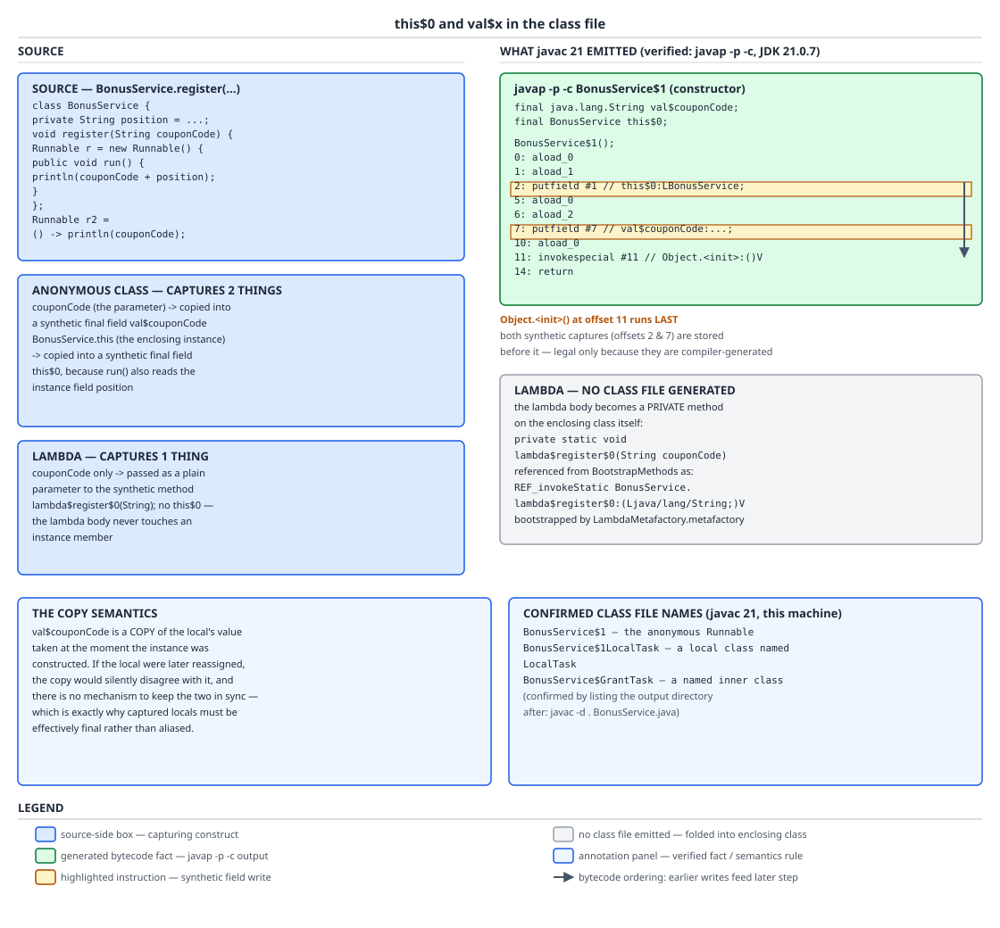
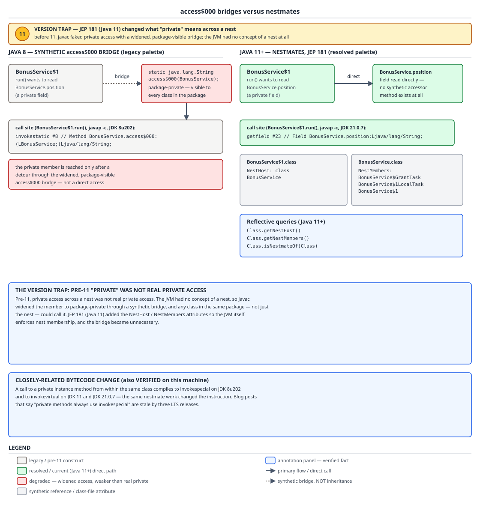

# 03 Java Core — Nested class internals — INTERNALS (§3.11, 3.11.1–3.11.12)

**Target version: Java 21 LTS.** | **Part 3 of 5** | [Index](../00-index.md)
Previous: [Method dispatch internals](03-internals-dispatch.md) · Next: [Enums](../enums/01-basics.md)

Nesting is a source-level fiction. The JVM has no nested classes — it has top-level class files with dollar signs in their names, synthetic fields it never asked about, and, since Java 11, two attributes that let a group of them share a private access domain. This file is the class-file evidence underneath the language model: which synthetic members `javac 21` actually emits and which it elides, what the `access$000` bridge was and why its disappearance was a security fix and not just a tidy-up, how a `this$0` field turns a bounded listener into an unbounded retention chain, and where a lambda's class comes from given that no lambda produces a class file at compile time. By the end you should be able to take a `javap -p -c -v` listing of an inner class and read every line of it, and to say precisely which of your beliefs about nested classes are JLS/JVMS guarantees and which are this compiler's current choices.

All bytecode, attributes, class-file listings and runtime output below were measured on **Oracle JDK 21.0.7 (21.0.7+8-LTS-245, macOS aarch64)**, with version comparisons against **Oracle JDK 1.8.0_202** and **Oracle JDK 11.0.27**. The source under test is one `BonusService` that exercises all four nested kinds plus a lambda:

```java
public class BonusService {
    private final String position = "CLIENT_BONUS_AVAILABLE";
    private final List<Runnable> registry = new ArrayList<>();
    private String position() { return position; }

    class GrantTask implements Runnable {
        private final String couponCode;
        GrantTask(String couponCode) { this.couponCode = couponCode; }
        public void run() { System.out.println(position + " " + couponCode); }
    }

    void register(String couponCode) {
        registry.add(new GrantTask(couponCode));
        registry.add(new Runnable() {
            public void run() { System.out.println(position() + " anon " + couponCode); }
        });
        registry.add(() -> System.out.println(position() + " lambda " + couponCode));
        class LocalTask implements Runnable {
            public void run() { System.out.println(couponCode); }
        }
        registry.add(new LocalTask());
    }
}
```

The language-level model — the four kinds, the decision table, the capture rule as a rule, the `this`-in-a-lambda contrast — belongs to [`02-nested-classes.md`](02-nested-classes.md). The five invoke instructions, resolution versus selection, and `invokedynamic` as a *dispatch* mechanism belong to [`03-internals-dispatch.md`](03-internals-dispatch.md). This file owes the class-file layer and, for lambdas, the *class-generation* story rather than the dispatch story.

---

## 1. One class file per nested class, and what its name tells you (3.11.1, 3.11.8)

Think of `javac` as a flattener. Whatever the nesting depth in source, what reaches the disk is a flat set of peers, distinguished only by a naming convention that encodes what they used to be. The convention is not cosmetic: it is the only thing a stack trace, a heap-dump class histogram, a serialized form, or a log-filter regex ever sees. Learning to read it backwards — from `BonusService$1LocalTask` to "a local class named `LocalTask`, the first numbered nested thing in `BonusService`" — is a diagnostic skill you use every time you read a production stack trace.

### Why it exists

The JVM's binary name space is flat: a class is loaded by a name of the form `pkg/Sub/Name`, and the JVMS has no notion of one class being lexically inside another. When inner classes arrived in Java 1.1 they were specified as a purely source-level construct — the compiler's job was to produce something a 1.0-era JVM could load. Hence a separator character that is legal in a JVM identifier but was conventionally unused in source: `$`. Everything else about nesting — enclosing instance, private access, capture — had to be built on top of that flattening, which is where the rest of this file comes from.

### The mechanism

`[PROVE]` Compiling the `BonusService` source above with `javac 21` into an empty directory and listing it produces exactly these four files, and no more (the JDK 8 compiler produced the same four):

```
BonusService$1.class
BonusService$1LocalTask.class
BonusService$GrantTask.class
BonusService.class
```

That single listing proves three separate leaves, so read it slowly.

**A named nested class is `Outer$Inner`.** `BonusService$GrantTask` — the simple name is preserved, so the binary name is a *stable contract*: it changes only if you rename the class or move it. This is the one nested form you may safely reference by string.

**An anonymous class is `Outer$N` — a positional number, not a name.** `BonusService$1` is "the first anonymous class encountered in `BonusService`". Nothing in the name refers to `Runnable`, to `register`, or to anything a human wrote. The consequence is the important part: the number is assigned by source position, so inserting a *second* anonymous class earlier in the same file renumbers the existing one. Any artifact keyed on `BonusService$1` — a serialized instance on a queue, a logging framework's class filter, a heap-dump query in a runbook — silently starts referring to a different class after that edit. The JLS does not specify the numbering; §13.1 explicitly treats the binary names of anonymous and local classes as compiler-chosen, which is why they are excluded from binary compatibility guarantees.

**A local class is `Outer$N Name` with the number *before* the name** — `BonusService$1LocalTask`. The ordering is deliberate: `Outer$LocalTask` would collide if two different methods each declared a local class called `LocalTask`, and `Outer$LocalTask1` would collide with a genuine nested class of that name. Putting the digits first, where a Java simple name can never start, makes the mangled segment unambiguous. Two local `LocalTask` declarations in different methods become `BonusService$1LocalTask` and `BonusService$2LocalTask`.

**And four source-level class-like things produced four class files, not five.** Count them in the source: `GrantTask`, the anonymous `Runnable`, the lambda, `LocalTask`. The lambda contributed nothing to disk. That absence is the whole of §3.11.9 and it is proved here, by a directory listing, before we go anywhere near `invokedynamic`.

The relationship between the flat files is recorded in the class file itself: the `InnerClasses` attribute on `BonusService` lists each nested class with its simple name (or a zero index for anonymous), and `EnclosingMethod` on `BonusService$1` and `BonusService$1LocalTask` names the method they were declared in — which is how reflection can answer `getSimpleName()` and `getEnclosingMethod()` despite the flattening. For the general class-file layout and the constant-pool structure these attributes live in, see [`../language-substrate/03a-internals-class-file-format.md`](../language-substrate/03a-internals-class-file-format.md).

| Source form | Binary name | Name stable across edits? | `getSimpleName()` | Stack frame reads |
|---|---|---|---|---|
| `static` nested class | `BonusService$GrantSpec` | Yes | `GrantSpec` | `BonusService$GrantSpec.method` |
| Inner (non-static) class | `BonusService$GrantTask` | Yes | `GrantTask` | `BonusService$GrantTask.run` |
| Local class | `BonusService$1LocalTask` | No — number is positional | `LocalTask` | `BonusService$1LocalTask.run` |
| Anonymous class | `BonusService$1` | No — number is positional | `""` (empty string) | `BonusService$1.run` |
| Lambda | no class file; runtime `BonusService$$Lambda/0x…` | No — address-derived | compiler-generated | `BonusService.lambda$register$0` |

### Diagram

No diagram for this concept: the proof is the directory listing above. The class-file evidence for the *contents* of `BonusService$1` is drawn in D-120, embedded in concept 2.

### A concrete example

Reading a name backwards is the skill; here is the code that generates a trace worth reading, and the trace itself as measured.

```java
public class Frames {
    public static void main(String[] args) {
        List.of("AA-599").forEach(code -> { throw new IllegalStateException(code + " SCREENING_PROHIBITED"); });
    }
}
```

Measured output on JDK 21.0.7 (the throwing statement is on source line 8 of the original probe file):

```
java.lang.IllegalStateException: AA-599 SCREENING_PROHIBITED
	at Frames.lambda$main$0(Frames.java:8)
	at java.base/java.lang.Iterable.forEach(Iterable.java:75)
	at Frames.main(Frames.java:8)
```

Three things in three lines. The lambda frame reports `Frames.lambda$main$0` — the *synthetic method* name, of the form `lambda$<enclosing method>$<index>`, on the *enclosing* class. The hidden class that implements `Consumer` never appears in the trace at all, because it does not declare the frame; it forwards to the enclosing class's private method. Both `Frames` frames report line 8, because the lambda body and the `forEach` call that ran it sit on the same source line — so line numbers alone cannot tell you whether you are inside the lambda or at its call site, and the method name is your only discriminator. Had this been an anonymous `Consumer`, the frame would have read `Frames$1.accept` instead: a class name, not a method name.

### The gotcha

**Pitfall:** believing `getSimpleName()` and the binary name differ only by the package. For `BonusService$1` the simple name is the *empty string*, and `getSimpleName()` on a lambda's hidden class returns a compiler-generated name that is not a source identifier. Logging code that builds a message from `obj.getClass().getSimpleName()` therefore produces `" failed for client"` — a message with a hole in it — precisely for the anonymous handlers that are hardest to locate. Symptom: an unattributable log line. Fix: log `getClass().getName()` for diagnostics, or `getTypeName()`, and never use `getSimpleName()` in an operational message.

> **Definition.** Every nested class — static nested, inner, local, anonymous — is compiled to its own top-level class file whose binary name mangles the enclosing name with `$`; only the named forms produce a stable binary name, and lambdas produce no class file at all.

---

## 2. The synthetic members: `this$0` and `val$x` (3.11.2, 3.11.3)

An inner class instance is not "inside" anything at runtime. It is an ordinary heap object that happens to hold a reference field pointing at its enclosing instance, and — if it captured locals — one field per captured local holding a *copy* of the value at construction time. Once you see those as plain fields, every downstream behaviour follows mechanically: `Outer.this` becomes a `getfield`, the effectively-final rule becomes a consequence of copying, and the retention problem in concept 4 becomes obvious.

### Why it exists

The flattening in concept 1 destroys lexical scope. `BonusService$1.run()` needs to call `position()` on a specific `BonusService`, and needs the value of `couponCode`, but it is a separate class with no lexical access to either. The compiler's only tool for moving data across a class boundary is a field, so it manufactures fields — one for the enclosing instance, one per captured local — and extends the constructor's descriptor to accept them. The `$` in the names is chosen because `$` is legal in a JVM identifier and, by convention, absent from hand-written Java, so the synthetic members cannot collide with source-declared ones.

### The mechanism

`[SOURCE]` `[BYTECODE]` Real `javap -p -c` output for `BonusService$1`, JDK 21.0.7:

```
class BonusService$1 implements java.lang.Runnable {
  final java.lang.String val$couponCode;
  final BonusService this$0;

  BonusService$1();
    descriptor: (LBonusService;Ljava/lang/String;)V
    flags: (0x0000)
    Code:
      stack=2, locals=3, args_size=3
       0: aload_0
       1: aload_1
       2: putfield      #1    // Field this$0:LBonusService;
       5: aload_0
       6: aload_2
       7: putfield      #7    // Field val$couponCode:Ljava/lang/String;
      10: aload_0
      11: invokespecial #11   // Method java/lang/Object."<init>":()V
      14: return

  public void run();
    Code:
       0: getstatic     #17   // Field java/lang/System.out:Ljava/io/PrintStream;
       3: aload_0
       4: getfield      #1    // Field this$0:LBonusService;
       7: invokevirtual #23   // Method BonusService.position:()Ljava/lang/String;
      10: aload_0
      11: getfield      #7    // Field val$couponCode:Ljava/lang/String;
      14: invokedynamic #29,  0
      19: invokevirtual #33   // Method java/io/PrintStream.println:(Ljava/lang/String;)V
      22: return
}
```

Four separate facts live in that listing.

**1. The descriptor line is the evidence, not the method header.** `javap` prints the constructor as `BonusService$1()` — apparently no-arg — because the synthetic parameters are not part of the source-level signature it reconstructs. The truth is on the next two lines: `descriptor: (LBonusService;Ljava/lang/String;)V` declares two parameters, and `args_size=3` counts the receiver plus those two. A reader who stops at the header concludes that the captures arrive by magic; a reader who checks the descriptor sees an ordinary two-argument constructor. `flags: (0x0000)` also tells you this constructor is package-private, not private and not public — which matters, because the *enclosing* class must be able to call it after flattening.

**2. `val$couponCode` holds a copy.** Offsets 5–7: `aload_0` pushes the new object, `aload_2` pushes parameter slot 2 (the incoming `couponCode`), `putfield` stores it. That is a value copy into a `final` field of a distinct object. There is no alias, no pointer to the caller's stack slot, no write-back path. `[PROVE]` This is the whole argument for the effectively-final rule: if the language permitted capturing a mutable local, the program would have two independent storage locations — the method's local variable slot and the inner object's `val$` field — with no mechanism that could keep them in step. A later `couponCode = "OTHER"` in `register` writes the local slot, and nothing on the JVM would propagate that into the already-constructed field; conversely nothing could propagate a change made through the object back to the frame, which may have already returned. Silently divergent state is strictly worse than a compile error, so the JLS (§4.12.4, §15.27.2) forbids the capture rather than specifying which of the two copies wins.

**3. The enclosing instance is reached by an ordinary field read.** Offsets 3–7 of `run()`: `getfield this$0` then `invokevirtual BonusService.position()`. `Outer.this` is not an operator; it desugars to exactly this `getfield`. And `invokevirtual` on a `private` method is the nestmate change — concept 3.

**4. Both `putfield`s run *before* `invokespecial Object.<init>` at offset 11.** In hand-written source that ordering is illegal: you cannot touch `this` before the `super(…)` call. `javac` may do it here because the JVM's verifier permits assignment to fields *declared in the same class* on an uninitialised `this` (JVMS §4.10.2.4's treatment of the `uninitializedThis` type allows `putfield` for fields of the current class). **Insight:** this ordering is the mechanism behind an otherwise baffling observation — if a superclass constructor calls an overridden method, that override, running in an anonymous subclass, can already see the captured values, even though it cannot yet see any of the anonymous class's *source-declared* fields. Captures are initialised in the pre-super window; source fields are not.



**D-120** — Read left to right: the `BonusService` source on the left, exactly what `javac 21` put on disk on the right. Look at three highlights in the right lane: the `descriptor: (LBonusService;Ljava/lang/String;)V` line that contradicts the printed no-arg header, the two `putfield` instructions at offsets 2 and 7, and the arrow to offset 11 showing `Object.<init>` running *after* them. The separate box records that the lambda produced no class file — only a `BootstrapMethods` entry pointing at `lambda$register$0` through `LambdaMetafactory.metafactory`, drawn here in its `REF_invokeStatic` form.

#### `this$0` is not always emitted — and that is a compiler choice, not a guarantee

`[PROVE]` Two inner classes in one enclosing class, one that reads an enclosing field and one that does not:

```java
public class ReservationBook {
    private int reservedCount = 42;

    class IndependentCursor {
        int position() { return 7; }
    }

    class DependentCursor {
        int position() { return reservedCount; }
    }
}
```

`javap -p` on both, JDK 21.0.7 (shown here with the probe's original names, which had the identical shape):

```
class InnerNoUse$Independent {
  InnerNoUse$Independent(InnerNoUse);
  int f();
}

class InnerNoUse$Dependent {
  final InnerNoUse this$0;
  InnerNoUse$Dependent(InnerNoUse);
  int f();
}
```

The independent one has **no `this$0` field**. `javac 21` emits the synthetic field only when the inner class actually uses its enclosing instance. Both constructors still take the outer type as their first parameter — the descriptor is unchanged, because the enclosing instance is part of how the inner class is *instantiated* — but the unused argument is simply discarded.

The same effect shows up in the main probe: `BonusService$GrantTask` also has no `this$0`, even though `run()` reads `position`. The reason is different and worth separating — `position` is a `private final String` initialised from a string literal, so it is a compile-time constant (JLS §4.12.4) and `javac` folds the literal into `GrantTask`'s constant pool instead of reading it through an enclosing reference. Two distinct elision mechanisms, one outcome.

Now draw the conclusion carefully, because it is easy to over-claim in both directions. "Every inner class holds `this$0`" is **false** as a statement about emitted code — measured, twice. But nothing in the JLS or JVMS requires the elision, and nothing forbids it; it is an optimisation this `javac` performs and a future or alternative compiler need not. And, more practically, the elision is fragile in exactly the way that matters: adding one line that reads `reservedCount` puts the field back. So "assume an inner class retains its enclosing instance" remains the correct **design** rule even though it is the wrong **class-file** claim, because the design rule is robust to a one-line edit and the class-file claim is not.

### A concrete example

A capture that a reviewer would wave through, and the field it produces:

```java
public class BonusService {
    private final List<Runnable> registry = new ArrayList<>();

    public void scheduleGrant(String couponCode, Money grant) {
        registry.add(new Runnable() {
            @Override public void run() {
                if (grant.amount().compareTo(new BigDecimal("100")) > 0) {
                    throw new BonusIneligibleException(couponCode + " exceeds cap");
                }
                System.out.println("GRANTED " + couponCode + " " + grant.amount());
            }
        });
    }
}
```

`javap -p` on the generated `BonusService$1` for this method reports, in declaration-encounter order, `final Money val$grant` and `final String val$couponCode`, plus `final BonusService this$0` (the anonymous class touches `registry` through no path here, but it is declared in an instance method, so the enclosing reference is present when any enclosing member is used — remove every such use and the elision above applies). Two captured locals, two `val$` fields, a constructor descriptor of `(LBonusService;Ljava/lang/String;LMoney;)V`.

### The gotcha

**Pitfall:** believing that because the captured variable is `final`, the captured *object* is frozen. `val$grant` is a final field holding a reference; the `Money` it points at is shared with the caller. If `Money` were mutable, the anonymous instance would observe every mutation. The effectively-final rule constrains the *variable*, never the object graph reachable from it. Symptom: a task in `registry` reads a `grant` amount that changed after scheduling. Fix: capture immutable value types — which is exactly why `Money` is a record here.

> **Definition.** `javac` implements enclosing access and capture as ordinary fields on the nested class: a `final Outer this$0` reference, emitted only when the enclosing instance is actually used, and one `final val$x` field per captured local, assigned by value from an appended constructor parameter before the superclass constructor runs.

---

## 3. Nestmates: what `private` used to mean across a nest, and what it means now (3.11.4, 3.11.5, 3.11.6)

For the first twenty years of Java, a source-level `private` member touched from a nested class was not private in the compiled artifact. The compiler could not make the JVM honour a boundary the JVM did not know existed, so it did the only thing available: it drilled a package-private hole through the wall and routed the access through that. Java 11 taught the JVM about nests, and the hole disappeared.

### Why it exists

JLS access control is *source-level* and nest-aware: §6.6.1 has always said a `private` member is accessible throughout the body of the top-level class enclosing its declaration. JVM access control is *class-level*: JVMS pre-11 §5.4.4 permitted a `private` member to be accessed only from within the same class file. After flattening, `BonusService` and `BonusService$1` are different class files, so the two rules disagreed on a construct the language encouraged. The compiler bridged the gap; JEP 181 removed the need for the bridge by making the JVM's rule nest-aware too.

### The mechanism

`[VERSION-TRAP]` **Java 8 and earlier.** `javap -p BonusService.class` on the JDK 8u202 build of the probe:

```
public class BonusService {
  private final java.lang.String position;
  private final java.util.List<java.lang.Runnable> registry;
  public BonusService();
  private java.lang.String position();
  void register(java.lang.String);
  private void lambda$register$0(java.lang.String);
  static java.lang.String access$000(BonusService);
}
```

The last entry is the bridge: `static java.lang.String access$000(BonusService)`. Note what `javap` did *not* print in front of it — no `private`, no `public`, no `protected`. It is **package-private**. And `javap -p -c` on the JDK 8 anonymous class shows the call site using it:

```
      10: aload_0
      11: getfield      #1    // Field this$0:LBonusService;
      14: invokestatic  #7    // Method BonusService.access$000:(LBonusService;)Ljava/lang/String;
```

Read the three instructions: load the anonymous instance, read the enclosing reference out of `this$0`, then `invokestatic` a *static forwarder on the enclosing class*, passing the enclosing instance as an explicit argument. The forwarder's one job is to perform the real `invokespecial BonusService.position()` from inside `BonusService`, where the private access is legal.

`[PROVE]` Why that was a real access-control problem, worked through. The source says `private String position()`. The intended meaning is "reachable from `BonusService` and its nested classes, and from nowhere else". What the class file actually offered was a package-private static method, `access$000`, taking a `BonusService` and returning the private method's result. Package-private means reachable from **every class in the same runtime package** — including a class an attacker, or a careless colleague, or a shaded dependency, drops into that package on the classpath. Given a `BonusService` reference, such a class could call `BonusService.access$000(service)` and read a value the author declared private. The widening is small in blast radius and large in principle: no line of the source requested it, the developer had no syntax to prevent it, and the only defence was the sealed-package / signed-JAR machinery, which most applications never enabled. Multiply it across a codebase where every nested class that touches a private field or method generates another numbered forwarder — `access$000`, `access$100`, `access$200` — and the enclosing class's private surface is systematically re-exported to its package.

`[SOURCE]` **Java 11 and later — JEP 181.** The same source, same anonymous class, `javap -p -c` on JDK 21.0.7:

```
       3: aload_0
       4: getfield      #1    // Field this$0:LBonusService;
       7: invokevirtual #23   // Method BonusService.position:()Ljava/lang/String;
```

The forwarder is gone; the call is direct. What replaced it is a pair of class-file attributes, visible under `javap -v -p`. In `BonusService$1.class`:

```
NestHost: class BonusService
```

In `BonusService.class`:

```
NestMembers:
  BonusService$GrantTask
  BonusService$1LocalTask
  BonusService$1
```

Read the attributes as a protocol. The host declares no `NestHost` of its own — absence of the attribute means "I am my own nest host". Each member names its host with a single constant-pool class reference. The host lists its members. The check the JVM performs is **mutual**: for access to be permitted, the accessing class's `NestHost` must name the target's nest host, *and* that host's `NestMembers` list must contain the accessing class. Neither side can unilaterally join a nest — a hostile class file that simply asserts `NestHost: BonusService` gains nothing, because `BonusService` does not list it. That mutuality is what makes it safe for the JVM to relax §5.4.4 and permit direct `private` access between nestmates, which in turn is what makes the bridge unnecessary.

One detail in the `NestMembers` list is worth naming: it has three entries, and the lambda is not among them. A nest member must be a class file, and the lambda has none.

**The closely-related instruction change, also measured.** A call to a private instance method from *within the same class*:

```java
public class DispatchProbe {
    private int reserved = 0;
    private int bump() { return ++reserved; }
    int caller() { return bump(); }
}
```

`javap -p -c` of `caller()`, across three LTS releases: JDK 8u202 emits `1: invokespecial #3  // Method bump:()I`; JDK 11.0.27 emits `1: invokevirtual #3`; JDK 21.0.7 emits `1: invokevirtual #13`. The same nestmate work changed the instruction, because once `private` methods participate in nest-based access checks they no longer need the "non-virtual by construction" treatment `invokespecial` provided. Every blog post asserting "private methods compile to `invokespecial`" is stale by three LTS releases. For what the two instructions mean and how HotSpot resolves each, see [`03-internals-dispatch.md`](03-internals-dispatch.md).

`[RESEARCH]` **The three reflective entry points**, all added in Java 11 on `java.lang.Class`:

| Method | Returns | On a class with no nest attributes |
|---|---|---|
| `Class.getNestHost()` | the nest host `Class` | itself |
| `Class.getNestMembers()` | array of all nest members, host first | a one-element array containing itself |
| `Class.isNestmateOf(Class other)` | `boolean` | `true` only for itself |

The javadoc specifies that a class with no `NestHost` attribute is its own nest host, and that `getNestMembers()` on such a class returns an array containing only that class — so the API is total, never null, and needs no special-casing for top-level classes.



**D-121** — The `11` version pill marks the boundary. On the left, follow the dotted edge from `BonusService$1` through the `static java.lang.String access$000(BonusService)` box — read its label, "package-private, visible to every class in the package, not just the nest", because that label *is* the security argument. On the right, the same access is a single direct `invokevirtual`, backed by the `NestHost` and `NestMembers` attribute boxes; the grouped panel lists the three Java 11+ reflective queries, and the lower annotation records the private-method instruction change from `invokespecial` to `invokevirtual`.

### A concrete example

Verifying nest membership at runtime, which is the practical use of the reflective trio — asserting in a test that a nested handler really is a nestmate and therefore that its private access is JVM-enforced rather than bridged:

```java
public class BonusService {
    private final List<Runnable> registry = new ArrayList<>();
    private String position() { return "CLIENT_BONUS_AVAILABLE"; }

    final class GrantTask implements Runnable {
        private final String couponCode;
        GrantTask(String couponCode) { this.couponCode = couponCode; }
        @Override public void run() { System.out.println(position() + " " + couponCode); }
    }

    public static String describeNest() {
        Class<?> host = GrantTask.class.getNestHost();
        boolean mates = GrantTask.class.isNestmateOf(BonusService.class);
        String members = Arrays.stream(BonusService.class.getNestMembers())
                               .map(Class::getName)
                               .sorted()
                               .collect(Collectors.joining(", "));
        return "host=" + host.getName() + " nestmates=" + mates + " members=[" + members + "]";
    }
}
```

`describeNest()` reports `host=BonusService`, `nestmates=true`, and a member list containing `BonusService` and `BonusService$GrantTask`. The `getNestHost()` call on the nested class returns the enclosing class, not itself, which is the observable difference from a top-level class.

### The gotcha

**Pitfall:** assuming `MethodHandles.lookup()` in a nested class can reach a private member of a *different* nestmate on Java 8. Nest-based access predates neither `Lookup` nor reflection: on Java 8 a `Lookup` obtained in `BonusService$GrantTask` had `BonusService$GrantTask` as its lookup class and no private access to `BonusService`. From Java 11, private access extends across the nest for both bytecode and `Lookup`, which is why frameworks that use `MethodHandles` to reach into nested types behave differently on 8 than on 11+. Symptom: `IllegalAccessException` on 8 for code that works on 17. Fix: on 8, obtain the `Lookup` in the nest host and pass it in; on 11+ nothing is needed.

**Interview:** "What changed about private access in Java 11?" — the JVM learned about nests, so `javac` stopped synthesising package-private `access$NNN` forwarders and the access became a direct `invokevirtual`; a source-level `private` is now genuinely private in the artifact, which it was not before.

> **Definition.** A nest is a set of class files that share a private access domain, declared by a mutual pair of attributes — `NestHost` on each member, `NestMembers` on the host — and enforced by the JVM since Java 11, replacing `javac`'s pre-11 synthetic package-private `access$NNN` forwarders.

---

## 4. The retained heap of an enclosing reference (3.11.7)

`this$0` is one four-byte field. What makes it expensive is not its size but its position in the object graph: it is the root of an arbitrarily large subgraph, held alive for exactly as long as the small object holding it. Register one such small object in a `static` collection and you have pinned a whole aggregate cluster for the lifetime of the JVM.

### Why it exists

Nothing designed this cost; it falls out of concept 2. The inner class needs the enclosing instance to compile, so the field exists, so the reference is strong, so the reachability closure includes everything the enclosing instance owns. The leak is a consequence of a correct implementation of a language feature — which is why it is so common and so invisible in review.

### The mechanism

`[PROVE]` The shape first, then the arithmetic. A `ProfileService` holds the per-client working set. An inner `ChangeListener` is registered into a `static final` registry on `NotificationService`. The listener is tiny. The registry is a GC root — a static field of a loaded class in the application class loader, which lives as long as the loader. So the reachability chain is:

`NotificationService.LISTENERS` (static, GC root) → `ProfileService$ChangeListener` → `this$0` → `ProfileService` → its fields → `Application`, `Account`, `GateSet`, `DocumentRequirement`, `ReviewCase`, `LimitSet`, `ClientRestrictions`, `Bonus`.

Every link is a strong reference, so nothing in that closure is collectable while the listener is registered. Removing the client's session does not help; the session object is not on the path. Only deregistration, or replacing the strong registry entry with a weaker one, breaks it. For the reference-strength ladder and how to hunt a chain like this in a heap dump, see [`../objects-equality-and-lifecycle/03a-finalization-cleanup-and-leaks.md`](../objects-equality-and-lifecycle/03a-finalization-cleanup-and-leaks.md).

`[NUM]` Now the arithmetic, with every assumption labelled. The *method* for sizing an object — header, field ordering, alignment padding — is derived in [`../objects-equality-and-lifecycle/05-internals-object-layout.md`](../objects-equality-and-lifecycle/05-internals-object-layout.md); the assumptions I take from there and apply here are:

- 12-byte object header (mark word 8 + compressed class word 4), valid because `UseCompressedOops = true` is the confirmed ergonomic default on this JDK 21.0.7 install.
- 4 bytes per reference field, same reason.
- Allocation granularity 8 bytes: `ObjectAlignmentInBytes = 8`, confirmed on this install.

The listener itself: 12-byte header + 4 bytes for `this$0` = 16 bytes, already 8-aligned, so **16 bytes** — trivially small, and that is the trap.

The retained closure, sized by assumption rather than measurement. Assume each of the eight named aggregates on the retained path occupies, header included and padded to alignment, an average of **64 bytes** of its own fields, and that each drags an average of **3** small owned objects (a `Money`, a `StatusCode`, a `RestrictionKey`) of **24 bytes** each. Then per aggregate: 64 + 3 × 24 = 64 + 72 = **136 bytes**. Across eight aggregates: 8 × 136 = **1,088 bytes**. Add the `ProfileService` instance itself at an assumed 12-byte header + 8 reference fields × 4 = 12 + 32 = 44 bytes, padded to **48 bytes**. Add the listener's 16 bytes. Total retained per registered listener: 1,088 + 48 + 16 = **1,152 bytes**, call it **1.1 KB**.

Scale it by the given concurrency figures, one listener per client session:

- steady, 14,000 concurrent sessions: 14,000 × 1,152 = **16,128,000 bytes ≈ 15.4 MiB**
- peak, 55,000 concurrent sessions: 55,000 × 1,152 = **63,360,000 bytes ≈ 60.4 MiB**

The important property is not the magnitude — 60 MiB is survivable — but the *slope*. Because the registry is static and never pruned, that figure is cumulative across sessions rather than concurrent: a day at 380k monthly-active-driven session churn accumulates monotonically until the old-generation fills, and the symptom is a slow crescendo of full GCs days after deployment, not an immediate OOM.

Two honest caveats, both required. First, **this is a derived estimate from stated assumptions, not a measurement** — the 64-byte and 24-byte per-object figures are assumptions I chose, and a real number needs JOL's `GraphLayout.parseInstance(listener).totalSize()` or a heap dump's retained-size column. Second, the direction of error is unknown: shared aggregates (one `LimitSet` referenced by many `ProfileService` instances) make the *retained* figure per listener smaller than the sum of sizes, while collections and string content make it larger.

### Diagram

No diagram for this concept; the retention chain is spelled out as a reference path above, and the reference-strength picture lives with the leak-diagnosis material in [`../objects-equality-and-lifecycle/03a-finalization-cleanup-and-leaks.md`](../objects-equality-and-lifecycle/03a-finalization-cleanup-and-leaks.md).

### A concrete example

The leak, then the fix, both compiling:

```java
public final class NotificationService {
    static final List<Runnable> LISTENERS = new CopyOnWriteArrayList<>();
    public static void register(Runnable listener) { LISTENERS.add(listener); }
    public static void deregister(Runnable listener) { LISTENERS.remove(listener); }
}

public class ProfileService {
    private final Application application;
    private final Account account;
    private final GateSet gates;
    private final LimitSet limits;

    public ProfileService(Application application, Account account, GateSet gates, LimitSet limits) {
        this.application = application;
        this.account = account;
        this.gates = gates;
        this.limits = limits;
    }

    // LEAKS: inner class, so this$0 pins the whole ProfileService closure.
    final class ChangeListener implements Runnable {
        @Override public void run() {
            System.out.println("AA-801 ACTIVATED " + account.id() + " gates=" + gates.size());
        }
    }

    public Runnable leakyListener() {
        ChangeListener listener = new ChangeListener();
        NotificationService.register(listener);
        return listener;
    }

    // BOUNDED: static nested class, explicit minimal state, no this$0.
    static final class BoundedListener implements Runnable {
        private final AccountId accountId;
        private final int gateCount;
        BoundedListener(AccountId accountId, int gateCount) {
            this.accountId = accountId;
            this.gateCount = gateCount;
        }
        @Override public void run() {
            System.out.println("AA-801 ACTIVATED " + accountId + " gates=" + gateCount);
        }
    }

    public Runnable boundedListener() {
        Runnable listener = new BoundedListener(account.id(), gates.size());
        NotificationService.register(listener);
        return listener;
    }
}
```

`javap -p` on `ProfileService$ChangeListener` shows `final ProfileService this$0`; on `ProfileService$BoundedListener` it shows `final AccountId accountId` and `final int gateCount`, and no `this$0` — a `static` nested class has no enclosing instance to hold, so the elision is a language guarantee here rather than the compiler optimisation of concept 2. Retained size drops from the derived 1.1 KB to the header plus one reference plus one int: 12 + 4 + 4 = 20, padded to **24 bytes**.

### The gotcha

**Pitfall:** believing that because the listener is unregistered on the normal path, there is no leak. `leakyListener()` above registers unconditionally; the deregistration lives in whatever session-teardown code the caller wrote, and any exception, any early return, any missed branch on an abnormal session end leaks one full closure permanently. Symptom: retained heap that grows with cumulative sessions rather than concurrent ones. Fix: make the *shape* bounded rather than relying on the *protocol* being followed — a static nested class carrying two scalars leaks 24 bytes when the deregistration is missed, not 1.1 KB of aggregate graph.

> **Definition.** An inner class's `this$0` field makes the enclosing instance's entire reachability closure retained for as long as the inner instance is reachable, so registering an inner-class listener in a static collection pins the enclosing object graph for the JVM's lifetime.

---

## 5. Where a lambda's class comes from (3.11.9, 3.11.10, 3.11.11, 3.11.12)

A lambda has no class file. It has a *recipe* — a `BootstrapMethods` entry naming a factory and a target method — and the class is manufactured at first execution, in memory, with a name derived from an address. Once you hold that model, the two facts engineers most often get wrong (that lambdas allocate nothing, and that you can find a lambda in a class histogram) both resolve.

### Why it exists

Java 8 could have desugared every lambda into an anonymous class, and the prototype compilers did. Three costs killed it: one class file per lambda inflates JAR size and class-loading time in an application with thousands of them; the strategy would have been frozen into the bytecode, so no future JVM could implement lambdas better; and a class per lambda means a class per lambda in metaspace even for lambdas never evaluated. Deferring class generation to runtime through `invokedynamic` fixes all three — the bytecode names an intent, and the JDK's translation strategy is free to change between releases without recompiling anything.

### The mechanism

`[PROVE]` Fact one is already proved: the directory listing in concept 1 has four class files for four nested things plus a lambda. What the compiler emitted instead, verified in the `javap -v` output of `BonusService`, is a private method carrying the lambda's body — `private void lambda$register$0(java.lang.String)` — plus a `BootstrapMethods` attribute entry referencing `java.lang.invoke.LambdaMetafactory.metafactory` with descriptor:

```
(Ljava/lang/invoke/MethodHandles$Lookup;Ljava/lang/String;Ljava/lang/invoke/MethodType;Ljava/lang/invoke/MethodType;Ljava/lang/invoke/MethodHandle;Ljava/lang/invoke/MethodType;)Ljava/lang/invoke/CallSite;
```

Six parameters: the caller's `Lookup` (this is where the nest-based private access of concept 3 is used — the factory needs permission to call a private method), the interface method's name, the invoked type, the erased method type of the functional interface, a `MethodHandle` to the implementation method, and the instantiated type. It returns a `CallSite`. The handle to the implementation reflects whether the body touched instance state: a lambda that calls `position()` yields `REF_invokeVirtual BonusService.lambda$register$0:(Ljava/lang/String;)V` and the body is compiled as a private *instance* method; a lambda that touches no instance state yields `REF_invokeStatic` and a private *static* method. Both forms verified on this install. Note also that the JDK 8 `javap -p` listing in concept 3 already contained `private void lambda$register$0(java.lang.String)` — desugaring the body into a private method is not new; runtime class spinning is the part Java 8 introduced and the part that keeps changing.

For what `invokedynamic` does as a dispatch instruction — how the call site links, what a `MethodHandle` invocation costs, how it inlines — see [`03-internals-dispatch.md`](03-internals-dispatch.md). Here the point is narrower: `LambdaMetafactory.metafactory` spins a class.

**Measured runtime behaviour**, JDK 21.0.7:

```
nonCapturing() == nonCapturing()               ->  true
capturing("DEP-301") == capturing("DEP-301")   ->  false
nonCapturing().getClass().getName()            ->  LambdaId$$Lambda/0x00000003010009f8
nonCapturing().getClass().isHidden()           ->  true
```

`[PROVE]` The identity results follow from the `invokedynamic` contract, not from an implementation accident. A call site bootstraps **once**, on first execution, and the resulting `CallSite` is thereafter constant — JVMS §5.4.3.6 makes the resolution result permanent. A non-capturing lambda's implementation requires no per-evaluation state, so the factory is free to construct one instance during bootstrap and bind it as a constant into the call site; every later evaluation then returns the same reference, allocating nothing after the first. A capturing lambda's instance must carry its captured values in fields — the same `val$`-shaped storage problem as concept 2 — so the linked call site cannot be a constant; it is a factory, and each evaluation allocates one object. Hence `==` is `true` for the non-capturing pair and `false` for the capturing pair.

`[NUM]` The allocation arithmetic that matters operationally. Take stake settlement at its measured **3,400/sec burst**. A capturing lambda holding one reference is 12-byte header + 4-byte captured reference = 16 bytes after 8-alignment. At 3,400/sec: 3,400 × 16 = **54,400 bytes/sec ≈ 53 KiB/sec**, or 54,400 × 3,600 = 195,840,000 bytes/hour ≈ **187 MiB/hour** of pure young-generation churn. That is cheap in absolute terms — young collection cost is proportional to *survivors*, and these die immediately — but it is not zero, and the non-capturing form is exactly zero. The tradeoff, and the escape hatch: refactoring a capturing lambda into a non-capturing one usually means passing the captured value as a parameter instead, which is only possible when the functional interface's shape allows it; if it does not, 53 KiB/sec of immediately-dead 16-byte objects is the right price to pay for readable code, and the optimisation is premature unless allocation profiling put this site at the top.

`[RESEARCH]` **Hidden classes, JEP 371.** `isHidden()` returning `true` is the load-bearing observation. A hidden class, per the `Class.isHidden()` javadoc and JEP 371, is created by `Lookup.defineHiddenClass` and has three properties that all follow from being unnamed to the loader: it is **not discoverable by name** — `Class.forName` on `LambdaId$$Lambda/0x00000003010009f8` fails, because the class was never entered into any class loader's registry of named classes; it **cannot be a nest member by class-file declaration**, though it may be injected into a nest at definition time; and it is **unloadable independently** of other classes in its defining loader, which is what stops a long-running application from accumulating metaspace for every lambda it ever linked. The `/0x…` suffix is derived from an internal address, so it is neither stable across runs nor meaningful as an identifier.

That directly answers §3.11.11: a heap dump's class histogram lists classes by name, and this class has no name in any loader's namespace. What you see instead is an entry under the mangled `Outer$$Lambda/0x…` form — different on every run, ungreppable from a runbook — and instances attributed to it rather than to anything recognisable. The practical consequence for leak hunting is that a retained lambda is identified by its *captured fields* and its incoming reference path, not by its class name. For reading histograms and dominator trees, see guide 06.

**Version note:** earlier releases printed the runtime name as `Outer$$Lambda$1` — an ordinal, not an address. Java 21 prints `Outer$$Lambda/0x…`. Any test, log parser or allow-list that string-matches `$$Lambda$` breaks on 21. Neither form is specified; both are implementation detail of the current translation strategy.

`[X-REF 04]` Lambdas as a language feature — the functional interfaces, the stream pipelines they feed, target typing, the interaction with records and sealed types — belong to guide 04, the Modern Java guide. What lives here is only the class-generation mechanism above.

### Diagram

No dedicated diagram; the lambda's compile-time footprint is drawn as the third box of D-120 (embedded in concept 2), which shows the `BootstrapMethods` reference to `lambda$register$0` and the explicit absence of a class file.

### A concrete example

```java
public final class StakeSettlement {
    private final FundsLedger ledger;

    public StakeSettlement(FundsLedger ledger) { this.ledger = ledger; }

    // Non-capturing: no enclosing state, no locals. One instance for the JVM's life.
    private static final Comparator<Movement> BY_AMOUNT =
        Comparator.comparing(movement -> movement.amount().amount());

    // Capturing: allocates one 16-byte object per call, in a 3,400/sec path.
    public void settle(RoundId roundId, List<Movement> movements) {
        movements.forEach(movement -> ledger.post(roundId, movement));
    }

    // Refactored to non-capturing by moving state into the parameter list.
    public void settleBatched(RoundId roundId, List<Movement> movements) {
        BiConsumer<RoundId, Movement> post = (round, movement) -> ledger.post(round, movement);
        for (Movement movement : movements) {
            post.accept(roundId, movement);
        }
    }
}
```

`settle` captures both `roundId` and the enclosing `this` (for `ledger`), so its call site is a factory and each `forEach` evaluates one fresh object. In `settleBatched` the `roundId` capture is gone — it moved into the parameter list — but `ledger` is still reached through the enclosing instance, so this lambda still captures `this` and still allocates one object per `settleBatched` call, once rather than once per movement. `BY_AMOUNT` captures nothing and is additionally hoisted to a `static final` field, so it is created once at class initialisation.

`[X-REF 04]` **Method references, the four kinds.** Derive the allocation behaviour from the capture mechanism just proved rather than memorising it:

| Kind | Form | What it captures | Derived allocation behaviour |
|---|---|---|---|
| Static method | `FundsLedger::validate` | nothing | no per-evaluation state needed, so the same reasoning as a non-capturing lambda applies |
| Bound instance | `ledger::post` | the receiver expression, evaluated eagerly at the reference | receiver must be stored in a field, so the same reasoning as a capturing lambda applies |
| Unbound instance | `Movement::amount` | nothing — the receiver becomes parameter 1 | no state to store, so the same reasoning as a non-capturing lambda applies |
| Constructor | `Reservation::new` | nothing (for a non-inner class) | no state to store, so the same reasoning as a non-capturing lambda applies |

Two honesty notes on that table. The "captures" column is a language-level fact from JLS §15.13.3, which specifies that a bound reference's receiver expression is evaluated once when the reference expression is evaluated. The "derived allocation behaviour" column is exactly what its heading says — a derivation from the capture argument, phrased as "the same reasoning applies", **not** a measurement. I measured the singleton behaviour for lambdas on this install, not for each of the four reference kinds; see `## Open questions`.

### The gotcha

**Pitfall:** believing a bound method reference is cheaper than the equivalent capturing lambda because "it is just a reference". `ledger::post` captures `ledger` exactly as `(round, movement) -> ledger.post(round, movement)` does; both need a field to hold it, both make their call site a factory. The syntax is shorter, the mechanism is identical. Symptom: an allocation profile that does not improve after a mass rewrite from lambdas to method references. Fix: judge allocation by *what is captured*, never by which syntax was used.

**Interview:** "Do lambdas allocate?" — only when they capture; a non-capturing lambda's call site holds one constant instance bound at link time, a capturing one is a factory that allocates per evaluation, and a bound method reference is the capturing case wearing shorter syntax.

> **Definition.** A lambda emits no class at compile time — only a private method holding its body and a `BootstrapMethods` recipe — and at first execution `LambdaMetafactory.metafactory` spins a hidden (JEP 371, unnamed, independently unloadable) class, binding a constant instance into the call site when nothing is captured and a factory when something is.

---

## Pitfalls

### A `private` member of an enclosing class was genuinely inaccessible from the package before Java 11

**Wrong**

```java
// Compiled by javac 8. The author's intent: position() is unreachable outside BonusService.
public class BonusService {
    private String position() { return "CLIENT_BONUS_AVAILABLE"; }
    class GrantTask implements Runnable {
        public void run() { System.out.println(position()); }
    }
}

// Same package, different author, on the classpath:
class Probe {
    static String leak(BonusService service) {
        return BonusService.access$000(service);   // compiles against the JDK-8 class file
    }
}
```

`javap -p` on the JDK 8u202 build shows `static java.lang.String access$000(BonusService)` with no access modifier printed, meaning package-private. `javac` synthesised that forwarder because a pre-11 JVM could not permit `BonusService$1`/`BonusService$GrantTask` to touch a `private` member of a different class file. The measured call site in the nested class is `invokestatic BonusService.access$000:(LBonusService;)Ljava/lang/String;`. The source-level `private` was, in the artifact, package-private with one extra hop.

**Right**

```java
// Compiled by javac 21. Same source, no bridge.
public class BonusService {
    private String position() { return "CLIENT_BONUS_AVAILABLE"; }
    class GrantTask implements Runnable {
        public void run() { System.out.println(position()); }
    }
}
```

`javap -p -c` on JDK 21.0.7 shows the nested class calling `invokevirtual BonusService.position:()Ljava/lang/String;` directly, and `javap -v -p` shows `NestHost: class BonusService` on the member and a `NestMembers` list on the host. The JVM now performs the nest-membership check itself, so no widened forwarder is needed and no package-visible entry point exists.

**Why people believe it:** the source says `private`, `javac` reports no warning, and `javap` without `-p` hides synthetic members — so the widening was invisible unless you went looking for it.

### `access$000` bridges still exist on a modern JDK

**Wrong**

```java
// A build-time check written in 2016 and never revisited:
long bridges = ClassFileScanner.methodsOf("BonusService.class").stream()
        .filter(m -> m.getName().startsWith("access$"))
        .count();
if (bridges == 0) {
    throw new IllegalStateException("expected access$ bridges; class file looks wrong");
}
```

On JDK 21.0.7 the measured `javap -p` output for `BonusService` contains no `access$` method at all — the bridge count is zero, and this check now fails on a perfectly correct class file. The same staleness bites bytecode-rewriting agents that pattern-match `invokestatic` to an `access$NNN` name to find nested-class access sites.

**Right**

```java
// Check the nest attributes instead — these are specified, not compiler folklore.
Class<?> member = BonusService.GrantTask.class;
if (!member.isNestmateOf(BonusService.class)) {
    throw new IllegalStateException("GrantTask is not a nestmate of BonusService");
}
```

`Class.getNestHost`, `getNestMembers` and `isNestmateOf` are specified API added in Java 11, and the `NestHost`/`NestMembers` attributes they read are specified in the JVMS. Nothing about them depends on which compiler produced the class file.

**Why people believe it:** the bridges existed for two decades and every pre-2018 article about inner classes shows them, so they read as permanent structure rather than as one compiler's workaround.

### `BonusService$1` is a stable name you can key a serialized form, a log filter or a heap-dump query on

**Wrong**

```java
// logging.properties
// Silence the noisy anonymous grant handler.
BonusService$1.level = SEVERE
```

The name is positional: `BonusService$1` means "the first anonymous class in this source file". Inserting one more anonymous `Runnable` earlier in `register` renumbers it to `BonusService$2`, and the filter now silences a class the author never saw. The measured listing confirms the naming scheme — `BonusService$1` for the anonymous class, `BonusService$1LocalTask` for the local one — and JLS §13.1 explicitly leaves these binary names to the compiler, so they carry no binary-compatibility guarantee.

**Right**

```java
public class BonusService {
    // A named static nested class: the binary name BonusService$GrantHandler is stable,
    // changes only on an explicit rename, and is safe to reference from configuration.
    static final class GrantHandler implements Runnable {
        private final String couponCode;
        GrantHandler(String couponCode) { this.couponCode = couponCode; }
        @Override public void run() { System.out.println("GRANTED " + couponCode); }
    }
}
```

A named nested class's binary name derives from its simple name, so it is stable under unrelated edits to the same file and greppable from a runbook.

**Why people believe it:** the name is right there in the stack trace, it looks structural, and it survives many recompiles — until the one edit that shifts a source position.

### A capturing lambda in a hot loop allocates nothing, because lambdas are cached

**Wrong**

```java
public void settle(RoundId roundId, List<Movement> movements) {
    // "Lambdas are singletons" — so this is free, right?
    movements.forEach(movement -> ledger.post(roundId, movement));
}
```

Measured on JDK 21.0.7: `capturing("DEP-301") == capturing("DEP-301")` is **false**, while `nonCapturing() == nonCapturing()` is **true**. The caching applies only when there is nothing to capture, because a capturing instance must hold its captured values in fields, so the linked call site is a factory rather than a constant. At the measured 3,400/sec settlement burst, one 16-byte capturing instance per evaluation is 3,400 × 16 = 54,400 bytes/sec ≈ 53 KiB/sec of young-generation churn.

**Right**

```java
private static final Comparator<Movement> BY_AMOUNT =
    Comparator.comparing(movement -> movement.amount().amount());

public void settleSorted(List<Movement> movements) {
    // BY_AMOUNT captures nothing: one instance, bound into the call site at first execution.
    movements.sort(BY_AMOUNT);
}
```

The non-capturing form needs no per-evaluation state, so the bootstrap can bind a single constant instance and every later evaluation returns it.

**Why people believe it:** the singleton claim is true and widely quoted, just with its precondition dropped in transmission.

### An inner class never retains its enclosing instance, because I checked `javap` and saw no `this$0`

**Wrong**

```java
public class ReservationBook {
    private int reservedCount = 42;
    class IndependentCursor {
        int position() { return 7; }        // javap -p shows NO this$0 field
    }
}
```

The observation is correct and measured: `javac 21` elides the synthetic field when the inner class does not use its enclosing instance. The conclusion drawn from it is wrong twice over. First, adding one line that reads `reservedCount` puts the field straight back — so the property depends on the body, not the declaration, and no review catches its loss. Second, the elision is a `javac` optimisation with no JLS or JVMS backing; a different compiler, or a future `javac`, may emit the field regardless. Note the constructor descriptor still takes `(LReservationBook;)V` either way.

**Right**

```java
public class ReservationBook {
    private int reservedCount = 42;
    // static: no enclosing instance exists to hold. This is a language guarantee.
    static final class Cursor {
        private final int startAt;
        Cursor(int startAt) { this.startAt = startAt; }
        int position() { return startAt; }
    }
}
```

A `static` nested class has no enclosing instance by definition (JLS §8.1.3), so the absence of retention is guaranteed by the language rather than performed by the compiler, and it cannot regress on an unrelated edit.

**Why people believe it:** one `javap` run is real evidence, and it is easy to promote a measurement of *this compiler today* into a belief about the *language*.

---

## Cheat sheet

| Thing | Fact (Java 21 LTS) |
|---|---|
| Static nested / inner class name | `Outer$Inner` — stable, safe to reference by string |
| Local class name | `Outer$1Local` — number then name; positional, not stable |
| Anonymous class name | `Outer$1` — positional number only; `getSimpleName()` is `""` |
| Lambda runtime class name | `Outer$$Lambda/0x…` (was `Outer$$Lambda$1` pre-15-ish); address-derived, unstable |
| Lambda class file on disk | none — four nested things + one lambda produced four class files |
| Enclosing-instance field | `final Outer this$0`, emitted by `javac 21` **only if used**; a compiler optimisation, not a guarantee |
| Captured-local field | `final val$x`, one per captured local, value-copied from an appended constructor parameter |
| Constructor descriptor | `(LOuter;<captured types>)V`; `javap` header hides it — read `descriptor:` and `args_size` |
| Init ordering | `putfield this$0` and `putfield val$x` run **before** `invokespecial Object.<init>` |
| Why capture must be effectively final | two independent storage locations (frame slot + `val$` field) with no way to keep them in step |
| Pre-11 private access across nest | synthetic **package-private** `static access$NNN(Outer)` forwarder, called by `invokestatic` — widened accessibility |
| Java 11+ private access across nest | direct `invokevirtual` / `getfield`; JVM enforces nest membership (JEP 181) |
| Nest attributes | `NestHost: class Outer` on each member; `NestMembers:` list on the host; check is **mutual** |
| Reflective nest queries | `Class.getNestHost()`, `Class.getNestMembers()`, `Class.isNestmateOf(Class)` — all Java 11+ |
| Private instance method call, same class | JDK 8 `invokespecial` → JDK 11 and 21 `invokevirtual` |
| Lambda body | private method `lambda$<method>$<n>` on the enclosing class; static if no instance state, instance if any |
| Lambda bootstrap | `BootstrapMethods` → `LambdaMetafactory.metafactory`, returns a `CallSite`, links once |
| Non-capturing lambda | `a() == a()` is `true` — constant instance bound into the call site, zero allocation after link |
| Capturing lambda | `a(x) == a(x)` is `false` — call site is a factory, one object per evaluation |
| Hidden class (JEP 371) | `isHidden()` is `true`; not findable by `Class.forName`; independently unloadable; no greppable histogram name |
| Lambda stack frame | `Outer.lambda$main$0`, not the hidden class name; anonymous class frame reads `Outer$1.run` |
| Bound method reference | captures the receiver → allocates like a capturing lambda |
| Static / unbound / constructor reference | captures nothing → behaves like a non-capturing lambda |
| Retention rule | `this$0` retains the enclosing instance's entire closure; static nested class + explicit scalars to bound it |

---

## Self-test

**Q1.** You compile a class containing one named inner class, one anonymous class, one local class and one lambda. How many class files appear, and what are their names?

<details><summary>Answer</summary>

Four, not five. Measured on JDK 21.0.7 for the `BonusService` probe: `BonusService.class`, `BonusService$GrantTask.class` (named inner — simple name preserved), `BonusService$1.class` (anonymous — positional number, no name) and `BonusService$1LocalTask.class` (local — number *before* the name, so two local classes with the same simple name in different methods cannot collide). The lambda contributes no class file: `javac` emits a private method `lambda$register$0` holding its body plus a `BootstrapMethods` entry pointing at `LambdaMetafactory.metafactory`, and the class is spun at first execution as a hidden class.

</details>

**Q2.** `javap` prints an anonymous class's constructor as `BonusService$1()`. Where do the captured values actually come from?

<details><summary>Answer</summary>

From constructor parameters that `javap`'s reconstructed header does not show. The evidence is the `descriptor: (LBonusService;Ljava/lang/String;)V` line and `args_size=3` (receiver plus two). The constructor body does `aload_0; aload_1; putfield this$0` then `aload_0; aload_2; putfield val$couponCode` — so the enclosing instance and each captured local arrive as ordinary appended parameters and are stored into synthetic final fields. Both `putfield`s execute before `invokespecial Object.<init>` at offset 11, which the verifier permits for fields declared in the same class on an uninitialised `this`.

</details>

**Q3.** Derive, from the bytecode, why a captured local must be effectively final.

<details><summary>Answer</summary>

`putfield val$couponCode` stores a *copy* of the value into a final field of a separate object. It is not an alias and there is no write-back path to the enclosing frame's local-variable slot. So if the language allowed capturing a mutable local, the program would hold the same logical variable in two independent storage locations with no mechanism to synchronise them: a later assignment to the local could not propagate into the already-constructed field, and a hypothetical write through the object could not propagate back into a frame that may already have returned. Rather than specify which copy wins — silently divergent state — the JLS forbids the capture at compile time.

</details>

**Q4.** Before Java 11, what exactly did `javac` do when a nested class read a `private` member of its enclosing class, and why was that a security concern?

<details><summary>Answer</summary>

It synthesised a forwarder in the enclosing class — measured on JDK 8u202 as `static java.lang.String access$000(BonusService)` — and the nested class called it with `invokestatic`, passing the enclosing instance read out of `this$0`. The forwarder had to be at least package-private for the nested class file to reach it, and `javap` confirms no access modifier is printed, so it was package-private. Package-private means every class in the same runtime package could call it, including one dropped onto the classpath by an attacker or a careless colleague. So a source-level `private` member was, at the class-file level, re-exported to its whole package through a name the developer never wrote and had no syntax to suppress.

</details>

**Q5.** How does Java 11 replace that bridge, and why can a hostile class file not simply claim membership of a nest?

<details><summary>Answer</summary>

JEP 181 adds two class-file attributes: `NestHost` on each member naming its host, and `NestMembers` on the host listing its members. The JVM's access check for a `private` member now permits access between nestmates directly, so the call becomes a plain `invokevirtual BonusService.position:()Ljava/lang/String;` with no forwarder. The check is *mutual*: the accessor's `NestHost` must name the target's host **and** that host's `NestMembers` list must contain the accessor. A hostile class asserting `NestHost: BonusService` gains nothing, because `BonusService`'s member list does not name it. As a side effect of the same work, a call to a private instance method within the same class changed from `invokespecial` (JDK 8) to `invokevirtual` (JDK 11 and 21).

</details>

**Q6.** An inner-class listener is registered into a `static final` list. Sketch the retained chain and put a number on it, stating your assumptions.

<details><summary>Answer</summary>

Chain: the static field is a GC root → `ProfileService$ChangeListener` → its `this$0` field → `ProfileService` → every aggregate it references (`Application`, `Account`, `GateSet`, `DocumentRequirement`, `ReviewCase`, `LimitSet`, `ClientRestrictions`, `Bonus`) and their owned value objects. Every link is strong, so nothing in the closure is collectable until the listener is deregistered.

Arithmetic from labelled assumptions — 12-byte header (compressed oops confirmed on), 4-byte references, 8-byte alignment: the listener itself is 12 + 4 = 16 bytes. Assuming 64 bytes per aggregate plus 3 owned 24-byte objects each gives 64 + 72 = 136 bytes per aggregate, times 8 = 1,088 bytes; plus a `ProfileService` at 12 + 32 = 44 → 48 bytes padded; plus 16 = **1,152 bytes ≈ 1.1 KB** per registered listener. At 14,000 steady concurrent sessions that is 16,128,000 bytes ≈ 15.4 MiB; at 55,000 peak, 63,360,000 bytes ≈ 60.4 MiB. This is a derived estimate, not a measurement — the per-object averages are my assumptions, and a real figure needs JOL or a heap dump's retained-size column.

</details>

**Q7.** You ran `javap -p` on an inner class and saw no `this$0`. What may you conclude?

<details><summary>Answer</summary>

Only that *this* `javac` did not emit the field for *this* body. `javac 21` elides `this$0` when the inner class makes no use of its enclosing instance — measured on a pair of inner classes where only one read an enclosing field — and it also elides it when the only enclosing member read is a compile-time constant, which is why `BonusService$GrantTask` has none despite reading `position`. The constructor descriptor still takes the outer type either way. Neither elision is required or forbidden by the JLS or the JVMS, and both vanish the moment somebody adds a line that reads an enclosing member. So the design rule "assume an inner class retains its enclosing instance" stays correct even though the class-file claim "every inner class holds `this$0`" is false; if you need the guarantee, declare the class `static`.

</details>

**Q8.** Why does a retained lambda not appear in a class histogram under a name you can grep for?

<details><summary>Answer</summary>

Because it is a hidden class in the JEP 371 sense. Measured on JDK 21.0.7, a lambda's class reports `isHidden()` as `true` and a name of the form `LambdaId$$Lambda/0x00000003010009f8`. A hidden class is never entered into any class loader's registry of named classes, so `Class.forName` on that string fails, and the suffix is derived from an internal address, so it differs on every run. A histogram lists classes by name, so what you get is an unstable mangled entry rather than anything a runbook can match. The practical consequence: identify a retained lambda by its captured fields and its incoming reference path, not by its class name. The name shape also changed — earlier releases printed `Outer$$Lambda$1` — and neither form is specified.

</details>

**Q9.** Which of the four method-reference kinds allocate per evaluation, and how do you know?

<details><summary>Answer</summary>

Derive it from capture rather than memorising it. A bound instance reference such as `ledger::post` captures its receiver — JLS §15.13.3 specifies the receiver expression is evaluated when the reference expression is evaluated — so the instance must store it in a field, which puts it in the same position as a capturing lambda: the linked call site cannot hold a constant, so it is a factory. A static reference, an unbound instance reference (where the receiver becomes the first parameter) and a constructor reference on a non-inner class capture nothing, so they are in the same position as a non-capturing lambda and the bootstrap can bind a constant instance. Be honest about the evidence level: the singleton-versus-factory behaviour was measured here for lambdas, not separately for each reference kind, so the table is a derivation from the capture mechanism rather than four measurements.

</details>

---

## Open questions

- **Unverified:** the retained-byte total for a registered `ProfileService$ChangeListener`. Concept 4 derives ≈1,152 bytes from explicitly labelled per-object assumptions (64 bytes per aggregate, 3 owned 24-byte objects each) applied to confirmed JVM settings (`UseCompressedOops = true`, `ObjectAlignmentInBytes = 8`). No measurement was taken. What would settle it: `org.openjdk.jol.info.GraphLayout.parseInstance(listener).totalSize()` on the real object graph, or the retained-size column for that class in an `jcmd GC.heap_dump` opened in Eclipse MAT.
- **Unverified:** the per-kind allocation behaviour of the four method-reference forms. The identity results (`==` true for non-capturing, false for capturing) were measured for *lambdas* on JDK 21.0.7; the method-reference table in concept 5 extends them by derivation from what each kind captures. What would settle it: four identity probes, one per kind, comparing two evaluations of the same reference expression on the same JDK build.
- **Unverified:** whether `LambdaMetafactory` *guarantees* constant-instance binding for non-capturing lambdas or merely performs it in the current implementation. The measured `true` for `nonCapturing() == nonCapturing()` establishes behaviour on this build only, and the `LambdaMetafactory` javadoc explicitly reserves the right to vary the translation strategy. What would settle it: the normative text of `java.lang.invoke.LambdaMetafactory`'s class-level javadoc on identity and the JLS §15.27.4 statement about whether evaluating a lambda expression produces a fresh object.

---

**Leaves covered:** 3.11.1, 3.11.2, 3.11.3, 3.11.4, 3.11.5, 3.11.6, 3.11.7, 3.11.8, 3.11.9, 3.11.10, 3.11.11, 3.11.12 (12 leaves)
**Leaves deferred:** none
**Diagrams included:** D-120, D-121
**Target version:** Java 21 LTS
**Lines:** 860
