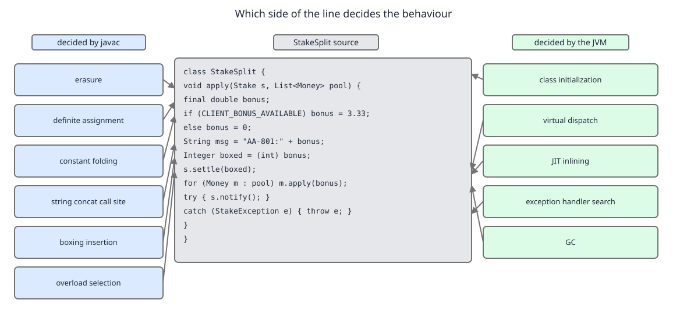
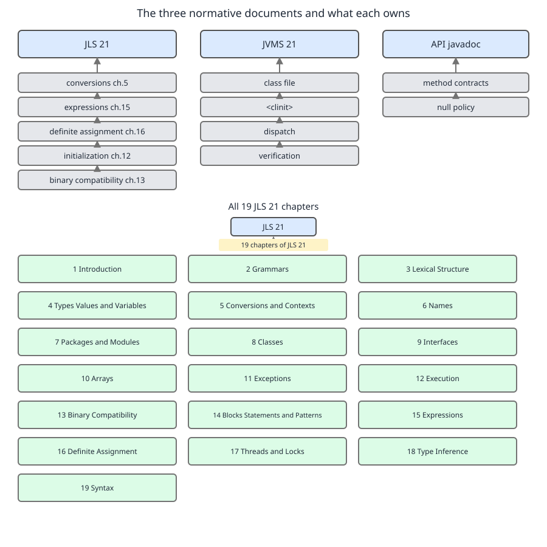
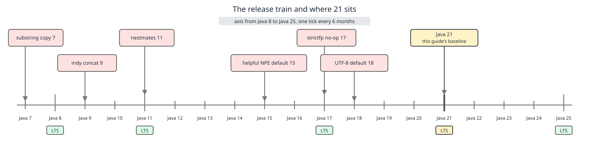
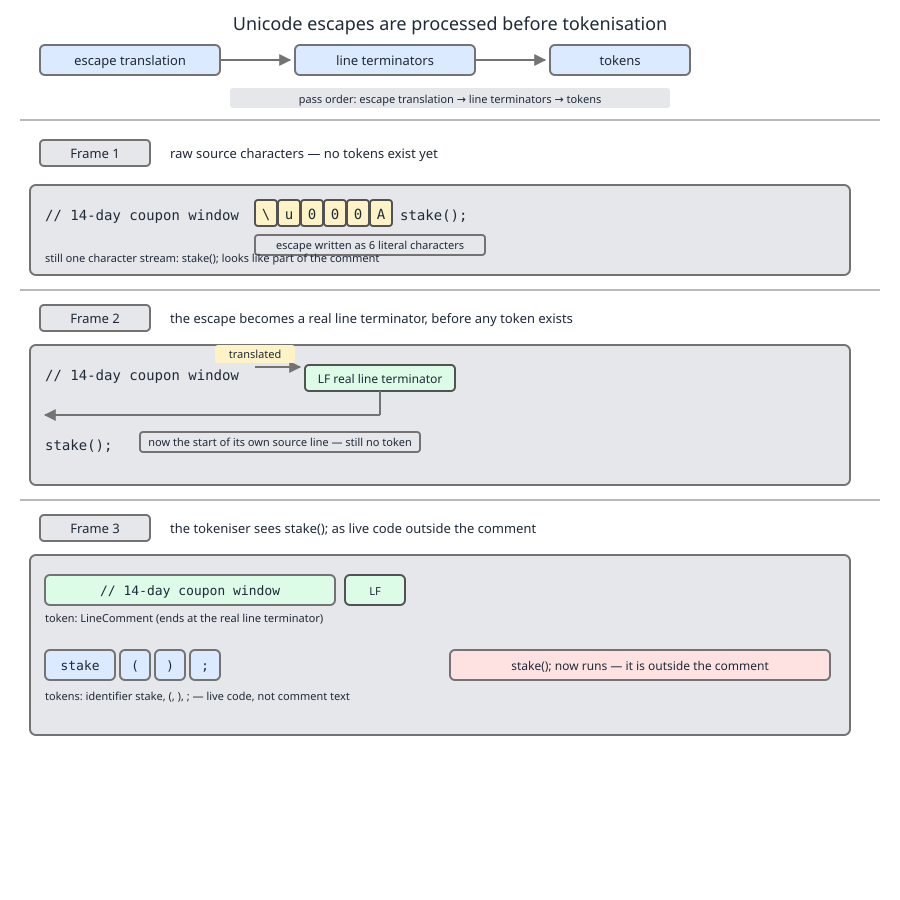

# 03 Java Core — Language substrate — BASICS (§1.1, §1.2)

**Target version: Java 21 LTS.** | **Part 1 of 5** | [Index](../00-index.md)
Next: [Packages, modules, annotations](02-packages-modules-annotations.md)

Every "why does Java do that" question in an interview resolves to one of two places: a decision `javac` baked into a class file, or a decision the JVM makes while running it. This file installs that dividing line, the three documents that arbitrate it, and the lexical layer where the compiler's work begins.

---

## §1.1 Why the language substrate is a topic at all

**1.1.1 The 1995 design goals still explain the awkward parts.** Java was specified as a portable, memory-safe language for networked devices, and six decisions were locked in then: no pointer arithmetic (references are opaque handles, so no program can forge an address), garbage collection instead of manual `free` (the language has no deallocation syntax at all), array bounds checked on every access, single inheritance of implementation with multiple inheritance of interface (no C++ diamond of fields), dynamic linking (a class file names its dependencies symbolically and the JVM resolves them at first use, which is why you can compile against a `BonusService` that does not exist yet on the classpath), and primitives alongside objects for arithmetic that a 1995 interpreter could execute without allocating. No gotcha: each of these is a constraint, not an edge case — but every one of them is the root cause of a later chapter (erasure, `NoSuchMethodError`, `NullPointerException`).

> **Definition.** The *language substrate* is the set of rules fixed by Java's 1995 safety-and-portability goals that every later feature had to be expressed within.

### The `javac` / JVM line

The mental picture: `javac` is a translator with no runtime powers, and the JVM is a linker-loader-interpreter with no source. `javac` sees types and text; it can prove things and freeze answers into the class file. The JVM sees only a class file and a live heap; it decides everything that depends on what is actually loaded and what a reference actually points to. Any behaviour you can change by recompiling belongs to `javac`. Any behaviour you can change by swapping a JAR without recompiling belongs to the JVM.

Why the split exists at all: dynamic linking. Because a class file records dependencies as symbolic names rather than addresses, the compiler *cannot* resolve them — resolution has to be deferred to a runtime that knows the real classpath. The compiler's compensation for that lost power is to overspecify what it can: it writes the exact method descriptor it selected, so the JVM never re-runs overload resolution.

How it works, decision by decision. `javac` performs: lexing and the three lexical translations, overload resolution and the resulting method descriptor, generic type inference and erasure, constant folding of compile-time constant expressions, autoboxing/unboxing insertion, definite-assignment analysis (JLS 16), checked-exception verification, and desugaring (string concatenation to an `invokedynamic` call site, enhanced `for` to an iterator loop, lambdas to `invokedynamic` on `LambdaMetafactory`). The JVM performs: class loading, verification, preparation and initialization (the `<clinit>` timing), symbolic resolution of every `CONSTANT_Methodref`, virtual and interface dispatch on the receiver's actual class, exception handler table search, monitor acquisition and the memory model, garbage collection, and JIT compilation with inlining and deoptimization.


**D-001** — Which side of the line decides the behaviour: `javac` on the left, the JVM on the right.

```java
record Money(BigDecimal amount, Currency currency) {
    Money add(Money other) { return new Money(amount.add(other.amount), currency); }
    Money add(BigDecimal delta) { return new Money(amount.add(delta), currency); }
}

record StakeSplit(Money bonusPortion, Money cashPortion) {

    static final int BONUS_RATE_PERCENT = 10;

    static StakeSplit of(Money stake, Money bonusAvailable, List<Reservation> priorReservations) {
        BigDecimal cap = stake.amount()
                .multiply(BigDecimal.valueOf(BONUS_RATE_PERCENT))
                .divide(BigDecimal.valueOf(100), 2, RoundingMode.DOWN);

        Money bonusPortion;                                    // no initializer
        if (bonusAvailable.amount().compareTo(cap) < 0) {
            bonusPortion = bonusAvailable;
        } else {
            bonusPortion = new Money(cap, stake.currency());
        }
        Money cashPortion = new Money(stake.amount().subtract(bonusPortion.amount()),
                                      stake.currency());

        List<Integer> attempts = new ArrayList<>();
        attempts.add(priorReservations.size() + 1);

        if (bonusPortion.add(cashPortion).amount().compareTo(stake.amount()) != 0) {
            throw new LedgerImbalanceException("split does not sum to stake: " + stake.amount());
        }
        return new StakeSplit(bonusPortion, cashPortion);
    }
}
```

`javac` decided six things here. `BONUS_RATE_PERCENT` is a compile-time constant, so `BigDecimal.valueOf(BONUS_RATE_PERCENT)` compiles to `bipush 10` — the name vanishes. `bonusPortion.add(cashPortion)` selected the `add(Money)` overload and wrote that descriptor; the JVM will never reconsider it even if an `add(Object)` appears later. `List<Reservation>` erased to `List`, so the parameter's descriptor is `Ljava/util/List;`. `attempts.add(int)` got an inserted `Integer.valueOf` call. The `"split does not sum to stake: " + stake.amount()` concatenation became an `invokedynamic` to `StringConcatFactory`. And `Money bonusPortion;` with no initializer compiled only because definite-assignment analysis proved both branches assign it — delete the `else` branch and it is a compile error, not a null.

The JVM decided the rest: which `add` body actually runs if `Money` were subclassable, whether `LedgerImbalanceException` has a handler up the stack, when `BigDecimal`'s `<clinit>` runs, and whether `of` gets inlined into its caller after 2.8M stake reservations a day warm it up. `[X-REF 06]` — loading, initialization order, JIT tiers and GC are the subject of guide *06 JVM internals*.

**Insight:** the compiler's job is to remove ambiguity, not to optimize. Almost nothing `javac` does is a speed optimization; constant folding is the exception, and it exists to make `switch` labels and array sizes legal, not to make code fast. Speed is the JIT's department.

**Interview:** "Does Java resolve overloads at compile time or runtime?" — Compile time, by static argument types; only the *body* selection (virtual dispatch) is runtime.

> **Definition.** The `javac`/JVM line is the boundary between decisions frozen into the class file at compile time and decisions taken against the live, dynamically linked runtime.

### The three normative documents and the JLS chapter map `[RESEARCH]` `[SOURCE]`

The picture: three documents, three jurisdictions, no overlap. The JLS governs what source text means. The JVMS governs what a class file is and what the machine does with it. The API javadoc governs what a library method promises. Cite the wrong one and your answer is unfalsifiable.

Why it matters in an interview: "is `Integer` caching guaranteed?" has a *document* answer. The javadoc for `Integer.valueOf` promises caching for −128..127; the JLS §5.1.7 mandates it for boxing conversion in that range; the JVMS says nothing. So the guarantee is real and its exact range is spec-mandated, not an implementation accident.

How to route a claim: behaviour of an expression, a conversion, definite assignment, inference → JLS. Bytecode, class file layout, verification, initialization timing, the memory model's implementation → JVMS (though the *model itself* is JLS 17). Method contracts, thread-safety notes, complexity notes, "unspecified iteration order" → javadoc.


**D-002** — The three normative documents and what each owns, with all 19 JLS 21 chapters.

| Ch | Title | Ch | Title |
|---|---|---|---|
| 1 | Introduction | 11 | Exceptions |
| 2 | Grammars | 12 | Execution |
| 3 | Lexical Structure | 13 | Binary Compatibility |
| 4 | Types, Values, and Variables | 14 | Blocks, Statements, and Patterns |
| 5 | Conversions and Contexts | 15 | Expressions |
| 6 | Names | 16 | Definite Assignment |
| 7 | Packages and Modules | 17 | Threads and Locks |
| 8 | Classes | 18 | Type Inference |
| 9 | Interfaces | 19 | Syntax |
| 10 | Arrays | | |

Chapter titles verified against the JLS, Java SE 21 Edition table of contents. Chapter 14 was retitled from "Blocks and Statements" when pattern matching for `switch` finalized in 21 — a detail worth knowing because it tells you patterns are *statement-level* grammar, not an expression bolt-on.

**Interview:** "the JLS says" is the strongest move available and the easiest to fake — if you cannot name the chapter, say "this is specified, in the conversions chapter" rather than inventing a section number.

> **Definition.** JLS = meaning of source; JVMS = meaning of class files and their execution; javadoc = contract of a library member.

**1.1.5 Why primitives exist, and what Valhalla changes. `[RESEARCH]` `[NUM]`** In 1995 a boxed integer meant an allocation, a header and a pointer chase per arithmetic operation; primitives let the interpreter keep an `int` in a stack slot. The cost is a permanent split in the type system: primitives are not `Object`, so they cannot be generic arguments. Arithmetic: a `List<Integer>` of restriction codes costs, per element, a 16-byte `Integer` (12-byte header + 4-byte value, aligned to 8) plus a 4-byte compressed reference in the backing array = 20 bytes; an `int[]` costs 4. At 10 restriction codes per reservation and 2.8M reservations/day that is 28M elements: 28M × 20 = 560 MB of churn versus 28M × 4 = 112 MB, a 5× allocation-rate difference on a path that runs at 1,200/sec peak. Escape hatch: `int[]` or `IntStream` on hot paths, `List<Integer>` everywhere else. Project Valhalla's plan is `value class` — identity-free classes the JVM may flatten and scalarize, with the JDK's value-based classes (including `Integer`) migrated. As of August 2026, JEP 401 (Value Objects) is a **preview** integrated for JDK 28; nothing in it is available in 21.

> **Definition.** Primitives are unboxed, identity-free, non-`Object` value carriers that exist because 1995 hardware could not afford universal boxing.

### Erasure: the consequence that reaches everywhere

The picture: generics are a compile-time proof system layered on a runtime that never learned about them. `javac` checks your types, then deletes them. At runtime `List<Money>` and `List<StatusCode>` are the same class, with the same `Class` object, and there is no way to ask a list what it holds.

Why: 1.1.1's dynamic linking plus backward compatibility. Java 5 had to let a `List<Money>` be passed to code compiled in 2002 that expects a raw `List`. Reifying generics would have meant a new, incompatible `List` class file shape. Erasure was the price of not forking the ecosystem.

How it works: each type variable is replaced by its leftmost bound (`Object` if unbounded), casts are inserted at the *consumer* side, and bridge methods are generated where erasure would break overriding. The signature survives only as a `Signature` attribute — metadata for the compiler and reflection, ignored by dispatch.

```java
final class FundsLedger {
    private final Map<String, List<?>> columns = new HashMap<>();

    void register(String position, List<?> values) { columns.put(position, values); }

    @SuppressWarnings("unchecked")
    List<Money> amounts(String position) { return (List<Money>) columns.get(position); }

    Money firstAmount(String position) { return amounts(position).get(0); }
}
```

`register("CLIENT_BONUS_AVAILABLE", List.of(new StatusCode("AA", 8, 0, 1)))` compiles and runs. The `(List<Money>)` cast inside `amounts` is a no-op — after erasure it is `checkcast java/util/List`, which succeeds. The `ClassCastException` fires in `firstAmount`, at the `checkcast Money` that `javac` inserted on the *result* of `get(0)`. The blame lands in a method that never touched the wrong data.

**Insight:** the stack trace of a generics bug points at the reader, never the writer. That is not a JDK defect; it is exactly what "casts inserted at the consumer" means.

**Interview:** "Can you overload on `List<Money>` and `List<StatusCode>`?" — No. Both erase to `List`, so the two methods have the same descriptor and the class file cannot hold both.

> **Definition.** Erasure is the compile-time deletion of generic type information, leaving casts at consumption sites and one runtime class per generic declaration.

**1.1.7 Backward compatibility keeps the mistakes shipping. `[TRAP]`** `Object.clone`, `Object.finalize` (deprecated for removal since 12), `java.util.Date`, `Vector` and `Hashtable` are all still in Java 21 because removing a public API breaks every binary that calls it. **Pitfall:** the belief is "deprecated means gone soon, and un-deprecated means recommended". The symptom is a legacy `PaymentRun` export that formats with `java.util.Date` and a `ClientRestrictions` adapter built on `Hashtable`, both passing review because neither emits a warning — `Vector` and `Hashtable` are *not* deprecated. The fix: judge by contract, not by annotation. `Hashtable` synchronizes every method (useless contention, and still not atomic across two calls); `Date` is mutable and has no timezone; migrate to `ConcurrentHashMap` and `java.time.Instant`, and keep the old types only at serialization boundaries you do not own.

> **Definition.** A shipping API is retained not because it is good but because deleting it would break binary compatibility.

### Compatibility in three flavours, and the release train `[RESEARCH]`

The picture: three independent promises, each breakable without touching the other two. Confusing them is why "it compiled, so it works" and "I only changed the implementation" are both dangerous sentences.

Why three: `javac` and the JVM check different things at different times (1.1.2 again), and neither checks semantics at all. JLS 13 specifies exactly one of the three — binary compatibility — because it is the only one the platform can enforce.

| Kind | Enforced by | Breaks when | `Money` example |
|---|---|---|---|
| Source | `javac`, at recompile | Existing source no longer compiles | Adding `Money.add(BigDecimal)` makes `money.add(null)` ambiguous — code that compiled now does not |
| Binary (JLS 13) | JVM, at resolution | A pre-existing class file no longer links | Deleting `public Money negate()` — callers compiled earlier throw `NoSuchMethodError` at first call, not at load |
| Behavioural | Nothing | Signatures hold, meaning changes | Changing `Money.equals` to ignore currency — every caller links and runs, and `FundsLedger` silently nets GBP against EUR |

The nastiest asymmetry: recompiling *everything* hides binary breaks entirely, which is why a monorepo never sees them and a service consuming a shared `Money` JAR sees them in production. And note the trap in 1.1.2's constant folding: changing `BONUS_RATE_PERCENT` from 10 to 12 is binary-compatible by the letter of JLS 13, yet callers compiled against 10 keep computing 10 until recompiled, because the value was folded into their bytecode.


**D-003** — The release train, the LTS marks at 8/11/17/21/25, and the version traps pinned to their release.

**1.1.9** Since Java 9, feature releases ship every six months, in March and September, on a fixed date rather than a fixed feature set. LTS designations are 8, 11, 17, 21 and 25; the cadence tightened from three years to two after 17, so 21 (GA 19 September 2023) was followed by 25 (GA 16 September 2025). A *preview* feature is complete and specified but not permanent: it compiles only with `javac --release 21 --enable-preview` and runs only on the exact same version, because its class file carries a minor version of `0xFFFF`. An *incubator module* is an API, not a language feature, shipped under a `jdk.incubator.` name that will change. **Do not answer an interview question with a preview feature.** Knowing that something *is* preview in 21 is the answer — pattern matching for `switch` and records finalized in 21; virtual threads finalized in 21; structured concurrency and the Vector API were still non-final in 21.

**1.1.10** "Java 21" in this file means language level 21 with the Java SE 21 API. Three ways to check what you are running, in decreasing reliability: `java -version` on the actual host, `Runtime.version()` in-process (returns a structured `Runtime.Version`, since 9), and `System.getProperty("java.version")` (a `String`, and the one that lied for a decade — see the pitfall below).

```java
final class BalanceView {
    private static final Logger LOG = LoggerFactory.getLogger(BalanceView.class);

    void logRuntime() {
        Runtime.Version v = Runtime.version();
        LOG.info("BalanceView start: feature={} update={} vendor={} vm={}",
                 v.feature(), v.update(),
                 System.getProperty("java.vendor"),
                 System.getProperty("java.vm.name"));
    }
}
```

`v.feature()` returns `21` as an `int` — parse nothing yourself. `[VERSION-TRAP]` on Java 8 and earlier `java.version` was `"1.8.0_422"`, so a decade of code did `version.startsWith("1.8")`; since 9 (JEP 223) it is `"21.0.4"`, and `startsWith("1.")` checks silently classify every modern JDK as "old".

> **Definition.** Source compatibility is about recompiling, binary compatibility is about linking a class file you did not recompile, and behavioural compatibility is about meaning — only the second is specified.

---

## §1.2 Lexical structure and literals

**1.2.1 The compiler reads Unicode, not ASCII.** JLS 3.1: source is a sequence of Unicode characters, represented as UTF-16 code units; the *file encoding* is a separate concern (since Java 18, JEP 400, `javac` and the runtime default to UTF-8 regardless of platform locale — before 18 the default came from the OS, so the same file compiled differently on two machines). Identifiers may contain any character `Character.isJavaIdentifierPart` accepts, so a non-ASCII field name compiles. No gotcha at the language level; the gotcha is social — mixed scripts make identifiers visually confusable, and build tooling outside `javac` may still guess the encoding.

> **Definition.** Java source is a Unicode character stream; encoding is how bytes become that stream, and since 18 the default is UTF-8.

### Unicode escapes are processed before tokenisation `[SOURCE]` `[TRAP]`

The picture: before the compiler sees a single token — before it knows what a comment is — a pass walks the raw characters and replaces every `\u` plus four hex digits with the code unit it denotes. The tokenizer is downstream of that. So a Unicode escape can *manufacture* syntax, including a newline that terminates a comment.

Why: 1995 portability. Source had to be transmittable through ASCII-only channels, so the spec guarantees any program can be written in pure ASCII with escapes standing in for the rest. Doing that substitution before tokenisation is what makes an escaped identifier or an escaped string character work uniformly.

JLS 3.2 lists the three lexical translations, applied in turn:

> 1. A translation of Unicode escapes (§3.3) in the raw stream of Unicode characters to the corresponding Unicode character.
> 2. A translation of the Unicode stream resulting from step 1 into a stream of input characters and line terminators (§3.4).
> 3. A translation of the stream of input characters and line terminators resulting from step 2 into a sequence of input elements (§3.5) which, after white space (§3.6) and comments (§3.7) are discarded, comprise the tokens.

Read the ordering literally: step 1 produces characters, step 2 decides where lines end, step 3 decides where comments are. Comments are discarded in step 3 — two steps *after* escapes became real characters and one step after line terminators were fixed. JLS 3.3 confirms the direction: "A compiler for the Java programming language ('Java compiler') first recognizes Unicode escapes in its raw input."


**D-004** — Unicode escapes are processed before tokenisation: escape translation → line terminators → tokens.

```java
// coupon validity window is 14 days from registration \u000A reserveStake();
```

That single physical line is not a comment plus dead text. Step 1 turns the six characters after "registration" into U+000A. Step 2 sees a line terminator there. Step 3 ends the comment at it and tokenizes `reserveStake();` as live code. The compiler is right and every reader is wrong.

The same pass explains the escape-counting rule. JLS 3.3 specifies that a `\` is eligible to begin a Unicode escape only if the number of contiguous preceding backslashes is even:

> the raw input `"\\u2122=\u2122"` results in the eleven characters `" \ \ u 2 1 2 2 = ™ "`

Inside the string literal the first `\\` consumes the second backslash, leaving `u2122` as ordinary characters; the third backslash starts fresh with an even count, so it *is* eligible and becomes the trademark sign. Two identical-looking escapes, two different outcomes, decided before the string literal existed as a token.

**Pitfall:** the belief is that anything after `//` is inert text. The symptom is a compile error on a line whose code is invisible, or worse, code that compiles and calls `reserveStake()` from inside what reviewers read as a comment — a real supply-chain trick. The fix: never paste unvetted escaped text into source, and treat `\u` in a comment as a code smell. Diagnostic: a `\u` followed by four hex digits anywhere in a file that grep can find but the reviewer cannot see. Note also that `\u0022` does not create a string delimiter usefully — it *does* terminate a literal, which is the same class of trap.

**Interview:** "Where in compilation are Unicode escapes handled?" — Lexical translation step 1 of three, before line terminators and before tokens, per JLS 3.2.

> **Definition.** A Unicode escape is resolved in a pre-tokenisation pass, so it can create tokens, line terminators and comment boundaries rather than merely characters inside them.

**1.2.3 Identifiers, `$`, and the lone underscore. `[RESEARCH]` `[VERSION-TRAP]`** An identifier is an unlimited-length sequence of Java letters and digits starting with a Java letter, and may not be a keyword, a boolean literal or `null`. `$` is a legal Java letter but JLS 3.8 reserves it by convention for mechanically generated code — which is why a lambda body lands in `lambda$of$0` and an inner class in `StakeSplit$Builder`. Since Java 9 a single `_` is not an identifier at all: it is a keyword, so `int _ = 0;` is a compile error where Java 8 accepted it with a warning. In Java 21 `_` is reserved for possible future use in parameter declarations; it becomes the unnamed-variable pattern later (preview in 21, final in 22), which is exactly why it was taken away in 9.

> **Definition.** An identifier is a non-keyword sequence of Java letters and digits beginning with a letter, where `$` is legal-but-reserved for generated names and `_` alone is a keyword since 9.

**1.2.4 Reserved versus contextual keywords. `[RESEARCH]`** JLS 21 §3.9 lists 51 reserved keywords, which can never be identifiers, plus 17 *contextual* keywords, which are keywords only in specific grammatical positions and remain legal identifiers everywhere else. That distinction is a compatibility device: `record` became a type declaration in 16 without breaking the millions of existing variables named `record`.

| Contextual keyword | Keyword only when | Landed |
|---|---|---|
| `var` | local variable / lambda parameter type | 10 |
| `yield` | first token of a `yield` statement in a `switch` expression | 14 |
| `record` | before an identifier in a type declaration | 16 |
| `sealed`, `permits`, `non-sealed` | class/interface modifier or `permits` clause | 17 |
| `when` | after a pattern label in `switch` | 21 |
| `module`, `open`, `requires`, `exports`, `opens`, `uses`, `provides`, `to`, `with`, `transitive` | inside a `module-info.java` directive | 9 |

```java
sealed interface Verdict permits ReviewVerdict, ScreeningVerdict {}
record ReviewVerdict(String statusCode, String decidedBy) implements Verdict {}
record ScreeningVerdict(String statusCode) implements Verdict {}

String gateLabel(Verdict verdict) {
    var record = "audit";                                     // 'record' as an identifier: legal
    return switch (verdict) {
        case ReviewVerdict r when r.statusCode().equals("AA-801 ACTIVATED") -> {
            yield record + ":lift STAKE_BLOCKED/SYSTEM_ONBOARDING";
        }
        case ReviewVerdict r -> record + ":hold " + r.statusCode();
        case ScreeningVerdict s -> record + ":screen " + s.statusCode();
    };
}
```

`record` is a variable, `var` a type, `when` a guard and `yield` a statement, all in one method. No gotcha beyond readability: legal is not advisable.

> **Definition.** A reserved keyword is never an identifier; a contextual keyword is a keyword only in a named grammatical position, which is how the language adds vocabulary without breaking existing code.

### Every literal form, and the two that lie

The picture: a literal's *type* and *radix* are decided by its spelling alone, with no reference to the variable it is assigned to. Two spellings mean something other than what they look like: a leading zero is octal, and a bare decimal is a `double`.

Why: both are inherited from C, kept for source compatibility. `0`-prefix octal was useful for Unix file modes in 1972 and has been a defect generator ever since; the `double`-by-default rule exists because `double` is the wider, more accurate type and silently narrowing it would lose data.

How: `javac` classifies the token in step 3 of lexical translation, assigns it `int` unless suffixed `L`/`l`, or `double` unless suffixed `f`/`F`. Assignment then applies conversion rules — and for `int` constants a *narrowing* assignment to `byte`/`short`/`char` is allowed if the value fits, which is why `byte disposition = 9;` compiles but `byte disposition = 300;` does not.

| Form | QuizStakes constant | Value in decimal | Trap |
|---|---|---|---|
| Decimal | `static final int MAX_BONUS = 100;` | 100 | none |
| Hex `0x` | `static final int SUSPENSE_FLAG = 0x1F;` | 31 | case-insensitive digits and prefix; `0X1f` is the same |
| Octal, leading zero | `static final int phase = 010;` | **8**, not 10 | any leading zero switches radix; `08` does not even compile |
| Binary `0b` (Java 7) | `static final int RESTRICTION_MASK = 0b0000_1011;` | 11 | absent before Java 7 |
| `L` suffix | `static final long LEDGER_ROWS_PER_YEAR = 7_200_000_000L;` | 7,200,000,000 | without `L` it exceeds `int` range and fails to compile; use uppercase `L`, never `l` |
| Underscore-separated (Java 7) | `static final int COUPON_VALIDITY_DAYS = 14;` `static final int PEAK_STAKES = 1_200;` | 14; 1,200 | illegal at either end, adjacent to `.`, before `L`, or after `0x`/`0b` |
| `d`/`f` suffix | `static final float AVG_STAKE = 4.20f;` | 4.2 | `float rate = 1.1;` does **not** compile |
| Exponent | `static final double PEAK_LEDGER_WRITES = 1.36e4;` | 13,600 | exponent form is always floating-point, so `1e3` is a `double`, not an `int` |
| Hex float (Java 5) | `static final double RESERVE_TOLERANCE = 0x1p-3;` | 0.125 | `p` exponent is mandatory and is a power of **two**, not ten |

**D-005** — Every integer and floating literal form.

**1.2.6 `[TRAP]` Pitfall:** the belief is that `int phase = 010;` is ten, because it reads as ten. The symptom is a status-code phase that is off by two — `010` is 8, so a `StatusCode` built with it points at the wrong phase and no test catches it because 8 is a valid phase. The fix: never write a leading zero outside a string; zero-pad in formatting (`"%03d"`), not in the literal. Diagnostic: `08` and `09` fail to compile, which is the only free warning the form gives you.

**1.2.9 `[TRAP]` Pitfall:** the belief is that `float rate = 1.1;` is fine because 1.1 fits in a `float`. The symptom is `error: incompatible types: possible lossy conversion from double to float` — the literal's type is `double` by spelling, and assignment context permits narrowing only for constant `int` to `byte`/`short`/`char`, never `double` to `float`. The fix: `float rate = 1.1f;` or, better in this domain, do not use `float` for money at all — `Money` wraps `BigDecimal` precisely because 10% of a 3.33 stake must round down to 0.33 exactly.

**Interview:** "What is `010 + 0b10 + 0x10`?" — 8 + 2 + 16 = 26.

> **Definition.** A literal's type and radix come from its spelling alone: leading zero means octal, a bare decimal point means `double`.

**1.2.10 Character literals and escapes.** A `char` literal is one UTF-16 code unit in single quotes: `'A'` is 65 and works directly as the domain-prefix character of a status code. The escape set is `\b \s \t \n \f \r \" \' \\`, plus octal escapes `\0` through `\377`. `\s` (Java 15, JEP 378) is a space that survives whitespace stripping — its whole purpose is holding a significant trailing space in a text block. No gotcha for `'A'`; the gotcha is that a `char` cannot hold a supplementary code point, so a single emoji is two `char`s.

> **Definition.** A character literal denotes one UTF-16 code unit, not one user-visible character.

**1.2.11 String literals are constant expressions, and constant expressions are interned.** JLS 3.10.5: a string literal is a reference to an instance of `String`, and literals with the same character sequence — anywhere in the same program, including different classes and different class loaders sharing the same runtime — refer to the *same* instance, because `CONSTANT_String_info` resolution routes through the string table. So two `PaymentService` classes both holding `"DEP-301 CAPTURED"` share one object and `==` is true between them; the same value built at runtime with `new String("DEP-301 CAPTURED")` is a different object and `==` is false.

> **Definition.** A string literal is a constant expression whose resolution is interned, so equal literals are reference-identical.

**1.2.12 Text blocks (Java 15, JEP 378). `[X-REF 04]`** A text block opens with `"""` followed by a line terminator and closes with `"""`. `javac` then applies, at compile time: incidental-whitespace stripping (the common indentation prefix across all non-blank lines *and the closing delimiter line* is removed — move the closing `"""` left and the content shifts), removal of trailing whitespace on each line, and escape translation. `\` at end of line suppresses that line's newline; `\s` preserves one space. The value is an ordinary interned `String` constant — there is no runtime cost and no distinct type.

```java
static final String BONUS_MOVEMENTS_SQL = """
        SELECT entry_id, amount, currency
          FROM movement
         WHERE position = 'CLIENT_BONUS_AVAILABLE'
           AND booked_at >= ?
         ORDER BY booked_at DESC
        """;
```

The stripping algorithm is exposed as `String.stripIndent()` and `String.translateEscapes()`, both added in 15 — useful when the text arrives at runtime rather than as a literal. Full treatment in guide *04 Modern Java*.

> **Definition.** A text block is a multi-line string literal whose incidental indentation and escapes are resolved by `javac`, yielding a normal constant `String`.

**1.2.13 `null` is a literal of the null type.** JLS 4.1 defines a null type with no name; `null` is its only value, and it is assignable to every reference type. There is no `Null` class, so you cannot declare a variable of the null type or call `getClass()` on it. Consequences worth having ready: `Money owed = null;` is fine, `(Money) null` is a legal cast (used to disambiguate overloads), and `null instanceof Money` is `false` — which is why pattern matching never needs a null guard inside a `case`.

> **Definition.** `null` is the sole value of the unnamed null type, a subtype of every reference type and of no class.

**1.2.14 Separators and operator tokens.** The 12 separators are `(` `)` `{` `}` `[` `]` `;` `,` `.` the varargs ellipsis (three consecutive dots) `@` `::`. The operator tokens are the assignment family (`=` and the 12 compound forms), arithmetic (`+ - * / % ++ --`), relational (`< > <= >= == != instanceof`), logical and bitwise (`! && || & | ^ ~`), shifts (`<< >> >>>`), the conditional `? :`, and the lambda arrow `->`. Precedence and associativity are tabulated in [Operators and expressions](../primitives-and-conversions/02-operators-and-expressions.md), which is where the arity and evaluation-order traps live.

> **Definition.** Separators and operators are tokens fixed by JLS 3.11 and 3.12; their grouping behaviour is grammar, not lexis.

**1.2.15 Comments, and why the doc comment is not a comment.** Three forms: `//` to end of line, `/* */` non-nesting (a `*/` inside a string in commented-out code ends the comment early), and `/** */`, which is lexically identical to `/* */` but is an *input* to `javadoc` and to IDE inference — `@param`, `@return` and `@throws` drive the tooling that your reviewers actually read.

```java
/**
 * Splits a stake across bonus then cash.
 *
 * @param stake the full stake; must be positive and in the account currency
 * @return a split whose two portions sum exactly to {@code stake}; the bonus
 *         portion is rounded DOWN to the minor unit and cash covers the
 *         remainder, so a 3.33 stake splits as 0.33 bonus + 3.00 cash.
 *         Rounding the bonus portion up would yield 3.34 and create money.
 * @throws LedgerImbalanceException if the two portions do not sum to the stake
 */
static StakeSplit of(Money stake, Money bonusAvailable, List<Reservation> priorReservations) {
    return StakeSplit.of(stake, bonusAvailable, priorReservations);
}
```

The invariant lives in the doc comment because the type system cannot express "these two sum exactly to the input".

> **Definition.** A doc comment is a comment to the tokenizer and a specification to `javadoc`, so an unwritten invariant is an unrecorded one.

---

## Pitfalls

### Assuming a leading-zero literal is decimal

**Wrong**
```java
static final int ACTIVATION_PHASE = 010;                 // reads as ten
StatusCode code = new StatusCode("AA", ACTIVATION_PHASE, 1, 0);
// prints: phase=8  -> resolves to AA-801? no: builds phase 8 where 10 was meant
```

**Right**
```java
static final int ACTIVATION_PHASE = 10;
String rendered = "AA-%d%d%d".formatted(ACTIVATION_PHASE / 10, 0, 1);  // pad in format
```
The guarantee comes from never encoding padding in the literal; radix is decided by spelling, formatting is decided at output.

**Why people believe it:** every other leading zero in software — `"007"`, `%03d`, zero-padded IDs — is cosmetic. Only the literal changes radix.

### Believing a bare decimal literal adapts to `float`

**Wrong**
```java
float rate = 1.1;        // error: incompatible types: possible lossy conversion
```

**Right**
```java
float rate = 1.1f;
Money bonusCap = new Money(new BigDecimal("100.00"), Currency.getInstance("GBP"));
```
`1.1f` fixes the type; `BigDecimal` fixes the domain, because the bonus split must round down exactly.

**Why people believe it:** assignment context *does* narrow constants for `int` to `byte`/`short`/`char`. The rule is not general — it never applies to floating-point.

### Believing text after `//` cannot execute

**Wrong**
```java
// coupon validity window is 14 days from registration \u000A reserveStake();
```
Compiles, and calls `reserveStake()` — the escape becomes a newline in lexical step 1, ending the comment in step 3.

**Right**
```java
// coupon validity window is 14 days from registration; see BonusService.grant
reserveStake();
```
Write the call visibly, and let review see it.

**Why people believe it:** in every other language the comment scanner runs first. In Java, escape translation runs first.

### Treating deprecation as the signal for what to avoid

**Wrong**
```java
Hashtable<String, Restriction> active = new Hashtable<>();   // no warning at all
Date exportedAt = new Date();                                 // no warning at all
```

**Right**
```java
Map<RestrictionKey, Restriction> active = new ConcurrentHashMap<>();
Instant exportedAt = Instant.now();
```
`ConcurrentHashMap` gives per-bin locking instead of whole-map synchronization; `Instant` is immutable and unambiguous.

**Why people believe it:** `@Deprecated` looks like the platform's opinion. It is only the platform's *removal* signal, and backward compatibility means most bad APIs never earn it.

## Cheat sheet

| Question | Answer |
|---|---|
| Overload resolution | `javac`, static argument types |
| Virtual dispatch | JVM, receiver's actual class |
| Constant folding | `javac`; changing a `static final` constant needs callers recompiled |
| Boxing insertion, erasure, definite assignment | `javac` |
| Class init, resolution, handler search, GC, JIT | JVM |
| Cite for expression meaning | JLS (19 chapters; 5 conversions, 13 binary compatibility, 15 expressions, 16 definite assignment, 17 threads) |
| Cite for class file / execution | JVMS |
| Cite for method contract | javadoc |
| `010` | 8 (octal) |
| `0b0000_1011` | 11 |
| `1.1` | `double`; `float f = 1.1;` fails |
| `7_200_000_000` | fails; needs `L` |
| `0x1p-3` | 0.125 (binary exponent) |
| Underscore illegal | ends, next to `.`, before `L`, after `0x`/`0b` |
| Lexical steps | 1 unicode escapes → 2 line terminators → 3 tokens/comments |
| `_` alone | keyword since Java 9 |
| Contextual keywords | 17: `var yield record sealed permits non-sealed when` + 10 module directives |
| String literal | constant expression, interned, `==` true across classes |
| `null` | sole value of the unnamed null type; `null instanceof X` is false |
| LTS | 8, 11, 17, 21 (2023-09-19), 25 (2025-09-16) |
| Preview | `--enable-preview`, same version only, class minor `0xFFFF` |
| `java.version` | `"21.0.4"` since 9; was `"1.8.0_x"` — `startsWith("1.")` is stale |

## Self-test

**Q1.** A colleague changes `BONUS_RATE_PERCENT` from 10 to 12 in a shared library, publishes the JAR, and the consuming service still splits at 10% without any error. Which compatibility flavour held, and what happened mechanically?

<details><summary>Answer</summary>

Binary compatibility held — nothing failed to link. `BONUS_RATE_PERCENT` is a compile-time constant (`static final int` with a constant initializer), so `javac` folded the value 10 directly into the consumer's bytecode as `bipush 10`; the consumer's class file never references the field. Only recompiling the consumer picks up 12. Fix: make the value non-constant (reading it from configuration into a non-`final` field is one way, a config lookup is better) if it must be overridable without recompilation.

</details>

**Q2.** Why can you not declare both `void book(List<Money> amounts)` and `void book(List<StatusCode> codes)` in the same class?

<details><summary>Answer</summary>

Erasure. Both parameters erase to `java.util.List`, so both methods have the descriptor `(Ljava/util/List;)V`. A class file identifies a method by name plus descriptor, so the two would be the same method. `javac` rejects it with "name clash: both methods have the same erasure". The generic signatures differ only in the `Signature` attribute, which is metadata and not part of method identity.

</details>

**Q3.** Why does a backslash-u-000A escape inside a line comment break compilation?

<details><summary>Answer</summary>

JLS 3.2 defines three lexical translations applied in turn: (1) Unicode escapes are translated to the characters they denote, (2) the resulting stream is split into input characters and line terminators, (3) that stream is turned into input elements, at which point white space and comments are discarded. Escape translation therefore happens two steps before comments exist. `\u000A` becomes U+000A, step 2 recognises it as a line terminator, and step 3 ends the `//` comment there. Whatever followed on the physical line is tokenized as code — so it either fails to compile or, worse, compiles and runs.

</details>

**Q4.** `Runtime.version().feature()` versus `System.getProperty("java.version")` — which do you use to detect Java 21, and what is the historical trap?

<details><summary>Answer</summary>

Use `Runtime.version().feature()`, which returns the int `21`. `java.version` is a `String`: `"21.0.4"` today, but `"1.8.0_422"` on Java 8 and earlier. JEP 223 changed the scheme in Java 9, so a decade of code that tests `version.startsWith("1.8")` — or worse, `startsWith("1.")` as a proxy for "Java" — misclassifies every modern JDK. `Runtime.version()` exists (since 9) precisely to stop people parsing that string.

</details>

**Q5.** In `FundsLedger`, a `List<StatusCode>` was registered and later read through a method whose return type is `List<Money>`. Where exactly does the `ClassCastException` fire, and why not earlier?

<details><summary>Answer</summary>

It fires at the caller's implicit `checkcast Money` on the result of `get(0)`, inside `firstAmount`. It cannot fire at the `(List<Money>)` cast, because after erasure that cast is `checkcast java/util/List` and the object genuinely is a `List`. Erasure moves the type check to the point of *consumption*, which is why the stack trace blames code that never inserted the wrong data.

</details>

**Q6.** Two classes in different packages each contain the literal `"DEP-301 CAPTURED"`. Is `==` between them true? What if one is built with `new String("DEP-301 CAPTURED")`?

<details><summary>Answer</summary>

True for the two literals. JLS 3.10.5 requires string literals with identical character sequences to refer to the same `String` instance, because resolving `CONSTANT_String_info` goes through the runtime's string table. `new String` on the same literal explicitly allocates, so it is a distinct object and `==` is false even though `equals` is true. This is why status codes should be compared with `equals` — or better, modelled as an enum or `StatusCode` record rather than raw strings.

</details>

**Q7.** `record` is a contextual keyword. What would have broken if it had been made a reserved keyword in Java 16 instead?

<details><summary>Answer</summary>

Every existing source file with an identifier named `record` — a variable, field, method or type — would stop compiling, breaking source compatibility across the ecosystem. Making it contextual means it is a keyword only immediately before an identifier in a type declaration, and remains a legal identifier everywhere else. The same reasoning applies to `var` (10), `yield` (14), `sealed`/`permits`/`non-sealed` (17) and `when` (21). Note the exception that proves the cost: `_` *was* taken as a reserved keyword in Java 9, and that did break code — Java 8 accepted `int _ = 0;` with a warning first, precisely to soften the removal.

</details>

**Q8.** Name one thing `javac` decides that people usually attribute to the JVM, and one the reverse.

<details><summary>Answer</summary>

`javac`: string concatenation strategy. `"split " + amount` is not a runtime string algorithm chosen by the JVM — `javac` desugars it to an `invokedynamic` call site bootstrapped by `StringConcatFactory` (Java 9+; before 9 it emitted explicit `StringBuilder` calls, which is the version-stale answer interviewers often expect). The reverse: which override runs. People say "the compiler picks the method" — `javac` picks the *signature*, the JVM picks the *body* from the receiver's actual class at every call.

</details>

## Deferred

None.

## Open questions

None.

---

**Leaves covered:** 1.1.1–1.1.10, 1.2.1–1.2.15 (25 leaves)
**Leaves deferred:** none
**Diagrams included:** D-001, D-002, D-003, D-004, D-005
**Target version:** Java 21 LTS
**Lines:** 520
