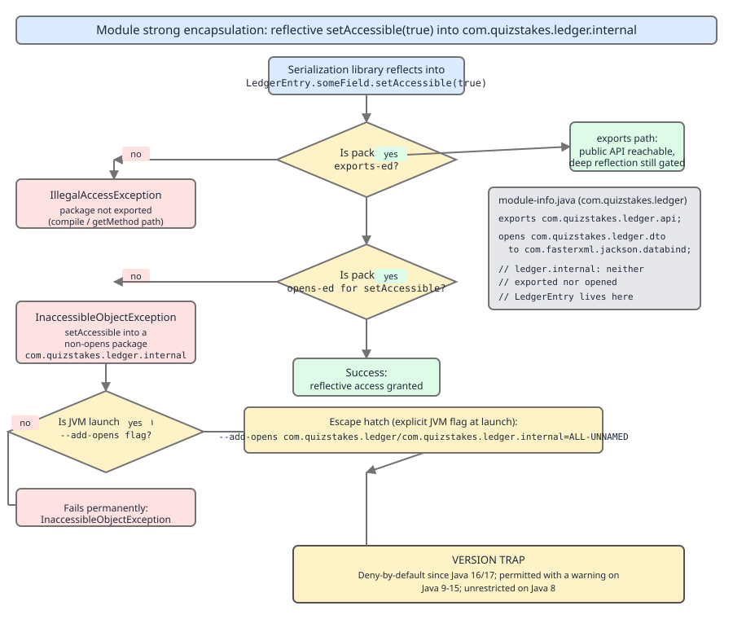
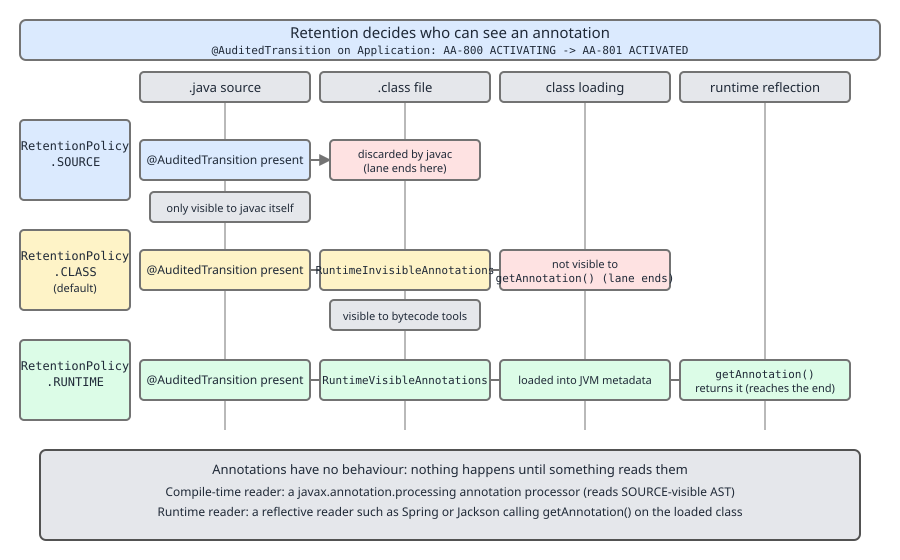
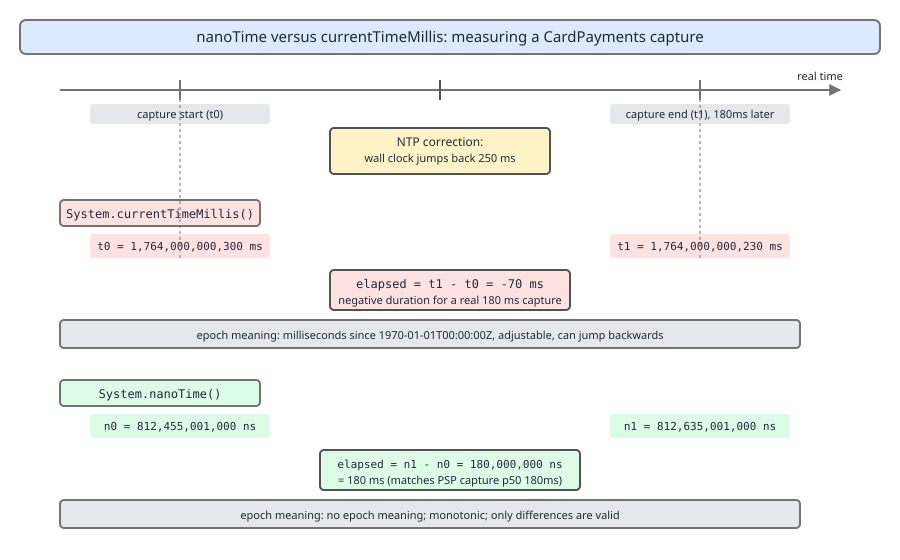

# 03 Java Core — Packages, modules, annotations, `java.lang` — BASICS (§1.23, §1.24, §1.25)

**Target version: Java 21 LTS.** | **Part 1 of 5** | [Index](../00-index.md)
Previous: [Language substrate](01-basics.md) · Next: [The `javac` pipeline and desugaring](03-internals-javac-and-class-file.md)

Three substrates sit under every service you ship: the naming and access system (packages, then modules), the metadata system (annotations), and the one package that is always imported. Each has mechanism that only surfaces when something breaks — an `InaccessibleObjectException` in a Jackson round-trip, a `getAnnotation` that returns `null`, a latency metric that goes negative.

## Packages, imports and names

**1.23.1 — Package declaration, directory mapping, unnamed package.** A package name is a namespace, not a container: `package com.quizstakes.ledger.api;` fixes the fully qualified name of every type in the file. Tooling maps that name to a directory path relative to a classpath root (`com/quizstakes/ledger/api/`) and enforces the mapping on the output tree. A file with no `package` declaration lands in the **unnamed package** — reachable only from other unnamed-package types in the same directory, un-importable from any named package, illegal on the module path.

**1.23.2 — The four import forms.** An `import` is a compile-time abbreviation only. It emits nothing into the class file (the constant pool always holds fully qualified names), costs nothing at runtime, loads no class, and declaration order carries no meaning.

| Form | Syntax | Brings in | Note |
|---|---|---|---|
| Single-type | `import com.quizstakes.ledger.api.Position;` | one type | shadows any on-demand import of the same simple name |
| On-demand | `import com.quizstakes.ledger.api.*;` | all accessible types of that package | not recursive — does not cover `.dto` |
| Static single | `import static com.quizstakes.money.Money.zero;` | one static member, all overloads of that name | members, not types |
| Static on-demand | `import static com.quizstakes.money.Money.*;` | all accessible static members | worst readability; constants only |

**1.23.3 — Colliding on-demand imports are an error only at the use site. `[TRAP]`** The ledger and a card vendor's SDK both offer a `Position`:

```java
import com.quizstakes.ledger.api.*;   // Position = a signed balance per ledger account
import com.acme.psp.model.*;          // Position = a settlement line in a payout file

Position p = ledger.positionOf(CLIENT_CASH_AVAILABLE);   // "reference to Position is ambiguous" HERE
```

**Pitfall:** believing the second wildcard import is itself the error, and deleting imports at random. Symptom: a compile error whose line number points at innocent business code. Fix: one single-type import (`import com.quizstakes.ledger.api.Position;`), which shadows both wildcards, or fully qualify at the use site.

**1.23.4 — Fully qualified vs canonical names.** Identical for top-level types, divergent for nested ones. `PaymentRun.Line` has canonical name `com.quizstakes.ledger.api.PaymentRun.Line` and **binary** name `com.quizstakes.ledger.api.PaymentRun$Line` — `Class.forName` takes the binary form and fails on the canonical one. If `SettlementRun extends PaymentRun`, then `SettlementRun.Line` is a legal fully qualified reference but not a canonical name, so `import com.quizstakes.ledger.api.SettlementRun.Line;` is rejected: imports require canonical names. **1.23.5 — Classpath and class location. `[X-REF 06]`** For unnamed-module code: take the binary name, replace `.` with `/`, append `.class`, then walk classpath entries **in declaration order** and take the first hit — directories by filesystem lookup, jars by the central-directory index. First-wins with no version concept is why a stale `com.quizstakes.money` jar earlier on the classpath silently shadows the current one. Loading then delegates parent-first through bootstrap → platform → application loaders; loader internals, `defineClass` and unloading are guide **06 JVM internals**.

> **Definitions.** A *package* is a namespace for types plus the boundary for default and `protected` access; the directory layout is a location convention the class loader relies on, not the package itself. An *import declaration* lets a simple name resolve to a type or static member and has no runtime representation. The *canonical name* follows only enclosing-type declarations; the *binary name* substitutes `$` for the nesting dots and is what the class loader uses.

### Modules and strong encapsulation

**Mental model.** The classpath is one flat bag of packages with no owner. JPMS (Java 9) replaces the bag with a graph of named boxes, each declaring what it needs, what you may compile against, and what you may *reflect into* — two separate permissions. `public` stopped meaning "reachable" in Java 9; it means "reachable if my module exported the package to you". **Why it exists.** The classpath could not keep an implementation package private (`sun.misc.Unsafe` was public and therefore load-bearing for half the ecosystem), and a missing dependency surfaced as a 3 a.m. `NoClassDefFoundError` instead of a startup failure.

**How it works.** `module-info.java` compiles to `module-info.class` at the artifact root, carrying a `Module` attribute. At launch the resolver reads those attributes, computes the transitive closure of `requires` from the root modules, and fails fast on a missing or duplicate module. Access then has two independent gates: `exports` controls compile-and-normal access, `opens` controls deep reflective access. Exporting does not open.

| Directive | Grants | Checked by |
|---|---|---|
| `requires M` | this module reads `M` | resolver at startup, compiler |
| `requires transitive M` | this module reads `M`, **and so does anyone reading me** | resolver, compiler (implied readability) |
| `exports P` (optionally `to M1`) | `public`/`protected` members of `P` usable at compile and run time; the `to` form is a qualified export | compiler + JVM access check |
| `opens P` (optionally `to M1`) | deep reflection into `P`, private members included; the `to` form is a qualified open | JVM at `setAccessible` |
| `uses S` / `provides S with Impl` | this module calls `ServiceLoader.load(S)` / registers `Impl` as an `S` implementation | `ServiceLoader` |

```java
module com.quizstakes.ledger {                       // src/com.quizstakes.ledger/module-info.java
    requires java.base;  requires com.fasterxml.jackson.databind;   // java.base is implicit
    requires transitive com.quizstakes.money;        // Money appears in my exported signatures
    exports com.quizstakes.ledger.api;               // Position, PaymentRun, FundsLedger
    opens com.quizstakes.ledger.dto to com.fasterxml.jackson.databind;
    uses com.quizstakes.ledger.api.RailProvider;     // ledger.internal is NOT exported or opened
    provides com.quizstakes.ledger.api.RailProvider with
        com.quizstakes.ledger.internal.CardRailProvider;
}
```

`requires transitive com.quizstakes.money` is load-bearing: `Position amountOf(AccountId)` returns a `Money`, so consumers must read that module to name the return type. Drop `transitive` and every consumer must repeat the `requires` — the classic "why can't I see `Money`" report.



**D-060** — A reflective `setAccessible(true)` into `com.quizstakes.ledger.internal`, and the three ways it ends.

**1.23.7 — `InaccessibleObjectException`. `[TRAP]`** Jackson is pointed at `com.quizstakes.ledger.internal.LedgerEntry`, neither exported nor opened:

```java
Field amount = LedgerEntry.class.getDeclaredField("amount");
amount.setAccessible(true);   // java.lang.reflect.InaccessibleObjectException: Unable to make field
//   private com.quizstakes.money.Money com.quizstakes.ledger.internal.LedgerEntry.amount accessible:
//   module com.quizstakes.ledger does not "opens com.quizstakes.ledger.internal" to unnamed module @1b6d
```

It extends `RuntimeException`, so nothing declares it and it usually surfaces wrapped in a Jackson `InvalidDefinitionException`. Three fixes, best first: move the serialized shape into the opened DTO package; `opens com.quizstakes.ledger.internal to com.fasterxml.jackson.databind` if the type cannot move; or the launcher hatch `--add-opens com.quizstakes.ledger/com.quizstakes.ledger.internal=ALL-UNNAMED`. **Pitfall:** treating `--add-opens` as *the* fix — it must be repeated in every launcher, Surefire `argLine` and container entrypoint, and it re-opens the package to all unnamed code. Symptom: works locally, throws in CI. Fix: open the narrowest package to the narrowest named module in `module-info.java`.

**1.23.8 — "It worked on Java 8". `[VERSION-TRAP]`** The surviving folklore — "you just get a warning" — describes releases 9–15 only. On 21 `setAccessible` throws.

| Release | Reflective access to a non-`opens` / JDK-internal package |
|---|---|
| 8 and earlier | unrestricted; no modules exist |
| 9–15 | permitted with a one-time `WARNING: An illegal reflective access operation has occurred`; default `--illegal-access=permit` |
| 16 | **denied by default** (`--illegal-access=deny`); `permit` still available as an opt-out |
| 17–21 | `--illegal-access` **removed**; denial unconditional, only `--add-opens`/`--add-exports` work |

**1.23.9 — Classpath vs module path, unnamed and automatic modules.** Same jar, different rules by placement. An explicit module cannot `requires` the unnamed module, so one non-modular dependency forces either an automatic module or the whole application back onto the classpath. Most Spring Boot 3.x services run wholly as the unnamed module, which is why encapsulation only bites them at the JDK boundary.

| Placement | Becomes | `requires`-able | Reads | Encapsulation |
|---|---|---|---|---|
| Classpath, no `module-info` | part of the single **unnamed module** | no (nameless) | every observable module | none — exports and opens everything |
| Module path, no `module-info` | an **automatic module** (`Automatic-Module-Name`, else derived from the filename) | yes | all other modules | none — exports and opens everything |
| Module path, with `module-info` | an **explicit module** | yes | only what it `requires` | as declared |

**1.23.11 — Split packages.** A package spread across two module-path artifacts is a hard startup error naming the package and both modules: each package must belong to exactly one module for the JVM's access check to have a single answer to "who owns this package". Two jars both shipping `com.quizstakes.money` fail to resolve. On the classpath the same split is *not* an error — first-wins picks one silently, which is how the split survived long enough to reach the module path. **Interview:** "`exports` vs `opens`?" — `exports` grants compile-time and normal runtime access to public members; `opens` grants deep reflective access to all members including private; neither implies the other.

> **Definition.** Strong encapsulation means a package's members are accessible only if its module exported it (normal access) or opened it (reflective access); `public` alone is no longer sufficient.

### `sun.misc.Unsafe` and integrity by default (1.23.10)

A legacy `FundsLedger` position cache held 2.4M client balances off-heap through `Unsafe.allocateMemory`/`putLong`/`getLong` — raw addressed loads and stores with no bounds or liveness check, so an off-by-one corrupts unrelated JVM memory and the crash lands elsewhere. JEP 471 (**Deprecate the Memory-Access Methods in `sun.misc.Unsafe` for Removal**, JDK 23) deprecated those methods — 79 of `Unsafe`'s 87 — for removal and added `--sun-misc-unsafe-memory-access={allow|warn|debug|deny}` defaulting to `allow`; JEP 498 (JDK 24) moved the default to warning on use. Replacements: `VarHandle` (JEP 193, Java 9) for on-heap fields with explicit ordering, and `MemorySegment`/`Arena` from the Foreign Function & Memory API (JEP 454, Java 22) off-heap, which carry bounds and lifetime in the segment:

```java
try (Arena arena = Arena.ofConfined()) {
    MemorySegment cache = arena.allocate(ValueLayout.JAVA_LONG, 2_400_000L);
    cache.setAtIndex(ValueLayout.JAVA_LONG, slot, minorUnits);   // bounds-checked both ways
    long balance = cache.getAtIndex(ValueLayout.JAVA_LONG, slot);
}   // deterministic free at close; use-after-close throws IllegalStateException, not a SIGSEGV
```

> **Definition.** Integrity by default is the direction that no library can silently break JVM invariants — unsafe operations must be explicitly enabled at launch rather than reachable by default.

### What an annotation actually is, and retention

**Mental model.** An annotation is not a directive. It is a tag — an interface instance with no body, stapled to a declaration, doing nothing until other code goes looking. Retention is the single decision determining who *can* look: the compiler, a bytecode tool, or the running JVM. **Why it exists.** Metadata used to live in XML sidecars that drifted from the code they described; annotations put it in the declaration it belongs to, in a typed place the compiler can check.

**How it works (1.24.1, 1.24.2).** `@interface` declares a real interface implicitly extending `java.lang.annotation.Annotation`; its abstract no-arg methods are the *elements*, and `default` supplies a value. Element types are limited to what fits a class file attribute as a constant: primitives, `String`, `Class`, enums, other annotations, and single-dimension arrays of those — no `List`, no arbitrary object, no `null` default. Applying it writes a `RuntimeVisibleAnnotations` or `RuntimeInvisibleAnnotations` attribute onto the declaration; at runtime reflection materialises a dynamic proxy implementing the interface, so reading an element is a proxy method call.

| Retention | In source | In class file | Visible to reflection | Used by |
|---|---|---|---|---|
| `SOURCE` | yes | discarded by `javac` | no | Lombok, `@Override`, `@SuppressWarnings` |
| `CLASS` (**default**) | yes | `RuntimeInvisibleAnnotations` | **no** | bytecode and static tools: nullability checkers, ProGuard |
| `RUNTIME` | yes | `RuntimeVisibleAnnotations` | yes | Spring, JPA, Jackson, your own auditor |



**D-061** — `@AuditedTransition` across source, class file, class loading and runtime reflection, one lane per retention policy.

```java
@Retention(RetentionPolicy.RUNTIME)        // omit this line and the auditor sees nothing
@Target(ElementType.METHOD) @Repeatable(AuditedTransitions.class)
public @interface AuditedTransition { String from();  String to();  boolean requiresOperator() default false; }

@Retention(RetentionPolicy.RUNTIME) @Target(ElementType.METHOD)
public @interface AuditedTransitions { AuditedTransition[] value(); }  // container element = value()
public final class AccountActivation {
    @AuditedTransition(from = "AA-800", to = "AA-801", requiresOperator = false)
    @AuditedTransition(from = "AA-710", to = "AA-711", requiresOperator = true)
    public Account activate(AccountId id) { return transition(id, AA_800, AA_801); }
}
```

**1.24.3 — Meta-annotations.** `@Target` restricts the declaration kinds (`TYPE`, `METHOD`, `FIELD`, `PARAMETER`, `CONSTRUCTOR`, `TYPE_USE` and others), turning a misplacement into a compile error rather than an annotation nobody reads. `@Documented` puts it in Javadoc. `@Inherited` affects reflective lookup only. `@Repeatable` (Java 8) makes `javac` fold repeats into the named container — which is why `getAnnotation(AuditedTransition.class)` returns `null` on `activate` while `getAnnotationsByType` returns both. **1.24.4 — `CLASS` is the default and reflection cannot see it. `[TRAP]`** Remove the `@Retention` line above and, on `AccountActivation.class.getMethod("activate", AccountId.class)`, `isAnnotationPresent(AuditedTransition.class)` is `false` and `getAnnotation(AuditedTransition.class)` is `null`. **Pitfall:** concluding the annotation "isn't being applied". It is applied and it *is* in the class file — under `RuntimeInvisibleAnnotations`, which the JVM deliberately never surfaces to `java.lang.reflect`. Symptom: a silently empty audit trail, no exception. Fix: `@Retention(RetentionPolicy.RUNTIME)`; verify with `javap -v` and look for `RuntimeVisibleAnnotations`.

> **Definition.** An annotation is an interface whose applications are stored as class file attributes; `@Retention` selects which of the compiler, bytecode tools, or the reflective runtime can observe them.

### The built-ins, `@Inherited`, and type annotations

**1.24.5 — The five built-in annotations.**

| Annotation | Retention | Enforced by | Note |
|---|---|---|---|
| `@Override` | `SOURCE` | `javac` | catches the signature typo that would otherwise silently overload |
| `@Deprecated(since, forRemoval)` | `RUNTIME` | `javac` warning | `forRemoval = true` upgrades the warning to the *removal* category, which many builds fail on |
| `@SuppressWarnings` | `SOURCE` | `javac` | string values are compiler-defined, not specified; `"unchecked"`/`"deprecation"` are portable |
| `@SafeVarargs` | `RUNTIME` | `javac` | legal only on `static`, `final`, `private` methods and constructors |
| `@FunctionalInterface` | `RUNTIME` | `javac` | compile error unless the interface has exactly one abstract method; does not create the lambda ability |

```java
@Deprecated(since = "21", forRemoval = true)
public Money legacyBalance() { return positions.get(CLIENT_CASH_AVAILABLE).amount(); }

@SafeVarargs
public static Money sum(Money... parts) {
    Money total = Money.zero(parts[0].currency());
    for (Money part : parts) total = total.plus(part);
    return total;                                    // varargs array never escapes: safe
}
```

**1.24.6 — `@Inherited` is narrower than it sounds. `[TRAP]`** It affects only `Class`-level lookups, only for annotations on classes, and only along the `extends` chain.

```java
@Inherited @Retention(RetentionPolicy.RUNTIME) @Target(ElementType.TYPE)
public @interface Audited { }

@Audited public interface LedgerWriter { void append(LedgerEntry entry); }
public final class FundsLedger implements LedgerWriter { public void append(LedgerEntry e) { } }
FundsLedger.class.isAnnotationPresent(Audited.class);   // false — interfaces do not carry it
```

**Pitfall:** expecting an interface-level `@Audited` to appear on implementations. Symptom: the ledger writers extending an audited base class are audited and the rest silently are not. Fix: walk the hierarchy yourself, or use Spring's `AnnotatedElementUtils.findMergedAnnotation`, which does the interface and meta-annotation walk plain reflection refuses to.

**1.24.7 — Type annotations (`TYPE_USE`, Java 8).** `ElementType.TYPE_USE` attaches an annotation to any *use* of a type — generic arguments, array components, casts, `throws` clauses — which is what nullability checkers consume, as in `List<@NonNull Restriction> activeRestrictions(ClientId id)`. Declaring `@NonNull` with `@Target(ElementType.TYPE_USE) @Retention(RetentionPolicy.CLASS)` is correct: the checker reads the class file and the JVM has no nullability concept, so runtime visibility buys nothing. These land in `Runtime{Visible,Invisible}TypeAnnotations` with a *target path* saying which part of the type they sit on.

### Annotations have no behaviour: the reader is the mechanism

**Mental model.** `@Transactional` does not start a transaction and `@AuditedTransition` does not write an audit line. Each is a sticker; something must scan for stickers and act. Every annotation-driven framework is a reader plus a codegen or interception strategy, and knowing which one you have tells you when it runs and what it can see. **Why it exists.** Separating the tag from the reader is what lets one declaration drive a compile-time generator in one build and a runtime proxy in another.

**How it works (1.24.9).** A compile-time reader is an annotation processor: `javac` runs it in rounds, it sees the source model (`Element`, `TypeMirror`), and through the public API it can only *add* files, never mutate existing ones. A runtime reader is reflection: it sees only `RUNTIME`-retained annotations and acts by building proxies, registering beans, or dispatching.

| | Compile-time processor | Runtime reflection |
|---|---|---|
| API | `javax.annotation.processing.Processor`, `RoundEnvironment` | `java.lang.reflect`, `AnnotatedElement` |
| Retention it can read | `SOURCE`, `CLASS`, `RUNTIME` | `RUNTIME` only |
| Examples | MapStruct, Lombok (rewrites the AST — outside the spec), Micronaut, Dagger | Spring (`@Component`, `@Transactional`), JPA, Jackson, Bean Validation |
| Failure mode | build error — cheap, early | startup or first-call failure, sometimes silent |
| Cost | compile time only, zero at runtime | classpath scan plus proxy generation at startup, reflective cost per call |
| Debuggability | generated source you can read | proxies and frames you cannot |

Spring's container, its proxy strategies, and why `-parameters` matters (without it `javac` discards parameter names and Spring cannot bind `@RequestParam String couponCode` by name) are guide **07 Spring core**.

**1.24.8 — The four reflective reads.**

| Call | Honours `@Inherited` | Handles `@Repeatable` | Returns |
|---|---|---|---|
| `isAnnotationPresent(A.class)` | yes | no — the container hides repeats | `boolean` |
| `getAnnotation(A.class)` | yes | no — `null` when repeated | `A` or `null` |
| `getAnnotationsByType(A.class)` | yes | **yes** — unwraps the container | `A[]`, possibly empty |
| `getDeclaredAnnotations()` | **no** — declared only | no | `Annotation[]` |

```java
public void audit(Method method, StatusCode from, StatusCode to) {
    for (AuditedTransition t : method.getAnnotationsByType(AuditedTransition.class)) {
        if (!t.from().equals(from.toString()) || !t.to().equals(to.toString())) continue;
        history.record(new AuditLine(from, to, t.requiresOperator(), method.getName()));
        return;
    }
    throw new IllegalTransitionException(from + " -> " + to + " is not an audited transition");
}
```

**1.24.10 — `[TRAP]`** **Pitfall:** believing an annotation is self-executing. A hand-rolled `@AuditedTransition` with no `ApplicationHistory` scanner produces zero audit lines and zero errors; likewise `@Transactional` on a `private` method, or on a method called from inside the same bean, because Spring's proxy never intercepts that call. Symptom: correct-looking code with no effect. Fix: for every annotation you rely on, name the reader and confirm it runs on that declaration.

> **Definition.** An annotation is inert metadata; all behaviour comes from a reader — a compile-time processor or a runtime scanner — and an annotation with no reader is a comment the compiler type-checks.

### The `java.lang` inventory

**1.25.1 — The eight core interfaces.** `Cloneable` is the anomaly: a marker with no methods that changes the behaviour of a protected native method on *another* class. `Closeable` (`java.io`) narrows `AutoCloseable`'s throws clause to `IOException`.

| Interface | Contract | Implementer here |
|---|---|---|
| `Comparable<T>` | `compareTo`; order advisably consistent with `equals` | `Money implements Comparable<Money>` |
| `Iterable<T>` | `iterator()`; enables the enhanced `for` | `PaymentRun implements Iterable<PaymentRun.Line>` |
| `Runnable` | `void run()`; no result, no checked exception | the task submitted per `PaymentRun` window |
| `CharSequence` | `length`, `charAt`, `subSequence`, `toString` | `String`, `StringBuilder`, `CharBuffer` |
| `AutoCloseable` | `close() throws Exception`; drives try-with-resources | `PayoutFileWriter implements AutoCloseable` |
| `Cloneable` | marker only; without it `Object.clone` throws `CloneNotSupportedException` | none — use copy constructors and records |
| `Appendable` / `Readable` | `append(CharSequence)` / `read(CharBuffer)` | `StringBuilder`, `Writer` / `Reader` |

**1.25.2 — The core classes.**

| Group | Classes | Purpose |
|---|---|---|
| Roots | `Object`, `Enum`, `Record`, `Number`, `Void` | `Record` is the implicit supertype of every record; `Void` is an uninstantiable placeholder for `Callable<Void>` |
| Text and numbers | `String`, `StringBuilder`, `StringBuffer`, `Math`, `StrictMath` | `StringBuffer` is the synchronized 1.0 original; `StrictMath` trades speed for bit-for-bit reproducibility |
| Runtime hooks | `System`, `Runtime`, `ProcessBuilder` | process launch, memory and CPU queries, shutdown hooks |
| Concurrency | `Thread`, `ThreadLocal` | Java 21 adds `Thread.ofVirtual()` |
| Reflection and loading | `Class`, `ClassLoader`, `Package`, `Module` | `Module` is the JPMS runtime handle, reached via `Class.getModule()` |
| Diagnostics | `StackWalker`, `StackTraceElement` | lazy vs eager stack capture |

**1.25.3 — The `Throwable` inventory. `[RESEARCH]`** **Unverified:** the exact totals. The JDK 21 `java.lang` package summary carries an *Exception Summary* and an *Error Summary* table, but a fetch returned an internally inconsistent enumeration — a stated count disagreeing with its own list, omitting types certainly present such as `NullPointerException` — so the commonly quoted "30 exceptions and 23 errors" is not confirmed here; see *Open questions*. The shortlist that matters:

| Exception (`java.lang`) | Trigger in this system |
|---|---|
| `NullPointerException` | helpful messages on by default since Java 15 (JEP 358) |
| `IllegalArgumentException` / `IllegalStateException` | a negative stake at `ReserveStake`; `RestrictedActionException extends IllegalStateException` for staking under `STAKE_BLOCKED` |
| `ClassCastException` / `IndexOutOfBoundsException` and its array and string subtypes | a raw-typed `Verdict` cast to `ScreeningVerdict`; slicing a `Movement[]` batch |
| `ArithmeticException` / `NumberFormatException` | `Money.dividedBy(3)` with no rounding mode; `Integer.parseInt("DEP-301")` |
| `UnsupportedOperationException` / `InterruptedException` | mutating an immutable restriction set; the payout batch thread cancelled mid-window |
| `ClassNotFoundException`, `NoSuchMethodException`, `IllegalAccessException`, `CloneNotSupportedException` | the checked, reflection-adjacent family (`ReflectiveOperationException` subtypes) |

| Error (`java.lang`) | Trigger |
|---|---|
| `OutOfMemoryError` / `StackOverflowError` | 19.8M ledger rows/day loaded without paging; unbounded recursion over a restriction graph |
| `NoClassDefFoundError` / `ExceptionInInitializerError` | classpath drift, or a `static` block that already failed reading a missing config property |
| `UnsatisfiedLinkError` / `UnsupportedClassVersionError` | a native crypto library missing from the image; a Java 21-compiled jar on a Java 17 runtime |
| `AssertionError` | a failed `assert` (needs `-ea`), or a defensive `default` branch |

**1.25.10 — `Character` predicates.** `Character.getNumericValue("AA-801".charAt(3))` is `8`, which is how the phase digit comes out of a status code. **Insight:** `String.length()` counts UTF-16 `char` units, not characters — a display name containing a non-BMP code point is two `char`s for one glyph, so `substring` truncation can split a surrogate pair and produce an unrenderable string. Slice on code point boundaries (`codePoints()`, `offsetByCodePoints`).

| Method | Answers | Note |
|---|---|---|
| `isDigit` / `isLetter` / `isWhitespace` | Unicode digit / letter / whitespace | `isDigit` is true for Devanagari digits too; `isWhitespace` differs from `isSpaceChar` |
| `isJavaIdentifierPart` / `toUpperCase(char)` / `getNumericValue` | legal after an identifier's first char / per-char case map / numeric value, else −1 or −2 | `isJavaIdentifierPart` is what `javac` uses; `toUpperCase` is locale-blind; `getNumericValue` returns `10`–`35` for `'a'`–`'z'` |
| `codePointAt` / `isSurrogate` / `toChars` | full code point / is this half a pair / encode a code point | `toChars` length is 1 or 2 |

**1.25.11, 1.25.12 — `Runtime`. `[X-REF 06]` `[TRAP]`** `Runtime.getRuntime().availableProcessors()` sizes the `PaymentRun` batch pool and reports the *container* CPU limit since Java 10 (cgroup-aware); on Java 8 it reported host cores, which is why fixed pools were catastrophically oversized in Kubernetes. `addShutdownHook(new Thread(payoutFile::flushAndClose, "payout-flush"))` runs on SIGTERM and normal exit, runs concurrently with other hooks, and is skipped by `Runtime.halt()` and SIGKILL. `Runtime.version()` returns a `Runtime.Version` exposing `feature()` (21 here), `interim()`, `update()`, `patch()`. **Pitfall (1.25.12):** sizing an object as `freeMemory()` before minus after. `freeMemory` is free bytes in the *current* heap, which the collector resizes underneath you; allocation goes through TLABs so the counter moves in chunks; and `System.gc()` first is only a hint. Symptom: a size that varies 100× between runs and sometimes comes out negative. Fix: JOL (`GraphLayout.parseInstance(entry).totalSize()`) or a heap dump — object layout, headers and alignment padding are guide **06 JVM internals**.

**1.25.13 — `StackWalker` (Java 9).** `Thread.currentThread().getStackTrace()` materialises the whole stack into a `StackTraceElement[]`, eagerly resolving every class name and line number: at the 1,200/sec `ReserveStake` peak with a 40-frame Spring stack, that is 48,000 element allocations per second for the two frames an audit line needs. `StackWalker` walks lazily over a `Stream<StackFrame>` and stops when you stop. The three options are `RETAIN_CLASS_REFERENCE` (enables `getDeclaringClass()`; without it only names are available), `SHOW_REFLECT_FRAMES` and `SHOW_HIDDEN_FRAMES` (lambda and reflection plumbing, hidden by default); `getCallerClass()` is the cheaper one-frame shortcut.

```java
private static final StackWalker WALKER = StackWalker.getInstance(RETAIN_CLASS_REFERENCE);

static String auditCaller() {                        // two frames resolved, not 40
    return WALKER.walk(frames -> frames.skip(1).limit(2)
        .map(f -> f.getDeclaringClass().getSimpleName() + "#" + f.getMethodName())
        .collect(Collectors.joining(" <- ")));
}
```

> **Definition.** `StackWalker` is a lazy stack traversal that resolves only the frames you consume, unlike `getStackTrace()` which snapshots and resolves all of them.

### `nanoTime` versus `currentTimeMillis`

**Mental model.** Two clocks, unrelated jobs. `currentTimeMillis` answers "what time is it?", tracks civil time, and is therefore *corrected* — by NTP, by leap-second smearing, by an operator running `date`. `nanoTime` answers "how long was that?", counts from an arbitrary origin, and nothing may move it backwards. **Why it exists.** No single clock can be both monotonic and synchronised to civil time, because civil time is externally corrected.

**How it works.** `currentTimeMillis` reads an adjustable wall-clock source with platform-dependent granularity (historically ~10–15 ms on Windows). `nanoTime` reads a high-resolution monotonic counter, is specified monotonic within a JVM, has **no epoch meaning** at all — values may be negative and only differences are defined — and is comparable only inside one JVM. `long` overflow is ~292 years away, so differences are safe.



**D-062** — An NTP correction mid-measurement: `currentTimeMillis` reports −70 ms for a real 180 ms card capture; `nanoTime` reports 180 ms.

**`[PROVE]`** `CardPayments` times a PSP capture whose true duration is the p50 of 180 ms; an NTP step of −250 ms lands mid-interval. Wall clock at start `t0 = 1,764,000,000,300 ms`; 180 ms of real time passes so the uncorrected clock would read `1,764,000,000,480`; NTP applies −250 ms giving `t1 = 1,764,000,000,480 − 250 = 1,764,000,000,230 ms`; reported elapsed `t1 − t0 = 1,764,000,000,230 − 1,764,000,000,300 = ` **−70 ms** for a 180 ms operation — fed into a histogram that either throws, clamps to 0, or corrupts the p99. NTP cannot touch the monotonic clock: `n0 = 812,455,001,000 ns`, `n1 = 812,635,001,000 ns`, so `n1 − n0 = 180,000,000 ns = 180,000,000 / 1,000,000 = 180 ms`. Correct.

```java
long start = System.nanoTime();
CaptureResult result = psp.capture(intent);
captureLatency.record((System.nanoTime() - start) / 1_000_000, TimeUnit.MILLISECONDS);
ledger.append(new LedgerEntry(PSP_RECEIVABLE, result.amount(), Instant.now()));  // wall clock, correctly
```

**Pitfall (1.25.5) `[TRAP]`:** subtracting two `currentTimeMillis` readings to measure elapsed time. Symptom: rare negative or absurd durations, unreproducible, clustered around clock sync or VM migration. Fix: `nanoTime` for durations, `Instant.now()` for timestamps, never mixed.

**1.25.4 — The rest of `System`. `[TRAP]`** `System.arraycopy(batch, 0, grown, 0, batch.length)` grows a `Movement[]` batch in one intrinsic call, and `System.identityHashCode` on two `equal` `Money` values returns two different numbers because they are two objects. **Pitfall:** `System.gc()` as a memory fix — it is documented as a hint, and when honoured it triggers a stop-the-world full collection, a visible spike at the 3,400/sec settlement burst. Fix: never call it in production code.

| Member | Mechanism | Gotcha |
|---|---|---|
| `out`, `err`, `in` | `PrintStream`/`InputStream`, replaceable via `setOut`/`setErr` | `out` is line-buffered to a console, block-buffered to a pipe — interleaving with `err` looks wrong in logs |
| `arraycopy` | intrinsified native bulk copy | handles overlapping ranges correctly, unlike a naive loop |
| `identityHashCode(o)` | what `Object.hashCode()` would return, ignoring overrides | two equal `Money` values differ; not stable across runs |
| `getProperty` / `getenv` / `lineSeparator()` | JVM properties, process environment, the `line.separator` property | `getenv` is immutable and case-insensitive on Windows only; payout files must pin the separator, not inherit it |
| `exit(int)` / `gc()` | runs shutdown hooks then halts / **a hint** | `exit` from inside a shutdown hook deadlocks the JVM; `gc` may be ignored, and is a no-op under `-XX:+DisableExplicitGC` |

> **Definition.** `nanoTime` is a monotonic, epoch-free counter valid only for differences within one JVM; `currentTimeMillis` is a correctable civil-time reading valid only as a timestamp.

### Rounding in `Math`, and why money does not go through it

**Mental model.** `Math` is a bag of `static` intrinsics over `double` and `long`. Its rounding methods do not agree with each other, and none agrees with what a regulator means by rounding, because each starts from a `double` that may already be the wrong number. **Why it exists.** `Math` is the fast path — platform intrinsics for arithmetic the JIT can lower to a single instruction — and correctness of decimal scale was never its job.

**How it works (1.25.6).** `Math.round(double)` is specified as the closest `long` with ties rounding **toward positive infinity** — equivalent to `(long) Math.floor(a + 0.5d)` in the ordinary cases. `Math.rint` returns the closest `double` with ties going to the **even** neighbour (IEEE 754 round-to-nearest-even). `floor`/`ceil` go toward −∞/+∞; a `(long)` cast truncates toward zero. `floorDiv`/`floorMod` floor instead of truncating, so `floorMod` is never negative for a positive divisor — the fix for `hash % buckets` going negative. The `*Exact` family (`addExact`, `subtractExact`, `multiplyExact`, `incrementExact`, `negateExact`, `toIntExact`) throws `ArithmeticException` on overflow instead of wrapping. `Math.fma(a, b, c)` (Java 9) computes `a*b + c` with a single rounding. `abs`, `max`/`min`, `pow`, `sqrt` and `random` complete the essentials.

**D-063** — `Math.round`, `floor`, `ceil`, `rint`, truncation.

| Value | `(long)` cast | `Math.round` | `Math.floor` | `Math.ceil` | `Math.rint` | `floorDiv`/`floorMod` (integral form) |
|---|---|---|---|---|---|---|
| `2.5` | `2` | `3` | `2.0` | `3.0` | `2.0` (half-even) | `floorDiv(5,2) = 2`, `floorMod(5,2) = 1` |
| `-2.5` | `-2` | **`-2`** (not −3) | `-3.0` | `-2.0` | `-2.0` (half-even) | `floorDiv(-5,2) = -3`, `floorMod(-5,2) = 1` |
| `2.4` | `2` | `2` | `2.0` | `3.0` | `2.0` | not integral |
| `-2.4` | `-2` | `-2` | `-3.0` | `-2.0` | `-2.0` | not integral |
| `0.5` | `0` | `1` | `0.0` | `1.0` | `0.0` (half-even) | `floorDiv(1,2) = 0`, `floorMod(1,2) = 1` |
| `-0.5` | `0` | `0` | `-1.0` | `-0.0` | `-0.0` (half-even) | `floorDiv(-1,2) = -1`, `floorMod(-1,2) = 1` |
| `0.335` | `0` | `0` | `0.0` | `1.0` | `0.0` | not integral |

**1.25.7 — `Math.round(-2.5)` is −2. `[TRAP]` `[NUM]`** Work the rule: ties go toward positive infinity, so `floor(-2.5 + 0.5) = floor(-2.0) = -2`. Not −3, which is "round half away from zero" — school arithmetic, and `RoundingMode.HALF_UP` on `BigDecimal`. `Math.round` is therefore asymmetric about zero: `Math.round(2.5) = 3` but `Math.round(-2.5) = -2`, so `Math.round(x) != -Math.round(-x)`. **Pitfall:** using it on a refund or chargeback amount, where negatives round the wrong way and a batch of 140 chargebacks/day drifts by a minor unit each. Fix: `BigDecimal.setScale(2, RoundingMode.HALF_UP)`, or whichever mode the regulation names.

**The bonus split, without `double`.** Bonus consumption is `min(BONUS_AVAILABLE, 10% of stake)`, rounded **down** to the minor unit, cash covering the rest. For a 3.33 stake, 10% is 0.333 which must become 0.33, so cash contributes 3.00 and the split sums to exactly 3.33. Rounding up gives 0.34 + 3.00 = 3.34 — the split no longer equals the stake and the ledger has invented a penny. `RoundingMode.DOWN` states the intent; `Math.floor` on a `double` happens to work for 0.333 and fails elsewhere, because values like 0.335 are not representable and the scaled result can land just below the tie. Money never enters a `double`.

```java
public StakeSplit split(Money stake, Money bonusAvailable) {
    BigDecimal scaled = stake.amount().multiply(new BigDecimal("0.10"))
        .setScale(2, RoundingMode.DOWN);                             // 3.33 -> 0.333 -> 0.33
    Money tenth = new Money(scaled, stake.currency());
    Money bonusPortion = tenth.isGreaterThan(bonusAvailable) ? bonusAvailable : tenth;
    return new StakeSplit(bonusPortion, stake.minus(bonusPortion));  // sums exactly, always
}
```

**Overflow. `[NUM]`** The ledger writes ~19.8M entries/day, ~7.2B/year. `int` tops out at 2,147,483,647, so `19_800_000 * 365` evaluated in `int` wraps silently. `Math.multiplyExact(19_800_000, 365)` throws `ArithmeticException: integer overflow` instead of returning a wrong number; `Math.multiplyExact(19_800_000L, 365L)` returns `7,227,000,000`. `Math.toIntExact(rowCount)` is the guard at any narrowing boundary. **1.25.8 — `Math` vs `StrictMath`.** `StrictMath` is bit-for-bit reproducible on every platform, its transcendentals specified against the published `fdlibm` algorithms. `Math` may delegate to a faster platform intrinsic (hardware `sqrt`, vectorised `pow`) and is only required to be within 1–2 ulps with semi-monotonicity, so `Math.pow` can differ in the last bit between an x86 and an ARM host. For an affordability score computed on two hosts and compared for equality, that bit is a defect: use `StrictMath`, or better, stop comparing floating-point scores for equality. `sqrt` and `abs` are exactly specified and identical in both.

> **Definition.** `Math.round` rounds half toward positive infinity, `Math.rint` rounds half to even, `(long)` truncates toward zero; money uses `BigDecimal` with an explicit `RoundingMode` and none of them.

### The random-generator family (1.25.9)

**Mental model.** Four questions, not four flavours of one thing: is it fast, is it usable from many threads, is it reproducible, and can an adversary predict the next value. **Why it exists.** One generator cannot be both cheap per call and cryptographically unpredictable, because unpredictability costs entropy and state.

| Generator | Algorithm | Threading | Predictable from output | Use for |
|---|---|---|---|---|
| `Math.random()` | one shared static `Random` | thread-safe, contended | yes | throwaway scripts |
| `new Random(seed)` | 48-bit LCG | thread-safe via a CAS on the seed, so contended | **yes** — full state recovers from two consecutive `nextInt()` results | reproducible tests |
| `ThreadLocalRandom.current()` | per-thread SplitMix-style state | no sharing, no CAS | yes | high-throughput non-security: sampling, jitter, backoff |
| `SecureRandom` | CSPRNG seeded from OS entropy (`NativePRNG`, `DRBG`) | thread-safe, slower | **no** | anything an adversary must not guess |
| `RandomGenerator.of("L64X128MixRandom")` | JEP 356 LXM / Xoroshiro families | per instance; splittable for fork-join | yes | modern default for non-security work |

JEP 356 (**Enhanced Pseudo-Random Number Generators**, Java 17) added `java.util.random.RandomGenerator` with the sub-interfaces `StreamableGenerator`, `SplittableGenerator`, `JumpableGenerator` and `LeapableGenerator`, retrofitted `java.util.Random` and `java.security.SecureRandom` onto it, and added `RandomGeneratorFactory` (`all()`, `of(name)`, `getDefault()`) as the entry point. Taking a `RandomGenerator` parameter makes code testable with a fixed-seed implementation without depending on `Random`'s exact algorithm.

**The security boundary. `[X-REF 13]`** A `RoundId` is a correlation key, so `UUID.randomUUID()` (already `SecureRandom`-backed) is fine. A marketing coupon *sample* — 5,000 of 380k monthly-active clients — is statistical, so `ThreadLocalRandom` is correct and fastest. A `JwtService` nonce, a password-reset token, or a coupon *code* granting 100 of bonus money is guessable-value territory: a 48-bit LCG lets an attacker who has seen one issued token compute every later one. Those need `SecureRandom` and at least 128 bits. Crypto choice and OWASP framing are guide **13 Web security**.

```java
private static final SecureRandom NONCE_SOURCE = new SecureRandom();

String jwtNonce() {                                                  // unguessable: 128 bits
    byte[] bytes = new byte[16];
    NONCE_SOURCE.nextBytes(bytes);
    return Base64.getUrlEncoder().withoutPadding().encodeToString(bytes);
}
int couponSampleIndex(int populationSize) {                          // statistical, not secret
    return ThreadLocalRandom.current().nextInt(populationSize);
}
```

> **Definition.** Use `SecureRandom` when an output must be unguessable, `ThreadLocalRandom` or a `RandomGenerator` when it need only be well-distributed, and a seeded `Random` when it must be reproducible.

## Pitfalls

### Expecting reflection to see an annotation that has the default retention

**Wrong**
```java
@Target(ElementType.METHOD)                    // default retention is CLASS
public @interface AuditedTransition { String from(); String to(); }
// getMethod("activate", AccountId.class).getAnnotation(AuditedTransition.class) -> null
```
**Right**
```java
@Retention(RetentionPolicy.RUNTIME)   // writes RuntimeVisibleAnnotations; confirm with javap -v
@Target(ElementType.METHOD)
public @interface AuditedTransition { String from(); String to(); }
```
**Why people believe it:** the annotation is visible in the source and visible in `javap` output, so "retained" feels like the default. It *is* retained — as `RuntimeInvisibleAnnotations`, which reflection is specified never to expose.

### Believing an annotation does something by itself

**Wrong**
```java
@AuditedTransition(from = "AA-800", to = "AA-801")   // no scanner exists anywhere in the app
public Account activate(AccountId id) { return transition(id, AA_800, AA_801); }
```
**Right**
```java
public Account activate(AccountId id) {
    Account account = transition(id, AA_800, AA_801);
    auditor.audit(ACTIVATE_METHOD, AA_800, AA_801);  // a reader actually runs
    return account;
}
```
**Why people believe it:** in Spring, `@Transactional` and `@Cacheable` really do change behaviour — because the container is scanning for them. The scanning is invisible, so the annotation looks self-executing.

### Using `--add-opens` as the fix for `InaccessibleObjectException`

**Wrong**
```
java --add-opens com.quizstakes.ledger/com.quizstakes.ledger.internal=ALL-UNNAMED -jar ledger.jar
```
**Right**
```java
module com.quizstakes.ledger {
    exports com.quizstakes.ledger.api;
    opens com.quizstakes.ledger.dto to com.fasterxml.jackson.databind;   // narrow, declarative
}
```
**Why people believe it:** it makes the stack trace vanish in one line and is the first answer everywhere. It must then be duplicated across every launcher, Surefire `argLine` and image entrypoint — so it works locally and throws in CI — and it re-opens the package to all unnamed code.

### Subtracting two `currentTimeMillis` readings to measure elapsed time

**Wrong**
```java
long t0 = System.currentTimeMillis();
psp.capture(intent);
captureLatency.record(System.currentTimeMillis() - t0, MILLISECONDS);  // -70 after an NTP step
```
**Right**
```java
long t0 = System.nanoTime();
psp.capture(intent);
captureLatency.record((System.nanoTime() - t0) / 1_000_000, MILLISECONDS);
```
**Why people believe it:** it is right almost always. The failure needs a clock correction inside the measured window — rare, unreproducible, and therefore blamed on the metrics pipeline.

### Measuring object size with `System.gc()` plus `Runtime.freeMemory()` deltas

**Wrong**
```java
System.gc();                                                    // a hint; may be ignored
long before = Runtime.getRuntime().freeMemory();
LedgerEntry[] entries = loadDay();
long perEntry = (before - Runtime.getRuntime().freeMemory()) / entries.length;  // varies 100x
```
**Right**
```java
long total = GraphLayout.parseInstance(entries[0]).totalSize();  // JOL walks the real object graph
```
**Why people believe it:** the arithmetic looks like accounting and the numbers are plausible on a quiet single-threaded run. `freeMemory` is free space in the *current* heap, TLAB allocation moves it in chunks, and the collector resizes the heap underneath the measurement.

## Cheat sheet

| Thing | The fact you need |
|---|---|
| `import` cost | zero at runtime; no ordering significance; class file always holds FQNs |
| On-demand collision | error at the *use site*; fix with one single-type import |
| Canonical vs binary | `PaymentRun.Line` vs `PaymentRun$Line`; `Class.forName` wants binary |
| Classpath resolution | first entry wins; no version awareness; split packages silently shadow |
| `exports` vs `opens` | compile/normal access vs deep reflective access; neither implies the other |
| `requires transitive` | consumers of me also read that module — needed when it appears in my signatures |
| Illegal reflective access | free ≤8, warn 9–15, denied from 16, `--illegal-access` removed in 17 |
| Unnamed vs automatic module | classpath code, nameless, opens everything vs module-path jar with no `module-info`, `requires`-able, still opens everything |
| Split package | hard startup error on the module path, silent first-wins on the classpath |
| `sun.misc.Unsafe` | memory-access methods deprecated for removal, JEP 471 (JDK 23); use `VarHandle`/`MemorySegment` |
| Annotation = | interface + class file attribute + runtime proxy; **no behaviour** |
| Default retention | `CLASS` → invisible to reflection; always write `@Retention(RUNTIME)` |
| `@Inherited` | class-level annotations, class inheritance only; not interfaces, not methods |
| `@Repeatable` / `getDeclaredAnnotations` | `getAnnotation` returns `null`, use `getAnnotationsByType`; `getDeclaredAnnotations` ignores `@Inherited` |
| `TYPE_USE` / `@SafeVarargs` | annotates type *uses* such as `List<@NonNull Restriction>` (Java 8); `@SafeVarargs` only on `static`, `final`, `private` methods and constructors |
| Processor vs reflection | compile-time codegen (MapStruct, Lombok) vs runtime proxies (Spring, JPA) |
| `Cloneable` | marker with no methods; without it `Object.clone` throws |
| `nanoTime` vs `currentTimeMillis` | monotonic, no epoch, differences only vs correctable, timestamps only |
| `System.gc()` | a hint; no-op under `-XX:+DisableExplicitGC`; never in production |
| `Math.round` vs `rint` | half toward +∞ → `round(-2.5) = -2`; half-even → `rint(2.5) = 2.0` |
| `floorMod` / `*Exact` / `StrictMath` | never negative for a positive divisor; throws instead of wrapping; bit-for-bit `fdlibm` vs `Math`'s 1–2 ulp |
| Random choice | `SecureRandom` if unguessable, `ThreadLocalRandom` if merely well-distributed, seeded `Random` if reproducible |
| `availableProcessors()` / `StackWalker` | container-aware since Java 10 (host cores on Java 8); lazy walk, Java 9, `RETAIN_CLASS_REFERENCE` for `getDeclaringClass()` |

## Self-test

**Q1.** Jackson throws `InaccessibleObjectException` on `com.quizstakes.ledger.internal.LedgerEntry`. Give three fixes and rank them.

<details><summary>Answer</summary>

(1) Best: move the serialized shape into the already-opened DTO package — `opens com.quizstakes.ledger.dto to com.fasterxml.jackson.databind` — keeping the internal type internal. (2) `opens com.quizstakes.ledger.internal to com.fasterxml.jackson.databind` if the type cannot move: declarative, narrow, travels with the artifact. (3) Worst: `--add-opens com.quizstakes.ledger/com.quizstakes.ledger.internal=ALL-UNNAMED` on the launcher — no recompile, but it must be repeated in every launcher, test runner and image, and it re-opens the package to all unnamed code. `exports` would not help at all: exporting grants normal access, not reflective access.

</details>

**Q2.** Why does `Math.round(-2.5)` return −2?

<details><summary>Answer</summary>

`Math.round(double)` is specified as the closest `long` with ties rounding **toward positive infinity**, equivalent to `(long) Math.floor(a + 0.5d)`. Apply it: `floor(-2.5 + 0.5) = floor(-2.0) = -2`. School-taught "round half away from zero" gives −3, and that is `RoundingMode.HALF_UP` on `BigDecimal`, not `Math.round`. The consequence: `Math.round` is asymmetric about zero — `round(2.5) = 3`, `round(-2.5) = -2` — so it must never be used on signed monetary amounts such as refunds or chargebacks. `Math.rint` is a third rule again, half-to-even, giving `-2.0` here but `2.0` for `2.5`.

</details>

**Q3.** An audit annotation is present in the source and visible in `javap -v` output, but `getAnnotation` returns `null`. Explain.

<details><summary>Answer</summary>

It has the default `RetentionPolicy.CLASS`, so `javac` stored it in the `RuntimeInvisibleAnnotations` attribute — which is exactly why `javap -v` shows it. The JVM is specified never to expose invisible annotations to `java.lang.reflect`, so `isAnnotationPresent` is `false` and `getAnnotation` is `null`. Fix: `@Retention(RetentionPolicy.RUNTIME)`, after which the attribute becomes `RuntimeVisibleAnnotations`. A second cause of the same symptom: the annotation is `@Repeatable` and was repeated, so `javac` folded it into the container annotation and only `getAnnotationsByType` finds it.

</details>

**Q4.** Choose a generator for (a) a `RoundId`, (b) sampling 5,000 clients for a coupon campaign, (c) a `JwtService` nonce.

<details><summary>Answer</summary>

(a) `UUID.randomUUID()` or any `RandomGenerator` — a `RoundId` is a correlation key, not a secret, and `randomUUID` is already `SecureRandom`-backed. (b) `ThreadLocalRandom.current()` — the requirement is statistical uniformity at high throughput with no cross-thread contention; predictability is irrelevant. (c) `SecureRandom` with at least 128 bits (`new byte[16]` plus `nextBytes`) — a nonce must be unguessable, and `java.util.Random` is a 48-bit LCG whose entire state recovers from two consecutive outputs, so an attacker who sees one token can compute every later one.

</details>

**Q5.** What changed about illegal reflective access between Java 8 and Java 21, and what does the same jar do on the classpath versus the module path?

<details><summary>Answer</summary>

Java 8: no modules, so reflective access into any package including JDK internals was unrestricted. Java 9–15: permitted with a one-time `WARNING: An illegal reflective access operation has occurred`, governed by `--illegal-access` with default `permit`. Java 16: default flipped to `deny`, with `permit` still available. Java 17–21: the option was removed, so denial is unconditional and only `--add-opens`/`--add-exports` work. On placement: a jar with no `module-info.class` on the classpath joins the single unnamed module — reads everything, exports and opens everything, cannot be `requires`d because it has no name; on the module path it becomes an automatic module named from `Automatic-Module-Name` or the filename, which *is* `requires`-able but still opens every package.

</details>

## Deferred

None.

## Open questions

- The exact counts in the JDK 21 `java.lang` *Exception Summary* and *Error Summary* tables. A fetch of the package summary returned an internally inconsistent list — a stated count disagreeing with its own enumeration, omitting types certainly present such as `NullPointerException` and `OutOfMemoryError` — so the "30 exceptions / 23 errors" split is recorded as unverified rather than printed as fact. Settled by reading `java.base/java/lang` in the JDK 21 source tree.
- The exact release in which `Math.round(0.49999999999999994)` changed from returning `1` to returning `0` (JDK-8010430). Java 21 returns `0`; the release of the fix is not asserted here.

---

**Leaves covered:** 1.23.1–1.23.11, 1.24.1–1.24.10, 1.25.1–1.25.13 (34 leaves)
**Leaves deferred:** none
**Diagrams included:** D-060, D-061, D-062, D-063
**Target version:** Java 21 LTS
**Lines:** 561
