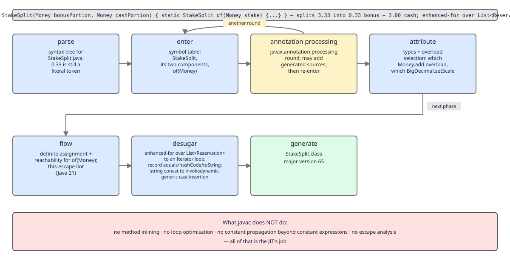

# 03 Java Core — The `javac` pipeline and desugaring — INTERNALS (§3.1)

**Target version: Java 21 LTS.** | **Part 3 of 5** | [Index](../00-index.md)
Previous: [Packages, modules, annotations](02-packages-modules-annotations.md) · Next: [The class file format](03a-internals-class-file-format.md)

Every listing below was produced by running `javac --release 21` and `javap` on the QuizStakes sources shown, on a JDK 25 toolchain targeting release 21. Where a listing came from anywhere other than a run, it says so. The `javap` flags used here, and the class-file structures the listings name, are documented in [the class file format](03a-internals-class-file-format.md).

---

## §3.1 The `javac` pipeline and the desugaring catalogue

### The seven phases, and the line between `javac` and the JIT

**Concept.** `javac` is not an optimiser. It is a *translator with a type checker bolted to the front*: it walks the source into a tree, resolves every name, proves every type, rewrites the tree until only constructs the JVM has instructions for remain, and then serialises that tree to bytes. Everything that makes Java fast happens later, in C1/C2 at runtime.

**Why it exists in phases.** Each phase needs a fact the previous one establishes. You cannot resolve `stake.amount()` until you know `stake` is a `Money`; you cannot know that until every top-level and nested symbol in the compilation unit is entered into a scope; you cannot enter symbols generated by an annotation processor until the processor has run. The phase order is a dependency order, not a style choice.

**How it works.** `com.sun.tools.javac.main.JavaCompiler` drives these phases (`[RESEARCH]` — names as they appear in the OpenJDK `JavaCompiler` API surface: `parse`, `enterTrees`, `processAnnotations`, `attribute`, `flow`, `desugar`, `generate`):

| Phase | Input → output | What it decides for `StakeSplit.of` |
|---|---|---|
| **parse** | chars → `JCCompilationUnit` AST | Syntax only. `assert` is parsed as a statement; nobody has checked `Money` exists. |
| **enter** | AST → symbol table | `StakeSplit`, its two components, `of`, `bonus`, `bonusPortion`, `cashPortion` become `Symbol`s in scopes. Class-level members enter before method bodies are looked at, which is why methods may call methods declared later. |
| **annotation processing** | rounds of `Processor.process` | Runs to a fixed point: each round may generate new sources, which are parsed and entered, triggering another round. A final round runs with `processingOver() == true`. `StakeSplit` has no processors, so exactly one round with nothing to do. |
| **attribute** | AST → typed AST | `stake.amount()` resolves to `Money.amount()` returning `BigDecimal`; `multiply` overload chosen; `setScale(int, RoundingMode)` chosen over `setScale(int, int)`; the `assert` condition proved `boolean`. Erasure-lost types are recorded now for the `Signature` attribute later. |
| **flow** | typed AST → typed AST + errors | Definite assignment, definite unassignment, reachability, exhaustiveness of pattern `switch`, effectively-final analysis for captures. This is where "variable might not have been initialized" comes from. |
| **desugar** | typed AST → JVM-shaped AST | `assert` becomes `if (!$assertionsDisabled && !cond) throw`; the enhanced-for becomes an iterator loop; the record's `Object` methods become `invokedynamic`; string `+` becomes `invokedynamic`. |
| **generate** | JVM-shaped AST → `.class` bytes | Constant pool built, `Code` attributes emitted with computed `max_stack`/`max_locals`, `StackMapTable` computed, attributes written. The resulting layout, and the major-version table that says what `StakeSplit.class` at major version 65 can be loaded by, are in [the class file format](03a-internals-class-file-format.md). |


**D-090** — The seven `javac` phases for `StakeSplit.java`, and what `javac` deliberately does not do.

**Code.**

```java
record StakeSplit(Money bonusPortion, Money cashPortion) {
    static StakeSplit of(Money stake) {
        BigDecimal bonus = stake.amount()
                .multiply(new BigDecimal("0.10"))
                .setScale(2, RoundingMode.DOWN);
        Money bonusPortion = new Money(bonus, stake.currency());
        Money cashPortion = new Money(stake.amount().subtract(bonus), stake.currency());
        assert bonusPortion.amount().add(cashPortion.amount())
                .compareTo(stake.amount()) == 0 : "StakeSplit must sum to stake";
        return new StakeSplit(bonusPortion, cashPortion);
    }
}
```

A stake of `3.33` gives `0.333` → `setScale(2, DOWN)` → `0.33` bonus, and `3.33 - 0.33 = 3.00` cash. Rounding up would give `0.34 + 3.00 = 3.34` and create a penny that no ledger position paid for.

`javap -c -p StakeSplit.class`, the tail of `of`, showing what **desugar** did to the `assert`:

```
        57: getstatic     #53   // Field $assertionsDisabled:Z
        60: ifne          94
        63: aload_2
        64: invokevirtual #16   // Method Money.amount:()Ljava/math/BigDecimal;
        67: aload_3
        68: invokevirtual #16   // Method Money.amount:()Ljava/math/BigDecimal;
        71: invokevirtual #57   // Method java/math/BigDecimal.add:(Ljava/math/BigDecimal;)Ljava/math/BigDecimal;
        74: aload_0
        75: invokevirtual #16   // Method Money.amount:()Ljava/math/BigDecimal;
        78: invokevirtual #60   // Method java/math/BigDecimal.compareTo:(Ljava/math/BigDecimal;)I
        81: ifeq          94
        84: new           #64   // class java/lang/AssertionError
        87: dup
        88: ldc           #66   // String StakeSplit must sum to stake
        90: invokespecial #68   // Method java/lang/AssertionError."<init>":(Ljava/lang/Object;)V
        93: athrow
        94: new           #8    // class StakeSplit
```

Line 57–60: the synthetic `static final boolean $assertionsDisabled` field is read first, and if it is true control jumps straight past the whole check. That is the entire cost of a disabled assertion: one `getstatic` of a field the JIT constant-folds after `<clinit>`. Line 81: the condition itself, inverted — `ifeq 94` means "if `compareTo` returned 0, skip the throw". Lines 84–93: the `AssertionError` is only constructed on the failing path, so the message string costs nothing when the invariant holds.

**Gotcha.** The `assert` needs a companion in `<clinit>`, and it is not free of surprises: the flag is per-class, captured once at class initialisation.

```
  static {};
     0: ldc           #8    // class StakeSplit
     2: invokevirtual #86   // Method java/lang/Class.desiredAssertionStatus:()Z
     5: ifne          12
     8: iconst_1
     9: goto          13
    12: iconst_0
    13: putstatic     #53   // Field $assertionsDisabled:Z
```

Enabling assertions with `-ea` after `StakeSplit` has already been initialised has no effect on it. This also means assertions in a class loaded during JVM bootstrap can behave differently from ones in application classes.

> **Definition.** `javac` is a seven-phase source-to-`.class` translator — parse, enter, annotation processing, attribute, flow, desugar, generate — whose output is a faithful, unoptimised encoding of the source semantics in JVM instructions.

**`[TRAP]` `[X-REF 06]` What `javac` does not do (3.1.12).**

**Pitfall:** *"The compiler optimises my code, so writing it cleverly at source level pays off at compile time."* `javac` performs no inlining, no loop unrolling, no strength reduction, no escape analysis, no dead-store elimination, and no constant propagation beyond what JLS 15.29 calls a *constant expression*. Symptom: engineers hand-unroll loops or hoist field reads into locals and see no change in the class file, then conclude the JVM is slow. Fix: read the bytecode (it is a literal transcription of your source), and measure with JMH against the JIT, which is the component that actually does inlining, loop optimisation and profile-guided devirtualisation — see guide **06 JVM internals** for the C1/C2 tiering, inlining thresholds and how to read `-XX:+PrintInlining`. D-090's right-hand column is the list of things absent from the pipeline.

What `javac` *does* fold is exactly the constant-expression rule, and it is broader than most people expect — it applies to **instance** fields too, not just `static final`:

```java
class PaymentRun {
    private final String runId = "PR-1";
    String auditLine(int count, BigDecimal total) {
        return "PaymentRun " + runId + " lines=" + count + " total=" + total;
    }
}
```

`javap -v -p PaymentRun.class`:

```
  private final java.lang.String runId;
    descriptor: Ljava/lang/String;
    flags: (0x0012) ACC_PRIVATE, ACC_FINAL
    ConstantValue: String PR-1

  #110 = String  #111  // PaymentRun PR-1 lines=\u0001 total=\u0001
```

`runId` is a *constant variable* (JLS 4.12.4: `final`, initialised with a constant expression), so it gets a `ConstantValue` attribute and is folded into the concatenation recipe string — `PaymentRun PR-1 lines=\u0001 total=\u0001`, where `javap` renders each dynamic-argument placeholder as the escape `\u0001`. The field still exists and is still assigned in the constructor; the *use site* no longer reads it. That is constant folding at its full extent, and it stops there: `count` and `total` remain runtime arguments.

---

### `--release` versus `-source`/`-target`

**Concept.** `-source` and `-target` change the *language* level and the *class-file version*. Neither changes the *API surface* `javac` resolves against. `--release` changes all three at once, because it also points the compiler at a bundled historical signature file for that release's `java.base`.

**Why it exists.** Before JDK 9, matching the API surface meant `-Xbootclasspath` pointing at an old `rt.jar` you had to install. JEP 247 shipped the signature data for older releases inside the JDK itself (`$JAVA_HOME/lib/ct.sym`) and exposed it as `--release N`.

**How it works.** With `--release 17`, `javac` sets `-source 17`, `-target 17`, and resolves `java.*` types from `ct.sym`'s 17 snapshot. With `-source 17 -target 17` alone, resolution still goes through the *running* JDK's `java.base` — so `Math.clamp` and `List.reversed()`, both Java 21 additions, resolve happily and get emitted as version-61 `Methodref`/`InterfaceMethodref` entries.

**Code.** A `FundsLedger` build slice:

```java
class FundsLedger {
    static int cappedBonus(int grant) { return Math.clamp(grant, 0, 100); }
    static List<String> newestFirst(List<String> codes) { return codes.reversed(); }
}
```

`javac -source 17 -target 17` on JDK 21 or later — compiles, with only this warning:

```
warning: [options] location of system modules is not set in conjunction with -source 17
  not setting the location of system modules may lead to class files that cannot run on JDK 17
    --release 17 is recommended instead of -source 17 -target 17 because it sets the
    location of system modules automatically
1 warning
```

Deployed to the JDK 17 target, the first `cappedBonus` call throws `java.lang.NoSuchMethodError: java.lang.Math.clamp(III)I` — at the call site, not at load, because resolution of a `Methodref` is lazy.

`javac --release 17` on the same source fails at compile time:

```
error: cannot find symbol
    static int cappedBonus(int grant) { return Math.clamp(grant, 0, 100); }
                                                   ^
  symbol:   method clamp(int,int,int)
  location: class Math
error: cannot find symbol
    static List<String> newestFirst(List<String> codes) { return codes.reversed(); }
                                                                      ^
  symbol:   method reversed()
  location: variable codes of type List<String>
```

**`[TRAP]` Pitfall:** *"`-target 17` guarantees the output runs on Java 17."* It guarantees only that the *class-file version* is 61 and that no post-17 language construct was used. Symptom: a green CI build, a clean `mvn package`, and a `NoSuchMethodError` or `NoSuchFieldError` in the JDK 17 production environment, minutes or days after deploy, at whichever code path first touches the newer API. Fix: use `--release N` everywhere and never `-source`/`-target` alone; in Maven set `<maven.compiler.release>21</maven.compiler.release>`, in Gradle `java.targetCompatibility` is not enough — set `options.release = 21`. Treat the `[options]` warning above as an error via `-Werror`.

**Gotcha.** `--release` covers the JDK's own API. It does *nothing* about third-party libraries: if `PaymentService` compiles against a Spring Boot 3.3 method that the deployed 3.2 does not have, `--release` is silent. Only a matched dependency tree fixes that.

> **Definition.** `--release N` is the only `javac` option that simultaneously constrains language level, class-file version and the visible JDK API surface to release *N*; `-source`/`-target` constrain the first two and leave the third at the compiler's own JDK.

---

### The desugaring catalogue

**Concept.** Between **flow** and **generate** sits a rewriting pass that erases most of what feels like "modern Java". After desugar, the tree contains only constructs with a direct bytecode encoding: field access, method invocation, arithmetic, jumps, `new`, array ops, and `invokedynamic`. Every convenience feature is a *source-level* shorthand, and the class file records the shorthand only in [the attributes that survive erasure](03a-internals-class-file-format.md), never in instructions.

**Why it matters.** Debugging, profiling and bytecode instrumentation all operate after desugar. A profiler that says 4% of `FundsLedger.post` is in `Iterator.hasNext` is telling you about a loop you wrote with no iterator in it. A `ClassCastException` on a line with no cast is a `checkcast` desugar inserted for you.

**D-092** — The desugaring catalogue.

| What you wrote | What `javac` emits | `javap -c` evidence | Class-file attribute involved |
|---|---|---|---|
| `for (Movement m : movements)` over an `Iterable` | `Iterator` acquire, `hasNext`/`next` loop, `checkcast` to the element type | `invokeinterface List.iterator`, `invokeinterface Iterator.hasNext`, `invokeinterface Iterator.next`, `checkcast Movement`, `goto` back-edge | `Code` only; the element type survives in the method's `Signature` and the variable in `LocalVariableTable` |
| `for (Money p : parts)` over an **array** | index-and-length loop, no iterator | `arraylength`, `istore`, `if_icmpge`, `aaload`, `iinc`, `goto` | `Code` only |
| `static Money sum` declared with a varargs `Money` parameter named `parts` | `Money[] parts` plus `ACC_VARARGS` (`0x0080`); the *call site* allocates the array | callee descriptor `([LMoney;)LMoney;`; caller emits `anewarray Money`, `dup`, `aastore` per element | `MethodParameters` keeps the name `parts`; no attribute records "varargs" — it is an access flag |
| `codes.add(801)` into `List<Integer>` | `Integer.valueOf(int)` on the way in, `intValue()` on the way out | `sipush 801`, `invokestatic java/lang/Integer.valueOf:(I)Ljava/lang/Integer;` | `Signature` on the field/method records `List<Integer>` |
| `"PaymentRun " + runId + " lines=" + count` | one `invokedynamic` to `StringConcatFactory.makeConcatWithConstants` with a recipe string | `invokedynamic #0:makeConcatWithConstants:(ILjava/lang/String;)Ljava/lang/String;` | `BootstrapMethods` + a `CONSTANT_String` recipe. Depth: [strings/04](../strings/04-internals-stringbuilder-and-concat.md) |
| `switch (statusCode)` on a `String` | two switches: `hashCode` → `lookupswitch` → `String.equals` guard → index; then `tableswitch` on the index | `invokevirtual String.hashCode`, `lookupswitch`, `ldc "AO-400 SUBMITTED"`, `invokevirtual String.equals`, `tableswitch` | `Code` only; the literals live as `CONSTANT_String` pool entries |
| `switch (restrictionType)` on an enum | a synthetic `$SwitchMap$RestrictionType` `int[]` in a synthetic nested class, indexed by `ordinal()` | `getstatic FundsLedger$1.$SwitchMap$RestrictionType:[I`, `invokevirtual ordinal`, `iaload`, `lookupswitch` | `InnerClasses` for the synthetic holder; its `<clinit>` has an exception table for `NoSuchFieldError`. Depth: [enums/03](../enums/03-internals-enums.md) |
| inner-class access to an enclosing instance or a captured local | synthetic `this$0` field and `val$x` fields, passed through the generated constructor | `getfield this$0`, `getfield val$clientId` in the inner class | `InnerClasses`, plus `NestHost`/`NestMembers` from Java 11 replacing the old `access$000` bridges. Depth: [inheritance-and-dispatch/04](../inheritance-and-dispatch/04-internals-nested-classes.md) |
| `() -> notify(clientId)` lambda | `invokedynamic` to `LambdaMetafactory.metafactory`, plus a private static `lambda$notifyActivation$0` holding the body | `invokedynamic #1:run:(Ljava/lang/String;)Ljava/lang/Runnable;` and a `private static void lambda$notifyActivation$0(java.lang.String)` member | `BootstrapMethods` (the `REF_invokeStatic LambdaMetafactory.metafactory` handle) + `CONSTANT_MethodType` |
| `assert cond : "msg"` | `if (!$assertionsDisabled && !cond) throw new AssertionError(msg)`, plus a `<clinit>` reading `desiredAssertionStatus()` | `getstatic $assertionsDisabled:Z`, `ifne` past the check, `new AssertionError`, `athrow` | a synthetic `ACC_STATIC ACC_FINAL ACC_SYNTHETIC` field; `Code` for the branch |
| `try (var out = new BufferedWriter(writer))` | explicit `close()` on the normal path, duplicated `close()` on the exception path, `Throwable.addSuppressed` | two `Exception table` rows of type `java/lang/Throwable`, `invokevirtual BufferedWriter.close`, `invokevirtual Throwable.addSuppressed`, `athrow` | `Code`'s `Exception table` (a `$closeResource` helper is used instead when the resource is an expression). Depth: [exceptions/03](../exceptions/03-internals-exception-mechanics.md) |
| `record StakeSplit(Money bonusPortion, Money cashPortion)` | `equals`/`hashCode`/`toString` as one `invokedynamic` each to `ObjectMethods.bootstrap` | `invokedynamic #0:toString:(LStakeSplit;)Ljava/lang/String;`, same for `hashCode` and `equals` | `Record` (component names + descriptors) + `BootstrapMethods` + `MethodParameters` on the canonical constructor |
| generic call whose erased return needs narrowing; overriding a generic method with a specialised type | `checkcast` at the call site; a synthetic `ACC_BRIDGE ACC_SYNTHETIC` method delegating to the specialised one | `checkcast Movement` after `Iterator.next`; a `bridge` method with the erased descriptor | `Signature` preserves the pre-erasure type. Depth: [generics/03](../generics/03-internals-erasure.md) |

**Four walked in full.**

**(1) Enhanced-for over `List<Movement>`.** `FundsLedger.post`:

```java
BigDecimal post(List<Movement> movements) {
    BigDecimal total = BigDecimal.ZERO;
    for (Movement movement : movements) { total = total.add(movement.amount()); }
    return total;
}
```

```
     0: getstatic     #16   // Field java/math/BigDecimal.ZERO:Ljava/math/BigDecimal;
     3: astore_2
     4: aload_1
     5: invokeinterface #22,  1  // InterfaceMethod java/util/List.iterator:()Ljava/util/Iterator;
    10: astore_3
    11: aload_3
    12: invokeinterface #28,  1  // InterfaceMethod java/util/Iterator.hasNext:()Z
    17: ifeq          44
    20: aload_3
    21: invokeinterface #34,  1  // InterfaceMethod java/util/Iterator.next:()Ljava/lang/Object;
    26: checkcast     #38   // class Movement
    29: astore        4
    31: aload_2
    32: aload         4
    34: invokevirtual #40   // Method Movement.amount:()Ljava/math/BigDecimal;
    37: invokevirtual #44   // Method java/math/BigDecimal.add:(Ljava/math/BigDecimal;)Ljava/math/BigDecimal;
    40: astore_2
    41: goto          11
    44: aload_2
    45: areturn
```

pc 5: the iterator is fetched once and parked in local slot 3 — a slot your source never named. pc 12/17: the loop test is a real interface call plus a branch, so the loop costs two megamorphic-capable dispatches per element until the JIT inlines them. pc 26: `checkcast Movement` — this is where generics are paid for. `Iterator.next` is erased to return `Object`, so `javac` inserts the cast. If someone put a non-`Movement` into that list through a raw reference, the `ClassCastException` fires *here*, on a line whose source has no cast. pc 41: `goto 11` is the back-edge, the thing the JIT counts to decide when to compile the method.

**Insight:** the array form of the same loop is a completely different program. `Money.sum` shows it: `arraylength` at pc 19, an `int` index in slot 4, `if_icmpge`, `aaload`, `iinc 4, 1`. No allocation, no dispatch, no `checkcast`. This is the mechanism behind "arrays iterate faster than lists" — not cache locality alone, but two fewer virtual calls per element and no iterator object.

**(2) Varargs — `Money.sum`, declared with a varargs `Money` parameter named `parts`.**

```
  static Money sum(Money...);
     0: new           #8    // class Money
     3: dup
     4: getstatic     #26   // Field java/math/BigDecimal.ZERO:Ljava/math/BigDecimal;
     7: ldc           #29   // String GBP
     9: invokestatic  #31   // Method java/util/Currency.getInstance:(Ljava/lang/String;)Ljava/util/Currency;
    12: invokespecial #23   // Method "<init>":(Ljava/math/BigDecimal;Ljava/util/Currency;)V
    15: astore_1
    16: aload_0
    17: astore_2
    18: aload_2
    19: arraylength
    20: istore_3
    21: iconst_0
    22: istore        4
    24: iload         4
    26: iload_3
    27: if_icmpge     49
    30: aload_2
    31: iload         4
    33: aaload
    34: astore        5
    36: aload_1
    37: aload         5
    39: invokevirtual #37   // Method add:(LMoney;)LMoney;
    42: astore_1
    43: iinc          4, 1
    46: goto          24
    49: aload_1
    50: areturn
```

pc 16: `aload_0` — inside a `static` method, slot 0 is the first parameter, and it is already a `Money[]`. There is no varargs machinery in the callee at all; the parameter descriptor is `([LMoney;)LMoney;` and the only trace of varargs is the `ACC_VARARGS` flag `0x0080`. pc 17–20: `javac` hoists both the array reference and its length into locals 2 and 3 before the loop, which is the one loop-invariant hoist the desugar pass happens to perform (a side effect of the desugaring template, not an optimisation pass). pc 43: `iinc 4, 1` increments local 4 in place without touching the operand stack — the reason `i++` on a local is essentially free.

The cost lives at the *caller*: every `Money.sum(a, b, c)` allocates a fresh three-element `Money[]`. At QuizStakes' 2.8M stake reservations a day this is 2.8M short-lived arrays if a varargs helper sits on the reservation path — cheap in a young generation, not free.

**(3) String concatenation — `PaymentRun.auditLine`.**

```
     0: iload_1
     1: aload_2
     2: invokestatic  #15   // Method java/lang/String.valueOf:(Ljava/lang/Object;)Ljava/lang/String;
     5: invokedynamic #21,  0  // InvokeDynamic #0:makeConcatWithConstants:(ILjava/lang/String;)Ljava/lang/String;
    10: areturn
```

Four source operands, five instructions, no `StringBuilder`. pc 0/1: the two dynamic values are pushed. pc 2: `BigDecimal` is pre-converted with `String.valueOf` (`javac` does this for reference operands so the indy call site's type is `String`, keeping the number of generated shapes down). pc 5: one `invokedynamic` whose bootstrap is `StringConcatFactory.makeConcatWithConstants`, with the static argument being the recipe `PaymentRun PR-1 lines=\u0001 total=\u0001` — literal text inline, `\u0001` marking each dynamic slot. The `int` is *not* boxed: the indy descriptor takes `I` directly.

**Version trap.** Every pre-Java-9 article says `+` compiles to `new StringBuilder().append(…).append(…).toString()`. That was true through Java 8. JEP 280 (Java 9) replaced it with this `invokedynamic`, and the linked implementation builds an exact-sized `byte[]` in one pass with no intermediate `StringBuilder`. What is *still* true: `+` inside a loop remains quadratic, because each iteration produces a whole new `String` — indified concat made one concatenation cheaper, not repeated concatenation cheap. Interviewers still ask for the `StringBuilder` answer; give the historical answer and then the current one.

**(4) Record `Object` methods — `StakeSplit`.**

```
  public final java.lang.String toString();
     0: aload_0
     1: invokedynamic #74,  0  // InvokeDynamic #0:toString:(LStakeSplit;)Ljava/lang/String;
     6: areturn

  public final int hashCode();
     0: aload_0
     1: invokedynamic #78,  0  // InvokeDynamic #0:hashCode:(LStakeSplit;)I
     6: ireturn

  public final boolean equals(java.lang.Object);
     0: aload_0
     1: aload_1
     2: invokedynamic #82,  0  // InvokeDynamic #0:equals:(LStakeSplit;Ljava/lang/Object;)Z
     7: ireturn
```

All three share bootstrap method `#0`, whose entries in [the constant pool](03a-internals-class-file-format.md) are:

```
  #115 = String       #116  // bonusPortion;cashPortion
  #117 = MethodHandle 1:#7  // REF_getField StakeSplit.bonusPortion:LMoney;
  #118 = MethodHandle 1:#13 // REF_getField StakeSplit.cashPortion:LMoney;
  #119 = MethodHandle 6:#120 // REF_invokeStatic java/lang/runtime/ObjectMethods.bootstrap:(Ljava/lang/invoke/MethodHandles$Lookup;Ljava/lang/String;Ljava/lang/invoke/TypeDescriptor;Ljava/lang/Class;Ljava/lang/String;[Ljava/lang/invoke/MethodHandle;)Ljava/lang/Object;
```

`#119` reference kind 6 is `REF_invokeStatic` on `java.lang.runtime.ObjectMethods.bootstrap`. Its static arguments are the semicolon-joined component-name list `#115` and one `REF_getField` handle per component. The generated code is therefore *five instructions total for three methods* — the actual comparison, hashing and formatting logic is spun at first call by `ObjectMethods`, as a `MethodHandle` tree, and cached in the `CallSite`. The class file also carries:

```
Record:
  Money bonusPortion;
    descriptor: LMoney;
  Money cashPortion;
    descriptor: LMoney;
```

That `Record` attribute is what `Class.getRecordComponents()` reads, and it is why a record's component *order* is reflectively recoverable while an ordinary class's field order is not guaranteed.

**Gotcha.** Because the bodies are spun at runtime, a record's `equals` does not appear in a stack trace as your code — you see `ObjectMethods$$Lambda` frames. And `hashCode` for a record is *not* specified to equal any particular formula; do not persist it.

> **Definition.** Desugaring is the `javac` phase that rewrites source-only constructs into the small set of forms the JVM has instructions for, leaving the original intent recoverable only through class-file attributes.

---

### Supporting facts

**`-g`, `-parameters`, and what frameworks lose (3.1.8) `[TRAP]` `[X-REF 07]`.** `javac`'s default is `-g:source,lines`: you get `SourceFile` and `LineNumberTable` but **not** `LocalVariableTable`. `-g` adds locals and vars; `-g:none` strips all three, and your production stack traces lose line numbers. `-parameters` is separate and emits `MethodParameters`. Verified: compiling `StakeSplit` with `-parameters` gives the canonical constructor `MethodParameters: bonusPortion, cashPortion` and `of` gives `stake`; without it, the attribute is absent from the pool entirely. What each of those attributes contains is tabulated in [the attributes that survive erasure](03a-internals-class-file-format.md).

**Pitfall:** *"Jackson and Spring read my parameter names, so they must be in the class file."* Without `-parameters` they are not, and reflection reports `arg0`, `arg1`. Symptoms, both real: Jackson deserialising a `Money` request body fails with `Cannot construct instance of Money (no Creators, like default constructor, exist)` or silently binds nothing, because it cannot match the JSON keys `amount`/`currency` to constructor parameters named `arg0`/`arg1`; and Spring MVC resolving `@PathVariable ClientId clientId` throws `Name for argument of type [ClientId] not specified, and parameter name information not available via reflection`. Fix: Spring Boot's `spring-boot-starter-parent` already sets `-parameters` in the compiler plugin — if you do not inherit it, add `<compilerArgs><arg>-parameters</arg></compilerArgs>` yourself (Gradle: `options.compilerArgs << '-parameters'`). Records are the exception that hides the problem: the `Record` attribute always carries component names, so record-based DTOs bind fine while a hand-written constructor next to them does not. See guide **07 Spring core** for how the container's `ParameterNameDiscoverer` chain tries `MethodParameters` first and `LocalVariableTable` second.

**`-Xlint` categories worth turning on (3.1.9) `[RESEARCH]`.** `javac -Xlint:all -Werror` is the correct default for new code; the list below is the subset that catches real defects. Category names verified against `javac --help-lint`.

| Category | Catches | Why it matters in QuizStakes |
|---|---|---|
| `all` | everything the compiler knows | The baseline; disable individually with `-Xlint:all,-serial`. |
| `unchecked` | unverifiable generic operations | A raw `Map` put into `Map<RestrictionKey, Restriction>` becomes a `ClassCastException` at a `checkcast` far from the bug. |
| `rawtypes` | `List` where `List<Movement>` was meant | Raw types disable *all* generic checking on that expression, not just the one use. |
| `fallthrough` | a `case` without `break` reaching the next | In `blocksStake`, a missing `break` silently widens a restriction check. |
| `serial` | `Serializable` without `serialVersionUID`, and suspect serial declarations | A `LedgerImbalanceException` crossing a version boundary fails to deserialise. |
| `overloads` | overloads that are confusingly ambiguous | `post(List<Movement>)` next to `post(Collection<Movement>)` picks by static type, not runtime type. |
| `this-escape` | constructor calling an overridable method | See below. **New in Java 21.** |
| `lossy-conversions` | narrowing hidden in compound assignment | `int total; total += someLong;` compiles silently and truncates. |
| `try` | try-with-resources issues, e.g. an unused resource variable | Catches a resource acquired and never written to. |
| `preview` | use of preview features | Stops a preview construct reaching a production build unnoticed. |

Not in JDK 21: `identity`, `restricted`, `dangling-doc-comments` and `output-file-clash` appear in the JDK 25 list used here; `synchronization` exists in 21 and is a deprecated alias for `identity` in the newer JDKs.

**The `this-escape` warning (3.1.10) `[RESEARCH]`.** New in Java 21. It fires when a constructor of a non-`final`, externally-extensible class allows `this` to be reached — most commonly by calling an overridable method — before subclass initialisation has run.

```java
public class Account {
    private final String accountId;
    public Account(String accountId) {
        this.accountId = accountId;
        applyRestrictions();
    }
    public void applyRestrictions() { }
    public String accountId() { return accountId; }
}
```

`javac -Xlint:this-escape` on that file, verified:

```
Account.java:6: warning: [this-escape] possible 'this' escape before subclass is fully initialized
        applyRestrictions();
                         ^
1 warning
```

**Pitfall:** *"The superclass constructor runs first, so by the time my override runs the object is set up."* Exactly backwards for the *subclass*'s own fields. A subclass overriding `applyRestrictions()` to consult `jurisdiction` sees `jurisdiction == null` — and if `jurisdiction` is `final`, it sees `null` in a field the language promises is never null, because the subclass's field initialisers have not run yet. Symptom: a `NullPointerException` or a wrongly-cleared `SELF_EXCLUDED` restriction, only for the subclass, only on construction, and unreproducible in a unit test that constructs the base class. Fix: make `applyRestrictions` `private` or `final`, or make `Account` `final` or `sealed`, or move the call to a static factory that constructs then initialises. The lint only fires when a subclass could exist *outside* the current compilation — a `sealed` hierarchy or a package-private method silences it legitimately. **Unverified:** I could not confirm offline the JDK bug ID that introduced this lint; it is a javac lint enhancement, not part of JEP 447.

---

## Pitfalls

### Believing `-target 17` produces a class file that runs on Java 17

**Wrong**

```
$ javac -source 17 -target 17 FundsLedger.java     # on a JDK 21+ toolchain
warning: [options] location of system modules is not set in conjunction with -source 17
1 warning
$ # deployed to the JDK 17 runtime:
Exception in thread "main" java.lang.NoSuchMethodError: java.lang.Math.clamp(III)I
	at FundsLedger.cappedBonus(FundsLedger.java:3)
```

The class file's `major_version` is 61, so it loads. The failure happens at the first execution of the call site, because `CONSTANT_Methodref` resolution is lazy.

**Right**

```
$ javac --release 17 FundsLedger.java
error: cannot find symbol
    static int cappedBonus(int grant) { return Math.clamp(grant, 0, 100); }
                                                   ^
  symbol:   method clamp(int,int,int)
  location: class Math
```

`--release N` sets `-source`, `-target` *and* the API surface, resolving `java.*` against the release-*N* signatures bundled in `lib/ct.sym`. Failure moves from production to the build.

**Why people believe it:** `-target` is documented as "generate class files for a specific VM version", which is literally true and sounds like a runtime guarantee. It constrains the format version, not the API surface.

### Believing frameworks can see your parameter names

**Wrong**

```java
public record MoneyRequest(BigDecimal amount, String currency) { }

public class DepositRequest {                      // hand-written, not a record
    private final BigDecimal amount;
    private final String currency;
    public DepositRequest(BigDecimal amount, String currency) {
        this.amount = amount; this.currency = currency;
    }
}
```

```
com.fasterxml.jackson.databind.exc.InvalidDefinitionException:
  Cannot construct instance of DepositRequest (no Creators, like default constructor, exist)
```

The record binds; the class next to it does not, and the difference looks like magic.

**Right**

Compile with `-parameters`, so `MethodParameters` is emitted:

```
$ javac --release 21 -parameters -d target/classes DepositRequest.java
$ javap -v -p target/classes/DepositRequest.class | grep -A3 MethodParameters
    MethodParameters:
      Name                           Flags
      amount
      currency
```

The record worked without the flag only because the `Record` attribute always stores component names, independently of `-parameters`.

**Why people believe it:** Spring Boot's parent POM sets `-parameters` for you, so it works in every Spring project until someone builds a module outside that parent, or a plain-Java library, and the behaviour silently changes.

### Believing `javac` optimises

**Wrong**

```java
// "hoisting the field read into a local will be faster"
BigDecimal post(List<Movement> movements) {
    BigDecimal total = BigDecimal.ZERO;
    final int size = movements.size();           // hand-hoisted
    for (int i = 0; i < size; i++) { total = total.add(movements.get(i).amount()); }
    return total;
}
```

The bytecode contains exactly the instructions written, including a `List.size` call and an `invokeinterface List.get` per element. Nothing was hoisted for you, nothing inlined, and the version with `get(i)` is now *slower* on a `LinkedList`.

**Right**

Write the clearest form, then measure. `javac`'s only folding is the constant-expression rule (JLS 15.29) — visible as `ConstantValue: String PR-1` on `PaymentRun.runId` and as `PR-1` baked into the concat recipe. Inlining, loop-invariant hoisting, bounds-check elimination and devirtualisation are C1/C2's job, driven by the profile counters on the `goto` back-edge.

**Why people believe it:** every other mainstream compiler — `gcc`, `clang`, `rustc`, the C# JIT's AOT path — does optimise at compile time. Java moved the whole optimiser to runtime so it could use profile data, and `javac` kept only the translation half.

---

## Cheat sheet

| Thing | Value |
|---|---|
| Phases | parse → enter → annotation processing → attribute → flow → desugar → generate |
| Annotation processing | rounds to a fixed point; final round has `processingOver() == true` |
| Attribute phase | overload resolution, type proof, erasure-lost types recorded for `Signature` |
| Flow phase | definite assignment, reachability, `switch` exhaustiveness, effectively-final |
| Correct flag | `--release N`, never `-source`/`-target` alone |
| `--release` mechanism | release-*N* signatures in `$JAVA_HOME/lib/ct.sym` (JEP 247) |
| Too-new API, right version | `NoSuchMethodError` at the call site, lazily, on first execution |
| Maven / Gradle | `<maven.compiler.release>21</maven.compiler.release>` / `options.release = 21` |
| Enhanced-for (Iterable) | `iterator`/`hasNext`/`next` + `checkcast` |
| Enhanced-for (array) | `arraylength` + `if_icmpge` + `aaload` + `iinc` |
| Varargs | `ACC_VARARGS 0x0080`; array allocated at the **caller** |
| Boxing | `Integer.valueOf(int)` in, `intValue()` out |
| `+` concat | `invokedynamic StringConcatFactory.makeConcatWithConstants`, recipe with `\u0001` slots (Java 9+, JEP 280) |
| String switch | `hashCode` → `lookupswitch` → `equals` → `tableswitch` |
| Enum switch | synthetic `$SwitchMap$<Enum>` `int[]` indexed by `ordinal()` |
| Lambda | `invokedynamic LambdaMetafactory.metafactory` + `private static lambda$m$0` |
| Record `Object` methods | `invokedynamic ObjectMethods.bootstrap`, name list + one `REF_getField` per component |
| `assert` | `getstatic $assertionsDisabled` + `ifne`; flag fixed at `<clinit>`, so `-ea` after init is a no-op |
| try-with-resources | duplicated `close()` + two `Throwable` exception-table rows + `addSuppressed` |
| Debug flags | default `-g:source,lines`; `-g` adds locals/vars; `-g:none` loses line numbers; `-parameters` is separate |
| Lint default | `-Xlint:all -Werror`; `this-escape` is new in Java 21 |
| Constant folding | only JLS 15.29 constant expressions; instance `final` counts; emits `ConstantValue` |
| `javac` never does | inlining, loop optimisation, propagation beyond constant expressions |

---

## Self-test

**Q1.** `javap -c` on `FundsLedger.post(List<Movement>)` shows `checkcast Movement` at pc 26, but the source has no cast. Where did it come from, and what does it cost you?

<details><summary>Answer</summary>

`Iterator.next()` is erased to return `Object`, so the desugared enhanced-for must narrow the result before storing it in the `Movement` local. `javac` inserts the `checkcast`. Cost: one type check per element (very cheap, and often eliminated by C2 when the profile shows a single type), plus the real consequence — if heap pollution put a non-`Movement` into that `List` through a raw reference, the `ClassCastException` is thrown *here*, on a line with no cast in it, arbitrarily far from the code that inserted the wrong element.

</details>

**Q2.** A build compiles cleanly with `-source 17 -target 17` on a JDK 21 toolchain. What can still fail on the JDK 17 runtime, and at what moment?

<details><summary>Answer</summary>

Any call to an API that exists in JDK 21's `java.base` but not JDK 17's, because `-source`/`-target` do not change the API surface `javac` resolves against — only `--release 17` does that, by resolving against the release-17 signatures in `lib/ct.sym`. The class file's `major_version` is 61, so it loads without complaint. The failure is a `NoSuchMethodError` (or `NoSuchFieldError`, or `NoClassDefFoundError` for a wholly new type) thrown at the *first execution* of the offending call site, because resolution of a `CONSTANT_Methodref` is lazy. It can therefore surface days after deploy on a rare code path.

</details>

**Q3.** Explain the two switches in the bytecode for `switch (statusCode)` over `"AO-400 SUBMITTED"`, `"AA-801 ACTIVATED"` and `"DEP-301 CAPTURED"`.

<details><summary>Answer</summary>

`javac` cannot switch on a reference, so it desugars to a two-stage lowering. Stage one: `invokevirtual String.hashCode()`, then a `lookupswitch` over the three literal hash values (`-946338416`, `602891165`, `-1899313112` for these three strings), each target performing `ldc` of the corresponding literal plus `invokevirtual String.equals` as a guard against hash collision, and on a match storing a dense index `0`/`1`/`2` into a synthetic local. Stage two: a `tableswitch` on that dense index to the actual case bodies. Two dispatches, one hash and up to one `equals` per switch execution. The `equals` guard is what makes the desugaring correct in the presence of colliding strings; without it a collision would run the wrong branch.

</details>

**Q4.** Your instrumentation agent throws a `ClassCastException` inside a record's `equals` and the stack trace shows no code you wrote. What is going on?

<details><summary>Answer</summary>

A record's `equals`, `hashCode` and `toString` are each a single `invokedynamic` to `java.lang.runtime.ObjectMethods.bootstrap`, whose static arguments are the semicolon-joined component-name string (`bonusPortion;cashPortion`) and one `REF_getField` `CONSTANT_MethodHandle` per component. The actual comparison logic is a `MethodHandle` tree spun at first call and cached in the `CallSite`, so the frames are synthetic `ObjectMethods` / hidden-class lambda frames, not bytecode in `StakeSplit`. If the agent rewrote or removed a component field, or the record was redefined with a mismatched `Record` attribute, the handles bind to the wrong accessor and the cast inside the spun tree fails. Diagnose with `javap -v -p` on the transformed class, checking the `Record` attribute and `BootstrapMethods` entry 0 against the field list.

</details>

**Q5.** Which two `javac` flags does a Spring Boot service actually depend on for correct behaviour, and what breaks without each?

<details><summary>Answer</summary>

`-parameters`, which emits `MethodParameters`: without it, reflection reports `arg0`/`arg1`, so Jackson cannot bind a JSON body to a hand-written constructor (`Cannot construct instance of DepositRequest`) and Spring MVC cannot resolve `@PathVariable ClientId clientId` (`Name for argument of type [ClientId] not specified, and parameter name information not available via reflection`). Records escape this because the `Record` attribute always carries component names. And the debug flags: `javac`'s default is `-g:source,lines`, which is enough for line numbers in stack traces; `-g:none` removes `SourceFile` and `LineNumberTable` and leaves you with traces that name a method but no line, while `-g` additionally emits `LocalVariableTable`/`LocalVariableTypeTable` so a debugger can show named locals and Spring's fallback `ParameterNameDiscoverer` can recover names for non-constructor methods.

</details>

**Q6.** `-Xlint:this-escape` fires on an `Account` constructor. Reproduce the concrete failure it is predicting.

<details><summary>Answer</summary>

`Account`'s constructor calls the overridable `applyRestrictions()` after setting `accountId` but before any subclass constructor body or field initialiser has run. A subclass `JurisdictionAccount extends Account` that overrides `applyRestrictions()` to read `this.jurisdiction` sees `null` there — even if `jurisdiction` is `final`, because `final` field initialisers run after the `super` constructor invocation completes. Symptom: a `NullPointerException`, or worse a restriction check that silently passes and clears a `SELF_EXCLUDED` restriction it should have honoured, reproducible only through the subclass and only at construction. Fixes: make `applyRestrictions` `private` or `final`, make `Account` `final` or `sealed`, or move the call out of the constructor into a static factory that constructs first and initialises second. The lint deliberately stays quiet when no external subclass is possible.

</details>

**Q7.** Why does the enhanced-for over `List<Movement>` cost more per element than the enhanced-for over `Money[]`, at the bytecode level?

<details><summary>Answer</summary>

The `Iterable` form desugars to an `Iterator`: one `invokeinterface List.iterator` allocation, then per element an `invokeinterface Iterator.hasNext`, an `invokeinterface Iterator.next` and a `checkcast` to the element type — two interface dispatches and a type check per iteration, plus one iterator object per loop. The array form desugars to `arraylength` hoisted into a local, an `int` counter, `if_icmpge`, `aaload` and `iinc` — no allocation, no dispatch, no `checkcast`, because arrays are covariantly typed in the class file and `aaload` returns the array's component type directly. `javac` performs neither loop's optimisation; the difference is purely the desugaring template, and C2 can close most but not all of the gap by inlining the iterator when the receiver type is monomorphic.

</details>

## Deferred

None.

## Open questions

- The exact JDK bug ID that introduced the `this-escape` lint. The lint is present and verified working in JDK 21+, and it is a javac lint enhancement rather than part of JEP 447, but I could not confirm the tracking ID offline. Recorded inline as `**Unverified:**` at leaf 3.1.10.
- Which precise release added the `-Xlint` categories `identity`, `restricted`, `dangling-doc-comments` and `output-file-clash`. They are present in the JDK 25 `javac --help-lint` output used here and absent from JDK 21; the file states only that, not a release number.
- All listings were produced on a JDK 25 toolchain with `--release 21`, which fixes the class-file version at 65 and the language level at 21 but does not guarantee byte-identical codegen to a JDK 21 `javac`. Pool index numbers in particular are implementation detail and may differ; instruction sequences and attributes should not.

---

**Leaves covered:** 3.1.1, 3.1.4, 3.1.6, 3.1.8, 3.1.9, 3.1.10, 3.1.12 (7 leaves)
**Leaves deferred:** none
**Diagrams included:** D-090, D-092
**Target version:** Java 21 LTS
**Lines:** 588
