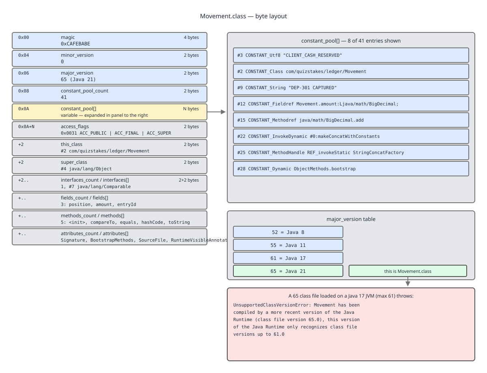

# 03 Java Core — The class file format — INTERNALS (§3.1)

**Target version: Java 21 LTS.** | **Part 3 of 5** | [Index](../00-index.md)
Previous: [The `javac` pipeline and desugaring](03-internals-javac-and-class-file.md) · Next: [Version history](04-internals-version-history.md)

Every listing below was produced by running `javac --release 21` and `javap` on the QuizStakes sources shown, on a JDK 25 toolchain targeting release 21. Where a listing came from anywhere other than a run, it says so. What `javac` *put* in these files — the phases, the flags and the desugarings — is in [the `javac` pipeline and desugaring](03-internals-javac-and-class-file.md).

---

## §3.1 The class file format, the constant pool and the stack machine

### The class file as a byte layout, and the constant pool

**Concept.** A `.class` file is a single, flat, big-endian byte sequence with no padding and no alignment. Every variable-length part is preceded by its own count. There is no index, no seek table, and no way to read a field's value without walking the pool from entry 1. Almost everything else in the file is an *index into the constant pool*, so the pool is the file's string and symbol table.

**Why it exists in this shape.** The verifier and the loader must be able to consume the file in a single forward pass, from a stream, on a device with no filesystem. Counts-before-arrays makes that possible; a shared pool makes the file small, because `"CLIENT_CASH_RESERVED"` appears once no matter how many instructions mention it.

**How it works — `[SOURCE]` JVMS 21 §4.1.**

```
ClassFile {
    u4             magic;
    u2             minor_version;
    u2             major_version;
    u2             constant_pool_count;
    cp_info        constant_pool[constant_pool_count-1];
    u2             access_flags;
    u2             this_class;
    u2             super_class;
    u2             interfaces_count;
    u2             interfaces[interfaces_count];
    u2             fields_count;
    field_info     fields[fields_count];
    u2             methods_count;
    method_info    methods[methods_count];
    u2             attributes_count;
    attribute_info attributes[attributes_count];
}
```

- `magic` — `u4`, always `0xCAFEBABE`. Four bytes.
- `minor_version`, `major_version` — `u2` each. `major` is the language level the file requires; `minor` is `0` except for preview features, where it is `0xFFFF`.
- `constant_pool_count` — `u2`, and note the array is `constant_pool_count - 1` long: **the pool is 1-indexed**, and index 0 is permanently invalid. `long` and `double` entries additionally consume two indices (JVMS 4.4.5), a design the spec itself calls a poor choice.
- `access_flags` — `u2` bit set: `ACC_PUBLIC 0x0001`, `ACC_FINAL 0x0010`, `ACC_SUPER 0x0020`, `ACC_INTERFACE 0x0200`, `ACC_ABSTRACT 0x0400`, `ACC_SYNTHETIC 0x1000`, `ACC_ANNOTATION 0x2000`, `ACC_ENUM 0x4000`, `ACC_MODULE 0x8000`.
- `this_class`, `super_class` — `u2` pool indices to `CONSTANT_Class`. `super_class` is 0 only for `java.lang.Object`.
- The three `_count` fields for interfaces, fields, methods, plus `attributes_count`.

**`[NUM]`** The fixed scalar fields sum to: magic 4 + minor 2 + major 2 + `constant_pool_count` 2 + `access_flags` 2 + `this_class` 2 + `super_class` 2 + `interfaces_count` 2 + `fields_count` 2 + `methods_count` 2 + `attributes_count` 2 = **24 bytes**. Everything else in a class file is pool entries, members and attributes. `Movement.class` as compiled here is 1770 bytes, so 1746 bytes — 98.6% — is variable-length payload, and 71 of those bytes' worth of structure is the pool.


**D-091** — The byte layout of `Movement.class`, its constant pool entries, and the major-version table.

**Code.** `xxd -l 16 Movement.class` on the real file:

```
00000000: cafe babe 0000 0041 0048 0a00 0200 0307  .......A.H......
```

Byte by byte: `cafe babe` is the magic. `0000` is `minor_version` 0. `0041` is `major_version` 65 — Java 21. `0048` is `constant_pool_count` = 72, so entries `#1` through `#71`. Then `0a` is the tag of entry `#1`: 10 = `CONSTANT_Methodref`, whose two `u2` operands follow immediately — `0002` (class `#2`) and `0003` (name-and-type `#3`). `javap -v -p Movement.class` confirms `#1 = Methodref #2.#3`.

The pool for `Movement`, the ledger movement aggregate with `position`, `amount` and `entryId`, includes:

```
   #7 = Fieldref           #8.#9          // Movement.position:Ljava/lang/String;
   #9 = NameAndType        #11:#12        // position:Ljava/lang/String;
  #11 = Utf8               position
  #21 = String             #22            // DEP-301 CAPTURED
  #22 = Utf8               DEP-301 CAPTURED
  #54 = String             #55            // position;amount;entryId
  #56 = MethodHandle       1:#7           // REF_getField Movement.position:Ljava/lang/String;
```

`#22` is the `CONSTANT_Utf8` holding the raw bytes `DEP-301 CAPTURED`; `#21` is the `CONSTANT_String` that wraps it and is what `ldc` loads. `#56` is a `CONSTANT_MethodHandle` with reference kind `1` (`REF_getField`) pointing at the `Fieldref` `#7` — that is the accessor handle the record's `Object` methods bootstrap will use, walked in full in [the desugaring catalogue](03-internals-javac-and-class-file.md). A `Position` naming `CLIENT_CASH_RESERVED` appears the same way: one `CONSTANT_Utf8` for the 20 characters, referenced from wherever the enum constant or string literal is used, no matter how many times.

**`[SOURCE]` The `cp_info` tag table (JVMS 21 §4.4).** Every entry is `u1 tag` followed by tag-specific bytes.

| Tag | Name | Payload | What it is for |
|---|---|---|---|
| 1 | `CONSTANT_Utf8` | `u2 length` + modified-UTF-8 bytes | Every name, descriptor and string body. The only entry that holds characters. |
| 3 | `CONSTANT_Integer` | `u4` | `ldc` of an `int`; also `char`, `short`, `byte`, `boolean` literals. |
| 4 | `CONSTANT_Float` | `u4` | `ldc` of a `float`. |
| 5 | `CONSTANT_Long` | `u8` | `ldc2_w`; consumes two pool indices. |
| 6 | `CONSTANT_Double` | `u8` | `ldc2_w`; consumes two pool indices. |
| 7 | `CONSTANT_Class` | `u2` → `Utf8` | `new`, `checkcast`, `instanceof`, `PermittedSubclasses`, exception-table types. |
| 8 | `CONSTANT_String` | `u2` → `Utf8` | `ldc "DEP-301 CAPTURED"`. Interned on first `ldc`. |
| 9 | `CONSTANT_Fieldref` | `u2` `Class` + `u2` `NameAndType` | `getfield`, `putfield`, `getstatic`, `putstatic`. |
| 10 | `CONSTANT_Methodref` | `u2` `Class` + `u2` `NameAndType` | `invokevirtual`, `invokestatic`, `invokespecial` on classes. |
| 11 | `CONSTANT_InterfaceMethodref` | `u2` `Class` + `u2` `NameAndType` | `invokeinterface`, and `invokestatic`/`invokespecial` on interfaces. |
| 12 | `CONSTANT_NameAndType` | `u2` name + `u2` descriptor | The `(name, descriptor)` half of every ref, shared across refs. |
| 15 | `CONSTANT_MethodHandle` | `u1` reference kind + `u2` ref | Bootstrap arguments; `REF_getField` = 1, `REF_invokeStatic` = 6. |
| 16 | `CONSTANT_MethodType` | `u2` → descriptor `Utf8` | A bare `MethodType` bootstrap argument, e.g. `()V` for a `Runnable`. |
| 17 | `CONSTANT_Dynamic` | `u2` bootstrap index + `u2` `NameAndType` | Dynamically computed **constant** (`ldc`) — condy, used by `switch` pattern matching. |
| 18 | `CONSTANT_InvokeDynamic` | `u2` bootstrap index + `u2` `NameAndType` | Every `invokedynamic`: lambdas, concat, record `Object` methods. |
| 19 | `CONSTANT_Module` | `u2` → `Utf8` | Only legal in a `module-info.class`. |
| 20 | `CONSTANT_Package` | `u2` → `Utf8` | Only legal in a `module-info.class`. |

**`[NUM]` `[RESEARCH]` Major versions and `UnsupportedClassVersionError` (3.1.3).** The rule is `major = 44 + JavaSE`, so Java 1.1 is 45 and every release adds one.

| Java SE | major | Notable class-file change |
|---|---|---|
| 8 | **52** | Default methods, `MethodParameters`, type annotations. |
| 11 | **55** | `NestHost`/`NestMembers` (JEP 181) — `access$000` bridges retired. |
| 17 | **61** | `PermittedSubclasses` (sealed), `Record` (records finalised in 16). |
| 21 | **65** | Pattern `switch` and record patterns final; `SequencedCollection` in the library. |
| 25 | 69 | The runtime used to produce every listing in both halves of §3.1. |

The runtime check is in the loader, before verification, and the message names the class. Verified by patching `Movement.class`'s `major_version` bytes from `0x0041` to `0x0046` and running it on JDK 25:

```
Error: LinkageError occurred while loading main class Movement
	java.lang.UnsupportedClassVersionError: Movement has been compiled by a more recent
	version of the Java Runtime (class file version 70.0), this version of the Java
	Runtime only recognizes class file versions up to 69.0
```

The number printed is `major.minor`. There is no partial compatibility: a JDK 17 runtime rejects a version-65 `Movement` outright, before a single instruction is verified.

**Gotcha.** `major_version` says nothing about which *APIs* the file calls. A version-61 class file can name `java.util.List.reversed()`, which does not exist before 21. The file loads on 17 and then dies on first execution of that call site. That is the whole content of [`--release` versus `-source`/`-target`](03-internals-javac-and-class-file.md).

> **Definition.** A class file is a single-pass, big-endian byte stream of 24 bytes of fixed scalar fields plus counted variable-length sections, in which every symbolic reference is an index into a 1-indexed shared constant pool.

---

### Reading the stack machine

**Concept.** A JVM method frame has exactly two data areas: a fixed-size **local variable array**, addressed by slot number, and a LIFO **operand stack** whose maximum depth is computed at compile time. Every instruction is defined purely as a stack transition. There are no registers to allocate and no addressing modes — which is exactly why the bytecode is a transcription of your source and not an optimisation of it. The loop and expression shapes traced through the stack here are the ones produced by [the desugaring catalogue](03-internals-javac-and-class-file.md), including the enhanced-for's iterator form and its `checkcast`.

**Why it exists.** A stack machine is trivially verifiable: the verifier can compute the type-state at every instruction by abstract interpretation, using the `StackMapTable` as a hint at merge points, in one linear pass. Register machines need a much harder analysis.

**How it works.** `max_locals` counts slots, not variables: `this` is slot 0 in an instance method, then parameters in declaration order, then locals in scope order, and `long`/`double` occupy two consecutive slots. `max_stack` is the maximum depth reached on any path. Both are stored in the `Code` attribute and checked by the verifier.

**Code.** `Money.add`, with `javap -v -p` so the computed limits show:

```java
Money add(Money other) {
    return new Money(this.amount.add(other.amount), this.currency);
}
```

```
  Money add(Money);
    descriptor: (LMoney;)LMoney;
    Code:
      stack=4, locals=2, args_size=2
         0: new           #8    // class Money
         3: dup
         4: aload_0
         5: getfield      #7    // Field amount:Ljava/math/BigDecimal;
         8: aload_1
         9: getfield      #7    // Field amount:Ljava/math/BigDecimal;
        12: invokevirtual #17   // Method java/math/BigDecimal.add:(Ljava/math/BigDecimal;)Ljava/math/BigDecimal;
        15: aload_0
        16: getfield      #13   // Field currency:Ljava/util/Currency;
        19: invokespecial #23   // Method "<init>":(Ljava/math/BigDecimal;Ljava/util/Currency;)V
        22: areturn
```

**`[PROVE]`** Slot 0 holds `this`, slot 1 holds `other`; nothing else is declared, so `locals=2`, and neither slot is ever written. Tracing the stack, bottom on the left, with `U` meaning the not-yet-initialised `Money` reference:

| pc | instruction | operand stack after | locals after |
|---|---|---|---|
| — | (entry) | *(empty)* | 0=`this`, 1=`other` |
| 0 | `new Money` | `U` | unchanged |
| 3 | `dup` | `U, U` | unchanged |
| 4 | `aload_0` | `U, U, this` | unchanged |
| 5 | `getfield amount` | `U, U, this.amount` | unchanged |
| 8 | `aload_1` | `U, U, this.amount, other` | unchanged |
| 9 | `getfield amount` | `U, U, this.amount, other.amount` | unchanged |
| 12 | `invokevirtual BigDecimal.add` | `U, U, sum` | unchanged |
| 15 | `aload_0` | `U, U, sum, this` | unchanged |
| 16 | `getfield currency` | `U, U, sum, this.currency` | unchanged |
| 19 | `invokespecial Money.<init>` | `U` | unchanged |
| 22 | `areturn` | *(empty)* | unchanged |

Maximum depth reached: 4, at pc 9 and again at pc 16. That derives `stack=4` exactly. The `dup` at pc 3 is the crux of `new`: `new` pushes an uninitialised reference, `invokespecial` *consumes* it along with the constructor arguments and returns nothing, so a copy must be duplicated beforehand to be the expression's value. That is why `new` and `<init>` are always separate instructions, and why the verifier tracks an "uninitialised" type-state that cannot be passed anywhere until `<init>` completes.

**Insight:** the ordering here is pure post-order traversal of your expression tree. `new Money(A, B)` becomes `new`, `dup`, evaluate A, evaluate B, `invokespecial` — which is why argument evaluation order in Java is specified strictly left to right (JLS 15.7): it is the traversal order, and there is no reordering pass to break it.

**Gotcha.** `stack=4` is the *verified maximum*, not the runtime cost. The interpreter allocates the frame at that size once; C2 will keep all four values in machine registers and the `new` will very likely be scalar-replaced away if the `Money` never escapes. See guide **06 JVM internals** for escape analysis and frame layout.

> **Definition.** JVM bytecode is a typed stack machine over a per-frame operand stack and an indexed local variable array, with both sizes fixed at compile time and recorded in the `Code` attribute.

---

### Supporting facts

**Attributes that carry what erasure and codegen would lose (3.1.7) `[RESEARCH]`.** Instructions cannot express generics, source lines, parameter names, sealing or nesting; attributes can. `attribute_info` is `{u2 name_index; u4 length; u1 info[length]}`, so any parser can skip an attribute it does not know — that is how the format stays forward-compatible.

| Attribute | Where | Carries | Read by | Since |
|---|---|---|---|---|
| `Signature` | class, field, method | Pre-erasure generic type, e.g. `Ljava/util/Map<LRestrictionKey;LRestriction;>;` | `Field.getGenericType`, Jackson's `TypeFactory`, Spring's `ResolvableType` | 5 |
| `LineNumberTable` | `Code` | pc → source line | stack traces, debuggers | 1.0 |
| `LocalVariableTable` | `Code` | slot → name, descriptor, scope range | debugger "watch" of named locals | 1.0 |
| `LocalVariableTypeTable` | `Code` | slot → generic signature | debugger display of `List<Movement>` | 5 |
| `MethodParameters` | method | Parameter names + flags, independent of debug info | Jackson `ParameterNamesModule`, Spring `@PathVariable` | 8 |
| `RuntimeVisibleAnnotations` | class, field, method | `@Component`, `@JsonProperty`, retention `RUNTIME` | all reflection-driven frameworks | 5 |
| `RuntimeVisibleParameterAnnotations` | method | per-parameter annotations | `@RequestParam` binding | 5 |
| `NestHost` / `NestMembers` | class | Nest membership: `PaymentRun$Line` names `NestHost: class PaymentRun`, and `PaymentRun` lists `NestMembers: PaymentRun$Line` | JVM access control, so private members are directly accessible across the nest | 11 (JEP 181) |
| `PermittedSubclasses` | class | `sealed interface Verdict` lists `DocumentVerdict`, `ScreeningVerdict` | JVM sealing check at definition time; `javac` exhaustiveness | 17 |
| `Record` | class | Component names and descriptors in declaration order | `Class.getRecordComponents`, record deconstruction patterns | 16 |
| `BootstrapMethods` | class | Bootstrap handle + static arguments per `invokedynamic`/`CONSTANT_Dynamic` | JVM call-site linkage | 7 |
| `ConstantValue` | field | Folded value of a constant variable, e.g. `String PR-1` | loader initialises `static final` before `<clinit>` | 1.0 |
| `Exceptions` | method | `throws` clause | `Method.getExceptionTypes` | 1.0 |
| `StackMapTable` | `Code` | Type-state at branch targets | the verifier's split-verifier fast path | 6 |

Which of these attributes `javac` actually emits is a flag decision, not a format one: `LocalVariableTable` needs `-g` and `MethodParameters` needs `-parameters`. See [`-g`, `-parameters`, and what frameworks lose](03-internals-javac-and-class-file.md).

**Version trap.** Pre-11, a nested class reaching a private member of its host got a synthetic package-private bridge named `access$000`. From Java 11 the nest attributes make that unnecessary, and those bridges are gone — so a Java 8 answer about `access$000` is correct history and wrong present tense.

**`javap -c -p -v` (3.1.11) `[BYTECODE]`.** Every listing in this file and in [the desugaring catalogue](03-internals-javac-and-class-file.md) came from `javap`. The flags that matter: `-c` disassembles the `Code` attribute; `-p` includes private and synthetic members, without which `lambda$notifyActivation$0`, `$assertionsDisabled` and bridge methods are invisible; `-v` prints the header, the whole constant pool, the access flags, `stack`/`locals`/`args_size`, the exception table and every attribute. `-l` alone gives just the line and local-variable tables. Practical invocation: `javap -c -p -v -classpath target/classes com.quizstakes.ledger.FundsLedger`, which resolves through the classpath rather than needing a file path. No gotcha beyond one: `javap` shows a *rendering* of the pool with resolved comments, not the bytes — use `xxd` when the byte layout itself is the question.

**The Class-File API (3.1.14) `[RESEARCH]`.** `java.lang.classfile` is a JDK-owned, immutable-tree API for parsing, generating and transforming class files, designed to replace third-party libraries for JDK-internal and tooling use. It tracks the class-file format release by release, which is the problem it solves: ASM must ship a new version before it will read a new `major_version`, and an instrumentation agent built on an older ASM throws `IllegalArgumentException` on a class file one release too new. **Version status:** preview in JDK 22 and 23 (JEP 457, then JEP 466), final in JDK 24 as **JEP 484**. On Java 21 it does not exist — a `PaymentRun` audit-instrumentation agent running on 21 stays on ASM, and the migration to `ClassFile.of().transformClass(model, transform)` is a JDK 24+ move, not something to plan into a 21 release. That the API is JDK-bundled also removes the shading problem: agents no longer need to relocate `org.objectweb.asm` to avoid clashing with the application's own copy.

> **Definition.** The Class-File API (`java.lang.classfile`, final in JDK 24 per JEP 484) is the platform's own parse/generate/transform library for class files, versioned in lockstep with the format itself.

---

## Pitfalls

### Believing `major_version` tells you which language features the file uses

**Wrong**

```
$ javap -v -p Movement.class | head -3
  minor version: 0
  major version: 65
# "major 65, so this file must be using records, sealed types and pattern switch"
```

And the reverse mistake, which is the expensive one: "`major version: 61`, so this file is safe on JDK 17."

**Right**

`major_version` is a *floor on the reader*, not a description of the writer. It says only "a JVM older than this must refuse me", enforced in the loader before verification:

```
java.lang.UnsupportedClassVersionError: Movement has been compiled by a more recent
version of the Java Runtime (class file version 70.0), this version of the Java
Runtime only recognizes class file versions up to 69.0
```

A version-65 `Movement` may use nothing newer than Java 1.0 constructs. A version-61 `FundsLedger` may name `java.util.List.reversed()`, load cleanly on JDK 17, and then throw `NoSuchMethodError` at that call site, because `CONSTANT_Methodref` resolution is lazy. The only things `major_version` genuinely gates are format features — a `Record` or `PermittedSubclasses` attribute in a version-52 file is a `ClassFormatError`.

**Why people believe it:** the major-version table is usually presented next to the release's headline language features, which correlates the two without implying either direction.

### Believing the constant pool is the string pool

**Wrong**

```
  #21 = String             #22            // DEP-301 CAPTURED
  #22 = Utf8               DEP-301 CAPTURED
# "so #21 is the interned java.lang.String object"
```

**Right**

Two different things with confusingly similar names. The constant pool is a **per-class, on-disk, 1-indexed array of `cp_info` structures**, one section of one `.class` file; `#22` holds modified-UTF-8 *bytes*, and `#21` is a 3-byte `CONSTANT_String` structure that points at `#22`. No `java.lang.String` instance exists at that point. The string pool is a **runtime, JVM-wide table of `String` objects**; a `String` enters it when `ldc #21` is first executed and the entry is *resolved*, at which moment the class's run-time constant pool caches the resulting reference. Consequences that matter: the same literal in two classes is two `CONSTANT_String` entries in two pools but one interned `String` at runtime; and `xxd` can show you the pool entry, while only `String.intern()` or a heap dump can show you the pool object.

**Why people believe it:** `javap` renders `#21` as `String DEP-301 CAPTURED`, which reads exactly like an object, and both structures are habitually called "the pool".

### Believing the numbers down the left of `javap -c` are line numbers

**Wrong**

```
    26: checkcast     #38   // class Movement
    29: astore        4
    41: goto          11
# "the ClassCastException is on line 26, and the loop jumps back to line 11"
```

Then the numbers do not match the source file at all, and the gaps between them look arbitrary.

**Right**

They are `pc` values — byte offsets into the `Code` attribute's instruction array. The gaps are instruction widths: `checkcast` is 3 bytes (opcode + `u2` pool index), so 26 is followed by 29; `astore 4` is 2 bytes; `goto 11` branches to *offset* 11, not to a source line. Source lines live in a separate mapping, the `LineNumberTable` attribute (`pc` → line), which is what a stack trace prints and what `javap -l` shows. That mapping is many-to-one and non-monotonic after desugaring, and `-g:none` removes it entirely, at which point the bytecode offsets survive and the line numbers are simply gone.

**Why people believe it:** `javap` prints them in the left gutter in the same position an editor prints line numbers, and for a short method the two sequences can coincidentally look similar.

---

## Cheat sheet

| Thing | Value |
|---|---|
| Magic | `0xCAFEBABE`, 4 bytes |
| Structure order | magic → minor → major → pool → access flags → this/super → interfaces → fields → methods → attributes |
| Fixed scalar fields | 24 bytes total (4+2+2+2+2+2+2+2+2+2+2) |
| Endianness / padding | big-endian, no padding, no alignment, single forward pass |
| Pool indexing | 1-based; index 0 invalid; `long`/`double` eat two slots |
| Counts | every variable-length section is preceded by its own count; pool array is `count - 1` long |
| Tags | Utf8 1, Integer 3, Float 4, Long 5, Double 6, Class 7, String 8, Fieldref 9, Methodref 10, InterfaceMethodref 11, NameAndType 12, MethodHandle 15, MethodType 16, Dynamic 17, InvokeDynamic 18, Module 19, Package 20 |
| Only entry holding characters | `CONSTANT_Utf8`, modified UTF-8 |
| Handle kinds seen | 1 = `REF_getField`, 6 = `REF_invokeStatic` |
| Majors | 52=8, 55=11, 61=17, 65=21, 69=25; `major = 44 + N` |
| Preview marker | `minor_version` `0xFFFF` |
| Too-new file | `UnsupportedClassVersionError: <Class> has been compiled by a more recent version… (class file version 65.0)… up to 61.0`, thrown by the loader before verification |
| `attribute_info` | `{u2 name_index; u4 length; u1 info[length]}` — unknown attributes are skippable, hence forward compatibility |
| Generic recovery | `Signature` attribute |
| Debug attributes | `LineNumberTable` (pc → line), `LocalVariableTable` (slot → name), `LocalVariableTypeTable` (slot → signature) |
| Nest (11+) | `NestHost`/`NestMembers`; retired `access$000` |
| Sealing / records | `PermittedSubclasses` (17), `Record` (16) → `Class.getRecordComponents` |
| Indy linkage | `BootstrapMethods`: handle + static arguments per call site |
| Verification | `StackMapTable` (6) gives type-state at branch targets for the split verifier |
| Frame | fixed `max_locals` slot array + LIFO operand stack of depth `max_stack`, both in `Code` |
| Slot rules | `this` = slot 0 in an instance method, then parameters, then locals; `long`/`double` take two |
| `new` shape | `new` pushes uninitialised ref → `dup` → args → `invokespecial` consumes both |
| `javap` flags | `-c` code, `-p` private/synthetic, `-v` header+pool+attributes, `-l` line/local tables |
| Bytes, not rendering | `javap` resolves and comments; use `xxd` when the byte layout is the question |
| Class-File API | preview 22/23, final JDK 24 (JEP 484); on 21 use ASM |

---

## Self-test

**Q1.** `Movement.class` begins `cafe babe 0000 0041 0048`. Read every byte and say how many constant pool entries the file has.

<details><summary>Answer</summary>

`cafe babe` = `magic` (`u4`). `0000` = `minor_version` 0. `0041` = `major_version` 65 = Java 21. `0048` = `constant_pool_count` = 72. Because the pool is 1-indexed and the spec declares the array as `constant_pool[constant_pool_count - 1]`, there are **71** entries, `#1` through `#71`.

</details>

**Q2.** Which class-file attribute lets reflection recover `Map<RestrictionKey, Restriction>` after erasure?

<details><summary>Answer</summary>

`Signature`. On `FundsLedger.restrictions` it holds `Ljava/util/Map<LRestrictionKey;LRestriction;>;`, and on the getter `()Ljava/util/Map<LRestrictionKey;LRestriction;>;`. It is what `Field.getGenericType()`, `Method.getGenericReturnType()`, Jackson's `TypeFactory` and Spring's `ResolvableType` read. It is a class-file attribute, not an instruction — no bytecode mentions the type arguments, and the JVM itself ignores the attribute entirely.

</details>

**Q3.** Walk the operand stack for `new Money(this.amount.add(other.amount), this.currency)` and explain why `javap` reports `stack=4`.

<details><summary>Answer</summary>

`new` pushes an uninitialised `Money` reference; `dup` copies it so one copy survives `invokespecial` as the expression's value. That is depth 2 before any argument is evaluated. Argument 1 needs `this.amount` and `other.amount` on the stack simultaneously for `BigDecimal.add`, giving depth 4 at pc 9. `add` pops 2 and pushes 1 (depth 3). Argument 2 pushes `this` then replaces it with `this.currency`, depth 4 again at pc 16. `invokespecial Money.<init>` pops the uninitialised reference plus both arguments and pushes nothing, leaving the duplicated reference at depth 1, which `areturn` consumes. Maximum observed depth is 4, so `max_stack = 4`. `max_locals = 2`: slot 0 `this`, slot 1 `other`, and no local is ever written.

</details>

**Q4.** Why is the constant pool 1-indexed, and what do `long` and `double` entries do to the numbering?

<details><summary>Answer</summary>

Index 0 is reserved as a permanently invalid index, so that any `u2` pool reference in the file can use 0 to mean "absent" — `super_class` is 0 exactly for `java.lang.Object`, and several optional attribute fields use 0 the same way. That is why `constant_pool_count` is one *more* than the number of entries and the spec declares the array as `constant_pool[constant_pool_count - 1]`. `CONSTANT_Long` and `CONSTANT_Double` each occupy **two** consecutive pool indices: the entry sits at index *n* and index *n+1* is unusable. JVMS 4.4.5 calls this a historical mistake, kept for compatibility. Practical consequence: you cannot compute an entry's index by counting entries, and a hand-written pool walker that increments by 1 after a `long` will misread every subsequent entry.

</details>

**Q5.** A JDK 21 runtime loads a class file containing an attribute it has never heard of. What happens, and why is that by design?

<details><summary>Answer</summary>

It skips it. Every attribute is `{u2 name_index; u4 length; u1 info[length]}`, so a reader that does not recognise the name can advance exactly `length` bytes and carry on — it does not need to understand the payload to parse past it. JVMS requires the JVM to silently ignore attributes it does not recognise (outside a small set it must honour, such as `Code`, `ConstantValue` and `StackMapTable`). This is the mechanism that lets new format features ship additively: `Record`, `PermittedSubclasses` and `NestMembers` were all added as attributes, so tools and older readers degrade to "no component info" rather than failing. Note the asymmetry: unknown *attributes* are ignorable, but an unknown `cp_info` tag or a too-high `major_version` is fatal, because those cannot be length-skipped.

</details>

**Q6.** `javap -c -p` on `FundsLedger.class` shows no `lambda$notifyActivation$0` and no `$assertionsDisabled`, but you know both are there. What went wrong, and which piece of `javap` output would settle it?

<details><summary>Answer</summary>

Nothing is missing from the class file — the invocation was wrong. Without `-p`, `javap` prints only members visible at the requested access level, and every synthetic member `javac` generates is private or package-private: lambda bodies (`private static lambda$m$0`), the assertion flag (`private static final synthetic $assertionsDisabled`), `this$0` and `val$x` capture fields, and bridge methods. Add `-p`. To settle it definitively use `-v`, which dumps the whole constant pool: the `Methodref`/`Fieldref` and `NameAndType` entries naming `lambda$notifyActivation$0` and `$assertionsDisabled` are present regardless of what `javap` chooses to list as members, and `BootstrapMethods` entry 0 names the `REF_invokeStatic LambdaMetafactory.metafactory` handle. If even the pool has no such entry, then the construct really was not compiled into this class.

</details>

**Q7.** An instrumentation agent built on an older ASM fails with `IllegalArgumentException` on a freshly compiled class. Explain the mechanism and what the platform's answer is.

<details><summary>Answer</summary>

ASM validates the `major_version` it is asked to read against the maximum version that build of ASM knows, and rejects anything newer, because a new major version may introduce attributes and `cp_info` tags whose layout the library cannot parse. So every JDK upgrade breaks every agent whose ASM was not upgraded in lockstep — the failure lands at class-transform time, on the first class the new `javac` produced. The platform's answer is the Class-File API, `java.lang.classfile`: preview in JDK 22 and 23 (JEP 457, then JEP 466), final in JDK 24 as JEP 484. Being part of the JDK, it tracks the format by construction, and being bundled it also removes the shading problem — an agent no longer needs to relocate `org.objectweb.asm` away from the application's own copy. On Java 21 it does not exist, so a `PaymentRun` audit agent targeting 21 stays on ASM and pins its ASM version to the toolchain.

</details>

## Deferred

None.

## Open questions

- All listings were produced on a JDK 25 toolchain with `--release 21`, which fixes the class-file version at 65 and the language level at 21 but does not guarantee byte-identical codegen to a JDK 21 `javac`. Pool index numbers in particular are implementation detail and may differ; instruction sequences and attributes should not.

---

**Leaves covered:** 3.1.2, 3.1.3, 3.1.5, 3.1.7, 3.1.11, 3.1.13, 3.1.14 (7 leaves)
**Leaves deferred:** none
**Diagrams included:** D-091
**Target version:** Java 21 LTS
**Lines:** 388
