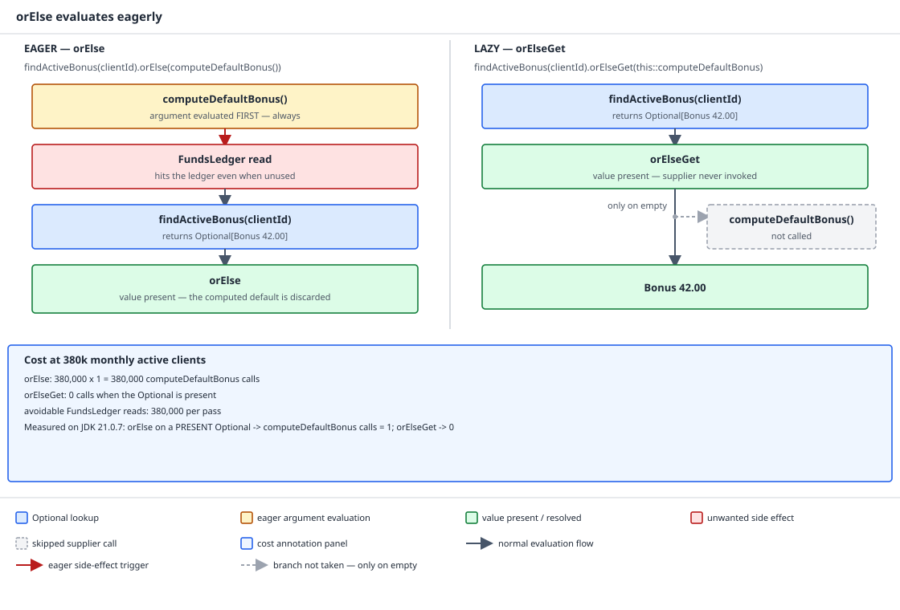

# 03 Java Core — Null discipline: `Optional` and the defaulting helpers — INTERMEDIATE (§2.11, 2.11.2–2.11.4, 2.11.6)

**Target version: Java 21 LTS.** | **Part 2 of 5** | [Index](../00-index.md)
Previous: [Where nulls come from and how null behaves](02-null-discipline.md) · Next: [The null-object pattern, annotations and diagnosis](02b-null-object-annotations-and-diagnosis.md)

`02-null-discipline.md` owns the origin of nulls, null in collections, and the places the language
treats null specially. This file owns `Optional` and the defaulting helpers built on top of it —
what `Optional` is for, where it does not belong, and the eager-versus-lazy trap that sits inside
every "value or fallback" API in the JDK. `02b-null-object-annotations-and-diagnosis.md` owns the
null-object pattern, empty collections instead of null, `@Nullable` annotations, and reading a
helpful NPE. The question this file answers, in bold: **what is `Optional` actually for, and what
does it cost when you use it for something else?**

## 1. `Optional` as a return type only (2.11.2)

Picture `Optional<T>` not as a container that makes null go away, but as a change to a method's
*signature* — it moves "there might not be a result" out of the Javadoc prose and into the type
the compiler checks. A caller of `Optional<Bonus> findActiveBonus(ClientId id)` cannot write
`bonus.applyTo(stake)` without an unwrapping step in between, because `Optional<Bonus>` has no
`applyTo` method. That forced step is the entire feature. Everything else about `Optional`'s
design — no serialization, no `Serializable`, a `Javadoc` warning against fields and parameters —
follows from that one purpose, and every well-known misuse is a case of putting `Optional`
somewhere the signature was never the problem.

### Why it exists

The `java.util.Optional` Javadoc states its own intent in an API Note: `Optional` is primarily
intended for use as a method return value where there is a clear need to represent "no result,"
and where using `null` for that is likely to cause errors; it explicitly advises against using it
as a class field or as a method parameter. That is a narrower claim than the "never use `Optional`
anywhere else" folklore that grew up around it — the Javadoc gives a reason (representing absence
at a return boundary) and a caution (fields and parameters), not a blanket style rule. The
community additions — "never in a collection," "never serialized" — are consequences of the same
design intent applied to specific JDK behaviour, not separate rules with their own justification.

`Optional` is also annotated `@jdk.internal.ValueBased` — a **value-based class**. Identity is not
a guaranteed property of a value-based class: you must not synchronize on an `Optional` instance,
and `==` between two `Optional` references is meaningless even when they hold equal values.
Measured: `Optional.of(4200L).equals(Optional.of(4200L))` returns `true` — equality is defined over
the contents, the JDK is free to change whether two equal `Optional`s are ever the same object. See
`../objects-equality-and-lifecycle/01-basics.md` for value-based classes generally.

### How it works

Walk the four banned positions with the mechanical reason for each, not just the rule.

**Not a field.** Three concrete costs stack up. First, every instance carries an extra object: at
QuizStakes' ~19.8M `LedgerEntry` rows written per day, an `Optional` field on `LedgerEntry` is
19.8M extra allocations a day that a plain nullable reference would not need — the object header
and the reference slot both cost real bytes even before you look at contents. Second, it is **not
serializable**: measured, `java.io.Serializable.class.isAssignableFrom(Optional.class)` returns
`false`, and `Optional.class.getInterfaces()` returns the empty array `[]` — `Optional` implements
no interfaces at all, so there is no accidental serializability to fall back on. A compile-time
check is a stronger proof than the runtime one: `Optional.empty() instanceof java.io.Serializable`
does not compile on JDK 21, and `javac` rejects it verbatim with
`error: incompatible types: Optional<Object> cannot be converted to Serializable`. A `Serializable`
aggregate with an `Optional` field is broken at compile time if you try to declare the field type
as `Serializable`-compatible, and broken at runtime (`NotSerializableException`) if you do not.
Third, and this is the load-bearing point:

**Insight:** an `Optional` field does not remove the null state it was meant to prevent — the field
itself, being a plain reference, can still be assigned `null`. You now have three states
(`null`, `Optional.empty()`, `Optional.of(x)`) where a plain nullable field had two. The type you
added to eliminate ambiguity introduced a third value that means almost the same thing as one of
the originals, and nothing stops a careless setter from assigning the field `null` directly.

**Not a parameter.** Every call site is now forced to wrap: `restrictions.applyRestriction(id,
Optional.of(expiry))` or `restrictions.applyRestriction(id, Optional.empty())`, noise the caller
pays for a distinction a plain overload gives you for free.

```java
void applyRestriction(ClientId id, Optional<Instant> expiresAt) {
    // caller must write Optional.of(...) or Optional.empty() at every call site
}

// versus two overloads, no wrapping required anywhere:
void applyRestriction(ClientId id) {
    applyRestriction(id, null);
}

void applyRestriction(ClientId id, Instant expiresAt) {
    Restriction restriction = (expiresAt != null)
        ? Restriction.expiring(id, expiresAt)
        : Restriction.indefinite(id);
    restrictionsByClient.put(id, restriction);
}
```

**Not a collection element.** `List<Optional<Movement>>` is a list with two different
representations of nothing sitting inside it: an absent slot could be a genuine empty `Optional`
or, if anyone forgot the discipline, a null list element. The right shape is either a list with the
absent entries filtered out, or a `Map` whose *missing key* is the absence. `02-null-discipline.md`
already shows `Collectors.toMap` rejecting a null value outright (measured there); the workaround
of wrapping map values in `Optional` to dodge that restriction makes `getOrDefault`, `merge`, and
`computeIfAbsent` all behave against their documented contract, because now "absent key" and
"present key holding `Optional.empty()`" are two states doing the same job.

**Not serialized.** Both measurements above apply directly: a `BalanceView` DTO with an `Optional`
field cannot be stored as a session object and will not round-trip through the `RouterInt`
boundary's Java serial form. For JSON, the question is different — "field absent from the payload"
versus "field present with an explicit `null`" is a distinct problem that guide 12 (API design)
owns in full; `Optional` on a JSON DTO does not solve it and Jackson's default handling of it is
inconsistent enough that it is worth avoiding there too.

The positive rule, with its escape hatch: use `Optional` as the return type of a lookup that can
legitimately miss — `BonusService.findActiveBonus(ClientId)`,
`ClientRestrictions.findRestriction(RestrictionKey)`,
`DocumentRequirements.findOutstanding(ApplicationId)`. **But** it is not free: it allocates on
every call, and at 1,200 stake reservations/sec peak, wrapping the reservation-path lookup in
`Optional` is 1,200 allocations/sec that a null-returning private method would not incur. **And**
the escape hatch is that a null-returning private method behind an `Optional`-returning public API
is a reasonable optimisation — the discipline only has to hold at the boundary the caller sees.

```java
public record Bonus(ClientId clientId, Money amount, Instant expiresAt) {

    public boolean isExpired(Instant now) {
        return now.isAfter(expiresAt);
    }
}

public final class BonusService {

    private final Map<ClientId, Bonus> activeBonusByClient;

    public BonusService(Map<ClientId, Bonus> activeBonusByClient) {
        this.activeBonusByClient = Objects.requireNonNull(activeBonusByClient, "activeBonusByClient");
    }

    public Optional<Bonus> findActiveBonus(ClientId clientId) {
        return Optional.ofNullable(activeBonusByClient.get(clientId));
    }
}

public final class StakeReservationHandler {

    private final BonusService bonusService;

    public StakeReservationHandler(BonusService bonusService) {
        this.bonusService = Objects.requireNonNull(bonusService, "bonusService");
    }

    public Money bonusPortionFor(ClientId clientId, Money stake) {
        return bonusService.findActiveBonus(clientId)
                .filter(bonus -> !bonus.isExpired(Instant.now()))
                .map(bonus -> stake.percentage(10))
                .orElseThrow(() -> new BonusIneligibleException(clientId));
    }
}
```

`[X-REF 04]` — this is a complete, self-contained answer to "what is `Optional` for," but guide 04
(Modern Java) owns `Optional` as part of the streams/functional surface — how it composes with
`Stream`, method references, and functional interfaces beyond the plain return-type use shown here.

**Interview:** "why can't you put `Optional` in a field" — nothing stops you syntactically, but the
Javadoc advises against it, it is not serializable (confirmed by a compile error, not just a
runtime check), and it does not remove the null state it was meant to prevent, because the field
reference itself can still be assigned `null`.

> `Optional<T>` is a method return type that forces a caller to handle absence explicitly; it is
> not a general-purpose null-safe container, and every position outside "the return type of a
> lookup that can miss" reintroduces the ambiguity it was designed to remove.

## 2. `get` without `isPresent`, and `orElseThrow` (2.11.3)

Picture `Optional.get()` as an assertion, not an accessor: the type told you the value might be
absent, and calling `get()` is you declaring "not this time," with nothing in the source recording
why you believe that. It reads like a getter and behaves like an assertion that can fail loudly.

### Why it exists

`get()` exists because sometimes the caller genuinely does know, from context the type system
cannot express, that the `Optional` is present — but the method gives no way to say that in the
exception it throws, which is exactly the gap `orElseThrow` closes.

### How it works

The measured evidence removes any ambiguity about which form is "safer": `Optional.empty().get()`
and `Optional.empty().orElseThrow()` throw the **identical** exception with the **identical**
message — `java.util.NoSuchElementException: No value present`. `orElseThrow()` is not a safer
`get()`; it is the *honest* form of the same operation, because its name says at the call site that
failure is a deliberate possibility being asserted against, where `get()`'s name hides it.

| Form | When it is right | What it costs | What it hides |
|---|---|---|---|
| `if (opt.isPresent()) { opt.get() }` | Rarely, if ever, over `ifPresent`/`map` | Two extra objects (the `Optional`, the boxed check) and no compiler enforcement linking the check to the call | Nothing hidden, but it is the null check `Optional` exists to make unnecessary — static analysers flag this pattern, correctly |
| `opt.orElseThrow()` | Absence at this point is a genuine programming error | A `NoSuchElementException` with a generic message | Which precondition was violated |
| `opt.orElseThrow(() -> new BonusIneligibleException(clientId))` | Absence is a *domain* outcome, not a bug | A supplier allocation only on the failure path | Nothing — this is the form that belongs in `BonusService`, because a bare `NoSuchElementException` leaking out tells the caller nothing about what was missing |
| `opt.map(...).filter(...).ifPresentOrElse(...)` | Both the present and absent branches are real work, not just a throw | An `Optional` allocation per chained stage | Nothing; this is the idiomatic shape when there genuinely are two branches |

Reach for the rest of the API before `get`, each version-gated:

| Method | Since | What it does |
|---|---|---|
| `map(Function)` | 8 | Transform the value if present, stay empty otherwise |
| `flatMap(Function)` | 8 | Like `map`, but the function itself returns an `Optional` — avoids `Optional<Optional<T>>` |
| `filter(Predicate)` | 8 | Empty out the `Optional` if the predicate fails |
| `ifPresent(Consumer)` | 8 | Run a side effect only if present |
| `ifPresentOrElse(Consumer, Runnable)` | 9 | Present and absent branches, both as real code |
| `or(Supplier<Optional<T>>)` | 9 | Substitute a whole alternative `Optional`, lazily |
| `stream()` | 9 | Zero-or-one-element `Stream<T>`, for flattening across a collection |
| `isEmpty()` | 11 | The negation of `isPresent()`, for readability |
| `orElseThrow()` no-arg | 10 | `get()` renamed to say what it actually does |

Measured: `Optional.<Long>empty().stream().count()` is `0`, and
`Optional.<Long>empty().or(() -> Optional.of(1L))` followed by `ifPresent` printed `1`.
`Optional.stream()` earns its keep flattening a collection of lookups in one step — the idiom
`flatMap(Optional::stream)`:

```java
List<Bonus> activeBonuses(BonusService bonusService, List<ClientId> clientIds) {
    return clientIds.stream()
            .flatMap(id -> bonusService.findActiveBonus(id).stream())
            .toList();
}
```

Chaining `map`/`filter` allocates a new `Optional` per stage — **but** every intermediate
`Optional` is short-lived and non-escaping, and escape analysis on a modern JIT typically eliminates
that kind of allocation entirely; guide 06 (JVM internals) owns the escape-analysis mechanism.
**And** the honest escape hatch, if a profiler has actually shown this path hot, is an ordinary
null check inside a private method, with `Optional` kept only at the public boundary.

**Interview:** "is `orElseThrow()` safer than `get()`" — no, they throw the identical exception with
the identical message; `orElseThrow()` is clearer about intent, and the one-argument form
`orElseThrow(Supplier)` is the one that actually improves anything, by naming the real failure.

> `get()` and no-arg `orElseThrow()` throw the identical `NoSuchElementException`; the difference is
> only in what the method name tells a reader about whether failure was anticipated.

## 3. `orElse` versus `orElseGet` (2.11.4)

Picture the two signatures side by side before thinking about `Optional` at all: `T orElse(T
other)` takes a **value**, `T orElseGet(Supplier<? extends T> supplier)` takes a **recipe**. A
value has to already exist to be passed as an argument; a recipe does not have to run until
something asks it to.

### Why it exists

`orElse` and `orElseGet` exist as a pair because sometimes the fallback is a constant already sitting
in memory (`Money.ZERO`) and sometimes it is the result of real work (`computeDefaultBonus()`), and
those two cases have opposite performance characteristics.

### How it works

**Pitfall:** `orElse(expensiveCall())` looks like it only runs `expensiveCall()` when the `Optional`
is empty, because that is what the name suggests and what the *symptom* looks like in a quick test
against an empty `Optional`. It runs `expensiveCall()` every time, present or absent, because the
argument is evaluated before `orElse` is ever entered.

**[PROVE].** Do not take that on faith — walk it through Java's own evaluation rules.

1. `opt.orElse(computeDefaultBonus())` is a method invocation. `computeDefaultBonus()` is the
   expression that produces the argument to that invocation.
2. JLS 15.12.4 specifies that the argument expressions of a method invocation are evaluated before
   the method itself is invoked. JLS 15.7 guarantees left-to-right evaluation order for operands
   generally, which is what fixes the argument's evaluation as happening strictly before control
   transfers into `orElse`'s body.
3. So `computeDefaultBonus()` runs unconditionally, before `orElse` gets control at all — regardless
   of whether the `Optional` receiver is present or empty.
4. `orElse`'s body then does nothing more than pick between the already-computed argument and the
   contained value. There is no branch inside `orElse` that could skip the argument's evaluation,
   because by the time `orElse` executes, that evaluation has already happened. This is not a
   defect in `Optional`'s implementation; it is simply how a method call works, and the same trap
   sits in `Objects.requireNonNullElse`, in `Map.getOrDefault`, and in a logging call that
   concatenates a string before the logger decides whether to emit it.

The measured call counts confirm exactly this: `Optional.of(4200L).orElse(computeDefaultBonus())`
returned `4200`, with `computeDefaultBonus`'s `calls` counter at **1** — it ran despite the value
being present and the computed result being thrown away. `Optional.of(4200L).orElseGet(VerC::computeDefaultBonus)`
also returned `4200`, with `calls` at **0** — the supplier was never invoked, because
`orElseGet`'s body checks presence *before* calling the supplier at all. On an empty `Optional`,
both forms call it once (`calls == 1` for both `Optional.<Long>empty().orElse(computeDefaultBonus())`
and `.orElseGet(VerC::computeDefaultBonus)`), which is the case where the two forms actually agree.



**D-086** — the left panel is `findActiveBonus(clientId).orElse(computeDefaultBonus())`: the
argument `computeDefaultBonus()` is evaluated **first and always**, so the `FundsLedger` read
happens even when the `Optional` already holds `Bonus 42.00`, and the computed default is then
discarded. The right panel is the same lookup with `.orElseGet(this::computeDefaultBonus)`: the
supplier is passed unevaluated and is never invoked, because `Bonus 42.00` is present. The
annotation panel carries the call counts over 380k monthly active clients alongside the measured
JDK 21 call counts shown above — one avoidable `FundsLedger` read per client on the `orElse` path,
zero on the `orElseGet` path.

Put in the domain's own numbers: `findActiveBonus(clientId).orElse(computeDefaultBonus())` on a
page rendered for **380k monthly active clients** is 380,000 avoidable `FundsLedger` reads per pass
whenever the bonus is present — the entire read happens only to be thrown away. The honest
counterpoint: when the fallback is a **constant already in hand** — `orElse(Money.ZERO)`,
`orElse(Restriction.NONE)`, `orElse("")` — `orElse` is correct and strictly cheaper than
`orElseGet`, because there is no lambda to allocate and no supplier to invoke; reaching for
`orElseGet` unconditionally, even for constants, is cargo cult. The rule that survives an
interview: **`orElse` for a value you already have; `orElseGet` for a value you would have to
compute.**

The same eager-argument shape recurs across the JDK:

| Eager form | Lazy form | When the eager form is fine | Since |
|---|---|---|---|
| `Optional.orElse(T)` | `Optional.orElseGet(Supplier<? extends T>)` | The fallback is a constant or already-computed value | 8 |
| `Optional.orElseThrow(Supplier<X>)` | *(already lazy — no eager variant exists)* | Always; the supplier only runs on the empty path by design | 10 |
| `Objects.requireNonNullElse(T, T)` | `Objects.requireNonNullElseGet(T, Supplier<? extends T>)` | The default is a constant | 9 |
| `Map.getOrDefault(K, V)` | `Map.computeIfAbsent(K, Function)` | The default is a constant, not a computed insert | 8 |
| `logger.debug("stake=" + reservation)` | `logger.debug("stake={}", reservation)` | Never — string concatenation runs before the logger can decide the level is disabled | n/a |

The logging row is the same trap in a different library — the `+` concatenation is evaluated as an
argument expression before `debug` is ever entered, exactly like `orElse`'s argument, and it is why
guide 20 (Observability) mandates the placeholder form.

**Interview:** "what's the difference between `orElse` and `orElseGet`" — `orElse` takes an
already-evaluated value and always evaluates its argument, present or not; `orElseGet` takes a
`Supplier` that only runs when the `Optional` is empty; use `orElse` for constants, `orElseGet` for
anything that does real work to compute.

> `orElse`'s argument is an ordinary method argument and is evaluated unconditionally before
> `orElse` runs, by the same JLS rule that evaluates any method argument before the call; `orElseGet`
> defers that work behind a `Supplier` invoked only on the empty path.

## 4. The defaulting helpers: `requireNonNullElse`, `ofNullable`, `getOrDefault` (2.11.6)

Picture three tools that all answer "give me a value or a fallback," each with a different notion
of what counts as "no value" — and the bugs live exactly in the gaps between those three notions.

### Why it exists

`Objects.requireNonNullElse` treats null as the only kind of absence and fails loudly if the
fallback is itself null; `Optional.ofNullable` treats null as a boundary artefact to be converted,
once, into a typed absence; `Map.getOrDefault` treats *key absence* as the only kind of absence and
is silent about a present-but-null value. Confusing which notion a given call site needs is where
each of the measured traps below comes from.

### How it works

**`Objects.requireNonNullElse(T obj, T defaultObj)`** (Java 9). Measured:
`Objects.requireNonNullElse(null, "AA-801")` returns `"AA-801"`. The detail people miss: the
default itself is `requireNonNull`-checked, so `requireNonNullElse(null, null)` throws rather than
silently returning `null` — the method's contract is "never return null," not "return whichever
argument is non-null." The argument is eager, exactly as in Concept 3, so
`Objects.requireNonNullElseGet(T, Supplier<? extends T>)` (also Java 9) is the lazy twin for an
expensive default. Related: `Objects.requireNonNull(T, String)` — measured,
`Objects.requireNonNull(null, "clientId")` throws `java.lang.NullPointerException: clientId` — and
the `Supplier<String>` overload for a message expensive enough to be worth deferring. Stated
plainly: `Objects.requireNonNull` at the top of a constructor, as shown for `Restriction` and
`RestrictionKey` in `02-null-discipline.md`, is the single highest-value line in this whole folder,
because it moves the failure to the moment of creation rather than four call frames later.

**`Optional.ofNullable(T)`** (Java 8). Measured: `Optional.ofNullable(null).isEmpty()` is `true`,
while `Optional.of(null)` throws `NullPointerException` immediately. So `of` is an assertion that
the value is already non-null, and `ofNullable` is a conversion for a value that might not be. The
right use is **at the boundary**, exactly once, wrapping a null-returning legacy or JDK API so the
null does not travel any further:

```java
Optional<Restriction> restriction =
        Optional.ofNullable(restrictionsByKey.get(new RestrictionKey(STAKE_BLOCKED, ADMIN)));

Optional<String> jurisdictionOverride =
        Optional.ofNullable(System.getProperty("quizstakes.jurisdiction"));
```

The wrong use is wrapping something you control, where the method should simply have declared
`Optional<T>` as its return type in the first place, as Concept 1 covers.

**`Map.getOrDefault(Object key, V defaultValue)`** (Java 8). The measured trap, prominent because
it is the one interview candidates get wrong most often: a key present with a `null` value returns
`null`, not the default — `mapWithNullValue.getOrDefault("k", "dflt")` returned `null`. The contract
is keyed on *absence of the key*, not on the *nullness of the value*. `02-null-discipline.md` owns
the full null-in-collections matrix; the fact and the fix are the same as shown there.

```java
Map<String, Integer> restrictionCounts = new HashMap<>();
restrictionCounts.put("STAKE_BLOCKED", null);
restrictionCounts.getOrDefault("STAKE_BLOCKED", 0);   // returns null, not 0
```

| Method | Treats a null value as absent? | Mutates the map? | Lazy? | Since |
|---|---|---|---|---|
| `getOrDefault(K, V)` | No — returns the stored `null` | No | No, `V` is an already-evaluated value | 8 |
| `computeIfAbsent(K, Function)` | Yes — a null value causes the function to run and the result to be stored | Yes | Yes, function only runs on absence | 8 |
| `merge(K, V, BiFunction)` | Yes — treated as if the key were absent for merge purposes | Yes | The remapping function only runs if a value is already present | 8 |
| `putIfAbsent(K, V)` | Yes — a null value is treated as absent and gets overwritten | Yes | No, `V` is already-evaluated | 8 |

`computeIfAbsent` carries a documented restriction from JDK 9 onward: the mapping function must not
attempt to modify the map recursively during the computation — doing so has undefined behaviour,
including a possible `ConcurrentModificationException` on some map implementations.

The decision rule, keyed on what null actually means at the call site:

| I have a reference that might be null | Reach for | Because |
|---|---|---|
| Null here is always a bug | `Objects.requireNonNull(ref, "name")` | Fail immediately, at the point of entry, with a named contract violation |
| Null here is a legitimate absence, and a constant default is fine | `Objects.requireNonNullElse(ref, constant)` | Eager default, no allocation beyond the check |
| Null here is a legitimate absence, but the return type should say so to every caller | `Optional.ofNullable(ref)` at the boundary, `Optional`-returning method thereafter | Converts once, then the type system enforces the unwrap |
| A map key might genuinely not exist, and I never store null values in this map | `map.getOrDefault(key, dflt)` | Simple, read-only, matches the map's real contract |
| A map key is absent and I want to compute and cache the value the first time | `map.computeIfAbsent(key, fn)` | Lazy, writes the result back, avoids recomputation |

**Interview:** "what's wrong with `restrictionCounts.getOrDefault(key, 0)` when the map might hold
null values" — `getOrDefault` substitutes its default only when the *key* is absent, not when the
stored value is null, so a key present with a null value returns that null unchanged, which throws
on unboxing to a primitive `int`.

> `requireNonNullElse` fails loudly on a null default and evaluates eagerly, `ofNullable` converts
> a boundary null into a typed absence exactly once, and `getOrDefault` substitutes only on missing
> keys — not on a key present with a stored null.

---

## Pitfalls

### `orElse` only runs its argument when the `Optional` is empty

**Wrong**

```java
Bonus bonus = bonusService.findActiveBonus(clientId).orElse(computeDefaultBonus());
// Believed: computeDefaultBonus() only runs when findActiveBonus returned Optional.empty().
// Measured: Optional.of(4200L).orElse(computeDefaultBonus()) still calls
// computeDefaultBonus() once (calls == 1) even though the Optional is present and
// the computed value is discarded.
```

**Right**

```java
Bonus bonus = bonusService.findActiveBonus(clientId).orElseGet(this::computeDefaultBonus);
// Measured: Optional.of(4200L).orElseGet(VerC::computeDefaultBonus) leaves calls == 0 —
// the supplier is never invoked because the value is present.
```

**Why people believe it:** `orElse` reads like a conditional — "or, else, do this" — and testing it
against an *empty* `Optional` confirms the fallback runs, which looks like proof the method is
conditional. The condition is actually evaluated inside `orElse`'s body over an argument that was
already computed before the call, by ordinary Java method-invocation rules (JLS 15.12.4); the
belief only survives because nobody tests the present-and-discarded case.

### `Optional.get()` is a well-behaved accessor once you've checked `isPresent`

**Wrong**

```java
Optional<Bonus> maybeBonus = bonusService.findActiveBonus(clientId);
Bonus bonus = maybeBonus.get();
// works today; the belief is that get() is a safe accessor for an Optional you hold,
// distinct from and no worse than orElseThrow()
```

**Right**

```java
Bonus bonus = bonusService.findActiveBonus(clientId)
        .orElseThrow(() -> new BonusIneligibleException(clientId));
// Measured: Optional.empty().get() and Optional.empty().orElseThrow() throw the
// IDENTICAL java.util.NoSuchElementException: No value present — get() is no safer,
// it is only less honest about the assertion being made.
```

**Why people believe it:** `get()` looks like a plain accessor, the same shape as a record
component or a getter, so it feels categorically different from an operation that can fail — but
the measured exception and message are identical to `orElseThrow()`'s, which only differs in naming
the intent explicitly and in accepting a supplier for a domain-specific failure.

### `Map.getOrDefault` substitutes its default whenever the stored value "looks empty"

**Wrong**

```java
Map<String, Integer> restrictionCounts = new HashMap<>();
restrictionCounts.put("STAKE_BLOCKED", null);
int count = restrictionCounts.getOrDefault("STAKE_BLOCKED", 0);
// Believed: count == 0. Measured: getOrDefault returns the stored null unchanged,
// and unboxing it into int throws NullPointerException.
```

**Right**

```java
Map<String, Integer> restrictionCounts = new HashMap<>();
restrictionCounts.put("STAKE_BLOCKED", null);
Integer stored = restrictionCounts.get("STAKE_BLOCKED");
int count = (stored != null) ? stored : 0;
// or design the map so it never stores null values in the first place
```

**Why people believe it:** the method name reads as "give me something sensible regardless of
what's stored," but the documented and measured contract triggers the default only on **key
absence**; a key present with a `null` value is not absence, so `getOrDefault` returns exactly what
is stored.

## Cheat sheet

| Thing | Fact (Java 21 LTS) |
|---|---|
| `Optional` correct position | Method return type only — not a field, parameter, collection element, or serialized form |
| `Optional` interfaces implemented | None — `Optional.class.getInterfaces()` is `[]`; not `Serializable` |
| `Optional.empty() instanceof Serializable` | Does not compile: `incompatible types` |
| `Optional` identity | Value-based (`@jdk.internal.ValueBased`); do not synchronize on it; `equals` is value-based |
| `Optional.get()` vs `orElseThrow()` | Identical exception, identical message: `NoSuchElementException: No value present` |
| Best `orElseThrow` form | `orElseThrow(() -> new DomainException(...))` — names the real failure |
| `orElse(T)` | Evaluates its argument unconditionally, before the call — JLS 15.12.4 |
| `orElseGet(Supplier)` | Evaluates the supplier only when the `Optional` is empty |
| `orElse` is fine when | The fallback is a constant already in hand (`Money.ZERO`) |
| `orElseThrow(Supplier)` | Already lazy by design — no eager variant exists |
| `Optional.of(null)` | Throws `NullPointerException` immediately |
| `Optional.ofNullable(null)` | `isEmpty() == true`, no exception |
| `Optional.stream()` | Zero-or-one elements; idiom `flatMap(Optional::stream)` to flatten a collection of lookups |
| `Objects.requireNonNullElse(null, dflt)` | Returns `dflt`; throws if `dflt` is also null |
| `Objects.requireNonNullElseGet` | Java 9, lazy twin of `requireNonNullElse` |
| `Map.getOrDefault(k, dflt)` | Default only on absent key; a stored `null` value is returned as-is |
| `Map.computeIfAbsent` | Treats a null-valued key as absent; writes the computed result back; lazy |
| Since: `ifPresentOrElse`, `or`, `stream` (Optional) | Java 9 |
| Since: `isEmpty` (Optional) | Java 11 |
| Since: no-arg `orElseThrow()` | Java 10 |

## Self-test

**Q1.** `bonusService.findActiveBonus(clientId).orElse(computeDefaultBonus())` is measured to call
`computeDefaultBonus()` even when the `Optional` holds a present `Bonus`. Explain why, citing the
relevant JLS rule.

<details><summary>Answer</summary>

`computeDefaultBonus()` is the argument expression of the method invocation `orElse(...)`. JLS
15.12.4 specifies that a method invocation's argument expressions are evaluated before the method
itself is invoked, and JLS 15.7 guarantees left-to-right evaluation order for operands generally.
So `computeDefaultBonus()` runs and produces a value before `orElse`'s body ever executes, entirely
independent of whether the `Optional` is present or empty; `orElse`'s body then simply chooses
between the contained value and the already-computed argument, discarding whichever it does not
need. Measured: `Optional.of(4200L).orElse(computeDefaultBonus())` returns `4200` with the call
counter at 1, confirming the computation ran and was thrown away.

</details>

**Q2.** Why is `orElseThrow()` (no-arg) not actually "safer" than `get()`, and what form of
`orElseThrow` is genuinely an improvement?

<details><summary>Answer</summary>

Measured, `Optional.empty().get()` and `Optional.empty().orElseThrow()` throw the identical
`java.util.NoSuchElementException` with the identical message `No value present`, so the no-arg form
provides no additional safety — it is the same failure with a more honest name. The genuine
improvement is `orElseThrow(Supplier<X>)`, which lets the caller throw a domain-specific exception
(such as `BonusIneligibleException`) naming what was actually missing, instead of letting a generic
`NoSuchElementException` leak out of a service method with no context.

</details>

**Q3.** State the Javadoc's own reason for restricting `Optional` to use as a return type, and name
one cost of ignoring that restriction for a field.

<details><summary>Answer</summary>

The `java.util.Optional` Javadoc's API Note says `Optional` is primarily intended for a method
return value where there is a clear need to represent "no result" and where `null` would likely
cause errors, and it advises against use as a field or parameter type. One concrete cost of an
`Optional` field: it does not remove the null state it was meant to prevent, because the field
itself, being an ordinary reference, can still be assigned `null` — producing three possible states
(`null`, `Optional.empty()`, `Optional.of(x)`) instead of the original two. Other costs include
non-serializability (confirmed by both a runtime `isAssignableFrom` check and a `javac`
incompatible-types error) and an extra allocation on every instance.

</details>

**Q4.** A map lookup `mapWithNullValue.getOrDefault("k", "dflt")` is measured to return `null`
rather than `"dflt"` when the key `"k"` is present with a stored `null` value. Why, and what is the
correct fix if a stored null must be tolerated?

<details><summary>Answer</summary>

`getOrDefault`'s contract substitutes the default only when the *key* is absent from the map; a key
that is present with a stored `null` value is not absence, so the method returns the stored `null`
unchanged. The fix, if a stored null genuinely must be supported, is to call `get` and check the
result for `null` explicitly rather than relying on `getOrDefault`, or better, redesign the map so
it never stores `null` as a value in the first place and treats key absence as the only "no value"
state.

</details>

**Q5.** Why does `Optional.ofNullable(null).isEmpty()` return `true` without throwing, while
`Optional.of(null)` throws `NullPointerException` immediately? When should each be used?

<details><summary>Answer</summary>

`Optional.of(T)` is an assertion that the argument is already known to be non-null and calls
`Objects.requireNonNull` internally, so passing `null` fails fast. `Optional.ofNullable(T)` is a
conversion for a value that might legitimately be null, wrapping it into `Optional.empty()` instead
of throwing. `of` belongs where the caller already guarantees non-null (for example, wrapping the
result of a computation known to succeed); `ofNullable` belongs at a boundary where a legacy or JDK
API might hand back `null`, converting it into a typed absence exactly once so the null does not
propagate further.

</details>

**Q6.** `Objects.requireNonNullElse(null, null)` throws `NullPointerException` rather than
returning `null`. What does that reveal about the method's actual contract?

<details><summary>Answer</summary>

`requireNonNullElse`'s contract is "never return null," not "return whichever argument happens to
be non-null." The default argument itself is checked with `Objects.requireNonNull` before being
returned, so if both the primary value and the fallback are null, the method fails loudly instead
of silently propagating a null it was specifically designed to prevent from escaping.

</details>

**Q7.** Give one case where `orElse` is the *correct* choice over `orElseGet`, and explain why
reaching for `orElseGet` there would be worse.

<details><summary>Answer</summary>

`orElse(Money.ZERO)` — or any case where the fallback is a constant already sitting in memory — is
correct with `orElse`, because there is no computation to defer; the value already exists. Using
`orElseGet(() -> Money.ZERO)` instead would allocate a `Supplier` lambda for no benefit, since there
is no expensive work being avoided by deferring it — `orElseGet`'s advantage only matters when the
fallback requires real computation, such as a `FundsLedger` read.

</details>

**Q8.** Why is `List<Optional<Movement>>` a worse design than either filtering out absent entries
or using a `Map` whose missing key represents absence?

<details><summary>Answer</summary>

A list of `Optional<Movement>` creates two different representations of "nothing" that can coexist
in the same collection: a genuinely absent list slot (if one were ever introduced by mistake, since
`Optional` in a collection does not prevent a null list element) and an `Optional.empty()` entry
that is present but holds no value. A list with absent entries already filtered out, or a `Map`
whose key is simply missing when there is no value, has exactly one representation of absence,
which is both easier to reason about and consistent with how `Collectors.toMap` and similar
collectors already treat null and absence.

</details>

## Open questions

None. Every claim in this file is either drawn from the `java.util.Optional` Javadoc's own API
Note, the JLS sections cited for `orElse`'s eager evaluation (15.12.4, 15.7), or the measured
results and compiler output supplied for Oracle JDK 21.0.7 (build 21.0.7+8-LTS-245), macOS aarch64.

---

**Leaves covered:** 2.11.2, 2.11.3, 2.11.4, 2.11.6 (4 leaves)
**Leaves deferred:** none
**Diagrams included:** D-086
**Target version:** Java 21 LTS
**Lines:** 647
