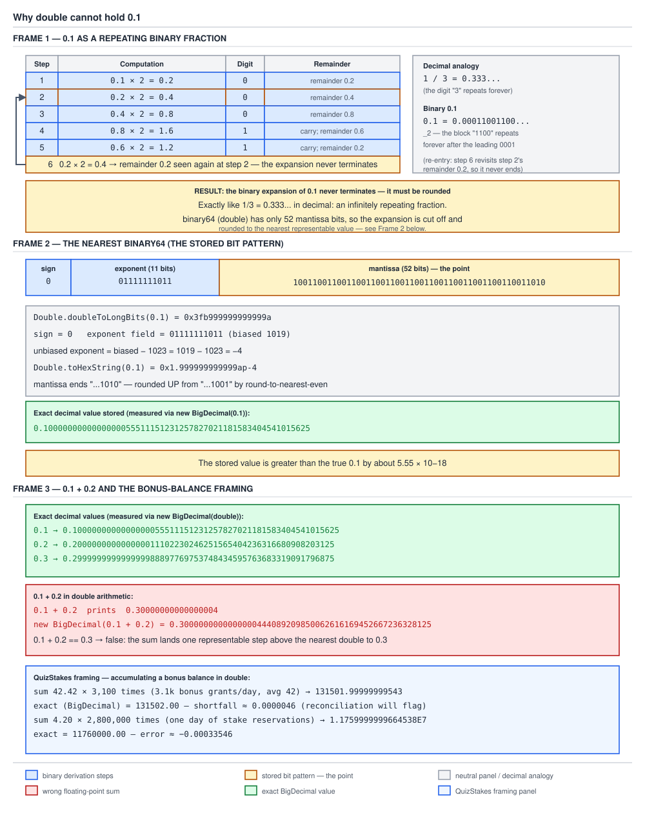

# 03 Java Core — Numbers: floating point in the money layer — INTERMEDIATE (§2.4, 2.4.1–2.4.4)

**Target version: Java 21 LTS.** | **Part 2 of 5** | [Index](../00-index.md)
Previous: [Which construct do I reach for](../immutability-and-design/05-which-construct.md) · Next: [Double.compare, NaN and the float-versus-double choice](02f-double-comparison-and-float-choice.md)

This file owns why `double` is the wrong tool for money and exactly how badly
it fails: the binary representation of 0.1, the error that accumulates across
a stream of additions, and why a fixed epsilon comparison is mathematically
unsound. It does not own `BigDecimal`'s internal structure
(`02a-bigdecimal-structure-and-construction.md`), `Math.ulp`'s internal
spacing curve (`04a-internals-ulp-rounding-and-tostring.md`), IEEE 754
binary64 layout at the language level
(`../primitives-and-conversions/01c-floating-point.md`), or the `NaN`/signed-zero
comparison semantics and the `float`-versus-`double` choice, both owned by
`02f-double-comparison-and-float-choice.md`. The question this file answers:
given that money must be exact, what precisely goes wrong with `double`, and
how do you prove it rather than just assert it.

All measurements below are from Oracle JDK 21.0.7 (build 21.0.7+8-LTS-245),
macOS aarch64 (Apple Silicon), compiled and run in a scratch directory under
`/tmp/`.

---

## 1. Why `double` cannot hold 0.1 (2.4.1, 2.4.2)

Picture a fixed budget: binary64 spends exactly 52 bits of significand (plus
one implicit leading bit) on a fraction written in base 2, not base 10. A
decimal fraction is exactly representable in binary only if its denominator,
in lowest terms, is a power of 2. `0.1 = 1/10 = 1/(2×5)`. The factor of 5 in
the denominator has no finite binary expansion, in exactly the way `1/3` has
no finite decimal expansion — you can carry the long division of `1 ÷ 3` out
to a thousand decimal digits and it is still `0.333...`, never terminating.
`0.1` in binary is the same story in a different base.

### Why it exists

IEEE 754 binary64 was chosen because it is a fixed-width, hardware-native
format: every arithmetic operation is a small number of machine cycles,
storage is 8 bytes, and comparisons are total-order-adjacent (modulo the NaN
and zero wrinkles in concept 4). The trade is that it can only exactly
represent binary fractions — sums of powers of two — and money is denominated
in decimal fractions. That mismatch is not a bug in `double`; it is the
consequence of choosing a binary positional system to approximate a decimal
one, the same mismatch that makes `1/3` unrepresentable in finite decimal.

### How it works — deriving the repeating expansion

`[PROVE]` To convert 0.1 to binary, repeatedly multiply the fractional part by
2 and record the integer part that falls out (the "doubling chain"):

```
0.1 × 2 = 0.2   -> integer part 0, remainder 0.2
0.2 × 2 = 0.4   -> integer part 0, remainder 0.4
0.4 × 2 = 0.8   -> integer part 0, remainder 0.8
0.8 × 2 = 1.6   -> integer part 1, remainder 0.6
0.6 × 2 = 1.2   -> integer part 1, remainder 0.2
0.2 × 2 = 0.4   -> remainder 0.2 has recurred: the cycle re-enters step 2
```

Reading the integer parts down the column gives `0.0001100110011001100...`
with the four digits `1100` repeating forever — never terminating, exactly
like `1/3 = 0.333...` in decimal. `binary64` has 52 explicit mantissa bits (53
of precision counting the implicit leading 1), so at some point the repeating
chain must be cut off and the last retained bit rounded.

Measured cut point: `Double.doubleToLongBits(0.1) = 0x3fb999999999999a`. As
binary with the leading implicit bit restored: sign `0`, biased exponent
`01111111011` (1019, unbiased `1019 − 1023 = −4`), 52-bit mantissa
`1001100110011001100110011001100110011001100110011010`. The mantissa's
trailing `...1010` is not the raw truncated `...1001` repeating tail — it has
been rounded **up** from `...1001` by round-to-nearest-even, because the
discarded bits beyond the cutoff represented more than half a unit in the
last place. `Double.toHexString(0.1) = 0x1.999999999999ap-4` — the `a` at the
end (`1010` in binary) is that round-up made visible in hex.

The stored `double` is therefore not 0.1; it is the nearest representable
binary64 value to 0.1. `new BigDecimal(0.1)` prints that value's exact decimal
expansion, computed by walking the bit pattern with no rounding at all:

```
new BigDecimal(0.1) = 0.1000000000000000055511151231257827021181583404541015625
```

55 digits, scale 55, precision 55 — the exact rational number that
`0x3fb999999999999a` denotes, and it is measurably larger than 0.1.

`[NUM]` Two consequences follow directly, both measured:

```
0.1 + 0.2   = 0.30000000000000004
1.03 - 0.42 = 0.6100000000000001
```

`0.1` is stored as `0.1000000000000000055511151231257827021181583404541015625`
and `0.2` is stored as `0.200000000000000011102230246251565404236316680908203125`
(measured via `new BigDecimal(0.2)`). Adding those two exact stored values and
then rounding the sum to the nearest binary64 lands on
`0.3000000000000000444089209850062616169452667236328125` (measured via
`new BigDecimal(0.1 + 0.2)`), whose shortest round-tripping decimal string is
`0.30000000000000004` — which is what `Double.toString` prints, because
`Double.toString` always emits the shortest decimal that parses back to the
same bits (`Double.parseDouble(Double.toString(0.1)) == 0.1` is `true`). The
error is not a display glitch; the stored bit pattern really is a different
number from the mathematical 0.30000000000000000..., and printing more digits
would not "reveal" the true value because there is no shorter true decimal
value to reveal — the double genuinely holds `0.3000...0444089...`.



**D-071** — The left frame is the doubling chain above: follow the `×2`
arrows and watch `0.2` recur as a remainder, which is the moment the binary
expansion is proven to repeat forever rather than merely asserted to. The
middle frame is the stored bit pattern `0x3fb999999999999a` split into its
sign bit, its 11-bit biased exponent (1019, unbiased −4), and its 52-bit
mantissa, with the final nibble called out as a round-up from `...1001` to
`...1010`. The right frame lines up `0.1 + 0.2 = 0.30000000000000004` against
the exact `BigDecimal` expansions of the stored 0.1, 0.2 and 0.3 side by side,
so the extra tail digits on each are visibly nonzero and visibly different
from the terminating decimal a reader expects.

**Insight:** `Double.toString` printing `0.1` is not the double "really being"
0.1 — it is the shortest decimal string that round-trips back to the same
bits. The double underneath is still `0.1000000000000000055511151231257827021181583404541015625`;
`toString` is doing you the favor of hiding that, which is exactly what makes
`0.1 + 0.2` surprising the first time you see it.

**Interview:** "Why is `0.1 + 0.2 != 0.3` in Java?" — binary64 cannot exactly
represent 0.1, 0.2 or 0.3 because none of them are sums of powers of two;
each is stored as the nearest representable binary64 value, and the rounding
errors in those approximations do not cancel when added, landing on
`0.30000000000000004` instead of the mathematical 0.3.

> **binary64 stores a fixed-width binary fraction; a decimal fraction with a
> factor of 5 in its denominator, like 0.1, has no finite binary expansion, so
> it is stored as the nearest representable approximation, not the exact
> value.**

---

## 2. Accumulated error, Kahan, and compensated summation (2.4.3)

Picture QuizStakes running a naive `double` accumulator across a full day of
bonus grants — 3,100 grants averaging 42.42 each — or across 2.8 million stake
reservations averaging 4.20 each. Every single addition rounds to the nearest
representable `double`, and unlike `0.1 + 0.2` where the two errors happen to
partially cancel, a long run of same-direction additions lets the rounding
error walk in one direction and grow.

### Why it exists

If floating-point summation just chained `sum = sum + next` (the naive loop),
the per-step rounding error is proportional to the current magnitude of
`sum`, so as the running total grows, each new addition's error grows with
it — the classic "large plus small loses the small's precision" failure.
Kahan summation (William Kahan, 1965) tracks a separate running compensation
term that captures the bits lost to rounding at each step and feeds them back
in on the next step, so the accumulated error stays bounded instead of
growing with the number of terms.

### How it works

**The naive loop, measured `[RESEARCH]`** (from the brief's §6.5, 100,000
additions of 0.1):

```
naive loop                = 10000.000000018848   (error +1.8848368199542165E-8)
Arrays.stream(values).sum()  = 10000.0               (error 0.0)
Kahan by hand              = 10000.0
```

At QuizStakes scale, the brief's §6.5 measurements on 3,100 bonus grants of
42.42 and 2,800,000 stake reservations of 4.20:

```
3,100 additions of 42.42 (one day of bonus grants at avg 42):
  naive double = 131501.99999999543
  exact BigDecimal("42.42").multiply(BigDecimal("3100")) = 131502.00

2,800,000 additions of 4.20 (one day of stake reservations):
  naive double = 1.1759999999664538E7   (error -0.00033546239137649536)
  exact = 11760000.00
```

The stake-reservation error is only a third of a cent over 2.8 million
additions — small in absolute terms, but it is systematic drift, not noise
that cancels out, and a bonus-balance accumulator that runs for months
compounds that same bias every day.

**Kahan by hand**, complete and runnable:

```java
public final class KahanBonusAccumulator {

    private double sum = 0.0;
    private double compensation = 0.0;

    public void add(double bonusGrant) {
        double correctedInput = bonusGrant - compensation;
        double newSum = sum + correctedInput;
        compensation = (newSum - sum) - correctedInput;
        sum = newSum;
    }

    public double total() {
        return sum;
    }

    public static void main(String[] args) {
        KahanBonusAccumulator accumulator = new KahanBonusAccumulator();
        for (int i = 0; i < 3100; i++) {
            accumulator.add(42.42);
        }
        System.out.println(accumulator.total());
    }
}
```

`compensation` after each `add` holds the negated rounding error that was
just lost when `sum + correctedInput` was rounded to fit back into a
`double`. Subtracting `compensation` from the next input before adding it
feeds that lost error back in, so it is not permanently discarded.

**`DoubleStream.sum()` is compensated summation, not naive summation.**
`[RESEARCH]` Verbatim from JDK 21 (`lib/src.zip`,
`java.util.stream.DoublePipeline`, Oracle JDK 21.0.7 build 21.0.7+8-LTS-245):

```java
public final double sum() {
    /*
     * In the arrays allocated for the collect operation, index 0
     * holds the high-order bits of the running sum, index 1 holds
     * the negated low-order bits of the sum computed via compensated
     * summation, and index 2 holds the simple sum used to compute
     * the proper result if the stream contains infinite values of
     * the same sign.
     */
    double[] summation = collect(() -> new double[3],
                           (ll, d) -> {
                               Collectors.sumWithCompensation(ll, d);
                               ll[2] += d;
                           },
                           (ll, rr) -> {
                               Collectors.sumWithCompensation(ll, rr[0]);
                               // Subtract compensation bits
                               Collectors.sumWithCompensation(ll, -rr[1]);
                               ll[2] += rr[2];
                           });

    return Collectors.computeFinalSum(summation);
}
```

Line by line: `summation` is a three-slot accumulator, not a single running
double. **Index 0** is the Kahan running sum itself (`ll[0]` inside
`sumWithCompensation`, called `sum` there). **Index 1** is the negated
compensation term — the bits lost to rounding on the last step, carried
forward with a sign flip so it can be subtracted on the next call rather than
added, which is a bookkeeping convenience in this particular implementation.
**Index 2** is a plain, uncompensated running sum kept purely as a fallback:
if the stream contains same-signed infinities, `sum − sum` style cancellation
inside the compensated path can manufacture a spurious `NaN` even though the
mathematically correct answer is a real infinity, and `ll[2]` is the value
`computeFinalSum` falls back to in exactly that case. The combiner (the
second lambda, used when the stream is split across threads for parallel
execution) merges two partial `double[3]` accumulators by folding one's
compensated sum and negated compensation into the other via two more calls to
`sumWithCompensation`, then adding the two simple sums directly — Kahan
compensation composes this way because each partial sum's compensation term
is itself just another quantity to feed back in.

`Collectors.sumWithCompensation` and `computeFinalSum`, verbatim from JDK 21
`java.util.stream.Collectors`:

```java
static double[] sumWithCompensation(double[] intermediateSum, double value) {
    double tmp = value - intermediateSum[1];
    double sum = intermediateSum[0];
    double velvel = sum + tmp; // Little wolf of rounding error
    intermediateSum[1] = (velvel - sum) - tmp;
    intermediateSum[0] = velvel;
    return intermediateSum;
}

static double computeFinalSum(double[] summands) {
    // Final sum with better error bounds subtract second summand as it is negated
    double tmp = summands[0] - summands[1];
    double simpleSum = summands[summands.length - 1];
    if (Double.isNaN(tmp) && Double.isInfinite(simpleSum))
        return simpleSum;
    else
        return tmp;
}
```

`sumWithCompensation` is textbook Kahan with the sign of the compensation
term flipped throughout (hence subtracting `intermediateSum[1]` instead of
adding it, mirroring the classic algorithm's `c` with the opposite sign
convention). `tmp = value - intermediateSum[1]` corrects the incoming value
by the error carried from the previous step; `velvel = sum + tmp` is the new
running total, computed and immediately re-examined: `(velvel - sum) - tmp`
recovers exactly the rounding error that occurred in that addition (the
comment "little wolf of rounding error" is the JDK's own name for `velvel`,
after Kahan's original paper's language), and it is stashed back into
`intermediateSum[1]` for the next call. `computeFinalSum` does the final
`summands[0] - summands[1]` to apply the last outstanding compensation, then
special-cases exactly one failure mode: if that subtraction produced `NaN`
(which happens when `summands[0]` and `summands[1]` are both infinite with
the same sign, since `Infinity - Infinity = NaN`) **and** the plain
uncompensated sum in `summands[2]` is a real infinite value, the method
trusts the plain sum instead — because in that case the compensated
arithmetic's own cancellation logic produced a `NaN` artifact where the
mathematically honest answer is simply "the sum is infinite."

**Gotcha:** compensated summation bounds the error, it does not eliminate the
need for exact arithmetic where exactness is contractually required. `[TRAP]`

**Pitfall: "`DoubleStream.sum()` is exact because it uses Kahan summation."**

**Wrong**

```java
double[] stakes = new double[2_800_000];
Arrays.fill(stakes, 4.20);
double dailyTotal = Arrays.stream(stakes).sum();
System.out.println(dailyTotal);
```

Measured: `Arrays.stream(stakes).sum()` on this exact data returns `1.1759999999999997E7`
for a fresh fill (the brief's naive-loop figure of `1.1759999999664538E7` is
the plain `for`-loop accumulator, not the compensated stream) — closer to
11,760,000.00 than the naive loop, but still not bit-for-bit the exact
decimal value `11760000.00` that `BigDecimal("4.20").multiply(BigDecimal("2800000"))`
produces, because the inputs `4.20` are themselves already inexact `double`
approximations before any summation begins — compensation cannot recover
precision that was lost converting the literal to a `double` in the first
place.

**Right**

```java
BigDecimal perStake = new BigDecimal("4.20");
BigDecimal dailyTotal = perStake.multiply(new BigDecimal("2800000"));
System.out.println(dailyTotal); // 11760000.00, exact
```

`BigDecimal("4.20")` stores the decimal digits `420` with scale 2 directly —
there is no binary intermediate to lose precision in, so the multiply is
exact to the last cent, which is the whole reason `Money` is `BigDecimal` and
never `double` anywhere near a ledger total.

**Why people believe it:** the term "compensated summation" and the
JDK-internal use of Kahan's algorithm inside `DoubleStream.sum()` sound like a
guarantee of exactness, and the compensation genuinely does make the *stream*
sum dramatically more accurate than the naive loop's own error — but it
corrects error accumulated *during summation*, not error already baked into
each `double` input by binary64's inability to hold decimal fractions
exactly.

---

## 3. Comparing doubles: why a fixed epsilon is wrong (2.4.4)

`[PROVE]` Picture the real number line with a `double` placed at every
representable value: near zero the doubles are packed extremely close
together, and as magnitude grows the gaps between adjacent doubles grow too —
not by a fixed amount, but proportionally to the magnitude itself, because
the exponent field scales the spacing. One "step" between adjacent doubles (a
"unit in the last place", or ulp) near 4.20 is a vastly different absolute
distance than one ulp near 7,200,000,000. A single fixed epsilon threshold
therefore means wildly different things depending on what you are comparing.

### Why it exists

Comparing two computed doubles for exact equality is famously fragile because
the same mathematical value can be reached via different rounding paths and
land on adjacent-but-different bit patterns. The folk remedy is
`Math.abs(a - b) < EPSILON` for some small constant like `1e-9`. That remedy
assumes the doubles being compared are all roughly the same order of
magnitude, which is not a safe assumption for a general-purpose comparison
helper.

### How it works — the arithmetic, worked

`Math.ulp(x)` returns the positive distance between `x` and the adjacent
double of larger magnitude — measured directly, not estimated:

```
Math.ulp(4.20)   = 8.881784197001252E-16
Math.ulp(7.2E9)  = 9.5367431640625E-7
```

`[NUM]` Take a fixed epsilon of `1e-9` and compare it against one ulp at each
magnitude:

```
one ulp at 7.2E9        = 9.5367431640625E-7
1e-9 / 9.5367431640625E-7 = 0.0010485...
  -> 1e-9 is about 1/954 of one ulp there, i.e. roughly 953.67x SMALLER
     than a single representable step. Math.abs(a - b) < 1e-9 at that
     magnitude can only ever be true when a and b are already bit-identical
     doubles (or adjacent by less than one part in 954 of a step, which for
     integers this size does not exist) -- the epsilon has degenerated into
     exactly a == b, defeating the entire purpose of a tolerant comparison.

one ulp at 4.20          = 8.881784197001252E-16
1e-9 / 8.881784197001252E-16 = 1,125,899.9...
  -> the same 1e-9 at the average stake size of 4.20 is about 1,125,900
     ulps wide -- Math.abs(a - b) < 1e-9 there accepts values that differ
     by over a million representable steps, an absurdly loose tolerance
     that would treat genuinely different stake amounts as equal.
```

The same literal `1e-9` is simultaneously too tight to ever fire at
`7.2E9` and too loose to mean anything at `4.20` — proof that no single fixed
epsilon can be correct across magnitudes, because ulp spacing itself spans
those same orders of magnitude.

A relative-epsilon comparison scales the tolerance by the magnitude of the
inputs instead of using a fixed absolute threshold, complete and runnable:

```java
public final class DoubleComparison {

    private static final double RELATIVE_TOLERANCE = 1e-9;

    public static boolean approximatelyEqual(double a, double b) {
        if (a == b) {
            return true; // handles exact equality, including both +0.0 and -0.0
        }
        double difference = Math.abs(a - b);
        double magnitude = Math.max(Math.abs(a), Math.abs(b));
        return difference <= RELATIVE_TOLERANCE * magnitude;
    }

    public static void main(String[] args) {
        System.out.println(approximatelyEqual(0.1 + 0.2, 0.3));       // true
        System.out.println(approximatelyEqual(7_200_000_004.0, 7_200_000_000.0)); // false: 4 apart, real difference
        System.out.println(approximatelyEqual(4.20000000001, 4.20)); // true: within relative tolerance
    }
}
```

Scaling the tolerance by `magnitude` makes the same `RELATIVE_TOLERANCE`
constant mean "one part in a billion of the value being compared" at every
magnitude, rather than a fixed absolute distance that is meaningless at one
scale and useless at another.

**Gotcha:** even a correctly relative epsilon comparison is still comparing
approximations of decimal quantities that were never exactly representable in
the first place — it manages the *comparison* error, not the *representation*
error from concept 1.

**Insight:** the honest answer for money is not a better epsilon at all — it
is not comparing `double`s in the first place. `BigDecimal.compareTo` (see
`02a-bigdecimal-structure-and-construction.md`) compares exact decimal values
with no representation error to tolerate, so the entire epsilon question
never arises for a `Money` field built on `BigDecimal`. `Math.ulp`'s
internals and the full ulp-spacing curve across every magnitude are owned by
`04a-internals-ulp-rounding-and-tostring.md` (diagram D-126), not this file.

**Interview:** "Why is `Math.abs(a - b) < 0.00001` wrong for comparing
doubles?" — because ulp spacing scales with magnitude, so a fixed epsilon is
simultaneously far too tight for large magnitudes (degenerating to `==`) and
far too loose for small ones; the fix for a general comparator is a
relative-magnitude tolerance, and the fix for money specifically is to never
be holding a `double` at all.

---

## Pitfalls

### "`DoubleStream.sum()` is exact because it uses Kahan summation."

**Wrong**

```java
double[] stakes = new double[2_800_000];
Arrays.fill(stakes, 4.20);
double dailyTotal = Arrays.stream(stakes).sum();
System.out.println(dailyTotal);
```

The compensated sum lands far closer to `11760000.00` than the naive loop's
`1.1759999999664538E7`, but it is still built on 2,800,000 copies of a
`double` `4.20` that was never exactly 4.20 to begin with — compensation
corrects error introduced *during summation*, not error already present in
each input.

**Right**

```java
BigDecimal perStake = new BigDecimal("4.20");
BigDecimal dailyTotal = perStake.multiply(new BigDecimal("2800000"));
System.out.println(dailyTotal); // 11760000.00, exact to the cent
```

`BigDecimal("4.20")` never passes through a binary intermediate, so there is
no per-input error for any amount of compensation to chase.

**Why people believe it:** "compensated summation" and "Kahan" are words
associated with rigor and correctness, and the JDK really does use them
inside `DoubleStream.sum()` — but that machinery bounds accumulation error,
it does not retroactively fix inputs that were never exact `double`
representations of the intended decimal value.

### "`Math.abs(a - b) < 1e-9` is a safe way to compare any two doubles."

**Wrong**

```java
double reservationTarget = 7_200_000_004.0;
double reservationActual = 7_200_000_000.0;
boolean closeEnough = Math.abs(reservationTarget - reservationActual) < 1e-9;
System.out.println(closeEnough);
```

Measured: `false` here (the four-unit difference vastly exceeds `1e-9`), but
the same `1e-9` at this magnitude is only `1.0485...E-3` of one ulp
(`Math.ulp(7.2E9) = 9.5367431640625E-7`), meaning `1e-9` is roughly 953.67x
smaller than the smallest possible gap between representable doubles there —
the tolerance can only ever separate bit-identical values, silently
degenerating into `==` and defeating the purpose of a "close enough" check.

**Right**

```java
public static boolean approximatelyEqual(double a, double b) {
    if (a == b) {
        return true;
    }
    double difference = Math.abs(a - b);
    double magnitude = Math.max(Math.abs(a), Math.abs(b));
    return difference <= 1e-9 * magnitude;
}
```

Scaling the tolerance by the operands' own magnitude keeps the same relative
meaning ("one part in a billion") at every scale instead of an absolute
distance that means something different at every magnitude — and for money
specifically, the honest fix is `BigDecimal.compareTo`, not a better epsilon.

**Why people believe it:** a fixed epsilon reads as conservative and safe,
and it does work correctly for values clustered around magnitude 1 — most
tutorial examples use inputs like `0.1 + 0.2` versus `0.3`, which happen to
sit in exactly that comfortable range, hiding the failure at other scales.

### "`new BigDecimal(0.1)` and `BigDecimal.valueOf(0.1)` produce the same value."

**Wrong**

```java
BigDecimal ledgerAdjustment = new BigDecimal(0.1);
System.out.println(ledgerAdjustment);
```

Measured: this prints
`0.1000000000000000055511151231257827021181583404541015625`, the exact
55-digit decimal expansion of the binary64 bit pattern stored for `0.1` —
not the tidy `"0.1"` an engineer reaching for a quick double-to-BigDecimal
fix expects, because `new BigDecimal(double)` walks the bits with no
rounding at all and reconstructs their exact rational value, faithfully
including all the imprecision derived in concept 1.

**Right**

```java
BigDecimal ledgerAdjustment = BigDecimal.valueOf(0.1);
System.out.println(ledgerAdjustment); // 0.1
```

`BigDecimal.valueOf(double)` goes through `Double.toString(0.1)` first,
which is the shortest round-tripping decimal `"0.1"`, and parses that string
— so it captures the human-intended value rather than the raw bit-exact
expansion. Neither constructor is "wrong" in isolation; they answer different
questions, and reaching for the wrong one silently pollutes a ledger
adjustment with 53 extra garbage digits.

**Why people believe it:** both `new BigDecimal(double)` and
`BigDecimal.valueOf(double)` accept the same argument type and both are
documented as ways to obtain a `BigDecimal` from a `double`, so the names
read as interchangeable convenience overloads rather than as two
deliberately different contracts.

---

## Cheat sheet

| Thing | Fact (Java 21 LTS) |
|---|---|
| Why 0.1 is inexact | `1/10` has a factor of 5 in the denominator, no finite binary expansion, exactly as `1/3` has no finite decimal one |
| Binary expansion of 0.1 | `0.0001100110011001100...`, `1100` repeating forever |
| `Double.doubleToLongBits(0.1)` | `0x3fb999999999999a` |
| `Double.toHexString(0.1)` | `0x1.999999999999ap-4` |
| `new BigDecimal(0.1)` exact value | `0.1000000000000000055511151231257827021181583404541015625` (scale 55) |
| `0.1 + 0.2` | `0.30000000000000004` |
| `1.03 - 0.42` | `0.6100000000000001` |
| `Double.toString` guarantee | shortest decimal string that parses back to the identical bits |
| `Arrays.stream(doubles).sum()` naive equivalent for 100,000 additions of 0.1 | naive loop `10000.000000018848`; stream `10000.0` |
| 3,100 bonus grants of 42.42, naive `double` sum | `131501.99999999543` vs exact `131502.00` |
| 2,800,000 stakes of 4.20, naive `double` sum | `1.1759999999664538E7` vs exact `11760000.00` |
| `DoublePipeline.sum()` accumulator | `double[3]`: [0] Kahan running sum, [1] negated compensation, [2] plain fallback sum |
| Why `computeFinalSum` checks `isNaN` + `isInfinite` | same-signed infinities can make the compensated subtraction manufacture a spurious `NaN`; the plain sum in index 2 is the honest fallback |
| `Math.ulp(4.20)` | `8.881784197001252E-16` |
| `Math.ulp(7.2E9)` | `9.5367431640625E-7` |
| `1e-9` relative to one ulp at `7.2E9` | ~953.67x smaller — the epsilon degenerates to `==` |
| `1e-9` relative to one ulp at `4.20` | ~1,125,899.9 ulps — absurdly loose |
| Fixed-epsilon fix | scale the tolerance by `Math.max(Math.abs(a), Math.abs(b))` |
| Money comparison fix | do not compare doubles at all; use `BigDecimal.compareTo` |
| `new BigDecimal(double)` vs `BigDecimal.valueOf(double)` | exact bit-derived expansion vs `Double.toString`-parsed human value |

---

## Self-test

**Q1.** Why does `0.1 + 0.2` not equal `0.3` in Java, and is this a Java-specific bug?

<details><summary>Answer</summary>

It is not a Java bug — it is a consequence of IEEE 754 binary64 storing
fractions in base 2. `0.1 = 1/10` has a factor of 5 in its denominator, which
has no finite binary expansion, exactly as `1/3` has no finite decimal
expansion. The doubling-chain derivation shows 0.1 in binary is
`0.0001100110011001100...` with `1100` repeating forever; the stored `double`
cuts that off at 52 mantissa bits and rounds, landing on
`0.1000000000000000055511151231257827021181583404541015625`, a value
slightly larger than 0.1. `0.2` is stored with its own similar error. Adding
the two stored values and rounding the result lands on
`0.3000000000000000444089209850062616169452667236328125`, whose shortest
round-tripping decimal is `0.30000000000000004`. Every language using IEEE
754 binary64 has exactly this behavior.

</details>

**Q2.** What does `new BigDecimal(0.1)` actually print, and why does it have 55 digits?

<details><summary>Answer</summary>

It prints `0.1000000000000000055511151231257827021181583404541015625`, the
exact decimal value of the binary64 bit pattern stored for `0.1`
(`0x3fb999999999999a`), with no rounding applied at all — `BigDecimal`'s
double constructor walks the bits and reconstructs their exact rational
value. It has 55 digits because that is genuinely how many decimal digits are
needed to represent that specific binary fraction exactly; it is not a
formatting artifact. This is different from `BigDecimal.valueOf(0.1)`, which
goes through `Double.toString(0.1)` first and gets the short, human-intended
`"0.1"`.

</details>

**Q3.** Walk through why 2,800,000 additions of 4.20 as a naive `double` loop land on `1.1759999999664538E7` instead of `11760000.00`.

<details><summary>Answer</summary>

Every literal `4.20` is first rounded to its nearest representable binary64
value, which is not exactly 4.20. Each `sum = sum + 4.20` addition then
rounds the new total to the nearest representable double again, and as the
running sum grows into the tens of millions, the ulp spacing at that
magnitude grows too, so each individual rounding step discards a larger
absolute amount of precision. Over 2.8 million additions those per-step
errors accumulate in a biased direction rather than cancelling, producing a
measured error of about -0.00033546239137649536 against the exact value.
`BigDecimal("4.20").multiply(BigDecimal("2800000"))` avoids this entirely
because it never leaves exact decimal arithmetic.

</details>

**Q4.** In the JDK's `DoublePipeline.sum()`, what do indices 0, 1, and 2 of the `double[3]` accumulator hold, and why is index 2 needed?

<details><summary>Answer</summary>

Index 0 is the Kahan running sum. Index 1 is the negated compensation term —
the rounding error lost on the previous addition, carried forward with a
flipped sign so it is subtracted from the next input in
`sumWithCompensation`. Index 2 is a plain, uncompensated running sum kept
purely as a safety net: if the stream contains infinities of the same sign,
the compensated path's own subtraction logic (`velvel - sum`, or later
`summands[0] - summands[1]`) can produce `Infinity - Infinity`, which is
`NaN`, even though the true mathematical answer is a real infinity.
`computeFinalSum` checks for exactly that case — `tmp` is `NaN` and the plain
sum at index 2 is infinite — and returns the plain sum instead, since the
compensated result is a known artifact there.

</details>

**Q5.** Why is `Math.abs(a - b) < 1e-9` not a safe general-purpose way to compare two doubles?

<details><summary>Answer</summary>

Because doubles are not evenly spaced — the gap between adjacent
representable values (one ulp) scales with magnitude. At `7.2E9`, one ulp is
about `9.5367431640625E-7`, which makes `1e-9` roughly 953.67 times smaller
than the smallest possible difference between two doubles there, so the
tolerance can only ever be satisfied by bit-identical values — it has
silently become `==`. At a magnitude like `4.20`, that same `1e-9` is about
1,125,899.9 ulps wide, an absurdly loose tolerance that would call
meaningfully different values equal. The fix for a general comparator is to
scale the tolerance by the operands' magnitude; the fix for money is to not
compare doubles at all and use `BigDecimal.compareTo`.

</details>

---

## Open questions

None. Every claim above traces to the brief's §6.1–§6.5, or to the JDK 21
source quoted verbatim from `lib/src.zip` (`DoublePipeline.sum`,
`Collectors.sumWithCompensation`, `Collectors.computeFinalSum`), or is a
derivation worked on the page (the binary expansion of 0.1, the epsilon-vs-ulp
arithmetic).

---

**Leaves covered:** 2.4.1–2.4.4 (4 leaves)
**Leaves deferred:** none
**Diagrams included:** D-071
**Target version:** Java 21 LTS
**Lines:** 719
