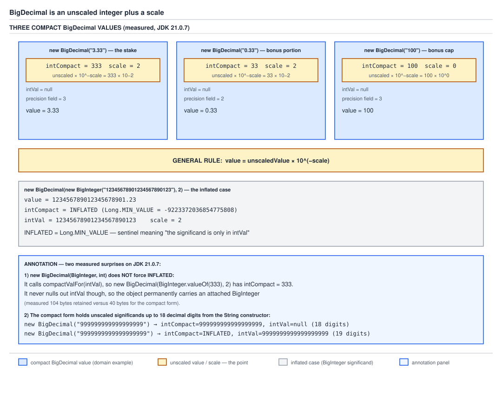

# 03 Java Core — `BigDecimal` structure and construction — INTERMEDIATE (§2.4, 2.4.7–2.4.10)

**Target version: Java 21 LTS.** | **Part 2 of 5** | [Index](../00-index.md)
Previous: [Double.compare, NaN and the float-versus-double choice](02f-double-comparison-and-float-choice.md) · Next: [Equality, scale and rounding](02b-equality-scale-and-rounding.md)

This file owns the shape of a `BigDecimal` value and how one gets built: the
unscaled-integer-plus-scale model, why every mutator-looking method is a
silent no-op, and the three different ways to hand it a `double` — exactly one
of which is safe. It does not own equality, rounding, `MathContext`, or the
byte-level internals of the compact/inflated split; those live in the sibling
files listed under Scope boundaries below. The question this file answers:
when `BonusService` needs to construct a `BigDecimal` for a stake or a bonus
amount, which constructor is correct, and what does the JVM actually store
when it runs?

Every number below was measured on **Oracle JDK 21.0.7 (build
21.0.7+8-LTS-245), macOS aarch64**, field values read reflectively with
`--add-opens java.base/java.math=ALL-UNNAMED`, source quoted from that build's
`lib/src.zip`.

---

## 1. `BigDecimal` is an unscaled integer plus a scale (2.4.7)

A `BigDecimal` is not "a decimal number type". It is an arbitrary-precision
integer with a sticky note attached that says where the decimal point goes.
The identity is:

```
value = unscaledValue × 10^(−scale)
```

Nothing else about `BigDecimal` needs to be memorised beyond this line — it
explains why `2.0` and `2.00` are different objects (unscaled `20`, scale 1
versus unscaled `200`, scale 2 — same value, different representation), why
`add` has to align scales before it can add the integers underneath, and why
`multiply` never loses precision (multiplying two integers and adding two
scales is always exact).

### How it works

The JDK 21 field declarations, verbatim from `lib/src.zip`,
`java.base/java/math/BigDecimal.java` (lines 331–371):

```java
    private final BigInteger intVal;

    private final int scale;  // Note: this may have any value, so
                              // calculations must be done in longs

    private transient int precision;

    /**
     * Used to store the canonical string representation, if computed.
     */
    private transient String stringCache;

    /**
     * Sentinel value for {@link #intCompact} indicating the
     * significand information is only available from {@code intVal}.
     */
    static final long INFLATED = Long.MIN_VALUE;

    private static final BigInteger INFLATED_BIGINT = BigInteger.valueOf(INFLATED);

    /**
     * If the absolute value of the significand of this BigDecimal is
     * less than or equal to {@code Long.MAX_VALUE}, the value can be
     * compactly stored in this field and used in computations.
     */
    private final transient long intCompact;

    // All 18-digit base ten strings fit into a long; not all 19-digit
    // strings will
    private static final int MAX_COMPACT_DIGITS = 18;
```

Five fields, each earning its place:

- **`intVal`** — a `BigInteger`, used only when the unscaled value does not
  fit in a `long`. For small values it stays `null`; the object does not carry
  a `BigInteger` it does not need.
- **`scale`** — an `int`, but the field comment is explicit that "calculations
  must be done in longs": scale arithmetic (adding scales in `multiply`,
  taking the max in `add`) can overflow an `int` range faster than intuition
  suggests, so the internal math widens to `long` before it narrows back.
- **`precision`** — `transient`, a lazily-computed lookaside cache of the
  number of decimal digits in the unscaled value. It starts at 0 ("unknown")
  for constructors that do not already know the digit count and gets filled
  in the first time `precision()` is called. It is `transient` because it is
  derivable from `intVal`/`intCompact` — there is nothing to serialize that
  cannot be recomputed.
- **`stringCache`** — `transient`, caches the canonical `toString()` result
  the first time it is computed, because building a decimal string from a
  `BigInteger` significand is not free and `BigDecimal` values are
  disproportionately likely to be formatted for display or logging.
- **`intCompact`** — the fast path. When the unscaled value fits in a `long`
  (`MAX_COMPACT_DIGITS = 18` decimal digits is the informal boundary — "all
  18-digit base ten strings fit into a long; not all 19-digit strings will"),
  it lives here as a primitive `long`, and `intVal` stays `null`. Every
  arithmetic fast path in `BigDecimal` checks `intCompact != INFLATED` first
  and only falls back to `BigInteger` math when it has to.

`[NUM]` The compact-form byte arithmetic, measured over 2,000,000 retained
`BigDecimal.valueOf(i, 2)` instances at `-Xmx5g` with compressed oops on
(`ObjectAlignmentInBytes = 8`): 12 bytes object header + 4 bytes `intVal`
reference + 4 bytes `scale` + 4 bytes `precision` + 4 bytes `stringCache`
reference + 8 bytes `intCompact` = 36 bytes, rounded up to the 8-byte
alignment boundary to 40. Measured: **40.0 bytes/instance**, exactly matching
the arithmetic. At QuizStakes' 19.8M ledger entries/day, each holding at least
one `Money` whose `BigDecimal` amount is in compact form, that is 19,800,000 ×
40 = 792,000,000 bytes ≈ **755 MiB/day** just for the amount fields, before the
`LedgerEntry` wrapper or the `Currency` reference.

The reflectively-measured field table for the three domain values that appear
throughout this folder — the stake, the bonus portion of that stake, and the
bonus cap — plus one inflated contrast:

| Constructed as | value | `intCompact` | `intVal` | `scale` | `precision` field |
|---|---|---|---|---|---|
| `new BigDecimal("3.33")` | 3.33 | `333` | `null` | 2 | 3 |
| `new BigDecimal("0.33")` | 0.33 | `33` | `null` | 2 | 2 |
| `new BigDecimal("100")` | 100 | `100` | `null` | 0 | 3 |
| `new BigDecimal(new BigInteger("12345678901234567890123"), 2)` | 123456789012345678901.23 | `INFLATED` | attached, 23-digit magnitude | 2 | 0 |

The first three are exactly the QuizStakes canonical rounding example — a
3.33 stake split into a 0.33 bonus portion, with 100 as the bonus cap — all
three comfortably compact. The fourth shows the escape hatch: once the
unscaled magnitude needs more than 18 decimal digits, `intCompact` is set to
the sentinel `INFLATED = Long.MIN_VALUE = -9223372036854775808` and every
arithmetic path falls back to `BigInteger` math against `intVal`.



**D-072** — Look at the three compact domain values (3.33, 0.33, 100) laid out
with their `intCompact` / `intVal` / `scale` / `precision` fields side by side,
each annotated with the `value = unscaled × 10^(−scale)` identity worked out
numerically (e.g. `333 × 10^(-2) = 3.33`). Then look at the inflated example
to its right, with `INFLATED = Long.MIN_VALUE` labelled on the `intCompact`
slot and a populated `intVal` box next to it. The annotation panel at the
bottom carries the correction that `new BigDecimal(BigInteger, int)` does not
always set `INFLATED` — it sets it only when the magnitude exceeds two `int`
words — but it always keeps `intVal` attached, which is the real memory cost.

`INFLATED` itself is only sketched here as far as this file needs it: it is
the sentinel that means "read the significand from `intVal`, not
`intCompact`". The full field-level treatment — every constructor's decision
about whether to null `intVal`, the `compactValFor` conversion logic, and the
104/112-byte inflated memory figures — belongs to
[`03-internals-bigdecimal.md`](03-internals-bigdecimal.md) and its diagram
D-125; this file does not re-derive it.

**Insight:** the reason `BigDecimal.multiply` is exact where `double`
multiplication is not is entirely a consequence of this identity — multiplying
two arbitrary-precision integers is exact, and adding two scales is exact
integer addition, so there is no rounding step anywhere in the operation
unless the caller explicitly asks for one via `setScale` or a `MathContext`.

**Interview:** "What is a `BigDecimal`, structurally?" — an unscaled
arbitrary-precision integer and a 32-bit scale, where the value is
`unscaledValue × 10^(−scale)`; small unscaled values are cached as a primitive
`long` in `intCompact` for speed, falling back to a `BigInteger` in `intVal`
once they exceed 18 decimal digits.

No gotcha beyond what is already called out above: the structure itself has
no surprising edge, the surprises live in construction and comparison, which
sections 2–4 below and the next file cover.

> **`BigDecimal` is an immutable pair of an arbitrary-precision unscaled
> integer and a 32-bit scale, whose value is `unscaledValue × 10^(−scale)`.**

---

## 2. Immutability, and the silent no-op (2.4.8)

`BigDecimal` looks, at a glance, like it might behave the way a
`StringBuilder` or a `List` does — call a method, the object changes. It does
not. Every arithmetic method — `add`, `subtract`, `multiply`, `divide`,
`setScale`, `stripTrailingZeros` — returns a **new** `BigDecimal` and leaves
the receiver untouched. Call one and discard the return value, and the call
did nothing at all, with no compiler warning and no runtime exception.

### Why it exists

`BigDecimal` represents a value, not a mutable container. Making it immutable
means an instance can be shared freely across threads and across aggregates
without defensive copying or locking — safe to hand a `Money` amount into
three different services at once during the 3,400/sec stake-settlement burst,
because none of them can corrupt what the others see. This is the same
discipline `String` follows, and the folder
[`../immutability-and-design/02-immutability.md`](../immutability-and-design/02-immutability.md)
owns immutability as a general design principle — `BigDecimal` is this file's
worked example of that discipline, not a re-explanation of why immutability
is chosen as a pattern.

### How it works

**Pitfall:** the wrong belief is that calling `add` updates the balance in
place, the way it would on a `StringBuilder`. Measured:
`BigDecimal bal = new BigDecimal("100.00"); bal.add(new
BigDecimal("42.00"));` with the return value discarded leaves `bal` printing
`100.00` — the `add` call built a new instance worth `142.00`, handed it
back, and nobody kept the reference, so it is garbage the instant the
statement ends. The fix is the reassignment: `bal = bal.add(new
BigDecimal("42.00"));`, which measured prints `142.00`. The full Wrong/Right
worked example is in `## Pitfalls` below.

### When to reach for it, and when not

In production this pitfall does not show up as a compiler error or even a
thrown exception — it shows up in reconciliation. A `LedgerEntry` gets posted
with the balance from *before* a credit was applied, because the line that
was supposed to update the running total was `runningTotal.add(credit);`
instead of `runningTotal = runningTotal.add(credit);`. Nothing fails loudly;
the mismatch surfaces days later when the ledger's derived totals stop
matching the sum of `Movement` rows.

The guardrails a reviewer can actually enforce:

- **Never call a `BigDecimal` method in statement position** — if a
  `BigDecimal` method call is not the right-hand side of an assignment, a
  method argument, or a condition, it is very likely dead code.
- **Prefer `final` locals for running values built incrementally in a single
  scope where reassignment is expected exactly once per step** — this does
  not prevent the bug (the variable still has to be reassigned each time,
  just not declared `final` if reassigned across a loop), but it does force a
  compile error if a later refactor tries to silently stop updating a value
  that was meant to be a true accumulator through some other path.
- Static analysis (Error Prone's `CheckReturnValue`, SpotBugs'
  `RV_RETURN_VALUE_IGNORED`) catches exactly this shape and should be enabled
  on any module handling `Money`.

**Insight:** this is not an oversight in `BigDecimal`'s design — the whole
point of it being a value type is that "the same reference, still holding the
same value" is a guarantee the rest of the system can rely on. The no-op is
the cost of that guarantee when a caller forgets to capture the return value;
the alternative (in-place mutation) would remove the safety the immutability
was bought for in the first place.

**Interview:** "Why is `BigDecimal` immutable, and what goes wrong if you
forget?" — it is immutable so instances can be shared safely without
synchronization, exactly like `String`; forgetting to reassign the return
value produces a silent no-op with no compiler warning, which in a ledger
context means a stale balance gets persisted with no exception to catch it.

> **Every `BigDecimal` operation returns a new instance; the receiver is
> never modified, so discarding the return value is indistinguishable from
> not calling the method at all.**

---

## 3. `new BigDecimal(double)` inherits the error (2.4.9)

### Why it exists

A `double` cannot exactly hold most decimal fractions — 0.1 in binary is
`0.0001100110011...` repeating forever, and 52 mantissa bits force a cut and a
round. `new BigDecimal(double)` is documented, correctly, to construct the
`BigDecimal` whose value is *exactly* the `double` argument's value — no more,
no less. That correctness is exactly the trap: the `double` was never 0.1 to
begin with, and the constructor faithfully reports what it actually is.

### How it works

`[NUM]` `[PROVE]` The three-way comparison, computed:

| Constructed as | result | scale | `intCompact` | `intVal` |
|---|---|---|---|---|
| `new BigDecimal(0.1)` | `0.1000000000000000055511151231257827021181583404541015625` | 55 | `INFLATED` | 55-digit magnitude |
| `new BigDecimal("0.1")` | `0.1` | 1 | `1` | `null` |
| `BigDecimal.valueOf(0.1)` | `0.1` | 1 | `1` | `null` |

The `double` constructor's result is not a bug and not an approximation — it
is the *exact* decimal value of the IEEE 754 bit pattern that `0.1` compiles
to. Deriving it: `Double.doubleToLongBits(0.1) = 0x3fb999999999999a`, sign 0,
biased exponent 1019 (unbiased −4), 52-bit mantissa ending `...1010` — that
mantissa was rounded *up* from `...1001` by round-to-nearest-even during
compilation, because 0.1's true binary expansion (`0001100110011...`
repeating) does not terminate and had to be cut at 52 bits. `new
BigDecimal(0.1)` walks that exact binary value out to its full decimal
expansion — 55 digits, scale 55 — because that really is the value stored in
the eight bytes. Since the unscaled value at scale 55 needs far more than 18
decimal digits, `intCompact` is set to `INFLATED` and the full magnitude lives
in `intVal`.

`new BigDecimal("0.1")` never touches a `double` at all — it parses the
three-character string `"0.1"` directly into unscaled value `1`, scale `1`.
`BigDecimal.valueOf(0.1)` (worked through in full in §4 below) also produces
scale 1, unscaled `1` — the same object shape as the `String` constructor,
for reasons specific to how `valueOf` is implemented.

**Pitfall:** the wrong belief is that the `double` constructor is close
enough for money. Measured: `new BigDecimal(0.1).setScale(2,
RoundingMode.HALF_UP)` prints `0.10` — looks fine at a glance, because
rounding to 2 decimal places happens to mask the error for this particular
value. The corruption is still there underneath: the un-rounded value carries
the full 55-digit expansion at scale 55, and any computation performed on it
*before* rounding carries that error forward. The fix is to parse from a
`String` instead: `new BigDecimal("0.10")` prints `0.10` exactly, scale 2,
unscaled `10`, with no hidden expansion at any point in the pipeline. The
full Wrong/Right worked example is in `## Pitfalls` below.

The QuizStakes-shaped symptom: a deposit amount arriving over HTTP as a JSON
number (`{"amount": 49.99}`) gets deserialized by a library that maps it to a
Java `double` before `PaymentService` ever sees it, and only then is it
wrapped in a `BigDecimal`. The error is baked in at that first
double-to-`BigDecimal` boundary and is permanent — no later `setScale` or
`stripTrailingZeros` call recovers the value that was actually intended,
because the information about what was "meant" was already discarded when the
JSON parser produced a `double`.

**The rule, stated as a rule:** money enters the system as a `String` or as
integer minor-units, never through a `double`. If a JSON deserializer would
otherwise produce a `double` for an amount field, configure it to deserialize
that field as a `String` or use `BigDecimal`-aware binding
(`@JsonDeserialize` with a `BigDecimal`-typed field, backed by
`DeserializationFeature.USE_BIG_DECIMAL_FOR_FLOATS` or an explicit string
field) before the value ever touches a `double`.

**Interview:** "Why is `new BigDecimal(0.1)` dangerous?" — because it is
*exact*, not approximate: it faithfully reproduces the IEEE 754 double's
actual value, which was never 0.1, giving a 55-digit-scale `BigDecimal`
instead of the 0.1 a human meant; the fix is to construct from `String` or use
`valueOf`, never from a `double` literal or variable that started life as
user-facing decimal input.

> **`new BigDecimal(double)` is exact with respect to the `double` argument,
> which is precisely the problem when the `double` itself was never exact
> with respect to the decimal value a human intended.**

---

## 4. `valueOf(double)` is "what you typed" (2.4.10)

### How it works

`[SOURCE]` `[PROVE]` `BigDecimal.valueOf(double)`, verbatim from JDK 21
`lib/src.zip`, `java.base/java/math/BigDecimal.java`:

```java
    public static BigDecimal valueOf(double val) {
        // Reminder: a zero double returns '0.0', so we cannot fastpath
        // to use the constant ZERO.  This might be important enough to
        // justify a factory approach, a cache, or a few private
        // constants, later.
        return new BigDecimal(Double.toString(val));
    }
```

Three lines and a comment, and the whole mechanism is in the return
statement: `valueOf` does not touch the `double`'s bits directly at all — it
converts the `double` to a `String` via `Double.toString`, then runs that
`String` through the `String` constructor covered in §3. The comment explains
why there is no zero fast path: `Double.toString(0.0)` and
`Double.toString(-0.0)` produce different text (`"0.0"` and `"-0.0"`), so a
shortcut that returned the shared `BigDecimal.ZERO` constant for every zero
`double` would silently discard the sign, which the general path does not.

The proof that this gives "what you typed": `Double.toString` is specified by
its Javadoc to produce the **shortest** decimal string that, when parsed back
with `Double.parseDouble`, yields exactly the same `double` — not the full
exact expansion of the underlying binary value, and not a fixed number of
digits, but the shortest string that round-trips. Measured:
`Double.toString(0.1)` is `"0.1"`, and `Double.parseDouble(Double.toString(0.1))
== 0.1` is `true`. So `BigDecimal.valueOf(0.1)` evaluates to `new
BigDecimal("0.1")` — unscaled value `1`, scale `1` — which is exactly the
`String`-constructor result from §3, not the 55-digit expansion `new
BigDecimal(0.1)` produces. The full derivation of why `Double.toString`
chooses the shortest round-tripping string, rather than some other candidate,
belongs to
[`04a-internals-ulp-rounding-and-tostring.md`](04a-internals-ulp-rounding-and-tostring.md);
this file only needs the contract, not its proof.

**Insight:** `valueOf` is not "smarter arithmetic" than the `double`
constructor — it is textual. It recovers the digits a human plausibly typed
by asking `Double.toString` for its canonical shortest form, then parses
those digits as a decimal string. It never inspects the exact binary value at
all except through what `Double.toString` already decided to print.

### A concrete example

Stating the limit of the trick honestly matters here: `valueOf` recovers what
a human would have typed for a *single* `double` literal or variable; it does
not and cannot recover exactness that accumulated arithmetic already
destroyed. Measured: `0.1 + 0.2` evaluates, as a `double` expression, to
`0.30000000000000004` (an artifact of adding two already-inexact binary
approximations), and `Double.toString(0.1 + 0.2)` prints exactly that 17-digit
string, because that really is the shortest string that round-trips to the
sum's actual bit pattern. Consequently:

```java
double sum = 0.1 + 0.2;
BigDecimal viaValueOf = BigDecimal.valueOf(sum);
System.out.println(viaValueOf);
```

prints `0.30000000000000004`, not `0.3`. `valueOf` did exactly what it always
does — converted the `double` it was handed into the shortest string that
reproduces that `double`'s actual value — and that `double`'s actual value
was never 0.3 to begin with. `valueOf` cleans up the noise introduced by one
`double`-to-decimal conversion; it has no way to undo error that was already
present in the `double` value it was given.

**Pitfall:** the wrong belief is that `BigDecimal.valueOf` makes any
`double`-derived arithmetic safe for money. Measured, summing `0.1` as a
`double` 100,000 times drifts to `10000.000000018848`, an error of
`+1.8848368199542165E-8`, and `BigDecimal.valueOf` on that result reports the
drifted value faithfully — it wraps whatever error the `double` arithmetic
already produced, it does not remove it. The fix is to never accumulate in
`double` in the first place: build the running total as a `BigDecimal` from a
`String`-constructed step value throughout, so there is no `double` error for
`valueOf` to fail to clean up. The full Wrong/Right worked example is in
`## Pitfalls` below.

**Interview:** "What does `BigDecimal.valueOf(double)` actually do, and why
does it differ from `new BigDecimal(double)`?" — it delegates to `new
BigDecimal(Double.toString(val))`, and `Double.toString` emits the shortest
decimal string that round-trips to the same `double`, so `valueOf` reconstructs
"what a human would have typed" rather than "what is exactly stored in the
64 bits"; it fixes the single-conversion case, not accumulated arithmetic
error from `double` operations performed before the conversion.

> **`BigDecimal.valueOf(double)` is `new BigDecimal(Double.toString(val))` —
> the shortest round-tripping decimal text for the `double` it is given, which
> recovers intent for a single literal but cannot undo error already
> accumulated in prior `double` arithmetic.**

---

## Pitfalls

### "Calling `add` updates the balance in place."

**Wrong**

```java
BigDecimal bal = new BigDecimal("100.00");
bal.add(new BigDecimal("42.00"));
System.out.println(bal);
```

Measured output: `100.00` — a silent no-op, because the return value carrying
the new 142.00 value was discarded.

**Right**

```java
BigDecimal bal = new BigDecimal("100.00");
bal = bal.add(new BigDecimal("42.00"));
System.out.println(bal);
```

Measured output: `142.00` — the reassignment is what actually captures the
new instance.

**Why people believe it:** `StringBuilder`, `ArrayList` and `HashMap` all
mutate in place on a method call, and nothing at compile time distinguishes
`BigDecimal`'s call shape from theirs.

### "The `double` constructor is close enough for money."

**Wrong**

```java
BigDecimal deposit = new BigDecimal(0.1);
System.out.println(deposit);
```

Measured output: `0.1000000000000000055511151231257827021181583404541015625`
at scale 55 — the exact value of the IEEE 754 double, not the 0.1 a human
meant.

**Right**

```java
BigDecimal deposit = new BigDecimal("0.1");
System.out.println(deposit);
```

Measured output: `0.1` at scale 1, unscaled value `1` — parsed directly from
text, no `double` involved anywhere in the construction.

**Why people believe it:** the constructor compiles and accepts a `double`
argument without complaint, which reads as tacit endorsement of using it for
ordinary decimal values.

### "`BigDecimal.valueOf` makes any `double`-derived value safe."

**Wrong**

```java
double total = 0.0;
for (int i = 0; i < 100_000; i++) {
    total += 0.1;
}
System.out.println(BigDecimal.valueOf(total));
```

Measured output: `10000.000000018848` — `valueOf` faithfully reports the
`double` sum's actual value, error and all.

**Right**

```java
BigDecimal total = BigDecimal.ZERO;
BigDecimal step = new BigDecimal("0.1");
for (int i = 0; i < 100_000; i++) {
    total = total.add(step);
}
System.out.println(total);
```

Measured output: `10000.0` exactly — the accumulation was `BigDecimal`
arithmetic throughout, so there was no `double` error for `valueOf` to fail to
undo.

**Why people believe it:** `BigDecimal.valueOf(0.1)` alone genuinely does
produce `0.1`, and that single-value success is over-generalized to "any
`double` piped through `valueOf` becomes trustworthy."

---

## Cheat sheet

| Thing | Fact (Java 21 LTS) |
|---|---|
| Core identity | `value = unscaledValue × 10^(−scale)` |
| Fields | `intVal` (`BigInteger`, nullable), `scale` (`int`), `precision` (`transient int`, lazy), `stringCache` (`transient String`, lazy), `intCompact` (`transient long`) |
| `INFLATED` sentinel | `Long.MIN_VALUE = -9223372036854775808` |
| `MAX_COMPACT_DIGITS` | 18 — all 18-digit base-10 strings fit in a `long`; not all 19-digit ones do |
| Compact instance size | 40.0 bytes measured (12 header + 4 + 4 + 4 + 4 + 8, aligned) |
| `new BigDecimal("3.33")` | `intCompact = 333`, `intVal = null`, `scale = 2`, `precision = 3` |
| `new BigDecimal("0.33")` | `intCompact = 33`, `intVal = null`, `scale = 2`, `precision = 2` |
| `new BigDecimal("100")` | `intCompact = 100`, `intVal = null`, `scale = 0`, `precision = 3` |
| Every arithmetic op | Returns a new instance; receiver never mutated |
| Ignored return value | Silent no-op — no exception, no warning |
| Immutability rationale | Safe sharing across threads/aggregates without locking, like `String` |
| `new BigDecimal(0.1)` | `0.1000000000000000055511151231257827021181583404541015625`, scale 55, `intCompact = INFLATED` |
| `new BigDecimal("0.1")` | `0.1`, scale 1, `intCompact = 1` |
| `BigDecimal.valueOf(0.1)` | `0.1`, scale 1, `intCompact = 1` (same shape as the `String` form) |
| `double` constructor semantics | Exact w.r.t. the `double`'s actual bit pattern, not w.r.t. decimal intent |
| Rule for money input | Enter the system as `String` or minor-units `long`, never as `double` |
| `valueOf(double)` body | `return new BigDecimal(Double.toString(val));` |
| Why no zero fast path in `valueOf` | `Double.toString(0.0)` vs `Double.toString(-0.0)` differ; a `ZERO` shortcut would drop the sign |
| `Double.toString` contract | Shortest decimal string that round-trips via `Double.parseDouble` to the same `double` |
| `Double.toString(0.1)` | `"0.1"` |
| `Double.toString(0.1 + 0.2)` | `"0.30000000000000004"` |
| `valueOf(0.1 + 0.2)` | `0.30000000000000004` — cleans up conversion, not accumulated error |
| `valueOf` fixes | One `double`-to-decimal conversion |
| `valueOf` does NOT fix | Error already accumulated across prior `double` arithmetic |
| Field comment on `scale` | "this may have any value, so calculations must be done in longs" |
| `precision` initial state | 0 ("unknown") for constructors that don't already know the digit count; filled lazily |
| Inflated example field values | `new BigDecimal(new BigInteger("12345678901234567890123"), 2)` → `intCompact = INFLATED`, `intVal` attached, `scale = 2` |
| Where full internals live | `03-internals-bigdecimal.md` (diagram D-125) |
| Where equality/rounding live | `02b-equality-scale-and-rounding.md` |
| Where `MathContext`/constants live | `02c-mathcontext-constants-and-minor-units.md` |
| Diagram owned by this file | D-072 only; D-125 is referenced, not embedded |

---

## Self-test

**Q1.** What are the five fields on `BigDecimal`, and which two are `transient`?

<details><summary>Answer</summary>

`intVal` (a nullable `BigInteger`), `scale` (an `int`), `precision`
(`transient int`), `stringCache` (`transient String`), and `intCompact`
(`transient long`). `precision` and `stringCache` are `transient` because
they're lazily-computed lookaside caches derivable from the other fields —
there's nothing they hold that can't be recomputed, so they don't need to be
part of serialized state. `intCompact` is also `transient`, for the same
reason: it's derivable from `intVal` when present.

</details>

**Q2.** Why does `new BigDecimal(BigInteger.valueOf(6500), 2)` NOT set
`intCompact` to `INFLATED`, even though it always keeps `intVal` attached?

<details><summary>Answer</summary>

The `BigDecimal(BigInteger, int)` constructor calls `compactValFor(intVal)`,
which checks whether the `BigInteger`'s magnitude fits in one or two `int`
words; if it does, it packs those words into a `long` and returns that,
setting `intCompact` to the actual value (6500 here) rather than the
sentinel. What the constructor never does is null out `intVal` afterward, so
the object permanently carries the attached `BigInteger` and its backing
`int[] mag` array even though `intCompact` is usable. The accurate statement
is: it does not force `INFLATED`, but it does force the extra memory cost —
measured at 104 bytes against 40 for the fully compact form built via
`BigDecimal.valueOf(long, int)`.

</details>

**Q3.** A teammate writes `runningBalance.add(fee);` on its own line to deduct
a fee. Code review flags it. Why, and what should it be instead?

<details><summary>Answer</summary>

`BigDecimal` is immutable — `add` returns a new instance and leaves
`runningBalance` untouched. Calling it in statement position with the return
value discarded is a silent no-op: `runningBalance` still holds its old
value, with no exception and no compiler warning. It should be
`runningBalance = runningBalance.add(fee);` so the new value is actually
captured. In production this bug shows up not as a crash but as a
reconciliation mismatch days later, when the ledger's stored balance stops
matching the sum of its `Movement` rows.

</details>

**Q4.** Why is `new BigDecimal(0.1)` "correct" and still wrong to use for
money?

<details><summary>Answer</summary>

It's correct in the sense that it's documented to construct the `BigDecimal`
whose value is exactly equal to the `double` argument — no rounding, no
approximation in the conversion itself. The problem is upstream: the `double`
literal `0.1` was never exactly 0.1 to begin with, because 0.1's binary
expansion repeats forever and got truncated to 52 mantissa bits during
compilation. So `new BigDecimal(0.1)` faithfully reports the exact value of
that truncated binary approximation — a 55-digit decimal at scale 55 —
instead of the 0.1 a human meant. The constructor did its job perfectly; the
job itself was the wrong one to ask for.

</details>

**Q5.** What does `BigDecimal.valueOf(double)` do internally, and what
guarantee does that give you?

<details><summary>Answer</summary>

It's implemented as `return new BigDecimal(Double.toString(val));` — it
converts the double to a string first, then parses that string. The guarantee
comes from `Double.toString`'s contract: it produces the shortest decimal
string that round-trips back to the exact same double via
`Double.parseDouble`. So `Double.toString(0.1)` is `"0.1"`, and
`valueOf(0.1)` becomes `new BigDecimal("0.1")` — scale 1, unscaled value 1 —
rather than the 55-digit expansion the `double` constructor gives. It
guarantees "what a human plausibly typed for this single double," not
"exactness that was never there."

</details>

**Q6.** Does `BigDecimal.valueOf` fix the drift from summing `0.1` as a
`double` 100,000 times in a loop?

<details><summary>Answer</summary>

No. Measured, that loop produces `10000.000000018848` as a `double`, and
`BigDecimal.valueOf` on that result just converts it via
`Double.toString` — it reports `10000.000000018848` faithfully, error
included. `valueOf` only cleans up the single conversion from a `double`'s
bit pattern to decimal text; it has no visibility into, and cannot undo,
error that already accumulated across many prior `double` additions. The fix
is to never do the summation in `double` in the first place — accumulate in
`BigDecimal` from a `String`-constructed starting value.

</details>

**Q7.** Why does the field comment on `scale` say "calculations must be done
in longs" even though `scale` itself is declared as an `int`?

<details><summary>Answer</summary>

Operations like `add` (which takes the max of two scales) and `multiply`
(which adds two scales together) do arithmetic on scale values internally,
and that arithmetic can, in principle, overflow the `int` range faster than
it looks like it should — especially once very large or very small scales are
involved from repeated `movePointLeft`/`movePointRight` or `scaleByPowerOfTen`
calls. The field itself stays an `int` for storage compactness, but the
internal computation widens to `long` before doing the arithmetic and only
narrows back after checking the result is representable, to avoid silent
`int` overflow corrupting the scale.

</details>

**Q8.** A `BigDecimal` amount is compact (`intCompact` set, `intVal == null`)
versus one built via `new BigDecimal(BigInteger, int)` where `intVal` stays
attached even though the value is small. What's the practical cost of
choosing the latter unnecessarily, at QuizStakes' scale?

<details><summary>Answer</summary>

Measured, the compact form is 40 bytes and the `BigInteger`-attached form is
104 bytes — a 64-byte difference — purely from carrying an unnecessary
`BigInteger` object (its own 40-byte header plus a 24-byte `int[1]` magnitude
array) that could have been avoided by using `BigDecimal.valueOf(long, int)`
instead. At 19.8M ledger entries/day each holding one such amount, that's
19,800,000 × 64 = 1,267,200,000 bytes, roughly 1.27 GB of avoidable extra
allocation per day.

</details>

---

## Open questions

None. Every claim above traces to §6.1, §6.7 or §6.8 of the measured brief,
or to the verbatim JDK 21 source quoted inline.

---

**Leaves covered:** 2.4.7–2.4.10 (4 leaves)
**Leaves deferred:** none
**Diagrams included:** D-072
**Target version:** Java 21 LTS
**Lines:** 708
