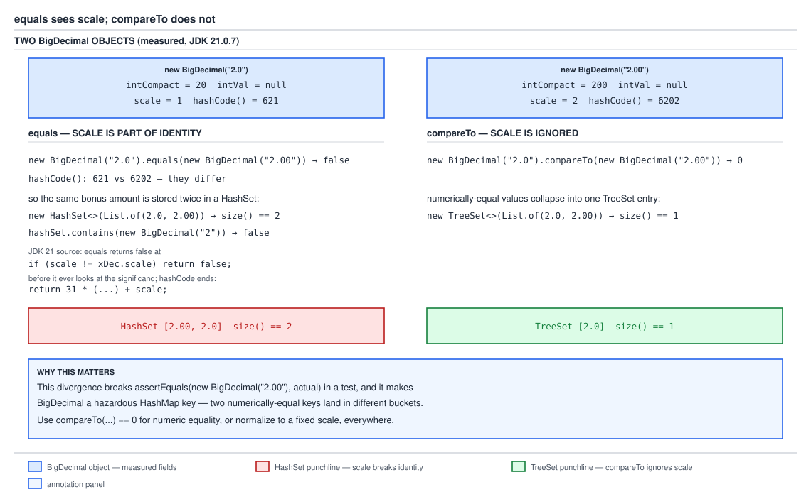

# 03 Java Core — `BigDecimal` equality: `equals` versus `compareTo` — INTERMEDIATE (§2.4, 2.4.11–2.4.12)

**Target version: Java 21 LTS.** | **Part 2 of 5** | [Index](../00-index.md)
Previous: [BigDecimal structure and construction](02a-bigdecimal-structure-and-construction.md) · Next: [Rounding modes and the BigDecimal API surface](02g-rounding-modes-and-the-api-surface.md)

This file owns what happens once you already have a `BigDecimal` and start
asking whether two of them are "the same". `02a` owns the unscaled-integer-
plus-scale identity and the constructors; this file owns the consequences of
that identity for `equals`, `hashCode`, `compareTo`, and the collections and
test assertions built on top of them. The question this file answers: **why
does the same numeric value fail an `equals` check depending on how it got its
scale, and what do you do about it?** Division, the eight `RoundingMode`s, and
the rest of the `BigDecimal` API surface (`setScale`, `stripTrailingZeros`,
`toPlainString`, `precision`, `scale`, `signum`, `movePointLeft`) are covered
next door in `02g-rounding-modes-and-the-api-surface.md`.

Measurement environment for every number quoted below: Oracle JDK 21.0.7
(build 21.0.7+8-LTS-245), macOS aarch64 (Apple Silicon), library source quoted
from that build's `lib/src.zip`, compiled and run in a scratch directory.

---

## 1. `equals` sees scale, `compareTo` does not (2.4.11)

Picture two `BigDecimal`s built from `"2.0"` and `"2.00"`. From `02a`'s identity
— a `BigDecimal` *is* an unscaled integer plus a scale — these are not almost
the same object, they are genuinely different: one is the integer 20 with the
decimal point moved 1 place, the other is the integer 200 with the decimal
point moved 2 places. `equals` is a question about the *object's stored
fields*. `compareTo` is a question about the *number the object denotes*. Ask
"are these the same object state?" and the answer is no. Ask "are these the
same number?" and the answer is yes. Neither method is wrong; they are
answering two different questions that happen to share a name pattern
(`Comparable` types are conventionally expected to make `equals` and
`compareTo` agree — `BigDecimal` is the JDK's own documented exception to that
convention).

### Why it exists

`BigDecimal` needs `equals` to satisfy the general `Object.equals` contract:
reflexive, symmetric, transitive, and consistent with `hashCode`. The scale is
a real field that participates in the object's identity — it is what you get
back from `scale()`, what round-trips through `toString()`, what a
`stripTrailingZeros()` call changes. If `equals` ignored scale, then
`x.equals(y)` would no longer imply `x.hashCode() == y.hashCode()` unless
`hashCode` also ignored scale, and then two exact-integer-representation
BigDecimals like `100` (scale 0) and `100.00` (scale 2) — which print
differently, serialize differently, and round-trip differently — would report
themselves as indistinguishable. The JDK chose exactness of representation for
`equals`, and gave you `compareTo` for numeric equality.

### How it works

Quote the JDK 21 `equals` and `hashCode`, verbatim from `lib/src.zip`,
`java.base/java/math/BigDecimal.java`:

```java
public boolean equals(Object x) {
    if (!(x instanceof BigDecimal xDec))
        return false;
    if (x == this)
        return true;
    if (scale != xDec.scale)
        return false;
    long s = this.intCompact;
    long xs = xDec.intCompact;
    if (s != INFLATED) {
        if (xs == INFLATED)
            xs = compactValFor(xDec.intVal);
        return xs == s;
    } else if (xs != INFLATED)
        return xs == compactValFor(this.intVal);

    return this.inflated().equals(xDec.inflated());
}

public int hashCode() {
    if (intCompact != INFLATED) {
        long val2 = (intCompact < 0)? -intCompact : intCompact;
        int temp = (int)( ((int)(val2 >>> 32)) * 31  +
                          (val2 & LONG_MASK));
        return 31*((intCompact < 0) ?-temp:temp) + scale;
    } else
        return 31*intVal.hashCode() + scale;
}
```

Walk `equals` in order. First, an `instanceof` pattern match — if `x` is not a
`BigDecimal`, false. Second, an identity short-circuit — `x == this` is true,
skip everything else. Third, and this is the line that matters:
`if (scale != xDec.scale) return false;`. This check runs **before** the
method ever looks at `intCompact` or `intVal`, i.e. before it looks at the
significand at all. `new BigDecimal("2.0")` has `scale = 1`; `new
BigDecimal("2.00")` has `scale = 2`. They fail this line and `equals` returns
false without comparing the numbers. Only if the scales match does the method
go on to compare the compact or inflated significands.

`hashCode` mirrors this: it hashes the significand (`intCompact` or, for
inflated values, `intVal.hashCode()`), multiplies by 31, and then adds the
scale as the final term: `+ scale`. Scale is mixed into the hash directly, so
two BigDecimals that `compareTo` calls equal but that carry different scales
are, in general, going to land in different hash buckets.

Field table from `02a`, restated for the two values in question (measured
reflectively with `--add-opens java.base/java.math=ALL-UNNAMED`):

| Constructed as | `intCompact` | `scale` |
|---|---|---|
| `new BigDecimal("2.0")` | `20` | 1 |
| `new BigDecimal("2.00")` | `200` | 2 |

Different `intCompact`, different `scale` — two different pairs of stored
fields, hence `equals` false. But `20 / 10^1 = 2.0` and `200 / 10^2 = 2.0`, the
same number, hence `compareTo` zero. Measured:

```java
new BigDecimal("2.0").equals(new BigDecimal("2.00"))    // false
new BigDecimal("2.0").compareTo(new BigDecimal("2.00")) // 0
new BigDecimal("2.0").hashCode()    // 621
new BigDecimal("2.00").hashCode()   // 6202
```

621 and 6202 are different because the `+ scale` term differs (1 versus 2)
*and* because the significand hashing differs (20 versus 200) — both terms of
the sum move.



**D-073** — the two `BigDecimal` objects side by side, each labelled with its
`intCompact` and `scale` fields (20/1 and 200/2), and their differing hash
codes (621 and 6202) routing them into different buckets of a hash table. To
the left, a `HashSet` box prints `[2.00, 2.0]` at size 2; to the right, a
`TreeSet` box built from the same two elements prints `[2.0]` at size 1,
because it orders and de-duplicates by `compareTo`, not by `hashCode`/`equals`.

```java
record ExchangeRateProbe() {
    static void demonstrate() {
        BigDecimal fromDeposit = new BigDecimal("2.0");
        BigDecimal fromLedger = new BigDecimal("2.00");

        boolean sameObjectState = fromDeposit.equals(fromLedger);   // false
        int sameNumber = fromDeposit.compareTo(fromLedger);         // 0

        if (sameObjectState) {
            throw new AssertionError("expected equals() to see the scale difference");
        }
        if (sameNumber != 0) {
            throw new AssertionError("expected compareTo() to ignore the scale difference");
        }
    }
}
```

**Pitfall:** engineers new to `BigDecimal` assume `equals` means "same amount
of money", the way it does for `Integer` or `Long`. The symptom is silent
`false` where a numeric comparison was intended — a reconciliation job that
compares a `Movement.amount` read back from the ledger (constructed via
`BigDecimal.valueOf(6500, 2)`, scale 2) against a value parsed from an
upstream file (`new BigDecimal("65")`, scale 0) reports a mismatch even though
both represent 65.00. Fix: use `compareTo(other) == 0` for numeric equality,
and reserve `equals` for the rare case where you genuinely need scale-and-value
identity (for example, detecting that a `setScale` round-trip changed
nothing). **Why people believe it:** every other common `java.lang` wrapper
type — `Integer`, `Long`, `Double` — has `equals` and numeric equality
coincide, so the pattern generalizes wrongly to `BigDecimal`, the one type in
the box where the object carries a second field (scale) that participates in
identity but not in value.

**Interview:** "Why is `new BigDecimal("2.0")` not equal to `new
BigDecimal("2.00")`?" — because `equals` compares the stored scale before the
significand, and the two literals parse to different scales (1 and 2); use
`compareTo(other) == 0` to compare by numeric value.

> `equals` on `BigDecimal` is equality of *representation* (significand and
> scale); `compareTo` is equality of *value*; they diverge whenever two
> numerically equal amounts were built with different scales.

---

## 2. The consequences: a hazardous key and a hazardous assertion (2.4.12)

Once `equals`/`hashCode` are scale-sensitive, every JDK API that is built on
top of `equals`/`hashCode` inherits the sensitivity: `HashMap`, `HashSet`,
`Objects.equals`, `List.contains`, JUnit's `assertEquals`. None of those APIs
know or care that `BigDecimal` has a numeric interpretation that disagrees
with its `equals`; they just call `equals` and trust it means "the same
thing".

### `HashSet` versus `TreeSet` on the same two elements

Measured:

```java
new HashSet<>(List.of(new BigDecimal("2.0"), new BigDecimal("2.00")))
    // prints [2.00, 2.0], size() == 2

new TreeSet<>(List.of(new BigDecimal("2.0"), new BigDecimal("2.00")))
    // prints [2.0], size() == 1

Set<BigDecimal> hashSet = new HashSet<>(
        List.of(new BigDecimal("2.0"), new BigDecimal("2.00")));
hashSet.contains(new BigDecimal("2"));   // false
```

The `HashSet` keeps both elements — from its point of view they are two
different keys, because they hash to different buckets and fail `equals`
inside the bucket. The `TreeSet` keeps one — it never calls `equals` or
`hashCode` at all; a `TreeSet` (backed by a red-black tree) orders and
de-duplicates purely by `compareTo` (or an explicit `Comparator`), and since
`2.0.compareTo(2.00) == 0`, the second insert is treated as a duplicate of the
first and dropped. The last line is the sharpest symptom: the `HashSet` above
genuinely holds two values that both equal 2 numerically, yet asking it
`contains(new BigDecimal("2"))` returns `false`, because `new
BigDecimal("2")` has scale 0, which matches neither stored scale (1 nor 2).

The same asymmetry shows up with `ZERO`:

```java
new BigDecimal("0.00").equals(BigDecimal.ZERO)     // false  (scale 2 vs scale 0)
new BigDecimal("0.00").compareTo(BigDecimal.ZERO)  // 0
```

**`[X-REF 02]`** — mechanism, self-contained: a `HashSet`/`HashMap` locates a
candidate bucket from `hashCode() & (table.length - 1)`, then walks that
bucket's chain (or tree, if it has degenerated) calling `equals` against each
existing entry to decide whether the new key is a duplicate. If a type's
`hashCode` includes a field (here, `scale`) that its intended "sameness"
notion (here, `compareTo`) ignores, then two values a caller considers the
same number can be routed to different buckets and never be compared to each
other at all — the collision check never even runs. A `TreeMap`/`TreeSet`
sidesteps this because it never computes a hash bucket; it walks the tree
comparing with `compareTo` at each node, so it is scale-blind by construction.
See guide 02 (Java collections) for the full hash-table bucket/resize/tree-ify
mechanics this generalizes to any key type with a similar `equals`/`compareTo`
mismatch.

**`[X-REF 16]`** — mechanism, self-contained: JUnit's `assertEquals(Object
expected, Object actual)` delegates to `expected.equals(actual)` (via
`AssertionUtils`/`Objects.equals` in the JUnit 5 codebase), so
`assertEquals(new BigDecimal("2.00"), actualBalance)` fails whenever
`actualBalance` is numerically 2.00 but was produced at a different scale —
for instance a wallet balance computed by summation that lands at scale 4 and
was never normalized back down. The failure message reads as "expected 2.00
but was 2.0000", which looks like a real bug (a scale drift or unit error) even
when the arithmetic is completely correct. The fix is to assert on numeric
value, not object identity: `assertEquals(0, expected.compareTo(actual))`, or
with AssertJ, `assertThat(actual).isEqualByComparingTo("2.00")` (as distinct
from AssertJ's `isEqualTo`, which still delegates to `BigDecimal.equals` and
carries the same trap). See guide 16 (Testing) for the full set of AssertJ
numeric-comparison assertions and how they interact with custom `Comparable`
types generally.

### The rule that actually prevents this

Two independent defenses, both needed:

1. **Fix the scale at the domain boundary.** Every `Money` entering or leaving
   the ledger is normalized to scale 2 (the QuizStakes minor unit) the moment
   it is constructed, so scale drift never has a chance to accumulate.
2. **Make `Money.equals` compare by value, not by delegating to
   `BigDecimal.equals`.** A `record` that used the compiler-generated
   `equals` would inherit the `BigDecimal` field's scale-sensitive `equals`,
   silently reintroducing the trap one layer up. Override it.

```java
public record Money(BigDecimal amount, Currency currency) {

    public Money {
        amount = amount.setScale(2, RoundingMode.UNNECESSARY);
    }

    @Override
    public boolean equals(Object other) {
        if (this == other) {
            return true;
        }
        if (!(other instanceof Money money)) {
            return false;
        }
        return currency.equals(money.currency)
                && amount.compareTo(money.amount) == 0;
    }

    @Override
    public int hashCode() {
        return Objects.hash(amount.stripTrailingZeros(), currency);
    }
}
```

`amount.setScale(2, RoundingMode.UNNECESSARY)` in the compact constructor
enforces boundary rule 1: any `Money` built from a value that cannot losslessly
fit scale 2 (for example a raw multiply result at scale 4) throws
`ArithmeticException` immediately, rather than letting a mis-scaled value
travel further into the system. `equals` compares `amount` with `compareTo`,
so `Money` instances that differ only by scale — which the constructor's
normalization should prevent, but a defense-in-depth measure covers the case
where a `Money` is built by a route that bypasses the canonical constructor —
still compare equal. `hashCode` uses `stripTrailingZeros()` on the amount so
that two `Money` values that `equals` treats as the same continue to hash to
the same bucket, preserving the `equals`/`hashCode` contract (see
`../objects-equality-and-lifecycle/01b-equals-hashcode-and-object-methods.md`
for that contract in full, and
`../objects-equality-and-lifecycle/02a-composite-equality-and-ordering.md` for
the `Comparable`/`equals` consistency clause this class deliberately departs
from — `BigDecimal` itself, and by extension a naive `Money`, is the
documented example of a type where "`compareTo` consistent with `equals`" does
not hold, and this rewritten `equals` is what restores that consistency for
`Money`).

**Pitfall:** relying on a `record`'s generated `equals`/`hashCode` for a type
that wraps a `BigDecimal`. The symptom: two `Money(new BigDecimal("3.00"),
GBP)` and `Money(new BigDecimal("3.0"), GBP)` values, both meaning three
pounds, compare unequal and hash to different buckets, so a `Set<Money>`
deduplication or a `Map<Money, ReservationId>` lookup silently fails to find
an existing entry and creates a duplicate reservation. Fix: override `equals`
and `hashCode` explicitly as shown above, comparing the `BigDecimal` field
with `compareTo`. **Why people believe it:** records are sold as "value
types — the compiler writes correct `equals`/`hashCode` for you," which is
true for every component whose own `equals` matches its own notion of value
equality, and false the moment one component (here, `BigDecimal`) has an
`equals` that is stricter than its value equality.

---

## Pitfalls

### `equals` on `BigDecimal` means "same amount of money"

**Wrong**

```java
BigDecimal ledgerAmount = BigDecimal.valueOf(6500, 2);   // 65.00
BigDecimal fileAmount = new BigDecimal("65");             // 65

boolean matches = ledgerAmount.equals(fileAmount);
```

`matches` is `false` — `ledgerAmount` has scale 2, `fileAmount` has scale 0,
and `equals` fails on the scale check before ever looking at the significand,
even though both represent sixty-five.

**Right**

```java
boolean matches = ledgerAmount.compareTo(fileAmount) == 0;
```

`compareTo` normalizes scale internally before comparing magnitudes (per the
`Comparable` contract this method implements, on numeric value rather than
representation), so it correctly reports `true` for any pair of `BigDecimal`s
that denote the same number, regardless of how each one was constructed.

**Why people believe it:** every numeric wrapper type most Java developers
use daily — `Integer`, `Long`, `Double` — has `equals` and numeric equality
coincide exactly, so the pattern of "just call `.equals()` to compare numbers"
generalizes wrongly to the one type in `java.math` whose `equals` compares
representation, not value.

### A `record` wrapping `BigDecimal` gets correct `equals` for free

**Wrong**

```java
public record Money(BigDecimal amount, Currency currency) {}

Set<Money> reservedAmounts = new HashSet<>();
reservedAmounts.add(new Money(new BigDecimal("3.00"), Currency.getInstance("GBP")));
boolean alreadyReserved = reservedAmounts.contains(
        new Money(new BigDecimal("3.0"), Currency.getInstance("GBP")));
```

`alreadyReserved` is `false` — the compiler-generated `equals` for `Money`
calls `BigDecimal.equals` on the `amount` component, which sees scale 2 versus
scale 1 and reports unequal, even though both mean three pounds.

**Right**

```java
public record Money(BigDecimal amount, Currency currency) {

    @Override
    public boolean equals(Object other) {
        if (this == other) return true;
        if (!(other instanceof Money money)) return false;
        return currency.equals(money.currency)
                && amount.compareTo(money.amount) == 0;
    }

    @Override
    public int hashCode() {
        return Objects.hash(amount.stripTrailingZeros(), currency);
    }
}
```

`equals` now compares the amount by `compareTo`, so `3.00` and `3.0` in the
same currency compare equal, and `hashCode` uses `stripTrailingZeros()` so
that equal `Money` values still land in the same hash bucket, preserving the
`equals`/`hashCode` contract.

**Why people believe it:** JEP 395's own pitch for records is "the compiler
generates a correct `equals`/`hashCode`/`toString` for you," which is true
component-by-component whenever each component's own `equals` already
expresses the value equality you want — the gap only appears for a component
type like `BigDecimal` whose `equals` is stricter than its value equality.

### `assertEquals` on two `BigDecimal`s means "the amounts match"

**Wrong**

```java
BigDecimal expectedBalance = new BigDecimal("2.00");
BigDecimal actualBalance = ledger.currentBalance();   // computed at scale 4, e.g. 2.0000

assertEquals(expectedBalance, actualBalance);
```

This fails with a message like "expected: 2.00 but was: 2.0000" even though
the balance is correct to the cent — `assertEquals(Object, Object)` delegates
to `expectedBalance.equals(actualBalance)`, which fails on the scale check
(2 versus 4) before it ever compares magnitudes.

**Right**

```java
assertEquals(0, expectedBalance.compareTo(actualBalance));
// or, with AssertJ:
assertThat(actualBalance).isEqualByComparingTo("2.00");
```

Both forms compare by numeric value rather than by stored representation, so
a scale difference introduced upstream (a summation that never got normalized
back to scale 2, for instance) no longer masquerades as a balance mismatch.

**Why people believe it:** `assertEquals` reads as a generic "these two
values match" check, and for every primitive-wrapper type it is exactly that
— nothing about its signature signals that for `BigDecimal` it is asserting
on representation, not on the number a human would read off the screen.

---

## Cheat sheet

| Thing | Fact (Java 21 LTS) |
|---|---|
| `equals` compares | significand and scale — fails fast if scale differs |
| `compareTo` compares | numeric value only, ignores scale |
| `2.0.equals(2.00)` | `false` |
| `2.0.compareTo(2.00)` | `0` |
| `2.0.hashCode()` | `621` |
| `2.00.hashCode()` | `6202` |
| `HashSet` of `2.0`, `2.00` | size 2, prints `[2.00, 2.0]` |
| `TreeSet` of `2.0`, `2.00` | size 1, prints `[2.0]` |
| `hashSet.contains(new BigDecimal("2"))` on that set | `false` |
| `new BigDecimal("0.00").equals(ZERO)` | `false`; `.compareTo(ZERO)` is `0` |
| Numeric equality check | `a.compareTo(b) == 0`, never `a.equals(b)` |
| `assertEquals(BigDecimal, BigDecimal)` risk | fails on scale mismatch even when values match |
| Fix for JUnit | `assertEquals(0, expected.compareTo(actual))` |
| Fix for AssertJ | `assertThat(actual).isEqualByComparingTo("2.00")`, not `isEqualTo` |

---

## Self-test

**Q1.** Why does `new BigDecimal("2.0").equals(new BigDecimal("2.00"))` return
`false` when both represent the same number?

<details><summary>Answer</summary>

Because `BigDecimal.equals` checks `scale != xDec.scale` before it ever looks
at the significand — it's the very first field comparison in the method body.
`"2.0"` parses to scale 1, `"2.00"` parses to scale 2; they fail that check
and `equals` returns `false` without comparing magnitudes at all. `compareTo`,
by contrast, normalizes and compares the actual numeric value, so
`compareTo` returns `0` for the same pair. The two methods are answering
different questions — object representation versus numeric value — and
`BigDecimal` is a documented exception to the usual expectation that
`compareTo` and `equals` agree.

</details>

**Q2.** A `HashSet<BigDecimal>` contains `new BigDecimal("2.0")` and `new
BigDecimal("2.00")`. What is its size, and what does `contains(new
BigDecimal("2"))` return? Why?

<details><summary>Answer</summary>

Size is 2 — measured, the set prints `[2.00, 2.0]`. Both elements hash
differently (621 versus 6202, because `hashCode` mixes in the scale) and fail
`equals` against each other, so a `HashSet` treats them as two distinct keys
even though they're numerically identical. `contains(new BigDecimal("2"))`
returns `false`: that value has scale 0, which matches neither stored scale
(1 nor 2), so it hashes to a bucket that either doesn't match or, if it did
collide, would still fail the scale check inside `equals`. A `TreeSet` built
from the same two elements collapses to size 1, because it orders and
de-duplicates via `compareTo`, which is scale-blind.

</details>

**Q3.** Why does `new BigDecimal("0.00").signum()` return `0` while
`new BigDecimal("0.00").equals(BigDecimal.ZERO)` returns `false`?

<details><summary>Answer</summary>

`signum()` looks only at the sign of the unscaled integer, independent of
scale — `"0.00"`'s unscaled integer is `0`, so `signum()` correctly reports
`0` regardless of how many zero-digits the scale implies after it.
`equals`, though, checks `scale != xDec.scale` before anything else:
`"0.00"` has scale 2, `BigDecimal.ZERO` has scale 0, so `equals` returns
`false` on the scale mismatch alone, even though both denote the same
number (`compareTo` between them is `0`). It's the same equals-sees-scale
mechanism from earlier in this file, just landing on zero instead of two.

</details>

**Q4.** Why does JUnit's `assertEquals(new BigDecimal("2.00"), actual)` fail
against an `actual` that is numerically 2.0, and how do you write the
assertion correctly?

<details><summary>Answer</summary>

`assertEquals(Object, Object)` calls `expected.equals(actual)` under the
hood, so it inherits the same scale-sensitive `equals` — if `actual` has
scale 1 (2.0) and `expected` has scale 2 (2.00), the assertion fails even
though the values match, and the failure message reads as though the
computation produced a wrong number when only the scale differs. Fix: assert
on numeric value directly — `assertEquals(0, expected.compareTo(actual))` in
plain JUnit, or `assertThat(actual).isEqualByComparingTo("2.00")` in AssertJ
(explicitly not `isEqualTo`, which still delegates to `BigDecimal.equals`
and reintroduces the same trap).

</details>

**Q5.** A `Money` record with a default, compiler-generated `equals` wraps a
`BigDecimal amount`. What goes wrong, and how do you fix it?

<details><summary>Answer</summary>

The generated `equals` compares each component with that component's own
`equals`, so `Money.equals` ends up calling `BigDecimal.equals` on
`amount` — which means two `Money` values that are numerically identical but
were built at different scales (say `3.00` and `3.0`) compare unequal,
silently breaking `HashSet`/`HashMap` deduplication and lookups keyed on
`Money`. The fix is to override `equals` and `hashCode` explicitly: compare
`amount` with `compareTo(other) == 0` instead of `equals`, and compute
`hashCode` from `amount.stripTrailingZeros()` so that values `equals` treats
as the same still hash to the same bucket, preserving the
`equals`/`hashCode` contract.

</details>

---

## Open questions

1. Whether `assertEquals(Object, Object)`'s exact delegation chain in current
   JUnit 5 (`AssertEquals` → `AssertionUtils.objectsAreEqual` →
   `Objects.equals`) is unchanged across recent JUnit 5 point releases is not
   directly measured in this batch's evidence; the behavioural claim (it calls
   `.equals()` and therefore inherits `BigDecimal`'s scale sensitivity) is
   well-established JUnit behaviour but the exact internal call chain would be
   settled by reading the JUnit 5 `org.junit.jupiter.api.AssertEquals` source
   for the version pinned in the project's build.

---

**Leaves covered:** 2.4.11, 2.4.12 (2 leaves)
**Leaves deferred:** none
**Diagrams included:** D-073
**Target version:** Java 21 LTS
**Lines:** 573
